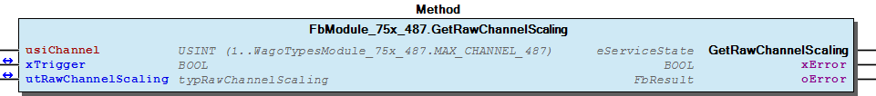
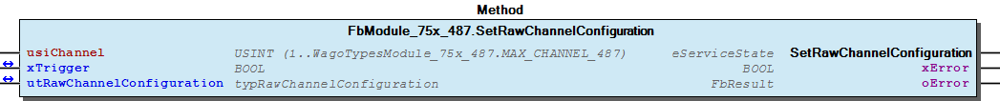
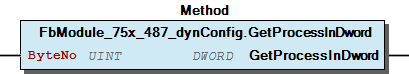
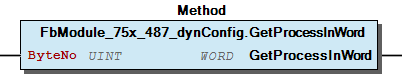
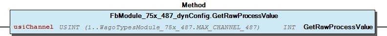

# WagoSysModule_75x_487 v1.9.9.0 (WAGO) - Complete Documentation


## 📋 Library Information

- **Company:** WAGO
- **Title:** WagoSysModule_75x_487
- **Version:** 1.9.9.0
- **Categories:** WAGO LayerView|Sys; Application
- **Author:** WAGO
- **Placeholder:** WagoSysModule_75x_487

### Description ¶


This document is automatically generated. Because of this, the chapter 30 Visualization is not shown in this document. If you are interested in getting to know more about visualization, we refer to the library manager of e!Cockpit.

Handling modules 750-487 [1]

This document is automatically generated. Because of this, the chapter 30 Visualization is not shown in this document. If you are interested in getting to know more about visualization, we refer to the library manager of e!Cockpit. Handling modules 750-487 [1]

### Contents: ¶


Contents: - Documentation Index - Project Information - Library Information - Function Blocks FbModule_75x_487 (FB) - FbModule_75x_487_dynConfig (FB) Methods - FbModule_75x_487.GetRawChannelConfiguration (METH) - FbModule_75x_487.GetRawChannelScaling (METH) - FbModule_75x_487.GetRawChannelSettings (METH) - FbModule_75x_487.SetRawChannelConfiguration (METH) - FbModule_75x_487.SetRawChannelScaling (METH) - FbModule_75x_487.SetRawChannelSettings (METH) - FbModule_75x_487_dynConfig.GetModuleInputSize (METH) - FbModule_75x_487_dynConfig.GetProcessInBit (METH) - FbModule_75x_487_dynConfig.GetProcessInByte (METH) - FbModule_75x_487_dynConfig.GetProcessInData (METH) - ... and 3 more Program Organization Global Variable Lists - Error_487 (GVL) - VersionHistory (GVL) Other Components - 80 Status - Channel - I_ModuleProcessInputsExtended - I_Module_75x_487 - eError_487 (ENUM)

### Indices and tables ¶


| [1] | Based on WagoSysModule_75x_487.library, last modified 19.06.2020, 17:40:26. The content of this file was automatically generated with None on 19.06.2020, 17:40:30 |

© WAGO Kontakttechnik GmbH & Co. KG, Germany 2018 – All rights reserved. For the avoidance of doubt, this copyright notice does not only apply to the information above but also and primarily to the described library itself. Please note that third-party products are always mentioned without reference to intellectual property rights, including patents, utility models, designs and trademarks, accordingly the existence of such rights cannot be excluded. WAGO is a registered trademark of WAGO Verwaltungsgesellschaft mbH.

- File and Project Information - Library Reference © WAGO Kontakttechnik GmbH & Co. KG, Germany 2018 – All rights reserved. For the avoidance of doubt, this copyright notice does not only apply to the information above but also and primarily to the described library itself. Please note that third-party products are always mentioned without reference to intellectual property rights, including patents, utility models, designs and trademarks, accordingly the existence of such rights cannot be excluded. WAGO is a registered trademark of WAGO Verwaltungsgesellschaft mbH.

### Documentation Index


## WagoSysModule_75x_487 Library Documentation


| Company: | WAGO |
| Title: | WagoSysModule_75x_487 |
| Version: | 1.9.9.0 |
| Categories: | WAGO LayerView\|Sys; Application |
| Author: | WAGO |
| Placeholder: | WagoSysModule_75x_487 |

### Description


This document is automatically generated. Because of this, the chapter 30 Visualization is not shown in this document. If you are interested in getting to know more about visualization, we refer to the library manager of e!Cockpit.

Handling modules 750-487 [1]

This document is automatically generated. Because of this, the chapter 30 Visualization is not shown in this document. If you are interested in getting to know more about visualization, we refer to the library manager of e!Cockpit. Handling modules 750-487 [1]

### Contents:


- 20 Program Organization Units FbModule_75x_487 (FB) - FbModule_75x_487_dynConfig (FB) 80 Status - Error_487 (GVL) - eError_487 (ENUM) VersionHistory (GVL)

### Indices and tables


| [1] | Based on WagoSysModule_75x_487.library, last modified 19.06.2020, 17:40:26. The content of this file was automatically generated with None on 19.06.2020, 17:40:30 |

© WAGO Kontakttechnik GmbH & Co. KG, Germany 2018 – All rights reserved. For the avoidance of doubt, this copyright notice does not only apply to the information above but also and primarily to the described library itself. Please note that third-party products are always mentioned without reference to intellectual property rights, including patents, utility models, designs and trademarks, accordingly the existence of such rights cannot be excluded. WAGO is a registered trademark of WAGO Verwaltungsgesellschaft mbH.

- File and Project Information - Library Reference © WAGO Kontakttechnik GmbH & Co. KG, Germany 2018 – All rights reserved. For the avoidance of doubt, this copyright notice does not only apply to the information above but also and primarily to the described library itself. Please note that third-party products are always mentioned without reference to intellectual property rights, including patents, utility models, designs and trademarks, accordingly the existence of such rights cannot be excluded. WAGO is a registered trademark of WAGO Verwaltungsgesellschaft mbH.

### Project Information


## File and Project Information


| Scope | Name | Type | Content |
| --- | --- | --- | --- |
| FileHeader | libraryFile | string | WagoSysModule_75x_487.library |
| contentFile | WagoSysModule_75x_487_clr.json |
| productName | e!COCKPIT |
| creationDateTime | date | 19.06.2020, 17:40:30 |
| companyName | string | WAGO |
| ProjectInformation | LastModificationDateTime | date | 19.06.2020, 17:40:26 |
| Description | string | See: Description |
| Copyright | © WAGO Kontakttechnik GmbH & Co. KG, Germany 2018 – All rights reserved. |
| Author | WAGO |
| AutoResolveUnbound | bool | True |
| Placeholder | string | WagoSysModule_75x_487 |
| Company | WAGO |
| DocFormat | reStructuredText |
| Project | WagoSysModule_75x_487 |
| Version | version | 1.9.9.0 |
| ActivateSigning | bool | False |
| Title | string | WagoSysModule_75x_487 |
| LibraryCategories | library-category-list | WAGO LayerView\|Sys; Application |
| Version string | string |  |

### Library Information


## Library Reference


| LinkAllContent: False QualifiedOnly: False | SystemLibrary: False | Optional: False |

| LinkAllContent: False QualifiedOnly: False | SystemLibrary: False | Optional: False |

| LinkAllContent: False QualifiedOnly: False | SystemLibrary: False | Optional: False |

| LinkAllContent: False Optional: False | QualifiedOnly: False SystemLibrary: False | PublishSymbolsInContainer: True |

| LinkAllContent: False Optional: False | QualifiedOnly: True SystemLibrary: False | PublishSymbolsInContainer: True |

| LinkAllContent: False QualifiedOnly: True | SystemLibrary: False PublishSymbolsInContainer: True | Optional: False |

| LinkAllContent: False Optional: False | QualifiedOnly: True SystemLibrary: False | PublishSymbolsInContainer: True |

This is a dictionary of all referenced libraries and their name spaces.

This is a dictionary of all referenced libraries and their name spaces. WagoSysErrorBase Library Identification : Placeholder: WagoSysErrorBase Default Resolution: WagoSysErrorBase, * (WAGO) Namespace: WagoSysErrorBase Library Properties : WagoSysModuleBaseProtected Library Identification : Placeholder: WagoSysModuleBaseProtected Default Resolution: WagoSysModuleBaseProtected, * (WAGO) Namespace: WagoSysModuleBaseProtected Library Properties : Library Parameter : Parameter: REGISTER_COM_TIMEOUT = TIME#5s0ms Parameter: PARAMETER_COM_TIMEOUT = TIME#5s0ms WagoSysVersion Library Identification : Name: WagoSysVersion Version: 1.0.0.0 Company: WAGO Namespace: WagoSysVersion Library Properties : WagoTypesBusServices Library Identification : Placeholder: WagoTypesBusServices Default Resolution: WagoTypesBusServices, * (WAGO) Namespace: WagoTypesBusServices Library Properties : WagoTypesCommon Library Identification : Placeholder: WagoTypesCommon Default Resolution: WagoTypesCommon, * (WAGO) Namespace: WagoTypes Library Properties : WagoTypesModuleBase Library Identification : Placeholder: WagoTypesModuleBase Default Resolution: WagoTypesModuleBase, * (WAGO) Namespace: WagoTypesModuleBase Library Properties : Library Parameter : Parameter: MAX_MBX_SIZE = 18 WagoTypesModule_75x_487 Library Identification : Placeholder: WagoTypesModule_75x_487 Default Resolution: WagoTypesModule_75x_487, * (WAGO) Namespace: WagoTypesModule_75x_487 Library Properties :

### Function Blocks


## FbModule_75x_487 (FB)


| Scope | Name | Type | Inherited from |
| --- | --- | --- | --- |
| Output | oError | WagoSysErrorBase.FbResult | FbModuleBase |

Access to the module 750-451

Function description

This block is needed for each module. The instance of this function block is either automatically generated by the K-Bus configuration or has to be manually added in case of the dynamic configuration.

Interface variables Function Access to the module 750-451 Function description This block is needed for each module. The instance of this function block is either automatically generated by the K-Bus configuration or has to be manually added in case of the dynamic configuration. - I_Module_75x_487 Channel FbModule_75x_487.GetRawChannelScaling (METH) - FbModule_75x_487.GetRawChannelSettings (METH) - FbModule_75x_487.SetRawChannelScaling (METH) - FbModule_75x_487.SetRawChannelSettings (METH) FbModule_75x_487.GetRawChannelConfiguration (METH) FbModule_75x_487.SetRawChannelConfiguration (METH)

## FbModule_75x_487_dynConfig (FB)


| Scope | Name | Type | Inherited from |
| --- | --- | --- | --- |
| Output | oError | WagoSysErrorBase.FbResult | FbModuleBase |

Function description

Interface variables Function Access to the module 750-464 with PA-Access In case of dynamic configuration the FB provides additional the PA-Access. Function description This block is needed for each module. The instance of this function block has to be manually added in case of the dynamic configuration. - FbModule_75x_487_dynConfig.GetRawProcessValue (METH) - I_ModuleProcessInputsExtended FbModule_75x_487_dynConfig.GetModuleInputSize (METH) - FbModule_75x_487_dynConfig.GetProcessInBit (METH) - FbModule_75x_487_dynConfig.GetProcessInByte (METH) - FbModule_75x_487_dynConfig.GetProcessInData (METH) - FbModule_75x_487_dynConfig.GetProcessInDword (METH) - FbModule_75x_487_dynConfig.GetProcessInWord (METH)

### Methods


## FbModule_75x_487.GetRawChannelConfiguration (METH)


| Scope | Name | Type |
| --- | --- | --- |
| Return | GetRawChannelConfiguration | WagoTypesModuleBase.eServiceState |
| Input | usiChannel | USINT (1..WagoTypesModule_75x_487.MAX_CHANNEL_487) |
| Inout | xTrigger | BOOL |
| utRawChannelConfiguration | WagoTypesModule_75x_487.typRawChannelConfiguration |
| Output | xError | BOOL |
| oError | WagoSysErrorBase.FbResult |

| Struct member | Value | Description |
| --- | --- | --- |
| Settings | eSensorType | TC_Typ_L | -25 °C...900 °C |
| TC_Typ_K | -100 °C...1370 °C |
| TC_Typ_J | -100 °C...1200 °C |
| TC_Typ_E | -100 °C...1000 °C |
| TC_Typ_T | -100 °C...400 °C |
| TC_Typ_N | -100 °C...1300 °C |
| TC_Typ_U | -25 °C...600 °C |
| TC_Typ_B | 600 °C...1800 °C |
| TC_Typ_R | 0 °C...1700 °C |
| TC_Typ_S | 0 °C...1700 °C |
| PlusMinus_30mV | +/- 30mV |
| PlusMinus_60mV | +/- 60mV |
| PlusMinus_120mV | +/- 120mV |
| eNotchFilter | ENABLED_25HZ | 25Hz -> 640ms |
| ENABLED_50HZ | 50Hz -> 320ms |
| ENABLED_100HZ | 100Hz -> 160ms |
| ENABLED_200HZ | 200Hz -> 80ms |
| xEnableCheckLowerRange | FALSE | State bit 0 is not set on measuring value underrange |
| TRUE | State bit 0 is set on measuring value underrange |
| xEnableStatusBits | FALSE | State bits are not mapped |
| TRUE | State bits are mapped to the lower three bits of the output value: |
| xEnableWatchdog | FALSE | Watchdog disabled |
| TRUE | Watchdog enabled |
| xAmountSignFormat | FALSE | Numeric values appear in two’s complement |
| TRUE | Numeric values appear in amount / sign format |
| xEnableColdJunctionComp | FALSE | Cold junction compensation not active |
| TRUE | Cold junction compensation active |
| xEnableWireBreakDetection | FALSE | CWire break detection not active |
| TRUE | Wire break detection active |
| Scaling | xManufacturerScaling | FALSE | Manufacturer Scaling disabled |
| TRUE | Manufacturer Scaling enabled |
| xUserScaling | FALSE | User Scaling disabled |
| TRUE | User Scaling enabled |
| iUserScalingOffset | -32768 ... 32767 | User Scaling Offset |
| iUserScalingGain | -32768 ... 32767 | User Scaling Gain |

```
VAR
    //--- Channel Configuration ---------------------------------
    utRawChannelConfiguration   :   WagoTypesModule_75x_487.typRawChannelConfiguration;
    xGetRawChannelConfiguration :   BOOL;
    oError                      :   WagoSysErrorBase.FbResult;
END_VAR

//--- C H A N N E L    C O N F I G U R A T I O N -----------------------
CASE my487.GetRawChannelConfiguration(  usiChannel                  := 1,
                                        xTrigger                    := xGetRawChannelConfiguration,
                                        utRawChannelConfiguration   := utRawChannelConfiguration,
                                        oError                      => oError
                                    ) OF

    eServiceState.DONE : // OK
            ;// process here your utChannelConfiguration

    eServiceState.ABORT : // Error
            ;// process here your error handling -> see oError for more information

END_CASE
```

Get the complete raw configuration of a channel.

WagoTypesModule_75x_487.typRawChannelConfiguration

Graphical Illustration

Graphical Interface of FbModule_75x_487.GetRawChannelConfiguration

For get the configuration from channel one

You have to call the method cyclic until the method returns with DONE or ABORT.

Interface variables Function Get the complete raw configuration of a channel. WagoTypesModule_75x_487.typRawChannelConfiguration Graphical Illustration  Graphical Interface of FbModule_75x_487.GetRawChannelConfiguration Example For get the configuration from channel one Note You have to call the method cyclic until the method returns with DONE or ABORT.

## FbModule_75x_487.GetRawChannelScaling (METH)


| Scope | Name | Type |
| --- | --- | --- |
| Return | GetRawChannelScaling | WagoTypesModuleBase.eServiceState |
| Input | usiChannel | USINT (1..WagoTypesModule_75x_487.MAX_CHANNEL_487) |
| Inout | xTrigger | BOOL |
| utRawChannelScaling | WagoTypesModule_75x_487.typRawChannelScaling |
| Output | xError | BOOL |
| oError | WagoSysErrorBase.FbResult |

| Struct member | Value | Description |
| --- | --- | --- |
| xManufacturerScaling | FALSE | Manufacturer Scaling disabled |
| TRUE | Manufacturer Scaling enabled |
| xUserScaling | FALSE | User Scaling disabled |
| TRUE | User Scaling enabled |
| iUserScalingOffset | -32768 ... 32767 | User Scaling Offset |
| iUserScalingGain | -32768 ... 32767 | User Scaling Gain |

```
VAR
    //--- Channel Settings ---------------------------------
    utChannelScaling    :   WagoTypesModule_75x_487.typRawChannelScaling;
    xGetChannelScaling  :   BOOL;
    oError              :   WagoSysErrorBase.FbResult;
END_VAR

//--- C H A N N E L   S C A L I N G ------------------------
CASE my487.GetRawChannelScaling(    usiChannel           := 1,
                                    xTrigger             := xGetChannelScaling,
                                    utRawChannelScaling  := utChannelScaling,
                                    oError               => oError
                                ) OF

    eServiceState.DONE : // OK
            ;// process here your utModuleSettings

    eServiceState.ABORT : // Error
            ;// process here your error handling -> see oError for more information

END_CASE
```

Get the scaling of a channel at a struct.

WagoTypesModule_75x_487.typRawChannelScaling

Graphical Illustration

Graphical Interface of FbModule_75x_487.GetRawChannelScaling

For get the scaling from channel one

You have to call the method cyclic until the method returns with DONE or ABORT.

Interface variables Function Get the scaling of a channel at a struct. WagoTypesModule_75x_487.typRawChannelScaling Graphical Illustration  Graphical Interface of FbModule_75x_487.GetRawChannelScaling Example For get the scaling from channel one Note You have to call the method cyclic until the method returns with DONE or ABORT.

## FbModule_75x_487.GetRawChannelSettings (METH)


| Scope | Name | Type |
| --- | --- | --- |
| Return | GetRawChannelSettings | WagoTypesModuleBase.eServiceState |
| Input | usiChannel | USINT (1..WagoTypesModule_75x_487.MAX_CHANNEL_487) |
| Inout | xTrigger | BOOL |
| utRawChannelSettings | WagoTypesModule_75x_487.typRawChannelSettings |
| Output | xError | BOOL |
| oError | WagoSysErrorBase.FbResult |

| Struct member | Value | Description |
| --- | --- | --- |
| eSensorType | TC_Typ_L | -25 °C...900 °C |
| TC_Typ_K | -100 °C...1370 °C |
| TC_Typ_J | -100 °C...1200 °C |
| TC_Typ_E | -100 °C...1000 °C |
| TC_Typ_T | -100 °C...400 °C |
| TC_Typ_N | -100 °C...1300 °C |
| TC_Typ_U | -25 °C...600 °C |
| TC_Typ_B | 600 °C...1800 °C |
| TC_Typ_R | 0 °C...1700 °C |
| TC_Typ_S | 0 °C...1700 °C |
| PlusMinus_30mV | +/- 30mV |
| PlusMinus_60mV | +/- 60mV |
| PlusMinus_120mV | +/- 120mV |
| eNotchFilter | ENABLED_25HZ | 25Hz -> 640ms |
| ENABLED_50HZ | 50Hz -> 320ms |
| ENABLED_100HZ | 100Hz -> 160ms |
| ENABLED_200HZ | 200Hz -> 80ms |
| xEnableCheckLowerRange | FALSE | State bit 0 is not set on measuring value underrange |
| TRUE | State bit 0 is set on measuring value underrange |
| xEnableStatusBits | FALSE | State bits are not mapped |
| TRUE | State bits are mapped to the lower three bits of the output value: |
| xEnableWatchdog | FALSE | Watchdog disabled |
| TRUE | Watchdog enabled |
| xAmountSignFormat | FALSE | Numeric values appear in two’s complement |
| TRUE | Numeric values appear in amount / sign format |
| xEnableColdJunctionComp | FALSE | Cold junction compensation not active |
| TRUE | Cold junction compensation active |
| xEnableWireBreakDetection | FALSE | CWire break detection not active |
| TRUE | Wire break detection active |

```
VAR
    //--- Channel Settings ---------------------------------
    utChannelSettings   :   WagoTypesModule_75x_487.typRawChannelSettings;
    xGetChannelSettings :   BOOL;
    oError              :   WagoSysErrorBase.FbResult;
END_VAR

//--- C H A N N E L   S E T T I N G S ----------------------
CASE my487.GetRawChannelSettings(   usiChannel           := 1,
                                    xTrigger             := xGetChannelSettings,
                                    utRawChannelSettings := utChannelSettings,
                                    oError               => oError
                                ) OF

    eServiceState.DONE : // OK
        ;// process here your utModuleSettings

    eServiceState.ABORT : // Error
        ;// process here your error handling -> see oError for more information

END_CASE
```

Get the settings of a channel at a struct.

WagoTypesModule_75x_487.typRawChannelSettings

Graphical Illustration

Graphical Interface of FbModule_75x_487.GetRawChannelSettings

For get the settings from channel one

You have to call the method cyclic until the method returns with DONE or ABORT.

Interface variables Function Get the settings of a channel at a struct. WagoTypesModule_75x_487.typRawChannelSettings Graphical Illustration  Graphical Interface of FbModule_75x_487.GetRawChannelSettings Example For get the settings from channel one Note You have to call the method cyclic until the method returns with DONE or ABORT.

## FbModule_75x_487.SetRawChannelConfiguration (METH)


| Scope | Name | Type |
| --- | --- | --- |
| Return | SetRawChannelConfiguration | WagoTypesModuleBase.eServiceState |
| Input | usiChannel | USINT (1..WagoTypesModule_75x_487.MAX_CHANNEL_487) |
| Inout | xTrigger | BOOL |
| utRawChannelConfiguration | WagoTypesModule_75x_487.typRawChannelConfiguration |
| Output | xError | BOOL |
| oError | WagoSysErrorBase.FbResult |

| Struct member | Value | Description |
| --- | --- | --- |
| Settings | eSensorType | TC_Typ_L | -25 °C...900 °C |
| TC_Typ_K | -100 °C...1370 °C |
| TC_Typ_J | -100 °C...1200 °C |
| TC_Typ_E | -100 °C...1000 °C |
| TC_Typ_T | -100 °C...400 °C |
| TC_Typ_N | -100 °C...1300 °C |
| TC_Typ_U | -25 °C...600 °C |
| TC_Typ_B | 600 °C...1800 °C |
| TC_Typ_R | 0 °C...1700 °C |
| TC_Typ_S | 0 °C...1700 °C |
| PlusMinus_30mV | +/- 30mV |
| PlusMinus_60mV | +/- 60mV |
| PlusMinus_120mV | +/- 120mV |
| eNotchFilter | ENABLED_25HZ | 25Hz -> 640ms |
| ENABLED_50HZ | 50Hz -> 320ms |
| ENABLED_100HZ | 100Hz -> 160ms |
| ENABLED_200HZ | 200Hz -> 80ms |
| xEnableCheckLowerRange | FALSE | State bit 0 is not set on measuring value underrange |
| TRUE | State bit 0 is set on measuring value underrange |
| xEnableStatusBits | FALSE | State bits are not mapped |
| TRUE | State bits are mapped to the lower three bits of the output value: |
| xEnableWatchdog | FALSE | Watchdog disabled |
| TRUE | Watchdog enabled |
| xAmountSignFormat | FALSE | Numeric values appear in two’s complement |
| TRUE | Numeric values appear in amount / sign format |
| xEnableColdJunctionComp | FALSE | Cold junction compensation not active |
| TRUE | Cold junction compensation active |
| xEnableWireBreakDetection | FALSE | CWire break detection not active |
| TRUE | Wire break detection active |
| Scaling | xManufacturerScaling | FALSE | Manufacturer Scaling disabled |
| TRUE | Manufacturer Scaling enabled |
| xUserScaling | FALSE | User Scaling disabled |
| TRUE | User Scaling enabled |
| iUserScalingOffset | -32768 ... 32767 | User Scaling Offset |
| iUserScalingGain | -32768 ... 32767 | User Scaling Gain |

```
VAR
    //--- Channel Configuration -------------------------------------------------------
    xStartProcess               :   BOOL; // set this variable once to start the process -> this varibale will be automatic reset
    utRawChannelConfiguration   :   WagoTypesModule_75x_487.typRawChannelConfiguration;
    oError                      :   WagoSysErrorBase.FbResult;
    xSetRawChannelConfiguration :   BOOL;
END_VAR

//--- C H A N N E L    C O N F I G U R A T I O N -----------------------
//--- READ BEFORE WRITE --------------------------------------------------------------
CASE my487.GetRawChannelConfiguration( 1, xStartProcess, utRawChannelConfiguration, oError => oError) OF

    eServiceState.DONE : // OK -> actual configuration is successful read
        // change here your configuration
        // utRawChannelConfiguration... :=
        xSetRawChannelConfiguration := TRUE; // trigger write

    eServiceState.ABORT : // Error -> not able to read -> see oError
            ;// process here your error handling for read -> see oError for more information

END_CASE

//--- WRITE MODYFIED CONFIGURATION ---------------------------------------------------
CASE my487.SetRawChannelConfiguration( 1, xSetRawChannelConfiguration, utRawChannelConfiguration, oError => oError) OF

    eServiceState.DONE : // OK -> new configuration is written

    eServiceState.ABORT : // Error -> not able to write -> see oError
            ;// process here your error handling for write -> see oError for more information

END_CASE
```

Set the complete raw configuration of a channel.

WagoTypesModule_75x_487.typRawChannelConfiguration

Graphical Illustration

Graphical Interface of FbModule_75x_487.SetRawChannelConfiguration

For get the configuration from channel one and after read write the configuration

You have to call the method cyclic until the method returns with DONE or ABORT.

Interface variables Function Set the complete raw configuration of a channel. WagoTypesModule_75x_487.typRawChannelConfiguration Graphical Illustration  Graphical Interface of FbModule_75x_487.SetRawChannelConfiguration Example For get the configuration from channel one and after read write the configuration Note You have to call the method cyclic until the method returns with DONE or ABORT.

## FbModule_75x_487.SetRawChannelScaling (METH)


| Scope | Name | Type |
| --- | --- | --- |
| Return | SetRawChannelScaling | WagoTypesModuleBase.eServiceState |
| Input | usiChannel | USINT (1..WagoTypesModule_75x_487.MAX_CHANNEL_487) |
| Inout | xTrigger | BOOL |
| utRawChannelScaling | WagoTypesModule_75x_487.typRawChannelScaling |
| Output | xError | BOOL |
| oError | WagoSysErrorBase.FbResult |

| Struct member | Value | Description |
| --- | --- | --- |
| xManufacturerScaling | FALSE | Manufacturer Scaling disabled |
| TRUE | Manufacturer Scaling enabled |
| xUserScaling | FALSE | User Scaling disabled |
| TRUE | User Scaling enabled |
| iUserScalingOffset | -32768 ... 32767 | User Scaling Offset |
| iUserScalingGain | -32768 ... 32767 | User Scaling Gain |

```
VAR
    //--- Channel Settings ---------------------------------
    utChannelScaling    :   WagoTypesModule_75x_487.typRawChannelScaling;
    xSetChannelScaling  :   BOOL;
    oError              :   WagoSysErrorBase.FbResult;
END_VAR

//--- C H A N N E L   S C A L I N G ------------------------
CASE my487.SetRawChannelScaling(    usiChannel          := 1,
                                    xTrigger            := xSetChannelScaling,
                                    utRawChannelScaling := utChannelScaling,
                                    oError              => oError
                                ) OF

    eServiceState.DONE : // OK
            ;// process here your utModuleSettings

    eServiceState.ABORT : // Error
            ;// process here your error handling -> see oError for more information

END_CASE
```

Set the scaling of a channel by a struct.

WagoTypesModule_75x_487.typRawChannelScaling

Graphical Illustration

Graphical Interface of FbModule_75x_487.SetRawChannelScaling

For set the scaling of channel one

You have to call the method cyclic until the method returns with DONE or ABORT.

Interface variables Function Set the scaling of a channel by a struct. WagoTypesModule_75x_487.typRawChannelScaling Graphical Illustration  Graphical Interface of FbModule_75x_487.SetRawChannelScaling Example For set the scaling of channel one Note You have to call the method cyclic until the method returns with DONE or ABORT.

## FbModule_75x_487.SetRawChannelSettings (METH)


| Scope | Name | Type |
| --- | --- | --- |
| Return | SetRawChannelSettings | WagoTypesModuleBase.eServiceState |
| Input | usiChannel | USINT (1..WagoTypesModule_75x_487.MAX_CHANNEL_487) |
| Inout | xTrigger | BOOL |
| utRawChannelSettings | WagoTypesModule_75x_487.typRawChannelSettings |
| Output | xError | BOOL |
| oError | WagoSysErrorBase.FbResult |

| Struct member | Value | Description |
| --- | --- | --- |
| eSensorType | TC_Typ_L | -25 °C...900 °C |
| TC_Typ_K | -100 °C...1370 °C |
| TC_Typ_J | -100 °C...1200 °C |
| TC_Typ_E | -100 °C...1000 °C |
| TC_Typ_T | -100 °C...400 °C |
| TC_Typ_N | -100 °C...1300 °C |
| TC_Typ_U | -25 °C...600 °C |
| TC_Typ_B | 600 °C...1800 °C |
| TC_Typ_R | 0 °C...1700 °C |
| TC_Typ_S | 0 °C...1700 °C |
| PlusMinus_30mV | +/- 30mV |
| PlusMinus_60mV | +/- 60mV |
| PlusMinus_120mV | +/- 120mV |
| eNotchFilter | ENABLED_25HZ | 25Hz -> 640ms |
| ENABLED_50HZ | 50Hz -> 320ms |
| ENABLED_100HZ | 100Hz -> 160ms |
| ENABLED_200HZ | 200Hz -> 80ms |
| xEnableCheckLowerRange | FALSE | State bit 0 is not set on measuring value underrange |
| TRUE | State bit 0 is set on measuring value underrange |
| xEnableStatusBits | FALSE | State bits are not mapped |
| TRUE | State bits are mapped to the lower three bits of the output value: |
| xEnableWatchdog | FALSE | Watchdog disabled |
| TRUE | Watchdog enabled |
| xAmountSignFormat | FALSE | Numeric values appear in two’s complement |
| TRUE | Numeric values appear in amount / sign format |
| xEnableColdJunctionComp | FALSE | Cold junction compensation not active |
| TRUE | Cold junction compensation active |
| xEnableWireBreakDetection | FALSE | CWire break detection not active |
| TRUE | Wire break detection active |

```
VAR
    //--- Channel Settings ---------------------------------
    utChannelSettings   :   WagoTypesModule_75x_487.typRawChannelSettings;
    xSetChannelSettings :   BOOL;
    oError              :   WagoSysErrorBase.FbResult;
END_VAR

//--- C H A N N E L   S E T T I N G S ----------------------
CASE my487.SetRawChannelSettings(   usiChannel           := 1,
                                    xTrigger             := xSetChannelSettings,
                                    utRawChannelSettings := utChannelSettings,
                                    oError               => oError
                                ) OF

    eServiceState.DONE : // OK
        ;// process here your utModuleSettings

    eServiceState.ABORT : // Error
        ;// process here your error handling -> see oError for more information

END_CASE
```

Set the settings for a channel by a struct.

WagoTypesModule_75x_487.typRawChannelSettings

Graphical Illustration

Graphical Interface of FbModule_75x_487.SetRawChannelSettings

For set the settings of channel one

You have to call the method cyclic until the method returns with DONE or ABORT.

Interface variables Function Set the settings for a channel by a struct. WagoTypesModule_75x_487.typRawChannelSettings Graphical Illustration  Graphical Interface of FbModule_75x_487.SetRawChannelSettings Example For set the settings of channel one Note You have to call the method cyclic until the method returns with DONE or ABORT.

## FbModule_75x_487_dynConfig.GetModuleInputSize (METH)


| Scope | Name | Type |
| --- | --- | --- |
| Return | GetModuleInputSize | UINT |

Returns the byte size of input data

Interface variables Returns the byte size of input data

## FbModule_75x_487_dynConfig.GetProcessInBit (METH)


| Scope | Name | Type | Comment |
| --- | --- | --- | --- |
| Return | GetProcessInBit | BOOL |  |
| Input | ByteNo | UINT | range 0..(_uiInputSize - 1) |
| BitNo | USINT | range 0..7 |

## FbModule_75x_487_dynConfig.GetProcessInByte (METH)


| Scope | Name | Type | Comment |
| --- | --- | --- | --- |
| Return | GetProcessInByte | BYTE |  |
| Input | ByteNo | UINT | range 0..(_uiInputSize - 1) |

## FbModule_75x_487_dynConfig.GetProcessInData (METH)


| Scope | Name | Type | Comment |
| --- | --- | --- | --- |
| Return | GetProcessInData | UINT |  |
| Input | pInData | POINTER TO BYTE | pointer to the area where the process data should store |
| uiNInData | UINT | SIZEOF(Buffer) |

## FbModule_75x_487_dynConfig.GetProcessInDword (METH)


| Scope | Name | Type | Comment |
| --- | --- | --- | --- |
| Return | GetProcessInDword | DWORD |  |
| Input | ByteNo | UINT | range 0..(_uiInputSize - 4) |

Graphical Illustration

Graphical Interface of FbModule_75x_487_dynConfig.GetProcessInDword

Interface variables Function Get the process input dword specified by ByteNo of this module. Graphical Illustration  Graphical Interface of FbModule_75x_487_dynConfig.GetProcessInDword

## FbModule_75x_487_dynConfig.GetProcessInWord (METH)


| Scope | Name | Type | Comment |
| --- | --- | --- | --- |
| Return | GetProcessInWord | WORD |  |
| Input | ByteNo | UINT | range 0..(_uiInputSize - 2) |

Graphical Illustration

Graphical Interface of FbModule_75x_487_dynConfig.GetProcessInWord

Interface variables Function Get the process input word specified by ByteNo of this module. Graphical Illustration  Graphical Interface of FbModule_75x_487_dynConfig.GetProcessInWord

## FbModule_75x_487_dynConfig.GetRawProcessValue (METH)


| Scope | Name | Type |
| --- | --- | --- |
| Return | GetRawProcessValue | INT |
| Input | usiChannel | USINT (1..WagoTypesModule_75x_487.MAX_CHANNEL_487) |

```
VAR
    myiRawProcessValue  :   INT;
END_VAR

myiRawProcessValue := my487.GetRawProcessValue(1); // here is the process raw value as INT
```

Get the raw process value of the wanted channel.

In case of error (e.g. an invalid channel number is given) it returns -32768.

Graphical Illustration

Graphical Interface of FbModule_75x_487_dynConfig.GetRawProcessValue

For get the raw process value from first channel of the module.

Interface variables Function Get the raw process value of the wanted channel. In case of error (e.g. an invalid channel number is given) it returns -32768. Graphical Illustration  Graphical Interface of FbModule_75x_487_dynConfig.GetRawProcessValue Example For get the raw process value from first channel of the module.

### Program Organization


## 20 Program Organization Units


- FbModule_75x_487 (FB) I_Module_75x_487 Channel FbModule_75x_487.GetRawChannelScaling (METH) - FbModule_75x_487.GetRawChannelSettings (METH) - FbModule_75x_487.SetRawChannelScaling (METH) - FbModule_75x_487.SetRawChannelSettings (METH) FbModule_75x_487.GetRawChannelConfiguration (METH) FbModule_75x_487.SetRawChannelConfiguration (METH) FbModule_75x_487_dynConfig (FB) - FbModule_75x_487_dynConfig.GetRawProcessValue (METH) - I_ModuleProcessInputsExtended FbModule_75x_487_dynConfig.GetModuleInputSize (METH) - FbModule_75x_487_dynConfig.GetProcessInBit (METH) - FbModule_75x_487_dynConfig.GetProcessInByte (METH) - FbModule_75x_487_dynConfig.GetProcessInData (METH) - FbModule_75x_487_dynConfig.GetProcessInDword (METH) - FbModule_75x_487_dynConfig.GetProcessInWord (METH)

### Global Variable Lists


## Error_487 (GVL)


| Scope | Name | Type |
| --- | --- | --- |
| Constant | ERROR_487 | ARRAY [0..3] OF WagoTypesErrorBase.typResultItem |

| Value | Level | Description |
| --- | --- | --- |
| eError_487.OK | WagoTypesErrorBase.eSeverity.none | ‘OK’ |
| eError_487.INVALID_CHANNEL | WagoTypesErrorBase.eSeverity.error | ‘The wanted channel number is not allowed’ |
| eError_487.UNKNOWN_SENSOR_TYPE | WagoTypesErrorBase.eSeverity.error | ‘Not supported sensor type’ |
| eError_487.UNKNOWN_NOTCH_FILTER | WagoTypesErrorBase.eSeverity.error | ‘Not supported notch filter’ |

## VersionHistory (GVL)


| Name | Type |
| --- | --- |
| Info | ProjectInfo |

| date | version | author | change |
| 05.06.2020 | 1.9.9.0 | u010545 | change to WagoSysModuleBaseProtected 1.9.9.0 |
| 30.08.2019 | 1.9.4.1 | u010545 | Bugfix Byteorder I_ModuleProcessInputsExtended |
| 06.08.2019 | 1.9.4.0 | u010545 | Interface for dyn config pa access added |
| 16.07.2019 | 1.9.3.0 | u010545 | Interface for dyn config added |
| 08.01.2019 | 1.9.2.0 | u015842 | Properties: free placeholder added |
| 23.04.2018 | 1.9.1.3 | u010545 | update documentation |
| 21.02.2018 | 1.9.1.2 | u010545 | update documentation |
| 03.01.2018 | 1.9.1.1 | u010545 | bugfix |
| 01.12.2017 | 1.9.1.0 | u010545 | check for ordernumber implemented |
| 17.10.2017 | 1.9.0.0 | u010545 | first release |
| 09.10.2017 | 0.0.0.1 | u010545 | Init |

WagoSysModule_75x_487.library

Release Notes:

WagoSysModule_75x_487.library Release Notes:

### Other Components


## 80 Status ¶


- Error_487 (GVL) - eError_487 (ENUM)

## Channel


- FbModule_75x_487.GetRawChannelScaling (METH) - FbModule_75x_487.GetRawChannelSettings (METH) - FbModule_75x_487.SetRawChannelScaling (METH) - FbModule_75x_487.SetRawChannelSettings (METH)

## I_ModuleProcessInputsExtended


- FbModule_75x_487_dynConfig.GetModuleInputSize (METH) - FbModule_75x_487_dynConfig.GetProcessInBit (METH) - FbModule_75x_487_dynConfig.GetProcessInByte (METH) - FbModule_75x_487_dynConfig.GetProcessInData (METH) - FbModule_75x_487_dynConfig.GetProcessInDword (METH) - FbModule_75x_487_dynConfig.GetProcessInWord (METH)

## I_Module_75x_487


- Channel FbModule_75x_487.GetRawChannelScaling (METH) - FbModule_75x_487.GetRawChannelSettings (METH) - FbModule_75x_487.SetRawChannelScaling (METH) - FbModule_75x_487.SetRawChannelSettings (METH) FbModule_75x_487.GetRawChannelConfiguration (METH) FbModule_75x_487.SetRawChannelConfiguration (METH)

## eError_487 (ENUM)


| Name | Initial | Comment |
| --- | --- | --- |
| OK | 0 | all is well |
| INVALID_CHANNEL | 1 | invalid channel number |
| UNKNOWN_SENSOR_TYPE | 2 |  |
| UNKNOWN_NOTCH_FILTER | 3 |  |