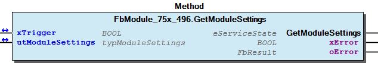
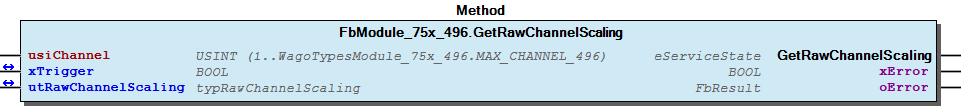
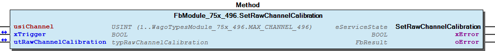
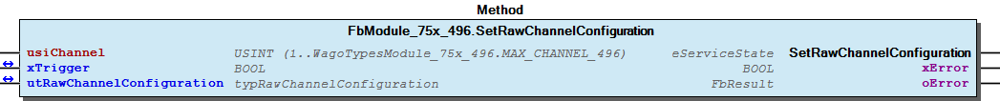
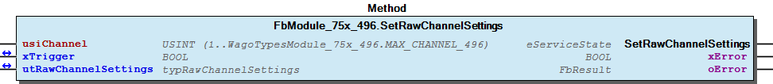
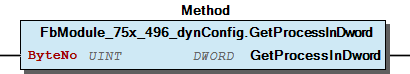
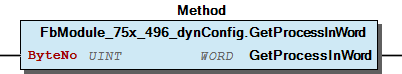
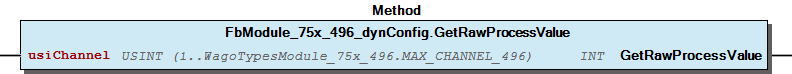

# WagoSysModule_75x_496 v1.9.4.3 (WAGO) - Complete Documentation


## 📋 Library Information

- **Company:** WAGO
- **Title:** WagoSysModule_75x_496
- **Version:** 1.9.4.3
- **Categories:** WAGO LayerView|Sys; Application
- **Author:** WAGO
- **Placeholder:** WagoSysModule_75x_496

### Description ¶


This document is automatically generated. Because of this, the chapter 30 Visualization is not shown in this document. If you are interested in getting to know more about visualization, we refer to the library manager of e!Cockpit.

Handling modules 750-496 [1]

This document is automatically generated. Because of this, the chapter 30 Visualization is not shown in this document. If you are interested in getting to know more about visualization, we refer to the library manager of e!Cockpit. Handling modules 750-496 [1]

### Contents: ¶


Contents: - Documentation Index - Project Information - Library Information - Function Blocks FbModule_75x_496 (FB) - FbModule_75x_496_dynConfig (FB) Methods - FbModule_75x_496.GetModuleSettings (METH) - FbModule_75x_496.GetRawChannelCalibration (METH) - FbModule_75x_496.GetRawChannelConfiguration (METH) - FbModule_75x_496.GetRawChannelScaling (METH) - FbModule_75x_496.GetRawChannelSettings (METH) - FbModule_75x_496.SetModuleSettings (METH) - FbModule_75x_496.SetRawChannelCalibration (METH) - FbModule_75x_496.SetRawChannelConfiguration (METH) - FbModule_75x_496.SetRawChannelScaling (METH) - FbModule_75x_496.SetRawChannelSettings (METH) - ... and 7 more Program Organization Global Variable Lists - Error_496 (GVL) - VersionHistory (GVL) Other Components - 80 Status - Channel - I_ModuleProcessInputsExtended - I_Module_75x_496 - Module - eError_496 (ENUM)

### Indices and tables ¶


| [1] | Based on WagoSysModule_75x_496.library, last modified 25.11.2020, 19:05:32. LibDoc 3.5.15.30 |

© WAGO Kontakttechnik GmbH & Co. KG, Germany 2018 – All rights reserved. For the avoidance of doubt, this copyright notice does not only apply to the information above but also and primarily to the described library itself. Please note that third-party products are always mentioned without reference to intellectual property rights, including patents, utility models, designs and trademarks, accordingly the existence of such rights cannot be excluded. WAGO is a registered trademark of WAGO Verwaltungsgesellschaft mbH.

- File and Project Information - Library Reference © WAGO Kontakttechnik GmbH & Co. KG, Germany 2018 – All rights reserved. For the avoidance of doubt, this copyright notice does not only apply to the information above but also and primarily to the described library itself. Please note that third-party products are always mentioned without reference to intellectual property rights, including patents, utility models, designs and trademarks, accordingly the existence of such rights cannot be excluded. WAGO is a registered trademark of WAGO Verwaltungsgesellschaft mbH.

### Documentation Index


## WagoSysModule_75x_496 Library Documentation


| Company: | WAGO |
| Title: | WagoSysModule_75x_496 |
| Version: | 1.9.4.3 |
| Categories: | WAGO LayerView\|Sys; Application |
| Author: | WAGO |
| Placeholder: | WagoSysModule_75x_496 |

### Description


This document is automatically generated. Because of this, the chapter 30 Visualization is not shown in this document. If you are interested in getting to know more about visualization, we refer to the library manager of e!Cockpit.

Handling modules 750-496 [1]

This document is automatically generated. Because of this, the chapter 30 Visualization is not shown in this document. If you are interested in getting to know more about visualization, we refer to the library manager of e!Cockpit. Handling modules 750-496 [1]

### Contents:


- 20 Program Organization Units FbModule_75x_496 (FB) - FbModule_75x_496_dynConfig (FB) 80 Status - Error_496 (GVL) - eError_496 (ENUM) VersionHistory (GVL)

### Indices and tables


| [1] | Based on WagoSysModule_75x_496.library, last modified 25.11.2020, 19:05:32. LibDoc 3.5.15.30 |

© WAGO Kontakttechnik GmbH & Co. KG, Germany 2018 – All rights reserved. For the avoidance of doubt, this copyright notice does not only apply to the information above but also and primarily to the described library itself. Please note that third-party products are always mentioned without reference to intellectual property rights, including patents, utility models, designs and trademarks, accordingly the existence of such rights cannot be excluded. WAGO is a registered trademark of WAGO Verwaltungsgesellschaft mbH.

- File and Project Information - Library Reference © WAGO Kontakttechnik GmbH & Co. KG, Germany 2018 – All rights reserved. For the avoidance of doubt, this copyright notice does not only apply to the information above but also and primarily to the described library itself. Please note that third-party products are always mentioned without reference to intellectual property rights, including patents, utility models, designs and trademarks, accordingly the existence of such rights cannot be excluded. WAGO is a registered trademark of WAGO Verwaltungsgesellschaft mbH.

### Project Information


## File and Project Information


| Scope | Name | Type | Content |
| --- | --- | --- | --- |
| FileHeader | libraryFile | string | WagoSysModule_75x_496.library |
| contentFile | WagoSysModule_75x_496_clr.json |
| productName | e!COCKPIT |
| creationDateTime | date | 25.11.2020, 19:05:35 |
| companyName | string | WAGO |
| ProjectInformation | LastModificationDateTime | date | 25.11.2020, 19:05:32 |
| Description | string | See: Description |
| Copyright | © WAGO Kontakttechnik GmbH & Co. KG, Germany 2018 – All rights reserved. |
| Author | WAGO |
| AutoResolveUnbound | bool | True |
| Placeholder | string | WagoSysModule_75x_496 |
| Company | WAGO |
| DocFormat | reStructuredText |
| Project | WagoSysModule_75x_496 |
| Version | version | 1.9.4.3 |
| ActivateSigning | bool | False |
| Title | string | WagoSysModule_75x_496 |
| LibraryCategories | library-category-list | WAGO LayerView\|Sys; Application |
| Version string | string |  |

### Library Information


## Library Reference


This is a dictionary of all referenced libraries and their name spaces.

This is a dictionary of all referenced libraries and their name spaces.

### WagoSysErrorBase


#### Library Identification


Placeholder: WagoSysErrorBase Default Resolution: WagoSysErrorBase, * (WAGO) Namespace: WagoSysErrorBase

#### Library Properties


| LinkAllContent: False QualifiedOnly: False | Key: WagoSysErrorBase SystemLibrary: False | Optional: False |

### WagoSysModuleBaseProtected


#### Library Identification


Placeholder: WagoSysModuleBaseProtected Default Resolution: WagoSysModuleBaseProtected, * (WAGO) Namespace: WagoSysModuleBaseProtected

#### Library Properties


| LinkAllContent: False QualifiedOnly: False | Key: WagoSysModuleBaseProtected SystemLibrary: False | Optional: False |

#### Library Parameter


Parameter: REGISTER_COM_TIMEOUT = TIME#5s0ms Parameter: PARAMETER_COM_TIMEOUT = TIME#5s0ms

### WagoSysVersion


#### Library Identification


Name: WagoSysVersion Version: 1.0.0.0 Company: WAGO Namespace: WagoSysVersion

#### Library Properties


| LinkAllContent: False QualifiedOnly: False | Key: WagoSysVersion, 1.0.0.0 (WAGO) SystemLibrary: False | Optional: False |

### WagoTypesBusServices


#### Library Identification


Placeholder: WagoTypesBusServices Default Resolution: WagoTypesBusServices, * (WAGO) Namespace: WagoTypesBusServices

#### Library Properties


| LinkAllContent: False Optional: False | QualifiedOnly: False Key: WagoTypesBusServices | SystemLibrary: False PublishSymbolsInContainer: True |

### WagoTypesCommon


#### Library Identification


Placeholder: WagoTypesCommon Default Resolution: WagoTypesCommon, * (WAGO) Namespace: WagoTypes

#### Library Properties


| LinkAllContent: False Optional: False | QualifiedOnly: True Key: WagoTypesCommon | SystemLibrary: False PublishSymbolsInContainer: True |

### WagoTypesModuleBase


#### Library Identification


Placeholder: WagoTypesModuleBase Default Resolution: WagoTypesModuleBase, * (WAGO) Namespace: WagoTypesModuleBase

#### Library Properties


| LinkAllContent: False QualifiedOnly: True | Key: WagoTypesModuleBase SystemLibrary: False | PublishSymbolsInContainer: True Optional: False |

#### Library Parameter


Parameter: MAX_MBX_SIZE = 18

### WagoTypesModule_75x_496


#### Library Identification


Placeholder: WagoTypesModule_75x_496 Default Resolution: WagoTypesModule_75x_496, * (WAGO) Namespace: WagoTypesModule_75x_496

#### Library Properties


| LinkAllContent: False Optional: False | QualifiedOnly: True Key: WagoTypesModule_75x_496 | SystemLibrary: False PublishSymbolsInContainer: True |

### Function Blocks


## FbModule_75x_496 (FB)


| Scope | Name | Type | Inherited from |
| --- | --- | --- | --- |
| Output | oError | WagoSysErrorBase.FbResult | FbModuleBase |

Access to the module 750-496

Function description

This block is needed for each module. The instance of this function block is either automatically generated by the K-Bus configuration or has to be manually added in case of the dynamic configuration.

Interface variables Function Access to the module 750-496 Function description This block is needed for each module. The instance of this function block is either automatically generated by the K-Bus configuration or has to be manually added in case of the dynamic configuration. - I_Module_75x_496 Channel FbModule_75x_496.GetRawChannelCalibration (METH) - FbModule_75x_496.GetRawChannelScaling (METH) - FbModule_75x_496.GetRawChannelSettings (METH) - FbModule_75x_496.SetRawChannelCalibration (METH) - FbModule_75x_496.SetRawChannelScaling (METH) - FbModule_75x_496.SetRawChannelSettings (METH) FbModule_75x_496.GetRawChannelConfiguration (METH) Module - FbModule_75x_496.GetModuleSettings (METH) - FbModule_75x_496.SetModuleSettings (METH) FbModule_75x_496.SetRawChannelConfiguration (METH)

## FbModule_75x_496_dynConfig (FB)


| Scope | Name | Type | Inherited from |
| --- | --- | --- | --- |
| Output | oError | WagoSysErrorBase.FbResult | FbModuleBase |

Function description

Interface variables Function Access to the module 750-496 with PA-Access In case of dynamic configuration the FB provides additional the PA-Access. Function description This block is needed for each module. The instance of this function block has to be manually added in case of the dynamic configuration. - FbModule_75x_496_dynConfig.GetRawProcessValue (METH) - I_ModuleProcessInputsExtended FbModule_75x_496_dynConfig.GetModuleInputSize (METH) - FbModule_75x_496_dynConfig.GetProcessInBit (METH) - FbModule_75x_496_dynConfig.GetProcessInByte (METH) - FbModule_75x_496_dynConfig.GetProcessInData (METH) - FbModule_75x_496_dynConfig.GetProcessInDword (METH) - FbModule_75x_496_dynConfig.GetProcessInWord (METH)

### Methods


## FbModule_75x_496.GetModuleSettings (METH)


| Scope | Name | Type |
| --- | --- | --- |
| Return | GetModuleSettings | WagoTypesModuleBase.eServiceState |
| Inout | xTrigger | BOOL |
| utModuleSettings | WagoTypesModule_75x_496.typModuleSettings |
| Output | xError | BOOL |
| oError | WagoSysErrorBase.FbResult |

| Struct member | Value | Description |
| --- | --- | --- |
| xEnableNoiseFilter | FALSE | Disable Noise Filter |
| TRUE | Enable Noise Filter |
| xAmountSignFormat | FALSE | Numeric values appear in two’s complement |
| TRUE | Numeric values appear in amount / sign format |
| xDisableWatchdog | FALSE | The Watchdog timer is enabled |
| TRUE | The Watchdog timer is not enabled. The Satus LEDs light up continuously |

| Return Value | Description |
| --- | --- |
| WagoTypesModuleBase.eServiceState.DONE | successful |
| WagoTypesModuleBase.eServiceState.ABORT | error -> see oError |
| WagoTypesModuleBase.eServiceState.NO_DATA | call while xTrigger is reset |

```
VAR
    //--- Module Mode Settings ------------------------------
    utModuleSettings    :   WagoTypesModule_75x_496.typModuleSettings;
    xGetModuleSettings  :   BOOL;  // triggers the function
    oError              :   WagoSysErrorBase.FbResult;
END_VAR

//--- M O D U L E    S E T T I N G S -----------------------
CASE my496.GetModuleSettings(xGetModuleSettings, utModuleSettings, oError => oError) OF

    eServiceState.DONE : // OK
            ;// process here your utModuleSettings

    eServiceState.ABORT : // Error
            ;// process here your error handling -> see oError for more information

END_CASE
```

Get the common settings of the module at a struct.

Return Values

It is not allowed to reset the xTrigger by the application. This must done by the method.

Graphical Illustration

Graphical Interface of FbModule_75x_496.GetModuleSettings

For get the settings from the module.

You have to call the method cyclic until the method returns with DONE or ABORT.

Interface variables Function Get the common settings of the module at a struct. Return Values Warning It is not allowed to reset the xTrigger by the application. This must done by the method. Graphical Illustration  Graphical Interface of FbModule_75x_496.GetModuleSettings Example For get the settings from the module. Note You have to call the method cyclic until the method returns with DONE or ABORT.

## FbModule_75x_496.GetRawChannelCalibration (METH)


| Scope | Name | Type |
| --- | --- | --- |
| Return | GetRawChannelCalibration | WagoTypesModuleBase.eServiceState |
| Input | usiChannel | USINT (1..WagoTypesModule_75x_496.MAX_CHANNEL_496) |
| Inout | xTrigger | BOOL |
| utRawChannelCalibration | WagoTypesModule_75x_496.typRawChannelCalibration |
| Output | xError | BOOL |
| oError | WagoSysErrorBase.FbResult |

| Struct member | Value | Description |
| --- | --- | --- |
| xUserCalibration | FALSE | The user scaling is switched off |
| TRUE | The user scaling is switched on |
| iUserCalibrationOffset | -32768 ... 32767 | User calibration Offset |
| uiUserCalibrationGain | 0 ... 65535 | User calibration Gain * 1/8192 |

```
VAR
    //--- Channel Calibration ---------------------------------
    utChannelCalibration    :   WagoTypesModule_75x_496.typRawChannelCalibration;;
    xGetChannelCalibration  :   BOOL;
    oError                  :   WagoSysErrorBase.FbResult;
END_VAR

//--- C H A N N E L    C A L I B R A T I O N -----------------------
CASE my496.GetRawChannelCalibration(    usiChannel              := 1,
                                        xTrigger                := xGetChannelCalibration,
                                        utRawChannelCalibration := utChannelCalibration,
                                        oError                  => oError
                                    ) OF

    eServiceState.DONE : // OK
            ;// process here your utChannelCalibration

    eServiceState.ABORT : // Error
            ;// process here your error handling -> see oError for more information

END_CASE
```

typRawChannelCalibration

Graphical Illustration

Graphical Interface of FbModule_75x_496.GetRawChannelCalibration

For get the calibration from channel one

You have to call the method cyclic until the method returns with DONE or ABORT.

Interface variables Function Get the calibration of a channel at a struct. typRawChannelCalibration Graphical Illustration  Graphical Interface of FbModule_75x_496.GetRawChannelCalibration Example For get the calibration from channel one Note You have to call the method cyclic until the method returns with DONE or ABORT.

## FbModule_75x_496.GetRawChannelConfiguration (METH)


| Scope | Name | Type |
| --- | --- | --- |
| Return | GetRawChannelConfiguration | WagoTypesModuleBase.eServiceState |
| Input | usiChannel | USINT (1..WagoTypesModule_75x_496.MAX_CHANNEL_496) |
| Inout | xTrigger | BOOL |
| utRawChannelConfiguration | WagoTypesModule_75x_496.typRawChannelConfiguration |
| Output | xError | BOOL |
| oError | WagoSysErrorBase.FbResult |

| Struct member | Value | Description |
| --- | --- | --- |
| Settings | eSignalType | CHANNEL_DISABLED | Channel disabled |
| CURRENT_PLUS_20mA | 0..20mA |
| CURRENT_PLUS_4_20mA | 4..20mA |
| CURRENT_NAMUR_NE43 | NAMUR NE43 3.6..21mA |
| xEnableLowPassFilter | FALSE | Low pass filter disabled |
| TRUE | Low pass filter enabled |
| xEnableDiag | FALSE | Diagnostis global functions disabled |
|  | TRUE | Diagnostis global functions enabled |
| xEnableDiagWireBreak | FALSE | Diagnostis wire break disabled |
| TRUE | Diagnostis wire break enabled |
| xEnableDiagShortCircuit | FALSE | Diagnostis short circuit disabled |
| TRUE | Diagnostis short circuit enabled |
| xEnableDiagMeasurementOverrange | FALSE | Diagnosis Measurement Overrange disabled |
| TRUE | Diagnosis Measurement Overrange enabled |
| xEnableDiagMeasurementUnderrange | FALSE | Diagnosis Measurement Underrange disabled |
| TRUE | Diagnosis Measurement Underrange enabled |
| xEnableDiagLimitOverrange | FALSE | Diagnosis Limit Overrange disabled |
| TRUE | Diagnosis Limit Overrange enabled |
| xEnableDiagLimitUnderrange | FALSE | Diagnosis Limit Underrange disabled |
| TRUE | Diagnosis Limit Underrange enabled |
| iUserOverrange | -32768 ... 32767 |  |
| iUserUnderrange | -32768 ... 32767 |  |
| uiOffsetMeasurementOverrange | 0 ... 65535 | Offset for Diagnosis Measurement Overrange |
| uiOffsetMeasurementUnderrange | 0 ... 65535 | Offset for Diagnosis Measurement Underrange |
| Scaling | xManufacturerScaling | FALSE | Manufacturer scaling disabled |
| TRUE | Manufacturer scaling enabled |
| xUserScaling | FALSE | User scaling disabled |
| TRUE | User scaling enabled |
| iUserScalingOffset | -32768 ... 32767 | User scaling Offset |
| uiUserScalingGain | 0 ... 65535 | User scaling Gain * 1/8192 |
| Calibration | xUserCalibration | FALSE | User calibration disabled |
| TRUE | User calibration enabled |
| iUserCalibrationOffset | -32768 ... 32767 | User calibration Offset |
| uiUserCalibrationGain | 0 ... 65535 | User calibration Gain * 1/8192 |

```
VAR
    //--- Channel Configuration ---------------------------------
    utRawChannelConfiguration   :   WagoTypesModule_75x_496.typRawChannelConfiguration;
    xGetRawChannelConfiguration :   BOOL;
    oError                      :   WagoSysErrorBase.FbResult;
END_VAR

//--- C H A N N E L    C O N F I G U R A T I O N -----------------------
CASE my496.GetRawChannelConfiguration(  usiChannel                  := 1,
                                        xTrigger                    := xGetRawChannelConfiguration,
                                        utRawChannelConfiguration   := utRawChannelConfiguration,
                                        oError                      => oError
                                    ) OF

    eServiceState.DONE : // OK
            ;// process here your utChannelConfiguration

    eServiceState.ABORT : // Error
            ;// process here your error handling -> see oError for more information

END_CASE
```

WagoTypesModule_75x_496.typRawChannelConfiguration

Graphical Illustration

Graphical Interface of FbModule_75x_496.GetRawChannelConfiguration

For get the configuration from channel one

You have to call the method cyclic until the method returns with DONE or ABORT.

Interface variables Function Get the complete raw configuration of a channel. WagoTypesModule_75x_496.typRawChannelConfiguration Graphical Illustration  Graphical Interface of FbModule_75x_496.GetRawChannelConfiguration Example For get the configuration from channel one Note You have to call the method cyclic until the method returns with DONE or ABORT.

## FbModule_75x_496.GetRawChannelScaling (METH)


| Scope | Name | Type |
| --- | --- | --- |
| Return | GetRawChannelScaling | WagoTypesModuleBase.eServiceState |
| Input | usiChannel | USINT (1..WagoTypesModule_75x_496.MAX_CHANNEL_496) |
| Inout | xTrigger | BOOL |
| utRawChannelScaling | WagoTypesModule_75x_496.typRawChannelScaling |
| Output | xError | BOOL |
| oError | WagoSysErrorBase.FbResult |

| Struct member | Value | Description |
| --- | --- | --- |
| xManufacturerScaling | FALSE | Manufacturer scaling disabled |
| TRUE | Manufacturer scaling enabled |
| xUserScaling | FALSE | User scaling disabled |
| TRUE | User scaling enabled |
| iUserScalingOffset | -32768 ... 32767 | User scaling Offset |
| uiUserScalingGain | 0 ... 65535 | User scaling Gain * 1/8192 |

```
VAR
    //--- Channel Settings ---------------------------------
    utChannelScaling    :   WagoTypesModule_75x_496.typRawChannelScaling;;
    xGetChannelScaling  :   BOOL;
    oError              :   WagoSysErrorBase.FbResult;
END_VAR

//--- C H A N N E L   S C A L I N G ------------------------
CASE my496.GetRawChannelScaling(    usiChannel           := 1,
                                    xTrigger             := xGetChannelScaling,
                                    utRawChannelScaling  := utChannelScaling,
                                    oError               => oError
                                ) OF

    eServiceState.DONE : // OK
            ;// process here your utChannelScaling

    eServiceState.ABORT : // Error
            ;// process here your error handling -> see oError for more information

END_CASE
```

typRawChannelScaling

Graphical Illustration

Graphical Interface of FbModule_75x_496.GetRawChannelScaling

For get the scaling from channel one

You have to call the method cyclic until the method returns with DONE or ABORT.

Interface variables Function Get the scaling of a channel at a struct. typRawChannelScaling Graphical Illustration  Graphical Interface of FbModule_75x_496.GetRawChannelScaling Example For get the scaling from channel one Note You have to call the method cyclic until the method returns with DONE or ABORT.

## FbModule_75x_496.GetRawChannelSettings (METH)


| Scope | Name | Type |
| --- | --- | --- |
| Return | GetRawChannelSettings | WagoTypesModuleBase.eServiceState |
| Input | usiChannel | USINT (1..WagoTypesModule_75x_496.MAX_CHANNEL_496) |
| Inout | xTrigger | BOOL |
| utRawChannelSettings | WagoTypesModule_75x_496.typRawChannelSettings |
| Output | xError | BOOL |
| oError | WagoSysErrorBase.FbResult |

| Struct member | Value | Description |
| --- | --- | --- |
| eSignalType | CHANNEL_DISABLED | Channel disabled |
| CURRENT_PLUS_20mA | 0..20mA |
| CURRENT_PLUS_4_20mA | 4..20mA |
| CURRENT_NAMUR_NE43 | NAMUR NE43 3.6..21mA |
| xEnableInputFilter | FALSE | Low pass filter disabled |
| TRUE | Low pass filter enabled |
| xEnableDiag | FALSE | Diagnosis disabled |
| TRUE | Diagnosis enabled |
| xEnableDiagWireBreak | FALSE | Diagnosis Wire Break disabled |
| TRUE | Diagnosis Wire Break enabled |
| xEnableDiagShortCircuit | FALSE | Diagnosis Short Circuit disabled |
| TRUE | Diagnosis Short Circuit enabled |
| xEnableDiagMeasurementOverrange | FALSE | Diagnosis Measurement Overrange disabled |
| TRUE | Diagnosis Measurement Overrange enabled |
| xEnableDiagMeasurementUnderrange | FALSE | Diagnosis Measurement Underrange disabled |
| TRUE | Diagnosis Measurement Underrange enabled |
| xEnableDiagUserLimitOverrange | FALSE | Diagnosis Limit Overrange disabled |
| TRUE | Diagnosis Limit Overrange enabled |
| xEnableDiagUserLimitUnderrange | FALSE | Diagnosis Limit Underrange disabled |
| TRUE | Diagnosis Limit Underrange enabled |
| iUserLimitOverrange | -32768 ... 32767 | User Limit Overrange |
| iUserLimitUnderrange | -32768 ... 32767 | User Limit Underrange |
| uiOffsetMeasurementOverrange | 0 ... 65535 | Offset for Diagnosis Measurement Overrange |
| uiOffsetMeasurementUnderrange | 0 ... 65535 | Offset for Diagnosis Measurement Underrange |

```
VAR
    //--- Channel Settings ---------------------------------
    utChannelSettings   :   WagoTypesModule_75x_496.typRawChannelSettings;;
    xGetChannelSettings :   BOOL;
    oError              :   WagoSysErrorBase.FbResult;
END_VAR

//--- C H A N N E L   S E T T I N G S ----------------------
CASE my496.GetRawChannelSettings(   usiChannel           := 1,
                                    xTrigger             := xGetChannelSettings,
                                    utRawChannelSettings := utChannelSettings,
                                    oError               => oError
                                ) OF

    eServiceState.DONE : // OK
        ;// process here your utChannelSettings

    eServiceState.ABORT : // Error
        ;// process here your error handling -> see oError for more information

END_CASE
```

typRawChannelSettings

Graphical Illustration

Graphical Interface of FbModule_75x_496.GetRawChannelSettings

For get the settings from channel one

You have to call the method cyclic until the method returns with DONE or ABORT.

Interface variables Function Get the settings of a channel at a struct. typRawChannelSettings Graphical Illustration  Graphical Interface of FbModule_75x_496.GetRawChannelSettings Example For get the settings from channel one Note You have to call the method cyclic until the method returns with DONE or ABORT.

## FbModule_75x_496.SetModuleSettings (METH)


| Scope | Name | Type |
| --- | --- | --- |
| Return | SetModuleSettings | WagoTypesModuleBase.eServiceState |
| Inout | xTrigger | BOOL |
| utModuleSettings | WagoTypesModule_75x_496.typModuleSettings |
| Output | xError | BOOL |
| oError | WagoSysErrorBase.FbResult |

| Struct member | Value | Description |
| --- | --- | --- |
| xEnableNotchFilter_60Hz | FALSE | Notch Filter 50Hz |
| TRUE | Notch Filter 60Hz |
| xAmountSignFormat | FALSE | Numeric values appear in two’s complement |
| TRUE | Numeric values appear in amount / sign format |
| xS5FB250Format | FALSE | Numeric values appear in default format |
| TRUE | Numeric values appear in S5-FB250 format |

| Return Value | Description |
| --- | --- |
| WagoTypesModuleBase.eServiceState.DONE | successful |
| WagoTypesModuleBase.eServiceState.ABORT | error -> see oError |
| WagoTypesModuleBase.eServiceState.NO_DATA | call while xTrigger is reset |

```
VAR
    //--- Module Mode Settings ------------------------------
    xStartProcess       :   BOOL; // set this variable once to start the process -> this varibale will be automatic reset
    utModuleSettings    :   WagoTypesModule_75x_471.typModuleSettings;
    oError              :   WagoSysErrorBase.FbResult;
    xSetModuleSettings  :   BOOL;  // triggers the function
END_VAR

//--- READ BEFORE WRITE --------------------------------------------------------------
CASE my471.GetModuleSettings(xStartProcess, utModuleSettings, oError => oError) OF

    eServiceState.DONE : // OK -> actual configuration is successful read
        // change here your configuration
        // utRawChannelConfiguration... :=
        xSetModuleSettings := TRUE; // trigger write

    eServiceState.ABORT : // Error -> not able to read -> see oError
            ;// process here your error handling for read -> see oError for more information

END_CASE

//--- S E T   M O D U L E    S E T T I N G S ---------------
CASE my471.SetModuleSettings(xSetModuleSettings, utModuleSettings, oError => oError) OF

    eServiceState.DONE : // OK
            ;

    eServiceState.ABORT : // Error
            ;// process here your error handling -> see oError for more information

END_CASE
```

Set the common settings of the module from a struct.

Return Values

It is not allowed to reset the xTrigger by the application. This must done by the method.

Graphical Illustration

Graphical Interface of FbModule_75x_496.SetModuleSettings

For set the settings from the module.

You have to call the method cyclic until the method returns with DONE or ABORT.

Interface variables Function Set the common settings of the module from a struct. Return Values Warning It is not allowed to reset the xTrigger by the application. This must done by the method. Graphical Illustration  Graphical Interface of FbModule_75x_496.SetModuleSettings Example For set the settings from the module. Note You have to call the method cyclic until the method returns with DONE or ABORT.

## FbModule_75x_496.SetRawChannelCalibration (METH)


| Scope | Name | Type |
| --- | --- | --- |
| Return | SetRawChannelCalibration | WagoTypesModuleBase.eServiceState |
| Input | usiChannel | USINT (1..WagoTypesModule_75x_496.MAX_CHANNEL_496) |
| Inout | xTrigger | BOOL |
| utRawChannelCalibration | WagoTypesModule_75x_496.typRawChannelCalibration |
| Output | xError | BOOL |
| oError | WagoSysErrorBase.FbResult |

| Struct member | Value | Description |
| --- | --- | --- |
| xUserCalibration | FALSE | The user scaling is switched off |
| TRUE | The user scaling is switched on |
| iUserCalibrationOffset | -32768 ... 32767 | User calibration Offset |
| uiUserCalibrationGain | 0 ... 65535 | User calibration Gain * 1/8192 |

```
VAR
    //--- Channel Calibration ---------------------------------
    utChannelCalibration    :   WagoTypesModule_75x_496.typRawChannelCalibration;;
    xSetChannelCalibration  :   BOOL;
    oError                  :   WagoSysErrorBase.FbResult;
END_VAR

//--- C H A N N E L    C A L I B R A T I O N -----------------------
CASE my496.SetRawChannelCalibration(    usiChannel              := 1,
                                        xTrigger                := xSetChannelCalibration,
                                        utRawChannelCalibration := utChannelCalibration,
                                        oError                  => oError
                                   ) OF

    eServiceState.DONE : // OK the new calibration is set
            ;

    eServiceState.ABORT : // Error
            ;// process here your error handling -> see oError for more information

END_CASE
```

Set the calibration of a channel by a struct.

Graphical Illustration

Graphical Interface of FbModule_75x_496.SetRawChannelCalibration

For set the calibration of channel one

You have to call the method cyclic until the method returns with DONE or ABORT.

Interface variables Function Set the calibration of a channel by a struct. Graphical Illustration  Graphical Interface of FbModule_75x_496.SetRawChannelCalibration Example For set the calibration of channel one Note You have to call the method cyclic until the method returns with DONE or ABORT.

## FbModule_75x_496.SetRawChannelConfiguration (METH)


| Scope | Name | Type |
| --- | --- | --- |
| Return | SetRawChannelConfiguration | WagoTypesModuleBase.eServiceState |
| Input | usiChannel | USINT (1..WagoTypesModule_75x_496.MAX_CHANNEL_496) |
| Inout | xTrigger | BOOL |
| utRawChannelConfiguration | WagoTypesModule_75x_496.typRawChannelConfiguration |
| Output | xError | BOOL |
| oError | WagoSysErrorBase.FbResult |

| Struct member | Value | Description |
| --- | --- | --- |
| Settings | eSignalType | CHANNEL_DISABLED | Channel disabled |
| CURRENT_PLUS_20mA | 0..20mA |
| CURRENT_PLUS_4_20mA | 4..20mA |
| CURRENT_NAMUR_NE43 | NAMUR NE43 3.6..21mA |
| xEnableLowPassFilter | FALSE | Low pass filter disabled |
| TRUE | Low pass filter enabled |
| xEnableDiag | FALSE | Diagnostis global functions disabled |
|  | TRUE | Diagnostis global functions enabled |
| xEnableDiagWireBreak | FALSE | Diagnostis wire break disabled |
| TRUE | Diagnostis wire break enabled |
| xEnableDiagShortCircuit | FALSE | Diagnostis short circuit disabled |
| TRUE | Diagnostis short circuit enabled |
| xEnableDiagMeasurementOverrange | FALSE | Diagnosis Measurement Overrange disabled |
| TRUE | Diagnosis Measurement Overrange enabled |
| xEnableDiagMeasurementUnderrange | FALSE | Diagnosis Measurement Underrange disabled |
| TRUE | Diagnosis Measurement Underrange enabled |
| xEnableDiagLimitOverrange | FALSE | Diagnosis Limit Overrange disabled |
| TRUE | Diagnosis Limit Overrange enabled |
| xEnableDiagLimitUnderrange | FALSE | Diagnosis Limit Underrange disabled |
| TRUE | Diagnosis Limit Underrange enabled |
| iUserOverrange | -32768 ... 32767 |  |
| iUserUnderrange | -32768 ... 32767 |  |
| uiOffsetMeasurementOverrange | 0 ... 65535 | Offset for Diagnosis Measurement Overrange |
| uiOffsetMeasurementUnderrange | 0 ... 65535 | Offset for Diagnosis Measurement Underrange |
| Scaling | xManufacturerScaling | FALSE | Manufacturer scaling disabled |
| TRUE | Manufacturer scaling enabled |
| xUserScaling | FALSE | User scaling disabled |
| TRUE | User scaling enabled |
| iUserScalingOffset | -32768 ... 32767 | User scaling Offset |
| uiUserScalingGain | 0 ... 65535 | User scaling Gain * 1/8192 |
| Calibration | xUserCalibration | FALSE | User calibration disabled |
| TRUE | User calibration enabled |
| iUserCalibrationOffset | -32768 ... 32767 | User calibration Offset |
| uiUserCalibrationGain | 0 ... 65535 | User calibration Gain * 1/8192 |

```
VAR
    //--- Channel Configuration -------------------------------------------------------
    xStartProcess               :   BOOL; // set this variable once to start the process -> this varibale will be automatic reset
    utRawChannelConfiguration   :   WagoTypesModule_75x_496.typRawChannelConfiguration;
    oError                      :   WagoSysErrorBase.FbResult;
    xSetRawChannelConfiguration :   BOOL;
END_VAR

//--- C H A N N E L    C O N F I G U R A T I O N -----------------------
//--- READ BEFORE WRITE --------------------------------------------------------------
CASE my496.GetRawChannelConfiguration( 1, xStartProcess, utRawChannelConfiguration, oError => oError) OF

    eServiceState.DONE : // OK -> actual configuration is successful read
        // change here your configuration
        // utRawChannelConfiguration... :=
        xSetRawChannelConfiguration := TRUE; // trigger write

    eServiceState.ABORT : // Error -> not able to read -> see oError
            ;// process here your error handling for read -> see oError for more information

END_CASE

//--- WRITE MODYFIED CONFIGURATION ---------------------------------------------------
CASE my496.SetRawChannelConfiguration( 1, xSetRawChannelConfiguration, utRawChannelConfiguration, oError => oError) OF

    eServiceState.DONE : // OK -> new configuration is written

    eServiceState.ABORT : // Error -> not able to write -> see oError
            ;// process here your error handling for write -> see oError for more information

END_CASE
```

WagoTypesModule_75x_496.typRawChannelConfiguration

Graphical Illustration

Graphical Interface of FbModule_75x_496.SetRawChannelConfiguration

For get the configuration from channel one and after read write the configuration

You have to call the method cyclic until the method returns with DONE or ABORT.

Interface variables Function Set the complete raw configuration of a channel. WagoTypesModule_75x_496.typRawChannelConfiguration Graphical Illustration  Graphical Interface of FbModule_75x_496.SetRawChannelConfiguration Example For get the configuration from channel one and after read write the configuration Note You have to call the method cyclic until the method returns with DONE or ABORT.

## FbModule_75x_496.SetRawChannelScaling (METH)


| Scope | Name | Type |
| --- | --- | --- |
| Return | SetRawChannelScaling | WagoTypesModuleBase.eServiceState |
| Input | usiChannel | USINT (1..WagoTypesModule_75x_496.MAX_CHANNEL_496) |
| Inout | xTrigger | BOOL |
| utRawChannelScaling | WagoTypesModule_75x_496.typRawChannelScaling |
| Output | xError | BOOL |
| oError | WagoSysErrorBase.FbResult |

| Struct member | Value | Description |
| --- | --- | --- |
| xManufacturerScaling | FALSE | Manufacturer scaling disabled |
| TRUE | Manufacturer scaling enabled |
| xUserScaling | FALSE | User scaling disabled |
| TRUE | User scaling enabled |
| iUserScalingOffset | -32768 ... 32767 | User scaling Offset |
| uiUserScalingGain | 0 ... 65535 | User scaling Gain * 1/8192 |

```
VAR
    //--- Channel Settings ---------------------------------
    utChannelScaling    :   WagoTypesModule_75x_496.typRawChannelScaling;;
    xSetChannelScaling  :   BOOL;
    oError              :   WagoSysErrorBase.FbResult;
END_VAR

//--- C H A N N E L   S C A L I N G ------------------------
CASE my496.SetRawChannelScaling(    usiChannel          := 1,
                                    xTrigger            := xSetChannelScaling,
                                    utRawChannelScaling := utChannelScaling,
                                    oError              => oError
                                ) OF

    eServiceState.DONE : // OK the new scaling is set
            ;

    eServiceState.ABORT : // Error
            ;// process here your error handling -> see oError for more information

END_CASE
```

typRawChannelScaling

Graphical Illustration

Graphical Interface of FbModule_75x_496.SetRawChannelScaling

For set the scaling of channel one

You have to call the method cyclic until the method returns with DONE or ABORT.

Interface variables Function Set the scaling of a channel by a struct. typRawChannelScaling Graphical Illustration  Graphical Interface of FbModule_75x_496.SetRawChannelScaling Example For set the scaling of channel one Note You have to call the method cyclic until the method returns with DONE or ABORT.

## FbModule_75x_496.SetRawChannelSettings (METH)


| Scope | Name | Type |
| --- | --- | --- |
| Return | SetRawChannelSettings | WagoTypesModuleBase.eServiceState |
| Input | usiChannel | USINT (1..WagoTypesModule_75x_496.MAX_CHANNEL_496) |
| Inout | xTrigger | BOOL |
| utRawChannelSettings | WagoTypesModule_75x_496.typRawChannelSettings |
| Output | xError | BOOL |
| oError | WagoSysErrorBase.FbResult |

| Struct member | Value | Description |
| --- | --- | --- |
| eSignalType | CHANNEL_DISABLED | Channel disabled |
| CURRENT_PLUS_20mA | 0..20mA |
| CURRENT_PLUS_4_20mA | 4..20mA |
| CURRENT_NAMUR_NE43 | NAMUR NE43 3.6..21mA |
| xEnableInputFilter | FALSE | Low pass filter disabled |
| TRUE | Low pass filter enabled |
| xEnableDiag | FALSE | Diagnosis disabled |
| TRUE | Diagnosis enabled |
| xEnableDiagWireBreak | FALSE | Diagnosis Wire Break disabled |
| TRUE | Diagnosis Wire Break enabled |
| xEnableDiagShortCircuit | FALSE | Diagnosis Short Circuit disabled |
| TRUE | Diagnosis Short Circuit enabled |
| xEnableDiagMeasurementOverrange | FALSE | Diagnosis Measurement Overrange disabled |
| TRUE | Diagnosis Measurement Overrange enabled |
| xEnableDiagMeasurementUnderrange | FALSE | Diagnosis Measurement Underrange disabled |
| TRUE | Diagnosis Measurement Underrange enabled |
| xEnableDiagUserLimitOverrange | FALSE | Diagnosis Limit Overrange disabled |
| TRUE | Diagnosis Limit Overrange enabled |
| xEnableDiagUserLimitUnderrange | FALSE | Diagnosis Limit Underrange disabled |
| TRUE | Diagnosis Limit Underrange enabled |
| iUserLimitOverrange | -32768 ... 32767 | User Limit Overrange |
| iUserLimitUnderrange | -32768 ... 32767 | User Limit Underrange |
| uiOffsetMeasurementOverrange | 0 ... 65535 | Offset for Diagnosis Measurement Overrange |
| uiOffsetMeasurementUnderrange | 0 ... 65535 | Offset for Diagnosis Measurement Underrange |

```
VAR
    //--- Channel Settings ---------------------------------
    utChannelSettings   :   WagoTypesModule_75x_496.typRawChannelSettings;;
    xSetChannelSettings :   BOOL;
    oError              :   WagoSysErrorBase.FbResult;
END_VAR

//--- C H A N N E L   S E T T I N G S ----------------------
CASE my496.SetRawChannelSettings(   usiChannel           := 1,
                                    xTrigger             := xSetChannelSettings,
                                    utRawChannelSettings := utChannelSettings,
                                    oError               => oError
                                ) OF

    eServiceState.DONE : // OK the new settings are set
        ;

    eServiceState.ABORT : // Error
        ;// process here your error handling -> see oError for more information

END_CASE
```

typRawChannelSettings

Graphical Illustration

Graphical Interface of FbModule_75x_496.SetRawChannelSettings

For set the settings of channel one

You have to call the method cyclic until the method returns with DONE or ABORT.

Interface variables Function Set the settings for a channel by a struct. typRawChannelSettings Graphical Illustration  Graphical Interface of FbModule_75x_496.SetRawChannelSettings Example For set the settings of channel one Note You have to call the method cyclic until the method returns with DONE or ABORT.

## FbModule_75x_496_dynConfig.GetModuleInputSize (METH)


| Scope | Name | Type |
| --- | --- | --- |
| Return | GetModuleInputSize | UINT |

Returns the byte size of input data

Interface variables Returns the byte size of input data

## FbModule_75x_496_dynConfig.GetProcessInBit (METH)


| Scope | Name | Type | Comment |
| --- | --- | --- | --- |
| Return | GetProcessInBit | BOOL |  |
| Input | ByteNo | UINT | range 0..(_uiInputSize - 1) |
| BitNo | USINT | range 0..7 |

## FbModule_75x_496_dynConfig.GetProcessInByte (METH)


| Scope | Name | Type | Comment |
| --- | --- | --- | --- |
| Return | GetProcessInByte | BYTE |  |
| Input | ByteNo | UINT | range 0..(_uiInputSize - 1) |

## FbModule_75x_496_dynConfig.GetProcessInData (METH)


| Scope | Name | Type | Comment |
| --- | --- | --- | --- |
| Return | GetProcessInData | UINT |  |
| Input | pInData | POINTER TO BYTE | pointer to the area where the process data should store |
| uiNInData | UINT | SIZEOF(Buffer) |

## FbModule_75x_496_dynConfig.GetProcessInDword (METH)


| Scope | Name | Type | Comment |
| --- | --- | --- | --- |
| Return | GetProcessInDword | DWORD |  |
| Input | ByteNo | UINT | range 0..(_uiInputSize - 4) |

Graphical Illustration

Graphical Interface of FbModule_75x_496_dynConfig.GetProcessInDword

Interface variables Function Get the process input dword specified by ByteNo of this module. Graphical Illustration  Graphical Interface of FbModule_75x_496_dynConfig.GetProcessInDword

## FbModule_75x_496_dynConfig.GetProcessInWord (METH)


| Scope | Name | Type | Comment |
| --- | --- | --- | --- |
| Return | GetProcessInWord | WORD |  |
| Input | ByteNo | UINT | range 0..(_uiInputSize - 2) |

Graphical Illustration

Graphical Interface of FbModule_75x_496_dynConfig.GetProcessInWord

Interface variables Function Get the process input word specified by ByteNo of this module. Graphical Illustration  Graphical Interface of FbModule_75x_496_dynConfig.GetProcessInWord

## FbModule_75x_496_dynConfig.GetRawProcessValue (METH)


| Scope | Name | Type |
| --- | --- | --- |
| Return | GetRawProcessValue | INT |
| Input | usiChannel | USINT (1..WagoTypesModule_75x_496.MAX_CHANNEL_496) |

```
VAR
    myiProcessValue :   INT;
END_VAR

myiProcessValue := my451.GetProcessValue(1); // here is the process raw value as INT
```

Get the raw process value of the wanted channel.

In case of error (e.g. an invalid channel number is given) it returns -32768.

Graphical Illustration

Graphical Interface of FbModule_75x_496_dynConfig.GetRawProcessValue

Interface variables Function Get the raw process value of the wanted channel. In case of error (e.g. an invalid channel number is given) it returns -32768. Graphical Illustration  Graphical Interface of FbModule_75x_496_dynConfig.GetRawProcessValue Example For get the process value from first channel of the module.

### Program Organization


## 20 Program Organization Units


- FbModule_75x_496 (FB) I_Module_75x_496 Channel FbModule_75x_496.GetRawChannelCalibration (METH) - FbModule_75x_496.GetRawChannelScaling (METH) - FbModule_75x_496.GetRawChannelSettings (METH) - FbModule_75x_496.SetRawChannelCalibration (METH) - FbModule_75x_496.SetRawChannelScaling (METH) - FbModule_75x_496.SetRawChannelSettings (METH) FbModule_75x_496.GetRawChannelConfiguration (METH) Module - FbModule_75x_496.GetModuleSettings (METH) - FbModule_75x_496.SetModuleSettings (METH) FbModule_75x_496.SetRawChannelConfiguration (METH) FbModule_75x_496_dynConfig (FB) - FbModule_75x_496_dynConfig.GetRawProcessValue (METH) - I_ModuleProcessInputsExtended FbModule_75x_496_dynConfig.GetModuleInputSize (METH) - FbModule_75x_496_dynConfig.GetProcessInBit (METH) - FbModule_75x_496_dynConfig.GetProcessInByte (METH) - FbModule_75x_496_dynConfig.GetProcessInData (METH) - FbModule_75x_496_dynConfig.GetProcessInDword (METH) - FbModule_75x_496_dynConfig.GetProcessInWord (METH)

### Global Variable Lists


## Error_496 (GVL)


| Value | Level | Description |
| --- | --- | --- |
| eError_496.OK | WagoTypesErrorBase.eSeverity.none | ‘OK’ |
| eError_496.INVALID_CHANNEL | WagoTypesErrorBase.eSeverity.error | ‘The wanted channel number is not allowed’ |
| eError_496.UNKNOWN_SIGNAL_TYPE | WagoTypesErrorBase.eSeverity.error | ‘Not supported signal type’ |
| eError_496.UNKNOWN_NOTCH_FILTER | WagoTypesErrorBase.eSeverity.error | ‘Not supported notch filter’ |

## VersionHistory (GVL)


| date | version | author | change |
| 07.10.2020 | 1.9.4.3 | u010545 | Bugfix 496 raw channel settings |
| 11.11.2019 | 1.9.4.2 | u010545 | Bugfix 496 raw channel settings |
| 30.08.2019 | 1.9.4.1 | u010545 | Bugfix Byteorder I_ModuleProcessInputsExtended |
| 06.08.2019 | 1.9.4.0 | u010545 | Interface for dyn config pa access added |
| 16.07.2019 | 1.9.3.0 | u010545 | Interface for dyn config added |
| 08.01.2019 | 1.0.1.0 | u015842 | Properties: free placeholder added |
| 21.02.2018 | 1.0.0.1 | u010545 | update documentation |
| 08.02.2018 | 1.0.0.0 | u010545 | first release |
| 16.10.2017 | 0.0.0.1 | u010545 | Init |

WagoSysModule_75x_496.library

Release Notes:

WagoSysModule_75x_496.library Release Notes:

### Other Components


## 80 Status ¶


- Error_496 (GVL) - eError_496 (ENUM)

## Channel


- FbModule_75x_496.GetRawChannelCalibration (METH) - FbModule_75x_496.GetRawChannelScaling (METH) - FbModule_75x_496.GetRawChannelSettings (METH) - FbModule_75x_496.SetRawChannelCalibration (METH) - FbModule_75x_496.SetRawChannelScaling (METH) - FbModule_75x_496.SetRawChannelSettings (METH)

## I_ModuleProcessInputsExtended


- FbModule_75x_496_dynConfig.GetModuleInputSize (METH) - FbModule_75x_496_dynConfig.GetProcessInBit (METH) - FbModule_75x_496_dynConfig.GetProcessInByte (METH) - FbModule_75x_496_dynConfig.GetProcessInData (METH) - FbModule_75x_496_dynConfig.GetProcessInDword (METH) - FbModule_75x_496_dynConfig.GetProcessInWord (METH)

## I_Module_75x_496


- Channel FbModule_75x_496.GetRawChannelCalibration (METH) - FbModule_75x_496.GetRawChannelScaling (METH) - FbModule_75x_496.GetRawChannelSettings (METH) - FbModule_75x_496.SetRawChannelCalibration (METH) - FbModule_75x_496.SetRawChannelScaling (METH) - FbModule_75x_496.SetRawChannelSettings (METH) FbModule_75x_496.GetRawChannelConfiguration (METH) Module - FbModule_75x_496.GetModuleSettings (METH) - FbModule_75x_496.SetModuleSettings (METH) FbModule_75x_496.SetRawChannelConfiguration (METH)

## Module


- FbModule_75x_496.GetModuleSettings (METH) - FbModule_75x_496.SetModuleSettings (METH)

## eError_496 (ENUM)


| Name | Initial | Comment |
| --- | --- | --- |
| OK | 0 | all is well |
| INVALID_CHANNEL | 1 | invalid channel number |
| UNKNOWN_SIGNAL_TYPE | 2 |  |
| UNKNOWN_NOTCH_FILTER | 3 |  |