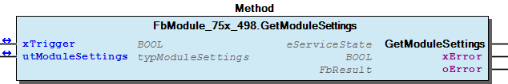
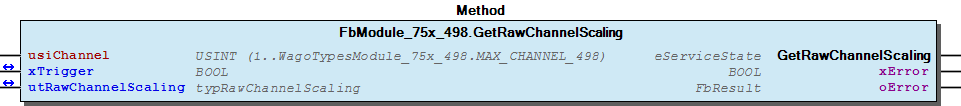
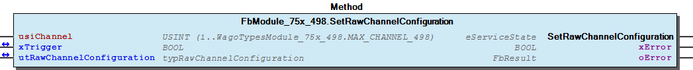
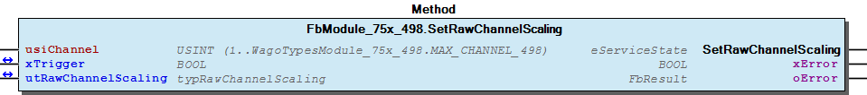
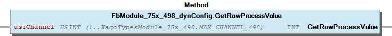

# WagoSysModule_75x_498 v1.0.0.4 (WAGO) - Complete Documentation


## 📋 Library Information

- **Company:** WAGO
- **Title:** WagoSysModule_75x_498
- **Version:** 1.0.0.4
- **Categories:** WAGO LayerView|Sys; Application
- **Author:** WAGO
- **Placeholder:** WagoSysModule_75x_498

### Description ¶


This document is automatically generated. Because of this, the chapter 30 Visualization is not shown in this document. If you are interested in getting to know more about visualization, we refer to the library manager of e!Cockpit.

Handling modules 750-498 [1]

This document is automatically generated. Because of this, the chapter 30 Visualization is not shown in this document. If you are interested in getting to know more about visualization, we refer to the library manager of e!Cockpit. Handling modules 750-498 [1]

### Contents: ¶


Contents: - Documentation Index - Project Information - Library Information - Function Blocks FbModule_75x_498 (FB) - FbModule_75x_498_dynConfig (FB) Methods - FbModule_75x_498.GetModuleSettings (METH) - FbModule_75x_498.GetRawChannelCalibration (METH) - FbModule_75x_498.GetRawChannelConfiguration (METH) - FbModule_75x_498.GetRawChannelScaling (METH) - FbModule_75x_498.GetRawChannelSettings (METH) - FbModule_75x_498.SetModuleSettings (METH) - FbModule_75x_498.SetRawChannelCalibration (METH) - FbModule_75x_498.SetRawChannelConfiguration (METH) - FbModule_75x_498.SetRawChannelScaling (METH) - FbModule_75x_498.SetRawChannelSettings (METH) - ... and 1 more Program Organization Global Variable Lists - Error_498 (GVL) - VersionHistory (GVL) Other Components - 80 Status - Channel - I_Module_75x_498 - Module - eError_498 (ENUM)

### Indices and tables ¶


| [1] | Based on WagoSysModule_75x_498.library, last modified 08.04.2020, 16:18:58. The content of this file was automatically generated with None on 08.04.2020, 16:19:13 |

© WAGO Kontakttechnik GmbH & Co. KG, Germany 2018 – All rights reserved. For the avoidance of doubt, this copyright notice does not only apply to the information above but also and primarily to the described library itself. Please note that third-party products are always mentioned without reference to intellectual property rights, including patents, utility models, designs and trademarks, accordingly the existence of such rights cannot be excluded. WAGO is a registered trademark of WAGO Verwaltungsgesellschaft mbH.

- File and Project Information - Library Reference © WAGO Kontakttechnik GmbH & Co. KG, Germany 2018 – All rights reserved. For the avoidance of doubt, this copyright notice does not only apply to the information above but also and primarily to the described library itself. Please note that third-party products are always mentioned without reference to intellectual property rights, including patents, utility models, designs and trademarks, accordingly the existence of such rights cannot be excluded. WAGO is a registered trademark of WAGO Verwaltungsgesellschaft mbH.

### Documentation Index


## WagoSysModule_75x_498 Library Documentation


| Company: | WAGO |
| Title: | WagoSysModule_75x_498 |
| Version: | 1.0.0.4 |
| Categories: | WAGO LayerView\|Sys; Application |
| Author: | WAGO |
| Placeholder: | WagoSysModule_75x_498 |

### Description


This document is automatically generated. Because of this, the chapter 30 Visualization is not shown in this document. If you are interested in getting to know more about visualization, we refer to the library manager of e!Cockpit.

Handling modules 750-498 [1]

This document is automatically generated. Because of this, the chapter 30 Visualization is not shown in this document. If you are interested in getting to know more about visualization, we refer to the library manager of e!Cockpit. Handling modules 750-498 [1]

### Contents:


- 20 Program Organization Units FbModule_75x_498 (FB) - FbModule_75x_498_dynConfig (FB) 80 Status - Error_498 (GVL) - eError_498 (ENUM) VersionHistory (GVL)

### Indices and tables


| [1] | Based on WagoSysModule_75x_498.library, last modified 08.04.2020, 16:18:58. The content of this file was automatically generated with None on 08.04.2020, 16:19:13 |

© WAGO Kontakttechnik GmbH & Co. KG, Germany 2018 – All rights reserved. For the avoidance of doubt, this copyright notice does not only apply to the information above but also and primarily to the described library itself. Please note that third-party products are always mentioned without reference to intellectual property rights, including patents, utility models, designs and trademarks, accordingly the existence of such rights cannot be excluded. WAGO is a registered trademark of WAGO Verwaltungsgesellschaft mbH.

- File and Project Information - Library Reference © WAGO Kontakttechnik GmbH & Co. KG, Germany 2018 – All rights reserved. For the avoidance of doubt, this copyright notice does not only apply to the information above but also and primarily to the described library itself. Please note that third-party products are always mentioned without reference to intellectual property rights, including patents, utility models, designs and trademarks, accordingly the existence of such rights cannot be excluded. WAGO is a registered trademark of WAGO Verwaltungsgesellschaft mbH.

### Project Information


## File and Project Information


| Scope | Name | Type | Content |
| --- | --- | --- | --- |
| FileHeader | libraryFile | string | WagoSysModule_75x_498.library |
| contentFile | WagoSysModule_75x_498_clr.json |
| productName | e!COCKPIT |
| creationDateTime | date | 08.04.2020, 16:19:13 |
| companyName | string | WAGO |
| ProjectInformation | LastModificationDateTime | date | 08.04.2020, 16:18:58 |
| Description | string | See: Description |
| Copyright | © WAGO Kontakttechnik GmbH & Co. KG, Germany 2018 – All rights reserved. |
| Author | WAGO |
| AutoResolveUnbound | bool | True |
| Placeholder | string | WagoSysModule_75x_498 |
| Company | WAGO |
| DocFormat | reStructuredText |
| Project | WagoSysModule_75x_498 |
| Released | bool | False |
| Version | version | 1.0.0.4 |
| ActivateSigning | bool | False |
| Title | string | WagoSysModule_75x_498 |
| LibraryCategories | library-category-list | WAGO LayerView\|Sys; Application |
| Version string | string |  |

### Library Information


## Library Reference


| LinkAllContent: False QualifiedOnly: False | SystemLibrary: False | Optional: False |

| LinkAllContent: False QualifiedOnly: False | SystemLibrary: False | Optional: False |

| LinkAllContent: False QualifiedOnly: False | SystemLibrary: False | Optional: False |

| LinkAllContent: False Optional: False | QualifiedOnly: False SystemLibrary: False | PublishSymbolsInContainer: True |

| LinkAllContent: False Optional: False | QualifiedOnly: True SystemLibrary: False | PublishSymbolsInContainer: True |

| LinkAllContent: False QualifiedOnly: True | SystemLibrary: False PublishSymbolsInContainer: True | Optional: False |

| LinkAllContent: False QualifiedOnly: False | SystemLibrary: False | Optional: False |

This is a dictionary of all referenced libraries and their name spaces.

This is a dictionary of all referenced libraries and their name spaces. WagoSysErrorBase Library Identification : Placeholder: WagoSysErrorBase Default Resolution: WagoSysErrorBase, * (WAGO) Namespace: WagoSysErrorBase Library Properties : WagoSysModuleBaseProtected Library Identification : Placeholder: WagoSysModuleBaseProtected Default Resolution: WagoSysModuleBaseProtected, * (WAGO) Namespace: WagoSysModuleBaseProtected Library Properties : Library Parameter : Parameter: REGISTER_COM_TIMEOUT = TIME#5s0ms Parameter: PARAMETER_COM_TIMEOUT = TIME#5s0ms WagoSysVersion Library Identification : Name: WagoSysVersion Version: 1.0.0.0 Company: WAGO Namespace: WagoSysVersion Library Properties : WagoTypesBusServices Library Identification : Placeholder: WagoTypesBusServices Default Resolution: WagoTypesBusServices, * (WAGO) Namespace: WagoTypesBusServices Library Properties : WagoTypesCommon Library Identification : Placeholder: WagoTypesCommon Default Resolution: WagoTypesCommon, * (WAGO) Namespace: WagoTypes Library Properties : WagoTypesModuleBase Library Identification : Placeholder: WagoTypesModuleBase Default Resolution: WagoTypesModuleBase, * (WAGO) Namespace: WagoTypesModuleBase Library Properties : Library Parameter : Parameter: MAX_MBX_SIZE = 18 WagoTypesModule_75x_498 Library Identification : Placeholder: WagoTypesModule_75x_498 Default Resolution: WagoTypesModule_75x_498, * (WAGO) Namespace: WagoTypesModule_75x_498 Library Properties :

### Function Blocks


## FbModule_75x_498 (FB)


| Scope | Name | Type | Inherited from |
| --- | --- | --- | --- |
| Output | oError | WagoSysErrorBase.FbResult | FbModuleBase |

Access to the module 750-498

Function description

This block is needed for each module. The instance of this function block is either automatically generated by the K-Bus configuration or has to be manually added in case of the dynamic configuration.

Interface variables Function Access to the module 750-498 Function description This block is needed for each module. The instance of this function block is either automatically generated by the K-Bus configuration or has to be manually added in case of the dynamic configuration. - I_Module_75x_498 Channel FbModule_75x_498.GetRawChannelCalibration (METH) - FbModule_75x_498.GetRawChannelScaling (METH) - FbModule_75x_498.GetRawChannelSettings (METH) - FbModule_75x_498.SetRawChannelCalibration (METH) - FbModule_75x_498.SetRawChannelScaling (METH) - FbModule_75x_498.SetRawChannelSettings (METH) FbModule_75x_498.GetRawChannelConfiguration (METH) Module - FbModule_75x_498.GetModuleSettings (METH) - FbModule_75x_498.SetModuleSettings (METH) FbModule_75x_498.SetRawChannelConfiguration (METH)

## FbModule_75x_498_dynConfig (FB)


| Scope | Name | Type | Inherited from |
| --- | --- | --- | --- |
| Output | oError | WagoSysErrorBase.FbResult | FbModuleBase |

Function description

Interface variables Function Access to the module 750-498 with PA-Access In case of dynamic configuration the FB provides additional the PA-Access. Function description This block is needed for each module. The instance of this function block has to be manually added in case of the dynamic configuration. - FbModule_75x_498_dynConfig.GetRawProcessValue (METH)

### Methods


## FbModule_75x_498.GetModuleSettings (METH)


| Scope | Name | Type |
| --- | --- | --- |
| Return | GetModuleSettings | WagoTypesModuleBase.eServiceState |
| Inout | xTrigger | BOOL |
| utModuleSettings | WagoTypesModule_75x_498.typModuleSettings |
| Output | xError | BOOL |
| oError | WagoSysErrorBase.FbResult |

| Struct member | Value | Description |
| --- | --- | --- |
| xAmountSignFormat | FALSE | Numeric values appear in two’s complement |
| TRUE | Numeric values appear in amount / sign format |
| xDisableWatchdog | FALSE | The Watchdog timer is enabled |
| TRUE | The Watchdog timer is not enabled. The Satus LEDs light up continuously |
| eNotchFilter | DISABLED | The Notch filter is not enabled (100 Hz) |
| ENABLED_50HZ | Notch filter ( 50 Hz ) |
| ENABLED_60HZ | Notch filter ( 60 Hz ) |
| ENABLED_50_60HZ | Notch filter ( 50/60 Hz ) |

| Return Value | Description |
| --- | --- |
| WagoTypesModuleBase.eServiceState.DONE | successful |
| WagoTypesModuleBase.eServiceState.ABORT | error -> see oError |
| WagoTypesModuleBase.eServiceState.NO_DATA | call while xTrigger is reset |

```
VAR
    //--- Module Mode Settings ------------------------------
    utModuleSettings    :   WagoTypesModule_75x_498.typModuleSettings;
    xGetModuleSettings  :   BOOL;  // triggers the function
    oError              :   WagoSysErrorBase.FbResult;
END_VAR

//--- M O D U L E    S E T T I N G S -----------------------
CASE my498.GetModuleSettings(xGetModuleSettings, utModuleSettings, oError => oError) OF

    eServiceState.DONE : // OK
            ;// process here your utModuleSettings

    eServiceState.ABORT : // Error
            ;// process here your error handling -> see oError for more information

END_CASE
```

typModuleSettings

Return Values

It is not allowed to reset the xTrigger by the application. This must done by the method.

Graphical Illustration

Graphical Interface of FbModule_75x_498.GetModuleSettings

For get the settings from the module.

You have to call the method cyclic until the method returns with DONE or ABORT.

Interface variables Function Get the common settings of the module at a struct. typModuleSettings Return Values Warning It is not allowed to reset the xTrigger by the application. This must done by the method. Graphical Illustration  Graphical Interface of FbModule_75x_498.GetModuleSettings Example For get the settings from the module. Note You have to call the method cyclic until the method returns with DONE or ABORT.

## FbModule_75x_498.GetRawChannelCalibration (METH)


| Scope | Name | Type |
| --- | --- | --- |
| Return | GetRawChannelCalibration | WagoTypesModuleBase.eServiceState |
| Input | usiChannel | USINT (1..WagoTypesModule_75x_498.MAX_CHANNEL_498) |
| Inout | xTrigger | BOOL |
| utRawChannelCalibration | WagoTypesModule_75x_498.typRawChannelCalibration |
| Output | xError | BOOL |
| oError | WagoSysErrorBase.FbResult |

| Struct member | Value | Description |
| --- | --- | --- |
| xUserCalibration | FALSE | The user scaling is switched off |
| TRUE | The user scaling is switched on |
| iUserCalibrationOffset | -32768 ... 32767 | User calibration Offset |
| uiUserCalibrationGain | 0 ... 65535 | User calibration Gain * 1/8192 |

```
VAR
    //--- Channel Calibration ---------------------------------
    utChannelCalibration    :   WagoTypesModule_75x_498.typRawChannelCalibration;;
    xGetChannelCalibration  :   BOOL;
    oError                  :   WagoSysErrorBase.FbResult;
END_VAR

//--- C H A N N E L    C A L I B R A T I O N -----------------------
CASE my498.GetRawChannelCalibration(    usiChannel              := 1,
                                        xTrigger                := xGetChannelCalibration,
                                        utRawChannelCalibration := utChannelCalibration,
                                        oError                  => oError
                                    ) OF

    eServiceState.DONE : // OK
            ;// process here your utChannelCalibration

    eServiceState.ABORT : // Error
            ;// process here your error handling -> see oError for more information

END_CASE
```

WagoTypesModule_75x_498.typRawChannelCalibration

Graphical Illustration

Graphical Interface of FbModule_75x_498.GetRawChannelCalibration

For get the calibration from channel one

You have to call the method cyclic until the method returns with DONE or ABORT.

Interface variables Function Get the calibration of a channel at a struct. WagoTypesModule_75x_498.typRawChannelCalibration Graphical Illustration  Graphical Interface of FbModule_75x_498.GetRawChannelCalibration Example For get the calibration from channel one Note You have to call the method cyclic until the method returns with DONE or ABORT.

## FbModule_75x_498.GetRawChannelConfiguration (METH)


| Scope | Name | Type |
| --- | --- | --- |
| Return | GetRawChannelConfiguration | WagoTypesModuleBase.eServiceState |
| Input | usiChannel | USINT (1..WagoTypesModule_75x_498.MAX_CHANNEL_498) |
| Inout | xTrigger | BOOL |
| utRawChannelConfiguration | WagoTypesModule_75x_498.typRawChannelConfiguration |
| Output | xError | BOOL |
| oError | WagoSysErrorBase.FbResult |

| Struct member | Value | Description |
| --- | --- | --- |
| Settings | eSensorType |  | Standard | Range | Resolution |
| TYPE_E | DIN EN 60584-1 | -200 °C...1000 °C | 0.1 °C |
| TYPE_N | DIN EN 60584-1 | -200 °C...1300 °C | 0.1 °C |
| TYPE_J | DIN EN 60584-1 | -210 °C...1200 °C | 0.1 °C |
| TYPE_K | DIN EN 60584-1 | -200 °C...1370 °C | 0.1 °C |
| TYPE_S | DIN EN 60584-1 | -50 °C...1768 °C | 0.1 °C |
| TYPE_R | DIN EN 60584-1 | -50 °C...1768 °C | 0.1 °C |
| TYPE_B | DIN EN 60584-1 | 200 °C...1820 °C | 0.1 °C |
| TYPE_T | DIN EN 60584-1 | -200 °C...400 °C | 0.1 °C |
| TYPE_C | DIN 43710 | 0 °C...2315 °C | 0.1 °C |
| PlusMinus_30mV |  | ± 30mV | 0.00125mV |
| PlusMinus_60mV |  | ± 60mV | 0.0025mV |
| PlusMinus_120mV |  | ± 120mV | 0.005mV |
| PlusMinus_240mV |  | ± 240mV | 0.01mV |
| xEnableChannel | FALSE | Channel disabled |
| TRUE | Channel enabled |
| iExternalColdJunctionTemp | -32768 ... 32767 | External Cold Junction Temperature |
| xEnableColdJunctionCompensation | FALSE | Cold Junction Compensation disabled |
| TRUE | Cold Junction Compensation enabled |
| xApplyExternalColdJunctionTemp | FALSE | Internal Cold Junction Compensation |
| TRUE | External Cold Junction Compensation |
| xEnableDiag | FALSE | Diagnosis disabled |
| TRUE | Diagnosis enabled |
| xEnableDiagWireBreak | FALSE | Diagnosis Wire Break disabled |
| TRUE | Diagnosis Wire Break enabled |
| xEnableDiagMeasurementOverrange | FALSE | Diagnosis Measurement Overrange disabled |
| TRUE | Diagnosis Measurement Overrange enabled |
| xEnableDiagMeasurementUnderrange | FALSE | Diagnosis Measurement Underrange disabled |
| TRUE | Diagnosis Measurement Underrange enabled |
| xEnableDiagUserLimitOverrange | FALSE | Diagnosis User Limit Overrange disabled |
| TRUE | Diagnosis User Limit Overrange enabled |
| xEnableDiagUserLimitUnderrange | FALSE | Diagnosis User Limit Underrange disabled |
| TRUE | Diagnosis User Limit Underrange enabled |
| iUserLimitOverrange | -32768 ... 32767 | User Limit Overrange |
| iUserLimitUnderrange | -32768 ... 32767 | User Limit Underrange |
| Scaling | xUserScaling | FALSE | User scaling disabled |
| TRUE | User scaling enabled |
| iUserScalingOffset | -32768 ... 32767 | User scaling Offset |
| uiUserScalingGain | 0 ... 65535 | User scaling Gain * 1/1024 |
| Calibration | xUserCalibration | FALSE | User calibration disabled |
| TRUE | User calibration enabled |
| iUserCalibrationOffset | -32768 ... 32767 | User calibration Offset |
| uiUserCalibrationGain | 0 ... 65535 | User calibration Gain * 1/8192 |

```
VAR
    //--- Channel Configuration ---------------------------------
    utRawChannelConfiguration   :   WagoTypesModule_75x_498.typRawChannelConfiguration;
    xGetRawChannelConfiguration :   BOOL;
    oError                      :   WagoSysErrorBase.FbResult;
END_VAR

//--- C H A N N E L    C O N F I G U R A T I O N -----------------------
CASE my498.GetRawChannelConfiguration(  usiChannel                  := 1,
                                        xTrigger                    := xGetRawChannelConfiguration,
                                        utRawChannelConfiguration   := utRawChannelConfiguration,
                                        oError                      => oError
                                    ) OF

    eServiceState.DONE : // OK
            ;// process here your utChannelConfiguration

    eServiceState.ABORT : // Error
            ;// process here your error handling -> see oError for more information

END_CASE
```

WagoTypesModule_75x_498.typRawChannelConfiguration

Graphical Illustration

Graphical Interface of FbModule_75x_498.GetRawChannelConfiguration

For get the configuration from channel one

You have to call the method cyclic until the method returns with DONE or ABORT.

Interface variables Function Get the complete raw configuration of a channel. WagoTypesModule_75x_498.typRawChannelConfiguration Graphical Illustration  Graphical Interface of FbModule_75x_498.GetRawChannelConfiguration Example For get the configuration from channel one Note You have to call the method cyclic until the method returns with DONE or ABORT.

## FbModule_75x_498.GetRawChannelScaling (METH)


| Scope | Name | Type |
| --- | --- | --- |
| Return | GetRawChannelScaling | WagoTypesModuleBase.eServiceState |
| Input | usiChannel | USINT (1..WagoTypesModule_75x_498.MAX_CHANNEL_498) |
| Inout | xTrigger | BOOL |
| utRawChannelScaling | WagoTypesModule_75x_498.typRawChannelScaling |
| Output | xError | BOOL |
| oError | WagoSysErrorBase.FbResult |

| Struct member | Value | Description |
| --- | --- | --- |
| xUserScaling | FALSE | User scaling disabled |
| TRUE | User scaling enabled |
| iUserScalingOffset | -32768 ... 32767 | User scaling Offset |
| uiUserScalingGain | 0 ... 65535 | User scaling Gain * 1/1024 |

```
VAR
    //--- Channel Settings ---------------------------------
    utChannelScaling    :   WagoTypesModule_75x_498.typRawChannelScaling;;
    xGetChannelScaling  :   BOOL;
    oError              :   WagoSysErrorBase.FbResult;
END_VAR

//--- C H A N N E L   S C A L I N G ------------------------
CASE my498.GetRawChannelScaling(    usiChannel           := 1,
                                    xTrigger             := xGetChannelScaling,
                                    utRawChannelScaling  := utChannelScaling,
                                    oError               => oError
                                ) OF

    eServiceState.DONE : // OK
            ;// process here your utChannelScaling

    eServiceState.ABORT : // Error
            ;// process here your error handling -> see oError for more information

END_CASE
```

WagoTypesModule_75x_498.typRawChannelScaling

Graphical Illustration

Graphical Interface of FbModule_75x_498.GetRawChannelScaling

For get the scaling from channel one

You have to call the method cyclic until the method returns with DONE or ABORT.

Interface variables Function Get the scaling of a channel at a struct. WagoTypesModule_75x_498.typRawChannelScaling Graphical Illustration  Graphical Interface of FbModule_75x_498.GetRawChannelScaling Example For get the scaling from channel one Note You have to call the method cyclic until the method returns with DONE or ABORT.

## FbModule_75x_498.GetRawChannelSettings (METH)


| Scope | Name | Type |
| --- | --- | --- |
| Return | GetRawChannelSettings | WagoTypesModuleBase.eServiceState |
| Input | usiChannel | USINT (1..WagoTypesModule_75x_498.MAX_CHANNEL_498) |
| Inout | xTrigger | BOOL |
| utRawChannelSettings | WagoTypesModule_75x_498.typRawChannelSettings |
| Output | xError | BOOL |
| oError | WagoSysErrorBase.FbResult |

| Struct member | Value | Description |
| --- | --- | --- |
| eSensorType |  | Standard | Range | Resolution |
| TYPE_E | DIN EN 60584-1 | -200 °C...1000 °C | 0.1 °C |
| TYPE_N | DIN EN 60584-1 | -200 °C...1300 °C | 0.1 °C |
| TYPE_J | DIN EN 60584-1 | -210 °C...1200 °C | 0.1 °C |
| TYPE_K | DIN EN 60584-1 | -200 °C...1370 °C | 0.1 °C |
| TYPE_S | DIN EN 60584-1 | -50 °C...1768 °C | 0.1 °C |
| TYPE_R | DIN EN 60584-1 | -50 °C...1768 °C | 0.1 °C |
| TYPE_B | DIN EN 60584-1 | 200 °C...1820 °C | 0.1 °C |
| TYPE_T | DIN EN 60584-1 | -200 °C...400 °C | 0.1 °C |
| TYPE_C | DIN 43710 | 0 °C...2315 °C | 0.1 °C |
| PlusMinus_30mV |  | ± 30mV | 0.00125mV |
| PlusMinus_60mV |  | ± 60mV | 0.0025mV |
| PlusMinus_120mV |  | ± 120mV | 0.005mV |
| PlusMinus_240mV |  | ± 240mV | 0.01mV |
| xEnableChannel | FALSE | Channel disabled |
| TRUE | Channel enabled |
| iExternalColdJunctionTemp | -32768 ... 32767 | External Cold Junction Temperature |
| xEnableColdJunctionCompensation | FALSE | Cold Junction Compensation disabled |
| TRUE | Cold Junction Compensation enabled |
| xApplyExternalColdJunctionTemp | FALSE | Internal Cold Junction Compensation |
| TRUE | External Cold Junction Compensation |
| xEnableDiag | FALSE | Diagnosis disabled |
| TRUE | Diagnosis enabled |
| xEnableDiagWireBreak | FALSE | Diagnosis Wire Break disabled |
| TRUE | Diagnosis Wire Break enabled |
| xEnableDiagMeasurementOverrange | FALSE | Diagnosis Measurement Overrange disabled |
| TRUE | Diagnosis Measurement Overrange enabled |
| xEnableDiagMeasurementUnderrange | FALSE | Diagnosis Measurement Underrange disabled |
| TRUE | Diagnosis Measurement Underrange enabled |
| xEnableDiagUserLimitOverrange | FALSE | Diagnosis User Limit Overrange disabled |
| TRUE | Diagnosis User Limit Overrange enabled |
| xEnableDiagUserLimitUnderrange | FALSE | Diagnosis User Limit Underrange disabled |
| TRUE | Diagnosis User Limit Underrange enabled |
| iUserLimitOverrange | -32768 ... 32767 | User Limit Overrange |
| iUserLimitUnderrange | -32768 ... 32767 | User Limit Underrange |

```
VAR
    //--- Channel Settings ---------------------------------
    utChannelSettings   :   WagoTypesModule_75x_498.typRawChannelSettings;;
    xGetChannelSettings :   BOOL;
    oError              :   WagoSysErrorBase.FbResult;
END_VAR

//--- C H A N N E L   S E T T I N G S ----------------------
CASE my498.GetRawChannelSettings(   usiChannel           := 1,
                                    xTrigger             := xGetChannelSettings,
                                    utRawChannelSettings := utChannelSettings,
                                    oError               => oError
                                ) OF

    eServiceState.DONE : // OK
        ;// process here your utModuleSettings

    eServiceState.ABORT : // Error
        ;// process here your error handling -> see oError for more information

END_CASE
```

WagoTypesModule_75x_498.typRawChannelSettings

Graphical Illustration

Graphical Interface of FbModule_75x_498.GetRawChannelSettings

For get the settings from channel one

You have to call the method cyclic until the method returns with DONE or ABORT.

Interface variables Function Get the settings of a channel at a struct. WagoTypesModule_75x_498.typRawChannelSettings Graphical Illustration  Graphical Interface of FbModule_75x_498.GetRawChannelSettings Example For get the settings from channel one Note You have to call the method cyclic until the method returns with DONE or ABORT.

## FbModule_75x_498.SetModuleSettings (METH)


| Scope | Name | Type |
| --- | --- | --- |
| Return | SetModuleSettings | WagoTypesModuleBase.eServiceState |
| Inout | xTrigger | BOOL |
| utModuleSettings | WagoTypesModule_75x_498.typModuleSettings |
| Output | xError | BOOL |
| oError | WagoSysErrorBase.FbResult |

| Struct member | Value | Description |
| --- | --- | --- |
| xAmountSignFormat | FALSE | Numeric values appear in two’s complement |
| TRUE | Numeric values appear in amount / sign format |
| xDisableWatchdog | FALSE | The Watchdog timer is enabled |
| TRUE | The Watchdog timer is not enabled. The Satus LEDs light up continuously |
| eNotchFilter | DISABLED | The Notch filter is not enabled (100 Hz) |
| ENABLED_50HZ | Notch filter ( 50 Hz ) |
| ENABLED_60HZ | Notch filter ( 60 Hz ) |
| ENABLED_50_60HZ | Notch filter ( 50/60 Hz ) |

| Return Value | Description |
| --- | --- |
| WagoTypesModuleBase.eServiceState.DONE | successful |
| WagoTypesModuleBase.eServiceState.ABORT | error -> see oError |
| WagoTypesModuleBase.eServiceState.NO_DATA | call while xTrigger is reset |

```
VAR
    //--- Module Mode Settings ------------------------------
    xStartProcess       :   BOOL; // set this variable once to start the process -> this varibale will be automatic reset
    utModuleSettings    :   WagoTypesModule_75x_498.typModuleSettings;
    oError              :   WagoSysErrorBase.FbResult;
    xSetModuleSettings  :   BOOL;  // triggers the function
END_VAR

//--- READ BEFORE WRITE --------------------------------------------------------------
CASE my498.GetModuleSettings(xStartProcess, utModuleSettings, oError => oError) OF

    eServiceState.DONE : // OK -> actual configuration is successful read
        // change here your configuration
        // utRawChannelConfiguration... :=
        xSetModuleSettings := TRUE; // trigger write

    eServiceState.ABORT : // Error -> not able to read -> see oError
            ;// process here your error handling for read -> see oError for more information

END_CASE

//--- S E T   M O D U L E    S E T T I N G S ---------------
CASE my498.SetModuleSettings(xSetModuleSettings, utModuleSettings, oError => oError) OF

    eServiceState.DONE : // OK

    eServiceState.ABORT : // Error
            ;// process here your error handling -> see oError for more information

END_CASE
```

typModuleSettings

Return Values

It is not allowed to reset the xTrigger by the application. This must done by the method.

Graphical Illustration

Graphical Interface of FbModule_75x_498.SetModuleSettings

For set the settings from the module.

You have to call the method cyclic until the method returns with DONE or ABORT.

Interface variables Function Set the common settings of the module from a struct. typModuleSettings Return Values Warning It is not allowed to reset the xTrigger by the application. This must done by the method. Graphical Illustration  Graphical Interface of FbModule_75x_498.SetModuleSettings Example For set the settings from the module. Note You have to call the method cyclic until the method returns with DONE or ABORT.

## FbModule_75x_498.SetRawChannelCalibration (METH)


| Scope | Name | Type |
| --- | --- | --- |
| Return | SetRawChannelCalibration | WagoTypesModuleBase.eServiceState |
| Input | usiChannel | USINT (1..WagoTypesModule_75x_498.MAX_CHANNEL_498) |
| Inout | xTrigger | BOOL |
| utRawChannelCalibration | WagoTypesModule_75x_498.typRawChannelCalibration |
| Output | xError | BOOL |
| oError | WagoSysErrorBase.FbResult |

| Struct member | Value | Description |
| --- | --- | --- |
| xUserCalibration | FALSE | The user scaling is switched off |
| TRUE | The user scaling is switched on |
| iUserCalibrationOffset | -32768 ... 32767 | User calibration Offset |
| uiUserCalibrationGain | 0 ... 65535 | User calibration Gain * 1/8192 |

```
VAR
    //--- Channel Calibration ---------------------------------
    utChannelCalibration    :   WagoTypesModule_75x_498.typRawChannelCalibration;;
    xSetChannelCalibration  :   BOOL;
    oError                  :   WagoSysErrorBase.FbResult;
END_VAR

//--- C H A N N E L    C A L I B R A T I O N -----------------------
CASE my498.SetRawChannelCalibration(    usiChannel              := 1,
                                        xTrigger                := xSetChannelCalibration,
                                        utRawChannelCalibration := utChannelCalibration,
                                        oError                  => oError
                                   ) OF

    eServiceState.DONE : // OK the new calibration is set
            ;

    eServiceState.ABORT : // Error
            ;// process here your error handling -> see oError for more information

END_CASE
```

WagoTypesModule_75x_498.typRawChannelCalibration

Graphical Illustration

Graphical Interface of FbModule_75x_498.SetRawChannelCalibration

For set the calibration of channel one

You have to call the method cyclic until the method returns with DONE or ABORT.

Interface variables Function Set the calibration of a channel by a struct. WagoTypesModule_75x_498.typRawChannelCalibration Graphical Illustration  Graphical Interface of FbModule_75x_498.SetRawChannelCalibration Example For set the calibration of channel one Note You have to call the method cyclic until the method returns with DONE or ABORT.

## FbModule_75x_498.SetRawChannelConfiguration (METH)


| Scope | Name | Type |
| --- | --- | --- |
| Return | SetRawChannelConfiguration | WagoTypesModuleBase.eServiceState |
| Input | usiChannel | USINT (1..WagoTypesModule_75x_498.MAX_CHANNEL_498) |
| Inout | xTrigger | BOOL |
| utRawChannelConfiguration | WagoTypesModule_75x_498.typRawChannelConfiguration |
| Output | xError | BOOL |
| oError | WagoSysErrorBase.FbResult |

| Struct member | Value | Description |
| --- | --- | --- |
| Settings | eSensorType |  | Standard | Range | Resolution |
| TYPE_E | DIN EN 60584-1 | -200 °C...1000 °C | 0.1 °C |
| TYPE_N | DIN EN 60584-1 | -200 °C...1300 °C | 0.1 °C |
| TYPE_J | DIN EN 60584-1 | -210 °C...1200 °C | 0.1 °C |
| TYPE_K | DIN EN 60584-1 | -200 °C...1370 °C | 0.1 °C |
| TYPE_S | DIN EN 60584-1 | -50 °C...1768 °C | 0.1 °C |
| TYPE_R | DIN EN 60584-1 | -50 °C...1768 °C | 0.1 °C |
| TYPE_B | DIN EN 60584-1 | 200 °C...1820 °C | 0.1 °C |
| TYPE_T | DIN EN 60584-1 | -200 °C...400 °C | 0.1 °C |
| TYPE_C | DIN 43710 | 0 °C...2315 °C | 0.1 °C |
| PlusMinus_30mV |  | ± 30mV | 0.00125mV |
| PlusMinus_60mV |  | ± 60mV | 0.0025mV |
| PlusMinus_120mV |  | ± 120mV | 0.005mV |
| PlusMinus_240mV |  | ± 240mV | 0.01mV |
| xEnableChannel | FALSE | Channel disabled |
| TRUE | Channel enabled |
| iExternalColdJunctionTemp | -32768 ... 32767 | External Cold Junction Temperature |
| xEnableColdJunctionCompensation | FALSE | Cold Junction Compensation disabled |
| TRUE | Cold Junction Compensation enabled |
| xApplyExternalColdJunctionTemp | FALSE | Internal Cold Junction Compensation |
| TRUE | External Cold Junction Compensation |
| xEnableDiag | FALSE | Diagnosis disabled |
| TRUE | Diagnosis enabled |
| xEnableDiagWireBreak | FALSE | Diagnosis Wire Break disabled |
| TRUE | Diagnosis Wire Break enabled |
| xEnableDiagMeasurementOverrange | FALSE | Diagnosis Measurement Overrange disabled |
| TRUE | Diagnosis Measurement Overrange enabled |
| xEnableDiagMeasurementUnderrange | FALSE | Diagnosis Measurement Underrange disabled |
| TRUE | Diagnosis Measurement Underrange enabled |
| xEnableDiagUserLimitOverrange | FALSE | Diagnosis User Limit Overrange disabled |
| TRUE | Diagnosis User Limit Overrange enabled |
| xEnableDiagUserLimitUnderrange | FALSE | Diagnosis User Limit Underrange disabled |
| TRUE | Diagnosis User Limit Underrange enabled |
| iUserLimitOverrange | -32768 ... 32767 | User Limit Overrange |
| iUserLimitUnderrange | -32768 ... 32767 | User Limit Underrange |
| Scaling | xUserScaling | FALSE | User scaling disabled |
| TRUE | User scaling enabled |
| iUserScalingOffset | -32768 ... 32767 | User scaling Offset |
| uiUserScalingGain | 0 ... 65535 | User scaling Gain * 1/1024 |
| Calibration | xUserCalibration | FALSE | User calibration disabled |
| TRUE | User calibration enabled |
| iUserCalibrationOffset | -32768 ... 32767 | User calibration Offset |
| uiUserCalibrationGain | 0 ... 65535 | User calibration Gain * 1/8192 |

```
VAR
    //--- Channel Configuration -------------------------------------------------------
    xStartProcess               :   BOOL; // set this variable once to start the process -> this varibale will be automatic reset
    utRawChannelConfiguration   :   WagoTypesModule_75x_498.typRawChannelConfiguration;
    oError                      :   WagoSysErrorBase.FbResult;
    xSetRawChannelConfiguration :   BOOL;
END_VAR

//--- C H A N N E L    C O N F I G U R A T I O N -----------------------
//--- READ BEFORE WRITE --------------------------------------------------------------
CASE my498.GetRawChannelConfiguration( 1, xStartProcess, utRawChannelConfiguration, oError => oError) OF

    eServiceState.DONE : // OK -> actual configuration is successful read
        // change here your configuration
        // utRawChannelConfiguration... :=
        xSetRawChannelConfiguration := TRUE; // trigger write

    eServiceState.ABORT : // Error -> not able to read -> see oError
            ;// process here your error handling for read -> see oError for more information

END_CASE

//--- WRITE MODYFIED CONFIGURATION ---------------------------------------------------
CASE my498.SetRawChannelConfiguration( 1, xSetRawChannelConfiguration, utRawChannelConfiguration, oError => oError) OF

    eServiceState.DONE : // OK -> new configuration is written

    eServiceState.ABORT : // Error -> not able to write -> see oError
            ;// process here your error handling for write -> see oError for more information

END_CASE
```

WagoTypesModule_75x_498.typRawChannelConfiguration

Graphical Illustration

Graphical Interface of FbModule_75x_498.SetRawChannelConfiguration

For get the configuration from channel one and after read write the configuration

You have to call the method cyclic until the method returns with DONE or ABORT.

Interface variables Function Set the complete raw configuration of a channel. WagoTypesModule_75x_498.typRawChannelConfiguration Graphical Illustration  Graphical Interface of FbModule_75x_498.SetRawChannelConfiguration Example For get the configuration from channel one and after read write the configuration Note You have to call the method cyclic until the method returns with DONE or ABORT.

## FbModule_75x_498.SetRawChannelScaling (METH)


| Scope | Name | Type |
| --- | --- | --- |
| Return | SetRawChannelScaling | WagoTypesModuleBase.eServiceState |
| Input | usiChannel | USINT (1..WagoTypesModule_75x_498.MAX_CHANNEL_498) |
| Inout | xTrigger | BOOL |
| utRawChannelScaling | WagoTypesModule_75x_498.typRawChannelScaling |
| Output | xError | BOOL |
| oError | WagoSysErrorBase.FbResult |

| Struct member | Value | Description |
| --- | --- | --- |
| xUserScaling | FALSE | User scaling disabled |
| TRUE | User scaling enabled |
| iUserScalingOffset | -32768 ... 32767 | User scaling Offset |
| uiUserScalingGain | 0 ... 65535 | User scaling Gain * 1/1024 |

```
VAR
    //--- Channel Settings ---------------------------------
    utChannelScaling    :   WagoTypesModule_75x_498.typRawChannelScaling;;
    xSetChannelScaling  :   BOOL;
    oError              :   WagoSysErrorBase.FbResult;
END_VAR

//--- C H A N N E L   S C A L I N G ------------------------
CASE my498.SetRawChannelScaling(    usiChannel          := 1,
                                    xTrigger            := xSetChannelScaling,
                                    utRawChannelScaling := utChannelScaling,
                                    oError              => oError
                                ) OF

    eServiceState.DONE : // OK the new scaling is set
            ;

    eServiceState.ABORT : // Error
            ;// process here your error handling -> see oError for more information

END_CASE
```

WagoTypesModule_75x_498.typRawChannelScaling

Graphical Illustration

Graphical Interface of FbModule_75x_498.SetRawChannelScaling

For set the scaling of channel one

You have to call the method cyclic until the method returns with DONE or ABORT.

Interface variables Function Set the scaling of a channel by a struct. WagoTypesModule_75x_498.typRawChannelScaling Graphical Illustration  Graphical Interface of FbModule_75x_498.SetRawChannelScaling Example For set the scaling of channel one Note You have to call the method cyclic until the method returns with DONE or ABORT.

## FbModule_75x_498.SetRawChannelSettings (METH)


| Scope | Name | Type |
| --- | --- | --- |
| Return | SetRawChannelSettings | WagoTypesModuleBase.eServiceState |
| Input | usiChannel | USINT (1..WagoTypesModule_75x_498.MAX_CHANNEL_498) |
| Inout | xTrigger | BOOL |
| utRawChannelSettings | WagoTypesModule_75x_498.typRawChannelSettings |
| Output | xError | BOOL |
| oError | WagoSysErrorBase.FbResult |

| Struct member | Value | Description |
| --- | --- | --- |
| eSensorType |  | Standard | Range | Resolution |
| TYPE_E | DIN EN 60584-1 | -200 °C...1000 °C | 0.1 °C |
| TYPE_N | DIN EN 60584-1 | -200 °C...1300 °C | 0.1 °C |
| TYPE_J | DIN EN 60584-1 | -210 °C...1200 °C | 0.1 °C |
| TYPE_K | DIN EN 60584-1 | -200 °C...1370 °C | 0.1 °C |
| TYPE_S | DIN EN 60584-1 | -50 °C...1768 °C | 0.1 °C |
| TYPE_R | DIN EN 60584-1 | -50 °C...1768 °C | 0.1 °C |
| TYPE_B | DIN EN 60584-1 | 200 °C...1820 °C | 0.1 °C |
| TYPE_T | DIN EN 60584-1 | -200 °C...400 °C | 0.1 °C |
| TYPE_C | DIN 43710 | 0 °C...2315 °C | 0.1 °C |
| PlusMinus_30mV |  | ± 30mV | 0.00125mV |
| PlusMinus_60mV |  | ± 60mV | 0.0025mV |
| PlusMinus_120mV |  | ± 120mV | 0.005mV |
| PlusMinus_240mV |  | ± 240mV | 0.01mV |
| xEnableChannel | FALSE | Channel disabled |
| TRUE | Channel enabled |
| iExternalColdJunctionTemp | -32768 ... 32767 | External Cold Junction Temperature |
| xEnableColdJunctionCompensation | FALSE | Cold Junction Compensation disabled |
| TRUE | Cold Junction Compensation enabled |
| xApplyExternalColdJunctionTemp | FALSE | Internal Cold Junction Compensation |
| TRUE | External Cold Junction Compensation |
| xEnableDiag | FALSE | Diagnosis disabled |
| TRUE | Diagnosis enabled |
| xEnableDiagWireBreak | FALSE | Diagnosis Wire Break disabled |
| TRUE | Diagnosis Wire Break enabled |
| xEnableDiagMeasurementOverrange | FALSE | Diagnosis Measurement Overrange disabled |
| TRUE | Diagnosis Measurement Overrange enabled |
| xEnableDiagMeasurementUnderrange | FALSE | Diagnosis Measurement Underrange disabled |
| TRUE | Diagnosis Measurement Underrange enabled |
| xEnableDiagUserLimitOverrange | FALSE | Diagnosis User Limit Overrange disabled |
| TRUE | Diagnosis User Limit Overrange enabled |
| xEnableDiagUserLimitUnderrange | FALSE | Diagnosis User Limit Underrange disabled |
| TRUE | Diagnosis User Limit Underrange enabled |
| iUserLimitOverrange | -32768 ... 32767 | User Limit Overrange |
| iUserLimitUnderrange | -32768 ... 32767 | User Limit Underrange |

```
VAR
    //--- Channel Settings ---------------------------------
    utChannelSettings   :   WagoTypesModule_75x_498.typRawChannelSettings;;
    xSetChannelSettings :   BOOL;
    oError              :   WagoSysErrorBase.FbResult;
END_VAR

//--- C H A N N E L   S E T T I N G S ----------------------
CASE my498.SetRawChannelSettings(   usiChannel           := 1,
                                    xTrigger             := xSetChannelSettings,
                                    utRawChannelSettings := utChannelSettings,
                                    oError               => oError
                                ) OF

    eServiceState.DONE : // OK
        ;// process here your utModuleSettings

    eServiceState.ABORT : // Error
        ;// process here your error handling -> see oError for more information

END_CASE
```

WagoTypesModule_75x_498.typRawChannelSettings

Graphical Illustration

Graphical Interface of FbModule_75x_498.SetRawChannelSettings

For set the settings of channel one

You have to call the method cyclic until the method returns with DONE or ABORT.

Interface variables Function Set the settings for a channel by a struct. WagoTypesModule_75x_498.typRawChannelSettings Graphical Illustration  Graphical Interface of FbModule_75x_498.SetRawChannelSettings Example For set the settings of channel one Note You have to call the method cyclic until the method returns with DONE or ABORT.

## FbModule_75x_498_dynConfig.GetRawProcessValue (METH)


| Scope | Name | Type |
| --- | --- | --- |
| Return | GetRawProcessValue | INT |
| Input | usiChannel | USINT (1..WagoTypesModule_75x_498.MAX_CHANNEL_498) |

```
VAR
    myiProcessValue :   INT;
END_VAR

myiProcessValue := my498.GetProcessValue(1); // here is the process raw value as INT
```

Get the raw process value of the wanted channel.

In case of error (e.g. an invalid channel number is given) it returns -32768.

Graphical Illustration

Graphical Interface of FbModule_75x_498_dynConfig.GetRawProcessValue

Interface variables Function Get the raw process value of the wanted channel. In case of error (e.g. an invalid channel number is given) it returns -32768. Graphical Illustration  Graphical Interface of FbModule_75x_498_dynConfig.GetRawProcessValue Example For get the process value from first channel of the module.

### Program Organization


## 20 Program Organization Units


- FbModule_75x_498 (FB) I_Module_75x_498 Channel FbModule_75x_498.GetRawChannelCalibration (METH) - FbModule_75x_498.GetRawChannelScaling (METH) - FbModule_75x_498.GetRawChannelSettings (METH) - FbModule_75x_498.SetRawChannelCalibration (METH) - FbModule_75x_498.SetRawChannelScaling (METH) - FbModule_75x_498.SetRawChannelSettings (METH) FbModule_75x_498.GetRawChannelConfiguration (METH) Module - FbModule_75x_498.GetModuleSettings (METH) - FbModule_75x_498.SetModuleSettings (METH) FbModule_75x_498.SetRawChannelConfiguration (METH) FbModule_75x_498_dynConfig (FB) - FbModule_75x_498_dynConfig.GetRawProcessValue (METH)

### Global Variable Lists


## Error_498 (GVL)


| Scope | Name | Type |
| --- | --- | --- |
| Constant | ERROR_498 | ARRAY [0..3] OF WagoTypesErrorBase.typResultItem |

| Value | Level | Description |
| --- | --- | --- |
| eError_498.OK | WagoTypesErrorBase.eSeverity.none | ‘OK’ |
| eError_498.INVALID_CHANNEL | WagoTypesErrorBase.eSeverity.error | ‘The wanted channel number is not allowed’ |
| eError_498.UNKNOWN_SENSOR_TYPE | WagoTypesErrorBase.eSeverity.error | ‘Not supported sensor type’ |
| eError_498.UNKNOWN_NOTCH_FILTER | WagoTypesErrorBase.eSeverity.error | ‘Not supported notch filter’ |

## VersionHistory (GVL)


| Name | Type |
| --- | --- |
| Info | ProjectInfo |

| date | version | author | change |
| 16.03.2020 | 1.0.0.4 | u097097 | Add reading parameters multiple times |
| 06.02.2020 | 1.0.0.3 | u010545 | I_Module_75x_498_dynConfig added |
| 29.01.2020 | 1.0.0.2 | u097097 | Fixed SetRawChannelConfiguration for user calibration values |
| 24.01.2020 | 1.0.0.1 | u097097 | Remove CalibrationMode handling |
| 14.01.2020 | 1.0.0.0 | u097097 | Release version |
| 02.05.2019 | 0.0.0.5 | u090996 | Removed wrong linking in “GetDiagnosis” |
| 02.05.2019 | 0.0.0.4 | u090996 | Edit comments |
| 29.04.2019 | 0.0.0.3 | u090996 | Add parameter to set external cold junction |
| 26.02.2019 | 0.0.0.2 | u090996 | Add new parameter to module settings |
| 25.02.2019 | 0.0.0.1 | u090996 | Init |

WagoSysModule_75x_498.library

Release Notes:

WagoSysModule_75x_498.library Release Notes:

### Other Components


## 80 Status ¶


- Error_498 (GVL) - eError_498 (ENUM)

## Channel


- FbModule_75x_498.GetRawChannelCalibration (METH) - FbModule_75x_498.GetRawChannelScaling (METH) - FbModule_75x_498.GetRawChannelSettings (METH) - FbModule_75x_498.SetRawChannelCalibration (METH) - FbModule_75x_498.SetRawChannelScaling (METH) - FbModule_75x_498.SetRawChannelSettings (METH)

## I_Module_75x_498


- Channel FbModule_75x_498.GetRawChannelCalibration (METH) - FbModule_75x_498.GetRawChannelScaling (METH) - FbModule_75x_498.GetRawChannelSettings (METH) - FbModule_75x_498.SetRawChannelCalibration (METH) - FbModule_75x_498.SetRawChannelScaling (METH) - FbModule_75x_498.SetRawChannelSettings (METH) FbModule_75x_498.GetRawChannelConfiguration (METH) Module - FbModule_75x_498.GetModuleSettings (METH) - FbModule_75x_498.SetModuleSettings (METH) FbModule_75x_498.SetRawChannelConfiguration (METH)

## Module


- FbModule_75x_498.GetModuleSettings (METH) - FbModule_75x_498.SetModuleSettings (METH)

## eError_498 (ENUM)


| Name | Initial | Comment |
| --- | --- | --- |
| OK | 0 | all is well |
| INVALID_CHANNEL | 1 | invalid channel number |
| UNKNOWN_SENSOR_TYPE | 2 |  |
| UNKNOWN_NOTCH_FILTER | 3 |  |