# WagoSysModule_75x_511 v1.10.9.3 (WAGO) - Complete Documentation


## 📋 Library Information

- **Company:** WAGO
- **Title:** WagoSysModule_75x_511
- **Version:** 1.10.9.3
- **Categories:** WAGO LayerView|Sys; Application
- **Author:** WAGO
- **Placeholder:** WagoSysModule_75x_511

### Description ¶


This document is automatically generated.

Handling modules 75x-511

This document is automatically generated. Handling modules 75x-511

### Contents: ¶


Contents: - Documentation Index - Project Information - Library Information - Function Blocks FbModule_75x_511 (FB) - FbModule_75x_511_dynConfig (FB) Methods - FbModule_75x_511.GetModulePeriodDuration (METH) - FbModule_75x_511.GetModulePulseFrequency (METH) - FbModule_75x_511.SetModulePeriodDuration (METH) - FbModule_75x_511.SetModulePulseFrequency (METH) - FbModule_75x_511_dynConfig.GetModuleInputSize (METH) - FbModule_75x_511_dynConfig.GetModuleOutputSize (METH) - FbModule_75x_511_dynConfig.GetProcessInBit (METH) - FbModule_75x_511_dynConfig.GetProcessInByte (METH) - FbModule_75x_511_dynConfig.GetProcessInData (METH) - FbModule_75x_511_dynConfig.GetProcessInDword (METH) - ... and 13 more Program Organization Global Variable Lists - Error_511 (GVL) - VersionHistory (GVL) Other Components - 80 Status - Configuration - I_ModuleProcessInputsExtended - I_ModuleProcessOutputsExtended - I_Module_75x_511 - ProcessValues - eError_511 (ENUM)

### Indices and tables ¶


Based on WagoSysModule_75x_511.library, last modified 29.05.2024, 20:12:38. LibDoc 3.5.16.10

© WAGO GmbH & Co. KG, Germany 2018 – All rights reserved. For the avoidance of doubt, this copyright notice does not only apply to the information above but also and primarily to the described library itself. Please note that third-party products are always mentioned without reference to intellectual property rights, including patents, utility models, designs and trademarks, accordingly the existence of such rights cannot be excluded. WAGO is a registered trademark of WAGO Verwaltungsgesellschaft mbH.

- File and Project Information - Library Reference Based on WagoSysModule_75x_511.library, last modified 29.05.2024, 20:12:38. LibDoc 3.5.16.10 © WAGO GmbH & Co. KG, Germany 2018 – All rights reserved. For the avoidance of doubt, this copyright notice does not only apply to the information above but also and primarily to the described library itself. Please note that third-party products are always mentioned without reference to intellectual property rights, including patents, utility models, designs and trademarks, accordingly the existence of such rights cannot be excluded. WAGO is a registered trademark of WAGO Verwaltungsgesellschaft mbH.

### Documentation Index


## WagoSysModule_75x_511 Library Documentation


| Company: | WAGO |
| Title: | WagoSysModule_75x_511 |
| Version: | 1.10.9.3 |
| Categories: | WAGO LayerView\|Sys; Application |
| Author: | WAGO |
| Placeholder: | WagoSysModule_75x_511 |

### Description


This document is automatically generated.

Handling modules 75x-511

This document is automatically generated. Handling modules 75x-511

### Contents:


- 20 Program Organization Units FbModule_75x_511 (FB) - FbModule_75x_511_dynConfig (FB) 80 Status - Error_511 (GVL) - eError_511 (ENUM) VersionHistory (GVL)

### Indices and tables


Based on WagoSysModule_75x_511.library, last modified 29.05.2024, 20:12:38. LibDoc 3.5.16.10

© WAGO GmbH & Co. KG, Germany 2018 – All rights reserved. For the avoidance of doubt, this copyright notice does not only apply to the information above but also and primarily to the described library itself. Please note that third-party products are always mentioned without reference to intellectual property rights, including patents, utility models, designs and trademarks, accordingly the existence of such rights cannot be excluded. WAGO is a registered trademark of WAGO Verwaltungsgesellschaft mbH.

- File and Project Information - Library Reference Based on WagoSysModule_75x_511.library, last modified 29.05.2024, 20:12:38. LibDoc 3.5.16.10 © WAGO GmbH & Co. KG, Germany 2018 – All rights reserved. For the avoidance of doubt, this copyright notice does not only apply to the information above but also and primarily to the described library itself. Please note that third-party products are always mentioned without reference to intellectual property rights, including patents, utility models, designs and trademarks, accordingly the existence of such rights cannot be excluded. WAGO is a registered trademark of WAGO Verwaltungsgesellschaft mbH.

### Project Information


## File and Project Information


| Scope | Name | Type | Content |
| --- | --- | --- | --- |
| FileHeader | libraryFile | string | WagoSysModule_75x_511.library |
| contentFile | doc.clean.json |
| productName | e!COCKPIT |
| creationDateTime | date | 29.05.2024, 20:12:38 |
| companyName | string | WAGO |
| ProjectInformation | LastModificationDateTime | date | 29.05.2024, 20:12:38 |
| Description | string | See: Description |
| Copyright | © WAGO Kontakttechnik GmbH & Co. KG, Germany 2018 – All rights reserved. |
| Author | WAGO |
| AutoResolveUnbound | bool | True |
| Placeholder | string | WagoSysModule_75x_511 |
| Company | WAGO |
| DocFormat | reStructuredText |
| Project | WagoSysModule_75x_511 |
| Version string |  |
| Version | version | 1.10.9.3 |
| ActivateSigning | bool | False |
| Title | string | WagoSysModule_75x_511 |
| LibraryCategories | library-category-list | WAGO LayerView\|Sys; Application |
| CompiledLibraryCompatibilityVersion | string | CODESYS V3.5 SP16 Patch 3 |

### Library Information


## Library Reference


| LinkAllContent: False QualifiedOnly: False | SystemLibrary: False | Optional: False |

| LinkAllContent: False QualifiedOnly: False | SystemLibrary: False | Optional: False |

| LinkAllContent: False QualifiedOnly: False | SystemLibrary: False | Optional: False |

| LinkAllContent: False Optional: False | QualifiedOnly: True SystemLibrary: False | PublishSymbolsInContainer: True |

| LinkAllContent: False QualifiedOnly: True | SystemLibrary: False PublishSymbolsInContainer: True | Optional: False |

| LinkAllContent: False Optional: False | QualifiedOnly: True SystemLibrary: False | PublishSymbolsInContainer: True |

This is a dictionary of all referenced libraries and their name spaces.

This is a dictionary of all referenced libraries and their name spaces. WagoSysErrorBase Library Identification : Placeholder: WagoSysErrorBase Default Resolution: WagoSysErrorBase, * (WAGO) Namespace: WagoSysErrorBase Library Properties : WagoSysModuleBaseProtected Library Identification : Placeholder: WagoSysModuleBaseProtected Default Resolution: WagoSysModuleBaseProtected, * (WAGO) Namespace: WagoSysModuleBaseProtected Library Properties : Library Parameter : Parameter: REGISTER_COM_TIMEOUT = TIME#5s0ms Parameter: PARAMETER_COM_TIMEOUT = TIME#5s0ms WagoSysVersion Library Identification : Name: WagoSysVersion Version: 1.0.0.0 Company: WAGO Namespace: WagoSysVersion Library Properties : WagoTypesCommon Library Identification : Placeholder: WagoTypesCommon Default Resolution: WagoTypesCommon, * (WAGO) Namespace: WagoTypes Library Properties : WagoTypesModuleBase Library Identification : Placeholder: WagoTypesModuleBase Default Resolution: WagoTypesModuleBase, * (WAGO) Namespace: WagoTypesModuleBase Library Properties : Library Parameter : Parameter: MAX_MBX_SIZE = 18 WagoTypesModule_75x_511 Library Identification : Placeholder: WagoTypesModule_75x_511 Default Resolution: WagoTypesModule_75x_511, * (WAGO) Namespace: WagoTypesModule_75x_511 Library Properties :

### Function Blocks


## FbModule_75x_511 (FB)


| Scope | Name | Type | Inherited from |
| --- | --- | --- | --- |
| Output | oError | WagoSysErrorBase.FbResult | FbModuleBase |

Function description

This block is needed for each module. The instance of this function block is either automatically generated by the K-Bus configuration.

For dynamic configuration use the derivate inside WagoSysKbusModule.library .

Interface variables Function Access to the module 75x-511 Function description This block is needed for each module. The instance of this function block is either automatically generated by the K-Bus configuration. For dynamic configuration use the derivate inside WagoSysKbusModule.library . - I_Module_75x_511 Configuration FbModule_75x_511.GetModulePeriodDuration (METH) - FbModule_75x_511.GetModulePulseFrequency (METH) - FbModule_75x_511.SetModulePeriodDuration (METH) - FbModule_75x_511.SetModulePulseFrequency (METH)

## FbModule_75x_511_dynConfig (FB)


| Scope | Name | Type | Inherited from |
| --- | --- | --- | --- |
| Output | oError | WagoSysErrorBase.FbResult | FbModuleBase |

Function description

This block is needed for each module. The instance of this function block is either automatically generated by the K-Bus configuration or has to be manually added in case of the dynamic configuration.

Interface variables Function Access to the module 750-511 Function description This block is needed for each module. The instance of this function block is either automatically generated by the K-Bus configuration or has to be manually added in case of the dynamic configuration. - I_ModuleProcessInputsExtended FbModule_75x_511_dynConfig.GetModuleInputSize (METH) - FbModule_75x_511_dynConfig.GetProcessInBit (METH) - FbModule_75x_511_dynConfig.GetProcessInByte (METH) - FbModule_75x_511_dynConfig.GetProcessInData (METH) - FbModule_75x_511_dynConfig.GetProcessInDword (METH) - FbModule_75x_511_dynConfig.GetProcessInWord (METH) I_ModuleProcessOutputsExtended - FbModule_75x_511_dynConfig.GetModuleOutputSize (METH) - FbModule_75x_511_dynConfig.GetProcessOutBit (METH) - FbModule_75x_511_dynConfig.GetProcessOutByte (METH) - FbModule_75x_511_dynConfig.GetProcessOutData (METH) - FbModule_75x_511_dynConfig.GetProcessOutDword (METH) - FbModule_75x_511_dynConfig.GetProcessOutWord (METH) - FbModule_75x_511_dynConfig.SetProcessOutBit (METH) - FbModule_75x_511_dynConfig.SetProcessOutByte (METH) - FbModule_75x_511_dynConfig.SetProcessOutData (METH) - FbModule_75x_511_dynConfig.SetProcessOutDword (METH) - FbModule_75x_511_dynConfig.SetProcessOutWord (METH) ProcessValues - FbModule_75x_511_dynConfig.SetRawProcessValue (METH) - FbModule_75x_511_dynConfig.SetScaledProcessValue (METH)

### Methods


## FbModule_75x_511.GetModulePeriodDuration (METH)


| Scope | Name | Type | Comment |
| --- | --- | --- | --- |
| Return | GetModulePeriodDuration | WagoTypesModuleBase.eServiceState |  |
| Inout | xTrigger | BOOL |  |
| wModulePeriodDuration | WORD | [µs] |
| Output | xError | BOOL |  |
| oError | WagoSysErrorBase.FbResult |  |

| Return Value | Description |
| --- | --- |
| WagoTypesModuleBase.eServiceState.DONE | successful |
| WagoTypesModuleBase.eServiceState.ABORT | error -> see oError |
| WagoTypesModuleBase.eServiceState.NO_DATA | call while xTrigger is reset |

```
VAR
    myPeriodDuration    :   WORD;
    xGetPeriodDuration  :   BOOL;
    oError              :   WagoSysErrorBase.FbResult;
END_VAR

//--- Read Period Duration ------------------------------------------------
CASE my511.GetModulePeriodDuration( xGetPeriodDuration, myPeriodDuration, oError => oError ) OF

    WagoTypesModuleBase.eServiceState.DONE : ; // OK

    WagoTypesModuleBase.eServiceState.ABORT : // Error
            ;// process here your error handling -> see oError for more information

END_CASE
//-------------------------------------------------------------------------
```

Return Values

It is not allowed to reset the xTrigger by the application. This must done by the method.

Graphical Illustration

Graphical Interface of FbModule_75x_511.GetModulePeriodDuration

Example for ST

Reading the period of oscillation

You have to call the method cyclic until the method returns with DONE or ABORT.

Interface variables Function Get the module period of oscillation in µs. Return Values Warning It is not allowed to reset the xTrigger by the application. This must done by the method. Graphical Illustration 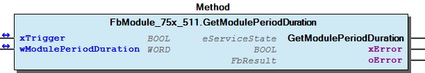 Graphical Interface of FbModule_75x_511.GetModulePeriodDuration Example for ST Reading the period of oscillation Note You have to call the method cyclic until the method returns with DONE or ABORT.

## FbModule_75x_511.GetModulePulseFrequency (METH)


| Scope | Name | Type | Comment |
| --- | --- | --- | --- |
| Return | GetModulePulseFrequency | WagoTypesModuleBase.eServiceState |  |
| Inout | xTrigger | BOOL |  |
| wFrequency | WORD | [Hz] |
| Output | xError | BOOL |  |
| oError | WagoSysErrorBase.FbResult |  |

| Return Value | Description |
| --- | --- |
| WagoTypesModuleBase.eServiceState.DONE | successful |
| WagoTypesModuleBase.eServiceState.ABORT | error -> see oError |
| WagoTypesModuleBase.eServiceState.NO_DATA | call while xTrigger is reset |

```
VAR
    myPulseFrequency    :   WORD;
    xGetPulseFrequency  :   BOOL;
    oError              :   WagoSysErrorBase.FbResult;
END_VAR

//--- Read Pulse Frequency ------------------------------------------------
CASE my511.GetModulePulseFrequency( xGetPulseFrequency, myPulseFrequency, oError => oError ) OF

    WagoTypesModuleBase.eServiceState.DONE : ; // OK

    WagoTypesModuleBase.eServiceState.ABORT : // Error
            ;// process here your error handling -> see oError for more information

END_CASE
//-------------------------------------------------------------------------
```

Get the module Pulse Frequency in Hz.

If you have changed the period of oscillation (e.g. with SetModulePeriodDuration(...) ) it is possible that you not get the actual frequency. In this case use GetModulePeriodDuration() and calculate the frequency by yourself.

Return Values

It is not allowed to reset the xTrigger by the application. This must done by the method.

Graphical Illustration

Graphical Interface of FbModule_75x_511.GetModulePulseFrequency

Example for ST

Reading the module pulse frequency

You have to call the method cyclic until the method returns with DONE or ABORT.

Interface variables Function Get the module Pulse Frequency in Hz. Note If you have changed the period of oscillation (e.g. with SetModulePeriodDuration(...) ) it is possible that you not get the actual frequency. In this case use GetModulePeriodDuration() and calculate the frequency by yourself. Return Values Warning It is not allowed to reset the xTrigger by the application. This must done by the method. Graphical Illustration  Graphical Interface of FbModule_75x_511.GetModulePulseFrequency Example for ST Reading the module pulse frequency Note You have to call the method cyclic until the method returns with DONE or ABORT.

## FbModule_75x_511.SetModulePeriodDuration (METH)


| Scope | Name | Type | Comment |
| --- | --- | --- | --- |
| Return | SetModulePeriodDuration | WagoTypesModuleBase.eServiceState |  |
| Inout | xTrigger | BOOL |  |
| wModulePeriodDuration | WORD | [us]; |
| Output | xError | BOOL |  |
| oError | WagoSysErrorBase.FbResult |  |

| Return Value | Description |
| --- | --- |
| WagoTypesModuleBase.eServiceState.DONE | successful |
| WagoTypesModuleBase.eServiceState.ABORT | error -> see oError |
| WagoTypesModuleBase.eServiceState.NO_DATA | call while xTrigger is reset |

```
VAR
    myPeriodDuration    :   WORD := 4000; // [µs]
    xSetPeriodDuration  :   BOOL;
    oError              :   WagoSysErrorBase.FbResult;
END_VAR

//--- Read Period Duration ------------------------------------------------
CASE my511.SetModulePeriodDuration( xSetPeriodDuration, myPeriodDuration, oError => oError ) OF

    WagoTypesModuleBase.eServiceState.DONE : ; // OK successful written

    WagoTypesModuleBase.eServiceState.ABORT : // Error
            ;// process here your error handling -> see oError for more information

END_CASE
//-------------------------------------------------------------------------
```

Set the module period of oscillation in µs.

If you have changed the period of oscillation with this method it is not possible to get the actual frequency by the method GetModulePulseFrequency() .

Return Values

It is not allowed to reset the xTrigger by the application. This must done by the method.

Graphical Illustration

Graphical Interface of FbModule_75x_511.SetModulePeriodDuration

Example for ST

Write the period of oscillation

You have to call the method cyclic until the method returns with DONE or ABORT.

Interface variables Function Set the module period of oscillation in µs. Note If you have changed the period of oscillation with this method it is not possible to get the actual frequency by the method GetModulePulseFrequency() . Return Values Warning It is not allowed to reset the xTrigger by the application. This must done by the method. Graphical Illustration 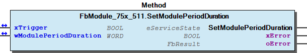 Graphical Interface of FbModule_75x_511.SetModulePeriodDuration Example for ST Write the period of oscillation Note You have to call the method cyclic until the method returns with DONE or ABORT.

## FbModule_75x_511.SetModulePulseFrequency (METH)


| Scope | Name | Type | Comment |
| --- | --- | --- | --- |
| Return | SetModulePulseFrequency | WagoTypesModuleBase.eServiceState |  |
| Inout | xTrigger | BOOL |  |
| wFrequency | WORD | [Hz]; |
| Output | xError | BOOL |  |
| oError | WagoSysErrorBase.FbResult |  |

| Return Value | Description |
| --- | --- |
| WagoTypesModuleBase.eServiceState.DONE | successful |
| WagoTypesModuleBase.eServiceState.ABORT | error -> see oError |
| WagoTypesModuleBase.eServiceState.NO_DATA | call while xTrigger is reset |

```
VAR
    myPulseFrequency    :   WORD;
    xSetPulseFrequency  :   BOOL;
    oError              :   WagoSysErrorBase.FbResult;
END_VAR

//--- Write Pulse Frequency ------------------------------------------------
CASE my511.SetModulePulseFrequency( xSetPulseFrequency, myPulseFrequency, oError => oError ) OF

    WagoTypesModuleBase.eServiceState.DONE : ; // OK successful written

    WagoTypesModuleBase.eServiceState.ABORT : // Error
            ;// process here your error handling -> see oError for more information

END_CASE
//-------------------------------------------------------------------------
```

Return Values

It is not allowed to reset the xTrigger by the application. This must done by the method.

Graphical Illustration

Graphical Interface of FbModule_75x_511.SetModulePulseFrequency

Example for ST

Write the module pulse frequency

You have to call the method cyclic until the method returns with DONE or ABORT.

Interface variables Function Set the module Pulse Frequency in Hz. Return Values Warning It is not allowed to reset the xTrigger by the application. This must done by the method. Graphical Illustration 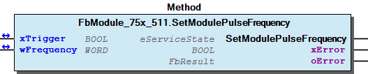 Graphical Interface of FbModule_75x_511.SetModulePulseFrequency Example for ST Write the module pulse frequency Note You have to call the method cyclic until the method returns with DONE or ABORT.

## FbModule_75x_511_dynConfig.GetModuleInputSize (METH)


| Scope | Name | Type |
| --- | --- | --- |
| Return | GetModuleInputSize | UINT |

Returns the byte size of input data

Interface variables Returns the byte size of input data

## FbModule_75x_511_dynConfig.GetModuleOutputSize (METH)


| Scope | Name | Type |
| --- | --- | --- |
| Return | GetModuleOutputSize | UINT |

Returns the byte size of output data

Interface variables Returns the byte size of output data

## FbModule_75x_511_dynConfig.GetProcessInBit (METH)


| Scope | Name | Type | Comment |
| --- | --- | --- | --- |
| Return | GetProcessInBit | BOOL |  |
| Input | ByteNo | UINT | range 0..(_uiInputSize - 1) |
| BitNo | USINT | range 0..7 |

## FbModule_75x_511_dynConfig.GetProcessInByte (METH)


| Scope | Name | Type | Comment |
| --- | --- | --- | --- |
| Return | GetProcessInByte | BYTE |  |
| Input | ByteNo | UINT | range 0..(_uiInputSize - 1) |

## FbModule_75x_511_dynConfig.GetProcessInData (METH)


| Scope | Name | Type | Comment |
| --- | --- | --- | --- |
| Return | GetProcessInData | UINT |  |
| Input | pInData | POINTER TO BYTE | pointer to the area where the process data should store |
| uiNInData | UINT | SIZEOF(Buffer) |

## FbModule_75x_511_dynConfig.GetProcessInDword (METH)


| Scope | Name | Type | Comment |
| --- | --- | --- | --- |
| Return | GetProcessInDword | DWORD |  |
| Input | ByteNo | UINT | range 0..(_uiInputSize - 4) |

Graphical Illustration

Graphical Interface of FbModule_75x_511_dynConfig.GetProcessInDword

Interface variables Function Get the process input dword specified by ByteNo of this module. Graphical Illustration 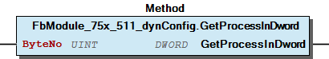 Graphical Interface of FbModule_75x_511_dynConfig.GetProcessInDword

## FbModule_75x_511_dynConfig.GetProcessInWord (METH)


| Scope | Name | Type | Comment |
| --- | --- | --- | --- |
| Return | GetProcessInWord | WORD |  |
| Input | ByteNo | UINT | range 0..(_uiInputSize - 2) |

Graphical Illustration

Graphical Interface of FbModule_75x_511_dynConfig.GetProcessInWord

Interface variables Function Get the process input word specified by ByteNo of this module. Graphical Illustration 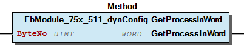 Graphical Interface of FbModule_75x_511_dynConfig.GetProcessInWord

## FbModule_75x_511_dynConfig.GetProcessOutBit (METH)


| Scope | Name | Type | Comment |
| --- | --- | --- | --- |
| Return | GetProcessOutBit | BOOL |  |
| Input | ByteNo | UINT | range 0..(_uiOutputSize - 1) |
| BitNo | USINT | range 0..7 |

## FbModule_75x_511_dynConfig.GetProcessOutByte (METH)


| Scope | Name | Type | Comment |
| --- | --- | --- | --- |
| Return | GetProcessOutByte | BYTE |  |
| Input | ByteNo | UINT | range 0..(_uiOutputSize - 1) |

## FbModule_75x_511_dynConfig.GetProcessOutData (METH)


| Scope | Name | Type | Comment |
| --- | --- | --- | --- |
| Return | GetProcessOutData | UINT |  |
| Input | pOutData | POINTER TO BYTE | pointer to the area where the process data should store |
| uiNOutData | UINT | SIZEOF(Buffer) |

## FbModule_75x_511_dynConfig.GetProcessOutDword (METH)


| Scope | Name | Type | Comment |
| --- | --- | --- | --- |
| Return | GetProcessOutDword | DWORD |  |
| Input | ByteNo | UINT | range 0..(_uiOutputSize - 4) |

Graphical Illustration

Graphical Interface of FbModule_75x_511_dynConfig.GetProcessOutDword

Interface variables Function Get the process output dword specified by ByteNo of this module. Graphical Illustration 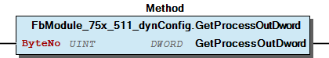 Graphical Interface of FbModule_75x_511_dynConfig.GetProcessOutDword

## FbModule_75x_511_dynConfig.GetProcessOutWord (METH)


| Scope | Name | Type | Comment |
| --- | --- | --- | --- |
| Return | GetProcessOutWord | WORD |  |
| Input | ByteNo | UINT | range 0..(_uiOutputSize - 2) |

Graphical Illustration

Graphical Interface of FbModule_75x_511_dynConfig.GetProcessOutWord

Interface variables Function Get the process output word specified by ByteNo of this module. Graphical Illustration 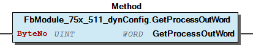 Graphical Interface of FbModule_75x_511_dynConfig.GetProcessOutWord

## FbModule_75x_511_dynConfig.SetProcessOutBit (METH)


| Scope | Name | Type | Comment |
| --- | --- | --- | --- |
| Input | ByteNo | UINT | range 0..(_uiOutputSize - 1) |
| BitNo | USINT | range 0..7 |
| OutData | BOOL |  |

## FbModule_75x_511_dynConfig.SetProcessOutByte (METH)


| Scope | Name | Type | Comment |
| --- | --- | --- | --- |
| Input | ByteNo | UINT | range 0..(_uiOutputSize - 1) |
| OutData | BYTE |  |

## FbModule_75x_511_dynConfig.SetProcessOutData (METH)


| Scope | Name | Type | Comment |
| --- | --- | --- | --- |
| Return | SetProcessOutData | UINT |  |
| Input | pOutData | POINTER TO BYTE | pointer to the area with the data to write |
| uiNOutData | UINT | SIZEOF(Buffer) |

## FbModule_75x_511_dynConfig.SetProcessOutDword (METH)


| Scope | Name | Type | Comment |
| --- | --- | --- | --- |
| Input | ByteNo | UINT | range 0..(_uiOutputSize - 4) |
| OutData | DWORD |  |

Graphical Illustration

Graphical Interface of FbModule_75x_511_dynConfig.SetProcessOutDword

Interface variables Function Set the process output dword specified by ByteNo to the value OutData . Graphical Illustration 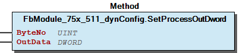 Graphical Interface of FbModule_75x_511_dynConfig.SetProcessOutDword

## FbModule_75x_511_dynConfig.SetProcessOutWord (METH)


| Scope | Name | Type | Comment |
| --- | --- | --- | --- |
| Input | ByteNo | UINT | range 0..(_uiOutputSize - 2) |
| OutData | WORD |  |

Graphical Illustration

Graphical Interface of FbModule_75x_511_dynConfig.SetProcessOutWord

Interface variables Function Set the process output word specified by ByteNo to the value OutData . Graphical Illustration 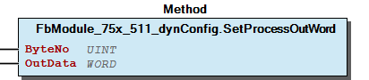 Graphical Interface of FbModule_75x_511_dynConfig.SetProcessOutWord

## FbModule_75x_511_dynConfig.SetRawProcessValue (METH)


| Scope | Name | Type |
| --- | --- | --- |
| Return | SetRawProcessValue | eError_511 |
| Input | usiChannel | USINT (1..2) |
| wValue | WORD |

```
VAR
    myProcessValue  :   word;
END_VAR

my511.SetRawProcessValue(1,myProcessValue);
```

Graphical Illustration

Graphical Interface of FbModule_75x_511_dynConfig.SetRawProcessValue

Interface variables Function Set the raw process value for the selected channel Graphical Illustration 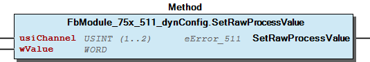 Graphical Interface of FbModule_75x_511_dynConfig.SetRawProcessValue Example Set the process value from first channel of the module.

## FbModule_75x_511_dynConfig.SetScaledProcessValue (METH)


| Scope | Name | Type | Comment |
| --- | --- | --- | --- |
| Return | SetScaledProcessValue | eError_511 |  |
| Input | usiChannel | USINT (1..2) |  |
| rDutyCycle | REAL | % |

```
VAR
    my511   :   FbModule_750_511_dynConfig;
END_VAR

my511.ScaledSetProcessValue(1,55.4); // DutyCycle from channel 1 is set to 55.4%
```

Graphical Illustration

Graphical Interface of FbModule_75x_511_dynConfig.SetScaledProcessValue

Interface variables Function Set the scaled process value of the appropriate channel. The range of the value depends on the module. Graphical Illustration 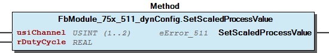 Graphical Interface of FbModule_75x_511_dynConfig.SetScaledProcessValue Example Set the process value from first channel of the module.

### Program Organization


## 20 Program Organization Units


- FbModule_75x_511 (FB) I_Module_75x_511 Configuration FbModule_75x_511.GetModulePeriodDuration (METH) - FbModule_75x_511.GetModulePulseFrequency (METH) - FbModule_75x_511.SetModulePeriodDuration (METH) - FbModule_75x_511.SetModulePulseFrequency (METH) FbModule_75x_511_dynConfig (FB) - I_ModuleProcessInputsExtended FbModule_75x_511_dynConfig.GetModuleInputSize (METH) - FbModule_75x_511_dynConfig.GetProcessInBit (METH) - FbModule_75x_511_dynConfig.GetProcessInByte (METH) - FbModule_75x_511_dynConfig.GetProcessInData (METH) - FbModule_75x_511_dynConfig.GetProcessInDword (METH) - FbModule_75x_511_dynConfig.GetProcessInWord (METH) I_ModuleProcessOutputsExtended - FbModule_75x_511_dynConfig.GetModuleOutputSize (METH) - FbModule_75x_511_dynConfig.GetProcessOutBit (METH) - FbModule_75x_511_dynConfig.GetProcessOutByte (METH) - FbModule_75x_511_dynConfig.GetProcessOutData (METH) - FbModule_75x_511_dynConfig.GetProcessOutDword (METH) - FbModule_75x_511_dynConfig.GetProcessOutWord (METH) - FbModule_75x_511_dynConfig.SetProcessOutBit (METH) - FbModule_75x_511_dynConfig.SetProcessOutByte (METH) - FbModule_75x_511_dynConfig.SetProcessOutData (METH) - FbModule_75x_511_dynConfig.SetProcessOutDword (METH) - FbModule_75x_511_dynConfig.SetProcessOutWord (METH) ProcessValues - FbModule_75x_511_dynConfig.SetRawProcessValue (METH) - FbModule_75x_511_dynConfig.SetScaledProcessValue (METH)

### Global Variable Lists


## Error_511 (GVL)


| Scope | Name | Type |
| --- | --- | --- |
| Constant | ERROR_511 | ARRAY [0..3] OF WagoTypesErrorBase.typResultItem |

| Value | Level | Description |
| --- | --- | --- |
| eError_511.OK | WagoTypesErrorBase.eSeverity.none | ‘OK’ |
| eError_511.INVALID_CHANNEL | WagoTypesErrorBase.eSeverity.error | ‘The channel number is not allowed’ |

## VersionHistory (GVL)


| Name | Type |
| --- | --- |
| Info | ProjectInfo |

| date | version | author | change |
| 20.02.2024 | 1.10.9.3 | u010663 | Compiled SP16.3 |
| 03.05.2023 | 1.10.9.2 | u010545 | WAT35681 -> bugfix SetScaledProcessValue |
| 20.09.2021 | 1.10.9.1 | u010545 | Update documentation -> WAT33562 |
| 05.06.2020 | 1.10.9.0 | u010545 | change to WagoSysModuleBaseProtected 1.9.9.0 |
| 23.09.2019 | 1.10.5.0 | u010545 | Struct of PA modified |
| 04.09.2019 | 1.10.4.1 | u010545 | Interface for dyn config pa access added |
| 06.08.2019 | 1.10.4.0 | u010545 | Interface for dyn config pa access added |
| 16.07.2019 | 1.10.3.0 | u010545 | Interface for dyn config added |
| 08.01.2019 | 1.10.1.0 | u015842 | Properties: free placeholder added |
| 29.05.2018 | 1.10.0.1 | u010545 | workaround for 511 frequency bug implemented |
| 20.04.2018 | 1.10.0.0 | u010545 | add new methods |
| 03.01.2018 | 1.9.1.1 | u010545 | bugfix |
| 01.12.2017 | 1.9.1.0 | u010545 | check for ordernumber implemented |
| 29.07.2017 | 1.9.0.0 | u010545 | changed for compability with old WagoSysModuleBase |
| 19.09.2017 | 1.8.0.0 | u010663 | released |

WagoSysModule_75x_511.library

Release Notes:

WagoSysModule_75x_511.library Release Notes:

### Other Components


## 80 Status ¶


- Error_511 (GVL) - eError_511 (ENUM)

## Configuration


- FbModule_75x_511.GetModulePeriodDuration (METH) - FbModule_75x_511.GetModulePulseFrequency (METH) - FbModule_75x_511.SetModulePeriodDuration (METH) - FbModule_75x_511.SetModulePulseFrequency (METH)

## I_ModuleProcessInputsExtended


- FbModule_75x_511_dynConfig.GetModuleInputSize (METH) - FbModule_75x_511_dynConfig.GetProcessInBit (METH) - FbModule_75x_511_dynConfig.GetProcessInByte (METH) - FbModule_75x_511_dynConfig.GetProcessInData (METH) - FbModule_75x_511_dynConfig.GetProcessInDword (METH) - FbModule_75x_511_dynConfig.GetProcessInWord (METH)

## I_ModuleProcessOutputsExtended


- FbModule_75x_511_dynConfig.GetModuleOutputSize (METH) - FbModule_75x_511_dynConfig.GetProcessOutBit (METH) - FbModule_75x_511_dynConfig.GetProcessOutByte (METH) - FbModule_75x_511_dynConfig.GetProcessOutData (METH) - FbModule_75x_511_dynConfig.GetProcessOutDword (METH) - FbModule_75x_511_dynConfig.GetProcessOutWord (METH) - FbModule_75x_511_dynConfig.SetProcessOutBit (METH) - FbModule_75x_511_dynConfig.SetProcessOutByte (METH) - FbModule_75x_511_dynConfig.SetProcessOutData (METH) - FbModule_75x_511_dynConfig.SetProcessOutDword (METH) - FbModule_75x_511_dynConfig.SetProcessOutWord (METH)

## I_Module_75x_511


- Configuration FbModule_75x_511.GetModulePeriodDuration (METH) - FbModule_75x_511.GetModulePulseFrequency (METH) - FbModule_75x_511.SetModulePeriodDuration (METH) - FbModule_75x_511.SetModulePulseFrequency (METH)

## ProcessValues


- FbModule_75x_511_dynConfig.SetRawProcessValue (METH) - FbModule_75x_511_dynConfig.SetScaledProcessValue (METH)

## eError_511 (ENUM)


| Name | Initial | Comment |
| --- | --- | --- |
| OK | 0 | all is well |
| INVALID_CHANNEL | 1 | invalid channel number |