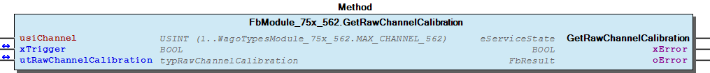
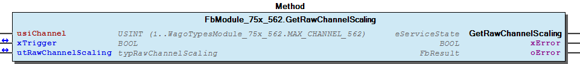
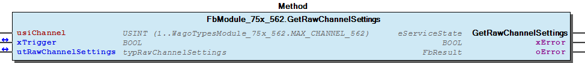
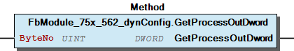
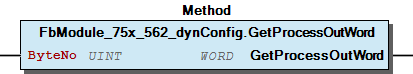
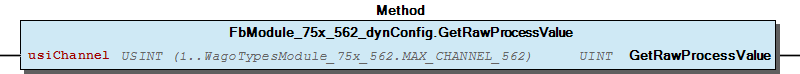
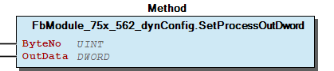
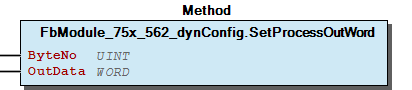
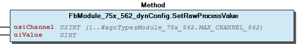

# WagoSysModule_75x_562 v1.9.4.0 (WAGO) - Complete Documentation


## 📋 Library Information

- **Company:** WAGO
- **Title:** WagoSysModule_75x_562
- **Version:** 1.9.4.0
- **Categories:** WAGO LayerView|Sys; Application
- **Author:** WAGO
- **Placeholder:** WagoSysModule_75x_562

### Description ¶


This document is automatically generated. Because of this, the chapter 30 Visualization is not shown in this document. If you are interested in getting to know more about visualization, we refer to the library manager of e!Cockpit.

Handling modules 75x-562 [1]

This document is automatically generated. Because of this, the chapter 30 Visualization is not shown in this document. If you are interested in getting to know more about visualization, we refer to the library manager of e!Cockpit. Handling modules 75x-562 [1]

### Contents: ¶


Contents: - Documentation Index - Project Information - Library Information - Function Blocks FbModule_75x_562 (FB) - FbModule_75x_562_dynConfig (FB) Methods - FbModule_75x_562.GetRawChannelCalibration (METH) - FbModule_75x_562.GetRawChannelConfiguration (METH) - FbModule_75x_562.GetRawChannelScaling (METH) - FbModule_75x_562.GetRawChannelSettings (METH) - FbModule_75x_562.SetRawChannelCalibration (METH) - FbModule_75x_562.SetRawChannelConfiguration (METH) - FbModule_75x_562.SetRawChannelScaling (METH) - FbModule_75x_562.SetRawChannelSettings (METH) - FbModule_75x_562_dynConfig.GetModuleOutputSize (METH) - FbModule_75x_562_dynConfig.GetProcessOutBit (METH) - ... and 11 more Program Organization Global Variable Lists - Error_562 (GVL) - VersionHistory (GVL) Other Components - 80 Status - Channel - I_ModuleProcessOutputsExtended - I_Module_75x_562 - eError_562 (ENUM)

### Indices and tables ¶


| [1] | Based on WagoSysModule_75x_562.library, last modified 05.11.2019, 21:04:05. The content of this file was automatically generated with None on 05.11.2019, 21:04:11 |

© WAGO Kontakttechnik GmbH & Co. KG, Germany 2018 – All rights reserved. For the avoidance of doubt, this copyright notice does not only apply to the information above but also and primarily to the described library itself. Please note that third-party products are always mentioned without reference to intellectual property rights, including patents, utility models, designs and trademarks, accordingly the existence of such rights cannot be excluded. WAGO is a registered trademark of WAGO Verwaltungsgesellschaft mbH.

- File and Project Information - Library Reference © WAGO Kontakttechnik GmbH & Co. KG, Germany 2018 – All rights reserved. For the avoidance of doubt, this copyright notice does not only apply to the information above but also and primarily to the described library itself. Please note that third-party products are always mentioned without reference to intellectual property rights, including patents, utility models, designs and trademarks, accordingly the existence of such rights cannot be excluded. WAGO is a registered trademark of WAGO Verwaltungsgesellschaft mbH.

### Documentation Index


## WagoSysModule_75x_562 Library Documentation


| Company: | WAGO |
| Title: | WagoSysModule_75x_562 |
| Version: | 1.9.4.0 |
| Categories: | WAGO LayerView\|Sys; Application |
| Author: | WAGO |
| Placeholder: | WagoSysModule_75x_562 |

### Description


This document is automatically generated. Because of this, the chapter 30 Visualization is not shown in this document. If you are interested in getting to know more about visualization, we refer to the library manager of e!Cockpit.

Handling modules 75x-562 [1]

This document is automatically generated. Because of this, the chapter 30 Visualization is not shown in this document. If you are interested in getting to know more about visualization, we refer to the library manager of e!Cockpit. Handling modules 75x-562 [1]

### Contents:


- 20 Program Organization Units FbModule_75x_562 (FB) - FbModule_75x_562_dynConfig (FB) 80 Status - Error_562 (GVL) - eError_562 (ENUM) VersionHistory (GVL)

### Indices and tables


| [1] | Based on WagoSysModule_75x_562.library, last modified 05.11.2019, 21:04:05. The content of this file was automatically generated with None on 05.11.2019, 21:04:11 |

© WAGO Kontakttechnik GmbH & Co. KG, Germany 2018 – All rights reserved. For the avoidance of doubt, this copyright notice does not only apply to the information above but also and primarily to the described library itself. Please note that third-party products are always mentioned without reference to intellectual property rights, including patents, utility models, designs and trademarks, accordingly the existence of such rights cannot be excluded. WAGO is a registered trademark of WAGO Verwaltungsgesellschaft mbH.

- File and Project Information - Library Reference © WAGO Kontakttechnik GmbH & Co. KG, Germany 2018 – All rights reserved. For the avoidance of doubt, this copyright notice does not only apply to the information above but also and primarily to the described library itself. Please note that third-party products are always mentioned without reference to intellectual property rights, including patents, utility models, designs and trademarks, accordingly the existence of such rights cannot be excluded. WAGO is a registered trademark of WAGO Verwaltungsgesellschaft mbH.

### Project Information


## File and Project Information


| Scope | Name | Type | Content |
| --- | --- | --- | --- |
| FileHeader | libraryFile | string | WagoSysModule_75x_562.library |
| contentFile | WagoSysModule_75x_562_clr.json |
| productName | e!COCKPIT |
| creationDateTime | date | 05.11.2019, 21:04:11 |
| companyName | string | WAGO |
| ProjectInformation | LastModificationDateTime | date | 05.11.2019, 21:04:05 |
| Description | string | See: Description |
| Copyright | © WAGO Kontakttechnik GmbH & Co. KG, Germany 2018 – All rights reserved. |
| Author | WAGO |
| AutoResolveUnbound | bool | True |
| Placeholder | string | WagoSysModule_75x_562 |
| Company | WAGO |
| DocFormat | reStructuredText |
| Project | WagoSysModule_75x_562 |
| Version | version | 1.9.4.0 |
| ActivateSigning | bool | False |
| Title | string | WagoSysModule_75x_562 |
| LibraryCategories | library-category-list | WAGO LayerView\|Sys; Application |
| Version string | string |  |

### Library Information


## Library Reference


| LinkAllContent: False QualifiedOnly: False | SystemLibrary: False | Optional: False |

| LinkAllContent: False QualifiedOnly: False | SystemLibrary: False | Optional: False |

| LinkAllContent: False QualifiedOnly: False | SystemLibrary: False | Optional: False |

| LinkAllContent: False QualifiedOnly: False | SystemLibrary: False | Optional: False |

| LinkAllContent: False QualifiedOnly: False | SystemLibrary: False | Optional: False |

| LinkAllContent: False QualifiedOnly: False | SystemLibrary: False | Optional: False |

| LinkAllContent: False Optional: False | QualifiedOnly: True SystemLibrary: False | PublishSymbolsInContainer: True |

This is a dictionary of all referenced libraries and their name spaces.

This is a dictionary of all referenced libraries and their name spaces. WagoSysErrorBase Library Identification : Placeholder: WagoSysErrorBase Default Resolution: WagoSysErrorBase, * (WAGO) Namespace: WagoSysErrorBase Library Properties : WagoSysModuleBaseProtected Library Identification : Placeholder: WagoSysModuleBaseProtected Default Resolution: WagoSysModuleBaseProtected, * (WAGO) Namespace: WagoSysModuleBaseProtected Library Properties : Library Parameter : Parameter: REGISTER_COM_TIMEOUT = TIME#5s0ms Parameter: PARAMETER_COM_TIMEOUT = TIME#5s0ms WagoSysVersion Library Identification : Name: WagoSysVersion Version: 1.0.0.0 Company: WAGO Namespace: WagoSysVersion Library Properties : WagoTypesBusServices Library Identification : Placeholder: WagoTypesBusServices Default Resolution: WagoTypesBusServices, * (WAGO) Namespace: WagoTypesBusServices Library Properties : Library Parameter : Parameter: MAX_RUNNABLES = MAX_MODULE_QUANTITY Parameter: MAX_MODULE_QUANTITY = 250 WagoTypesCommon Library Identification : Placeholder: WagoTypesCommon Default Resolution: WagoTypesCommon, * (WAGO) Namespace: WagoTypes Library Properties : WagoTypesModuleBase Library Identification : Placeholder: WagoTypesModuleBase Default Resolution: WagoTypesModuleBase, * (WAGO) Namespace: WagoTypesModuleBase Library Properties : Library Parameter : Parameter: MAX_MODULE_OUTPUT_SIZE = 48 Parameter: MAX_MODULE_QUANTITY = 250 Parameter: MAX_MODULE_INPUT_SIZE = 48 Parameter: MAX_RUNNABLES = MAX_MODULE_QUANTITY Parameter: MBX_PIPE_SIZE = 1024 Parameter: MAX_MBX_SIZE = 18 Parameter: MAX_MBX1_SIZE = 18 Parameter: MAX_MBX_OUTPUT_SIZE = 47 Parameter: MAX_MBX_INPUT_SIZE = 47 WagoTypesModule_75x_562 Library Identification : Placeholder: WagoTypesModule_75x_562 Default Resolution: WagoTypesModule_75x_562, * (WAGO) Namespace: WagoTypesModule_75x_562 Library Properties :

### Function Blocks


## FbModule_75x_562 (FB)


Access to the module 750-562

Function description

This block is needed for each module. The instance of this function block is either automatically generated by the K-Bus configuration or has to be manually added in case of the dynamic configuration.

Function Access to the module 750-562 Function description This block is needed for each module. The instance of this function block is either automatically generated by the K-Bus configuration or has to be manually added in case of the dynamic configuration. - I_Module_75x_562 Channel FbModule_75x_562.GetRawChannelCalibration (METH) - FbModule_75x_562.GetRawChannelScaling (METH) - FbModule_75x_562.GetRawChannelSettings (METH) - FbModule_75x_562.SetRawChannelCalibration (METH) - FbModule_75x_562.SetRawChannelScaling (METH) - FbModule_75x_562.SetRawChannelSettings (METH) FbModule_75x_562.GetRawChannelConfiguration (METH) FbModule_75x_562.SetRawChannelConfiguration (METH)

## FbModule_75x_562_dynConfig (FB)


Function description

Function Access to the module 750-563 with PA-Access In case of dynamic configuration the FB provides additional the PA-Access. Function description This block is needed for each module. The instance of this function block has to be manually added in case of the dynamic configuration. - FbModule_75x_562_dynConfig.GetRawProcessValue (METH) - I_ModuleProcessOutputsExtended FbModule_75x_562_dynConfig.GetModuleOutputSize (METH) - FbModule_75x_562_dynConfig.GetProcessOutBit (METH) - FbModule_75x_562_dynConfig.GetProcessOutByte (METH) - FbModule_75x_562_dynConfig.GetProcessOutData (METH) - FbModule_75x_562_dynConfig.GetProcessOutDword (METH) - FbModule_75x_562_dynConfig.GetProcessOutWord (METH) - FbModule_75x_562_dynConfig.SetProcessOutBit (METH) - FbModule_75x_562_dynConfig.SetProcessOutByte (METH) - FbModule_75x_562_dynConfig.SetProcessOutData (METH) - FbModule_75x_562_dynConfig.SetProcessOutDword (METH) - FbModule_75x_562_dynConfig.SetProcessOutWord (METH) FbModule_75x_562_dynConfig.SetRawProcessValue (METH)

### Methods


## FbModule_75x_562.GetRawChannelCalibration (METH)


| Scope | Name | Type |
| --- | --- | --- |
| Return | GetRawChannelCalibration | WagoTypesModuleBase.eServiceState |
| Input | usiChannel | USINT (1..WagoTypesModule_75x_562.MAX_CHANNEL_562) |
| Inout | xTrigger | BOOL |
| utRawChannelCalibration | WagoTypesModule_75x_562.typRawChannelCalibration |
| Output | xError | BOOL |
| oError | WagoSysErrorBase.FbResult |

| Struct member | Value | Description |
| --- | --- | --- |
| xUserCalibration | FALSE | The user scaling is switched off |
| TRUE | The user scaling is switched on |
| iUserCalibrationOffset | -32768 ... 32767 | User calibration Offset |
| uiUserCalibrationGain | 0 ... 65535 | User calibration Gain * 1/8192 |

```
VAR
    //--- Channel Calibration ---------------------------------
    utChannelCalibration    :   WagoTypesModule_75x_562.typRawChannelCalibration;;
    xGetChannelCalibration  :   BOOL;
    oError                  :   WagoSysErrorBase.FbResult;
END_VAR

//--- C H A N N E L    C A L I B R A T I O N -----------------------
CASE my562.GetRawChannelCalibration(    usiChannel              := 1,
                                        xTrigger                := xGetChannelCalibration,
                                        utRawChannelCalibration := utChannelCalibration,
                                        oError                  => oError
                                    ) OF

    eServiceState.DONE : // OK
            ;// process here your utModuleSettings

    eServiceState.ABORT : // Error
            ;// process here your error handling -> see oError for more information

END_CASE
```

WagoTypesModule_75x_562.typRawChannelCalibration

Graphical Illustration

Graphical Interface of FbModule_75x_562.GetRawChannelCalibration

For get the calibration from channel one

You have to call the method cyclic until the method returns with DONE or ABORT.

Interface variables Function Get the calibration of a channel at a struct. WagoTypesModule_75x_562.typRawChannelCalibration Graphical Illustration  Graphical Interface of FbModule_75x_562.GetRawChannelCalibration Example For get the calibration from channel one Note You have to call the method cyclic until the method returns with DONE or ABORT.

## FbModule_75x_562.GetRawChannelConfiguration (METH)


| Scope | Name | Type |
| --- | --- | --- |
| Return | GetRawChannelConfiguration | WagoTypesModuleBase.eServiceState |
| Input | usiChannel | USINT (1..WagoTypesModule_75x_562.MAX_CHANNEL_562) |
| Inout | xTrigger | BOOL |
| utRawChannelConfiguration | WagoTypesModule_75x_562.typRawChannelConfiguration |
| Output | xError | BOOL |
| oError | WagoSysErrorBase.FbResult |

| Struct member | Value | Description |
| --- | --- | --- |
| Settings | eSignalType | Operation Mode |
| VOLTAGE_PLUS_10V | 0 ... 10V |
| VOLTAGE_PLUS_MINUS_10V | +/- 10V |
|  |  |  |
| eNumberFormat | Number Format |
| ABS_16BIT | 0..65535 |
| TWOS_COMPLEMENT | -32768..+32767 (Two’s Complement) |
| SIGN_MAGNITUDE | -32767..+32767 (Sign and magnitude) |
|  |  |  |
| xOutputHighImpedance | Output |
| FALSE | Output process value |
| TRUE | Output high impedance |
|  |  |  |
| ePowerOnDelay | Power-On Delay After Excess Temperature Shutdown |
| DELAY_0_MS | 0 ms Delay |
| DELAY_100_MS | 100 ms Delay |
| DELAY_200_MS | 200 ms Delay |
| DELAY_300_MS | 300 ms Delay |
| DELAY_500_MS | 500 ms Delay |
| DELAY_750_MS | 750 ms Delay |
| DELAY_1_S | 1 s Delay |
| DELAY_2_S | 2 s Delay |
|  |  |  |
| xEnableKeepLimitValues | Keep Limit Values |
| FALSE | Keep Limit Values disabled |
| TRUE | Keep Limit Values enabled |
| uiLowerLimitValue | 0 ... 65535 | Lower Limit Value |
| uiUpperLimitValue | 0 ... 65535 | Upper Limit Value |
|  |  |  |
| xEnableActionAtKbusTimeout | K-Bus Timeout Behaviour |
| FALSE | Keep last output value |
| TRUE | Execute the function at eActionAtKbusTimeout |
| eActionAtKbusTimeout | OUTPUT_NULL | Output 0V / 0A |
| KEEP_LAST_VALUE | Keep last value |
| MANUFACTURER_POWERON_VALUE | WAGO power-on value |
| USER_POWER_ON_VALUE | User power-on value |
| OUTPUT_HIGH_IMPEDANCE | Output high-impedance |
| uiUserPowerOnValue | 0 ... 65535 | User Power-On Value |
|  |  |  |  |
| Scaling | xUserScaling | FALSE | User scaling disabled |
| TRUE | User scaling enabled |
| iUserScalingOffset | -32768 ... 32767 | User scaling Offset |
| uiUserScalingGain | 0 ... 65535 | User scaling Gain -> 1/256 |
|  |  |  |  |
| Calibration | xUserCalibration | FALSE | The user scaling is switched off |
| TRUE | The user scaling is switched on |
| iUserCalibrationOffset | -32768 ... 32767 | User calibration Offset |
| uiUserCalibrationGain | 0 ... 65535 | User calibration Gain * 1/8192 |

```
VAR
    //--- Channel Configuration ---------------------------------
    utRawChannelConfiguration   :   WagoTypesModule_75x_562.typRawChannelConfiguration;
    xGetRawChannelConfiguration :   BOOL;
    oError                      :   WagoSysErrorBase.FbResult;
END_VAR

//--- C H A N N E L    C O N F I G U R A T I O N -----------------------
CASE my562.GetRawChannelConfiguration(  usiChannel                  := 1,
                                        xTrigger                    := xGetRawChannelConfiguration,
                                        utRawChannelConfiguration   := utRawChannelConfiguration,
                                        oError                      => oError
                                    ) OF

    eServiceState.DONE : // OK
            ;// process here your utChannelConfiguration

    eServiceState.ABORT : // Error
            ;// process here your error handling -> see oError for more information

END_CASE
```

WagoTypesModule_75x_562.typRawChannelConfiguration

Graphical Illustration

Graphical Interface of FbModule_75x_562.GetRawChannelConfiguration

For get the configuration from channel one

You have to call the method cyclic until the method returns with DONE or ABORT.

Interface variables Function Get the complete raw configuration of a channel. WagoTypesModule_75x_562.typRawChannelConfiguration Graphical Illustration  Graphical Interface of FbModule_75x_562.GetRawChannelConfiguration Example For get the configuration from channel one Note You have to call the method cyclic until the method returns with DONE or ABORT.

## FbModule_75x_562.GetRawChannelScaling (METH)


| Scope | Name | Type |
| --- | --- | --- |
| Return | GetRawChannelScaling | WagoTypesModuleBase.eServiceState |
| Input | usiChannel | USINT (1..WagoTypesModule_75x_562.MAX_CHANNEL_562) |
| Inout | xTrigger | BOOL |
| utRawChannelScaling | WagoTypesModule_75x_562.typRawChannelScaling |
| Output | xError | BOOL |
| oError | WagoSysErrorBase.FbResult |

| Struct member | Value | Description |
| --- | --- | --- |
| xUserScaling | FALSE | User scaling disabled |
| TRUE | User scaling enabled |
| iUserScalingOffset | -32768 ... 32767 | User scaling Offset |
| uiUserScalingGain | 0 ... 65535 | User scaling Gain -> 1/1024 |

```
VAR
    //--- Channel Settings ---------------------------------
    utChannelScaling    :   WagoTypesModule_75x_562.typRawChannelScaling;;
    xGetChannelScaling  :   BOOL;
    oError              :   WagoSysErrorBase.FbResult;
END_VAR

//--- C H A N N E L   S C A L I N G ------------------------
CASE my562.GetRawChannelScaling(    usiChannel           := 1,
                                    xTrigger             := xGetChannelScaling,
                                    utRawChannelScaling  := utChannelScaling,
                                    oError               => oError
                                ) OF

    eServiceState.DONE : // OK
            ;// process here your utModuleSettings

    eServiceState.ABORT : // Error
            ;// process here your error handling -> see oError for more information

END_CASE
```

WagoTypesModule_75x_562.typRawChannelScaling

Graphical Illustration

Graphical Interface of FbModule_75x_562.GetRawChannelScaling

For get the scaling from channel one

You have to call the method cyclic until the method returns with DONE or ABORT.

Interface variables Function Get the scaling of a channel at a struct. WagoTypesModule_75x_562.typRawChannelScaling Graphical Illustration  Graphical Interface of FbModule_75x_562.GetRawChannelScaling Example For get the scaling from channel one Note You have to call the method cyclic until the method returns with DONE or ABORT.

## FbModule_75x_562.GetRawChannelSettings (METH)


| Scope | Name | Type |
| --- | --- | --- |
| Return | GetRawChannelSettings | WagoTypesModuleBase.eServiceState |
| Input | usiChannel | USINT (1..WagoTypesModule_75x_562.MAX_CHANNEL_562) |
| Inout | xTrigger | BOOL |
| utRawChannelSettings | WagoTypesModule_75x_562.typRawChannelSettings |
| Output | xError | BOOL |
| oError | WagoSysErrorBase.FbResult |

| Struct member | Value | Description |
| --- | --- | --- |
| eSignalType | Operation Mode |
| VOLTAGE_PLUS_10V | 0 ... 10V |
| VOLTAGE_PLUS_MINUS_10V | +/- 10V |
|  |  |  |
| eNumberFormat | Number Format |
| ABS_16BIT | 0..65535 |
| TWOS_COMPLEMENT | -32768..+32767 (Two’s Complement) |
| SIGN_MAGNITUDE | -32767..+32767 (Sign and magnitude) |
|  |  |  |
| xOutputHighImpedance | Output |
| FALSE | Output process value |
| TRUE | Output high impedance |
|  |  |  |
| ePowerOnDelay | Power-On Delay After Excess Temperature Shutdown |
| DELAY_0_MS | 0 ms Delay |
| DELAY_100_MS | 100 ms Delay |
| DELAY_200_MS | 200 ms Delay |
| DELAY_300_MS | 300 ms Delay |
| DELAY_500_MS | 500 ms Delay |
| DELAY_750_MS | 750 ms Delay |
| DELAY_1_S | 1 s Delay |
| DELAY_2_S | 2 s Delay |
|  |  |  |
| xEnableKeepLimitValues | Keep Limit Values |
| FALSE | Keep Limit Values disabled |
| TRUE | Keep Limit Values enabled |
| uiLowerLimitValue | 0 ... 65535 | Lower Limit Value |
| uiUpperLimitValue | 0 ... 65535 | Upper Limit Value |
|  |  |  |
| xEnableActionAtKbusTimeout | K-Bus Timeout Behaviour |
| FALSE | Keep last output value |
| TRUE | Execute the function at eActionAtKbusTimeout |
| eActionAtKbusTimeout | OUTPUT_NULL | Output 0V / 0A |
| KEEP_LAST_VALUE | Keep last value |
| MANUFACTURER_POWERON_VALUE | WAGO power-on value |
| USER_POWER_ON_VALUE | User power-on value |
| OUTPUT_HIGH_IMPEDANCE | Output high-impedance |
| uiUserPowerOnValue | 0 ... 65535 | User Power-On Value |

```
VAR
    //--- Channel Settings ---------------------------------
    utChannelSettings   :   WagoTypesModule_75x_562.typRawChannelSettings;;
    xGetChannelSettings :   BOOL;
    oError              :   WagoSysErrorBase.FbResult;
END_VAR

//--- C H A N N E L   S E T T I N G S ----------------------
CASE my562.GetRawChannelSettings(   usiChannel           := 1,
                                    xTrigger             := xGetChannelSettings,
                                    utRawChannelSettings := utChannelSettings,
                                    oError               => oError
                                ) OF

    eServiceState.DONE : // OK
        ;// process here your utModuleSettings

    eServiceState.ABORT : // Error
        ;// process here your error handling -> see oError for more information

END_CASE
```

WagoTypesModule_75x_562.typRawChannelSettings

Graphical Illustration

Graphical Interface of FbModule_75x_562.GetRawChannelSettings

For get the settings from channel one

You have to call the method cyclic until the method returns with DONE or ABORT.

Interface variables Function Get the settings of a channel at a struct. WagoTypesModule_75x_562.typRawChannelSettings Graphical Illustration  Graphical Interface of FbModule_75x_562.GetRawChannelSettings Example For get the settings from channel one Note You have to call the method cyclic until the method returns with DONE or ABORT.

## FbModule_75x_562.SetRawChannelCalibration (METH)


| Scope | Name | Type |
| --- | --- | --- |
| Return | SetRawChannelCalibration | WagoTypesModuleBase.eServiceState |
| Input | usiChannel | USINT (1..WagoTypesModule_75x_562.MAX_CHANNEL_562) |
| Inout | xTrigger | BOOL |
| utRawChannelCalibration | WagoTypesModule_75x_562.typRawChannelCalibration |
| Output | xError | BOOL |
| oError | WagoSysErrorBase.FbResult |

| Struct member | Value | Description |
| --- | --- | --- |
| xUserCalibration | FALSE | The user scaling is switched off |
| TRUE | The user scaling is switched on |
| iUserCalibrationOffset | -32768 ... 32767 | User calibration Offset |
| uiUserCalibrationGain | 0 ... 65535 | User calibration Gain * 1/8192 |

```
VAR
    //--- Channel Calibration ---------------------------------
    utChannelCalibration    :   WagoTypesModule_75x_562.typRawChannelCalibration;;
    xSetChannelCalibration  :   BOOL;
    oError                  :   WagoSysErrorBase.FbResult;
END_VAR

//--- C H A N N E L    C A L I B R A T I O N -----------------------
CASE my562.SetRawChannelCalibration(    usiChannel              := 1,
                                        xTrigger                := xSetChannelCalibration,
                                        utRawChannelCalibration := utChannelCalibration,
                                        oError                  => oError
                                   ) OF

    eServiceState.DONE : // OK
            ;// process here your utModuleSettings

    eServiceState.ABORT : // Error
            ;// process here your error handling -> see oError for more information

END_CASE
```

WagoTypesModule_75x_562.typRawChannelCalibration

Graphical Illustration

Graphical Interface of FbModule_75x_562.SetRawChannelCalibration

For set the calibration of channel one

You have to call the method cyclic until the method returns with DONE or ABORT.

Interface variables Function Set the calibration of a channel by a struct. WagoTypesModule_75x_562.typRawChannelCalibration Graphical Illustration  Graphical Interface of FbModule_75x_562.SetRawChannelCalibration Example For set the calibration of channel one Note You have to call the method cyclic until the method returns with DONE or ABORT.

## FbModule_75x_562.SetRawChannelConfiguration (METH)


| Scope | Name | Type |
| --- | --- | --- |
| Return | SetRawChannelConfiguration | WagoTypesModuleBase.eServiceState |
| Input | usiChannel | USINT (1..WagoTypesModule_75x_562.MAX_CHANNEL_562) |
| Inout | xTrigger | BOOL |
| utRawChannelConfiguration | WagoTypesModule_75x_562.typRawChannelConfiguration |
| Output | xError | BOOL |
| oError | WagoSysErrorBase.FbResult |

| Struct member | Value | Description |
| --- | --- | --- |
| Settings | eSignalType | Operation Mode |
| VOLTAGE_PLUS_10V | 0 ... 10V |
| VOLTAGE_PLUS_MINUS_10V | +/- 10V |
|  |  |  |
| eNumberFormat | Number Format |
| ABS_16BIT | 0..65535 |
| TWOS_COMPLEMENT | -32768..+32767 (Two’s Complement) |
| SIGN_MAGNITUDE | -32767..+32767 (Sign and magnitude) |
|  |  |  |
| xOutputHighImpedance | Output |
| FALSE | Output process value |
| TRUE | Output high impedance |
|  |  |  |
| ePowerOnDelay | Power-On Delay After Excess Temperature Shutdown |
| DELAY_0_MS | 0 ms Delay |
| DELAY_100_MS | 100 ms Delay |
| DELAY_200_MS | 200 ms Delay |
| DELAY_300_MS | 300 ms Delay |
| DELAY_500_MS | 500 ms Delay |
| DELAY_750_MS | 750 ms Delay |
| DELAY_1_S | 1 s Delay |
| DELAY_2_S | 2 s Delay |
|  |  |  |
| xEnableKeepLimitValues | Keep Limit Values |
| FALSE | Keep Limit Values disabled |
| TRUE | Keep Limit Values enabled |
| uiLowerLimitValue | 0 ... 65535 | Lower Limit Value |
| uiUpperLimitValue | 0 ... 65535 | Upper Limit Value |
|  |  |  |
| xEnableActionAtKbusTimeout | K-Bus Timeout Behaviour |
| FALSE | Keep last output value |
| TRUE | Execute the function at eActionAtKbusTimeout |
| eActionAtKbusTimeout | OUTPUT_NULL | Output 0V / 0A |
| KEEP_LAST_VALUE | Keep last value |
| MANUFACTURER_POWERON_VALUE | WAGO power-on value |
| USER_POWER_ON_VALUE | User power-on value |
| OUTPUT_HIGH_IMPEDANCE | Output high-impedance |
| uiUserPowerOnValue | 0 ... 65535 | User Power-On Value |
|  |  |  |  |
| Scaling | xUserScaling | FALSE | User scaling disabled |
| TRUE | User scaling enabled |
| iUserScalingOffset | -32768 ... 32767 | User scaling Offset |
| uiUserScalingGain | 0 ... 65535 | User scaling Gain -> 1/256 |
|  |  |  |  |
| Calibration | xUserCalibration | FALSE | The user scaling is switched off |
| TRUE | The user scaling is switched on |
| iUserCalibrationOffset | -32768 ... 32767 | User calibration Offset |
| uiUserCalibrationGain | 0 ... 65535 | User calibration Gain * 1/8192 |

```
VAR
    //--- Channel Configuration -------------------------------------------------------
    xStartProcess               :   BOOL; // set this variable once to start the process -> this varibale will be automatic reset
    utRawChannelConfiguration   :   WagoTypesModule_75x_562.typRawChannelConfiguration;
    oError                      :   WagoSysErrorBase.FbResult;
    xSetRawChannelConfiguration :   BOOL;
END_VAR

//--- C H A N N E L    C O N F I G U R A T I O N -----------------------
//--- READ BEFORE WRITE --------------------------------------------------------------
CASE my562.GetRawChannelConfiguration( 1, xStartProcess, utRawChannelConfiguration, oError => oError) OF

    eServiceState.DONE : // OK -> actual configuration is successful read
        // change here your configuration
        // utRawChannelConfiguration... :=
        xSetRawChannelConfiguration := TRUE; // trigger write

    eServiceState.ABORT : // Error -> not able to read -> see oError
            ;// process here your error handling for read -> see oError for more information

END_CASE

//--- WRITE MODYFIED CONFIGURATION ---------------------------------------------------
CASE my562.SetRawChannelConfiguration( 1, xSetRawChannelConfiguration, utRawChannelConfiguration, oError => oError) OF

    eServiceState.DONE : // OK -> new configuration is written

    eServiceState.ABORT : // Error -> not able to write -> see oError
            ;// process here your error handling for write -> see oError for more information

END_CASE
```

WagoTypesModule_75x_562.typRawChannelConfiguration

Graphical Illustration

Graphical Interface of FbModule_75x_562.SetRawChannelConfiguration

For get the configuration from channel one and after read write the configuration

You have to call the method cyclic until the method returns with DONE or ABORT.

Interface variables Function Set the complete raw configuration of a channel. WagoTypesModule_75x_562.typRawChannelConfiguration Graphical Illustration  Graphical Interface of FbModule_75x_562.SetRawChannelConfiguration Example For get the configuration from channel one and after read write the configuration Note You have to call the method cyclic until the method returns with DONE or ABORT.

## FbModule_75x_562.SetRawChannelScaling (METH)


| Scope | Name | Type |
| --- | --- | --- |
| Return | SetRawChannelScaling | WagoTypesModuleBase.eServiceState |
| Input | usiChannel | USINT (1..WagoTypesModule_75x_562.MAX_CHANNEL_562) |
| Inout | xTrigger | BOOL |
| utRawChannelScaling | WagoTypesModule_75x_562.typRawChannelScaling |
| Output | xError | BOOL |
| oError | WagoSysErrorBase.FbResult |

| Struct member | Value | Description |
| --- | --- | --- |
| xUserScaling | FALSE | User scaling disabled |
| TRUE | User scaling enabled |
| iUserScalingOffset | -32768 ... 32767 | User scaling Offset |
| uiUserScalingGain | 0 ... 65535 | User scaling Gain -> 1/1024 |

```
VAR
    //--- Channel Settings ---------------------------------
    utChannelScaling    :   WagoTypesModule_75x_562.typRawChannelScaling;;
    xSetChannelScaling  :   BOOL;
    oError              :   WagoSysErrorBase.FbResult;
END_VAR

//--- C H A N N E L   S C A L I N G ------------------------
CASE my562.SetRawChannelScaling(    usiChannel          := 1,
                                    xTrigger            := xSetChannelScaling,
                                    utRawChannelScaling := utChannelScaling,
                                    oError              => oError
                                ) OF

    eServiceState.DONE : // OK
            ;// process here your utModuleSettings

    eServiceState.ABORT : // Error
            ;// process here your error handling -> see oError for more information

END_CASE
```

WagoTypesModule_75x_562.typRawChannelScaling

Graphical Illustration

Graphical Interface of FbModule_75x_562.SetRawChannelScaling

For set the scaling of channel one

You have to call the method cyclic until the method returns with DONE or ABORT.

Interface variables Function Set the scaling of a channel by a struct. WagoTypesModule_75x_562.typRawChannelScaling Graphical Illustration  Graphical Interface of FbModule_75x_562.SetRawChannelScaling Example For set the scaling of channel one Note You have to call the method cyclic until the method returns with DONE or ABORT.

## FbModule_75x_562.SetRawChannelSettings (METH)


| Scope | Name | Type |
| --- | --- | --- |
| Return | SetRawChannelSettings | WagoTypesModuleBase.eServiceState |
| Input | usiChannel | USINT (1..WagoTypesModule_75x_562.MAX_CHANNEL_562) |
| Inout | xTrigger | BOOL |
| utRawChannelSettings | WagoTypesModule_75x_562.typRawChannelSettings |
| Output | xError | BOOL |
| oError | WagoSysErrorBase.FbResult |

| Struct member | Value | Description |
| --- | --- | --- |
| eSignalType | Operation Mode |
| VOLTAGE_PLUS_10V | 0 ... 10V |
| VOLTAGE_PLUS_MINUS_10V | +/- 10V |
|  |  |  |
| eNumberFormat | Number Format |
| ABS_16BIT | 0..65535 |
| TWOS_COMPLEMENT | -32768..+32767 (Two’s Complement) |
| SIGN_MAGNITUDE | -32767..+32767 (Sign and magnitude) |
|  |  |  |
| xOutputHighImpedance | Output |
| FALSE | Output process value |
| TRUE | Output high impedance |
|  |  |  |
| ePowerOnDelay | Power-On Delay After Excess Temperature Shutdown |
| DELAY_0_MS | 0 ms Delay |
| DELAY_100_MS | 100 ms Delay |
| DELAY_200_MS | 200 ms Delay |
| DELAY_300_MS | 300 ms Delay |
| DELAY_500_MS | 500 ms Delay |
| DELAY_750_MS | 750 ms Delay |
| DELAY_1_S | 1 s Delay |
| DELAY_2_S | 2 s Delay |
|  |  |  |
| xEnableKeepLimitValues | Keep Limit Values |
| FALSE | Keep Limit Values disabled |
| TRUE | Keep Limit Values enabled |
| uiLowerLimitValue | 0 ... 65535 | Lower Limit Value |
| uiUpperLimitValue | 0 ... 65535 | Upper Limit Value |
|  |  |  |
| xEnableActionAtKbusTimeout | K-Bus Timeout Behaviour |
| FALSE | Keep last output value |
| TRUE | Execute the function at eActionAtKbusTimeout |
| eActionAtKbusTimeout | OUTPUT_NULL | Output 0V / 0A |
| KEEP_LAST_VALUE | Keep last value |
| MANUFACTURER_POWERON_VALUE | WAGO power-on value |
| USER_POWER_ON_VALUE | User power-on value |
| OUTPUT_HIGH_IMPEDANCE | Output high-impedance |
| uiUserPowerOnValue | 0 ... 65535 | User Power-On Value |

```
VAR
    //--- Channel Settings ---------------------------------
    utChannelSettings   :   WagoTypesModule_75x_562.typRawChannelSettings;;
    xSetChannelSettings :   BOOL;
    oError              :   WagoSysErrorBase.FbResult;
END_VAR

//--- C H A N N E L   S E T T I N G S ----------------------
CASE my562.SetRawChannelSettings(   usiChannel           := 1,
                                    xTrigger             := xSetChannelSettings,
                                    utRawChannelSettings := utChannelSettings,
                                    oError               => oError
                                ) OF

    eServiceState.DONE : // OK
        ;// process here your utModuleSettings

    eServiceState.ABORT : // Error
        ;// process here your error handling -> see oError for more information

END_CASE
```

WagoTypesModule_75x_562.typRawChannelSettings

Graphical Illustration

Graphical Interface of FbModule_75x_562.SetRawChannelSettings

For set the settings of channel one

You have to call the method cyclic until the method returns with DONE or ABORT.

Interface variables Function Set the settings for a channel by a struct. WagoTypesModule_75x_562.typRawChannelSettings Graphical Illustration  Graphical Interface of FbModule_75x_562.SetRawChannelSettings Example For set the settings of channel one Note You have to call the method cyclic until the method returns with DONE or ABORT.

## FbModule_75x_562_dynConfig.GetModuleOutputSize (METH)


| Scope | Name | Type |
| --- | --- | --- |
| Return | GetModuleOutputSize | UINT |

Returns the byte size of output data

Interface variables Returns the byte size of output data

## FbModule_75x_562_dynConfig.GetProcessOutBit (METH)


| Scope | Name | Type | Comment |
| --- | --- | --- | --- |
| Return | GetProcessOutBit | BOOL |  |
| Input | ByteNo | UINT | range 0..(_uiOutputSize - 1) |
| BitNo | USINT | range 0..7 |

## FbModule_75x_562_dynConfig.GetProcessOutByte (METH)


| Scope | Name | Type | Comment |
| --- | --- | --- | --- |
| Return | GetProcessOutByte | BYTE |  |
| Input | ByteNo | UINT | range 0..(_uiOutputSize - 1) |

## FbModule_75x_562_dynConfig.GetProcessOutData (METH)


| Scope | Name | Type | Comment |
| --- | --- | --- | --- |
| Return | GetProcessOutData | UINT |  |
| Input | pOutData | POINTER TO BYTE | pointer to the area where the process data should store |
| uiNOutData | UINT | SIZEOF(Buffer) |

## FbModule_75x_562_dynConfig.GetProcessOutDword (METH)


| Scope | Name | Type | Comment |
| --- | --- | --- | --- |
| Return | GetProcessOutDword | DWORD |  |
| Input | ByteNo | UINT | range 0..(_uiOutputSize - 4) |

Graphical Illustration

Graphical Interface of FbModule_75x_562_dynConfig.GetProcessOutDword

Interface variables Function Get the process output dword specified by ByteNo of this module. Graphical Illustration  Graphical Interface of FbModule_75x_562_dynConfig.GetProcessOutDword

## FbModule_75x_562_dynConfig.GetProcessOutWord (METH)


| Scope | Name | Type | Comment |
| --- | --- | --- | --- |
| Return | GetProcessOutWord | WORD |  |
| Input | ByteNo | UINT | range 0..(_uiOutputSize - 2) |

Graphical Illustration

Graphical Interface of FbModule_75x_562_dynConfig.GetProcessOutWord

Interface variables Function Get the process output word specified by ByteNo of this module. Graphical Illustration  Graphical Interface of FbModule_75x_562_dynConfig.GetProcessOutWord

## FbModule_75x_562_dynConfig.GetRawProcessValue (METH)


| Scope | Name | Type |
| --- | --- | --- |
| Return | GetRawProcessValue | UINT |
| Input | usiChannel | USINT (1..WagoTypesModule_75x_562.MAX_CHANNEL_562) |

```
VAR
    uiProcessValue  :   INT;
END_VAR

uiProcessValue := my563.GetProcessValue(1); // here is the process raw value as UINT
```

Get the raw process value of the wanted channel.

In case of error (e.g. an invalid channel number is given) it returns 65535 -> 16#FFFF.

Graphical Illustration

Graphical Interface of FbModule_75x_562_dynConfig.GetRawProcessValue

For get the process value from first channel of the module.

Interface variables Function Get the raw process value of the wanted channel. In case of error (e.g. an invalid channel number is given) it returns 65535 -> 16#FFFF. Graphical Illustration  Graphical Interface of FbModule_75x_562_dynConfig.GetRawProcessValue Example For get the process value from first channel of the module.

## FbModule_75x_562_dynConfig.SetProcessOutBit (METH)


| Scope | Name | Type | Comment |
| --- | --- | --- | --- |
| Input | ByteNo | UINT | range 0..(_uiOutputSize - 1) |
| BitNo | USINT | range 0..7 |
| OutData | BOOL |  |

## FbModule_75x_562_dynConfig.SetProcessOutByte (METH)


| Scope | Name | Type | Comment |
| --- | --- | --- | --- |
| Input | ByteNo | UINT | range 0..(_uiOutputSize - 1) |
| OutData | BYTE |  |

## FbModule_75x_562_dynConfig.SetProcessOutData (METH)


| Scope | Name | Type | Comment |
| --- | --- | --- | --- |
| Return | SetProcessOutData | UINT |  |
| Input | pOutData | POINTER TO BYTE | pointer to the area with the data to write |
| uiNOutData | UINT | SIZEOF(Buffer) |

## FbModule_75x_562_dynConfig.SetProcessOutDword (METH)


| Scope | Name | Type | Comment |
| --- | --- | --- | --- |
| Input | ByteNo | UINT | range 0..(_uiOutputSize - 4) |
| OutData | DWORD |  |

Graphical Illustration

Graphical Interface of FbModule_75x_562_dynConfig.SetProcessOutDword

Interface variables Function Set the process output dword specified by ByteNo to the value OutData . Graphical Illustration  Graphical Interface of FbModule_75x_562_dynConfig.SetProcessOutDword

## FbModule_75x_562_dynConfig.SetProcessOutWord (METH)


| Scope | Name | Type | Comment |
| --- | --- | --- | --- |
| Input | ByteNo | UINT | range 0..(_uiOutputSize - 2) |
| OutData | WORD |  |

Graphical Illustration

Graphical Interface of FbModule_75x_562_dynConfig.SetProcessOutWord

Interface variables Function Set the process output word specified by ByteNo to the value OutData . Graphical Illustration  Graphical Interface of FbModule_75x_562_dynConfig.SetProcessOutWord

## FbModule_75x_562_dynConfig.SetRawProcessValue (METH)


| Scope | Name | Type |
| --- | --- | --- |
| Input | usiChannel | USINT (1..WagoTypesModule_75x_562.MAX_CHANNEL_562) |
| uiValue | UINT |

```
my563.SetProcessValue(1, 16#1234);
```

Graphical Illustration

Graphical Interface of FbModule_75x_562_dynConfig.SetRawProcessValue

For set the process value 16#1234 to the first channel of the module.

Interface variables Function Set the raw process value of the wanted channel. Graphical Illustration  Graphical Interface of FbModule_75x_562_dynConfig.SetRawProcessValue Example For set the process value 16#1234 to the first channel of the module.

### Program Organization


## 20 Program Organization Units


- FbModule_75x_562 (FB) I_Module_75x_562 Channel FbModule_75x_562.GetRawChannelCalibration (METH) - FbModule_75x_562.GetRawChannelScaling (METH) - FbModule_75x_562.GetRawChannelSettings (METH) - FbModule_75x_562.SetRawChannelCalibration (METH) - FbModule_75x_562.SetRawChannelScaling (METH) - FbModule_75x_562.SetRawChannelSettings (METH) FbModule_75x_562.GetRawChannelConfiguration (METH) FbModule_75x_562.SetRawChannelConfiguration (METH) FbModule_75x_562_dynConfig (FB) - FbModule_75x_562_dynConfig.GetRawProcessValue (METH) - I_ModuleProcessOutputsExtended FbModule_75x_562_dynConfig.GetModuleOutputSize (METH) - FbModule_75x_562_dynConfig.GetProcessOutBit (METH) - FbModule_75x_562_dynConfig.GetProcessOutByte (METH) - FbModule_75x_562_dynConfig.GetProcessOutData (METH) - FbModule_75x_562_dynConfig.GetProcessOutDword (METH) - FbModule_75x_562_dynConfig.GetProcessOutWord (METH) - FbModule_75x_562_dynConfig.SetProcessOutBit (METH) - FbModule_75x_562_dynConfig.SetProcessOutByte (METH) - FbModule_75x_562_dynConfig.SetProcessOutData (METH) - FbModule_75x_562_dynConfig.SetProcessOutDword (METH) - FbModule_75x_562_dynConfig.SetProcessOutWord (METH) FbModule_75x_562_dynConfig.SetRawProcessValue (METH)

### Global Variable Lists


## Error_562 (GVL)


| Scope | Name | Type |
| --- | --- | --- |
| Constant | ERROR_562 | ARRAY [0..5] OF WagoTypesErrorBase.typResultItem |

| Value | Level | Description |
| --- | --- | --- |
| eError_562.OK | WagoTypesErrorBase.eSeverity.none | ‘OK’ |
| eError_562.INVALID_CHANNEL | WagoTypesErrorBase.eSeverity.error | ‘The wanted channel number is not allowed’ |
| eError_562.UNKNOWN_SIGNAL_TYPE | WagoTypesErrorBase.eSeverity.error | ‘Not supported signal type’ |
| eError_562.INVALID_NUMBER_FORMAT | WagoTypesErrorBase.eSeverity.error | ‘Invalid Number Format’ |
| eError_562.INVALID_POWERON_DELAY | WagoTypesErrorBase.eSeverity.error | ‘Invalid Power On Delay’ |
| eError_562.INVALID_ACTION_AT_KBUS_TIMEOUT | WagoTypesErrorBase.eSeverity.error | ‘Invalid Action At Kbus Timeout’ |

## VersionHistory (GVL)


| Name | Type |
| --- | --- |
| Info | ProjectInfo |

| date | version | author | change |
| 06.08.2019 | 1.9.4.0 | u010545 | Interface for dyn config pa access added |
| 16.07.2019 | 1.9.3.0 | u010545 | Interface for dyn config added |
| 08.01.2019 | 1.0.1.0 | u015842 | Properties: free placeholder added |
| 09.04.2018 | 1.0.0.0 | u010545 | first release |
| 05.04.2018 | 0.0.0.1 | u010545 | Init |

WagoSysModule_75x_562.library

Release Notes:

WagoSysModule_75x_562.library Release Notes:

### Other Components


## 80 Status ¶


- Error_562 (GVL) - eError_562 (ENUM)

## Channel


- FbModule_75x_562.GetRawChannelCalibration (METH) - FbModule_75x_562.GetRawChannelScaling (METH) - FbModule_75x_562.GetRawChannelSettings (METH) - FbModule_75x_562.SetRawChannelCalibration (METH) - FbModule_75x_562.SetRawChannelScaling (METH) - FbModule_75x_562.SetRawChannelSettings (METH)

## I_ModuleProcessOutputsExtended


- FbModule_75x_562_dynConfig.GetModuleOutputSize (METH) - FbModule_75x_562_dynConfig.GetProcessOutBit (METH) - FbModule_75x_562_dynConfig.GetProcessOutByte (METH) - FbModule_75x_562_dynConfig.GetProcessOutData (METH) - FbModule_75x_562_dynConfig.GetProcessOutDword (METH) - FbModule_75x_562_dynConfig.GetProcessOutWord (METH) - FbModule_75x_562_dynConfig.SetProcessOutBit (METH) - FbModule_75x_562_dynConfig.SetProcessOutByte (METH) - FbModule_75x_562_dynConfig.SetProcessOutData (METH) - FbModule_75x_562_dynConfig.SetProcessOutDword (METH) - FbModule_75x_562_dynConfig.SetProcessOutWord (METH)

## I_Module_75x_562


- Channel FbModule_75x_562.GetRawChannelCalibration (METH) - FbModule_75x_562.GetRawChannelScaling (METH) - FbModule_75x_562.GetRawChannelSettings (METH) - FbModule_75x_562.SetRawChannelCalibration (METH) - FbModule_75x_562.SetRawChannelScaling (METH) - FbModule_75x_562.SetRawChannelSettings (METH) FbModule_75x_562.GetRawChannelConfiguration (METH) FbModule_75x_562.SetRawChannelConfiguration (METH)

## eError_562 (ENUM)


| Name | Initial | Comment |
| --- | --- | --- |
| OK | 0 | all is well |
| INVALID_CHANNEL | 1 | invalid channel number |
| UNKNOWN_SIGNAL_TYPE | 2 |  |
| INVALID_NUMBER_FORMAT | 3 |  |
| INVALID_POWERON_DELAY | 4 |  |
| INVALID_ACTION_AT_KBUS_TIMEOUT | 5 |  |