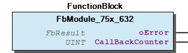

# WagoSysModule_75x_632 v1.8.1.0 (WAGO) - Complete Documentation

## 📋 Library Information

- **Company:** WAGO
- **Title:** WagoSysModule_75x_632
- **Version:** 1.8.1.0
- **Categories:** WAGO LayerView|Sys; Application
- **Author:** WAGO/u010663
- **Placeholder:** WagoSysModule_75x_632

### Description ¶

This document is automatically generated. Because of this, the chapter 30 Visualization is not shown in this document. If you are interested in getting to know more about visualization, we refer to the library manager of e!Cockpit.

Handling module 750-632 [1]

This document is automatically generated. Because of this, the chapter 30 Visualization is not shown in this document. If you are interested in getting to know more about visualization, we refer to the library manager of e!Cockpit. Handling module 750-632 [1]

### Contents: ¶

Contents: - Documentation Index - Project Information - Library Information - Function Blocks - Program Organization - Global Variable Lists

### Indices and tables ¶

| [1] | Based on WagoSysModule_75x_632.library, last modified 14.01.2019, 18:23:58. The content of this file was automatically generated with None on 14.01.2019, 18:24:00 |

© WAGO Kontakttechnik GmbH & Co. KG, Germany 2018 – All rights reserved. For the avoidance of doubt, this copyright notice does not only apply to the information above but also and primarily to the described library itself. Please note that third-party products are always mentioned without reference to intellectual property rights, including patents, utility models, designs and trademarks, accordingly the existence of such rights cannot be excluded. WAGO is a registered trademark of WAGO Verwaltungsgesellschaft mbH.

- File and Project Information - Library Reference © WAGO Kontakttechnik GmbH & Co. KG, Germany 2018 – All rights reserved. For the avoidance of doubt, this copyright notice does not only apply to the information above but also and primarily to the described library itself. Please note that third-party products are always mentioned without reference to intellectual property rights, including patents, utility models, designs and trademarks, accordingly the existence of such rights cannot be excluded. WAGO is a registered trademark of WAGO Verwaltungsgesellschaft mbH.

### Documentation Index

## WagoSysModule_75x_632 Library Documentation

| Company: | WAGO |
| Title: | WagoSysModule_75x_632 |
| Version: | 1.8.1.0 |
| Categories: | WAGO LayerView\|Sys; Application |
| Author: | WAGO/u010663 |
| Placeholder: | WagoSysModule_75x_632 |

### Description

This document is automatically generated. Because of this, the chapter 30 Visualization is not shown in this document. If you are interested in getting to know more about visualization, we refer to the library manager of e!Cockpit.

Handling module 750-632 [1]

This document is automatically generated. Because of this, the chapter 30 Visualization is not shown in this document. If you are interested in getting to know more about visualization, we refer to the library manager of e!Cockpit. Handling module 750-632 [1]

### Contents:

- 20 Program Organization Units FbModule_75x_632 (FB) VersionHistory (GVL)

### Indices and tables

| [1] | Based on WagoSysModule_75x_632.library, last modified 14.01.2019, 18:23:58. The content of this file was automatically generated with None on 14.01.2019, 18:24:00 |

© WAGO Kontakttechnik GmbH & Co. KG, Germany 2018 – All rights reserved. For the avoidance of doubt, this copyright notice does not only apply to the information above but also and primarily to the described library itself. Please note that third-party products are always mentioned without reference to intellectual property rights, including patents, utility models, designs and trademarks, accordingly the existence of such rights cannot be excluded. WAGO is a registered trademark of WAGO Verwaltungsgesellschaft mbH.

- File and Project Information - Library Reference © WAGO Kontakttechnik GmbH & Co. KG, Germany 2018 – All rights reserved. For the avoidance of doubt, this copyright notice does not only apply to the information above but also and primarily to the described library itself. Please note that third-party products are always mentioned without reference to intellectual property rights, including patents, utility models, designs and trademarks, accordingly the existence of such rights cannot be excluded. WAGO is a registered trademark of WAGO Verwaltungsgesellschaft mbH.

### Project Information

## File and Project Information

| Scope | Name | Type | Content |
| --- | --- | --- | --- |
| FileHeader | libraryFile | string | WagoSysModule_75x_632.library |
| contentFile | WagoSysModule_75x_632_clr.json |
| productName | e!COCKPIT |
| creationDateTime | date | 14.01.2019, 18:24:00 |
| companyName | string | WAGO |
| ProjectInformation | LastModificationDateTime | date | 14.01.2019, 18:23:58 |
| Description | string | See: Description |
| DocFormat | reStructuredText |
| Author | WAGO/u010663 |
| AutoResolveUnbound | bool | True |
| Placeholder | string | WagoSysModule_75x_632 |
| Company | WAGO |
| Title | WagoSysModule_75x_632 |
| Project | WagoSysModule_75x_632 |
| Copyright | © WAGO Kontakttechnik GmbH & Co. KG, Germany 2018 – All rights reserved. |
| Version | version | 1.8.1.0 |
| Version string | string |  |
| LibraryCategories | library-category-list | WAGO LayerView\|Sys; Application |

### Library Information

## Library Reference

| LinkAllContent: False QualifiedOnly: False | SystemLibrary: False | Optional: False |

| LinkAllContent: False QualifiedOnly: False | SystemLibrary: False | Optional: False |

| LinkAllContent: False Optional: False | QualifiedOnly: False SystemLibrary: False | PublishSymbolsInContainer: True |

| LinkAllContent: False QualifiedOnly: True | SystemLibrary: False | Optional: False |

| LinkAllContent: False QualifiedOnly: True | SystemLibrary: False | Optional: False |

This is a dictionary of all referenced libraries and their name spaces.

This is a dictionary of all referenced libraries and their name spaces. WagoSysModuleBase Library Identification : Placeholder: WagoSysModuleBase Default Resolution: WagoSysModuleBase, * (WAGO) Namespace: WagoSysModuleBase Library Properties : Library Parameter : Parameter: REGISTER_COM_TIMEOUT = TIME#5s0ms Parameter: PARAMETER_COM_TIMEOUT = TIME#5s0ms WagoSysVersion Library Identification : Name: WagoSysVersion Version: 1.0.0.0 Company: WAGO Namespace: WagoSysVersion Library Properties : WagoTypesBusServices Library Identification : Placeholder: WagoTypesBusServices Default Resolution: WagoTypesBusServices, * (WAGO) Namespace: WagoTypesBusServices Library Properties : WagoTypesModuleBase Library Identification : Placeholder: WagoTypesModuleBase Default Resolution: WagoTypesModuleBase, * (WAGO) Namespace: WagoTypesModuleBase Library Properties : Library Parameter : Parameter: MAX_MBX_SIZE = 18 WagoTypesModule_75x_632 Library Identification : Placeholder: WagoTypesModule_75x_632 Default Resolution: WagoTypesModule_75x_632, * (WAGO) Namespace: WagoTypesModule_75x_632 Library Properties :

### Function Blocks

## FbModule_75x_632 (FB)

| Scope | Name | Type | Comment | Inherited from |
| --- | --- | --- | --- | --- |
| Output | oError | WagoSysErrorBase.FbResult |  | FbModuleBase |
| CallBackCounter | UINT | callbacks from cycle control point | FbModuleMbx2 |

Access to the proportional valve module 750-632 This block is needed for each module. The instance of this function block is either automatically generated by the K-Bus configuration or has to be manually added in case of the dynamic configuration.

Graphical Illustration

Interface variables Function Access to the proportional valve module 750-632 This block is needed for each module. The instance of this function block is either automatically generated by the K-Bus configuration or has to be manually added in case of the dynamic configuration. Graphical Illustration 

### Program Organization

## 20 Program Organization Units

- FbModule_75x_632 (FB)

### Global Variable Lists

## VersionHistory (GVL)

| Name | Type |
| --- | --- |
| Info | ProjectInfo |

| date | version | author | change |
| 08.01.2019 | 1.8.1.0 | u015842 | Properties: free placeholder added |
| 13.11.2017 | 1.8.0.0 | u010663 | Allow change of pa size |
| 29.09.2015 | 1.5.0.1 | u010663 | Libraries inserted by placeholder |
| 25.08.2015 | 1.5.0.0 | u010663 | Placeholder added |

WagoSysModule_75x_632.library

Release Notes:

WagoSysModule_75x_632.library Release Notes: