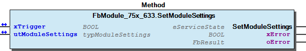
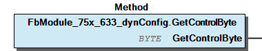
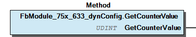
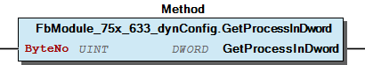
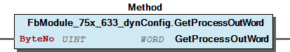
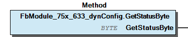
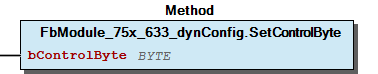
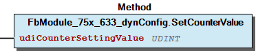
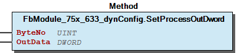
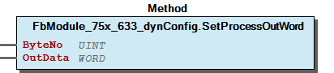

# WagoSysModule_75x_633 v1.9.6.1 (WAGO) - Complete Documentation


### Documentation Index


## WagoSysModule_75x_633 Library Documentation


WagoSysModule_75x_633

WAGO LayerView|Sys; Application

WagoSysModule_75x_633

This document is automatically generated.

Handling modules 750-633

Based on WagoSysModule_75x_633.library, last modified 15.05.2023, 18:16:05. LibDoc 4.1.1.0

© WAGO GmbH & Co. KG, Germany 2018 – All rights reserved. For the avoidance of doubt, this copyright notice does not only apply to the information above but also and primarily to the described library itself. Please note that third-party products are always mentioned without reference to intellectual property rights, including patents, utility models, designs and trademarks, accordingly the existence of such rights cannot be excluded. WAGO is a registered trademark of WAGO Verwaltungsgesellschaft mbH.

Company WAGO Title WagoSysModule_75x_633 Version 1.9.6.1 Categories WAGO LayerView|Sys; Application Author WAGO Placeholder WagoSysModule_75x_633 This document is automatically generated. Handling modules 750-633 - 20 Program Organization Units FbModule_75x_633 (FunctionBlock) - FbModule_75x_633_dynConfig (FunctionBlock) 80 Status - Error_633 (GVL) - eError_633 (Enum) VersionHistory (GVL) - File and Project Information - Library Reference Based on WagoSysModule_75x_633.library, last modified 15.05.2023, 18:16:05. LibDoc 4.1.1.0 © WAGO GmbH & Co. KG, Germany 2018 – All rights reserved. For the avoidance of doubt, this copyright notice does not only apply to the information above but also and primarily to the described library itself. Please note that third-party products are always mentioned without reference to intellectual property rights, including patents, utility models, designs and trademarks, accordingly the existence of such rights cannot be excluded. WAGO is a registered trademark of WAGO Verwaltungsgesellschaft mbH.

### Project Information


| Scope | Name | Type | Content |
| --- | --- | --- | --- |
| FileHeader | creationDateTime | date | 15.05.2023, 18:16:06 |
| companyName | string | WAGO |
| libraryFile | string | WagoSysModule_75x_633.library |
| productName | string | e!COCKPIT |
| contentFile | string | doc.clean.json |
| ProjectInformation | ActivateSigning | bool | False |
| ProjectInformation | AutoResolveUnbound | bool | True |
| ProjectInformation | LastModificationDateTime | 15.05.2023, 18:16:05 |
| ProjectInformation | LibraryCategories | library-category-list | WAGO LayerView\|Sys; Application |
| ProjectInformation | Author | string | WAGO |
| ProjectInformation | Company | string | WAGO |
| ProjectInformation | CompiledLibraryCompatibilityVersion | string | CODESYS V3.5 SP16 Patch 3 |
| ProjectInformation | Copyright | string | © WAGO Kontakttechnik GmbH & Co. KG, Germany 2018 – All rights reserved. |
| ProjectInformation | Description | string | See: Description |
| ProjectInformation | DocFormat | string | reStructuredText |
| ProjectInformation | Placeholder | string | WagoSysModule_75x_633 |
| ProjectInformation | Project | string | WagoSysModule_75x_633 |
| ProjectInformation | Title | string | WagoSysModule_75x_633 |
| ProjectInformation | Version string | string |  |
| ProjectInformation | Version | version | 1.9.6.1 |

### Library Information


| LinkAllContent: False Optional: False | QualifiedOnly: False | SystemLibrary: False |

| LinkAllContent: False Optional: False | QualifiedOnly: False | SystemLibrary: False |

| LinkAllContent: False Optional: False | QualifiedOnly: False | SystemLibrary: False |

| LinkAllContent: False Optional: False | QualifiedOnly: False | SystemLibrary: False |

| LinkAllContent: False Optional: False | QualifiedOnly: False | SystemLibrary: False |

| LinkAllContent: False Optional: False | PublishSymbolsInContainer: True QualifiedOnly: True | SystemLibrary: False |

| LinkAllContent: False Optional: False | PublishSymbolsInContainer: True QualifiedOnly: True | SystemLibrary: False |

This is a dictionary of all referenced libraries and their name spaces.

This is a dictionary of all referenced libraries and their name spaces. WagoSysErrorBase Library Identification : Placeholder: WagoSysErrorBase Default Resolution: WagoSysErrorBase, * (WAGO) Namespace: WagoSysErrorBase Library Properties : WagoSysModuleBaseProtected Library Identification : Placeholder: WagoSysModuleBaseProtected Default Resolution: WagoSysModuleBaseProtected, * (WAGO) Namespace: WagoSysModuleBaseProtected Library Properties : Library Parameter : Parameter: PARAMETER_COM_TIMEOUT = TIME#5s0ms Parameter: REGISTER_COM_TIMEOUT = TIME#5s0ms WagoSysVersion Library Identification : Name: WagoSysVersion Version: 1.0.0.0 Company: WAGO Namespace: WagoSysVersion Library Properties : WagoTypesBusServices Library Identification : Placeholder: WagoTypesBusServices Default Resolution: WagoTypesBusServices, * (WAGO) Namespace: WagoTypesBusServices Library Properties : Library Parameter : Parameter: MAX_MODULE_QUANTITY = 250 Parameter: MAX_RUNNABLES = MAX_MODULE_QUANTITY WagoTypesCommon Library Identification : Placeholder: WagoTypesCommon Default Resolution: WagoTypesCommon, * (WAGO) Namespace: WagoTypes Library Properties : Library Parameter : Parameter: MAX_STRING_LENGTH = 255 Parameter: MAX_WSTRING_LENGTH = 255 WagoTypesModuleBase Library Identification : Placeholder: WagoTypesModuleBase Default Resolution: WagoTypesModuleBase, * (WAGO) Namespace: WagoTypesModuleBase Library Properties : Library Parameter : Parameter: MAX_MBX1_SIZE = 18 Parameter: MAX_MBX_INPUT_SIZE = 47 Parameter: MAX_MBX_OUTPUT_SIZE = 47 Parameter: MAX_MBX_SIZE = 18 Parameter: MAX_MODULE_INPUT_SIZE = 48 Parameter: MAX_MODULE_OUTPUT_SIZE = 48 Parameter: MBX_PIPE_SIZE = 1024 WagoTypesModule_75x_633 Library Identification : Placeholder: WagoTypesModule_75x_633 Default Resolution: WagoTypesModule_75x_633, * (WAGO) Namespace: WagoTypesModule_75x_633 Library Properties :

### Function Blocks


## FbModule_75x_633 (FB)


| Scope | Name | Type | Inherited from |
| --- | --- | --- | --- |
| Output | oError | WagoSysErrorBase.FbResult | FbModuleBase |

Access to the module 750-633

Function description

This block is needed for each module. The instance of this function block is either automatically generated by the K-Bus configuration or has to be manually added in case of the dynamic configuration.

Interface variables Function Access to the module 750-633 Function description This block is needed for each module. The instance of this function block is either automatically generated by the K-Bus configuration or has to be manually added in case of the dynamic configuration. - I_Module_75x_633 Module GetModuleSettings (Method) - SetModuleSettings (Method)

## FbModule_75x_633_dynConfig (FB)


| Scope | Name | Type | Inherited from |
| --- | --- | --- | --- |
| Output | oError | WagoSysErrorBase.FbResult | FbModuleBase |

Access to the module 750-496 with PA-Access In case of dynamic configuration the FB provides additional the PA-Access.

Function description

This block is needed for each module. The instance of this function block has to be manually added in case of the dynamic configuration.

Interface variables Function Access to the module 750-496 with PA-Access In case of dynamic configuration the FB provides additional the PA-Access. Function description This block is needed for each module. The instance of this function block has to be manually added in case of the dynamic configuration. - GetControlByte (Method) - GetCounterValue (Method) - GetStatusByte (Method) - I_ModuleProcessInputsOutputsExtended I_ModuleProcessInputsExtended GetModuleInputSize (Method) - GetProcessInBit (Method) - GetProcessInByte (Method) - GetProcessInData (Method) - GetProcessInDword (Method) - GetProcessInWord (Method) I_ModuleProcessOutputsExtended - GetModuleOutputSize (Method) - GetProcessOutBit (Method) - GetProcessOutByte (Method) - GetProcessOutData (Method) - GetProcessOutDword (Method) - GetProcessOutWord (Method) - SetProcessOutBit (Method) - SetProcessOutByte (Method) - SetProcessOutData (Method) - SetProcessOutDword (Method) - SetProcessOutWord (Method) SetControlByte (Method) SetCounterValue (Method)

### Methods


## FbModule_75x_633.GetModuleSettings (METH)


| Scope | Name | Type |
| --- | --- | --- |
| Return | GetModuleSettings | WagoTypesModuleBase.eServiceState |
| Inout | xTrigger | BOOL |
| Inout | utModuleSettings | WagoTypesModule_75x_633.typModuleSettings |
| Output | xError | BOOL |
| Output | oError | WagoSysErrorBase.FbResult |

| Struct member | Value | Description |
| --- | --- | --- |
| eCountMode | COUNT_UP_GATE_INPUT | Up Counter / GATE Input |
| COUNT_UP_DOWN_SIGNALING_OUTPUT | Up / Down Counter / Signaling Output (DO) |
| COUNT_FREQUENCY | Frequency Counter |
| COUNT_PEAK_TIME | Peak Time Counter |
| xEnableDiag | FALSE | Disable Diagnosis (Namur) |
| TRUE | Enable Diagnosis (Namur) |
| xApplyDataFallingEdge | FALSE | Applying Data positive edge |
| TRUE | Applying Data negative edge |
| udiLimitOutput | 0 .. 4294967295 (0xFFFFFFFF) | Limit Output |
| xGateViaControlByte | FALSE | Disable GATE via physical input |
| TRUE | Enable GATE via control byte (Bit 3) |

| Return Value | Description |
| --- | --- |
| WagoTypesModuleBase.eServiceState.DONE | successful |
| WagoTypesModuleBase.eServiceState.ABORT | error -> see oError |
| WagoTypesModuleBase.eServiceState.NO_DATA | call while xTrigger is reset |

```
VAR
    //--- Module Mode Settings ------------------------------
    utModuleSettings    :   WagoTypesModule_75x_633.typModuleSettings;
    xGetModuleSettings  :   BOOL;  // triggers the function
    oError              :   WagoSysErrorBase.FbResult;
END_VAR

//--- M O D U L E    S E T T I N G S -----------------------
CASE my633.GetModuleSettings(xGetModuleSettings, utModuleSettings, oError => oError) OF

    eServiceState.DONE : // OK
            ;// process here your utModuleSettings

    eServiceState.ABORT : // Error
            ;// process here your error handling -> see oError for more information

END_CASE
```

Get the common settings of the module at a struct.

WagoTypesModule_75x_633.typModuleSettings

Return Values

It is not allowed to reset the xTrigger by the application. This must done by the method.

Graphical Illustration

Graphical Interface of FbModule_75x_633.GetModuleSettings

For get the settings from the module.

You have to call the method cyclic until the method returns with DONE or ABORT.

Interface variables Function Get the common settings of the module at a struct. WagoTypesModule_75x_633.typModuleSettings Return Values Warning It is not allowed to reset the xTrigger by the application. This must done by the method. Graphical Illustration  Graphical Interface of FbModule_75x_633.GetModuleSettings Example For get the settings from the module. Note You have to call the method cyclic until the method returns with DONE or ABORT.

## FbModule_75x_633.SetModuleSettings (METH)


| Scope | Name | Type |
| --- | --- | --- |
| Return | SetModuleSettings | WagoTypesModuleBase.eServiceState |
| Inout | xTrigger | BOOL |
| Inout | utModuleSettings | WagoTypesModule_75x_633.typModuleSettings |
| Output | xError | BOOL |
| Output | oError | WagoSysErrorBase.FbResult |

| Struct member | Value | Description |
| --- | --- | --- |
| eCountMode | COUNT_UP_GATE_INPUT | Up Counter / GATE Input |
| COUNT_UP_DOWN_SIGNALING_OUTPUT | Up / Down Counter / Signaling Output (DO) |
| COUNT_FREQUENCY | Frequency Counter |
| COUNT_PEAK_TIME | Peak Time Counter |
| xEnableDiag | FALSE | Disable Diagnosis (Namur) |
| TRUE | Enable Diagnosis (Namur) |
| xApplyDataFallingEdge | FALSE | Applying Data positive edge |
| TRUE | Applying Data negative edge |
| udiLimitOutput | 0 .. 4294967295 (0xFFFFFFFF) | Limit Output |
| xGateViaControlByte | FALSE | Disable GATE via physical input |
| TRUE | Enable GATE via control byte (Bit 3) |

| Return Value | Description |
| --- | --- |
| WagoTypesModuleBase.eServiceState.DONE | successful |
| WagoTypesModuleBase.eServiceState.ABORT | error -> see oError |
| WagoTypesModuleBase.eServiceState.NO_DATA | call while xTrigger is reset |

```
VAR
    //--- Module Mode Settings ------------------------------
    xStartProcess       :   BOOL; // set this variable once to start the process -> this varibale will be automatic reset
    utModuleSettings    :   WagoTypesModule_75x_633.typModuleSettings;
    oError              :   WagoSysErrorBase.FbResult;
    xSetModuleSettings  :   BOOL;  // triggers the function
END_VAR

//--- READ BEFORE WRITE --------------------------------------------------------------
CASE my633.GetModuleSettings(xStartProcess, utModuleSettings, oError => oError) OF

    eServiceState.DONE : // OK -> actual configuration is successful read
        // change here your configuration
        // utRawChannelConfiguration... :=
        xSetModuleSettings := TRUE; // trigger write

    eServiceState.ABORT : // Error -> not able to read -> see oError
            ;// process here your error handling for read -> see oError for more information

END_CASE

//--- S E T   M O D U L E    S E T T I N G S ---------------
CASE my633.SetModuleSettings(xSetModuleSettings, utModuleSettings, oError => oError) OF

    eServiceState.DONE : // OK

    eServiceState.ABORT : // Error
            ;// process here your error handling -> see oError for more information

END_CASE
```

Set the common settings of the module from a struct.

WagoTypesModule_75x_633.typModuleSettings

Return Values

It is not allowed to reset the xTrigger by the application. This must done by the method.

Graphical Illustration

Graphical Interface of FbModule_75x_633.SetModuleSettings

For set the settings from the module.

You have to call the method cyclic until the method returns with DONE or ABORT.

Interface variables Function Set the common settings of the module from a struct. WagoTypesModule_75x_633.typModuleSettings Return Values Warning It is not allowed to reset the xTrigger by the application. This must done by the method. Graphical Illustration  Graphical Interface of FbModule_75x_633.SetModuleSettings Example For set the settings from the module. Note You have to call the method cyclic until the method returns with DONE or ABORT.

## FbModule_75x_633_dynConfig.GetControlByte (METH)


| Scope | Name | Type |
| --- | --- | --- |
| Return | GetControlByte | BYTE |

| Counting Mode | Description |
| COUNT_UP_GATE_INPUT | Up Counter / GATE Input |
|  |
| Control Byte |
| Bit |  | Description |
| 0 | SET_DO_ON_CNT_VAL | Switch output DO depending on counter value |
| 1 | 0 | This value is always 0 and may not be changed |
| 2 | SET_DO | Set output DO |
| 3 | SET_GATE |  |
| 4 | CNT_INH | Disable counter |
| 5 | CNT_SET | Set counter |
| 6 | 0 | This value is always 0 and may not be changed |
| 7 | 0 | This value is always 0 and may not be changed |
|  |
| COUNT_UP_DOWN_SIGNALING_OUTPUT | Up / Down Counter / Signaling Output (DO) |
|  |
| Control Byte |
| Bit |  | Description |
| 0 | SET_DO_ON_CNT_VAL | Switch output DO depending on counter value |
| 1 | 0 | This value is always 0 and may not be changed |
| 2 | SET_DO | Set output DO |
| 3 | 0 | This value is always 0 and may not be changed |
| 4 | CNT_INH | Disable counter |
| 5 | CNT_SET | Set counter |
| 6 | 0 | This value is always 0 and may not be changed |
| 7 | 0 | This value is always 0 and may not be changed |
|  |
| COUNT_FREQUENCY | Frequency Counter |
|  |
| Control Byte |
| Bit |  | Description |
| 0 | RANGE_SEL_REQ0 |  |
| 1 | RANGE_SEL_REQ1 |  |
| 2 | SET_DO | Set output DO |
| 3 | SET_GATE |  |
| 4 | TWD_REQ |  |
| 5 | 0 | This value is always 0 and may not be changed |
| 6 | 0 | This value is always 0 and may not be changed |
| 7 | 0 | This value is always 0 and may not be changed |
|  |
| COUNT_PEAK_TIME | Peak Time Counter |
|  |
| Control Byte |
| Bit |  | Description |
| 0 | 0 | This value is always 0 and may not be changed |
| 1 | 0 | This value is always 0 and may not be changed |
| 2 | SET_DO | Set output DO |
| 3 | 0 | This value is always 0 and may not be changed |
| 4 | 0 | This value is always 0 and may not be changed |
| 5 | START_CNT | Start counter |
| 6 | 0 | This value is always 0 and may not be changed |
| 7 | 0 | This value is always 0 and may not be changed |
|  |

```
VAR
    myControl   :   BYTE;
END_VAR

myControl := my633.GetControlByte(); // here is the control byte
```

Get the control byte.

Graphical Illustration

Graphical Interface of FbModule_75x_633_dynConfig.GetControlByte

For get the control byte.

Interface variables Function Get the control byte. Graphical Illustration  Graphical Interface of FbModule_75x_633_dynConfig.GetControlByte Example For get the control byte.

## FbModule_75x_633_dynConfig.GetCounterValue (METH)


| Scope | Name | Type |
| --- | --- | --- |
| Return | GetCounterValue | UDINT |

```
VAR
    myCountValue    :   UDINT;
END_VAR

myCountValue := my633.GetCounterValue(); // here is the count value as UDINT
```

Get the raw count value.

Graphical Illustration

Graphical Interface of FbModule_75x_633_dynConfig.GetCounterValue

For get the count value.

Interface variables Function Get the raw count value. Graphical Illustration  Graphical Interface of FbModule_75x_633_dynConfig.GetCounterValue Example For get the count value.

## FbModule_75x_633_dynConfig.GetModuleInputSize (METH)


| Scope | Name | Type |
| --- | --- | --- |
| Return | GetModuleInputSize | UINT |

Returns the byte size of input data

Interface variables Returns the byte size of input data

## FbModule_75x_633_dynConfig.GetModuleOutputSize (METH)


| Scope | Name | Type |
| --- | --- | --- |
| Return | GetModuleOutputSize | UINT |

Returns the byte size of output data

Interface variables Returns the byte size of output data

## FbModule_75x_633_dynConfig.GetProcessInBit (METH)


| Scope | Name | Type | Comment |
| --- | --- | --- | --- |
| Return | GetProcessInBit | BOOL |  |
| Input | ByteNo | UINT | range 0..(_uiInputSize - 1) |
| Input | BitNo | USINT | range 0..7 |

## FbModule_75x_633_dynConfig.GetProcessInByte (METH)


| Scope | Name | Type | Comment |
| --- | --- | --- | --- |
| Return | GetProcessInByte | BYTE |  |
| Input | ByteNo | UINT | range 0..(_uiInputSize - 1) |

## FbModule_75x_633_dynConfig.GetProcessInData (METH)


| Scope | Name | Type | Comment |
| --- | --- | --- | --- |
| Return | GetProcessInData | UINT |  |
| Input | pInData | POINTER TO BYTE | pointer to the area where the process data should store |
| Input | uiNInData | UINT | SIZEOF(Buffer) |

## FbModule_75x_633_dynConfig.GetProcessInDword (METH)


| Scope | Name | Type | Comment |
| --- | --- | --- | --- |
| Return | GetProcessInDword | DWORD |  |
| Input | ByteNo | UINT | range 0..(_uiInputSize - 4) |

Get the process input dword specified by ByteNo of this module.

Graphical Illustration

Graphical Interface of FbModule_75x_633_dynConfig.GetProcessInDword

Interface variables Function Get the process input dword specified by ByteNo of this module. Graphical Illustration  Graphical Interface of FbModule_75x_633_dynConfig.GetProcessInDword

## FbModule_75x_633_dynConfig.GetProcessInWord (METH)


| Scope | Name | Type | Comment |
| --- | --- | --- | --- |
| Return | GetProcessInWord | WORD |  |
| Input | ByteNo | UINT | range 0..(_uiInputSize - 2) |

Get the process input word specified by ByteNo of this module.

Graphical Illustration

Graphical Interface of FbModule_75x_633_dynConfig.GetProcessInWord

Interface variables Function Get the process input word specified by ByteNo of this module. Graphical Illustration  Graphical Interface of FbModule_75x_633_dynConfig.GetProcessInWord

## FbModule_75x_633_dynConfig.GetProcessOutBit (METH)


| Scope | Name | Type | Comment |
| --- | --- | --- | --- |
| Return | GetProcessOutBit | BOOL |  |
| Input | ByteNo | UINT | range 0..(_uiOutputSize - 1) |
| Input | BitNo | USINT | range 0..7 |

## FbModule_75x_633_dynConfig.GetProcessOutByte (METH)


| Scope | Name | Type | Comment |
| --- | --- | --- | --- |
| Return | GetProcessOutByte | BYTE |  |
| Input | ByteNo | UINT | range 0..(_uiOutputSize - 1) |

## FbModule_75x_633_dynConfig.GetProcessOutData (METH)


| Scope | Name | Type | Comment |
| --- | --- | --- | --- |
| Return | GetProcessOutData | UINT |  |
| Input | pOutData | POINTER TO BYTE | pointer to the area where the process data should store |
| Input | uiNOutData | UINT | SIZEOF(Buffer) |

## FbModule_75x_633_dynConfig.GetProcessOutDword (METH)


| Scope | Name | Type | Comment |
| --- | --- | --- | --- |
| Return | GetProcessOutDword | DWORD |  |
| Input | ByteNo | UINT | range 0..(_uiOutputSize - 4) |

Get the process output dword specified by ByteNo of this module.

Graphical Illustration

Graphical Interface of FbModule_75x_633_dynConfig.GetProcessOutDword

Interface variables Function Get the process output dword specified by ByteNo of this module. Graphical Illustration  Graphical Interface of FbModule_75x_633_dynConfig.GetProcessOutDword

## FbModule_75x_633_dynConfig.GetProcessOutWord (METH)


| Scope | Name | Type | Comment |
| --- | --- | --- | --- |
| Return | GetProcessOutWord | WORD |  |
| Input | ByteNo | UINT | range 0..(_uiOutputSize - 2) |

Get the process output word specified by ByteNo of this module.

Graphical Illustration

Graphical Interface of FbModule_75x_633_dynConfig.GetProcessOutWord

Interface variables Function Get the process output word specified by ByteNo of this module. Graphical Illustration  Graphical Interface of FbModule_75x_633_dynConfig.GetProcessOutWord

## FbModule_75x_633_dynConfig.GetStatusByte (METH)


| Scope | Name | Type |
| --- | --- | --- |
| Return | GetStatusByte | BYTE |

| Counting Mode | Description |
| COUNT_UP_GATE_INPUT | Up Counter / GATE Input |
|  |
| Status Byte |
| Bit |  | Description |
| 0 | ST_CLK | State Input CLK |
| 1 | ST_GATE_PHY | State Gate Input (only valid if xGateViaControlByte = FALSE) |
| 2 | ST_DO | State output DO |
| 3 | ST_GATE_CB | State Gate Up Counter (only valid if xGateViaControlByte = TRUE) |
| 4 | CNT_INH | Feedback message counter locked |
| 5 | CNT_SET | Counter feedback message set |
| 6 | NAMUR_ERR | Namur error at input |
| 7 | x | unused |
|  |
| COUNT_UP_DOWN_SIGNALING_OUTPUT | Up / Down Counter / Signaling Output (DO) |
|  |
| Status Byte |
| Bit |  | Description |
| 0 | ST_CLK | State Input CLK |
| 1 | ST_U/D | State U/D Input |
| 2 | ST_DO | State output DO |
| 3 | x | unused |
| 4 | CNT_INH | Feedback message counter locked |
| 5 | CNT_SET | Counter feedback message set |
| 6 | NAMUR_ERR | Namur error at input |
| 7 | x | unused |
|  |
| COUNT_FREQUENCY | Frequency Counter |
|  |
| Status Byte |
| Bit |  | Description |
| 0 | RANGE_SEL_ACK0 | Acknowledge Range |
| 1 | RANGE_SEL_ACK1 |  |
| 2 | ST_DO | State output DO |
| 3 | ST_GATE_CB | State Gate Up Counter (only valid if xGateViaControlByte = TRUE) |
| 4 | TWD_ACK | Acknowledge Counter Set |
| 5 | ST_GATE_PHY | State Gate Input (only valid if xGateViaControlByte = FALSE) |
| 6 | NAMUR_ERR | Namur error at input |
| 7 | x | unused |
|  |
| COUNT_PEAK_TIME | Peak Time Counter |
|  |
| Status Byte |
| Bit |  | Description |
| 0 | TOGGLE |  |
| 1 | ST_U/D | State U/D Input |
| 2 | ST_DO | State output DO |
| 3 | x | unused |
| 4 | x | unused |
| 5 | START_ACK |  |
| 6 | NAMUR_ERR | Namur error at input |
| 7 | x | unused |
|  |

```
VAR
    myStatus    :   BYTE;
END_VAR

myStatus := my633.GetStatusByte(); // here is the status byte
```

Get the status byte.

Graphical Illustration

Graphical Interface of FbModule_75x_633_dynConfig.GetStatusByte

For get the status byte.

Interface variables Function Get the status byte. Graphical Illustration  Graphical Interface of FbModule_75x_633_dynConfig.GetStatusByte Example For get the status byte.

## FbModule_75x_633_dynConfig.SetControlByte (METH)


| Scope | Name | Type |
| --- | --- | --- |
| Input | bControlByte | BYTE |

| Counting Mode | Description |
| COUNT_UP_GATE_INPUT | Up Counter / GATE Input |
|  |
| Control Byte |
| Bit |  | Description |
| 0 | SET_DO_ON_CNT_VAL | Switch output DO depending on counter value |
| 1 | 0 | This value is always 0 and may not be changed |
| 2 | SET_DO | Set output DO |
| 3 | SET_GATE |  |
| 4 | CNT_INH | Disable counter |
| 5 | CNT_SET | Set counter |
| 6 | 0 | This value is always 0 and may not be changed |
| 7 | 0 | This value is always 0 and may not be changed |
|  |
| COUNT_UP_DOWN_SIGNALING_OUTPUT | Up / Down Counter / Signaling Output (DO) |
|  |
| Control Byte |
| Bit |  | Description |
| 0 | SET_DO_ON_CNT_VAL | Switch output DO depending on counter value |
| 1 | 0 | This value is always 0 and may not be changed |
| 2 | SET_DO | Set output DO |
| 3 | 0 | This value is always 0 and may not be changed |
| 4 | CNT_INH | Disable counter |
| 5 | CNT_SET | Set counter |
| 6 | 0 | This value is always 0 and may not be changed |
| 7 | 0 | This value is always 0 and may not be changed |
|  |
| COUNT_FREQUENCY | Frequency Counter |
|  |
| Control Byte |
| Bit |  | Description |
| 0 | RANGE_SEL_REQ0 |  |
| 1 | RANGE_SEL_REQ1 |  |
| 2 | SET_DO | Set output DO |
| 3 | SET_GATE |  |
| 4 | TWD_REQ |  |
| 5 | 0 | This value is always 0 and may not be changed |
| 6 | 0 | This value is always 0 and may not be changed |
| 7 | 0 | This value is always 0 and may not be changed |
|  |
| COUNT_PEAK_TIME | Peak Time Counter |
|  |
| Control Byte |
| Bit |  | Description |
| 0 | 0 | This value is always 0 and may not be changed |
| 1 | 0 | This value is always 0 and may not be changed |
| 2 | SET_DO | Set output DO |
| 3 | 0 | This value is always 0 and may not be changed |
| 4 | 0 | This value is always 0 and may not be changed |
| 5 | START_CNT | Start counter |
| 6 | 0 | This value is always 0 and may not be changed |
| 7 | 0 | This value is always 0 and may not be changed |
|  |

```
VAR
    myControl   :   BYTE;
END_VAR

my633.SetControlByte(myControl); // set the control byte
```

Set the control byte.

Graphical Illustration

Graphical Interface of FbModule_75x_633_dynConfig.SetControlByte

For set the control byte.

Interface variables Function Set the control byte. Graphical Illustration  Graphical Interface of FbModule_75x_633_dynConfig.SetControlByte Example For set the control byte.

## FbModule_75x_633_dynConfig.SetCounterValue (METH)


| Scope | Name | Type |
| --- | --- | --- |
| Input | udiCounterSettingValue | UDINT |

```
VAR
    myCounterValue  :   UDINT;
END_VAR

my633.SetCounterValue(myCounterValue); // here set the counter value
```

Set the counter value.

Graphical Illustration

Graphical Interface of FbModule_75x_633_dynConfig.SetCounterValue

For set the counter value.

Interface variables Function Set the counter value. Graphical Illustration  Graphical Interface of FbModule_75x_633_dynConfig.SetCounterValue Example For set the counter value.

## FbModule_75x_633_dynConfig.SetProcessOutBit (METH)


| Scope | Name | Type | Comment |
| --- | --- | --- | --- |
| Input | ByteNo | UINT | range 0..(_uiOutputSize - 1) |
| BitNo | USINT | range 0..7 |
| OutData | BOOL |  |

## FbModule_75x_633_dynConfig.SetProcessOutByte (METH)


| Scope | Name | Type | Comment |
| --- | --- | --- | --- |
| Input | ByteNo | UINT | range 0..(_uiOutputSize - 1) |
| OutData | BYTE |  |

## FbModule_75x_633_dynConfig.SetProcessOutData (METH)


| Scope | Name | Type | Comment |
| --- | --- | --- | --- |
| Return | SetProcessOutData | UINT |  |
| Input | pOutData | POINTER TO BYTE | pointer to the area with the data to write |
| Input | uiNOutData | UINT | SIZEOF(Buffer) |

## FbModule_75x_633_dynConfig.SetProcessOutDword (METH)


| Scope | Name | Type | Comment |
| --- | --- | --- | --- |
| Input | ByteNo | UINT | range 0..(_uiOutputSize - 4) |
| OutData | DWORD |  |

Set the process output dword specified by ByteNo to the value OutData .

Graphical Illustration

Graphical Interface of FbModule_75x_633_dynConfig.SetProcessOutDword

Interface variables Function Set the process output dword specified by ByteNo to the value OutData . Graphical Illustration  Graphical Interface of FbModule_75x_633_dynConfig.SetProcessOutDword

## FbModule_75x_633_dynConfig.SetProcessOutWord (METH)


| Scope | Name | Type | Comment |
| --- | --- | --- | --- |
| Input | ByteNo | UINT | range 0..(_uiOutputSize - 2) |
| OutData | WORD |  |

Set the process output word specified by ByteNo to the value OutData .

Graphical Illustration

Graphical Interface of FbModule_75x_633_dynConfig.SetProcessOutWord

Interface variables Function Set the process output word specified by ByteNo to the value OutData . Graphical Illustration  Graphical Interface of FbModule_75x_633_dynConfig.SetProcessOutWord

### Program Organization


## 20 Program Organization Units


- FbModule_75x_633 (FunctionBlock) I_Module_75x_633 Module GetModuleSettings (Method) - SetModuleSettings (Method) FbModule_75x_633_dynConfig (FunctionBlock) - GetControlByte (Method) - GetCounterValue (Method) - GetStatusByte (Method) - I_ModuleProcessInputsOutputsExtended I_ModuleProcessInputsExtended GetModuleInputSize (Method) - GetProcessInBit (Method) - GetProcessInByte (Method) - GetProcessInData (Method) - GetProcessInDword (Method) - GetProcessInWord (Method) I_ModuleProcessOutputsExtended - GetModuleOutputSize (Method) - GetProcessOutBit (Method) - GetProcessOutByte (Method) - GetProcessOutData (Method) - GetProcessOutDword (Method) - GetProcessOutWord (Method) - SetProcessOutBit (Method) - SetProcessOutByte (Method) - SetProcessOutData (Method) - SetProcessOutDword (Method) - SetProcessOutWord (Method) SetControlByte (Method) SetCounterValue (Method)

### Global Variable Lists


## Error_633 (GVL)


| Scope | Name | Type |
| --- | --- | --- |
| Constant | ERROR_633 | ARRAY [0..3] OF WagoTypesErrorBase.typResultItem |

| Value | Level | Description |
| --- | --- | --- |
| eError_633.OK | WagoTypesErrorBase.eSeverity.none | ‘OK’ |
| eError_633.INVALID_CHANNEL | WagoTypesErrorBase.eSeverity.error | ‘The wanted channel number is not allowed’ |
| eError_633.UNKNOWN_SIGNAL_TYPE | WagoTypesErrorBase.eSeverity.error | ‘Not supported signal type’ |
| eError_633.UNKNOWN_NOTCH_FILTER | WagoTypesErrorBase.eSeverity.error | ‘Not supported notch filter’ |

| Name | Type |
| --- | --- |
| Info | ProjectInfo |

| date | version | author | change |
| 26.04.2022 | 1.9.6.1 | u010545 | xGateUsingControlByte renamed to xGateViaControlByte |
| 20.04.2022 | 1.9.6.0 | u010545 | Gate using controlbyte implemented |
| 23.09.2019 | 1.9.5.0 | u010545 | Struct of PA modified |
| 30.08.2019 | 1.9.4.1 | u010545 | Bugfix Byteorder I_ModuleProcessInputsExtended |
| 06.08.2019 | 1.9.4.0 | u010545 | Interface for dyn config pa access added |
| 16.07.2019 | 1.9.3.0 | u010545 | Interface for dyn config added |
| 08.01.2019 | 1.0.1.0 | u015842 | Properties: free placeholder added |
| 09.04.2018 | 1.0.0.0 | u010545 | first release |
| 05.04.2018 | 0.0.0.1 | u010545 | Init |

WagoSysModule_75x_633.library

Release Notes:

WagoSysModule_75x_633.library Release Notes:

### Other Components


## 80 Status ¶


- Error_633 (GVL) - eError_633 (Enum)

## I_ModuleProcessInputsExtended


- GetModuleInputSize (Method) - GetProcessInBit (Method) - GetProcessInByte (Method) - GetProcessInData (Method) - GetProcessInDword (Method) - GetProcessInWord (Method)

## I_ModuleProcessInputsOutputsExtended


- I_ModuleProcessInputsExtended GetModuleInputSize (Method) - GetProcessInBit (Method) - GetProcessInByte (Method) - GetProcessInData (Method) - GetProcessInDword (Method) - GetProcessInWord (Method) I_ModuleProcessOutputsExtended - GetModuleOutputSize (Method) - GetProcessOutBit (Method) - GetProcessOutByte (Method) - GetProcessOutData (Method) - GetProcessOutDword (Method) - GetProcessOutWord (Method) - SetProcessOutBit (Method) - SetProcessOutByte (Method) - SetProcessOutData (Method) - SetProcessOutDword (Method) - SetProcessOutWord (Method)

## I_ModuleProcessOutputsExtended


- GetModuleOutputSize (Method) - GetProcessOutBit (Method) - GetProcessOutByte (Method) - GetProcessOutData (Method) - GetProcessOutDword (Method) - GetProcessOutWord (Method) - SetProcessOutBit (Method) - SetProcessOutByte (Method) - SetProcessOutData (Method) - SetProcessOutDword (Method) - SetProcessOutWord (Method)

## I_Module_75x_633


- Module GetModuleSettings (Method) - SetModuleSettings (Method) - GetModuleSettings (Method) - SetModuleSettings (Method)

## eError_633 (ENUM)


| Name | Initial | Comment |
| --- | --- | --- |
| OK | 0 | all is well |
| INVALID_CHANNEL | 1 | invalid channel number |
| UNKNOWN_SIGNAL_TYPE | 2 |  |
| UNKNOWN_NOTCH_FILTER | 3 |  |