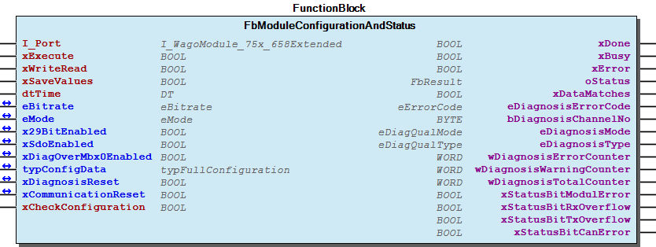
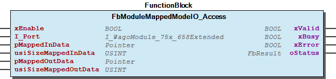
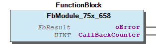

# WagoSysModule_75x_658 v1.8.2.8 (WAGO) - Complete Documentation

## 📋 Library Information

- **Company:** WAGO
- **Title:** WagoSysModule_75x_658
- **Version:** 1.8.2.8
- **Categories:** WAGO LayerView|Sys; Application
- **Author:** WAGO/u010663
- **Placeholder:** WagoSysModule_75x_658

### Description ¶

This document is automatically generated.

This library will be automatically installed, if the can module 750-658 is inserted in the K-bus.

This document is automatically generated. This library will be automatically installed, if the can module 750-658 is inserted in the K-bus.

### Contents: ¶

Contents: - Documentation Index - Project Information - Library Information - Function Blocks FbModuleConfigurationAndStatus (FB) - FbModuleMappedModeIO_Access (FB) - FbModule_75x_658 (FB) Methods - FbModule_75x_658.ChangeState (METH) - FbModule_75x_658.GetEmcy (METH) - FbModule_75x_658.GetLastNode (METH) - FbModule_75x_658.GetNodeDiag (METH) - FbModule_75x_658.GetNodeEmcy (METH) - FbModule_75x_658.GetNodeId (METH) - FbModule_75x_658.GetTimestamp (METH) - FbModule_75x_658.GuardError (METH) - FbModule_75x_658.GuardErrorNode (METH) - FbModule_75x_658.SdoAdd (METH) - ... and 10 more Program Organization Internal Components Global Variable Lists - Status (GVL) - VersionHistory (GVL) Other Components - 30 Visualizations - 80 Status - DynamicConfiguration - GlobalTextList (Text List) - ParameterList (PARAMS) - eStatus (ENUM) - typCanFrame (STRUCT)

### Indices and tables ¶

Based on WagoSysModule_75x_658.library, last modified 20.09.2024, 21:43:25. LibDoc 3.5.16.10

© WAGO GmbH & Co. KG, Germany 2018 – All rights reserved. For the avoidance of doubt, this copyright notice does not only apply to the information above but also and primarily to the described library itself. Please note that third-party products are always mentioned without reference to intellectual property rights, including patents, utility models, designs and trademarks, accordingly the existence of such rights cannot be excluded. WAGO is a registered trademark of WAGO Verwaltungsgesellschaft mbH.

- File and Project Information - Library Reference Based on WagoSysModule_75x_658.library, last modified 20.09.2024, 21:43:25. LibDoc 3.5.16.10 © WAGO GmbH & Co. KG, Germany 2018 – All rights reserved. For the avoidance of doubt, this copyright notice does not only apply to the information above but also and primarily to the described library itself. Please note that third-party products are always mentioned without reference to intellectual property rights, including patents, utility models, designs and trademarks, accordingly the existence of such rights cannot be excluded. WAGO is a registered trademark of WAGO Verwaltungsgesellschaft mbH.

### Documentation Index

## WagoSysModule_75x_658 Library Documentation

| Company: | WAGO |
| Title: | WagoSysModule_75x_658 |
| Version: | 1.8.2.8 |
| Categories: | WAGO LayerView\|Sys; Application |
| Author: | WAGO/u010663 |
| Placeholder: | WagoSysModule_75x_658 |

### Description

This document is automatically generated.

This library will be automatically installed, if the can module 750-658 is inserted in the K-bus.

This document is automatically generated. This library will be automatically installed, if the can module 750-658 is inserted in the K-bus.

### Contents:

- 20 Program Organization Units DynamicConfiguration - FbModuleConfigurationAndStatus (FB) - FbModuleMappedModeIO_Access (FB) 30 Visualizations 80 Status - Status (GVL) - eStatus (ENUM) 90 Internal - GlobalTextList (Text List) - typCanFrame (STRUCT) ParameterList (PARAMS) VersionHistory (GVL)

### Indices and tables

Based on WagoSysModule_75x_658.library, last modified 20.09.2024, 21:43:25. LibDoc 3.5.16.10

© WAGO GmbH & Co. KG, Germany 2018 – All rights reserved. For the avoidance of doubt, this copyright notice does not only apply to the information above but also and primarily to the described library itself. Please note that third-party products are always mentioned without reference to intellectual property rights, including patents, utility models, designs and trademarks, accordingly the existence of such rights cannot be excluded. WAGO is a registered trademark of WAGO Verwaltungsgesellschaft mbH.

- File and Project Information - Library Reference Based on WagoSysModule_75x_658.library, last modified 20.09.2024, 21:43:25. LibDoc 3.5.16.10 © WAGO GmbH & Co. KG, Germany 2018 – All rights reserved. For the avoidance of doubt, this copyright notice does not only apply to the information above but also and primarily to the described library itself. Please note that third-party products are always mentioned without reference to intellectual property rights, including patents, utility models, designs and trademarks, accordingly the existence of such rights cannot be excluded. WAGO is a registered trademark of WAGO Verwaltungsgesellschaft mbH.

### Project Information

## File and Project Information

| Scope | Name | Type | Content |
| --- | --- | --- | --- |
| FileHeader | libraryFile | string | WagoSysModule_75x_658.library |
| contentFile | doc.clean.json |
| productName | e!COCKPIT |
| creationDateTime | date | 20.09.2024, 21:43:34 |
| companyName | string | WAGO |
| ProjectInformation | LastModificationDateTime | date | 20.09.2024, 21:43:25 |
| Description | string | See: Description |
| Copyright | © WAGO Kontakttechnik GmbH & Co. KG, Germany 2018 – All rights reserved. |
| Author | WAGO/u010663 |
| AutoResolveUnbound | bool | True |
| Placeholder | string | WagoSysModule_75x_658 |
| Company | WAGO |
| DocFormat | reStructuredText |
| Project | WagoSysModule_75x_658 |
| Version string |  |
| Version | version | 1.8.2.8 |
| ActivateSigning | bool | False |
| Title | string | WagoSysModule_75x_658 |
| LibraryCategories | library-category-list | WAGO LayerView\|Sys; Application |
| CompiledLibraryCompatibilityVersion | string | CODESYS V3.5 SP16 Patch 3 |

### Library Information

## Library Reference

| LinkAllContent: False QualifiedOnly: True | SystemLibrary: False | Optional: False |

| LinkAllContent: False QualifiedOnly: True | SystemLibrary: False | Optional: False |

| LinkAllContent: False QualifiedOnly: False | SystemLibrary: True | Optional: False |

| LinkAllContent: False QualifiedOnly: False | SystemLibrary: True | Optional: False |

| LinkAllContent: False QualifiedOnly: False | SystemLibrary: True | Optional: False |

| LinkAllContent: False QualifiedOnly: False | SystemLibrary: True | Optional: False |

| LinkAllContent: False QualifiedOnly: False | SystemLibrary: True | Optional: False |

| LinkAllContent: False QualifiedOnly: False | SystemLibrary: True | Optional: False |

| LinkAllContent: False QualifiedOnly: False | SystemLibrary: True | Optional: False |

| LinkAllContent: False QualifiedOnly: False | SystemLibrary: True | Optional: False |

| LinkAllContent: False QualifiedOnly: False | SystemLibrary: True | Optional: False |

| LinkAllContent: False QualifiedOnly: False | SystemLibrary: True | Optional: False |

| LinkAllContent: False QualifiedOnly: False | SystemLibrary: True | Optional: False |

| LinkAllContent: False Optional: False | QualifiedOnly: False SystemLibrary: True | PublishSymbolsInContainer: True |

| LinkAllContent: False QualifiedOnly: False | SystemLibrary: True | Optional: False |

| LinkAllContent: False QualifiedOnly: False | SystemLibrary: False | Optional: False |

| LinkAllContent: False QualifiedOnly: True | SystemLibrary: False | Optional: False |

| LinkAllContent: False QualifiedOnly: False | SystemLibrary: False | Optional: False |

| LinkAllContent: False Optional: False | QualifiedOnly: False SystemLibrary: False | PublishSymbolsInContainer: True |

| LinkAllContent: False QualifiedOnly: True | SystemLibrary: False | Optional: False |

| LinkAllContent: False QualifiedOnly: True | SystemLibrary: False | Optional: False |

| LinkAllContent: False QualifiedOnly: True | SystemLibrary: False | Optional: False |

| LinkAllContent: False QualifiedOnly: False | SystemLibrary: False | Optional: False |

This is a dictionary of all referenced libraries and their name spaces.

This is a dictionary of all referenced libraries and their name spaces. Standard Library Identification : Placeholder: Standard Default Resolution: Standard, * (System) Namespace: Standard Library Properties : SysMem Library Identification : Placeholder: SysMem Default Resolution: SysMem, * (System) Namespace: SysMem Library Properties : VisuElem3DPath Library Identification : Placeholder: System_VisuElem3DPath Default Resolution: VisuElem3DPath, 3.5.14.0 (System) Namespace: VisuElem3DPath Library Properties : Library Parameter : Parameter: GC_POINTS_PER_POLYGON = 100 VisuElemCamDisplayer Library Identification : Placeholder: System_VisuElemCamDisplayer Default Resolution: VisuElemCamDisplayer, 3.5.14.0 (System) Namespace: VisuElemCamDisplayer Library Properties : Library Parameter : Parameter: GC_POINTS_PER_CAM = 100 VisuElemMeter Library Identification : Placeholder: System_VisuElemMeter Default Resolution: VisuElemMeter, 3.5.14.10 (System) Namespace: VisuElemMeter Library Properties : VisuElemTextEditor Library Identification : Placeholder: System_VisuElemTextEditor Default Resolution: VisuElemTextEditor, 3.5.14.0 (System) Namespace: VisuElemTextEditor Library Properties : VisuElemTrace Library Identification : Placeholder: System_VisuElemTrace Default Resolution: VisuElemTrace, 3.5.14.0 (System) Namespace: VisuElemTrace Library Properties : VisuElemXYChart Library Identification : Placeholder: System_VisuElemXYChart Default Resolution: VisuElemXYChart, 3.5.14.0 (System) Namespace: VisuElemXYChart Library Properties : VisuElems Library Identification : Placeholder: System_VisuElems Default Resolution: VisuElems, 3.5.14.30 (System) Namespace: VisuElems Library Properties : VisuElemsAlarm Library Identification : Placeholder: System_VisuElemsAlarm Default Resolution: VisuElemsAlarm, 3.5.14.30 (System) Namespace: VisuElemsAlarm Library Properties : VisuElemsDateTime Library Identification : Placeholder: System_VisuElemsDateTime Default Resolution: VisuElemsDateTime, 3.5.14.0 (System) Namespace: VisuElemsDateTime Library Properties : VisuElemsSpecialControls Library Identification : Placeholder: System_VisuElemsSpecialControls Default Resolution: VisuElemsSpecialControls, 3.5.14.0 (System) Namespace: VisuElemsSpecialControls Library Properties : VisuElemsWinControls Library Identification : Placeholder: System_VisuElemsWinControls Default Resolution: VisuElemsWinControls, 3.5.14.30 (System) Namespace: VisuElemsWinControls Library Properties : VisuInputs Library Identification : Placeholder: system_visuinputs Default Resolution: VisuInputs, 3.5.16.30 (System) Namespace: visuinputs Library Properties : VisuNativeControl Library Identification : Placeholder: System_VisuNativeControl Default Resolution: VisuNativeControl, 3.5.14.0 (System) Namespace: VisuNativeControl Library Properties : WagoSysErrorBase Library Identification : Placeholder: WagoSysErrorBase Default Resolution: WagoSysErrorBase, * (WAGO) Namespace: WagoSysErrorBase Library Properties : WagoSysModuleBase Library Identification : Placeholder: WagoSysModuleBase Default Resolution: WagoSysModuleBase, * (WAGO) Namespace: WagoSysModuleBase Library Properties : Library Parameter : Parameter: MAX_MBX_OUTPUT_SIZE = 47 Parameter: MAX_MODULE_QUANTITY = 250 Parameter: MAX_MODULE_INPUT_SIZE = 48 Parameter: MBX_PIPE_SIZE = 1024 Parameter: MAX_MODULE_OUTPUT_SIZE = 48 Parameter: MAX_MBX_INPUT_SIZE = 47 WagoSysVersion Library Identification : Name: WagoSysVersion Version: 1.0.0.0 Company: WAGO Namespace: WagoSysVersion Library Properties : WagoTypesBusServices Library Identification : Placeholder: WagoTypesBusServices Default Resolution: WagoTypesBusServices, * (WAGO) Namespace: WagoTypesBusServices Library Properties : WagoTypesCan Library Identification : Placeholder: WagoTypesCan Default Resolution: WagoTypesCan, * (WAGO) Namespace: WagoTypesCan Library Properties : WagoTypesErrorBase Library Identification : Placeholder: WagoTypesErrorBase Default Resolution: WagoTypesErrorBase, * (WAGO) Namespace: WagoTypesErrorBase Library Properties : WagoTypesModuleBase Library Identification : Placeholder: WagoTypesModuleBase Default Resolution: WagoTypesModuleBase, * (WAGO) Namespace: WagoTypesModuleBase Library Properties : Library Parameter : Parameter: MAX_MBX_SIZE = 18 WagoTypesModule_75x_658 Library Identification : Placeholder: WagoTypesModule_75x_658 Default Resolution: WagoTypesModule_75x_658, * (WAGO) Namespace: WagoTypesModule_75x_658 Library Properties : Library Parameter : Parameter: CAN_RX_MAX_MESSAGES = 100 Parameter: CAN_TX_MAX_MESSAGES = 100

### Function Blocks

## FbModuleConfigurationAndStatus (FB)

| Scope | Name | Type | Initial | Comment |
| --- | --- | --- | --- | --- |
| Input | I_Port | WagoTypesModule_75x_658.I_WagoModule_75x_658Extended |  | Access to the module |
| xExecute | BOOL |  | Execute reading or writing of the configuration |
| xWriteRead | BOOL |  | 0:Read configuration, 1: Write configuration |
| xSaveValues | BOOL |  | 1:after write command values will be additional stored in EEPROM |
| dtTime | DT |  | Time for timestamp in visualization tplDiagnosis |
| Inout | eBitrate | WagoTypesModule_75x_658.eBitrate |  | Baudrate |
| eMode | WagoTypesModule_75x_658.eMode |  | Transparent,mapped or sniffer mode |
| x29BitEnabled | BOOL |  | 1:support 29 Bit Cob -IDs |
| xSdoEnabled | BOOL |  | 1:allow SDO commands over the acyclic mailbox |
| xDiagOverMbx0Enabled | BOOL |  | Enable diagnose messages using the acyclic channel |
| typConfigData | WagoTypesModule_75x_658.typFullConfiguration |  | configuration data |
| xDiagnosisReset | BOOL |  | Reset diagnosis counter and buffer |
| xCommunicationReset | BOOL |  | Reset the acyclic mailbox Mbx0 communication |
| Input | xCheckConfiguration | BOOL |  | the configuration data from input typConfigData will be compared with the terminals internal configuration, output xMatches shows result |
| Output | xDone | BOOL |  | Configuration job finished |
| xBusy | BOOL |  | Configuration or check configuration active |
| xError | BOOL |  | Error occured |
| oStatus | WagoSysErrorBase.FbResult |  | Status information |
| xDataMatches | BOOL |  | result |
| eDiagnosisErrorCode | WagoTypesModule_75x_658.eErrorCode |  | Details in manual 750-657 |
| bDiagnosisChannelNo | BYTE |  | Diagnosis ->Channel number |
| eDiagnosisMode | WagoTypesModule_75x_658.eDiagQualMode |  | Diagnosis ->Mode more info manual 750-657 |
| eDiagnosisType | WagoTypesModule_75x_658.eDiagQualType |  | Diagnosis ->Type more info manual 750-657 |
| wDiagnosisErrorCounter | WORD | 0 | Diagnosis ->Error counter |
| wDiagnosisWarningCounter | WORD | 0 | Diagnosis ->Warning counter |
| wDiagnosisTotalCounter | WORD | 0 | Diagnosis ->Total diagnosis counter |
| xStatusBitModulError | BOOL |  | Modul Statusbyte Bit 0 ->24 Volt error,etc |
| xStatusBitRxOverflow | BOOL |  | Modul Statusbyte Bit 1 ->Receive buffer overflow |
| xStatusBitTxOverflow | BOOL |  | Modul Statusbyte Bit 2 ->Transmit buffer overflow |
| xStatusBitCanError | BOOL |  | Modul Statusbyte Bit 3 ->error on CAN bus |

A function block reading status and diagnosis information from module 750-658. Additional functionality as reading and writing the configuration is supported.

Graphical Illustration

Function Description

This function block must be used once for each module 750-658 and it must be executed cyclic.

Only one job is supported at any time, so either read, write or check configuration.

Interface variables Function A function block reading status and diagnosis information from module 750-658. Additional functionality as reading and writing the configuration is supported. Graphical Illustration  Function Description Note This function block must be used once for each module 750-658 and it must be executed cyclic. Only one job is supported at any time, so either read, write or check configuration.

## FbModuleMappedModeIO_Access (FB)

| Scope | Name | Type | Comment |
| --- | --- | --- | --- |
| Input | xEnable | BOOL | Enable IO access |
| I_Port | WagoTypesModule_75x_658.I_WagoModule_75x_658Extended | Access to the module |
| pMappedInData | POINTER TO ARRAY [0..44] OF BYTE | Pointer to the area, where the input data should be placed |
| usiSizeMappedInData | USINT | Size of Mapped in data, sizeof operator recommended; e.g. sizeof(InData) |
| pMappedOutData | POINTER TO ARRAY [0..44] OF BYTE | Pointer to the area, where the output data must be placed |
| usiSizeMappedOutData | USINT | Size of Mapped out data, sizeof operator recommended; e.g. sizeof(OutData) |
| Output | xValid | BOOL | Configuration job finished |
| xBusy | BOOL | Configuration or check configuration active |
| xError | BOOL | Error occured |
| oStatus | WagoSysErrorBase.FbResult | Future use |

A function block accessing IO data in mapped mode.

Graphical Illustration

Function Description

This function block is only needed in mapped mode. The data area mappedInData starts directly with the payload. The data area mappedOutData starts with the toggle byte. The following bytes are the payload (for more information refere to the manual of modul 750-658

Example: Module size: 24 Byte Mailbox size: 5 Byte => Input area: 17 Byte Output area: 18 Byte

Interface variables Function A function block accessing IO data in mapped mode. Graphical Illustration  Function Description This function block is only needed in mapped mode. The data area mappedInData starts directly with the payload. The data area mappedOutData starts with the toggle byte. The following bytes are the payload (for more information refere to the manual of modul 750-658 Example: Module size: 24 Byte Mailbox size: 5 Byte => Input area: 17 Byte Output area: 18 Byte

## FbModule_75x_658 (FB)

| Scope | Name | Type | Comment | Inherited from |
| --- | --- | --- | --- | --- |
| Output | oError | WagoSysErrorBase.FbResult |  | FbModuleBase |
| CallBackCounter | UINT | callbacks from cycle control point | FbModuleMbx2 |

Access to the CAN gateway module 750-658 This block is needed for each module. The instance of this function block is either automatically generated by the K-Bus configuration or has to be manually added in case of the dynamic configuration.

Graphical Illustration

Interface variables Function Access to the CAN gateway module 750-658 This block is needed for each module. The instance of this function block is either automatically generated by the K-Bus configuration or has to be manually added in case of the dynamic configuration. Graphical Illustration  - I_CanOpen FbModule_75x_658.ChangeState (METH) - FbModule_75x_658.GetEmcy (METH) - FbModule_75x_658.GetLastNode (METH) - FbModule_75x_658.GetNodeDiag (METH) - FbModule_75x_658.GetNodeEmcy (METH) - FbModule_75x_658.GetNodeId (METH) - FbModule_75x_658.GetTimestamp (METH) - FbModule_75x_658.GuardError (METH) - FbModule_75x_658.GuardErrorNode (METH) - FbModule_75x_658.SdoAdd (METH) - FbModule_75x_658.SdoReadAsync (METH) - FbModule_75x_658.SdoReadData (METH) - FbModule_75x_658.SdoReadSync (METH) - FbModule_75x_658.SdoWriteAsync (METH) - FbModule_75x_658.SdoWriteData (METH) - FbModule_75x_658.SdoWriteSync (METH) - FbModule_75x_658.SendEmcy (METH) - FbModule_75x_658.SendTimestamp (METH) FbModule_75x_658.protCheckPaSIze (METH)

### Methods

## FbModule_75x_658.ChangeState (METH)

| Scope | Name | Type | Comment |
| --- | --- | --- | --- |
| Return | ChangeState | WagoTypesCan.eCanFnReturn |  |
| Input | udiNodeId | UDINT | Node Id of device |
| eState | WagoTypesCan.eCanOpenState | State to set |

Change state of CANopen device or master (valid only for own node in slave mode) Returns: 0 = OK -1 = fail

Interface variables Change state of CANopen device or master (valid only for own node in slave mode) Returns: 0 = OK -1 = fail

## FbModule_75x_658.GetEmcy (METH)

| Scope | Name | Type | Comment |
| --- | --- | --- | --- |
| Return | GetEmcy | DINT |  |
| Input | eRemove | WagoTypesCan.eCanFlagReset | 1 read and remove oldest message from list |
| Inout | aMsg | ARRAY [1..8] OF BYTE | EMC message |

Test for new emergency error on any slave in CANopen Manager Mode Returns: 0 = no emcy message > 0 node id -1 failure

Interface variables Test for new emergency error on any slave in CANopen Manager Mode Returns: 0 = no emcy message > 0 node id -1 failure

## FbModule_75x_658.GetLastNode (METH)

| Scope | Name | Type |
| --- | --- | --- |
| Return | GetLastNode | DINT |

return number of configured node IDs on bus in CANopen Manager Mode or -1 if error

Interface variables return number of configured node IDs on bus in CANopen Manager Mode or -1 if error

## FbModule_75x_658.GetNodeDiag (METH)

| Scope | Name | Type |
| --- | --- | --- |
| Return | GetNodeDiag | DWORD |
| Input | udiNodeId | UDINT |

get node diagnostic bits in CANopen Manager Mode

Interface variables get node diagnostic bits in CANopen Manager Mode

## FbModule_75x_658.GetNodeEmcy (METH)

| Scope | Name | Type | Comment |
| --- | --- | --- | --- |
| Return | GetNodeEmcy | WagoTypesCan.eCanFnReturn |  |
| Input | udiNodeId | UDINT | node Id |
| eRemove | WagoTypesCan.eCanFlagReset | clear message |
| Inout | aMsg | ARRAY [1..8] OF BYTE |  |

Test for Emcy message from node in CANopen Manager Mode

Returns: 0 = no emcy message 1 = message present -1 failure

Interface variables Test for Emcy message from node in CANopen Manager Mode Returns: 0 = no emcy message 1 = message present -1 failure

## FbModule_75x_658.GetNodeId (METH)

| Scope | Name | Type |
| --- | --- | --- |
| Return | GetNodeId | DINT |

get own node Id of can device

Interface variables get own node Id of can device

## FbModule_75x_658.GetTimestamp (METH)

| Scope | Name | Type |
| --- | --- | --- |
| Return | GetTimestamp | WagoTypesCan.eCanFnReturn |
| Inout | typTimestamp | WagoTypesCan.typCanTimestamp |

Get last timestamp Returns: 0 = OK -1 = Fail

Interface variables Get last timestamp Returns: 0 = OK -1 = Fail

## FbModule_75x_658.GuardError (METH)

| Scope | Name | Type |
| --- | --- | --- |
| Return | GuardError | DINT |

Test for guarding error on any slave (only tests own node in slave mode) Returns: node Id of node with guarding error 0: no error -1 failure

Interface variables Test for guarding error on any slave (only tests own node in slave mode) Returns: node Id of node with guarding error 0: no error -1 failure

## FbModule_75x_658.GuardErrorNode (METH)

| Scope | Name | Type |
| --- | --- | --- |
| Return | GuardErrorNode | WagoTypesCan.eCanFnReturn |
| Input | udiNodeId | UDINT |

Test for guarding error message from slave in CANopen Manager Mode Returns: 0 = no guarding error message 1 = guarding error message from slave -1 failure

Interface variables Test for guarding error message from slave in CANopen Manager Mode Returns: 0 = no guarding error message 1 = guarding error message from slave -1 failure

## FbModule_75x_658.SdoAdd (METH)

| Scope | Name | Type | Comment |
| --- | --- | --- | --- |
| Return | SdoAdd | WagoTypesCan.eCanFnReturn |  |
| Input | udiIndex | UDINT | 16#2000 spezial SDO no subindex size max 1536 byte |
| udiEntrys | UDINT | requested subindexes |
| udiBytes | UDINT | datalen in bytes of 1 subindex |
| udiSDOType | UDINT | data type |
| udiOffset | UDINT | position in parameter data (8192 Bytes) |

Function is called to add a User SDO Returns: 0 = OK -1 = fail

Interface variables Function is called to add a User SDO Returns: 0 = OK -1 = fail

## FbModule_75x_658.SdoReadAsync (METH)

| Scope | Name | Type | Comment |
| --- | --- | --- | --- |
| Return | SdoReadAsync | DINT |  |
| Input | udiNodeId | UDINT | node id |
| udiIndex | UDINT | sdo index |
| udiSubindex | UDINT | sdo subindex |
| udiBytes | UDINT | pData size |
| udiTimeout | UDINT | timeout in ms |
| udiChannel | UDINT | channel number for parallel transfers (0...15) |
| pData | POINTER TO BYTE | sdo data |

| Returnvalue | Description |
| < 0 | // Error Codes from eCanFnReturn |
| 0 | // call finished / bytes received |
| > 16#10000 | // SDO abort code |

read CANopen SDOs without blocking process

Interface variables read CANopen SDOs without blocking process

## FbModule_75x_658.SdoReadData (METH)

| Scope | Name | Type | Comment |
| --- | --- | --- | --- |
| Return | SdoReadData | WagoTypesCan.eCanFnReturn |  |
| Input | udiIndex | UDINT | index |
| udiSubindex | UDINT | subindex |
| udiBytes | UDINT | datalen |
| pData | POINTER TO BYTE | sdo data |

read from CANopen process data and parameter data sdos Returns: 0 = OK -1 = Fail

Interface variables read from CANopen process data and parameter data sdos Returns: 0 = OK -1 = Fail

## FbModule_75x_658.SdoReadSync (METH)

| Scope | Name | Type | Comment |
| --- | --- | --- | --- |
| Return | SdoReadSync | DINT |  |
| Input | udiNodeId | UDINT | node id |
| udiIndex | UDINT | index |
| udiSubindex | UDINT | subindex |
| udiBytes | UDINT | pData size |
| udiTimeout | UDINT | timeout in ms |
| pData | POINTER TO BYTE | sdo data |

| Returnvalue | Description |
| 0 | // Call finished |
| < 0 | // Error Codes from eCanFnReturn |
| > 16#10000 | // SDO abort code |

read CANopen SDOs with blocking process

Interface variables read CANopen SDOs with blocking process

## FbModule_75x_658.SdoWriteAsync (METH)

| Scope | Name | Type | Comment |
| --- | --- | --- | --- |
| Return | SdoWriteAsync | DINT |  |
| Input | udiNodeId | UDINT | node id |
| udiIndex | UDINT | sdo index |
| udiSubindex | UDINT | sdo subindex |
| udiBytes | UDINT | sdo bytes |
| udiTimeout | UDINT | timeout in ms |
| udiChannel | UDINT | channel number for parallel transfers (0...15) |
| pData | POINTER TO BYTE | sdo data |

| Returnvalue | Description |
| 0 | // call finished |
| < 0 | // Error Codes from eCanFnReturn |
| > 16#10000 | // SDO abort code |

send CANopen SDOs without blocking process

Interface variables send CANopen SDOs without blocking process

## FbModule_75x_658.SdoWriteData (METH)

| Scope | Name | Type | Comment |
| --- | --- | --- | --- |
| Return | SdoWriteData | WagoTypesCan.eCanFnReturn |  |
| Input | udiIndex | UDINT | sdo index |
| udiSubindex | UDINT | sdo subindex |
| udiBytes | UDINT | sdo bytes |
| pData | POINTER TO BYTE | sdo data |

write to CANopen process data and parameter data sdos Returns: 0 = OK -1 = fail

Interface variables write to CANopen process data and parameter data sdos Returns: 0 = OK -1 = fail

## FbModule_75x_658.SdoWriteSync (METH)

| Scope | Name | Type | Comment |
| --- | --- | --- | --- |
| Return | SdoWriteSync | DINT |  |
| Input | udiNodeId | UDINT | node id |
| udiIndex | UDINT | sdo index |
| udiSubindex | UDINT | sdo subindex |
| udiBytes | UDINT | sdo bytes |
| udiTimeout | UDINT | timeout in ms |
| pData | POINTER TO BYTE | sdo data |

| Returnvalue | Description |
| 0 | // Call finished |
| < 0 | // Error Codes from eCanFnReturn |
| > 16#10000 | // SDO abort code |

read CANopen SDOs with blocking process

Interface variables read CANopen SDOs with blocking process

## FbModule_75x_658.SendEmcy (METH)

| Scope | Name | Type | Comment |
| --- | --- | --- | --- |
| Return | SendEmcy | DINT |  |
| Input | dwCode | DWORD | EMC error code |
| dwRegister | DWORD | register 1001 |
| aMfsCode | ARRAY [1..5] OF BYTE | manufacture spec. error field |

send emc message in CANopen Manager Mode Returns: 0 = OK -1 = fail -2 = inhibit time not expired

Interface variables send emc message in CANopen Manager Mode Returns: 0 = OK -1 = fail -2 = inhibit time not expired

## FbModule_75x_658.SendTimestamp (METH)

| Scope | Name | Type |
| --- | --- | --- |
| Return | SendTimestamp | WagoTypesCan.eCanFnReturn |
| Input | typTimestamp | WagoTypesCan.typCanTimestamp |

Send timestamp

if wDay = 0 and time = 0 then system time (in UTC) is used

Returns: 0 = OK -1 = fail

Interface variables Send timestamp if wDay = 0 and time = 0 then system time (in UTC) is used Returns: 0 = OK -1 = fail

## FbModule_75x_658.protCheckPaSIze (METH)

| Scope | Name | Type | Initial | Comment |
| --- | --- | --- | --- | --- |
| Return | protCheckPaSIze | BOOL |  |  |
| Input | uiPaNominalBitSize | UINT |  | The expected bit size of the module |
| ITerminal | WagoTypesBusServices.I_TerminalBase | 0 | Interface to terminal at that this module is registered |

This method is called at static configuration for Kbus-Modules only. If this method returns with TRUE a reboot of the controller will be initiated.

At the derivated method you have to manipulate the registers of the module to change for the wanted uiPaNominalBitSize .

The wanted uiPaNominalBitSize is calculated by the devcie description.

You have not to return before the needed register change was done by your implementation.

Interface variables This method is called at static configuration for Kbus-Modules only. If this method returns with TRUE a reboot of the controller will be initiated. At the derivated method you have to manipulate the registers of the module to change for the wanted uiPaNominalBitSize . The wanted uiPaNominalBitSize is calculated by the devcie description. Note You have not to return before the needed register change was done by your implementation.

## I_CanOpen

- FbModule_75x_658.ChangeState (METH) - FbModule_75x_658.GetEmcy (METH) - FbModule_75x_658.GetLastNode (METH) - FbModule_75x_658.GetNodeDiag (METH) - FbModule_75x_658.GetNodeEmcy (METH) - FbModule_75x_658.GetNodeId (METH) - FbModule_75x_658.GetTimestamp (METH) - FbModule_75x_658.GuardError (METH) - FbModule_75x_658.GuardErrorNode (METH) - FbModule_75x_658.SdoAdd (METH) - FbModule_75x_658.SdoReadAsync (METH) - FbModule_75x_658.SdoReadData (METH) - FbModule_75x_658.SdoReadSync (METH) - FbModule_75x_658.SdoWriteAsync (METH) - FbModule_75x_658.SdoWriteData (METH) - FbModule_75x_658.SdoWriteSync (METH) - FbModule_75x_658.SendEmcy (METH) - FbModule_75x_658.SendTimestamp (METH)

### Program Organization

## 20 Program Organization Units

- DynamicConfiguration FbModule_75x_658 (FB) I_CanOpen FbModule_75x_658.ChangeState (METH) - FbModule_75x_658.GetEmcy (METH) - FbModule_75x_658.GetLastNode (METH) - FbModule_75x_658.GetNodeDiag (METH) - FbModule_75x_658.GetNodeEmcy (METH) - FbModule_75x_658.GetNodeId (METH) - FbModule_75x_658.GetTimestamp (METH) - FbModule_75x_658.GuardError (METH) - FbModule_75x_658.GuardErrorNode (METH) - FbModule_75x_658.SdoAdd (METH) - FbModule_75x_658.SdoReadAsync (METH) - FbModule_75x_658.SdoReadData (METH) - FbModule_75x_658.SdoReadSync (METH) - FbModule_75x_658.SdoWriteAsync (METH) - FbModule_75x_658.SdoWriteData (METH) - FbModule_75x_658.SdoWriteSync (METH) - FbModule_75x_658.SendEmcy (METH) - FbModule_75x_658.SendTimestamp (METH) FbModule_75x_658.protCheckPaSIze (METH) FbModuleConfigurationAndStatus (FB) FbModuleMappedModeIO_Access (FB)

### Internal Components

## 90 Internal

- GlobalTextList (Text List) - typCanFrame (STRUCT)

### Global Variable Lists

## Status (GVL)

| Scope | Name | Type |
| --- | --- | --- |
| Constant | StatusCan_658 | ARRAY [0..11] OF WagoTypesErrorBase.typResultItem |

| Value | Level | Description |
| --- | --- | --- |
| eStatus.OK | WagoTypesErrorBase.eSeverity.info | ‘OK’ |
| eStatus.FunctionBlockNotEnabled | WagoTypesErrorBase.eSeverity.info | ‘FunctionBlockNotEnabled’ |
| eStatus.InProgress | WagoTypesErrorBase.eSeverity.info | ‘InProgress’ |
| eStatus.ErrorMBX_ReadTableTxMapping | WagoTypesErrorBase.eSeverity.info | ‘ErrorReadTableTxMapping’ |
| eStatus.ErrorMBX_ReadTableRxMapping | WagoTypesErrorBase.eSeverity.info | ‘ErrorReadTableRxMapping’ |
| eStatus.ErrorMBX_WriteTableTxMapping | WagoTypesErrorBase.eSeverity.info | ‘ErrorWriteTableTxMapping’ |
| eStatus.ErrorMBX_WriteTableRxMapping | WagoTypesErrorBase.eSeverity.info | ‘ErrorMBX_ReadTableFilter’ |
| eStatus.ErrorMBX_WriteTableRxMapping | WagoTypesErrorBase.eSeverity.info | ‘ErrorMBX_WriteTableFilter’ |
| eStatus.ErrorMBX_WriteTableRxMapping | WagoTypesErrorBase.eSeverity.info | ‘ErrorMBX_SetPassword’ |
| eStatus.ErrorMBX_WriteTableRxMapping | WagoTypesErrorBase.eSeverity.info | ‘ErrorMBX_SaveUser’ |
| eStatus.UndefinedInterface | WagoTypesErrorBase.eSeverity.warning | ‘No interface connected’ |

## VersionHistory (GVL)

| Name | Type |
| --- | --- |
| Info | ProjectInfo |

| date | version | author | change |
| 23.07.2024 | 1.8.2.8 | u010663 | Improvement method OpenLayer2 |
| 11.07.2024 | 1.8.2.7 | u0103719 | update library version (context: build server,compile file) |
| 02.08.2023 | 1.8.2.6 | u010663 | Improvement method OpenLayer2 |
| 02.08.2023 | 1.8.2.5 | u010663 | Improvement 64-Bit |
| 25.11.2020 | 1.8.2.4 | u010663 | Improvement OpenLayer2 |
| 08.06.2020 | 1.8.2.2 | u010663 | Bugfix OpenLayer2 |
| 16.09.2019 | 1.8.2.1 | u015842 | Bugfix GetFrame in case of sniffer mode |
| 08.01.2019 | 1.8.2.0 | u015842 | Properties: free placeholder added |
| 22.05.2018 | 1.8.1.4 | u010663 | Bugfix OpenLayer2 |
| 07.05.2018 | 1.8.1.3 | u010663 | Bugfix SendFrame 29-Bit |
| 26.04.2018 | 1.8.1.2 | u010545 | Update documentation |
| 04.04.2018 | 1.8.1.1 | u013972 | Resolve the placeholder for Collections with default |
| 13.11.2017 | 1.8.1.0 | u010545 | update resize module PA |
| 06.11.2017 | 1.6.1.0 | u010663 | Allow PA size adjustment |
| 03.05.2017 | 1.6.0.6 | u010663 | Compiler version increased |
| 12.04.2017 | 1.6.0.5 | u010663 | Internal imrovement |
| 04.10.2016 | 1.6.0.4 | u010663 | Internal improvement |
| 14.09.2016 | 1.6.0.3 | u010663 | Improvement |
| 25.05.2016 | 1.6.0.2 | u010663 | Released |

WagoSysModule_75x_658.library

Release Notes:

WagoSysModule_75x_658.library Release Notes:

### Other Components

## 30 Visualizations ¶

## 80 Status ¶

- Status (GVL) - eStatus (ENUM)

## DynamicConfiguration

- FbModule_75x_658 (FB) I_CanOpen FbModule_75x_658.ChangeState (METH) - FbModule_75x_658.GetEmcy (METH) - FbModule_75x_658.GetLastNode (METH) - FbModule_75x_658.GetNodeDiag (METH) - FbModule_75x_658.GetNodeEmcy (METH) - FbModule_75x_658.GetNodeId (METH) - FbModule_75x_658.GetTimestamp (METH) - FbModule_75x_658.GuardError (METH) - FbModule_75x_658.GuardErrorNode (METH) - FbModule_75x_658.SdoAdd (METH) - FbModule_75x_658.SdoReadAsync (METH) - FbModule_75x_658.SdoReadData (METH) - FbModule_75x_658.SdoReadSync (METH) - FbModule_75x_658.SdoWriteAsync (METH) - FbModule_75x_658.SdoWriteData (METH) - FbModule_75x_658.SdoWriteSync (METH) - FbModule_75x_658.SendEmcy (METH) - FbModule_75x_658.SendTimestamp (METH) FbModule_75x_658.protCheckPaSIze (METH)

## GlobalTextList (Text List)

| ID | Default | DE |
| --- | --- | --- |
| 4 | `` %d`` |  |
| 5 | %s |  |
| 0 | Actual diagnosis | Aktuelle Diagnose |
| 11 | Ch. no | Kanal |
| 9 | Description | Beschreibung |
| 3 | Error counter: %s | Fehler Zähler |
| 6 | Event Code | Nr.: |
| 7 | Mode | Betriebsart |
| 12 | Reset | Reset |
| 10 | Time stamp | Zeitstempel |
| 1 | Total diagnosis counter: %s | Gesamt Zähler |
| 8 | Type | Typ |
| 2 | Warning counter: %s | Warnungs Zähler |

## ParameterList (PARAMS)

| Scope | Name | Type | Initial | Comment |
| --- | --- | --- | --- | --- |
| Constant | CAN_DIAG_BUFFER | BYTE | 10 | Event buffer used by acyclic channel |
| CAN_CONFIG_TIMEOUT | TIME | TIME#8s0ms | Timeout in case of module configuration |
| SDO_WATCHDOG_DEFAULT | TIME | TIME#500ms | Default value for the SDO timeout watchdog |
| MAX_MESSAGES_METHOD_OPEN | UDINT | 100 | Useb by Method OpenLayer1 |

## eStatus (ENUM)

| Name | Initial | Comment |
| --- | --- | --- |
| OK | 0 |  |
| FunctionBlockNotEnabled | 1 |  |
| Timeout | 2 |  |
| InProgress | 3 |  |
| ErrorMBX_ReadTableTxMapping | 4 |  |
| ErrorMBX_ReadTableRxMapping | 5 |  |
| ErrorMBX_WriteTableTxMapping | 6 |  |
| ErrorMBX_WriteTableRxMapping | 7 |  |
| ErrorMBX_ReadTableFilter | 8 |  |
| ErrorMBX_WriteTableFilter | 9 |  |
| ErrorMBX_SetPassword | 10 |  |
| ErrorMBX_SaveUser | 11 |  |
| UndefinedInterface | 51 | Input I_Port=0, invalid entry |

Description: Feedback codes

InOut: Description: Feedback codes

## typCanFrame (STRUCT)

| Name | Type | Comment |
| --- | --- | --- |
| CobId | DWORD | CAN ID. |
| RtrFrame | BOOL |  |
| Ide | BOOL | Identifier bit. Must be TRUE in Ext. Frame. |
| Datalength | BYTE |  |
| Data | ARRAY [1..8] OF BYTE |  |