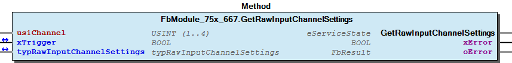
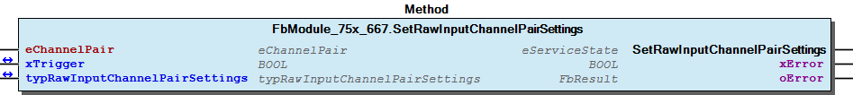

# WagoSysModule_75x_66x v1.0.1.5 (WAGO) - Complete Documentation


## 📋 Library Information

- **Company:** WAGO
- **Title:** WagoSysModule_75x_66x
- **Version:** 1.0.1.5
- **Categories:** WAGO LayerView|Sys
- **Author:** WAGO
- **Placeholder:** WagoSysModule_75x_66x

### Description ¶


This document is automatically generated.

Handling modules 75x-66x

This document is automatically generated. Handling modules 75x-66x

### Contents: ¶


Contents: - Documentation Index - Project Information - Library Information - Function Blocks FbModule_75x_666 (FB) - FbModule_75x_667 (FB) Functions - FuGetInfoByRange (FUN) - FuSetInfoByRange (FUN) Methods - FbModule_75x_666.GetRawInputChannelPairSettings (METH) - FbModule_75x_666.GetRawInputChannelSettings (METH) - FbModule_75x_666.GetRawOutputChannelSettings (METH) - FbModule_75x_666.SetRawInputChannelPairSettings (METH) - FbModule_75x_666.SetRawInputChannelSettings (METH) - FbModule_75x_666.SetRawOutputChannelSettings (METH) - FbModule_75x_667.GetRawInputChannelPairSettings (METH) - FbModule_75x_667.GetRawInputChannelSettings (METH) - FbModule_75x_667.GetRawOutputChannelSettings (METH) - FbModule_75x_667.SetRawInputChannelPairSettings (METH) - ... and 3 more Program Organization Internal Components Global Variable Lists - ErrorModule (GVL) - ErrorModulePlcOpen (GVL) - VersionHistory (GVL) Other Components - 80 Status - Channel - Channel - Helper - I_Module_75x_666 - I_Module_75x_667 - Input - Input - Output - Output - ... and 1 more

### Indices and tables ¶


Based on WagoSysModule_75x_66x.library, last modified 20.09.2024, 21:30:24. LibDoc 3.5.16.10

© WAGO GmbH & Co. KG, Germany 2018 – All rights reserved. For the avoidance of doubt, this copyright notice does not only apply to the information above but also and primarily to the described library itself. Please note that third-party products are always mentioned without reference to intellectual property rights, including patents, utility models, designs and trademarks, accordingly the existence of such rights cannot be excluded. WAGO is a registered trademark of WAGO Verwaltungsgesellschaft mbH.

- File and Project Information - Library Reference Based on WagoSysModule_75x_66x.library, last modified 20.09.2024, 21:30:24. LibDoc 3.5.16.10 © WAGO GmbH & Co. KG, Germany 2018 – All rights reserved. For the avoidance of doubt, this copyright notice does not only apply to the information above but also and primarily to the described library itself. Please note that third-party products are always mentioned without reference to intellectual property rights, including patents, utility models, designs and trademarks, accordingly the existence of such rights cannot be excluded. WAGO is a registered trademark of WAGO Verwaltungsgesellschaft mbH.

### Documentation Index


## WagoSysModule_75x_66x Library Documentation


| Company: | WAGO |
| Title: | WagoSysModule_75x_66x |
| Version: | 1.0.1.5 |
| Categories: | WAGO LayerView\|Sys |
| Author: | WAGO |
| Placeholder: | WagoSysModule_75x_66x |

### Description


This document is automatically generated.

Handling modules 75x-66x

This document is automatically generated. Handling modules 75x-66x

### Contents:


- 20 Program Organization Units FbModule_75x_666 (FB) - FbModule_75x_667 (FB) 80 Status - ErrorModule (GVL) - ErrorModulePlcOpen (GVL) - eErrorModule (ENUM) - eErrorModulePlcOpen (ENUM) 90 Internal - Helper VersionHistory (GVL)

### Indices and tables


Based on WagoSysModule_75x_66x.library, last modified 20.09.2024, 21:30:24. LibDoc 3.5.16.10

© WAGO GmbH & Co. KG, Germany 2018 – All rights reserved. For the avoidance of doubt, this copyright notice does not only apply to the information above but also and primarily to the described library itself. Please note that third-party products are always mentioned without reference to intellectual property rights, including patents, utility models, designs and trademarks, accordingly the existence of such rights cannot be excluded. WAGO is a registered trademark of WAGO Verwaltungsgesellschaft mbH.

- File and Project Information - Library Reference Based on WagoSysModule_75x_66x.library, last modified 20.09.2024, 21:30:24. LibDoc 3.5.16.10 © WAGO GmbH & Co. KG, Germany 2018 – All rights reserved. For the avoidance of doubt, this copyright notice does not only apply to the information above but also and primarily to the described library itself. Please note that third-party products are always mentioned without reference to intellectual property rights, including patents, utility models, designs and trademarks, accordingly the existence of such rights cannot be excluded. WAGO is a registered trademark of WAGO Verwaltungsgesellschaft mbH.

### Project Information


## File and Project Information


| Scope | Name | Type | Content |
| --- | --- | --- | --- |
| FileHeader | libraryFile | string | WagoSysModule_75x_66x.library |
| contentFile | doc.clean.json |
| productName | e!COCKPIT |
| creationDateTime | date | 20.09.2024, 21:30:25 |
| companyName | string | WAGO |
| ProjectInformation | LastModificationDateTime | date | 20.09.2024, 21:30:24 |
| Description | string | See: Description |
| Copyright | © WAGO GmbH & Co. KG, Germany 2018 – All rights reserved. |
| Author | WAGO |
| AutoResolveUnbound | bool | True |
| Placeholder | string | WagoSysModule_75x_66x |
| Company | WAGO |
| DocFormat | reStructuredText |
| Project | WagoSysModule_75x_66x |
| Version string |  |
| Version | version | 1.0.1.5 |
| ActivateSigning | bool | False |
| Title | string | WagoSysModule_75x_66x |
| LibraryCategories | library-category-list | WAGO LayerView\|Sys |
| CompiledLibraryCompatibilityVersion | string | CODESYS V3.5 SP16 Patch 3 |

### Library Information


## Library Reference


| LinkAllContent: False QualifiedOnly: False | SystemLibrary: False | Optional: False |

| LinkAllContent: False QualifiedOnly: False | SystemLibrary: False | Optional: False |

| LinkAllContent: False Optional: False | QualifiedOnly: True SystemLibrary: False | PublishSymbolsInContainer: True |

| LinkAllContent: False QualifiedOnly: False | SystemLibrary: False | Optional: False |

| LinkAllContent: False QualifiedOnly: False | SystemLibrary: False | Optional: False |

| LinkAllContent: False Optional: False | QualifiedOnly: False SystemLibrary: False | PublishSymbolsInContainer: True |

| LinkAllContent: False Optional: False | QualifiedOnly: True SystemLibrary: False | PublishSymbolsInContainer: True |

| LinkAllContent: False Optional: False | QualifiedOnly: True SystemLibrary: False | PublishSymbolsInContainer: True |

| LinkAllContent: False QualifiedOnly: False | SystemLibrary: False | Optional: False |

This is a dictionary of all referenced libraries and their name spaces.

This is a dictionary of all referenced libraries and their name spaces. Util Library Identification : Placeholder: Util Default Resolution: Util, * (System) Namespace: Util Library Properties : Library Parameter : Parameter: IBLOCKSIZE = 22800 WagoSysErrorBase Library Identification : Placeholder: WagoSysErrorBase Default Resolution: WagoSysErrorBase, * (WAGO) Namespace: WagoSysErrorBase Library Properties : WagoSysModuleBase Library Identification : Placeholder: WagoSysModuleBase Default Resolution: WagoSysModuleBase, * (WAGO) Namespace: WagoSysModuleBase Library Properties : WagoSysModuleBaseProtected Library Identification : Placeholder: WagoSysModuleBaseProtected Default Resolution: WagoSysModuleBaseProtected, * (WAGO) Namespace: WagoSysModuleBaseProtected Library Properties : WagoSysVersion Library Identification : Name: WagoSysVersion Version: 1.0.0.0 Company: WAGO Namespace: WagoSysVersion Library Properties : WagoTypesBusServices Library Identification : Placeholder: WagoTypesBusServices Default Resolution: WagoTypesBusServices, * (WAGO) Namespace: WagoTypesBusServices Library Properties : WagoTypesCommon Library Identification : Placeholder: WagoTypesCommon Default Resolution: WagoTypesCommon, * (WAGO) Namespace: WagoTypes Library Properties : WagoTypesModuleBase Library Identification : Placeholder: WagoTypesModuleBase Default Resolution: WagoTypesModuleBase, * (WAGO) Namespace: WagoTypesModuleBase Library Properties : WagoTypesModule_75x_66x Library Identification : Placeholder: WagoTypesModule_75x_66x Default Resolution: WagoTypesModule_75x_66x, * (WAGO) Namespace: WagoTypesModule_75x_66x Library Properties :

### Function Blocks


## FbModule_75x_666 (FB)


| Scope | Name | Type | Inherited from |
| --- | --- | --- | --- |
| Output | oError | WagoSysErrorBase.FbResult | FbModuleBase |

Access to the module 750-666

Function description

This block is needed for each module. The instance of this function block is either automatically generated by the K-Bus configuration or has to be manually added in case of the dynamic configuration.

Interface variables Function Access to the module 750-666 Function description This block is needed for each module. The instance of this function block is either automatically generated by the K-Bus configuration or has to be manually added in case of the dynamic configuration. - I_Module_75x_666 Channel Input FbModule_75x_666.GetRawInputChannelPairSettings (METH) - FbModule_75x_666.GetRawInputChannelSettings (METH) - FbModule_75x_666.SetRawInputChannelPairSettings (METH) - FbModule_75x_666.SetRawInputChannelSettings (METH) Output - FbModule_75x_666.GetRawOutputChannelSettings (METH) - FbModule_75x_666.SetRawOutputChannelSettings (METH)

## FbModule_75x_667 (FB)


| Scope | Name | Type | Inherited from |
| --- | --- | --- | --- |
| Output | oError | WagoSysErrorBase.FbResult | FbModuleBase |

Access to the module 750-667

Function description

This block is needed for each module. The instance of this function block is either automatically generated by the K-Bus configuration or has to be manually added in case of the dynamic configuration.

Interface variables Function Access to the module 750-667 Function description This block is needed for each module. The instance of this function block is either automatically generated by the K-Bus configuration or has to be manually added in case of the dynamic configuration. - I_Module_75x_667 Channel Input FbModule_75x_667.GetRawInputChannelPairSettings (METH) - FbModule_75x_667.GetRawInputChannelSettings (METH) - FbModule_75x_667.SetRawInputChannelPairSettings (METH) - FbModule_75x_667.SetRawInputChannelSettings (METH) Output - FbModule_75x_667.GetRawOutputChannelSettings (METH) - FbModule_75x_667.SetRawOutputChannelSettings (METH)

### Functions


## FuGetInfoByRange (FUN)


| Scope | Name | Type |
| --- | --- | --- |
| Return | FuGetInfoByRange | USINT |
| Input | uiValue | UINT |
| usiStartIndex | USINT |
| usiCountBits | USINT |

## FuSetInfoByRange (FUN)


| Scope | Name | Type | Comment |
| --- | --- | --- | --- |
| Return | FuSetInfoByRange | BOOL |  |
| Inout | uiValue | UINT | manipulated Value |
| Input | usiStartIndex | USINT |  |
| usiCountBits | USINT | N Bits |
| uiNomValue | UINT | nominal value |

### Methods


## FbModule_75x_666.GetRawInputChannelPairSettings (METH)


| Scope | Name | Type |
| --- | --- | --- |
| Return | GetRawInputChannelPairSettings | WagoTypesModuleBase.eServiceState |
| Input | eChannelPair | WagoTypesModule_75x_66x.eChannelPair |
| Inout | xTrigger | BOOL |
| typRawInputChannelPairSettings | WagoTypesModule_75x_66x.typRawInputChannelPairSettings |
| Output | xError | BOOL |
| oError | WagoSysErrorBase.FbResult |

| Struct member | Value | Description |
| --- | --- | --- |
| eChannelPair | CH1_CH2 |  |
| CH3_CH4 |  |
| eRestartInterlock | DEACTIVATED |  |
| ACTIVATED |  |
| ePreEvaluation | SINGLE_CHANNEL |  |
| EQUIVALENT |  |
| ANTIVALENT |  |
| eInputDiscepancyTime | TIME_5MS |  |
| TIME_7MS |  |
| TIME_10MS |  |
| TIME_12MS |  |
| TIME_15MS |  |
| TIME_17MS |  |
| TIME_20MS |  |
| TIME_30MS |  |
| TIME_50MS |  |
| TIME_70MS |  |
| TIME_100MS |  |
| TIME_200MS |  |
| TIME_300MS |  |
| TIME_500MS |  |
| TIME_700MS |  |
| TIME_1000MS |  |
| TIME_2000MS |  |
| TIME_3000MS |  |
| TIME_5000MS |  |
| TIME_7000MS |  |

```
VAR
    //--- Channel Settings ---------------------------------
    typRawInputChannelPairSettings  :   WagoTypesModule_75x_66x.typRawInputChannelPairSettings;
    xGetInputChannelPairSettings    :   BOOL;
    oError                          :   WagoSysErrorBase.FbResult;
END_VAR

//--- I N P U T  C H A N N E L  P A I R  S E T T I N G S ----------------------
CASE my667.GetRawInputChannelPairSettings(  xTrigger                        := xGetInputChannelPairSettings,
                                            typRawInputChannelPairSettings  := typRawInputChannelPairSettings,
                                            oError                          => oError
                                            ) OF

    eServiceState.DONE : // OK
        ;// process here your typRawInputChannelPairSettings

    eServiceState.ABORT : // Error
        ;// process here your error handling -> see oError for more information

END_CASE
```

typRawInputChannelPairSettings

Graphical Illustration

Graphical Interface of FbModule_75x_666.GetRawInputChannelPairSettings

For get the settings from channel one

You have to call the method cyclic until the method returns with DONE or ABORT.

Interface variables Function Get the settings of a channel at a struct. typRawInputChannelPairSettings Graphical Illustration  Graphical Interface of FbModule_75x_666.GetRawInputChannelPairSettings Example For get the settings from channel one Note You have to call the method cyclic until the method returns with DONE or ABORT.

## FbModule_75x_666.GetRawInputChannelSettings (METH)


| Scope | Name | Type |
| --- | --- | --- |
| Return | GetRawInputChannelSettings | WagoTypesModuleBase.eServiceState |
| Input | usiChannel | USINT (1..4) |
| Inout | xTrigger | BOOL |
| typRawInputChannelSettings | WagoTypesModule_75x_66x.typRawInputChannelSettings |
| Output | xError | BOOL |
| oError | WagoSysErrorBase.FbResult |

| Struct member | Value | Description |
| --- | --- | --- |
| eShortCircuitTest | DEACTIVATED |  |
| ACTIVATED |  |
| eInputFilterTime | TIME_0MS |  |
| TIME_0_2MS |  |
| TIME_0_5MS |  |
| TIME_1MS |  |
| TIME_2MS |  |
| TIME_3MS |  |
| TIME_5MS |  |
| TIME_10MS |  |
| TIME_20MS |  |
| TIME_50MS |  |
| TIME_100MS |  |
| TIME_200MS |  |

```
VAR
    //--- Channel Settings ---------------------------------
    typRawInputChannelSettings  :   WagoTypesModule_75x_66x.typRawInputChannelSettings;
    xGetInputChannelSettings    :   BOOL;
    oError                      :   WagoSysErrorBase.FbResult;
END_VAR

//--- I N P U T  C H A N N E L   S E T T I N G S ----------------------
CASE my667.GetRawInputChannelSettings(  usiChannel                  := 1,
                                        xTrigger                    := xGetInputChannelSettings,
                                        typRawInputChannelSettings  := typRawInputChannelSettings,
                                        oError                      => oError
                                ) OF

    eServiceState.DONE : // OK
        ;// process here your typRawInputChannelSettings

    eServiceState.ABORT : // Error
        ;// process here your error handling -> see oError for more information

END_CASE
```

typRawInputChannelSettings

Graphical Illustration

Graphical Interface of FbModule_75x_666.GetRawInputChannelSettings

For get the settings from channel one

You have to call the method cyclic until the method returns with DONE or ABORT.

Interface variables Function Get the settings of a channel at a struct. typRawInputChannelSettings Graphical Illustration  Graphical Interface of FbModule_75x_666.GetRawInputChannelSettings Example For get the settings from channel one Note You have to call the method cyclic until the method returns with DONE or ABORT.

## FbModule_75x_666.GetRawOutputChannelSettings (METH)


| Scope | Name | Type |
| --- | --- | --- |
| Return | GetRawOutputChannelSettings | WagoTypesModuleBase.eServiceState |
| Input | usiChannel | USINT (1..2) |
| Inout | xTrigger | BOOL |
| typRawOutputChannelSettings | WagoTypesModule_75x_66x.typRawOutputChannelSettings |
| Output | xError | BOOL |
| oError | WagoSysErrorBase.FbResult |

| Struct member | Value | Description |
| --- | --- | --- |
| eActiveDischarge | DEACTIVATED |  |
| ACTIVATED |  |
| eActiveDischarge | DEACTIVATED |  |
| DARK_TEST |  |
| LIGHT_AND_DARK_TEST |  |
| eWireBreakDetection | DEACTIVATED |  |
| ACTIVATED |  |

```
VAR
    //--- Channel Settings ---------------------------------
    typRawOutputChannelSettings :   WagoTypesModule_75x_66x.typRawOutputChannelSettings;
    xGetOutputChannelSettings   :   BOOL;
    oError                      :   WagoSysErrorBase.FbResult;
END_VAR

//--- C H A N N E L   S E T T I N G S ----------------------
CASE my497.GetRawOutputChannelSettings( usiChannel                  := 1,
                                        xTrigger                    := xGetOutputChannelSettings,
                                        typRawOutputChannelSettings := typRawOutputChannelSettings,
                                        oError                      => oError
                                ) OF

    eServiceState.DONE : // OK
        ;// process here your typRawOutputChannelSettings

    eServiceState.ABORT : // Error
        ;// process here your error handling -> see oError for more information

END_CASE
```

typRawOutputChannelSettings

Graphical Illustration

Graphical Interface of FbModule_75x_666.GetRawOutputChannelSettings

For get the settings from channel one

You have to call the method cyclic until the method returns with DONE or ABORT.

Interface variables Function Get the settings of a channel at a struct. typRawOutputChannelSettings | ACTIVATED | | Graphical Illustration  Graphical Interface of FbModule_75x_666.GetRawOutputChannelSettings Example For get the settings from channel one Note You have to call the method cyclic until the method returns with DONE or ABORT.

## FbModule_75x_666.SetRawInputChannelPairSettings (METH)


| Scope | Name | Type |
| --- | --- | --- |
| Return | SetRawInputChannelPairSettings | WagoTypesModuleBase.eServiceState |
| Input | eChannelPair | WagoTypesModule_75x_66x.eChannelPair |
| Inout | xTrigger | BOOL |
| typRawInputChannelPairSettings | WagoTypesModule_75x_66x.typRawInputChannelPairSettings |
| Output | xError | BOOL |
| oError | WagoSysErrorBase.FbResult |

| Struct member | Value | Description |
| --- | --- | --- |
| eChannelPair | CH1_CH2 |  |
| CH3_CH4 |  |
| eRestartInterlock | DEACTIVATED |  |
| ACTIVATED |  |
| ePreEvaluation | SINGLE_CHANNEL |  |
| EQUIVALENT |  |
| ANTIVALENT |  |
| eInputDiscepancyTime | TIME_5MS |  |
| TIME_7MS |  |
| TIME_10MS |  |
| TIME_12MS |  |
| TIME_15MS |  |
| TIME_17MS |  |
| TIME_20MS |  |
| TIME_30MS |  |
| TIME_50MS |  |
| TIME_70MS |  |
| TIME_100MS |  |
| TIME_200MS |  |
| TIME_300MS |  |
| TIME_500MS |  |
| TIME_700MS |  |
| TIME_1000MS |  |
| TIME_2000MS |  |
| TIME_3000MS |  |
| TIME_5000MS |  |
| TIME_7000MS |  |

```
VAR
    //--- Channel Settings ---------------------------------
    typRawInputChannelPairSettings  :   WagoTypesModule_75x_66x.typRawInputChannelPairSettings;
    xSetInputChannelPairSettings    :   BOOL;
    oError                          :   WagoSysErrorBase.FbResult;
END_VAR

//--- I N P U T  C H A N N E L  P A I R  S E T T I N G S ----------------------
CASE my667.SetRawInputChannelPairSettings(  xTrigger                        := xSetInputChannelPairSettings,
                                            typRawInputChannelPairSettings  := typRawInputChannelPairSettings,
                                            oError                          => oError
                                            ) OF

    eServiceState.DONE : // OK
        ;// process here your typRawInputChannelPairSettings

    eServiceState.ABORT : // Error
        ;// process here your error handling -> see oError for more information

END_CASE
```

typRawInputChannelPairSettings

Graphical Illustration

Graphical Interface of FbModule_75x_666.SetRawInputChannelPairSettings

For set the settings of channel one

You have to call the method cyclic until the method returns with DONE or ABORT.

Interface variables Function Set the settings for a channel by a struct. typRawInputChannelPairSettings Graphical Illustration  Graphical Interface of FbModule_75x_666.SetRawInputChannelPairSettings Example For set the settings of channel one Note You have to call the method cyclic until the method returns with DONE or ABORT.

## FbModule_75x_666.SetRawInputChannelSettings (METH)


| Scope | Name | Type |
| --- | --- | --- |
| Return | SetRawInputChannelSettings | WagoTypesModuleBase.eServiceState |
| Input | usiChannel | USINT (1..4) |
| Inout | xTrigger | BOOL |
| typRawInputChannelSettings | WagoTypesModule_75x_66x.typRawInputChannelSettings |
| Output | xError | BOOL |
| oError | WagoSysErrorBase.FbResult |

| Struct member | Value | Description |
| --- | --- | --- |
| eShortCircuitTest | DEACTIVATED |  |
| ACTIVATED |  |
| eInputFilterTime | TIME_0MS |  |
| TIME_0_2MS |  |
| TIME_0_5MS |  |
| TIME_1MS |  |
| TIME_2MS |  |
| TIME_3MS |  |
| TIME_5MS |  |
| TIME_10MS |  |
| TIME_20MS |  |
| TIME_50MS |  |
| TIME_100MS |  |
| TIME_200MS |  |

```
VAR
    //--- Channel Settings ---------------------------------
    typRawInputChannelSettings  :   WagoTypesModule_75x_66x.typRawInputChannelSettings;
    xSetInputChannelSettings    :   BOOL;
    oError                      :   WagoSysErrorBase.FbResult;
END_VAR

//--- I N P U T  C H A N N E L   S E T T I N G S ----------------------
CASE my667.SetRawInputChannelSettings(  usiChannel                  := 1,
                                        xTrigger                    := xSetInputChannelSettings,
                                        typRawInputChannelSettings  := typRawInputChannelSettings,
                                        oError                      => oError
                                ) OF

    eServiceState.DONE : // OK
        ;// process here your typRawInputChannelSettings

    eServiceState.ABORT : // Error
        ;// process here your error handling -> see oError for more information

END_CASE
```

typRawInputChannelSettings

Graphical Illustration

Graphical Interface of FbModule_75x_666.SetRawInputChannelSettings

For get the settings from channel one

You have to call the method cyclic until the method returns with DONE or ABORT.

Interface variables Function Get the settings of a channel at a struct. typRawInputChannelSettings Graphical Illustration  Graphical Interface of FbModule_75x_666.SetRawInputChannelSettings Example For get the settings from channel one Note You have to call the method cyclic until the method returns with DONE or ABORT.

## FbModule_75x_666.SetRawOutputChannelSettings (METH)


| Scope | Name | Type |
| --- | --- | --- |
| Return | SetRawOutputChannelSettings | WagoTypesModuleBase.eServiceState |
| Input | usiChannel | USINT (1..2) |
| Inout | xTrigger | BOOL |
| typRawOutputChannelSettings | WagoTypesModule_75x_66x.typRawOutputChannelSettings |
| Output | xError | BOOL |
| oError | WagoSysErrorBase.FbResult |

| Struct member | Value | Description |
| --- | --- | --- |
| eActiveDischarge | DEACTIVATED |  |
| ACTIVATED |  |
| eActiveDischarge | DEACTIVATED |  |
| DARK_TEST |  |
| LIGHT_AND_DARK_TEST |  |
| eWireBreakDetection | DEACTIVATED |  |
| ACTIVATED |  |
| eReadBackTime | TIME_1MS |  |
| TIME_2MS |  |
| TIME_3MS |  |
| TIME_5MS |  |
| TIME_10MS |  |
| TIME_20MS |  |
| TIME_50MS |  |
| TIME_100MS |  |
| TIME_200MS |  |

```
VAR
    //--- Channel Settings ---------------------------------
    typRawOutputChannelSettings :   WagoTypesModule_75x_66x.typRawOutputChannelSettings;
    xSetOutputChannelSettings           :   BOOL;
    oError                      :   WagoSysErrorBase.FbResult;
END_VAR

//--- C H A N N E L   S E T T I N G S ----------------------
CASE my497.GetRawOutputChannelSettings( usiChannel                  := 1,
                                        xTrigger                    := xSetOutputChannelSettings,
                                        typRawOutputChannelSettings := typRawOutputChannelSettings,
                                        oError                      => oError
                                ) OF

    eServiceState.DONE : // OK
        ;// process here your typRawOutputChannelSettings

    eServiceState.ABORT : // Error
        ;// process here your error handling -> see oError for more information

END_CASE
```

typRawOutputChannelSettings

Graphical Illustration

Graphical Interface of FbModule_75x_666.SetRawOutputChannelSettings

For get the settings from channel one

You have to call the method cyclic until the method returns with DONE or ABORT.

Interface variables Function Get the settings of a channel at a struct. typRawOutputChannelSettings Graphical Illustration  Graphical Interface of FbModule_75x_666.SetRawOutputChannelSettings Example For get the settings from channel one Note You have to call the method cyclic until the method returns with DONE or ABORT.

## FbModule_75x_667.GetRawInputChannelPairSettings (METH)


| Scope | Name | Type |
| --- | --- | --- |
| Return | GetRawInputChannelPairSettings | WagoTypesModuleBase.eServiceState |
| Input | eChannelPair | WagoTypesModule_75x_66x.eChannelPair |
| Inout | xTrigger | BOOL |
| typRawInputChannelPairSettings | WagoTypesModule_75x_66x.typRawInputChannelPairSettings |
| Output | xError | BOOL |
| oError | WagoSysErrorBase.FbResult |

| Struct member | Value | Description |
| --- | --- | --- |
| eChannelPair | CH1_CH2 |  |
| CH3_CH4 |  |
| eRestartInterlock | DEACTIVATED |  |
| ACTIVATED |  |
| ePreEvaluation | SINGLE_CHANNEL |  |
| EQUIVALENT |  |
| ANTIVALENT |  |
| eInputDiscepancyTime | TIME_5MS |  |
| TIME_7MS |  |
| TIME_10MS |  |
| TIME_12MS |  |
| TIME_15MS |  |
| TIME_17MS |  |
| TIME_20MS |  |
| TIME_30MS |  |
| TIME_50MS |  |
| TIME_70MS |  |
| TIME_100MS |  |
| TIME_200MS |  |
| TIME_300MS |  |
| TIME_500MS |  |
| TIME_700MS |  |
| TIME_1000MS |  |
| TIME_2000MS |  |
| TIME_3000MS |  |
| TIME_5000MS |  |
| TIME_7000MS |  |

```
VAR
    //--- Channel Settings ---------------------------------
    typRawInputChannelPairSettings  :   WagoTypesModule_75x_66x.typRawInputChannelPairSettings;
    xGetInputChannelPairSettings    :   BOOL;
    oError                          :   WagoSysErrorBase.FbResult;
END_VAR

//--- I N P U T  C H A N N E L  P A I R  S E T T I N G S ----------------------
CASE my667.GetRawInputChannelPairSettings(  xTrigger                        := xGetInputChannelPairSettings,
                                            typRawInputChannelPairSettings  := typRawInputChannelPairSettings,
                                            oError                          => oError
                                            ) OF

    eServiceState.DONE : // OK
        ;// process here your typRawInputChannelPairSettings

    eServiceState.ABORT : // Error
        ;// process here your error handling -> see oError for more information

END_CASE
```

typRawInputChannelPairSettings

Graphical Illustration

Graphical Interface of FbModule_75x_667.GetRawInputChannelPairSettings

For get the settings from channel one

You have to call the method cyclic until the method returns with DONE or ABORT.

Interface variables Function Get the settings of a channel at a struct. typRawInputChannelPairSettings Graphical Illustration  Graphical Interface of FbModule_75x_667.GetRawInputChannelPairSettings Example For get the settings from channel one Note You have to call the method cyclic until the method returns with DONE or ABORT.

## FbModule_75x_667.GetRawInputChannelSettings (METH)


| Scope | Name | Type |
| --- | --- | --- |
| Return | GetRawInputChannelSettings | WagoTypesModuleBase.eServiceState |
| Input | usiChannel | USINT (1..4) |
| Inout | xTrigger | BOOL |
| typRawInputChannelSettings | WagoTypesModule_75x_66x.typRawInputChannelSettings |
| Output | xError | BOOL |
| oError | WagoSysErrorBase.FbResult |

| Struct member | Value | Description |
| --- | --- | --- |
| eShortCircuitTest | DEACTIVATED |  |
| ACTIVATED |  |
| eInputFilterTime | TIME_0MS |  |
| TIME_0_2MS |  |
| TIME_0_5MS |  |
| TIME_1MS |  |
| TIME_2MS |  |
| TIME_3MS |  |
| TIME_5MS |  |
| TIME_10MS |  |
| TIME_20MS |  |
| TIME_50MS |  |
| TIME_100MS |  |
| TIME_200MS |  |

```
VAR
    //--- Channel Settings ---------------------------------
    typRawInputChannelSettings  :   WagoTypesModule_75x_66x.typRawInputChannelSettings;
    xGetInputChannelSettings    :   BOOL;
    oError                      :   WagoSysErrorBase.FbResult;
END_VAR

//--- I N P U T  C H A N N E L   S E T T I N G S ----------------------
CASE my667.GetRawInputChannelSettings(  usiChannel                  := 1,
                                        xTrigger                    := xGetInputChannelSettings,
                                        typRawInputChannelSettings  := typRawInputChannelSettings,
                                        oError                      => oError
                                ) OF

    eServiceState.DONE : // OK
        ;// process here your typRawInputChannelSettings

    eServiceState.ABORT : // Error
        ;// process here your error handling -> see oError for more information

END_CASE
```

typRawInputChannelSettings

Graphical Illustration

Graphical Interface of FbModule_75x_667.GetRawInputChannelSettings

For get the settings from channel one

You have to call the method cyclic until the method returns with DONE or ABORT.

Interface variables Function Get the settings of a channel at a struct. typRawInputChannelSettings Graphical Illustration  Graphical Interface of FbModule_75x_667.GetRawInputChannelSettings Example For get the settings from channel one Note You have to call the method cyclic until the method returns with DONE or ABORT.

## FbModule_75x_667.GetRawOutputChannelSettings (METH)


| Scope | Name | Type |
| --- | --- | --- |
| Return | GetRawOutputChannelSettings | WagoTypesModuleBase.eServiceState |
| Input | usiChannel | USINT (1..4) |
| Inout | xTrigger | BOOL |
| typRawOutputChannelSettings | WagoTypesModule_75x_66x.typRawOutputChannelSettings |
| Output | xError | BOOL |
| oError | WagoSysErrorBase.FbResult |

| Struct member | Value | Description |
| --- | --- | --- |
| eActiveDischarge | DEACTIVATED |  |
| ACTIVATED |  |
| eActiveDischarge | DEACTIVATED |  |
| DARK_TEST |  |
| LIGHT_AND_DARK_TEST |  |
| eWireBreakDetection | DEACTIVATED |  |
| ACTIVATED |  |

```
VAR
    //--- Channel Settings ---------------------------------
    typRawOutputChannelSettings :   WagoTypesModule_75x_66x.typRawOutputChannelSettings;
    xGetOutputChannelSettings   :   BOOL;
    oError                      :   WagoSysErrorBase.FbResult;
END_VAR

//--- C H A N N E L   S E T T I N G S ----------------------
CASE my497.GetRawOutputChannelSettings( usiChannel                  := 1,
                                        xTrigger                    := xGetOutputChannelSettings,
                                        typRawOutputChannelSettings := typRawOutputChannelSettings,
                                        oError                      => oError
                                ) OF

    eServiceState.DONE : // OK
        ;// process here your typRawOutputChannelSettings

    eServiceState.ABORT : // Error
        ;// process here your error handling -> see oError for more information

END_CASE
```

typRawOutputChannelSettings

Graphical Illustration

Graphical Interface of FbModule_75x_667.GetRawOutputChannelSettings

For get the settings from channel one

You have to call the method cyclic until the method returns with DONE or ABORT.

Interface variables Function Get the settings of a channel at a struct. typRawOutputChannelSettings | ACTIVATED | | Graphical Illustration  Graphical Interface of FbModule_75x_667.GetRawOutputChannelSettings Example For get the settings from channel one Note You have to call the method cyclic until the method returns with DONE or ABORT.

## FbModule_75x_667.SetRawInputChannelPairSettings (METH)


| Scope | Name | Type |
| --- | --- | --- |
| Return | SetRawInputChannelPairSettings | WagoTypesModuleBase.eServiceState |
| Input | eChannelPair | WagoTypesModule_75x_66x.eChannelPair |
| Inout | xTrigger | BOOL |
| typRawInputChannelPairSettings | WagoTypesModule_75x_66x.typRawInputChannelPairSettings |
| Output | xError | BOOL |
| oError | WagoSysErrorBase.FbResult |

| Struct member | Value | Description |
| --- | --- | --- |
| eChannelPair | CH1_CH2 |  |
| CH3_CH4 |  |
| eRestartInterlock | DEACTIVATED |  |
| ACTIVATED |  |
| ePreEvaluation | SINGLE_CHANNEL |  |
| EQUIVALENT |  |
| ANTIVALENT |  |
| eInputDiscepancyTime | TIME_5MS |  |
| TIME_7MS |  |
| TIME_10MS |  |
| TIME_12MS |  |
| TIME_15MS |  |
| TIME_17MS |  |
| TIME_20MS |  |
| TIME_30MS |  |
| TIME_50MS |  |
| TIME_70MS |  |
| TIME_100MS |  |
| TIME_200MS |  |
| TIME_300MS |  |
| TIME_500MS |  |
| TIME_700MS |  |
| TIME_1000MS |  |
| TIME_2000MS |  |
| TIME_3000MS |  |
| TIME_5000MS |  |
| TIME_7000MS |  |

```
VAR
    //--- Channel Settings ---------------------------------
    typRawInputChannelPairSettings  :   WagoTypesModule_75x_66x.typRawInputChannelPairSettings;
    xSetInputChannelPairSettings    :   BOOL;
    oError                          :   WagoSysErrorBase.FbResult;
END_VAR

//--- I N P U T  C H A N N E L  P A I R  S E T T I N G S ----------------------
CASE my667.SetRawInputChannelPairSettings(  xTrigger                        := xSetInputChannelPairSettings,
                                            typRawInputChannelPairSettings  := typRawInputChannelPairSettings,
                                            oError                          => oError
                                            ) OF

    eServiceState.DONE : // OK
        ;// process here your typRawInputChannelPairSettings

    eServiceState.ABORT : // Error
        ;// process here your error handling -> see oError for more information

END_CASE
```

typRawInputChannelPairSettings

Graphical Illustration

Graphical Interface of FbModule_75x_667.SetRawInputChannelPairSettings

For set the settings of channel one

You have to call the method cyclic until the method returns with DONE or ABORT.

Interface variables Function Set the settings for a channel by a struct. typRawInputChannelPairSettings Graphical Illustration  Graphical Interface of FbModule_75x_667.SetRawInputChannelPairSettings Example For set the settings of channel one Note You have to call the method cyclic until the method returns with DONE or ABORT.

## FbModule_75x_667.SetRawInputChannelSettings (METH)


| Scope | Name | Type |
| --- | --- | --- |
| Return | SetRawInputChannelSettings | WagoTypesModuleBase.eServiceState |
| Input | usiChannel | USINT (1..4) |
| Inout | xTrigger | BOOL |
| typRawInputChannelSettings | WagoTypesModule_75x_66x.typRawInputChannelSettings |
| Output | xError | BOOL |
| oError | WagoSysErrorBase.FbResult |

| Struct member | Value | Description |
| --- | --- | --- |
| eShortCircuitTest | DEACTIVATED |  |
| ACTIVATED |  |
| eInputFilterTime | TIME_0MS |  |
| TIME_0_2MS |  |
| TIME_0_5MS |  |
| TIME_1MS |  |
| TIME_2MS |  |
| TIME_3MS |  |
| TIME_5MS |  |
| TIME_10MS |  |
| TIME_20MS |  |
| TIME_50MS |  |
| TIME_100MS |  |
| TIME_200MS |  |

```
VAR
    //--- Channel Settings ---------------------------------
    typRawInputChannelSettings  :   WagoTypesModule_75x_66x.typRawInputChannelSettings;
    xSetInputChannelSettings    :   BOOL;
    oError                      :   WagoSysErrorBase.FbResult;
END_VAR

//--- I N P U T  C H A N N E L   S E T T I N G S ----------------------
CASE my667.SetRawInputChannelSettings(  usiChannel                  := 1,
                                        xTrigger                    := xSetInputChannelSettings,
                                        typRawInputChannelSettings  := typRawInputChannelSettings,
                                        oError                      => oError
                                ) OF

    eServiceState.DONE : // OK
        ;// process here your typRawInputChannelSettings

    eServiceState.ABORT : // Error
        ;// process here your error handling -> see oError for more information

END_CASE
```

typRawInputChannelSettings

Graphical Illustration

Graphical Interface of FbModule_75x_667.SetRawInputChannelSettings

For get the settings from channel one

You have to call the method cyclic until the method returns with DONE or ABORT.

Interface variables Function Get the settings of a channel at a struct. typRawInputChannelSettings Graphical Illustration  Graphical Interface of FbModule_75x_667.SetRawInputChannelSettings Example For get the settings from channel one Note You have to call the method cyclic until the method returns with DONE or ABORT.

## FbModule_75x_667.SetRawOutputChannelSettings (METH)


| Scope | Name | Type |
| --- | --- | --- |
| Return | SetRawOutputChannelSettings | WagoTypesModuleBase.eServiceState |
| Input | usiChannel | USINT (1..4) |
| Inout | xTrigger | BOOL |
| typRawOutputChannelSettings | WagoTypesModule_75x_66x.typRawOutputChannelSettings |
| Output | xError | BOOL |
| oError | WagoSysErrorBase.FbResult |

| Struct member | Value | Description |
| --- | --- | --- |
| eActiveDischarge | DEACTIVATED |  |
| ACTIVATED |  |
| eActiveDischarge | DEACTIVATED |  |
| DARK_TEST |  |
| LIGHT_AND_DARK_TEST |  |
| eWireBreakDetection | DEACTIVATED |  |
| ACTIVATED |  |
| eReadBackTime | TIME_1MS |  |
| TIME_2MS |  |
| TIME_3MS |  |
| TIME_5MS |  |
| TIME_10MS |  |
| TIME_20MS |  |
| TIME_50MS |  |
| TIME_100MS |  |
| TIME_200MS |  |

```
VAR
    //--- Channel Settings ---------------------------------
    typRawOutputChannelSettings :   WagoTypesModule_75x_66x.typRawOutputChannelSettings;
    xSetOutputChannelSettings           :   BOOL;
    oError                      :   WagoSysErrorBase.FbResult;
END_VAR

//--- C H A N N E L   S E T T I N G S ----------------------
CASE my497.GetRawOutputChannelSettings( usiChannel                  := 1,
                                        xTrigger                    := xSetOutputChannelSettings,
                                        typRawOutputChannelSettings := typRawOutputChannelSettings,
                                        oError                      => oError
                                ) OF

    eServiceState.DONE : // OK
        ;// process here your typRawOutputChannelSettings

    eServiceState.ABORT : // Error
        ;// process here your error handling -> see oError for more information

END_CASE
```

typRawOutputChannelSettings

Graphical Illustration

Graphical Interface of FbModule_75x_667.SetRawOutputChannelSettings

For get the settings from channel one

You have to call the method cyclic until the method returns with DONE or ABORT.

Interface variables Function Get the settings of a channel at a struct. typRawOutputChannelSettings Graphical Illustration  Graphical Interface of FbModule_75x_667.SetRawOutputChannelSettings Example For get the settings from channel one Note You have to call the method cyclic until the method returns with DONE or ABORT.

## eErrorModulePlcOpen (ENUM)


| Name | Initial | Comment |
| --- | --- | --- |
| INTERNAL_CHANNEL_ERROR | 16#280 | Safe Inputs (channel error) |
| SHORT_CIRCUIT | 16#201 |  |

### Program Organization


## 20 Program Organization Units


- FbModule_75x_666 (FB) I_Module_75x_666 Channel Input FbModule_75x_666.GetRawInputChannelPairSettings (METH) - FbModule_75x_666.GetRawInputChannelSettings (METH) - FbModule_75x_666.SetRawInputChannelPairSettings (METH) - FbModule_75x_666.SetRawInputChannelSettings (METH) Output - FbModule_75x_666.GetRawOutputChannelSettings (METH) - FbModule_75x_666.SetRawOutputChannelSettings (METH) FbModule_75x_667 (FB) - I_Module_75x_667 Channel Input FbModule_75x_667.GetRawInputChannelPairSettings (METH) - FbModule_75x_667.GetRawInputChannelSettings (METH) - FbModule_75x_667.SetRawInputChannelPairSettings (METH) - FbModule_75x_667.SetRawInputChannelSettings (METH) Output - FbModule_75x_667.GetRawOutputChannelSettings (METH) - FbModule_75x_667.SetRawOutputChannelSettings (METH)

### Internal Components


## 90 Internal


- Helper FuGetInfoByRange (FUN) - FuSetInfoByRange (FUN)

### Global Variable Lists


## ErrorModule (GVL)


| Scope | Name | Type | Initial |
| --- | --- | --- | --- |
| Constant | ERROR_66x | ARRAY [0..49] OF WagoTypesErrorBase.typResultItem | [STRUCT(LogLevel := WagoTypesModule_75x_66x.eErrorType.CHANNEL_ERROR, ID := eErrorModule.CLOCK_OUTPUT_OVERLOAD, Severity := WagoTypesErrorBase.eSeverity.error, text := ‘CLOCK_OUTPUT_OVERLOAD’), STRUCT(LogLevel := WagoTypesModule_75x_66x.eErrorType.CHANNEL_ERROR, ID := eErrorModule.INTERNAL_CHANNEL_ERROR, Severity := WagoTypesErrorBase.eSeverity.error, text := ‘INTERNAL_CHANNEL_ERROR’), STRUCT(LogLevel := WagoTypesModule_75x_66x.eErrorType.CHANNEL_ERROR, ID := eErrorModule.OVERVOLTAGE_PWR, Severity := WagoTypesErrorBase.eSeverity.error, text := ‘OVERVOLTAGE_PWR’), STRUCT(LogLevel := WagoTypesModule_75x_66x.eErrorType.CHANNEL_ERROR, ID := eErrorModule.UNDERVOLATGE_PWR, Severity := WagoTypesErrorBase.eSeverity.error, text := ‘UNDERVOLATGE_PWR’), STRUCT(LogLevel := WagoTypesModule_75x_66x.eErrorType.CHANNEL_ERROR, ID := eErrorModule.SHORT_CIRCUIT, Severity := WagoTypesErrorBase.eSeverity.error, text := ‘SHORT_CIRCUIT’), STRUCT(LogLevel := WagoTypesModule_75x_66x.eErrorType.CHANNEL_ERROR, ID := eErrorModule.SHORT_CIRCUIT_TO_GND_OR_VCC, Severity := WagoTypesErrorBase.eSeverity.error, text := ‘SHORT_CIRCUIT_TO_GND_OR_VCC’), STRUCT(LogLevel := WagoTypesModule_75x_66x.eErrorType.CHANNEL_ERROR, ID := eErrorModule.SHORT_CIRCUIT_TO_VCC, Severity := WagoTypesErrorBase.eSeverity.error, text := ‘SHORT_CIRCUIT_TO_VCC’), STRUCT(LogLevel := WagoTypesModule_75x_66x.eErrorType.CHANNEL_ERROR, ID := eErrorModule.LINE_BREAK, Severity := WagoTypesErrorBase.eSeverity.error, text := ‘LINE_BREAK’), STRUCT(LogLevel := WagoTypesModule_75x_66x.eErrorType.CHANNEL_ERROR, ID := eErrorModule.CROSS_CIRCUIT, Severity := WagoTypesErrorBase.eSeverity.error, text := ‘CROSS_CIRCUIT’), STRUCT(LogLevel := WagoTypesModule_75x_66x.eErrorType.CHANNEL_ERROR, ID := eErrorModule.SHORT_CIRCUIT_TO_GND, Severity := WagoTypesErrorBase.eSeverity.error, text := ‘SHORT_CIRCUIT_TO_GND’), STRUCT(LogLevel := WagoTypesModule_75x_66x.eErrorType.MODULE_ERROR, ID := eErrorModule.DISCREPANCY_TIME_EXCEEDED, Severity := WagoTypesErrorBase.eSeverity.error, text := ‘DISCREPANCY_TIME_EXCEEDED’), STRUCT(LogLevel := WagoTypesModule_75x_66x.eErrorType.MODULE_ERROR, ID := eErrorModule.DIFFERENT_F_DEST_ADD, Severity := WagoTypesErrorBase.eSeverity.error, text := ‘DIFFERENT_F_DEST_ADD’), STRUCT(LogLevel := WagoTypesModule_75x_66x.eErrorType.MODULE_ERROR, ID := eErrorModule.ERROR_DOWNLOADING_IPARAMETERS, Severity := WagoTypesErrorBase.eSeverity.error, text := ‘ERROR_DOWNLOADING_IPARAMETERS’), STRUCT(LogLevel := WagoTypesModule_75x_66x.eErrorType.MODULE_ERROR, ID := eErrorModule.ERROR_UPLOADING_IPARAMETERS, Severity := WagoTypesErrorBase.eSeverity.error, text := ‘ERROR_UPLOADING_IPARAMETERS’), STRUCT(LogLevel := WagoTypesModule_75x_66x.eErrorType.MODULE_ERROR, ID := eErrorModule.FIRMWARE_UPDATE_REQUIRED, Severity := WagoTypesErrorBase.eSeverity.error, text := ‘FIRMWARE_UPDATE_REQUIRED’), STRUCT(LogLevel := WagoTypesModule_75x_66x.eErrorType.MODULE_ERROR, ID := eErrorModule.INCONSISTENT_F_IPAR_CRC, Severity := WagoTypesErrorBase.eSeverity.error, text := ‘INCONSISTENT_F_IPAR_CRC’), STRUCT(LogLevel := WagoTypesModule_75x_66x.eErrorType.MODULE_ERROR, ID := eErrorModule.INCONSISTENT_IPAR_CRC, Severity := WagoTypesErrorBase.eSeverity.error, text := ‘INCONSISTENT_IPAR_CRC’), STRUCT(LogLevel := WagoTypesModule_75x_66x.eErrorType.MODULE_ERROR, ID := eErrorModule.INCORRECT_F_CRC_LENGTH, Severity := WagoTypesErrorBase.eSeverity.error, text := ‘INCORRECT_F_CRC_LENGTH’), STRUCT(LogLevel := WagoTypesModule_75x_66x.eErrorType.MODULE_ERROR, ID := eErrorModule.INCORRECT_F_PAR_VERSION, Severity := WagoTypesErrorBase.eSeverity.error, text := ‘INCORRECT_F_PAR_VERSION’), STRUCT(LogLevel := WagoTypesModule_75x_66x.eErrorType.MODULE_ERROR, ID := eErrorModule.INVALID_COMMUNICATION_MODE, Severity := WagoTypesErrorBase.eSeverity.error, text := ‘INVALID_COMMUNICATION_MODE’), STRUCT(LogLevel := WagoTypesModule_75x_66x.eErrorType.MODULE_ERROR, ID := eErrorModule.INVALID_DEVICE_ADDRESS, Severity := WagoTypesErrorBase.eSeverity.error, text := ‘INVALID_DEVICE_ADDRESS’), STRUCT(LogLevel := WagoTypesModule_75x_66x.eErrorType.MODULE_ERROR, ID := eErrorModule.INVALID_F_CRC1, Severity := WagoTypesErrorBase.eSeverity.error, text := ‘INVALID_F_CRC1’), STRUCT(LogLevel := WagoTypesModule_75x_66x.eErrorType.MODULE_ERROR, ID := eErrorModule.INVALID_F_DEST_ADD, Severity := WagoTypesErrorBase.eSeverity.error, text := ‘INVALID_F_DEST_ADD’), STRUCT(LogLevel := WagoTypesModule_75x_66x.eErrorType.MODULE_ERROR, ID := eErrorModule.INVALID_F_PARAMETERS, Severity := WagoTypesErrorBase.eSeverity.error, text := ‘INVALID_F_PARAMETERS’), STRUCT(LogLevel := WagoTypesModule_75x_66x.eErrorType.MODULE_ERROR, ID := eErrorModule.INVALID_F_SOURCE_ADD, Severity := WagoTypesErrorBase.eSeverity.error, text := ‘INVALID_F_SOURCE_ADD’), STRUCT(LogLevel := WagoTypesModule_75x_66x.eErrorType.MODULE_ERROR, ID := eErrorModule.INVALID_F_WD_TIME, Severity := WagoTypesErrorBase.eSeverity.error, text := ‘INVALID_F_WD_TIME’), STRUCT(LogLevel := WagoTypesModule_75x_66x.eErrorType.MODULE_ERROR, ID := eErrorModule.INVALID_IPARAMETERS, Severity := WagoTypesErrorBase.eSeverity.error, text := ‘INVALID_IPARAMETERS’), STRUCT(LogLevel := WagoTypesModule_75x_66x.eErrorType.MODULE_ERROR, ID := eErrorModule.LOGICFUNKTION_ERROR, Severity := WagoTypesErrorBase.eSeverity.error, text := ‘LOGICFUNKTION_ERROR’), STRUCT(LogLevel := WagoTypesModule_75x_66x.eErrorType.MODULE_ERROR, ID := eErrorModule.OVERLOAD, Severity := WagoTypesErrorBase.eSeverity.error, text := ‘OVERLOAD’), STRUCT(LogLevel := WagoTypesModule_75x_66x.eErrorType.MODULE_ERROR, ID := eErrorModule.OVERRANGE_F_WD_TIME, Severity := WagoTypesErrorBase.eSeverity.error, text := ‘OVERRANGE_F_WD_TIME’), STRUCT(LogLevel := WagoTypesModule_75x_66x.eErrorType.MODULE_ERROR, ID := eErrorModule.OVERTEMPERATURE_ERROR, Severity := WagoTypesErrorBase.eSeverity.error, text := ‘OVERTEMPERATURE_ERROR’), STRUCT(LogLevel := WagoTypesModule_75x_66x.eErrorType.MODULE_ERROR, ID := eErrorModule.OVERTEMPERATURE_WARNING, Severity := WagoTypesErrorBase.eSeverity.error, text := ‘OVERTEMPERATURE_WARNING’), STRUCT(LogLevel := WagoTypesModule_75x_66x.eErrorType.MODULE_ERROR, ID := eErrorModule.OVERVOLTAGE_FIELD_SUPPLY, Severity := WagoTypesErrorBase.eSeverity.error, text := ‘OVERVOLTAGE_FIELD_SUPPLY’), STRUCT(LogLevel := WagoTypesModule_75x_66x.eErrorType.MODULE_ERROR, ID := eErrorModule.PROFISAFE_CRC2_ERROR, Severity := WagoTypesErrorBase.eSeverity.error, text := ‘PROFISAFE_CRC2_ERROR’), STRUCT(LogLevel := WagoTypesModule_75x_66x.eErrorType.MODULE_ERROR, ID := eErrorModule.SAFETY_SHUTDOWN_INTERNAL, Severity := WagoTypesErrorBase.eSeverity.error, text := ‘SAFETY_SHUTDOWN_INTERNAL’), STRUCT(LogLevel := WagoTypesModule_75x_66x.eErrorType.MODULE_ERROR, ID := eErrorModule.UNDERVOLTAGE_FIELD_SUPPLY, Severity := WagoTypesErrorBase.eSeverity.error, text := ‘UNDERVOLTAGE_FIELD_SUPPLY’), STRUCT(LogLevel := WagoTypesModule_75x_66x.eErrorType.MODULE_ERROR, ID := eErrorModule.UNSUPPORTED_F_BLOCK_ID, Severity := WagoTypesErrorBase.eSeverity.error, text := ‘UNSUPPORTED_F_BLOCK_ID’), STRUCT(LogLevel := WagoTypesModule_75x_66x.eErrorType.MODULE_ERROR, ID := eErrorModule.UNSUPPORTED_F_SIL, Severity := WagoTypesErrorBase.eSeverity.error, text := ‘UNSUPPORTED_F_SIL’), STRUCT(LogLevel := WagoTypesModule_75x_66x.eErrorType.MODULE_ERROR, ID := eErrorModule.PULL_PUSH_DIAG_EVENT, Severity := WagoTypesErrorBase.eSeverity.info, text := ‘PULL_PUSH_DIAG_EVENT’), STRUCT(LogLevel := WagoTypesModule_75x_66x.eErrorType.MODULE_ERROR, ID := eErrorModule.INVALID_AFTER_PARAMETERS, Severity := WagoTypesErrorBase.eSeverity.error, text := ‘INVALID_AFTER_PARAMETERS’), STRUCT(LogLevel := WagoTypesModule_75x_66x.eErrorType.MODULE_ERROR, ID := eErrorModule.IPARAMETER_RESTORE_PROGRESS, Severity := WagoTypesErrorBase.eSeverity.error, text := ‘IPARAMETER_RESTORE_PROGRESS’), STRUCT(LogLevel := WagoTypesModule_75x_66x.eErrorType.MODULE_ERROR, ID := eErrorModule.IPARAMETER_STORE_PROGRESS, Severity := WagoTypesErrorBase.eSeverity.error, text := ‘IPARAMETER_STORE_PROGRESS’), STRUCT(LogLevel := WagoTypesModule_75x_66x.eErrorType.MODULE_ERROR, ID := eErrorModule.ACKNOWLEDGEMENT_REQUIRED, Severity := WagoTypesErrorBase.eSeverity.error, text := ‘ACKNOWLEDGEMENT_REQUIRED’), STRUCT(LogLevel := WagoTypesModule_75x_66x.eErrorType.NONE, ID := eErrorModule.OK, Severity := WagoTypesErrorBase.eSeverity.none, text := ‘OK’), STRUCT(LogLevel := WagoTypesModule_75x_66x.eErrorType.INTERNAL_ERROR, ID := eErrorModule.REGISTRY_ABORT, Severity := WagoTypesErrorBase.eSeverity.none, text := ‘REGISTRY_ABORT’), STRUCT(LogLevel := WagoTypesModule_75x_66x.eErrorType.INTERNAL_ERROR, ID := eErrorModule.REGISTRY_BUSY, Severity := WagoTypesErrorBase.eSeverity.none, text := ‘REGISTRY_BUSY’), STRUCT(LogLevel := WagoTypesModule_75x_66x.eErrorType.INTERNAL_ERROR, ID := eErrorModule.INVALID_INTERFACE, Severity := WagoTypesErrorBase.eSeverity.error, text := ‘INVALID_INTERFACE’), STRUCT(LogLevel := WagoTypesModule_75x_66x.eErrorType.INTERNAL_ERROR, ID := eErrorModule.INVALID_CHANNEL_NUMBER, Severity := WagoTypesErrorBase.eSeverity.error, text := ‘INVALID_CHANNEL_NUMBER’), STRUCT(LogLevel := WagoTypesModule_75x_66x.eErrorType.INTERNAL_ERROR, ID := eErrorModule.ERROR_COMPARE_IPARAMETERS, Severity := WagoTypesErrorBase.eSeverity.error, text := ‘ERROR_COMPARE_IPARAMETERS’)] |

## ErrorModulePlcOpen (GVL)


| Scope | Name | Type | Initial |
| --- | --- | --- | --- |
| Constant | ERROR_66x_PlcOpen | ARRAY [0..2] OF WagoTypesErrorBase.typResultItem | [STRUCT(LogLevel := WagoTypesModule_75x_66x.eErrorType.CHANNEL_ERROR, ID := eErrorModule.INTERNAL_CHANNEL_ERROR, Severity := WagoTypesErrorBase.eSeverity.error, text := ‘INTERNAL_CHANNEL_ERROR’), STRUCT(LogLevel := WagoTypesModule_75x_66x.eErrorType.CHANNEL_ERROR, ID := eErrorModule.SHORT_CIRCUIT, Severity := WagoTypesErrorBase.eSeverity.error, text := ‘SHORT_CIRCUIT’)] |

## VersionHistory (GVL)


| Name | Type |
| --- | --- |
| Info | WagoSysVersion.ProjectInfo |

| date | version | author | change |
| 27.08.2024 | 1.0.1.5 | u0103719 | add Interface IServiceExchange (context: register handling of ComObjects) |
| 26.08.2024 | 1.0.1.4 | u0103719 | add missing module specifics error messages (context: 666) |
| 02.08.2024 | 1.0.1.3 | u0103719 | add missing error messages (context: ErrorModule) |
| 16.05.2024 | 1.0.1.2 | u0103719 | add PlcOpen Diagnostic Codes for LogicBlocks |
| 30.04.2024 | 1.0.1.1 | u0103719 | add RawLogicBlockSettings,RawOutputParameterSettings |
| 25.04.2024 | 1.0.1.0 | u0103719 | add logicblock,output Parameter datatypes |
| 22.04.2024 | 1.0.0.4 | u0103719 | add missing error messages |
| 12.04.2024 | 1.0.0.3 | u0103719 | reset placeholder to default |
| 12.02.2024 | 1.0.0.2 | u0103719 | replace GETBIT via EXTRACT methode (context: SP16 Patch 3 / Util) |
| 07.02.2024 | 1.0.0.1 | u0103719 | update enviroment to SP 16 Patch 3 |
| 11.10.2023 | 1.0.0.0 | u0103719 | first release |
| 22.09.2023 | 0.0.0.2 | u0103719 | modified settings (Channel Configuration) |
| 24.04.2023 | 0.0.0.1 | u010663 | Init |

WagoSysModule_75x_66x.library

Release Notes:

WagoSysModule_75x_66x.library Release Notes:

### Other Components


## 80 Status


- ErrorModule (GVL) - ErrorModulePlcOpen (GVL) - eErrorModule (ENUM) - eErrorModulePlcOpen (ENUM)

## Channel


- Input FbModule_75x_667.GetRawInputChannelPairSettings (METH) - FbModule_75x_667.GetRawInputChannelSettings (METH) - FbModule_75x_667.SetRawInputChannelPairSettings (METH) - FbModule_75x_667.SetRawInputChannelSettings (METH) Output - FbModule_75x_667.GetRawOutputChannelSettings (METH) - FbModule_75x_667.SetRawOutputChannelSettings (METH)

## Channel


- Input FbModule_75x_666.GetRawInputChannelPairSettings (METH) - FbModule_75x_666.GetRawInputChannelSettings (METH) - FbModule_75x_666.SetRawInputChannelPairSettings (METH) - FbModule_75x_666.SetRawInputChannelSettings (METH) Output - FbModule_75x_666.GetRawOutputChannelSettings (METH) - FbModule_75x_666.SetRawOutputChannelSettings (METH)

## Helper


- FuGetInfoByRange (FUN) - FuSetInfoByRange (FUN)

## I_Module_75x_666


- Channel Input FbModule_75x_666.GetRawInputChannelPairSettings (METH) - FbModule_75x_666.GetRawInputChannelSettings (METH) - FbModule_75x_666.SetRawInputChannelPairSettings (METH) - FbModule_75x_666.SetRawInputChannelSettings (METH) Output - FbModule_75x_666.GetRawOutputChannelSettings (METH) - FbModule_75x_666.SetRawOutputChannelSettings (METH)

## I_Module_75x_667


- Channel Input FbModule_75x_667.GetRawInputChannelPairSettings (METH) - FbModule_75x_667.GetRawInputChannelSettings (METH) - FbModule_75x_667.SetRawInputChannelPairSettings (METH) - FbModule_75x_667.SetRawInputChannelSettings (METH) Output - FbModule_75x_667.GetRawOutputChannelSettings (METH) - FbModule_75x_667.SetRawOutputChannelSettings (METH)

## Input


- FbModule_75x_666.GetRawInputChannelPairSettings (METH) - FbModule_75x_666.GetRawInputChannelSettings (METH) - FbModule_75x_666.SetRawInputChannelPairSettings (METH) - FbModule_75x_666.SetRawInputChannelSettings (METH)

## Input


- FbModule_75x_667.GetRawInputChannelPairSettings (METH) - FbModule_75x_667.GetRawInputChannelSettings (METH) - FbModule_75x_667.SetRawInputChannelPairSettings (METH) - FbModule_75x_667.SetRawInputChannelSettings (METH)

## Output


- FbModule_75x_667.GetRawOutputChannelSettings (METH) - FbModule_75x_667.SetRawOutputChannelSettings (METH)

## Output


- FbModule_75x_666.GetRawOutputChannelSettings (METH) - FbModule_75x_666.SetRawOutputChannelSettings (METH)

## eErrorModule (ENUM)


| Name | Initial | Comment |
| --- | --- | --- |
| CLOCK_OUTPUT_OVERLOAD | 16#286 | Diagnostic type: Channel diagnostics |
| INTERNAL_CHANNEL_ERROR | 16#280 |  |
| OVERVOLTAGE_PWR | 16#203 |  |
| UNDERVOLATGE_PWR | 16#220 |  |
| SHORT_CIRCUIT | 16#201 |  |
| SHORT_CIRCUIT_TO_GND_OR_VCC | 16#285 |  |
| SHORT_CIRCUIT_TO_VCC | 16#21B |  |
| LINE_BREAK | 16#206 |  |
| CROSS_CIRCUIT | 16#284 |  |
| SHORT_CIRCUIT_TO_GND | 16#21C |  |
| DISCREPANCY_TIME_EXCEEDED | 16#21E | Diagnostic type: module diagnostics |
| DIFFERENT_F_DEST_ADD | 16#40 |  |
| ERROR_DOWNLOADING_IPARAMETERS | 16#4A |  |
| ERROR_UPLOADING_IPARAMETERS | 16#49 |  |
| FIRMWARE_UPDATE_REQUIRED | 16#231 |  |
| INCONSISTENT_F_IPAR_CRC | 16#4B |  |
| INCONSISTENT_IPAR_CRC | 16#252 |  |
| INCORRECT_F_CRC_LENGTH | 16#45 |  |
| INCORRECT_F_PAR_VERSION | 16#46 |  |
| INVALID_COMMUNICATION_MODE | 16#253 |  |
| INVALID_DEVICE_ADDRESS | 16#254 |  |
| INVALID_F_CRC1 | 16#47 |  |
| INVALID_F_DEST_ADD | 16#41 |  |
| INVALID_F_PARAMETERS | 16#48 |  |
| INVALID_F_SOURCE_ADD | 16#42 |  |
| INVALID_F_WD_TIME | 16#43 |  |
| INVALID_IPARAMETERS | 16#200 |  |
| LOGICFUNKTION_ERROR | 16#250 |  |
| OVERLOAD | 16#204 |  |
| OVERRANGE_F_WD_TIME | 16#4E |  |
| OVERTEMPERATURE_ERROR | 16#205 |  |
| OVERTEMPERATURE_WARNING | 16#232 |  |
| OVERVOLTAGE_FIELD_SUPPLY | 16#230 |  |
| PROFISAFE_CRC2_ERROR | 16#4D |  |
| SAFETY_SHUTDOWN_INTERNAL | 16#219 |  |
| UNDERVOLTAGE_FIELD_SUPPLY | 16#202 |  |
| UNSUPPORTED_F_BLOCK_ID | 16#4C |  |
| UNSUPPORTED_F_SIL | 16#44 |  |
| PULL_PUSH_DIAG_EVENT | 16#251 | Profinet Coupler |
| INVALID_AFTER_PARAMETERS | 16#4004 |  |
| IPARAMETER_RESTORE_PROGRESS | 16#4003 |  |
| IPARAMETER_STORE_PROGRESS | 16#4001 |  |
| ACKNOWLEDGEMENT_REQUIRED | 16#4F |  |
| OK | 16#0 | Internal Module(communication) |
| REGISTRY_ABORT | 16#1 |  |
| REGISTRY_BUSY | 16#2 |  |
| INVALID_INTERFACE | 16#3 |  |
| INVALID_CHANNEL_NUMBER | 16#4 |  |
| ERROR_COMPARE_IPARAMETERS | 16#5 |  |