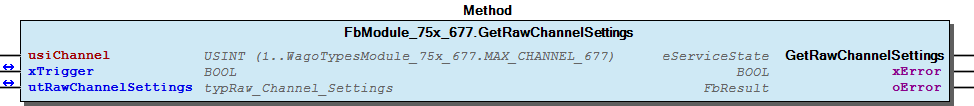
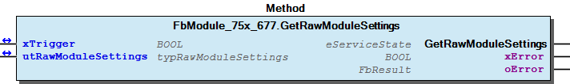
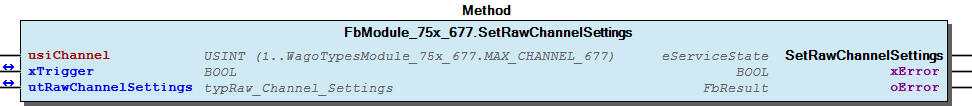
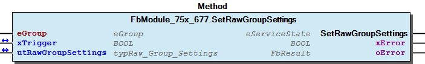
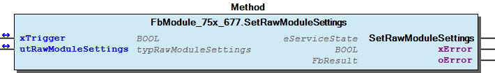
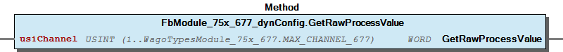
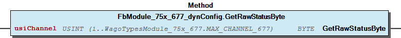
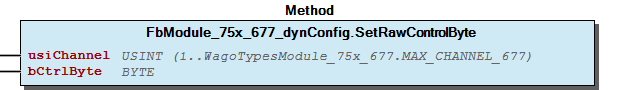
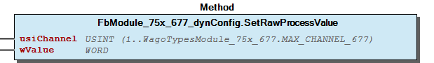

# WagoSysModule_75x_677 v1.0.0.2 (WAGO) - Complete Documentation


## 📋 Library Information

- **Company:** WAGO
- **Title:** WagoSysModule_75x_677
- **Version:** 1.0.0.2
- **Categories:** WAGO LayerView|Sys; Application
- **Author:** WAGO
- **Placeholder:** WagoSysModule_75x_677

### Description ¶


This document is automatically generated.

Handling modules 75x-677

This document is automatically generated. Handling modules 75x-677

### Contents: ¶


Contents: - Documentation Index - Project Information - Library Information - Function Blocks FbModule_75x_677 (FB) - FbModule_75x_677_dynConfig (FB) Methods - FbModule_75x_677.GetRawChannelSettings (METH) - FbModule_75x_677.GetRawGroupSettings (METH) - FbModule_75x_677.GetRawModuleSettings (METH) - FbModule_75x_677.SetRawChannelSettings (METH) - FbModule_75x_677.SetRawGroupSettings (METH) - FbModule_75x_677.SetRawModuleSettings (METH) - FbModule_75x_677_dynConfig.GetRawProcessValue (METH) - FbModule_75x_677_dynConfig.GetRawStatusByte (METH) - FbModule_75x_677_dynConfig.SetRawControlByte (METH) - FbModule_75x_677_dynConfig.SetRawProcessValue (METH) Program Organization Global Variable Lists - Error_677 (GVL) - VersionHistory (GVL) Other Components - 80 Status - Channel - Group - I_Module_75x_677 - Module (raw) - eError_677 (ENUM) - raw

### Indices and tables ¶


Based on WagoSysModule_75x_677.library, last modified 29.05.2024, 20:22:04. LibDoc 3.5.16.10

© WAGO GmbH & Co. KG, Germany 2018 – All rights reserved. For the avoidance of doubt, this copyright notice does not only apply to the information above but also and primarily to the described library itself. Please note that third-party products are always mentioned without reference to intellectual property rights, including patents, utility models, designs and trademarks, accordingly the existence of such rights cannot be excluded. WAGO is a registered trademark of WAGO Verwaltungsgesellschaft mbH.

- File and Project Information - Library Reference Based on WagoSysModule_75x_677.library, last modified 29.05.2024, 20:22:04. LibDoc 3.5.16.10 © WAGO GmbH & Co. KG, Germany 2018 – All rights reserved. For the avoidance of doubt, this copyright notice does not only apply to the information above but also and primarily to the described library itself. Please note that third-party products are always mentioned without reference to intellectual property rights, including patents, utility models, designs and trademarks, accordingly the existence of such rights cannot be excluded. WAGO is a registered trademark of WAGO Verwaltungsgesellschaft mbH.

### Documentation Index


## WagoSysModule_75x_677 Library Documentation


| Company: | WAGO |
| Title: | WagoSysModule_75x_677 |
| Version: | 1.0.0.2 |
| Categories: | WAGO LayerView\|Sys; Application |
| Author: | WAGO |
| Placeholder: | WagoSysModule_75x_677 |

### Description


This document is automatically generated.

Handling modules 75x-677

This document is automatically generated. Handling modules 75x-677

### Contents:


- 20 Program Organization Units FbModule_75x_677 (FB) - FbModule_75x_677_dynConfig (FB) 80 Status - Error_677 (GVL) - eError_677 (ENUM) VersionHistory (GVL)

### Indices and tables


Based on WagoSysModule_75x_677.library, last modified 29.05.2024, 20:22:04. LibDoc 3.5.16.10

© WAGO GmbH & Co. KG, Germany 2018 – All rights reserved. For the avoidance of doubt, this copyright notice does not only apply to the information above but also and primarily to the described library itself. Please note that third-party products are always mentioned without reference to intellectual property rights, including patents, utility models, designs and trademarks, accordingly the existence of such rights cannot be excluded. WAGO is a registered trademark of WAGO Verwaltungsgesellschaft mbH.

- File and Project Information - Library Reference Based on WagoSysModule_75x_677.library, last modified 29.05.2024, 20:22:04. LibDoc 3.5.16.10 © WAGO GmbH & Co. KG, Germany 2018 – All rights reserved. For the avoidance of doubt, this copyright notice does not only apply to the information above but also and primarily to the described library itself. Please note that third-party products are always mentioned without reference to intellectual property rights, including patents, utility models, designs and trademarks, accordingly the existence of such rights cannot be excluded. WAGO is a registered trademark of WAGO Verwaltungsgesellschaft mbH.

### Project Information


## File and Project Information


| Scope | Name | Type | Content |
| --- | --- | --- | --- |
| FileHeader | libraryFile | string | WagoSysModule_75x_677.library |
| contentFile | doc.clean.json |
| productName | e!COCKPIT |
| creationDateTime | date | 29.05.2024, 20:22:04 |
| companyName | string | WAGO |
| ProjectInformation | LastModificationDateTime | date | 29.05.2024, 20:22:04 |
| Description | string | See: Description |
| Copyright | © WAGO Kontakttechnik GmbH & Co. KG, Germany 2018 – All rights reserved. |
| Author | WAGO |
| AutoResolveUnbound | bool | True |
| Placeholder | string | WagoSysModule_75x_677 |
| Company | WAGO |
| DocFormat | reStructuredText |
| Project | WagoSysModule_75x_677 |
| Version string |  |
| Version | version | 1.0.0.2 |
| ActivateSigning | bool | False |
| Title | string | WagoSysModule_75x_677 |
| LibraryCategories | library-category-list | WAGO LayerView\|Sys; Application |
| CompiledLibraryCompatibilityVersion | string | CODESYS V3.5 SP16 Patch 3 |

### Library Information


## Library Reference


| LinkAllContent: False QualifiedOnly: False | SystemLibrary: False | Optional: False |

| LinkAllContent: False QualifiedOnly: False | SystemLibrary: False | Optional: False |

| LinkAllContent: False QualifiedOnly: False | SystemLibrary: False | Optional: False |

| LinkAllContent: False QualifiedOnly: False | SystemLibrary: False | Optional: False |

| LinkAllContent: False Optional: False | QualifiedOnly: True SystemLibrary: False | PublishSymbolsInContainer: True |

| LinkAllContent: False QualifiedOnly: True | SystemLibrary: False PublishSymbolsInContainer: True | Optional: False |

| LinkAllContent: False Optional: False | QualifiedOnly: True SystemLibrary: False | PublishSymbolsInContainer: True |

This is a dictionary of all referenced libraries and their name spaces.

This is a dictionary of all referenced libraries and their name spaces. WagoSysErrorBase Library Identification : Placeholder: WagoSysErrorBase Default Resolution: WagoSysErrorBase, * (WAGO) Namespace: WagoSysErrorBase Library Properties : WagoSysKbusTerminalControl Library Identification : Placeholder: WagoSysKbusTerminalControl Default Resolution: WagoSysKbusTerminalControl, * (WAGO) Namespace: WagoSysKbusTerminalControl Library Properties : WagoSysModuleBaseProtected Library Identification : Placeholder: WagoSysModuleBaseProtected Default Resolution: WagoSysModuleBaseProtected, * (WAGO) Namespace: WagoSysModuleBaseProtected Library Properties : Library Parameter : Parameter: REGISTER_COM_TIMEOUT = TIME#5s0ms Parameter: PARAMETER_COM_TIMEOUT = TIME#5s0ms WagoSysVersion Library Identification : Name: WagoSysVersion Version: 1.0.0.0 Company: WAGO Namespace: WagoSysVersion Library Properties : WagoTypesCommon Library Identification : Placeholder: WagoTypesCommon Default Resolution: WagoTypesCommon, * (WAGO) Namespace: WagoTypes Library Properties : WagoTypesModuleBase Library Identification : Placeholder: WagoTypesModuleBase Default Resolution: WagoTypesModuleBase, * (WAGO) Namespace: WagoTypesModuleBase Library Properties : Library Parameter : Parameter: MAX_MBX_SIZE = 18 WagoTypesModule_75x_677 Library Identification : Placeholder: WagoTypesModule_75x_677 Default Resolution: WagoTypesModule_75x_677, * (WAGO) Namespace: WagoTypesModule_75x_677 Library Properties :

### Function Blocks


## FbModule_75x_677 (FB)


| Scope | Name | Type | Inherited from |
| --- | --- | --- | --- |
| Output | oError | WagoSysErrorBase.FbResult | FbModuleBase |

Function description

This block is needed for each module. The instance of this function block is either automatically generated by the K-Bus configuration.

For dynamic configuration use the derivate inside WagoSysKbusModule.library .

Interface variables Function Access to the module 75x-677 Function description This block is needed for each module. The instance of this function block is either automatically generated by the K-Bus configuration. For dynamic configuration use the derivate inside WagoSysKbusModule.library . - I_Module_75x_677 Module (raw) FbModule_75x_677.GetRawModuleSettings (METH) - Group Channel FbModule_75x_677.GetRawChannelSettings (METH) - FbModule_75x_677.SetRawChannelSettings (METH) FbModule_75x_677.GetRawGroupSettings (METH) FbModule_75x_677.SetRawGroupSettings (METH) FbModule_75x_677.SetRawModuleSettings (METH)

## FbModule_75x_677_dynConfig (FB)


| Scope | Name | Type | Inherited from |
| --- | --- | --- | --- |
| Output | oError | WagoSysErrorBase.FbResult | FbModuleBase |

Function description

This block is needed for each module. The instance of this function block is either automatically generated by the K-Bus configuration or has to be manually added in case of the dynamic configuration.

Interface variables Function Access to the module 750-677 Function description This block is needed for each module. The instance of this function block is either automatically generated by the K-Bus configuration or has to be manually added in case of the dynamic configuration. - raw FbModule_75x_677_dynConfig.GetRawProcessValue (METH) - FbModule_75x_677_dynConfig.GetRawStatusByte (METH) - FbModule_75x_677_dynConfig.SetRawControlByte (METH) - FbModule_75x_677_dynConfig.SetRawProcessValue (METH)

### Methods


## FbModule_75x_677.GetRawChannelSettings (METH)


| Scope | Name | Type |
| --- | --- | --- |
| Return | GetRawChannelSettings | WagoTypesModuleBase.eServiceState |
| Input | usiChannel | USINT (1..WagoTypesModule_75x_677.MAX_CHANNEL_677) |
| Inout | xTrigger | BOOL |
| utRawChannelSettings | WagoTypesModule_75x_677.typRaw_Channel_Settings |
| Output | xError | BOOL |
| oError | WagoSysErrorBase.FbResult |

| Struct member | Value | Description |
| --- | --- | --- |
| eOperatingMode | PWM_DC | variable duty cycle -> frequency adjustable |
| PWM_FRQ | variable frequency -> duty cycle adjustable |
| PWM_FRQ_CNT | variable frequency -> duty cycle adjustable / counter |
| PULSE_FRQ_CNT | variable frequency -> pulse width adjustable / counter |
| PWM_PULSE_DIR | variable number of pulses -> frequency and duty cycle adjustable / counter |
| uiFrequency | UINT | PWM Frequency 1..20000 [Hz] |
| uiDutyCycle | UINT | Duty cycle 0..2048 -> * (100 / 2048) [%] |
| udiPulseDuration | UDINT | Pulse duration 1..1000000 [µs] |
| xLoadToPlus | FALSE | Load between output and Uout- |
| TRUE | Load between output and Uout+ |

| Return Value | Description |
| --- | --- |
| WagoTypesModuleBase.eServiceState.DONE | successful |
| WagoTypesModuleBase.eServiceState.ABORT | error -> see oError |
| WagoTypesModuleBase.eServiceState.NO_DATA | call while xTrigger is reset |

```
VAR
    //--- Module Mode Settings ------------------------------
    utRawChannelSettings    :   WagoTypesModule_75x_677.typRaw_Channel_Settings;
    xGetRawChannelSettings  :   BOOL;  // triggers the function
    oError                  :   WagoSysErrorBase.FbResult;
END_VAR

//--- G R O U P    S E T T I N G S -----------------------
CASE my677.GetRawChannelSettings(   usiChannel           := 1,
                                    xTrigger             := xGetRawChannelSettings,
                                    utRawChannelSettings := utRawChannelSettings,
                                    oError               => oError
                                ) OF

    WagoTypesModuleBase.eServiceState.DONE : // OK
            ;// process here your utRawChannelSettings

    WagoTypesModuleBase.eServiceState.ABORT : // Error
            ;// process here your error handling -> see oError for more information

END_CASE
```

WagoTypesModule_75x_677.typRaw_Channel_Settings

Return Values

It is not allowed to reset the xTrigger by the application. This must done by the method.

Graphical Illustration

Graphical Interface of FbModule_75x_677.GetRawChannelSettings

For get the channel settings from the module.

You have to call the method cyclic until the method returns with DONE or ABORT.

Interface variables Function Get the raw channel settings of the module at a struct. WagoTypesModule_75x_677.typRaw_Channel_Settings Return Values Warning It is not allowed to reset the xTrigger by the application. This must done by the method. Graphical Illustration  Graphical Interface of FbModule_75x_677.GetRawChannelSettings Example For get the channel settings from the module. Note You have to call the method cyclic until the method returns with DONE or ABORT.

## FbModule_75x_677.GetRawGroupSettings (METH)


| Scope | Name | Type |
| --- | --- | --- |
| Return | GetRawGroupSettings | WagoTypesModuleBase.eServiceState |
| Input | eGroup | WagoTypesModule_75x_677.eGroup |
| Inout | xTrigger | BOOL |
| utRawGroupSettings | WagoTypesModule_75x_677.typRaw_Group_Settings |
| Output | xError | BOOL |
| oError | WagoSysErrorBase.FbResult |

| Struct member | Value | Description |
| --- | --- | --- |
| xBridgeMode | FALSE | Bridge Mode Channel_A and Channel_B Off |
| TRUE | Bridge Mode Channel_A and Channel_B On |
|  |  |  |
| utChannel_A | Member | Value | Description |
| eOperatingMode | PWM_DC | variable duty cycle -> frequency adjustable |
| PWM_FRQ | variable frequency -> duty cycle adjustable |
| PWM_FRQ_CNT | variable frequency -> duty cycle adjustable / counter |
| PULSE_FRQ_CNT | variable frequency -> pulse width adjustable / counter |
| PWM_PULSE_DIR | variable number of pulses -> frequency and duty cycle adjustable / counter |
| uiFrequency | UINT | PWM Frequency 1..20000 [Hz] |
| uiDutyCycle | UINT | Duty cycle 0..2048 -> * (100 / 2048) [%] |
| udiPulseDuration | UDINT | Pulse duration 1..1000000 [µs] |
| xLoadToPlus | FALSE | Load between output and Uout- |
| TRUE | Load between output and Uout+ |
|  |  |  |  |
| utChannel_B | Member | Value | Description |
| eOperatingMode | PWM_DC | variable duty cycle -> frequency adjustable |
| PWM_FRQ | variable frequency -> duty cycle adjustable |
| uiFrequency | UINT | PWM Frequency 1..20000 [Hz] |
| uiDutyCycle | UINT | Duty cycle 0..2048 -> * (100 / 2048) [%] |
| udiPulseDuration | UDINT | not used |
| xLoadToPlus | FALSE | Load between output and Uout- |
| TRUE | Load between output and Uout+ |

| Return Value | Description |
| --- | --- |
| WagoTypesModuleBase.eServiceState.DONE | successful |
| WagoTypesModuleBase.eServiceState.ABORT | error -> see oError |
| WagoTypesModuleBase.eServiceState.NO_DATA | call while xTrigger is reset |

```
VAR
    //--- Group Settings ------------------------------
    utRawGroupSettings      :   WagoTypesModule_75x_677.typRaw_Group_Settings;
    xGetRawGroupSettings    :   BOOL;  // triggers the function
    oError                  :   WagoSysErrorBase.FbResult;
END_VAR

//--- M O D U L E    S E T T I N G S -----------------------
CASE my677.GetRawGroupSettings( eGroup              := WagoTypesModule_75x_677.eGroup.GROUP_12,
                                xTrigger            := xGetRawGroupSettings,
                                utRawGroupSettings  := utRawGroupSettings,
                                oError              => oError
                              ) OF

    WagoTypesModuleBase.eServiceState.DONE : // OK
            ;// process here your utRawGroupSettings

    WagoTypesModuleBase.eServiceState.ABORT : // Error
            ;// process here your error handling -> see oError for more information

END_CASE
```

WagoTypesModule_75x_677.typRaw_Group_Settings

Return Values

It is not allowed to reset the xTrigger by the application. This must done by the method.

Graphical Illustration

Graphical Interface of FbModule_75x_677.GetRawGroupSettings

For get the group settings from the module.

You have to call the method cyclic until the method returns with DONE or ABORT.

Interface variables Function Get the raw settings of a group at struct. WagoTypesModule_75x_677.typRaw_Group_Settings Return Values Warning It is not allowed to reset the xTrigger by the application. This must done by the method. Graphical Illustration  Graphical Interface of FbModule_75x_677.GetRawGroupSettings Example For get the group settings from the module. Note You have to call the method cyclic until the method returns with DONE or ABORT.

## FbModule_75x_677.GetRawModuleSettings (METH)


| Scope | Name | Type |
| --- | --- | --- |
| Return | GetRawModuleSettings | WagoTypesModuleBase.eServiceState |
| Inout | xTrigger | BOOL |
| utRawModuleSettings | WagoTypesModule_75x_677.typRawModuleSettings |
| Output | xError | BOOL |
| oError | WagoSysErrorBase.FbResult |

| Member | Value | Description |
| --- | --- | --- |
| xWatchdogTimer | FALSE | Deactivates Watchdog |
| TRUE | Activates Watchdog |
|  |  |  |
| utGroup_12 | Member | Value | Description |
| xBridgeMode | FALSE | Bridge Mode Channel_A and Channel_B Off |
| TRUE | Bridge Mode Channel_A and Channel_B On |
|  |  |  |
| utChannel_A | Member | Value | Description |
| eOperatingMode | PWM_DC | variable duty cycle -> frequency adjustable |
| PWM_FRQ | variable frequency -> duty cycle adjustable |
| PWM_FRQ_CNT | variable frequency -> duty cycle adjustable / counter |
| PULSE_FRQ_CNT | variable frequency -> pulse width adjustable / counter |
| PWM_PULSE_DIR | variable number of pulses -> frequency and duty cycle adjustable / counter |
| uiFrequency | UINT | PWM Frequency 1..20000 [Hz] |
| uiDutyCycle | UINT | Duty cycle 0..2048 -> * (100 / 2048) [%] |
| udiPulseDuration | UDINT | Pulse duration 1..1000000 [µs] |
| xLoadToPlus | FALSE | Load between output and Uout- |
| TRUE | Load between output and Uout+ |
|  |  |  |  |
| utChannel_B | Member | Value | Description |
| eOperatingMode | PWM_DC | variable duty cycle -> frequency adjustable |
| PWM_FRQ | variable frequency -> duty cycle adjustable |
| uiFrequency | UINT | PWM Frequency 1..20000 [Hz] |
| uiDutyCycle | UINT | Duty cycle 0..2048 -> * (100 / 2048) [%] |
| udiPulseDuration | UDINT | not used |
| xLoadToPlus | FALSE | Load between output and Uout- |
| TRUE | Load between output and Uout+ |
|  |  |  |  |
| utGroup_34 | Member | Value | Description |
| xBridgeMode | FALSE | Bridge Mode Channel_A and Channel_B Off |
| TRUE | Bridge Mode Channel_A and Channel_B On |
|  |  |  |
| utChannel_A | Member | Value | Description |
| eOperatingMode | PWM_DC | variable duty cycle -> frequency adjustable |
| PWM_FRQ | variable frequency -> duty cycle adjustable |
| PWM_FRQ_CNT | variable frequency -> duty cycle adjustable / counter |
| PULSE_FRQ_CNT | variable frequency -> pulse width adjustable / counter |
| PWM_PULSE_DIR | variable number of pulses -> frequency and duty cycle adjustable / counter |
| uiFrequency | UINT | PWM Frequency 1..20000 [Hz] |
| uiDutyCycle | UINT | Duty cycle 0..2048 -> * (100 / 2048) [%] |
| udiPulseDuration | UDINT | Pulse duration 1..1000000 [µs] |
| xLoadToPlus | FALSE | Load between output and Uout- |
| TRUE | Load between output and Uout+ |
|  |  |  |  |
| utChannel_B | Member | Value | Description |
| eOperatingMode | PWM_DC | variable duty cycle -> frequency adjustable |
| PWM_FRQ | variable frequency -> duty cycle adjustable |
| uiFrequency | UINT | PWM Frequency 1..20000 [Hz] |
| uiDutyCycle | UINT | Duty cycle 0..2048 -> * (100 / 2048) [%] |
| udiPulseDuration | UDINT | not used |
| xLoadToPlus | FALSE | Load between output and Uout- |
| TRUE | Load between output and Uout+ |

| Return Value | Description |
| --- | --- |
| WagoTypesModuleBase.eServiceState.DONE | successful |
| WagoTypesModuleBase.eServiceState.ABORT | error -> see oError |
| WagoTypesModuleBase.eServiceState.NO_DATA | call while xTrigger is reset |

```
VAR
    //--- Module Mode Settings ------------------------------
    utRawModuleSettings     :   WagoTypesModule_75x_677.typRawModuleSettings;
    xGetRawModuleSettings   :   BOOL;  // triggers the function
    oError                  :   WagoSysErrorBase.FbResult;
END_VAR

//--- M O D U L E    S E T T I N G S -----------------------
CASE my677.GetRawModuleSettings( xTrigger            := xGetRawModuleSettings,
                                 utRawModuleSettings := utRawModuleSettings,
                                 oError              => oError
                               ) OF

    WagoTypesModuleBase.eServiceState.DONE : // OK
            ;// process here your utRawModuleSettings

    WagoTypesModuleBase.eServiceState.ABORT : // Error
            ;// process here your error handling -> see oError for more information

END_CASE
```

WagoTypesModule_75x_677.typRawModuleSettings

Return Values

It is not allowed to reset the xTrigger by the application. This must done by the method.

Graphical Illustration

Graphical Interface of FbModule_75x_677.GetRawModuleSettings

For get the settings from the module.

You have to call the method cyclic until the method returns with DONE or ABORT.

Interface variables Function Get the raw settings of the module at a struct. WagoTypesModule_75x_677.typRawModuleSettings Return Values Warning It is not allowed to reset the xTrigger by the application. This must done by the method. Graphical Illustration  Graphical Interface of FbModule_75x_677.GetRawModuleSettings Example For get the settings from the module. Note You have to call the method cyclic until the method returns with DONE or ABORT.

## FbModule_75x_677.SetRawChannelSettings (METH)


| Scope | Name | Type |
| --- | --- | --- |
| Return | SetRawChannelSettings | WagoTypesModuleBase.eServiceState |
| Input | usiChannel | USINT (1..WagoTypesModule_75x_677.MAX_CHANNEL_677) |
| Inout | xTrigger | BOOL |
| utRawChannelSettings | WagoTypesModule_75x_677.typRaw_Channel_Settings |
| Output | xError | BOOL |
| oError | WagoSysErrorBase.FbResult |

| Struct member | Value | Description |
| --- | --- | --- |
| eOperatingMode | PWM_DC | variable duty cycle -> frequency adjustable |
| PWM_FRQ | variable frequency -> duty cycle adjustable |
| PWM_FRQ_CNT | variable frequency -> duty cycle adjustable / counter |
| PULSE_FRQ_CNT | variable frequency -> pulse width adjustable / counter |
| PWM_PULSE_DIR | variable number of pulses -> frequency and duty cycle adjustable / counter |
| uiFrequency | UINT | PWM Frequency 1..20000 [Hz] |
| uiDutyCycle | UINT | Duty cycle 0..2048 -> * (100 / 2048) [%] |
| udiPulseDuration | UDINT | Pulse duration 1..1000000 [µs] |
| xLoadToPlus | FALSE | Load between output and Uout- |
| TRUE | Load between output and Uout+ |

| Return Value | Description |
| --- | --- |
| WagoTypesModuleBase.eServiceState.DONE | successful |
| WagoTypesModuleBase.eServiceState.ABORT | error -> see oError |
| WagoTypesModuleBase.eServiceState.NO_DATA | call while xTrigger is reset |

```
VAR
    //--- Module Mode Settings ------------------------------
    utRawChannelSettings    :   WagoTypesModule_75x_677.typRaw_Channel_Settings;
    xSetRawChannelSettings  :   BOOL;  // triggers the function
    oError                  :   WagoSysErrorBase.FbResult;
END_VAR

//--- G R O U P    S E T T I N G S -----------------------
CASE my677.SetRawChannelSettings(   usiChannel           := 1,
                                    xTrigger             := xSetRawChannelSettings,
                                    utRawChannelSettings := utRawChannelSettings,
                                    oError               => oError
                                ) OF

    WagoTypesModuleBase.eServiceState.DONE : // OK
            ;// Done

    WagoTypesModuleBase.eServiceState.ABORT : // Error
            ;// process here your error handling -> see oError for more information

END_CASE
```

WagoTypesModule_75x_677.typRaw_Channel_Settings

Return Values

It is not allowed to reset the xTrigger by the application. This must done by the method.

Graphical Illustration

Graphical Interface of FbModule_75x_677.SetRawChannelSettings

For get the channel settings from the module.

You have to call the method cyclic until the method returns with DONE or ABORT.

Interface variables Function Get the raw channel settings of the module at a struct. WagoTypesModule_75x_677.typRaw_Channel_Settings Return Values Warning It is not allowed to reset the xTrigger by the application. This must done by the method. Graphical Illustration  Graphical Interface of FbModule_75x_677.SetRawChannelSettings Example For get the channel settings from the module. Note You have to call the method cyclic until the method returns with DONE or ABORT.

## FbModule_75x_677.SetRawGroupSettings (METH)


| Scope | Name | Type |
| --- | --- | --- |
| Return | SetRawGroupSettings | WagoTypesModuleBase.eServiceState |
| Input | eGroup | WagoTypesModule_75x_677.eGroup |
| Inout | xTrigger | BOOL |
| utRawGroupSettings | WagoTypesModule_75x_677.typRaw_Group_Settings |
| Output | xError | BOOL |
| oError | WagoSysErrorBase.FbResult |

| Struct member | Value | Description |
| --- | --- | --- |
| xBridgeMode | FALSE | Bridge Mode Channel_A and Channel_B Off |
| TRUE | Bridge Mode Channel_A and Channel_B On |
|  |  |  |
| utChannel_A | Member | Value | Description |
| eOperatingMode | PWM_DC | variable duty cycle -> frequency adjustable |
| PWM_FRQ | variable frequency -> duty cycle adjustable |
| PWM_FRQ_CNT | variable frequency -> duty cycle adjustable / counter |
| PULSE_FRQ_CNT | variable frequency -> pulse width adjustable / counter |
| PWM_PULSE_DIR | variable number of pulses -> frequency and duty cycle adjustable / counter |
| uiFrequency | UINT | PWM Frequency 1..20000 [Hz] |
| uiDutyCycle | UINT | Duty cycle 0..2048 -> * (100 / 2048) [%] |
| udiPulseDuration | UDINT | Pulse duration 1..1000000 [µs] |
| xLoadToPlus | FALSE | Load between output and Uout- |
| TRUE | Load between output and Uout+ |
|  |  |  |  |
| utChannel_B | Member | Value | Description |
| eOperatingMode | PWM_DC | variable duty cycle -> frequency adjustable |
| PWM_FRQ | variable frequency -> duty cycle adjustable |
| uiFrequency | UINT | PWM Frequency 1..20000 [Hz] |
| uiDutyCycle | UINT | Duty cycle 0..2048 -> * (100 / 2048) [%] |
| udiPulseDuration | UDINT | not used |
| xLoadToPlus | FALSE | Load between output and Uout- |
| TRUE | Load between output and Uout+ |

| Return Value | Description |
| --- | --- |
| WagoTypesModuleBase.eServiceState.DONE | successful |
| WagoTypesModuleBase.eServiceState.ABORT | error -> see oError |
| WagoTypesModuleBase.eServiceState.NO_DATA | call while xTrigger is reset |

```
VAR
    //--- Group Settings ------------------------------
    utRawGroupSettings      :   WagoTypesModule_75x_677.typRaw_Group_Settings;
    xSetRawGroupSettings    :   BOOL;  // triggers the function
    oError                  :   WagoSysErrorBase.FbResult;
END_VAR

//--- G R O U P    S E T T I N G S -----------------------
CASE my677.SetRawGroupSettings( eGroup              := WagoTypesModule_75x_677.eGroup.GROUP_12,
                                xTrigger            := xSetRawGroupSettings,
                                utRawGroupSettings  := utRawGroupSettings,
                                oError              => oError
                              ) OF

    WagoTypesModuleBase.eServiceState.DONE : // OK
            ;// Done

    WagoTypesModuleBase.eServiceState.ABORT : // Error
            ;// process here your error handling -> see oError for more information

END_CASE
```

WagoTypesModule_75x_677.typRaw_Group_Settings

Return Values

It is not allowed to reset the xTrigger by the application. This must done by the method.

Graphical Illustration

Graphical Interface of FbModule_75x_677.SetRawGroupSettings

For set the group settings at the module.

You have to call the method cyclic until the method returns with DONE or ABORT.

Interface variables Function Get the raw settings of a group at struct. WagoTypesModule_75x_677.typRaw_Group_Settings Return Values Warning It is not allowed to reset the xTrigger by the application. This must done by the method. Graphical Illustration  Graphical Interface of FbModule_75x_677.SetRawGroupSettings Example For set the group settings at the module. Note You have to call the method cyclic until the method returns with DONE or ABORT.

## FbModule_75x_677.SetRawModuleSettings (METH)


| Scope | Name | Type |
| --- | --- | --- |
| Return | SetRawModuleSettings | WagoTypesModuleBase.eServiceState |
| Inout | xTrigger | BOOL |
| utRawModuleSettings | WagoTypesModule_75x_677.typRawModuleSettings |
| Output | xError | BOOL |
| oError | WagoSysErrorBase.FbResult |

| Member | Value | Description |
| --- | --- | --- |
| xWatchdogTimer | FALSE | Deactivates Watchdog |
| TRUE | Activates Watchdog |
|  |  |  |
| utGroup_12 | Member | Value | Description |
| xBridgeMode | FALSE | Bridge Mode Channel_A and Channel_B Off |
| TRUE | Bridge Mode Channel_A and Channel_B On |
|  |  |  |
| utChannel_A | Member | Value | Description |
| eOperatingMode | PWM_DC | variable duty cycle -> frequency adjustable |
| PWM_FRQ | variable frequency -> duty cycle adjustable |
| PWM_FRQ_CNT | variable frequency -> duty cycle adjustable / counter |
| PULSE_FRQ_CNT | variable frequency -> pulse width adjustable / counter |
| PWM_PULSE_DIR | variable number of pulses -> frequency and duty cycle adjustable / counter |
| uiFrequency | UINT | PWM Frequency 1..20000 [Hz] |
| uiDutyCycle | UINT | Duty cycle 0..2048 -> * (100 / 2048) [%] |
| udiPulseDuration | UDINT | Pulse duration 1..1000000 [µs] |
| xLoadToPlus | FALSE | Load between output and Uout- |
| TRUE | Load between output and Uout+ |
|  |  |  |  |
| utChannel_B | Member | Value | Description |
| eOperatingMode | PWM_DC | variable duty cycle -> frequency adjustable |
| PWM_FRQ | variable frequency -> duty cycle adjustable |
| uiFrequency | UINT | PWM Frequency 1..20000 [Hz] |
| uiDutyCycle | UINT | Duty cycle 0..2048 -> * (100 / 2048) [%] |
| udiPulseDuration | UDINT | not used |
| xLoadToPlus | FALSE | Load between output and Uout- |
| TRUE | Load between output and Uout+ |
|  |  |  |  |
| utGroup_34 | Member | Value | Description |
| xBridgeMode | FALSE | Bridge Mode Channel_A and Channel_B Off |
| TRUE | Bridge Mode Channel_A and Channel_B On |
|  |  |  |
| utChannel_A | Member | Value | Description |
| eOperatingMode | PWM_DC | variable duty cycle -> frequency adjustable |
| PWM_FRQ | variable frequency -> duty cycle adjustable |
| PWM_FRQ_CNT | variable frequency -> duty cycle adjustable / counter |
| PULSE_FRQ_CNT | variable frequency -> pulse width adjustable / counter |
| PWM_PULSE_DIR | variable number of pulses -> frequency and duty cycle adjustable / counter |
| uiFrequency | UINT | PWM Frequency 1..20000 [Hz] |
| uiDutyCycle | UINT | Duty cycle 0..2048 -> * (100 / 2048) [%] |
| udiPulseDuration | UDINT | Pulse duration 1..1000000 [µs] |
| xLoadToPlus | FALSE | Load between output and Uout- |
| TRUE | Load between output and Uout+ |
|  |  |  |  |
| utChannel_B | Member | Value | Description |
| eOperatingMode | PWM_DC | variable duty cycle -> frequency adjustable |
| PWM_FRQ | variable frequency -> duty cycle adjustable |
| uiFrequency | UINT | PWM Frequency 1..20000 [Hz] |
| uiDutyCycle | UINT | Duty cycle 0..2048 -> * (100 / 2048) [%] |
| udiPulseDuration | UDINT | not used |
| xLoadToPlus | FALSE | Load between output and Uout- |
| TRUE | Load between output and Uout+ |

| Return Value | Description |
| --- | --- |
| WagoTypesModuleBase.eServiceState.DONE | successful |
| WagoTypesModuleBase.eServiceState.ABORT | error -> see oError |
| WagoTypesModuleBase.eServiceState.NO_DATA | call while xTrigger is reset |

```
VAR
    //--- Module Mode Settings ------------------------------
    xStartProcess           :   BOOL; // set this variable once to start the process -> this varibale will be automatic reset
    utRawModuleSettings     :   WagoTypesModule_75x_677.typRawModuleSettings;
    oError                  :   WagoSysErrorBase.FbResult;
    xSetRawModuleSettings   :   BOOL;  // triggers the function
END_VAR

//--- READ BEFORE WRITE --------------------------------------------------------------
CASE my677.GetRawModuleSettings(xStartProcess, utRawModuleSettings, oError => oError) OF

    WagoTypesModuleBase.eServiceState.DONE : // OK -> actual configuration is successful read
        // change here your configuration
        // utRawModuleSettings... :=
        xSetRawModuleSettings := TRUE; // trigger write

    WagoTypesModuleBase.eServiceState.ABORT : // Error -> not able to read -> see oError
            ;// process here your error handling for read -> see oError for more information

END_CASE

//--- S E T   M O D U L E    S E T T I N G S ---------------
CASE my677.SetRawModuleSettings( xTrigger            := xSetRawModuleSettings,
                                 utRawModuleSettings := utRawModuleSettings,
                                 oError              => oError
                               ) OF

    WagoTypesModuleBase.eServiceState.DONE : // OK
            ;// Done

    WagoTypesModuleBase.eServiceState.ABORT : // Error
            ;// process here your error handling -> see oError for more information

END_CASE
```

WagoTypesModule_75x_677.typRawModuleSettings

Return Values

It is not allowed to reset the xTrigger by the application. This must done by the method.

Graphical Illustration

Graphical Interface of FbModule_75x_677.SetRawModuleSettings

For set the raw settings from the module.

You have to call the method cyclic until the method returns with DONE or ABORT.

Interface variables Function Set the raw settings of the module from a struct. WagoTypesModule_75x_677.typRawModuleSettings Return Values Warning It is not allowed to reset the xTrigger by the application. This must done by the method. Graphical Illustration  Graphical Interface of FbModule_75x_677.SetRawModuleSettings Example For set the raw settings from the module. Note You have to call the method cyclic until the method returns with DONE or ABORT.

## FbModule_75x_677_dynConfig.GetRawProcessValue (METH)


| Scope | Name | Type |
| --- | --- | --- |
| Return | GetRawProcessValue | WORD |
| Input | usiChannel | USINT (1..WagoTypesModule_75x_677.MAX_CHANNEL_677) |

```
VAR
    mywProcessValue :   WORD;
END_VAR

mywProcessValue := my677.GetProcessValue(1); // here is the process raw value as WORD
```

Get the raw process value of the wanted channel.

In case of error (e.g. an invalid channel number is given) it returns 16#FFFF.

Graphical Illustration

Graphical Interface of FbModule_75x_677_dynConfig.GetRawProcessValue

For get the process value from first channel of the module.

Interface variables Function Get the raw process value of the wanted channel. In case of error (e.g. an invalid channel number is given) it returns 16#FFFF. Graphical Illustration  Graphical Interface of FbModule_75x_677_dynConfig.GetRawProcessValue Example For get the process value from first channel of the module.

## FbModule_75x_677_dynConfig.GetRawStatusByte (METH)


| Scope | Name | Type |
| --- | --- | --- |
| Return | GetRawStatusByte | BYTE |
| Input | usiChannel | USINT (1..WagoTypesModule_75x_677.MAX_CHANNEL_677) |

```
VAR
    mybStatusByte   :   BYTE;
END_VAR

mybStatusByte := my677.GetRawStatusByte(1); // here is the raw status byte
```

Get the raw status byte of the wanted channel.

In case of error (e.g. an invalid channel number is given) it returns 16#FF.

Graphical Illustration

Graphical Interface of FbModule_75x_677_dynConfig.GetRawStatusByte

For get the status byte from first channel of the module.

Interface variables Function Get the raw status byte of the wanted channel. In case of error (e.g. an invalid channel number is given) it returns 16#FF. Graphical Illustration  Graphical Interface of FbModule_75x_677_dynConfig.GetRawStatusByte Example For get the status byte from first channel of the module.

## FbModule_75x_677_dynConfig.SetRawControlByte (METH)


| Scope | Name | Type |
| --- | --- | --- |
| Input | usiChannel | USINT (1..WagoTypesModule_75x_677.MAX_CHANNEL_677) |
| bCtrlByte | BYTE |

```
VAR
    mybCtrlByte :   BYTE;
END_VAR

my677.SetRawControlByte(    usiChannel := 1,
                            bCtrlByte  := mybCtrlByte
                        );
```

Graphical Illustration

Graphical Interface of FbModule_75x_677_dynConfig.SetRawControlByte

Interface variables Function Set the raw control byte for the selected channel Graphical Illustration  Graphical Interface of FbModule_75x_677_dynConfig.SetRawControlByte Example Set the raw control byte from first channel of the module.

## FbModule_75x_677_dynConfig.SetRawProcessValue (METH)


| Scope | Name | Type |
| --- | --- | --- |
| Input | usiChannel | USINT (1..WagoTypesModule_75x_677.MAX_CHANNEL_677) |
| wValue | WORD |

```
VAR
    myProcessValue  :   WORD;
END_VAR

my677.SetRawProcessValue(1,myProcessValue);
```

Graphical Illustration

Graphical Interface of FbModule_75x_677_dynConfig.SetRawProcessValue

Interface variables Function Set the raw process value for the selected channel Graphical Illustration  Graphical Interface of FbModule_75x_677_dynConfig.SetRawProcessValue Example Set the process value from first channel of the module.

### Program Organization


## 20 Program Organization Units


- FbModule_75x_677 (FB) I_Module_75x_677 Module (raw) FbModule_75x_677.GetRawModuleSettings (METH) - Group Channel FbModule_75x_677.GetRawChannelSettings (METH) - FbModule_75x_677.SetRawChannelSettings (METH) FbModule_75x_677.GetRawGroupSettings (METH) FbModule_75x_677.SetRawGroupSettings (METH) FbModule_75x_677.SetRawModuleSettings (METH) FbModule_75x_677_dynConfig (FB) - raw FbModule_75x_677_dynConfig.GetRawProcessValue (METH) - FbModule_75x_677_dynConfig.GetRawStatusByte (METH) - FbModule_75x_677_dynConfig.SetRawControlByte (METH) - FbModule_75x_677_dynConfig.SetRawProcessValue (METH)

### Global Variable Lists


## Error_677 (GVL)


| Scope | Name | Type |
| --- | --- | --- |
| Constant | ERROR_677 | ARRAY [0..5] OF WagoTypesErrorBase.typResultItem |

| Value | Level | Description |
| --- | --- | --- |
| eError_677.OK | WagoTypesErrorBase.eSeverity.none | ‘OK’ |
| eError_677.INVALID_CHANNEL | WagoTypesErrorBase.eSeverity.error | ‘The channel number is not allowed’ |
| eError_677.INVALID_OPERATING_MODE | WagoTypesErrorBase.eSeverity.error | ‘The operating mode is not possible’ |
| eError_677.INVALID_FREQUENCY | WagoTypesErrorBase.eSeverity.error | ‘Invalid frequency allowed range -> 1..20000’ |
| eError_677.INVALID_DUTY_CYCLE | WagoTypesErrorBase.eSeverity.error | ‘Invalid duty cycle allowed range -> 0..2048’ |
| eError_677.INVALID_PULSE_DURATION | WagoTypesErrorBase.eSeverity.error | ‘Invalid pulse duration allowed range -> 1..1000000’ |

## VersionHistory (GVL)


| Name | Type |
| --- | --- |
| Info | ProjectInfo |

| date | version | author | change |
| 11.03.2024 | 1.0.0.2 | u0103719 | WAT36347: update PA-Struct for FW23 modules (context: SetRaw*,GetRaw* -> DymConfig) |
| 28.02.2024 | 1.0.0.1 | u010663 | Compiled SP16.3 |
| 23.08.2021 | 1.0.0.0 | u010545 | first release |

WagoSysModule_75x_677.library

Release Notes:

WagoSysModule_75x_677.library Release Notes:

### Other Components


## 80 Status ¶


- Error_677 (GVL) - eError_677 (ENUM)

## Channel


- FbModule_75x_677.GetRawChannelSettings (METH) - FbModule_75x_677.SetRawChannelSettings (METH)

## Group


- Channel FbModule_75x_677.GetRawChannelSettings (METH) - FbModule_75x_677.SetRawChannelSettings (METH) FbModule_75x_677.GetRawGroupSettings (METH) FbModule_75x_677.SetRawGroupSettings (METH)

## I_Module_75x_677


- Module (raw) FbModule_75x_677.GetRawModuleSettings (METH) - Group Channel FbModule_75x_677.GetRawChannelSettings (METH) - FbModule_75x_677.SetRawChannelSettings (METH) FbModule_75x_677.GetRawGroupSettings (METH) FbModule_75x_677.SetRawGroupSettings (METH) FbModule_75x_677.SetRawModuleSettings (METH)

## Module (raw)


- FbModule_75x_677.GetRawModuleSettings (METH) - Group Channel FbModule_75x_677.GetRawChannelSettings (METH) - FbModule_75x_677.SetRawChannelSettings (METH) FbModule_75x_677.GetRawGroupSettings (METH) FbModule_75x_677.SetRawGroupSettings (METH) FbModule_75x_677.SetRawModuleSettings (METH)

## eError_677 (ENUM)


| Name | Initial | Comment |
| --- | --- | --- |
| OK | 0 | all is well |
| INVALID_CHANNEL | 1 | invalid channel number |
| INVALID_OPERATING_MODE | 2 | invalid operating mode |
| INVALID_FREQUENCY | 3 | invalid frequency allowed range -> 1..20000 |
| INVALID_DUTY_CYCLE | 4 | invalid duty cycle allowed range -> 0..2048 |
| INVALID_PULSE_DURATION | 5 | invalid pulse duration allowed range -> 1..1000000 |

## raw


- FbModule_75x_677_dynConfig.GetRawProcessValue (METH) - FbModule_75x_677_dynConfig.GetRawStatusByte (METH) - FbModule_75x_677_dynConfig.SetRawControlByte (METH) - FbModule_75x_677_dynConfig.SetRawProcessValue (METH)