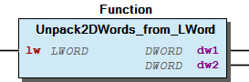

# WagoSysPlainMem v1.5.3.1 (WAGO) - Complete Documentation


### Documentation Index


## 10 Documentation ¶


WagoSysPlainMem

WAGO LayerView|Sys; Application

WAGO / u013972

WagoSysPlainMem

This document is automatically generated.

Handling application memory

Based on WagoSysPlainMem.library, last modified 30.01.2024, 11:34:26. LibDoc 4.1.1.0

© WAGO GmbH & Co. KG, Germany 2018 – All rights reserved. For the avoidance of doubt, this copyright notice does not only apply to the information above but also and primarily to the described library itself. Please note that third-party products are always mentioned without reference to intellectual property rights, including patents, utility models, designs and trademarks, accordingly the existence of such rights cannot be excluded. WAGO is a registered trademark of WAGO Verwaltungsgesellschaft mbH.

- doc10_General (FunctionBlock) Company WAGO Title WagoSysPlainMem Version 1.5.3.1 Categories WAGO LayerView|Sys; Application Author WAGO / u013972 Placeholder WagoSysPlainMem This document is automatically generated. Handling application memory - 10 Documentation doc10_General (FunctionBlock) 20 Program Organization Units - 21 Raw Memory - 22 Packing Functions VersionHistory (GVL) - File and Project Information - Library Reference Based on WagoSysPlainMem.library, last modified 30.01.2024, 11:34:26. LibDoc 4.1.1.0 © WAGO GmbH & Co. KG, Germany 2018 – All rights reserved. For the avoidance of doubt, this copyright notice does not only apply to the information above but also and primarily to the described library itself. Please note that third-party products are always mentioned without reference to intellectual property rights, including patents, utility models, designs and trademarks, accordingly the existence of such rights cannot be excluded. WAGO is a registered trademark of WAGO Verwaltungsgesellschaft mbH.

### Project Information


| Scope | Name | Type | Content |
| --- | --- | --- | --- |
| FileHeader | creationDateTime | date | 30.01.2024, 11:34:27 |
| companyName | string | WAGO |
| libraryFile | string | WagoSysPlainMem.library |
| productName | string | e!COCKPIT |
| contentFile | string | doc.clean.json |
| ProjectInformation | AutoResolveUnbound | bool | True |
| ProjectInformation | LastModificationDateTime | 30.01.2024, 11:34:26 |
| ProjectInformation | LibraryCategories | library-category-list | WAGO LayerView\|Sys; Application |
| ProjectInformation | Author | string | WAGO / u013972 |
| ProjectInformation | Company | string | WAGO |
| ProjectInformation | CompiledLibraryCompatibilityVersion | string | CODESYS V3.5 SP16 Patch 3 |
| ProjectInformation | Copyright | string | © WAGO Kontakttechnik GmbH & Co. KG, Germany 2018 – All rights reserved. |
| ProjectInformation | DefaultNamespace | string |  |
| ProjectInformation | Description | string | See: Description |
| ProjectInformation | DocFormat | string | reStructuredText |
| ProjectInformation | Placeholder | string | WagoSysPlainMem |
| ProjectInformation | Project | string | WagoSysPlainMem |
| ProjectInformation | Title | string | WagoSysPlainMem |
| ProjectInformation | Version | version | 1.5.3.1 |

### Library Information


| LinkAllContent: False Optional: False | QualifiedOnly: False | SystemLibrary: False |

| LinkAllContent: False Optional: False | PublishSymbolsInContainer: True QualifiedOnly: False | SystemLibrary: False |

| LinkAllContent: False Optional: False | QualifiedOnly: False | SystemLibrary: False |

This is a dictionary of all referenced libraries and their name spaces.

This is a dictionary of all referenced libraries and their name spaces. SysMem Library Identification : Placeholder: SysMem Default Resolution: SysMem, * (System) Namespace: SysMem Library Properties : SysTypes2 Interfaces Library Identification : Name: SysTypes2 Interfaces Version: newest Company: System Namespace: SysTypes Library Properties : WagoSysVersion Library Identification : Name: WagoSysVersion Version: 1.0.0.0 Company: WAGO Namespace: WagoSysVersion Library Properties :

### Function Blocks


## doc10_General (FB)


The library WagoSysPlainMem provides helper functions for data type conversion and memory operations. It is divided into two main parts.

These functions give the user comfortable memory operations for comparing or manipulating memory blocks.

These functions are intended for type conversion. For example to create a single 16 bit (WORD) value out of two 8 bit (BYTE) values or vice versa. It is possible to assemble types with different bit lengths.

The library WagoSysPlainMem provides helper functions for data type conversion and memory operations. It is divided into two main parts. Raw Memory These functions give the user comfortable memory operations for comparing or manipulating memory blocks. Packing These functions are intended for type conversion. For example to create a single 16 bit (WORD) value out of two 8 bit (BYTE) values or vice versa. It is possible to assemble types with different bit lengths.

### Functions


## FetchByte_from_mem (FUN)


| Scope | Name | Type | Comment |
| --- | --- | --- | --- |
| Return | FetchByte_from_mem | BYTE |  |
| Input | pSource | POINTER TO BYTE | Base address |
| Input | diOffset | DINT | Offset from the base address (in bytes) |

Reads a single BYTE from a memory location.

Graphical Illustration

Graphical Interface of FetchByte_from_mem

Function Description

Typical application: Address single pieces of typified data in a field of raw data.

Interface variables Function Reads a single BYTE from a memory location. Graphical Illustration  Graphical Interface of FetchByte_from_mem Function Description Typical application: Address single pieces of typified data in a field of raw data.

## FetchDWord_from_BE (FUN)


| Scope | Name | Type | Comment |
| --- | --- | --- | --- |
| Return | FetchDWord_from_BE | DWORD |  |
| Input | pSource | POINTER TO BYTE | Base address |
| Input | diOffset | DINT | Offset from the base address (in bytes) |

Reads a single DWORD from a memory location in big-endian byte order.

Graphical Illustration

Graphical Interface of FetchDWord_from_BE

Function Description

Typical application: Putting 32-bit-ints into a network packet (which is traditionally big-endian).

Interface variables Function Reads a single DWORD from a memory location in big-endian byte order. Graphical Illustration  Graphical Interface of FetchDWord_from_BE Function Description Typical application: Putting 32-bit-ints into a network packet (which is traditionally big-endian).

## FetchDWord_from_LE (FUN)


| Scope | Name | Type | Comment |
| --- | --- | --- | --- |
| Return | FetchDWord_from_LE | DWORD |  |
| Input | pSource | POINTER TO BYTE | Base address |
| Input | diOffset | DINT | Offset from the base address (in bytes) |

Reads a single DWORD from a memory location in little-endian byte order.

Graphical Illustration

Graphical Interface of FetchDWord_from_LE

Function Description

Typical application: Address single pieces of typified data in a field of raw data.

Interface variables Function Reads a single DWORD from a memory location in little-endian byte order. Graphical Illustration  Graphical Interface of FetchDWord_from_LE Function Description Typical application: Address single pieces of typified data in a field of raw data.

## FetchDWord_from_mem (FUN)


| Scope | Name | Type | Comment |
| --- | --- | --- | --- |
| Return | FetchDWord_from_mem | DWORD |  |
| Input | pSource | POINTER TO DWORD | Base address |
| Input | diOffset | DINT | Offset from the base address (in bytes) |

Reads a single DWORD from a memory location.

Graphical Illustration

Graphical Interface of FetchDWord_from_mem

Function Description

Typical application: Address single pieces of typified data in a field of raw data.

Interface variables Function Reads a single DWORD from a memory location. Graphical Illustration  Graphical Interface of FetchDWord_from_mem Function Description Typical application: Address single pieces of typified data in a field of raw data.

## FetchLWord_from_BE (FUN)


| Scope | Name | Type | Comment |
| --- | --- | --- | --- |
| Return | FetchLWord_from_BE | LWORD |  |
| Input | pSource | POINTER TO BYTE | Base address |
| Input | diOffset | DINT | Offset from the base address (in bytes) |

Reads a single LWORD from a memory location in big-endian byte order.

Graphical Illustration

Graphical Interface of FetchLWord_from_BE

Function Description

Typical application: Putting 64-bit-ints into a network packet (which is traditionally big-endian).

Interface variables Function Reads a single LWORD from a memory location in big-endian byte order. Graphical Illustration  Graphical Interface of FetchLWord_from_BE Function Description Typical application: Putting 64-bit-ints into a network packet (which is traditionally big-endian).

## FetchLWord_from_LE (FUN)


| Scope | Name | Type | Comment |
| --- | --- | --- | --- |
| Return | FetchLWord_from_LE | LWORD |  |
| Input | pSource | POINTER TO BYTE | Base address |
| Input | diOffset | DINT | Offset from the base address (in bytes) |

Reads a single LWORD from a memory location in little-endian byte order.

Graphical Illustration

Graphical Interface of FetchLWord_from_LE

Function Description

Typical application: Address single pieces of typified data in a field of raw data.

Interface variables Function Reads a single LWORD from a memory location in little-endian byte order. Graphical Illustration  Graphical Interface of FetchLWord_from_LE Function Description Typical application: Address single pieces of typified data in a field of raw data.

## FetchLWord_from_mem (FUN)


| Scope | Name | Type | Comment |
| --- | --- | --- | --- |
| Return | FetchLWord_from_mem | LWORD |  |
| Input | pSource | POINTER TO LWORD | Base address |
| Input | diOffset | DINT | Offset from the base address (in bytes) |

Reads a single LWORD from a memory location.

Graphical Illustration

Graphical Interface of FetchLWord_from_mem

Function Description

Typical application: Address single pieces of typified data in a field of raw data.

Interface variables Function Reads a single LWORD from a memory location. Graphical Illustration  Graphical Interface of FetchLWord_from_mem Function Description Typical application: Address single pieces of typified data in a field of raw data.

## FetchWord_from_BE (FUN)


| Scope | Name | Type | Comment |
| --- | --- | --- | --- |
| Return | FetchWord_from_BE | WORD |  |
| Input | pSource | POINTER TO BYTE | Base address |
| Input | diOffset | DINT | Offset from the base address (in bytes) |

Reads a single WORD from a memory location in big-endian byte order.

Graphical Illustration

Graphical Interface of FetchWord_from_BE

Function Description

Typical application: Putting 16-bit-ints into a network packet (which is traditionally big-endian).

Interface variables Function Reads a single WORD from a memory location in big-endian byte order. Graphical Illustration  Graphical Interface of FetchWord_from_BE Function Description Typical application: Putting 16-bit-ints into a network packet (which is traditionally big-endian).

## FetchWord_from_LE (FUN)


| Scope | Name | Type | Comment |
| --- | --- | --- | --- |
| Return | FetchWord_from_LE | WORD |  |
| Input | pSource | POINTER TO BYTE | Base address |
| Input | diOffset | DINT | Offset from the base address (in bytes) |

Reads a single WORD from a memory location in little-endian byte order.

Graphical Illustration

Graphical Interface of FetchWord_from_LE

Function Description

Typical application: Address single pieces of typified data in a field of raw data.

Interface variables Function Reads a single WORD from a memory location in little-endian byte order. Graphical Illustration  Graphical Interface of FetchWord_from_LE Function Description Typical application: Address single pieces of typified data in a field of raw data.

## FetchWord_from_mem (FUN)


| Scope | Name | Type | Comment |
| --- | --- | --- | --- |
| Return | FetchWord_from_mem | WORD |  |
| Input | pSource | POINTER TO WORD | Base address |
| Input | diOffset | DINT | Offset from the base address (in bytes) |

| Scope | Name | Type |
| --- | --- | --- |
| Return | IsBigEndianMachine | BOOL |

| Scope | Name | Type |
| --- | --- | --- |
| Return | IsLittleEndianMachine | BOOL |

| Scope | Name | Type | Comment |
| --- | --- | --- | --- |
| Input | pData | POINTER TO BYTE | Location of the memory block |
| udiSize | UDINT | Size of the memory block |

| Scope | Name | Type | Comment |
| --- | --- | --- | --- |
| Input | pDest | POINTER TO BYTE | Address of target area |
| pSource | POINTER TO BYTE | Address of source area |
| udiSize | UDINT | Size of the data block to be copied. |

| Scope | Name | Type | Initial | Comment |
| --- | --- | --- | --- | --- |
| Input | pDest | POINTER TO BYTE |  | Address of target area |
| udiDestSize | UDINT |  | Size of the target area |
| pSource | POINTER TO BYTE |  | Address of source area |
| udiSourceSize | UDINT |  | Size of the data block to be copied. |
| bPadding | BYTE | 0 | Fill byte for excess destination space. |

| Scope | Name | Type | Comment |
| --- | --- | --- | --- |
| Return | MemFindByteAddress | POINTER TO BYTE |  |
| Input | pData | POINTER TO BYTE | Points to the memory location. |
| Input | udiDataSize | UDINT | Size of the memory block. |
| Input | bProbe | BYTE | The byte which is to be searched for. |
| Input | xRegardEndOfString | BOOL | TRUE = Stop search at string terminator (0x00). |

| Scope | Name | Type | Comment |
| --- | --- | --- | --- |
| Return | MemFindByteIndex | UDINT |  |
| Input | pData | POINTER TO BYTE | Points to the memory location. |
| Input | udiDataSize | UDINT | Size of the memory block. |
| Input | bProbe | BYTE | The byte which is to be searched for. |
| Input | xRegardEndOfString | BOOL | TRUE = Stop search at string terminator (0x00). |

| Scope | Name | Type | Comment |
| --- | --- | --- | --- |
| Return | MemFirstDifference | UDINT |  |
| Input | pProbe | POINTER TO BYTE | Pointer to first memory block |
| Input | udiSize | UDINT | Size of memory block |
| Input | udiStart | UDINT | First byte to compare (0=first position in block). |
| Input | pReference | POINTER TO BYTE | Pointer to reference block |

| Scope | Name | Type | Comment |
| --- | --- | --- | --- |
| Return | MemIsEqual | BOOL |  |
| Input | pA | POINTER TO BYTE | Pointer to first memory block |
| Input | udiSizeA | UDINT | Size of first memory block |
| Input | pB | POINTER TO BYTE | Pointer to second memory block |
| Input | udiSizeB | UDINT | Size of second memory block |

| Scope | Name | Type | Comment |
| --- | --- | --- | --- |
| Return | MemIsValid | BOOL |  |
| Input | pData | POINTER TO BYTE | Pointer to the memory block |
| Input | udiSize | UDINT | Size of the memory block |

| Scope | Name | Type | Comment |
| --- | --- | --- | --- |
| Input | pData | POINTER TO BYTE | Location of the memory block |
| bValue | BYTE | Byte to fill into the memory. |
| udiSize | UDINT | Size of the memory block |

| Scope | Name | Type | Comment |
| --- | --- | --- | --- |
| Input | pData | POINTER TO DWORD | Location of the memory block |
| dwValue | DWORD | DWORD to fill into the memory |
| udiSize | UDINT | Size of the memory block |

| Scope | Name | Type | Comment |
| --- | --- | --- | --- |
| Input | pDest | POINTER TO BYTE | Location of the target memory block |
| udiDestSize | UDINT | Size of the memory block |
| pSource | POINTER TO BYTE | Location of the source pattern |
| udiSourceSize | UDINT | Size of the source pattern |

| Scope | Name | Type | Comment |
| --- | --- | --- | --- |
| Input | pData | POINTER TO BYTE | Location of the memory block |
| udiSize | UDINT | Size of the memory block |

```
VAR
  A : myLargeStructure;
END_VAR

MemClear(adr(A),sizeof(A));
```

```
VAR
  A : myLargeStructure;
  B : myOtherLargeStructure;
END_VAR

IF MemIsEqual(adr(A),sizeof(A),adr(B),sizeof(B)) THEN doSomeAction(); ENDIF
```

Reads a single WORD from a memory location.

Graphical Illustration

Graphical Interface of FetchWord_from_mem

Function Description

Typical application: Address single pieces of typified data in a field of raw data.

Checks whether the memory layout is big-endian or little-endian.

Graphical Illustration

Graphical Interface of IsBigEndianMachine

Function Description

The function returns TRUE if the target memory layout is big-endian (Motorola byte order) and FALSE for little-endian (Intel byte order).

Checks whether the memory layout is little-endian or big-endian.

Graphical Illustration

Graphical Interface of IsLittleEndianMachine

Function Description

The function returns TRUE if the target memory layout is little-endian (Intel byte order) and FALSE for big-endian (Motorola byte order).

Fills a memory space with zeroes.

Graphical Illustration

Graphical Interface of MemClear

Function Description

This function will not fail. It does not check for memory boundaries.

A typical application of this is clearing a data structure before using it:

Copies a block of data from one location to another.

Graphical Illustration

Graphical Interface of MemCopy

Function Description

In contrast to the equivalent routines from SysMem, this function checks for overlapping areas before copying and selects the copy-mechanism accordingly so the user does not have to care.

Copies a block of data from one location to another.

Graphical Illustration

Graphical Interface of MemCopySecure

Function Description

This function copies the content of the source memory location to the destination memory location. If the destination size is larger than the source area, excess bytes are filled with the padding byte. If the destination is smaller than the source, only the size of the destination area is copied and the excess source area is ignored.

In contrast to the equivalent routines from SysMem, this function checks for overlapping areas before copying and selects the copy-mechanism accordingly so the user does not have to care.

This function guarantees that the complete destination space is overwritten with new data. This is essential for avoiding security issues like the SSL-‘Heartbleed-Bug’.

Returns the address at which a character byte is located in a memory block.

Graphical Illustration

Graphical Interface of MemFindByteAddress

Function Description

This function searches for the first occurrence of a given byte value in a memory block and returns the pointer to that byte. If the byte is not found, 0 is returned.

If the flag xRegardEndOfString is set, the search is stopped prematurely and returns 0, when a zero byte is encountered. This is usually desired, if the memory block represents a string which is zero-terminated. If it is a zero byte which is searched for, that occurrence counts as ‘found’.

If a null pointer is entered as data block, the result is always 0 (= ‘not found’).

Returns the index at which a character byte is located in a memory block.

Graphical Illustration

Graphical Interface of MemFindByteIndex

Function Description

This function searches for the first occurrence of a given byte in a memory block. The return value is an index into the string, i.e. 1 for the first position and udiDataSize for the last one. If the byte is not found, 0 is returned.

If the flag xRegardEndOfString is set, the search is stopped prematurely and returns 0, when a zero byte is encountered. This is usually desired, if the memory block represents a string which is zero-terminated. If it is a zero byte which is searched for, the occurrence as the terminator byte counts as ‘found’.

If a null pointer is entered as data block, the result is always 0 (= ‘not found’).

Finds the first difference in a memory block, starting from a given position in the block.

Graphical Illustration

Graphical Interface of MemFirstDifference

Function Description

The return value representes the position relative to the start of the memory block.

If no difference has been detected 16#FFFFFFFF is returned.

(The similar system library function ‘SysMem.SysMemCmp’ does not give the desired result.)

Compares two blocks of memory.

Graphical Illustration

Graphical Interface of MemIsEqual

Function Description

This function returns TRUE if the blocks are equal in size and content and FALSE if they are not.

A typical application of this function is the comparison of structured types, which is not supported by CODESYS (at least up to versions 3.5.5.0):

Checks if a pointer points to a valid memory area.

Graphical Illustration

Graphical Interface of MemIsValid

Function Description

The function returns true if the address range points to valid memory area.

If udiSize=2, then exactly two adjacent addresses are checked for validity (pData and pData+1).

If udiSize>2, just the bordering addresses are checked, and it is checked if the address space would not wrap around or contain memory holes.

If udiSize=0, the effect is the same as for udiSize=1, i.e. just the single address itself is checked.

The address pData=0 (NULL) is considered invalid in every implementation.

Fills a memory block with a constant BYTE value.

Graphical Illustration

Graphical Interface of MemSetByte

Function Description

Attention: In contrast to SysMem.SysMemSet(), this method takes a byte as fill data, while SysMem.SysMemSet() takes a UDINT (although many implementations ignore the most significant part of the input value of SysMemSet()). When an area is to be filled with a 32-bit-value, as suggested by the input data type, the function MemSetDword() should be used instead.

Fills a memory block with a constant DWORD value.

Graphical Illustration

Graphical Interface of MemSetDword

Function Description

Attention: This is meant to directly map to SysMem.SysMemSet(), which takes an 32-bit UDINT as VALUE parameter. Nevertheless on most systems SysMem.SysMemSet() fills, just the least significant byte of the UDINT, so this is a wrap around in order to have the exact behaviour well defined.

There seems to be little use of filling areas of data with values other than zero. It is supported nevertheless for the sake of generality and for compatibility with lower level functions.

If udiSize is not a multiple of 4, there remains a fraction of 1..3 bytes at the end of the range, which is too small to contain the complete filling DWORD. That fraction of memory will be padded with zero.

Fills a memory block with a constant pattern.

Graphical Illustration

Graphical Interface of MemSetPattern

Function Description

This function copies the content of a memory area with the size of udiSourceSize repeatedly to a different memory area with the size udiDestSize . If udiSourceSize is smaller than udiDestSize (which is the typical case), consecutive copies of the source pattern will be copied to the destination area until the destination area is completely filled with the pattern.

This function has no return value or result code.

This function swaps a sequence of bytes within the given memory block.

Graphical Illustration

Graphical Interface of MemSwap

Function Description

This is mainly used to convert memory footprints from Big Endian to Little Endian and v.v.

The typical application of this function is envisaged to swap ranges which are exponents of 2, i.e. 2, 4 or 8 bytes. Nevertheless it is valid to pass other values for the size, including odd numbers and zero. If odd sizes are passed (e.g. ‘3’), the middle byte would not change its place. If zero is passed for the size, simply nothing is done.

Attention: In contrast to the system library function SysMemSwap , in this function no assumptions are made if the swap is necessary or not. The swap simply takes place when called.

As a consequence, this function is suitable for swapping byte order in a networking context, where swapping is necessary when the machine is Little Endian.

Here, the decision, if a swap is necessary or not for a given data structure, has to be made elsewhere and is not part of this function.

Interface variables Function Reads a single WORD from a memory location. Graphical Illustration  Graphical Interface of FetchWord_from_mem Function Description Typical application: Address single pieces of typified data in a field of raw data. Interface variables Function Checks whether the memory layout is big-endian or little-endian. Graphical Illustration  Graphical Interface of IsBigEndianMachine Function Description The function returns TRUE if the target memory layout is big-endian (Motorola byte order) and FALSE for little-endian (Intel byte order). Interface variables Function Checks whether the memory layout is little-endian or big-endian. Graphical Illustration  Graphical Interface of IsLittleEndianMachine Function Description The function returns TRUE if the target memory layout is little-endian (Intel byte order) and FALSE for big-endian (Motorola byte order). Interface variables Function Fills a memory space with zeroes. Graphical Illustration  Graphical Interface of MemClear Function Description This function will not fail. It does not check for memory boundaries. A typical application of this is clearing a data structure before using it: Interface variables Function Copies a block of data from one location to another. Graphical Illustration  Graphical Interface of MemCopy Function Description In contrast to the equivalent routines from SysMem, this function checks for overlapping areas before copying and selects the copy-mechanism accordingly so the user does not have to care. Interface variables Function Copies a block of data from one location to another. Graphical Illustration  Graphical Interface of MemCopySecure Function Description This function copies the content of the source memory location to the destination memory location. If the destination size is larger than the source area, excess bytes are filled with the padding byte. If the destination is smaller than the source, only the size of the destination area is copied and the excess source area is ignored. In contrast to the equivalent routines from SysMem, this function checks for overlapping areas before copying and selects the copy-mechanism accordingly so the user does not have to care. Note This function guarantees that the complete destination space is overwritten with new data. This is essential for avoiding security issues like the SSL-‘Heartbleed-Bug’. Interface variables Function Returns the address at which a character byte is located in a memory block. Graphical Illustration  Graphical Interface of MemFindByteAddress Function Description This function searches for the first occurrence of a given byte value in a memory block and returns the pointer to that byte. If the byte is not found, 0 is returned. If the flag xRegardEndOfString is set, the search is stopped prematurely and returns 0, when a zero byte is encountered. This is usually desired, if the memory block represents a string which is zero-terminated. If it is a zero byte which is searched for, that occurrence counts as ‘found’. If a null pointer is entered as data block, the result is always 0 (= ‘not found’). Interface variables Function Returns the index at which a character byte is located in a memory block. Graphical Illustration  Graphical Interface of MemFindByteIndex Function Description This function searches for the first occurrence of a given byte in a memory block. The return value is an index into the string, i.e. 1 for the first position and udiDataSize for the last one. If the byte is not found, 0 is returned. If the flag xRegardEndOfString is set, the search is stopped prematurely and returns 0, when a zero byte is encountered. This is usually desired, if the memory block represents a string which is zero-terminated. If it is a zero byte which is searched for, the occurrence as the terminator byte counts as ‘found’. If a null pointer is entered as data block, the result is always 0 (= ‘not found’). Interface variables Function Finds the first difference in a memory block, starting from a given position in the block. Graphical Illustration  Graphical Interface of MemFirstDifference Function Description The return value representes the position relative to the start of the memory block. If no difference has been detected 16#FFFFFFFF is returned. (The similar system library function ‘SysMem.SysMemCmp’ does not give the desired result.) Interface variables Function Compares two blocks of memory. Graphical Illustration  Graphical Interface of MemIsEqual Function Description This function returns TRUE if the blocks are equal in size and content and FALSE if they are not. A typical application of this function is the comparison of structured types, which is not supported by CODESYS (at least up to versions 3.5.5.0): Interface variables Function Checks if a pointer points to a valid memory area. Graphical Illustration  Graphical Interface of MemIsValid Function Description The function returns true if the address range points to valid memory area. If udiSize=2, then exactly two adjacent addresses are checked for validity (pData and pData+1). If udiSize>2, just the bordering addresses are checked, and it is checked if the address space would not wrap around or contain memory holes. If udiSize=0, the effect is the same as for udiSize=1, i.e. just the single address itself is checked. The address pData=0 (NULL) is considered invalid in every implementation. Interface variables Function Fills a memory block with a constant BYTE value. Graphical Illustration  Graphical Interface of MemSetByte Function Description Attention: In contrast to SysMem.SysMemSet(), this method takes a byte as fill data, while SysMem.SysMemSet() takes a UDINT (although many implementations ignore the most significant part of the input value of SysMemSet()). When an area is to be filled with a 32-bit-value, as suggested by the input data type, the function MemSetDword() should be used instead. Interface variables Function Fills a memory block with a constant DWORD value. Graphical Illustration  Graphical Interface of MemSetDword Function Description Attention: This is meant to directly map to SysMem.SysMemSet(), which takes an 32-bit UDINT as VALUE parameter. Nevertheless on most systems SysMem.SysMemSet() fills, just the least significant byte of the UDINT, so this is a wrap around in order to have the exact behaviour well defined. Note There seems to be little use of filling areas of data with values other than zero. It is supported nevertheless for the sake of generality and for compatibility with lower level functions. If udiSize is not a multiple of 4, there remains a fraction of 1..3 bytes at the end of the range, which is too small to contain the complete filling DWORD. That fraction of memory will be padded with zero. Interface variables Function Fills a memory block with a constant pattern. Graphical Illustration  Graphical Interface of MemSetPattern Function Description This function copies the content of a memory area with the size of udiSourceSize repeatedly to a different memory area with the size udiDestSize . If udiSourceSize is smaller than udiDestSize (which is the typical case), consecutive copies of the source pattern will be copied to the destination area until the destination area is completely filled with the pattern. This function has no return value or result code. Interface variables Function This function swaps a sequence of bytes within the given memory block. Graphical Illustration  Graphical Interface of MemSwap Function Description This is mainly used to convert memory footprints from Big Endian to Little Endian and v.v. Note The typical application of this function is envisaged to swap ranges which are exponents of 2, i.e. 2, 4 or 8 bytes. Nevertheless it is valid to pass other values for the size, including odd numbers and zero. If odd sizes are passed (e.g. ‘3’), the middle byte would not change its place. If zero is passed for the size, simply nothing is done. Attention: In contrast to the system library function SysMemSwap , in this function no assumptions are made if the swap is necessary or not. The swap simply takes place when called. As a consequence, this function is suitable for swapping byte order in a networking context, where swapping is necessary when the machine is Little Endian. Here, the decision, if a swap is necessary or not for a given data structure, has to be made elsewhere and is not part of this function.

## Pack2Bytes_to_Word (FUN)


| Scope | Name | Type | Comment |
| --- | --- | --- | --- |
| Return | Pack2Bytes_to_Word | WORD |  |
| Input | b1 | BYTE | Lower BYTE |
| Input | b2 | BYTE | Upper BYTE |

Packs 2 BYTEs to a WORD.

Graphical Illustration

Graphical Interface of Pack2Bytes_to_Word

Interface variables Function Packs 2 BYTEs to a WORD. Graphical Illustration  Graphical Interface of Pack2Bytes_to_Word

## Pack2Bytes_to_mem (FUN)


| Scope | Name | Type | Comment |
| --- | --- | --- | --- |
| Input | b1 | BYTE | 1st BYTE |
| b2 | BYTE | 2nd BYTE |
| pDest | POINTER TO unTypePacking | Target address |

Packs 2 BYTEs into a memory location.

Graphical Illustration

Graphical Interface of Pack2Bytes_to_mem

Interface variables Function Packs 2 BYTEs into a memory location. Graphical Illustration  Graphical Interface of Pack2Bytes_to_mem

## Pack2DWords_to_LWord (FUN)


| Scope | Name | Type | Comment |
| --- | --- | --- | --- |
| Return | Pack2DWords_to_LWord | LWORD |  |
| Input | dw1 | DWORD | Lower DWORD |
| Input | dw2 | DWORD | Upper DWORD |

Packs 2 DWORDs into an LWORD.

Graphical Illustration

Graphical Interface of Pack2DWords_to_LWord

Interface variables Function Packs 2 DWORDs into an LWORD. Graphical Illustration  Graphical Interface of Pack2DWords_to_LWord

## Pack2DWords_to_mem (FUN)


| Scope | Name | Type | Comment |
| --- | --- | --- | --- |
| Input | dw1 | DWORD | 1st DWORD |
| dw2 | DWORD | 2nd DWORD |
| pDest | POINTER TO unTypePacking | Target address |

Packs 2 DWORDs into a memory location.

Graphical Illustration

Graphical Interface of Pack2DWords_to_mem

Interface variables Function Packs 2 DWORDs into a memory location. Graphical Illustration  Graphical Interface of Pack2DWords_to_mem

## Pack2Words_to_DWord (FUN)


| Scope | Name | Type | Comment |
| --- | --- | --- | --- |
| Return | Pack2Words_to_DWord | DWORD |  |
| Input | w1 | WORD | WORD placed to the lower position. |
| Input | w2 | WORD | WORD placed to the upper position. |

Packs 2 WORDs into a DWORD.

Graphical Illustration

Graphical Interface of Pack2Words_to_DWord

Interface variables Function Packs 2 WORDs into a DWORD. Graphical Illustration  Graphical Interface of Pack2Words_to_DWord

## Pack2Words_to_mem (FUN)


| Scope | Name | Type | Comment |
| --- | --- | --- | --- |
| Input | w1 | WORD | 1st WORD |
| w2 | WORD | 2nd WORD |
| pDest | POINTER TO unTypePacking | Target address |

Packs 2 WORDs into a memory location.

Graphical Illustration

Graphical Interface of Pack2Words_to_mem

Interface variables Function Packs 2 WORDs into a memory location. Graphical Illustration  Graphical Interface of Pack2Words_to_mem

## Pack4Bytes_to_DWord (FUN)


| Scope | Name | Type | Comment |
| --- | --- | --- | --- |
| Return | Pack4Bytes_to_DWord | DWORD |  |
| Input | b1 | BYTE | BYTE placed to the lower position. |
| Input | b2 | BYTE | 2nd BYTE |
| Input | b3 | BYTE | 3rd BYTE |
| Input | b4 | BYTE | BYTE placed to the upper position. |

Packs 4 BYTEs into a DWORD.

Graphical Illustration

Graphical Interface of Pack4Bytes_to_DWord

Interface variables Function Packs 4 BYTEs into a DWORD. Graphical Illustration  Graphical Interface of Pack4Bytes_to_DWord

## Pack4Bytes_to_mem (FUN)


| Scope | Name | Type | Comment |
| --- | --- | --- | --- |
| Input | b1 | BYTE | 1st BYTE |
| b2 | BYTE | 2nd BYTE |
| b3 | BYTE | 3rd BYTE |
| b4 | BYTE | 4th BYTE |
| pDest | POINTER TO unTypePacking | Target address |

Packs 4 BYTEs into a memory location.

Graphical Illustration

Graphical Interface of Pack4Bytes_to_mem

Interface variables Function Packs 4 BYTEs into a memory location. Graphical Illustration  Graphical Interface of Pack4Bytes_to_mem

## Pack4Words_to_LWord (FUN)


| Scope | Name | Type | Comment |
| --- | --- | --- | --- |
| Return | Pack4Words_to_LWord | LWORD |  |
| Input | w1 | WORD | Lower WORD |
| Input | w2 | WORD | 2nd WORD |
| Input | w3 | WORD | 3rd WORD |
| Input | w4 | WORD | Upper WORD |

Packs 4 WORDs into an LWORD.

Graphical Illustration

Graphical Interface of Pack4Words_to_LWord

Interface variables Function Packs 4 WORDs into an LWORD. Graphical Illustration  Graphical Interface of Pack4Words_to_LWord

## Pack4Words_to_mem (FUN)


| Scope | Name | Type | Comment |
| --- | --- | --- | --- |
| Input | w1 | WORD | 1st WORD |
| w2 | WORD | 2nd WORD |
| w3 | WORD | 3rd WORD |
| w4 | WORD | 4th WORD |
| pDest | POINTER TO unTypePacking | Target address |

Packs 4 WORDs into a memory location.

Graphical Illustration

Graphical Interface of Pack4Words_to_mem

Interface variables Function Packs 4 WORDs into a memory location. Graphical Illustration  Graphical Interface of Pack4Words_to_mem

## Pack8Bytes_to_LWord (FUN)


| Scope | Name | Type | Comment |
| --- | --- | --- | --- |
| Return | Pack8Bytes_to_LWord | LWORD |  |
| Input | b1 | BYTE | Lower BYTE |
| Input | b2 | BYTE | 2nd BYTE |
| Input | b3 | BYTE | 3rd BYTE |
| Input | b4 | BYTE | 4th BYTE |
| Input | b5 | BYTE | 5th BYTE |
| Input | b6 | BYTE | 6th BYTE |
| Input | b7 | BYTE | 7th BYTE |
| Input | b8 | BYTE | Upper BYTE |

Packs 8 BYTEs into an LWORD.

Graphical Illustration

Graphical Interface of Pack8Bytes_to_LWord

Interface variables Function Packs 8 BYTEs into an LWORD. Graphical Illustration  Graphical Interface of Pack8Bytes_to_LWord

## Pack8Bytes_to_mem (FUN)


| Scope | Name | Type | Comment |
| --- | --- | --- | --- |
| Input | b1 | BYTE | 1st BYTE |
| b2 | BYTE | 2nd BYTE |
| b3 | BYTE | 3rd BYTE |
| b4 | BYTE | 4th BYTE |
| b5 | BYTE | 5th BYTE |
| b6 | BYTE | 6th BYTE |
| b7 | BYTE | 7th BYTE |
| b8 | BYTE | 8th BYTE |
| pDest | POINTER TO unTypePacking | Target address |

Packs 8 BYTEs into a memory location.

Graphical Illustration

Graphical Interface of Pack8Bytes_to_mem

Interface variables Function Packs 8 BYTEs into a memory location. Graphical Illustration  Graphical Interface of Pack8Bytes_to_mem

## StoreByte_to_mem (FUN)


| Scope | Name | Type | Comment |
| --- | --- | --- | --- |
| Input | b | BYTE | The BYTE |
| pDest | POINTER TO BYTE | Target address |
| diOffset | DINT | Offset from the base address (in bytes) |

Writes a single BYTE to a memory location.

Graphical Illustration

Graphical Interface of StoreByte_to_mem

Function Description

Typical application: Address single pieces of typified data in a field of raw data.

Interface variables Function Writes a single BYTE to a memory location. Graphical Illustration  Graphical Interface of StoreByte_to_mem Function Description Typical application: Address single pieces of typified data in a field of raw data.

## StoreDWord_to_BE (FUN)


| Scope | Name | Type | Comment |
| --- | --- | --- | --- |
| Input | dw | DWORD | The DWORD |
| pDest | POINTER TO BYTE | Target address |
| diOffset | DINT | Offset from the base address (in bytes) |

Writes a single DWORD to a memory location with big-endian byte ordering.

Graphical Illustration

Graphical Interface of StoreDWord_to_BE

Function Description

Typical application: Address single pieces of typified data in a field of raw data.

Interface variables Function Writes a single DWORD to a memory location with big-endian byte ordering. Graphical Illustration  Graphical Interface of StoreDWord_to_BE Function Description Typical application: Address single pieces of typified data in a field of raw data.

## StoreDWord_to_LE (FUN)


| Scope | Name | Type | Comment |
| --- | --- | --- | --- |
| Input | dw | DWORD | The DWORD |
| pDest | POINTER TO BYTE | Target address |
| diOffset | DINT | Offset from the base address (in bytes) |

Writes a single DWORD to a memory location with little-endian byte ordering.

Graphical Illustration

Graphical Interface of StoreDWord_to_LE

Function Description

Typical application: Address single pieces of typified data in a field of raw data.

Interface variables Function Writes a single DWORD to a memory location with little-endian byte ordering. Graphical Illustration  Graphical Interface of StoreDWord_to_LE Function Description Typical application: Address single pieces of typified data in a field of raw data.

## StoreDWord_to_mem (FUN)


| Scope | Name | Type | Comment |
| --- | --- | --- | --- |
| Input | dw | DWORD | The DWORD |
| pDest | POINTER TO DWORD | Target address |
| diOffset | DINT | Offset from the base address (in bytes) |

Writes a single DWORD to a memory location.

Graphical Illustration

Graphical Interface of StoreDWord_to_mem

Function Description

Typical application: Address single pieces of typified data in a field of raw data.

Interface variables Function Writes a single DWORD to a memory location. Graphical Illustration  Graphical Interface of StoreDWord_to_mem Function Description Typical application: Address single pieces of typified data in a field of raw data.

## StoreLWord_to_BE (FUN)


| Scope | Name | Type | Comment |
| --- | --- | --- | --- |
| Input | lw | LWORD | The LWORD |
| pDest | POINTER TO BYTE | Target address |
| diOffset | DINT | Offset from the base address (in bytes) |

Writes a single LWORD to a memory location with big-endian byte ordering.

Graphical Illustration

Graphical Interface of StoreLWord_to_BE

Function Description

Typical application: Address single pieces of typified data in a field of raw data.

Interface variables Function Writes a single LWORD to a memory location with big-endian byte ordering. Graphical Illustration  Graphical Interface of StoreLWord_to_BE Function Description Typical application: Address single pieces of typified data in a field of raw data.

## StoreLWord_to_LE (FUN)


| Scope | Name | Type | Comment |
| --- | --- | --- | --- |
| Input | lw | LWORD | The LWORD |
| pDest | POINTER TO BYTE | Target address |
| diOffset | DINT | Offset from the base address (in bytes) |

Writes a single LWORD to a memory location with little-endian byte ordering.

Graphical Illustration

Graphical Interface of StoreLWord_to_LE

Function Description

Typical application: Address single pieces of typified data in a field of raw data.

Interface variables Function Writes a single LWORD to a memory location with little-endian byte ordering. Graphical Illustration  Graphical Interface of StoreLWord_to_LE Function Description Typical application: Address single pieces of typified data in a field of raw data.

## StoreLWord_to_mem (FUN)


| Scope | Name | Type | Comment |
| --- | --- | --- | --- |
| Input | lw | LWORD | The LWORD |
| pDest | POINTER TO LWORD | Target address |
| diOffset | DINT | Offset from the base address (in bytes) |

Writes a single LWORD to a memory location.

Graphical Illustration

Graphical Interface of StoreLWord_to_mem

Function Description

Typical application: Address single pieces of typified data in a field of raw data.

Interface variables Function Writes a single LWORD to a memory location. Graphical Illustration  Graphical Interface of StoreLWord_to_mem Function Description Typical application: Address single pieces of typified data in a field of raw data.

## StoreWord_to_BE (FUN)


| Scope | Name | Type | Comment |
| --- | --- | --- | --- |
| Input | w | WORD | The WORD |
| pDest | POINTER TO BYTE | Target address |
| diOffset | DINT | Offset from the base address (in bytes) |

Writes a single WORD to a memory location with big-endian byte ordering.

Graphical Illustration

Graphical Interface of StoreWord_to_BE

Function Description

Typical application: Address single pieces of typified data in a field of raw data.

Interface variables Function Writes a single WORD to a memory location with big-endian byte ordering. Graphical Illustration  Graphical Interface of StoreWord_to_BE Function Description Typical application: Address single pieces of typified data in a field of raw data.

## StoreWord_to_LE (FUN)


| Scope | Name | Type | Comment |
| --- | --- | --- | --- |
| Input | w | WORD | The WORD |
| pDest | POINTER TO BYTE | Target address |
| diOffset | DINT | Offset from the base address (in bytes) |

Writes a single WORD to a memory location with little-endian byte ordering.

Graphical Illustration

Graphical Interface of StoreWord_to_LE

Function Description

Typical application: Address single pieces of typified data in a field of raw data.

Interface variables Function Writes a single WORD to a memory location with little-endian byte ordering. Graphical Illustration  Graphical Interface of StoreWord_to_LE Function Description Typical application: Address single pieces of typified data in a field of raw data.

## StoreWord_to_mem (FUN)


| Scope | Name | Type | Comment |
| --- | --- | --- | --- |
| Input | w | WORD | The WORD |
| pDest | POINTER TO WORD | Target address |
| diOffset | DINT | Offset from the base address (in bytes) |

Writes a single WORD to a memory location.

Graphical Illustration

Graphical Interface of StoreWord_to_mem

Function Description

Typical application: Address single pieces of typified data in a field of raw data.

Interface variables Function Writes a single WORD to a memory location. Graphical Illustration  Graphical Interface of StoreWord_to_mem Function Description Typical application: Address single pieces of typified data in a field of raw data.

## Unpack2Bytes_from_Word (FUN)


| Scope | Name | Type | Comment |
| --- | --- | --- | --- |
| Input | w | WORD | The WORD |
| Output | b1 | BYTE | Lower BYTE |
| Output | b2 | BYTE | Upper BYTE |

Unpack 2 BYTEs from a WORD.

Graphical Illustration

Graphical Interface of Unpack2Bytes_from_Word

Interface variables Function Unpack 2 BYTEs from a WORD. Graphical Illustration  Graphical Interface of Unpack2Bytes_from_Word

## Unpack2Bytes_from_mem (FUN)


| Scope | Name | Type | Comment |
| --- | --- | --- | --- |
| Input | pSource | POINTER TO unTypePacking | Source address |
| Output | b1 | BYTE | 1st BYTE |
| Output | b2 | BYTE | 2nd BYTE |

Unpacks 2 BYTEs from a memory location.

Graphical Illustration

Graphical Interface of Unpack2Bytes_from_mem

Interface variables Function Unpacks 2 BYTEs from a memory location. Graphical Illustration  Graphical Interface of Unpack2Bytes_from_mem

## Unpack2DWords_from_LWord (FUN)


| Scope | Name | Type | Comment |
| --- | --- | --- | --- |
| Input | lw | LWORD | The LWORD |
| Output | dw1 | DWORD | Lower DWORD |
| Output | dw2 | DWORD | Upper DWORD |

Unpacks 2 DWORDs from an LWORD.

Graphical Illustration

Graphical Interface of Unpack2DWords_from_LWord

Interface variables Function Unpacks 2 DWORDs from an LWORD. Graphical Illustration  Graphical Interface of Unpack2DWords_from_LWord

## Unpack2DWords_from_mem (FUN)


| Scope | Name | Type | Comment |
| --- | --- | --- | --- |
| Input | pSource | POINTER TO unTypePacking | Source address |
| Output | dw1 | DWORD | 1st DWORD |
| Output | dw2 | DWORD | 2nd DWORD |

Unpacks 2 DWORDs from a memory location.

Graphical Illustration

Graphical Interface of Unpack2DWords_from_mem

Interface variables Function Unpacks 2 DWORDs from a memory location. Graphical Illustration  Graphical Interface of Unpack2DWords_from_mem

## Unpack2Words_from_DWord (FUN)


| Scope | Name | Type | Comment |
| --- | --- | --- | --- |
| Input | dw | DWORD | Packed DWORD |
| Output | w1 | WORD | WORD Lower position |
| Output | w2 | WORD | WORD Upper position |

Unpack a DWORD into 2 WORDs.

Graphical Illustration

Graphical Interface of Unpack2Words_from_DWord

Interface variables Function Unpack a DWORD into 2 WORDs. Graphical Illustration  Graphical Interface of Unpack2Words_from_DWord

## Unpack2Words_from_mem (FUN)


| Scope | Name | Type | Comment |
| --- | --- | --- | --- |
| Input | pSource | POINTER TO unTypePacking | Source address |
| Output | w1 | WORD | 1st WORD |
| Output | w2 | WORD | 2nd WORD |

Unpacks 2 WORDs from a memory location.

Graphical Illustration

Graphical Interface of Unpack2Words_from_mem

Interface variables Function Unpacks 2 WORDs from a memory location. Graphical Illustration  Graphical Interface of Unpack2Words_from_mem

## Unpack4Bytes_from_DWord (FUN)


| Scope | Name | Type | Comment |
| --- | --- | --- | --- |
| Input | dw | DWORD | The DWORD to be unpacked |
| Output | b1 | BYTE | Lower BYTE |
| Output | b2 | BYTE | 2nd BYTE |
| Output | b3 | BYTE | 3rd BYTE |
| Output | b4 | BYTE | Upper BYTE |

Unpacks 4 BYTEs from a DWORD.

Graphical Illustration

Graphical Interface of Unpack4Bytes_from_DWord

Interface variables Function Unpacks 4 BYTEs from a DWORD. Graphical Illustration  Graphical Interface of Unpack4Bytes_from_DWord

## Unpack4Bytes_from_mem (FUN)


| Scope | Name | Type | Comment |
| --- | --- | --- | --- |
| Input | pSource | POINTER TO unTypePacking | Source address |
| Output | b1 | BYTE | 1st BYTE |
| Output | b2 | BYTE | 2nd BYTE |
| Output | b3 | BYTE | 3rd BYTE |
| Output | b4 | BYTE | 4th BYTE |

Unpacks 4 BYTEs from a memory location.

Graphical Illustration

Graphical Interface of Unpack4Bytes_from_mem

Interface variables Function Unpacks 4 BYTEs from a memory location. Graphical Illustration  Graphical Interface of Unpack4Bytes_from_mem

## Unpack4Words_from_LWord (FUN)


| Scope | Name | Type | Comment |
| --- | --- | --- | --- |
| Input | lw | LWORD | The LWORD |
| Output | w1 | WORD | Lower WORD |
| Output | w2 | WORD | 2nd WORD |
| Output | w3 | WORD | 3rd WORD |
| Output | w4 | WORD | Upper WORD |

Unpacks 4 WORDs from an LWORD.

Graphical Illustration

Graphical Interface of Unpack4Words_from_LWord

Interface variables Function Unpacks 4 WORDs from an LWORD. Graphical Illustration  Graphical Interface of Unpack4Words_from_LWord

## Unpack4Words_from_mem (FUN)


| Scope | Name | Type | Comment |
| --- | --- | --- | --- |
| Input | pSource | POINTER TO unTypePacking | Source address |
| Output | w1 | WORD | 1st WORD |
| Output | w2 | WORD | 2nd WORD |
| Output | w3 | WORD | 3rd WORD |
| Output | w4 | WORD | 4th WORD |

Unpacks 4 WORDs from a memory location.

Graphical Illustration

Graphical Interface of Unpack4Words_from_mem

Interface variables Function Unpacks 4 WORDs from a memory location. Graphical Illustration  Graphical Interface of Unpack4Words_from_mem

## Unpack8Bytes_from_LWord (FUN)


| Scope | Name | Type | Comment |
| --- | --- | --- | --- |
| Input | lw | LWORD | The LWORD |
| Output | b1 | BYTE | Lower BYTE |
| Output | b2 | BYTE | 2nd BYTE |
| Output | b3 | BYTE | 3rd BYTE |
| Output | b4 | BYTE | 4th BYTE |
| Output | b5 | BYTE | 5th BYTE |
| Output | b6 | BYTE | 6th BYTE |
| Output | b7 | BYTE | 7th BYTE |
| Output | b8 | BYTE | Upper BYTE |

Unpacks 8 BYTEs from an LWORD.

Graphical Illustration

Graphical Interface of Unpack8Bytes_from_LWord

Interface variables Function Unpacks 8 BYTEs from an LWORD. Graphical Illustration  Graphical Interface of Unpack8Bytes_from_LWord

## Unpack8Bytes_from_mem (FUN)


| Scope | Name | Type | Comment |
| --- | --- | --- | --- |
| Input | pSource | POINTER TO unTypePacking | Source address |
| Output | b1 | BYTE | 1st BYTE |
| Output | b2 | BYTE | 2nd BYTE |
| Output | b3 | BYTE | 3rd BYTE |
| Output | b4 | BYTE | 4th BYTE |
| Output | b5 | BYTE | 5th BYTE |
| Output | b6 | BYTE | 6th BYTE |
| Output | b7 | BYTE | 7th Byte |
| Output | b8 | BYTE | 8th BYTE |

Unpacks 8 BYTEs from a memory location.

Graphical Illustration

Graphical Interface of Unpack8Bytes_from_mem

Interface variables Function Unpacks 8 BYTEs from a memory location. Graphical Illustration  Graphical Interface of Unpack8Bytes_from_mem

### Program Organization


## 20 Program Organization Units


- 21 Raw Memory IsBigEndianMachine (Function) - IsLittleEndianMachine (Function) - MemClear (Function) - MemCopy (Function) - MemCopySecure (Function) - MemFindByteAddress (Function) - MemFindByteIndex (Function) - MemFirstDifference (Function) - MemIsEqual (Function) - MemIsValid (Function) - MemSetByte (Function) - MemSetDword (Function) - MemSetPattern (Function) - MemSwap (Function) 22 Packing Functions - 01 Pack and unpack LWORD Pack2DWords_to_LWord (Function) - Pack4Words_to_LWord (Function) - Pack8Bytes_to_LWord (Function) - Unpack2DWords_from_LWord (Function) - Unpack4Words_from_LWord (Function) - Unpack8Bytes_from_LWord (Function) 02 Pack and unpack DWORD - Pack2Words_to_DWord (Function) - Pack4Bytes_to_DWord (Function) - Unpack2Words_from_DWord (Function) - Unpack4Bytes_from_DWord (Function) 03 Pack and unpack WORD - Pack2Bytes_to_Word (Function) - Unpack2Bytes_from_Word (Function) 04 Pack and unpack memory - Pack2Bytes_to_mem (Function) - Pack2DWords_to_mem (Function) - Pack2Words_to_mem (Function) - Pack4Bytes_to_mem (Function) - Pack4Words_to_mem (Function) - Pack8Bytes_to_mem (Function) - Unpack2Bytes_from_mem (Function) - Unpack2DWords_from_mem (Function) - Unpack2Words_from_mem (Function) - Unpack4Bytes_from_mem (Function) - Unpack4Words_from_mem (Function) - Unpack8Bytes_from_mem (Function) 05 Random Memory Access - FetchByte_from_mem (Function) - FetchDWord_from_BE (Function) - FetchDWord_from_LE (Function) - FetchDWord_from_mem (Function) - FetchLWord_from_BE (Function) - FetchLWord_from_LE (Function) - FetchLWord_from_mem (Function) - FetchWord_from_BE (Function) - FetchWord_from_LE (Function) - FetchWord_from_mem (Function) - StoreByte_to_mem (Function) - StoreDWord_to_BE (Function) - StoreDWord_to_LE (Function) - StoreDWord_to_mem (Function) - StoreLWord_to_BE (Function) - StoreLWord_to_LE (Function) - StoreLWord_to_mem (Function) - StoreWord_to_BE (Function) - StoreWord_to_LE (Function) - StoreWord_to_mem (Function) 60 Auxiliary - typ2DWords (Struct) - typ4Words (Struct) - typ8Bytes (Struct) - unTypePacking (Union)

### Function Groups


## 22 Packing Functions


- 01 Pack and unpack LWORD Pack2DWords_to_LWord (Function) - Pack4Words_to_LWord (Function) - Pack8Bytes_to_LWord (Function) - Unpack2DWords_from_LWord (Function) - Unpack4Words_from_LWord (Function) - Unpack8Bytes_from_LWord (Function) 02 Pack and unpack DWORD - Pack2Words_to_DWord (Function) - Pack4Bytes_to_DWord (Function) - Unpack2Words_from_DWord (Function) - Unpack4Bytes_from_DWord (Function) 03 Pack and unpack WORD - Pack2Bytes_to_Word (Function) - Unpack2Bytes_from_Word (Function) 04 Pack and unpack memory - Pack2Bytes_to_mem (Function) - Pack2DWords_to_mem (Function) - Pack2Words_to_mem (Function) - Pack4Bytes_to_mem (Function) - Pack4Words_to_mem (Function) - Pack8Bytes_to_mem (Function) - Unpack2Bytes_from_mem (Function) - Unpack2DWords_from_mem (Function) - Unpack2Words_from_mem (Function) - Unpack4Bytes_from_mem (Function) - Unpack4Words_from_mem (Function) - Unpack8Bytes_from_mem (Function) 05 Random Memory Access - FetchByte_from_mem (Function) - FetchDWord_from_BE (Function) - FetchDWord_from_LE (Function) - FetchDWord_from_mem (Function) - FetchLWord_from_BE (Function) - FetchLWord_from_LE (Function) - FetchLWord_from_mem (Function) - FetchWord_from_BE (Function) - FetchWord_from_LE (Function) - FetchWord_from_mem (Function) - StoreByte_to_mem (Function) - StoreDWord_to_BE (Function) - StoreDWord_to_LE (Function) - StoreDWord_to_mem (Function) - StoreLWord_to_BE (Function) - StoreLWord_to_LE (Function) - StoreLWord_to_mem (Function) - StoreWord_to_BE (Function) - StoreWord_to_LE (Function) - StoreWord_to_mem (Function) 60 Auxiliary - typ2DWords (Struct) - typ4Words (Struct) - typ8Bytes (Struct) - unTypePacking (Union)

### Global Variable Lists


| Name | Type |
| --- | --- |
| Info | ProjectInfo |

| date | version | author | change |
| 24.10.2023 | 1.5.3.1 | u010663 | SysTypeInterfaces replaced by SysTypes2Interfaces |
| 17.01.2023 | 1.5.3.0 | u010663 | License removed |
| 08.01.2019 | 1.5.2.0 | u015842 | Properties: free placeholder added |
| 22.06.2018 | 1.5.1.3 | WAGO / u013972 | Change path for the images in the documentation |
| 19.07.2016 | 1.5.1.2 | WAGO / u013972 | Change path for the images in the documentation |
| 23.09.2015 | 1.5.1.0 | WAGO / u013972 | Workaround for C0351-Bug, MemCopySecure |
| 23.06.2015 | 1.5.0.0 | WAGO / u013972 | Release version |

WagoSysPlainMem

### Other Components


## 01 Pack and unpack LWORD


- Pack2DWords_to_LWord (Function) - Pack4Words_to_LWord (Function) - Pack8Bytes_to_LWord (Function) - Unpack2DWords_from_LWord (Function) - Unpack4Words_from_LWord (Function) - Unpack8Bytes_from_LWord (Function)

## 02 Pack and unpack DWORD


- Pack2Words_to_DWord (Function) - Pack4Bytes_to_DWord (Function) - Unpack2Words_from_DWord (Function) - Unpack4Bytes_from_DWord (Function)

## 03 Pack and unpack WORD


- Pack2Bytes_to_Word (Function) - Unpack2Bytes_from_Word (Function)

## 04 Pack and unpack memory


- Pack2Bytes_to_mem (Function) - Pack2DWords_to_mem (Function) - Pack2Words_to_mem (Function) - Pack4Bytes_to_mem (Function) - Pack4Words_to_mem (Function) - Pack8Bytes_to_mem (Function) - Unpack2Bytes_from_mem (Function) - Unpack2DWords_from_mem (Function) - Unpack2Words_from_mem (Function) - Unpack4Bytes_from_mem (Function) - Unpack4Words_from_mem (Function) - Unpack8Bytes_from_mem (Function)

## 05 Random Memory Access


- FetchByte_from_mem (Function) - FetchDWord_from_BE (Function) - FetchDWord_from_LE (Function) - FetchDWord_from_mem (Function) - FetchLWord_from_BE (Function) - FetchLWord_from_LE (Function) - FetchLWord_from_mem (Function) - FetchWord_from_BE (Function) - FetchWord_from_LE (Function) - FetchWord_from_mem (Function) - StoreByte_to_mem (Function) - StoreDWord_to_BE (Function) - StoreDWord_to_LE (Function) - StoreDWord_to_mem (Function) - StoreLWord_to_BE (Function) - StoreLWord_to_LE (Function) - StoreLWord_to_mem (Function) - StoreWord_to_BE (Function) - StoreWord_to_LE (Function) - StoreWord_to_mem (Function)

## 21 Raw Memory


- IsBigEndianMachine (Function) - IsLittleEndianMachine (Function) - MemClear (Function) - MemCopy (Function) - MemCopySecure (Function) - MemFindByteAddress (Function) - MemFindByteIndex (Function) - MemFirstDifference (Function) - MemIsEqual (Function) - MemIsValid (Function) - MemSetByte (Function) - MemSetDword (Function) - MemSetPattern (Function) - MemSwap (Function)

## 60 Auxiliary


| Name | Type | Comment |
| --- | --- | --- |
| d1 | DWORD | 1st DWORD in memory |
| d2 | DWORD | 2nd DWORD in memory |

| Name | Type | Comment |
| --- | --- | --- |
| w1 | WORD | 1st WORD in memory |
| w2 | WORD | 2nd WORD in memory |
| w3 | WORD | 3rd WORD in memory |
| w4 | WORD | 4th WORD in memory |

| Name | Type | Comment |
| --- | --- | --- |
| b1 | BYTE | 1st BYTE in memory |
| b2 | BYTE | 2nd BYTE in memory |
| b3 | BYTE | 3rd BYTE in memory |
| b4 | BYTE | 4th BYTE in memory |
| b5 | BYTE | 5th BYTE in memory |
| b6 | BYTE | 6th BYTE in memory |
| b7 | BYTE | 7th BYTE in memory |
| b8 | BYTE | 8th BYTE in memory |

| Name | Type | Comment |
| --- | --- | --- |
| b | typ8Bytes | A structure which contains 8 BYTEs. |
| w | typ4Words | A structure which contains 4 WORDs. |
| d | typ2DWords | A structure which contains 2 DOWRDs. |
| lw | LWORD | A 64-Bit long word |

A structure to have related memory in terms of two DWORDs, for comfortable using in unTypePacking (UNION) .

A structure to have related memory in terms of four WORDs, for comfortable using in unTypePacking (UNION) .

A structure to have related memory in terms of eight BYTEs, for comfortable using in unTypePacking (UNION) .

Union for packing of datatypes. Several different datatypes are mapped together in order to convert between them.

- typ2DWords (Struct) - typ4Words (Struct) - typ8Bytes (Struct) - unTypePacking (Union) InOut: A structure to have related memory in terms of two DWORDs, for comfortable using in unTypePacking (UNION) . InOut: A structure to have related memory in terms of four WORDs, for comfortable using in unTypePacking (UNION) . InOut: A structure to have related memory in terms of eight BYTEs, for comfortable using in unTypePacking (UNION) . InOut: Function* Union for packing of datatypes. Several different datatypes are mapped together in order to convert between them.