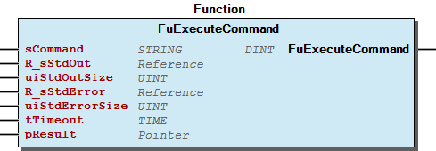

# WagoSysProcess v1.0.0.4 (WAGO) - Complete Documentation


## 📋 Library Information

- **Company:** WAGO
- **Title:** WagoSysProcess
- **Version:** 1.0.0.4
- **Author:** WAGO / u013972
- **Placeholder:** WagoSysProcess

### Description ¶


This document is automatically generated.

Library to execute system commands

This document is automatically generated. Library to execute system commands

### Contents: ¶


Contents: - Documentation Index - Project Information - Library Information - Functions - Program Organization - Function Groups - Global Variable Lists

### Indices and tables ¶


Based on WagoSysProcess.library, last modified 29.05.2024, 19:50:03. LibDoc 3.5.16.10

© WAGO GmbH & Co. KG, Germany 2018 – All rights reserved. For the avoidance of doubt, this copyright notice does not only apply to the information above but also and primarily to the described library itself. Please note that third-party products are always mentioned without reference to intellectual property rights, including patents, utility models, designs and trademarks, accordingly the existence of such rights cannot be excluded. WAGO is a registered trademark of WAGO Verwaltungsgesellschaft mbH.

- File and Project Information - Library Reference Based on WagoSysProcess.library, last modified 29.05.2024, 19:50:03. LibDoc 3.5.16.10 © WAGO GmbH & Co. KG, Germany 2018 – All rights reserved. For the avoidance of doubt, this copyright notice does not only apply to the information above but also and primarily to the described library itself. Please note that third-party products are always mentioned without reference to intellectual property rights, including patents, utility models, designs and trademarks, accordingly the existence of such rights cannot be excluded. WAGO is a registered trademark of WAGO Verwaltungsgesellschaft mbH.

### Documentation Index


## WagoSysProcess Library Documentation


| Company: | WAGO |
| Title: | WagoSysProcess |
| Version: | 1.0.0.4 |
| Author: | WAGO / u013972 |
| Placeholder: | WagoSysProcess |

### Description


This document is automatically generated.

Library to execute system commands

This document is automatically generated. Library to execute system commands

### Contents:


- 20 Program Organization Units Functions VersionHistory (GVL)

### Indices and tables


Based on WagoSysProcess.library, last modified 29.05.2024, 19:50:03. LibDoc 3.5.16.10

© WAGO GmbH & Co. KG, Germany 2018 – All rights reserved. For the avoidance of doubt, this copyright notice does not only apply to the information above but also and primarily to the described library itself. Please note that third-party products are always mentioned without reference to intellectual property rights, including patents, utility models, designs and trademarks, accordingly the existence of such rights cannot be excluded. WAGO is a registered trademark of WAGO Verwaltungsgesellschaft mbH.

- File and Project Information - Library Reference Based on WagoSysProcess.library, last modified 29.05.2024, 19:50:03. LibDoc 3.5.16.10 © WAGO GmbH & Co. KG, Germany 2018 – All rights reserved. For the avoidance of doubt, this copyright notice does not only apply to the information above but also and primarily to the described library itself. Please note that third-party products are always mentioned without reference to intellectual property rights, including patents, utility models, designs and trademarks, accordingly the existence of such rights cannot be excluded. WAGO is a registered trademark of WAGO Verwaltungsgesellschaft mbH.

### Project Information


## File and Project Information


| Scope | Name | Type | Content |
| --- | --- | --- | --- |
| FileHeader | libraryFile | string | WagoSysProcess.library |
| contentFile | doc.clean.json |
| productName | e!COCKPIT |
| creationDateTime | date | 29.05.2024, 19:50:03 |
| companyName | string | WAGO |
| ProjectInformation | LastModificationDateTime | date | 29.05.2024, 19:50:03 |
| Description | string | See: Description |
| Copyright | © WAGO Kontakttechnik GmbH & Co. KG, Germany 2020 – All rights reserved. |
| Author | WAGO / u013972 |
| AutoResolveUnbound | bool | True |
| Placeholder | string | WagoSysProcess |
| Company | WAGO |
| DocFormat | reStructuredText |
| SourceLibrary | bool | False |
| Project | string | WagoSysProcess |
| DefaultNamespace |  |
| Version | version | 1.0.0.4 |
| Title | string | WagoSysProcess |
| Released | bool | False |
| LibraryCategories | library-category-list |  |
| CompiledLibraryCompatibilityVersion | string | CODESYS V3.5 SP16 Patch 3 |
| IsEndUserLibrary | bool | False |

### Library Information


## Library Reference


| LinkAllContent: False QualifiedOnly: False | SystemLibrary: False | Optional: False |

| LinkAllContent: False QualifiedOnly: False | SystemLibrary: False | Optional: False |

| LinkAllContent: False QualifiedOnly: False | SystemLibrary: False | Optional: False |

| LinkAllContent: False QualifiedOnly: True | SystemLibrary: False | Optional: False |

| LinkAllContent: False QualifiedOnly: False | SystemLibrary: False | Optional: False |

This is a dictionary of all referenced libraries and their name spaces.

This is a dictionary of all referenced libraries and their name spaces. CmpErrors2 Interfaces Library Identification : Name: CmpErrors2 Interfaces Version: newest Company: System Namespace: CmpErrors Library Properties : SysProcess Library Identification : Placeholder: SysProcess Default Resolution: SysProcess, * (System) Namespace: SysProcess Library Properties : SysTypes2 Interfaces Library Identification : Name: SysTypes2 Interfaces Version: newest Company: System Namespace: SysTypes Library Properties : WagoSysProcess_Internal_Dummy Library Identification : Placeholder: WagoSysProcess_Internal Default Resolution: WagoSysProcess_Internal_Dummy, * (WAGO) Namespace: WagoSysProcess_Internal Library Properties : WagoSysVersion Library Identification : Name: WagoSysVersion Version: 1.0.0.0 Company: WAGO Namespace: WagoSysVersion Library Properties :

### Functions


## FuExecuteCommand (FUN)


| Scope | Name | Type | Comment |
| --- | --- | --- | --- |
| Return | FuExecuteCommand | DINT |  |
| Input | sCommand | STRING(1024) |  |
| R_sStdOut | REFERENCE TO STRING |  |
| uiStdOutSize | UINT | The maximal supported length is STRING(255) |
| R_sStdError | REFERENCE TO STRING |  |
| uiStdErrorSize | UINT | The maximal supported length is STRING(255) |
| tTimeout | TIME | Timeout for command execution |
| pResult | POINTER TO SysTypes.RTS_IEC_RESULT |  |

| result codes - returned by pResult |
| ERR_OK | Success |
| ERR_FAILED | The function fails due to an internal error |
| ERR_PARAMETER | Invalid parameters |
| ERR_TIMEOUT | The function has exceeded the given timeout |

```
VAR
    resultCmd: DINT;

    sCommand: STRING(1024) := 'echo Test';
    sStdOut: STRING(255);
    sStdError: STRING(255);
    resultFunc: UDINT;
END_VAR

resultCmd := FuExecuteCommand(sCommand := sCommand,
                              R_sStdOut := sStdOut,
                              uiStdOutSize := SIZEOF(sStdOut),
                              R_sStdError := sStdError,
                              uiStdErrorSize := SIZEOF(sStdError),
                              tTimeout := T#5S,
                              pResult := ADR(resultFunc));
```

Executes a command in a shell context

Graphical Illustration

Graphical Interface of FuExecuteCommand

Function description

This function allows to execute a command in shell context (not every shell command is possible)

When the time defined with tTimeout has expired, the function returns via pResult ERR_TIMEOUT. The shell command will continue to be processed until it is finished. It is only possible to perform one shell command at the same time.

The function returns the return code of the executed command. The function itself returns result codes via pResult.

The following result codes from CmpErrors.Errors are possible.

Example of a simple command execution.

Interface variables Function Executes a command in a shell context Graphical Illustration  Graphical Interface of FuExecuteCommand Function description This function allows to execute a command in shell context (not every shell command is possible) When the time defined with tTimeout has expired, the function returns via pResult ERR_TIMEOUT. The shell command will continue to be processed until it is finished. It is only possible to perform one shell command at the same time. The function returns the return code of the executed command. The function itself returns result codes via pResult. The following result codes from CmpErrors.Errors are possible. Example Example of a simple command execution.

### Program Organization


## 20 Program Organization Units


- Functions FuExecuteCommand (FUN)

### Function Groups


## Functions ¶


- FuExecuteCommand (FUN)

### Global Variable Lists


## VersionHistory (GVL)


| Name | Type |
| --- | --- |
| Info | ProjectInfo |

| Date | Version | Author | Change |
| 21.02.2024 | 1.0.0.4 | u010663 | Compiled SP16.3 |
| 18.01.2023 | 1.0.0.3 | u0103719 | WAT34389: replace CDS3 Library |
| 10.02.2021 | 1.0.0.2 | WAGO / u0100179 | Compatibility for <FW18 |
| 26.08.2020 | 1.0.0.0 | WAGO / u0100179 | Release Version |

WagoSysProcess_Internal_PFC

WagoSysProcess_Internal_PFC