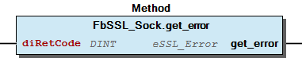

# WagoSysSSL v1.0.4.2 (WAGO) - Complete Documentation

## 📋 Library Information

- **Company:** WAGO
- **Title:** WagoSysSSL
- **Version:** 1.0.4.2
- **Categories:** Application; WAGO LayerView|Sys
- **Author:** WAGO / u013972
- **Placeholder:** WagoSysSSL

### Description ¶

This document is automatically generated.

This library proviedes function for SSL and TLS communication

This document is automatically generated. This library proviedes function for SSL and TLS communication

### Contents: ¶

Contents: - Documentation Index 10 Documentation - WagoSysSSL Library Documentation Project Information Library Information Function Blocks - FbSSL_CTX (FB) - FbSSL_Sock (FB) - doc01_Foreword (FB) Functions - FuX509_free (FUN) - FuX509_verify_param_set1_host (FUN) - FuX509_verify_param_set_flags (FUN) - FuX509_verify_param_set_hostflags (FUN) Methods - FbSSL_CTX.load_revocation_list (METH) - FbSSL_CTX.load_verfiy_locations (METH) - FbSSL_CTX.reset (METH) - FbSSL_CTX.sess_set_cache_size (METH) - FbSSL_CTX.set_client_CA_list (METH) - FbSSL_CTX.set_method (METH) - FbSSL_CTX.set_verify (METH) - FbSSL_CTX.use_certificate_file (METH) - FbSSL_CTX.use_privatekey_file (METH) - FbSSL_CTX.verify_depth (METH) - ... and 10 more Program Organization Global Variable Lists - Status (GVL) - VersionHistory (GVL) Other Components - 80 Status - eStatus (ENUM)

### Indices and tables ¶

Based on WagoSysSSL.library, last modified 29.05.2024, 19:52:46. LibDoc 3.5.16.10

© WAGO GmbH & Co. KG, Germany 2018 – All rights reserved. For the avoidance of doubt, this copyright notice does not only apply to the information above but also and primarily to the described library itself. Please note that third-party products are always mentioned without reference to intellectual property rights, including patents, utility models, designs and trademarks, accordingly the existence of such rights cannot be excluded. WAGO is a registered trademark of WAGO Verwaltungsgesellschaft mbH.

- File and Project Information - Library Reference Based on WagoSysSSL.library, last modified 29.05.2024, 19:52:46. LibDoc 3.5.16.10 © WAGO GmbH & Co. KG, Germany 2018 – All rights reserved. For the avoidance of doubt, this copyright notice does not only apply to the information above but also and primarily to the described library itself. Please note that third-party products are always mentioned without reference to intellectual property rights, including patents, utility models, designs and trademarks, accordingly the existence of such rights cannot be excluded. WAGO is a registered trademark of WAGO Verwaltungsgesellschaft mbH.

### Documentation Index

## 10 Documentation

To ensure fast installation and start-up of the units, we strongly recommend that the following information and explanations are carefully read and adhered to.

To ensure fast installation and start-up of the units, we strongly recommend that the following information and explanations are carefully read and adhered to. - doc01_Foreword (FB)

## WagoSysSSL Library Documentation

| Company: | WAGO |
| Title: | WagoSysSSL |
| Version: | 1.0.4.2 |
| Categories: | Application; WAGO LayerView\|Sys |
| Author: | WAGO / u013972 |
| Placeholder: | WagoSysSSL |

### Description

This document is automatically generated.

This library proviedes function for SSL and TLS communication

This document is automatically generated. This library proviedes function for SSL and TLS communication

### Contents:

- 10 Documentation doc01_Foreword (FB) 20 Program Organization Units - FbSSL_CTX (FB) - FbSSL_Sock (FB) - FuX509_free (FUN) - FuX509_verify_param_set1_host (FUN) - FuX509_verify_param_set_flags (FUN) - FuX509_verify_param_set_hostflags (FUN) 80 Status - Status (GVL) - eStatus (ENUM) VersionHistory (GVL)

### Indices and tables

Based on WagoSysSSL.library, last modified 29.05.2024, 19:52:46. LibDoc 3.5.16.10

© WAGO GmbH & Co. KG, Germany 2018 – All rights reserved. For the avoidance of doubt, this copyright notice does not only apply to the information above but also and primarily to the described library itself. Please note that third-party products are always mentioned without reference to intellectual property rights, including patents, utility models, designs and trademarks, accordingly the existence of such rights cannot be excluded. WAGO is a registered trademark of WAGO Verwaltungsgesellschaft mbH.

- File and Project Information - Library Reference Based on WagoSysSSL.library, last modified 29.05.2024, 19:52:46. LibDoc 3.5.16.10 © WAGO GmbH & Co. KG, Germany 2018 – All rights reserved. For the avoidance of doubt, this copyright notice does not only apply to the information above but also and primarily to the described library itself. Please note that third-party products are always mentioned without reference to intellectual property rights, including patents, utility models, designs and trademarks, accordingly the existence of such rights cannot be excluded. WAGO is a registered trademark of WAGO Verwaltungsgesellschaft mbH.

### Project Information

## File and Project Information

| Scope | Name | Type | Content |
| --- | --- | --- | --- |
| FileHeader | libraryFile | string | WagoSysSSL.library |
| contentFile | doc.clean.json |
| productName | e!COCKPIT |
| creationDateTime | date | 29.05.2024, 19:52:46 |
| companyName | string | WAGO |
| ProjectInformation | LastModificationDateTime | date | 29.05.2024, 19:52:46 |
| Description | string | See: Description |
| Copyright | © WAGO Kontakttechnik GmbH & Co. KG, Germany 2018 – All rights reserved. |
| Author | WAGO / u013972 |
| AutoResolveUnbound | bool | True |
| Placeholder | string | WagoSysSSL |
| Company | WAGO |
| DocFormat | reStructuredText |
| Project | WagoSysSSL |
| DefaultNamespace |  |
| Version | version | 1.0.4.2 |
| Title | string | WagoSysSSL |
| LibraryCategories | library-category-list | Application; WAGO LayerView\|Sys |
| CompiledLibraryCompatibilityVersion | string | CODESYS V3.5 SP16 Patch 3 |

### Library Information

## Library Reference

| LinkAllContent: False Optional: False | QualifiedOnly: False SystemLibrary: False | PublishSymbolsInContainer: True |

| LinkAllContent: False QualifiedOnly: False | SystemLibrary: False | Optional: False |

| LinkAllContent: False QualifiedOnly: True | SystemLibrary: False | Optional: False |

| LinkAllContent: False QualifiedOnly: False | SystemLibrary: False | Optional: False |

| LinkAllContent: False Optional: False | QualifiedOnly: False SystemLibrary: False | PublishSymbolsInContainer: True |

| LinkAllContent: False Optional: False | QualifiedOnly: False SystemLibrary: False | PublishSymbolsInContainer: True |

This is a dictionary of all referenced libraries and their name spaces.

This is a dictionary of all referenced libraries and their name spaces. WagoSysBSDSocket Library Identification : Placeholder: WagoSysBSDSocket Default Resolution: WagoSysBSDSocket, * (WAGO) Namespace: WagoSysBSDSocket Library Properties : WagoSysErrorBase Library Identification : Placeholder: WagoSysErrorBase Default Resolution: WagoSysErrorBase, * (WAGO) Namespace: WagoSysErrorBase Library Properties : WagoSysSSL_Internal_PFC Library Identification : Placeholder: WagoSysSSLInternal Default Resolution: WagoSysSSL_Internal_PFC, * (WAGO) Namespace: WagoSysSSLInternal Library Properties : WagoSysVersion Library Identification : Name: WagoSysVersion Version: 1.0.0.0 Company: WAGO Namespace: WagoSysVersion Library Properties : WagoTypesCommon Library Identification : Placeholder: WagoTypesCommon Default Resolution: WagoTypesCommon, * (WAGO) Namespace: WagoTypes Library Properties : WagoTypesSSL Library Identification : Placeholder: WagoTypesSSL Default Resolution: WagoTypesSSL, * (WAGO) Namespace: WagoTypesSSL Library Properties :

### Function Blocks

## FbSSL_CTX (FB)

This function block contains the SSL_CTX (SSL Context).

Graphical Illustration

Graphical Interface of FbSSL_CTX

Function description

This function block contains the SSL_CTX (SSL Context), that’s the global context structure which is created by a server or client once per program life-time and which holds mainly default values for the SSL structures which are later created for the connections. The values of the SSL_CTX can be set with the different methods oh this funftion block.

Function This function block contains the SSL_CTX (SSL Context). Graphical Illustration  Graphical Interface of FbSSL_CTX Function description This function block contains the SSL_CTX (SSL Context), that’s the global context structure which is created by a server or client once per program life-time and which holds mainly default values for the SSL structures which are later created for the connections. The values of the SSL_CTX can be set with the different methods oh this funftion block. Example - FbSSL_CTX.load_revocation_list (METH) - FbSSL_CTX.load_verfiy_locations (METH) - FbSSL_CTX.reset (METH) - FbSSL_CTX.sess_set_cache_size (METH) - FbSSL_CTX.set_client_CA_list (METH) - FbSSL_CTX.set_method (METH) - FbSSL_CTX.set_verify (METH) - FbSSL_CTX.use_certificate_file (METH) - FbSSL_CTX.use_privatekey_file (METH) - FbSSL_CTX.verify_depth (METH)

## FbSSL_Sock (FB)

This function block contains the the main SSL/TLS structure.

Graphical Illustration

Graphical Interface of FbSSL_Sock

Function description

This function block contains the the main SSL/TLS structure which is created by a server or client per established connection. This actually is the core structure in the SSL API. At run-time the application usually deals with this structure which has links to mostly all other structures. The methods of this function block allow differnt operations on the connection.

Function* This function block contains the the main SSL/TLS structure. Graphical Illustration  Graphical Interface of FbSSL_Sock Function description This function block contains the the main SSL/TLS structure which is created by a server or client per established connection. This actually is the core structure in the SSL API. At run-time the application usually deals with this structure which has links to mostly all other structures. The methods of this function block allow differnt operations on the connection. Example - FbSSL_Sock.get0_param (METH) - FbSSL_Sock.get_error (METH) - FbSSL_Sock.get_peer_certificate (METH) - FbSSL_Sock.get_verify_result (METH) - FbSSL_Sock.handshake_accept (METH) - FbSSL_Sock.handshake_connect (METH) - FbSSL_Sock.load_client_CA_file (METH) - FbSSL_Sock.read (METH) - FbSSL_Sock.shutdown (METH) - FbSSL_Sock.write (METH)

## doc01_Foreword (FB)

Section for fundermental information about this library (optional)

Section for fundermental information about this library (optional)

### Functions

## FuX509_free (FUN)

| Scope | Name | Type |
| --- | --- | --- |
| Return | FuX509_free | UDINT |
| Input | hCertificate | WagoTypesSSL.typeSSL_X509 |

This function frees up the X509 structure.

Graphical Illustration

Graphical Interface of FuX509_free

Function description

This function frees up the X509 structure.

Interface variables Function* This function frees up the X509 structure. Graphical Illustration  Graphical Interface of FuX509_free Function description This function frees up the X509 structure.

## FuX509_verify_param_set1_host (FUN)

| Scope | Name | Type |
| --- | --- | --- |
| Return | FuX509_verify_param_set1_host | UDINT |
| Input | hParam | WagoTypesSSL.typeSSL_param |
| sServername | STRING(80) |

This function sets the expected DNS hostname to name clearing any previously specified host name or names.

Graphical Illustration

Graphical Interface of FuX509_verify_param_set1_host

Function description

This function sets the expected DNS hostname to name clearing any previously specified host name or names. If name is NULL, or empty the list of hostnames is cleared, and name checks are not performed on the peer certificate.

This function has the following return values: ======= ===================================================================================== 1 Operation successfull finished. 0 An unspecified error has occurred. ======= =====================================================================================

Interface variables Function* This function sets the expected DNS hostname to name clearing any previously specified host name or names. Graphical Illustration  Graphical Interface of FuX509_verify_param_set1_host Function description This function sets the expected DNS hostname to name clearing any previously specified host name or names. If name is NULL, or empty the list of hostnames is cleared, and name checks are not performed on the peer certificate. This function has the following return values: ======= ===================================================================================== 1 Operation successfull finished. 0 An unspecified error has occurred. ======= =====================================================================================

## FuX509_verify_param_set_flags (FUN)

| Scope | Name | Type |
| --- | --- | --- |
| Return | FuX509_verify_param_set_flags | UDINT |
| Input | hParam | WagoTypesSSL.typeSSL_param |
| eFlags | WagoTypesSSL.eSSL_X509_Verification |

This function sets the flags in param by oring it with flags.

Graphical Illustration

Graphical Interface of FuX509_verify_param_set_flags

Function description

This function sets the flags in param by oring it with flags.

To combinate flags with each other use the following syntax: FuX509_verify_param_set_flags(hParam := hParam, eFlags := (eSSL_X509_Verification.FLAG_CRL_CHECK OR eSSL_X509_Verification.FLAG_CRL_CHECK_ALL));

This function has the following return values: ======= ===================================================================================== 1 Operation successfull finished. 0 An unspecified error has occurred. ======= =====================================================================================

Interface variables Function* This function sets the flags in param by oring it with flags. Graphical Illustration  Graphical Interface of FuX509_verify_param_set_flags Function description This function sets the flags in param by oring it with flags. To combinate flags with each other use the following syntax: FuX509_verify_param_set_flags(hParam := hParam, eFlags := (eSSL_X509_Verification.FLAG_CRL_CHECK OR eSSL_X509_Verification.FLAG_CRL_CHECK_ALL)); This function has the following return values: ======= ===================================================================================== 1 Operation successfull finished. 0 An unspecified error has occurred. ======= =====================================================================================

## FuX509_verify_param_set_hostflags (FUN)

| Scope | Name | Type |
| --- | --- | --- |
| Return | FuX509_verify_param_set_hostflags | UDINT |
| Input | hParam | WagoTypesSSL.typeSSL_param |
| eFlags | WagoTypesSSL.eSSL_X509_Check |

This function sets sets the flags.

Graphical Illustration

Graphical Interface of FuX509_verify_param_set_hostflags

Function description

This function sets sets the flags.

This function has the following return values: ======= ===================================================================================== 1 Operation successfull finished. 0 An unspecified error has occurred. ======= =====================================================================================

Interface variables Function* This function sets sets the flags. Graphical Illustration  Graphical Interface of FuX509_verify_param_set_hostflags Function description This function sets sets the flags. This function has the following return values: ======= ===================================================================================== 1 Operation successfull finished. 0 An unspecified error has occurred. ======= =====================================================================================

### Methods

## FbSSL_CTX.load_revocation_list (METH)

| Scope | Name | Type | Comment |
| --- | --- | --- | --- |
| Return | load_revocation_list | DINT |  |
| Input | sFile | STRING | path and file name |

This method specifies the locations for ctx, at which a revocation list for verification purposes are located.

Graphical Illustration

Graphical Interface of FbSSL_CTX.load_revocation_list

Function description

A certificate revocation list provides a list of certificates that have been revoked. To specify more than one revocation list the function must be called repeatedly.

This method has the following return values: ======= ===================================================================================== 1 Operation successfull finished. 0 An unspecified error has occurred. ======= =====================================================================================

Interface variables Function* This method specifies the locations for ctx, at which a revocation list for verification purposes are located. Graphical Illustration  Graphical Interface of FbSSL_CTX.load_revocation_list Function description A certificate revocation list provides a list of certificates that have been revoked. To specify more than one revocation list the function must be called repeatedly. This method has the following return values: ======= ===================================================================================== 1 Operation successfull finished. 0 An unspecified error has occurred. ======= =====================================================================================

## FbSSL_CTX.load_verfiy_locations (METH)

| Scope | Name | Type | Comment |
| --- | --- | --- | --- |
| Return | load_verfiy_locations | UDINT |  |
| Input | sFile | STRING | path and file name |
| eSSL_FileType | WagoTypesSSL.eSSL_FileType | file type |

This method specifies the locations for ctx, at which CA certificates for verification purposes are located.

Graphical Illustration

Graphical Interface of FbSSL_CTX.load_verfiy_locations

Function description

This function loads the list of certificates that are automatically confirmed. This list is located in the file system and will be loaded by FbSSL_CTX at this time.

This method has the following return values: ======= ===================================================================================== 1 Operation successfull finished. 0 An unspecified error has occurred. ======= =====================================================================================

Interface variables Function* This method specifies the locations for ctx, at which CA certificates for verification purposes are located. Graphical Illustration  Graphical Interface of FbSSL_CTX.load_verfiy_locations Function description This function loads the list of certificates that are automatically confirmed. This list is located in the file system and will be loaded by FbSSL_CTX at this time. This method has the following return values: ======= ===================================================================================== 1 Operation successfull finished. 0 An unspecified error has occurred. ======= =====================================================================================

## FbSSL_CTX.reset (METH)

| Scope | Name | Type |
| --- | --- | --- |
| Return | reset | DINT |

This method resets the ctx object.

Graphical Illustration

Graphical Interface of FbSSL_CTX.reset

Function description

This method restes the ctx object to the default values. After the executen of this methos the ctx object must initialised with new values.

This method has the following return values: ======= ===================================================================================== 1 Operation successfull finished. 0 An unspecified error has occurred. -1 If sockets are connected to the ctx. The ctx will be not reset. ======= =====================================================================================

Interface variables Function* This method resets the ctx object. Graphical Illustration  Graphical Interface of FbSSL_CTX.reset Function description This method restes the ctx object to the default values. After the executen of this methos the ctx object must initialised with new values. This method has the following return values: ======= ===================================================================================== 1 Operation successfull finished. 0 An unspecified error has occurred. -1 If sockets are connected to the ctx. The ctx will be not reset. ======= =====================================================================================

## FbSSL_CTX.sess_set_cache_size (METH)

| Scope | Name | Type | Comment |
| --- | --- | --- | --- |
| Return | sess_set_cache_size | UDINT |  |
| Input | udiCacheSize | UDINT | maximum number of internal sessions that will be held in the context cache |

This method manipulate session cache size.

Graphical Illustration

Graphical Interface of FbSSL_CTX.sess_set_cache_size

Function description

Sets the size of the internal session cache of context FbSSL_CTX to udiCacheSize.

A special case is the size 0, which is used for unlimited size.

This method returns the previously valid size.

Interface variables Function This method manipulate session cache size. Graphical Illustration  Graphical Interface of FbSSL_CTX.sess_set_cache_size Function description Sets the size of the internal session cache of context FbSSL_CTX to udiCacheSize. Note A special case is the size 0, which is used for unlimited size. This method returns the previously valid size.

## FbSSL_CTX.set_client_CA_list (METH)

| Scope | Name | Type | Comment |
| --- | --- | --- | --- |
| Return | set_client_CA_list | UDINT |  |
| Input | hStack | WagoTypesSSL.typSSL_Stack | handle of list returns by SSL_loadClinet_CA_file |

This methos sets the list of CAs sent to the client when requesting a client certificate for channel.

Graphical Illustration

Graphical Interface of FbSSL_CTX.set_client_CA_list

Function description

When a TLS/SSL server requests a client certificate, it sends a list of CAs, for which it will accept certificates, to the client.

This method has the following return values: ======= ===================================================================================== 1 Operation successfull finished. 0 An unspecified error has occurred. ======= =====================================================================================

Interface variables Function This methos sets the list of CAs sent to the client when requesting a client certificate for channel. Graphical Illustration  Graphical Interface of FbSSL_CTX.set_client_CA_list Function description When a TLS/SSL server requests a client certificate, it sends a list of CAs, for which it will accept certificates, to the client. This method has the following return values: ======= ===================================================================================== 1 Operation successfull finished. 0 An unspecified error has occurred. ======= =====================================================================================

## FbSSL_CTX.set_method (METH)

| Scope | Name | Type | Comment |
| --- | --- | --- | --- |
| Return | set_method | UDINT |  |
| Input | eSSL_Method | WagoTypesSSL.eSSL_Method | method of SSL handling in this context |

This method sets the method of SSL handling.

Graphical Illustration

Graphical Interface of FbSSL_CTX.set_method

Function description

This method sets the method of SSL handling. Must be called first during using the FbSSL_CTX.

This method has the following return values: ======= ===================================================================================== 1 Operation successfull finished. 0 An unspecified error has occurred. ======= =====================================================================================

Interface variables Function This method sets the method of SSL handling. Graphical Illustration  Graphical Interface of FbSSL_CTX.set_method Function description This method sets the method of SSL handling. Must be called first during using the FbSSL_CTX. This method has the following return values: ======= ===================================================================================== 1 Operation successfull finished. 0 An unspecified error has occurred. ======= =====================================================================================

## FbSSL_CTX.set_verify (METH)

| Scope | Name | Type |
| --- | --- | --- |
| Return | set_verify | UDINT |
| Input | eVerify | WagoTypesSSL.eSSL_Verify |

This method sets the verification flags for ctx to be mode.

Graphical Illustration

Graphical Interface of FbSSL_CTX.set_verify

Function description

This method sets the verification flags for ctx to be mode.

To combinate flags with each other use the following syntax: my_FbSSL_CTX.set_verify(eVerify := (eSSL_Verify.SSL_VERIFY_PEER OR eSSL_Verify.SSL_VERIFY_FAIL_IF_NO_PEER_CERT));

This method does not provide diagnostic information.

Interface variables Function This method sets the verification flags for ctx to be mode. Graphical Illustration  Graphical Interface of FbSSL_CTX.set_verify Function description This method sets the verification flags for ctx to be mode. To combinate flags with each other use the following syntax: my_FbSSL_CTX.set_verify(eVerify := (eSSL_Verify.SSL_VERIFY_PEER OR eSSL_Verify.SSL_VERIFY_FAIL_IF_NO_PEER_CERT)); This method does not provide diagnostic information.

## FbSSL_CTX.use_certificate_file (METH)

| Scope | Name | Type | Comment |
| --- | --- | --- | --- |
| Return | use_certificate_file | UDINT |  |
| Input | sFile | STRING | path and file name |
| eSSL_FileType | WagoTypesSSL.eSSL_FileType | certificate file type |

This method defines the file that contains the certificates during the verification process. The certificates are loaded at this time.

Graphical Illustration

Graphical Interface of FbSSL_CTX.use_certificate_file

Function description

Loads the first certificate stored in sFile into FbSSL_CTX. The formatting type of the certificate must be specified with eFileType.

This method has the following return values: ======= ===================================================================================== 1 Operation successfull finished. other An unspecified error has occurred. ======= =====================================================================================

Interface variables Function This method defines the file that contains the certificates during the verification process. The certificates are loaded at this time. Graphical Illustration  Graphical Interface of FbSSL_CTX.use_certificate_file Function description Loads the first certificate stored in sFile into FbSSL_CTX. The formatting type of the certificate must be specified with eFileType. This method has the following return values: ======= ===================================================================================== 1 Operation successfull finished. other An unspecified error has occurred. ======= =====================================================================================

## FbSSL_CTX.use_privatekey_file (METH)

| Scope | Name | Type | Comment |
| --- | --- | --- | --- |
| Return | use_privatekey_file | UDINT |  |
| Input | sFile | STRING | path and file name |
| eSSL_FileType | WagoTypesSSL.eSSL_FileType | key file type |

This method loads the list of private keys stored in the specified file.

Graphical Illustration

Graphical Interface of FbSSL_CTX.use_privatekey_file

Function description

Adds sFile as private key to FbSSL_CTX. If a certificate has already been set and the private does not belong to the certificate an error is returned. To change a certificate, private key pair the new certificate needs to be set with FbSSL_CTX.use_certificate_file() before setting the private key.

This method has the following return values: ======= ===================================================================================== 1 Operation successfull finished. other An unspecified error has occurred. ======= =====================================================================================

Interface variables Function This method loads the list of private keys stored in the specified file. Graphical Illustration  Graphical Interface of FbSSL_CTX.use_privatekey_file Function description Adds sFile as private key to FbSSL_CTX. If a certificate has already been set and the private does not belong to the certificate an error is returned. To change a certificate, private key pair the new certificate needs to be set with FbSSL_CTX.use_certificate_file() before setting the private key. This method has the following return values: ======= ===================================================================================== 1 Operation successfull finished. other An unspecified error has occurred. ======= =====================================================================================

## FbSSL_CTX.verify_depth (METH)

| Scope | Name | Type |
| --- | --- | --- |
| Return | verify_depth | UDINT |
| Input | diDepth | DINT |

This method sets the maximum depth for the certificate chain verification that shall be allowed for ssl.

Graphical Illustration

Graphical Interface of FbSSL_CTX.verify_depth

Function description

This method set the limit up to which depth certificates in a chain are used during the verification procedure. If the certificate chain is longer than allowed, the certificates above the limit are ignored. The depth count is “level 0:peer certificate”, “level 1: CA certificate”, “level 2: higher level CA certificate”, and so on. Setting the maximum depth to 2 allows the levels 0, 1, and 2. The default depth limit is 100, allowing for the peer certificate and additional 100 CA certificates.

This method does not provide diagnostic information.

Interface variables Function This method sets the maximum depth for the certificate chain verification that shall be allowed for ssl. Graphical Illustration  Graphical Interface of FbSSL_CTX.verify_depth Function description This method set the limit up to which depth certificates in a chain are used during the verification procedure. If the certificate chain is longer than allowed, the certificates above the limit are ignored. The depth count is “level 0:peer certificate”, “level 1: CA certificate”, “level 2: higher level CA certificate”, and so on. Setting the maximum depth to 2 allows the levels 0, 1, and 2. The default depth limit is 100, allowing for the peer certificate and additional 100 CA certificates. This method does not provide diagnostic information.

## FbSSL_Sock.get0_param (METH)

| Scope | Name | Type |
| --- | --- | --- |
| Return | get0_param | WagoTypesSSL.typeSSL_param |

This method retrieve an internal pointer to the verification parameters for ctx or ssl respectively.

Graphical Illustration

Graphical Interface of FbSSL_Sock.get0_param

Function description

This method retrieve an internal pointer to the verification parameters for ctx or ssl respectively.

Interface variables Function This method retrieve an internal pointer to the verification parameters for ctx or ssl respectively. Graphical Illustration  Graphical Interface of FbSSL_Sock.get0_param Function description This method retrieve an internal pointer to the verification parameters for ctx or ssl respectively.

## FbSSL_Sock.get_error (METH)

| Scope | Name | Type |
| --- | --- | --- |
| Return | get_error | WagoTypesSSL.eSSL_Error |
| Input | diRetCode | DINT |

This method obtain result code for TLS/SSL I/O operation.

Graphical Illustration

Graphical Interface of FbSSL_Sock.get_error

Function description

This method returns a result code for a preceding call to handshake_connect(), handshake_accept(), read() or write() on ssl.

This method has the following return values:

Interface variables Function This method obtain result code for TLS/SSL I/O operation. Graphical Illustration  Graphical Interface of FbSSL_Sock.get_error Function description This method returns a result code for a preceding call to handshake_connect(), handshake_accept(), read() or write() on ssl. This method has the following return values: - eSSL_Error.SSL_ERROR_NONE Operation successfull finished. This result code is returned if and only if ret > 0. - eSSL_Error.SSL_ERROR_ZERO_RETURN The TLS/SSL connection has been closed. If the protocol version is SSL 3.0 or higher, this result code is returned only if a closure alert has occurred in the protocol, i.e. if the connection has been closed cleanly. Note that in this case SSL_ERROR_ZERO_RETURN does not necessarily indicate that the underlying transport has been closed. - eSSL_Error.SSL_ERROR_WANT_READ / eSSL_Error.SSL_ERROR_WANT_WRITE The operation did not complete; the same TLS/SSL I/O function should be called again later. - eSSL_Error.SSL_ERROR_WANT_CONNECT / eSSL_Error.SSL_ERROR_WANT_ACCEPT The operation did not complete; the same TLS/SSL I/O function should be called again later. The underlying BIO was not connected yet to the peer and the call would block in connect()/accept(). The SSL function should be called again when the connection is established. - eSSL_Error.SSL_ERROR_WANT_X509_LOOKUP The operation did not complete; The TLS/SSL I/O function should be called again later. Details depend on the application. - eSSL_Error.SSL_ERROR_SYSCALL Some non-recoverable I/O error occurred. - eSSL_Error.SSL_ERROR_SSL A failure in the SSL library occurred, usually a protocol error.

## FbSSL_Sock.get_peer_certificate (METH)

| Scope | Name | Type |
| --- | --- | --- |
| Return | get_peer_certificate | WagoTypesSSL.typeSSL_X509 |

This method returns a pointer to the X509 certificate the peer presented.

Graphical Illustration

Graphical Interface of FbSSL_Sock.get_peer_certificate

Function description

This method returns a pointer to the X509 certificate the peer presented. If the peer did not present a certificate, NULL is returned.

Interface variables Function This method returns a pointer to the X509 certificate the peer presented. Graphical Illustration  Graphical Interface of FbSSL_Sock.get_peer_certificate Function description This method returns a pointer to the X509 certificate the peer presented. If the peer did not present a certificate, NULL is returned.

## FbSSL_Sock.get_verify_result (METH)

| Scope | Name | Type |
| --- | --- | --- |
| Return | get_verify_result | WagoTypesSSL.eSSL_X509_V |

This method gets result of peer certificate verification.

Graphical Illustration

Graphical Interface of FbSSL_Sock.get_verify_result

Function description

This method returns the result of the verification of the X509 certificate presented by the peer, if any.

Interface variables Function This method gets result of peer certificate verification. Graphical Illustration  Graphical Interface of FbSSL_Sock.get_verify_result Function description This method returns the result of the verification of the X509 certificate presented by the peer, if any.

## FbSSL_Sock.handshake_accept (METH)

| Scope | Name | Type | Comment |
| --- | --- | --- | --- |
| Return | handshake_accept | DINT |  |
| Input | hSocket | WagoSysBSDSocket.sockhandle_t | Handle of SysSocket |
| pFbSSL_CTX | POINTER TO FbSSL_CTX | Handle of SSL channel |

This method wait for a TLS/SSL client to initiate a TLS/SSL handshake.

Graphical Illustration

Graphical Interface of FbSSL_Sock.handshake_accept

Function description

This method waits for a TLS/SSL client to initiate the TLS/SSL handshake. The communication channel must already have been set and assigned to the ssl by setting an underlying BIO.

The behaviour of FbSSL_Sock.handshake_accept() depends on the underlying BIO.

If the underlying BIO is blocking, FbSSL_Sock.handshake_accept() will only return once the handshake has been finished or an error occurred.

This method has the following return values: ======= ===================================================================================== 1 Operation successfull finished. 0 The TLS/SSL handshake was not successful but was shut down controlled and by the specifications of the TLS/SSL protocol. Call FbSSL_Sock.get_error() with the return value ret to find out the reason. <0 The TLS/SSL handshake was not successful, because a fatal error occurred either at the protocol level or a connection failure occurred. The shutdown was not clean. Call FbSSL_Sock.get_error() with the return value ret to find out the reason. ======= =====================================================================================

Interface variables Function This method wait for a TLS/SSL client to initiate a TLS/SSL handshake. Graphical Illustration  Graphical Interface of FbSSL_Sock.handshake_accept Function description This method waits for a TLS/SSL client to initiate the TLS/SSL handshake. The communication channel must already have been set and assigned to the ssl by setting an underlying BIO. The behaviour of FbSSL_Sock.handshake_accept() depends on the underlying BIO. Note If the underlying BIO is blocking, FbSSL_Sock.handshake_accept() will only return once the handshake has been finished or an error occurred. This method has the following return values: ======= ===================================================================================== 1 Operation successfull finished. 0 The TLS/SSL handshake was not successful but was shut down controlled and by the specifications of the TLS/SSL protocol. Call FbSSL_Sock.get_error() with the return value ret to find out the reason. <0 The TLS/SSL handshake was not successful, because a fatal error occurred either at the protocol level or a connection failure occurred. The shutdown was not clean. Call FbSSL_Sock.get_error() with the return value ret to find out the reason. ======= =====================================================================================

## FbSSL_Sock.handshake_connect (METH)

| Scope | Name | Type | Comment |
| --- | --- | --- | --- |
| Return | handshake_connect | DINT |  |
| Input | hSocket | WagoSysBSDSocket.sockhandle_t | Handle of SysSocket |
| pFbSSL_CTX | POINTER TO FbSSL_CTX | Handle of SSL channel |

This method initiate the TLS/SSL handshake with an TLS/SSL server.

Graphical Illustration

Graphical Interface of FbSSL_Sock.handshake_connect

Function description

This method initiates the TLS/SSL handshake with a server. The communication channel must already have been set and assigned to the ssl by setting an underlying BIO.

The behaviour of FbSSL_Sock.handshake_connect() depends on the underlying BIO.

If the underlying BIO is blocking, FbSSL_Sock.handshake_connect() will only return once the handshake has been finished or an error occurred.

This method has the following return values: ======= ===================================================================================== 1 Operation successfull finished. 0 The TLS/SSL handshake was not successful but was shut down controlled and by the specifications of the TLS/SSL protocol. Call FbSSL_Sock.get_error() with the return value ret to find out the reason. <0 The TLS/SSL handshake was not successful, because a fatal error occurred either at the protocol level or a connection failure occurred. The shutdown was not clean. Call FbSSL_Sock.get_error() with the return value ret to find out the reason. ======= =====================================================================================

Interface variables Function This method initiate the TLS/SSL handshake with an TLS/SSL server. Graphical Illustration  Graphical Interface of FbSSL_Sock.handshake_connect Function description This method initiates the TLS/SSL handshake with a server. The communication channel must already have been set and assigned to the ssl by setting an underlying BIO. The behaviour of FbSSL_Sock.handshake_connect() depends on the underlying BIO. Note If the underlying BIO is blocking, FbSSL_Sock.handshake_connect() will only return once the handshake has been finished or an error occurred. This method has the following return values: ======= ===================================================================================== 1 Operation successfull finished. 0 The TLS/SSL handshake was not successful but was shut down controlled and by the specifications of the TLS/SSL protocol. Call FbSSL_Sock.get_error() with the return value ret to find out the reason. <0 The TLS/SSL handshake was not successful, because a fatal error occurred either at the protocol level or a connection failure occurred. The shutdown was not clean. Call FbSSL_Sock.get_error() with the return value ret to find out the reason. ======= =====================================================================================

## FbSSL_Sock.load_client_CA_file (METH)

| Scope | Name | Type | Comment |
| --- | --- | --- | --- |
| Return | load_client_CA_file | typSSL_Stack |  |
| Input | sFile | STRING | path and file name |
| eSSL_FileType | WagoTypesSSL.eSSL_FileType | certificate file type |

This method loads certificate names from file.

Graphical Illustration

Graphical Interface of FbSSL_Sock.load_client_CA_file

Function description

Reads certificates from file and returns a typSSL_Stack with the subject names found. Use the return to call FbSSL_CTX.set_client_CA_list()

If the return value is 0, an error has occurred.

Interface variables Function This method loads certificate names from file. Graphical Illustration  Graphical Interface of FbSSL_Sock.load_client_CA_file Function description Reads certificates from file and returns a typSSL_Stack with the subject names found. Use the return to call FbSSL_CTX.set_client_CA_list() Note If the return value is 0, an error has occurred.

## FbSSL_Sock.read (METH)

| Scope | Name | Type | Comment |
| --- | --- | --- | --- |
| Return | read | DINT |  |
| Input | pBuffer | POINTER TO BYTE | Address of buffer to receive |
| udiSize | UDINT | maximum size of data in byte to receive |

This method tries to read bytes from a TLS/SSL connection.

Graphical Illustration

Graphical Interface of FbSSL_Sock.read

Function description

This method tries to read bytes from a TLS/SSL connection into the buffer specified with pBuffer. The behaviour of FbSSL_Sock.read() depends on the underlying BIO. If the underlying BIO is blocking, FbSSL_Sock.read() will only return, once the read operation has been finished or an error occurred.

FbSSL_Sock.read() works based on the SSL/TLS records. Only when a record has been completely received, it can be processed (decryption and check of integrity). Therefore data that was not retrieved at the last call of FbSSL_Sock.read() can still be buffered inside the SSL layer and will be retrieved on the next call to FbSSL_Sock.read(). If no more bytes are in the buffer, FbSSL_Sock.read() will trigger the processing of the next record. Only when the record has been received and processed completely, FbSSL_Sock.read() will return reporting success.

This function is able to work some seconds. So do not use this functionality in high prior task with small timeout value.

This method has the following return values: ======= ===================================================================================== >0 The read operation was successful. The return value is the number of bytes actually read from the TLS/SSL connection. <=0 The read operation was not successful, because either the connection was closed, an error occurred or action must be taken by the calling process. Call FbSSL_Sock.get_error() with the return value ret to find out the reason. ======= =====================================================================================

Interface variables Function This method tries to read bytes from a TLS/SSL connection. Graphical Illustration  Graphical Interface of FbSSL_Sock.read Function description This method tries to read bytes from a TLS/SSL connection into the buffer specified with pBuffer. The behaviour of FbSSL_Sock.read() depends on the underlying BIO. If the underlying BIO is blocking, FbSSL_Sock.read() will only return, once the read operation has been finished or an error occurred. FbSSL_Sock.read() works based on the SSL/TLS records. Only when a record has been completely received, it can be processed (decryption and check of integrity). Therefore data that was not retrieved at the last call of FbSSL_Sock.read() can still be buffered inside the SSL layer and will be retrieved on the next call to FbSSL_Sock.read(). If no more bytes are in the buffer, FbSSL_Sock.read() will trigger the processing of the next record. Only when the record has been received and processed completely, FbSSL_Sock.read() will return reporting success. Note This function is able to work some seconds. So do not use this functionality in high prior task with small timeout value. This method has the following return values: ======= ===================================================================================== >0 The read operation was successful. The return value is the number of bytes actually read from the TLS/SSL connection. <=0 The read operation was not successful, because either the connection was closed, an error occurred or action must be taken by the calling process. Call FbSSL_Sock.get_error() with the return value ret to find out the reason. ======= =====================================================================================

## FbSSL_Sock.shutdown (METH)

| Scope | Name | Type |
| --- | --- | --- |
| Return | shutdown | DINT |

| <0 | The shutdown was not successful. Call FbSSL_Sock.get_error() with the return value of this method to find out the reason. |
| 0 | The “close notify” was send but the peer did not send it back yet. Call this method again to do a bidirectional shutdown. |
| 1 | The shutdown was successfully completed. The “close notify” alert was sent and the peer’s “close notify” alert was received. |

This method shuts down a TLS/SSL connection.

Graphical Illustration

Graphical Interface of FbSSL_Sock.shutdown

Function description

Tries to send the “close notify” shutdown alert to the peer. The shutdown procedure consists of 2 steps: the sending of the “close notify” shutdown alert and the reception of the peer’s “close notify” shutdown alert. According to the TLS standard, it is acceptable for an application to only send its shutdown alert and then close the underlying connection without waiting for the peer’s response (this way resources can be saved, as the process can already terminate or serve another connection). The behaviour of FbSSL_Sock.shutdown() additionally depends on the underlying BIO. If the underlying BIO is blocking, FbSSL_Sock.shutdown() will only return once the handshake step has been finished or an error occurred.

This function is able to work some seconds. So do not use this functionality in high prior task with small timeout value.

Interface variables Function This method shuts down a TLS/SSL connection. Graphical Illustration  Graphical Interface of FbSSL_Sock.shutdown Function description Tries to send the “close notify†shutdown alert to the peer. The shutdown procedure consists of 2 steps: the sending of the “close notify†shutdown alert and the reception of the peer’s “close notify†shutdown alert. According to the TLS standard, it is acceptable for an application to only send its shutdown alert and then close the underlying connection without waiting for the peer’s response (this way resources can be saved, as the process can already terminate or serve another connection). The behaviour of FbSSL_Sock.shutdown() additionally depends on the underlying BIO. If the underlying BIO is blocking, FbSSL_Sock.shutdown() will only return once the handshake step has been finished or an error occurred. Note This function is able to work some seconds. So do not use this functionality in high prior task with small timeout value.

## FbSSL_Sock.write (METH)

| Scope | Name | Type | Comment |
| --- | --- | --- | --- |
| Return | write | DINT |  |
| Input | pBuffer | POINTER TO BYTE | Address of buffer to send |
| udiNBytes | UDINT | size of data in byte to send |

This method writes bytes to a TLS/SSL connection.

Graphical Illustration

Graphical Interface of FbSSL_Sock.write

Function description

The write function will only return with success when the complete contents of pBuffer of length udiNBytes has been written. The behaviour of FbSSL_Sock.write() depends on the underlying BIO. If the underlying BIO is blocking, FbSSL_Sock.write() will only return, once the write operation has been finished or an error occurred.

This function is able to work some seconds. So do not use this functionality in high prior task with small timeout value.

This method has the following return values: ======= ===================================================================================== >0 The write operation was successful, the return value is the number of bytes actually written to the TLS/SSL connection. <=0 The write operation was not successful, because either the connection was closed, an error occurred or action must be taken by the calling process. Call FbSSL_Sock.get_error() with the return value ret to find out the reason. ======= =====================================================================================

Interface variables Function This method writes bytes to a TLS/SSL connection. Graphical Illustration  Graphical Interface of FbSSL_Sock.write Function description The write function will only return with success when the complete contents of pBuffer of length udiNBytes has been written. The behaviour of FbSSL_Sock.write() depends on the underlying BIO. If the underlying BIO is blocking, FbSSL_Sock.write() will only return, once the write operation has been finished or an error occurred. Note This function is able to work some seconds. So do not use this functionality in high prior task with small timeout value. This method has the following return values: ======= ===================================================================================== >0 The write operation was successful, the return value is the number of bytes actually written to the TLS/SSL connection. <=0 The write operation was not successful, because either the connection was closed, an error occurred or action must be taken by the calling process. Call FbSSL_Sock.get_error() with the return value ret to find out the reason. ======= =====================================================================================

### Program Organization

## 20 Program Organization Units

- FbSSL_CTX (FB) FbSSL_CTX.load_revocation_list (METH) - FbSSL_CTX.load_verfiy_locations (METH) - FbSSL_CTX.reset (METH) - FbSSL_CTX.sess_set_cache_size (METH) - FbSSL_CTX.set_client_CA_list (METH) - FbSSL_CTX.set_method (METH) - FbSSL_CTX.set_verify (METH) - FbSSL_CTX.use_certificate_file (METH) - FbSSL_CTX.use_privatekey_file (METH) - FbSSL_CTX.verify_depth (METH) FbSSL_Sock (FB) - FbSSL_Sock.get0_param (METH) - FbSSL_Sock.get_error (METH) - FbSSL_Sock.get_peer_certificate (METH) - FbSSL_Sock.get_verify_result (METH) - FbSSL_Sock.handshake_accept (METH) - FbSSL_Sock.handshake_connect (METH) - FbSSL_Sock.load_client_CA_file (METH) - FbSSL_Sock.read (METH) - FbSSL_Sock.shutdown (METH) - FbSSL_Sock.write (METH) FuX509_free (FUN) FuX509_verify_param_set1_host (FUN) FuX509_verify_param_set_flags (FUN) FuX509_verify_param_set_hostflags (FUN)

### Global Variable Lists

## Status (GVL)

| Scope | Name | Type | Initial |
| --- | --- | --- | --- |
| Constant | gc_Status | ARRAY [0..47] OF WagoSysErrorBase.WagoTypesErrorBase.typResultItem | [STRUCT(ID := eStatus.Ok, Severity := WagoSysErrorBase.WagoTypes.eSeverity.none, text := ‘OK’)] |

## VersionHistory (GVL)

| Name | Type |
| --- | --- |
| Info | WagoSysVersion.ProjectInfo |

| date | version | author | change |
| 21.02.2024 | 1.0.4.2 | WAGO / u010663 | Compiled SP16.3 |
| 22.02.2023 | 1.0.4.1 | WAGO / u013972 | Mark as deprecated |
| 08.01.2019 | 1.0.4.0 | u015842 | Properties: free placeholder added |
| 07.12.2018 | 1.0.3.0 | WAGO / u013972 | Release Version |

WagoSysSSL.library

### Other Components

## 80 Status ¶

- Status (GVL) - eStatus (ENUM)

## eStatus (ENUM)

| Name | Initial | Comment |
| --- | --- | --- |
| Ok | 0 | (none) Ok |