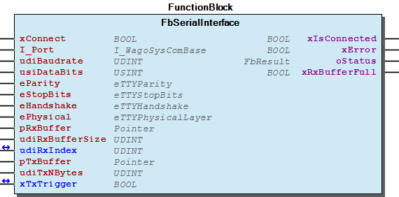

# WagoSysSerial v1.7.1.0 (WAGO) - Complete Documentation

## 📋 Library Information

- **Company:** WAGO
- **Title:** WagoSysSerial
- **Version:** 1.7.1.0
- **Categories:** WAGO Internal|Feature|Common|Com
- **Author:** WAGO / u010545
- **Placeholder:** WagoSysSerial

### Description ¶

This document is automatically generated. Because of this, the chapter 30 Visualization is not shown in this document. If you are interested in getting to know more about visualization, we refer to the library manager of e!Cockpit.

Common basic function blocks for serial communication [1]

This document is automatically generated. Because of this, the chapter 30 Visualization is not shown in this document. If you are interested in getting to know more about visualization, we refer to the library manager of e!Cockpit. Common basic function blocks for serial communication [1]

### Contents: ¶

Contents: - Documentation Index - Project Information - Library Information - Function Blocks - Global Variable Lists ErrorSerial (GVL) - VersionHistory (GVL) Other Components - 20 Program Organitzation Unit - 80 Status - eErrorSerial (ENUM)

### Indices and tables ¶

| [1] | Based on WagoSysSerial.library, last modified 14.01.2019, 17:38:24. The content of this file was automatically generated with None on 14.01.2019, 17:38:26 |

© WAGO Kontakttechnik GmbH & Co. KG, Germany 2018 – All rights reserved. For the avoidance of doubt, this copyright notice does not only apply to the information above but also and primarily to the described library itself. Please note that third-party products are always mentioned without reference to intellectual property rights, including patents, utility models, designs and trademarks, accordingly the existence of such rights cannot be excluded. WAGO is a registered trademark of WAGO Verwaltungsgesellschaft mbH.

- File and Project Information - Library Reference © WAGO Kontakttechnik GmbH & Co. KG, Germany 2018 – All rights reserved. For the avoidance of doubt, this copyright notice does not only apply to the information above but also and primarily to the described library itself. Please note that third-party products are always mentioned without reference to intellectual property rights, including patents, utility models, designs and trademarks, accordingly the existence of such rights cannot be excluded. WAGO is a registered trademark of WAGO Verwaltungsgesellschaft mbH.

### Documentation Index

## WagoSysSerial Library Documentation

| Company: | WAGO |
| Title: | WagoSysSerial |
| Version: | 1.7.1.0 |
| Categories: | WAGO Internal\|Feature\|Common\|Com |
| Author: | WAGO / u010545 |
| Placeholder: | WagoSysSerial |

### Description

This document is automatically generated. Because of this, the chapter 30 Visualization is not shown in this document. If you are interested in getting to know more about visualization, we refer to the library manager of e!Cockpit.

Common basic function blocks for serial communication [1]

This document is automatically generated. Because of this, the chapter 30 Visualization is not shown in this document. If you are interested in getting to know more about visualization, we refer to the library manager of e!Cockpit. Common basic function blocks for serial communication [1]

### Contents:

- 20 Program Organitzation Unit FbSerialInterface (FB) 80 Status - ErrorSerial (GVL) - eErrorSerial (ENUM) VersionHistory (GVL)

### Indices and tables

| [1] | Based on WagoSysSerial.library, last modified 14.01.2019, 17:38:24. The content of this file was automatically generated with None on 14.01.2019, 17:38:26 |

© WAGO Kontakttechnik GmbH & Co. KG, Germany 2018 – All rights reserved. For the avoidance of doubt, this copyright notice does not only apply to the information above but also and primarily to the described library itself. Please note that third-party products are always mentioned without reference to intellectual property rights, including patents, utility models, designs and trademarks, accordingly the existence of such rights cannot be excluded. WAGO is a registered trademark of WAGO Verwaltungsgesellschaft mbH.

- File and Project Information - Library Reference © WAGO Kontakttechnik GmbH & Co. KG, Germany 2018 – All rights reserved. For the avoidance of doubt, this copyright notice does not only apply to the information above but also and primarily to the described library itself. Please note that third-party products are always mentioned without reference to intellectual property rights, including patents, utility models, designs and trademarks, accordingly the existence of such rights cannot be excluded. WAGO is a registered trademark of WAGO Verwaltungsgesellschaft mbH.

### Project Information

## File and Project Information

| Scope | Name | Type | Content |
| --- | --- | --- | --- |
| FileHeader | libraryFile | string | WagoSysSerial.library |
| contentFile | WagoSysSerial_clr.json |
| productName | e!COCKPIT |
| creationDateTime | date | 14.01.2019, 17:38:26 |
| companyName | string | WAGO |
| ProjectInformation | LastModificationDateTime | date | 14.01.2019, 17:38:24 |
| Description | string | See: Description |
| Copyright | © WAGO Kontakttechnik GmbH & Co. KG, Germany 2018 – All rights reserved. |
| Author | WAGO / u010545 |
| AutoResolveUnbound | bool | True |
| Placeholder | string | WagoSysSerial |
| Company | WAGO |
| DocFormat | reStructuredText |
| Project | WagoSysSerial |
| DefaultNamespace |  |
| Version | version | 1.7.1.0 |
| Title | string | WagoSysSerial |
| LibraryCategories | library-category-list | WAGO Internal\|Feature\|Common\|Com |

### Library Information

## Library Reference

| LinkAllContent: False QualifiedOnly: True | SystemLibrary: False | Optional: False |

| LinkAllContent: False QualifiedOnly: False | SystemLibrary: False | Optional: False |

| LinkAllContent: False QualifiedOnly: True | SystemLibrary: False | Optional: False |

| LinkAllContent: False Optional: False | QualifiedOnly: True SystemLibrary: False | PublishSymbolsInContainer: True |

| LinkAllContent: False Optional: False | QualifiedOnly: True SystemLibrary: False | PublishSymbolsInContainer: True |

This is a dictionary of all referenced libraries and their name spaces.

This is a dictionary of all referenced libraries and their name spaces. Standard Library Identification : Placeholder: Standard Default Resolution: Standard, * (System) Namespace: Standard Library Properties : WagoSysErrorBase Library Identification : Placeholder: WagoSysErrorBase Default Resolution: WagoSysErrorBase, * (WAGO) Namespace: WagoSysErrorBase Library Properties : Library Parameter : Parameter: RES_LOG_MAX_FILESIZE = 2000 Parameter: RES_LOG_MAX_FILES = 1 Parameter: RES_LOG_MAX_ENTRIES = 200 Parameter: RES_LOG_NAME = ‘WagoAppResultLogger’ WagoSysVersion Library Identification : Name: WagoSysVersion Version: 1.0.0.0 Company: WAGO Namespace: WagoSysVersion Library Properties : WagoTypesCom Library Identification : Placeholder: WagoTypesCom Default Resolution: WagoTypesCom, * (WAGO) Namespace: WagoTypesCom Library Properties : WagoTypesErrorBase Library Identification : Placeholder: WagoTypesErrorBase Default Resolution: WagoTypesErrorBase, * (WAGO) Namespace: WagoTypesErrorBase Library Properties :

### Function Blocks

## FbSerialInterface (FB)

| Scope | Name | Type | Comment | Inherited from |
| --- | --- | --- | --- | --- |
| Input | xConnect | BOOL |  | FbBaseInterface |
| I_Port | WagoTypesCom.I_WagoSysComBase | Name of the Interface (e.g. ‘COM1’, ‘SER7.2’, ) | FbBaseInterface |
| udiBaudrate | UDINT | Baudrate (9600 = 9k6) | FbBaseInterface |
| usiDataBits | USINT | Number of Bits per frame (5..8) | FbBaseInterface |
| eParity | WagoTypesCom.eTTYParity | Parity | FbBaseInterface |
| eStopBits | WagoTypesCom.eTTYStopBits | Number of Stop-Bits, see note (1) | FbBaseInterface |
| eHandshake | WagoTypesCom.eTTYHandshake | TYPE of handshake (XON/XOFF, etc) | FbBaseInterface |
| ePhysical | WagoTypesCom.eTTYPhysicalLayer | RS232, RS422, RS485, etc | FbBaseInterface |
| Output | xIsConnected | BOOL |  | FbBaseInterface |
| xError | BOOL |  | FbBaseInterface |
| oStatus | WagoSysErrorBase.FbResult |  | FbBaseInterface |
| Input | pRxBuffer | POINTER TO BYTE | Where to store the read data |  |
| udiRxBufferSize | UDINT | Size of the storage space |  |
| Inout | udiRxIndex | UDINT | Received Bytes in given Buffer |  |
| Input | pTxBuffer | POINTER TO BYTE | Location of the data to be transmitted |  |
| udiTxNBytes | UDINT | How much data to transmit |  |
| Inout | xTxTrigger | BOOL | Transmit data if all data transmitted this variable is autom. reset |  |
| Output | xRxBufferFull | BOOL | Indicates that the Receiver Buffer is full. |  |

You should always call this FB cyclic.

Graphical Illustration

Graphical Interface of FbSerialInterface

Interface variables Function Transmit and receive data via a serial interface. The benefit of this function block is that the parameter xTxTrigger is not reset before the TxBuffer of a 750-652 is empty. By other modules like 750- 650 / 651 / 653 this parameter will be reset after all bytes are given to the physical module. In this case it may be possible that not alle bytes have been send over the cable because some bytes are still stored in the module. Note You should always call this FB cyclic. Graphical Illustration  Graphical Interface of FbSerialInterface

### Global Variable Lists

## ErrorSerial (GVL)

| Scope | Name | Type |
| --- | --- | --- |
| Constant | ERROR_SERIAL | ARRAY [0..5] OF WagoTypesErrorBase.typResultItem |

| Value | Level | Description |
| --- | --- | --- |
| eErrorSerial.OK | WagoTypesErrorBase.eSeverity.none | ‘OK’ |
| eErrorSerial.BUSY | WagoTypesErrorBase.eSeverity.info | ‘Busy’ |
| eErrorSerial.ATTACH_ERROR | WagoTypesErrorBase.eSeverity.error | ‘Error -> can not attach the serial port’ |
| eErrorSerial.CONFIGURE_ERROR | WagoTypesErrorBase.eSeverity.error | ‘Error -> Can not configure the serial port with this parameter’ |
| eErrorSerial.TIME_OUT | WagoTypesErrorBase.eSeverity.error | ‘Error -> Timeout’ |
| eErrorSerial.INVALID_PORT | WagoTypesErrorBase.eSeverity.error | ‘Error -> Invalid port’ |

## VersionHistory (GVL)

| Name | Type |
| --- | --- |
| Info | WagoSysVersion.ProjectInfo |

| date | version | author | change |
| 08.01.2019 | 1.7.1.0 | u015842 | Properties: free placeholder added |
| 23.09.2016 | 1.7.0.1 | u010545 | Workaround for modem bug of 8207 |
| 03.05.2017 | 1.7.0.0 | u010545 | Splitt of WagoSysModuleBase |
| 23.09.2016 | 1.6.0.1 | u010545 | FbSerialInterface implemented |
| 26.02.2016 | 1.6.0.0 | u010545 | Change WagoAppErrorBase to WagoSysErrorBase / WagoTypesErrorBase |
| 19.01.2016 | 1.5.0.3 | u010545 | VersionHistory -> always bind |
| 29.09.2015 | 1.5.0.2 | u010545 | placeholder at librarymanger included |
| 24.08.2015 | 1.5.0.1 | u010545 | attribut placeholder included |
| 03.06.2015 | 1.5.0.0 | u010545 | released |
| 13.05.2015 | 1.1.1.7 | u010545 | FbBase splitted to FbaseInterface and FbBase |
| 07.05.2015 | 1.1.1.6 | u010545 | oError renamed to oStatus |
| 06.05.2015 | 1.1.1.5 | u010545 | Output xError modified |
| 30.04.2015 | 1.1.1.4 | u010545 | Changed to new Version of WagoAppCom (oStatus) |
| 28.04.2015 | 1.1.1.3 | u010545 | Rename variable - Port to I_Port |
| 19.03.2015 | 1.1.1.2 | JMü | Rename variables - WAT13530 |
| 23.02.2015 | 1.0.1.2 | JMü | Rename variables - WAT13530 |
| 26.01.2015 | 1.0.1.1 | u010545 | Caegories modified |
| 10.12.2014 | 1.0.1.0 | u010545 | WagoAppErrorBase V 1.0.0.0 supported |
| 01.12.2014 | 1.0.0.5 | u010545 | FbBase modyfied -> validate port |
| 26.11.2014 | 1.0.0.4 | u010545 | Attibute hide included |
| 07.10.2014 | 1.0.0.3 | u010545 | FbBase.setClassName implemented |
| 26.09.2014 | 1.0.0.2 | u010545 | changed or use of WagoAppErroBase 0.0.0.15 |
| 24.09.2014 | 1.0.0.1 | u010545 | library name changed |
| 22.08.2014 | 1.0.0.0 | u010545 | published |
| 14.08.2014 | 0.0.0.0 | u010545 | created |

WagoSysSerial

### Other Components

## 20 Program Organitzation Unit

- FbSerialInterface (FB)

## 80 Status ¶

- ErrorSerial (GVL) - eErrorSerial (ENUM)

## eErrorSerial (ENUM)

| Name | Initial | Comment |
| --- | --- | --- |
| OK | 0 |  |
| BUSY | 1 | Busy process not finished |
| ATTACH_ERROR | 2 | can not attach the port |
| CONFIGURE_ERROR | 3 | Error while configure |
| TIME_OUT | 4 |  |
| INVALID_PORT | 5 |  |