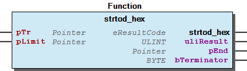

# WagoSysString v1.6.1.1 (WAGO) - Complete Documentation


## 📋 Library Information

- **Company:** WAGO
- **Title:** WagoSysString
- **Version:** 1.6.1.1
- **Categories:** WAGO LayerView|Sys; Application
- **Author:** WAGO / u013972
- **Placeholder:** WagoSysString

### Description ¶


This document is automatically generated. Because of this, the chapter 30 Visualization is not shown in this document. If you are interested in getting to know more about visualization, we refer to the library manager of e!Cockpit.

Low-Level String Routines [1]

This document is automatically generated. Because of this, the chapter 30 Visualization is not shown in this document. If you are interested in getting to know more about visualization, we refer to the library manager of e!Cockpit. Low-Level String Routines [1]

### Contents: ¶


Contents: - Documentation Index 10 Documentation - WagoSysString Library Documentation Project Information Library Information Function Blocks Functions - ASCIIByte_To_String (FUN) - FuGetVersionHistory (FUN) - String_To_ASCIIByte (FUN) - char_to_hexbyte (FUN) - convert_ByteStream_to_Ipv4Addr (FUN) - convert_IPv4Addr_to_ByteStream (FUN) - convert_VersionString_to_DWORD (FUN) - skipspaces (FUN) - strnappend (FUN) - strnappendChars (FUN) - ... and 3 more Program Organization Global Variable Lists - GlobalVariables (GVL) - LibraryResult (GVL) - ResultItems (GVL) Other Components - 01 Standard (POSIX - like) - 02 Special (context specific) - 03 Legacy

### Indices and tables ¶


| [1] | Based on WagoSysString.library, last modified 30.06.2022, 14:53:53. LibDoc 3.5.15.30 |

© WAGO Kontakttechnik GmbH & Co. KG, Germany 2018 – All rights reserved. For the avoidance of doubt, this copyright notice does not only apply to the information above but also and primarily to the described library itself. Please note that third-party products are always mentioned without reference to intellectual property rights, including patents, utility models, designs and trademarks, accordingly the existence of such rights cannot be excluded. WAGO is a registered trademark of WAGO Verwaltungsgesellschaft mbH.

- File and Project Information - Library Reference © WAGO Kontakttechnik GmbH & Co. KG, Germany 2018 – All rights reserved. For the avoidance of doubt, this copyright notice does not only apply to the information above but also and primarily to the described library itself. Please note that third-party products are always mentioned without reference to intellectual property rights, including patents, utility models, designs and trademarks, accordingly the existence of such rights cannot be excluded. WAGO is a registered trademark of WAGO Verwaltungsgesellschaft mbH.

### Documentation Index


## 10 Documentation ¶


## WagoSysString Library Documentation


| Company: | WAGO |
| Title: | WagoSysString |
| Version: | 1.6.1.1 |
| Categories: | WAGO LayerView\|Sys; Application |
| Author: | WAGO / u013972 |
| Placeholder: | WagoSysString |

### Description


This document is automatically generated. Because of this, the chapter 30 Visualization is not shown in this document. If you are interested in getting to know more about visualization, we refer to the library manager of e!Cockpit.

Low-Level String Routines [1]

This document is automatically generated. Because of this, the chapter 30 Visualization is not shown in this document. If you are interested in getting to know more about visualization, we refer to the library manager of e!Cockpit. Low-Level String Routines [1]

### Contents:


- 10 Documentation doc10_general (FB) 20 Program Organization Units - 01 Standard (POSIX - like) - 02 Special (context specific) - 03 Legacy FuGetVersionHistory (FUN) GlobalVariables (GVL) LibraryResult (GVL) ResultItems (GVL)

### Indices and tables


| [1] | Based on WagoSysString.library, last modified 30.06.2022, 14:53:53. LibDoc 3.5.15.30 |

© WAGO Kontakttechnik GmbH & Co. KG, Germany 2018 – All rights reserved. For the avoidance of doubt, this copyright notice does not only apply to the information above but also and primarily to the described library itself. Please note that third-party products are always mentioned without reference to intellectual property rights, including patents, utility models, designs and trademarks, accordingly the existence of such rights cannot be excluded. WAGO is a registered trademark of WAGO Verwaltungsgesellschaft mbH.

- File and Project Information - Library Reference © WAGO Kontakttechnik GmbH & Co. KG, Germany 2018 – All rights reserved. For the avoidance of doubt, this copyright notice does not only apply to the information above but also and primarily to the described library itself. Please note that third-party products are always mentioned without reference to intellectual property rights, including patents, utility models, designs and trademarks, accordingly the existence of such rights cannot be excluded. WAGO is a registered trademark of WAGO Verwaltungsgesellschaft mbH.

### Project Information


## File and Project Information


| Scope | Name | Type | Content |
| --- | --- | --- | --- |
| FileHeader | libraryFile | string | WagoSysString.library |
| contentFile | WagoSysString_clr.json |
| productName | e!COCKPIT |
| creationDateTime | date | 30.06.2022, 14:53:57 |
| companyName | string | WAGO |
| ProjectInformation | LastModificationDateTime | date | 30.06.2022, 14:53:53 |
| Description | string | See: Description |
| Copyright | © WAGO Kontakttechnik GmbH & Co. KG, Germany 2018 – All rights reserved. |
| Author | WAGO / u013972 |
| AutoResolveUnbound | bool | True |
| Placeholder | string | WagoSysString |
| Company | WAGO |
| DocFormat | reStructuredText |
| Project | WagoSysString |
| DefaultNamespace |  |
| Version | version | 1.6.1.1 |
| Title | string | WagoSysString |
| LibraryCategories | library-category-list | WAGO LayerView\|Sys; Application |
| CompiledLibraryCompatibilityVersion | string | CODESYS V3.5 SP17 Patch 3 |

### Library Information


## Library Reference


This is a dictionary of all referenced libraries and their name spaces.

This is a dictionary of all referenced libraries and their name spaces.

### Standard


#### Library Identification


Placeholder: Standard Default Resolution: Standard, * (System) Namespace: Standard

#### Library Properties


| LinkAllContent: False Optional: False | QualifiedOnly: False Key: Standard | SystemLibrary: False PublishSymbolsInContainer: True |

### WagoSysErrorBase


#### Library Identification


Placeholder: WagoSysErrorBase Default Resolution: WagoSysErrorBase, * (WAGO) Namespace: WagoSysErrorBase

#### Library Properties


| LinkAllContent: False QualifiedOnly: False | Key: WagoSysErrorBase SystemLibrary: False | Optional: False |

#### Library Parameter


Parameter: RES_LOG_MAX_FILESIZE = 2000 Parameter: RES_LOG_MAX_FILES = 1 Parameter: RES_LOG_MAX_ENTRIES = 200 Parameter: RES_LOG_NAME = ‘WagoAppResultLogger’

### WagoSysPlainMem


#### Library Identification


Placeholder: WagoSysPlainMem Default Resolution: WagoSysPlainMem, * (WAGO) Namespace: WagoSysPlainMem

#### Library Properties


| LinkAllContent: False Optional: False | QualifiedOnly: False Key: WagoSysPlainMem | SystemLibrary: False PublishSymbolsInContainer: True |

### WagoTypesCommon


#### Library Identification


Placeholder: WagoTypesCommon Default Resolution: WagoTypesCommon, * (WAGO) Namespace: WagoTypes

#### Library Properties


| LinkAllContent: False Optional: False | QualifiedOnly: False Key: WagoTypesCommon | SystemLibrary: False PublishSymbolsInContainer: True |

### WagoTypesErrorBase


#### Library Identification


Placeholder: WagoTypesErrorBase Default Resolution: WagoTypesErrorBase, * (WAGO) Namespace: WagoTypesErrorBase

#### Library Properties


| LinkAllContent: False QualifiedOnly: False | Key: WagoTypesErrorBase SystemLibrary: False | Optional: False |

### Function Blocks


## doc10_general (FB)


This library provides some specialized string manipulation functions which are used mainly by other libraries rather than by application programmers.

It contains some functions which are similar to standard POSIX functions as well as further context specific functions e.g. IPv4-Address conversion from string to Byte or vice versa.

A more comprehensive collection of string manipulation routines (which addresses the application programmer) is provided by the library WagoAppString. The latter one includes this library automatically.

This library provides some specialized string manipulation functions which are used mainly by other libraries rather than by application programmers. It contains some functions which are similar to standard POSIX functions as well as further context specific functions e.g. IPv4-Address conversion from string to Byte or vice versa. A more comprehensive collection of string manipulation routines (which addresses the application programmer) is provided by the library WagoAppString. The latter one includes this library automatically.

### Functions


## ASCIIByte_To_String (FUN)


| Scope | Name | Type | Comment |
| --- | --- | --- | --- |
| Return | ASCIIByte_To_String | STRING(1) |  |
| Input | b | BYTE | The byte which is to be serialized. |

```
ASCIIByte_To_String(65) = 'A'
```

Performs a typecast from Byte to STRING.

Graphical Illustration

Function Description

The byte is returned as single character string.

Note: This function is provided for compatibility reasons. For new code we recommend using corresponding functions from WagoAppString.

Interface variables Function Performs a typecast from Byte to STRING. Graphical Illustration  Function Description The byte is returned as single character string. Example: Note: This function is provided for compatibility reasons. For new code we recommend using corresponding functions from WagoAppString.

## FuGetVersionHistory (FUN)


| Scope | Name | Type |
| --- | --- | --- |
| Return | FuGetVersionHistory | DWORD |

| date | version | author | change |
| 05.04.2022 | 1.6.1.1 | u1010371 | rename object type “char” to “eChar” |
| 08.01.2019 | 1.6.1.0 | u015842 | Properties: free placeholder added |
| 02.03.2016 | 1.6.0.0 | u010545 | WagoAppErrorBase changed to WagoSysErrorBase / WagoTypesErrorBase |
| 29.09.2015 | 1.5.2.0 | WAGO / u013972 | Resolve libraries with placeholders |
| 23.09.2015 | 1.5.1.0 | WAGO / u013972 | Add Placeholder Property |
| 23.06.2015 | 1.5.0.0 | WAGO / u013972 | Release version |

WagoSysString.library

Interface variables WagoSysString.library

## String_To_ASCIIByte (FUN)


| Scope | Name | Type | Comment |
| --- | --- | --- | --- |
| Return | String_To_ASCIIByte | BYTE |  |
| Input | sTr | STRING(1) | The string containing the desired character. |

```
String_To_ASCIIByte('A') = 16#41
```

Returns the first character from a string.

Graphical Illustration

Function Description

This is occasionally used as typecast from STRING to byte.

Note: This function is provided for compatibility reasons. For new code we recommend using corresponding functions from WagoAppString.

Interface variables Function Returns the first character from a string. Graphical Illustration  Function Description This is occasionally used as typecast from STRING to byte. Example: Note: This function is provided for compatibility reasons. For new code we recommend using corresponding functions from WagoAppString.

## char_to_hexbyte (FUN)


| Scope | Name | Type | Comment |
| --- | --- | --- | --- |
| Return | char_to_hexbyte | eResultCode |  |
| Input | bIn | BYTE | To be converted character. |
| Output | bOut | BYTE | The converted hexadecimal Byte. |

| result codes |
| 0 | Successful operation |
| ENODATA | Converted data is out of range. |

Converts a hexadecimal character to a numerical representation.

Graphical Illustration

Function Description

If the char corresponds to the ASCII-character between 0-9 and A-F/a-f, the character is directly converted into its numerical representation (0..15).

If a char does not correspond to the listed characters the result code “ENODATA” is set as return value and a 0 is returned for the conversion result.

Interface variables Function Converts a hexadecimal character to a numerical representation. Graphical Illustration  Function Description If the char corresponds to the ASCII-character between 0-9 and A-F/a-f, the character is directly converted into its numerical representation (0..15). If a char does not correspond to the listed characters the result code “ENODATA” is set as return value and a 0 is returned for the conversion result.

## convert_ByteStream_to_Ipv4Addr (FUN)


| Scope | Name | Type | Comment |
| --- | --- | --- | --- |
| Return | convert_ByteStream_to_Ipv4Addr | STRING |  |
| Input | p | POINTER TO ARRAY [1..4] OF BYTE | Address of the Byte-stream |

Converts a Byte-stream into a readable ‘IPv4-Address’ string.

Graphical Illustration

Function Description

The return value of this function is a string which contains an IPv4-Address e.g. ‘192.168.10.217’.

Note: The address of the byte stream which represents the ip-address is big-endian.

Interface variables Function Converts a Byte-stream into a readable ‘IPv4-Address’ string. Graphical Illustration  Function Description The return value of this function is a string which contains an IPv4-Address e.g. ‘192.168.10.217’. Note: The address of the byte stream which represents the ip-address is big-endian.

## convert_IPv4Addr_to_ByteStream (FUN)


| Scope | Name | Type | Comment |
| --- | --- | --- | --- |
| Return | convert_IPv4Addr_to_ByteStream | eResultCode |  |
| Input | sAddr | STRING | The IP-address as string |
| pDest | POINTER TO ARRAY [1..4] OF BYTE | Pointer to result buffer. |
| udiDestSize | UDINT | Size of result buffer. |

| result codes |
| 0 | Successfull operation. |
| EINVAL | Null-Pointer or too little destination space. |
| ERANGE | String Argument does not contain a valid IPv4 address. |

Converts a string which holds an IPv4-Address into a Network-Order Byte-stream of length 4.

Graphical Illustration

Function Description

This function returns a result code either for success or for error.

On success a 0 is returned and the input string (with IPv4-Address) has been converted in a Byte-stream with the length of four Bytes.

If a null-pointer or the result buffer size might be to small the error EINVAL is returned.

If the IPv4-Address string is invalid the error ERANGE is returned.

Note: Endianness does not play any role here, because we do not handle multi-byte variables. Instead, the sequence of bytes for transmission over the network is directly delivered (first byte is the first to be sent).

Interface variables Function Converts a string which holds an IPv4-Address into a Network-Order Byte-stream of length 4. Graphical Illustration  Function Description This function returns a result code either for success or for error. On success a 0 is returned and the input string (with IPv4-Address) has been converted in a Byte-stream with the length of four Bytes. If a null-pointer or the result buffer size might be to small the error EINVAL is returned. If the IPv4-Address string is invalid the error ERANGE is returned. Note: Endianness does not play any role here, because we do not handle multi-byte variables. Instead, the sequence of bytes for transmission over the network is directly delivered (first byte is the first to be sent).

## convert_VersionString_to_DWORD (FUN)


| Scope | Name | Type | Comment |
| --- | --- | --- | --- |
| Return | convert_VersionString_to_DWORD | DWORD |  |
| Input | sAddr | STRING | The to be converting version string |

Converts a version string to a DWORD.

Graphical Illustration

Function Description

On success the converted version string is returned as a DWORD.

On error a zero is returned.

E.g.: the string ‘1.2.0.8’ would be converted to 16#01020008. This is used for giving version codes to libraries.

Interface variables Function Converts a version string to a DWORD. Graphical Illustration  Function Description On success the converted version string is returned as a DWORD. On error a zero is returned. E.g.: the string ‘1.2.0.8’ would be converted to 16#01020008. This is used for giving version codes to libraries.

## skipspaces (FUN)


| Scope | Name | Type | Comment |
| --- | --- | --- | --- |
| Return | skipspaces | eResultCode |  |
| Input | pTr | POINTER TO BYTE | Points to the start of the string. |
| pLimit | POINTER TO BYTE | Points to the byte following the valid range of the string. |
| Output | pEnd | POINTER TO BYTE | Result: Location of the first non-space. |

| result codes |
| 0 | Successfull operation |
| EINVAL | Null-Pointer or too little destination space |
| EFAULT | Pointer outside valid area |

Detects the first non-space character in a string.

Graphical Illustration

Function Description

The location of first non-space is returned via ‘pEnd’.

If a null-address is entered, skipspaces() will return EINVAL but it will yield a valid pointer, which points to a zero.

When the search carries on up to the pLimit-Value without detecting a limiting zero, an address-fault is assumed and EFAULT is returned.

The resulting pointer points to a valid memory location under all circumstances.

Interface variables Function Detects the first non-space character in a string. Graphical Illustration  Function Description The location of first non-space is returned via ‘pEnd’. If a null-address is entered, skipspaces() will return EINVAL but it will yield a valid pointer, which points to a zero. When the search carries on up to the pLimit-Value without detecting a limiting zero, an address-fault is assumed and EFAULT is returned. The resulting pointer points to a valid memory location under all circumstances.

## strnappend (FUN)


| Scope | Name | Type | Comment |
| --- | --- | --- | --- |
| Return | strnappend | eResultCode |  |
| Input | pBuffer | POINTER TO BYTE | Buffer for input and result. |
| udiBuffersize | UDINT | Total size of the buffer. |
| pAppendee | POINTER TO BYTE | Pointer to string to be appended. |

| result codes |
| 0 | successful operation |
| EINVAL | Null-Pointer or too little destination space |
| EFAULT | inconsistent buffer content |
| ERANGE | Result out of range |

```
VAR
   sBuffer    : string(255);
   someData_a : string(255);
   someData_b : string(255);
END_VAR

sBuffer:='';
someData_a :='Hello';
someData_b :=' World!';

strnappend(sBuffer,SizeOf(sBuffer), adr(someData_a));
strnappend(sBuffer,SizeOf(sBuffer), adr(someData_b));

// sBuffer contains 'Hello World!' now.
```

Appends a string in-place to the tail of another string.

Graphical Illustration

Function Description

On success the function returns 0 as the result code and appends the corresponding string to the destination buffer.

On error possible failures are represented by result codes which are listed below.

Simple Example:

This is a low level wrapper to the strAppend() function from WagoAppString. We generally recommend to use the latter if possible, because of the more comprehensive interface.

You may also use this function for the sake of performance and less restrictions on the appendee.

Interface variables Function Appends a string in-place to the tail of another string. Graphical Illustration  Function Description On success the function returns 0 as the result code and appends the corresponding string to the destination buffer. On error possible failures are represented by result codes which are listed below. Simple Example: This is a low level wrapper to the strAppend() function from WagoAppString. We generally recommend to use the latter if possible, because of the more comprehensive interface. You may also use this function for the sake of performance and less restrictions on the appendee.

## strnappendChars (FUN)


| Scope | Name | Type | Comment |
| --- | --- | --- | --- |
| Return | strnappendChars | eResultCode |  |
| Input | pBuffer | POINTER TO BYTE | Pointer to the destination buffer. |
| udiBuffersize | UDINT | Size of the destination buffer. |
| bByteToBeAppended | BYTE | The byte which will be appended. |
| udiNumberOfAppendBytes | UDINT | Number of repetitions of that bytes. |

| result codes |
| 0 | Successful operation |
| EINVAL | Null-Pointer or too little destination space |
| EFAULT | Inconsistent buffer content |
| ERANGE | Result out of range. result is truncated. |

```
sBuffer := 'Hello World!'

strnappendChars(sBuffer, SizeOf(sBuffer), eChar.H, 5);

// Result: sBuffer contains 'Hello World!HHHHH' now.
```

Appends a number of characters to the tail of a string.

Graphical Illustration

Function Description

On success the function returns an 0 as the result code and appends the corresponding Byte(s) to the destination buffer.

On error possible failures are represented by result codes which are listed below.

For usage a simple example is shown:

This serves as a low level wrapper for the strAppendChar() function from WagoAppString. We generally recommend using the latter if possible, because of the more comprehensive interface.

Interface variables Function Appends a number of characters to the tail of a string. Graphical Illustration  Function Description On success the function returns an 0 as the result code and appends the corresponding Byte(s) to the destination buffer. On error possible failures are represented by result codes which are listed below. For usage a simple example is shown: This serves as a low level wrapper for the strAppendChar() function from WagoAppString. We generally recommend using the latter if possible, because of the more comprehensive interface.

## strnlen (FUN)


| Scope | Name | Type | Comment |
| --- | --- | --- | --- |
| Return | strnlen | UDINT |  |
| Input | p | POINTER TO BYTE | Address of the string |
| udiSize | UDINT | Size of the valid range of that string |

Computes the length of a string.

Graphical Illustration

Function Description

The strnlen() function returns the length of the string if that is less than udiSize, or udiSize if there is no terminating zero (0x00) within the first udiSize bytes.

conforming to: POSIX.1-2008

Interface variables Function Computes the length of a string. Graphical Illustration  Function Description The strnlen() function returns the length of the string if that is less than udiSize, or udiSize if there is no terminating zero (0x00) within the first udiSize bytes. conforming to: POSIX.1-2008

## strtod_hex (FUN)


| Scope | Name | Type | Comment |
| --- | --- | --- | --- |
| Return | strtod_hex | eResultCode |  |
| Input | pTr | POINTER TO BYTE | Points to the start of the string range |
| pLimit | POINTER TO BYTE | Points to the byte following the valid range of the string. |
| Output | uliResult | ULINT | The resulting numerical value. |
| pEnd | POINTER TO BYTE | Pointer to the next character. |
| bTerminator | BYTE | The char which has led to the conversion stop. |

| result codes |
| 0 | Successful operation |
| EINVAL | Null-Pointer or too little destination space |
| ERANGE | Converted value out of range |

Converts a part of a hex-string to a numerical value.

Graphical Illustration

Function Description

(see: strtod_unsignedDecimal (FUN) )

The strtod_hex() function interpretes the first part of a string as hexadecimal value and converts this to an unsigned long int number.

A pointer to the character behind the last character used in the conversion is returned via the output variable ‘pEnd’.

If the correct value would cause overflow or underflow, ERANGE is returned and the result is 0.

Interface variables Function Converts a part of a hex-string to a numerical value. Graphical Illustration  Function Description (see: strtod_unsignedDecimal (FUN) ) The strtod_hex() function interpretes the first part of a string as hexadecimal value and converts this to an unsigned long int number. A pointer to the character behind the last character used in the conversion is returned via the output variable ‘pEnd’. If the correct value would cause overflow or underflow, ERANGE is returned and the result is 0.

## strtod_unsignedDecimal (FUN)


| Scope | Name | Type | Comment |
| --- | --- | --- | --- |
| Return | strtod_unsignedDecimal | eResultCode |  |
| Input | pTr | POINTER TO BYTE | Points to the string. |
| pLimit | POINTER TO BYTE | Points to the byte following the valid range of the string. |
| Output | uliResult | ULINT | The resulting decimal value |
| pEnd | POINTER TO BYTE | Pointer to the next character |
| bTerminator | BYTE | The char which has led to the stop |

| result codes |
| 0 | Successful operation |
| EINVAL | Null-Pointer or too little destination space |
| EFAULT | Pointer grows out of range |
| ERANGE | Converted value out of range |
| ENODATA | No single digit found. |

Function Description

Converts a part of a string to a decimal value.

Graphical Illustration

Function Description

This function interpretes the first part of a string as decimal representation of an unsigned numerical value and converts it into an unsigned long int variable.

A pointer to the character after the last character used in the conversion is returnd in the output variable ‘pEnd’.

If the correct value would cause overflow or underflow, ERANGE is returned and the result is 0.

(Standard function, see for further reference: man 3 strtod in standard C libraries.)

(Conforming to: strtod() from C89)

Interface variables Function Description Converts a part of a string to a decimal value. Graphical Illustration  Function Description This function interpretes the first part of a string as decimal representation of an unsigned numerical value and converts it into an unsigned long int variable. A pointer to the character after the last character used in the conversion is returnd in the output variable ‘pEnd’. If the correct value would cause overflow or underflow, ERANGE is returned and the result is 0. (Standard function, see for further reference: man 3 strtod in standard C libraries.) (Conforming to: strtod() from C89)

### Program Organization


## 20 Program Organization Units


- 01 Standard (POSIX - like) char_to_hexbyte (FUN) - skipspaces (FUN) - strnappend (FUN) - strnappendChars (FUN) - strnlen (FUN) - strtod_hex (FUN) - strtod_unsignedDecimal (FUN) 02 Special (context specific) - convert_ByteStream_to_Ipv4Addr (FUN) - convert_IPv4Addr_to_ByteStream (FUN) - convert_VersionString_to_DWORD (FUN) 03 Legacy - ASCIIByte_To_String (FUN) - String_To_ASCIIByte (FUN)

### Global Variable Lists


## GlobalVariables (GVL) ¶


## LibraryResult (GVL)


```
VAR
  eMyResult : eResultCode;  // result code which is to be investigated
  oError    : FbResult;     // result object for use in higher levels.
END_VAR;

eMyResult := myFunction(...);
Namespace.LibraryResult.Factory.SetResult(eMyResult, oError);
```

Factory for standard result objects

Use this to translate result codes from this library into standard result objects.

(In this example ‘Namespace’ denotes the namespace which is used for including the specific library and ‘myFunction()’ is an example for a general function from this library.)

Factory for standard result objects Use this to translate result codes from this library into standard result objects. Usage: (In this example ‘Namespace’ denotes the namespace which is used for including the specific library and ‘myFunction()’ is an example for a general function from this library.)

## ResultItems (GVL)


Standard result items specific for this library

Note: This is a general mapping of result codes to short standard texts which are appropriate to the usage of these codes in this library.

Typially, each unit (function, method, or function block) in this library uses only a subset of these codes. Please, refer to the documentation of the specific unit for the set of codes which is actualy used and for a detailed explanation of the meaning of a result code in the specifc context.

Standard result items specific for this library Note: This is a general mapping of result codes to short standard texts which are appropriate to the usage of these codes in this library. Typially, each unit (function, method, or function block) in this library uses only a subset of these codes. Please, refer to the documentation of the specific unit for the set of codes which is actualy used and for a detailed explanation of the meaning of a result code in the specifc context.

### Other Components


## 01 Standard (POSIX - like)


The functions in this section resemble very closely corresponding functions from C99 / POSIX standard. They are mostly meant to be used in other libraries, as their interface is optimized for efficient internal usage rather than for being user-friendly. These functions have more user-friendly counterparts in WagoAppString.

The functions in this section resemble very closely corresponding functions from C99 / POSIX standard. They are mostly meant to be used in other libraries, as their interface is optimized for efficient internal usage rather than for being user-friendly. These functions have more user-friendly counterparts in WagoAppString. - char_to_hexbyte (FUN) - skipspaces (FUN) - strnappend (FUN) - strnappendChars (FUN) - strnlen (FUN) - strtod_hex (FUN) - strtod_unsignedDecimal (FUN)

## 02 Special (context specific)


The functions in this section are used in internal libraries. Their functionality is rather specialized, so they might not be of genaral use outside of the context of some specialized libraries.

The functions in this section are used in internal libraries. Their functionality is rather specialized, so they might not be of genaral use outside of the context of some specialized libraries. - convert_ByteStream_to_Ipv4Addr (FUN) - convert_IPv4Addr_to_ByteStream (FUN) - convert_VersionString_to_DWORD (FUN)

## 03 Legacy


These functions are here for compatibility reasons for existing code. They have counterparts in WagoAppString which integrate better into the context of WagoAppString.

These functions are here for compatibility reasons for existing code. They have counterparts in WagoAppString which integrate better into the context of WagoAppString. - ASCIIByte_To_String (FUN) - String_To_ASCIIByte (FUN)