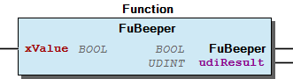

# WagoSysTouchPanel v1.0.0.0 (WAGO) - Complete Documentation

### Documentation Index

WagoSysTouchPanel

Application; System

WagoSysTouchPanel

WAGO / u097111

WagoSysTouchPanel

This document is automatically generated.

WagoSys library for TouchPanel

Based on WagoSysTouchPanel.library, last modified 22.02.2023, 11:10:52. LibDoc 4.1.1.0

© WAGO GmbH & Co. KG, Germany 2018 – All rights reserved. For the avoidance of doubt, this copyright notice does not only apply to the information above but also and primarily to the described library itself. Please note that third-party products are always mentioned without reference to intellectual property rights, including patents, utility models, designs and trademarks, accordingly the existence of such rights cannot be excluded. WAGO is a registered trademark of WAGO Verwaltungsgesellschaft mbH.

Company WAGO Title WagoSysTouchPanel Version 1.0.0.0 Categories Application; System Namespace WagoSysTouchPanel Author WAGO / u097111 Placeholder WagoSysTouchPanel This document is automatically generated. WagoSys library for TouchPanel - 20 Program Organization Units FuBeeper (Function) - FuDeviceTemperature (Function) - FuInfraredSensor (Function) - FuLightSensor (Function) - FuMotionSensor (Function) - eMotion (Enum) - File and Project Information - Library Reference Based on WagoSysTouchPanel.library, last modified 22.02.2023, 11:10:52. LibDoc 4.1.1.0 © WAGO GmbH & Co. KG, Germany 2018 – All rights reserved. For the avoidance of doubt, this copyright notice does not only apply to the information above but also and primarily to the described library itself. Please note that third-party products are always mentioned without reference to intellectual property rights, including patents, utility models, designs and trademarks, accordingly the existence of such rights cannot be excluded. WAGO is a registered trademark of WAGO Verwaltungsgesellschaft mbH.

### Project Information

| Scope | Name | Type | Content |
| --- | --- | --- | --- |
| FileHeader | creationDateTime | date | 22.02.2023, 11:10:52 |
| companyName | string | WAGO |
| libraryFile | string | WagoSysTouchPanel.library |
| productName | string | e!COCKPIT |
| contentFile | string | doc.clean.json |
| ProjectInformation | LastModificationDateTime | 22.02.2023, 11:10:52 |
| ProjectInformation | LibraryCategories | library-category-list | Application; System |
| ProjectInformation | Author | string | WAGO / u097111 |
| ProjectInformation | Company | string | WAGO |
| ProjectInformation | DefaultNamespace | string | WagoSysTouchPanel |
| ProjectInformation | Description | string | See: Description |
| ProjectInformation | DocFormat | string | reStructuredText |
| ProjectInformation | Placeholder | string | WagoSysTouchPanel |
| ProjectInformation | Project | string | WagoSysTouchPanel |
| ProjectInformation | Title | string | WagoSysTouchPanel |
| ProjectInformation | Version | version | 1.0.0.0 |

### Library Information

This is a dictionary of all referenced libraries and their name spaces.

This is a dictionary of all referenced libraries and their name spaces.

### Functions

| Scope | Name | Type | Comment |
| --- | --- | --- | --- |
| Return | FuBeeper | BOOL |  |
| Input | xValue | BOOL | TRUE = On; FALSE = Off |
| Output | udiResult | UDINT | Result Codes |

| FuBeeper |
| --- |
| TRUE | Success |
| FALSE | An error has occurred, see the value of uiResult |

| xValue |
| --- |
| TRUE | Beeper on |
| FALSE | Beeper off |

| udiResult |
| --- |
| 0 | Success |
| 5 | Device not available |

| Scope | Name | Type | Comment |
| --- | --- | --- | --- |
| Return | FuDeviceTemperature | REAL |  |
| Output | udiResult | UDINT | Result Codes |

| udiResult |
| --- |
| 0 | Success |
| 5 | Device not available |

| Scope | Name | Type |
| --- | --- | --- |
| Return | FuInfraredSensor | UDINT |
| Output | udiResult | UDINT |

| udiResult |
| --- |
| 0 | Success |
| 1 | No access to the device |
| 5 | Device not available |

| Scope | Name | Type |
| --- | --- | --- |
| Return | FuLightSensor | UDINT |
| Output | udiResult | UDINT |

| udiResult |
| --- |
| 0 | Success |
| 1 | No access to the device |
| 5 | Device not available |

| Scope | Name | Type |
| --- | --- | --- |
| Return | FuMotionSensor | eMotion |
| Output | udiResult | UDINT |

| FuMotionSensor |
| --- |
| 0 | None |
| 1 | Left |
| 2 | Right |
| 3 | Front |

| udiResult |
| --- |
| 0 | Success |
| 1 | No access to the device |
| 5 | Device not available |

This function switches the device beeper on and off.

Graphical Illustration

Function description

Returnvalue

Outputvalue

This function reads the internal temperature of the device.

Graphical Illustration

Function description

Returnvalue

The value for the device temperature is in the range from -55.0°C to 100.0°C with a resolution of 1.0°C.

Outputvalue

This function supplies the value of the infarod sensor located in the front of the device.

Graphical Illustration

Function description

Returnvalue

The value of the infarod sensor is measured in klx.

Outputvalue

This function supplies the value of the light sensor located in the front of the device.

Graphical Illustration

Function description

Returnvalue

The value of the light sensor is measured in klx.

Outputvalue

Mit dieser Funktion wird der Wert, des in der Front befindlichen Bewegungssensors ausgelesen.

Graphical Illustration

Function description

Returnvalue

Outputvalue

Interface variables Function* This function switches the device beeper on and off. Graphical Illustration  Function description Returnvalue Inputvalue Outputvalue Interface variables Function* This function reads the internal temperature of the device. Graphical Illustration  Function description Returnvalue The value for the device temperature is in the range from -55.0°C to 100.0°C with a resolution of 1.0°C. Outputvalue Interface variables Function* This function supplies the value of the infarod sensor located in the front of the device. Graphical Illustration  Function description Returnvalue The value of the infarod sensor is measured in klx. Outputvalue Interface variables Function* This function supplies the value of the light sensor located in the front of the device. Graphical Illustration  Function description Returnvalue The value of the light sensor is measured in klx. Outputvalue Interface variables Function Mit dieser Funktion wird der Wert, des in der Front befindlichen Bewegungssensors ausgelesen. Graphical Illustration  Function description Returnvalue Outputvalue

### Program Organization

## 20 Program Organization Units

- FuBeeper (Function) - FuDeviceTemperature (Function) - FuInfraredSensor (Function) - FuLightSensor (Function) - FuMotionSensor (Function) - eMotion (Enum)

### Other Components

| Name | Initial |
| --- | --- |
| NONE | 0 |
| LEFT | 1 |
| RIGHT | 2 |
| FRONT | 3 |