# WagoTypesBACnet v1.0.9.9 (WAGO) - Complete Documentation


## 📋 Library Information

- **Company:** WAGO
- **Title:** WagoTypesBACnet
- **Version:** 1.0.9.9
- **Categories:** WAGO FunctionalView|Connectivity|FieldBus; WAGO LayerView|Sys; WAGO LayerView|Types and Interfaces; Application
- **Namespace:** WagoTypesBACnet
- **Author:** Wago <u010716>
- **Placeholder:** WagoTypesBACnet

### Description ¶


This document is automatically generated.

This library provides BACnet data types

This document is automatically generated. This library provides BACnet data types

### Contents: ¶


Contents: - Documentation Index FbBACnetCommand.udiArrayIndex (PROP) - I_BACnetCommand.udiArrayIndex (PROP) - I_BACnetPropertyReference.udiArrayIndex (PROP) - WagoTypesBACnet Library Documentation Project Information Library Information Function Blocks - FbBACnetCommand (FB) - FbBACnetDailyScheduleList (FB) - FbBACnetDataTypeAny (FB) - FbBACnetPeriod (FB) - FbBACnetScheduleDate (FB) - FbBACnetSpecialEvent (FB) - FbDailySchedule (FB) Methods - FbBACnetCommand.editCommand (METH) - FbBACnetCommand.xWriteSuccessful (PROP) - FbBACnetDailyScheduleList.addDailyScheduleBitString (METH) - FbBACnetDailyScheduleList.addDailyScheduleBool (METH) - FbBACnetDailyScheduleList.addDailyScheduleCharString (METH) - FbBACnetDailyScheduleList.addDailyScheduleDouble (METH) - FbBACnetDailyScheduleList.addDailyScheduleEnumerated (METH) - FbBACnetDailyScheduleList.addDailyScheduleNull (METH) - FbBACnetDailyScheduleList.addDailyScheduleReal (METH) - FbBACnetDailyScheduleList.addDailyScheduleSigned (METH) - ... and 155 more Interfaces - I_BACnetAckRequired (ITF) - I_BACnetAckedTransition (ITF) - I_BACnetActionText (ITF) - I_BACnetAnalog (ITF) - I_BACnetAnalogInput_large (ITF) - I_BACnetAnalogInput_medium (ITF) - I_BACnetAnalogInput_small (ITF) - I_BACnetAnalogOutput_large (ITF) - I_BACnetAnalogOutput_medium (ITF) - I_BACnetAnalogOutput_small (ITF) - ... and 222 more Base Components - (00)_Base - 01 Base Objects - Base Types - I_BACnetBaseObject.IObjectIdentifier (PROP) - I_BACnetBaseObject.eObjectType (PROP) - I_BACnetBaseObject.oStatus (PROP) - I_BACnetBaseObject.sObjectName (PROP) - I_BACnetBaseObject.xIsCreated (PROP) - I_BACnetBaseObject.xIsDynamicCreate (PROP) - I_BACnetBaseObject_Info.xIsCovActivated (PROP) - ... and 26 more Internal Components - 90 Internal - 999 Internal - Internal - Internal - Internal - Internal Global Variable Lists - BACnetConstants (GVL) - BACnetError (GVL) - VersionHistory (GVL) Other Components - (0) Input - (1) Output - (13) Input - (14) Output - (19) Value - (2) Value - (3) Input - (4) Output - (5) Value - (ID 0002) Action - ... and 941 more

### Indices and tables ¶


Based on WagoTypesBACnet.library, last modified 29.05.2024, 19:59:55. LibDoc 3.5.16.10

© WAGO GmbH & Co. KG, Germany 2018 – All rights reserved. For the avoidance of doubt, this copyright notice does not only apply to the information above but also and primarily to the described library itself. Please note that third-party products are always mentioned without reference to intellectual property rights, including patents, utility models, designs and trademarks, accordingly the existence of such rights cannot be excluded. WAGO is a registered trademark of WAGO Verwaltungsgesellschaft mbH.

- File and Project Information - Library Reference Based on WagoTypesBACnet.library, last modified 29.05.2024, 19:59:55. LibDoc 3.5.16.10 © WAGO GmbH & Co. KG, Germany 2018 – All rights reserved. For the avoidance of doubt, this copyright notice does not only apply to the information above but also and primarily to the described library itself. Please note that third-party products are always mentioned without reference to intellectual property rights, including patents, utility models, designs and trademarks, accordingly the existence of such rights cannot be excluded. WAGO is a registered trademark of WAGO Verwaltungsgesellschaft mbH.

### Documentation Index


## FbBACnetCommand.udiArrayIndex (PROP)


0 -> Invalid -> optional -> not used

0 -> Invalid -> optional -> not used

## I_BACnetCommand.udiArrayIndex (PROP) ¶


## I_BACnetPropertyReference.udiArrayIndex (PROP) ¶


## WagoTypesBACnet Library Documentation


| Company: | WAGO |
| Title: | WagoTypesBACnet |
| Version: | 1.0.9.9 |
| Categories: | WAGO FunctionalView\|Connectivity\|FieldBus; WAGO LayerView\|Sys; WAGO LayerView\|Types and Interfaces; Application |
| Namespace: | WagoTypesBACnet |
| Author: | Wago <u010716> |
| Placeholder: | WagoTypesBACnet |

### Description


This document is automatically generated.

This library provides BACnet data types

This document is automatically generated. This library provides BACnet data types

### Contents:


- 39 BACnet Data Types (development) BACnet Rev22 - IEC Rev 14 - IEC Rv 22 - IEC_Development 40 Data Types - Action_List - Action_Text - Alias - Bit String - Bit Text - Calendar - Events (Alarms) - Exception Schedule - FwInformation - ListOfObjectPropertyReferences - Priority Array - WeeklySchedule - _Enum - typBACnetArrayInfo (STRUCT) - typBACnetBaseValue (STRUCT) - typBACnetClientCOV (STRUCT) - typBACnetConfigStateText (STRUCT) - typBACnetDate (STRUCT) - typBACnetDateAndTime (STRUCT) - typBACnetDateRange (STRUCT) - typBACnetEventEnable (STRUCT) - typBACnetLastError (STRUCT) - typBACnetPropertyInstance (STRUCT) - typBACnetVarPointer (STRUCT) - typBACnetWeekAndDay (STRUCT) - unionBACnetDataType (UNION) 50 Interfaces - 00 Property Interfaces - 01 Base Objects - 10 (0/1/2) Analog Objects - 12 (3/4/5) Binary Objects - 14 (13/14/19) Multistate Objects - 20 (6) Calendar Object - 22 (17) Scheduler Objects - 30 (12) Loop - 32 (45) Integer Value - 34 (46) Large Analog Value - 36 (39) Bitstring Value - 40 (7) Command - 42 (8) Device - 44 (20) Trend Log - 45 (27) Trend Log Multiple - 46 (9) Event Enrollment - 48 (25) Event Log - 50 (15) Notification Class - 999 Internal 56 Remote Property Interfaces - I_RemoteBaseProperty (ITF) - I_RemotePropertyAlarmValues_ro (ITF) - I_RemotePropertyAlarmValues_rw (ITF) - I_RemotePropertyAnalogPrioArray_ro (ITF) - I_RemotePropertyAnalogPrioArray_rw (ITF) - I_RemotePropertyAny_ro (ITF) - I_RemotePropertyBinaryPrioArray_ro (ITF) - I_RemotePropertyBinaryPrioArray_rw (ITF) - I_RemotePropertyBool_ro (ITF) - I_RemotePropertyBool_rw (ITF) - I_RemotePropertyLimitEnable_ro (ITF) - I_RemotePropertyLimitEnable_rw (ITF) - I_RemotePropertyMultiStatePrioArray_ro (ITF) - I_RemotePropertyMultiStatePrioArray_rw (ITF) - I_RemotePropertyReal_ro (ITF) - I_RemotePropertyReal_rw (ITF) - I_RemotePropertyReliability_ro (ITF) - I_RemotePropertyReliability_rw (ITF) - I_RemotePropertyStatusFlags_ro (ITF) - I_RemotePropertyUnits_ro (ITF) - I_RemotePropertyUnits_rw (ITF) - I_RemotePropertyUnsigned_ro (ITF) - I_RemotePropertyUnsigned_rw (ITF) 80 Status - BACnetError (GVL) - eError (ENUM) 90 Internal - 40 Data Types BACnetConstants (GVL) Parameter (PARAMS) VersionHistory (GVL)

### Indices and tables


Based on WagoTypesBACnet.library, last modified 29.05.2024, 19:59:55. LibDoc 3.5.16.10

© WAGO GmbH & Co. KG, Germany 2018 – All rights reserved. For the avoidance of doubt, this copyright notice does not only apply to the information above but also and primarily to the described library itself. Please note that third-party products are always mentioned without reference to intellectual property rights, including patents, utility models, designs and trademarks, accordingly the existence of such rights cannot be excluded. WAGO is a registered trademark of WAGO Verwaltungsgesellschaft mbH.

- File and Project Information - Library Reference Based on WagoTypesBACnet.library, last modified 29.05.2024, 19:59:55. LibDoc 3.5.16.10 © WAGO GmbH & Co. KG, Germany 2018 – All rights reserved. For the avoidance of doubt, this copyright notice does not only apply to the information above but also and primarily to the described library itself. Please note that third-party products are always mentioned without reference to intellectual property rights, including patents, utility models, designs and trademarks, accordingly the existence of such rights cannot be excluded. WAGO is a registered trademark of WAGO Verwaltungsgesellschaft mbH.

### Project Information


## File and Project Information


| Scope | Name | Type | Content |
| --- | --- | --- | --- |
| FileHeader | libraryFile | string | WagoTypesBACnet.library |
| contentFile | doc.clean.json |
| productName | e!COCKPIT |
| creationDateTime | date | 29.05.2024, 19:59:57 |
| companyName | string | WAGO |
| ProjectInformation | LastModificationDateTime | date | 29.05.2024, 19:59:55 |
| Description | string | See: Description |
| Copyright | © WAGO Kontakttechnik GmbH & Co. KG, Germany 2018 – All rights reserved |
| Author | Wago <u010716> |
| AutoResolveUnbound | bool | True |
| Placeholder | string | WagoTypesBACnet |
| Company | WAGO |
| DocFormat | reStructuredText |
| Project | WagoTypesBACnet |
| DefaultNamespace | WagoTypesBACnet |
| Version | version | 1.0.9.9 |
| Title | string | WagoTypesBACnet |
| LibraryCategories | library-category-list | WAGO FunctionalView\|Connectivity\|FieldBus; WAGO LayerView\|Sys; WAGO LayerView\|Types and Interfaces; Application |
| CompiledLibraryCompatibilityVersion | string | CODESYS V3.5 SP16 Patch 3 |

### Library Information


## Library Reference


| LinkAllContent: False QualifiedOnly: False | SystemLibrary: False | Optional: False |

| LinkAllContent: False QualifiedOnly: True | SystemLibrary: False | Optional: False |

| LinkAllContent: False QualifiedOnly: False | SystemLibrary: False | Optional: False |

| LinkAllContent: False QualifiedOnly: False | SystemLibrary: False | Optional: False |

| LinkAllContent: False QualifiedOnly: False | SystemLibrary: False | Optional: False |

This is a dictionary of all referenced libraries and their name spaces.

This is a dictionary of all referenced libraries and their name spaces. SysMem Library Identification : Placeholder: SysMem Default Resolution: SysMem, * (System) Namespace: SysMem Library Properties : Unit Conversion Interfaces Library Identification : Name: Unit Conversion Interfaces Version: newest Company: Intern Namespace: UC Library Properties : WagoSysErrorBase Library Identification : Placeholder: WagoSysErrorBase Default Resolution: WagoSysErrorBase, * (WAGO) Namespace: WagoSysErrorBase Library Properties : WagoSysVersion Library Identification : Name: WagoSysVersion Version: 1.0.0.0 Company: WAGO Namespace: WagoSysVersion Library Properties : WagoTypesErrorBase Library Identification : Placeholder: WagoTypesErrorBase Default Resolution: WagoTypesErrorBase, * (WAGO) Namespace: WagoTypesErrorBase Library Properties :

### Function Blocks


## FbBACnetCommand (FB)


{attribute ‘hide’}

{attribute ‘hide’} - FbBACnetCommand.ePropertyId (PROP) - FbBACnetCommand.editCommand (METH) - FbBACnetCommand.udiArrayIndex (PROP) - FbBACnetCommand.udiPostDelay (PROP) - FbBACnetCommand.udiPriority (PROP) - FbBACnetCommand.xQuitOnFailure (PROP) - FbBACnetCommand.xWriteSuccessful (PROP)

## FbBACnetDailyScheduleList (FB)


- IBACnetDailyScheduleList FbBACnetDailyScheduleList.aDailySchedules (PROP) - FbBACnetDailyScheduleList.addDailyScheduleBitString (METH) - FbBACnetDailyScheduleList.addDailyScheduleBool (METH) - FbBACnetDailyScheduleList.addDailyScheduleCharString (METH) - FbBACnetDailyScheduleList.addDailyScheduleDouble (METH) - FbBACnetDailyScheduleList.addDailyScheduleEnumerated (METH) - FbBACnetDailyScheduleList.addDailyScheduleNull (METH) - FbBACnetDailyScheduleList.addDailyScheduleReal (METH) - FbBACnetDailyScheduleList.addDailyScheduleSigned (METH) - FbBACnetDailyScheduleList.addDailyScheduleUnsigned (METH) - FbBACnetDailyScheduleList.deleteDailyScheduleItem (METH) - FbBACnetDailyScheduleList.uiDailySchedulesCount (PROP) Internal - FbBACnetDailyScheduleList.setChangeValueListener (METH)

## FbBACnetDataTypeAny (FB)


{attribute ‘hide’}

{attribute ‘hide’} - FbBACnetDataTypeAny.IBIT_STRING (PROP) - FbBACnetDataTypeAny.IBOOL (PROP) - FbBACnetDataTypeAny.ICHAR_STRING (PROP) - FbBACnetDataTypeAny.IDOUBLE (PROP) - FbBACnetDataTypeAny.IENUMERATED (PROP) - FbBACnetDataTypeAny.IREAL (PROP) - FbBACnetDataTypeAny.ISIGNED (PROP) - FbBACnetDataTypeAny.IUNSIGNED (PROP) - Internal FbBACnetDataTypeAny.setChangeValueListener (METH) FbBACnetDataTypeAny.eDataType (PROP)

## FbBACnetPeriod (FB)


- I_BACnetObjectIdentifier_rw FbBACnetPeriod.diInstance (PROP) - FbBACnetPeriod.eObjectType (PROP) I_BACnetPeriod - FbBACnetPeriod.ICalendarEntry (PROP) - FbBACnetPeriod.ICalendarReference (PROP) - FbBACnetPeriod.ePeriodType (PROP) Internal - FbBACnetPeriod.setChangeValueListener (METH)

## FbBACnetScheduleDate (FB)


- FbBACnetScheduleDate.SetDate (METH) - FbBACnetScheduleDate.eDayOfMonth (PROP) - FbBACnetScheduleDate.eDayOfWeek (PROP) - FbBACnetScheduleDate.eMonth (PROP) - FbBACnetScheduleDate.uiYear (PROP)

## FbBACnetSpecialEvent (FB)


- FbBACnetSpecialEvent.IDailyScheduleList (PROP) - FbBACnetSpecialEvent.IPeriod (PROP) - Internal FbBACnetSpecialEvent.setChangeValueListener (METH) FbBACnetSpecialEvent.editSpecialEvent (METH) FbBACnetSpecialEvent.udiEventPriority (PROP)

## FbDailySchedule (FB)


- I_BACnetDailySchedule FbDailySchedule.editDailyScheduleItem (METH) - FbDailySchedule.todTime (PROP)

### Methods


## FbBACnetCommand.editCommand (METH)


| Scope | Name | Type |
| --- | --- | --- |
| Return | editCommand | BOOL |
| Inout | utActionCommand | typBACnetActionCommand |
| Output | oStatus | WagoSysErrorBase.FbResult |

## FbBACnetCommand.xWriteSuccessful (PROP) ¶


## FbBACnetDailyScheduleList.addDailyScheduleBitString (METH)


| Scope | Name | Type |
| --- | --- | --- |
| Return | addDailyScheduleBitString | BOOL |
| Input | todTime | TOD |
| usiBitCount | USINT |
| lwValue | LWORD |
| Output | oStatus | WagoSysErrorBase.FbResult |

## FbBACnetDailyScheduleList.addDailyScheduleBool (METH)


| Scope | Name | Type |
| --- | --- | --- |
| Return | addDailyScheduleBool | BOOL |
| Input | todTime | TOD |
| xValue | BOOL |
| Output | oStatus | WagoSysErrorBase.FbResult |

## FbBACnetDailyScheduleList.addDailyScheduleCharString (METH)


| Scope | Name | Type |
| --- | --- | --- |
| Return | addDailyScheduleCharString | BOOL |
| Input | todTime | TOD |
| sValue | STRING(Parameter.LEN_BACnetValueCharString) |
| Output | oStatus | WagoSysErrorBase.FbResult |

## FbBACnetDailyScheduleList.addDailyScheduleDouble (METH)


| Scope | Name | Type |
| --- | --- | --- |
| Return | addDailyScheduleDouble | BOOL |
| Input | todTime | TOD |
| lrValue | LREAL |
| Output | oStatus | WagoSysErrorBase.FbResult |

## FbBACnetDailyScheduleList.addDailyScheduleEnumerated (METH)


| Scope | Name | Type |
| --- | --- | --- |
| Return | addDailyScheduleEnumerated | BOOL |
| Input | todTime | TOD |
| udiValue | UDINT |
| Output | oStatus | WagoSysErrorBase.FbResult |

## FbBACnetDailyScheduleList.addDailyScheduleNull (METH)


| Scope | Name | Type |
| --- | --- | --- |
| Return | addDailyScheduleNull | BOOL |
| Input | todTime | TOD |
| Output | oStatus | WagoSysErrorBase.FbResult |

## FbBACnetDailyScheduleList.addDailyScheduleReal (METH)


| Scope | Name | Type |
| --- | --- | --- |
| Return | addDailyScheduleReal | BOOL |
| Input | todTime | TOD |
| rValue | REAL |
| Output | oStatus | WagoSysErrorBase.FbResult |

## FbBACnetDailyScheduleList.addDailyScheduleSigned (METH)


| Scope | Name | Type |
| --- | --- | --- |
| Return | addDailyScheduleSigned | BOOL |
| Input | todTime | TOD |
| diValue | DINT |
| Output | oStatus | WagoSysErrorBase.FbResult |

## FbBACnetDailyScheduleList.addDailyScheduleUnsigned (METH)


| Scope | Name | Type |
| --- | --- | --- |
| Return | addDailyScheduleUnsigned | BOOL |
| Input | todTime | TOD |
| udiValue | UDINT |
| Output | oStatus | WagoSysErrorBase.FbResult |

## FbBACnetDailyScheduleList.deleteDailyScheduleItem (METH)


| Scope | Name | Type |
| --- | --- | --- |
| Return | deleteDailyScheduleItem | BOOL |
| Input | usiIndex | USINT |
| Output | oStatus | WagoSysErrorBase.FbResult |

## FbBACnetDailyScheduleList.setChangeValueListener (METH)


| Scope | Name | Type |
| --- | --- | --- |
| Return | setChangeValueListener | BOOL |
| Input | IChangeValueListener | I_ChangeValueListener |

## FbBACnetDataTypeAny.setChangeValueListener (METH)


| Scope | Name | Type |
| --- | --- | --- |
| Return | setChangeValueListener | BOOL |
| Input | IChangeValueListener | I_ChangeValueListener |

## FbBACnetPeriod.setChangeValueListener (METH)


| Scope | Name | Type |
| --- | --- | --- |
| Return | setChangeValueListener | BOOL |
| Input | IChangeValueListener | I_ChangeValueListener |

## FbBACnetScheduleDate.SetDate (METH)


| Scope | Name | Type | Comment |
| --- | --- | --- | --- |
| Return | SetDate | BOOL |  |
| Input | uiYear | UINT | 0 -> means any |
| eMonth | eBACnetMonth |  |
| eDayOfMonth | eBACnetDayOfMonth |  |
| eDayOfWeek | eBACnetDayOfWeek |  |

## FbBACnetSpecialEvent.editSpecialEvent (METH)


| Scope | Name | Type |
| --- | --- | --- |
| Return | editSpecialEvent | BOOL |
| Inout | utSpecialEvent | typBACnetSpecialEvent |
| Output | oStatus | WagoSysErrorBase.FbResult |

## FbBACnetSpecialEvent.setChangeValueListener (METH)


| Scope | Name | Type |
| --- | --- | --- |
| Return | setChangeValueListener | BOOL |
| Input | IChangeValueListener | I_ChangeValueListener |

## FbDailySchedule.editDailyScheduleItem (METH)


| Scope | Name | Type |
| --- | --- | --- |
| Return | editDailyScheduleItem | BOOL |
| Inout | utDailySchedule | typBACnetDailySchedule |
| Output | oStatus | WagoSysErrorBase.FbResult |

## I_BACnetAnalogInput_large.IEventMessageTexts (PROP)


BACnet-ID 351 → WagoTypesBACnet.I_BACnetEventMessageTexts → (read only)

BACnet-ID 351 → WagoTypesBACnet.I_BACnetEventMessageTexts → (read only) - ToFault WagoTypesBACnet.typEventMessageTextsItem → (read only) - ToNormal WagoTypesBACnet.typEventMessageTextsItem → (read only) - ToOffNormal WagoTypesBACnet.typEventMessageTextsItem → (read only)

## I_BACnetAnalogInput_large.IEventMessageTextsConfig (PROP)


BACnet-ID 352 → WagoTypesBACnet.I_BACnetEventMessageTextsConfig → (read only)

BACnet-ID 352 → WagoTypesBACnet.I_BACnetEventMessageTextsConfig → (read only) - ToFault WagoTypesBACnet.typEventMessageTextsConfigItem ↔ (read / write) - ToNormal WagoTypesBACnet.typEventMessageTextsConfigItem ↔ (read / write) - ToOffNormal WagoTypesBACnet.typEventMessageTextsConfigItem ↔ (read / write)

## I_BACnetAnalogOutput_large.IEventMessageTexts (PROP)


BACnet-ID 351 → WagoTypesBACnet.I_BACnetEventMessageTexts → (read only)

BACnet-ID 351 → WagoTypesBACnet.I_BACnetEventMessageTexts → (read only) - ToFault WagoTypesBACnet.typEventMessageTextsItem → (read only) - ToNormal WagoTypesBACnet.typEventMessageTextsItem → (read only) - ToOffNormal WagoTypesBACnet.typEventMessageTextsItem → (read only)

## I_BACnetAnalogOutput_large.IEventMessageTextsConfig (PROP)


BACnet-ID 352 → WagoTypesBACnet.I_BACnetEventMessageTextsConfig → (read only)

BACnet-ID 352 → WagoTypesBACnet.I_BACnetEventMessageTextsConfig → (read only) - ToFault WagoTypesBACnet.typEventMessageTextsConfigItem ↔ (read / write) - ToNormal WagoTypesBACnet.typEventMessageTextsConfigItem ↔ (read / write) - ToOffNormal WagoTypesBACnet.typEventMessageTextsConfigItem ↔ (read / write)

## I_BACnetAnalogValue_large.IEventMessageTexts (PROP)


BACnet-ID 351 → WagoTypesBACnet.I_BACnetEventMessageTexts → (read only)

BACnet-ID 351 → WagoTypesBACnet.I_BACnetEventMessageTexts → (read only) - ToFault WagoTypesBACnet.typEventMessageTextsItem → (read only) - ToNormal WagoTypesBACnet.typEventMessageTextsItem → (read only) - ToOffNormal WagoTypesBACnet.typEventMessageTextsItem → (read only)

## I_BACnetAnalogValue_large.IEventMessageTextsConfig (PROP)


BACnet-ID 352 → WagoTypesBACnet.I_BACnetEventMessageTextsConfig → (read only)

BACnet-ID 352 → WagoTypesBACnet.I_BACnetEventMessageTextsConfig → (read only) - ToFault WagoTypesBACnet.typEventMessageTextsConfigItem ↔ (read / write) - ToNormal WagoTypesBACnet.typEventMessageTextsConfigItem ↔ (read / write) - ToOffNormal WagoTypesBACnet.typEventMessageTextsConfigItem ↔ (read / write)

## I_BACnetBaseObject.Create (METH)


| Scope | Name | Type | Comment |
| --- | --- | --- | --- |
| Return | Create | DWORD |  |
| Input | diInstance | DINT | 0..4194302 -> 0x00000000 .. 0x003FFFFE |
| Output | oStatus | WagoSysErrorBase.FbResult |  |

Creates an BACnet object.

In case of successful creation it returns 0. Otherwise an error id <> 0 is returned.

Graphical Illustration

Graphical Interface of I_BACnetBaseObject.Create

Interface variables Function Creates an BACnet object. In case of successful creation it returns 0. Otherwise an error id <> 0 is returned. Graphical Illustration 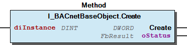 Graphical Interface of I_BACnetBaseObject.Create

## I_BACnetBaseObject.Delete (METH)


| Scope | Name | Type |
| --- | --- | --- |
| Return | Delete | DWORD |
| Output | oStatus | WagoSysErrorBase.FbResult |

Deletes this BACnet object.

In case of successful delete it returns 0. Otherwise an error id <> 0 is returned.

Graphical Illustration

Graphical Interface of I_BACnetBaseObject.Delete

Interface variables Function Deletes this BACnet object. In case of successful delete it returns 0. Otherwise an error id <> 0 is returned. Graphical Illustration 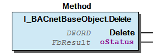 Graphical Interface of I_BACnetBaseObject.Delete

## I_BACnetBaseObject.Read (METH)


| Scope | Name | Type |
| --- | --- | --- |
| Return | Read | DWORD |
| Input | eGroup | eBACnetPropertyUpdateGroup |
| Output | oStatus | WagoSysErrorBase.FbResult |

Read the specified group of properties.

In case of successful read it returns 0. Otherwise an error id <> 0 is returned.

Graphical Illustration

Graphical Interface of I_BACnetBaseObject.Read

Interface variables Function Read the specified group of properties. In case of successful read it returns 0. Otherwise an error id <> 0 is returned. Graphical Illustration 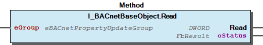 Graphical Interface of I_BACnetBaseObject.Read

## I_BACnetBaseObject.Write (METH)


| Scope | Name | Type |
| --- | --- | --- |
| Return | Write | DWORD |
| Output | oStatus | WagoSysErrorBase.FbResult |

Graphical Illustration

Graphical Interface of I_BACnetBaseObject.Write

Interface variables Function return values from WagoSysBACnet_Internal Graphical Illustration 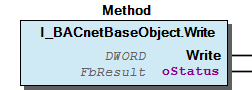 Graphical Interface of I_BACnetBaseObject.Write

## I_BACnetBaseObject.getPropertyGroup (METH)


| Scope | Name | Type |
| --- | --- | --- |
| Return | getPropertyGroup | eBACnetPropertyUpdateGroup |
| Input | ePropertyIdentifier | eBACnetPropertyIdentifier |

Get the group of the specified property.

Interface variables Get the group of the specified property.

## I_BACnetBaseObject.setPropertyGroup (METH)


| Scope | Name | Type |
| --- | --- | --- |
| Return | setPropertyGroup | BOOL |
| Input | ePropertyIdentifier | eBACnetPropertyIdentifier |
| eGroup | eBACnetPropertyUpdateGroup |

Interface variables Attach the property specified by ePropertyIdentifier to the specified group.

## I_BACnetBinaryInput_large.IEventMessageTexts (PROP)


BACnet-ID 351 → WagoTypesBACnet.I_BACnetEventMessageTexts → (read only)

BACnet-ID 351 → WagoTypesBACnet.I_BACnetEventMessageTexts → (read only) - ToFault WagoTypesBACnet.typEventMessageTextsItem → (read only) - ToNormal WagoTypesBACnet.typEventMessageTextsItem → (read only) - ToOffNormal WagoTypesBACnet.typEventMessageTextsItem → (read only)

## I_BACnetBinaryInput_large.IEventMessageTextsConfig (PROP)


BACnet-ID 352 → WagoTypesBACnet.I_BACnetEventMessageTextsConfig → (read only)

BACnet-ID 352 → WagoTypesBACnet.I_BACnetEventMessageTextsConfig → (read only) - ToFault WagoTypesBACnet.typEventMessageTextsConfigItem ↔ (read / write) - ToNormal WagoTypesBACnet.typEventMessageTextsConfigItem ↔ (read / write) - ToOffNormal WagoTypesBACnet.typEventMessageTextsConfigItem ↔ (read / write)

## I_BACnetBinaryInput_medium.dtTimeOfActiveTimeReset (PROP)


BACnet-ID 114 → DATE_AND_TIME ↔ (read only)

This property represents the date and time at which the Elapsed_Active_Time property was most recently set to a zero value.

BACnet-ID 114 → DATE_AND_TIME ↔ (read only) This property represents the date and time at which the Elapsed_Active_Time property was most recently set to a zero value.

## I_BACnetBinaryInput_medium.dtTimeOfStateCountReset (PROP)


BACnet-ID 115 → DATE_AND_TIME ↔ (read only)

This property represents the date and time at which the Change_Of_State_Count property was most recently set to a zero value.

BACnet-ID 115 → DATE_AND_TIME ↔ (read only) This property represents the date and time at which the Change_Of_State_Count property was most recently set to a zero value.

## I_BACnetBinaryOutput_large.IEventMessageTexts (PROP)


BACnet-ID 351 → WagoTypesBACnet.I_BACnetEventMessageTexts → (read only)

BACnet-ID 351 → WagoTypesBACnet.I_BACnetEventMessageTexts → (read only) - ToFault WagoTypesBACnet.typEventMessageTextsItem → (read only) - ToNormal WagoTypesBACnet.typEventMessageTextsItem → (read only) - ToOffNormal WagoTypesBACnet.typEventMessageTextsItem → (read only)

## I_BACnetBinaryOutput_large.IEventMessageTextsConfig (PROP)


BACnet-ID 352 → WagoTypesBACnet.I_BACnetEventMessageTextsConfig → (read only)

BACnet-ID 352 → WagoTypesBACnet.I_BACnetEventMessageTextsConfig → (read only) - ToFault WagoTypesBACnet.typEventMessageTextsConfigItem ↔ (read / write) - ToNormal WagoTypesBACnet.typEventMessageTextsConfigItem ↔ (read / write) - ToOffNormal WagoTypesBACnet.typEventMessageTextsConfigItem ↔ (read / write)

## I_BACnetBinaryOutput_medium.dtTimeOfActiveTimeReset (PROP)


BACnet-ID 114 → DATE_AND_TIME ↔ (read only)

This property represents the date and time at which the Elapsed_Active_Time property was most recently set to a zero value.

BACnet-ID 114 → DATE_AND_TIME ↔ (read only) This property represents the date and time at which the Elapsed_Active_Time property was most recently set to a zero value.

## I_BACnetBinaryOutput_medium.dtTimeOfStateCountReset (PROP)


BACnet-ID 115 → DATE_AND_TIME ↔ (read only)

This property represents the date and time at which the Change_Of_State_Count property was most recently set to a zero value.

BACnet-ID 115 → DATE_AND_TIME ↔ (read only) This property represents the date and time at which the Change_Of_State_Count property was most recently set to a zero value.

## I_BACnetBinaryValue_large.IEventMessageTexts (PROP)


BACnet-ID 351 → WagoTypesBACnet.I_BACnetEventMessageTexts → (read only)

BACnet-ID 351 → WagoTypesBACnet.I_BACnetEventMessageTexts → (read only) - ToFault WagoTypesBACnet.typEventMessageTextsItem → (read only) - ToNormal WagoTypesBACnet.typEventMessageTextsItem → (read only) - ToOffNormal WagoTypesBACnet.typEventMessageTextsItem → (read only)

## I_BACnetBinaryValue_large.IEventMessageTextsConfig (PROP)


BACnet-ID 352 → WagoTypesBACnet.I_BACnetEventMessageTextsConfig → (read only)

BACnet-ID 352 → WagoTypesBACnet.I_BACnetEventMessageTextsConfig → (read only) - ToFault WagoTypesBACnet.typEventMessageTextsConfigItem ↔ (read / write) - ToNormal WagoTypesBACnet.typEventMessageTextsConfigItem ↔ (read / write) - ToOffNormal WagoTypesBACnet.typEventMessageTextsConfigItem ↔ (read / write)

## I_BACnetBinaryValue_large.dtTimeOfActiveTimeReset (PROP)


BACnet-ID 114 → DATE_AND_TIME ↔ (read only)

This property represents the date and time at which the Elapsed_Active_Time property was most recently set to a zero value.

BACnet-ID 114 → DATE_AND_TIME ↔ (read only) This property represents the date and time at which the Elapsed_Active_Time property was most recently set to a zero value.

## I_BACnetBinaryValue_medium.dtTimeOfStateCountReset (PROP)


BACnet-ID 115 → DATE_AND_TIME ↔ (read only)

This property represents the date and time at which the Change_Of_State_Count property was most recently set to a zero value.

BACnet-ID 115 → DATE_AND_TIME ↔ (read only) This property represents the date and time at which the Change_Of_State_Count property was most recently set to a zero value.

## I_BACnetBitstringValue_large.IEventMessageTexts (PROP)


BACnet-ID 351 → WagoTypesBACnet.I_BACnetEventMessageTexts → (read only)

BACnet-ID 351 → WagoTypesBACnet.I_BACnetEventMessageTexts → (read only) - ToFault WagoTypesBACnet.typEventMessageTextsItem → (read only) - ToNormal WagoTypesBACnet.typEventMessageTextsItem → (read only) - ToOffNormal WagoTypesBACnet.typEventMessageTextsItem → (read only)

## I_BACnetBitstringValue_large.IEventMessageTextsConfig (PROP)


BACnet-ID 352 → WagoTypesBACnet.I_BACnetEventMessageTextsConfig → (read only)

BACnet-ID 352 → WagoTypesBACnet.I_BACnetEventMessageTextsConfig → (read only) - ToFault WagoTypesBACnet.typEventMessageTextsConfigItem ↔ (read / write) - ToNormal WagoTypesBACnet.typEventMessageTextsConfigItem ↔ (read / write) - ToOffNormal WagoTypesBACnet.typEventMessageTextsConfigItem ↔ (read / write)

## I_BACnetCommand.editCommand (METH)


| Scope | Name | Type |
| --- | --- | --- |
| Return | editCommand | BOOL |
| Inout | utActionCommand | typBACnetActionCommand |
| Output | oStatus | WagoSysErrorBase.FbResult |

## I_BACnetCommand.xWriteSuccessful (PROP) ¶


## I_BACnetCommand_medium.xAllWritesSuccessful (PROP)


BACnet-ID 9 → WagoTypesBACnet.I_BitString → (read only)

BACnet-ID 9 → WagoTypesBACnet.I_BitString → (read only)

## I_BACnetDailySchedule.editDailyScheduleItem (METH)


| Scope | Name | Type |
| --- | --- | --- |
| Return | editDailyScheduleItem | BOOL |
| Inout | utDailySchedule | typBACnetDailySchedule |
| Output | oStatus | WagoSysErrorBase.FbResult |

## I_BACnetDailyScheduleList.addDailyScheduleBitString (METH)


| Scope | Name | Type |
| --- | --- | --- |
| Return | addDailyScheduleBitString | BOOL |
| Input | todTime | TOD |
| usiBitCount | USINT |
| lwValue | LWORD |
| Output | oStatus | WagoSysErrorBase.FbResult |

## I_BACnetDailyScheduleList.addDailyScheduleBool (METH)


| Scope | Name | Type |
| --- | --- | --- |
| Return | addDailyScheduleBool | BOOL |
| Input | todTime | TOD |
| xValue | BOOL |
| Output | oStatus | WagoSysErrorBase.FbResult |

## I_BACnetDailyScheduleList.addDailyScheduleCharString (METH)


| Scope | Name | Type |
| --- | --- | --- |
| Return | addDailyScheduleCharString | BOOL |
| Input | todTime | TOD |
| sValue | STRING(Parameter.LEN_BACnetValueCharString) |
| Output | oStatus | WagoSysErrorBase.FbResult |

## I_BACnetDailyScheduleList.addDailyScheduleDouble (METH)


| Scope | Name | Type |
| --- | --- | --- |
| Return | addDailyScheduleDouble | BOOL |
| Input | todTime | TOD |
| lrValue | LREAL |
| Output | oStatus | WagoSysErrorBase.FbResult |

## I_BACnetDailyScheduleList.addDailyScheduleEnumerated (METH)


| Scope | Name | Type |
| --- | --- | --- |
| Return | addDailyScheduleEnumerated | BOOL |
| Input | todTime | TOD |
| udiValue | UDINT |
| Output | oStatus | WagoSysErrorBase.FbResult |

## I_BACnetDailyScheduleList.addDailyScheduleNull (METH)


| Scope | Name | Type |
| --- | --- | --- |
| Return | addDailyScheduleNull | BOOL |
| Input | todTime | TOD |
| Output | oStatus | WagoSysErrorBase.FbResult |

## I_BACnetDailyScheduleList.addDailyScheduleReal (METH)


| Scope | Name | Type |
| --- | --- | --- |
| Return | addDailyScheduleReal | BOOL |
| Input | todTime | TOD |
| rValue | REAL |
| Output | oStatus | WagoSysErrorBase.FbResult |

## I_BACnetDailyScheduleList.addDailyScheduleSigned (METH)


| Scope | Name | Type |
| --- | --- | --- |
| Return | addDailyScheduleSigned | BOOL |
| Input | todTime | TOD |
| diValue | DINT |
| Output | oStatus | WagoSysErrorBase.FbResult |

## I_BACnetDailyScheduleList.addDailyScheduleUnsigned (METH)


| Scope | Name | Type |
| --- | --- | --- |
| Return | addDailyScheduleUnsigned | BOOL |
| Input | todTime | TOD |
| udiValue | UDINT |
| Output | oStatus | WagoSysErrorBase.FbResult |

## I_BACnetDailyScheduleList.deleteDailyScheduleItem (METH)


| Scope | Name | Type |
| --- | --- | --- |
| Return | deleteDailyScheduleItem | BOOL |
| Input | usiIndex | USINT |
| Output | oStatus | WagoSysErrorBase.FbResult |

## I_BACnetDataAdmin.onNewObject (METH)


| Scope | Name | Type |
| --- | --- | --- |
| Return | onNewObject | BOOL |
| Input | I_BACnetBaseObject | I_BACnetBaseObject |

## I_BACnetDateList.addDate (METH)


| Scope | Name | Type | Comment |
| --- | --- | --- | --- |
| Return | addDate | BOOL |  |
| Input | eDayOfMonth | eBACnetDayOfMonth |  |
| eMonth | eBACnetMonth |  |
| eDayOfWeek | eBACnetDayOfWeek |  |
| uiYear | UINT | 0 -> means any |
| Output | oStatus | WagoSysErrorBase.FbResult |  |

Interface variables Append a date list item of type BACnetDate at the end of the date list.

## I_BACnetDateList.addDateRange (METH)


| Scope | Name | Type | Comment |
| --- | --- | --- | --- |
| Return | addDateRange | BOOL |  |
| Input | eStartDayOfMonth | eBACnetDayOfMonth |  |
| eStartMonth | eBACnetMonth |  |
| eStartDayOfWeek | eBACnetDayOfWeek |  |
| uiStartYear | UINT | 0 -> means any |
| eEndDayOfMonth | eBACnetDayOfMonth |  |
| eEndMonth | eBACnetMonth |  |
| eEndDayOfWeek | eBACnetDayOfWeek |  |
| uiEndYear | UINT | 0 -> means any |
| Output | oStatus | WagoSysErrorBase.FbResult |  |

Interface variables Append a date list item of type BACnetDateRange at the end of the date list.

## I_BACnetDateList.addWeekAndDay (METH)


| Scope | Name | Type |
| --- | --- | --- |
| Return | addWeekAndDay | BOOL |
| Input | eDayOfWeek | eBACnetDayOfWeek |
| eMonth | eBACnetMonth |
| eWeekOfMonth | eBACnetWeekOfMonth |
| Output | oStatus | WagoSysErrorBase.FbResult |

Interface variables Append a date list item of type BACnetWeekAndDay at the end of the date list.

## I_BACnetDateList.deleteDateListItem (METH)


| Scope | Name | Type |
| --- | --- | --- |
| Return | deleteDateListItem | BOOL |
| Input | usiIndex | USINT |
| Output | oStatus | WagoSysErrorBase.FbResult |

Delete the date list item at the specified index.

Interface variables Delete the date list item at the specified index.

## I_BACnetDateListItem.editDateListItem (METH)


| Scope | Name | Type |
| --- | --- | --- |
| Return | editDateListItem | BOOL |
| Inout | utCalendarEntry | typBACnetCalendarEntry |
| Output | oStatus | WagoSysErrorBase.FbResult |

Edit date list item.

Interface variables Edit date list item.

## I_BACnetDateRange.IStartDate (PROP)


Interface to start date of a date range entry → (read only)

In the case that eEntryType is set to eBACnetCalendarEntryType.BACnetDateRange you get an interface for read access to the discrete start date components.

Example: ...IStartDate.uiYear → (read only)

Interface to start date of a date range entry → (read only) In the case that eEntryType is set to eBACnetCalendarEntryType.BACnetDateRange you get an interface for read access to the discrete start date components. Components - uiYear → (read only) - eMonth → (read only) - eDayOfMonth → (read only) - eDayOfWeek → (read only) Example: ...IStartDate.uiYear → (read only)

## I_BACnetDateRange_rw.IStartDate (PROP)


Interface to start date of a date range entry → (read only)

Example: ...IStartDate.uiYear → (read only)

Interface to start date of a date range entry → (read only) Components - uiYear → (read only) - eMonth → (read only) - eDayOfMonth → (read only) - eDayOfWeek → (read only) Example: ...IStartDate.uiYear → (read only)

## I_BACnetDateRange_rw.SetDateRange (METH)


| Scope | Name | Type | Comment |
| --- | --- | --- | --- |
| Return | SetDateRange | BOOL |  |
| Input | uiStartYear | UINT | 0 -> means any |
| eStartMonth | eBACnetMonth |  |
| eStartDayOfMonth | eBACnetDayOfMonth |  |
| eStartDayOfWeek | eBACnetDayOfWeek |  |
| uiEndYear | UINT | 0 -> means any |
| eEndMonth | eBACnetMonth |  |
| eEndDayOfMonth | eBACnetDayOfMonth |  |
| eEndDayOfWeek | eBACnetDayOfWeek |  |

Set a date range from start date to end date

Interface variables Set a date range from start date to end date

## I_BACnetDate_rw.SetDate (METH)


| Scope | Name | Type | Comment |
| --- | --- | --- | --- |
| Return | SetDate | BOOL |  |
| Input | uiYear | UINT | 0 -> means any |
| eMonth | eBACnetMonth |  |
| eDayOfMonth | eBACnetDayOfMonth |  |
| eDayOfWeek | eBACnetDayOfWeek |  |

Interface variables Set a date

## I_BACnetDevice_small.dtTimeOfDeviceRestart (PROP)


BACnet-ID 203 → DATE_AND_TIME → (read only)

BACnet-ID 203 → DATE_AND_TIME → (read only)

## I_BACnetEventEnrollment_large.IEventMessageTexts (PROP)


BACnet-ID 351 → WagoTypesBACnet.I_BACnetEventMessageTexts → (read only)

BACnet-ID 351 → WagoTypesBACnet.I_BACnetEventMessageTexts → (read only) - ToFault WagoTypesBACnet.typEventMessageTextsItem → (read only) - ToNormal WagoTypesBACnet.typEventMessageTextsItem → (read only) - ToOffNormal WagoTypesBACnet.typEventMessageTextsItem → (read only)

## I_BACnetEventEnrollment_large.IEventMessageTextsConfig (PROP)


BACnet-ID 352 → WagoTypesBACnet.I_BACnetEventMessageTextsConfig → (read only)

BACnet-ID 352 → WagoTypesBACnet.I_BACnetEventMessageTextsConfig → (read only) - ToFault WagoTypesBACnet.typEventMessageTextsConfigItem ↔ (read / write) - ToNormal WagoTypesBACnet.typEventMessageTextsConfigItem ↔ (read / write) - ToOffNormal WagoTypesBACnet.typEventMessageTextsConfigItem ↔ (read / write)

## I_BACnetEventList.AcknowledgeAll (METH)


| Scope | Name | Type | Comment |
| --- | --- | --- | --- |
| Return | AcknowledgeAll | UINT |  |
| Input | sAckSource | STRING | name of the actuator |
| Output | oStatus | WagoSysErrorBase.FbResult |  |

Acknowledge all alarms / events

Interface variables Acknowledge all alarms / events

## I_BACnetEventList.AcknowledgeAllByFilter (METH)


| Scope | Name | Type | Comment |
| --- | --- | --- | --- |
| Return | AcknowledgeAllByFilter | UINT |  |
| Input | xAlarm | BOOL | acknowledge alarms |
| xEvent | BOOL | acknowledge events |
| xToOffNormal | BOOL | acknowledge all OffNormal events / alarms |
| xToFault | BOOL | acknowledge all Fault events / alarms |
| xToNormal | BOOL | acknowledge all Normal events / alarms |
| sAckSource | STRING | name of the actuator |
| Output | oStatus | WagoSysErrorBase.FbResult |  |

Interface variables Acknowledge all alarms / events spezified by input parameters.

## I_BACnetEventList.Read (METH)


| Scope | Name | Type |
| --- | --- | --- |
| Return | Read | UINT |
| Output | oStatus | WagoSysErrorBase.FbResult |

Read the actual event list from BACnet stack.

Interface variables Read the actual event list from BACnet stack.

## I_BACnetEventListEntry.Acknowledge (METH)


| Scope | Name | Type |
| --- | --- | --- |
| Return | Acknowledge | UINT |
| Input | xToOffNormal | BOOL |
| xToFault | BOOL |
| xToNormal | BOOL |
| sAckSource | STRING |
| Output | oStatus | WagoSysErrorBase.FbResult |

## I_BACnetEventLog_large.IEventMessageTexts (PROP)


BACnet-ID 351 → WagoTypesBACnet.I_BACnetEventMessageTexts → (read only)

BACnet-ID 351 → WagoTypesBACnet.I_BACnetEventMessageTexts → (read only) - ToFault WagoTypesBACnet.typEventMessageTextsItem → (read only) - ToNormal WagoTypesBACnet.typEventMessageTextsItem → (read only) - ToOffNormal WagoTypesBACnet.typEventMessageTextsItem → (read only)

## I_BACnetEventLog_large.IEventMessageTextsConfig (PROP)


BACnet-ID 352 → WagoTypesBACnet.I_BACnetEventMessageTextsConfig → (read only)

BACnet-ID 352 → WagoTypesBACnet.I_BACnetEventMessageTextsConfig → (read only) - ToFault WagoTypesBACnet.typEventMessageTextsConfigItem ↔ (read / write) - ToNormal WagoTypesBACnet.typEventMessageTextsConfigItem ↔ (read / write) - ToOffNormal WagoTypesBACnet.typEventMessageTextsConfigItem ↔ (read / write)

## I_BACnetEventLog_medium.IStartTime (PROP)


BACnet-ID 142 → WagoTypesBACnet.I_BACnetDateAndTime → (read only)

BACnet-ID 142 → WagoTypesBACnet.I_BACnetDateAndTime → (read only)

## I_BACnetEventMessageTexts.sToFault (PROP)


WagoTypesBACnet.typEventMessageTextsItem → (read only)

WagoTypesBACnet.typEventMessageTextsItem → (read only)

## I_BACnetEventMessageTexts.sToNormal (PROP)


WagoTypesBACnet.typEventMessageTextsItem → (read only)

WagoTypesBACnet.typEventMessageTextsItem → (read only)

## I_BACnetEventMessageTexts.sToOffNormal (PROP)


WagoTypesBACnet.typEventMessageTextsItem → (read only)

WagoTypesBACnet.typEventMessageTextsItem → (read only)

## I_BACnetEventMessageTextsConfig.sToFault (PROP)


WagoTypesBACnet.typEventMessageTextsConfigItem ↔ (read / write)

WagoTypesBACnet.typEventMessageTextsConfigItem ↔ (read / write)

## I_BACnetEventMessageTextsConfig.sToNormal (PROP)


WagoTypesBACnet.typEventMessageTextsConfigItem ↔ (read / write)

WagoTypesBACnet.typEventMessageTextsConfigItem ↔ (read / write)

## I_BACnetEventMessageTextsConfig.sToOffNormal (PROP)


WagoTypesBACnet.typEventMessageTextsConfigItem ↔ (read / write)

WagoTypesBACnet.typEventMessageTextsConfigItem ↔ (read / write)

## I_BACnetFeatureInformation.xPropertyReadUpdate_CoV (PROP)


## I_BACnetIntegerValue_large.IEventMessageTexts (PROP)


BACnet-ID 351 → WagoTypesBACnet.I_BACnetEventMessageTexts → (read only)

BACnet-ID 351 → WagoTypesBACnet.I_BACnetEventMessageTexts → (read only) - ToFault WagoTypesBACnet.typEventMessageTextsItem → (read only) - ToNormal WagoTypesBACnet.typEventMessageTextsItem → (read only) - ToOffNormal WagoTypesBACnet.typEventMessageTextsItem → (read only)

## I_BACnetIntegerValue_large.IEventMessageTextsConfig (PROP)


BACnet-ID 352 → WagoTypesBACnet.I_BACnetEventMessageTextsConfig → (read only)

BACnet-ID 352 → WagoTypesBACnet.I_BACnetEventMessageTextsConfig → (read only) - ToFault WagoTypesBACnet.typEventMessageTextsConfigItem ↔ (read / write) - ToNormal WagoTypesBACnet.typEventMessageTextsConfigItem ↔ (read / write) - ToOffNormal WagoTypesBACnet.typEventMessageTextsConfigItem ↔ (read / write)

## I_BACnetLargeAnalogValue_large.IEventMessageTexts (PROP)


BACnet-ID 351 → WagoTypesBACnet.I_BACnetEventMessageTexts → (read only)

BACnet-ID 351 → WagoTypesBACnet.I_BACnetEventMessageTexts → (read only) - ToFault WagoTypesBACnet.typEventMessageTextsItem → (read only) - ToNormal WagoTypesBACnet.typEventMessageTextsItem → (read only) - ToOffNormal WagoTypesBACnet.typEventMessageTextsItem → (read only)

## I_BACnetLargeAnalogValue_large.IEventMessageTextsConfig (PROP)


BACnet-ID 352 → WagoTypesBACnet.I_BACnetEventMessageTextsConfig → (read only)

BACnet-ID 352 → WagoTypesBACnet.I_BACnetEventMessageTextsConfig → (read only) - ToFault WagoTypesBACnet.typEventMessageTextsConfigItem ↔ (read / write) - ToNormal WagoTypesBACnet.typEventMessageTextsConfigItem ↔ (read / write) - ToOffNormal WagoTypesBACnet.typEventMessageTextsConfigItem ↔ (read / write)

## I_BACnetListOfActions.addAction (METH)


| Scope | Name | Type |
| --- | --- | --- |
| Return | addAction | BOOL |
| Input | sActionText | STRING(Parameter.LEN_BACnetActionText) |
| Output | oStatus | WagoSysErrorBase.FbResult |

## I_BACnetListOfActions.deleteAction (METH)


| Scope | Name | Type |
| --- | --- | --- |
| Return | deleteAction | BOOL |
| Input | usiIndex | USINT |
| Output | oStatus | WagoSysErrorBase.FbResult |

## I_BACnetListOfCommmands.addCommand (METH)


| Scope | Name | Type |
| --- | --- | --- |
| Return | addCommand | BOOL |
| Inout | utActionCommand | typBACnetActionCommand |
| Output | oStatus | WagoSysErrorBase.FbResult |

## I_BACnetListOfCommmands.deleteCommand (METH)


| Scope | Name | Type |
| --- | --- | --- |
| Return | deleteCommand | BOOL |
| Input | usiIndex | USINT |
| Output | oStatus | WagoSysErrorBase.FbResult |

## I_BACnetListOfPropertyReferences.addPropertyReference (METH)


| Scope | Name | Type | Comment |
| --- | --- | --- | --- |
| Return | addPropertyReference | BOOL |  |
| Input | eObjectType | eBACnetObjectType |  |
| diObjectInstance | DINT |  |
| ePropertyIdentifier | eBACnetPropertyIdentifier |  |
| udiArrayIndex | UDINT |  |
| diDeviceInstance | DINT | valid range 0..4194303 –> other values set the Device Identifier to INVALID |
| Output | oStatus | WagoSysErrorBase.FbResult |  |

## I_BACnetListOfPropertyReferences.deletePropertyReference (METH)


| Scope | Name | Type |
| --- | --- | --- |
| Return | deletePropertyReference | BOOL |
| Input | usiIndex | USINT |
| Output | oStatus | WagoSysErrorBase.FbResult |

## I_BACnetListOfSpecialEvents.addCalendarDate (METH)


| Scope | Name | Type | Comment |
| --- | --- | --- | --- |
| Return | addCalendarDate | BOOL |  |
| Input | udiEventPriority | UDINT |  |
| eDayOfMonth | eBACnetDayOfMonth |  |
| eMonth | eBACnetMonth |  |
| eDayOfWeek | eBACnetDayOfWeek |  |
| uiYear | UINT | 0 -> means any |
| Output | oStatus | WagoSysErrorBase.FbResult |  |

Interface variables Append a date list item of type BACnetDate at the end of the date list.

## I_BACnetListOfSpecialEvents.addCalendarDateRange (METH)


| Scope | Name | Type | Comment |
| --- | --- | --- | --- |
| Return | addCalendarDateRange | BOOL |  |
| Input | udiEventPriority | UDINT |  |
| eStartDayOfMonth | eBACnetDayOfMonth |  |
| eStartMonth | eBACnetMonth |  |
| eStartDayOfWeek | eBACnetDayOfWeek |  |
| uiStartYear | UINT | 0 -> means any |
| eEndDayOfMonth | eBACnetDayOfMonth |  |
| eEndMonth | eBACnetMonth |  |
| eEndDayOfWeek | eBACnetDayOfWeek |  |
| uiEndYear | UINT | 0 -> means any |
| Output | oStatus | WagoSysErrorBase.FbResult |  |

Interface variables Append a date list item of type BACnetDateRange at the end of the date list.

## I_BACnetListOfSpecialEvents.addCalendarReference (METH)


| Scope | Name | Type |
| --- | --- | --- |
| Return | addCalendarReference | BOOL |
| Input | udiEventPriority | UDINT |
| diInstance | DINT |
| Output | oStatus | WagoSysErrorBase.FbResult |

Interface variables Append a date list item of type BACnetDate at the end of the date list.

## I_BACnetListOfSpecialEvents.addCalendarWeekAndDay (METH)


| Scope | Name | Type |
| --- | --- | --- |
| Return | addCalendarWeekAndDay | BOOL |
| Input | udiEventPriority | UDINT |
| eDayOfWeek | eBACnetDayOfWeek |
| eMonth | eBACnetMonth |
| eWeekOfMonth | eBACnetWeekOfMonth |
| Output | oStatus | WagoSysErrorBase.FbResult |

Interface variables Append a date list item of type BACnetWeekAndDay at the end of the date list.

## I_BACnetListOfSpecialEvents.deleteSpecialEvent (METH)


| Scope | Name | Type |
| --- | --- | --- |
| Return | deleteSpecialEvent | BOOL |
| Input | usiIndex | USINT |
| Output | oStatus | WagoSysErrorBase.FbResult |

## I_BACnetLoop_large.IEventMessageTexts (PROP)


BACnet-ID 351 → WagoTypesBACnet.I_BACnetEventMessageTexts → (read only)

BACnet-ID 351 → WagoTypesBACnet.I_BACnetEventMessageTexts → (read only) - ToFault WagoTypesBACnet.typEventMessageTextsItem → (read only) - ToNormal WagoTypesBACnet.typEventMessageTextsItem → (read only) - ToOffNormal WagoTypesBACnet.typEventMessageTextsItem → (read only)

## I_BACnetLoop_large.IEventMessageTextsConfig (PROP)


BACnet-ID 352 → WagoTypesBACnet.I_BACnetEventMessageTextsConfig → (read only)

BACnet-ID 352 → WagoTypesBACnet.I_BACnetEventMessageTextsConfig → (read only) - ToFault WagoTypesBACnet.typEventMessageTextsConfigItem ↔ (read / write) - ToNormal WagoTypesBACnet.typEventMessageTextsConfigItem ↔ (read / write) - ToOffNormal WagoTypesBACnet.typEventMessageTextsConfigItem ↔ (read / write)

## I_BACnetLoop_small.rSetPoint (PROP)


BACnet-ID 108 → REAL ↔ (read / write)

BACnet-ID 108 → REAL ↔ (read / write)

## I_BACnetMultistateInput_large.IEventMessageTexts (PROP)


BACnet-ID 351 → WagoTypesBACnet.I_BACnetEventMessageTexts → (read only)

BACnet-ID 351 → WagoTypesBACnet.I_BACnetEventMessageTexts → (read only) - ToFault WagoTypesBACnet.typEventMessageTextsItem → (read only) - ToNormal WagoTypesBACnet.typEventMessageTextsItem → (read only) - ToOffNormal WagoTypesBACnet.typEventMessageTextsItem → (read only)

## I_BACnetMultistateInput_large.IEventMessageTextsConfig (PROP)


BACnet-ID 352 → WagoTypesBACnet.I_BACnetEventMessageTextsConfig → (read only)

BACnet-ID 352 → WagoTypesBACnet.I_BACnetEventMessageTextsConfig → (read only) - ToFault WagoTypesBACnet.typEventMessageTextsConfigItem ↔ (read / write) - ToNormal WagoTypesBACnet.typEventMessageTextsConfigItem ↔ (read / write) - ToOffNormal WagoTypesBACnet.typEventMessageTextsConfigItem ↔ (read / write)

## I_BACnetMultistateInput_large.getStateText (METH)


| Scope | Name | Type | Comment |
| --- | --- | --- | --- |
| Return | getStateText | STRING(Parameter.LEN_BACnetStateText) |  |
| Input | uiIndex | UINT | Index of the specified state text |
| Output | oStatus | WagoSysErrorBase.FbResult |  |

## I_BACnetMultistateInput_large.setStateText (METH)


| Scope | Name | Type | Comment |
| --- | --- | --- | --- |
| Return | setStateText | BOOL |  |
| Input | uiIndex | UINT | Index of the specified state text |
| sStateText | STRING(Parameter.LEN_BACnetStateText) |  |
| Output | oStatus | WagoSysErrorBase.FbResult |  |

## I_BACnetMultistateOutput_large.IEventMessageTexts (PROP)


BACnet-ID 351 → WagoTypesBACnet.I_BACnetEventMessageTexts → (read only)

BACnet-ID 351 → WagoTypesBACnet.I_BACnetEventMessageTexts → (read only) - ToFault WagoTypesBACnet.typEventMessageTextsItem → (read only) - ToNormal WagoTypesBACnet.typEventMessageTextsItem → (read only) - ToOffNormal WagoTypesBACnet.typEventMessageTextsItem → (read only)

## I_BACnetMultistateOutput_large.IEventMessageTextsConfig (PROP)


BACnet-ID 352 → WagoTypesBACnet.I_BACnetEventMessageTextsConfig → (read only)

BACnet-ID 352 → WagoTypesBACnet.I_BACnetEventMessageTextsConfig → (read only) - ToFault WagoTypesBACnet.typEventMessageTextsConfigItem ↔ (read / write) - ToNormal WagoTypesBACnet.typEventMessageTextsConfigItem ↔ (read / write) - ToOffNormal WagoTypesBACnet.typEventMessageTextsConfigItem ↔ (read / write)

## I_BACnetMultistateOutput_large.getStateText (METH)


| Scope | Name | Type | Comment |
| --- | --- | --- | --- |
| Return | getStateText | STRING(Parameter.LEN_BACnetStateText) |  |
| Input | uiIndex | UINT | Index of the specified state text |
| Output | oStatus | WagoSysErrorBase.FbResult |  |

## I_BACnetMultistateOutput_large.setStateText (METH)


| Scope | Name | Type | Comment |
| --- | --- | --- | --- |
| Return | setStateText | BOOL |  |
| Input | uiIndex | UINT | Index of the specified state text |
| sStateText | STRING(Parameter.LEN_BACnetStateText) |  |
| Output | oStatus | WagoSysErrorBase.FbResult |  |

## I_BACnetMultistateValue_large.IEventMessageTexts (PROP)


BACnet-ID 351 → WagoTypesBACnet.I_BACnetEventMessageTexts → (read only)

BACnet-ID 351 → WagoTypesBACnet.I_BACnetEventMessageTexts → (read only) - ToFault WagoTypesBACnet.typEventMessageTextsItem → (read only) - ToNormal WagoTypesBACnet.typEventMessageTextsItem → (read only) - ToOffNormal WagoTypesBACnet.typEventMessageTextsItem → (read only)

## I_BACnetMultistateValue_large.IEventMessageTextsConfig (PROP)


BACnet-ID 352 → WagoTypesBACnet.I_BACnetEventMessageTextsConfig → (read only)

BACnet-ID 352 → WagoTypesBACnet.I_BACnetEventMessageTextsConfig → (read only) - ToFault WagoTypesBACnet.typEventMessageTextsConfigItem ↔ (read / write) - ToNormal WagoTypesBACnet.typEventMessageTextsConfigItem ↔ (read / write) - ToOffNormal WagoTypesBACnet.typEventMessageTextsConfigItem ↔ (read / write)

## I_BACnetMultistateValue_large.getStateText (METH)


| Scope | Name | Type | Comment |
| --- | --- | --- | --- |
| Return | getStateText | STRING(Parameter.LEN_BACnetStateText) |  |
| Input | uiIndex | UINT | Index of the specified state text |
| Output | oStatus | WagoSysErrorBase.FbResult |  |

## I_BACnetMultistateValue_large.setStateText (METH)


| Scope | Name | Type | Comment |
| --- | --- | --- | --- |
| Return | setStateText | BOOL |  |
| Input | uiIndex | UINT | Index of the specified state text |
| sStateText | STRING(Parameter.LEN_BACnetStateText) |  |
| Output | oStatus | WagoSysErrorBase.FbResult |  |

## I_BACnetPropertyReference.editPropertyReference (METH)


| Scope | Name | Type |
| --- | --- | --- |
| Return | editPropertyReference | BOOL |
| Input | eObjectType | eBACnetObjectType |
| diObjectInstance | DINT |
| ePropertyIdentifier | eBACnetPropertyIdentifier |
| udiArrayIndex | UDINT |
| diDeviceInstance | DINT |
| Output | oStatus | WagoSysErrorBase.FbResult |

## I_BACnetSchedule_large.IEventMessageTexts (PROP)


BACnet-ID 351 → WagoTypesBACnet.I_BACnetEventMessageTexts → (read only)

BACnet-ID 351 → WagoTypesBACnet.I_BACnetEventMessageTexts → (read only) - ToFault WagoTypesBACnet.typEventMessageTextsItem → (read only) - ToNormal WagoTypesBACnet.typEventMessageTextsItem → (read only) - ToOffNormal WagoTypesBACnet.typEventMessageTextsItem → (read only)

## I_BACnetSchedule_large.IEventMessageTextsConfig (PROP)


BACnet-ID 352 → WagoTypesBACnet.I_BACnetEventMessageTextsConfig → (read only)

BACnet-ID 352 → WagoTypesBACnet.I_BACnetEventMessageTextsConfig → (read only) - ToFault WagoTypesBACnet.typEventMessageTextsConfigItem ↔ (read / write) - ToNormal WagoTypesBACnet.typEventMessageTextsConfigItem ↔ (read / write) - ToOffNormal WagoTypesBACnet.typEventMessageTextsConfigItem ↔ (read / write)

## I_BACnetSpecialEvent.editSpecialEvent (METH)


| Scope | Name | Type |
| --- | --- | --- |
| Return | editSpecialEvent | BOOL |
| Inout | utSpecialEvent | typBACnetSpecialEvent |
| Output | oStatus | WagoSysErrorBase.FbResult |

## I_BACnetSubordinateList.addSubObject (METH)


| Scope | Name | Type |
| --- | --- | --- |
| Return | addSubObject | BOOL |
| Input | IBaseObject | I_BACnetBaseObject |

## I_BACnetTrendLogMultiple_large.IEventMessageTexts (PROP)


BACnet-ID 351 → WagoTypesBACnet.I_BACnetEventMessageTexts → (read only)

BACnet-ID 351 → WagoTypesBACnet.I_BACnetEventMessageTexts → (read only) - ToFault WagoTypesBACnet.typEventMessageTextsItem → (read only) - ToNormal WagoTypesBACnet.typEventMessageTextsItem → (read only) - ToOffNormal WagoTypesBACnet.typEventMessageTextsItem → (read only)

## I_BACnetTrendLogMultiple_large.IEventMessageTextsConfig (PROP)


BACnet-ID 352 → WagoTypesBACnet.I_BACnetEventMessageTextsConfig → (read only)

BACnet-ID 352 → WagoTypesBACnet.I_BACnetEventMessageTextsConfig → (read only) - ToFault WagoTypesBACnet.typEventMessageTextsConfigItem ↔ (read / write) - ToNormal WagoTypesBACnet.typEventMessageTextsConfigItem ↔ (read / write) - ToOffNormal WagoTypesBACnet.typEventMessageTextsConfigItem ↔ (read / write)

## I_BACnetTrendLogMultiple_large.udiIntervalOffset (PROP)


BACnet-ID 195 → UDINT → (read only)

BACnet-ID 195 → UDINT → (read only)

## I_BACnetTrendLogMultiple_medium.IStartTime (PROP)


BACnet-ID 142 → WagoTypesBACnet.I_BACnetDateAndTime → (read only)

BACnet-ID 142 → WagoTypesBACnet.I_BACnetDateAndTime → (read only)

## I_BACnetTrendLog_large.IEventMessageTexts (PROP)


BACnet-ID 351 → WagoTypesBACnet.I_BACnetEventMessageTexts → (read only)

BACnet-ID 351 → WagoTypesBACnet.I_BACnetEventMessageTexts → (read only) - ToFault WagoTypesBACnet.typEventMessageTextsItem → (read only) - ToNormal WagoTypesBACnet.typEventMessageTextsItem → (read only) - ToOffNormal WagoTypesBACnet.typEventMessageTextsItem → (read only)

## I_BACnetTrendLog_large.IEventMessageTextsConfig (PROP)


BACnet-ID 352 → WagoTypesBACnet.I_BACnetEventMessageTextsConfig → (read only)

BACnet-ID 352 → WagoTypesBACnet.I_BACnetEventMessageTextsConfig → (read only) - ToFault WagoTypesBACnet.typEventMessageTextsConfigItem ↔ (read / write) - ToNormal WagoTypesBACnet.typEventMessageTextsConfigItem ↔ (read / write) - ToOffNormal WagoTypesBACnet.typEventMessageTextsConfigItem ↔ (read / write)

## I_BACnetTrendLog_large.udiIntervalOffset (PROP)


BACnet-ID 195 → UDINT → (read only)

BACnet-ID 195 → UDINT → (read only)

## I_BACnetTrendLog_medium.IStartTime (PROP)


BACnet-ID 142 → WagoTypesBACnet.I_BACnetDateAndTime → (read only)

BACnet-ID 142 → WagoTypesBACnet.I_BACnetDateAndTime → (read only)

## I_BACnetWeekAndDay_rw.SetWeekAndDay (METH)


| Scope | Name | Type |
| --- | --- | --- |
| Return | SetWeekAndDay | BOOL |
| Input | eMonth | eBACnetMonth |
| eWeekOfMonth | eBACnetWeekOfMonth |
| eDayOfWeek | eBACnetDayOfWeek |

Set a week and day

Interface variables Set a week and day

## I_ChangeValueListener.onValueChanged (METH)


| Scope | Name | Type |
| --- | --- | --- |
| Return | onValueChanged | BOOL |

Link this property to write list and write it at the next call of write(..)

Interface variables Link this property to write list and write it at the next call of write(..)

## I_ChangeValueListener.updateProperty (METH)


| Scope | Name | Type |
| --- | --- | --- |
| Return | updateProperty | BOOL |
| Inout | oStatus | WagoSysErrorBase.FbResult |

write this property immediately

Interface variables write this property immediately

## I_Prop_351_IEventMessageTexts.IEventMessageTexts (PROP)


BACnet-ID 351 → WagoTypesBACnet.I_BACnetEventMessageTexts → (read only)

BACnet-ID 351 → WagoTypesBACnet.I_BACnetEventMessageTexts → (read only) - ToFault WagoTypesBACnet.typEventMessageTextsItem → (read only) - ToNormal WagoTypesBACnet.typEventMessageTextsItem → (read only) - ToOffNormal WagoTypesBACnet.typEventMessageTextsItem → (read only)

## I_Prop_352_IEventMessageTextsConfig.IEventMessageTextsConfig (PROP)


BACnet-ID 352 → WagoTypesBACnet.I_BACnetEventMessageTextsConfig → (read only)

BACnet-ID 352 → WagoTypesBACnet.I_BACnetEventMessageTextsConfig → (read only) - ToFault WagoTypesBACnet.typEventMessageTextsConfigItem ↔ (read / write) - ToNormal WagoTypesBACnet.typEventMessageTextsConfigItem ↔ (read / write) - ToOffNormal WagoTypesBACnet.typEventMessageTextsConfigItem ↔ (read / write)

## I_R22_BACnetCommand_large.IEventMessageTexts (PROP)


BACnet-ID 351 → WagoTypesBACnet.I_BACnetEventMessageTexts → (read only)

BACnet-ID 351 → WagoTypesBACnet.I_BACnetEventMessageTexts → (read only) - ToFault WagoTypesBACnet.typEventMessageTextsItem → (read only) - ToNormal WagoTypesBACnet.typEventMessageTextsItem → (read only) - ToOffNormal WagoTypesBACnet.typEventMessageTextsItem → (read only)

## I_R22_BACnetCommand_large.IEventMessageTextsConfig (PROP)


BACnet-ID 352 → WagoTypesBACnet.I_BACnetEventMessageTextsConfig → (read only)

BACnet-ID 352 → WagoTypesBACnet.I_BACnetEventMessageTextsConfig → (read only) - ToFault WagoTypesBACnet.typEventMessageTextsConfigItem ↔ (read / write) - ToNormal WagoTypesBACnet.typEventMessageTextsConfigItem ↔ (read / write) - ToOffNormal WagoTypesBACnet.typEventMessageTextsConfigItem ↔ (read / write)

## I_R22_BACnetLoop_medium.xLoopEnable (PROP)


BACnet-ID 523 → BOOL ↔ (read / write)

BACnet-ID 523 → BOOL ↔ (read / write) Switch the loop “stop” / “running”

## I_R22_BACnetNotificationClass_large.IEventMessageTexts (PROP)


BACnet-ID 351 → WagoTypesBACnet.I_BACnetEventMessageTexts → (read only)

BACnet-ID 351 → WagoTypesBACnet.I_BACnetEventMessageTexts → (read only) - ToFault WagoTypesBACnet.typEventMessageTextsItem → (read only) - ToNormal WagoTypesBACnet.typEventMessageTextsItem → (read only) - ToOffNormal WagoTypesBACnet.typEventMessageTextsItem → (read only)

## I_R22_BACnetNotificationClass_large.IEventMessageTextsConfig (PROP)


BACnet-ID 352 → WagoTypesBACnet.I_BACnetEventMessageTextsConfig → (read only)

BACnet-ID 352 → WagoTypesBACnet.I_BACnetEventMessageTextsConfig → (read only) - ToFault WagoTypesBACnet.typEventMessageTextsConfigItem ↔ (read / write) - ToNormal WagoTypesBACnet.typEventMessageTextsConfigItem ↔ (read / write) - ToOffNormal WagoTypesBACnet.typEventMessageTextsConfigItem ↔ (read / write)

## I_RemoteBaseProperty.read (METH)


| Scope | Name | Type |
| --- | --- | --- |
| Return | read | eAsyncStatus |
| Inout | xTrigger | BOOL |

```
VAR
    xTrigger    :   BOOL;
END_VAR

// set xTrigger once to start read property
// xTrigger will be reset by the method if the job is finished
// with or without errors

CASE myProperty.read( xTrigger ) OF
    eServiceState.DONE : // OK
            ;// process here your value

    eServiceState.ERROR ,
    eServiceState.ABORT : // Error
            ;// process here your error handling

END_CASE
```

Read this remote property.

The possible return values are

The application have to call this method cyclic and set the inout parameter xTrigger once to start the job. If the job is done (with or without errors) xTrigger will be reset by the method. If the caller reset xTrigger before the job is done the job will be aborted.

Graphical Illustration

Graphical Interface of I_RemoteBaseProperty.read

This example demonstrates the use of read(...).

This method can take a some plc cycles. So you have to call this method cyclic until it returns with DONE, ABORT or ERROR

Interface variables Function Read this remote property. The possible return values are * WagoTypesBACnet.eAsyncStatus.INIT * WagoTypesBACnet.eAsyncStatus.BUSY * WagoTypesBACnet.eAsyncStatus.DONE * WagoTypesBACnet.eAsyncStatus.ABORT * WagoTypesBACnet.eAsyncStatus.ERROR Note The application have to call this method cyclic and set the inout parameter xTrigger once to start the job. If the job is done (with or without errors) xTrigger will be reset by the method. If the caller reset xTrigger before the job is done the job will be aborted. Graphical Illustration 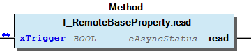 Graphical Interface of I_RemoteBaseProperty.read Example This example demonstrates the use of read(...). Note This method can take a some plc cycles. So you have to call this method cyclic until it returns with DONE, ABORT or ERROR

## I_RemotePropertyAlarmValues_rw.eWriteStatus (PROP)


| Status | Description |
| --- | --- |
| eStatus.INIT | before first call |
| eStatus.BUSY | while call |
| eStatus.DONE | if call successful finished |
| eStatus.ABORT | if call was aborted or an error occurred |

## I_RemotePropertyAlarmValues_rw.write (METH)


| Scope | Name | Type | Comment |
| --- | --- | --- | --- |
| Return | write | eAsyncStatus |  |
| Input | usiIndex | USINT | Index of the alarm |
| udiValue | UDINT | Input value |
| Inout | xTrigger | BOOL |  |

```
VAR
    xTrigger    :   BOOL;
    usiIndex    :   USINT;  // Index of the alarm
    udiValue    :   UDINT;  // Input value
END_VAR

// set xTrigger once to start write property
// xTrigger will be reset by the method if the job is finished
// with or without errors

CASE myProperty.write( usiIndex, udiValue, xTrigger ) OF
    eServiceState.DONE : // OK
            ;// process here your value

    eServiceState.ERROR ,
    eServiceState.ABORT : // Error
            ;// process here your error handling

END_CASE
```

Write this remote property.

The possible return values are

The application have to call this method cyclic and set the inout parameter xTrigger once to start the job. If the job is done (with or without errors) xTrigger will be reset by the method. If the caller reset xTrigger before the job is done the job will be aborted.

Graphical Illustration

Graphical Interface of I_RemotePropertyAlarmValues_rw.write

This example demonstrates the use of write(...).

This method can take a some plc cycles. So you have to call this method cyclic until it returns with DONE, ABORT or ERROR

Interface variables Function Write this remote property. The possible return values are * WagoTypesBACnet.eAsyncStatus.INIT * WagoTypesBACnet.eAsyncStatus.BUSY * WagoTypesBACnet.eAsyncStatus.DONE * WagoTypesBACnet.eAsyncStatus.ABORT * WagoTypesBACnet.eAsyncStatus.ERROR Note The application have to call this method cyclic and set the inout parameter xTrigger once to start the job. If the job is done (with or without errors) xTrigger will be reset by the method. If the caller reset xTrigger before the job is done the job will be aborted. Graphical Illustration 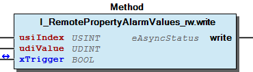 Graphical Interface of I_RemotePropertyAlarmValues_rw.write Example This example demonstrates the use of write(...). Note This method can take a some plc cycles. So you have to call this method cyclic until it returns with DONE, ABORT or ERROR

## I_RemotePropertyAnalogPrioArray_rw.eWriteStatus (PROP)


| Status | Description |
| --- | --- |
| eStatus.INIT | before first call |
| eStatus.BUSY | while call |
| eStatus.DONE | if call successful finished |
| eStatus.ABORT | if call was aborted or an error occurred |

## I_RemotePropertyAnalogPrioArray_rw.write (METH)


| Scope | Name | Type | Initial | Comment |
| --- | --- | --- | --- | --- |
| Return | write | eAsyncStatus |  |  |
| Input | ePriority | eBACnetPriorityLevel | eBACnetPriorityLevel.PRIO_16 | Priority [1..16] |
| rValue | REAL |  | Input value |
| xNULL | BOOL |  | TRUE-> Set to NULL |
| Inout | xTrigger | BOOL |  |  |

```
VAR
    xTrigger    :   BOOL;
    ePriority   :   WagoTypesBACnet.eBACnetPriorityLevel := WagoTypesBACnet.eBACnetPriorityLevel.PRIO_16;   // Priority [1..16]
    rValue      :   REAL := 0.0;    // Input value
    xNULL       :   BOOL := TRUE;   // TRUE-> Set to NULL

END_VAR

// set xTrigger once to start write property
// xTrigger will be reset by the method if the job is finished
// with or without errors

CASE myProperty.write( ePriority, rValue, xNULL, xTrigger ) OF
    eServiceState.DONE : // OK
            ;// process here your value

    eServiceState.ERROR ,
    eServiceState.ABORT : // Error
            ;// process here your error handling

END_CASE
```

Write this remote property.

The possible return values are

The application have to call this method cyclic and set the inout parameter xTrigger once to start the job. If the job is done (with or without errors) xTrigger will be reset by the method. If the caller reset xTrigger before the job is done the job will be aborted.

Graphical Illustration

Graphical Interface of I_RemotePropertyAnalogPrioArray_rw.write

This example demonstrates the use of write(...).

This method can take a some plc cycles. So you have to call this method cyclic until it returns with DONE, ABORT or ERROR

Interface variables Function Write this remote property. The possible return values are * WagoTypesBACnet.eAsyncStatus.INIT * WagoTypesBACnet.eAsyncStatus.BUSY * WagoTypesBACnet.eAsyncStatus.DONE * WagoTypesBACnet.eAsyncStatus.ABORT * WagoTypesBACnet.eAsyncStatus.ERROR Note The application have to call this method cyclic and set the inout parameter xTrigger once to start the job. If the job is done (with or without errors) xTrigger will be reset by the method. If the caller reset xTrigger before the job is done the job will be aborted. Graphical Illustration 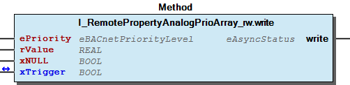 Graphical Interface of I_RemotePropertyAnalogPrioArray_rw.write Example This example demonstrates the use of write(...). Note This method can take a some plc cycles. So you have to call this method cyclic until it returns with DONE, ABORT or ERROR

## I_RemotePropertyBinaryPrioArray_rw.eWriteStatus (PROP)


| Status | Description |
| --- | --- |
| eStatus.INIT | before first call |
| eStatus.BUSY | while call |
| eStatus.DONE | if call successful finished |
| eStatus.ABORT | if call was aborted or an error occurred |

## I_RemotePropertyBinaryPrioArray_rw.write (METH)


| Scope | Name | Type | Initial | Comment |
| --- | --- | --- | --- | --- |
| Return | write | eAsyncStatus |  |  |
| Input | ePriority | eBACnetPriorityLevel | eBACnetPriorityLevel.PRIO_16 | Priority [1..16] |
| XValue | BOOL |  | Input value |
| xNULL | BOOL |  | TRUE-> Set to NULL |
| Inout | xTrigger | BOOL |  |  |

```
VAR
    xTrigger    :   BOOL;
    ePriority   :   WagoTypesBACnet.eBACnetPriorityLevel := WagoTypesBACnet.eBACnetPriorityLevel.PRIO_16;   // Priority [1..16]
    xValue      :   BOOL;           // Input value
    xNULL       :   BOOL := TRUE;   // TRUE-> Set to NULL

END_VAR

// set xTrigger once to start write property
// xTrigger will be reset by the method if the job is finished
// with or without errors

CASE myProperty.write( ePriority, xValue, xNULL, xTrigger ) OF
    eServiceState.DONE : // OK
            ;// process here your value

    eServiceState.ERROR ,
    eServiceState.ABORT : // Error
            ;// process here your error handling

END_CASE
```

Write this remote property.

The possible return values are

The application have to call this method cyclic and set the inout parameter xTrigger once to start the job. If the job is done (with or without errors) xTrigger will be reset by the method. If the caller reset xTrigger before the job is done the job will be aborted.

Graphical Illustration

Graphical Interface of I_RemotePropertyBinaryPrioArray_rw.write

This example demonstrates the use of write(...).

This method can take a some plc cycles. So you have to call this method cyclic until it returns with DONE, ABORT or ERROR

Interface variables Function Write this remote property. The possible return values are * WagoTypesBACnet.eAsyncStatus.INIT * WagoTypesBACnet.eAsyncStatus.BUSY * WagoTypesBACnet.eAsyncStatus.DONE * WagoTypesBACnet.eAsyncStatus.ABORT * WagoTypesBACnet.eAsyncStatus.ERROR Note The application have to call this method cyclic and set the inout parameter xTrigger once to start the job. If the job is done (with or without errors) xTrigger will be reset by the method. If the caller reset xTrigger before the job is done the job will be aborted. Graphical Illustration 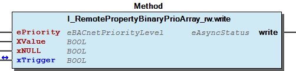 Graphical Interface of I_RemotePropertyBinaryPrioArray_rw.write Example This example demonstrates the use of write(...). Note This method can take a some plc cycles. So you have to call this method cyclic until it returns with DONE, ABORT or ERROR

## I_RemotePropertyBool_rw.eWriteStatus (PROP)


| Status | Description |
| --- | --- |
| eStatus.INIT | before first call |
| eStatus.BUSY | while call |
| eStatus.DONE | if call successful finished |
| eStatus.ABORT | if call was aborted or an error occurred |

## I_RemotePropertyBool_rw.write (METH)


| Scope | Name | Type |
| --- | --- | --- |
| Return | write | eAsyncStatus |
| Input | xValue | BOOL |
| Inout | xTrigger | BOOL |

```
VAR
    xTrigger    :   BOOL;
    xValue      :   BOOL;

END_VAR

// set xTrigger once to start write property
// xTrigger will be reset by the method if the job is finished
// with or without errors

CASE myProperty.write( xValue, xTrigger ) OF
    eServiceState.DONE : // OK
            ;// process here your value

    eServiceState.ERROR ,
    eServiceState.ABORT : // Error
            ;// process here your error handling

END_CASE
```

Write this remote property.

The possible return values are

The application have to call this method cyclic and set the inout parameter xTrigger once to start the job. If the job is done (with or without errors) xTrigger will be reset by the method. If the caller reset xTrigger before the job is done the job will be aborted.

Graphical Illustration

Graphical Interface of I_RemotePropertyBool_rw.write

This example demonstrates the use of write(...).

This method can take a some plc cycles. So you have to call this method cyclic until it returns with DONE, ABORT or ERROR

Interface variables Function Write this remote property. The possible return values are * WagoTypesBACnet.eAsyncStatus.INIT * WagoTypesBACnet.eAsyncStatus.BUSY * WagoTypesBACnet.eAsyncStatus.DONE * WagoTypesBACnet.eAsyncStatus.ABORT * WagoTypesBACnet.eAsyncStatus.ERROR Note The application have to call this method cyclic and set the inout parameter xTrigger once to start the job. If the job is done (with or without errors) xTrigger will be reset by the method. If the caller reset xTrigger before the job is done the job will be aborted. Graphical Illustration 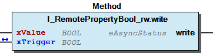 Graphical Interface of I_RemotePropertyBool_rw.write Example This example demonstrates the use of write(...). Note This method can take a some plc cycles. So you have to call this method cyclic until it returns with DONE, ABORT or ERROR

## I_RemotePropertyLimitEnable_rw.write (METH)


| Scope | Name | Type |
| --- | --- | --- |
| Return | write | eAsyncStatus |
| Input | xHighLimitReporting | BOOL |
| xLowLimitReporting | BOOL |
| Inout | xTrigger | BOOL |

```
VAR
    xTrigger            :   BOOL;
    xHighLimitReporting :   BOOL;
    xLowLimitReporting  :   BOOL;

END_VAR

// set xTrigger once to start write property
// xTrigger will be reset by the method if the job is finished
// with or without errors

CASE myProperty.write( xHighLimitReporting, xLowLimitReporting, xTrigger ) OF
    eServiceState.DONE : // OK
            ;// process here your value

    eServiceState.ERROR ,
    eServiceState.ABORT : // Error
            ;// process here your error handling

END_CASE
```

Write this remote property.

The possible return values are

The application have to call this method cyclic and set the inout parameter xTrigger once to start the job. If the job is done (with or without errors) xTrigger will be reset by the method. If the caller reset xTrigger before the job is done the job will be aborted.

Graphical Illustration

Graphical Interface of I_RemotePropertyLimitEnable_rw.write

This example demonstrates the use of write(...).

This method can take a some plc cycles. So you have to call this method cyclic until it returns with DONE, ABORT or ERROR

Interface variables Function Write this remote property. The possible return values are * WagoTypesBACnet.eAsyncStatus.INIT * WagoTypesBACnet.eAsyncStatus.BUSY * WagoTypesBACnet.eAsyncStatus.DONE * WagoTypesBACnet.eAsyncStatus.ABORT * WagoTypesBACnet.eAsyncStatus.ERROR Note The application have to call this method cyclic and set the inout parameter xTrigger once to start the job. If the job is done (with or without errors) xTrigger will be reset by the method. If the caller reset xTrigger before the job is done the job will be aborted. Graphical Illustration 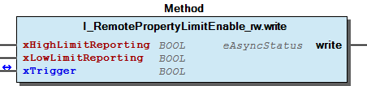 Graphical Interface of I_RemotePropertyLimitEnable_rw.write Example This example demonstrates the use of write(...). Note This method can take a some plc cycles. So you have to call this method cyclic until it returns with DONE, ABORT or ERROR

## I_RemotePropertyMultiStatePrioArray_rw.eWriteStatus (PROP)


| Status | Description |
| --- | --- |
| eStatus.INIT | before first call |
| eStatus.BUSY | while call |
| eStatus.DONE | if call successful finished |
| eStatus.ABORT | if call was aborted or an error occurred |

## I_RemotePropertyMultiStatePrioArray_rw.write (METH)


| Scope | Name | Type | Initial | Comment |
| --- | --- | --- | --- | --- |
| Return | write | eAsyncStatus |  |  |
| Input | ePriority | eBACnetPriorityLevel | eBACnetPriorityLevel.PRIO_16 | Priority [1..16] |
| udiValue | UDINT |  | Input value |
| xNULL | BOOL |  | TRUE-> Set to NULL |
| Inout | xTrigger | BOOL |  |  |

```
VAR
    xTrigger    :   BOOL;
    ePriority   :   WagoTypesBACnet.eBACnetPriorityLevel := WagoTypesBACnet.eBACnetPriorityLevel.PRIO_16;   // Priority [1..16]
    udiValue    :   UDINT;          // Input value
    xNULL       :   BOOL := TRUE;   // TRUE-> Set to NULL

END_VAR

// set xTrigger once to start write property
// xTrigger will be reset by the method if the job is finished
// with or without errors

CASE myProperty.write( ePriority, udiValue, xNULL, xTrigger ) OF
    eServiceState.DONE : // OK
            ;// process here your value

    eServiceState.ERROR ,
    eServiceState.ABORT : // Error
            ;// process here your error handling

END_CASE
```

Write this remote property.

The possible return values are

The application have to call this method cyclic and set the inout parameter xTrigger once to start the job. If the job is done (with or without errors) xTrigger will be reset by the method. If the caller reset xTrigger before the job is done the job will be aborted.

Graphical Illustration

Graphical Interface of I_RemotePropertyMultiStatePrioArray_rw.write

This example demonstrates the use of write(...).

This method can take a some plc cycles. So you have to call this method cyclic until it returns with DONE, ABORT or ERROR

Interface variables Function Write this remote property. The possible return values are * WagoTypesBACnet.eAsyncStatus.INIT * WagoTypesBACnet.eAsyncStatus.BUSY * WagoTypesBACnet.eAsyncStatus.DONE * WagoTypesBACnet.eAsyncStatus.ABORT * WagoTypesBACnet.eAsyncStatus.ERROR Note The application have to call this method cyclic and set the inout parameter xTrigger once to start the job. If the job is done (with or without errors) xTrigger will be reset by the method. If the caller reset xTrigger before the job is done the job will be aborted. Graphical Illustration 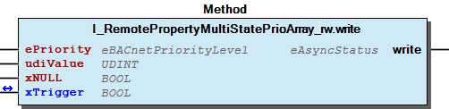 Graphical Interface of I_RemotePropertyMultiStatePrioArray_rw.write Example This example demonstrates the use of write(...). Note This method can take a some plc cycles. So you have to call this method cyclic until it returns with DONE, ABORT or ERROR

## I_RemotePropertyReal_rw.eWriteStatus (PROP)


| Status | Description |
| --- | --- |
| eStatus.INIT | before first call |
| eStatus.BUSY | while call |
| eStatus.DONE | if call successful finished |
| eStatus.ABORT | if call was aborted or an error occurred |

## I_RemotePropertyReal_rw.write (METH)


| Scope | Name | Type |
| --- | --- | --- |
| Return | write | eAsyncStatus |
| Input | rValue | REAL |
| Inout | xTrigger | BOOL |

```
VAR
    xTrigger    :   BOOL;
    rValue      :   REAL;

END_VAR

// set xTrigger once to start write property
// xTrigger will be reset by the method if the job is finished
// with or without errors

CASE myProperty.write( rValue, xTrigger ) OF
    eServiceState.DONE : // OK
            ;// process here your value

    eServiceState.ERROR ,
    eServiceState.ABORT : // Error
            ;// process here your error handling

END_CASE
```

Write this remote property.

The possible return values are

The application have to call this method cyclic and set the inout parameter xTrigger once to start the job. If the job is done (with or without errors) xTrigger will be reset by the method. If the caller reset xTrigger before the job is done the job will be aborted.

Graphical Illustration

Graphical Interface of I_RemotePropertyReal_rw.write

This example demonstrates the use of write(...).

This method can take a some plc cycles. So you have to call this method cyclic until it returns with DONE, ABORT or ERROR

Interface variables Function Write this remote property. The possible return values are * WagoTypesBACnet.eAsyncStatus.INIT * WagoTypesBACnet.eAsyncStatus.BUSY * WagoTypesBACnet.eAsyncStatus.DONE * WagoTypesBACnet.eAsyncStatus.ABORT * WagoTypesBACnet.eAsyncStatus.ERROR Note The application have to call this method cyclic and set the inout parameter xTrigger once to start the job. If the job is done (with or without errors) xTrigger will be reset by the method. If the caller reset xTrigger before the job is done the job will be aborted. Graphical Illustration  Graphical Interface of I_RemotePropertyReal_rw.write Example This example demonstrates the use of write(...). Note This method can take a some plc cycles. So you have to call this method cyclic until it returns with DONE, ABORT or ERROR

## I_RemotePropertyReliability_rw.eWriteStatus (PROP)


| Status | Description |
| --- | --- |
| eStatus.INIT | before first call |
| eStatus.BUSY | while call |
| eStatus.DONE | if call successful finished |
| eStatus.ABORT | if call was aborted or an error occurred |

## I_RemotePropertyReliability_rw.write (METH)


| Scope | Name | Type |
| --- | --- | --- |
| Return | write | eAsyncStatus |
| Input | eReliability | eBACnetReliabilityType |
| Inout | xTrigger | BOOL |

```
VAR
    xTrigger     :  BOOL;
    eReliability : WagoTypesBACnet.eBACnetReliabilityType;

END_VAR

// set xTrigger once to start write property
// xTrigger will be reset by the method if the job is finished
// with or without errors

CASE myProperty.write( eReliability, xTrigger ) OF
    eServiceState.DONE : // OK
            ;// process here your value

    eServiceState.ERROR ,
    eServiceState.ABORT : // Error
            ;// process here your error handling

END_CASE
```

Write this remote property.

The possible return values are

The application have to call this method cyclic and set the inout parameter xTrigger once to start the job. If the job is done (with or without errors) xTrigger will be reset by the method. If the caller reset xTrigger before the job is done the job will be aborted.

Graphical Illustration

Graphical Interface of I_RemotePropertyReliability_rw.write

This example demonstrates the use of write(...).

This method can take a some plc cycles. So you have to call this method cyclic until it returns with DONE, ABORT or ERROR

Interface variables Function Write this remote property. The possible return values are * WagoTypesBACnet.eAsyncStatus.INIT * WagoTypesBACnet.eAsyncStatus.BUSY * WagoTypesBACnet.eAsyncStatus.DONE * WagoTypesBACnet.eAsyncStatus.ABORT * WagoTypesBACnet.eAsyncStatus.ERROR Note The application have to call this method cyclic and set the inout parameter xTrigger once to start the job. If the job is done (with or without errors) xTrigger will be reset by the method. If the caller reset xTrigger before the job is done the job will be aborted. Graphical Illustration 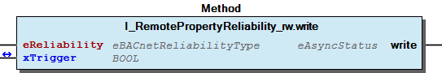 Graphical Interface of I_RemotePropertyReliability_rw.write Example This example demonstrates the use of write(...). Note This method can take a some plc cycles. So you have to call this method cyclic until it returns with DONE, ABORT or ERROR

## I_RemotePropertyUnits_rw.eWriteStatus (PROP)


| Status | Description |
| --- | --- |
| eStatus.INIT | before first call |
| eStatus.BUSY | while call |
| eStatus.DONE | if call successful finished |
| eStatus.ABORT | if call was aborted or an error occurred |

## I_RemotePropertyUnits_rw.write (METH)


| Scope | Name | Type |
| --- | --- | --- |
| Return | write | eAsyncStatus |
| Input | eUnits | eBACnetUnits |
| Inout | xTrigger | BOOL |

```
VAR
    xTrigger    :   BOOL;
    eUnits      :   WagoTypesBACnet.eBACnetUnits;

END_VAR

// set xTrigger once to start write property
// xTrigger will be reset by the method if the job is finished
// with or without errors

CASE myProperty.write( eUnits, xTrigger ) OF
    eServiceState.DONE : // OK
            ;// process here your value

    eServiceState.ERROR ,
    eServiceState.ABORT : // Error
            ;// process here your error handling

END_CASE
```

Write this remote property.

The possible return values are

The application have to call this method cyclic and set the inout parameter xTrigger once to start the job. If the job is done (with or without errors) xTrigger will be reset by the method. If the caller reset xTrigger before the job is done the job will be aborted.

Graphical Illustration

Graphical Interface of I_RemotePropertyUnits_rw.write

This example demonstrates the use of write(...).

This method can take a some plc cycles. So you have to call this method cyclic until it returns with DONE, ABORT or ERROR

Interface variables Function Write this remote property. The possible return values are * WagoTypesBACnet.eAsyncStatus.INIT * WagoTypesBACnet.eAsyncStatus.BUSY * WagoTypesBACnet.eAsyncStatus.DONE * WagoTypesBACnet.eAsyncStatus.ABORT * WagoTypesBACnet.eAsyncStatus.ERROR Note The application have to call this method cyclic and set the inout parameter xTrigger once to start the job. If the job is done (with or without errors) xTrigger will be reset by the method. If the caller reset xTrigger before the job is done the job will be aborted. Graphical Illustration 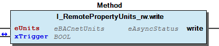 Graphical Interface of I_RemotePropertyUnits_rw.write Example This example demonstrates the use of write(...). Note This method can take a some plc cycles. So you have to call this method cyclic until it returns with DONE, ABORT or ERROR

## I_RemotePropertyUnsigned_rw.eWriteStatus (PROP)


| Status | Description |
| --- | --- |
| eStatus.INIT | before first call |
| eStatus.BUSY | while call |
| eStatus.DONE | if call successful finished |
| eStatus.ABORT | if call was aborted or an error occurred |

## I_RemotePropertyUnsigned_rw.write (METH)


| Scope | Name | Type |
| --- | --- | --- |
| Return | write | eAsyncStatus |
| Input | udiValue | UDINT |
| Inout | xTrigger | BOOL |

```
VAR
    xTrigger    :   BOOL;
    udiValue    :   UDINT;

END_VAR

// set xTrigger once to start write property
// xTrigger will be reset by the method if the job is finished
// with or without errors

CASE myProperty.write( udiValue, xTrigger ) OF
    eServiceState.DONE : // OK
            ;// process here your value

    eServiceState.ERROR ,
    eServiceState.ABORT : // Error
            ;// process here your error handling

END_CASE
```

Write this remote property.

The possible return values are

The application have to call this method cyclic and set the inout parameter xTrigger once to start the job. If the job is done (with or without errors) xTrigger will be reset by the method. If the caller reset xTrigger before the job is done the job will be aborted.

Graphical Illustration

Graphical Interface of I_RemotePropertyUnsigned_rw.write

This example demonstrates the use of write(...).

This method can take a some plc cycles. So you have to call this method cyclic until it returns with DONE, ABORT or ERROR

Interface variables Function Write this remote property. The possible return values are * WagoTypesBACnet.eAsyncStatus.INIT * WagoTypesBACnet.eAsyncStatus.BUSY * WagoTypesBACnet.eAsyncStatus.DONE * WagoTypesBACnet.eAsyncStatus.ABORT * WagoTypesBACnet.eAsyncStatus.ERROR Note The application have to call this method cyclic and set the inout parameter xTrigger once to start the job. If the job is done (with or without errors) xTrigger will be reset by the method. If the caller reset xTrigger before the job is done the job will be aborted. Graphical Illustration 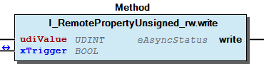 Graphical Interface of I_RemotePropertyUnsigned_rw.write Example This example demonstrates the use of write(...). Note This method can take a some plc cycles. So you have to call this method cyclic until it returns with DONE, ABORT or ERROR

## ReadCallback


- eBACnetFwCallBack (ENUM) - typBACnetCallbackProperty (STRUCT) - typBACnetReadCallback (STRUCT)

## Write Priority Array


- typBACnetWritePrioPresentValue (STRUCT)

## typBACnetReadCallback (STRUCT)


| Name | Type | Comment |
| --- | --- | --- |
| eTypeOfFwCallBack | eBACnetFwCallBack | type of FW Callback |
| utObjectIdentifier | typBACnetObjectIdentifier |  |
| ptNextProperty | POINTER TO typBACnetCallbackProperty |  |
| ptNextObject | POINTER TO typBACnetReadCallback |  |

## typBACnetWritePrioPresentValue (STRUCT)


| Name | Type | Initial | Comment |
| --- | --- | --- | --- |
| utValue | typBACnetBaseValue |  | value |
| udiPriority | UDINT | 16 |  |
| xNull | BOOL |  |  |

## typEventMessageTextsConfigItem (ALIAS) ¶


## typEventMessageTextsItem (ALIAS) ¶


### Interfaces


## I_BACnetAckRequired (ITF)


- I_BACnetAckRequired.xToFault (PROP) - I_BACnetAckRequired.xToNormal (PROP) - I_BACnetAckRequired.xToOffNormal (PROP)

## I_BACnetAckedTransition (ITF)


- I_BACnetAckedTransition.xToFault (PROP) - I_BACnetAckedTransition.xToNormal (PROP) - I_BACnetAckedTransition.xToOffNormal (PROP)

## I_BACnetActionText (ITF)


- I_BACnetActionText.aActionText (PROP) - I_BACnetActionText.uiActionTextCount (PROP)

## I_BACnetAnalog (ITF)


Group interface for analog- Input / Output / Value

Group interface for analog- Input / Output / Value - I_BACnetAnalog.rPresentValue (PROP)

## I_BACnetAnalogInput_large (ITF)


- I_BACnetAnalogInput_large.IAckedTransition (PROP) - I_BACnetAnalogInput_large.IEventEnable (PROP) - I_BACnetAnalogInput_large.IEventMessageTexts (PROP) - I_BACnetAnalogInput_large.IEventMessageTextsConfig (PROP) - I_BACnetAnalogInput_large.IEventTimeStamp (PROP) - I_BACnetAnalogInput_large.ILimitEnable (PROP) - I_BACnetAnalogInput_large.eNotifyType (PROP) - I_BACnetAnalogInput_large.rDeadBand (PROP) - I_BACnetAnalogInput_large.rHighLimit (PROP) - I_BACnetAnalogInput_large.rLowLimit (PROP) - I_BACnetAnalogInput_large.rMaxPresValue (PROP) - I_BACnetAnalogInput_large.rMinPresValue (PROP) - I_BACnetAnalogInput_large.udiNotificationClass (PROP) - I_BACnetAnalogInput_large.udiTimeDelay (PROP) - I_BACnetAnalogInput_large.udiTimeDelayNormal (PROP) - I_BACnetAnalogInput_large.udiUpdateInterval (PROP) - I_BACnetAnalogInput_large.xEventAlgorithmInhibit (PROP) - I_BACnetAnalogInput_large.xEventDetectionEnable (PROP)

## I_BACnetAnalogInput_medium (ITF)


- I_BACnetAnalogInput_medium.eEventState (PROP) - I_BACnetAnalogInput_medium.eReliability (PROP) - I_BACnetAnalogInput_medium.eUnits (PROP) - I_BACnetAnalogInput_medium.rCoV_Increment (PROP) - I_BACnetAnalogInput_medium.rResolution (PROP) - I_BACnetAnalogInput_medium.sDescription (PROP) - I_BACnetAnalogInput_medium.sDeviceType (PROP) - I_BACnetAnalogInput_medium.xReliabilityEvaluationInhibit (PROP)

## I_BACnetAnalogInput_small (ITF)


- I_BACnetAnalogInput_small.IUnitConversion (PROP) - I_BACnetAnalogInput_small.rIN (PROP) - I_BACnetAnalogInput_small.rPresentValue (PROP)

## I_BACnetAnalogOutput_large (ITF)


- I_BACnetAnalogOutput_large.IAckedTransition (PROP) - I_BACnetAnalogOutput_large.IEventEnable (PROP) - I_BACnetAnalogOutput_large.IEventMessageTexts (PROP) - I_BACnetAnalogOutput_large.IEventMessageTextsConfig (PROP) - I_BACnetAnalogOutput_large.IEventTimeStamp (PROP) - I_BACnetAnalogOutput_large.ILimitEnable (PROP) - I_BACnetAnalogOutput_large.eNotifyType (PROP) - I_BACnetAnalogOutput_large.rDeadBand (PROP) - I_BACnetAnalogOutput_large.rHighLimit (PROP) - I_BACnetAnalogOutput_large.rLowLimit (PROP) - I_BACnetAnalogOutput_large.rMaxPresValue (PROP) - I_BACnetAnalogOutput_large.rMinPresValue (PROP) - I_BACnetAnalogOutput_large.udiNotificationClass (PROP) - I_BACnetAnalogOutput_large.udiTimeDelay (PROP) - I_BACnetAnalogOutput_large.udiTimeDelayNormal (PROP) - I_BACnetAnalogOutput_large.xEventAlgorithmInhibit (PROP) - I_BACnetAnalogOutput_large.xEventDetectionEnable (PROP)

## I_BACnetAnalogOutput_medium (ITF)


- I_BACnetAnalogOutput_medium.IPriorityArray (PROP) - I_BACnetAnalogOutput_medium.eEventState (PROP) - I_BACnetAnalogOutput_medium.eReliability (PROP) - I_BACnetAnalogOutput_medium.eUnits (PROP) - I_BACnetAnalogOutput_medium.rCoV_Increment (PROP) - I_BACnetAnalogOutput_medium.rRelinquishDefault (PROP) - I_BACnetAnalogOutput_medium.rResolution (PROP) - I_BACnetAnalogOutput_medium.sDescription (PROP) - I_BACnetAnalogOutput_medium.sDeviceType (PROP) - I_BACnetAnalogOutput_medium.xReliabilityEvaluationInhibit (PROP)

## I_BACnetAnalogOutput_small (ITF)


- I_BACnetAnalogOutput_small.IOUT (PROP) - I_BACnetAnalogOutput_small.IOutOfServiceValue (PROP) - I_BACnetAnalogOutput_small.IUnitConversion (PROP) - I_BACnetAnalogOutput_small.rPresentValue (PROP) - I_BACnetAnalogOutput_small.xOverridden (PROP)

## I_BACnetAnalogValue_large (ITF)


- I_BACnetAnalogValue_large.IAckedTransition (PROP) - I_BACnetAnalogValue_large.IEventEnable (PROP) - I_BACnetAnalogValue_large.IEventMessageTexts (PROP) - I_BACnetAnalogValue_large.IEventMessageTextsConfig (PROP) - I_BACnetAnalogValue_large.IEventTimeStamp (PROP) - I_BACnetAnalogValue_large.ILimitEnable (PROP) - I_BACnetAnalogValue_large.eNotifyType (PROP) - I_BACnetAnalogValue_large.rDeadBand (PROP) - I_BACnetAnalogValue_large.rHighLimit (PROP) - I_BACnetAnalogValue_large.rLowLimit (PROP) - I_BACnetAnalogValue_large.rMaxPresValue (PROP) - I_BACnetAnalogValue_large.rMinPresValue (PROP) - I_BACnetAnalogValue_large.udiNotificationClass (PROP) - I_BACnetAnalogValue_large.udiTimeDelay (PROP) - I_BACnetAnalogValue_large.udiTimeDelayNormal (PROP) - I_BACnetAnalogValue_large.xEventAlgorithmInhibit (PROP) - I_BACnetAnalogValue_large.xEventDetectionEnable (PROP)

## I_BACnetAnalogValue_medium (ITF)


- I_BACnetAnalogValue_medium.IPriorityArray (PROP) - I_BACnetAnalogValue_medium.eEventState (PROP) - I_BACnetAnalogValue_medium.eReliability (PROP) - I_BACnetAnalogValue_medium.eUnits (PROP) - I_BACnetAnalogValue_medium.rCoV_Increment (PROP) - I_BACnetAnalogValue_medium.rRelinquishDefault (PROP) - I_BACnetAnalogValue_medium.rResolution (PROP) - I_BACnetAnalogValue_medium.sDescription (PROP) - I_BACnetAnalogValue_medium.xReliabilityEvaluationInhibit (PROP)

## I_BACnetAnalogValue_small (ITF)


- I_BACnetAnalogValue_small.rPresentValue (PROP)

## I_BACnetBaseObject (ITF)


This interface is implemented by all BACnet objects.

This interface is implemented by all BACnet objects. - I_BACnetBaseObject.Create (METH) - I_BACnetBaseObject.Delete (METH) - I_BACnetBaseObject.IObjectIdentifier (PROP) - I_BACnetBaseObject.Read (METH) - I_BACnetBaseObject.Write (METH) - I_BACnetBaseObject.eObjectType (PROP) - I_BACnetBaseObject.getPropertyGroup (METH) - I_BACnetBaseObject.oStatus (PROP) - I_BACnetBaseObject.sObjectName (PROP) - I_BACnetBaseObject.setPropertyGroup (METH) - I_BACnetBaseObject.xIsCreated (PROP) - I_BACnetBaseObject.xIsDynamicCreate (PROP)

## I_BACnetBaseObject_Info (ITF)


This interface is implemented by all BACnet objects since WagoSysBACnet 1.0.6.4

This interface is implemented by all BACnet objects since WagoSysBACnet 1.0.6.4 - I_BACnetBaseObject_Info.xIsCovActivated (PROP) - I_BACnetBaseObject_Info.xIsRegisterForTask (PROP)

## I_BACnetBinary (ITF)


- I_BACnetBinary.xPresentValue (PROP)

## I_BACnetBinaryInput_large (ITF)


- I_BACnetBinaryInput_large.IAckedTransition (PROP) - I_BACnetBinaryInput_large.IEventEnable (PROP) - I_BACnetBinaryInput_large.IEventMessageTexts (PROP) - I_BACnetBinaryInput_large.IEventMessageTextsConfig (PROP) - I_BACnetBinaryInput_large.IEventTimeStamp (PROP) - I_BACnetBinaryInput_large.eNotifyType (PROP) - I_BACnetBinaryInput_large.udiNotificationClass (PROP) - I_BACnetBinaryInput_large.udiTimeDelay (PROP) - I_BACnetBinaryInput_large.udiTimeDelayNormal (PROP) - I_BACnetBinaryInput_large.xAlarmValue (PROP) - I_BACnetBinaryInput_large.xEventAlgorithmInhibit (PROP) - I_BACnetBinaryInput_large.xEventDetectionEnable (PROP) - I_BACnetBinaryInput_large.xReliabilityEvaluationInhibit (PROP)

## I_BACnetBinaryInput_medium (ITF)


- I_BACnetBinaryInput_medium.dtChangeOfState_Time (PROP) - I_BACnetBinaryInput_medium.dtTimeOfActiveTimeReset (PROP) - I_BACnetBinaryInput_medium.dtTimeOfStateCountReset (PROP) - I_BACnetBinaryInput_medium.eEventState (PROP) - I_BACnetBinaryInput_medium.eReliability (PROP) - I_BACnetBinaryInput_medium.sActiveText (PROP) - I_BACnetBinaryInput_medium.sDescription (PROP) - I_BACnetBinaryInput_medium.sDeviceType (PROP) - I_BACnetBinaryInput_medium.sInactiveText (PROP) - I_BACnetBinaryInput_medium.udiChangeOfState_Count (PROP) - I_BACnetBinaryInput_medium.udiElapsedActiveTime (PROP)

## I_BACnetBinaryInput_small (ITF)


- I_BACnetBinaryInput_small.xIN (PROP) - I_BACnetBinaryInput_small.xPolarity (PROP) - I_BACnetBinaryInput_small.xPresentValue (PROP)

## I_BACnetBinaryOutput_large (ITF)


- I_BACnetBinaryOutput_large.IAckedTransition (PROP) - I_BACnetBinaryOutput_large.IEventEnable (PROP) - I_BACnetBinaryOutput_large.IEventMessageTexts (PROP) - I_BACnetBinaryOutput_large.IEventMessageTextsConfig (PROP) - I_BACnetBinaryOutput_large.IEventTimeStamp (PROP) - I_BACnetBinaryOutput_large.eNotifyType (PROP) - I_BACnetBinaryOutput_large.udiNotificationClass (PROP) - I_BACnetBinaryOutput_large.udiTimeDelay (PROP) - I_BACnetBinaryOutput_large.udiTimeDelayNormal (PROP) - I_BACnetBinaryOutput_large.xEventAlgorithmInhibit (PROP) - I_BACnetBinaryOutput_large.xEventDetectionEnable (PROP) - I_BACnetBinaryOutput_large.xReliabilityEvaluationInhibit (PROP)

## I_BACnetBinaryOutput_medium (ITF)


- I_BACnetBinaryOutput_medium.IPriorityArray (PROP) - I_BACnetBinaryOutput_medium.dtChangeOfState_Time (PROP) - I_BACnetBinaryOutput_medium.dtTimeOfActiveTimeReset (PROP) - I_BACnetBinaryOutput_medium.dtTimeOfStateCountReset (PROP) - I_BACnetBinaryOutput_medium.eEventState (PROP) - I_BACnetBinaryOutput_medium.eReliability (PROP) - I_BACnetBinaryOutput_medium.sActiveText (PROP) - I_BACnetBinaryOutput_medium.sDescription (PROP) - I_BACnetBinaryOutput_medium.sDeviceType (PROP) - I_BACnetBinaryOutput_medium.sInactiveText (PROP) - I_BACnetBinaryOutput_medium.udiChangeOfState_Count (PROP) - I_BACnetBinaryOutput_medium.udiElapsedActiveTime (PROP) - I_BACnetBinaryOutput_medium.udiMinimumOffTime (PROP) - I_BACnetBinaryOutput_medium.udiMinimumOnTime (PROP) - I_BACnetBinaryOutput_medium.xFeedbackValue (PROP) - I_BACnetBinaryOutput_medium.xRelinquishDefault (PROP)

## I_BACnetBinaryOutput_small (ITF)


- I_BACnetBinaryOutput_small.IOutOfServiceValue (PROP) - I_BACnetBinaryOutput_small.xOUT (PROP) - I_BACnetBinaryOutput_small.xOverridden (PROP) - I_BACnetBinaryOutput_small.xPolarity (PROP) - I_BACnetBinaryOutput_small.xPresentValue (PROP)

## I_BACnetBinaryValue_large (ITF)


- I_BACnetBinaryValue_large.IAckedTransition (PROP) - I_BACnetBinaryValue_large.IEventEnable (PROP) - I_BACnetBinaryValue_large.IEventMessageTexts (PROP) - I_BACnetBinaryValue_large.IEventMessageTextsConfig (PROP) - I_BACnetBinaryValue_large.IEventTimeStamp (PROP) - I_BACnetBinaryValue_large.dtTimeOfActiveTimeReset (PROP) - I_BACnetBinaryValue_large.eNotifyType (PROP) - I_BACnetBinaryValue_large.udiNotificationClass (PROP) - I_BACnetBinaryValue_large.udiTimeDelay (PROP) - I_BACnetBinaryValue_large.udiTimeDelayNormal (PROP) - I_BACnetBinaryValue_large.xAlarmValue (PROP) - I_BACnetBinaryValue_large.xEventAlgorithmInhibit (PROP) - I_BACnetBinaryValue_large.xEventDetectionEnable (PROP) - I_BACnetBinaryValue_large.xReliabilityEvaluationInhibit (PROP)

## I_BACnetBinaryValue_medium (ITF)


- I_BACnetBinaryValue_medium.IPriorityArray (PROP) - I_BACnetBinaryValue_medium.dtChangeOfState_Time (PROP) - I_BACnetBinaryValue_medium.dtTimeOfStateCountReset (PROP) - I_BACnetBinaryValue_medium.eEventState (PROP) - I_BACnetBinaryValue_medium.eReliability (PROP) - I_BACnetBinaryValue_medium.sActiveText (PROP) - I_BACnetBinaryValue_medium.sDescription (PROP) - I_BACnetBinaryValue_medium.sInactiveText (PROP) - I_BACnetBinaryValue_medium.udiChangeOfState_Count (PROP) - I_BACnetBinaryValue_medium.udiElapsedActiveTime (PROP) - I_BACnetBinaryValue_medium.udiMinimumOffTime (PROP) - I_BACnetBinaryValue_medium.udiMinimumOnTime (PROP) - I_BACnetBinaryValue_medium.xRelinquishDefault (PROP)

## I_BACnetBinaryValue_small (ITF)


- I_BACnetBinaryValue_small.xPresentValue (PROP)

## I_BACnetBitStringAlarmValues (ITF)


- I_BACnetBitStringAlarmValues.aAlarmValues (PROP) - I_BACnetBitStringAlarmValues.usiAlarmValueCount (PROP)

## I_BACnetBitText (ITF)


- I_BACnetBitText.aBitText (PROP) - I_BACnetBitText.uiBitTextCount (PROP)

## I_BACnetBitstringValue_large (ITF)


- I_BACnetBitstringValue_large.IAckedTransition (PROP) - I_BACnetBitstringValue_large.IAlarmValues (PROP) - I_BACnetBitstringValue_large.IBitMask (PROP) - I_BACnetBitstringValue_large.IBitText (PROP) - I_BACnetBitstringValue_large.IEventEnable (PROP) - I_BACnetBitstringValue_large.IEventMessageTexts (PROP) - I_BACnetBitstringValue_large.IEventMessageTextsConfig (PROP) - I_BACnetBitstringValue_large.IEventTimeStamp (PROP) - I_BACnetBitstringValue_large.eNotifyType (PROP) - I_BACnetBitstringValue_large.udiNotificationClass (PROP) - I_BACnetBitstringValue_large.udiTimeDelay (PROP) - I_BACnetBitstringValue_large.udiTimeDelayNormal (PROP) - I_BACnetBitstringValue_large.xEventAlgorithmInhibit (PROP) - I_BACnetBitstringValue_large.xEventDetectionEnable (PROP)

## I_BACnetBitstringValue_medium (ITF)


- I_BACnetBitstringValue_medium.IPriorityArray (PROP) - I_BACnetBitstringValue_medium.IRelinquishDefault (PROP) - I_BACnetBitstringValue_medium.eEventState (PROP) - I_BACnetBitstringValue_medium.eReliability (PROP) - I_BACnetBitstringValue_medium.sDescription (PROP) - I_BACnetBitstringValue_medium.xReliabilityEvaluationInhibit (PROP)

## I_BACnetBitstringValue_small (ITF)


- I_BACnetBitstringValue_small.IPresentValue (PROP)

## I_BACnetCalendar_large (ITF)


- I_BACnetCalendar_large.IDateList (PROP) - I_BACnetCalendar_large.sDescription (PROP) - I_BACnetCalendar_large.udiTimeBeforeOperation (PROP)

## I_BACnetCalendar_small (ITF)


- I_BACnetCalendar_small.xPresentValue (PROP)

## I_BACnetClientCovIncrement (ITF)


- I_BACnetClientCovIncrement.eDataType (PROP) - I_BACnetClientCovIncrement.rValue (PROP)

## I_BACnetCommand (ITF)


- I_BACnetCommand.IDeviceIdentifier (PROP) - I_BACnetCommand.IObjectIdentifier (PROP) - I_BACnetCommand.IValue (PROP) - I_BACnetCommand.ePropertyId (PROP) - I_BACnetCommand.editCommand (METH) - I_BACnetCommand.udiArrayIndex (PROP) - I_BACnetCommand.udiPostDelay (PROP) - I_BACnetCommand.udiPriority (PROP) - I_BACnetCommand.xQuitOnFailure (PROP) - I_BACnetCommand.xWriteSuccessful (PROP)

## I_BACnetCommand_large (ITF)


- I_BACnetCommand_large.IAction (PROP) - I_BACnetCommand_large.IActionText (PROP)

## I_BACnetCommand_medium (ITF)


- I_BACnetCommand_medium.sDescription (PROP) - I_BACnetCommand_medium.xAllWritesSuccessful (PROP) - I_BACnetCommand_medium.xInProcess (PROP)

## I_BACnetCommand_small (ITF)


- I_BACnetCommand_small.udiPresentValue (PROP)

## I_BACnetDailySchedule (ITF)


- I_BACnetDailySchedule.editDailyScheduleItem (METH) - I_BACnetDailySchedule.todTime (PROP)

## I_BACnetDailyScheduleList (ITF)


- I_BACnetDailyScheduleList.aDailySchedules (PROP) - I_BACnetDailyScheduleList.addDailyScheduleBitString (METH) - I_BACnetDailyScheduleList.addDailyScheduleBool (METH) - I_BACnetDailyScheduleList.addDailyScheduleCharString (METH) - I_BACnetDailyScheduleList.addDailyScheduleDouble (METH) - I_BACnetDailyScheduleList.addDailyScheduleEnumerated (METH) - I_BACnetDailyScheduleList.addDailyScheduleNull (METH) - I_BACnetDailyScheduleList.addDailyScheduleReal (METH) - I_BACnetDailyScheduleList.addDailyScheduleSigned (METH) - I_BACnetDailyScheduleList.addDailyScheduleUnsigned (METH) - I_BACnetDailyScheduleList.deleteDailyScheduleItem (METH) - I_BACnetDailyScheduleList.uiDailySchedulesCount (PROP)

## I_BACnetDataAdmin (ITF)


- I_BACnetDataAdmin.onNewObject (METH)

## I_BACnetDataTypeAny (ITF)


- I_BACnetDataTypeAny.eDataType (PROP)

## I_BACnetDataTypeAnyBase (ITF)


- I_BACnetDataTypeAnyBase.IBIT_STRING (PROP) - I_BACnetDataTypeAnyBase.IBOOL (PROP) - I_BACnetDataTypeAnyBase.ICHAR_STRING (PROP) - I_BACnetDataTypeAnyBase.IDOUBLE (PROP) - I_BACnetDataTypeAnyBase.IENUMERATED (PROP) - I_BACnetDataTypeAnyBase.IREAL (PROP) - I_BACnetDataTypeAnyBase.ISIGNED (PROP) - I_BACnetDataTypeAnyBase.IUNSIGNED (PROP) - I_BACnetDataTypeAnyBase.eDataType (PROP)

## I_BACnetDataTypeAnyBase_ro (ITF)


- I_BACnetDataTypeAnyBase_ro.IBIT_STRING (PROP) - I_BACnetDataTypeAnyBase_ro.IBOOL (PROP) - I_BACnetDataTypeAnyBase_ro.ICHAR_STRING (PROP) - I_BACnetDataTypeAnyBase_ro.IDOUBLE (PROP) - I_BACnetDataTypeAnyBase_ro.IENUMERATED (PROP) - I_BACnetDataTypeAnyBase_ro.IREAL (PROP) - I_BACnetDataTypeAnyBase_ro.ISIGNED (PROP) - I_BACnetDataTypeAnyBase_ro.IUNSIGNED (PROP) - I_BACnetDataTypeAnyBase_ro.eDataType (PROP)

## I_BACnetDate (ITF)


- I_BACnetDate.eDayOfMonth (PROP) - I_BACnetDate.eDayOfWeek (PROP) - I_BACnetDate.eMonth (PROP) - I_BACnetDate.uiYear (PROP)

## I_BACnetDateAndTime (ITF)


- I_BACnetDateAndTime.dtDateTime (PROP) - I_BACnetDateAndTime.xUnspecified (PROP)

## I_BACnetDateList (ITF)


- I_BACnetDateList.aItems (PROP) - I_BACnetDateList.addDate (METH) - I_BACnetDateList.addDateRange (METH) - I_BACnetDateList.addWeekAndDay (METH) - I_BACnetDateList.deleteDateListItem (METH) - I_BACnetDateList.usiItemCount (PROP)

## I_BACnetDateListItem (ITF)


- I_BACnetDateListItem.IDate (PROP) - I_BACnetDateListItem.IDateRange (PROP) - I_BACnetDateListItem.IWeekAndDay (PROP) - I_BACnetDateListItem.eEntryType (PROP) - I_BACnetDateListItem.editDateListItem (METH)

## I_BACnetDateListItem_rw (ITF)


- I_BACnetDateListItem_rw.IDate (PROP) - I_BACnetDateListItem_rw.IDateRange (PROP) - I_BACnetDateListItem_rw.IWeekAndDay (PROP) - I_BACnetDateListItem_rw.eEntryType (PROP)

## I_BACnetDateRange (ITF)


- I_BACnetDateRange.IEndDate (PROP) - I_BACnetDateRange.IStartDate (PROP)

## I_BACnetDateRange_rw (ITF)


Date Range from start date to end date

Date Range from start date to end date - I_BACnetDateRange_rw.IEndDate (PROP) - I_BACnetDateRange_rw.IStartDate (PROP) - I_BACnetDateRange_rw.SetDateRange (METH)

## I_BACnetDate_rw (ITF)


- I_BACnetDate_rw.SetDate (METH) - I_BACnetDate_rw.eDayOfMonth (PROP) - I_BACnetDate_rw.eDayOfWeek (PROP) - I_BACnetDate_rw.eMonth (PROP) - I_BACnetDate_rw.uiYear (PROP)

## I_BACnetDevice_small (ITF)


- I_BACnetDevice_small.ILocalDate (PROP) - I_BACnetDevice_small.dtTimeOfDeviceRestart (PROP) - I_BACnetDevice_small.eSystemStatus (PROP) - I_BACnetDevice_small.sDescription (PROP) - I_BACnetDevice_small.sFirmwareRevision (PROP) - I_BACnetDevice_small.sLocation (PROP) - I_BACnetDevice_small.sModelName (PROP) - I_BACnetDevice_small.todLocalTime (PROP)

## I_BACnetEventEnable (ITF)


- I_BACnetEventEnable.xToFault (PROP) - I_BACnetEventEnable.xToNormal (PROP) - I_BACnetEventEnable.xToOffNormal (PROP)

## I_BACnetEventEnable_ro (ITF)


- I_BACnetEventEnable_ro.xToFault (PROP) - I_BACnetEventEnable_ro.xToNormal (PROP) - I_BACnetEventEnable_ro.xToOffNormal (PROP)

## I_BACnetEventEnrollment_large (ITF)


- I_BACnetEventEnrollment_large.IAckedTransition (PROP) - I_BACnetEventEnrollment_large.IEventMessageTexts (PROP) - I_BACnetEventEnrollment_large.IEventMessageTextsConfig (PROP) - I_BACnetEventEnrollment_large.IEventTimeStamp (PROP) - I_BACnetEventEnrollment_large.eNotifyType (PROP) - I_BACnetEventEnrollment_large.eReliability (PROP) - I_BACnetEventEnrollment_large.sDescription (PROP) - I_BACnetEventEnrollment_large.udiNotificationClass (PROP) - I_BACnetEventEnrollment_large.udiTimeDelayNormal (PROP) - I_BACnetEventEnrollment_large.xEventAlgorithmInhibit (PROP) - I_BACnetEventEnrollment_large.xEventDetectionEnable (PROP) - I_BACnetEventEnrollment_large.xReliabilityEvaluationInhibit (PROP)

## I_BACnetEventEnrollment_small (ITF)


- I_BACnetEventEnrollment_small.IEventEnable (PROP) - I_BACnetEventEnrollment_small.eEventState (PROP)

## I_BACnetEventList (ITF)


- I_BACnetEventList.AcknowledgeAll (METH) - I_BACnetEventList.AcknowledgeAllByFilter (METH) - I_BACnetEventList.Read (METH) - I_BACnetEventList.aEvents (PROP) - I_BACnetEventList.udiAcknowledged (PROP) - I_BACnetEventList.udiEventCount (PROP) - I_BACnetEventList.udiTotalCount (PROP)

## I_BACnetEventListEntry (ITF)


- I_BACnetEventListEntry.Acknowledge (METH) - I_BACnetEventListEntry.IAckedTransition (PROP) - I_BACnetEventListEntry.IEventEnable (PROP) - I_BACnetEventListEntry.IEventPriority (PROP) - I_BACnetEventListEntry.IEventTimeStamp (PROP) - I_BACnetEventListEntry.IObjectIdentifier (PROP) - I_BACnetEventListEntry.eEventState (PROP) - I_BACnetEventListEntry.eNotifyType (PROP)

## I_BACnetEventLog_large (ITF)


- I_BACnetEventLog_large.IAckedTransition (PROP) - I_BACnetEventLog_large.IEventEnable (PROP) - I_BACnetEventLog_large.IEventMessageTexts (PROP) - I_BACnetEventLog_large.IEventMessageTextsConfig (PROP) - I_BACnetEventLog_large.IEventTimeStamp (PROP) - I_BACnetEventLog_large.eNotifyType (PROP) - I_BACnetEventLog_large.udiBufferSize (PROP) - I_BACnetEventLog_large.udiLastNotifyRecord (PROP) - I_BACnetEventLog_large.udiNotificationClass (PROP) - I_BACnetEventLog_large.udiNotificationThreshold (PROP) - I_BACnetEventLog_large.udiRecordsSinceNotification (PROP) - I_BACnetEventLog_large.xEventAlgorithmInhibit (PROP) - I_BACnetEventLog_large.xEventDetectionEnable (PROP) - I_BACnetEventLog_large.xStopWhenFull (PROP)

## I_BACnetEventLog_medium (ITF)


- I_BACnetEventLog_medium.IStartTime (PROP) - I_BACnetEventLog_medium.IStopTime (PROP) - I_BACnetEventLog_medium.eEventState (PROP) - I_BACnetEventLog_medium.eReliability (PROP) - I_BACnetEventLog_medium.sDescription (PROP) - I_BACnetEventLog_medium.xReliabilityEvaluationInhibit (PROP)

## I_BACnetEventLog_small (ITF)


- I_BACnetEventLog_small.udiRecordCount (PROP) - I_BACnetEventLog_small.udiTotalRecordCount (PROP) - I_BACnetEventLog_small.xEnable (PROP)

## I_BACnetEventMessageTexts (ITF)


- I_BACnetEventMessageTexts.sToFault (PROP) - I_BACnetEventMessageTexts.sToNormal (PROP) - I_BACnetEventMessageTexts.sToOffNormal (PROP)

## I_BACnetEventMessageTextsConfig (ITF)


- I_BACnetEventMessageTextsConfig.sToFault (PROP) - I_BACnetEventMessageTextsConfig.sToNormal (PROP) - I_BACnetEventMessageTextsConfig.sToOffNormal (PROP)

## I_BACnetFeatureInformation (ITF)


- I_BACnetFeatureInformation.dwFirmwareFeatures (PROP) - I_BACnetFeatureInformation.xPropertyReadUpdate_CoV (PROP)

## I_BACnetFwInformation (ITF)


- I_BACnetFwInformation.IVersion (PROP) - I_BACnetFwInformation.dwStackRevision (PROP)

## I_BACnetIntegerValue_large (ITF)


- I_BACnetIntegerValue_large.IAckedTransition (PROP) - I_BACnetIntegerValue_large.IEventEnable (PROP) - I_BACnetIntegerValue_large.IEventMessageTexts (PROP) - I_BACnetIntegerValue_large.IEventMessageTextsConfig (PROP) - I_BACnetIntegerValue_large.IEventTimeStamp (PROP) - I_BACnetIntegerValue_large.ILimitEnable (PROP) - I_BACnetIntegerValue_large.diHighLimit (PROP) - I_BACnetIntegerValue_large.diLowLimit (PROP) - I_BACnetIntegerValue_large.diMaxPresValue (PROP) - I_BACnetIntegerValue_large.diMinPresValue (PROP) - I_BACnetIntegerValue_large.eNotifyType (PROP) - I_BACnetIntegerValue_large.udiDeadBand (PROP) - I_BACnetIntegerValue_large.udiNotificationClass (PROP) - I_BACnetIntegerValue_large.udiTimeDelay (PROP) - I_BACnetIntegerValue_large.udiTimeDelayNormal (PROP) - I_BACnetIntegerValue_large.xEventAlgorithmInhibit (PROP) - I_BACnetIntegerValue_large.xEventDetectionEnable (PROP)

## I_BACnetIntegerValue_medium (ITF)


- I_BACnetIntegerValue_medium.IPriorityArray (PROP) - I_BACnetIntegerValue_medium.diRelinquishDefault (PROP) - I_BACnetIntegerValue_medium.diResolution (PROP) - I_BACnetIntegerValue_medium.eEventState (PROP) - I_BACnetIntegerValue_medium.eReliability (PROP) - I_BACnetIntegerValue_medium.eUnits (PROP) - I_BACnetIntegerValue_medium.sDescription (PROP) - I_BACnetIntegerValue_medium.udiCoV_Increment (PROP) - I_BACnetIntegerValue_medium.xReliabilityEvaluationInhibit (PROP)

## I_BACnetIntegerValue_small (ITF)


- I_BACnetIntegerValue_small.diPresentValue (PROP)

## I_BACnetLargeAnalogValue_large (ITF)


- I_BACnetLargeAnalogValue_large.IAckedTransition (PROP) - I_BACnetLargeAnalogValue_large.IEventEnable (PROP) - I_BACnetLargeAnalogValue_large.IEventMessageTexts (PROP) - I_BACnetLargeAnalogValue_large.IEventMessageTextsConfig (PROP) - I_BACnetLargeAnalogValue_large.IEventTimeStamp (PROP) - I_BACnetLargeAnalogValue_large.ILimitEnable (PROP) - I_BACnetLargeAnalogValue_large.eNotifyType (PROP) - I_BACnetLargeAnalogValue_large.lrDeadBand (PROP) - I_BACnetLargeAnalogValue_large.lrHighLimit (PROP) - I_BACnetLargeAnalogValue_large.lrLowLimit (PROP) - I_BACnetLargeAnalogValue_large.lrMaxPresValue (PROP) - I_BACnetLargeAnalogValue_large.lrMinPresValue (PROP) - I_BACnetLargeAnalogValue_large.udiNotificationClass (PROP) - I_BACnetLargeAnalogValue_large.udiTimeDelay (PROP) - I_BACnetLargeAnalogValue_large.udiTimeDelayNormal (PROP) - I_BACnetLargeAnalogValue_large.xEventAlgorithmInhibit (PROP) - I_BACnetLargeAnalogValue_large.xEventDetectionEnable (PROP)

## I_BACnetLargeAnalogValue_medium (ITF)


- I_BACnetLargeAnalogValue_medium.IPriorityArray (PROP) - I_BACnetLargeAnalogValue_medium.eEventState (PROP) - I_BACnetLargeAnalogValue_medium.eReliability (PROP) - I_BACnetLargeAnalogValue_medium.eUnits (PROP) - I_BACnetLargeAnalogValue_medium.lrCoV_Increment (PROP) - I_BACnetLargeAnalogValue_medium.lrRelinquishDefault (PROP) - I_BACnetLargeAnalogValue_medium.lrResolution (PROP) - I_BACnetLargeAnalogValue_medium.sDescription (PROP) - I_BACnetLargeAnalogValue_medium.xReliabilityEvaluationInhibit (PROP)

## I_BACnetLargeAnalogValue_small (ITF)


- I_BACnetLargeAnalogValue_small.lrPresentValue (PROP)

## I_BACnetLedStatus (ITF)


- I_BACnetLedStatus.eLedStatus (PROP)

## I_BACnetLimitEnable (ITF)


- I_BACnetLimitEnable.xHighLimitReporting (PROP) - I_BACnetLimitEnable.xLowLimitReporting (PROP)

## I_BACnetLimitEnable_ro (ITF)


- I_BACnetLimitEnable_ro.xHighLimitReporting (PROP) - I_BACnetLimitEnable_ro.xLowLimitReporting (PROP)

## I_BACnetListOfActions (ITF)


- I_BACnetListOfActions.aActions (PROP) - I_BACnetListOfActions.addAction (METH) - I_BACnetListOfActions.deleteAction (METH) - I_BACnetListOfActions.uiActionCount (PROP)

## I_BACnetListOfCommmands (ITF)


- I_BACnetListOfCommmands.aCommands (PROP) - I_BACnetListOfCommmands.addCommand (METH) - I_BACnetListOfCommmands.deleteCommand (METH) - I_BACnetListOfCommmands.uiCommandCount (PROP)

## I_BACnetListOfPropertyReferences (ITF)


- I_BACnetListOfPropertyReferences.aPropertyReferences (PROP) - I_BACnetListOfPropertyReferences.addPropertyReference (METH) - I_BACnetListOfPropertyReferences.deletePropertyReference (METH) - I_BACnetListOfPropertyReferences.uiReferenceCount (PROP)

## I_BACnetListOfSpecialEvents (ITF)


- I_BACnetListOfSpecialEvents.aSpecialEvents (PROP) - I_BACnetListOfSpecialEvents.addCalendarDate (METH) - I_BACnetListOfSpecialEvents.addCalendarDateRange (METH) - I_BACnetListOfSpecialEvents.addCalendarReference (METH) - I_BACnetListOfSpecialEvents.addCalendarWeekAndDay (METH) - I_BACnetListOfSpecialEvents.deleteSpecialEvent (METH) - I_BACnetListOfSpecialEvents.uiSpecialEventsCount (PROP)

## I_BACnetLoop_large (ITF)


- I_BACnetLoop_large.IAckedTransition (PROP) - I_BACnetLoop_large.IEventEnable (PROP) - I_BACnetLoop_large.IEventMessageTexts (PROP) - I_BACnetLoop_large.IEventMessageTextsConfig (PROP) - I_BACnetLoop_large.eNotifyType (PROP) - I_BACnetLoop_large.udiNotificationClass (PROP) - I_BACnetLoop_large.udiTimeDelay (PROP) - I_BACnetLoop_large.udiTimeDelayNormal (PROP) - I_BACnetLoop_large.xEventAlgorithmInhibit (PROP) - I_BACnetLoop_large.xEventDetectionEnable (PROP)

## I_BACnetLoop_medium (ITF)


- I_BACnetLoop_medium.IEventTimeStamp (PROP) - I_BACnetLoop_medium.eAction (PROP) - I_BACnetLoop_medium.eControlledVariableUnits (PROP) - I_BACnetLoop_medium.eDerivativeConstantUnits (PROP) - I_BACnetLoop_medium.eEventState (PROP) - I_BACnetLoop_medium.eIntegralConstantUnits (PROP) - I_BACnetLoop_medium.eLoopMode (PROP) - I_BACnetLoop_medium.eOutputUnits (PROP) - I_BACnetLoop_medium.eProportionalConstantUnits (PROP) - I_BACnetLoop_medium.eReliability (PROP) - I_BACnetLoop_medium.rBias (PROP) - I_BACnetLoop_medium.rCoV_Increment (PROP) - I_BACnetLoop_medium.rControlledVariableValue (PROP) - I_BACnetLoop_medium.rDeadBand (PROP) - I_BACnetLoop_medium.rDerivativeConstant (PROP) - I_BACnetLoop_medium.rErrorLimit (PROP) - I_BACnetLoop_medium.rIntegralConstant (PROP) - I_BACnetLoop_medium.rMaxOutput (PROP) - I_BACnetLoop_medium.rMinOutput (PROP) - I_BACnetLoop_medium.rProportionalConstant (PROP) - I_BACnetLoop_medium.sDescription (PROP) - I_BACnetLoop_medium.udiUpdateInterval (PROP) - I_BACnetLoop_medium.xReliabilityEvaluationInhibit (PROP)

## I_BACnetLoop_small (ITF)


- I_BACnetLoop_small.rPresentValue (PROP) - I_BACnetLoop_small.rSetPoint (PROP) - I_BACnetLoop_small.uiPriorityForWriting (PROP)

## I_BACnetMultiState (ITF)


- I_BACnetMultiState.udiNumberOfStates (PROP) - I_BACnetMultiState.udiPresentValue (PROP)

## I_BACnetMultistateInput_large (ITF)


- I_BACnetMultistateInput_large.IAckedTransition (PROP) - I_BACnetMultistateInput_large.IEventEnable (PROP) - I_BACnetMultistateInput_large.IEventMessageTexts (PROP) - I_BACnetMultistateInput_large.IEventMessageTextsConfig (PROP) - I_BACnetMultistateInput_large.IEventTimeStamp (PROP) - I_BACnetMultistateInput_large.aAlarmValues (PROP) - I_BACnetMultistateInput_large.aFaultValues (PROP) - I_BACnetMultistateInput_large.eEventState (PROP) - I_BACnetMultistateInput_large.eNotifyType (PROP) - I_BACnetMultistateInput_large.getStateText (METH) - I_BACnetMultistateInput_large.sActualStateText (PROP) - I_BACnetMultistateInput_large.setStateText (METH) - I_BACnetMultistateInput_large.udiNotificationClass (PROP) - I_BACnetMultistateInput_large.udiTimeDelay (PROP) - I_BACnetMultistateInput_large.udiTimeDelayNormal (PROP) - I_BACnetMultistateInput_large.xEventAlgorithmInhibit (PROP) - I_BACnetMultistateInput_large.xEventDetectionEnable (PROP)

## I_BACnetMultistateInput_medium (ITF)


- I_BACnetMultistateInput_medium.eReliability (PROP) - I_BACnetMultistateInput_medium.sDescription (PROP) - I_BACnetMultistateInput_medium.sDeviceType (PROP) - I_BACnetMultistateInput_medium.xReliabilityEvaluationInhibit (PROP)

## I_BACnetMultistateInput_small (ITF)


- I_BACnetMultistateInput_small.udiIN (PROP) - I_BACnetMultistateInput_small.udiNumberOfStates (PROP) - I_BACnetMultistateInput_small.udiPresentValue (PROP)

## I_BACnetMultistateOutput_large (ITF)


- I_BACnetMultistateOutput_large.IAckedTransition (PROP) - I_BACnetMultistateOutput_large.IEventEnable (PROP) - I_BACnetMultistateOutput_large.IEventMessageTexts (PROP) - I_BACnetMultistateOutput_large.IEventMessageTextsConfig (PROP) - I_BACnetMultistateOutput_large.IEventTimeStamp (PROP) - I_BACnetMultistateOutput_large.eEventState (PROP) - I_BACnetMultistateOutput_large.eNotifyType (PROP) - I_BACnetMultistateOutput_large.getStateText (METH) - I_BACnetMultistateOutput_large.sActualStateText (PROP) - I_BACnetMultistateOutput_large.setStateText (METH) - I_BACnetMultistateOutput_large.udiNotificationClass (PROP) - I_BACnetMultistateOutput_large.udiTimeDelay (PROP) - I_BACnetMultistateOutput_large.udiTimeDelayNormal (PROP) - I_BACnetMultistateOutput_large.xEventAlgorithmInhibit (PROP) - I_BACnetMultistateOutput_large.xEventDetectionEnable (PROP)

## I_BACnetMultistateOutput_medium (ITF)


- I_BACnetMultistateOutput_medium.IPriorityArray (PROP) - I_BACnetMultistateOutput_medium.eReliability (PROP) - I_BACnetMultistateOutput_medium.sDescription (PROP) - I_BACnetMultistateOutput_medium.sDeviceType (PROP) - I_BACnetMultistateOutput_medium.udiFeedbackValue (PROP) - I_BACnetMultistateOutput_medium.udiRelinquishDefault (PROP) - I_BACnetMultistateOutput_medium.xReliabilityEvaluationInhibit (PROP)

## I_BACnetMultistateOutput_small (ITF)


- I_BACnetMultistateOutput_small.IOUT (PROP) - I_BACnetMultistateOutput_small.IOutOfServiceValue (PROP) - I_BACnetMultistateOutput_small.udiNumberOfStates (PROP) - I_BACnetMultistateOutput_small.udiPresentValue (PROP) - I_BACnetMultistateOutput_small.xOverridden (PROP)

## I_BACnetMultistateValue_large (ITF)


- I_BACnetMultistateValue_large.IAckedTransition (PROP) - I_BACnetMultistateValue_large.IEventEnable (PROP) - I_BACnetMultistateValue_large.IEventMessageTexts (PROP) - I_BACnetMultistateValue_large.IEventMessageTextsConfig (PROP) - I_BACnetMultistateValue_large.IEventTimeStamp (PROP) - I_BACnetMultistateValue_large.aAlarmValues (PROP) - I_BACnetMultistateValue_large.aFaultValues (PROP) - I_BACnetMultistateValue_large.eEventState (PROP) - I_BACnetMultistateValue_large.eNotifyType (PROP) - I_BACnetMultistateValue_large.getStateText (METH) - I_BACnetMultistateValue_large.sActualStateText (PROP) - I_BACnetMultistateValue_large.setStateText (METH) - I_BACnetMultistateValue_large.udiNotificationClass (PROP) - I_BACnetMultistateValue_large.udiTimeDelay (PROP) - I_BACnetMultistateValue_large.udiTimeDelayNormal (PROP) - I_BACnetMultistateValue_large.xEventAlgorithmInhibit (PROP) - I_BACnetMultistateValue_large.xEventDetectionEnable (PROP)

## I_BACnetMultistateValue_medium (ITF)


- I_BACnetMultistateValue_medium.IPriorityArray (PROP) - I_BACnetMultistateValue_medium.eReliability (PROP) - I_BACnetMultistateValue_medium.sDescription (PROP) - I_BACnetMultistateValue_medium.udiRelinquishDefault (PROP) - I_BACnetMultistateValue_medium.xReliabilityEvaluationInhibit (PROP)

## I_BACnetMultistateValue_small (ITF)


- I_BACnetMultistateValue_small.udiNumberOfStates (PROP) - I_BACnetMultistateValue_small.udiPresentValue (PROP)

## I_BACnetNotificationClass_large (ITF)


- I_BACnetNotificationClass_large.udiNotificationClass (PROP)

## I_BACnetNotificationClass_medium (ITF)


- I_BACnetNotificationClass_medium.sDescription (PROP)

## I_BACnetNotificationClass_small (ITF)


- I_BACnetNotificationClass_small.IAckRequired (PROP) - I_BACnetNotificationClass_small.IPriority (PROP)

## I_BACnetObjectIdentifier (ITF)


- I_BACnetObjectIdentifier.diInstance (PROP) - I_BACnetObjectIdentifier.eObjectType (PROP)

## I_BACnetObjectIdentifier_rw (ITF)


- I_BACnetObjectIdentifier_rw.diInstance (PROP) - I_BACnetObjectIdentifier_rw.eObjectType (PROP)

## I_BACnetOutOfServiceBaseObject (ITF)


- I_BACnetOutOfServiceBaseObject.xOutOfService (PROP)

## I_BACnetOutOfServiceValueBool (ITF)


- I_BACnetOutOfServiceValueBool.xActive (PROP) - I_BACnetOutOfServiceValueBool.xValue (PROP)

## I_BACnetOutOfServiceValueReal (ITF)


- I_BACnetOutOfServiceValueReal.rValue (PROP) - I_BACnetOutOfServiceValueReal.xActive (PROP)

## I_BACnetOutOfServiceValueUnsigned (ITF)


- I_BACnetOutOfServiceValueUnsigned.udiValue (PROP) - I_BACnetOutOfServiceValueUnsigned.xActive (PROP)

## I_BACnetPeriod (ITF)


- I_BACnetPeriod.ICalendarEntry (PROP) - I_BACnetPeriod.ICalendarReference (PROP) - I_BACnetPeriod.ePeriodType (PROP)

## I_BACnetPriority (ITF)


- I_BACnetPriority.usiToFault (PROP) - I_BACnetPriority.usiToNormal (PROP) - I_BACnetPriority.usiToOffNormal (PROP)

## I_BACnetPriority_rw (ITF)


- I_BACnetPriority_rw.usiToFault (PROP) - I_BACnetPriority_rw.usiToNormal (PROP) - I_BACnetPriority_rw.usiToOffNormal (PROP)

## I_BACnetPropertyReference (ITF)


- I_BACnetPropertyReference.IDeviceIdentifier (PROP) - I_BACnetPropertyReference.IObjectIdentifier (PROP) - I_BACnetPropertyReference.ePropertyId (PROP) - I_BACnetPropertyReference.editPropertyReference (METH) - I_BACnetPropertyReference.udiArrayIndex (PROP)

## I_BACnetSchedule_large (ITF)


- I_BACnetSchedule_large.IAckedTransition (PROP) - I_BACnetSchedule_large.IEffectivePeriod (PROP) - I_BACnetSchedule_large.IEventEnable (PROP) - I_BACnetSchedule_large.IEventMessageTexts (PROP) - I_BACnetSchedule_large.IEventMessageTextsConfig (PROP) - I_BACnetSchedule_large.IEventTimeStamp (PROP) - I_BACnetSchedule_large.IExceptionSchedule (PROP) - I_BACnetSchedule_large.IListOfObjectPropertyReferences (PROP) - I_BACnetSchedule_large.IWeeklySchedule (PROP) - I_BACnetSchedule_large.eNotifyType (PROP) - I_BACnetSchedule_large.udiNotificationClass (PROP) - I_BACnetSchedule_large.udiTimeBeforeOperation (PROP) - I_BACnetSchedule_large.uiPriorityForWriting (PROP) - I_BACnetSchedule_large.xEventDetectionEnable (PROP)

## I_BACnetSchedule_medium (ITF)


- I_BACnetSchedule_medium.IScheduleDefault (PROP) - I_BACnetSchedule_medium.eEventState (PROP) - I_BACnetSchedule_medium.eReliability (PROP) - I_BACnetSchedule_medium.sDescription (PROP) - I_BACnetSchedule_medium.xReliabilityEvaluationInhibit (PROP)

## I_BACnetSchedule_small (ITF)


- I_BACnetSchedule_small.IPresentValue (PROP)

## I_BACnetSpecialEvent (ITF)


- I_BACnetSpecialEvent.IDailyScheduleList (PROP) - I_BACnetSpecialEvent.IPeriod (PROP) - I_BACnetSpecialEvent.editSpecialEvent (METH) - I_BACnetSpecialEvent.udiEventPriority (PROP)

## I_BACnetStatusFlags (ITF)


- I_BACnetStatusFlags.xAlarm (PROP) - I_BACnetStatusFlags.xFault (PROP) - I_BACnetStatusFlags.xOutOfService (PROP) - I_BACnetStatusFlags.xOverridden (PROP)

## I_BACnetStatusFlagsBaseObject (ITF)


- I_BACnetStatusFlagsBaseObject.IStatusFlags (PROP)

## I_BACnetSubordinateList (ITF)


- I_BACnetSubordinateList.aISubObjects (PROP) - I_BACnetSubordinateList.addSubObject (METH) - I_BACnetSubordinateList.usiSubObjectCount (PROP)

## I_BACnetTimeStamp (ITF)


- I_BACnetTimeStamp.dtToFault (PROP) - I_BACnetTimeStamp.dtToNormal (PROP) - I_BACnetTimeStamp.dtToOffNormal (PROP)

## I_BACnetTrendLogMultiple_large (ITF)


- I_BACnetTrendLogMultiple_large.IAckedTransition (PROP) - I_BACnetTrendLogMultiple_large.IEventEnable (PROP) - I_BACnetTrendLogMultiple_large.IEventMessageTexts (PROP) - I_BACnetTrendLogMultiple_large.IEventMessageTextsConfig (PROP) - I_BACnetTrendLogMultiple_large.IEventTimeStamp (PROP) - I_BACnetTrendLogMultiple_large.eLoggingType (PROP) - I_BACnetTrendLogMultiple_large.eNotifyType (PROP) - I_BACnetTrendLogMultiple_large.udiBufferSize (PROP) - I_BACnetTrendLogMultiple_large.udiIntervalOffset (PROP) - I_BACnetTrendLogMultiple_large.udiLastNotifyRecord (PROP) - I_BACnetTrendLogMultiple_large.udiLogInterval (PROP) - I_BACnetTrendLogMultiple_large.udiNotificationClass (PROP) - I_BACnetTrendLogMultiple_large.udiNotificationThreshold (PROP) - I_BACnetTrendLogMultiple_large.udiRecordsSinceNotification (PROP) - I_BACnetTrendLogMultiple_large.xAlignIntervals (PROP) - I_BACnetTrendLogMultiple_large.xEventAlgorithmInhibit (PROP) - I_BACnetTrendLogMultiple_large.xEventDetectionEnable (PROP) - I_BACnetTrendLogMultiple_large.xStopWhenFull (PROP) - I_BACnetTrendLogMultiple_large.xTrigger (PROP)

## I_BACnetTrendLogMultiple_medium (ITF)


- I_BACnetTrendLogMultiple_medium.IStartTime (PROP) - I_BACnetTrendLogMultiple_medium.IStopTime (PROP) - I_BACnetTrendLogMultiple_medium.eEventState (PROP) - I_BACnetTrendLogMultiple_medium.eReliability (PROP) - I_BACnetTrendLogMultiple_medium.sDescription (PROP) - I_BACnetTrendLogMultiple_medium.xReliabilityEvaluationInhibit (PROP)

## I_BACnetTrendLogMultiple_small (ITF)


- I_BACnetTrendLogMultiple_small.udiRecordCount (PROP) - I_BACnetTrendLogMultiple_small.udiTotalRecordCount (PROP) - I_BACnetTrendLogMultiple_small.xEnable (PROP)

## I_BACnetTrendLog_large (ITF)


- I_BACnetTrendLog_large.IAckedTransition (PROP) - I_BACnetTrendLog_large.IClientCovIncrement (PROP) - I_BACnetTrendLog_large.IEventEnable (PROP) - I_BACnetTrendLog_large.IEventMessageTexts (PROP) - I_BACnetTrendLog_large.IEventMessageTextsConfig (PROP) - I_BACnetTrendLog_large.IEventTimeStamp (PROP) - I_BACnetTrendLog_large.eLoggingType (PROP) - I_BACnetTrendLog_large.eNotifyType (PROP) - I_BACnetTrendLog_large.udiBufferSize (PROP) - I_BACnetTrendLog_large.udiCovResubscriptionInterval (PROP) - I_BACnetTrendLog_large.udiIntervalOffset (PROP) - I_BACnetTrendLog_large.udiLastNotifyRecord (PROP) - I_BACnetTrendLog_large.udiLogInterval (PROP) - I_BACnetTrendLog_large.udiNotificationClass (PROP) - I_BACnetTrendLog_large.udiNotificationThreshold (PROP) - I_BACnetTrendLog_large.udiRecordsSinceNotification (PROP) - I_BACnetTrendLog_large.xAlignIntervals (PROP) - I_BACnetTrendLog_large.xEventAlgorithmInhibit (PROP) - I_BACnetTrendLog_large.xEventDetectionEnable (PROP) - I_BACnetTrendLog_large.xStopWhenFull (PROP) - I_BACnetTrendLog_large.xTrigger (PROP)

## I_BACnetTrendLog_medium (ITF)


- I_BACnetTrendLog_medium.IStartTime (PROP) - I_BACnetTrendLog_medium.IStopTime (PROP) - I_BACnetTrendLog_medium.eEventState (PROP) - I_BACnetTrendLog_medium.eReliability (PROP) - I_BACnetTrendLog_medium.sDescription (PROP) - I_BACnetTrendLog_medium.xReliabilityEvaluationInhibit (PROP)

## I_BACnetTrendLog_small (ITF)


- I_BACnetTrendLog_small.udiRecordCount (PROP) - I_BACnetTrendLog_small.udiTotalRecordCount (PROP) - I_BACnetTrendLog_small.xEnable (PROP)

## I_BACnetWeekAndDay (ITF)


- I_BACnetWeekAndDay.eDayOfWeek (PROP) - I_BACnetWeekAndDay.eMonth (PROP) - I_BACnetWeekAndDay.eWeekOfMonth (PROP)

## I_BACnetWeekAndDay_rw (ITF)


- I_BACnetWeekAndDay_rw.SetWeekAndDay (METH) - I_BACnetWeekAndDay_rw.eDayOfWeek (PROP) - I_BACnetWeekAndDay_rw.eMonth (PROP) - I_BACnetWeekAndDay_rw.eWeekOfMonth (PROP)

## I_BACnetWeeklySchedule (ITF)


- I_BACnetWeeklySchedule.IFriday (PROP) - I_BACnetWeeklySchedule.IMonday (PROP) - I_BACnetWeeklySchedule.ISaturday (PROP) - I_BACnetWeeklySchedule.ISunday (PROP) - I_BACnetWeeklySchedule.IThursday (PROP) - I_BACnetWeeklySchedule.ITuesday (PROP) - I_BACnetWeeklySchedule.IWednesday (PROP)

## I_BitString (ITF)


- I_BitString.lwValue (PROP) - I_BitString.usiBitCount (PROP)

## I_BitString_rw (ITF)


- I_BitString_rw.lwValue (PROP) - I_BitString_rw.usiBitCount (PROP)

## I_Bool (ITF) ¶


- I_Bool.xValue (PROP)

## I_Bool_rw (ITF) ¶


- I_Bool_rw.xValue (PROP)

## I_ChangeValueListener (ITF)


- I_ChangeValueListener.onValueChanged (METH) - I_ChangeValueListener.updateProperty (METH)

## I_CharString (ITF)


- I_CharString.sValue (PROP) - I_CharString.uiCharCount (PROP)

## I_CharString_rw (ITF)


- I_CharString_rw.sValue (PROP) - I_CharString_rw.uiCharCount (PROP)

## I_DataTypeRoot (ITF) ¶


## I_Double (ITF) ¶


- I_Double.lrValue (PROP)

## I_Double_rw (ITF) ¶


- I_Double_rw.lrValue (PROP)

## I_Enumerated (ITF) ¶


- I_Enumerated.eValue (PROP)

## I_Enumerated_rw (ITF)


- I_Enumerated_rw.eValue (PROP)

## I_FwVersion (ITF)


- I_FwVersion.uiBugfix (PROP) - I_FwVersion.uiMajor (PROP) - I_FwVersion.uiMinor (PROP) - I_FwVersion.uiRelease (PROP)

## I_OUT (ITF)


- I_OUT.iValue (PROP) - I_OUT.rValue (PROP) - I_OUT.wValue (PROP)

## I_OUT_MultState (ITF)


- I_OUT_MultState.iValue (PROP) - I_OUT_MultState.udiValue (PROP) - I_OUT_MultState.wValue (PROP)

## I_Prop_000_IAckedTransition (ITF)


- I_Prop_000_IAckedTransition.IAckedTransition (PROP)

## I_Prop_028_sDescription (ITF)


- I_Prop_028_sDescription.sDescription (PROP)

## I_Prop_035_IEventEnable (ITF)


- I_Prop_035_IEventEnable.IEventEnable (PROP)

## I_Prop_036_eEventState (ITF)


- I_Prop_036_eEventState.eEventState (PROP)

## I_Prop_087_IPriorityArrayAnalog (ITF)


- I_Prop_087_IPriorityArrayAnalog.IPriorityArray (PROP)

## I_Prop_087_IPriorityArrayBinary (ITF)


- I_Prop_087_IPriorityArrayBinary.IPriorityArray (PROP)

## I_Prop_087_IPriorityArrayBitString (ITF)


- I_Prop_087_IPriorityArrayBitString.IPriorityArray (PROP)

## I_Prop_087_IPriorityArrayInteger (ITF)


- I_Prop_087_IPriorityArrayInteger.IPriorityArray (PROP)

## I_Prop_087_IPriorityArrayLargeAnalogValue (ITF)


- I_Prop_087_IPriorityArrayLargeAnalogValue.IPriorityArray (PROP)

## I_Prop_087_IPriorityArrayMultistate (ITF)


- I_Prop_087_IPriorityArrayMultistate.IPriorityArray (PROP)

## I_Prop_117_eUnits (ITF)


- I_Prop_117_eUnits.eUnits (PROP)

## I_Prop_118_udiUpdateInterval (ITF)


- I_Prop_118_udiUpdateInterval.udiUpdateInterval (PROP)

## I_Prop_130_IEventTimeStamp (ITF)


- I_Prop_130_IEventTimeStamp.IEventTimeStamp (PROP)

## I_Prop_208_eNodeType (ITF)


- I_Prop_208_eNodeType.eNodeType (PROP)

## I_Prop_211_ISubordinateList (ITF)


- I_Prop_211_ISubordinateList.ISubordinateList (PROP)

## I_Prop_351_IEventMessageTexts (ITF)


- I_Prop_351_IEventMessageTexts.IEventMessageTexts (PROP)

## I_Prop_352_IEventMessageTextsConfig (ITF)


- I_Prop_352_IEventMessageTextsConfig.IEventMessageTextsConfig (PROP)

## I_Prop_390_ILowDiffLimit (ITF)


- I_Prop_390_ILowDiffLimit.ILowDiffLimit (PROP)

## I_Prop_430_aCommandTime (ITF)


- I_Prop_430_aCommandTime.aCommandTime (PROP)

## I_Prop_431_ICurrentCommandPriority (ITF)


- I_Prop_431_ICurrentCommandPriority.ICurrentCommandPriority (PROP)

## I_Prop_432_dtLastCommandTime (ITF)


- I_Prop_432_dtLastCommandTime.dtLastCommandTime (PROP)

## I_Prop_IBaseObject (ITF)


- I_Prop_IBaseObject.IBaseObject (PROP)

## I_R22_BACnetAnalogInput_large (ITF) ¶


## I_R22_BACnetAnalogInput_medium (ITF)


- I_R22_BACnetAnalogInput_medium.rFaultHighLimit (PROP) - I_R22_BACnetAnalogInput_medium.rFaultLowLimit (PROP)

## I_R22_BACnetAnalogInput_small (ITF) ¶


## I_R22_BACnetAnalogOutput_large (ITF)


- I_R22_BACnetAnalogOutput_large.aCommandTime (PROP) - I_R22_BACnetAnalogOutput_large.dtLastCommandTime (PROP)

## I_R22_BACnetAnalogOutput_medium (ITF)


- I_R22_BACnetAnalogOutput_medium.ICurrentCommandPriority (PROP)

## I_R22_BACnetAnalogOutput_small (ITF) ¶


## I_R22_BACnetAnalogValue_large (ITF)


- I_R22_BACnetAnalogValue_large.aCommandTime (PROP) - I_R22_BACnetAnalogValue_large.dtLastCommandTime (PROP)

## I_R22_BACnetAnalogValue_medium (ITF)


- I_R22_BACnetAnalogValue_medium.ICurrentCommandPriority (PROP) - I_R22_BACnetAnalogValue_medium.rFaultHighLimit (PROP) - I_R22_BACnetAnalogValue_medium.rFaultLowLimit (PROP)

## I_R22_BACnetAnalogValue_small (ITF) ¶


## I_R22_BACnetBinaryInput_large (ITF) ¶


## I_R22_BACnetBinaryInput_medium (ITF)


- I_R22_BACnetBinaryInput_medium.xReliabilityEvaluationInhibit (PROP)

## I_R22_BACnetBinaryInput_small (ITF) ¶


## I_R22_BACnetBinaryOutput_large (ITF)


- I_R22_BACnetBinaryOutput_large.aCommandTime (PROP) - I_R22_BACnetBinaryOutput_large.dtLastCommandTime (PROP)

## I_R22_BACnetBinaryOutput_medium (ITF)


- I_R22_BACnetBinaryOutput_medium.ICurrentCommandPriority (PROP) - I_R22_BACnetBinaryOutput_medium.xReliabilityEvaluationInhibit (PROP)

## I_R22_BACnetBinaryOutput_small (ITF) ¶


## I_R22_BACnetBinaryValue_large (ITF)


- I_R22_BACnetBinaryValue_large.aCommandTime (PROP) - I_R22_BACnetBinaryValue_large.dtLastCommandTime (PROP)

## I_R22_BACnetBinaryValue_medium (ITF)


- I_R22_BACnetBinaryValue_medium.ICurrentCommandPriority (PROP) - I_R22_BACnetBinaryValue_medium.xReliabilityEvaluationInhibit (PROP)

## I_R22_BACnetBinaryValue_small (ITF) ¶


## I_R22_BACnetBitstringValue_large (ITF)


- I_R22_BACnetBitstringValue_large.aCommandTime (PROP) - I_R22_BACnetBitstringValue_large.dtLastCommandTime (PROP)

## I_R22_BACnetBitstringValue_medium (ITF)


- I_R22_BACnetBitstringValue_medium.ICurrentCommandPriority (PROP)

## I_R22_BACnetBitstringValue_small (ITF) ¶


## I_R22_BACnetCommand_large (ITF)


- I_R22_BACnetCommand_large.IAckedTransition (PROP) - I_R22_BACnetCommand_large.IEventEnable (PROP) - I_R22_BACnetCommand_large.IEventMessageTexts (PROP) - I_R22_BACnetCommand_large.IEventMessageTextsConfig (PROP) - I_R22_BACnetCommand_large.IEventTimeStamp (PROP) - I_R22_BACnetCommand_large.IStatusFlags (PROP) - I_R22_BACnetCommand_large.eEventState (PROP) - I_R22_BACnetCommand_large.eNotifyType (PROP) - I_R22_BACnetCommand_large.eReliability (PROP) - I_R22_BACnetCommand_large.udiNotificationClass (PROP) - I_R22_BACnetCommand_large.xEventDetectionEnable (PROP) - I_R22_BACnetCommand_large.xReliabilityEvaluationInhibit (PROP)

## I_R22_BACnetCommand_medium (ITF) ¶


## I_R22_BACnetCommand_small (ITF) ¶


## I_R22_BACnetIntegerValue_large (ITF)


- I_R22_BACnetIntegerValue_large.aCommandTime (PROP) - I_R22_BACnetIntegerValue_large.dtLastCommandTime (PROP)

## I_R22_BACnetIntegerValue_medium (ITF)


- I_R22_BACnetIntegerValue_medium.ICurrentCommandPriority (PROP) - I_R22_BACnetIntegerValue_medium.diFaultHighLimit (PROP) - I_R22_BACnetIntegerValue_medium.diFaultLowLimit (PROP)

## I_R22_BACnetIntegerValue_small (ITF) ¶


## I_R22_BACnetLargeAnalogValue_large (ITF)


- I_R22_BACnetLargeAnalogValue_large.aCommandTime (PROP) - I_R22_BACnetLargeAnalogValue_large.dtLastCommandTime (PROP)

## I_R22_BACnetLargeAnalogValue_medium (ITF)


- I_R22_BACnetLargeAnalogValue_medium.ICurrentCommandPriority (PROP) - I_R22_BACnetLargeAnalogValue_medium.lrFaultHighLimit (PROP) - I_R22_BACnetLargeAnalogValue_medium.lrFaultLowLimit (PROP)

## I_R22_BACnetLargeAnalogValue_small (ITF) ¶


## I_R22_BACnetLoop_large (ITF) ¶


## I_R22_BACnetLoop_medium (ITF)


- I_R22_BACnetLoop_medium.ILowDiffLimit (PROP) - I_R22_BACnetLoop_medium.xLoopEnable (PROP)

## I_R22_BACnetLoop_small (ITF) ¶


## I_R22_BACnetMultistateInput_large (ITF) ¶


## I_R22_BACnetMultistateInput_medium (ITF) ¶


## I_R22_BACnetMultistateInput_small (ITF) ¶


## I_R22_BACnetMultistateOutput_large (ITF)


- I_R22_BACnetMultistateOutput_large.aCommandTime (PROP) - I_R22_BACnetMultistateOutput_large.dtLastCommandTime (PROP)

## I_R22_BACnetMultistateOutput_medium (ITF)


- I_R22_BACnetMultistateOutput_medium.ICurrentCommandPriority (PROP)

## I_R22_BACnetMultistateOutput_small (ITF) ¶


## I_R22_BACnetMultistateValue_large (ITF)


- I_R22_BACnetMultistateValue_large.aCommandTime (PROP) - I_R22_BACnetMultistateValue_large.dtLastCommandTime (PROP)

## I_R22_BACnetMultistateValue_medium (ITF)


- I_R22_BACnetMultistateValue_medium.ICurrentCommandPriority (PROP)

## I_R22_BACnetMultistateValue_small (ITF) ¶


## I_R22_BACnetNotificationClass_large (ITF)


- I_R22_BACnetNotificationClass_large.IAckedTransition (PROP) - I_R22_BACnetNotificationClass_large.IEventEnable (PROP) - I_R22_BACnetNotificationClass_large.IEventMessageTexts (PROP) - I_R22_BACnetNotificationClass_large.IEventMessageTextsConfig (PROP) - I_R22_BACnetNotificationClass_large.IEventTimeStamp (PROP) - I_R22_BACnetNotificationClass_large.IStatusFlags (PROP) - I_R22_BACnetNotificationClass_large.eEventState (PROP) - I_R22_BACnetNotificationClass_large.eNotifyType (PROP) - I_R22_BACnetNotificationClass_large.eReliability (PROP) - I_R22_BACnetNotificationClass_large.xEventDetectionEnable (PROP) - I_R22_BACnetNotificationClass_large.xReliabilityEvaluationInhibit (PROP)

## I_R22_BACnetNotificationClass_medium (ITF) ¶


## I_R22_BACnetNotificationClass_small (ITF) ¶


## I_Real (ITF) ¶


- I_Real.rValue (PROP)

## I_Real_rw (ITF) ¶


- I_Real_rw.rValue (PROP)

## I_RemoteBaseProperty (ITF)


- I_RemoteBaseProperty.IDeviceIdentifier (PROP) - I_RemoteBaseProperty.IObjectIdentifier (PROP) - I_RemoteBaseProperty.eReadStatus (PROP) - I_RemoteBaseProperty.read (METH)

## I_RemotePropertyAlarmValues_ro (ITF)


- I_RemotePropertyAlarmValues_ro.aAlarmValues (PROP)

## I_RemotePropertyAlarmValues_rw (ITF)


- I_RemotePropertyAlarmValues_rw.eWriteStatus (PROP) - I_RemotePropertyAlarmValues_rw.write (METH)

## I_RemotePropertyAnalogPrioArray_ro (ITF)


- I_RemotePropertyAnalogPrioArray_ro.aLevel (PROP)

## I_RemotePropertyAnalogPrioArray_rw (ITF)


- I_RemotePropertyAnalogPrioArray_rw.eWriteStatus (PROP) - I_RemotePropertyAnalogPrioArray_rw.write (METH)

## I_RemotePropertyAny_ro (ITF)


- I_RemotePropertyAny_ro.IValue (PROP)

## I_RemotePropertyBinaryPrioArray_ro (ITF)


- I_RemotePropertyBinaryPrioArray_ro.aLevel (PROP)

## I_RemotePropertyBinaryPrioArray_rw (ITF)


- I_RemotePropertyBinaryPrioArray_rw.eWriteStatus (PROP) - I_RemotePropertyBinaryPrioArray_rw.write (METH)

## I_RemotePropertyBool_ro (ITF)


- I_RemotePropertyBool_ro.xValue (PROP)

## I_RemotePropertyBool_rw (ITF)


- I_RemotePropertyBool_rw.eWriteStatus (PROP) - I_RemotePropertyBool_rw.write (METH)

## I_RemotePropertyLimitEnable_ro (ITF)


- I_RemotePropertyLimitEnable_ro.xHighLimitReporting (PROP) - I_RemotePropertyLimitEnable_ro.xLowLimitReporting (PROP)

## I_RemotePropertyLimitEnable_rw (ITF)


- I_RemotePropertyLimitEnable_rw.write (METH)

## I_RemotePropertyMultiStatePrioArray_ro (ITF)


- I_RemotePropertyMultiStatePrioArray_ro.aLevel (PROP)

## I_RemotePropertyMultiStatePrioArray_rw (ITF)


- I_RemotePropertyMultiStatePrioArray_rw.eWriteStatus (PROP) - I_RemotePropertyMultiStatePrioArray_rw.write (METH)

## I_RemotePropertyReal_ro (ITF)


- I_RemotePropertyReal_ro.rValue (PROP)

## I_RemotePropertyReal_rw (ITF)


- I_RemotePropertyReal_rw.eWriteStatus (PROP) - I_RemotePropertyReal_rw.write (METH)

## I_RemotePropertyReliability_ro (ITF)


- I_RemotePropertyReliability_ro.eReliability (PROP)

## I_RemotePropertyReliability_rw (ITF)


- I_RemotePropertyReliability_rw.eWriteStatus (PROP) - I_RemotePropertyReliability_rw.write (METH)

## I_RemotePropertyStatusFlags_ro (ITF)


- I_RemotePropertyStatusFlags_ro.xAlarm (PROP) - I_RemotePropertyStatusFlags_ro.xFault (PROP) - I_RemotePropertyStatusFlags_ro.xOutOfService (PROP) - I_RemotePropertyStatusFlags_ro.xOverriden (PROP)

## I_RemotePropertyUnits_ro (ITF)


- I_RemotePropertyUnits_ro.eUnits (PROP)

## I_RemotePropertyUnits_rw (ITF)


- I_RemotePropertyUnits_rw.eWriteStatus (PROP) - I_RemotePropertyUnits_rw.write (METH)

## I_RemotePropertyUnsigned_ro (ITF)


- I_RemotePropertyUnsigned_ro.udiValue (PROP)

## I_RemotePropertyUnsigned_rw (ITF)


- I_RemotePropertyUnsigned_rw.eWriteStatus (PROP) - I_RemotePropertyUnsigned_rw.write (METH)

## I_Signed (ITF) ¶


- I_Signed.diValue (PROP)

## I_Signed_rw (ITF) ¶


- I_Signed_rw.diValue (PROP)

## I_Unsigned (ITF) ¶


- I_Unsigned.udiValue (PROP)

## I_Unsigned_rw (ITF)


- I_Unsigned_rw.udiValue (PROP)

### Base Components


## (00)_Base


- I_ChangeValueListener (ITF) I_ChangeValueListener.onValueChanged (METH) - I_ChangeValueListener.updateProperty (METH)

## 01 Base Objects


- I_BACnetBaseObject (ITF) I_BACnetBaseObject.Create (METH) - I_BACnetBaseObject.Delete (METH) - I_BACnetBaseObject.IObjectIdentifier (PROP) - I_BACnetBaseObject.Read (METH) - I_BACnetBaseObject.Write (METH) - I_BACnetBaseObject.eObjectType (PROP) - I_BACnetBaseObject.getPropertyGroup (METH) - I_BACnetBaseObject.oStatus (PROP) - I_BACnetBaseObject.sObjectName (PROP) - I_BACnetBaseObject.setPropertyGroup (METH) - I_BACnetBaseObject.xIsCreated (PROP) - I_BACnetBaseObject.xIsDynamicCreate (PROP) I_BACnetBaseObject_Info (ITF) - I_BACnetBaseObject_Info.xIsCovActivated (PROP) - I_BACnetBaseObject_Info.xIsRegisterForTask (PROP) I_BACnetOutOfServiceBaseObject (ITF) - I_BACnetOutOfServiceBaseObject.xOutOfService (PROP) I_BACnetStatusFlagsBaseObject (ITF) - I_BACnetStatusFlagsBaseObject.IStatusFlags (PROP)

## Base Types


- I_BACnetDataTypeAnyBase_ro (ITF) I_BACnetDataTypeAnyBase_ro.IBIT_STRING (PROP) - I_BACnetDataTypeAnyBase_ro.IBOOL (PROP) - I_BACnetDataTypeAnyBase_ro.ICHAR_STRING (PROP) - I_BACnetDataTypeAnyBase_ro.IDOUBLE (PROP) - I_BACnetDataTypeAnyBase_ro.IENUMERATED (PROP) - I_BACnetDataTypeAnyBase_ro.IREAL (PROP) - I_BACnetDataTypeAnyBase_ro.ISIGNED (PROP) - I_BACnetDataTypeAnyBase_ro.IUNSIGNED (PROP) - I_BACnetDataTypeAnyBase_ro.eDataType (PROP) I_BitString (ITF) - I_BitString.lwValue (PROP) - I_BitString.usiBitCount (PROP) I_BitString_rw (ITF) - I_BitString_rw.lwValue (PROP) - I_BitString_rw.usiBitCount (PROP) I_Bool (ITF) - I_Bool.xValue (PROP) I_Bool_rw (ITF) - I_Bool_rw.xValue (PROP) I_CharString (ITF) - I_CharString.sValue (PROP) - I_CharString.uiCharCount (PROP) I_CharString_rw (ITF) - I_CharString_rw.sValue (PROP) - I_CharString_rw.uiCharCount (PROP) I_Double (ITF) - I_Double.lrValue (PROP) I_Double_rw (ITF) - I_Double_rw.lrValue (PROP) I_Enumerated (ITF) - I_Enumerated.eValue (PROP) I_Enumerated_rw (ITF) - I_Enumerated_rw.eValue (PROP) I_Real (ITF) - I_Real.rValue (PROP) I_Real_rw (ITF) - I_Real_rw.rValue (PROP) I_Signed (ITF) - I_Signed.diValue (PROP) I_Signed_rw (ITF) - I_Signed_rw.diValue (PROP) I_Unsigned (ITF) - I_Unsigned.udiValue (PROP) I_Unsigned_rw (ITF) - I_Unsigned_rw.udiValue (PROP) Root - I_DataTypeRoot (ITF)

## I_BACnetBaseObject.IObjectIdentifier (PROP)


BACnet-ID 75 → WagoTypesBACnet.I_BACnetObjectIdentifier → (read only)

This property of the type BACnetObjectIdentifier is a numeric code for identifying the object. It must be unique within the BACnet device containing it.

BACnet-ID 75 → WagoTypesBACnet.I_BACnetObjectIdentifier → (read only) - Instance DINT → (read only) - ObjectType ENUM → (read only) This property of the type BACnetObjectIdentifier is a numeric code for identifying the object. It must be unique within the BACnet device containing it.

## I_BACnetBaseObject.eObjectType (PROP)


BACnet-ID 79 → WagoTypesBACnet.eBACnetObjectType → (read only)

This property, of the type BACnetObjectType, indicates membership in a particular object class.

BACnet-ID 79 → WagoTypesBACnet.eBACnetObjectType → (read only) This property, of the type BACnetObjectType, indicates membership in a particular object class.

## I_BACnetBaseObject.oStatus (PROP)


PLC-PROPERTY → WagoTypesErrorBase.I_Result → (read only)

Offers status and error informations about this plc object.

PLC-PROPERTY → WagoTypesErrorBase.I_Result → (read only) Offers status and error informations about this plc object.

## I_BACnetBaseObject.sObjectName (PROP)


BACnet-ID 77 → WagoTypesBACnet.typBACnetObjectName → (read only)

This property, of the type CharacterString, specifies the name for the object that is unique within the BACnet Device that maintains it. The minimum length of the string is one character. The set of characters used in the Object_Name is restricted to printable characters.

BACnet-ID 77 → WagoTypesBACnet.typBACnetObjectName → (read only) This property, of the type CharacterString, specifies the name for the object that is unique within the BACnet Device that maintains it. The minimum length of the string is one character. The set of characters used in the Object_Name is restricted to printable characters.

## I_BACnetBaseObject.xIsCreated (PROP)


PLC-PROPERTY → BOOL → (read only)

This property of type BOOL indicates a successful generated BACnet object.

PLC-PROPERTY → BOOL → (read only) This property of type BOOL indicates a successful generated BACnet object.

## I_BACnetBaseObject.xIsDynamicCreate (PROP)


PLC-PROPERTY → BOOL → (read only)

This property of type BOOL indicates an object that is declared with BACnet.DYNCREATE at constructor

PLC-PROPERTY → BOOL → (read only) This property of type BOOL indicates an object that is declared with BACnet.DYNCREATE at constructor

## I_BACnetBaseObject_Info.xIsCovActivated (PROP)


PLC-PROPERTY → BOOL → (read only)

Returns the support of Callback at CoV by the FW

PLC-PROPERTY → BOOL → (read only) Returns the support of Callback at CoV by the FW

## I_BACnetBaseObject_Info.xIsRegisterForTask (PROP)


PLC-PROPERTY → BOOL → (read only)

This property of type BOOL indicates an object that is registered for task

PLC-PROPERTY → BOOL → (read only) This property of type BOOL indicates an object that is registered for task

## I_BACnetDataTypeAnyBase.IBIT_STRING (PROP)


Use this interface in case of eDataType = WagoTypesBACnet.eBACnetDataType.BACNET_TYPE_BIT_STRING

Use this interface in case of eDataType = WagoTypesBACnet.eBACnetDataType.BACNET_TYPE_BIT_STRING

## I_BACnetDataTypeAnyBase.IBOOL (PROP)


Use this interface in case of eDataType = WagoTypesBACnet.eBACnetDataType.BACNET_TYPE_BOOLEAN

Use this interface in case of eDataType = WagoTypesBACnet.eBACnetDataType.BACNET_TYPE_BOOLEAN

## I_BACnetDataTypeAnyBase.ICHAR_STRING (PROP)


Use this interface in case of eDataType = WagoTypesBACnet.eBACnetDataType.BACNET_TYPE_CHAR_STRING

Use this interface in case of eDataType = WagoTypesBACnet.eBACnetDataType.BACNET_TYPE_CHAR_STRING

## I_BACnetDataTypeAnyBase.IDOUBLE (PROP)


Use this interface in case of eDataType = WagoTypesBACnet.eBACnetDataType.BACNET_TYPE_DOUBLE

Use this interface in case of eDataType = WagoTypesBACnet.eBACnetDataType.BACNET_TYPE_DOUBLE

## I_BACnetDataTypeAnyBase.IENUMERATED (PROP)


Use this interface in case of eDataType = WagoTypesBACnet.eBACnetDataType.BACNET_TYPE_ENUMERATED

Use this interface in case of eDataType = WagoTypesBACnet.eBACnetDataType.BACNET_TYPE_ENUMERATED

## I_BACnetDataTypeAnyBase.IREAL (PROP)


Use this interface in case of eDataType = WagoTypesBACnet.eBACnetDataType.BACNET_TYPE_REAL

Use this interface in case of eDataType = WagoTypesBACnet.eBACnetDataType.BACNET_TYPE_REAL

## I_BACnetDataTypeAnyBase.ISIGNED (PROP)


Use this interface in case of eDataType = WagoTypesBACnet.eBACnetDataType.BACNET_TYPE_SIGNED

Use this interface in case of eDataType = WagoTypesBACnet.eBACnetDataType.BACNET_TYPE_SIGNED

## I_BACnetDataTypeAnyBase.IUNSIGNED (PROP)


Use this interface in case of eDataType = WagoTypesBACnet.eBACnetDataType.BACNET_TYPE_UNSIGNED

Use this interface in case of eDataType = WagoTypesBACnet.eBACnetDataType.BACNET_TYPE_UNSIGNED

## I_BACnetDataTypeAnyBase.eDataType (PROP) ¶


## I_BACnetDataTypeAnyBase_ro.IBIT_STRING (PROP)


Use this interface in case of eDataType = WagoTypesBACnet.eBACnetDataType.BACNET_TYPE_BIT_STRING

Use this interface in case of eDataType = WagoTypesBACnet.eBACnetDataType.BACNET_TYPE_BIT_STRING

## I_BACnetDataTypeAnyBase_ro.IBOOL (PROP)


Use this interface in case of eDataType = WagoTypesBACnet.eBACnetDataType.BACNET_TYPE_BOOLEAN

Use this interface in case of eDataType = WagoTypesBACnet.eBACnetDataType.BACNET_TYPE_BOOLEAN

## I_BACnetDataTypeAnyBase_ro.ICHAR_STRING (PROP)


Use this interface in case of eDataType = WagoTypesBACnet.eBACnetDataType.BACNET_TYPE_CHAR_STRING

Use this interface in case of eDataType = WagoTypesBACnet.eBACnetDataType.BACNET_TYPE_CHAR_STRING

## I_BACnetDataTypeAnyBase_ro.IDOUBLE (PROP)


Use this interface in case of eDataType = WagoTypesBACnet.eBACnetDataType.BACNET_TYPE_DOUBLE

Use this interface in case of eDataType = WagoTypesBACnet.eBACnetDataType.BACNET_TYPE_DOUBLE

## I_BACnetDataTypeAnyBase_ro.IENUMERATED (PROP)


Use this interface in case of eDataType = WagoTypesBACnet.eBACnetDataType.BACNET_TYPE_ENUMERATED

Use this interface in case of eDataType = WagoTypesBACnet.eBACnetDataType.BACNET_TYPE_ENUMERATED

## I_BACnetDataTypeAnyBase_ro.IREAL (PROP)


Use this interface in case of eDataType = WagoTypesBACnet.eBACnetDataType.BACNET_TYPE_REAL

Use this interface in case of eDataType = WagoTypesBACnet.eBACnetDataType.BACNET_TYPE_REAL

## I_BACnetDataTypeAnyBase_ro.ISIGNED (PROP)


Use this interface in case of eDataType = WagoTypesBACnet.eBACnetDataType.BACNET_TYPE_SIGNED

Use this interface in case of eDataType = WagoTypesBACnet.eBACnetDataType.BACNET_TYPE_SIGNED

## I_BACnetDataTypeAnyBase_ro.IUNSIGNED (PROP)


Use this interface in case of eDataType = WagoTypesBACnet.eBACnetDataType.BACNET_TYPE_UNSIGNED

Use this interface in case of eDataType = WagoTypesBACnet.eBACnetDataType.BACNET_TYPE_UNSIGNED

## I_BACnetDataTypeAnyBase_ro.eDataType (PROP) ¶


## I_BACnetOutOfServiceBaseObject.xOutOfService (PROP)


BACnet-ID 81 → BOOL ↔ (read / write)

The property Out-Of-Service, of the type BOOL, indicates whether the Present_Value of this object can be changed.

BACnet-ID 81 → BOOL ↔ (read / write) The property Out-Of-Service, of the type BOOL, indicates whether the Present_Value of this object can be changed.

## I_BACnetStatusFlagsBaseObject.IStatusFlags (PROP)


BACnet-ID 111 → WagoTypesBACnet.I_BACnetStatusFlags → (read only)

This property of the type typBACnetStatusFlags represents four Boolean flags that represent the general “health” of the objects listed above. Three of the flags are linked with the values of other properties of this object. A state with additional details can be determined by reading the properties linked with these flags. The relationship between individual flags is not defined by the protocol.

BACnet-ID 111 → WagoTypesBACnet.I_BACnetStatusFlags → (read only) - alarm BOOL → (read only) - fault BOOL → (read only) - overridden BOOL → (read only) - out_of_service BOOL → (read only) This property of the type typBACnetStatusFlags represents four Boolean flags that represent the general “health” of the objects listed above. Three of the flags are linked with the values of other properties of this object. A state with additional details can be determined by reading the properties linked with these flags. The relationship between individual flags is not defined by the protocol.

## I_Prop_IBaseObject.IBaseObject (PROP) ¶


## I_RemoteBaseProperty.IDeviceIdentifier (PROP)


BACnet-ID 75 → WagoTypesBACnet.I_BACnetObjectIdentifier → (read only)

This property of the type BACnetObjectIdentifier is a numeric code for identifying the object. It must be unique within the BACnet device containing it.

BACnet-ID 75 → WagoTypesBACnet.I_BACnetObjectIdentifier → (read only) - Instance DINT → (read only) - ObjectType ENUM → (read only) This property of the type BACnetObjectIdentifier is a numeric code for identifying the object. It must be unique within the BACnet device containing it.

## I_RemoteBaseProperty.IObjectIdentifier (PROP)


BACnet-ID 75 → WagoTypesBACnet.I_BACnetObjectIdentifier → (read only)

This property of the type BACnetObjectIdentifier is a numeric code for identifying the object. It must be unique within the BACnet device containing it.

BACnet-ID 75 → WagoTypesBACnet.I_BACnetObjectIdentifier → (read only) - Instance DINT → (read only) - ObjectType ENUM → (read only) This property of the type BACnetObjectIdentifier is a numeric code for identifying the object. It must be unique within the BACnet device containing it.

## I_RemoteBaseProperty.eReadStatus (PROP)


| Status | Description |
| --- | --- |
| eStatus.INIT | before first call |
| eStatus.BUSY | while call |
| eStatus.DONE | if call successful finished |
| eStatus.ABORT | if call was aborted or an error occurred |

## typBACnetBaseValue (STRUCT)


| Name | Type | Initial | Comment |
| --- | --- | --- | --- |
| eDataType | eBACnetDataType | eBACnetDataType.BACNET_TYPE_NULL | type of value |
| uValue | unionBACnetDataType |  | value |
| uiValueSize | UINT | SIZEOF(unionBACnetDataType) | sizeof(value depend on eDataType) [byte] |
| uiValueCount | UINT |  | size of valid bytest depend on eDataType |

### Internal Components


## 90 Internal


- 40 Data Types ReadCallback eBACnetFwCallBack (ENUM) - typBACnetCallbackProperty (STRUCT) - typBACnetReadCallback (STRUCT)

## 999 Internal


- 01_BACnetDataAdmin I_BACnetDataAdmin (ITF) I_BACnetDataAdmin.onNewObject (METH) 02_BACnet Led Status - I_BACnetLedStatus (ITF) I_BACnetLedStatus.eLedStatus (PROP) 02_BACnetFwInformation - I_BACnetFeatureInformation (ITF) I_BACnetFeatureInformation.dwFirmwareFeatures (PROP) - I_BACnetFeatureInformation.xPropertyReadUpdate_CoV (PROP) I_BACnetFwInformation (ITF) - I_BACnetFwInformation.IVersion (PROP) - I_BACnetFwInformation.dwStackRevision (PROP) sub - I_FwVersion (ITF) I_FwVersion.uiBugfix (PROP) - I_FwVersion.uiMajor (PROP) - I_FwVersion.uiMinor (PROP) - I_FwVersion.uiRelease (PROP) 03_BACnet Event List - Event List Entry I_BACnetEventListEntry (ITF) I_BACnetEventListEntry.Acknowledge (METH) - I_BACnetEventListEntry.IAckedTransition (PROP) - I_BACnetEventListEntry.IEventEnable (PROP) - I_BACnetEventListEntry.IEventPriority (PROP) - I_BACnetEventListEntry.IEventTimeStamp (PROP) - I_BACnetEventListEntry.IObjectIdentifier (PROP) - I_BACnetEventListEntry.eEventState (PROP) - I_BACnetEventListEntry.eNotifyType (PROP) I_BACnetEventList (ITF) - I_BACnetEventList.AcknowledgeAll (METH) - I_BACnetEventList.AcknowledgeAllByFilter (METH) - I_BACnetEventList.Read (METH) - I_BACnetEventList.aEvents (PROP) - I_BACnetEventList.udiAcknowledged (PROP) - I_BACnetEventList.udiEventCount (PROP) - I_BACnetEventList.udiTotalCount (PROP) _Typ Class Function Blocks - (ID 0002) Action FbBACnetCommand (FB) FbBACnetCommand.ePropertyId (PROP) - FbBACnetCommand.editCommand (METH) - FbBACnetCommand.udiArrayIndex (PROP) - FbBACnetCommand.udiPostDelay (PROP) - FbBACnetCommand.udiPriority (PROP) - FbBACnetCommand.xQuitOnFailure (PROP) - FbBACnetCommand.xWriteSuccessful (PROP) (ID 0038) ExceptionSchedule - BACnet Special Event FbBACnetSpecialEvent (FB) FbBACnetSpecialEvent.IDailyScheduleList (PROP) - FbBACnetSpecialEvent.IPeriod (PROP) - Internal FbBACnetSpecialEvent.setChangeValueListener (METH) FbBACnetSpecialEvent.editSpecialEvent (METH) FbBACnetSpecialEvent.udiEventPriority (PROP) (ID 0123) Weekly Schedule - FbBACnetDailyScheduleList (FB) IBACnetDailyScheduleList FbBACnetDailyScheduleList.aDailySchedules (PROP) - FbBACnetDailyScheduleList.addDailyScheduleBitString (METH) - FbBACnetDailyScheduleList.addDailyScheduleBool (METH) - FbBACnetDailyScheduleList.addDailyScheduleCharString (METH) - FbBACnetDailyScheduleList.addDailyScheduleDouble (METH) - FbBACnetDailyScheduleList.addDailyScheduleEnumerated (METH) - FbBACnetDailyScheduleList.addDailyScheduleNull (METH) - FbBACnetDailyScheduleList.addDailyScheduleReal (METH) - FbBACnetDailyScheduleList.addDailyScheduleSigned (METH) - FbBACnetDailyScheduleList.addDailyScheduleUnsigned (METH) - FbBACnetDailyScheduleList.deleteDailyScheduleItem (METH) - FbBACnetDailyScheduleList.uiDailySchedulesCount (PROP) Internal - FbBACnetDailyScheduleList.setChangeValueListener (METH) Sub - FbBACnetScheduleDate (FB) FbBACnetScheduleDate.SetDate (METH) - FbBACnetScheduleDate.eDayOfMonth (PROP) - FbBACnetScheduleDate.eDayOfWeek (PROP) - FbBACnetScheduleDate.eMonth (PROP) - FbBACnetScheduleDate.uiYear (PROP) FbDailySchedule (FB) - I_BACnetDailySchedule FbDailySchedule.editDailyScheduleItem (METH) - FbDailySchedule.todTime (PROP) BACnet Data Types - FbBACnetDataTypeAny (FB) FbBACnetDataTypeAny.IBIT_STRING (PROP) - FbBACnetDataTypeAny.IBOOL (PROP) - FbBACnetDataTypeAny.ICHAR_STRING (PROP) - FbBACnetDataTypeAny.IDOUBLE (PROP) - FbBACnetDataTypeAny.IENUMERATED (PROP) - FbBACnetDataTypeAny.IREAL (PROP) - FbBACnetDataTypeAny.ISIGNED (PROP) - FbBACnetDataTypeAny.IUNSIGNED (PROP) - Internal FbBACnetDataTypeAny.setChangeValueListener (METH) FbBACnetDataTypeAny.eDataType (PROP) BACnet Period - FbBACnetPeriod (FB) I_BACnetObjectIdentifier_rw FbBACnetPeriod.diInstance (PROP) - FbBACnetPeriod.eObjectType (PROP) I_BACnetPeriod - FbBACnetPeriod.ICalendarEntry (PROP) - FbBACnetPeriod.ICalendarReference (PROP) - FbBACnetPeriod.ePeriodType (PROP) Internal - FbBACnetPeriod.setChangeValueListener (METH) _Typ Class Interfaces - (00)_Base I_ChangeValueListener (ITF) I_ChangeValueListener.onValueChanged (METH) - I_ChangeValueListener.updateProperty (METH) (ID 123) Weekly Schedule - I_BACnetWeeklySchedule (ITF) I_BACnetWeeklySchedule.IFriday (PROP) - I_BACnetWeeklySchedule.IMonday (PROP) - I_BACnetWeeklySchedule.ISaturday (PROP) - I_BACnetWeeklySchedule.ISunday (PROP) - I_BACnetWeeklySchedule.IThursday (PROP) - I_BACnetWeeklySchedule.ITuesday (PROP) - I_BACnetWeeklySchedule.IWednesday (PROP) Sub - Helper I_BACnetDailySchedule (ITF) I_BACnetDailySchedule.editDailyScheduleItem (METH) - I_BACnetDailySchedule.todTime (PROP) I_BACnetDailyScheduleList (ITF) - I_BACnetDailyScheduleList.aDailySchedules (PROP) - I_BACnetDailyScheduleList.addDailyScheduleBitString (METH) - I_BACnetDailyScheduleList.addDailyScheduleBool (METH) - I_BACnetDailyScheduleList.addDailyScheduleCharString (METH) - I_BACnetDailyScheduleList.addDailyScheduleDouble (METH) - I_BACnetDailyScheduleList.addDailyScheduleEnumerated (METH) - I_BACnetDailyScheduleList.addDailyScheduleNull (METH) - I_BACnetDailyScheduleList.addDailyScheduleReal (METH) - I_BACnetDailyScheduleList.addDailyScheduleSigned (METH) - I_BACnetDailyScheduleList.addDailyScheduleUnsigned (METH) - I_BACnetDailyScheduleList.deleteDailyScheduleItem (METH) - I_BACnetDailyScheduleList.uiDailySchedulesCount (PROP) (ID 2) Action - I_BACnetCommand (ITF) I_BACnetCommand.IDeviceIdentifier (PROP) - I_BACnetCommand.IObjectIdentifier (PROP) - I_BACnetCommand.IValue (PROP) - I_BACnetCommand.ePropertyId (PROP) - I_BACnetCommand.editCommand (METH) - I_BACnetCommand.udiArrayIndex (PROP) - I_BACnetCommand.udiPostDelay (PROP) - I_BACnetCommand.udiPriority (PROP) - I_BACnetCommand.xQuitOnFailure (PROP) - I_BACnetCommand.xWriteSuccessful (PROP) I_BACnetListOfActions (ITF) - I_BACnetListOfActions.aActions (PROP) - I_BACnetListOfActions.addAction (METH) - I_BACnetListOfActions.deleteAction (METH) - I_BACnetListOfActions.uiActionCount (PROP) I_BACnetListOfCommmands (ITF) - I_BACnetListOfCommmands.aCommands (PROP) - I_BACnetListOfCommmands.addCommand (METH) - I_BACnetListOfCommmands.deleteCommand (METH) - I_BACnetListOfCommmands.uiCommandCount (PROP) (ID 211) Subordinate List - I_BACnetSubordinateList (ITF) I_BACnetSubordinateList.aISubObjects (PROP) - I_BACnetSubordinateList.addSubObject (METH) - I_BACnetSubordinateList.usiSubObjectCount (PROP) (ID 23) Date List - I_BACnetDateList (ITF) I_BACnetDateList.aItems (PROP) - I_BACnetDateList.addDate (METH) - I_BACnetDateList.addDateRange (METH) - I_BACnetDateList.addWeekAndDay (METH) - I_BACnetDateList.deleteDateListItem (METH) - I_BACnetDateList.usiItemCount (PROP) I_BACnetDateListItem (ITF) - I_BACnetDateListItem.IDate (PROP) - I_BACnetDateListItem.IDateRange (PROP) - I_BACnetDateListItem.IWeekAndDay (PROP) - I_BACnetDateListItem.eEntryType (PROP) - I_BACnetDateListItem.editDateListItem (METH) I_BACnetDateListItem_rw (ITF) - I_BACnetDateListItem_rw.IDate (PROP) - I_BACnetDateListItem_rw.IDateRange (PROP) - I_BACnetDateListItem_rw.IWeekAndDay (PROP) - I_BACnetDateListItem_rw.eEntryType (PROP) I_Union_Entry - I_BACnetDate I_BACnetDate (ITF) I_BACnetDate.eDayOfMonth (PROP) - I_BACnetDate.eDayOfWeek (PROP) - I_BACnetDate.eMonth (PROP) - I_BACnetDate.uiYear (PROP) I_BACnetDate_rw (ITF) - I_BACnetDate_rw.SetDate (METH) - I_BACnetDate_rw.eDayOfMonth (PROP) - I_BACnetDate_rw.eDayOfWeek (PROP) - I_BACnetDate_rw.eMonth (PROP) - I_BACnetDate_rw.uiYear (PROP) I_BACnetDateRange - I_BACnetDateRange (ITF) I_BACnetDateRange.IEndDate (PROP) - I_BACnetDateRange.IStartDate (PROP) I_BACnetDateRange_rw (ITF) - I_BACnetDateRange_rw.IEndDate (PROP) - I_BACnetDateRange_rw.IStartDate (PROP) - I_BACnetDateRange_rw.SetDateRange (METH) I_BACnetWeekAndDay - I_BACnetWeekAndDay (ITF) I_BACnetWeekAndDay.eDayOfWeek (PROP) - I_BACnetWeekAndDay.eMonth (PROP) - I_BACnetWeekAndDay.eWeekOfMonth (PROP) I_BACnetWeekAndDay_rw (ITF) - I_BACnetWeekAndDay_rw.SetWeekAndDay (METH) - I_BACnetWeekAndDay_rw.eDayOfWeek (PROP) - I_BACnetWeekAndDay_rw.eMonth (PROP) - I_BACnetWeekAndDay_rw.eWeekOfMonth (PROP) (ID 3) Action Text - I_BACnetActionText (ITF) I_BACnetActionText.aActionText (PROP) - I_BACnetActionText.uiActionTextCount (PROP) (ID 343) Bit Text - I_BACnetBitText (ITF) I_BACnetBitText.aBitText (PROP) - I_BACnetBitText.uiBitTextCount (PROP) (ID 38) ExceptionSchedule - BACnet Special Event I_BACnetListOfSpecialEvents (ITF) I_BACnetListOfSpecialEvents.aSpecialEvents (PROP) - I_BACnetListOfSpecialEvents.addCalendarDate (METH) - I_BACnetListOfSpecialEvents.addCalendarDateRange (METH) - I_BACnetListOfSpecialEvents.addCalendarReference (METH) - I_BACnetListOfSpecialEvents.addCalendarWeekAndDay (METH) - I_BACnetListOfSpecialEvents.deleteSpecialEvent (METH) - I_BACnetListOfSpecialEvents.uiSpecialEventsCount (PROP) I_BACnetSpecialEvent (ITF) - I_BACnetSpecialEvent.IDailyScheduleList (PROP) - I_BACnetSpecialEvent.IPeriod (PROP) - I_BACnetSpecialEvent.editSpecialEvent (METH) - I_BACnetSpecialEvent.udiEventPriority (PROP) (ID 54) List of Object Property References - I_BACnetListOfPropertyReferences (ITF) I_BACnetListOfPropertyReferences.aPropertyReferences (PROP) - I_BACnetListOfPropertyReferences.addPropertyReference (METH) - I_BACnetListOfPropertyReferences.deletePropertyReference (METH) - I_BACnetListOfPropertyReferences.uiReferenceCount (PROP) I_BACnetPropertyReference (ITF) - I_BACnetPropertyReference.IDeviceIdentifier (PROP) - I_BACnetPropertyReference.IObjectIdentifier (PROP) - I_BACnetPropertyReference.ePropertyId (PROP) - I_BACnetPropertyReference.editPropertyReference (METH) - I_BACnetPropertyReference.udiArrayIndex (PROP) (ID 7) AlarmValues BitString - I_BACnetBitStringAlarmValues (ITF) I_BACnetBitStringAlarmValues.aAlarmValues (PROP) - I_BACnetBitStringAlarmValues.usiAlarmValueCount (PROP) (ID 86) Priority - I_BACnetPriority (ITF) I_BACnetPriority.usiToFault (PROP) - I_BACnetPriority.usiToNormal (PROP) - I_BACnetPriority.usiToOffNormal (PROP) I_BACnetPriority_rw (ITF) - I_BACnetPriority_rw.usiToFault (PROP) - I_BACnetPriority_rw.usiToNormal (PROP) - I_BACnetPriority_rw.usiToOffNormal (PROP) BACnet Data Types - Base Types I_BACnetDataTypeAnyBase_ro (ITF) I_BACnetDataTypeAnyBase_ro.IBIT_STRING (PROP) - I_BACnetDataTypeAnyBase_ro.IBOOL (PROP) - I_BACnetDataTypeAnyBase_ro.ICHAR_STRING (PROP) - I_BACnetDataTypeAnyBase_ro.IDOUBLE (PROP) - I_BACnetDataTypeAnyBase_ro.IENUMERATED (PROP) - I_BACnetDataTypeAnyBase_ro.IREAL (PROP) - I_BACnetDataTypeAnyBase_ro.ISIGNED (PROP) - I_BACnetDataTypeAnyBase_ro.IUNSIGNED (PROP) - I_BACnetDataTypeAnyBase_ro.eDataType (PROP) I_BitString (ITF) - I_BitString.lwValue (PROP) - I_BitString.usiBitCount (PROP) I_BitString_rw (ITF) - I_BitString_rw.lwValue (PROP) - I_BitString_rw.usiBitCount (PROP) I_Bool (ITF) - I_Bool.xValue (PROP) I_Bool_rw (ITF) - I_Bool_rw.xValue (PROP) I_CharString (ITF) - I_CharString.sValue (PROP) - I_CharString.uiCharCount (PROP) I_CharString_rw (ITF) - I_CharString_rw.sValue (PROP) - I_CharString_rw.uiCharCount (PROP) I_Double (ITF) - I_Double.lrValue (PROP) I_Double_rw (ITF) - I_Double_rw.lrValue (PROP) I_Enumerated (ITF) - I_Enumerated.eValue (PROP) I_Enumerated_rw (ITF) - I_Enumerated_rw.eValue (PROP) I_Real (ITF) - I_Real.rValue (PROP) I_Real_rw (ITF) - I_Real_rw.rValue (PROP) I_Signed (ITF) - I_Signed.diValue (PROP) I_Signed_rw (ITF) - I_Signed_rw.diValue (PROP) I_Unsigned (ITF) - I_Unsigned.udiValue (PROP) I_Unsigned_rw (ITF) - I_Unsigned_rw.udiValue (PROP) Root - I_DataTypeRoot (ITF) I_BACnetDataTypeAny (ITF) - I_BACnetDataTypeAny.eDataType (PROP) I_BACnetDataTypeAnyBase (ITF) - I_BACnetDataTypeAnyBase.IBIT_STRING (PROP) - I_BACnetDataTypeAnyBase.IBOOL (PROP) - I_BACnetDataTypeAnyBase.ICHAR_STRING (PROP) - I_BACnetDataTypeAnyBase.IDOUBLE (PROP) - I_BACnetDataTypeAnyBase.IENUMERATED (PROP) - I_BACnetDataTypeAnyBase.IREAL (PROP) - I_BACnetDataTypeAnyBase.ISIGNED (PROP) - I_BACnetDataTypeAnyBase.IUNSIGNED (PROP) - I_BACnetDataTypeAnyBase.eDataType (PROP) BACnet Period - I_BACnetPeriod (ITF) I_BACnetPeriod.ICalendarEntry (PROP) - I_BACnetPeriod.ICalendarReference (PROP) - I_BACnetPeriod.ePeriodType (PROP) IOUT - I_OUT (ITF) I_OUT.iValue (PROP) - I_OUT.rValue (PROP) - I_OUT.wValue (PROP) I_OUT_MultState (ITF) - I_OUT_MultState.iValue (PROP) - I_OUT_MultState.udiValue (PROP) - I_OUT_MultState.wValue (PROP) I_BACnetAckRequired (ITF) - I_BACnetAckRequired.xToFault (PROP) - I_BACnetAckRequired.xToNormal (PROP) - I_BACnetAckRequired.xToOffNormal (PROP) I_BACnetAckedTransition (ITF) - I_BACnetAckedTransition.xToFault (PROP) - I_BACnetAckedTransition.xToNormal (PROP) - I_BACnetAckedTransition.xToOffNormal (PROP) I_BACnetClientCovIncrement (ITF) - I_BACnetClientCovIncrement.eDataType (PROP) - I_BACnetClientCovIncrement.rValue (PROP) I_BACnetDateAndTime (ITF) - I_BACnetDateAndTime.dtDateTime (PROP) - I_BACnetDateAndTime.xUnspecified (PROP) I_BACnetEventEnable (ITF) - I_BACnetEventEnable.xToFault (PROP) - I_BACnetEventEnable.xToNormal (PROP) - I_BACnetEventEnable.xToOffNormal (PROP) I_BACnetEventEnable_ro (ITF) - I_BACnetEventEnable_ro.xToFault (PROP) - I_BACnetEventEnable_ro.xToNormal (PROP) - I_BACnetEventEnable_ro.xToOffNormal (PROP) I_BACnetEventMessageTexts (ITF) - I_BACnetEventMessageTexts.sToFault (PROP) - I_BACnetEventMessageTexts.sToNormal (PROP) - I_BACnetEventMessageTexts.sToOffNormal (PROP) I_BACnetEventMessageTextsConfig (ITF) - I_BACnetEventMessageTextsConfig.sToFault (PROP) - I_BACnetEventMessageTextsConfig.sToNormal (PROP) - I_BACnetEventMessageTextsConfig.sToOffNormal (PROP) I_BACnetLimitEnable (ITF) - I_BACnetLimitEnable.xHighLimitReporting (PROP) - I_BACnetLimitEnable.xLowLimitReporting (PROP) I_BACnetLimitEnable_ro (ITF) - I_BACnetLimitEnable_ro.xHighLimitReporting (PROP) - I_BACnetLimitEnable_ro.xLowLimitReporting (PROP) I_BACnetObjectIdentifier (ITF) - I_BACnetObjectIdentifier.diInstance (PROP) - I_BACnetObjectIdentifier.eObjectType (PROP) I_BACnetObjectIdentifier_rw (ITF) - I_BACnetObjectIdentifier_rw.diInstance (PROP) - I_BACnetObjectIdentifier_rw.eObjectType (PROP) I_BACnetOutOfServiceValueBool (ITF) - I_BACnetOutOfServiceValueBool.xActive (PROP) - I_BACnetOutOfServiceValueBool.xValue (PROP) I_BACnetOutOfServiceValueReal (ITF) - I_BACnetOutOfServiceValueReal.rValue (PROP) - I_BACnetOutOfServiceValueReal.xActive (PROP) I_BACnetOutOfServiceValueUnsigned (ITF) - I_BACnetOutOfServiceValueUnsigned.udiValue (PROP) - I_BACnetOutOfServiceValueUnsigned.xActive (PROP) I_BACnetStatusFlags (ITF) - I_BACnetStatusFlags.xAlarm (PROP) - I_BACnetStatusFlags.xFault (PROP) - I_BACnetStatusFlags.xOutOfService (PROP) - I_BACnetStatusFlags.xOverridden (PROP) I_BACnetTimeStamp (ITF) - I_BACnetTimeStamp.dtToFault (PROP) - I_BACnetTimeStamp.dtToNormal (PROP) - I_BACnetTimeStamp.dtToOffNormal (PROP)

## Internal


- FbBACnetSpecialEvent.setChangeValueListener (METH)

## Internal


- FbBACnetDailyScheduleList.setChangeValueListener (METH)

## Internal


- FbBACnetPeriod.setChangeValueListener (METH)

## Internal


- FbBACnetDataTypeAny.setChangeValueListener (METH)

### Global Variable Lists


## BACnetConstants (GVL)


| Scope | Name | Type | Initial | Comment |
| --- | --- | --- | --- | --- |
| Constant | MAX_INSTANCE_NUMBER | DINT | 4194303 | 0x003FFFFF |
| INVALID_INSTANCE_NUMBER | DINT | -1 |  |

## BACnetError (GVL)


| Scope | Name | Type | Initial |
| --- | --- | --- | --- |
| Constant | BACnet_ERROR | ARRAY [0..1] OF WagoTypesErrorBase.typResultItem | [STRUCT(ID := eError.OK, Severity := eSeverity.none, text := ‘OK’), STRUCT(ID := eError.INVALID_INSTANCE_NO, Severity := eSeverity.error, text := ‘Instance number not allowed’)] |

## VersionHistory (GVL)


| Name | Type |
| --- | --- |
| Info | ProjectInfo |

| date | version | author | change |
| 20.02.2024 | 1.0.9.9 | u0103719 | modified enviroment (context: SP16 Patch 3) |
| 10.01.2024 | 1.0.9.8 | u0103719 | WAT36093: add I_Prop_117_eUnit |
| 15.06.2023 | 1.0.9.7 | u010545 | lib changed back to CDS3.5.17.3 for use at e!C |
| 05.06.2023 | 1.0.9.6 | u0103719 | add missing Data Units (eBACnetUnits) |
| 06.12.2022 | 1.0.9.5 | u010545 | Types for FW23 |
| 16.11.2022 | 1.0.9.2 | u010545 | enum additional object types added |
| 28.09.2022 | 1.0.9.1 | u010545 | Parameter->MAX_BACnetObjectQuantity default value changed to 6000 |
| 17.08.2022 | 1.0.9.0 | u010545 | additional interface for FW23 |
| 27.04.2022 | 1.0.8.3 | u010545 | udiUpdateInterval -> setter added |
| 05.01.2022 | 1.0.8.0 | u010545 | common interfaces inherits from IQueryInterface |
| 04.01.2022 | 1.0.7.11 | u010545 | Event-List -> I_Prop_IBaseObject added |
| 11.11.2021 | 1.0.7.10 | u010545 | xLoopEnable moved from small to R22 medium |
| 12.10.2021 | 1.0.7.9 | u010545 | struct for FW CallBack modified (internal) |
| 30.09.2021 | 1.0.7.8 | u010545 | struct for FW information modified (internal) |
| 25.08.2021 | 1.0.7.7 | u010545 | struct for FW information (internal) –> development |
| 23.08.2021 | 1.0.7.6 | u010545 | new interfaces for properties –> development |
| 17.06.2021 | 1.0.7.5 | u010545 | release for FW19 –> min. FW19 is required |
| 16.06.2021 | 1.0.7.4 | u010545 | development |
| 15.06.2021 | 1.0.7.3 | u010545 | expand typBACnetPropertyInstance for read by CoV |
| 20.05.2021 | 1.0.7.2 | u010545 | updates for new BML V5.1 |
| 07.05.2021 | 1.0.7.1 | u010545 | Interfaces small, medium, large added |
| 19.01.2021 | 1.0.7.0 | u010545 | Interfaces for Rev22 added |
| 26.08.2020 | 1.0.6.0 | u010545 | Interfaces extend to __System.IQueryinterface |
| 21.08.2020 | 1.0.5.2 | u010545 | Enums –> attribute to_string |
| 17.06.2020 | 1.0.5.1 | u010545 | update documentation |
| 13.05.2020 | 1.0.5.0 | u010545 | Struct typBACnetListOfAction modified |
| 11.05.2020 | 1.0.4.11 | u010545 | WAT31707 typBACnetLastError implemented |
| 07.04.2020 | 1.0.4.10 | u010545 | WAT31384 typBACnetAckedTransitions modified |
| 11.03.2020 | 1.0.4.9 | u010545 | WAT31294 |
| 17.02.2020 | 1.0.4.7 | u010545 | common interface I_BACnetEventList added |
| 31.01.2020 | 1.0.4.6 | u010545 | I_BACnetEventList -> udiAcknowledged |
| 28.01.2020 | 1.0.4.5 | u010545 | Notification Class -> small / medium |
| 16.01.2020 | 1.0.4.4 | u010545 | new enum led status / alarm & events acknowledge all / Notification Class |
| 06.01.2020 | 1.0.4.3 | u010545 | development |
| 04.12.2019 | 1.0.4.2 | u010545 | struct acknowledge event / alarm |
| 02.12.2019 | 1.0.4.1 | u010545 | development -> SVN trunk |
| 25.11.2019 | 1.0.4.0 | u010545 | new FW-API -> struct type |
| 12.11.2019 | 1.0.3.1 | u010545 | development |
| 08.10.2019 | 1.0.3.0 | u010545 | linked object list |
| 11.09.2019 | 1.0.1.2 | u010716 | Added typBACnetWritePrioPresentValue struct |
| 10.07.2019 | 1.0.1.1 | u010545 | bugfix |
| 03.07.2019 | 1.0.1.0 | u010545 | first version R2 |
|  |  |  |  |
| 02.07.2019 | 1.0.0.3 | u010545 | bugfix |
| 17.06.2019 | 1.0.0.2 | u010545 | Remove ad / delete AlarmValues –> BSV |
| 12.06.2019 | 1.0.0.1 | u010545 | Development |
| 06.06.2019 | 1.0.0.0 | u010545 | Release |

WagoTypesBACnet

Release Note

This library provides base bacnet objects

WagoTypesBACnet Release Note This library provides base bacnet objects

### Other Components


## (0) Input


- I_BACnetAnalogInput_large (ITF) I_BACnetAnalogInput_large.IAckedTransition (PROP) - I_BACnetAnalogInput_large.IEventEnable (PROP) - I_BACnetAnalogInput_large.IEventMessageTexts (PROP) - I_BACnetAnalogInput_large.IEventMessageTextsConfig (PROP) - I_BACnetAnalogInput_large.IEventTimeStamp (PROP) - I_BACnetAnalogInput_large.ILimitEnable (PROP) - I_BACnetAnalogInput_large.eNotifyType (PROP) - I_BACnetAnalogInput_large.rDeadBand (PROP) - I_BACnetAnalogInput_large.rHighLimit (PROP) - I_BACnetAnalogInput_large.rLowLimit (PROP) - I_BACnetAnalogInput_large.rMaxPresValue (PROP) - I_BACnetAnalogInput_large.rMinPresValue (PROP) - I_BACnetAnalogInput_large.udiNotificationClass (PROP) - I_BACnetAnalogInput_large.udiTimeDelay (PROP) - I_BACnetAnalogInput_large.udiTimeDelayNormal (PROP) - I_BACnetAnalogInput_large.udiUpdateInterval (PROP) - I_BACnetAnalogInput_large.xEventAlgorithmInhibit (PROP) - I_BACnetAnalogInput_large.xEventDetectionEnable (PROP) I_BACnetAnalogInput_medium (ITF) - I_BACnetAnalogInput_medium.eEventState (PROP) - I_BACnetAnalogInput_medium.eReliability (PROP) - I_BACnetAnalogInput_medium.eUnits (PROP) - I_BACnetAnalogInput_medium.rCoV_Increment (PROP) - I_BACnetAnalogInput_medium.rResolution (PROP) - I_BACnetAnalogInput_medium.sDescription (PROP) - I_BACnetAnalogInput_medium.sDeviceType (PROP) - I_BACnetAnalogInput_medium.xReliabilityEvaluationInhibit (PROP) I_BACnetAnalogInput_small (ITF) - I_BACnetAnalogInput_small.IUnitConversion (PROP) - I_BACnetAnalogInput_small.rIN (PROP) - I_BACnetAnalogInput_small.rPresentValue (PROP) Rev22 - I_R22_BACnetAnalogInput_large (ITF) - I_R22_BACnetAnalogInput_medium (ITF) I_R22_BACnetAnalogInput_medium.rFaultHighLimit (PROP) - I_R22_BACnetAnalogInput_medium.rFaultLowLimit (PROP) I_R22_BACnetAnalogInput_small (ITF)

## (1) Output


- I_BACnetAnalogOutput_large (ITF) I_BACnetAnalogOutput_large.IAckedTransition (PROP) - I_BACnetAnalogOutput_large.IEventEnable (PROP) - I_BACnetAnalogOutput_large.IEventMessageTexts (PROP) - I_BACnetAnalogOutput_large.IEventMessageTextsConfig (PROP) - I_BACnetAnalogOutput_large.IEventTimeStamp (PROP) - I_BACnetAnalogOutput_large.ILimitEnable (PROP) - I_BACnetAnalogOutput_large.eNotifyType (PROP) - I_BACnetAnalogOutput_large.rDeadBand (PROP) - I_BACnetAnalogOutput_large.rHighLimit (PROP) - I_BACnetAnalogOutput_large.rLowLimit (PROP) - I_BACnetAnalogOutput_large.rMaxPresValue (PROP) - I_BACnetAnalogOutput_large.rMinPresValue (PROP) - I_BACnetAnalogOutput_large.udiNotificationClass (PROP) - I_BACnetAnalogOutput_large.udiTimeDelay (PROP) - I_BACnetAnalogOutput_large.udiTimeDelayNormal (PROP) - I_BACnetAnalogOutput_large.xEventAlgorithmInhibit (PROP) - I_BACnetAnalogOutput_large.xEventDetectionEnable (PROP) I_BACnetAnalogOutput_medium (ITF) - I_BACnetAnalogOutput_medium.IPriorityArray (PROP) - I_BACnetAnalogOutput_medium.eEventState (PROP) - I_BACnetAnalogOutput_medium.eReliability (PROP) - I_BACnetAnalogOutput_medium.eUnits (PROP) - I_BACnetAnalogOutput_medium.rCoV_Increment (PROP) - I_BACnetAnalogOutput_medium.rRelinquishDefault (PROP) - I_BACnetAnalogOutput_medium.rResolution (PROP) - I_BACnetAnalogOutput_medium.sDescription (PROP) - I_BACnetAnalogOutput_medium.sDeviceType (PROP) - I_BACnetAnalogOutput_medium.xReliabilityEvaluationInhibit (PROP) I_BACnetAnalogOutput_small (ITF) - I_BACnetAnalogOutput_small.IOUT (PROP) - I_BACnetAnalogOutput_small.IOutOfServiceValue (PROP) - I_BACnetAnalogOutput_small.IUnitConversion (PROP) - I_BACnetAnalogOutput_small.rPresentValue (PROP) - I_BACnetAnalogOutput_small.xOverridden (PROP) Rev22 - I_R22_BACnetAnalogOutput_large (ITF) I_R22_BACnetAnalogOutput_large.aCommandTime (PROP) - I_R22_BACnetAnalogOutput_large.dtLastCommandTime (PROP) I_R22_BACnetAnalogOutput_medium (ITF) - I_R22_BACnetAnalogOutput_medium.ICurrentCommandPriority (PROP) I_R22_BACnetAnalogOutput_small (ITF)

## (13) Input


- I_BACnetMultistateInput_large (ITF) I_BACnetMultistateInput_large.IAckedTransition (PROP) - I_BACnetMultistateInput_large.IEventEnable (PROP) - I_BACnetMultistateInput_large.IEventMessageTexts (PROP) - I_BACnetMultistateInput_large.IEventMessageTextsConfig (PROP) - I_BACnetMultistateInput_large.IEventTimeStamp (PROP) - I_BACnetMultistateInput_large.aAlarmValues (PROP) - I_BACnetMultistateInput_large.aFaultValues (PROP) - I_BACnetMultistateInput_large.eEventState (PROP) - I_BACnetMultistateInput_large.eNotifyType (PROP) - I_BACnetMultistateInput_large.getStateText (METH) - I_BACnetMultistateInput_large.sActualStateText (PROP) - I_BACnetMultistateInput_large.setStateText (METH) - I_BACnetMultistateInput_large.udiNotificationClass (PROP) - I_BACnetMultistateInput_large.udiTimeDelay (PROP) - I_BACnetMultistateInput_large.udiTimeDelayNormal (PROP) - I_BACnetMultistateInput_large.xEventAlgorithmInhibit (PROP) - I_BACnetMultistateInput_large.xEventDetectionEnable (PROP) I_BACnetMultistateInput_medium (ITF) - I_BACnetMultistateInput_medium.eReliability (PROP) - I_BACnetMultistateInput_medium.sDescription (PROP) - I_BACnetMultistateInput_medium.sDeviceType (PROP) - I_BACnetMultistateInput_medium.xReliabilityEvaluationInhibit (PROP) I_BACnetMultistateInput_small (ITF) - I_BACnetMultistateInput_small.udiIN (PROP) - I_BACnetMultistateInput_small.udiNumberOfStates (PROP) - I_BACnetMultistateInput_small.udiPresentValue (PROP) Rev22 - I_R22_BACnetMultistateInput_large (ITF) - I_R22_BACnetMultistateInput_medium (ITF) - I_R22_BACnetMultistateInput_small (ITF)

## (14) Output


- I_BACnetMultistateOutput_large (ITF) I_BACnetMultistateOutput_large.IAckedTransition (PROP) - I_BACnetMultistateOutput_large.IEventEnable (PROP) - I_BACnetMultistateOutput_large.IEventMessageTexts (PROP) - I_BACnetMultistateOutput_large.IEventMessageTextsConfig (PROP) - I_BACnetMultistateOutput_large.IEventTimeStamp (PROP) - I_BACnetMultistateOutput_large.eEventState (PROP) - I_BACnetMultistateOutput_large.eNotifyType (PROP) - I_BACnetMultistateOutput_large.getStateText (METH) - I_BACnetMultistateOutput_large.sActualStateText (PROP) - I_BACnetMultistateOutput_large.setStateText (METH) - I_BACnetMultistateOutput_large.udiNotificationClass (PROP) - I_BACnetMultistateOutput_large.udiTimeDelay (PROP) - I_BACnetMultistateOutput_large.udiTimeDelayNormal (PROP) - I_BACnetMultistateOutput_large.xEventAlgorithmInhibit (PROP) - I_BACnetMultistateOutput_large.xEventDetectionEnable (PROP) I_BACnetMultistateOutput_medium (ITF) - I_BACnetMultistateOutput_medium.IPriorityArray (PROP) - I_BACnetMultistateOutput_medium.eReliability (PROP) - I_BACnetMultistateOutput_medium.sDescription (PROP) - I_BACnetMultistateOutput_medium.sDeviceType (PROP) - I_BACnetMultistateOutput_medium.udiFeedbackValue (PROP) - I_BACnetMultistateOutput_medium.udiRelinquishDefault (PROP) - I_BACnetMultistateOutput_medium.xReliabilityEvaluationInhibit (PROP) I_BACnetMultistateOutput_small (ITF) - I_BACnetMultistateOutput_small.IOUT (PROP) - I_BACnetMultistateOutput_small.IOutOfServiceValue (PROP) - I_BACnetMultistateOutput_small.udiNumberOfStates (PROP) - I_BACnetMultistateOutput_small.udiPresentValue (PROP) - I_BACnetMultistateOutput_small.xOverridden (PROP) Rev22 - I_R22_BACnetMultistateOutput_large (ITF) I_R22_BACnetMultistateOutput_large.aCommandTime (PROP) - I_R22_BACnetMultistateOutput_large.dtLastCommandTime (PROP) I_R22_BACnetMultistateOutput_medium (ITF) - I_R22_BACnetMultistateOutput_medium.ICurrentCommandPriority (PROP) I_R22_BACnetMultistateOutput_small (ITF)

## (19) Value


- I_BACnetMultistateValue_large (ITF) I_BACnetMultistateValue_large.IAckedTransition (PROP) - I_BACnetMultistateValue_large.IEventEnable (PROP) - I_BACnetMultistateValue_large.IEventMessageTexts (PROP) - I_BACnetMultistateValue_large.IEventMessageTextsConfig (PROP) - I_BACnetMultistateValue_large.IEventTimeStamp (PROP) - I_BACnetMultistateValue_large.aAlarmValues (PROP) - I_BACnetMultistateValue_large.aFaultValues (PROP) - I_BACnetMultistateValue_large.eEventState (PROP) - I_BACnetMultistateValue_large.eNotifyType (PROP) - I_BACnetMultistateValue_large.getStateText (METH) - I_BACnetMultistateValue_large.sActualStateText (PROP) - I_BACnetMultistateValue_large.setStateText (METH) - I_BACnetMultistateValue_large.udiNotificationClass (PROP) - I_BACnetMultistateValue_large.udiTimeDelay (PROP) - I_BACnetMultistateValue_large.udiTimeDelayNormal (PROP) - I_BACnetMultistateValue_large.xEventAlgorithmInhibit (PROP) - I_BACnetMultistateValue_large.xEventDetectionEnable (PROP) I_BACnetMultistateValue_medium (ITF) - I_BACnetMultistateValue_medium.IPriorityArray (PROP) - I_BACnetMultistateValue_medium.eReliability (PROP) - I_BACnetMultistateValue_medium.sDescription (PROP) - I_BACnetMultistateValue_medium.udiRelinquishDefault (PROP) - I_BACnetMultistateValue_medium.xReliabilityEvaluationInhibit (PROP) I_BACnetMultistateValue_small (ITF) - I_BACnetMultistateValue_small.udiNumberOfStates (PROP) - I_BACnetMultistateValue_small.udiPresentValue (PROP) Rev22 - I_R22_BACnetMultistateValue_large (ITF) I_R22_BACnetMultistateValue_large.aCommandTime (PROP) - I_R22_BACnetMultistateValue_large.dtLastCommandTime (PROP) I_R22_BACnetMultistateValue_medium (ITF) - I_R22_BACnetMultistateValue_medium.ICurrentCommandPriority (PROP) I_R22_BACnetMultistateValue_small (ITF)

## (2) Value


- I_BACnetAnalogValue_large (ITF) I_BACnetAnalogValue_large.IAckedTransition (PROP) - I_BACnetAnalogValue_large.IEventEnable (PROP) - I_BACnetAnalogValue_large.IEventMessageTexts (PROP) - I_BACnetAnalogValue_large.IEventMessageTextsConfig (PROP) - I_BACnetAnalogValue_large.IEventTimeStamp (PROP) - I_BACnetAnalogValue_large.ILimitEnable (PROP) - I_BACnetAnalogValue_large.eNotifyType (PROP) - I_BACnetAnalogValue_large.rDeadBand (PROP) - I_BACnetAnalogValue_large.rHighLimit (PROP) - I_BACnetAnalogValue_large.rLowLimit (PROP) - I_BACnetAnalogValue_large.rMaxPresValue (PROP) - I_BACnetAnalogValue_large.rMinPresValue (PROP) - I_BACnetAnalogValue_large.udiNotificationClass (PROP) - I_BACnetAnalogValue_large.udiTimeDelay (PROP) - I_BACnetAnalogValue_large.udiTimeDelayNormal (PROP) - I_BACnetAnalogValue_large.xEventAlgorithmInhibit (PROP) - I_BACnetAnalogValue_large.xEventDetectionEnable (PROP) I_BACnetAnalogValue_medium (ITF) - I_BACnetAnalogValue_medium.IPriorityArray (PROP) - I_BACnetAnalogValue_medium.eEventState (PROP) - I_BACnetAnalogValue_medium.eReliability (PROP) - I_BACnetAnalogValue_medium.eUnits (PROP) - I_BACnetAnalogValue_medium.rCoV_Increment (PROP) - I_BACnetAnalogValue_medium.rRelinquishDefault (PROP) - I_BACnetAnalogValue_medium.rResolution (PROP) - I_BACnetAnalogValue_medium.sDescription (PROP) - I_BACnetAnalogValue_medium.xReliabilityEvaluationInhibit (PROP) I_BACnetAnalogValue_small (ITF) - I_BACnetAnalogValue_small.rPresentValue (PROP) Rev22 - I_R22_BACnetAnalogValue_large (ITF) I_R22_BACnetAnalogValue_large.aCommandTime (PROP) - I_R22_BACnetAnalogValue_large.dtLastCommandTime (PROP) I_R22_BACnetAnalogValue_medium (ITF) - I_R22_BACnetAnalogValue_medium.ICurrentCommandPriority (PROP) - I_R22_BACnetAnalogValue_medium.rFaultHighLimit (PROP) - I_R22_BACnetAnalogValue_medium.rFaultLowLimit (PROP) I_R22_BACnetAnalogValue_small (ITF)

## (3) Input


- I_BACnetBinaryInput_large (ITF) I_BACnetBinaryInput_large.IAckedTransition (PROP) - I_BACnetBinaryInput_large.IEventEnable (PROP) - I_BACnetBinaryInput_large.IEventMessageTexts (PROP) - I_BACnetBinaryInput_large.IEventMessageTextsConfig (PROP) - I_BACnetBinaryInput_large.IEventTimeStamp (PROP) - I_BACnetBinaryInput_large.eNotifyType (PROP) - I_BACnetBinaryInput_large.udiNotificationClass (PROP) - I_BACnetBinaryInput_large.udiTimeDelay (PROP) - I_BACnetBinaryInput_large.udiTimeDelayNormal (PROP) - I_BACnetBinaryInput_large.xAlarmValue (PROP) - I_BACnetBinaryInput_large.xEventAlgorithmInhibit (PROP) - I_BACnetBinaryInput_large.xEventDetectionEnable (PROP) - I_BACnetBinaryInput_large.xReliabilityEvaluationInhibit (PROP) I_BACnetBinaryInput_medium (ITF) - I_BACnetBinaryInput_medium.dtChangeOfState_Time (PROP) - I_BACnetBinaryInput_medium.dtTimeOfActiveTimeReset (PROP) - I_BACnetBinaryInput_medium.dtTimeOfStateCountReset (PROP) - I_BACnetBinaryInput_medium.eEventState (PROP) - I_BACnetBinaryInput_medium.eReliability (PROP) - I_BACnetBinaryInput_medium.sActiveText (PROP) - I_BACnetBinaryInput_medium.sDescription (PROP) - I_BACnetBinaryInput_medium.sDeviceType (PROP) - I_BACnetBinaryInput_medium.sInactiveText (PROP) - I_BACnetBinaryInput_medium.udiChangeOfState_Count (PROP) - I_BACnetBinaryInput_medium.udiElapsedActiveTime (PROP) I_BACnetBinaryInput_small (ITF) - I_BACnetBinaryInput_small.xIN (PROP) - I_BACnetBinaryInput_small.xPolarity (PROP) - I_BACnetBinaryInput_small.xPresentValue (PROP) Rev22 - I_R22_BACnetBinaryInput_large (ITF) - I_R22_BACnetBinaryInput_medium (ITF) I_R22_BACnetBinaryInput_medium.xReliabilityEvaluationInhibit (PROP) I_R22_BACnetBinaryInput_small (ITF)

## (4) Output


- I_BACnetBinaryOutput_large (ITF) I_BACnetBinaryOutput_large.IAckedTransition (PROP) - I_BACnetBinaryOutput_large.IEventEnable (PROP) - I_BACnetBinaryOutput_large.IEventMessageTexts (PROP) - I_BACnetBinaryOutput_large.IEventMessageTextsConfig (PROP) - I_BACnetBinaryOutput_large.IEventTimeStamp (PROP) - I_BACnetBinaryOutput_large.eNotifyType (PROP) - I_BACnetBinaryOutput_large.udiNotificationClass (PROP) - I_BACnetBinaryOutput_large.udiTimeDelay (PROP) - I_BACnetBinaryOutput_large.udiTimeDelayNormal (PROP) - I_BACnetBinaryOutput_large.xEventAlgorithmInhibit (PROP) - I_BACnetBinaryOutput_large.xEventDetectionEnable (PROP) - I_BACnetBinaryOutput_large.xReliabilityEvaluationInhibit (PROP) I_BACnetBinaryOutput_medium (ITF) - I_BACnetBinaryOutput_medium.IPriorityArray (PROP) - I_BACnetBinaryOutput_medium.dtChangeOfState_Time (PROP) - I_BACnetBinaryOutput_medium.dtTimeOfActiveTimeReset (PROP) - I_BACnetBinaryOutput_medium.dtTimeOfStateCountReset (PROP) - I_BACnetBinaryOutput_medium.eEventState (PROP) - I_BACnetBinaryOutput_medium.eReliability (PROP) - I_BACnetBinaryOutput_medium.sActiveText (PROP) - I_BACnetBinaryOutput_medium.sDescription (PROP) - I_BACnetBinaryOutput_medium.sDeviceType (PROP) - I_BACnetBinaryOutput_medium.sInactiveText (PROP) - I_BACnetBinaryOutput_medium.udiChangeOfState_Count (PROP) - I_BACnetBinaryOutput_medium.udiElapsedActiveTime (PROP) - I_BACnetBinaryOutput_medium.udiMinimumOffTime (PROP) - I_BACnetBinaryOutput_medium.udiMinimumOnTime (PROP) - I_BACnetBinaryOutput_medium.xFeedbackValue (PROP) - I_BACnetBinaryOutput_medium.xRelinquishDefault (PROP) I_BACnetBinaryOutput_small (ITF) - I_BACnetBinaryOutput_small.IOutOfServiceValue (PROP) - I_BACnetBinaryOutput_small.xOUT (PROP) - I_BACnetBinaryOutput_small.xOverridden (PROP) - I_BACnetBinaryOutput_small.xPolarity (PROP) - I_BACnetBinaryOutput_small.xPresentValue (PROP) Rev22 - I_R22_BACnetBinaryOutput_large (ITF) I_R22_BACnetBinaryOutput_large.aCommandTime (PROP) - I_R22_BACnetBinaryOutput_large.dtLastCommandTime (PROP) I_R22_BACnetBinaryOutput_medium (ITF) - I_R22_BACnetBinaryOutput_medium.ICurrentCommandPriority (PROP) - I_R22_BACnetBinaryOutput_medium.xReliabilityEvaluationInhibit (PROP) I_R22_BACnetBinaryOutput_small (ITF)

## (5) Value


- I_BACnetBinaryValue_large (ITF) I_BACnetBinaryValue_large.IAckedTransition (PROP) - I_BACnetBinaryValue_large.IEventEnable (PROP) - I_BACnetBinaryValue_large.IEventMessageTexts (PROP) - I_BACnetBinaryValue_large.IEventMessageTextsConfig (PROP) - I_BACnetBinaryValue_large.IEventTimeStamp (PROP) - I_BACnetBinaryValue_large.dtTimeOfActiveTimeReset (PROP) - I_BACnetBinaryValue_large.eNotifyType (PROP) - I_BACnetBinaryValue_large.udiNotificationClass (PROP) - I_BACnetBinaryValue_large.udiTimeDelay (PROP) - I_BACnetBinaryValue_large.udiTimeDelayNormal (PROP) - I_BACnetBinaryValue_large.xAlarmValue (PROP) - I_BACnetBinaryValue_large.xEventAlgorithmInhibit (PROP) - I_BACnetBinaryValue_large.xEventDetectionEnable (PROP) - I_BACnetBinaryValue_large.xReliabilityEvaluationInhibit (PROP) I_BACnetBinaryValue_medium (ITF) - I_BACnetBinaryValue_medium.IPriorityArray (PROP) - I_BACnetBinaryValue_medium.dtChangeOfState_Time (PROP) - I_BACnetBinaryValue_medium.dtTimeOfStateCountReset (PROP) - I_BACnetBinaryValue_medium.eEventState (PROP) - I_BACnetBinaryValue_medium.eReliability (PROP) - I_BACnetBinaryValue_medium.sActiveText (PROP) - I_BACnetBinaryValue_medium.sDescription (PROP) - I_BACnetBinaryValue_medium.sInactiveText (PROP) - I_BACnetBinaryValue_medium.udiChangeOfState_Count (PROP) - I_BACnetBinaryValue_medium.udiElapsedActiveTime (PROP) - I_BACnetBinaryValue_medium.udiMinimumOffTime (PROP) - I_BACnetBinaryValue_medium.udiMinimumOnTime (PROP) - I_BACnetBinaryValue_medium.xRelinquishDefault (PROP) I_BACnetBinaryValue_small (ITF) - I_BACnetBinaryValue_small.xPresentValue (PROP) Rev22 - I_R22_BACnetBinaryValue_large (ITF) I_R22_BACnetBinaryValue_large.aCommandTime (PROP) - I_R22_BACnetBinaryValue_large.dtLastCommandTime (PROP) I_R22_BACnetBinaryValue_medium (ITF) - I_R22_BACnetBinaryValue_medium.ICurrentCommandPriority (PROP) - I_R22_BACnetBinaryValue_medium.xReliabilityEvaluationInhibit (PROP) I_R22_BACnetBinaryValue_small (ITF)

## (ID 0002) Action


- FbBACnetCommand (FB) FbBACnetCommand.ePropertyId (PROP) - FbBACnetCommand.editCommand (METH) - FbBACnetCommand.udiArrayIndex (PROP) - FbBACnetCommand.udiPostDelay (PROP) - FbBACnetCommand.udiPriority (PROP) - FbBACnetCommand.xQuitOnFailure (PROP) - FbBACnetCommand.xWriteSuccessful (PROP)

## (ID 0038) ExceptionSchedule


- BACnet Special Event FbBACnetSpecialEvent (FB) FbBACnetSpecialEvent.IDailyScheduleList (PROP) - FbBACnetSpecialEvent.IPeriod (PROP) - Internal FbBACnetSpecialEvent.setChangeValueListener (METH) FbBACnetSpecialEvent.editSpecialEvent (METH) FbBACnetSpecialEvent.udiEventPriority (PROP)

## (ID 0123) Weekly Schedule


- FbBACnetDailyScheduleList (FB) IBACnetDailyScheduleList FbBACnetDailyScheduleList.aDailySchedules (PROP) - FbBACnetDailyScheduleList.addDailyScheduleBitString (METH) - FbBACnetDailyScheduleList.addDailyScheduleBool (METH) - FbBACnetDailyScheduleList.addDailyScheduleCharString (METH) - FbBACnetDailyScheduleList.addDailyScheduleDouble (METH) - FbBACnetDailyScheduleList.addDailyScheduleEnumerated (METH) - FbBACnetDailyScheduleList.addDailyScheduleNull (METH) - FbBACnetDailyScheduleList.addDailyScheduleReal (METH) - FbBACnetDailyScheduleList.addDailyScheduleSigned (METH) - FbBACnetDailyScheduleList.addDailyScheduleUnsigned (METH) - FbBACnetDailyScheduleList.deleteDailyScheduleItem (METH) - FbBACnetDailyScheduleList.uiDailySchedulesCount (PROP) Internal - FbBACnetDailyScheduleList.setChangeValueListener (METH) Sub - FbBACnetScheduleDate (FB) FbBACnetScheduleDate.SetDate (METH) - FbBACnetScheduleDate.eDayOfMonth (PROP) - FbBACnetScheduleDate.eDayOfWeek (PROP) - FbBACnetScheduleDate.eMonth (PROP) - FbBACnetScheduleDate.uiYear (PROP) FbDailySchedule (FB) - I_BACnetDailySchedule FbDailySchedule.editDailyScheduleItem (METH) - FbDailySchedule.todTime (PROP)

## (ID 123) Weekly Schedule


- I_BACnetWeeklySchedule (ITF) I_BACnetWeeklySchedule.IFriday (PROP) - I_BACnetWeeklySchedule.IMonday (PROP) - I_BACnetWeeklySchedule.ISaturday (PROP) - I_BACnetWeeklySchedule.ISunday (PROP) - I_BACnetWeeklySchedule.IThursday (PROP) - I_BACnetWeeklySchedule.ITuesday (PROP) - I_BACnetWeeklySchedule.IWednesday (PROP) Sub - Helper I_BACnetDailySchedule (ITF) I_BACnetDailySchedule.editDailyScheduleItem (METH) - I_BACnetDailySchedule.todTime (PROP) I_BACnetDailyScheduleList (ITF) - I_BACnetDailyScheduleList.aDailySchedules (PROP) - I_BACnetDailyScheduleList.addDailyScheduleBitString (METH) - I_BACnetDailyScheduleList.addDailyScheduleBool (METH) - I_BACnetDailyScheduleList.addDailyScheduleCharString (METH) - I_BACnetDailyScheduleList.addDailyScheduleDouble (METH) - I_BACnetDailyScheduleList.addDailyScheduleEnumerated (METH) - I_BACnetDailyScheduleList.addDailyScheduleNull (METH) - I_BACnetDailyScheduleList.addDailyScheduleReal (METH) - I_BACnetDailyScheduleList.addDailyScheduleSigned (METH) - I_BACnetDailyScheduleList.addDailyScheduleUnsigned (METH) - I_BACnetDailyScheduleList.deleteDailyScheduleItem (METH) - I_BACnetDailyScheduleList.uiDailySchedulesCount (PROP)

## (ID 2) Action


- I_BACnetCommand (ITF) I_BACnetCommand.IDeviceIdentifier (PROP) - I_BACnetCommand.IObjectIdentifier (PROP) - I_BACnetCommand.IValue (PROP) - I_BACnetCommand.ePropertyId (PROP) - I_BACnetCommand.editCommand (METH) - I_BACnetCommand.udiArrayIndex (PROP) - I_BACnetCommand.udiPostDelay (PROP) - I_BACnetCommand.udiPriority (PROP) - I_BACnetCommand.xQuitOnFailure (PROP) - I_BACnetCommand.xWriteSuccessful (PROP) I_BACnetListOfActions (ITF) - I_BACnetListOfActions.aActions (PROP) - I_BACnetListOfActions.addAction (METH) - I_BACnetListOfActions.deleteAction (METH) - I_BACnetListOfActions.uiActionCount (PROP) I_BACnetListOfCommmands (ITF) - I_BACnetListOfCommmands.aCommands (PROP) - I_BACnetListOfCommmands.addCommand (METH) - I_BACnetListOfCommmands.deleteCommand (METH) - I_BACnetListOfCommmands.uiCommandCount (PROP)

## (ID 211) Subordinate List


- I_BACnetSubordinateList (ITF) I_BACnetSubordinateList.aISubObjects (PROP) - I_BACnetSubordinateList.addSubObject (METH) - I_BACnetSubordinateList.usiSubObjectCount (PROP)

## (ID 23) Date List


- I_BACnetDateList (ITF) I_BACnetDateList.aItems (PROP) - I_BACnetDateList.addDate (METH) - I_BACnetDateList.addDateRange (METH) - I_BACnetDateList.addWeekAndDay (METH) - I_BACnetDateList.deleteDateListItem (METH) - I_BACnetDateList.usiItemCount (PROP) I_BACnetDateListItem (ITF) - I_BACnetDateListItem.IDate (PROP) - I_BACnetDateListItem.IDateRange (PROP) - I_BACnetDateListItem.IWeekAndDay (PROP) - I_BACnetDateListItem.eEntryType (PROP) - I_BACnetDateListItem.editDateListItem (METH) I_BACnetDateListItem_rw (ITF) - I_BACnetDateListItem_rw.IDate (PROP) - I_BACnetDateListItem_rw.IDateRange (PROP) - I_BACnetDateListItem_rw.IWeekAndDay (PROP) - I_BACnetDateListItem_rw.eEntryType (PROP) I_Union_Entry - I_BACnetDate I_BACnetDate (ITF) I_BACnetDate.eDayOfMonth (PROP) - I_BACnetDate.eDayOfWeek (PROP) - I_BACnetDate.eMonth (PROP) - I_BACnetDate.uiYear (PROP) I_BACnetDate_rw (ITF) - I_BACnetDate_rw.SetDate (METH) - I_BACnetDate_rw.eDayOfMonth (PROP) - I_BACnetDate_rw.eDayOfWeek (PROP) - I_BACnetDate_rw.eMonth (PROP) - I_BACnetDate_rw.uiYear (PROP) I_BACnetDateRange - I_BACnetDateRange (ITF) I_BACnetDateRange.IEndDate (PROP) - I_BACnetDateRange.IStartDate (PROP) I_BACnetDateRange_rw (ITF) - I_BACnetDateRange_rw.IEndDate (PROP) - I_BACnetDateRange_rw.IStartDate (PROP) - I_BACnetDateRange_rw.SetDateRange (METH) I_BACnetWeekAndDay - I_BACnetWeekAndDay (ITF) I_BACnetWeekAndDay.eDayOfWeek (PROP) - I_BACnetWeekAndDay.eMonth (PROP) - I_BACnetWeekAndDay.eWeekOfMonth (PROP) I_BACnetWeekAndDay_rw (ITF) - I_BACnetWeekAndDay_rw.SetWeekAndDay (METH) - I_BACnetWeekAndDay_rw.eDayOfWeek (PROP) - I_BACnetWeekAndDay_rw.eMonth (PROP) - I_BACnetWeekAndDay_rw.eWeekOfMonth (PROP)

## (ID 3) Action Text


- I_BACnetActionText (ITF) I_BACnetActionText.aActionText (PROP) - I_BACnetActionText.uiActionTextCount (PROP)

## (ID 343) Bit Text


- I_BACnetBitText (ITF) I_BACnetBitText.aBitText (PROP) - I_BACnetBitText.uiBitTextCount (PROP)

## (ID 38) ExceptionSchedule


- BACnet Special Event I_BACnetListOfSpecialEvents (ITF) I_BACnetListOfSpecialEvents.aSpecialEvents (PROP) - I_BACnetListOfSpecialEvents.addCalendarDate (METH) - I_BACnetListOfSpecialEvents.addCalendarDateRange (METH) - I_BACnetListOfSpecialEvents.addCalendarReference (METH) - I_BACnetListOfSpecialEvents.addCalendarWeekAndDay (METH) - I_BACnetListOfSpecialEvents.deleteSpecialEvent (METH) - I_BACnetListOfSpecialEvents.uiSpecialEventsCount (PROP) I_BACnetSpecialEvent (ITF) - I_BACnetSpecialEvent.IDailyScheduleList (PROP) - I_BACnetSpecialEvent.IPeriod (PROP) - I_BACnetSpecialEvent.editSpecialEvent (METH) - I_BACnetSpecialEvent.udiEventPriority (PROP)

## (ID 54) List of Object Property References


- I_BACnetListOfPropertyReferences (ITF) I_BACnetListOfPropertyReferences.aPropertyReferences (PROP) - I_BACnetListOfPropertyReferences.addPropertyReference (METH) - I_BACnetListOfPropertyReferences.deletePropertyReference (METH) - I_BACnetListOfPropertyReferences.uiReferenceCount (PROP) I_BACnetPropertyReference (ITF) - I_BACnetPropertyReference.IDeviceIdentifier (PROP) - I_BACnetPropertyReference.IObjectIdentifier (PROP) - I_BACnetPropertyReference.ePropertyId (PROP) - I_BACnetPropertyReference.editPropertyReference (METH) - I_BACnetPropertyReference.udiArrayIndex (PROP)

## (ID 7) AlarmValues BitString


- I_BACnetBitStringAlarmValues (ITF) I_BACnetBitStringAlarmValues.aAlarmValues (PROP) - I_BACnetBitStringAlarmValues.usiAlarmValueCount (PROP)

## (ID 86) Priority


- I_BACnetPriority (ITF) I_BACnetPriority.usiToFault (PROP) - I_BACnetPriority.usiToNormal (PROP) - I_BACnetPriority.usiToOffNormal (PROP) I_BACnetPriority_rw (ITF) - I_BACnetPriority_rw.usiToFault (PROP) - I_BACnetPriority_rw.usiToNormal (PROP) - I_BACnetPriority_rw.usiToOffNormal (PROP)

## 00 Common


- eBACnetAction (ENUM) - eBACnetEventLogRecordType (ENUM) - eBACnetEventState (ENUM) - eBACnetEventType (ENUM) - eBACnetExecution (ENUM) - eBACnetLedStatus (ENUM) - eBACnetLoopMode (ENUM) - eBACnetPriorityLevel (ENUM) - eBACnetPropertyUpdateGroup (ENUM) - eBACnetStructType (ENUM) - eBACnetTrendLogRecordType (ENUM)

## 00 Property Interfaces


- I_Prop_000_IAckedTransition (ITF) I_Prop_000_IAckedTransition.IAckedTransition (PROP) I_Prop_028_sDescription (ITF) - I_Prop_028_sDescription.sDescription (PROP) I_Prop_035_IEventEnable (ITF) - I_Prop_035_IEventEnable.IEventEnable (PROP) I_Prop_036_eEventState (ITF) - I_Prop_036_eEventState.eEventState (PROP) I_Prop_087_IPriorityArrayAnalog (ITF) - I_Prop_087_IPriorityArrayAnalog.IPriorityArray (PROP) I_Prop_087_IPriorityArrayBinary (ITF) - I_Prop_087_IPriorityArrayBinary.IPriorityArray (PROP) I_Prop_087_IPriorityArrayBitString (ITF) - I_Prop_087_IPriorityArrayBitString.IPriorityArray (PROP) I_Prop_087_IPriorityArrayInteger (ITF) - I_Prop_087_IPriorityArrayInteger.IPriorityArray (PROP) I_Prop_087_IPriorityArrayLargeAnalogValue (ITF) - I_Prop_087_IPriorityArrayLargeAnalogValue.IPriorityArray (PROP) I_Prop_087_IPriorityArrayMultistate (ITF) - I_Prop_087_IPriorityArrayMultistate.IPriorityArray (PROP) I_Prop_117_eUnits (ITF) - I_Prop_117_eUnits.eUnits (PROP) I_Prop_118_udiUpdateInterval (ITF) - I_Prop_118_udiUpdateInterval.udiUpdateInterval (PROP) I_Prop_130_IEventTimeStamp (ITF) - I_Prop_130_IEventTimeStamp.IEventTimeStamp (PROP) I_Prop_208_eNodeType (ITF) - I_Prop_208_eNodeType.eNodeType (PROP) I_Prop_211_ISubordinateList (ITF) - I_Prop_211_ISubordinateList.ISubordinateList (PROP) I_Prop_351_IEventMessageTexts (ITF) - I_Prop_351_IEventMessageTexts.IEventMessageTexts (PROP) I_Prop_352_IEventMessageTextsConfig (ITF) - I_Prop_352_IEventMessageTextsConfig.IEventMessageTextsConfig (PROP) I_Prop_390_ILowDiffLimit (ITF) - I_Prop_390_ILowDiffLimit.ILowDiffLimit (PROP) I_Prop_430_aCommandTime (ITF) - I_Prop_430_aCommandTime.aCommandTime (PROP) I_Prop_431_ICurrentCommandPriority (ITF) - I_Prop_431_ICurrentCommandPriority.ICurrentCommandPriority (PROP) I_Prop_432_dtLastCommandTime (ITF) - I_Prop_432_dtLastCommandTime.dtLastCommandTime (PROP) I_Prop_IBaseObject (ITF) - I_Prop_IBaseObject.IBaseObject (PROP)

## 01_BACnetDataAdmin


- I_BACnetDataAdmin (ITF) I_BACnetDataAdmin.onNewObject (METH)

## 02_BACnet Led Status


- I_BACnetLedStatus (ITF) I_BACnetLedStatus.eLedStatus (PROP)

## 02_BACnetFwInformation


- I_BACnetFeatureInformation (ITF) I_BACnetFeatureInformation.dwFirmwareFeatures (PROP) - I_BACnetFeatureInformation.xPropertyReadUpdate_CoV (PROP) I_BACnetFwInformation (ITF) - I_BACnetFwInformation.IVersion (PROP) - I_BACnetFwInformation.dwStackRevision (PROP) sub - I_FwVersion (ITF) I_FwVersion.uiBugfix (PROP) - I_FwVersion.uiMajor (PROP) - I_FwVersion.uiMinor (PROP) - I_FwVersion.uiRelease (PROP)

## 03_BACnet Event List


- Event List Entry I_BACnetEventListEntry (ITF) I_BACnetEventListEntry.Acknowledge (METH) - I_BACnetEventListEntry.IAckedTransition (PROP) - I_BACnetEventListEntry.IEventEnable (PROP) - I_BACnetEventListEntry.IEventPriority (PROP) - I_BACnetEventListEntry.IEventTimeStamp (PROP) - I_BACnetEventListEntry.IObjectIdentifier (PROP) - I_BACnetEventListEntry.eEventState (PROP) - I_BACnetEventListEntry.eNotifyType (PROP) I_BACnetEventList (ITF) - I_BACnetEventList.AcknowledgeAll (METH) - I_BACnetEventList.AcknowledgeAllByFilter (METH) - I_BACnetEventList.Read (METH) - I_BACnetEventList.aEvents (PROP) - I_BACnetEventList.udiAcknowledged (PROP) - I_BACnetEventList.udiEventCount (PROP) - I_BACnetEventList.udiTotalCount (PROP)

## 10 (0/1/2) Analog Objects


- (0) Input I_BACnetAnalogInput_large (ITF) I_BACnetAnalogInput_large.IAckedTransition (PROP) - I_BACnetAnalogInput_large.IEventEnable (PROP) - I_BACnetAnalogInput_large.IEventMessageTexts (PROP) - I_BACnetAnalogInput_large.IEventMessageTextsConfig (PROP) - I_BACnetAnalogInput_large.IEventTimeStamp (PROP) - I_BACnetAnalogInput_large.ILimitEnable (PROP) - I_BACnetAnalogInput_large.eNotifyType (PROP) - I_BACnetAnalogInput_large.rDeadBand (PROP) - I_BACnetAnalogInput_large.rHighLimit (PROP) - I_BACnetAnalogInput_large.rLowLimit (PROP) - I_BACnetAnalogInput_large.rMaxPresValue (PROP) - I_BACnetAnalogInput_large.rMinPresValue (PROP) - I_BACnetAnalogInput_large.udiNotificationClass (PROP) - I_BACnetAnalogInput_large.udiTimeDelay (PROP) - I_BACnetAnalogInput_large.udiTimeDelayNormal (PROP) - I_BACnetAnalogInput_large.udiUpdateInterval (PROP) - I_BACnetAnalogInput_large.xEventAlgorithmInhibit (PROP) - I_BACnetAnalogInput_large.xEventDetectionEnable (PROP) I_BACnetAnalogInput_medium (ITF) - I_BACnetAnalogInput_medium.eEventState (PROP) - I_BACnetAnalogInput_medium.eReliability (PROP) - I_BACnetAnalogInput_medium.eUnits (PROP) - I_BACnetAnalogInput_medium.rCoV_Increment (PROP) - I_BACnetAnalogInput_medium.rResolution (PROP) - I_BACnetAnalogInput_medium.sDescription (PROP) - I_BACnetAnalogInput_medium.sDeviceType (PROP) - I_BACnetAnalogInput_medium.xReliabilityEvaluationInhibit (PROP) I_BACnetAnalogInput_small (ITF) - I_BACnetAnalogInput_small.IUnitConversion (PROP) - I_BACnetAnalogInput_small.rIN (PROP) - I_BACnetAnalogInput_small.rPresentValue (PROP) Rev22 - I_R22_BACnetAnalogInput_large (ITF) - I_R22_BACnetAnalogInput_medium (ITF) I_R22_BACnetAnalogInput_medium.rFaultHighLimit (PROP) - I_R22_BACnetAnalogInput_medium.rFaultLowLimit (PROP) I_R22_BACnetAnalogInput_small (ITF) (1) Output - I_BACnetAnalogOutput_large (ITF) I_BACnetAnalogOutput_large.IAckedTransition (PROP) - I_BACnetAnalogOutput_large.IEventEnable (PROP) - I_BACnetAnalogOutput_large.IEventMessageTexts (PROP) - I_BACnetAnalogOutput_large.IEventMessageTextsConfig (PROP) - I_BACnetAnalogOutput_large.IEventTimeStamp (PROP) - I_BACnetAnalogOutput_large.ILimitEnable (PROP) - I_BACnetAnalogOutput_large.eNotifyType (PROP) - I_BACnetAnalogOutput_large.rDeadBand (PROP) - I_BACnetAnalogOutput_large.rHighLimit (PROP) - I_BACnetAnalogOutput_large.rLowLimit (PROP) - I_BACnetAnalogOutput_large.rMaxPresValue (PROP) - I_BACnetAnalogOutput_large.rMinPresValue (PROP) - I_BACnetAnalogOutput_large.udiNotificationClass (PROP) - I_BACnetAnalogOutput_large.udiTimeDelay (PROP) - I_BACnetAnalogOutput_large.udiTimeDelayNormal (PROP) - I_BACnetAnalogOutput_large.xEventAlgorithmInhibit (PROP) - I_BACnetAnalogOutput_large.xEventDetectionEnable (PROP) I_BACnetAnalogOutput_medium (ITF) - I_BACnetAnalogOutput_medium.IPriorityArray (PROP) - I_BACnetAnalogOutput_medium.eEventState (PROP) - I_BACnetAnalogOutput_medium.eReliability (PROP) - I_BACnetAnalogOutput_medium.eUnits (PROP) - I_BACnetAnalogOutput_medium.rCoV_Increment (PROP) - I_BACnetAnalogOutput_medium.rRelinquishDefault (PROP) - I_BACnetAnalogOutput_medium.rResolution (PROP) - I_BACnetAnalogOutput_medium.sDescription (PROP) - I_BACnetAnalogOutput_medium.sDeviceType (PROP) - I_BACnetAnalogOutput_medium.xReliabilityEvaluationInhibit (PROP) I_BACnetAnalogOutput_small (ITF) - I_BACnetAnalogOutput_small.IOUT (PROP) - I_BACnetAnalogOutput_small.IOutOfServiceValue (PROP) - I_BACnetAnalogOutput_small.IUnitConversion (PROP) - I_BACnetAnalogOutput_small.rPresentValue (PROP) - I_BACnetAnalogOutput_small.xOverridden (PROP) Rev22 - I_R22_BACnetAnalogOutput_large (ITF) I_R22_BACnetAnalogOutput_large.aCommandTime (PROP) - I_R22_BACnetAnalogOutput_large.dtLastCommandTime (PROP) I_R22_BACnetAnalogOutput_medium (ITF) - I_R22_BACnetAnalogOutput_medium.ICurrentCommandPriority (PROP) I_R22_BACnetAnalogOutput_small (ITF) (2) Value - I_BACnetAnalogValue_large (ITF) I_BACnetAnalogValue_large.IAckedTransition (PROP) - I_BACnetAnalogValue_large.IEventEnable (PROP) - I_BACnetAnalogValue_large.IEventMessageTexts (PROP) - I_BACnetAnalogValue_large.IEventMessageTextsConfig (PROP) - I_BACnetAnalogValue_large.IEventTimeStamp (PROP) - I_BACnetAnalogValue_large.ILimitEnable (PROP) - I_BACnetAnalogValue_large.eNotifyType (PROP) - I_BACnetAnalogValue_large.rDeadBand (PROP) - I_BACnetAnalogValue_large.rHighLimit (PROP) - I_BACnetAnalogValue_large.rLowLimit (PROP) - I_BACnetAnalogValue_large.rMaxPresValue (PROP) - I_BACnetAnalogValue_large.rMinPresValue (PROP) - I_BACnetAnalogValue_large.udiNotificationClass (PROP) - I_BACnetAnalogValue_large.udiTimeDelay (PROP) - I_BACnetAnalogValue_large.udiTimeDelayNormal (PROP) - I_BACnetAnalogValue_large.xEventAlgorithmInhibit (PROP) - I_BACnetAnalogValue_large.xEventDetectionEnable (PROP) I_BACnetAnalogValue_medium (ITF) - I_BACnetAnalogValue_medium.IPriorityArray (PROP) - I_BACnetAnalogValue_medium.eEventState (PROP) - I_BACnetAnalogValue_medium.eReliability (PROP) - I_BACnetAnalogValue_medium.eUnits (PROP) - I_BACnetAnalogValue_medium.rCoV_Increment (PROP) - I_BACnetAnalogValue_medium.rRelinquishDefault (PROP) - I_BACnetAnalogValue_medium.rResolution (PROP) - I_BACnetAnalogValue_medium.sDescription (PROP) - I_BACnetAnalogValue_medium.xReliabilityEvaluationInhibit (PROP) I_BACnetAnalogValue_small (ITF) - I_BACnetAnalogValue_small.rPresentValue (PROP) Rev22 - I_R22_BACnetAnalogValue_large (ITF) I_R22_BACnetAnalogValue_large.aCommandTime (PROP) - I_R22_BACnetAnalogValue_large.dtLastCommandTime (PROP) I_R22_BACnetAnalogValue_medium (ITF) - I_R22_BACnetAnalogValue_medium.ICurrentCommandPriority (PROP) - I_R22_BACnetAnalogValue_medium.rFaultHighLimit (PROP) - I_R22_BACnetAnalogValue_medium.rFaultLowLimit (PROP) I_R22_BACnetAnalogValue_small (ITF) I_BACnetAnalog (ITF) - I_BACnetAnalog.rPresentValue (PROP)

## 10 Device ¶


- eBACnetSystemStatus (ENUM)

## 12 (3/4/5) Binary Objects


- (3) Input I_BACnetBinaryInput_large (ITF) I_BACnetBinaryInput_large.IAckedTransition (PROP) - I_BACnetBinaryInput_large.IEventEnable (PROP) - I_BACnetBinaryInput_large.IEventMessageTexts (PROP) - I_BACnetBinaryInput_large.IEventMessageTextsConfig (PROP) - I_BACnetBinaryInput_large.IEventTimeStamp (PROP) - I_BACnetBinaryInput_large.eNotifyType (PROP) - I_BACnetBinaryInput_large.udiNotificationClass (PROP) - I_BACnetBinaryInput_large.udiTimeDelay (PROP) - I_BACnetBinaryInput_large.udiTimeDelayNormal (PROP) - I_BACnetBinaryInput_large.xAlarmValue (PROP) - I_BACnetBinaryInput_large.xEventAlgorithmInhibit (PROP) - I_BACnetBinaryInput_large.xEventDetectionEnable (PROP) - I_BACnetBinaryInput_large.xReliabilityEvaluationInhibit (PROP) I_BACnetBinaryInput_medium (ITF) - I_BACnetBinaryInput_medium.dtChangeOfState_Time (PROP) - I_BACnetBinaryInput_medium.dtTimeOfActiveTimeReset (PROP) - I_BACnetBinaryInput_medium.dtTimeOfStateCountReset (PROP) - I_BACnetBinaryInput_medium.eEventState (PROP) - I_BACnetBinaryInput_medium.eReliability (PROP) - I_BACnetBinaryInput_medium.sActiveText (PROP) - I_BACnetBinaryInput_medium.sDescription (PROP) - I_BACnetBinaryInput_medium.sDeviceType (PROP) - I_BACnetBinaryInput_medium.sInactiveText (PROP) - I_BACnetBinaryInput_medium.udiChangeOfState_Count (PROP) - I_BACnetBinaryInput_medium.udiElapsedActiveTime (PROP) I_BACnetBinaryInput_small (ITF) - I_BACnetBinaryInput_small.xIN (PROP) - I_BACnetBinaryInput_small.xPolarity (PROP) - I_BACnetBinaryInput_small.xPresentValue (PROP) Rev22 - I_R22_BACnetBinaryInput_large (ITF) - I_R22_BACnetBinaryInput_medium (ITF) I_R22_BACnetBinaryInput_medium.xReliabilityEvaluationInhibit (PROP) I_R22_BACnetBinaryInput_small (ITF) (4) Output - I_BACnetBinaryOutput_large (ITF) I_BACnetBinaryOutput_large.IAckedTransition (PROP) - I_BACnetBinaryOutput_large.IEventEnable (PROP) - I_BACnetBinaryOutput_large.IEventMessageTexts (PROP) - I_BACnetBinaryOutput_large.IEventMessageTextsConfig (PROP) - I_BACnetBinaryOutput_large.IEventTimeStamp (PROP) - I_BACnetBinaryOutput_large.eNotifyType (PROP) - I_BACnetBinaryOutput_large.udiNotificationClass (PROP) - I_BACnetBinaryOutput_large.udiTimeDelay (PROP) - I_BACnetBinaryOutput_large.udiTimeDelayNormal (PROP) - I_BACnetBinaryOutput_large.xEventAlgorithmInhibit (PROP) - I_BACnetBinaryOutput_large.xEventDetectionEnable (PROP) - I_BACnetBinaryOutput_large.xReliabilityEvaluationInhibit (PROP) I_BACnetBinaryOutput_medium (ITF) - I_BACnetBinaryOutput_medium.IPriorityArray (PROP) - I_BACnetBinaryOutput_medium.dtChangeOfState_Time (PROP) - I_BACnetBinaryOutput_medium.dtTimeOfActiveTimeReset (PROP) - I_BACnetBinaryOutput_medium.dtTimeOfStateCountReset (PROP) - I_BACnetBinaryOutput_medium.eEventState (PROP) - I_BACnetBinaryOutput_medium.eReliability (PROP) - I_BACnetBinaryOutput_medium.sActiveText (PROP) - I_BACnetBinaryOutput_medium.sDescription (PROP) - I_BACnetBinaryOutput_medium.sDeviceType (PROP) - I_BACnetBinaryOutput_medium.sInactiveText (PROP) - I_BACnetBinaryOutput_medium.udiChangeOfState_Count (PROP) - I_BACnetBinaryOutput_medium.udiElapsedActiveTime (PROP) - I_BACnetBinaryOutput_medium.udiMinimumOffTime (PROP) - I_BACnetBinaryOutput_medium.udiMinimumOnTime (PROP) - I_BACnetBinaryOutput_medium.xFeedbackValue (PROP) - I_BACnetBinaryOutput_medium.xRelinquishDefault (PROP) I_BACnetBinaryOutput_small (ITF) - I_BACnetBinaryOutput_small.IOutOfServiceValue (PROP) - I_BACnetBinaryOutput_small.xOUT (PROP) - I_BACnetBinaryOutput_small.xOverridden (PROP) - I_BACnetBinaryOutput_small.xPolarity (PROP) - I_BACnetBinaryOutput_small.xPresentValue (PROP) Rev22 - I_R22_BACnetBinaryOutput_large (ITF) I_R22_BACnetBinaryOutput_large.aCommandTime (PROP) - I_R22_BACnetBinaryOutput_large.dtLastCommandTime (PROP) I_R22_BACnetBinaryOutput_medium (ITF) - I_R22_BACnetBinaryOutput_medium.ICurrentCommandPriority (PROP) - I_R22_BACnetBinaryOutput_medium.xReliabilityEvaluationInhibit (PROP) I_R22_BACnetBinaryOutput_small (ITF) (5) Value - I_BACnetBinaryValue_large (ITF) I_BACnetBinaryValue_large.IAckedTransition (PROP) - I_BACnetBinaryValue_large.IEventEnable (PROP) - I_BACnetBinaryValue_large.IEventMessageTexts (PROP) - I_BACnetBinaryValue_large.IEventMessageTextsConfig (PROP) - I_BACnetBinaryValue_large.IEventTimeStamp (PROP) - I_BACnetBinaryValue_large.dtTimeOfActiveTimeReset (PROP) - I_BACnetBinaryValue_large.eNotifyType (PROP) - I_BACnetBinaryValue_large.udiNotificationClass (PROP) - I_BACnetBinaryValue_large.udiTimeDelay (PROP) - I_BACnetBinaryValue_large.udiTimeDelayNormal (PROP) - I_BACnetBinaryValue_large.xAlarmValue (PROP) - I_BACnetBinaryValue_large.xEventAlgorithmInhibit (PROP) - I_BACnetBinaryValue_large.xEventDetectionEnable (PROP) - I_BACnetBinaryValue_large.xReliabilityEvaluationInhibit (PROP) I_BACnetBinaryValue_medium (ITF) - I_BACnetBinaryValue_medium.IPriorityArray (PROP) - I_BACnetBinaryValue_medium.dtChangeOfState_Time (PROP) - I_BACnetBinaryValue_medium.dtTimeOfStateCountReset (PROP) - I_BACnetBinaryValue_medium.eEventState (PROP) - I_BACnetBinaryValue_medium.eReliability (PROP) - I_BACnetBinaryValue_medium.sActiveText (PROP) - I_BACnetBinaryValue_medium.sDescription (PROP) - I_BACnetBinaryValue_medium.sInactiveText (PROP) - I_BACnetBinaryValue_medium.udiChangeOfState_Count (PROP) - I_BACnetBinaryValue_medium.udiElapsedActiveTime (PROP) - I_BACnetBinaryValue_medium.udiMinimumOffTime (PROP) - I_BACnetBinaryValue_medium.udiMinimumOnTime (PROP) - I_BACnetBinaryValue_medium.xRelinquishDefault (PROP) I_BACnetBinaryValue_small (ITF) - I_BACnetBinaryValue_small.xPresentValue (PROP) Rev22 - I_R22_BACnetBinaryValue_large (ITF) I_R22_BACnetBinaryValue_large.aCommandTime (PROP) - I_R22_BACnetBinaryValue_large.dtLastCommandTime (PROP) I_R22_BACnetBinaryValue_medium (ITF) - I_R22_BACnetBinaryValue_medium.ICurrentCommandPriority (PROP) - I_R22_BACnetBinaryValue_medium.xReliabilityEvaluationInhibit (PROP) I_R22_BACnetBinaryValue_small (ITF) I_BACnetBinary (ITF) - I_BACnetBinary.xPresentValue (PROP)

## 14 (13/14/19) Multistate Objects


- (13) Input I_BACnetMultistateInput_large (ITF) I_BACnetMultistateInput_large.IAckedTransition (PROP) - I_BACnetMultistateInput_large.IEventEnable (PROP) - I_BACnetMultistateInput_large.IEventMessageTexts (PROP) - I_BACnetMultistateInput_large.IEventMessageTextsConfig (PROP) - I_BACnetMultistateInput_large.IEventTimeStamp (PROP) - I_BACnetMultistateInput_large.aAlarmValues (PROP) - I_BACnetMultistateInput_large.aFaultValues (PROP) - I_BACnetMultistateInput_large.eEventState (PROP) - I_BACnetMultistateInput_large.eNotifyType (PROP) - I_BACnetMultistateInput_large.getStateText (METH) - I_BACnetMultistateInput_large.sActualStateText (PROP) - I_BACnetMultistateInput_large.setStateText (METH) - I_BACnetMultistateInput_large.udiNotificationClass (PROP) - I_BACnetMultistateInput_large.udiTimeDelay (PROP) - I_BACnetMultistateInput_large.udiTimeDelayNormal (PROP) - I_BACnetMultistateInput_large.xEventAlgorithmInhibit (PROP) - I_BACnetMultistateInput_large.xEventDetectionEnable (PROP) I_BACnetMultistateInput_medium (ITF) - I_BACnetMultistateInput_medium.eReliability (PROP) - I_BACnetMultistateInput_medium.sDescription (PROP) - I_BACnetMultistateInput_medium.sDeviceType (PROP) - I_BACnetMultistateInput_medium.xReliabilityEvaluationInhibit (PROP) I_BACnetMultistateInput_small (ITF) - I_BACnetMultistateInput_small.udiIN (PROP) - I_BACnetMultistateInput_small.udiNumberOfStates (PROP) - I_BACnetMultistateInput_small.udiPresentValue (PROP) Rev22 - I_R22_BACnetMultistateInput_large (ITF) - I_R22_BACnetMultistateInput_medium (ITF) - I_R22_BACnetMultistateInput_small (ITF) (14) Output - I_BACnetMultistateOutput_large (ITF) I_BACnetMultistateOutput_large.IAckedTransition (PROP) - I_BACnetMultistateOutput_large.IEventEnable (PROP) - I_BACnetMultistateOutput_large.IEventMessageTexts (PROP) - I_BACnetMultistateOutput_large.IEventMessageTextsConfig (PROP) - I_BACnetMultistateOutput_large.IEventTimeStamp (PROP) - I_BACnetMultistateOutput_large.eEventState (PROP) - I_BACnetMultistateOutput_large.eNotifyType (PROP) - I_BACnetMultistateOutput_large.getStateText (METH) - I_BACnetMultistateOutput_large.sActualStateText (PROP) - I_BACnetMultistateOutput_large.setStateText (METH) - I_BACnetMultistateOutput_large.udiNotificationClass (PROP) - I_BACnetMultistateOutput_large.udiTimeDelay (PROP) - I_BACnetMultistateOutput_large.udiTimeDelayNormal (PROP) - I_BACnetMultistateOutput_large.xEventAlgorithmInhibit (PROP) - I_BACnetMultistateOutput_large.xEventDetectionEnable (PROP) I_BACnetMultistateOutput_medium (ITF) - I_BACnetMultistateOutput_medium.IPriorityArray (PROP) - I_BACnetMultistateOutput_medium.eReliability (PROP) - I_BACnetMultistateOutput_medium.sDescription (PROP) - I_BACnetMultistateOutput_medium.sDeviceType (PROP) - I_BACnetMultistateOutput_medium.udiFeedbackValue (PROP) - I_BACnetMultistateOutput_medium.udiRelinquishDefault (PROP) - I_BACnetMultistateOutput_medium.xReliabilityEvaluationInhibit (PROP) I_BACnetMultistateOutput_small (ITF) - I_BACnetMultistateOutput_small.IOUT (PROP) - I_BACnetMultistateOutput_small.IOutOfServiceValue (PROP) - I_BACnetMultistateOutput_small.udiNumberOfStates (PROP) - I_BACnetMultistateOutput_small.udiPresentValue (PROP) - I_BACnetMultistateOutput_small.xOverridden (PROP) Rev22 - I_R22_BACnetMultistateOutput_large (ITF) I_R22_BACnetMultistateOutput_large.aCommandTime (PROP) - I_R22_BACnetMultistateOutput_large.dtLastCommandTime (PROP) I_R22_BACnetMultistateOutput_medium (ITF) - I_R22_BACnetMultistateOutput_medium.ICurrentCommandPriority (PROP) I_R22_BACnetMultistateOutput_small (ITF) (19) Value - I_BACnetMultistateValue_large (ITF) I_BACnetMultistateValue_large.IAckedTransition (PROP) - I_BACnetMultistateValue_large.IEventEnable (PROP) - I_BACnetMultistateValue_large.IEventMessageTexts (PROP) - I_BACnetMultistateValue_large.IEventMessageTextsConfig (PROP) - I_BACnetMultistateValue_large.IEventTimeStamp (PROP) - I_BACnetMultistateValue_large.aAlarmValues (PROP) - I_BACnetMultistateValue_large.aFaultValues (PROP) - I_BACnetMultistateValue_large.eEventState (PROP) - I_BACnetMultistateValue_large.eNotifyType (PROP) - I_BACnetMultistateValue_large.getStateText (METH) - I_BACnetMultistateValue_large.sActualStateText (PROP) - I_BACnetMultistateValue_large.setStateText (METH) - I_BACnetMultistateValue_large.udiNotificationClass (PROP) - I_BACnetMultistateValue_large.udiTimeDelay (PROP) - I_BACnetMultistateValue_large.udiTimeDelayNormal (PROP) - I_BACnetMultistateValue_large.xEventAlgorithmInhibit (PROP) - I_BACnetMultistateValue_large.xEventDetectionEnable (PROP) I_BACnetMultistateValue_medium (ITF) - I_BACnetMultistateValue_medium.IPriorityArray (PROP) - I_BACnetMultistateValue_medium.eReliability (PROP) - I_BACnetMultistateValue_medium.sDescription (PROP) - I_BACnetMultistateValue_medium.udiRelinquishDefault (PROP) - I_BACnetMultistateValue_medium.xReliabilityEvaluationInhibit (PROP) I_BACnetMultistateValue_small (ITF) - I_BACnetMultistateValue_small.udiNumberOfStates (PROP) - I_BACnetMultistateValue_small.udiPresentValue (PROP) Rev22 - I_R22_BACnetMultistateValue_large (ITF) I_R22_BACnetMultistateValue_large.aCommandTime (PROP) - I_R22_BACnetMultistateValue_large.dtLastCommandTime (PROP) I_R22_BACnetMultistateValue_medium (ITF) - I_R22_BACnetMultistateValue_medium.ICurrentCommandPriority (PROP) I_R22_BACnetMultistateValue_small (ITF) I_BACnetMultiState (ITF) - I_BACnetMultiState.udiNumberOfStates (PROP) - I_BACnetMultiState.udiPresentValue (PROP)

## 20 (6) Calendar Object


- I_BACnetCalendar_large (ITF) I_BACnetCalendar_large.IDateList (PROP) - I_BACnetCalendar_large.sDescription (PROP) - I_BACnetCalendar_large.udiTimeBeforeOperation (PROP) I_BACnetCalendar_small (ITF) - I_BACnetCalendar_small.xPresentValue (PROP)

## 20 Logger ¶


- eBACnetLoggingType (ENUM)

## 22 (17) Scheduler Objects


- I_BACnetSchedule_large (ITF) I_BACnetSchedule_large.IAckedTransition (PROP) - I_BACnetSchedule_large.IEffectivePeriod (PROP) - I_BACnetSchedule_large.IEventEnable (PROP) - I_BACnetSchedule_large.IEventMessageTexts (PROP) - I_BACnetSchedule_large.IEventMessageTextsConfig (PROP) - I_BACnetSchedule_large.IEventTimeStamp (PROP) - I_BACnetSchedule_large.IExceptionSchedule (PROP) - I_BACnetSchedule_large.IListOfObjectPropertyReferences (PROP) - I_BACnetSchedule_large.IWeeklySchedule (PROP) - I_BACnetSchedule_large.eNotifyType (PROP) - I_BACnetSchedule_large.udiNotificationClass (PROP) - I_BACnetSchedule_large.udiTimeBeforeOperation (PROP) - I_BACnetSchedule_large.uiPriorityForWriting (PROP) - I_BACnetSchedule_large.xEventDetectionEnable (PROP) I_BACnetSchedule_medium (ITF) - I_BACnetSchedule_medium.IScheduleDefault (PROP) - I_BACnetSchedule_medium.eEventState (PROP) - I_BACnetSchedule_medium.eReliability (PROP) - I_BACnetSchedule_medium.sDescription (PROP) - I_BACnetSchedule_medium.xReliabilityEvaluationInhibit (PROP) I_BACnetSchedule_small (ITF) - I_BACnetSchedule_small.IPresentValue (PROP)

## 30 (12) Loop


- I_BACnetLoop_large (ITF) I_BACnetLoop_large.IAckedTransition (PROP) - I_BACnetLoop_large.IEventEnable (PROP) - I_BACnetLoop_large.IEventMessageTexts (PROP) - I_BACnetLoop_large.IEventMessageTextsConfig (PROP) - I_BACnetLoop_large.eNotifyType (PROP) - I_BACnetLoop_large.udiNotificationClass (PROP) - I_BACnetLoop_large.udiTimeDelay (PROP) - I_BACnetLoop_large.udiTimeDelayNormal (PROP) - I_BACnetLoop_large.xEventAlgorithmInhibit (PROP) - I_BACnetLoop_large.xEventDetectionEnable (PROP) I_BACnetLoop_medium (ITF) - I_BACnetLoop_medium.IEventTimeStamp (PROP) - I_BACnetLoop_medium.eAction (PROP) - I_BACnetLoop_medium.eControlledVariableUnits (PROP) - I_BACnetLoop_medium.eDerivativeConstantUnits (PROP) - I_BACnetLoop_medium.eEventState (PROP) - I_BACnetLoop_medium.eIntegralConstantUnits (PROP) - I_BACnetLoop_medium.eLoopMode (PROP) - I_BACnetLoop_medium.eOutputUnits (PROP) - I_BACnetLoop_medium.eProportionalConstantUnits (PROP) - I_BACnetLoop_medium.eReliability (PROP) - I_BACnetLoop_medium.rBias (PROP) - I_BACnetLoop_medium.rCoV_Increment (PROP) - I_BACnetLoop_medium.rControlledVariableValue (PROP) - I_BACnetLoop_medium.rDeadBand (PROP) - I_BACnetLoop_medium.rDerivativeConstant (PROP) - I_BACnetLoop_medium.rErrorLimit (PROP) - I_BACnetLoop_medium.rIntegralConstant (PROP) - I_BACnetLoop_medium.rMaxOutput (PROP) - I_BACnetLoop_medium.rMinOutput (PROP) - I_BACnetLoop_medium.rProportionalConstant (PROP) - I_BACnetLoop_medium.sDescription (PROP) - I_BACnetLoop_medium.udiUpdateInterval (PROP) - I_BACnetLoop_medium.xReliabilityEvaluationInhibit (PROP) I_BACnetLoop_small (ITF) - I_BACnetLoop_small.rPresentValue (PROP) - I_BACnetLoop_small.rSetPoint (PROP) - I_BACnetLoop_small.uiPriorityForWriting (PROP) Rev22 - I_R22_BACnetLoop_large (ITF) - I_R22_BACnetLoop_medium (ITF) I_R22_BACnetLoop_medium.ILowDiffLimit (PROP) - I_R22_BACnetLoop_medium.xLoopEnable (PROP) I_R22_BACnetLoop_small (ITF)

## 30 Calendar


- eBACnetCalendarEntryType (ENUM) - eBACnetDayOfMonth (ENUM) - eBACnetDayOfWeek (ENUM) - eBACnetMonth (ENUM) - eBACnetWeekOfMonth (ENUM)

## 32 (45) Integer Value


- I_BACnetIntegerValue_large (ITF) I_BACnetIntegerValue_large.IAckedTransition (PROP) - I_BACnetIntegerValue_large.IEventEnable (PROP) - I_BACnetIntegerValue_large.IEventMessageTexts (PROP) - I_BACnetIntegerValue_large.IEventMessageTextsConfig (PROP) - I_BACnetIntegerValue_large.IEventTimeStamp (PROP) - I_BACnetIntegerValue_large.ILimitEnable (PROP) - I_BACnetIntegerValue_large.diHighLimit (PROP) - I_BACnetIntegerValue_large.diLowLimit (PROP) - I_BACnetIntegerValue_large.diMaxPresValue (PROP) - I_BACnetIntegerValue_large.diMinPresValue (PROP) - I_BACnetIntegerValue_large.eNotifyType (PROP) - I_BACnetIntegerValue_large.udiDeadBand (PROP) - I_BACnetIntegerValue_large.udiNotificationClass (PROP) - I_BACnetIntegerValue_large.udiTimeDelay (PROP) - I_BACnetIntegerValue_large.udiTimeDelayNormal (PROP) - I_BACnetIntegerValue_large.xEventAlgorithmInhibit (PROP) - I_BACnetIntegerValue_large.xEventDetectionEnable (PROP) I_BACnetIntegerValue_medium (ITF) - I_BACnetIntegerValue_medium.IPriorityArray (PROP) - I_BACnetIntegerValue_medium.diRelinquishDefault (PROP) - I_BACnetIntegerValue_medium.diResolution (PROP) - I_BACnetIntegerValue_medium.eEventState (PROP) - I_BACnetIntegerValue_medium.eReliability (PROP) - I_BACnetIntegerValue_medium.eUnits (PROP) - I_BACnetIntegerValue_medium.sDescription (PROP) - I_BACnetIntegerValue_medium.udiCoV_Increment (PROP) - I_BACnetIntegerValue_medium.xReliabilityEvaluationInhibit (PROP) I_BACnetIntegerValue_small (ITF) - I_BACnetIntegerValue_small.diPresentValue (PROP) Rev22 - I_R22_BACnetIntegerValue_large (ITF) I_R22_BACnetIntegerValue_large.aCommandTime (PROP) - I_R22_BACnetIntegerValue_large.dtLastCommandTime (PROP) I_R22_BACnetIntegerValue_medium (ITF) - I_R22_BACnetIntegerValue_medium.ICurrentCommandPriority (PROP) - I_R22_BACnetIntegerValue_medium.diFaultHighLimit (PROP) - I_R22_BACnetIntegerValue_medium.diFaultLowLimit (PROP) I_R22_BACnetIntegerValue_small (ITF)

## 34 (46) Large Analog Value


- I_BACnetLargeAnalogValue_large (ITF) I_BACnetLargeAnalogValue_large.IAckedTransition (PROP) - I_BACnetLargeAnalogValue_large.IEventEnable (PROP) - I_BACnetLargeAnalogValue_large.IEventMessageTexts (PROP) - I_BACnetLargeAnalogValue_large.IEventMessageTextsConfig (PROP) - I_BACnetLargeAnalogValue_large.IEventTimeStamp (PROP) - I_BACnetLargeAnalogValue_large.ILimitEnable (PROP) - I_BACnetLargeAnalogValue_large.eNotifyType (PROP) - I_BACnetLargeAnalogValue_large.lrDeadBand (PROP) - I_BACnetLargeAnalogValue_large.lrHighLimit (PROP) - I_BACnetLargeAnalogValue_large.lrLowLimit (PROP) - I_BACnetLargeAnalogValue_large.lrMaxPresValue (PROP) - I_BACnetLargeAnalogValue_large.lrMinPresValue (PROP) - I_BACnetLargeAnalogValue_large.udiNotificationClass (PROP) - I_BACnetLargeAnalogValue_large.udiTimeDelay (PROP) - I_BACnetLargeAnalogValue_large.udiTimeDelayNormal (PROP) - I_BACnetLargeAnalogValue_large.xEventAlgorithmInhibit (PROP) - I_BACnetLargeAnalogValue_large.xEventDetectionEnable (PROP) I_BACnetLargeAnalogValue_medium (ITF) - I_BACnetLargeAnalogValue_medium.IPriorityArray (PROP) - I_BACnetLargeAnalogValue_medium.eEventState (PROP) - I_BACnetLargeAnalogValue_medium.eReliability (PROP) - I_BACnetLargeAnalogValue_medium.eUnits (PROP) - I_BACnetLargeAnalogValue_medium.lrCoV_Increment (PROP) - I_BACnetLargeAnalogValue_medium.lrRelinquishDefault (PROP) - I_BACnetLargeAnalogValue_medium.lrResolution (PROP) - I_BACnetLargeAnalogValue_medium.sDescription (PROP) - I_BACnetLargeAnalogValue_medium.xReliabilityEvaluationInhibit (PROP) I_BACnetLargeAnalogValue_small (ITF) - I_BACnetLargeAnalogValue_small.lrPresentValue (PROP) Rev22 - I_R22_BACnetLargeAnalogValue_large (ITF) I_R22_BACnetLargeAnalogValue_large.aCommandTime (PROP) - I_R22_BACnetLargeAnalogValue_large.dtLastCommandTime (PROP) I_R22_BACnetLargeAnalogValue_medium (ITF) - I_R22_BACnetLargeAnalogValue_medium.ICurrentCommandPriority (PROP) - I_R22_BACnetLargeAnalogValue_medium.lrFaultHighLimit (PROP) - I_R22_BACnetLargeAnalogValue_medium.lrFaultLowLimit (PROP) I_R22_BACnetLargeAnalogValue_small (ITF)

## 36 (39) Bitstring Value


- I_BACnetBitstringValue_large (ITF) I_BACnetBitstringValue_large.IAckedTransition (PROP) - I_BACnetBitstringValue_large.IAlarmValues (PROP) - I_BACnetBitstringValue_large.IBitMask (PROP) - I_BACnetBitstringValue_large.IBitText (PROP) - I_BACnetBitstringValue_large.IEventEnable (PROP) - I_BACnetBitstringValue_large.IEventMessageTexts (PROP) - I_BACnetBitstringValue_large.IEventMessageTextsConfig (PROP) - I_BACnetBitstringValue_large.IEventTimeStamp (PROP) - I_BACnetBitstringValue_large.eNotifyType (PROP) - I_BACnetBitstringValue_large.udiNotificationClass (PROP) - I_BACnetBitstringValue_large.udiTimeDelay (PROP) - I_BACnetBitstringValue_large.udiTimeDelayNormal (PROP) - I_BACnetBitstringValue_large.xEventAlgorithmInhibit (PROP) - I_BACnetBitstringValue_large.xEventDetectionEnable (PROP) I_BACnetBitstringValue_medium (ITF) - I_BACnetBitstringValue_medium.IPriorityArray (PROP) - I_BACnetBitstringValue_medium.IRelinquishDefault (PROP) - I_BACnetBitstringValue_medium.eEventState (PROP) - I_BACnetBitstringValue_medium.eReliability (PROP) - I_BACnetBitstringValue_medium.sDescription (PROP) - I_BACnetBitstringValue_medium.xReliabilityEvaluationInhibit (PROP) I_BACnetBitstringValue_small (ITF) - I_BACnetBitstringValue_small.IPresentValue (PROP) Rev22 - I_R22_BACnetBitstringValue_large (ITF) I_R22_BACnetBitstringValue_large.aCommandTime (PROP) - I_R22_BACnetBitstringValue_large.dtLastCommandTime (PROP) I_R22_BACnetBitstringValue_medium (ITF) - I_R22_BACnetBitstringValue_medium.ICurrentCommandPriority (PROP) I_R22_BACnetBitstringValue_small (ITF)

## 39 BACnet Data Types (development)


- BACnet Rev22 BACnetArray_16_of_BACnetTimeStamp (ALIAS) - BACnetOptional_BOOL (ALIAS) - BACnetOptional_REAL (ALIAS) - BACnetOptional_UNSIGNED (ALIAS) - BACnetTimeStamp (ALIAS) IEC Rev 14 - Enum eBACnetNotifyType (ENUM) - eBACnetObjectType (ENUM) - eBACnetPropertyIdentifier (ENUM) - eBACnetReliabilityType (ENUM) - eBACnetUnits (ENUM) typBACnetAckedTransitions (STRUCT) typBACnetLimitEnable (STRUCT) typBACnetObjectIdentifier (STRUCT) typBACnetObjectPropertyReference (STRUCT) typBACnetStatusFlags (STRUCT) IEC Rv 22 - typBACnetOptional_BOOL (STRUCT) - typBACnetOptional_REAL (STRUCT) - typBACnetOptional_UNSIGNED (STRUCT) IEC_Development - eBACnetNodeType (ENUM)

## 40 (7) Command


- I_BACnetCommand_large (ITF) I_BACnetCommand_large.IAction (PROP) - I_BACnetCommand_large.IActionText (PROP) I_BACnetCommand_medium (ITF) - I_BACnetCommand_medium.sDescription (PROP) - I_BACnetCommand_medium.xAllWritesSuccessful (PROP) - I_BACnetCommand_medium.xInProcess (PROP) I_BACnetCommand_small (ITF) - I_BACnetCommand_small.udiPresentValue (PROP) Rev22 - I_R22_BACnetCommand_large (ITF) I_R22_BACnetCommand_large.IAckedTransition (PROP) - I_R22_BACnetCommand_large.IEventEnable (PROP) - I_R22_BACnetCommand_large.IEventMessageTexts (PROP) - I_R22_BACnetCommand_large.IEventMessageTextsConfig (PROP) - I_R22_BACnetCommand_large.IEventTimeStamp (PROP) - I_R22_BACnetCommand_large.IStatusFlags (PROP) - I_R22_BACnetCommand_large.eEventState (PROP) - I_R22_BACnetCommand_large.eNotifyType (PROP) - I_R22_BACnetCommand_large.eReliability (PROP) - I_R22_BACnetCommand_large.udiNotificationClass (PROP) - I_R22_BACnetCommand_large.xEventDetectionEnable (PROP) - I_R22_BACnetCommand_large.xReliabilityEvaluationInhibit (PROP) I_R22_BACnetCommand_medium (ITF) I_R22_BACnetCommand_small (ITF)

## 40 Data Types


- Action_List typBACnetActionCollection (STRUCT) - typBACnetActionCommand (STRUCT) - typBACnetListOfActions (STRUCT) - typBACnetListOfActions_FW (STRUCT) Action_Text - typActionTextsItem (STRUCT) - typBACnetActionTextList (STRUCT) Alias - typBACnetActiveText (ALIAS) - typBACnetActualStateText (ALIAS) - typBACnetCharString (ALIAS) - typBACnetDescription (ALIAS) - typBACnetDeviceType (ALIAS) - typBACnetInactiveText (ALIAS) - typBACnetObjectName (ALIAS) - typEventMessageTextsConfigItem (ALIAS) - typEventMessageTextsItem (ALIAS) Bit String - Bit String Priority Array typBACnetBitStringPriorityArray (STRUCT) - typBACnetPriorityValue_BS (STRUCT) typBACnetBitString (STRUCT) typBACnetBitStringAlarmValues (STRUCT) Bit Text - typBACnetBitTextList (STRUCT) - typBitTextsItem (STRUCT) Calendar - typBACnetCalendarEntry (STRUCT) - typBACnetDateList (STRUCT) - unionCalendarEntry (UNION) Events (Alarms) - Events sub typDescriptionStruct (STRUCT) - typObjectNameStruct (STRUCT) typAcknowledgeAll (STRUCT) typBACnetEventEntry (STRUCT) typBACnetEventList (STRUCT) typEventAcknowledge (STRUCT) Exception Schedule - Sub eBACnetPeriodType (ENUM) - typBACnetPeriod (STRUCT) - unionBACnetPeriodType (UNION) typBACnetListOfSpecialEvent (STRUCT) typBACnetSpecialEvent (STRUCT) FwInformation - Sub typFwVersion (STRUCT) typBACnetFwInformation (STRUCT) ListOfObjectPropertyReferences - typBACnetListOfPropertyReferences (STRUCT) Priority Array - Analog Priority Array typBACnetAnalogPriorityArray (STRUCT) - typBACnetPriorityValue_AV (STRUCT) Binary Priority Array - typBACnetBinaryPriorityArray (STRUCT) - typBACnetPriorityValue_BV (STRUCT) Integer Priority Array - typBACnetIntegerPriorityArray (STRUCT) - typBACnetPriorityValue_IV (STRUCT) Large Analog Priority Array - typBACnetLargeAnalogPriorityArray (STRUCT) - typBACnetPriorityValue_LAV (STRUCT) Multistate Priority Array - typBACnetMultistatePriorityArray (STRUCT) - typBACnetPriorityValue_MV (STRUCT) Write Priority Array - typBACnetWritePrioPresentValue (STRUCT) WeeklySchedule - typBACnetDailySchedule (STRUCT) - typBACnetValueList (STRUCT) - typBACnetWeeklySchedule (STRUCT) - typWeekDayScheduleList (STRUCT) _Enum - 00 Common eBACnetAction (ENUM) - eBACnetEventLogRecordType (ENUM) - eBACnetEventState (ENUM) - eBACnetEventType (ENUM) - eBACnetExecution (ENUM) - eBACnetLedStatus (ENUM) - eBACnetLoopMode (ENUM) - eBACnetPriorityLevel (ENUM) - eBACnetPropertyUpdateGroup (ENUM) - eBACnetStructType (ENUM) - eBACnetTrendLogRecordType (ENUM) 10 Device - eBACnetSystemStatus (ENUM) 20 Logger - eBACnetLoggingType (ENUM) 30 Calendar - eBACnetCalendarEntryType (ENUM) - eBACnetDayOfMonth (ENUM) - eBACnetDayOfWeek (ENUM) - eBACnetMonth (ENUM) - eBACnetWeekOfMonth (ENUM) 40 Scheduler - eBACnetDataType (ENUM) 90 Remote Async - eAsyncStatus (ENUM) typBACnetArrayInfo (STRUCT) typBACnetBaseValue (STRUCT) typBACnetClientCOV (STRUCT) typBACnetConfigStateText (STRUCT) typBACnetDate (STRUCT) typBACnetDateAndTime (STRUCT) typBACnetDateRange (STRUCT) typBACnetEventEnable (STRUCT) typBACnetLastError (STRUCT) typBACnetPropertyInstance (STRUCT) typBACnetVarPointer (STRUCT) typBACnetWeekAndDay (STRUCT) unionBACnetDataType (UNION)

## 40 Data Types


- ReadCallback eBACnetFwCallBack (ENUM) - typBACnetCallbackProperty (STRUCT) - typBACnetReadCallback (STRUCT)

## 40 Scheduler ¶


- eBACnetDataType (ENUM)

## 42 (8) Device


- I_BACnetDevice_small (ITF) I_BACnetDevice_small.ILocalDate (PROP) - I_BACnetDevice_small.dtTimeOfDeviceRestart (PROP) - I_BACnetDevice_small.eSystemStatus (PROP) - I_BACnetDevice_small.sDescription (PROP) - I_BACnetDevice_small.sFirmwareRevision (PROP) - I_BACnetDevice_small.sLocation (PROP) - I_BACnetDevice_small.sModelName (PROP) - I_BACnetDevice_small.todLocalTime (PROP)

## 44 (20) Trend Log


- I_BACnetTrendLog_large (ITF) I_BACnetTrendLog_large.IAckedTransition (PROP) - I_BACnetTrendLog_large.IClientCovIncrement (PROP) - I_BACnetTrendLog_large.IEventEnable (PROP) - I_BACnetTrendLog_large.IEventMessageTexts (PROP) - I_BACnetTrendLog_large.IEventMessageTextsConfig (PROP) - I_BACnetTrendLog_large.IEventTimeStamp (PROP) - I_BACnetTrendLog_large.eLoggingType (PROP) - I_BACnetTrendLog_large.eNotifyType (PROP) - I_BACnetTrendLog_large.udiBufferSize (PROP) - I_BACnetTrendLog_large.udiCovResubscriptionInterval (PROP) - I_BACnetTrendLog_large.udiIntervalOffset (PROP) - I_BACnetTrendLog_large.udiLastNotifyRecord (PROP) - I_BACnetTrendLog_large.udiLogInterval (PROP) - I_BACnetTrendLog_large.udiNotificationClass (PROP) - I_BACnetTrendLog_large.udiNotificationThreshold (PROP) - I_BACnetTrendLog_large.udiRecordsSinceNotification (PROP) - I_BACnetTrendLog_large.xAlignIntervals (PROP) - I_BACnetTrendLog_large.xEventAlgorithmInhibit (PROP) - I_BACnetTrendLog_large.xEventDetectionEnable (PROP) - I_BACnetTrendLog_large.xStopWhenFull (PROP) - I_BACnetTrendLog_large.xTrigger (PROP) I_BACnetTrendLog_medium (ITF) - I_BACnetTrendLog_medium.IStartTime (PROP) - I_BACnetTrendLog_medium.IStopTime (PROP) - I_BACnetTrendLog_medium.eEventState (PROP) - I_BACnetTrendLog_medium.eReliability (PROP) - I_BACnetTrendLog_medium.sDescription (PROP) - I_BACnetTrendLog_medium.xReliabilityEvaluationInhibit (PROP) I_BACnetTrendLog_small (ITF) - I_BACnetTrendLog_small.udiRecordCount (PROP) - I_BACnetTrendLog_small.udiTotalRecordCount (PROP) - I_BACnetTrendLog_small.xEnable (PROP)

## 45 (27) Trend Log Multiple


- I_BACnetTrendLogMultiple_large (ITF) I_BACnetTrendLogMultiple_large.IAckedTransition (PROP) - I_BACnetTrendLogMultiple_large.IEventEnable (PROP) - I_BACnetTrendLogMultiple_large.IEventMessageTexts (PROP) - I_BACnetTrendLogMultiple_large.IEventMessageTextsConfig (PROP) - I_BACnetTrendLogMultiple_large.IEventTimeStamp (PROP) - I_BACnetTrendLogMultiple_large.eLoggingType (PROP) - I_BACnetTrendLogMultiple_large.eNotifyType (PROP) - I_BACnetTrendLogMultiple_large.udiBufferSize (PROP) - I_BACnetTrendLogMultiple_large.udiIntervalOffset (PROP) - I_BACnetTrendLogMultiple_large.udiLastNotifyRecord (PROP) - I_BACnetTrendLogMultiple_large.udiLogInterval (PROP) - I_BACnetTrendLogMultiple_large.udiNotificationClass (PROP) - I_BACnetTrendLogMultiple_large.udiNotificationThreshold (PROP) - I_BACnetTrendLogMultiple_large.udiRecordsSinceNotification (PROP) - I_BACnetTrendLogMultiple_large.xAlignIntervals (PROP) - I_BACnetTrendLogMultiple_large.xEventAlgorithmInhibit (PROP) - I_BACnetTrendLogMultiple_large.xEventDetectionEnable (PROP) - I_BACnetTrendLogMultiple_large.xStopWhenFull (PROP) - I_BACnetTrendLogMultiple_large.xTrigger (PROP) I_BACnetTrendLogMultiple_medium (ITF) - I_BACnetTrendLogMultiple_medium.IStartTime (PROP) - I_BACnetTrendLogMultiple_medium.IStopTime (PROP) - I_BACnetTrendLogMultiple_medium.eEventState (PROP) - I_BACnetTrendLogMultiple_medium.eReliability (PROP) - I_BACnetTrendLogMultiple_medium.sDescription (PROP) - I_BACnetTrendLogMultiple_medium.xReliabilityEvaluationInhibit (PROP) I_BACnetTrendLogMultiple_small (ITF) - I_BACnetTrendLogMultiple_small.udiRecordCount (PROP) - I_BACnetTrendLogMultiple_small.udiTotalRecordCount (PROP) - I_BACnetTrendLogMultiple_small.xEnable (PROP)

## 46 (9) Event Enrollment


- I_BACnetEventEnrollment_large (ITF) I_BACnetEventEnrollment_large.IAckedTransition (PROP) - I_BACnetEventEnrollment_large.IEventMessageTexts (PROP) - I_BACnetEventEnrollment_large.IEventMessageTextsConfig (PROP) - I_BACnetEventEnrollment_large.IEventTimeStamp (PROP) - I_BACnetEventEnrollment_large.eNotifyType (PROP) - I_BACnetEventEnrollment_large.eReliability (PROP) - I_BACnetEventEnrollment_large.sDescription (PROP) - I_BACnetEventEnrollment_large.udiNotificationClass (PROP) - I_BACnetEventEnrollment_large.udiTimeDelayNormal (PROP) - I_BACnetEventEnrollment_large.xEventAlgorithmInhibit (PROP) - I_BACnetEventEnrollment_large.xEventDetectionEnable (PROP) - I_BACnetEventEnrollment_large.xReliabilityEvaluationInhibit (PROP) I_BACnetEventEnrollment_small (ITF) - I_BACnetEventEnrollment_small.IEventEnable (PROP) - I_BACnetEventEnrollment_small.eEventState (PROP)

## 48 (25) Event Log


- I_BACnetEventLog_large (ITF) I_BACnetEventLog_large.IAckedTransition (PROP) - I_BACnetEventLog_large.IEventEnable (PROP) - I_BACnetEventLog_large.IEventMessageTexts (PROP) - I_BACnetEventLog_large.IEventMessageTextsConfig (PROP) - I_BACnetEventLog_large.IEventTimeStamp (PROP) - I_BACnetEventLog_large.eNotifyType (PROP) - I_BACnetEventLog_large.udiBufferSize (PROP) - I_BACnetEventLog_large.udiLastNotifyRecord (PROP) - I_BACnetEventLog_large.udiNotificationClass (PROP) - I_BACnetEventLog_large.udiNotificationThreshold (PROP) - I_BACnetEventLog_large.udiRecordsSinceNotification (PROP) - I_BACnetEventLog_large.xEventAlgorithmInhibit (PROP) - I_BACnetEventLog_large.xEventDetectionEnable (PROP) - I_BACnetEventLog_large.xStopWhenFull (PROP) I_BACnetEventLog_medium (ITF) - I_BACnetEventLog_medium.IStartTime (PROP) - I_BACnetEventLog_medium.IStopTime (PROP) - I_BACnetEventLog_medium.eEventState (PROP) - I_BACnetEventLog_medium.eReliability (PROP) - I_BACnetEventLog_medium.sDescription (PROP) - I_BACnetEventLog_medium.xReliabilityEvaluationInhibit (PROP) I_BACnetEventLog_small (ITF) - I_BACnetEventLog_small.udiRecordCount (PROP) - I_BACnetEventLog_small.udiTotalRecordCount (PROP) - I_BACnetEventLog_small.xEnable (PROP)

## 50 (15) Notification Class


- I_BACnetNotificationClass_large (ITF) I_BACnetNotificationClass_large.udiNotificationClass (PROP) I_BACnetNotificationClass_medium (ITF) - I_BACnetNotificationClass_medium.sDescription (PROP) I_BACnetNotificationClass_small (ITF) - I_BACnetNotificationClass_small.IAckRequired (PROP) - I_BACnetNotificationClass_small.IPriority (PROP) Rev22 - I_R22_BACnetNotificationClass_large (ITF) I_R22_BACnetNotificationClass_large.IAckedTransition (PROP) - I_R22_BACnetNotificationClass_large.IEventEnable (PROP) - I_R22_BACnetNotificationClass_large.IEventMessageTexts (PROP) - I_R22_BACnetNotificationClass_large.IEventMessageTextsConfig (PROP) - I_R22_BACnetNotificationClass_large.IEventTimeStamp (PROP) - I_R22_BACnetNotificationClass_large.IStatusFlags (PROP) - I_R22_BACnetNotificationClass_large.eEventState (PROP) - I_R22_BACnetNotificationClass_large.eNotifyType (PROP) - I_R22_BACnetNotificationClass_large.eReliability (PROP) - I_R22_BACnetNotificationClass_large.xEventDetectionEnable (PROP) - I_R22_BACnetNotificationClass_large.xReliabilityEvaluationInhibit (PROP) I_R22_BACnetNotificationClass_medium (ITF) I_R22_BACnetNotificationClass_small (ITF)

## 50 Interfaces


- 00 Property Interfaces I_Prop_000_IAckedTransition (ITF) I_Prop_000_IAckedTransition.IAckedTransition (PROP) I_Prop_028_sDescription (ITF) - I_Prop_028_sDescription.sDescription (PROP) I_Prop_035_IEventEnable (ITF) - I_Prop_035_IEventEnable.IEventEnable (PROP) I_Prop_036_eEventState (ITF) - I_Prop_036_eEventState.eEventState (PROP) I_Prop_087_IPriorityArrayAnalog (ITF) - I_Prop_087_IPriorityArrayAnalog.IPriorityArray (PROP) I_Prop_087_IPriorityArrayBinary (ITF) - I_Prop_087_IPriorityArrayBinary.IPriorityArray (PROP) I_Prop_087_IPriorityArrayBitString (ITF) - I_Prop_087_IPriorityArrayBitString.IPriorityArray (PROP) I_Prop_087_IPriorityArrayInteger (ITF) - I_Prop_087_IPriorityArrayInteger.IPriorityArray (PROP) I_Prop_087_IPriorityArrayLargeAnalogValue (ITF) - I_Prop_087_IPriorityArrayLargeAnalogValue.IPriorityArray (PROP) I_Prop_087_IPriorityArrayMultistate (ITF) - I_Prop_087_IPriorityArrayMultistate.IPriorityArray (PROP) I_Prop_117_eUnits (ITF) - I_Prop_117_eUnits.eUnits (PROP) I_Prop_118_udiUpdateInterval (ITF) - I_Prop_118_udiUpdateInterval.udiUpdateInterval (PROP) I_Prop_130_IEventTimeStamp (ITF) - I_Prop_130_IEventTimeStamp.IEventTimeStamp (PROP) I_Prop_208_eNodeType (ITF) - I_Prop_208_eNodeType.eNodeType (PROP) I_Prop_211_ISubordinateList (ITF) - I_Prop_211_ISubordinateList.ISubordinateList (PROP) I_Prop_351_IEventMessageTexts (ITF) - I_Prop_351_IEventMessageTexts.IEventMessageTexts (PROP) I_Prop_352_IEventMessageTextsConfig (ITF) - I_Prop_352_IEventMessageTextsConfig.IEventMessageTextsConfig (PROP) I_Prop_390_ILowDiffLimit (ITF) - I_Prop_390_ILowDiffLimit.ILowDiffLimit (PROP) I_Prop_430_aCommandTime (ITF) - I_Prop_430_aCommandTime.aCommandTime (PROP) I_Prop_431_ICurrentCommandPriority (ITF) - I_Prop_431_ICurrentCommandPriority.ICurrentCommandPriority (PROP) I_Prop_432_dtLastCommandTime (ITF) - I_Prop_432_dtLastCommandTime.dtLastCommandTime (PROP) I_Prop_IBaseObject (ITF) - I_Prop_IBaseObject.IBaseObject (PROP) 01 Base Objects - I_BACnetBaseObject (ITF) I_BACnetBaseObject.Create (METH) - I_BACnetBaseObject.Delete (METH) - I_BACnetBaseObject.IObjectIdentifier (PROP) - I_BACnetBaseObject.Read (METH) - I_BACnetBaseObject.Write (METH) - I_BACnetBaseObject.eObjectType (PROP) - I_BACnetBaseObject.getPropertyGroup (METH) - I_BACnetBaseObject.oStatus (PROP) - I_BACnetBaseObject.sObjectName (PROP) - I_BACnetBaseObject.setPropertyGroup (METH) - I_BACnetBaseObject.xIsCreated (PROP) - I_BACnetBaseObject.xIsDynamicCreate (PROP) I_BACnetBaseObject_Info (ITF) - I_BACnetBaseObject_Info.xIsCovActivated (PROP) - I_BACnetBaseObject_Info.xIsRegisterForTask (PROP) I_BACnetOutOfServiceBaseObject (ITF) - I_BACnetOutOfServiceBaseObject.xOutOfService (PROP) I_BACnetStatusFlagsBaseObject (ITF) - I_BACnetStatusFlagsBaseObject.IStatusFlags (PROP) 10 (0/1/2) Analog Objects - (0) Input I_BACnetAnalogInput_large (ITF) I_BACnetAnalogInput_large.IAckedTransition (PROP) - I_BACnetAnalogInput_large.IEventEnable (PROP) - I_BACnetAnalogInput_large.IEventMessageTexts (PROP) - I_BACnetAnalogInput_large.IEventMessageTextsConfig (PROP) - I_BACnetAnalogInput_large.IEventTimeStamp (PROP) - I_BACnetAnalogInput_large.ILimitEnable (PROP) - I_BACnetAnalogInput_large.eNotifyType (PROP) - I_BACnetAnalogInput_large.rDeadBand (PROP) - I_BACnetAnalogInput_large.rHighLimit (PROP) - I_BACnetAnalogInput_large.rLowLimit (PROP) - I_BACnetAnalogInput_large.rMaxPresValue (PROP) - I_BACnetAnalogInput_large.rMinPresValue (PROP) - I_BACnetAnalogInput_large.udiNotificationClass (PROP) - I_BACnetAnalogInput_large.udiTimeDelay (PROP) - I_BACnetAnalogInput_large.udiTimeDelayNormal (PROP) - I_BACnetAnalogInput_large.udiUpdateInterval (PROP) - I_BACnetAnalogInput_large.xEventAlgorithmInhibit (PROP) - I_BACnetAnalogInput_large.xEventDetectionEnable (PROP) I_BACnetAnalogInput_medium (ITF) - I_BACnetAnalogInput_medium.eEventState (PROP) - I_BACnetAnalogInput_medium.eReliability (PROP) - I_BACnetAnalogInput_medium.eUnits (PROP) - I_BACnetAnalogInput_medium.rCoV_Increment (PROP) - I_BACnetAnalogInput_medium.rResolution (PROP) - I_BACnetAnalogInput_medium.sDescription (PROP) - I_BACnetAnalogInput_medium.sDeviceType (PROP) - I_BACnetAnalogInput_medium.xReliabilityEvaluationInhibit (PROP) I_BACnetAnalogInput_small (ITF) - I_BACnetAnalogInput_small.IUnitConversion (PROP) - I_BACnetAnalogInput_small.rIN (PROP) - I_BACnetAnalogInput_small.rPresentValue (PROP) Rev22 - I_R22_BACnetAnalogInput_large (ITF) - I_R22_BACnetAnalogInput_medium (ITF) I_R22_BACnetAnalogInput_medium.rFaultHighLimit (PROP) - I_R22_BACnetAnalogInput_medium.rFaultLowLimit (PROP) I_R22_BACnetAnalogInput_small (ITF) (1) Output - I_BACnetAnalogOutput_large (ITF) I_BACnetAnalogOutput_large.IAckedTransition (PROP) - I_BACnetAnalogOutput_large.IEventEnable (PROP) - I_BACnetAnalogOutput_large.IEventMessageTexts (PROP) - I_BACnetAnalogOutput_large.IEventMessageTextsConfig (PROP) - I_BACnetAnalogOutput_large.IEventTimeStamp (PROP) - I_BACnetAnalogOutput_large.ILimitEnable (PROP) - I_BACnetAnalogOutput_large.eNotifyType (PROP) - I_BACnetAnalogOutput_large.rDeadBand (PROP) - I_BACnetAnalogOutput_large.rHighLimit (PROP) - I_BACnetAnalogOutput_large.rLowLimit (PROP) - I_BACnetAnalogOutput_large.rMaxPresValue (PROP) - I_BACnetAnalogOutput_large.rMinPresValue (PROP) - I_BACnetAnalogOutput_large.udiNotificationClass (PROP) - I_BACnetAnalogOutput_large.udiTimeDelay (PROP) - I_BACnetAnalogOutput_large.udiTimeDelayNormal (PROP) - I_BACnetAnalogOutput_large.xEventAlgorithmInhibit (PROP) - I_BACnetAnalogOutput_large.xEventDetectionEnable (PROP) I_BACnetAnalogOutput_medium (ITF) - I_BACnetAnalogOutput_medium.IPriorityArray (PROP) - I_BACnetAnalogOutput_medium.eEventState (PROP) - I_BACnetAnalogOutput_medium.eReliability (PROP) - I_BACnetAnalogOutput_medium.eUnits (PROP) - I_BACnetAnalogOutput_medium.rCoV_Increment (PROP) - I_BACnetAnalogOutput_medium.rRelinquishDefault (PROP) - I_BACnetAnalogOutput_medium.rResolution (PROP) - I_BACnetAnalogOutput_medium.sDescription (PROP) - I_BACnetAnalogOutput_medium.sDeviceType (PROP) - I_BACnetAnalogOutput_medium.xReliabilityEvaluationInhibit (PROP) I_BACnetAnalogOutput_small (ITF) - I_BACnetAnalogOutput_small.IOUT (PROP) - I_BACnetAnalogOutput_small.IOutOfServiceValue (PROP) - I_BACnetAnalogOutput_small.IUnitConversion (PROP) - I_BACnetAnalogOutput_small.rPresentValue (PROP) - I_BACnetAnalogOutput_small.xOverridden (PROP) Rev22 - I_R22_BACnetAnalogOutput_large (ITF) I_R22_BACnetAnalogOutput_large.aCommandTime (PROP) - I_R22_BACnetAnalogOutput_large.dtLastCommandTime (PROP) I_R22_BACnetAnalogOutput_medium (ITF) - I_R22_BACnetAnalogOutput_medium.ICurrentCommandPriority (PROP) I_R22_BACnetAnalogOutput_small (ITF) (2) Value - I_BACnetAnalogValue_large (ITF) I_BACnetAnalogValue_large.IAckedTransition (PROP) - I_BACnetAnalogValue_large.IEventEnable (PROP) - I_BACnetAnalogValue_large.IEventMessageTexts (PROP) - I_BACnetAnalogValue_large.IEventMessageTextsConfig (PROP) - I_BACnetAnalogValue_large.IEventTimeStamp (PROP) - I_BACnetAnalogValue_large.ILimitEnable (PROP) - I_BACnetAnalogValue_large.eNotifyType (PROP) - I_BACnetAnalogValue_large.rDeadBand (PROP) - I_BACnetAnalogValue_large.rHighLimit (PROP) - I_BACnetAnalogValue_large.rLowLimit (PROP) - I_BACnetAnalogValue_large.rMaxPresValue (PROP) - I_BACnetAnalogValue_large.rMinPresValue (PROP) - I_BACnetAnalogValue_large.udiNotificationClass (PROP) - I_BACnetAnalogValue_large.udiTimeDelay (PROP) - I_BACnetAnalogValue_large.udiTimeDelayNormal (PROP) - I_BACnetAnalogValue_large.xEventAlgorithmInhibit (PROP) - I_BACnetAnalogValue_large.xEventDetectionEnable (PROP) I_BACnetAnalogValue_medium (ITF) - I_BACnetAnalogValue_medium.IPriorityArray (PROP) - I_BACnetAnalogValue_medium.eEventState (PROP) - I_BACnetAnalogValue_medium.eReliability (PROP) - I_BACnetAnalogValue_medium.eUnits (PROP) - I_BACnetAnalogValue_medium.rCoV_Increment (PROP) - I_BACnetAnalogValue_medium.rRelinquishDefault (PROP) - I_BACnetAnalogValue_medium.rResolution (PROP) - I_BACnetAnalogValue_medium.sDescription (PROP) - I_BACnetAnalogValue_medium.xReliabilityEvaluationInhibit (PROP) I_BACnetAnalogValue_small (ITF) - I_BACnetAnalogValue_small.rPresentValue (PROP) Rev22 - I_R22_BACnetAnalogValue_large (ITF) I_R22_BACnetAnalogValue_large.aCommandTime (PROP) - I_R22_BACnetAnalogValue_large.dtLastCommandTime (PROP) I_R22_BACnetAnalogValue_medium (ITF) - I_R22_BACnetAnalogValue_medium.ICurrentCommandPriority (PROP) - I_R22_BACnetAnalogValue_medium.rFaultHighLimit (PROP) - I_R22_BACnetAnalogValue_medium.rFaultLowLimit (PROP) I_R22_BACnetAnalogValue_small (ITF) I_BACnetAnalog (ITF) - I_BACnetAnalog.rPresentValue (PROP) 12 (3/4/5) Binary Objects - (3) Input I_BACnetBinaryInput_large (ITF) I_BACnetBinaryInput_large.IAckedTransition (PROP) - I_BACnetBinaryInput_large.IEventEnable (PROP) - I_BACnetBinaryInput_large.IEventMessageTexts (PROP) - I_BACnetBinaryInput_large.IEventMessageTextsConfig (PROP) - I_BACnetBinaryInput_large.IEventTimeStamp (PROP) - I_BACnetBinaryInput_large.eNotifyType (PROP) - I_BACnetBinaryInput_large.udiNotificationClass (PROP) - I_BACnetBinaryInput_large.udiTimeDelay (PROP) - I_BACnetBinaryInput_large.udiTimeDelayNormal (PROP) - I_BACnetBinaryInput_large.xAlarmValue (PROP) - I_BACnetBinaryInput_large.xEventAlgorithmInhibit (PROP) - I_BACnetBinaryInput_large.xEventDetectionEnable (PROP) - I_BACnetBinaryInput_large.xReliabilityEvaluationInhibit (PROP) I_BACnetBinaryInput_medium (ITF) - I_BACnetBinaryInput_medium.dtChangeOfState_Time (PROP) - I_BACnetBinaryInput_medium.dtTimeOfActiveTimeReset (PROP) - I_BACnetBinaryInput_medium.dtTimeOfStateCountReset (PROP) - I_BACnetBinaryInput_medium.eEventState (PROP) - I_BACnetBinaryInput_medium.eReliability (PROP) - I_BACnetBinaryInput_medium.sActiveText (PROP) - I_BACnetBinaryInput_medium.sDescription (PROP) - I_BACnetBinaryInput_medium.sDeviceType (PROP) - I_BACnetBinaryInput_medium.sInactiveText (PROP) - I_BACnetBinaryInput_medium.udiChangeOfState_Count (PROP) - I_BACnetBinaryInput_medium.udiElapsedActiveTime (PROP) I_BACnetBinaryInput_small (ITF) - I_BACnetBinaryInput_small.xIN (PROP) - I_BACnetBinaryInput_small.xPolarity (PROP) - I_BACnetBinaryInput_small.xPresentValue (PROP) Rev22 - I_R22_BACnetBinaryInput_large (ITF) - I_R22_BACnetBinaryInput_medium (ITF) I_R22_BACnetBinaryInput_medium.xReliabilityEvaluationInhibit (PROP) I_R22_BACnetBinaryInput_small (ITF) (4) Output - I_BACnetBinaryOutput_large (ITF) I_BACnetBinaryOutput_large.IAckedTransition (PROP) - I_BACnetBinaryOutput_large.IEventEnable (PROP) - I_BACnetBinaryOutput_large.IEventMessageTexts (PROP) - I_BACnetBinaryOutput_large.IEventMessageTextsConfig (PROP) - I_BACnetBinaryOutput_large.IEventTimeStamp (PROP) - I_BACnetBinaryOutput_large.eNotifyType (PROP) - I_BACnetBinaryOutput_large.udiNotificationClass (PROP) - I_BACnetBinaryOutput_large.udiTimeDelay (PROP) - I_BACnetBinaryOutput_large.udiTimeDelayNormal (PROP) - I_BACnetBinaryOutput_large.xEventAlgorithmInhibit (PROP) - I_BACnetBinaryOutput_large.xEventDetectionEnable (PROP) - I_BACnetBinaryOutput_large.xReliabilityEvaluationInhibit (PROP) I_BACnetBinaryOutput_medium (ITF) - I_BACnetBinaryOutput_medium.IPriorityArray (PROP) - I_BACnetBinaryOutput_medium.dtChangeOfState_Time (PROP) - I_BACnetBinaryOutput_medium.dtTimeOfActiveTimeReset (PROP) - I_BACnetBinaryOutput_medium.dtTimeOfStateCountReset (PROP) - I_BACnetBinaryOutput_medium.eEventState (PROP) - I_BACnetBinaryOutput_medium.eReliability (PROP) - I_BACnetBinaryOutput_medium.sActiveText (PROP) - I_BACnetBinaryOutput_medium.sDescription (PROP) - I_BACnetBinaryOutput_medium.sDeviceType (PROP) - I_BACnetBinaryOutput_medium.sInactiveText (PROP) - I_BACnetBinaryOutput_medium.udiChangeOfState_Count (PROP) - I_BACnetBinaryOutput_medium.udiElapsedActiveTime (PROP) - I_BACnetBinaryOutput_medium.udiMinimumOffTime (PROP) - I_BACnetBinaryOutput_medium.udiMinimumOnTime (PROP) - I_BACnetBinaryOutput_medium.xFeedbackValue (PROP) - I_BACnetBinaryOutput_medium.xRelinquishDefault (PROP) I_BACnetBinaryOutput_small (ITF) - I_BACnetBinaryOutput_small.IOutOfServiceValue (PROP) - I_BACnetBinaryOutput_small.xOUT (PROP) - I_BACnetBinaryOutput_small.xOverridden (PROP) - I_BACnetBinaryOutput_small.xPolarity (PROP) - I_BACnetBinaryOutput_small.xPresentValue (PROP) Rev22 - I_R22_BACnetBinaryOutput_large (ITF) I_R22_BACnetBinaryOutput_large.aCommandTime (PROP) - I_R22_BACnetBinaryOutput_large.dtLastCommandTime (PROP) I_R22_BACnetBinaryOutput_medium (ITF) - I_R22_BACnetBinaryOutput_medium.ICurrentCommandPriority (PROP) - I_R22_BACnetBinaryOutput_medium.xReliabilityEvaluationInhibit (PROP) I_R22_BACnetBinaryOutput_small (ITF) (5) Value - I_BACnetBinaryValue_large (ITF) I_BACnetBinaryValue_large.IAckedTransition (PROP) - I_BACnetBinaryValue_large.IEventEnable (PROP) - I_BACnetBinaryValue_large.IEventMessageTexts (PROP) - I_BACnetBinaryValue_large.IEventMessageTextsConfig (PROP) - I_BACnetBinaryValue_large.IEventTimeStamp (PROP) - I_BACnetBinaryValue_large.dtTimeOfActiveTimeReset (PROP) - I_BACnetBinaryValue_large.eNotifyType (PROP) - I_BACnetBinaryValue_large.udiNotificationClass (PROP) - I_BACnetBinaryValue_large.udiTimeDelay (PROP) - I_BACnetBinaryValue_large.udiTimeDelayNormal (PROP) - I_BACnetBinaryValue_large.xAlarmValue (PROP) - I_BACnetBinaryValue_large.xEventAlgorithmInhibit (PROP) - I_BACnetBinaryValue_large.xEventDetectionEnable (PROP) - I_BACnetBinaryValue_large.xReliabilityEvaluationInhibit (PROP) I_BACnetBinaryValue_medium (ITF) - I_BACnetBinaryValue_medium.IPriorityArray (PROP) - I_BACnetBinaryValue_medium.dtChangeOfState_Time (PROP) - I_BACnetBinaryValue_medium.dtTimeOfStateCountReset (PROP) - I_BACnetBinaryValue_medium.eEventState (PROP) - I_BACnetBinaryValue_medium.eReliability (PROP) - I_BACnetBinaryValue_medium.sActiveText (PROP) - I_BACnetBinaryValue_medium.sDescription (PROP) - I_BACnetBinaryValue_medium.sInactiveText (PROP) - I_BACnetBinaryValue_medium.udiChangeOfState_Count (PROP) - I_BACnetBinaryValue_medium.udiElapsedActiveTime (PROP) - I_BACnetBinaryValue_medium.udiMinimumOffTime (PROP) - I_BACnetBinaryValue_medium.udiMinimumOnTime (PROP) - I_BACnetBinaryValue_medium.xRelinquishDefault (PROP) I_BACnetBinaryValue_small (ITF) - I_BACnetBinaryValue_small.xPresentValue (PROP) Rev22 - I_R22_BACnetBinaryValue_large (ITF) I_R22_BACnetBinaryValue_large.aCommandTime (PROP) - I_R22_BACnetBinaryValue_large.dtLastCommandTime (PROP) I_R22_BACnetBinaryValue_medium (ITF) - I_R22_BACnetBinaryValue_medium.ICurrentCommandPriority (PROP) - I_R22_BACnetBinaryValue_medium.xReliabilityEvaluationInhibit (PROP) I_R22_BACnetBinaryValue_small (ITF) I_BACnetBinary (ITF) - I_BACnetBinary.xPresentValue (PROP) 14 (13/14/19) Multistate Objects - (13) Input I_BACnetMultistateInput_large (ITF) I_BACnetMultistateInput_large.IAckedTransition (PROP) - I_BACnetMultistateInput_large.IEventEnable (PROP) - I_BACnetMultistateInput_large.IEventMessageTexts (PROP) - I_BACnetMultistateInput_large.IEventMessageTextsConfig (PROP) - I_BACnetMultistateInput_large.IEventTimeStamp (PROP) - I_BACnetMultistateInput_large.aAlarmValues (PROP) - I_BACnetMultistateInput_large.aFaultValues (PROP) - I_BACnetMultistateInput_large.eEventState (PROP) - I_BACnetMultistateInput_large.eNotifyType (PROP) - I_BACnetMultistateInput_large.getStateText (METH) - I_BACnetMultistateInput_large.sActualStateText (PROP) - I_BACnetMultistateInput_large.setStateText (METH) - I_BACnetMultistateInput_large.udiNotificationClass (PROP) - I_BACnetMultistateInput_large.udiTimeDelay (PROP) - I_BACnetMultistateInput_large.udiTimeDelayNormal (PROP) - I_BACnetMultistateInput_large.xEventAlgorithmInhibit (PROP) - I_BACnetMultistateInput_large.xEventDetectionEnable (PROP) I_BACnetMultistateInput_medium (ITF) - I_BACnetMultistateInput_medium.eReliability (PROP) - I_BACnetMultistateInput_medium.sDescription (PROP) - I_BACnetMultistateInput_medium.sDeviceType (PROP) - I_BACnetMultistateInput_medium.xReliabilityEvaluationInhibit (PROP) I_BACnetMultistateInput_small (ITF) - I_BACnetMultistateInput_small.udiIN (PROP) - I_BACnetMultistateInput_small.udiNumberOfStates (PROP) - I_BACnetMultistateInput_small.udiPresentValue (PROP) Rev22 - I_R22_BACnetMultistateInput_large (ITF) - I_R22_BACnetMultistateInput_medium (ITF) - I_R22_BACnetMultistateInput_small (ITF) (14) Output - I_BACnetMultistateOutput_large (ITF) I_BACnetMultistateOutput_large.IAckedTransition (PROP) - I_BACnetMultistateOutput_large.IEventEnable (PROP) - I_BACnetMultistateOutput_large.IEventMessageTexts (PROP) - I_BACnetMultistateOutput_large.IEventMessageTextsConfig (PROP) - I_BACnetMultistateOutput_large.IEventTimeStamp (PROP) - I_BACnetMultistateOutput_large.eEventState (PROP) - I_BACnetMultistateOutput_large.eNotifyType (PROP) - I_BACnetMultistateOutput_large.getStateText (METH) - I_BACnetMultistateOutput_large.sActualStateText (PROP) - I_BACnetMultistateOutput_large.setStateText (METH) - I_BACnetMultistateOutput_large.udiNotificationClass (PROP) - I_BACnetMultistateOutput_large.udiTimeDelay (PROP) - I_BACnetMultistateOutput_large.udiTimeDelayNormal (PROP) - I_BACnetMultistateOutput_large.xEventAlgorithmInhibit (PROP) - I_BACnetMultistateOutput_large.xEventDetectionEnable (PROP) I_BACnetMultistateOutput_medium (ITF) - I_BACnetMultistateOutput_medium.IPriorityArray (PROP) - I_BACnetMultistateOutput_medium.eReliability (PROP) - I_BACnetMultistateOutput_medium.sDescription (PROP) - I_BACnetMultistateOutput_medium.sDeviceType (PROP) - I_BACnetMultistateOutput_medium.udiFeedbackValue (PROP) - I_BACnetMultistateOutput_medium.udiRelinquishDefault (PROP) - I_BACnetMultistateOutput_medium.xReliabilityEvaluationInhibit (PROP) I_BACnetMultistateOutput_small (ITF) - I_BACnetMultistateOutput_small.IOUT (PROP) - I_BACnetMultistateOutput_small.IOutOfServiceValue (PROP) - I_BACnetMultistateOutput_small.udiNumberOfStates (PROP) - I_BACnetMultistateOutput_small.udiPresentValue (PROP) - I_BACnetMultistateOutput_small.xOverridden (PROP) Rev22 - I_R22_BACnetMultistateOutput_large (ITF) I_R22_BACnetMultistateOutput_large.aCommandTime (PROP) - I_R22_BACnetMultistateOutput_large.dtLastCommandTime (PROP) I_R22_BACnetMultistateOutput_medium (ITF) - I_R22_BACnetMultistateOutput_medium.ICurrentCommandPriority (PROP) I_R22_BACnetMultistateOutput_small (ITF) (19) Value - I_BACnetMultistateValue_large (ITF) I_BACnetMultistateValue_large.IAckedTransition (PROP) - I_BACnetMultistateValue_large.IEventEnable (PROP) - I_BACnetMultistateValue_large.IEventMessageTexts (PROP) - I_BACnetMultistateValue_large.IEventMessageTextsConfig (PROP) - I_BACnetMultistateValue_large.IEventTimeStamp (PROP) - I_BACnetMultistateValue_large.aAlarmValues (PROP) - I_BACnetMultistateValue_large.aFaultValues (PROP) - I_BACnetMultistateValue_large.eEventState (PROP) - I_BACnetMultistateValue_large.eNotifyType (PROP) - I_BACnetMultistateValue_large.getStateText (METH) - I_BACnetMultistateValue_large.sActualStateText (PROP) - I_BACnetMultistateValue_large.setStateText (METH) - I_BACnetMultistateValue_large.udiNotificationClass (PROP) - I_BACnetMultistateValue_large.udiTimeDelay (PROP) - I_BACnetMultistateValue_large.udiTimeDelayNormal (PROP) - I_BACnetMultistateValue_large.xEventAlgorithmInhibit (PROP) - I_BACnetMultistateValue_large.xEventDetectionEnable (PROP) I_BACnetMultistateValue_medium (ITF) - I_BACnetMultistateValue_medium.IPriorityArray (PROP) - I_BACnetMultistateValue_medium.eReliability (PROP) - I_BACnetMultistateValue_medium.sDescription (PROP) - I_BACnetMultistateValue_medium.udiRelinquishDefault (PROP) - I_BACnetMultistateValue_medium.xReliabilityEvaluationInhibit (PROP) I_BACnetMultistateValue_small (ITF) - I_BACnetMultistateValue_small.udiNumberOfStates (PROP) - I_BACnetMultistateValue_small.udiPresentValue (PROP) Rev22 - I_R22_BACnetMultistateValue_large (ITF) I_R22_BACnetMultistateValue_large.aCommandTime (PROP) - I_R22_BACnetMultistateValue_large.dtLastCommandTime (PROP) I_R22_BACnetMultistateValue_medium (ITF) - I_R22_BACnetMultistateValue_medium.ICurrentCommandPriority (PROP) I_R22_BACnetMultistateValue_small (ITF) I_BACnetMultiState (ITF) - I_BACnetMultiState.udiNumberOfStates (PROP) - I_BACnetMultiState.udiPresentValue (PROP) 20 (6) Calendar Object - I_BACnetCalendar_large (ITF) I_BACnetCalendar_large.IDateList (PROP) - I_BACnetCalendar_large.sDescription (PROP) - I_BACnetCalendar_large.udiTimeBeforeOperation (PROP) I_BACnetCalendar_small (ITF) - I_BACnetCalendar_small.xPresentValue (PROP) 22 (17) Scheduler Objects - I_BACnetSchedule_large (ITF) I_BACnetSchedule_large.IAckedTransition (PROP) - I_BACnetSchedule_large.IEffectivePeriod (PROP) - I_BACnetSchedule_large.IEventEnable (PROP) - I_BACnetSchedule_large.IEventMessageTexts (PROP) - I_BACnetSchedule_large.IEventMessageTextsConfig (PROP) - I_BACnetSchedule_large.IEventTimeStamp (PROP) - I_BACnetSchedule_large.IExceptionSchedule (PROP) - I_BACnetSchedule_large.IListOfObjectPropertyReferences (PROP) - I_BACnetSchedule_large.IWeeklySchedule (PROP) - I_BACnetSchedule_large.eNotifyType (PROP) - I_BACnetSchedule_large.udiNotificationClass (PROP) - I_BACnetSchedule_large.udiTimeBeforeOperation (PROP) - I_BACnetSchedule_large.uiPriorityForWriting (PROP) - I_BACnetSchedule_large.xEventDetectionEnable (PROP) I_BACnetSchedule_medium (ITF) - I_BACnetSchedule_medium.IScheduleDefault (PROP) - I_BACnetSchedule_medium.eEventState (PROP) - I_BACnetSchedule_medium.eReliability (PROP) - I_BACnetSchedule_medium.sDescription (PROP) - I_BACnetSchedule_medium.xReliabilityEvaluationInhibit (PROP) I_BACnetSchedule_small (ITF) - I_BACnetSchedule_small.IPresentValue (PROP) 30 (12) Loop - I_BACnetLoop_large (ITF) I_BACnetLoop_large.IAckedTransition (PROP) - I_BACnetLoop_large.IEventEnable (PROP) - I_BACnetLoop_large.IEventMessageTexts (PROP) - I_BACnetLoop_large.IEventMessageTextsConfig (PROP) - I_BACnetLoop_large.eNotifyType (PROP) - I_BACnetLoop_large.udiNotificationClass (PROP) - I_BACnetLoop_large.udiTimeDelay (PROP) - I_BACnetLoop_large.udiTimeDelayNormal (PROP) - I_BACnetLoop_large.xEventAlgorithmInhibit (PROP) - I_BACnetLoop_large.xEventDetectionEnable (PROP) I_BACnetLoop_medium (ITF) - I_BACnetLoop_medium.IEventTimeStamp (PROP) - I_BACnetLoop_medium.eAction (PROP) - I_BACnetLoop_medium.eControlledVariableUnits (PROP) - I_BACnetLoop_medium.eDerivativeConstantUnits (PROP) - I_BACnetLoop_medium.eEventState (PROP) - I_BACnetLoop_medium.eIntegralConstantUnits (PROP) - I_BACnetLoop_medium.eLoopMode (PROP) - I_BACnetLoop_medium.eOutputUnits (PROP) - I_BACnetLoop_medium.eProportionalConstantUnits (PROP) - I_BACnetLoop_medium.eReliability (PROP) - I_BACnetLoop_medium.rBias (PROP) - I_BACnetLoop_medium.rCoV_Increment (PROP) - I_BACnetLoop_medium.rControlledVariableValue (PROP) - I_BACnetLoop_medium.rDeadBand (PROP) - I_BACnetLoop_medium.rDerivativeConstant (PROP) - I_BACnetLoop_medium.rErrorLimit (PROP) - I_BACnetLoop_medium.rIntegralConstant (PROP) - I_BACnetLoop_medium.rMaxOutput (PROP) - I_BACnetLoop_medium.rMinOutput (PROP) - I_BACnetLoop_medium.rProportionalConstant (PROP) - I_BACnetLoop_medium.sDescription (PROP) - I_BACnetLoop_medium.udiUpdateInterval (PROP) - I_BACnetLoop_medium.xReliabilityEvaluationInhibit (PROP) I_BACnetLoop_small (ITF) - I_BACnetLoop_small.rPresentValue (PROP) - I_BACnetLoop_small.rSetPoint (PROP) - I_BACnetLoop_small.uiPriorityForWriting (PROP) Rev22 - I_R22_BACnetLoop_large (ITF) - I_R22_BACnetLoop_medium (ITF) I_R22_BACnetLoop_medium.ILowDiffLimit (PROP) - I_R22_BACnetLoop_medium.xLoopEnable (PROP) I_R22_BACnetLoop_small (ITF) 32 (45) Integer Value - I_BACnetIntegerValue_large (ITF) I_BACnetIntegerValue_large.IAckedTransition (PROP) - I_BACnetIntegerValue_large.IEventEnable (PROP) - I_BACnetIntegerValue_large.IEventMessageTexts (PROP) - I_BACnetIntegerValue_large.IEventMessageTextsConfig (PROP) - I_BACnetIntegerValue_large.IEventTimeStamp (PROP) - I_BACnetIntegerValue_large.ILimitEnable (PROP) - I_BACnetIntegerValue_large.diHighLimit (PROP) - I_BACnetIntegerValue_large.diLowLimit (PROP) - I_BACnetIntegerValue_large.diMaxPresValue (PROP) - I_BACnetIntegerValue_large.diMinPresValue (PROP) - I_BACnetIntegerValue_large.eNotifyType (PROP) - I_BACnetIntegerValue_large.udiDeadBand (PROP) - I_BACnetIntegerValue_large.udiNotificationClass (PROP) - I_BACnetIntegerValue_large.udiTimeDelay (PROP) - I_BACnetIntegerValue_large.udiTimeDelayNormal (PROP) - I_BACnetIntegerValue_large.xEventAlgorithmInhibit (PROP) - I_BACnetIntegerValue_large.xEventDetectionEnable (PROP) I_BACnetIntegerValue_medium (ITF) - I_BACnetIntegerValue_medium.IPriorityArray (PROP) - I_BACnetIntegerValue_medium.diRelinquishDefault (PROP) - I_BACnetIntegerValue_medium.diResolution (PROP) - I_BACnetIntegerValue_medium.eEventState (PROP) - I_BACnetIntegerValue_medium.eReliability (PROP) - I_BACnetIntegerValue_medium.eUnits (PROP) - I_BACnetIntegerValue_medium.sDescription (PROP) - I_BACnetIntegerValue_medium.udiCoV_Increment (PROP) - I_BACnetIntegerValue_medium.xReliabilityEvaluationInhibit (PROP) I_BACnetIntegerValue_small (ITF) - I_BACnetIntegerValue_small.diPresentValue (PROP) Rev22 - I_R22_BACnetIntegerValue_large (ITF) I_R22_BACnetIntegerValue_large.aCommandTime (PROP) - I_R22_BACnetIntegerValue_large.dtLastCommandTime (PROP) I_R22_BACnetIntegerValue_medium (ITF) - I_R22_BACnetIntegerValue_medium.ICurrentCommandPriority (PROP) - I_R22_BACnetIntegerValue_medium.diFaultHighLimit (PROP) - I_R22_BACnetIntegerValue_medium.diFaultLowLimit (PROP) I_R22_BACnetIntegerValue_small (ITF) 34 (46) Large Analog Value - I_BACnetLargeAnalogValue_large (ITF) I_BACnetLargeAnalogValue_large.IAckedTransition (PROP) - I_BACnetLargeAnalogValue_large.IEventEnable (PROP) - I_BACnetLargeAnalogValue_large.IEventMessageTexts (PROP) - I_BACnetLargeAnalogValue_large.IEventMessageTextsConfig (PROP) - I_BACnetLargeAnalogValue_large.IEventTimeStamp (PROP) - I_BACnetLargeAnalogValue_large.ILimitEnable (PROP) - I_BACnetLargeAnalogValue_large.eNotifyType (PROP) - I_BACnetLargeAnalogValue_large.lrDeadBand (PROP) - I_BACnetLargeAnalogValue_large.lrHighLimit (PROP) - I_BACnetLargeAnalogValue_large.lrLowLimit (PROP) - I_BACnetLargeAnalogValue_large.lrMaxPresValue (PROP) - I_BACnetLargeAnalogValue_large.lrMinPresValue (PROP) - I_BACnetLargeAnalogValue_large.udiNotificationClass (PROP) - I_BACnetLargeAnalogValue_large.udiTimeDelay (PROP) - I_BACnetLargeAnalogValue_large.udiTimeDelayNormal (PROP) - I_BACnetLargeAnalogValue_large.xEventAlgorithmInhibit (PROP) - I_BACnetLargeAnalogValue_large.xEventDetectionEnable (PROP) I_BACnetLargeAnalogValue_medium (ITF) - I_BACnetLargeAnalogValue_medium.IPriorityArray (PROP) - I_BACnetLargeAnalogValue_medium.eEventState (PROP) - I_BACnetLargeAnalogValue_medium.eReliability (PROP) - I_BACnetLargeAnalogValue_medium.eUnits (PROP) - I_BACnetLargeAnalogValue_medium.lrCoV_Increment (PROP) - I_BACnetLargeAnalogValue_medium.lrRelinquishDefault (PROP) - I_BACnetLargeAnalogValue_medium.lrResolution (PROP) - I_BACnetLargeAnalogValue_medium.sDescription (PROP) - I_BACnetLargeAnalogValue_medium.xReliabilityEvaluationInhibit (PROP) I_BACnetLargeAnalogValue_small (ITF) - I_BACnetLargeAnalogValue_small.lrPresentValue (PROP) Rev22 - I_R22_BACnetLargeAnalogValue_large (ITF) I_R22_BACnetLargeAnalogValue_large.aCommandTime (PROP) - I_R22_BACnetLargeAnalogValue_large.dtLastCommandTime (PROP) I_R22_BACnetLargeAnalogValue_medium (ITF) - I_R22_BACnetLargeAnalogValue_medium.ICurrentCommandPriority (PROP) - I_R22_BACnetLargeAnalogValue_medium.lrFaultHighLimit (PROP) - I_R22_BACnetLargeAnalogValue_medium.lrFaultLowLimit (PROP) I_R22_BACnetLargeAnalogValue_small (ITF) 36 (39) Bitstring Value - I_BACnetBitstringValue_large (ITF) I_BACnetBitstringValue_large.IAckedTransition (PROP) - I_BACnetBitstringValue_large.IAlarmValues (PROP) - I_BACnetBitstringValue_large.IBitMask (PROP) - I_BACnetBitstringValue_large.IBitText (PROP) - I_BACnetBitstringValue_large.IEventEnable (PROP) - I_BACnetBitstringValue_large.IEventMessageTexts (PROP) - I_BACnetBitstringValue_large.IEventMessageTextsConfig (PROP) - I_BACnetBitstringValue_large.IEventTimeStamp (PROP) - I_BACnetBitstringValue_large.eNotifyType (PROP) - I_BACnetBitstringValue_large.udiNotificationClass (PROP) - I_BACnetBitstringValue_large.udiTimeDelay (PROP) - I_BACnetBitstringValue_large.udiTimeDelayNormal (PROP) - I_BACnetBitstringValue_large.xEventAlgorithmInhibit (PROP) - I_BACnetBitstringValue_large.xEventDetectionEnable (PROP) I_BACnetBitstringValue_medium (ITF) - I_BACnetBitstringValue_medium.IPriorityArray (PROP) - I_BACnetBitstringValue_medium.IRelinquishDefault (PROP) - I_BACnetBitstringValue_medium.eEventState (PROP) - I_BACnetBitstringValue_medium.eReliability (PROP) - I_BACnetBitstringValue_medium.sDescription (PROP) - I_BACnetBitstringValue_medium.xReliabilityEvaluationInhibit (PROP) I_BACnetBitstringValue_small (ITF) - I_BACnetBitstringValue_small.IPresentValue (PROP) Rev22 - I_R22_BACnetBitstringValue_large (ITF) I_R22_BACnetBitstringValue_large.aCommandTime (PROP) - I_R22_BACnetBitstringValue_large.dtLastCommandTime (PROP) I_R22_BACnetBitstringValue_medium (ITF) - I_R22_BACnetBitstringValue_medium.ICurrentCommandPriority (PROP) I_R22_BACnetBitstringValue_small (ITF) 40 (7) Command - I_BACnetCommand_large (ITF) I_BACnetCommand_large.IAction (PROP) - I_BACnetCommand_large.IActionText (PROP) I_BACnetCommand_medium (ITF) - I_BACnetCommand_medium.sDescription (PROP) - I_BACnetCommand_medium.xAllWritesSuccessful (PROP) - I_BACnetCommand_medium.xInProcess (PROP) I_BACnetCommand_small (ITF) - I_BACnetCommand_small.udiPresentValue (PROP) Rev22 - I_R22_BACnetCommand_large (ITF) I_R22_BACnetCommand_large.IAckedTransition (PROP) - I_R22_BACnetCommand_large.IEventEnable (PROP) - I_R22_BACnetCommand_large.IEventMessageTexts (PROP) - I_R22_BACnetCommand_large.IEventMessageTextsConfig (PROP) - I_R22_BACnetCommand_large.IEventTimeStamp (PROP) - I_R22_BACnetCommand_large.IStatusFlags (PROP) - I_R22_BACnetCommand_large.eEventState (PROP) - I_R22_BACnetCommand_large.eNotifyType (PROP) - I_R22_BACnetCommand_large.eReliability (PROP) - I_R22_BACnetCommand_large.udiNotificationClass (PROP) - I_R22_BACnetCommand_large.xEventDetectionEnable (PROP) - I_R22_BACnetCommand_large.xReliabilityEvaluationInhibit (PROP) I_R22_BACnetCommand_medium (ITF) I_R22_BACnetCommand_small (ITF) 42 (8) Device - I_BACnetDevice_small (ITF) I_BACnetDevice_small.ILocalDate (PROP) - I_BACnetDevice_small.dtTimeOfDeviceRestart (PROP) - I_BACnetDevice_small.eSystemStatus (PROP) - I_BACnetDevice_small.sDescription (PROP) - I_BACnetDevice_small.sFirmwareRevision (PROP) - I_BACnetDevice_small.sLocation (PROP) - I_BACnetDevice_small.sModelName (PROP) - I_BACnetDevice_small.todLocalTime (PROP) 44 (20) Trend Log - I_BACnetTrendLog_large (ITF) I_BACnetTrendLog_large.IAckedTransition (PROP) - I_BACnetTrendLog_large.IClientCovIncrement (PROP) - I_BACnetTrendLog_large.IEventEnable (PROP) - I_BACnetTrendLog_large.IEventMessageTexts (PROP) - I_BACnetTrendLog_large.IEventMessageTextsConfig (PROP) - I_BACnetTrendLog_large.IEventTimeStamp (PROP) - I_BACnetTrendLog_large.eLoggingType (PROP) - I_BACnetTrendLog_large.eNotifyType (PROP) - I_BACnetTrendLog_large.udiBufferSize (PROP) - I_BACnetTrendLog_large.udiCovResubscriptionInterval (PROP) - I_BACnetTrendLog_large.udiIntervalOffset (PROP) - I_BACnetTrendLog_large.udiLastNotifyRecord (PROP) - I_BACnetTrendLog_large.udiLogInterval (PROP) - I_BACnetTrendLog_large.udiNotificationClass (PROP) - I_BACnetTrendLog_large.udiNotificationThreshold (PROP) - I_BACnetTrendLog_large.udiRecordsSinceNotification (PROP) - I_BACnetTrendLog_large.xAlignIntervals (PROP) - I_BACnetTrendLog_large.xEventAlgorithmInhibit (PROP) - I_BACnetTrendLog_large.xEventDetectionEnable (PROP) - I_BACnetTrendLog_large.xStopWhenFull (PROP) - I_BACnetTrendLog_large.xTrigger (PROP) I_BACnetTrendLog_medium (ITF) - I_BACnetTrendLog_medium.IStartTime (PROP) - I_BACnetTrendLog_medium.IStopTime (PROP) - I_BACnetTrendLog_medium.eEventState (PROP) - I_BACnetTrendLog_medium.eReliability (PROP) - I_BACnetTrendLog_medium.sDescription (PROP) - I_BACnetTrendLog_medium.xReliabilityEvaluationInhibit (PROP) I_BACnetTrendLog_small (ITF) - I_BACnetTrendLog_small.udiRecordCount (PROP) - I_BACnetTrendLog_small.udiTotalRecordCount (PROP) - I_BACnetTrendLog_small.xEnable (PROP) 45 (27) Trend Log Multiple - I_BACnetTrendLogMultiple_large (ITF) I_BACnetTrendLogMultiple_large.IAckedTransition (PROP) - I_BACnetTrendLogMultiple_large.IEventEnable (PROP) - I_BACnetTrendLogMultiple_large.IEventMessageTexts (PROP) - I_BACnetTrendLogMultiple_large.IEventMessageTextsConfig (PROP) - I_BACnetTrendLogMultiple_large.IEventTimeStamp (PROP) - I_BACnetTrendLogMultiple_large.eLoggingType (PROP) - I_BACnetTrendLogMultiple_large.eNotifyType (PROP) - I_BACnetTrendLogMultiple_large.udiBufferSize (PROP) - I_BACnetTrendLogMultiple_large.udiIntervalOffset (PROP) - I_BACnetTrendLogMultiple_large.udiLastNotifyRecord (PROP) - I_BACnetTrendLogMultiple_large.udiLogInterval (PROP) - I_BACnetTrendLogMultiple_large.udiNotificationClass (PROP) - I_BACnetTrendLogMultiple_large.udiNotificationThreshold (PROP) - I_BACnetTrendLogMultiple_large.udiRecordsSinceNotification (PROP) - I_BACnetTrendLogMultiple_large.xAlignIntervals (PROP) - I_BACnetTrendLogMultiple_large.xEventAlgorithmInhibit (PROP) - I_BACnetTrendLogMultiple_large.xEventDetectionEnable (PROP) - I_BACnetTrendLogMultiple_large.xStopWhenFull (PROP) - I_BACnetTrendLogMultiple_large.xTrigger (PROP) I_BACnetTrendLogMultiple_medium (ITF) - I_BACnetTrendLogMultiple_medium.IStartTime (PROP) - I_BACnetTrendLogMultiple_medium.IStopTime (PROP) - I_BACnetTrendLogMultiple_medium.eEventState (PROP) - I_BACnetTrendLogMultiple_medium.eReliability (PROP) - I_BACnetTrendLogMultiple_medium.sDescription (PROP) - I_BACnetTrendLogMultiple_medium.xReliabilityEvaluationInhibit (PROP) I_BACnetTrendLogMultiple_small (ITF) - I_BACnetTrendLogMultiple_small.udiRecordCount (PROP) - I_BACnetTrendLogMultiple_small.udiTotalRecordCount (PROP) - I_BACnetTrendLogMultiple_small.xEnable (PROP) 46 (9) Event Enrollment - I_BACnetEventEnrollment_large (ITF) I_BACnetEventEnrollment_large.IAckedTransition (PROP) - I_BACnetEventEnrollment_large.IEventMessageTexts (PROP) - I_BACnetEventEnrollment_large.IEventMessageTextsConfig (PROP) - I_BACnetEventEnrollment_large.IEventTimeStamp (PROP) - I_BACnetEventEnrollment_large.eNotifyType (PROP) - I_BACnetEventEnrollment_large.eReliability (PROP) - I_BACnetEventEnrollment_large.sDescription (PROP) - I_BACnetEventEnrollment_large.udiNotificationClass (PROP) - I_BACnetEventEnrollment_large.udiTimeDelayNormal (PROP) - I_BACnetEventEnrollment_large.xEventAlgorithmInhibit (PROP) - I_BACnetEventEnrollment_large.xEventDetectionEnable (PROP) - I_BACnetEventEnrollment_large.xReliabilityEvaluationInhibit (PROP) I_BACnetEventEnrollment_small (ITF) - I_BACnetEventEnrollment_small.IEventEnable (PROP) - I_BACnetEventEnrollment_small.eEventState (PROP) 48 (25) Event Log - I_BACnetEventLog_large (ITF) I_BACnetEventLog_large.IAckedTransition (PROP) - I_BACnetEventLog_large.IEventEnable (PROP) - I_BACnetEventLog_large.IEventMessageTexts (PROP) - I_BACnetEventLog_large.IEventMessageTextsConfig (PROP) - I_BACnetEventLog_large.IEventTimeStamp (PROP) - I_BACnetEventLog_large.eNotifyType (PROP) - I_BACnetEventLog_large.udiBufferSize (PROP) - I_BACnetEventLog_large.udiLastNotifyRecord (PROP) - I_BACnetEventLog_large.udiNotificationClass (PROP) - I_BACnetEventLog_large.udiNotificationThreshold (PROP) - I_BACnetEventLog_large.udiRecordsSinceNotification (PROP) - I_BACnetEventLog_large.xEventAlgorithmInhibit (PROP) - I_BACnetEventLog_large.xEventDetectionEnable (PROP) - I_BACnetEventLog_large.xStopWhenFull (PROP) I_BACnetEventLog_medium (ITF) - I_BACnetEventLog_medium.IStartTime (PROP) - I_BACnetEventLog_medium.IStopTime (PROP) - I_BACnetEventLog_medium.eEventState (PROP) - I_BACnetEventLog_medium.eReliability (PROP) - I_BACnetEventLog_medium.sDescription (PROP) - I_BACnetEventLog_medium.xReliabilityEvaluationInhibit (PROP) I_BACnetEventLog_small (ITF) - I_BACnetEventLog_small.udiRecordCount (PROP) - I_BACnetEventLog_small.udiTotalRecordCount (PROP) - I_BACnetEventLog_small.xEnable (PROP) 50 (15) Notification Class - I_BACnetNotificationClass_large (ITF) I_BACnetNotificationClass_large.udiNotificationClass (PROP) I_BACnetNotificationClass_medium (ITF) - I_BACnetNotificationClass_medium.sDescription (PROP) I_BACnetNotificationClass_small (ITF) - I_BACnetNotificationClass_small.IAckRequired (PROP) - I_BACnetNotificationClass_small.IPriority (PROP) Rev22 - I_R22_BACnetNotificationClass_large (ITF) I_R22_BACnetNotificationClass_large.IAckedTransition (PROP) - I_R22_BACnetNotificationClass_large.IEventEnable (PROP) - I_R22_BACnetNotificationClass_large.IEventMessageTexts (PROP) - I_R22_BACnetNotificationClass_large.IEventMessageTextsConfig (PROP) - I_R22_BACnetNotificationClass_large.IEventTimeStamp (PROP) - I_R22_BACnetNotificationClass_large.IStatusFlags (PROP) - I_R22_BACnetNotificationClass_large.eEventState (PROP) - I_R22_BACnetNotificationClass_large.eNotifyType (PROP) - I_R22_BACnetNotificationClass_large.eReliability (PROP) - I_R22_BACnetNotificationClass_large.xEventDetectionEnable (PROP) - I_R22_BACnetNotificationClass_large.xReliabilityEvaluationInhibit (PROP) I_R22_BACnetNotificationClass_medium (ITF) I_R22_BACnetNotificationClass_small (ITF) 999 Internal - 01_BACnetDataAdmin I_BACnetDataAdmin (ITF) I_BACnetDataAdmin.onNewObject (METH) 02_BACnet Led Status - I_BACnetLedStatus (ITF) I_BACnetLedStatus.eLedStatus (PROP) 02_BACnetFwInformation - I_BACnetFeatureInformation (ITF) I_BACnetFeatureInformation.dwFirmwareFeatures (PROP) - I_BACnetFeatureInformation.xPropertyReadUpdate_CoV (PROP) I_BACnetFwInformation (ITF) - I_BACnetFwInformation.IVersion (PROP) - I_BACnetFwInformation.dwStackRevision (PROP) sub - I_FwVersion (ITF) I_FwVersion.uiBugfix (PROP) - I_FwVersion.uiMajor (PROP) - I_FwVersion.uiMinor (PROP) - I_FwVersion.uiRelease (PROP) 03_BACnet Event List - Event List Entry I_BACnetEventListEntry (ITF) I_BACnetEventListEntry.Acknowledge (METH) - I_BACnetEventListEntry.IAckedTransition (PROP) - I_BACnetEventListEntry.IEventEnable (PROP) - I_BACnetEventListEntry.IEventPriority (PROP) - I_BACnetEventListEntry.IEventTimeStamp (PROP) - I_BACnetEventListEntry.IObjectIdentifier (PROP) - I_BACnetEventListEntry.eEventState (PROP) - I_BACnetEventListEntry.eNotifyType (PROP) I_BACnetEventList (ITF) - I_BACnetEventList.AcknowledgeAll (METH) - I_BACnetEventList.AcknowledgeAllByFilter (METH) - I_BACnetEventList.Read (METH) - I_BACnetEventList.aEvents (PROP) - I_BACnetEventList.udiAcknowledged (PROP) - I_BACnetEventList.udiEventCount (PROP) - I_BACnetEventList.udiTotalCount (PROP) _Typ Class Function Blocks - (ID 0002) Action FbBACnetCommand (FB) FbBACnetCommand.ePropertyId (PROP) - FbBACnetCommand.editCommand (METH) - FbBACnetCommand.udiArrayIndex (PROP) - FbBACnetCommand.udiPostDelay (PROP) - FbBACnetCommand.udiPriority (PROP) - FbBACnetCommand.xQuitOnFailure (PROP) - FbBACnetCommand.xWriteSuccessful (PROP) (ID 0038) ExceptionSchedule - BACnet Special Event FbBACnetSpecialEvent (FB) FbBACnetSpecialEvent.IDailyScheduleList (PROP) - FbBACnetSpecialEvent.IPeriod (PROP) - Internal FbBACnetSpecialEvent.setChangeValueListener (METH) FbBACnetSpecialEvent.editSpecialEvent (METH) FbBACnetSpecialEvent.udiEventPriority (PROP) (ID 0123) Weekly Schedule - FbBACnetDailyScheduleList (FB) IBACnetDailyScheduleList FbBACnetDailyScheduleList.aDailySchedules (PROP) - FbBACnetDailyScheduleList.addDailyScheduleBitString (METH) - FbBACnetDailyScheduleList.addDailyScheduleBool (METH) - FbBACnetDailyScheduleList.addDailyScheduleCharString (METH) - FbBACnetDailyScheduleList.addDailyScheduleDouble (METH) - FbBACnetDailyScheduleList.addDailyScheduleEnumerated (METH) - FbBACnetDailyScheduleList.addDailyScheduleNull (METH) - FbBACnetDailyScheduleList.addDailyScheduleReal (METH) - FbBACnetDailyScheduleList.addDailyScheduleSigned (METH) - FbBACnetDailyScheduleList.addDailyScheduleUnsigned (METH) - FbBACnetDailyScheduleList.deleteDailyScheduleItem (METH) - FbBACnetDailyScheduleList.uiDailySchedulesCount (PROP) Internal - FbBACnetDailyScheduleList.setChangeValueListener (METH) Sub - FbBACnetScheduleDate (FB) FbBACnetScheduleDate.SetDate (METH) - FbBACnetScheduleDate.eDayOfMonth (PROP) - FbBACnetScheduleDate.eDayOfWeek (PROP) - FbBACnetScheduleDate.eMonth (PROP) - FbBACnetScheduleDate.uiYear (PROP) FbDailySchedule (FB) - I_BACnetDailySchedule FbDailySchedule.editDailyScheduleItem (METH) - FbDailySchedule.todTime (PROP) BACnet Data Types - FbBACnetDataTypeAny (FB) FbBACnetDataTypeAny.IBIT_STRING (PROP) - FbBACnetDataTypeAny.IBOOL (PROP) - FbBACnetDataTypeAny.ICHAR_STRING (PROP) - FbBACnetDataTypeAny.IDOUBLE (PROP) - FbBACnetDataTypeAny.IENUMERATED (PROP) - FbBACnetDataTypeAny.IREAL (PROP) - FbBACnetDataTypeAny.ISIGNED (PROP) - FbBACnetDataTypeAny.IUNSIGNED (PROP) - Internal FbBACnetDataTypeAny.setChangeValueListener (METH) FbBACnetDataTypeAny.eDataType (PROP) BACnet Period - FbBACnetPeriod (FB) I_BACnetObjectIdentifier_rw FbBACnetPeriod.diInstance (PROP) - FbBACnetPeriod.eObjectType (PROP) I_BACnetPeriod - FbBACnetPeriod.ICalendarEntry (PROP) - FbBACnetPeriod.ICalendarReference (PROP) - FbBACnetPeriod.ePeriodType (PROP) Internal - FbBACnetPeriod.setChangeValueListener (METH) _Typ Class Interfaces - (00)_Base I_ChangeValueListener (ITF) I_ChangeValueListener.onValueChanged (METH) - I_ChangeValueListener.updateProperty (METH) (ID 123) Weekly Schedule - I_BACnetWeeklySchedule (ITF) I_BACnetWeeklySchedule.IFriday (PROP) - I_BACnetWeeklySchedule.IMonday (PROP) - I_BACnetWeeklySchedule.ISaturday (PROP) - I_BACnetWeeklySchedule.ISunday (PROP) - I_BACnetWeeklySchedule.IThursday (PROP) - I_BACnetWeeklySchedule.ITuesday (PROP) - I_BACnetWeeklySchedule.IWednesday (PROP) Sub - Helper I_BACnetDailySchedule (ITF) I_BACnetDailySchedule.editDailyScheduleItem (METH) - I_BACnetDailySchedule.todTime (PROP) I_BACnetDailyScheduleList (ITF) - I_BACnetDailyScheduleList.aDailySchedules (PROP) - I_BACnetDailyScheduleList.addDailyScheduleBitString (METH) - I_BACnetDailyScheduleList.addDailyScheduleBool (METH) - I_BACnetDailyScheduleList.addDailyScheduleCharString (METH) - I_BACnetDailyScheduleList.addDailyScheduleDouble (METH) - I_BACnetDailyScheduleList.addDailyScheduleEnumerated (METH) - I_BACnetDailyScheduleList.addDailyScheduleNull (METH) - I_BACnetDailyScheduleList.addDailyScheduleReal (METH) - I_BACnetDailyScheduleList.addDailyScheduleSigned (METH) - I_BACnetDailyScheduleList.addDailyScheduleUnsigned (METH) - I_BACnetDailyScheduleList.deleteDailyScheduleItem (METH) - I_BACnetDailyScheduleList.uiDailySchedulesCount (PROP) (ID 2) Action - I_BACnetCommand (ITF) I_BACnetCommand.IDeviceIdentifier (PROP) - I_BACnetCommand.IObjectIdentifier (PROP) - I_BACnetCommand.IValue (PROP) - I_BACnetCommand.ePropertyId (PROP) - I_BACnetCommand.editCommand (METH) - I_BACnetCommand.udiArrayIndex (PROP) - I_BACnetCommand.udiPostDelay (PROP) - I_BACnetCommand.udiPriority (PROP) - I_BACnetCommand.xQuitOnFailure (PROP) - I_BACnetCommand.xWriteSuccessful (PROP) I_BACnetListOfActions (ITF) - I_BACnetListOfActions.aActions (PROP) - I_BACnetListOfActions.addAction (METH) - I_BACnetListOfActions.deleteAction (METH) - I_BACnetListOfActions.uiActionCount (PROP) I_BACnetListOfCommmands (ITF) - I_BACnetListOfCommmands.aCommands (PROP) - I_BACnetListOfCommmands.addCommand (METH) - I_BACnetListOfCommmands.deleteCommand (METH) - I_BACnetListOfCommmands.uiCommandCount (PROP) (ID 211) Subordinate List - I_BACnetSubordinateList (ITF) I_BACnetSubordinateList.aISubObjects (PROP) - I_BACnetSubordinateList.addSubObject (METH) - I_BACnetSubordinateList.usiSubObjectCount (PROP) (ID 23) Date List - I_BACnetDateList (ITF) I_BACnetDateList.aItems (PROP) - I_BACnetDateList.addDate (METH) - I_BACnetDateList.addDateRange (METH) - I_BACnetDateList.addWeekAndDay (METH) - I_BACnetDateList.deleteDateListItem (METH) - I_BACnetDateList.usiItemCount (PROP) I_BACnetDateListItem (ITF) - I_BACnetDateListItem.IDate (PROP) - I_BACnetDateListItem.IDateRange (PROP) - I_BACnetDateListItem.IWeekAndDay (PROP) - I_BACnetDateListItem.eEntryType (PROP) - I_BACnetDateListItem.editDateListItem (METH) I_BACnetDateListItem_rw (ITF) - I_BACnetDateListItem_rw.IDate (PROP) - I_BACnetDateListItem_rw.IDateRange (PROP) - I_BACnetDateListItem_rw.IWeekAndDay (PROP) - I_BACnetDateListItem_rw.eEntryType (PROP) I_Union_Entry - I_BACnetDate I_BACnetDate (ITF) I_BACnetDate.eDayOfMonth (PROP) - I_BACnetDate.eDayOfWeek (PROP) - I_BACnetDate.eMonth (PROP) - I_BACnetDate.uiYear (PROP) I_BACnetDate_rw (ITF) - I_BACnetDate_rw.SetDate (METH) - I_BACnetDate_rw.eDayOfMonth (PROP) - I_BACnetDate_rw.eDayOfWeek (PROP) - I_BACnetDate_rw.eMonth (PROP) - I_BACnetDate_rw.uiYear (PROP) I_BACnetDateRange - I_BACnetDateRange (ITF) I_BACnetDateRange.IEndDate (PROP) - I_BACnetDateRange.IStartDate (PROP) I_BACnetDateRange_rw (ITF) - I_BACnetDateRange_rw.IEndDate (PROP) - I_BACnetDateRange_rw.IStartDate (PROP) - I_BACnetDateRange_rw.SetDateRange (METH) I_BACnetWeekAndDay - I_BACnetWeekAndDay (ITF) I_BACnetWeekAndDay.eDayOfWeek (PROP) - I_BACnetWeekAndDay.eMonth (PROP) - I_BACnetWeekAndDay.eWeekOfMonth (PROP) I_BACnetWeekAndDay_rw (ITF) - I_BACnetWeekAndDay_rw.SetWeekAndDay (METH) - I_BACnetWeekAndDay_rw.eDayOfWeek (PROP) - I_BACnetWeekAndDay_rw.eMonth (PROP) - I_BACnetWeekAndDay_rw.eWeekOfMonth (PROP) (ID 3) Action Text - I_BACnetActionText (ITF) I_BACnetActionText.aActionText (PROP) - I_BACnetActionText.uiActionTextCount (PROP) (ID 343) Bit Text - I_BACnetBitText (ITF) I_BACnetBitText.aBitText (PROP) - I_BACnetBitText.uiBitTextCount (PROP) (ID 38) ExceptionSchedule - BACnet Special Event I_BACnetListOfSpecialEvents (ITF) I_BACnetListOfSpecialEvents.aSpecialEvents (PROP) - I_BACnetListOfSpecialEvents.addCalendarDate (METH) - I_BACnetListOfSpecialEvents.addCalendarDateRange (METH) - I_BACnetListOfSpecialEvents.addCalendarReference (METH) - I_BACnetListOfSpecialEvents.addCalendarWeekAndDay (METH) - I_BACnetListOfSpecialEvents.deleteSpecialEvent (METH) - I_BACnetListOfSpecialEvents.uiSpecialEventsCount (PROP) I_BACnetSpecialEvent (ITF) - I_BACnetSpecialEvent.IDailyScheduleList (PROP) - I_BACnetSpecialEvent.IPeriod (PROP) - I_BACnetSpecialEvent.editSpecialEvent (METH) - I_BACnetSpecialEvent.udiEventPriority (PROP) (ID 54) List of Object Property References - I_BACnetListOfPropertyReferences (ITF) I_BACnetListOfPropertyReferences.aPropertyReferences (PROP) - I_BACnetListOfPropertyReferences.addPropertyReference (METH) - I_BACnetListOfPropertyReferences.deletePropertyReference (METH) - I_BACnetListOfPropertyReferences.uiReferenceCount (PROP) I_BACnetPropertyReference (ITF) - I_BACnetPropertyReference.IDeviceIdentifier (PROP) - I_BACnetPropertyReference.IObjectIdentifier (PROP) - I_BACnetPropertyReference.ePropertyId (PROP) - I_BACnetPropertyReference.editPropertyReference (METH) - I_BACnetPropertyReference.udiArrayIndex (PROP) (ID 7) AlarmValues BitString - I_BACnetBitStringAlarmValues (ITF) I_BACnetBitStringAlarmValues.aAlarmValues (PROP) - I_BACnetBitStringAlarmValues.usiAlarmValueCount (PROP) (ID 86) Priority - I_BACnetPriority (ITF) I_BACnetPriority.usiToFault (PROP) - I_BACnetPriority.usiToNormal (PROP) - I_BACnetPriority.usiToOffNormal (PROP) I_BACnetPriority_rw (ITF) - I_BACnetPriority_rw.usiToFault (PROP) - I_BACnetPriority_rw.usiToNormal (PROP) - I_BACnetPriority_rw.usiToOffNormal (PROP) BACnet Data Types - Base Types I_BACnetDataTypeAnyBase_ro (ITF) I_BACnetDataTypeAnyBase_ro.IBIT_STRING (PROP) - I_BACnetDataTypeAnyBase_ro.IBOOL (PROP) - I_BACnetDataTypeAnyBase_ro.ICHAR_STRING (PROP) - I_BACnetDataTypeAnyBase_ro.IDOUBLE (PROP) - I_BACnetDataTypeAnyBase_ro.IENUMERATED (PROP) - I_BACnetDataTypeAnyBase_ro.IREAL (PROP) - I_BACnetDataTypeAnyBase_ro.ISIGNED (PROP) - I_BACnetDataTypeAnyBase_ro.IUNSIGNED (PROP) - I_BACnetDataTypeAnyBase_ro.eDataType (PROP) I_BitString (ITF) - I_BitString.lwValue (PROP) - I_BitString.usiBitCount (PROP) I_BitString_rw (ITF) - I_BitString_rw.lwValue (PROP) - I_BitString_rw.usiBitCount (PROP) I_Bool (ITF) - I_Bool.xValue (PROP) I_Bool_rw (ITF) - I_Bool_rw.xValue (PROP) I_CharString (ITF) - I_CharString.sValue (PROP) - I_CharString.uiCharCount (PROP) I_CharString_rw (ITF) - I_CharString_rw.sValue (PROP) - I_CharString_rw.uiCharCount (PROP) I_Double (ITF) - I_Double.lrValue (PROP) I_Double_rw (ITF) - I_Double_rw.lrValue (PROP) I_Enumerated (ITF) - I_Enumerated.eValue (PROP) I_Enumerated_rw (ITF) - I_Enumerated_rw.eValue (PROP) I_Real (ITF) - I_Real.rValue (PROP) I_Real_rw (ITF) - I_Real_rw.rValue (PROP) I_Signed (ITF) - I_Signed.diValue (PROP) I_Signed_rw (ITF) - I_Signed_rw.diValue (PROP) I_Unsigned (ITF) - I_Unsigned.udiValue (PROP) I_Unsigned_rw (ITF) - I_Unsigned_rw.udiValue (PROP) Root - I_DataTypeRoot (ITF) I_BACnetDataTypeAny (ITF) - I_BACnetDataTypeAny.eDataType (PROP) I_BACnetDataTypeAnyBase (ITF) - I_BACnetDataTypeAnyBase.IBIT_STRING (PROP) - I_BACnetDataTypeAnyBase.IBOOL (PROP) - I_BACnetDataTypeAnyBase.ICHAR_STRING (PROP) - I_BACnetDataTypeAnyBase.IDOUBLE (PROP) - I_BACnetDataTypeAnyBase.IENUMERATED (PROP) - I_BACnetDataTypeAnyBase.IREAL (PROP) - I_BACnetDataTypeAnyBase.ISIGNED (PROP) - I_BACnetDataTypeAnyBase.IUNSIGNED (PROP) - I_BACnetDataTypeAnyBase.eDataType (PROP) BACnet Period - I_BACnetPeriod (ITF) I_BACnetPeriod.ICalendarEntry (PROP) - I_BACnetPeriod.ICalendarReference (PROP) - I_BACnetPeriod.ePeriodType (PROP) IOUT - I_OUT (ITF) I_OUT.iValue (PROP) - I_OUT.rValue (PROP) - I_OUT.wValue (PROP) I_OUT_MultState (ITF) - I_OUT_MultState.iValue (PROP) - I_OUT_MultState.udiValue (PROP) - I_OUT_MultState.wValue (PROP) I_BACnetAckRequired (ITF) - I_BACnetAckRequired.xToFault (PROP) - I_BACnetAckRequired.xToNormal (PROP) - I_BACnetAckRequired.xToOffNormal (PROP) I_BACnetAckedTransition (ITF) - I_BACnetAckedTransition.xToFault (PROP) - I_BACnetAckedTransition.xToNormal (PROP) - I_BACnetAckedTransition.xToOffNormal (PROP) I_BACnetClientCovIncrement (ITF) - I_BACnetClientCovIncrement.eDataType (PROP) - I_BACnetClientCovIncrement.rValue (PROP) I_BACnetDateAndTime (ITF) - I_BACnetDateAndTime.dtDateTime (PROP) - I_BACnetDateAndTime.xUnspecified (PROP) I_BACnetEventEnable (ITF) - I_BACnetEventEnable.xToFault (PROP) - I_BACnetEventEnable.xToNormal (PROP) - I_BACnetEventEnable.xToOffNormal (PROP) I_BACnetEventEnable_ro (ITF) - I_BACnetEventEnable_ro.xToFault (PROP) - I_BACnetEventEnable_ro.xToNormal (PROP) - I_BACnetEventEnable_ro.xToOffNormal (PROP) I_BACnetEventMessageTexts (ITF) - I_BACnetEventMessageTexts.sToFault (PROP) - I_BACnetEventMessageTexts.sToNormal (PROP) - I_BACnetEventMessageTexts.sToOffNormal (PROP) I_BACnetEventMessageTextsConfig (ITF) - I_BACnetEventMessageTextsConfig.sToFault (PROP) - I_BACnetEventMessageTextsConfig.sToNormal (PROP) - I_BACnetEventMessageTextsConfig.sToOffNormal (PROP) I_BACnetLimitEnable (ITF) - I_BACnetLimitEnable.xHighLimitReporting (PROP) - I_BACnetLimitEnable.xLowLimitReporting (PROP) I_BACnetLimitEnable_ro (ITF) - I_BACnetLimitEnable_ro.xHighLimitReporting (PROP) - I_BACnetLimitEnable_ro.xLowLimitReporting (PROP) I_BACnetObjectIdentifier (ITF) - I_BACnetObjectIdentifier.diInstance (PROP) - I_BACnetObjectIdentifier.eObjectType (PROP) I_BACnetObjectIdentifier_rw (ITF) - I_BACnetObjectIdentifier_rw.diInstance (PROP) - I_BACnetObjectIdentifier_rw.eObjectType (PROP) I_BACnetOutOfServiceValueBool (ITF) - I_BACnetOutOfServiceValueBool.xActive (PROP) - I_BACnetOutOfServiceValueBool.xValue (PROP) I_BACnetOutOfServiceValueReal (ITF) - I_BACnetOutOfServiceValueReal.rValue (PROP) - I_BACnetOutOfServiceValueReal.xActive (PROP) I_BACnetOutOfServiceValueUnsigned (ITF) - I_BACnetOutOfServiceValueUnsigned.udiValue (PROP) - I_BACnetOutOfServiceValueUnsigned.xActive (PROP) I_BACnetStatusFlags (ITF) - I_BACnetStatusFlags.xAlarm (PROP) - I_BACnetStatusFlags.xFault (PROP) - I_BACnetStatusFlags.xOutOfService (PROP) - I_BACnetStatusFlags.xOverridden (PROP) I_BACnetTimeStamp (ITF) - I_BACnetTimeStamp.dtToFault (PROP) - I_BACnetTimeStamp.dtToNormal (PROP) - I_BACnetTimeStamp.dtToOffNormal (PROP)

## 56 Remote Property Interfaces


- I_RemoteBaseProperty (ITF) I_RemoteBaseProperty.IDeviceIdentifier (PROP) - I_RemoteBaseProperty.IObjectIdentifier (PROP) - I_RemoteBaseProperty.eReadStatus (PROP) - I_RemoteBaseProperty.read (METH) I_RemotePropertyAlarmValues_ro (ITF) - I_RemotePropertyAlarmValues_ro.aAlarmValues (PROP) I_RemotePropertyAlarmValues_rw (ITF) - I_RemotePropertyAlarmValues_rw.eWriteStatus (PROP) - I_RemotePropertyAlarmValues_rw.write (METH) I_RemotePropertyAnalogPrioArray_ro (ITF) - I_RemotePropertyAnalogPrioArray_ro.aLevel (PROP) I_RemotePropertyAnalogPrioArray_rw (ITF) - I_RemotePropertyAnalogPrioArray_rw.eWriteStatus (PROP) - I_RemotePropertyAnalogPrioArray_rw.write (METH) I_RemotePropertyAny_ro (ITF) - I_RemotePropertyAny_ro.IValue (PROP) I_RemotePropertyBinaryPrioArray_ro (ITF) - I_RemotePropertyBinaryPrioArray_ro.aLevel (PROP) I_RemotePropertyBinaryPrioArray_rw (ITF) - I_RemotePropertyBinaryPrioArray_rw.eWriteStatus (PROP) - I_RemotePropertyBinaryPrioArray_rw.write (METH) I_RemotePropertyBool_ro (ITF) - I_RemotePropertyBool_ro.xValue (PROP) I_RemotePropertyBool_rw (ITF) - I_RemotePropertyBool_rw.eWriteStatus (PROP) - I_RemotePropertyBool_rw.write (METH) I_RemotePropertyLimitEnable_ro (ITF) - I_RemotePropertyLimitEnable_ro.xHighLimitReporting (PROP) - I_RemotePropertyLimitEnable_ro.xLowLimitReporting (PROP) I_RemotePropertyLimitEnable_rw (ITF) - I_RemotePropertyLimitEnable_rw.write (METH) I_RemotePropertyMultiStatePrioArray_ro (ITF) - I_RemotePropertyMultiStatePrioArray_ro.aLevel (PROP) I_RemotePropertyMultiStatePrioArray_rw (ITF) - I_RemotePropertyMultiStatePrioArray_rw.eWriteStatus (PROP) - I_RemotePropertyMultiStatePrioArray_rw.write (METH) I_RemotePropertyReal_ro (ITF) - I_RemotePropertyReal_ro.rValue (PROP) I_RemotePropertyReal_rw (ITF) - I_RemotePropertyReal_rw.eWriteStatus (PROP) - I_RemotePropertyReal_rw.write (METH) I_RemotePropertyReliability_ro (ITF) - I_RemotePropertyReliability_ro.eReliability (PROP) I_RemotePropertyReliability_rw (ITF) - I_RemotePropertyReliability_rw.eWriteStatus (PROP) - I_RemotePropertyReliability_rw.write (METH) I_RemotePropertyStatusFlags_ro (ITF) - I_RemotePropertyStatusFlags_ro.xAlarm (PROP) - I_RemotePropertyStatusFlags_ro.xFault (PROP) - I_RemotePropertyStatusFlags_ro.xOutOfService (PROP) - I_RemotePropertyStatusFlags_ro.xOverriden (PROP) I_RemotePropertyUnits_ro (ITF) - I_RemotePropertyUnits_ro.eUnits (PROP) I_RemotePropertyUnits_rw (ITF) - I_RemotePropertyUnits_rw.eWriteStatus (PROP) - I_RemotePropertyUnits_rw.write (METH) I_RemotePropertyUnsigned_ro (ITF) - I_RemotePropertyUnsigned_ro.udiValue (PROP) I_RemotePropertyUnsigned_rw (ITF) - I_RemotePropertyUnsigned_rw.eWriteStatus (PROP) - I_RemotePropertyUnsigned_rw.write (METH)

## 80 Status ¶


- BACnetError (GVL) - eError (ENUM)

## 90 Remote Async ¶


- eAsyncStatus (ENUM)

## Action_List


- typBACnetActionCollection (STRUCT) - typBACnetActionCommand (STRUCT) - typBACnetListOfActions (STRUCT) - typBACnetListOfActions_FW (STRUCT)

## Action_Text


- typActionTextsItem (STRUCT) - typBACnetActionTextList (STRUCT)

## Alias


- typBACnetActiveText (ALIAS) - typBACnetActualStateText (ALIAS) - typBACnetCharString (ALIAS) - typBACnetDescription (ALIAS) - typBACnetDeviceType (ALIAS) - typBACnetInactiveText (ALIAS) - typBACnetObjectName (ALIAS) - typEventMessageTextsConfigItem (ALIAS) - typEventMessageTextsItem (ALIAS)

## Analog Priority Array


- typBACnetAnalogPriorityArray (STRUCT) - typBACnetPriorityValue_AV (STRUCT)

## BACnet Data Types


- Base Types I_BACnetDataTypeAnyBase_ro (ITF) I_BACnetDataTypeAnyBase_ro.IBIT_STRING (PROP) - I_BACnetDataTypeAnyBase_ro.IBOOL (PROP) - I_BACnetDataTypeAnyBase_ro.ICHAR_STRING (PROP) - I_BACnetDataTypeAnyBase_ro.IDOUBLE (PROP) - I_BACnetDataTypeAnyBase_ro.IENUMERATED (PROP) - I_BACnetDataTypeAnyBase_ro.IREAL (PROP) - I_BACnetDataTypeAnyBase_ro.ISIGNED (PROP) - I_BACnetDataTypeAnyBase_ro.IUNSIGNED (PROP) - I_BACnetDataTypeAnyBase_ro.eDataType (PROP) I_BitString (ITF) - I_BitString.lwValue (PROP) - I_BitString.usiBitCount (PROP) I_BitString_rw (ITF) - I_BitString_rw.lwValue (PROP) - I_BitString_rw.usiBitCount (PROP) I_Bool (ITF) - I_Bool.xValue (PROP) I_Bool_rw (ITF) - I_Bool_rw.xValue (PROP) I_CharString (ITF) - I_CharString.sValue (PROP) - I_CharString.uiCharCount (PROP) I_CharString_rw (ITF) - I_CharString_rw.sValue (PROP) - I_CharString_rw.uiCharCount (PROP) I_Double (ITF) - I_Double.lrValue (PROP) I_Double_rw (ITF) - I_Double_rw.lrValue (PROP) I_Enumerated (ITF) - I_Enumerated.eValue (PROP) I_Enumerated_rw (ITF) - I_Enumerated_rw.eValue (PROP) I_Real (ITF) - I_Real.rValue (PROP) I_Real_rw (ITF) - I_Real_rw.rValue (PROP) I_Signed (ITF) - I_Signed.diValue (PROP) I_Signed_rw (ITF) - I_Signed_rw.diValue (PROP) I_Unsigned (ITF) - I_Unsigned.udiValue (PROP) I_Unsigned_rw (ITF) - I_Unsigned_rw.udiValue (PROP) Root - I_DataTypeRoot (ITF) I_BACnetDataTypeAny (ITF) - I_BACnetDataTypeAny.eDataType (PROP) I_BACnetDataTypeAnyBase (ITF) - I_BACnetDataTypeAnyBase.IBIT_STRING (PROP) - I_BACnetDataTypeAnyBase.IBOOL (PROP) - I_BACnetDataTypeAnyBase.ICHAR_STRING (PROP) - I_BACnetDataTypeAnyBase.IDOUBLE (PROP) - I_BACnetDataTypeAnyBase.IENUMERATED (PROP) - I_BACnetDataTypeAnyBase.IREAL (PROP) - I_BACnetDataTypeAnyBase.ISIGNED (PROP) - I_BACnetDataTypeAnyBase.IUNSIGNED (PROP) - I_BACnetDataTypeAnyBase.eDataType (PROP)

## BACnet Data Types


- FbBACnetDataTypeAny (FB) FbBACnetDataTypeAny.IBIT_STRING (PROP) - FbBACnetDataTypeAny.IBOOL (PROP) - FbBACnetDataTypeAny.ICHAR_STRING (PROP) - FbBACnetDataTypeAny.IDOUBLE (PROP) - FbBACnetDataTypeAny.IENUMERATED (PROP) - FbBACnetDataTypeAny.IREAL (PROP) - FbBACnetDataTypeAny.ISIGNED (PROP) - FbBACnetDataTypeAny.IUNSIGNED (PROP) - Internal FbBACnetDataTypeAny.setChangeValueListener (METH) FbBACnetDataTypeAny.eDataType (PROP)

## BACnet Period


- I_BACnetPeriod (ITF) I_BACnetPeriod.ICalendarEntry (PROP) - I_BACnetPeriod.ICalendarReference (PROP) - I_BACnetPeriod.ePeriodType (PROP)

## BACnet Period


- FbBACnetPeriod (FB) I_BACnetObjectIdentifier_rw FbBACnetPeriod.diInstance (PROP) - FbBACnetPeriod.eObjectType (PROP) I_BACnetPeriod - FbBACnetPeriod.ICalendarEntry (PROP) - FbBACnetPeriod.ICalendarReference (PROP) - FbBACnetPeriod.ePeriodType (PROP) Internal - FbBACnetPeriod.setChangeValueListener (METH)

## BACnet Rev22


- BACnetArray_16_of_BACnetTimeStamp (ALIAS) - BACnetOptional_BOOL (ALIAS) - BACnetOptional_REAL (ALIAS) - BACnetOptional_UNSIGNED (ALIAS) - BACnetTimeStamp (ALIAS)

## BACnet Special Event


- I_BACnetListOfSpecialEvents (ITF) I_BACnetListOfSpecialEvents.aSpecialEvents (PROP) - I_BACnetListOfSpecialEvents.addCalendarDate (METH) - I_BACnetListOfSpecialEvents.addCalendarDateRange (METH) - I_BACnetListOfSpecialEvents.addCalendarReference (METH) - I_BACnetListOfSpecialEvents.addCalendarWeekAndDay (METH) - I_BACnetListOfSpecialEvents.deleteSpecialEvent (METH) - I_BACnetListOfSpecialEvents.uiSpecialEventsCount (PROP) I_BACnetSpecialEvent (ITF) - I_BACnetSpecialEvent.IDailyScheduleList (PROP) - I_BACnetSpecialEvent.IPeriod (PROP) - I_BACnetSpecialEvent.editSpecialEvent (METH) - I_BACnetSpecialEvent.udiEventPriority (PROP)

## BACnet Special Event


- FbBACnetSpecialEvent (FB) FbBACnetSpecialEvent.IDailyScheduleList (PROP) - FbBACnetSpecialEvent.IPeriod (PROP) - Internal FbBACnetSpecialEvent.setChangeValueListener (METH) FbBACnetSpecialEvent.editSpecialEvent (METH) FbBACnetSpecialEvent.udiEventPriority (PROP)

## BACnetArray_16_of_BACnetTimeStamp (ALIAS) ¶


## BACnetOptional_BOOL (ALIAS) ¶


## BACnetOptional_REAL (ALIAS) ¶


## BACnetOptional_UNSIGNED (ALIAS) ¶


## BACnetTimeStamp (ALIAS) ¶


## Binary Priority Array


- typBACnetBinaryPriorityArray (STRUCT) - typBACnetPriorityValue_BV (STRUCT)

## Bit String


- Bit String Priority Array typBACnetBitStringPriorityArray (STRUCT) - typBACnetPriorityValue_BS (STRUCT) typBACnetBitString (STRUCT) typBACnetBitStringAlarmValues (STRUCT)

## Bit String Priority Array


- typBACnetBitStringPriorityArray (STRUCT) - typBACnetPriorityValue_BS (STRUCT)

## Bit Text


- typBACnetBitTextList (STRUCT) - typBitTextsItem (STRUCT)

## Calendar


- typBACnetCalendarEntry (STRUCT) - typBACnetDateList (STRUCT) - unionCalendarEntry (UNION)

## Enum


- eBACnetNotifyType (ENUM) - eBACnetObjectType (ENUM) - eBACnetPropertyIdentifier (ENUM) - eBACnetReliabilityType (ENUM) - eBACnetUnits (ENUM)

## Event List Entry


- I_BACnetEventListEntry (ITF) I_BACnetEventListEntry.Acknowledge (METH) - I_BACnetEventListEntry.IAckedTransition (PROP) - I_BACnetEventListEntry.IEventEnable (PROP) - I_BACnetEventListEntry.IEventPriority (PROP) - I_BACnetEventListEntry.IEventTimeStamp (PROP) - I_BACnetEventListEntry.IObjectIdentifier (PROP) - I_BACnetEventListEntry.eEventState (PROP) - I_BACnetEventListEntry.eNotifyType (PROP)

## Events


- sub typDescriptionStruct (STRUCT) - typObjectNameStruct (STRUCT) typAcknowledgeAll (STRUCT) typBACnetEventEntry (STRUCT) typBACnetEventList (STRUCT) typEventAcknowledge (STRUCT)

## Events (Alarms)


- Events sub typDescriptionStruct (STRUCT) - typObjectNameStruct (STRUCT) typAcknowledgeAll (STRUCT) typBACnetEventEntry (STRUCT) typBACnetEventList (STRUCT) typEventAcknowledge (STRUCT)

## Exception Schedule


- Sub eBACnetPeriodType (ENUM) - typBACnetPeriod (STRUCT) - unionBACnetPeriodType (UNION) typBACnetListOfSpecialEvent (STRUCT) typBACnetSpecialEvent (STRUCT)

## FbBACnetCommand.ePropertyId (PROP) ¶


## FbBACnetCommand.udiPostDelay (PROP)


0 -> Invalid -> optional -> not used

0 -> Invalid -> optional -> not used

## FbBACnetCommand.udiPriority (PROP)


Range 1..16 0 -> Invalid -> optional -> not used

Range 1..16 0 -> Invalid -> optional -> not used

## FbBACnetCommand.xQuitOnFailure (PROP) ¶


## FbBACnetDailyScheduleList.aDailySchedules (PROP)


ARRAY[1..n] → (read only)

use IWeeklySchedule.IMonday.aItem[n]...

ARRAY[1..n] → (read only) use IWeeklySchedule.IMonday.aItem[n]...

## FbBACnetDailyScheduleList.uiDailySchedulesCount (PROP)


Number of valid items at aItem

Number of valid items at aItem

## FbBACnetDataTypeAny.IBIT_STRING (PROP)


Use this interface in case of eDataType = WagoTypesBACnet.eBACnetDataType.BACNET_TYPE_BIT_STRING

Use this interface in case of eDataType = WagoTypesBACnet.eBACnetDataType.BACNET_TYPE_BIT_STRING

## FbBACnetDataTypeAny.IBOOL (PROP)


Use this interface in case of eDataType = WagoTypesBACnet.eBACnetDataType.BACNET_TYPE_BOOLEAN

Use this interface in case of eDataType = WagoTypesBACnet.eBACnetDataType.BACNET_TYPE_BOOLEAN

## FbBACnetDataTypeAny.ICHAR_STRING (PROP)


Use this interface in case of eDataType = WagoTypesBACnet.eBACnetDataType.BACNET_TYPE_CHAR_STRING

Use this interface in case of eDataType = WagoTypesBACnet.eBACnetDataType.BACNET_TYPE_CHAR_STRING

## FbBACnetDataTypeAny.IDOUBLE (PROP)


Use this interface in case of eDataType = WagoTypesBACnet.eBACnetDataType.BACNET_TYPE_DOUBLE

Use this interface in case of eDataType = WagoTypesBACnet.eBACnetDataType.BACNET_TYPE_DOUBLE

## FbBACnetDataTypeAny.IENUMERATED (PROP)


Use this interface in case of eDataType = WagoTypesBACnet.eBACnetDataType.BACNET_TYPE_ENUMERATED

Use this interface in case of eDataType = WagoTypesBACnet.eBACnetDataType.BACNET_TYPE_ENUMERATED

## FbBACnetDataTypeAny.IREAL (PROP)


Use this interface in case of eDataType = WagoTypesBACnet.eBACnetDataType.BACNET_TYPE_REAL

Use this interface in case of eDataType = WagoTypesBACnet.eBACnetDataType.BACNET_TYPE_REAL

## FbBACnetDataTypeAny.ISIGNED (PROP)


Use this interface in case of eDataType = WagoTypesBACnet.eBACnetDataType.BACNET_TYPE_SIGNED

Use this interface in case of eDataType = WagoTypesBACnet.eBACnetDataType.BACNET_TYPE_SIGNED

## FbBACnetDataTypeAny.IUNSIGNED (PROP)


Use this interface in case of eDataType = WagoTypesBACnet.eBACnetDataType.BACNET_TYPE_UNSIGNED

Use this interface in case of eDataType = WagoTypesBACnet.eBACnetDataType.BACNET_TYPE_UNSIGNED

## FbBACnetDataTypeAny.eDataType (PROP)


Data type of this entry

Data type of this entry

## FbBACnetPeriod.ICalendarEntry (PROP) ¶


## FbBACnetPeriod.ICalendarReference (PROP) ¶


## FbBACnetPeriod.diInstance (PROP)


DINT ↔ (read / write)

Instance number of this object.

DINT ↔ (read / write) Instance number of this object.

## FbBACnetPeriod.eObjectType (PROP)


WagoTypesBACnet.eBACnetObjectType → (read only)

Type of this object.

WagoTypesBACnet.eBACnetObjectType → (read only) Type of this object.

## FbBACnetPeriod.ePeriodType (PROP) ¶


## FbBACnetScheduleDate.eDayOfMonth (PROP) ¶


## FbBACnetScheduleDate.eDayOfWeek (PROP) ¶


## FbBACnetScheduleDate.eMonth (PROP) ¶


## FbBACnetScheduleDate.uiYear (PROP) ¶


## FbBACnetSpecialEvent.IDailyScheduleList (PROP) ¶


## FbBACnetSpecialEvent.IPeriod (PROP) ¶


## FbBACnetSpecialEvent.udiEventPriority (PROP)


→ UDINT ↔ (read / write)

→ UDINT ↔ (read / write) Priority of this special event.

## FbDailySchedule.todTime (PROP) ¶


## FwInformation


- Sub typFwVersion (STRUCT) typBACnetFwInformation (STRUCT)

## Helper


- I_BACnetDailySchedule (ITF) I_BACnetDailySchedule.editDailyScheduleItem (METH) - I_BACnetDailySchedule.todTime (PROP)

## IBACnetDailyScheduleList


- FbBACnetDailyScheduleList.aDailySchedules (PROP) - FbBACnetDailyScheduleList.addDailyScheduleBitString (METH) - FbBACnetDailyScheduleList.addDailyScheduleBool (METH) - FbBACnetDailyScheduleList.addDailyScheduleCharString (METH) - FbBACnetDailyScheduleList.addDailyScheduleDouble (METH) - FbBACnetDailyScheduleList.addDailyScheduleEnumerated (METH) - FbBACnetDailyScheduleList.addDailyScheduleNull (METH) - FbBACnetDailyScheduleList.addDailyScheduleReal (METH) - FbBACnetDailyScheduleList.addDailyScheduleSigned (METH) - FbBACnetDailyScheduleList.addDailyScheduleUnsigned (METH) - FbBACnetDailyScheduleList.deleteDailyScheduleItem (METH) - FbBACnetDailyScheduleList.uiDailySchedulesCount (PROP)

## IEC Rev 14


- Enum eBACnetNotifyType (ENUM) - eBACnetObjectType (ENUM) - eBACnetPropertyIdentifier (ENUM) - eBACnetReliabilityType (ENUM) - eBACnetUnits (ENUM) typBACnetAckedTransitions (STRUCT) typBACnetLimitEnable (STRUCT) typBACnetObjectIdentifier (STRUCT) typBACnetObjectPropertyReference (STRUCT) typBACnetStatusFlags (STRUCT)

## IEC Rv 22


- typBACnetOptional_BOOL (STRUCT) - typBACnetOptional_REAL (STRUCT) - typBACnetOptional_UNSIGNED (STRUCT)

## IEC_Development ¶


- eBACnetNodeType (ENUM)

## IOUT


- I_OUT (ITF) I_OUT.iValue (PROP) - I_OUT.rValue (PROP) - I_OUT.wValue (PROP) I_OUT_MultState (ITF) - I_OUT_MultState.iValue (PROP) - I_OUT_MultState.udiValue (PROP) - I_OUT_MultState.wValue (PROP)

## I_BACnetAckRequired.xToFault (PROP)


BOOL → (read only)

## I_BACnetAckRequired.xToNormal (PROP)


BOOL → (read only)

## I_BACnetAckRequired.xToOffNormal (PROP)


BOOL → (read only)

## I_BACnetAckedTransition.xToFault (PROP)


BOOL → (read only)

## I_BACnetAckedTransition.xToNormal (PROP)


BOOL → (read only)

## I_BACnetAckedTransition.xToOffNormal (PROP)


BOOL → (read only)

## I_BACnetActionText.aActionText (PROP)


→ ARRAY[1..WagoTypesBACnet.Parameter.MAX_BACnetActions] → (read only)

This property is a BACnetARRAY of BACnetCharacterString.

→ ARRAY[1..WagoTypesBACnet.Parameter.MAX_BACnetActions] → (read only) This property is a BACnetARRAY of BACnetCharacterString.

## I_BACnetActionText.uiActionTextCount (PROP) ¶


## I_BACnetAnalog.rPresentValue (PROP)


BACnet-ID 85 → REAL ↔ (read / write)

This property of the type REAL indicates the value of the analog BACnet object.

BACnet-ID 85 → REAL ↔ (read / write) This property of the type REAL indicates the value of the analog BACnet object.

## I_BACnetAnalogInput_large.IAckedTransition (PROP)


BACnet-ID 0 → WagoTypesBACnet.I_BACnetAckedTransition → (read only)

This property transmits three flags that indicate the receipt of the confirmation for TO-OFFNORMAL, TO-FAULT and TO-NORMAL events.

BACnet-ID 0 → WagoTypesBACnet.I_BACnetAckedTransition → (read only) - xToFault BOOL → (read only) - xToNormal BOOL → (read only) - xToOffNormal BOOL → (read only) This property transmits three flags that indicate the receipt of the confirmation for TO-OFFNORMAL, TO-FAULT and TO-NORMAL events.

## I_BACnetAnalogInput_large.IEventEnable (PROP)


BACnet-ID 35 → WagoTypesBACnet.I_BACnetEventEnable → (read only)

This property transmits three flags that indicate the receipt of the confirmation for TO-OFFNORMAL, TO-FAULT and TO-NORMAL events.

BACnet-ID 35 → WagoTypesBACnet.I_BACnetEventEnable → (read only) - xToFault BOOL ↔ (read / write) - xToNormal BOOL ↔ (read / write) - xToOffNormal BOOL ↔ (read / write) This property transmits three flags that indicate the receipt of the confirmation for TO-OFFNORMAL, TO-FAULT and TO-NORMAL events.

## I_BACnetAnalogInput_large.IEventTimeStamp (PROP)


BACnet-ID 130 → WagoTypesBACnet.I_BACnetTimeStamp → (read only)

BACnet-ID 130 → WagoTypesBACnet.I_BACnetTimeStamp → (read only) - dtToFault DATE_AND_TIME → (read only) - dtToNormal DATE_AND_TIME → (read only) - dtToOffNormal DATE_AND_TIME → (read only)

## I_BACnetAnalogInput_large.ILimitEnable (PROP)


BACnet-ID 52 → WagoTypesBACnet.I_BACnetLimitEnable → (read only)

This property contains two flags that enable and disable reporting of High_Limit and Low_Limit OFFNORMAL events and their return to normal.

BACnet-ID 52 → WagoTypesBACnet.I_BACnetLimitEnable → (read only) - xHighLimitReporting BOOL ↔ (read / write) - xLowLimitReporting BOOL ↔ (read / write) This property contains two flags that enable and disable reporting of High_Limit and Low_Limit OFFNORMAL events and their return to normal.

## I_BACnetAnalogInput_large.eNotifyType (PROP)


BACnet-ID 72 → WagoTypesBACnet.eBACnetNotifyType ↔ (read / write)

This property indicates whether the notifications generated by this object are events or alarms.

BACnet-ID 72 → WagoTypesBACnet.eBACnetNotifyType ↔ (read / write) This property indicates whether the notifications generated by this object are events or alarms.

## I_BACnetAnalogInput_large.rDeadBand (PROP)


BACnet-ID 25 → REAL ↔ (read / write)

This property of the type REAL specifies a range between the High_Limit and Low_Limit properties, which the Present_Value must remain within for a TO-NORMAL event to be generated.

BACnet-ID 25 → REAL ↔ (read / write) This property of the type REAL specifies a range between the High_Limit and Low_Limit properties, which the Present_Value must remain within for a TO-NORMAL event to be generated.

## I_BACnetAnalogInput_large.rHighLimit (PROP)


BACnet-ID 45 → REAL ↔ (read / write)

This property, of the type REAL, specifies a limit that the Present_Value must exceed before an event is generated.

BACnet-ID 45 → REAL ↔ (read / write) This property, of the type REAL, specifies a limit that the Present_Value must exceed before an event is generated.

## I_BACnetAnalogInput_large.rLowLimit (PROP)


BACnet-ID 59 → REAL ↔ (read / write)

This property, of the type REAL, specifies a limit that the Present_Value must exceed before an event is generated.

BACnet-ID 59 → REAL ↔ (read / write) This property, of the type REAL, specifies a limit that the Present_Value must exceed before an event is generated.

## I_BACnetAnalogInput_large.rMaxPresValue (PROP)


BACnet-ID 65 → REAL → (read only)

This property specifies the highest value for the property Present_Value.

BACnet-ID 65 → REAL → (read only) This property specifies the highest value for the property Present_Value.

## I_BACnetAnalogInput_large.rMinPresValue (PROP)


BACnet-ID 69 → REAL → (read only)

This property specifies the lowest value for the property Present_Value.

BACnet-ID 69 → REAL → (read only) This property specifies the lowest value for the property Present_Value.

## I_BACnetAnalogInput_large.udiNotificationClass (PROP)


BACnet-ID 17 → UDINT ↔ (read / write)

This property specifies the Notification Class to be used in the handling and generation of event notifications for this object.

The Notification_Class property refers explicitly to a Notification Class object that has a Notification_Class property with the same value.

BACnet-ID 17 → UDINT ↔ (read / write) This property specifies the Notification Class to be used in the handling and generation of event notifications for this object. The Notification_Class property refers explicitly to a Notification Class object that has a Notification_Class property with the same value.

## I_BACnetAnalogInput_large.udiTimeDelay (PROP)


BACnet-ID 113 → UDINT ↔ (read / write)

This property specifies the minimum period of time in seconds that Present_Value must be outside of the range defined by the properties High_Limit and Low_Limit before a TO-OFFNORMAL event is generated, or within the range, including the property deadband, before a TO-NORMAL event is generated.

BACnet-ID 113 → UDINT ↔ (read / write) This property specifies the minimum period of time in seconds that Present_Value must be outside of the range defined by the properties High_Limit and Low_Limit before a TO-OFFNORMAL event is generated, or within the range, including the property deadband, before a TO-NORMAL event is generated.

## I_BACnetAnalogInput_large.udiTimeDelayNormal (PROP)


BACnet-ID 356 → UDINT ↔ (read / write)

BACnet-ID 356 → UDINT ↔ (read / write) [sec]

## I_BACnetAnalogInput_large.udiUpdateInterval (PROP)


BACnet-ID 118 → UDINT → (read only)

BACnet-ID 118 → UDINT → (read only)

## I_BACnetAnalogInput_large.xEventAlgorithmInhibit (PROP)


BACnet-ID 354 → BOOL ↔ (read / write)

BACnet-ID 354 → BOOL ↔ (read / write)

## I_BACnetAnalogInput_large.xEventDetectionEnable (PROP)


BACnet-ID 353 → BOOL ↔ (read / write)

BACnet-ID 353 → BOOL ↔ (read / write)

## I_BACnetAnalogInput_medium.eEventState (PROP)


BACnet-ID 36 → WagoTypesBACnet.eBACnetEventState → (read only)

The Event_State property of the type eBACnetEventState provides a way to determine if this object has an active event state assigned to it.

If the object supports intrinsic reporting, then the Event_State property must indicate the event state of the object.

BACnet-ID 36 → WagoTypesBACnet.eBACnetEventState → (read only) The Event_State property of the type eBACnetEventState provides a way to determine if this object has an active event state assigned to it. If the object supports intrinsic reporting, then the Event_State property must indicate the event state of the object.

## I_BACnetAnalogInput_medium.eReliability (PROP)


BACnet-ID 103 → WagoTypesBACnet.eBACnetReliabilityType ↔ (read / write)

The property Reliability of the type eBACnetReliabilityType indicates whether the value for Present_Value is “reliable” insofar as the BACnet device can determine this or why this is not the case.

BACnet-ID 103 → WagoTypesBACnet.eBACnetReliabilityType ↔ (read / write) The property Reliability of the type eBACnetReliabilityType indicates whether the value for Present_Value is “reliable” insofar as the BACnet device can determine this or why this is not the case.

## I_BACnetAnalogInput_medium.eUnits (PROP)


BACnet-ID 117 → WagoTypesBACnet.eBACnetUnits ↔ (read / write)

This property, of the type BACnetEngineeringUnits, indicates the measurement units for this object.

BACnet-ID 117 → WagoTypesBACnet.eBACnetUnits ↔ (read / write) This property, of the type BACnetEngineeringUnits, indicates the measurement units for this object.

## I_BACnetAnalogInput_medium.rCoV_Increment (PROP)


BACnet-ID 22 → REAL ↔ (read / write)

This property of the type REAL specifies the minimum change in Present_Value that will cause a COVNotification to be issued to subscriber COV-clients.

This property is required if the COV reporting is supported by this object.

BACnet-ID 22 → REAL ↔ (read / write) This property of the type REAL specifies the minimum change in Present_Value that will cause a COVNotification to be issued to subscriber COV-clients. This property is required if the COV reporting is supported by this object.

## I_BACnetAnalogInput_medium.rResolution (PROP)


BACnet-ID 106 → REAL → (read only)

BACnet-ID 106 → REAL → (read only)

## I_BACnetAnalogInput_medium.sDescription (PROP)


BACnet-ID 28 → WagoTypesBACnet.typBACnetDescription ↔ (read / write)

BACnet-ID 28 → WagoTypesBACnet.typBACnetDescription ↔ (read / write) This property of the type CharacterString is a character string of printable characters with no content restrictions

## I_BACnetAnalogInput_medium.sDeviceType (PROP)


BACnet-ID 31 → WagoTypesBACnet.typBACnetDeviceType ↔ (read / write)

BACnet-ID 31 → WagoTypesBACnet.typBACnetDeviceType ↔ (read / write)

## I_BACnetAnalogInput_medium.xReliabilityEvaluationInhibit (PROP)


BACnet-ID 357 → BOOL ↔ (read / write)

BACnet-ID 357 → BOOL ↔ (read / write)

## I_BACnetAnalogInput_small.IUnitConversion (PROP)


PLC-PROPERTY → UC.IUnitConversion ↔ (read / write)

This property can hold a unit conversion between rIN and rPresentValue.

rPresentValue := f(rIN);

PLC-PROPERTY → UC.IUnitConversion ↔ (read / write) This property can hold a unit conversion between rIN and rPresentValue. rPresentValue := f(rIN);

## I_BACnetAnalogInput_small.rIN (PROP)


PLC-PROPERTY → real ↔ (read / write)

This property is for mapping a physical terminal to a BACnet object in case that OutOfService = FALSE.

PLC-PROPERTY → real ↔ (read / write) This property is for mapping a physical terminal to a BACnet object in case that OutOfService = FALSE.

## I_BACnetAnalogInput_small.rPresentValue (PROP)


BACnet-ID 85 → REAL ↔ (read / write)

This property of the type REAL indicates the value of the analog BACnet object.

BACnet-ID 85 → REAL ↔ (read / write) This property of the type REAL indicates the value of the analog BACnet object.

## I_BACnetAnalogOutput_large.IAckedTransition (PROP)


BACnet-ID 0 → WagoTypesBACnet.I_BACnetAckedTransition → (read only)

This property transmits three flags that indicate the receipt of the confirmation for TO-OFFNORMAL, TO-FAULT and TO-NORMAL events.

BACnet-ID 0 → WagoTypesBACnet.I_BACnetAckedTransition → (read only) - xToFault BOOL → (read only) - xToNormal BOOL → (read only) - xToOffNormal BOOL → (read only) This property transmits three flags that indicate the receipt of the confirmation for TO-OFFNORMAL, TO-FAULT and TO-NORMAL events.

## I_BACnetAnalogOutput_large.IEventEnable (PROP)


BACnet-ID 35 → WagoTypesBACnet.I_BACnetEventEnable → (read only)

This property transmits three flags that indicate the receipt of the confirmation for TO-OFFNORMAL, TO-FAULT and TO-NORMAL events.

BACnet-ID 35 → WagoTypesBACnet.I_BACnetEventEnable → (read only) - xToFault BOOL ↔ (read / write) - xToNormal BOOL ↔ (read / write) - xToOffNormal BOOL ↔ (read / write) This property transmits three flags that indicate the receipt of the confirmation for TO-OFFNORMAL, TO-FAULT and TO-NORMAL events.

## I_BACnetAnalogOutput_large.IEventTimeStamp (PROP)


BACnet-ID 130 → WagoTypesBACnet.I_BACnetTimeStamp → (read only)

BACnet-ID 130 → WagoTypesBACnet.I_BACnetTimeStamp → (read only) - dtToFault DATE_AND_TIME → (read only) - dtToNormal DATE_AND_TIME → (read only) - dtToOffNormal DATE_AND_TIME → (read only)

## I_BACnetAnalogOutput_large.ILimitEnable (PROP)


BACnet-ID 52 → WagoTypesBACnet.I_BACnetLimitEnable → (read only)

This property contains two flags that enable and disable reporting of High_Limit and Low_Limit OFFNORMAL events and their return to normal.

BACnet-ID 52 → WagoTypesBACnet.I_BACnetLimitEnable → (read only) - xHighLimitReporting BOOL ↔ (read / write) - xLowLimitReporting BOOL ↔ (read / write) This property contains two flags that enable and disable reporting of High_Limit and Low_Limit OFFNORMAL events and their return to normal.

## I_BACnetAnalogOutput_large.eNotifyType (PROP)


BACnet-ID 72 → WagoTypesBACnet.eBACnetNotifyType ↔ (read / write)

This property indicates whether the notifications generated by this object are events or alarms.

BACnet-ID 72 → WagoTypesBACnet.eBACnetNotifyType ↔ (read / write) This property indicates whether the notifications generated by this object are events or alarms.

## I_BACnetAnalogOutput_large.rDeadBand (PROP)


BACnet-ID 25 → REAL ↔ (read / write)

This property of the type REAL specifies a range between the High_Limit and Low_Limit properties, which the Present_Value must remain within for a TO-NORMAL event to be generated.

BACnet-ID 25 → REAL ↔ (read / write) This property of the type REAL specifies a range between the High_Limit and Low_Limit properties, which the Present_Value must remain within for a TO-NORMAL event to be generated.

## I_BACnetAnalogOutput_large.rHighLimit (PROP)


BACnet-ID 45 → REAL ↔ (read / write)

This property, of the type REAL, specifies a limit that the Present_Value must exceed before an event is generated.

BACnet-ID 45 → REAL ↔ (read / write) This property, of the type REAL, specifies a limit that the Present_Value must exceed before an event is generated.

## I_BACnetAnalogOutput_large.rLowLimit (PROP)


BACnet-ID 59 → REAL ↔ (read / write)

This property, of the type REAL, specifies a limit that the Present_Value must exceed before an event is generated.

BACnet-ID 59 → REAL ↔ (read / write) This property, of the type REAL, specifies a limit that the Present_Value must exceed before an event is generated.

## I_BACnetAnalogOutput_large.rMaxPresValue (PROP)


BACnet-ID 65 → REAL → (read only)

This property specifies the highest value for the property Present_Value.

BACnet-ID 65 → REAL → (read only) This property specifies the highest value for the property Present_Value.

## I_BACnetAnalogOutput_large.rMinPresValue (PROP)


BACnet-ID 69 → REAL → (read only)

This property specifies the lowest value for the property Present_Value.

BACnet-ID 69 → REAL → (read only) This property specifies the lowest value for the property Present_Value.

## I_BACnetAnalogOutput_large.udiNotificationClass (PROP)


BACnet-ID 17 → UDINT ↔ (read / write)

This property specifies the Notification Class to be used in the handling and generation of event notifications for this object.

The Notification_Class property refers explicitly to a Notification Class object that has a Notification_Class property with the same value.

BACnet-ID 17 → UDINT ↔ (read / write) This property specifies the Notification Class to be used in the handling and generation of event notifications for this object. The Notification_Class property refers explicitly to a Notification Class object that has a Notification_Class property with the same value.

## I_BACnetAnalogOutput_large.udiTimeDelay (PROP)


BACnet-ID 113 → UDINT ↔ (read / write)

This property specifies the minimum period of time in seconds that Present_Value must be outside of the range defined by the properties High_Limit and Low_Limit before a TO-OFFNORMAL event is generated, or within the range, including the property deadband, before a TO-NORMAL event is generated.

BACnet-ID 113 → UDINT ↔ (read / write) This property specifies the minimum period of time in seconds that Present_Value must be outside of the range defined by the properties High_Limit and Low_Limit before a TO-OFFNORMAL event is generated, or within the range, including the property deadband, before a TO-NORMAL event is generated.

## I_BACnetAnalogOutput_large.udiTimeDelayNormal (PROP)


BACnet-ID 356 → UDINT ↔ (read / write)

BACnet-ID 356 → UDINT ↔ (read / write) [sec]

## I_BACnetAnalogOutput_large.xEventAlgorithmInhibit (PROP)


BACnet-ID 354 → BOOL ↔ (read / write)

BACnet-ID 354 → BOOL ↔ (read / write)

## I_BACnetAnalogOutput_large.xEventDetectionEnable (PROP)


BACnet-ID 353 → BOOL ↔ (read / write)

BACnet-ID 353 → BOOL ↔ (read / write)

## I_BACnetAnalogOutput_medium.IPriorityArray (PROP)


BACnet-ID 87 → I_BACnetAnalogPriorityArray → (read only)

This property contains prioritized commands for this object. See the BACnet/IP Controller Manual for a description of the prioritization mechanism.

BACnet-ID 87 → I_BACnetAnalogPriorityArray → (read only) This property contains prioritized commands for this object. See the BACnet/IP Controller Manual for a description of the prioritization mechanism.

## I_BACnetAnalogOutput_medium.eEventState (PROP)


BACnet-ID 36 → WagoTypesBACnet.eBACnetEventState → (read only)

The Event_State property of the type eBACnetEventState provides a way to determine if this object has an active event state assigned to it.

If the object supports intrinsic reporting, then the Event_State property must indicate the event state of the object.

BACnet-ID 36 → WagoTypesBACnet.eBACnetEventState → (read only) The Event_State property of the type eBACnetEventState provides a way to determine if this object has an active event state assigned to it. If the object supports intrinsic reporting, then the Event_State property must indicate the event state of the object.

## I_BACnetAnalogOutput_medium.eReliability (PROP)


BACnet-ID 103 → WagoTypesBACnet.eBACnetReliabilityType ↔ (read / write)

The property Reliability of the type eBACnetReliabilityType indicates whether the value for Present_Value is “reliable” insofar as the BACnet device can determine this or why this is not the case.

BACnet-ID 103 → WagoTypesBACnet.eBACnetReliabilityType ↔ (read / write) The property Reliability of the type eBACnetReliabilityType indicates whether the value for Present_Value is “reliable” insofar as the BACnet device can determine this or why this is not the case.

## I_BACnetAnalogOutput_medium.eUnits (PROP)


BACnet-ID 117 → WagoTypesBACnet.eBACnetUnits ↔ (read / write)

This property, of the type BACnetEngineeringUnits, indicates the measurement units for this object.

BACnet-ID 117 → WagoTypesBACnet.eBACnetUnits ↔ (read / write) This property, of the type BACnetEngineeringUnits, indicates the measurement units for this object.

## I_BACnetAnalogOutput_medium.rCoV_Increment (PROP)


BACnet-ID 22 → REAL ↔ (read / write)

This property of the type REAL specifies the minimum change in Present_Value that will cause a COVNotification to be issued to subscriber COV-clients.

This property is required if the COV reporting is supported by this object.

BACnet-ID 22 → REAL ↔ (read / write) This property of the type REAL specifies the minimum change in Present_Value that will cause a COVNotification to be issued to subscriber COV-clients. This property is required if the COV reporting is supported by this object.

## I_BACnetAnalogOutput_medium.rRelinquishDefault (PROP)


BACnet-ID 104 → REAL ↔ (read / write)

This property is the default value to be used for the Present_Value property when all command priority values in the Priority_Array property have a value of ZERO.

BACnet-ID 104 → REAL ↔ (read / write) This property is the default value to be used for the Present_Value property when all command priority values in the Priority_Array property have a value of ZERO.

## I_BACnetAnalogOutput_medium.rResolution (PROP)


BACnet-ID 106 → REAL → (read only)

BACnet-ID 106 → REAL → (read only)

## I_BACnetAnalogOutput_medium.sDescription (PROP)


BACnet-ID 28 → WagoTypesBACnet.typBACnetDescription ↔ (read / write)

BACnet-ID 28 → WagoTypesBACnet.typBACnetDescription ↔ (read / write) This property of the type CharacterString is a character string of printable characters with no content restrictions

## I_BACnetAnalogOutput_medium.sDeviceType (PROP)


BACnet-ID 31 → WagoTypesBACnet.typBACnetDeviceType ↔ (read / write)

BACnet-ID 31 → WagoTypesBACnet.typBACnetDeviceType ↔ (read / write)

## I_BACnetAnalogOutput_medium.xReliabilityEvaluationInhibit (PROP)


BACnet-ID 357 → BOOL ↔ (read / write)

BACnet-ID 357 → BOOL ↔ (read / write)

## I_BACnetAnalogOutput_small.IOUT (PROP)


Out-Variables for mapping to physical output

Out-Variables for mapping to physical output

## I_BACnetAnalogOutput_small.IOutOfServiceValue (PROP)


PLC-PROPERTY → WagoTypesBACnet.I_BACnetOutOfServiceValue → (read only)

Replacement value for Out-Variable in case of XOutOfService is set.

PLC-PROPERTY → WagoTypesBACnet.I_BACnetOutOfServiceValue → (read only) Replacement value for Out-Variable in case of XOutOfService is set.

## I_BACnetAnalogOutput_small.IUnitConversion (PROP)


PLC-PROPERTY → UC.IUnitConversion ↔ (read / write)

This property can hold a unit conversion between rPresentValue and IOUT.

IOUT.rValue := f(rPresentValue); IOUT.iValue := f(rPresentValue); IOUT.wValue := f(rPresentValue);

PLC-PROPERTY → UC.IUnitConversion ↔ (read / write) This property can hold a unit conversion between rPresentValue and IOUT. IOUT.rValue := f(rPresentValue); IOUT.iValue := f(rPresentValue); IOUT.wValue := f(rPresentValue);

## I_BACnetAnalogOutput_small.rPresentValue (PROP)


BACnet-ID 85 → REAL ↔ (read / write)

This property of the type REAL indicates the value of the analog BACnet object.

BACnet-ID 85 → REAL ↔ (read / write) This property of the type REAL indicates the value of the analog BACnet object.

## I_BACnetAnalogOutput_small.xOverridden (PROP) ¶


## I_BACnetAnalogValue_large.IAckedTransition (PROP)


BACnet-ID 0 → WagoTypesBACnet.I_BACnetAckedTransition → (read only)

This property transmits three flags that indicate the receipt of the confirmation for TO-OFFNORMAL, TO-FAULT and TO-NORMAL events.

BACnet-ID 0 → WagoTypesBACnet.I_BACnetAckedTransition → (read only) - xToFault BOOL → (read only) - xToNormal BOOL → (read only) - xToOffNormal BOOL → (read only) This property transmits three flags that indicate the receipt of the confirmation for TO-OFFNORMAL, TO-FAULT and TO-NORMAL events.

## I_BACnetAnalogValue_large.IEventEnable (PROP)


BACnet-ID 35 → WagoTypesBACnet.I_BACnetEventEnable → (read only)

This property transmits three flags that indicate the receipt of the confirmation for TO-OFFNORMAL, TO-FAULT and TO-NORMAL events.

BACnet-ID 35 → WagoTypesBACnet.I_BACnetEventEnable → (read only) - xToFault BOOL ↔ (read / write) - xToNormal BOOL ↔ (read / write) - xToOffNormal BOOL ↔ (read / write) This property transmits three flags that indicate the receipt of the confirmation for TO-OFFNORMAL, TO-FAULT and TO-NORMAL events.

## I_BACnetAnalogValue_large.IEventTimeStamp (PROP)


BACnet-ID 130 → WagoTypesBACnet.I_BACnetTimeStamp → (read only)

BACnet-ID 130 → WagoTypesBACnet.I_BACnetTimeStamp → (read only) - dtToFault DATE_AND_TIME → (read only) - dtToNormal DATE_AND_TIME → (read only) - dtToOffNormal DATE_AND_TIME → (read only)

## I_BACnetAnalogValue_large.ILimitEnable (PROP)


BACnet-ID 52 → WagoTypesBACnet.I_BACnetLimitEnable → (read only)

This property contains two flags that enable and disable reporting of High_Limit and Low_Limit OFFNORMAL events and their return to normal.

BACnet-ID 52 → WagoTypesBACnet.I_BACnetLimitEnable → (read only) - xHighLimitReporting BOOL ↔ (read / write) - xLowLimitReporting BOOL ↔ (read / write) This property contains two flags that enable and disable reporting of High_Limit and Low_Limit OFFNORMAL events and their return to normal.

## I_BACnetAnalogValue_large.eNotifyType (PROP)


BACnet-ID 72 → WagoTypesBACnet.eBACnetNotifyType ↔ (read / write)

This property indicates whether the notifications generated by this object are events or alarms.

BACnet-ID 72 → WagoTypesBACnet.eBACnetNotifyType ↔ (read / write) This property indicates whether the notifications generated by this object are events or alarms.

## I_BACnetAnalogValue_large.rDeadBand (PROP)


BACnet-ID 25 → REAL ↔ (read / write)

This property of the type REAL specifies a range between the High_Limit and Low_Limit properties, which the Present_Value must remain within for a TO-NORMAL event to be generated.

BACnet-ID 25 → REAL ↔ (read / write) This property of the type REAL specifies a range between the High_Limit and Low_Limit properties, which the Present_Value must remain within for a TO-NORMAL event to be generated.

## I_BACnetAnalogValue_large.rHighLimit (PROP)


BACnet-ID 45 → REAL ↔ (read / write)

This property, of the type REAL, specifies a limit that the Present_Value must exceed before an event is generated.

BACnet-ID 45 → REAL ↔ (read / write) This property, of the type REAL, specifies a limit that the Present_Value must exceed before an event is generated.

## I_BACnetAnalogValue_large.rLowLimit (PROP)


BACnet-ID 59 → REAL ↔ (read / write)

This property, of the type REAL, specifies a limit that the Present_Value must exceed before an event is generated.

BACnet-ID 59 → REAL ↔ (read / write) This property, of the type REAL, specifies a limit that the Present_Value must exceed before an event is generated.

## I_BACnetAnalogValue_large.rMaxPresValue (PROP)


BACnet-ID 65 → REAL → (read only)

This property specifies the highest value for the property Present_Value.

BACnet-ID 65 → REAL → (read only) This property specifies the highest value for the property Present_Value.

## I_BACnetAnalogValue_large.rMinPresValue (PROP)


BACnet-ID 69 → REAL → (read only)

This property specifies the lowest value for the property Present_Value.

BACnet-ID 69 → REAL → (read only) This property specifies the lowest value for the property Present_Value.

## I_BACnetAnalogValue_large.udiNotificationClass (PROP)


BACnet-ID 17 → UDINT ↔ (read / write)

This property specifies the Notification Class to be used in the handling and generation of event notifications for this object.

The Notification_Class property refers explicitly to a Notification Class object that has a Notification_Class property with the same value.

BACnet-ID 17 → UDINT ↔ (read / write) This property specifies the Notification Class to be used in the handling and generation of event notifications for this object. The Notification_Class property refers explicitly to a Notification Class object that has a Notification_Class property with the same value.

## I_BACnetAnalogValue_large.udiTimeDelay (PROP)


BACnet-ID 113 → UDINT ↔ (read / write)

This property specifies the minimum period of time in seconds that Present_Value must be outside of the range defined by the properties High_Limit and Low_Limit before a TO-OFFNORMAL event is generated, or within the range, including the property deadband, before a TO-NORMAL event is generated.

BACnet-ID 113 → UDINT ↔ (read / write) This property specifies the minimum period of time in seconds that Present_Value must be outside of the range defined by the properties High_Limit and Low_Limit before a TO-OFFNORMAL event is generated, or within the range, including the property deadband, before a TO-NORMAL event is generated.

## I_BACnetAnalogValue_large.udiTimeDelayNormal (PROP)


BACnet-ID 356 → UDINT ↔ (read / write)

BACnet-ID 356 → UDINT ↔ (read / write) [sec]

## I_BACnetAnalogValue_large.xEventAlgorithmInhibit (PROP)


BACnet-ID 354 → BOOL ↔ (read / write)

BACnet-ID 354 → BOOL ↔ (read / write)

## I_BACnetAnalogValue_large.xEventDetectionEnable (PROP)


BACnet-ID 353 → BOOL ↔ (read / write)

BACnet-ID 353 → BOOL ↔ (read / write)

## I_BACnetAnalogValue_medium.IPriorityArray (PROP)


BACnet-ID 87 → I_BACnetAnalogPriorityArray → (read only)

This property contains prioritized commands for this object. See the BACnet/IP Controller Manual for a description of the prioritization mechanism.

BACnet-ID 87 → I_BACnetAnalogPriorityArray → (read only) This property contains prioritized commands for this object. See the BACnet/IP Controller Manual for a description of the prioritization mechanism.

## I_BACnetAnalogValue_medium.eEventState (PROP)


BACnet-ID 36 → WagoTypesBACnet.eBACnetEventState → (read only)

The Event_State property of the type eBACnetEventState provides a way to determine if this object has an active event state assigned to it.

If the object supports intrinsic reporting, then the Event_State property must indicate the event state of the object.

BACnet-ID 36 → WagoTypesBACnet.eBACnetEventState → (read only) The Event_State property of the type eBACnetEventState provides a way to determine if this object has an active event state assigned to it. If the object supports intrinsic reporting, then the Event_State property must indicate the event state of the object.

## I_BACnetAnalogValue_medium.eReliability (PROP)


BACnet-ID 103 → WagoTypesBACnet.eBACnetReliabilityType ↔ (read / write)

The property Reliability of the type eBACnetReliabilityType indicates whether the value for Present_Value is “reliable” insofar as the BACnet device can determine this or why this is not the case.

BACnet-ID 103 → WagoTypesBACnet.eBACnetReliabilityType ↔ (read / write) The property Reliability of the type eBACnetReliabilityType indicates whether the value for Present_Value is “reliable” insofar as the BACnet device can determine this or why this is not the case.

## I_BACnetAnalogValue_medium.eUnits (PROP)


BACnet-ID 117 → WagoTypesBACnet.eBACnetUnits ↔ (read / write)

This property, of the type BACnetEngineeringUnits, indicates the measurement units for this object.

BACnet-ID 117 → WagoTypesBACnet.eBACnetUnits ↔ (read / write) This property, of the type BACnetEngineeringUnits, indicates the measurement units for this object.

## I_BACnetAnalogValue_medium.rCoV_Increment (PROP)


BACnet-ID 22 → REAL ↔ (read / write)

This property of the type REAL specifies the minimum change in Present_Value that will cause a COVNotification to be issued to subscriber COV-clients.

This property is required if the COV reporting is supported by this object.

BACnet-ID 22 → REAL ↔ (read / write) This property of the type REAL specifies the minimum change in Present_Value that will cause a COVNotification to be issued to subscriber COV-clients. This property is required if the COV reporting is supported by this object.

## I_BACnetAnalogValue_medium.rRelinquishDefault (PROP)


BACnet-ID 104 → REAL ↔ (read / write)

This property is the default value to be used for the Present_Value property when all command priority values in the Priority_Array property have a value of ZERO.

BACnet-ID 104 → REAL ↔ (read / write) This property is the default value to be used for the Present_Value property when all command priority values in the Priority_Array property have a value of ZERO.

## I_BACnetAnalogValue_medium.rResolution (PROP)


BACnet-ID 106 → REAL → (read only)

BACnet-ID 106 → REAL → (read only)

## I_BACnetAnalogValue_medium.sDescription (PROP)


BACnet-ID 28 → WagoTypesBACnet.typBACnetDescription ↔ (read / write)

BACnet-ID 28 → WagoTypesBACnet.typBACnetDescription ↔ (read / write) This property of the type CharacterString is a character string of printable characters with no content restrictions

## I_BACnetAnalogValue_medium.xReliabilityEvaluationInhibit (PROP)


BACnet-ID 357 → BOOL ↔ (read / write)

BACnet-ID 357 → BOOL ↔ (read / write)

## I_BACnetAnalogValue_small.rPresentValue (PROP)


BACnet-ID 85 → REAL ↔ (read / write)

This property of the type REAL indicates the value of the analog BACnet object.

BACnet-ID 85 → REAL ↔ (read / write) This property of the type REAL indicates the value of the analog BACnet object.

## I_BACnetBinary.xPresentValue (PROP)


BACnet-ID 85 → BOOL ↔ (read / write)

This property of the type BOOL indicates the value of the binary BACnet object.

BACnet-ID 85 → BOOL ↔ (read / write) This property of the type BOOL indicates the value of the binary BACnet object.

## I_BACnetBinaryInput_large.IAckedTransition (PROP)


BACnet-ID 0 → WagoTypesBACnet.I_BACnetAckedTransition → (read only)

This property transmits three flags that indicate the receipt of the confirmation for TO-OFFNORMAL, TO-FAULT and TO-NORMAL events.

BACnet-ID 0 → WagoTypesBACnet.I_BACnetAckedTransition → (read only) - xToFault BOOL → (read only) - xToNormal BOOL → (read only) - xToOffNormal BOOL → (read only) This property transmits three flags that indicate the receipt of the confirmation for TO-OFFNORMAL, TO-FAULT and TO-NORMAL events.

## I_BACnetBinaryInput_large.IEventEnable (PROP)


BACnet-ID 35 → WagoTypesBACnet.I_BACnetEventEnable → (read only)

This property transmits three flags that indicate the receipt of the confirmation for TO-OFFNORMAL, TO-FAULT and TO-NORMAL events.

BACnet-ID 35 → WagoTypesBACnet.I_BACnetEventEnable → (read only) - xToFault BOOL ↔ (read / write) - xToNormal BOOL ↔ (read / write) - xToOffNormal BOOL ↔ (read / write) This property transmits three flags that indicate the receipt of the confirmation for TO-OFFNORMAL, TO-FAULT and TO-NORMAL events.

## I_BACnetBinaryInput_large.IEventTimeStamp (PROP)


BACnet-ID 130 → WagoTypesBACnet.I_BACnetTimeStamp → (read only)

BACnet-ID 130 → WagoTypesBACnet.I_BACnetTimeStamp → (read only) - dtToFault DATE_AND_TIME → (read only) - dtToNormal DATE_AND_TIME → (read only) - dtToOffNormal DATE_AND_TIME → (read only)

## I_BACnetBinaryInput_large.eNotifyType (PROP)


BACnet-ID 72 → WagoTypesBACnet.eBACnetNotifyType ↔ (read / write)

This property indicates whether the notifications generated by this object are events or alarms.

BACnet-ID 72 → WagoTypesBACnet.eBACnetNotifyType ↔ (read / write) This property indicates whether the notifications generated by this object are events or alarms.

## I_BACnetBinaryInput_large.udiNotificationClass (PROP)


BACnet-ID 17 → UDINT ↔ (read / write)

This property specifies the Notification Class to be used in the handling and generation of event notifications for this object.

The Notification_Class property refers explicitly to a Notification Class object that has a Notification_Class property with the same value.

BACnet-ID 17 → UDINT ↔ (read / write) This property specifies the Notification Class to be used in the handling and generation of event notifications for this object. The Notification_Class property refers explicitly to a Notification Class object that has a Notification_Class property with the same value.

## I_BACnetBinaryInput_large.udiTimeDelay (PROP)


BACnet-ID 113 → UDINT ↔ (read / write)

This property specifies the minimum period of time in seconds that Present_Value must be outside of the range defined by the properties High_Limit and Low_Limit before a TO-OFFNORMAL event is generated, or within the range, including the property deadband, before a TO-NORMAL event is generated.

BACnet-ID 113 → UDINT ↔ (read / write) This property specifies the minimum period of time in seconds that Present_Value must be outside of the range defined by the properties High_Limit and Low_Limit before a TO-OFFNORMAL event is generated, or within the range, including the property deadband, before a TO-NORMAL event is generated.

## I_BACnetBinaryInput_large.udiTimeDelayNormal (PROP)


BACnet-ID 356 → UDINT ↔ (read / write)

BACnet-ID 356 → UDINT ↔ (read / write) [sec]

## I_BACnetBinaryInput_large.xAlarmValue (PROP)


BACnet-ID 6 → BOOL ↔ (read / write)

This property specifies the value required for Present_Value before generating an OFFNORMAL event.

BACnet-ID 6 → BOOL ↔ (read / write) This property specifies the value required for Present_Value before generating an OFFNORMAL event.

## I_BACnetBinaryInput_large.xEventAlgorithmInhibit (PROP)


BACnet-ID 354 → BOOL ↔ (read / write)

BACnet-ID 354 → BOOL ↔ (read / write)

## I_BACnetBinaryInput_large.xEventDetectionEnable (PROP)


BACnet-ID 353 → BOOL ↔ (read / write)

BACnet-ID 353 → BOOL ↔ (read / write)

## I_BACnetBinaryInput_large.xReliabilityEvaluationInhibit (PROP)


BACnet-ID 357 → BOOL ↔ (read / write)

BACnet-ID 357 → BOOL ↔ (read / write)

## I_BACnetBinaryInput_medium.dtChangeOfState_Time (PROP)


BACnet-ID 16 → DATE_AND_TIME ↔ (read only)

This property represents the date and time at which the most recent change of state occurred. A change of state is defined as any event that alters the logical state of Binary Value.

BACnet-ID 16 → DATE_AND_TIME ↔ (read only) This property represents the date and time at which the most recent change of state occurred. A change of state is defined as any event that alters the logical state of Binary Value.

## I_BACnetBinaryInput_medium.eEventState (PROP)


BACnet-ID 36 → WagoTypesBACnet.eBACnetEventState → (read only)

The Event_State property of the type eBACnetEventState provides a way to determine if this object has an active event state assigned to it.

If the object supports intrinsic reporting, then the Event_State property must indicate the event state of the object.

BACnet-ID 36 → WagoTypesBACnet.eBACnetEventState → (read only) The Event_State property of the type eBACnetEventState provides a way to determine if this object has an active event state assigned to it. If the object supports intrinsic reporting, then the Event_State property must indicate the event state of the object.

## I_BACnetBinaryInput_medium.eReliability (PROP)


BACnet-ID 103 → WagoTypesBACnet.eBACnetReliabilityType ↔ (read / write)

The property Reliability of the type eBACnetReliabilityType indicates whether the value for Present_Value is “reliable” insofar as the BACnet device can determine this or why this is not the case.

BACnet-ID 103 → WagoTypesBACnet.eBACnetReliabilityType ↔ (read / write) The property Reliability of the type eBACnetReliabilityType indicates whether the value for Present_Value is “reliable” insofar as the BACnet device can determine this or why this is not the case.

## I_BACnetBinaryInput_medium.sActiveText (PROP)


BACnet-ID 4 → typBACnetActiveText ↔ (read / write)

This property of the CharacterString type characterizes the intended effect of the ACTIVE state of the Binary Value. The content of this string is determined locally, but it is intended to contain a description of the ACTIVE state that can be read by the user.

BACnet-ID 4 → typBACnetActiveText ↔ (read / write) This property of the CharacterString type characterizes the intended effect of the ACTIVE state of the Binary Value. The content of this string is determined locally, but it is intended to contain a description of the ACTIVE state that can be read by the user.

## I_BACnetBinaryInput_medium.sDescription (PROP)


BACnet-ID 28 → WagoTypesBACnet.typBACnetDescription ↔ (read / write)

BACnet-ID 28 → WagoTypesBACnet.typBACnetDescription ↔ (read / write) This property of the type CharacterString is a character string of printable characters with no content restrictions

## I_BACnetBinaryInput_medium.sDeviceType (PROP)


BACnet-ID 31 → WagoTypesBACnet.typBACnetDeviceType ↔ (read / write)

BACnet-ID 31 → WagoTypesBACnet.typBACnetDeviceType ↔ (read / write)

## I_BACnetBinaryInput_medium.sInactiveText (PROP)


BACnet-ID 46 → typBACnetInactiveText ↔ (read / write)

This property of the CharacterString type characterizes the intended effect of the INACTIVE state of the Binary Value. The content of this character string is locally determined, but it is intended to contain description of the INACTIVE state that can be read by the user.

BACnet-ID 46 → typBACnetInactiveText ↔ (read / write) This property of the CharacterString type characterizes the intended effect of the INACTIVE state of the Binary Value. The content of this character string is locally determined, but it is intended to contain description of the INACTIVE state that can be read by the user.

## I_BACnetBinaryInput_medium.udiChangeOfState_Count (PROP)


BACnet-ID 15 → UDINT ↔ (read only)

This property specifies how often the state of Binary Value has changed since the last reset of this property.

BACnet-ID 15 → UDINT ↔ (read only) This property specifies how often the state of Binary Value has changed since the last reset of this property.

## I_BACnetBinaryInput_medium.udiElapsedActiveTime (PROP)


BACnet-ID 33 → UDINT ↔ (read / write)

This property represents the accumulated number of seconds that the Present_Value property has had the value ACTIVE since the Elapsed_Active_Time property was most recently set to a zero value.

BACnet-ID 33 → UDINT ↔ (read / write) This property represents the accumulated number of seconds that the Present_Value property has had the value ACTIVE since the Elapsed_Active_Time property was most recently set to a zero value.

## I_BACnetBinaryInput_small.xIN (PROP)


PLC-PROPERTY → BOOL ↔ (read / write)

This property is for mapping a physical terminal to a BACnet object in case that OutOfService = FALSE.

PLC-PROPERTY → BOOL ↔ (read / write) This property is for mapping a physical terminal to a BACnet object in case that OutOfService = FALSE.

## I_BACnetBinaryInput_small.xPolarity (PROP)


BACnet-ID 84 → BOOL ↔ (read / write)

BACnet-ID 84 → BOOL ↔ (read / write)

## I_BACnetBinaryInput_small.xPresentValue (PROP)


BACnet-ID 85 → BOOL ↔ (read / write)

This property of the type BOOL indicates the value of the binary BACnet object.

BACnet-ID 85 → BOOL ↔ (read / write) This property of the type BOOL indicates the value of the binary BACnet object.

## I_BACnetBinaryOutput_large.IAckedTransition (PROP)


BACnet-ID 0 → WagoTypesBACnet.I_BACnetAckedTransition → (read only)

This property transmits three flags that indicate the receipt of the confirmation for TO-OFFNORMAL, TO-FAULT and TO-NORMAL events.

BACnet-ID 0 → WagoTypesBACnet.I_BACnetAckedTransition → (read only) - xToFault BOOL → (read only) - xToNormal BOOL → (read only) - xToOffNormal BOOL → (read only) This property transmits three flags that indicate the receipt of the confirmation for TO-OFFNORMAL, TO-FAULT and TO-NORMAL events.

## I_BACnetBinaryOutput_large.IEventEnable (PROP)


BACnet-ID 35 → WagoTypesBACnet.I_BACnetEventEnable → (read only)

This property transmits three flags that indicate the receipt of the confirmation for TO-OFFNORMAL, TO-FAULT and TO-NORMAL events.

BACnet-ID 35 → WagoTypesBACnet.I_BACnetEventEnable → (read only) - xToFault BOOL ↔ (read / write) - xToNormal BOOL ↔ (read / write) - xToOffNormal BOOL ↔ (read / write) This property transmits three flags that indicate the receipt of the confirmation for TO-OFFNORMAL, TO-FAULT and TO-NORMAL events.

## I_BACnetBinaryOutput_large.IEventTimeStamp (PROP)


BACnet-ID 130 → WagoTypesBACnet.I_BACnetTimeStamp → (read only)

BACnet-ID 130 → WagoTypesBACnet.I_BACnetTimeStamp → (read only) - dtToFault DATE_AND_TIME → (read only) - dtToNormal DATE_AND_TIME → (read only) - dtToOffNormal DATE_AND_TIME → (read only)

## I_BACnetBinaryOutput_large.eNotifyType (PROP)


BACnet-ID 72 → WagoTypesBACnet.eBACnetNotifyType ↔ (read / write)

This property indicates whether the notifications generated by this object are events or alarms.

BACnet-ID 72 → WagoTypesBACnet.eBACnetNotifyType ↔ (read / write) This property indicates whether the notifications generated by this object are events or alarms.

## I_BACnetBinaryOutput_large.udiNotificationClass (PROP)


BACnet-ID 17 → UDINT ↔ (read / write)

This property specifies the Notification Class to be used in the handling and generation of event notifications for this object.

The Notification_Class property refers explicitly to a Notification Class object that has a Notification_Class property with the same value.

BACnet-ID 17 → UDINT ↔ (read / write) This property specifies the Notification Class to be used in the handling and generation of event notifications for this object. The Notification_Class property refers explicitly to a Notification Class object that has a Notification_Class property with the same value.

## I_BACnetBinaryOutput_large.udiTimeDelay (PROP)


BACnet-ID 113 → UDINT ↔ (read / write)

This property specifies the minimum period of time in seconds that Present_Value must be outside of the range defined by the properties High_Limit and Low_Limit before a TO-OFFNORMAL event is generated, or within the range, including the property deadband, before a TO-NORMAL event is generated.

BACnet-ID 113 → UDINT ↔ (read / write) This property specifies the minimum period of time in seconds that Present_Value must be outside of the range defined by the properties High_Limit and Low_Limit before a TO-OFFNORMAL event is generated, or within the range, including the property deadband, before a TO-NORMAL event is generated.

## I_BACnetBinaryOutput_large.udiTimeDelayNormal (PROP)


BACnet-ID 356 → UDINT ↔ (read / write)

BACnet-ID 356 → UDINT ↔ (read / write) [sec]

## I_BACnetBinaryOutput_large.xEventAlgorithmInhibit (PROP)


BACnet-ID 354 → BOOL ↔ (read / write)

BACnet-ID 354 → BOOL ↔ (read / write)

## I_BACnetBinaryOutput_large.xEventDetectionEnable (PROP)


BACnet-ID 353 → BOOL ↔ (read / write)

BACnet-ID 353 → BOOL ↔ (read / write)

## I_BACnetBinaryOutput_large.xReliabilityEvaluationInhibit (PROP)


BACnet-ID 357 → BOOL ↔ (read / write)

BACnet-ID 357 → BOOL ↔ (read / write)

## I_BACnetBinaryOutput_medium.IPriorityArray (PROP)


BACnet-ID 87 → I_BACnetBinaryPriorityArray → (read only)

This property contains prioritized commands for this object. See the BACnet/IP Controller Manual for a description of the prioritization mechanism.

BACnet-ID 87 → I_BACnetBinaryPriorityArray → (read only) This property contains prioritized commands for this object. See the BACnet/IP Controller Manual for a description of the prioritization mechanism.

## I_BACnetBinaryOutput_medium.dtChangeOfState_Time (PROP)


BACnet-ID 16 → DATE_AND_TIME → (read only)

This property represents the date and time at which the most recent change of state occurred. A change of state is defined as any event that alters the logical state of Binary Value.

BACnet-ID 16 → DATE_AND_TIME → (read only) This property represents the date and time at which the most recent change of state occurred. A change of state is defined as any event that alters the logical state of Binary Value.

## I_BACnetBinaryOutput_medium.eEventState (PROP)


BACnet-ID 36 → WagoTypesBACnet.eBACnetEventState → (read only)

The Event_State property of the type eBACnetEventState provides a way to determine if this object has an active event state assigned to it.

If the object supports intrinsic reporting, then the Event_State property must indicate the event state of the object.

BACnet-ID 36 → WagoTypesBACnet.eBACnetEventState → (read only) The Event_State property of the type eBACnetEventState provides a way to determine if this object has an active event state assigned to it. If the object supports intrinsic reporting, then the Event_State property must indicate the event state of the object.

## I_BACnetBinaryOutput_medium.eReliability (PROP)


BACnet-ID 103 → WagoTypesBACnet.eBACnetReliabilityType ↔ (read / write)

The property Reliability of the type eBACnetReliabilityType indicates whether the value for Present_Value is “reliable” insofar as the BACnet device can determine this or why this is not the case.

BACnet-ID 103 → WagoTypesBACnet.eBACnetReliabilityType ↔ (read / write) The property Reliability of the type eBACnetReliabilityType indicates whether the value for Present_Value is “reliable” insofar as the BACnet device can determine this or why this is not the case.

## I_BACnetBinaryOutput_medium.sActiveText (PROP)


BACnet-ID 4 → typBACnetActiveText ↔ (read / write)

This property of the CharacterString type characterizes the intended effect of the ACTIVE state of the Binary Value. The content of this string is determined locally, but it is intended to contain a description of the ACTIVE state that can be read by the user.

BACnet-ID 4 → typBACnetActiveText ↔ (read / write) This property of the CharacterString type characterizes the intended effect of the ACTIVE state of the Binary Value. The content of this string is determined locally, but it is intended to contain a description of the ACTIVE state that can be read by the user.

## I_BACnetBinaryOutput_medium.sDescription (PROP)


BACnet-ID 28 → WagoTypesBACnet.typBACnetDescription ↔ (read / write)

BACnet-ID 28 → WagoTypesBACnet.typBACnetDescription ↔ (read / write) This property of the type CharacterString is a character string of printable characters with no content restrictions

## I_BACnetBinaryOutput_medium.sDeviceType (PROP)


BACnet-ID 31 → WagoTypesBACnet.typBACnetDeviceType ↔ (read / write)

BACnet-ID 31 → WagoTypesBACnet.typBACnetDeviceType ↔ (read / write)

## I_BACnetBinaryOutput_medium.sInactiveText (PROP)


BACnet-ID 46 → typBACnetInactiveText ↔ (read / write)

This property of the CharacterString type characterizes the intended effect of the INACTIVE state of the Binary Value. The content of this character string is locally determined, but it is intended to contain description of the INACTIVE state that can be read by the user.

BACnet-ID 46 → typBACnetInactiveText ↔ (read / write) This property of the CharacterString type characterizes the intended effect of the INACTIVE state of the Binary Value. The content of this character string is locally determined, but it is intended to contain description of the INACTIVE state that can be read by the user.

## I_BACnetBinaryOutput_medium.udiChangeOfState_Count (PROP)


BACnet-ID 15 → UDINT → (read only)

This property specifies how often the state of Binary Value has changed since the last reset of this property.

BACnet-ID 15 → UDINT → (read only) This property specifies how often the state of Binary Value has changed since the last reset of this property.

## I_BACnetBinaryOutput_medium.udiElapsedActiveTime (PROP)


BACnet-ID 33 → UDINT ↔ (read / write)

This property represents the accumulated number of seconds that the Present_Value property has had the value ACTIVE since the Elapsed_Active_Time property was most recently set to a zero value.

BACnet-ID 33 → UDINT ↔ (read / write) This property represents the accumulated number of seconds that the Present_Value property has had the value ACTIVE since the Elapsed_Active_Time property was most recently set to a zero value.

## I_BACnetBinaryOutput_medium.udiMinimumOffTime (PROP)


BACnet-ID 66 → UDINT ↔ (read / write)

This property represents the minimum number of seconds that the Present_Value remains in the INACTIVE state after a write to the Present_Value property causes that property to assume the INACTIVE state.

BACnet-ID 66 → UDINT ↔ (read / write) This property represents the minimum number of seconds that the Present_Value remains in the INACTIVE state after a write to the Present_Value property causes that property to assume the INACTIVE state.

## I_BACnetBinaryOutput_medium.udiMinimumOnTime (PROP)


BACnet-ID 67 → UDINT ↔ (read / write)

This property specifies the minimum number of seconds that the Present_Value remains in the ACTIVE state after a write to the Present_Value property causes that property to assume the ACTIVE state

BACnet-ID 67 → UDINT ↔ (read / write) This property specifies the minimum number of seconds that the Present_Value remains in the ACTIVE state after a write to the Present_Value property causes that property to assume the ACTIVE state

## I_BACnetBinaryOutput_medium.xFeedbackValue (PROP)


BACnet-ID 40 → BOOL ↔ (read / write)

BACnet-ID 40 → BOOL ↔ (read / write)

## I_BACnetBinaryOutput_medium.xRelinquishDefault (PROP)


BACnet-ID 104 → BOOL ↔ (read / write)

This property is the default value to be used for the Present_Value property when all command priority values in the Priority_Array property have a value of ZERO.

BACnet-ID 104 → BOOL ↔ (read / write) This property is the default value to be used for the Present_Value property when all command priority values in the Priority_Array property have a value of ZERO.

## I_BACnetBinaryOutput_small.IOutOfServiceValue (PROP)


PLC-PROPERTY → WagoTypesBACnet.I_BACnetOutOfServiceValue → (read only)

Replacement value for Out-Variable in case of XOutOfService is set.

PLC-PROPERTY → WagoTypesBACnet.I_BACnetOutOfServiceValue → (read only) Replacement value for Out-Variable in case of XOutOfService is set.

## I_BACnetBinaryOutput_small.xOUT (PROP)


PLC-PROPERTY → BOOL → (read only)

This property is for mapping a BACnet object to a physical terminal.

PLC-PROPERTY → BOOL → (read only) This property is for mapping a BACnet object to a physical terminal.

## I_BACnetBinaryOutput_small.xOverridden (PROP) ¶


## I_BACnetBinaryOutput_small.xPolarity (PROP)


BACnet-ID 84 → BOOL ↔ (read / write)

BACnet-ID 84 → BOOL ↔ (read / write)

## I_BACnetBinaryOutput_small.xPresentValue (PROP)


BACnet-ID 85 → BOOL ↔ (read / write)

This property of the type BOOL indicates the value of the binary BACnet object.

BACnet-ID 85 → BOOL ↔ (read / write) This property of the type BOOL indicates the value of the binary BACnet object.

## I_BACnetBinaryValue_large.IAckedTransition (PROP)


BACnet-ID 0 → WagoTypesBACnet.I_BACnetAckedTransition → (read only)

This property transmits three flags that indicate the receipt of the confirmation for TO-OFFNORMAL, TO-FAULT and TO-NORMAL events.

BACnet-ID 0 → WagoTypesBACnet.I_BACnetAckedTransition → (read only) - xToFault BOOL → (read only) - xToNormal BOOL → (read only) - xToOffNormal BOOL → (read only) This property transmits three flags that indicate the receipt of the confirmation for TO-OFFNORMAL, TO-FAULT and TO-NORMAL events.

## I_BACnetBinaryValue_large.IEventEnable (PROP)


BACnet-ID 35 → WagoTypesBACnet.I_BACnetEventEnable → (read only)

This property transmits three flags that indicate the receipt of the confirmation for TO-OFFNORMAL, TO-FAULT and TO-NORMAL events.

BACnet-ID 35 → WagoTypesBACnet.I_BACnetEventEnable → (read only) - xToFault BOOL ↔ (read / write) - xToNormal BOOL ↔ (read / write) - xToOffNormal BOOL ↔ (read / write) This property transmits three flags that indicate the receipt of the confirmation for TO-OFFNORMAL, TO-FAULT and TO-NORMAL events.

## I_BACnetBinaryValue_large.IEventTimeStamp (PROP)


BACnet-ID 130 → WagoTypesBACnet.I_BACnetTimeStamp → (read only)

BACnet-ID 130 → WagoTypesBACnet.I_BACnetTimeStamp → (read only) - dtToFault DATE_AND_TIME → (read only) - dtToNormal DATE_AND_TIME → (read only) - dtToOffNormal DATE_AND_TIME → (read only)

## I_BACnetBinaryValue_large.eNotifyType (PROP)


BACnet-ID 72 → WagoTypesBACnet.eBACnetNotifyType ↔ (read / write)

This property indicates whether the notifications generated by this object are events or alarms.

BACnet-ID 72 → WagoTypesBACnet.eBACnetNotifyType ↔ (read / write) This property indicates whether the notifications generated by this object are events or alarms.

## I_BACnetBinaryValue_large.udiNotificationClass (PROP)


BACnet-ID 17 → UDINT ↔ (read / write)

This property specifies the Notification Class to be used in the handling and generation of event notifications for this object.

The Notification_Class property refers explicitly to a Notification Class object that has a Notification_Class property with the same value.

BACnet-ID 17 → UDINT ↔ (read / write) This property specifies the Notification Class to be used in the handling and generation of event notifications for this object. The Notification_Class property refers explicitly to a Notification Class object that has a Notification_Class property with the same value.

## I_BACnetBinaryValue_large.udiTimeDelay (PROP)


BACnet-ID 113 → UDINT ↔ (read / write)

This property specifies the minimum period of time in seconds that Present_Value must be outside of the range defined by the properties High_Limit and Low_Limit before a TO-OFFNORMAL event is generated, or within the range, including the property deadband, before a TO-NORMAL event is generated.

BACnet-ID 113 → UDINT ↔ (read / write) This property specifies the minimum period of time in seconds that Present_Value must be outside of the range defined by the properties High_Limit and Low_Limit before a TO-OFFNORMAL event is generated, or within the range, including the property deadband, before a TO-NORMAL event is generated.

## I_BACnetBinaryValue_large.udiTimeDelayNormal (PROP)


BACnet-ID 356 → UDINT ↔ (read / write)

BACnet-ID 356 → UDINT ↔ (read / write) [sec]

## I_BACnetBinaryValue_large.xAlarmValue (PROP)


BACnet-ID 6 → BOOL ↔ (read / write)

This property specifies the value required for Present_Value before generating an OFFNORMAL event.

BACnet-ID 6 → BOOL ↔ (read / write) This property specifies the value required for Present_Value before generating an OFFNORMAL event.

## I_BACnetBinaryValue_large.xEventAlgorithmInhibit (PROP)


BACnet-ID 354 → BOOL ↔ (read / write)

BACnet-ID 354 → BOOL ↔ (read / write)

## I_BACnetBinaryValue_large.xEventDetectionEnable (PROP)


BACnet-ID 353 → BOOL ↔ (read / write)

BACnet-ID 353 → BOOL ↔ (read / write)

## I_BACnetBinaryValue_large.xReliabilityEvaluationInhibit (PROP)


BACnet-ID 357 → BOOL ↔ (read / write)

BACnet-ID 357 → BOOL ↔ (read / write)

## I_BACnetBinaryValue_medium.IPriorityArray (PROP)


BACnet-ID 87 → I_BACnetBinaryPriorityArray → (read only)

This property contains prioritized commands for this object. See the BACnet/IP Controller Manual for a description of the prioritization mechanism.

BACnet-ID 87 → I_BACnetBinaryPriorityArray → (read only) This property contains prioritized commands for this object. See the BACnet/IP Controller Manual for a description of the prioritization mechanism.

## I_BACnetBinaryValue_medium.dtChangeOfState_Time (PROP)


BACnet-ID 16 → DATE_AND_TIME → (read only)

This property represents the date and time at which the most recent change of state occurred. A change of state is defined as any event that alters the logical state of Binary Value.

BACnet-ID 16 → DATE_AND_TIME → (read only) This property represents the date and time at which the most recent change of state occurred. A change of state is defined as any event that alters the logical state of Binary Value.

## I_BACnetBinaryValue_medium.eEventState (PROP)


BACnet-ID 36 → WagoTypesBACnet.eBACnetEventState → (read only)

The Event_State property of the type eBACnetEventState provides a way to determine if this object has an active event state assigned to it.

If the object supports intrinsic reporting, then the Event_State property must indicate the event state of the object.

BACnet-ID 36 → WagoTypesBACnet.eBACnetEventState → (read only) The Event_State property of the type eBACnetEventState provides a way to determine if this object has an active event state assigned to it. If the object supports intrinsic reporting, then the Event_State property must indicate the event state of the object.

## I_BACnetBinaryValue_medium.eReliability (PROP)


BACnet-ID 103 → WagoTypesBACnet.eBACnetReliabilityType ↔ (read / write)

The property Reliability of the type eBACnetReliabilityType indicates whether the value for Present_Value is “reliable” insofar as the BACnet device can determine this or why this is not the case.

BACnet-ID 103 → WagoTypesBACnet.eBACnetReliabilityType ↔ (read / write) The property Reliability of the type eBACnetReliabilityType indicates whether the value for Present_Value is “reliable” insofar as the BACnet device can determine this or why this is not the case.

## I_BACnetBinaryValue_medium.sActiveText (PROP)


BACnet-ID 4 → typBACnetActiveText ↔ (read / write)

This property of the CharacterString type characterizes the intended effect of the ACTIVE state of the Binary Value. The content of this string is determined locally, but it is intended to contain a description of the ACTIVE state that can be read by the user.

BACnet-ID 4 → typBACnetActiveText ↔ (read / write) This property of the CharacterString type characterizes the intended effect of the ACTIVE state of the Binary Value. The content of this string is determined locally, but it is intended to contain a description of the ACTIVE state that can be read by the user.

## I_BACnetBinaryValue_medium.sDescription (PROP)


BACnet-ID 28 → WagoTypesBACnet.typBACnetDescription ↔ (read / write)

BACnet-ID 28 → WagoTypesBACnet.typBACnetDescription ↔ (read / write) This property of the type CharacterString is a character string of printable characters with no content restrictions

## I_BACnetBinaryValue_medium.sInactiveText (PROP)


BACnet-ID 46 → typBACnetInactiveText ↔ (read / write)

This property of the CharacterString type characterizes the intended effect of the INACTIVE state of the Binary Value. The content of this character string is locally determined, but it is intended to contain description of the INACTIVE state that can be read by the user.

BACnet-ID 46 → typBACnetInactiveText ↔ (read / write) This property of the CharacterString type characterizes the intended effect of the INACTIVE state of the Binary Value. The content of this character string is locally determined, but it is intended to contain description of the INACTIVE state that can be read by the user.

## I_BACnetBinaryValue_medium.udiChangeOfState_Count (PROP)


BACnet-ID 15 → UDINT → (read only)

This property specifies how often the state of Binary Value has changed since the last reset of this property.

BACnet-ID 15 → UDINT → (read only) This property specifies how often the state of Binary Value has changed since the last reset of this property.

## I_BACnetBinaryValue_medium.udiElapsedActiveTime (PROP)


BACnet-ID 33 → UDINT ↔ (read / write)

This property represents the accumulated number of seconds that the Present_Value property has had the value ACTIVE since the Elapsed_Active_Time property was most recently set to a zero value.

BACnet-ID 33 → UDINT ↔ (read / write) This property represents the accumulated number of seconds that the Present_Value property has had the value ACTIVE since the Elapsed_Active_Time property was most recently set to a zero value.

## I_BACnetBinaryValue_medium.udiMinimumOffTime (PROP)


BACnet-ID 66 → UDINT ↔ (read / write)

This property represents the minimum number of seconds that the Present_Value remains in the INACTIVE state after a write to the Present_Value property causes that property to assume the INACTIVE state.

BACnet-ID 66 → UDINT ↔ (read / write) This property represents the minimum number of seconds that the Present_Value remains in the INACTIVE state after a write to the Present_Value property causes that property to assume the INACTIVE state.

## I_BACnetBinaryValue_medium.udiMinimumOnTime (PROP)


BACnet-ID 67 → UDINT ↔ (read / write)

This property specifies the minimum number of seconds that the Present_Value remains in the ACTIVE state after a write to the Present_Value property causes that property to assume the ACTIVE state

BACnet-ID 67 → UDINT ↔ (read / write) This property specifies the minimum number of seconds that the Present_Value remains in the ACTIVE state after a write to the Present_Value property causes that property to assume the ACTIVE state

## I_BACnetBinaryValue_medium.xRelinquishDefault (PROP)


BACnet-ID 104 → BOOL ↔ (read / write)

This property is the default value to be used for the Present_Value property when all command priority values in the Priority_Array property have a value of ZERO.

BACnet-ID 104 → BOOL ↔ (read / write) This property is the default value to be used for the Present_Value property when all command priority values in the Priority_Array property have a value of ZERO.

## I_BACnetBinaryValue_small.xPresentValue (PROP)


BACnet-ID 85 → BOOL ↔ (read / write)

This property of the type BOOL indicates the value of the binary BACnet object.

BACnet-ID 85 → BOOL ↔ (read / write) This property of the type BOOL indicates the value of the binary BACnet object.

## I_BACnetBitStringAlarmValues.aAlarmValues (PROP)


→ ARRAY[1..WagoTypesBACnet.Parameter.MAX_BACnetAlarmValues] → (read only)

This property is a BACnetARRAY of BACnetBitString.

→ ARRAY[1..WagoTypesBACnet.Parameter.MAX_BACnetAlarmValues] → (read only) This property is a BACnetARRAY of BACnetBitString.

## I_BACnetBitStringAlarmValues.usiAlarmValueCount (PROP)


## I_BACnetBitText.aBitText (PROP)


→ ARRAY[1..WagoTypesBACnet.Parameter.MAX_BACnetBitTextItems] → (read only)

This property is a BACnetARRAY of BACnetCharacterString.

→ ARRAY[1..WagoTypesBACnet.Parameter.MAX_BACnetBitTextItems] → (read only) This property is a BACnetARRAY of BACnetCharacterString.

## I_BACnetBitText.uiBitTextCount (PROP) ¶


## I_BACnetBitstringValue_large.IAckedTransition (PROP)


BACnet-ID 0 → WagoTypesBACnet.I_BACnetAckedTransition → (read only)

This property transmits three flags that indicate the receipt of the confirmation for TO-OFFNORMAL, TO-FAULT and TO-NORMAL events.

BACnet-ID 0 → WagoTypesBACnet.I_BACnetAckedTransition → (read only) - xToFault BOOL → (read only) - xToNormal BOOL → (read only) - xToOffNormal BOOL → (read only) This property transmits three flags that indicate the receipt of the confirmation for TO-OFFNORMAL, TO-FAULT and TO-NORMAL events.

## I_BACnetBitstringValue_large.IAlarmValues (PROP)


BACnet-ID 0 → WagoTypesBACnet.I_BACnetAckedTransition → (read only)

This property transmits three flags that indicate the receipt of the confirmation for TO-OFFNORMAL, TO-FAULT and TO-NORMAL events.

BACnet-ID 0 → WagoTypesBACnet.I_BACnetAckedTransition → (read only) - xToFault BOOL → (read only) - xToNormal BOOL → (read only) - xToOffNormal BOOL → (read only) This property transmits three flags that indicate the receipt of the confirmation for TO-OFFNORMAL, TO-FAULT and TO-NORMAL events.

## I_BACnetBitstringValue_large.IBitMask (PROP)


BACnet-ID 342 → WagoTypesBACnet.I_BitString_rw → (read only)

BACnet-ID 342 → WagoTypesBACnet.I_BitString_rw → (read only)

## I_BACnetBitstringValue_large.IBitText (PROP)


BACnet-ID 343 → WagoTypesBACnet.I_BACnetBitText → (read only)

BACnet-ID 343 → WagoTypesBACnet.I_BACnetBitText → (read only) - uiBitTextCount UINT → (read only) - aBitText[] ARRAY → (read only)

## I_BACnetBitstringValue_large.IEventEnable (PROP)


BACnet-ID 35 → WagoTypesBACnet.I_BACnetEventEnable → (read only)

This property transmits three flags that indicate the receipt of the confirmation for TO-OFFNORMAL, TO-FAULT and TO-NORMAL events.

BACnet-ID 35 → WagoTypesBACnet.I_BACnetEventEnable → (read only) - xToFault BOOL ↔ (read / write) - xToNormal BOOL ↔ (read / write) - xToOffNormal BOOL ↔ (read / write) This property transmits three flags that indicate the receipt of the confirmation for TO-OFFNORMAL, TO-FAULT and TO-NORMAL events.

## I_BACnetBitstringValue_large.IEventTimeStamp (PROP)


BACnet-ID 130 → WagoTypesBACnet.I_BACnetTimeStamp → (read only)

BACnet-ID 130 → WagoTypesBACnet.I_BACnetTimeStamp → (read only) - dtToFault DATE_AND_TIME → (read only) - dtToNormal DATE_AND_TIME → (read only) - dtToOffNormal DATE_AND_TIME → (read only)

## I_BACnetBitstringValue_large.eNotifyType (PROP)


BACnet-ID 72 → WagoTypesBACnet.eBACnetNotifyType ↔ (read / write)

This property indicates whether the notifications generated by this object are events or alarms.

BACnet-ID 72 → WagoTypesBACnet.eBACnetNotifyType ↔ (read / write) This property indicates whether the notifications generated by this object are events or alarms.

## I_BACnetBitstringValue_large.udiNotificationClass (PROP)


BACnet-ID 17 → UDINT ↔ (read / write)

This property specifies the Notification Class to be used in the handling and generation of event notifications for this object.

The Notification_Class property refers explicitly to a Notification Class object that has a Notification_Class property with the same value.

BACnet-ID 17 → UDINT ↔ (read / write) This property specifies the Notification Class to be used in the handling and generation of event notifications for this object. The Notification_Class property refers explicitly to a Notification Class object that has a Notification_Class property with the same value.

## I_BACnetBitstringValue_large.udiTimeDelay (PROP)


BACnet-ID 113 → UDINT ↔ (read / write)

This property specifies the minimum period of time in seconds that Present_Value must be outside of the range defined by the properties High_Limit and Low_Limit before a TO-OFFNORMAL event is generated, or within the range, including the property deadband, before a TO-NORMAL event is generated.

BACnet-ID 113 → UDINT ↔ (read / write) This property specifies the minimum period of time in seconds that Present_Value must be outside of the range defined by the properties High_Limit and Low_Limit before a TO-OFFNORMAL event is generated, or within the range, including the property deadband, before a TO-NORMAL event is generated.

## I_BACnetBitstringValue_large.udiTimeDelayNormal (PROP)


BACnet-ID 356 → UDINT ↔ (read / write)

BACnet-ID 356 → UDINT ↔ (read / write) [sec]

## I_BACnetBitstringValue_large.xEventAlgorithmInhibit (PROP)


BACnet-ID 354 → BOOL ↔ (read / write)

BACnet-ID 354 → BOOL ↔ (read / write)

## I_BACnetBitstringValue_large.xEventDetectionEnable (PROP)


BACnet-ID 353 → BOOL ↔ (read / write)

BACnet-ID 353 → BOOL ↔ (read / write)

## I_BACnetBitstringValue_medium.IPriorityArray (PROP)


BACnet-ID 87 → WagoTypesBACnet.I_BACnetBitStringPriorityArray → (read only)

This property contains prioritized commands for this object. See the BACnet/IP Controller Manual for a description of the prioritization mechanism.

BACnet-ID 87 → WagoTypesBACnet.I_BACnetBitStringPriorityArray → (read only) This property contains prioritized commands for this object. See the BACnet/IP Controller Manual for a description of the prioritization mechanism.

## I_BACnetBitstringValue_medium.IRelinquishDefault (PROP)


BACnet-ID 104 → WagoTypesBACnet.I_BitString_rw → (read only)

This property is the default value to be used for the Present_Value property when all command priority values in the Priority_Array property have a value of ZERO.

BACnet-ID 104 → WagoTypesBACnet.I_BitString_rw → (read only) This property is the default value to be used for the Present_Value property when all command priority values in the Priority_Array property have a value of ZERO.

## I_BACnetBitstringValue_medium.eEventState (PROP)


BACnet-ID 36 → WagoTypesBACnet.eBACnetEventState → (read only)

The Event_State property of the type eBACnetEventState provides a way to determine if this object has an active event state assigned to it.

If the object supports intrinsic reporting, then the Event_State property must indicate the event state of the object.

BACnet-ID 36 → WagoTypesBACnet.eBACnetEventState → (read only) The Event_State property of the type eBACnetEventState provides a way to determine if this object has an active event state assigned to it. If the object supports intrinsic reporting, then the Event_State property must indicate the event state of the object.

## I_BACnetBitstringValue_medium.eReliability (PROP)


BACnet-ID 103 → WagoTypesBACnet.eBACnetReliabilityType ↔ (read / write)

The property Reliability of the type eBACnetReliabilityType indicates whether the value for Present_Value is “reliable” insofar as the BACnet device can determine this or why this is not the case.

BACnet-ID 103 → WagoTypesBACnet.eBACnetReliabilityType ↔ (read / write) The property Reliability of the type eBACnetReliabilityType indicates whether the value for Present_Value is “reliable” insofar as the BACnet device can determine this or why this is not the case.

## I_BACnetBitstringValue_medium.sDescription (PROP)


BACnet-ID 28 → WagoTypesBACnet.typBACnetDescription ↔ (read / write)

BACnet-ID 28 → WagoTypesBACnet.typBACnetDescription ↔ (read / write) This property of the type CharacterString is a character string of printable characters with no content restrictions

## I_BACnetBitstringValue_medium.xReliabilityEvaluationInhibit (PROP)


BACnet-ID 357 → BOOL ↔ (read / write)

BACnet-ID 357 → BOOL ↔ (read / write)

## I_BACnetBitstringValue_small.IPresentValue (PROP)


BACnet-ID 85 → WagoTypesBACnet.I_BitString_rw → (read only)

This property indicates the value of the BACnet Bit String Value object.

BACnet-ID 85 → WagoTypesBACnet.I_BitString_rw → (read only) This property indicates the value of the BACnet Bit String Value object.

## I_BACnetCalendar_large.IDateList (PROP)


BACnet-ID 23 → WagoTypesBACnet.I_BACnetDateList → (read only)

BACnet-ID 23 → WagoTypesBACnet.I_BACnetDateList → (read only)

## I_BACnetCalendar_large.sDescription (PROP)


BACnet-ID 28 → WagoTypesBACnet.typBACnetDescription ↔ (read / write)

BACnet-ID 28 → WagoTypesBACnet.typBACnetDescription ↔ (read / write) This property of the type CharacterString is a character string of printable characters with no content restrictions

## I_BACnetCalendar_large.udiTimeBeforeOperation (PROP)


Proprietary → Property-ID 518 → UDINT → (read only)

Proprietary → Property-ID 518 → UDINT → (read only)

## I_BACnetCalendar_small.xPresentValue (PROP)


BACnet-ID 85 → BOOL → (read only)

This property of the type BOOL indicates the value of the calendar object.

BACnet-ID 85 → BOOL → (read only) This property of the type BOOL indicates the value of the calendar object.

## I_BACnetClientCovIncrement.eDataType (PROP) ¶


## I_BACnetClientCovIncrement.rValue (PROP) ¶


## I_BACnetCommand.IDeviceIdentifier (PROP)


BACnet-ID 75 → WagoTypesBACnet.I_BACnetObjectIdentifier → (read only)

This property of the type BACnetObjectIdentifier is a numeric code for identifying the object. It must be unique within the BACnet device containing it.

BACnet-ID 75 → WagoTypesBACnet.I_BACnetObjectIdentifier → (read only) - Instance DINT → (read only) - ObjectType ENUM → (read only) This property of the type BACnetObjectIdentifier is a numeric code for identifying the object. It must be unique within the BACnet device containing it.

## I_BACnetCommand.IObjectIdentifier (PROP)


BACnet-ID 75 → WagoTypesBACnet.I_BACnetObjectIdentifier → (read only)

This property of the type BACnetObjectIdentifier is a numeric code for identifying the object. It must be unique within the BACnet device containing it.

BACnet-ID 75 → WagoTypesBACnet.I_BACnetObjectIdentifier → (read only) - Instance DINT → (read only) - ObjectType ENUM → (read only) This property of the type BACnetObjectIdentifier is a numeric code for identifying the object. It must be unique within the BACnet device containing it.

## I_BACnetCommand.IValue (PROP) ¶


## I_BACnetCommand.ePropertyId (PROP) ¶


## I_BACnetCommand.udiPostDelay (PROP) ¶


## I_BACnetCommand.udiPriority (PROP) ¶


## I_BACnetCommand.xQuitOnFailure (PROP) ¶


## I_BACnetCommand_large.IAction (PROP)


BACnet-ID 2 → WagoTypesBACnet.I_BACnetListOfActions → (read only)

BACnet-ID 2 → WagoTypesBACnet.I_BACnetListOfActions → (read only)

## I_BACnetCommand_large.IActionText (PROP)


BACnet-ID 3 → WagoTypesBACnet.I_BACnetActionText → (read only)

BACnet-ID 3 → WagoTypesBACnet.I_BACnetActionText → (read only)

## I_BACnetCommand_medium.sDescription (PROP)


BACnet-ID 28 → WagoTypesBACnet.typBACnetDescription ↔ (read / write)

BACnet-ID 28 → WagoTypesBACnet.typBACnetDescription ↔ (read / write) This property of the type CharacterString is a character string of printable characters with no content restrictions

## I_BACnetCommand_medium.xInProcess (PROP)


BACnet-ID 47 → WagoTypesBACnet.I_BitString → (read only)

BACnet-ID 47 → WagoTypesBACnet.I_BitString → (read only)

## I_BACnetCommand_small.udiPresentValue (PROP)


BACnet-ID 85 → UDINT ↔ (read / write)

This property indicates the value of the BACnet command object.

BACnet-ID 85 → UDINT ↔ (read / write) This property indicates the value of the BACnet command object.

## I_BACnetDailySchedule


- FbDailySchedule.editDailyScheduleItem (METH) - FbDailySchedule.todTime (PROP)

## I_BACnetDailySchedule.todTime (PROP) ¶


## I_BACnetDailyScheduleList.aDailySchedules (PROP)


ARRAY[1..n] → (read only)

use IWeeklySchedule.IMonday.aItem[n]...

ARRAY[1..n] → (read only) use IWeeklySchedule.IMonday.aItem[n]...

## I_BACnetDailyScheduleList.uiDailySchedulesCount (PROP)


Number of valid items at aItem

Number of valid items at aItem

## I_BACnetDataTypeAny.eDataType (PROP) ¶


## I_BACnetDate


- I_BACnetDate (ITF) I_BACnetDate.eDayOfMonth (PROP) - I_BACnetDate.eDayOfWeek (PROP) - I_BACnetDate.eMonth (PROP) - I_BACnetDate.uiYear (PROP) I_BACnetDate_rw (ITF) - I_BACnetDate_rw.SetDate (METH) - I_BACnetDate_rw.eDayOfMonth (PROP) - I_BACnetDate_rw.eDayOfWeek (PROP) - I_BACnetDate_rw.eMonth (PROP) - I_BACnetDate_rw.uiYear (PROP)

## I_BACnetDate.eDayOfMonth (PROP) ¶


## I_BACnetDate.eDayOfWeek (PROP) ¶


## I_BACnetDate.eMonth (PROP) ¶


## I_BACnetDate.uiYear (PROP)


Range 1900 .. 2154 -> 0 means Any Year

Range 1900 .. 2154 -> 0 means Any Year

## I_BACnetDateAndTime.dtDateTime (PROP)


Valid if NOT xUnspecified

Valid if NOT xUnspecified

## I_BACnetDateAndTime.xUnspecified (PROP)


BOOL → (read only)

## I_BACnetDateList.aItems (PROP)


ARRAY[1..Parameter.MAX_BACnetDateListItems] OF BACnetDateListItem

Each element represents one calendar entry.

Use for access aItems[ n ].

ARRAY[1..Parameter.MAX_BACnetDateListItems] OF BACnetDateListItem Each element represents one calendar entry. Use for access aItems[ n ].

## I_BACnetDateList.usiItemCount (PROP)


Quantity of valid items in aItems

Quantity of valid items in aItems Take attention to Parameter.MAX_BACnetDateListItems

## I_BACnetDateListItem.IDate (PROP)


Interface to date entry → (read only)

In the case that eEntryType is set to eBACnetCalendarEntryType.BACnetDate you get an interface for read access to the discrete date components.

Interface to date entry → (read only) In the case that eEntryType is set to eBACnetCalendarEntryType.BACnetDate you get an interface for read access to the discrete date components. Components - uiYear → (read only) - eMonth → (read only) - eDayOfMonth → (read only) - eDayOfWeek → (read only)

## I_BACnetDateListItem.IDateRange (PROP)


Interface to date range entry → (read only)

In the case that eEntryType is set to eBACnetCalendarEntryType.BACnetDateRange you get an interface for read access to the discrete date range components.

Example: ...IDateRange.IStartDate.uiYear → (read only)

Interface to date range entry → (read only) In the case that eEntryType is set to eBACnetCalendarEntryType.BACnetDateRange you get an interface for read access to the discrete date range components. Components - IStartDate → (read only) - IEndDater → (read only) Example: ...IDateRange.IStartDate.uiYear → (read only)

## I_BACnetDateListItem.IWeekAndDay (PROP)


Interface to week and day entry → (read only)

In the case that eEntryType is set to eBACnetCalendarEntryType.BACnetWeekAndDay you get an interface for read access to the discrete week and day components.

Interface to week and day entry → (read only) In the case that eEntryType is set to eBACnetCalendarEntryType.BACnetWeekAndDay you get an interface for read access to the discrete week and day components. Components - eMonth → (read only) - eWeekOfMonth → (read only) - eDayOfWeek → (read only)

## I_BACnetDateListItem.eEntryType (PROP)


Get the actual type of the calendar entry → (read only)

Get the actual type of the calendar entry → (read only) possible types * eBACnetCalendarEntryType.BACnetDate * eBACnetCalendarEntryType.BACnetDateRange * eBACnetCalendarEntryType.BACnetWeekAndDay

## I_BACnetDateListItem_rw.IDate (PROP)


Interface to date entry → (read only)

In the case that eEntryType is set to eBACnetCalendarEntryType.BACnetDate you get an interface for read access to the discrete date components.

Interface to date entry → (read only) In the case that eEntryType is set to eBACnetCalendarEntryType.BACnetDate you get an interface for read access to the discrete date components. Components - uiYear → (read only) - eMonth → (read only) - eDayOfMonth → (read only) - eDayOfWeek → (read only)

## I_BACnetDateListItem_rw.IDateRange (PROP)


Interface to date range entry → (read only)

In the case that eEntryType is set to eBACnetCalendarEntryType.BACnetDateRange you get an interface for read access to the discrete date range components.

Example: ...IDateRange.IStartDate.uiYear → (read only)

Interface to date range entry → (read only) In the case that eEntryType is set to eBACnetCalendarEntryType.BACnetDateRange you get an interface for read access to the discrete date range components. Components - IStartDate → (read only) - IEndDater → (read only) Example: ...IDateRange.IStartDate.uiYear → (read only)

## I_BACnetDateListItem_rw.IWeekAndDay (PROP)


Interface to week and day entry → (read only)

In the case that eEntryType is set to eBACnetCalendarEntryType.BACnetWeekAndDay you get an interface for read access to the discrete week and day components.

Interface to week and day entry → (read only) In the case that eEntryType is set to eBACnetCalendarEntryType.BACnetWeekAndDay you get an interface for read access to the discrete week and day components. Components - eMonth → (read only) - eWeekOfMonth → (read only) - eDayOfWeek → (read only)

## I_BACnetDateListItem_rw.eEntryType (PROP)


Get the actual type of the calendar entry → (read only)

Get the actual type of the calendar entry → (read only) possible types * eBACnetCalendarEntryType.BACnetDate * eBACnetCalendarEntryType.BACnetDateRange * eBACnetCalendarEntryType.BACnetWeekAndDay

## I_BACnetDateRange


- I_BACnetDateRange (ITF) I_BACnetDateRange.IEndDate (PROP) - I_BACnetDateRange.IStartDate (PROP) I_BACnetDateRange_rw (ITF) - I_BACnetDateRange_rw.IEndDate (PROP) - I_BACnetDateRange_rw.IStartDate (PROP) - I_BACnetDateRange_rw.SetDateRange (METH)

## I_BACnetDateRange.IEndDate (PROP)


Interface to end date of a date range entry → (read only)

In the case that eEntryType is set to eBACnetCalendarEntryType.BACnetDateRange you get an interface for read access to the discrete end date components.

Example: ...IEndDate.uiYear → (read only)

Interface to end date of a date range entry → (read only) In the case that eEntryType is set to eBACnetCalendarEntryType.BACnetDateRange you get an interface for read access to the discrete end date components. Components - uiYear → (read only) - eMonth → (read only) - eDayOfMonth → (read only) - eDayOfWeek → (read only) Example: ...IEndDate.uiYear → (read only)

## I_BACnetDateRange_rw.IEndDate (PROP)


Interface to end date of a date range entry → (read only)

Example: ...IEndDate.uiYear → (read only)

Interface to end date of a date range entry → (read only) Components - uiYear → (read only) - eMonth → (read only) - eDayOfMonth → (read only) - eDayOfWeek → (read only) Example: ...IEndDate.uiYear → (read only)

## I_BACnetDate_rw.eDayOfMonth (PROP) ¶


## I_BACnetDate_rw.eDayOfWeek (PROP) ¶


## I_BACnetDate_rw.eMonth (PROP) ¶


## I_BACnetDate_rw.uiYear (PROP)


Range 1900 .. 2154 -> 0 means Any Year

Range 1900 .. 2154 -> 0 means Any Year

## I_BACnetDevice_small.ILocalDate (PROP)


BACnet-ID 56 → WagoTypesBACnet.I_BACnetDate → (read only)

BACnet-ID 56 → WagoTypesBACnet.I_BACnetDate → (read only)

## I_BACnetDevice_small.eSystemStatus (PROP)


BACnet-ID 112 → WagoTypesBACnet.eBACnetSystemStatus → (read only)

BACnet-ID 112 → WagoTypesBACnet.eBACnetSystemStatus → (read only)

## I_BACnetDevice_small.sDescription (PROP)


BACnet-ID 28 → WagoTypesBACnet.typBACnetDescription ↔ (read / write)

BACnet-ID 28 → WagoTypesBACnet.typBACnetDescription ↔ (read / write) This property of the type CharacterString is a character string of printable characters with no content restrictions

## I_BACnetDevice_small.sFirmwareRevision (PROP)


BACnet-ID 44 → WagoTypesBACnet.typBACnetCharString → (read only)

BACnet-ID 44 → WagoTypesBACnet.typBACnetCharString → (read only)

## I_BACnetDevice_small.sLocation (PROP)


BACnet-ID 58 → WagoTypesBACnet.typBACnetCharString → (read only)

BACnet-ID 58 → WagoTypesBACnet.typBACnetCharString → (read only)

## I_BACnetDevice_small.sModelName (PROP)


BACnet-ID 70 → WagoTypesBACnet.typBACnetCharString → (read only)

BACnet-ID 70 → WagoTypesBACnet.typBACnetCharString → (read only)

## I_BACnetDevice_small.todLocalTime (PROP)


BACnet-ID 57 → TIME_OF_DAY → (read only)

BACnet-ID 57 → TIME_OF_DAY → (read only)

## I_BACnetEventEnable.xToFault (PROP)


BOOL ↔ (read / write)

BOOL ↔ (read / write)

## I_BACnetEventEnable.xToNormal (PROP)


BOOL ↔ (read / write)

BOOL ↔ (read / write)

## I_BACnetEventEnable.xToOffNormal (PROP)


BOOL ↔ (read / write)

BOOL ↔ (read / write)

## I_BACnetEventEnable_ro.xToFault (PROP)


BOOL ↔ (read / write)

BOOL ↔ (read / write)

## I_BACnetEventEnable_ro.xToNormal (PROP)


BOOL ↔ (read / write)

BOOL ↔ (read / write)

## I_BACnetEventEnable_ro.xToOffNormal (PROP)


BOOL ↔ (read / write)

BOOL ↔ (read / write)

## I_BACnetEventEnrollment_large.IAckedTransition (PROP)


BACnet-ID 0 → WagoTypesBACnet.I_BACnetAckedTransition → (read only)

This property transmits three flags that indicate the receipt of the confirmation for TO-OFFNORMAL, TO-FAULT and TO-NORMAL events.

BACnet-ID 0 → WagoTypesBACnet.I_BACnetAckedTransition → (read only) - xToFault BOOL → (read only) - xToNormal BOOL → (read only) - xToOffNormal BOOL → (read only) This property transmits three flags that indicate the receipt of the confirmation for TO-OFFNORMAL, TO-FAULT and TO-NORMAL events.

## I_BACnetEventEnrollment_large.IEventTimeStamp (PROP)


BACnet-ID 130 → WagoTypesBACnet.I_BACnetTimeStamp → (read only)

BACnet-ID 130 → WagoTypesBACnet.I_BACnetTimeStamp → (read only) - dtToFault DATE_AND_TIME → (read only) - dtToNormal DATE_AND_TIME → (read only) - dtToOffNormal DATE_AND_TIME → (read only)

## I_BACnetEventEnrollment_large.eNotifyType (PROP)


BACnet-ID 72 → WagoTypesBACnet.eBACnetNotifyType ↔ (read / write)

This property indicates whether the notifications generated by this object are events or alarms.

BACnet-ID 72 → WagoTypesBACnet.eBACnetNotifyType ↔ (read / write) This property indicates whether the notifications generated by this object are events or alarms.

## I_BACnetEventEnrollment_large.eReliability (PROP)


BACnet-ID 103 → WagoTypesBACnet.eBACnetReliabilityType ↔ (read / write)

The property Reliability of the type eBACnetReliabilityType indicates whether the value for Present_Value is “reliable” insofar as the BACnet device can determine this or why this is not the case.

BACnet-ID 103 → WagoTypesBACnet.eBACnetReliabilityType ↔ (read / write) The property Reliability of the type eBACnetReliabilityType indicates whether the value for Present_Value is “reliable” insofar as the BACnet device can determine this or why this is not the case.

## I_BACnetEventEnrollment_large.sDescription (PROP)


BACnet-ID 28 → WagoTypesBACnet.typBACnetDescription ↔ (read / write)

BACnet-ID 28 → WagoTypesBACnet.typBACnetDescription ↔ (read / write) This property of the type CharacterString is a character string of printable characters with no content restrictions

## I_BACnetEventEnrollment_large.udiNotificationClass (PROP)


BACnet-ID 17 → UDINT ↔ (read / write)

This property specifies the Notification Class to be used in the handling and generation of event notifications for this object.

The Notification_Class property refers explicitly to a Notification Class object that has a Notification_Class property with the same value.

BACnet-ID 17 → UDINT ↔ (read / write) This property specifies the Notification Class to be used in the handling and generation of event notifications for this object. The Notification_Class property refers explicitly to a Notification Class object that has a Notification_Class property with the same value.

## I_BACnetEventEnrollment_large.udiTimeDelayNormal (PROP)


BACnet-ID 356 → UDINT ↔ (read / write)

BACnet-ID 356 → UDINT ↔ (read / write) [sec]

## I_BACnetEventEnrollment_large.xEventAlgorithmInhibit (PROP)


BACnet-ID 354 → BOOL ↔ (read / write)

BACnet-ID 354 → BOOL ↔ (read / write)

## I_BACnetEventEnrollment_large.xEventDetectionEnable (PROP)


BACnet-ID 353 → BOOL ↔ (read / write)

BACnet-ID 353 → BOOL ↔ (read / write)

## I_BACnetEventEnrollment_large.xReliabilityEvaluationInhibit (PROP)


BACnet-ID 357 → BOOL ↔ (read / write)

BACnet-ID 357 → BOOL ↔ (read / write)

## I_BACnetEventEnrollment_small.IEventEnable (PROP)


BACnet-ID 35 → WagoTypesBACnet.I_BACnetEventEnable → (read only)

This property transmits three flags that indicate the receipt of the confirmation for TO-OFFNORMAL, TO-FAULT and TO-NORMAL events.

BACnet-ID 35 → WagoTypesBACnet.I_BACnetEventEnable → (read only) - xToFault BOOL ↔ (read / write) - xToNormal BOOL ↔ (read / write) - xToOffNormal BOOL ↔ (read / write) This property transmits three flags that indicate the receipt of the confirmation for TO-OFFNORMAL, TO-FAULT and TO-NORMAL events.

## I_BACnetEventEnrollment_small.eEventState (PROP)


BACnet-ID 36 → WagoTypesBACnet.eBACnetEventState → (read only)

The Event_State property of the type eBACnetEventState provides a way to determine if this object has an active event state assigned to it.

If the object supports intrinsic reporting, then the Event_State property must indicate the event state of the object.

BACnet-ID 36 → WagoTypesBACnet.eBACnetEventState → (read only) The Event_State property of the type eBACnetEventState provides a way to determine if this object has an active event state assigned to it. If the object supports intrinsic reporting, then the Event_State property must indicate the event state of the object.

## I_BACnetEventList.aEvents (PROP)


Array [1..WagoTypesBACnet.Parameter.MAX_BACnetEventEntries] Each array element represents one event or alarm.

## I_BACnetEventList.udiAcknowledged (PROP)


Number of active acknowledged events and alarms.

Number of active acknowledged events and alarms.

## I_BACnetEventList.udiEventCount (PROP)


Number of valid entries in aEvents[].

Number of valid entries in aEvents[].

## I_BACnetEventList.udiTotalCount (PROP)


Total number of active events and alarms at BACnet stack.

## I_BACnetEventListEntry.IAckedTransition (PROP)


BACnet-ID 0 → WagoTypesBACnet.I_BACnetAckedTransition → (read only)

This property transmits three flags that indicate the receipt of the confirmation for TO-OFFNORMAL, TO-FAULT and TO-NORMAL events.

{attribute ‘monitoring’ := ‘call’}

BACnet-ID 0 → WagoTypesBACnet.I_BACnetAckedTransition → (read only) - xToFault BOOL → (read only) - xToNormal BOOL → (read only) - xToOffNormal BOOL → (read only) This property transmits three flags that indicate the receipt of the confirmation for TO-OFFNORMAL, TO-FAULT and TO-NORMAL events. {attribute ‘monitoring’ := ‘call’}

## I_BACnetEventListEntry.IEventEnable (PROP)


BACnet-ID 35 → WagoTypesBACnet.I_BACnetEventEnable_ro → (read only)

This property transmits three flags that indicate the receipt of the confirmation for TO-OFFNORMAL, TO-FAULT and TO-NORMAL events.

BACnet-ID 35 → WagoTypesBACnet.I_BACnetEventEnable_ro → (read only) - xToFault BOOL ↔ (read) - xToNormal BOOL ↔ (read) - xToOffNormal BOOL ↔ (read) This property transmits three flags that indicate the receipt of the confirmation for TO-OFFNORMAL, TO-FAULT and TO-NORMAL events.

## I_BACnetEventListEntry.IEventPriority (PROP)


BACnet-ID 86 → WagoTypesBACnet.I_BACnetPriority → (read only)

BACnet-ID 86 → WagoTypesBACnet.I_BACnetPriority → (read only) - usiToNormal USINT → (read only) - usiToFault USINT → (read only) - usiToOffNormal USINT → (read only)

## I_BACnetEventListEntry.IEventTimeStamp (PROP)


BACnet-ID 130 → WagoTypesBACnet.I_BACnetTimeStamp → (read only)

BACnet-ID 130 → WagoTypesBACnet.I_BACnetTimeStamp → (read only) - dtToFault DATE_AND_TIME → (read only) - dtToNormal DATE_AND_TIME → (read only) - dtToOffNormal DATE_AND_TIME → (read only)

## I_BACnetEventListEntry.IObjectIdentifier (PROP)


BACnet-ID 75 → WagoTypesBACnet.I_BACnetObjectIdentifier → (read only)

This property of the type BACnetObjectIdentifier is a numeric code for identifying the object. It must be unique within the BACnet device containing it.

BACnet-ID 75 → WagoTypesBACnet.I_BACnetObjectIdentifier → (read only) - Instance DINT → (read only) - ObjectType ENUM → (read only) This property of the type BACnetObjectIdentifier is a numeric code for identifying the object. It must be unique within the BACnet device containing it.

## I_BACnetEventListEntry.eEventState (PROP)


BACnet-ID 36 → WagoTypesBACnet.eBACnetEventState → (read only)

The Event_State property of the type eBACnetEventState provides a way to determine if this object has an active event state assigned to it.

If the object supports intrinsic reporting, then the Event_State property must indicate the event state of the object.

BACnet-ID 36 → WagoTypesBACnet.eBACnetEventState → (read only) The Event_State property of the type eBACnetEventState provides a way to determine if this object has an active event state assigned to it. If the object supports intrinsic reporting, then the Event_State property must indicate the event state of the object.

## I_BACnetEventListEntry.eNotifyType (PROP)


BACnet-ID 72 → WagoTypesBACnet.eBACnetNotifyType ↔ (read / write)

This property indicates whether the notifications generated by this object are events or alarms.

BACnet-ID 72 → WagoTypesBACnet.eBACnetNotifyType ↔ (read / write) This property indicates whether the notifications generated by this object are events or alarms.

## I_BACnetEventLog_large.IAckedTransition (PROP)


BACnet-ID 0 → WagoTypesBACnet.I_BACnetAckedTransition → (read only)

This property transmits three flags that indicate the receipt of the confirmation for TO-OFFNORMAL, TO-FAULT and TO-NORMAL events.

BACnet-ID 0 → WagoTypesBACnet.I_BACnetAckedTransition → (read only) - xToFault BOOL → (read only) - xToNormal BOOL → (read only) - xToOffNormal BOOL → (read only) This property transmits three flags that indicate the receipt of the confirmation for TO-OFFNORMAL, TO-FAULT and TO-NORMAL events.

## I_BACnetEventLog_large.IEventEnable (PROP)


BACnet-ID 35 → WagoTypesBACnet.I_BACnetEventEnable → (read only)

This property transmits three flags that indicate the receipt of the confirmation for TO-OFFNORMAL, TO-FAULT and TO-NORMAL events.

BACnet-ID 35 → WagoTypesBACnet.I_BACnetEventEnable → (read only) - xToFault BOOL ↔ (read / write) - xToNormal BOOL ↔ (read / write) - xToOffNormal BOOL ↔ (read / write) This property transmits three flags that indicate the receipt of the confirmation for TO-OFFNORMAL, TO-FAULT and TO-NORMAL events.

## I_BACnetEventLog_large.IEventTimeStamp (PROP)


BACnet-ID 130 → WagoTypesBACnet.I_BACnetTimeStamp → (read only)

BACnet-ID 130 → WagoTypesBACnet.I_BACnetTimeStamp → (read only) - dtToFault DATE_AND_TIME → (read only) - dtToNormal DATE_AND_TIME → (read only) - dtToOffNormal DATE_AND_TIME → (read only)

## I_BACnetEventLog_large.eNotifyType (PROP)


BACnet-ID 72 → WagoTypesBACnet.eBACnetNotifyType ↔ (read / write)

This property indicates whether the notifications generated by this object are events or alarms.

BACnet-ID 72 → WagoTypesBACnet.eBACnetNotifyType ↔ (read / write) This property indicates whether the notifications generated by this object are events or alarms.

## I_BACnetEventLog_large.udiBufferSize (PROP)


BACnet-ID 126 → UDINT → (read only)

BACnet-ID 126 → UDINT → (read only)

## I_BACnetEventLog_large.udiLastNotifyRecord (PROP)


BACnet-ID 173 → UDINT → (read only)

BACnet-ID 173 → UDINT → (read only)

## I_BACnetEventLog_large.udiNotificationClass (PROP)


BACnet-ID 17 → UDINT ↔ (read / write)

This property specifies the Notification Class to be used in the handling and generation of event notifications for this object.

The Notification_Class property refers explicitly to a Notification Class object that has a Notification_Class property with the same value.

BACnet-ID 17 → UDINT ↔ (read / write) This property specifies the Notification Class to be used in the handling and generation of event notifications for this object. The Notification_Class property refers explicitly to a Notification Class object that has a Notification_Class property with the same value.

## I_BACnetEventLog_large.udiNotificationThreshold (PROP)


BACnet-ID 137 → UDINT → (read only)

BACnet-ID 137 → UDINT → (read only)

## I_BACnetEventLog_large.udiRecordsSinceNotification (PROP)


BACnet-ID 140 → UDINT → (read only)

BACnet-ID 140 → UDINT → (read only)

## I_BACnetEventLog_large.xEventAlgorithmInhibit (PROP)


BACnet-ID 354 → BOOL ↔ (read / write)

BACnet-ID 354 → BOOL ↔ (read / write)

## I_BACnetEventLog_large.xEventDetectionEnable (PROP)


BACnet-ID 353 → BOOL ↔ (read / write)

BACnet-ID 353 → BOOL ↔ (read / write)

## I_BACnetEventLog_large.xStopWhenFull (PROP)


BACnet-ID 144 → BOOL → (read only)

BACnet-ID 144 → BOOL → (read only)

## I_BACnetEventLog_medium.IStopTime (PROP)


BACnet-ID 143 → WagoTypesBACnet.I_BACnetDateAndTime → (read only)

BACnet-ID 143 → WagoTypesBACnet.I_BACnetDateAndTime → (read only)

## I_BACnetEventLog_medium.eEventState (PROP)


BACnet-ID 36 → WagoTypesBACnet.eBACnetEventState → (read only)

The Event_State property of the type eBACnetEventState provides a way to determine if this object has an active event state assigned to it.

If the object supports intrinsic reporting, then the Event_State property must indicate the event state of the object.

BACnet-ID 36 → WagoTypesBACnet.eBACnetEventState → (read only) The Event_State property of the type eBACnetEventState provides a way to determine if this object has an active event state assigned to it. If the object supports intrinsic reporting, then the Event_State property must indicate the event state of the object.

## I_BACnetEventLog_medium.eReliability (PROP)


BACnet-ID 103 → WagoTypesBACnet.eBACnetReliabilityType ↔ (read / write)

The property Reliability of the type eBACnetReliabilityType indicates whether the value for Present_Value is “reliable” insofar as the BACnet device can determine this or why this is not the case.

BACnet-ID 103 → WagoTypesBACnet.eBACnetReliabilityType ↔ (read / write) The property Reliability of the type eBACnetReliabilityType indicates whether the value for Present_Value is “reliable” insofar as the BACnet device can determine this or why this is not the case.

## I_BACnetEventLog_medium.sDescription (PROP)


BACnet-ID 28 → WagoTypesBACnet.typBACnetDescription ↔ (read / write)

BACnet-ID 28 → WagoTypesBACnet.typBACnetDescription ↔ (read / write) This property of the type CharacterString is a character string of printable characters with no content restrictions

## I_BACnetEventLog_medium.xReliabilityEvaluationInhibit (PROP)


BACnet-ID 357 → BOOL ↔ (read / write)

BACnet-ID 357 → BOOL ↔ (read / write)

## I_BACnetEventLog_small.udiRecordCount (PROP)


BACnet-ID 141 → UDINT → (read only)

BACnet-ID 141 → UDINT → (read only)

## I_BACnetEventLog_small.udiTotalRecordCount (PROP)


BACnet-ID 145 → UDINT → (read only)

BACnet-ID 145 → UDINT → (read only)

## I_BACnetEventLog_small.xEnable (PROP)


BACnet-ID 133 → BOOL → (read only ?)

BACnet-ID 133 → BOOL → (read only ?)

## I_BACnetFeatureInformation.dwFirmwareFeatures (PROP)


## I_BACnetFwInformation.IVersion (PROP) ¶


## I_BACnetFwInformation.dwStackRevision (PROP) ¶


## I_BACnetIntegerValue_large.IAckedTransition (PROP)


BACnet-ID 0 → WagoTypesBACnet.I_BACnetAckedTransition → (read only)

This property transmits three flags that indicate the receipt of the confirmation for TO-OFFNORMAL, TO-FAULT and TO-NORMAL events.

BACnet-ID 0 → WagoTypesBACnet.I_BACnetAckedTransition → (read only) - xToFault BOOL → (read only) - xToNormal BOOL → (read only) - xToOffNormal BOOL → (read only) This property transmits three flags that indicate the receipt of the confirmation for TO-OFFNORMAL, TO-FAULT and TO-NORMAL events.

## I_BACnetIntegerValue_large.IEventEnable (PROP)


BACnet-ID 35 → WagoTypesBACnet.I_BACnetEventEnable → (read only)

This property transmits three flags that indicate the receipt of the confirmation for TO-OFFNORMAL, TO-FAULT and TO-NORMAL events.

BACnet-ID 35 → WagoTypesBACnet.I_BACnetEventEnable → (read only) - xToFault BOOL ↔ (read / write) - xToNormal BOOL ↔ (read / write) - xToOffNormal BOOL ↔ (read / write) This property transmits three flags that indicate the receipt of the confirmation for TO-OFFNORMAL, TO-FAULT and TO-NORMAL events.

## I_BACnetIntegerValue_large.IEventTimeStamp (PROP)


BACnet-ID 130 → WagoTypesBACnet.I_BACnetTimeStamp → (read only)

BACnet-ID 130 → WagoTypesBACnet.I_BACnetTimeStamp → (read only) - dtToFault DATE_AND_TIME → (read only) - dtToNormal DATE_AND_TIME → (read only) - dtToOffNormal DATE_AND_TIME → (read only)

## I_BACnetIntegerValue_large.ILimitEnable (PROP)


BACnet-ID 52 → WagoTypesBACnet.I_BACnetLimitEnable → (read only)

This property contains two flags that enable and disable reporting of High_Limit and Low_Limit OFFNORMAL events and their return to normal.

BACnet-ID 52 → WagoTypesBACnet.I_BACnetLimitEnable → (read only) - xHighLimitReporting BOOL ↔ (read / write) - xLowLimitReporting BOOL ↔ (read / write) This property contains two flags that enable and disable reporting of High_Limit and Low_Limit OFFNORMAL events and their return to normal.

## I_BACnetIntegerValue_large.diHighLimit (PROP)


BACnet-ID 45 → DINT ↔ (read / write)

This property, of the type DINT, specifies a limit that the Present_Value must exceed before an event is generated.

BACnet-ID 45 → DINT ↔ (read / write) This property, of the type DINT, specifies a limit that the Present_Value must exceed before an event is generated.

## I_BACnetIntegerValue_large.diLowLimit (PROP)


BACnet-ID 59 → DINT ↔ (read / write)

This property, of the type DINT, specifies a limit that the Present_Value must exceed before an event is generated.

BACnet-ID 59 → DINT ↔ (read / write) This property, of the type DINT, specifies a limit that the Present_Value must exceed before an event is generated.

## I_BACnetIntegerValue_large.diMaxPresValue (PROP)


BACnet-ID 65 → DINT → (read only)

This property specifies the highest value for the property Present_Value.

BACnet-ID 65 → DINT → (read only) This property specifies the highest value for the property Present_Value.

## I_BACnetIntegerValue_large.diMinPresValue (PROP)


BACnet-ID 69 → DINT → (read only)

This property specifies the lowest value for the property Present_Value.

BACnet-ID 69 → DINT → (read only) This property specifies the lowest value for the property Present_Value.

## I_BACnetIntegerValue_large.eNotifyType (PROP)


BACnet-ID 72 → WagoTypesBACnet.eBACnetNotifyType ↔ (read / write)

This property indicates whether the notifications generated by this object are events or alarms.

BACnet-ID 72 → WagoTypesBACnet.eBACnetNotifyType ↔ (read / write) This property indicates whether the notifications generated by this object are events or alarms.

## I_BACnetIntegerValue_large.udiDeadBand (PROP)


BACnet-ID 25 → UDINT ↔ (read / write)

This property of the type UDINT specifies a range between the High_Limit and Low_Limit properties, which the Present_Value must remain within for a TO-NORMAL event to be generated.

BACnet-ID 25 → UDINT ↔ (read / write) This property of the type UDINT specifies a range between the High_Limit and Low_Limit properties, which the Present_Value must remain within for a TO-NORMAL event to be generated.

## I_BACnetIntegerValue_large.udiNotificationClass (PROP)


BACnet-ID 17 → UDINT ↔ (read / write)

This property specifies the Notification Class to be used in the handling and generation of event notifications for this object.

The Notification_Class property refers explicitly to a Notification Class object that has a Notification_Class property with the same value.

BACnet-ID 17 → UDINT ↔ (read / write) This property specifies the Notification Class to be used in the handling and generation of event notifications for this object. The Notification_Class property refers explicitly to a Notification Class object that has a Notification_Class property with the same value.

## I_BACnetIntegerValue_large.udiTimeDelay (PROP)


BACnet-ID 113 → UDINT ↔ (read / write)

This property specifies the minimum period of time in seconds that Present_Value must be outside of the range defined by the properties High_Limit and Low_Limit before a TO-OFFNORMAL event is generated, or within the range, including the property deadband, before a TO-NORMAL event is generated.

BACnet-ID 113 → UDINT ↔ (read / write) This property specifies the minimum period of time in seconds that Present_Value must be outside of the range defined by the properties High_Limit and Low_Limit before a TO-OFFNORMAL event is generated, or within the range, including the property deadband, before a TO-NORMAL event is generated.

## I_BACnetIntegerValue_large.udiTimeDelayNormal (PROP)


BACnet-ID 356 → UDINT ↔ (read / write)

BACnet-ID 356 → UDINT ↔ (read / write) [sec]

## I_BACnetIntegerValue_large.xEventAlgorithmInhibit (PROP)


BACnet-ID 354 → BOOL ↔ (read / write)

BACnet-ID 354 → BOOL ↔ (read / write)

## I_BACnetIntegerValue_large.xEventDetectionEnable (PROP)


BACnet-ID 353 → BOOL ↔ (read / write)

BACnet-ID 353 → BOOL ↔ (read / write)

## I_BACnetIntegerValue_medium.IPriorityArray (PROP)


BACnet-ID 87 → WagoTypesBACnet.I_BACnetIntegerPriorityArray → (read only)

This property contains prioritized commands for this object. See the BACnet/IP Controller Manual for a description of the prioritization mechanism.

BACnet-ID 87 → WagoTypesBACnet.I_BACnetIntegerPriorityArray → (read only) This property contains prioritized commands for this object. See the BACnet/IP Controller Manual for a description of the prioritization mechanism.

## I_BACnetIntegerValue_medium.diRelinquishDefault (PROP)


BACnet-ID 104 → DINT ↔ (read / write)

This property is the default value to be used for the Present_Value property when all command priority values in the Priority_Array property have a value of ZERO.

BACnet-ID 104 → DINT ↔ (read / write) This property is the default value to be used for the Present_Value property when all command priority values in the Priority_Array property have a value of ZERO.

## I_BACnetIntegerValue_medium.diResolution (PROP)


BACnet-ID 106 → DINT → (read only)

BACnet-ID 106 → DINT → (read only)

## I_BACnetIntegerValue_medium.eEventState (PROP)


BACnet-ID 36 → WagoTypesBACnet.eBACnetEventState → (read only)

The Event_State property of the type eBACnetEventState provides a way to determine if this object has an active event state assigned to it.

If the object supports intrinsic reporting, then the Event_State property must indicate the event state of the object.

BACnet-ID 36 → WagoTypesBACnet.eBACnetEventState → (read only) The Event_State property of the type eBACnetEventState provides a way to determine if this object has an active event state assigned to it. If the object supports intrinsic reporting, then the Event_State property must indicate the event state of the object.

## I_BACnetIntegerValue_medium.eReliability (PROP)


BACnet-ID 103 → WagoTypesBACnet.eBACnetReliabilityType ↔ (read / write)

The property Reliability of the type eBACnetReliabilityType indicates whether the value for Present_Value is “reliable” insofar as the BACnet device can determine this or why this is not the case.

BACnet-ID 103 → WagoTypesBACnet.eBACnetReliabilityType ↔ (read / write) The property Reliability of the type eBACnetReliabilityType indicates whether the value for Present_Value is “reliable” insofar as the BACnet device can determine this or why this is not the case.

## I_BACnetIntegerValue_medium.eUnits (PROP)


BACnet-ID 117 → WagoTypesBACnet.eBACnetUnits ↔ (read / write)

This property, of the type BACnetEngineeringUnits, indicates the measurement units for this object.

BACnet-ID 117 → WagoTypesBACnet.eBACnetUnits ↔ (read / write) This property, of the type BACnetEngineeringUnits, indicates the measurement units for this object.

## I_BACnetIntegerValue_medium.sDescription (PROP)


BACnet-ID 28 → WagoTypesBACnet.typBACnetDescription ↔ (read / write)

BACnet-ID 28 → WagoTypesBACnet.typBACnetDescription ↔ (read / write) This property of the type CharacterString is a character string of printable characters with no content restrictions

## I_BACnetIntegerValue_medium.udiCoV_Increment (PROP)


BACnet-ID 22 → UDINT ↔ (read / write)

This property of the type UDINT specifies the minimum change in Present_Value that will cause a COVNotification to be issued to subscriber COV-clients.

This property is required if the COV reporting is supported by this object.

BACnet-ID 22 → UDINT ↔ (read / write) This property of the type UDINT specifies the minimum change in Present_Value that will cause a COVNotification to be issued to subscriber COV-clients. This property is required if the COV reporting is supported by this object.

## I_BACnetIntegerValue_medium.xReliabilityEvaluationInhibit (PROP)


BACnet-ID 357 → BOOL ↔ (read / write)

BACnet-ID 357 → BOOL ↔ (read / write)

## I_BACnetIntegerValue_small.diPresentValue (PROP)


BACnet-ID 85 → DINT ↔ (read / write)

This property of the type DINT indicates the value of the INTEGER BACnet object.

BACnet-ID 85 → DINT ↔ (read / write) This property of the type DINT indicates the value of the INTEGER BACnet object.

## I_BACnetLargeAnalogValue_large.IAckedTransition (PROP)


BACnet-ID 0 → WagoTypesBACnet.I_BACnetAckedTransition → (read only)

This property transmits three flags that indicate the receipt of the confirmation for TO-OFFNORMAL, TO-FAULT and TO-NORMAL events.

BACnet-ID 0 → WagoTypesBACnet.I_BACnetAckedTransition → (read only) - xToFault BOOL → (read only) - xToNormal BOOL → (read only) - xToOffNormal BOOL → (read only) This property transmits three flags that indicate the receipt of the confirmation for TO-OFFNORMAL, TO-FAULT and TO-NORMAL events.

## I_BACnetLargeAnalogValue_large.IEventEnable (PROP)


BACnet-ID 35 → WagoTypesBACnet.I_BACnetEventEnable → (read only)

This property transmits three flags that indicate the receipt of the confirmation for TO-OFFNORMAL, TO-FAULT and TO-NORMAL events.

BACnet-ID 35 → WagoTypesBACnet.I_BACnetEventEnable → (read only) - xToFault BOOL ↔ (read / write) - xToNormal BOOL ↔ (read / write) - xToOffNormal BOOL ↔ (read / write) This property transmits three flags that indicate the receipt of the confirmation for TO-OFFNORMAL, TO-FAULT and TO-NORMAL events.

## I_BACnetLargeAnalogValue_large.IEventTimeStamp (PROP)


BACnet-ID 130 → WagoTypesBACnet.I_BACnetTimeStamp → (read only)

BACnet-ID 130 → WagoTypesBACnet.I_BACnetTimeStamp → (read only) - dtToFault DATE_AND_TIME → (read only) - dtToNormal DATE_AND_TIME → (read only) - dtToOffNormal DATE_AND_TIME → (read only)

## I_BACnetLargeAnalogValue_large.ILimitEnable (PROP)


BACnet-ID 52 → WagoTypesBACnet.I_BACnetLimitEnable → (read only)

This property contains two flags that enable and disable reporting of High_Limit and Low_Limit OFFNORMAL events and their return to normal.

BACnet-ID 52 → WagoTypesBACnet.I_BACnetLimitEnable → (read only) - xHighLimitReporting BOOL ↔ (read / write) - xLowLimitReporting BOOL ↔ (read / write) This property contains two flags that enable and disable reporting of High_Limit and Low_Limit OFFNORMAL events and their return to normal.

## I_BACnetLargeAnalogValue_large.eNotifyType (PROP)


BACnet-ID 72 → WagoTypesBACnet.eBACnetNotifyType ↔ (read / write)

This property indicates whether the notifications generated by this object are events or alarms.

BACnet-ID 72 → WagoTypesBACnet.eBACnetNotifyType ↔ (read / write) This property indicates whether the notifications generated by this object are events or alarms.

## I_BACnetLargeAnalogValue_large.lrDeadBand (PROP)


BACnet-ID 25 → LREAL ↔ (read / write)

This property of the type LREAL specifies a range between the High_Limit and Low_Limit properties, which the Present_Value must remain within for a TO-NORMAL event to be generated.

BACnet-ID 25 → LREAL ↔ (read / write) This property of the type LREAL specifies a range between the High_Limit and Low_Limit properties, which the Present_Value must remain within for a TO-NORMAL event to be generated.

## I_BACnetLargeAnalogValue_large.lrHighLimit (PROP)


BACnet-ID 45 → LREAL ↔ (read / write)

This property, of the type LREAL, specifies a limit that the Present_Value must exceed before an event is generated.

BACnet-ID 45 → LREAL ↔ (read / write) This property, of the type LREAL, specifies a limit that the Present_Value must exceed before an event is generated.

## I_BACnetLargeAnalogValue_large.lrLowLimit (PROP)


BACnet-ID 59 → LREAL ↔ (read / write)

This property, of the type LREAL, specifies a limit that the Present_Value must exceed before an event is generated.

BACnet-ID 59 → LREAL ↔ (read / write) This property, of the type LREAL, specifies a limit that the Present_Value must exceed before an event is generated.

## I_BACnetLargeAnalogValue_large.lrMaxPresValue (PROP)


BACnet-ID 65 → LREAL → (read only)

This property specifies the highest value for the property Present_Value.

BACnet-ID 65 → LREAL → (read only) This property specifies the highest value for the property Present_Value.

## I_BACnetLargeAnalogValue_large.lrMinPresValue (PROP)


BACnet-ID 69 → LREAL → (read only)

This property specifies the lowest value for the property Present_Value.

BACnet-ID 69 → LREAL → (read only) This property specifies the lowest value for the property Present_Value.

## I_BACnetLargeAnalogValue_large.udiNotificationClass (PROP)


BACnet-ID 17 → UDINT ↔ (read / write)

This property specifies the Notification Class to be used in the handling and generation of event notifications for this object.

The Notification_Class property refers explicitly to a Notification Class object that has a Notification_Class property with the same value.

BACnet-ID 17 → UDINT ↔ (read / write) This property specifies the Notification Class to be used in the handling and generation of event notifications for this object. The Notification_Class property refers explicitly to a Notification Class object that has a Notification_Class property with the same value.

## I_BACnetLargeAnalogValue_large.udiTimeDelay (PROP)


BACnet-ID 113 → UDINT ↔ (read / write)

This property specifies the minimum period of time in seconds that Present_Value must be outside of the range defined by the properties High_Limit and Low_Limit before a TO-OFFNORMAL event is generated, or within the range, including the property deadband, before a TO-NORMAL event is generated.

BACnet-ID 113 → UDINT ↔ (read / write) This property specifies the minimum period of time in seconds that Present_Value must be outside of the range defined by the properties High_Limit and Low_Limit before a TO-OFFNORMAL event is generated, or within the range, including the property deadband, before a TO-NORMAL event is generated.

## I_BACnetLargeAnalogValue_large.udiTimeDelayNormal (PROP)


BACnet-ID 356 → UDINT ↔ (read / write)

BACnet-ID 356 → UDINT ↔ (read / write) [sec]

## I_BACnetLargeAnalogValue_large.xEventAlgorithmInhibit (PROP)


BACnet-ID 354 → BOOL ↔ (read / write)

BACnet-ID 354 → BOOL ↔ (read / write)

## I_BACnetLargeAnalogValue_large.xEventDetectionEnable (PROP)


BACnet-ID 353 → BOOL ↔ (read / write)

BACnet-ID 353 → BOOL ↔ (read / write)

## I_BACnetLargeAnalogValue_medium.IPriorityArray (PROP)


BACnet-ID 87 → I_BACnetLargeAnalogValuePriorityArray → (read only)

This property contains prioritized commands for this object. See the BACnet/IP Controller Manual for a description of the prioritization mechanism.

BACnet-ID 87 → I_BACnetLargeAnalogValuePriorityArray → (read only) This property contains prioritized commands for this object. See the BACnet/IP Controller Manual for a description of the prioritization mechanism.

## I_BACnetLargeAnalogValue_medium.eEventState (PROP)


BACnet-ID 36 → WagoTypesBACnet.eBACnetEventState → (read only)

The Event_State property of the type eBACnetEventState provides a way to determine if this object has an active event state assigned to it.

If the object supports intrinsic reporting, then the Event_State property must indicate the event state of the object.

BACnet-ID 36 → WagoTypesBACnet.eBACnetEventState → (read only) The Event_State property of the type eBACnetEventState provides a way to determine if this object has an active event state assigned to it. If the object supports intrinsic reporting, then the Event_State property must indicate the event state of the object.

## I_BACnetLargeAnalogValue_medium.eReliability (PROP)


BACnet-ID 103 → WagoTypesBACnet.eBACnetReliabilityType ↔ (read / write)

The property Reliability of the type eBACnetReliabilityType indicates whether the value for Present_Value is “reliable” insofar as the BACnet device can determine this or why this is not the case.

BACnet-ID 103 → WagoTypesBACnet.eBACnetReliabilityType ↔ (read / write) The property Reliability of the type eBACnetReliabilityType indicates whether the value for Present_Value is “reliable” insofar as the BACnet device can determine this or why this is not the case.

## I_BACnetLargeAnalogValue_medium.eUnits (PROP)


BACnet-ID 117 → WagoTypesBACnet.eBACnetUnits ↔ (read / write)

This property, of the type BACnetEngineeringUnits, indicates the measurement units for this object.

BACnet-ID 117 → WagoTypesBACnet.eBACnetUnits ↔ (read / write) This property, of the type BACnetEngineeringUnits, indicates the measurement units for this object.

## I_BACnetLargeAnalogValue_medium.lrCoV_Increment (PROP)


BACnet-ID 22 → LREAL ↔ (read / write)

This property of the type LREAL specifies the minimum change in Present_Value that will cause a COVNotification to be issued to subscriber COV-clients.

This property is required if the COV reporting is supported by this object.

BACnet-ID 22 → LREAL ↔ (read / write) This property of the type LREAL specifies the minimum change in Present_Value that will cause a COVNotification to be issued to subscriber COV-clients. This property is required if the COV reporting is supported by this object.

## I_BACnetLargeAnalogValue_medium.lrRelinquishDefault (PROP)


BACnet-ID 104 → LREAL ↔ (read / write)

This property is the default value to be used for the Present_Value property when all command priority values in the Priority_Array property have a value of ZERO.

BACnet-ID 104 → LREAL ↔ (read / write) This property is the default value to be used for the Present_Value property when all command priority values in the Priority_Array property have a value of ZERO.

## I_BACnetLargeAnalogValue_medium.lrResolution (PROP)


BACnet-ID 106 → LREAL → (read only)

BACnet-ID 106 → LREAL → (read only)

## I_BACnetLargeAnalogValue_medium.sDescription (PROP)


BACnet-ID 28 → WagoTypesBACnet.typBACnetDescription ↔ (read / write)

BACnet-ID 28 → WagoTypesBACnet.typBACnetDescription ↔ (read / write) This property of the type CharacterString is a character string of printable characters with no content restrictions

## I_BACnetLargeAnalogValue_medium.xReliabilityEvaluationInhibit (PROP)


BACnet-ID 357 → BOOL ↔ (read / write)

BACnet-ID 357 → BOOL ↔ (read / write)

## I_BACnetLargeAnalogValue_small.lrPresentValue (PROP)


BACnet-ID 85 → LREAL ↔ (read / write)

This property of the type LREAL indicates the value of the Large Analod Value BACnet object.

BACnet-ID 85 → LREAL ↔ (read / write) This property of the type LREAL indicates the value of the Large Analod Value BACnet object.

## I_BACnetLedStatus.eLedStatus (PROP)


| Enum | Value | Status | Description |
| --- | --- | --- | --- |
| LED_BT_OFF | 0 | stopped | Not active. |
| LED_BT_OK | 1 | running | Is operating. |
| LED_BT_INIT | 2 | starting | Is starting. |
| LED_BT_WARNING_STORAGE_CHANGE_PERS | 3 | storage changing | Storage access. Do not turn off Device to prevent data loss! |
| LED_BT_WARNING_STORAGE_CHANGE_LOG | 4 | storage changing | Storage access. Do not turn off Device to prevent data loss! |
| LED_BT_WARNING_PLC_OBJECT | 5 | inconsistent objects | Difference between Runtime and BACnet object. |
| LED_BT_WARNING_OVERLOAD | 6 | overload | Overload. Packet loss is possible. |
| LED_BT_WARNING_BACKUP_RESTORE | 7 | backup and restore | Backup and Restore is running. |
| LED_BT_ERROR_CONFIG | 8 | invalid configuration | Invalid configuration |
| LED_BT_ERROR_INTERNAL | 9 | internal error | Internal error. |
| LED_BT_ERROR_LICENSE_EXPIRED | 10 | license expired | License is Expired. |

Return Value

## I_BACnetLimitEnable.xHighLimitReporting (PROP)


BOOL ↔ (read / write)

BOOL ↔ (read / write)

## I_BACnetLimitEnable.xLowLimitReporting (PROP)


BOOL ↔ (read / write)

BOOL ↔ (read / write)

## I_BACnetLimitEnable_ro.xHighLimitReporting (PROP)


BOOL ↔ (read / write)

BOOL ↔ (read / write)

## I_BACnetLimitEnable_ro.xLowLimitReporting (PROP)


BOOL ↔ (read / write)

BOOL ↔ (read / write)

## I_BACnetListOfActions.aActions (PROP)


→ ARRAY[1..WagoTypesBACnet.Parameter.MAX_BACnetPropertyReferences] → (read only)

This property is a BACnetARRAY of BACnetDeviceObjectPropertyReferences.

→ ARRAY[1..WagoTypesBACnet.Parameter.MAX_BACnetPropertyReferences] → (read only) This property is a BACnetARRAY of BACnetDeviceObjectPropertyReferences.

## I_BACnetListOfActions.uiActionCount (PROP)


→ UINT → (read only)

→ UINT → (read only) Quantity of valid references in List fo object property references.

## I_BACnetListOfCommmands.aCommands (PROP) ¶


## I_BACnetListOfCommmands.uiCommandCount (PROP)


{attribute ‘monitoring’ := ‘call’}

{attribute ‘monitoring’ := ‘call’}

## I_BACnetListOfPropertyReferences.aPropertyReferences (PROP)


→ ARRAY[1..WagoTypesBACnet.Parameter.MAX_BACnetPropertyReferences] → (read only)

This property is a BACnetARRAY of BACnetDeviceObjectPropertyReferences.

→ ARRAY[1..WagoTypesBACnet.Parameter.MAX_BACnetPropertyReferences] → (read only) This property is a BACnetARRAY of BACnetDeviceObjectPropertyReferences.

## I_BACnetListOfPropertyReferences.uiReferenceCount (PROP)


→ UINT → (read only)

→ UINT → (read only) Quantity of valid references in List fo object property references.

## I_BACnetListOfSpecialEvents.aSpecialEvents (PROP)


→ ARRAY[1..Parameter.MAX_BACnetSpecialEvents] → (read only)

This property is a BACnetARRAY of BACnetSpecialEvents. Each BACnetSpecialEvent describes a sequence of schedule actions that takes precedence over the normal day’s behavior on a specific day or days.

→ ARRAY[1..Parameter.MAX_BACnetSpecialEvents] → (read only) This property is a BACnetARRAY of BACnetSpecialEvents. Each BACnetSpecialEvent describes a sequence of schedule actions that takes precedence over the normal day’s behavior on a specific day or days.

## I_BACnetListOfSpecialEvents.uiSpecialEventsCount (PROP)


→ UINT → (read only)

→ UINT → (read only) Quantity of valid special events.

## I_BACnetLoop_large.IAckedTransition (PROP)


BACnet-ID 0 → WagoTypesBACnet.I_BACnetAckedTransition → (read only)

This property transmits three flags that indicate the receipt of the confirmation for TO-OFFNORMAL, TO-FAULT and TO-NORMAL events.

BACnet-ID 0 → WagoTypesBACnet.I_BACnetAckedTransition → (read only) - xToFault BOOL → (read only) - xToNormal BOOL → (read only) - xToOffNormal BOOL → (read only) This property transmits three flags that indicate the receipt of the confirmation for TO-OFFNORMAL, TO-FAULT and TO-NORMAL events.

## I_BACnetLoop_large.IEventEnable (PROP)


BACnet-ID 35 → WagoTypesBACnet.I_BACnetEventEnable → (read only)

This property transmits three flags that indicate the receipt of the confirmation for TO-OFFNORMAL, TO-FAULT and TO-NORMAL events.

BACnet-ID 35 → WagoTypesBACnet.I_BACnetEventEnable → (read only) - xToFault BOOL ↔ (read / write) - xToNormal BOOL ↔ (read / write) - xToOffNormal BOOL ↔ (read / write) This property transmits three flags that indicate the receipt of the confirmation for TO-OFFNORMAL, TO-FAULT and TO-NORMAL events.

## I_BACnetLoop_large.eNotifyType (PROP)


BACnet-ID 72 → WagoTypesBACnet.eBACnetNotifyType ↔ (read / write)

This property indicates whether the notifications generated by this object are events or alarms.

BACnet-ID 72 → WagoTypesBACnet.eBACnetNotifyType ↔ (read / write) This property indicates whether the notifications generated by this object are events or alarms.

## I_BACnetLoop_large.udiNotificationClass (PROP)


BACnet-ID 17 → UDINT ↔ (read / write)

This property specifies the Notification Class to be used in the handling and generation of event notifications for this object.

The Notification_Class property refers explicitly to a Notification Class object that has a Notification_Class property with the same value.

BACnet-ID 17 → UDINT ↔ (read / write) This property specifies the Notification Class to be used in the handling and generation of event notifications for this object. The Notification_Class property refers explicitly to a Notification Class object that has a Notification_Class property with the same value.

## I_BACnetLoop_large.udiTimeDelay (PROP)


BACnet-ID 113 → UDINT ↔ (read / write)

This property specifies the minimum period of time in seconds that Present_Value must be outside of the range defined by the properties High_Limit and Low_Limit before a TO-OFFNORMAL event is generated, or within the range, including the property deadband, before a TO-NORMAL event is generated.

BACnet-ID 113 → UDINT ↔ (read / write) This property specifies the minimum period of time in seconds that Present_Value must be outside of the range defined by the properties High_Limit and Low_Limit before a TO-OFFNORMAL event is generated, or within the range, including the property deadband, before a TO-NORMAL event is generated.

## I_BACnetLoop_large.udiTimeDelayNormal (PROP)


BACnet-ID 356 → UDINT ↔ (read / write)

BACnet-ID 356 → UDINT ↔ (read / write) [sec]

## I_BACnetLoop_large.xEventAlgorithmInhibit (PROP)


BACnet-ID 354 → BOOL ↔ (read / write)

BACnet-ID 354 → BOOL ↔ (read / write)

## I_BACnetLoop_large.xEventDetectionEnable (PROP)


BACnet-ID 353 → BOOL ↔ (read / write)

BACnet-ID 353 → BOOL ↔ (read / write)

## I_BACnetLoop_medium.IEventTimeStamp (PROP)


BACnet-ID 130 → WagoTypesBACnet.I_BACnetTimeStamp → (read only)

BACnet-ID 130 → WagoTypesBACnet.I_BACnetTimeStamp → (read only) - dtToFault DATE_AND_TIME → (read only) - dtToNormal DATE_AND_TIME → (read only) - dtToOffNormal DATE_AND_TIME → (read only)

## I_BACnetLoop_medium.eAction (PROP)


BACnet-ID 2 → WagoTypesBACnet.eBACnetAction ↔ (read / write)

BACnet-ID 2 → WagoTypesBACnet.eBACnetAction ↔ (read / write) - ACTION_DIRECT - ACTION_REVERSE

## I_BACnetLoop_medium.eControlledVariableUnits (PROP)


BACnet-ID 20 → WagoTypesBACnet.eBACnetUnits ↔ (read / write)

This property, of the type BACnetEngineeringUnits, indicates the controlled variable units for this object.

BACnet-ID 20 → WagoTypesBACnet.eBACnetUnits ↔ (read / write) This property, of the type BACnetEngineeringUnits, indicates the controlled variable units for this object.

## I_BACnetLoop_medium.eDerivativeConstantUnits (PROP)


BACnet-ID 27 → WagoTypesBACnet.eBACnetUnits ↔ (read / write)

This property, of the type BACnetEngineeringUnits, indicates the derivative constant units for this object.

BACnet-ID 27 → WagoTypesBACnet.eBACnetUnits ↔ (read / write) This property, of the type BACnetEngineeringUnits, indicates the derivative constant units for this object.

## I_BACnetLoop_medium.eEventState (PROP)


BACnet-ID 36 → WagoTypesBACnet.eBACnetEventState → (read only)

The Event_State property of the type eBACnetEventState provides a way to determine if this object has an active event state assigned to it.

If the object supports intrinsic reporting, then the Event_State property must indicate the event state of the object.

BACnet-ID 36 → WagoTypesBACnet.eBACnetEventState → (read only) The Event_State property of the type eBACnetEventState provides a way to determine if this object has an active event state assigned to it. If the object supports intrinsic reporting, then the Event_State property must indicate the event state of the object.

## I_BACnetLoop_medium.eIntegralConstantUnits (PROP)


BACnet-ID 50 → WagoTypesBACnet.eBACnetUnits ↔ (read / write)

BACnet-ID 50 → WagoTypesBACnet.eBACnetUnits ↔ (read / write)

## I_BACnetLoop_medium.eLoopMode (PROP)


BACnet-ID 524 → WagoTypesBACnet.eBACnetLoopMode → (read only)

Defines where the loop is running

BACnet-ID 524 → WagoTypesBACnet.eBACnetLoopMode → (read only) Defines where the loop is running - BACnet_LOOP - PLC_LOOP

## I_BACnetLoop_medium.eOutputUnits (PROP)


BACnet-ID 82 → WagoTypesBACnet.eBACnetUnits ↔ (read / write)

This property, of the type BACnetEngineeringUnits, indicates the output units for this object.

BACnet-ID 82 → WagoTypesBACnet.eBACnetUnits ↔ (read / write) This property, of the type BACnetEngineeringUnits, indicates the output units for this object.

## I_BACnetLoop_medium.eProportionalConstantUnits (PROP)


BACnet-ID 94 → WagoTypesBACnet.eBACnetUnits ↔ (read / write)

BACnet-ID 94 → WagoTypesBACnet.eBACnetUnits ↔ (read / write)

## I_BACnetLoop_medium.eReliability (PROP)


BACnet-ID 103 → WagoTypesBACnet.eBACnetReliabilityType ↔ (read / write)

The property Reliability of the type eBACnetReliabilityType indicates whether the value for Present_Value is “reliable” insofar as the BACnet device can determine this or why this is not the case.

BACnet-ID 103 → WagoTypesBACnet.eBACnetReliabilityType ↔ (read / write) The property Reliability of the type eBACnetReliabilityType indicates whether the value for Present_Value is “reliable” insofar as the BACnet device can determine this or why this is not the case.

## I_BACnetLoop_medium.rBias (PROP)


BACnet-ID 14 → REAL → (read only)

BACnet-ID 14 → REAL → (read only)

## I_BACnetLoop_medium.rCoV_Increment (PROP)


BACnet-ID 22 → REAL ↔ (read / write)

This property of the type REAL specifies the minimum change in Present_Value that will cause a COVNotification to be issued to subscriber COV-clients.

This property is required if the COV reporting is supported by this object.

BACnet-ID 22 → REAL ↔ (read / write) This property of the type REAL specifies the minimum change in Present_Value that will cause a COVNotification to be issued to subscriber COV-clients. This property is required if the COV reporting is supported by this object.

## I_BACnetLoop_medium.rControlledVariableValue (PROP)


BACnet-ID 21 → REAL ↔ (read / write)

This property of the type REAL indicates the value of the controlled variable.

BACnet-ID 21 → REAL ↔ (read / write) This property of the type REAL indicates the value of the controlled variable.

## I_BACnetLoop_medium.rDeadBand (PROP)


BACnet-ID 25 → REAL ↔ (read / write)

This property of the type REAL specifies a range between the High_Limit and Low_Limit properties, which the Present_Value must remain within for a TO-NORMAL event to be generated.

BACnet-ID 25 → REAL ↔ (read / write) This property of the type REAL specifies a range between the High_Limit and Low_Limit properties, which the Present_Value must remain within for a TO-NORMAL event to be generated.

## I_BACnetLoop_medium.rDerivativeConstant (PROP)


BACnet-ID 26 → REAL ↔ (read / write)

BACnet-ID 26 → REAL ↔ (read / write)

## I_BACnetLoop_medium.rErrorLimit (PROP)


BACnet-ID 34 → REAL ↔ (read / write)

BACnet-ID 34 → REAL ↔ (read / write)

## I_BACnetLoop_medium.rIntegralConstant (PROP)


BACnet-ID 49 → REAL ↔ (read / write)

BACnet-ID 49 → REAL ↔ (read / write)

## I_BACnetLoop_medium.rMaxOutput (PROP)


BACnet-ID 61 → REAL ↔ (read / write)

BACnet-ID 61 → REAL ↔ (read / write)

## I_BACnetLoop_medium.rMinOutput (PROP)


BACnet-ID 68 → REAL ↔ (read / write)

BACnet-ID 68 → REAL ↔ (read / write)

## I_BACnetLoop_medium.rProportionalConstant (PROP)


BACnet-ID 93 → REAL ↔ (read / write)

BACnet-ID 93 → REAL ↔ (read / write)

## I_BACnetLoop_medium.sDescription (PROP)


BACnet-ID 28 → WagoTypesBACnet.typBACnetDescription ↔ (read / write)

BACnet-ID 28 → WagoTypesBACnet.typBACnetDescription ↔ (read / write) This property of the type CharacterString is a character string of printable characters with no content restrictions

## I_BACnetLoop_medium.udiUpdateInterval (PROP)


BACnet-ID 118 → UDINT → (read only)

BACnet-ID 118 → UDINT → (read only)

## I_BACnetLoop_medium.xReliabilityEvaluationInhibit (PROP)


BACnet-ID 357 → BOOL ↔ (read / write)

BACnet-ID 357 → BOOL ↔ (read / write)

## I_BACnetLoop_small.rPresentValue (PROP)


BACnet-ID 85 → REAL ↔ (read / write)

This property of the type REAL indicates the value of the Loop BACnet object.

BACnet-ID 85 → REAL ↔ (read / write) This property of the type REAL indicates the value of the Loop BACnet object.

## I_BACnetLoop_small.uiPriorityForWriting (PROP)


BACnet-ID 88 → UINT(1..16) ↔ (read / write)

This property defines the priority at which the referenced properties are commanded. It corresponds to the Priority parameter of the WriteProperty service. The value is an unsigned integer in the range 1-16, with 1 being considered the highest priority and 16 the lowest

BACnet-ID 88 → UINT(1..16) ↔ (read / write) This property defines the priority at which the referenced properties are commanded. It corresponds to the Priority parameter of the WriteProperty service. The value is an unsigned integer in the range 1-16, with 1 being considered the highest priority and 16 the lowest

## I_BACnetMultiState.udiNumberOfStates (PROP)


BACnet-ID 74 → UDINT ↔ (read / write)

This property of the type Unsigned indicates the number of states for the property Present_Value. The property Number_Of_States must always have a value greater than zero.

BACnet-ID 74 → UDINT ↔ (read / write) This property of the type Unsigned indicates the number of states for the property Present_Value. The property Number_Of_States must always have a value greater than zero.

## I_BACnetMultiState.udiPresentValue (PROP)


BACnet-ID 85 → UDINT ↔ (read / write)

This property of the type UDINT indicates the value of the Multistate BACnet object.

BACnet-ID 85 → UDINT ↔ (read / write) This property of the type UDINT indicates the value of the Multistate BACnet object.

## I_BACnetMultistateInput_large.IAckedTransition (PROP)


BACnet-ID 0 → WagoTypesBACnet.I_BACnetAckedTransition → (read only)

This property transmits three flags that indicate the receipt of the confirmation for TO-OFFNORMAL, TO-FAULT and TO-NORMAL events.

BACnet-ID 0 → WagoTypesBACnet.I_BACnetAckedTransition → (read only) - xToFault BOOL → (read only) - xToNormal BOOL → (read only) - xToOffNormal BOOL → (read only) This property transmits three flags that indicate the receipt of the confirmation for TO-OFFNORMAL, TO-FAULT and TO-NORMAL events.

## I_BACnetMultistateInput_large.IEventEnable (PROP)


BACnet-ID 35 → WagoTypesBACnet.I_BACnetEventEnable → (read only)

This property transmits three flags that indicate the receipt of the confirmation for TO-OFFNORMAL, TO-FAULT and TO-NORMAL events.

BACnet-ID 35 → WagoTypesBACnet.I_BACnetEventEnable → (read only) - xToFault BOOL ↔ (read / write) - xToNormal BOOL ↔ (read / write) - xToOffNormal BOOL ↔ (read / write) This property transmits three flags that indicate the receipt of the confirmation for TO-OFFNORMAL, TO-FAULT and TO-NORMAL events.

## I_BACnetMultistateInput_large.IEventTimeStamp (PROP)


BACnet-ID 130 → WagoTypesBACnet.I_BACnetTimeStamp → (read only)

BACnet-ID 130 → WagoTypesBACnet.I_BACnetTimeStamp → (read only) - dtToFault DATE_AND_TIME → (read only) - dtToNormal DATE_AND_TIME → (read only) - dtToOffNormal DATE_AND_TIME → (read only)

## I_BACnetMultistateInput_large.aAlarmValues (PROP)


BACnet-ID 7 → ARRAY[1..n] → (read only)

This property specifies states whose Present_Value must comply before a TO-OFFNORMAL event is generated.

BACnet-ID 7 → ARRAY[1..n] → (read only) - uiValue → UINT ↔ (read / write) This property specifies states whose Present_Value must comply before a TO-OFFNORMAL event is generated.

## I_BACnetMultistateInput_large.aFaultValues (PROP)


BACnet-ID 39 → ARRAY[1..n] ↔ (read / write)

This property specifies states whose Present_Value must comply before a TO-FAULT event is generated.

If Present_Value is equal to the states in the list Fault_Values and no physical errors were detected in inputs or outputs that represent Present_Value, the Reliability property takes on the value MULTI_STATE_FAULT.

BACnet-ID 39 → ARRAY[1..n] ↔ (read / write) This property specifies states whose Present_Value must comply before a TO-FAULT event is generated. If Present_Value is equal to the states in the list Fault_Values and no physical errors were detected in inputs or outputs that represent Present_Value, the Reliability property takes on the value MULTI_STATE_FAULT.

## I_BACnetMultistateInput_large.eEventState (PROP)


BACnet-ID 36 → WagoTypesBACnet.eBACnetEventState → (read only)

The Event_State property of the type eBACnetEventState provides a way to determine if this object has an active event state assigned to it.

If the object supports intrinsic reporting, then the Event_State property must indicate the event state of the object.

BACnet-ID 36 → WagoTypesBACnet.eBACnetEventState → (read only) The Event_State property of the type eBACnetEventState provides a way to determine if this object has an active event state assigned to it. If the object supports intrinsic reporting, then the Event_State property must indicate the event state of the object.

## I_BACnetMultistateInput_large.eNotifyType (PROP)


BACnet-ID 72 → WagoTypesBACnet.eBACnetNotifyType ↔ (read / write)

This property indicates whether the notifications generated by this object are events or alarms.

BACnet-ID 72 → WagoTypesBACnet.eBACnetNotifyType ↔ (read / write) This property indicates whether the notifications generated by this object are events or alarms.

## I_BACnetMultistateInput_large.sActualStateText (PROP)


BACnet-ID 110 → WagoTypesBACnet.typBACnetActualStateText → (read only)

BACnet-ID 110 → WagoTypesBACnet.typBACnetActualStateText → (read only)

## I_BACnetMultistateInput_large.udiNotificationClass (PROP)


BACnet-ID 17 → UDINT ↔ (read / write)

This property specifies the Notification Class to be used in the handling and generation of event notifications for this object.

The Notification_Class property refers explicitly to a Notification Class object that has a Notification_Class property with the same value.

BACnet-ID 17 → UDINT ↔ (read / write) This property specifies the Notification Class to be used in the handling and generation of event notifications for this object. The Notification_Class property refers explicitly to a Notification Class object that has a Notification_Class property with the same value.

## I_BACnetMultistateInput_large.udiTimeDelay (PROP)


BACnet-ID 113 → UDINT ↔ (read / write)

This property specifies the minimum period of time in seconds that Present_Value must be outside of the range defined by the properties High_Limit and Low_Limit before a TO-OFFNORMAL event is generated, or within the range, including the property deadband, before a TO-NORMAL event is generated.

BACnet-ID 113 → UDINT ↔ (read / write) This property specifies the minimum period of time in seconds that Present_Value must be outside of the range defined by the properties High_Limit and Low_Limit before a TO-OFFNORMAL event is generated, or within the range, including the property deadband, before a TO-NORMAL event is generated.

## I_BACnetMultistateInput_large.udiTimeDelayNormal (PROP)


BACnet-ID 356 → UDINT ↔ (read / write)

BACnet-ID 356 → UDINT ↔ (read / write) [sec]

## I_BACnetMultistateInput_large.xEventAlgorithmInhibit (PROP)


BACnet-ID 354 → BOOL ↔ (read / write)

BACnet-ID 354 → BOOL ↔ (read / write)

## I_BACnetMultistateInput_large.xEventDetectionEnable (PROP)


BACnet-ID 353 → BOOL ↔ (read / write)

BACnet-ID 353 → BOOL ↔ (read / write)

## I_BACnetMultistateInput_medium.eReliability (PROP)


BACnet-ID 103 → WagoTypesBACnet.eBACnetReliabilityType ↔ (read / write)

The property Reliability of the type eBACnetReliabilityType indicates whether the value for Present_Value is “reliable” insofar as the BACnet device can determine this or why this is not the case.

BACnet-ID 103 → WagoTypesBACnet.eBACnetReliabilityType ↔ (read / write) The property Reliability of the type eBACnetReliabilityType indicates whether the value for Present_Value is “reliable” insofar as the BACnet device can determine this or why this is not the case.

## I_BACnetMultistateInput_medium.sDescription (PROP)


BACnet-ID 28 → WagoTypesBACnet.typBACnetDescription ↔ (read / write)

BACnet-ID 28 → WagoTypesBACnet.typBACnetDescription ↔ (read / write) This property of the type CharacterString is a character string of printable characters with no content restrictions

## I_BACnetMultistateInput_medium.sDeviceType (PROP)


BACnet-ID 31 → WagoTypesBACnet.typBACnetDeviceType ↔ (read / write)

BACnet-ID 31 → WagoTypesBACnet.typBACnetDeviceType ↔ (read / write)

## I_BACnetMultistateInput_medium.xReliabilityEvaluationInhibit (PROP)


BACnet-ID 357 → BOOL ↔ (read / write)

BACnet-ID 357 → BOOL ↔ (read / write)

## I_BACnetMultistateInput_small.udiIN (PROP)


PLC-PROPERTY → UDINT ↔ (read / write)

This property is for mapping a physical terminal to a BACnet object in case that OutOfService = FALSE.

PLC-PROPERTY → UDINT ↔ (read / write) This property is for mapping a physical terminal to a BACnet object in case that OutOfService = FALSE.

## I_BACnetMultistateInput_small.udiNumberOfStates (PROP)


BACnet-ID 74 → UDINT ↔ (read / write)

This property of the type Unsigned indicates the number of states for the property Present_Value. The property Number_Of_States must always have a value greater than zero.

BACnet-ID 74 → UDINT ↔ (read / write) This property of the type Unsigned indicates the number of states for the property Present_Value. The property Number_Of_States must always have a value greater than zero.

## I_BACnetMultistateInput_small.udiPresentValue (PROP)


BACnet-ID 85 → UDINT ↔ (read / write)

This property of the type UDINT indicates the value of the Multistate BACnet object.

BACnet-ID 85 → UDINT ↔ (read / write) This property of the type UDINT indicates the value of the Multistate BACnet object.

## I_BACnetMultistateOutput_large.IAckedTransition (PROP)


BACnet-ID 0 → WagoTypesBACnet.I_BACnetAckedTransition → (read only)

This property transmits three flags that indicate the receipt of the confirmation for TO-OFFNORMAL, TO-FAULT and TO-NORMAL events.

BACnet-ID 0 → WagoTypesBACnet.I_BACnetAckedTransition → (read only) - xToFault BOOL → (read only) - xToNormal BOOL → (read only) - xToOffNormal BOOL → (read only) This property transmits three flags that indicate the receipt of the confirmation for TO-OFFNORMAL, TO-FAULT and TO-NORMAL events.

## I_BACnetMultistateOutput_large.IEventEnable (PROP)


BACnet-ID 35 → WagoTypesBACnet.I_BACnetEventEnable → (read only)

This property transmits three flags that indicate the receipt of the confirmation for TO-OFFNORMAL, TO-FAULT and TO-NORMAL events.

BACnet-ID 35 → WagoTypesBACnet.I_BACnetEventEnable → (read only) - xToFault BOOL ↔ (read / write) - xToNormal BOOL ↔ (read / write) - xToOffNormal BOOL ↔ (read / write) This property transmits three flags that indicate the receipt of the confirmation for TO-OFFNORMAL, TO-FAULT and TO-NORMAL events.

## I_BACnetMultistateOutput_large.IEventTimeStamp (PROP)


BACnet-ID 130 → WagoTypesBACnet.I_BACnetTimeStamp → (read only)

BACnet-ID 130 → WagoTypesBACnet.I_BACnetTimeStamp → (read only) - dtToFault DATE_AND_TIME → (read only) - dtToNormal DATE_AND_TIME → (read only) - dtToOffNormal DATE_AND_TIME → (read only)

## I_BACnetMultistateOutput_large.eEventState (PROP)


BACnet-ID 36 → WagoTypesBACnet.eBACnetEventState → (read only)

The Event_State property of the type eBACnetEventState provides a way to determine if this object has an active event state assigned to it.

If the object supports intrinsic reporting, then the Event_State property must indicate the event state of the object.

BACnet-ID 36 → WagoTypesBACnet.eBACnetEventState → (read only) The Event_State property of the type eBACnetEventState provides a way to determine if this object has an active event state assigned to it. If the object supports intrinsic reporting, then the Event_State property must indicate the event state of the object.

## I_BACnetMultistateOutput_large.eNotifyType (PROP)


BACnet-ID 72 → WagoTypesBACnet.eBACnetNotifyType ↔ (read / write)

This property indicates whether the notifications generated by this object are events or alarms.

BACnet-ID 72 → WagoTypesBACnet.eBACnetNotifyType ↔ (read / write) This property indicates whether the notifications generated by this object are events or alarms.

## I_BACnetMultistateOutput_large.sActualStateText (PROP)


BACnet-ID 110 → WagoTypesBACnet.typBACnetActualStateText → (read only)

BACnet-ID 110 → WagoTypesBACnet.typBACnetActualStateText → (read only)

## I_BACnetMultistateOutput_large.udiNotificationClass (PROP)


BACnet-ID 17 → UDINT ↔ (read / write)

This property specifies the Notification Class to be used in the handling and generation of event notifications for this object.

The Notification_Class property refers explicitly to a Notification Class object that has a Notification_Class property with the same value.

BACnet-ID 17 → UDINT ↔ (read / write) This property specifies the Notification Class to be used in the handling and generation of event notifications for this object. The Notification_Class property refers explicitly to a Notification Class object that has a Notification_Class property with the same value.

## I_BACnetMultistateOutput_large.udiTimeDelay (PROP)


BACnet-ID 113 → UDINT ↔ (read / write)

This property specifies the minimum period of time in seconds that Present_Value must be outside of the range defined by the properties High_Limit and Low_Limit before a TO-OFFNORMAL event is generated, or within the range, including the property deadband, before a TO-NORMAL event is generated.

BACnet-ID 113 → UDINT ↔ (read / write) This property specifies the minimum period of time in seconds that Present_Value must be outside of the range defined by the properties High_Limit and Low_Limit before a TO-OFFNORMAL event is generated, or within the range, including the property deadband, before a TO-NORMAL event is generated.

## I_BACnetMultistateOutput_large.udiTimeDelayNormal (PROP)


BACnet-ID 356 → UDINT ↔ (read / write)

BACnet-ID 356 → UDINT ↔ (read / write) [sec]

## I_BACnetMultistateOutput_large.xEventAlgorithmInhibit (PROP)


BACnet-ID 354 → BOOL ↔ (read / write)

BACnet-ID 354 → BOOL ↔ (read / write)

## I_BACnetMultistateOutput_large.xEventDetectionEnable (PROP)


BACnet-ID 353 → BOOL ↔ (read / write)

BACnet-ID 353 → BOOL ↔ (read / write)

## I_BACnetMultistateOutput_medium.IPriorityArray (PROP)


BACnet-ID 87 → I_BACnetMultistatePriorityArray → (read only)

This property contains prioritized commands for this object. See the BACnet/IP Controller Manual for a description of the prioritization mechanism.

BACnet-ID 87 → I_BACnetMultistatePriorityArray → (read only) This property contains prioritized commands for this object. See the BACnet/IP Controller Manual for a description of the prioritization mechanism.

## I_BACnetMultistateOutput_medium.eReliability (PROP)


BACnet-ID 103 → WagoTypesBACnet.eBACnetReliabilityType ↔ (read / write)

The property Reliability of the type eBACnetReliabilityType indicates whether the value for Present_Value is “reliable” insofar as the BACnet device can determine this or why this is not the case.

BACnet-ID 103 → WagoTypesBACnet.eBACnetReliabilityType ↔ (read / write) The property Reliability of the type eBACnetReliabilityType indicates whether the value for Present_Value is “reliable” insofar as the BACnet device can determine this or why this is not the case.

## I_BACnetMultistateOutput_medium.sDescription (PROP)


BACnet-ID 28 → WagoTypesBACnet.typBACnetDescription ↔ (read / write)

BACnet-ID 28 → WagoTypesBACnet.typBACnetDescription ↔ (read / write) This property of the type CharacterString is a character string of printable characters with no content restrictions

## I_BACnetMultistateOutput_medium.sDeviceType (PROP)


BACnet-ID 31 → WagoTypesBACnet.typBACnetDeviceType ↔ (read / write)

BACnet-ID 31 → WagoTypesBACnet.typBACnetDeviceType ↔ (read / write)

## I_BACnetMultistateOutput_medium.udiFeedbackValue (PROP)


BACnet-ID 40 → UDINT ↔ (read / write)

BACnet-ID 40 → UDINT ↔ (read / write)

## I_BACnetMultistateOutput_medium.udiRelinquishDefault (PROP)


BACnet-ID 104 → UDINT ↔ (read / write)

This property is the default value to be used for the Present_Value property when all command priority values in the Priority_Array property have a value of ZERO.

BACnet-ID 104 → UDINT ↔ (read / write) This property is the default value to be used for the Present_Value property when all command priority values in the Priority_Array property have a value of ZERO.

## I_BACnetMultistateOutput_medium.xReliabilityEvaluationInhibit (PROP)


BACnet-ID 357 → BOOL ↔ (read / write)

BACnet-ID 357 → BOOL ↔ (read / write)

## I_BACnetMultistateOutput_small.IOUT (PROP)


Out-Variables for mapping to physical output

Out-Variables for mapping to physical output

## I_BACnetMultistateOutput_small.IOutOfServiceValue (PROP)


PLC-PROPERTY → WagoTypesBACnet.I_BACnetOutOfServiceValue → (read only)

Replacement value for Out-Variable in case of XOutOfService is set.

PLC-PROPERTY → WagoTypesBACnet.I_BACnetOutOfServiceValue → (read only) Replacement value for Out-Variable in case of XOutOfService is set.

## I_BACnetMultistateOutput_small.udiNumberOfStates (PROP)


BACnet-ID 74 → UDINT ↔ (read / write)

This property of the type Unsigned indicates the number of states for the property Present_Value. The property Number_Of_States must always have a value greater than zero.

BACnet-ID 74 → UDINT ↔ (read / write) This property of the type Unsigned indicates the number of states for the property Present_Value. The property Number_Of_States must always have a value greater than zero.

## I_BACnetMultistateOutput_small.udiPresentValue (PROP)


BACnet-ID 85 → UDINT ↔ (read / write)

This property of the type UDINT indicates the value of the Multistate BACnet object.

BACnet-ID 85 → UDINT ↔ (read / write) This property of the type UDINT indicates the value of the Multistate BACnet object.

## I_BACnetMultistateOutput_small.xOverridden (PROP) ¶


## I_BACnetMultistateValue_large.IAckedTransition (PROP)


BACnet-ID 0 → WagoTypesBACnet.I_BACnetAckedTransition → (read only)

This property transmits three flags that indicate the receipt of the confirmation for TO-OFFNORMAL, TO-FAULT and TO-NORMAL events.

BACnet-ID 0 → WagoTypesBACnet.I_BACnetAckedTransition → (read only) - xToFault BOOL → (read only) - xToNormal BOOL → (read only) - xToOffNormal BOOL → (read only) This property transmits three flags that indicate the receipt of the confirmation for TO-OFFNORMAL, TO-FAULT and TO-NORMAL events.

## I_BACnetMultistateValue_large.IEventEnable (PROP)


BACnet-ID 35 → WagoTypesBACnet.I_BACnetEventEnable → (read only)

This property transmits three flags that indicate the receipt of the confirmation for TO-OFFNORMAL, TO-FAULT and TO-NORMAL events.

BACnet-ID 35 → WagoTypesBACnet.I_BACnetEventEnable → (read only) - xToFault BOOL ↔ (read / write) - xToNormal BOOL ↔ (read / write) - xToOffNormal BOOL ↔ (read / write) This property transmits three flags that indicate the receipt of the confirmation for TO-OFFNORMAL, TO-FAULT and TO-NORMAL events.

## I_BACnetMultistateValue_large.IEventTimeStamp (PROP)


BACnet-ID 130 → WagoTypesBACnet.I_BACnetTimeStamp → (read only)

BACnet-ID 130 → WagoTypesBACnet.I_BACnetTimeStamp → (read only) - dtToFault DATE_AND_TIME → (read only) - dtToNormal DATE_AND_TIME → (read only) - dtToOffNormal DATE_AND_TIME → (read only)

## I_BACnetMultistateValue_large.aAlarmValues (PROP)


BACnet-ID 7 → ARRAY[1..n] → (read only)

This property specifies states whose Present_Value must comply before a TO-OFFNORMAL event is generated.

BACnet-ID 7 → ARRAY[1..n] → (read only) - uiValue → UINT ↔ (read / write) This property specifies states whose Present_Value must comply before a TO-OFFNORMAL event is generated.

## I_BACnetMultistateValue_large.aFaultValues (PROP)


BACnet-ID 39 → ARRAY[1..n] ↔ (read / write)

This property specifies states whose Present_Value must comply before a TO-FAULT event is generated.

If Present_Value is equal to the states in the list Fault_Values and no physical errors were detected in inputs or outputs that represent Present_Value, the Reliability property takes on the value MULTI_STATE_FAULT.

BACnet-ID 39 → ARRAY[1..n] ↔ (read / write) This property specifies states whose Present_Value must comply before a TO-FAULT event is generated. If Present_Value is equal to the states in the list Fault_Values and no physical errors were detected in inputs or outputs that represent Present_Value, the Reliability property takes on the value MULTI_STATE_FAULT.

## I_BACnetMultistateValue_large.eEventState (PROP)


BACnet-ID 36 → WagoTypesBACnet.eBACnetEventState → (read only)

The Event_State property of the type eBACnetEventState provides a way to determine if this object has an active event state assigned to it.

If the object supports intrinsic reporting, then the Event_State property must indicate the event state of the object.

BACnet-ID 36 → WagoTypesBACnet.eBACnetEventState → (read only) The Event_State property of the type eBACnetEventState provides a way to determine if this object has an active event state assigned to it. If the object supports intrinsic reporting, then the Event_State property must indicate the event state of the object.

## I_BACnetMultistateValue_large.eNotifyType (PROP)


BACnet-ID 72 → WagoTypesBACnet.eBACnetNotifyType ↔ (read / write)

This property indicates whether the notifications generated by this object are events or alarms.

BACnet-ID 72 → WagoTypesBACnet.eBACnetNotifyType ↔ (read / write) This property indicates whether the notifications generated by this object are events or alarms.

## I_BACnetMultistateValue_large.sActualStateText (PROP)


BACnet-ID 110 → WagoTypesBACnet.typBACnetActualStateText → (read only)

BACnet-ID 110 → WagoTypesBACnet.typBACnetActualStateText → (read only)

## I_BACnetMultistateValue_large.udiNotificationClass (PROP)


BACnet-ID 17 → UDINT ↔ (read / write)

This property specifies the Notification Class to be used in the handling and generation of event notifications for this object.

The Notification_Class property refers explicitly to a Notification Class object that has a Notification_Class property with the same value.

BACnet-ID 17 → UDINT ↔ (read / write) This property specifies the Notification Class to be used in the handling and generation of event notifications for this object. The Notification_Class property refers explicitly to a Notification Class object that has a Notification_Class property with the same value.

## I_BACnetMultistateValue_large.udiTimeDelay (PROP)


BACnet-ID 113 → UDINT ↔ (read / write)

This property specifies the minimum period of time in seconds that Present_Value must be outside of the range defined by the properties High_Limit and Low_Limit before a TO-OFFNORMAL event is generated, or within the range, including the property deadband, before a TO-NORMAL event is generated.

BACnet-ID 113 → UDINT ↔ (read / write) This property specifies the minimum period of time in seconds that Present_Value must be outside of the range defined by the properties High_Limit and Low_Limit before a TO-OFFNORMAL event is generated, or within the range, including the property deadband, before a TO-NORMAL event is generated.

## I_BACnetMultistateValue_large.udiTimeDelayNormal (PROP)


BACnet-ID 356 → UDINT ↔ (read / write)

BACnet-ID 356 → UDINT ↔ (read / write) [sec]

## I_BACnetMultistateValue_large.xEventAlgorithmInhibit (PROP)


BACnet-ID 354 → BOOL ↔ (read / write)

BACnet-ID 354 → BOOL ↔ (read / write)

## I_BACnetMultistateValue_large.xEventDetectionEnable (PROP)


BACnet-ID 353 → BOOL ↔ (read / write)

BACnet-ID 353 → BOOL ↔ (read / write)

## I_BACnetMultistateValue_medium.IPriorityArray (PROP)


BACnet-ID 87 → I_BACnetMultistatePriorityArray → (read only)

This property contains prioritized commands for this object. See the BACnet/IP Controller Manual for a description of the prioritization mechanism.

BACnet-ID 87 → I_BACnetMultistatePriorityArray → (read only) This property contains prioritized commands for this object. See the BACnet/IP Controller Manual for a description of the prioritization mechanism.

## I_BACnetMultistateValue_medium.eReliability (PROP)


BACnet-ID 103 → WagoTypesBACnet.eBACnetReliabilityType ↔ (read / write)

The property Reliability of the type eBACnetReliabilityType indicates whether the value for Present_Value is “reliable” insofar as the BACnet device can determine this or why this is not the case.

BACnet-ID 103 → WagoTypesBACnet.eBACnetReliabilityType ↔ (read / write) The property Reliability of the type eBACnetReliabilityType indicates whether the value for Present_Value is “reliable” insofar as the BACnet device can determine this or why this is not the case.

## I_BACnetMultistateValue_medium.sDescription (PROP)


BACnet-ID 28 → WagoTypesBACnet.typBACnetDescription ↔ (read / write)

BACnet-ID 28 → WagoTypesBACnet.typBACnetDescription ↔ (read / write) This property of the type CharacterString is a character string of printable characters with no content restrictions

## I_BACnetMultistateValue_medium.udiRelinquishDefault (PROP)


BACnet-ID 104 → UDINT ↔ (read / write)

This property is the default value to be used for the Present_Value property when all command priority values in the Priority_Array property have a value of ZERO.

BACnet-ID 104 → UDINT ↔ (read / write) This property is the default value to be used for the Present_Value property when all command priority values in the Priority_Array property have a value of ZERO.

## I_BACnetMultistateValue_medium.xReliabilityEvaluationInhibit (PROP)


BACnet-ID 357 → BOOL ↔ (read / write)

BACnet-ID 357 → BOOL ↔ (read / write)

## I_BACnetMultistateValue_small.udiNumberOfStates (PROP)


BACnet-ID 74 → UDINT ↔ (read / write)

This property of the type Unsigned indicates the number of states for the property Present_Value. The property Number_Of_States must always have a value greater than zero.

BACnet-ID 74 → UDINT ↔ (read / write) This property of the type Unsigned indicates the number of states for the property Present_Value. The property Number_Of_States must always have a value greater than zero.

## I_BACnetMultistateValue_small.udiPresentValue (PROP)


BACnet-ID 85 → UDINT ↔ (read / write)

This property of the type UDINT indicates the value of the Multistate BACnet object.

BACnet-ID 85 → UDINT ↔ (read / write) This property of the type UDINT indicates the value of the Multistate BACnet object.

## I_BACnetNotificationClass_large.udiNotificationClass (PROP)


BACnet-ID 17 → UDINT ↔ (read / write)

This property specifies the Notification Class to be used in the handling and generation of event notifications for this object.

This must be the same like instance number of this object.

BACnet-ID 17 → UDINT ↔ (read / write) This property specifies the Notification Class to be used in the handling and generation of event notifications for this object. This must be the same like instance number of this object.

## I_BACnetNotificationClass_medium.sDescription (PROP)


BACnet-ID 28 → WagoTypesBACnet.typBACnetDescription ↔ (read / write)

BACnet-ID 28 → WagoTypesBACnet.typBACnetDescription ↔ (read / write) This property of the type CharacterString is a character string of printable characters with no content restrictions

## I_BACnetNotificationClass_small.IAckRequired (PROP)


BACnet-ID 1 → WagoTypesBACnet.I_BACnetAckRequired → (read only)

This property transmits three flags that indicate the require of the confirmation for TO-OFFNORMAL, TO-FAULT and TO-NORMAL events.

BACnet-ID 1 → WagoTypesBACnet.I_BACnetAckRequired → (read only) - xToFault BOOL → (read only) - xToNormal BOOL → (read only) - xToOffNormal BOOL → (read only) This property transmits three flags that indicate the require of the confirmation for TO-OFFNORMAL, TO-FAULT and TO-NORMAL events.

## I_BACnetNotificationClass_small.IPriority (PROP)


BACnet-ID 86 → WagoTypesBACnet.I_BACnetEventPriority → (read only)

BACnet-ID 86 → WagoTypesBACnet.I_BACnetEventPriority → (read only) - usiToNormal USINT ↔ (read / write) - usiToFault USINT ↔ (read / write) - usiToOffNormal USINT ↔ (read / write)

## I_BACnetObjectIdentifier.diInstance (PROP)


DINT → (read only)

Instance number of this object.

DINT → (read only) Instance number of this object.

## I_BACnetObjectIdentifier.eObjectType (PROP)


WagoTypesBACnet.eBACnetObjectType → (read only)

Type of this object.

WagoTypesBACnet.eBACnetObjectType → (read only) Type of this object.

## I_BACnetObjectIdentifier_rw


- FbBACnetPeriod.diInstance (PROP) - FbBACnetPeriod.eObjectType (PROP)

## I_BACnetObjectIdentifier_rw.diInstance (PROP)


DINT ↔ (read / write)

Instance number of this object.

DINT ↔ (read / write) Instance number of this object.

## I_BACnetObjectIdentifier_rw.eObjectType (PROP)


WagoTypesBACnet.eBACnetObjectType → (read only)

Type of this object.

WagoTypesBACnet.eBACnetObjectType → (read only) Type of this object.

## I_BACnetOutOfServiceValueBool.xActive (PROP) ¶


## I_BACnetOutOfServiceValueBool.xValue (PROP) ¶


## I_BACnetOutOfServiceValueReal.rValue (PROP) ¶


## I_BACnetOutOfServiceValueReal.xActive (PROP) ¶


## I_BACnetOutOfServiceValueUnsigned.udiValue (PROP) ¶


## I_BACnetOutOfServiceValueUnsigned.xActive (PROP) ¶


## I_BACnetPeriod


- FbBACnetPeriod.ICalendarEntry (PROP) - FbBACnetPeriod.ICalendarReference (PROP) - FbBACnetPeriod.ePeriodType (PROP)

## I_BACnetPeriod.ICalendarEntry (PROP) ¶


## I_BACnetPeriod.ICalendarReference (PROP) ¶


## I_BACnetPeriod.ePeriodType (PROP) ¶


## I_BACnetPriority.usiToFault (PROP)


USINT → (read only)

## I_BACnetPriority.usiToNormal (PROP)


USINT → (read only)

## I_BACnetPriority.usiToOffNormal (PROP)


USINT → (read only)

## I_BACnetPriority_rw.usiToFault (PROP)


USINT → (read only)

## I_BACnetPriority_rw.usiToNormal (PROP)


USINT → (read only)

## I_BACnetPriority_rw.usiToOffNormal (PROP)


USINT → (read only)

## I_BACnetPropertyReference.IDeviceIdentifier (PROP)


BACnet-ID 75 → WagoTypesBACnet.I_BACnetObjectIdentifier → (read only)

This property of the type BACnetObjectIdentifier is a numeric code for identifying the object. It must be unique within the BACnet device containing it.

BACnet-ID 75 → WagoTypesBACnet.I_BACnetObjectIdentifier → (read only) - Instance DINT ↔ (read only) - ObjectType ENUM → (read only) This property of the type BACnetObjectIdentifier is a numeric code for identifying the object. It must be unique within the BACnet device containing it.

## I_BACnetPropertyReference.IObjectIdentifier (PROP)


BACnet-ID 75 → WagoTypesBACnet.I_BACnetObjectIdentifier → (read only)

This property of the type BACnetObjectIdentifier is a numeric code for identifying the object. It must be unique within the BACnet device containing it.

BACnet-ID 75 → WagoTypesBACnet.I_BACnetObjectIdentifier → (read only) - Instance DINT → (read only) - ObjectType ENUM → (read only) This property of the type BACnetObjectIdentifier is a numeric code for identifying the object. It must be unique within the BACnet device containing it.

## I_BACnetPropertyReference.ePropertyId (PROP) ¶


## I_BACnetSchedule_large.IAckedTransition (PROP)


BACnet-ID 0 → WagoTypesBACnet.I_BACnetAckedTransition → (read only)

This property transmits three flags that indicate the receipt of the confirmation for TO-OFFNORMAL, TO-FAULT and TO-NORMAL events.

BACnet-ID 0 → WagoTypesBACnet.I_BACnetAckedTransition → (read only) - xToFault BOOL → (read only) - xToNormal BOOL → (read only) - xToOffNormal BOOL → (read only) This property transmits three flags that indicate the receipt of the confirmation for TO-OFFNORMAL, TO-FAULT and TO-NORMAL events.

## I_BACnetSchedule_large.IEffectivePeriod (PROP)


BACnet-ID 32 → WagoTypesBACnet.I_BACnetDateRange_rw → (read only)

This property specifies the range of dates within which the Schedule object is active. Seasonal scheduling may be achieved by defining several Schedule Objects with non-overlapping Effective_Periods to control the same property references.

BACnet-ID 32 → WagoTypesBACnet.I_BACnetDateRange_rw → (read only) This property specifies the range of dates within which the Schedule object is active. Seasonal scheduling may be achieved by defining several Schedule Objects with non-overlapping Effective_Periods to control the same property references.

## I_BACnetSchedule_large.IEventEnable (PROP)


BACnet-ID 35 → WagoTypesBACnet.I_BACnetEventEnable → (read only)

This property transmits three flags that indicate the receipt of the confirmation for TO-OFFNORMAL, TO-FAULT and TO-NORMAL events.

BACnet-ID 35 → WagoTypesBACnet.I_BACnetEventEnable → (read only) - xToFault BOOL ↔ (read / write) - xToNormal BOOL ↔ (read / write) - xToOffNormal BOOL ↔ (read / write) This property transmits three flags that indicate the receipt of the confirmation for TO-OFFNORMAL, TO-FAULT and TO-NORMAL events.

## I_BACnetSchedule_large.IEventTimeStamp (PROP)


BACnet-ID 130 → WagoTypesBACnet.I_BACnetTimeStamp → (read only)

BACnet-ID 130 → WagoTypesBACnet.I_BACnetTimeStamp → (read only) - dtToFault DATE_AND_TIME → (read only) - dtToNormal DATE_AND_TIME → (read only) - dtToOffNormal DATE_AND_TIME → (read only)

## I_BACnetSchedule_large.IExceptionSchedule (PROP)


BACnet-ID 38 → WagoTypesBACnet.I_BACnetListOfSpecialEvents → (read only)

BACnet-ID 38 → WagoTypesBACnet.I_BACnetListOfSpecialEvents → (read only)

## I_BACnetSchedule_large.IListOfObjectPropertyReferences (PROP)


BACnet-ID 54 → WagoTypesBACnet.I_BACnetListOfPropertyReferences → (read only)

BACnet-ID 54 → WagoTypesBACnet.I_BACnetListOfPropertyReferences → (read only)

## I_BACnetSchedule_large.IWeeklySchedule (PROP)


BACnet-ID 123 → WagoTypesBACnet.I_BACnetWeeklySchedule → (read only)

BACnet-ID 123 → WagoTypesBACnet.I_BACnetWeeklySchedule → (read only)

## I_BACnetSchedule_large.eNotifyType (PROP)


BACnet-ID 72 → WagoTypesBACnet.eBACnetNotifyType ↔ (read / write)

This property indicates whether the notifications generated by this object are events or alarms.

BACnet-ID 72 → WagoTypesBACnet.eBACnetNotifyType ↔ (read / write) This property indicates whether the notifications generated by this object are events or alarms.

## I_BACnetSchedule_large.udiNotificationClass (PROP)


BACnet-ID 17 → UDINT ↔ (read / write)

This property specifies the Notification Class to be used in the handling and generation of event notifications for this object.

The Notification_Class property refers explicitly to a Notification Class object that has a Notification_Class property with the same value.

BACnet-ID 17 → UDINT ↔ (read / write) This property specifies the Notification Class to be used in the handling and generation of event notifications for this object. The Notification_Class property refers explicitly to a Notification Class object that has a Notification_Class property with the same value.

## I_BACnetSchedule_large.udiTimeBeforeOperation (PROP)


Proprietary → Property-ID 518 → UDINT → (read only)

Proprietary → Property-ID 518 → UDINT → (read only)

## I_BACnetSchedule_large.uiPriorityForWriting (PROP)


BACnet-ID 88 → UINT(1..16) ↔ (read / write)

This property defines the priority at which the referenced properties are commanded. It corresponds to the Priority parameter of the WriteProperty service. The value is an unsigned integer in the range 1-16, with 1 being considered the highest priority and 16 the lowest

BACnet-ID 88 → UINT(1..16) ↔ (read / write) This property defines the priority at which the referenced properties are commanded. It corresponds to the Priority parameter of the WriteProperty service. The value is an unsigned integer in the range 1-16, with 1 being considered the highest priority and 16 the lowest

## I_BACnetSchedule_large.xEventDetectionEnable (PROP)


BACnet-ID 353 → BOOL ↔ (read / write)

BACnet-ID 353 → BOOL ↔ (read / write)

## I_BACnetSchedule_medium.IScheduleDefault (PROP)


BACnet-ID 174 → WagoTypesBACnet.I_BACnetDataTypeAny_rw → (read only)

This property indicates the default value struct of the BACnet schedule object.

BACnet-ID 174 → WagoTypesBACnet.I_BACnetDataTypeAny_rw → (read only) This property indicates the default value struct of the BACnet schedule object.

## I_BACnetSchedule_medium.eEventState (PROP)


BACnet-ID 36 → WagoTypesBACnet.eBACnetEventState → (read only)

The Event_State property of the type eBACnetEventState provides a way to determine if this object has an active event state assigned to it.

If the object supports intrinsic reporting, then the Event_State property must indicate the event state of the object.

BACnet-ID 36 → WagoTypesBACnet.eBACnetEventState → (read only) The Event_State property of the type eBACnetEventState provides a way to determine if this object has an active event state assigned to it. If the object supports intrinsic reporting, then the Event_State property must indicate the event state of the object.

## I_BACnetSchedule_medium.eReliability (PROP)


BACnet-ID 103 → WagoTypesBACnet.eBACnetReliabilityType ↔ (read / write)

The property Reliability of the type eBACnetReliabilityType indicates whether the value for Present_Value is “reliable” insofar as the BACnet device can determine this or why this is not the case.

BACnet-ID 103 → WagoTypesBACnet.eBACnetReliabilityType ↔ (read / write) The property Reliability of the type eBACnetReliabilityType indicates whether the value for Present_Value is “reliable” insofar as the BACnet device can determine this or why this is not the case.

## I_BACnetSchedule_medium.sDescription (PROP)


BACnet-ID 28 → WagoTypesBACnet.typBACnetDescription ↔ (read / write)

BACnet-ID 28 → WagoTypesBACnet.typBACnetDescription ↔ (read / write) This property of the type CharacterString is a character string of printable characters with no content restrictions

## I_BACnetSchedule_medium.xReliabilityEvaluationInhibit (PROP)


BACnet-ID 357 → BOOL ↔ (read / write)

BACnet-ID 357 → BOOL ↔ (read / write)

## I_BACnetSchedule_small.IPresentValue (PROP)


BACnet-ID 85 → WagoTypesBACnet.I_BACnetDataTypeAny → (read only)

This property indicates the value struct of the BACnet schedule object.

BACnet-ID 85 → WagoTypesBACnet.I_BACnetDataTypeAny → (read only) This property indicates the value struct of the BACnet schedule object.

## I_BACnetSpecialEvent.IDailyScheduleList (PROP) ¶


## I_BACnetSpecialEvent.IPeriod (PROP) ¶


## I_BACnetSpecialEvent.udiEventPriority (PROP)


→ UDINT ↔ (read / write)

→ UDINT ↔ (read / write) Priority of this special event.

## I_BACnetStatusFlags.xAlarm (PROP)


BOOL → (read only)

xAlarm is logical FALSE if the property Event_State has the value NORMAL

otherwise it is logical TRUE

For the Schedule Objects, the value for this flag is logical FALSE

BOOL → (read only) xAlarm is logical FALSE if the property Event_State has the value NORMAL otherwise it is logical TRUE For the Schedule Objects, the value for this flag is logical FALSE

## I_BACnetStatusFlags.xFault (PROP)


BOOL → (read only)

otherwise, it is logical FALSE

BOOL → (read only) xFault is logical TRUE if the Reliability property is present and does not have a value of NO_FAULT_DETECTED otherwise, it is logical FALSE

## I_BACnetStatusFlags.xOutOfService (PROP)


BOOL → (read only)

otherwise logical FALSE

BOOL → (read only) Logical TRUE if the Out_Of_Service property has a value of TRUE, otherwise logical FALSE

## I_BACnetStatusFlags.xOverridden (PROP)


BOOL → (read only)

xOverridden is logical TRUE if the object has been overridden by a mechanism local to the BACnet device.

In this case, “xOverridden” is taken to mean that the Present_Value property cannot be changed through BACnet services.

Otherwise, the value is logical FALSE

BOOL → (read only) xOverridden is logical TRUE if the object has been overridden by a mechanism local to the BACnet device. In this case, “xOverridden” is taken to mean that the Present_Value property cannot be changed through BACnet services. Otherwise, the value is logical FALSE

## I_BACnetSubordinateList.aISubObjects (PROP)


ARRAY[1..Parameter.MAX_BACnetSubordinateListItems] OF BACnetSubordinateListItem

ARRAY[1..Parameter.MAX_BACnetSubordinateListItems] OF BACnetSubordinateListItem Each element represents one subordinate object.

## I_BACnetSubordinateList.usiSubObjectCount (PROP)


Quantity of valid entries in aIItems

Quantity of valid entries in aIItems Take attention to Parameter.MAX_BACnetSubordinateListItems

## I_BACnetTimeStamp.dtToFault (PROP)


DATE_AND_TIME → (read only)

DATE_AND_TIME → (read only)

## I_BACnetTimeStamp.dtToNormal (PROP)


DATE_AND_TIME → (read only)

DATE_AND_TIME → (read only)

## I_BACnetTimeStamp.dtToOffNormal (PROP)


DATE_AND_TIME → (read only)

DATE_AND_TIME → (read only)

## I_BACnetTrendLogMultiple_large.IAckedTransition (PROP)


BACnet-ID 0 → WagoTypesBACnet.I_BACnetAckedTransition → (read only)

This property transmits three flags that indicate the receipt of the confirmation for TO-OFFNORMAL, TO-FAULT and TO-NORMAL events.

BACnet-ID 0 → WagoTypesBACnet.I_BACnetAckedTransition → (read only) - xToFault BOOL → (read only) - xToNormal BOOL → (read only) - xToOffNormal BOOL → (read only) This property transmits three flags that indicate the receipt of the confirmation for TO-OFFNORMAL, TO-FAULT and TO-NORMAL events.

## I_BACnetTrendLogMultiple_large.IEventEnable (PROP)


BACnet-ID 35 → WagoTypesBACnet.I_BACnetEventEnable → (read only)

This property transmits three flags that indicate the receipt of the confirmation for TO-OFFNORMAL, TO-FAULT and TO-NORMAL events.

BACnet-ID 35 → WagoTypesBACnet.I_BACnetEventEnable → (read only) - xToFault BOOL ↔ (read / write) - xToNormal BOOL ↔ (read / write) - xToOffNormal BOOL ↔ (read / write) This property transmits three flags that indicate the receipt of the confirmation for TO-OFFNORMAL, TO-FAULT and TO-NORMAL events.

## I_BACnetTrendLogMultiple_large.IEventTimeStamp (PROP)


BACnet-ID 130 → WagoTypesBACnet.I_BACnetTimeStamp → (read only)

BACnet-ID 130 → WagoTypesBACnet.I_BACnetTimeStamp → (read only) - dtToFault DATE_AND_TIME → (read only) - dtToNormal DATE_AND_TIME → (read only) - dtToOffNormal DATE_AND_TIME → (read only)

## I_BACnetTrendLogMultiple_large.eLoggingType (PROP)


BACnet-ID 197 → WagoTypesBACnet.eBACnetLoggingType ↔ (read / write)

BACnet-ID 197 → WagoTypesBACnet.eBACnetLoggingType ↔ (read / write)

## I_BACnetTrendLogMultiple_large.eNotifyType (PROP)


BACnet-ID 72 → WagoTypesBACnet.eBACnetNotifyType ↔ (read / write)

This property indicates whether the notifications generated by this object are events or alarms.

BACnet-ID 72 → WagoTypesBACnet.eBACnetNotifyType ↔ (read / write) This property indicates whether the notifications generated by this object are events or alarms.

## I_BACnetTrendLogMultiple_large.udiBufferSize (PROP)


BACnet-ID 126 → UDINT → (read only)

BACnet-ID 126 → UDINT → (read only)

## I_BACnetTrendLogMultiple_large.udiLastNotifyRecord (PROP)


BACnet-ID 173 → UDINT → (read only)

BACnet-ID 173 → UDINT → (read only)

## I_BACnetTrendLogMultiple_large.udiLogInterval (PROP)


BACnet-ID 134 → UDINT → (read only)

BACnet-ID 134 → UDINT → (read only)

## I_BACnetTrendLogMultiple_large.udiNotificationClass (PROP)


BACnet-ID 17 → UDINT ↔ (read / write)

This property specifies the Notification Class to be used in the handling and generation of event notifications for this object.

The Notification_Class property refers explicitly to a Notification Class object that has a Notification_Class property with the same value.

BACnet-ID 17 → UDINT ↔ (read / write) This property specifies the Notification Class to be used in the handling and generation of event notifications for this object. The Notification_Class property refers explicitly to a Notification Class object that has a Notification_Class property with the same value.

## I_BACnetTrendLogMultiple_large.udiNotificationThreshold (PROP)


BACnet-ID 137 → UDINT → (read only)

BACnet-ID 137 → UDINT → (read only)

## I_BACnetTrendLogMultiple_large.udiRecordsSinceNotification (PROP)


BACnet-ID 140 → UDINT → (read only)

BACnet-ID 140 → UDINT → (read only)

## I_BACnetTrendLogMultiple_large.xAlignIntervals (PROP)


BACnet-ID 193 → BOOL → (read only)

BACnet-ID 193 → BOOL → (read only)

## I_BACnetTrendLogMultiple_large.xEventAlgorithmInhibit (PROP)


BACnet-ID 354 → BOOL ↔ (read / write)

BACnet-ID 354 → BOOL ↔ (read / write)

## I_BACnetTrendLogMultiple_large.xEventDetectionEnable (PROP)


BACnet-ID 353 → BOOL ↔ (read / write)

BACnet-ID 353 → BOOL ↔ (read / write)

## I_BACnetTrendLogMultiple_large.xStopWhenFull (PROP)


BACnet-ID 144 → BOOL → (read only)

BACnet-ID 144 → BOOL → (read only)

## I_BACnetTrendLogMultiple_large.xTrigger (PROP)


BACnet-ID 205 → BOOL → (read only)

BACnet-ID 205 → BOOL → (read only)

## I_BACnetTrendLogMultiple_medium.IStopTime (PROP)


BACnet-ID 143 → WagoTypesBACnet.I_BACnetDateAndTime → (read only)

BACnet-ID 143 → WagoTypesBACnet.I_BACnetDateAndTime → (read only)

## I_BACnetTrendLogMultiple_medium.eEventState (PROP)


BACnet-ID 36 → WagoTypesBACnet.eBACnetEventState → (read only)

The Event_State property of the type eBACnetEventState provides a way to determine if this object has an active event state assigned to it.

If the object supports intrinsic reporting, then the Event_State property must indicate the event state of the object.

BACnet-ID 36 → WagoTypesBACnet.eBACnetEventState → (read only) The Event_State property of the type eBACnetEventState provides a way to determine if this object has an active event state assigned to it. If the object supports intrinsic reporting, then the Event_State property must indicate the event state of the object.

## I_BACnetTrendLogMultiple_medium.eReliability (PROP)


BACnet-ID 103 → WagoTypesBACnet.eBACnetReliabilityType ↔ (read / write)

The property Reliability of the type eBACnetReliabilityType indicates whether the value for Present_Value is “reliable” insofar as the BACnet device can determine this or why this is not the case.

BACnet-ID 103 → WagoTypesBACnet.eBACnetReliabilityType ↔ (read / write) The property Reliability of the type eBACnetReliabilityType indicates whether the value for Present_Value is “reliable” insofar as the BACnet device can determine this or why this is not the case.

## I_BACnetTrendLogMultiple_medium.sDescription (PROP)


BACnet-ID 28 → WagoTypesBACnet.typBACnetDescription ↔ (read / write)

BACnet-ID 28 → WagoTypesBACnet.typBACnetDescription ↔ (read / write) This property of the type CharacterString is a character string of printable characters with no content restrictions

## I_BACnetTrendLogMultiple_medium.xReliabilityEvaluationInhibit (PROP)


BACnet-ID 357 → BOOL ↔ (read / write)

BACnet-ID 357 → BOOL ↔ (read / write)

## I_BACnetTrendLogMultiple_small.udiRecordCount (PROP)


BACnet-ID 141 → UDINT → (read only)

BACnet-ID 141 → UDINT → (read only)

## I_BACnetTrendLogMultiple_small.udiTotalRecordCount (PROP)


BACnet-ID 145 → UDINT → (read only)

BACnet-ID 145 → UDINT → (read only)

## I_BACnetTrendLogMultiple_small.xEnable (PROP)


BACnet-ID 133 → BOOL → (read only ?)

BACnet-ID 133 → BOOL → (read only ?)

## I_BACnetTrendLog_large.IAckedTransition (PROP)


BACnet-ID 0 → WagoTypesBACnet.I_BACnetAckedTransition → (read only)

This property transmits three flags that indicate the receipt of the confirmation for TO-OFFNORMAL, TO-FAULT and TO-NORMAL events.

BACnet-ID 0 → WagoTypesBACnet.I_BACnetAckedTransition → (read only) - xToFault BOOL → (read only) - xToNormal BOOL → (read only) - xToOffNormal BOOL → (read only) This property transmits three flags that indicate the receipt of the confirmation for TO-OFFNORMAL, TO-FAULT and TO-NORMAL events.

## I_BACnetTrendLog_large.IClientCovIncrement (PROP)


BACnet-ID 127 → WagoTypesBACnet.I_BACnetClientCovIncrement → (read only)

BACnet-ID 127 → WagoTypesBACnet.I_BACnetClientCovIncrement → (read only)

## I_BACnetTrendLog_large.IEventEnable (PROP)


BACnet-ID 35 → WagoTypesBACnet.I_BACnetEventEnable → (read only)

This property transmits three flags that indicate the receipt of the confirmation for TO-OFFNORMAL, TO-FAULT and TO-NORMAL events.

BACnet-ID 35 → WagoTypesBACnet.I_BACnetEventEnable → (read only) - xToFault BOOL ↔ (read / write) - xToNormal BOOL ↔ (read / write) - xToOffNormal BOOL ↔ (read / write) This property transmits three flags that indicate the receipt of the confirmation for TO-OFFNORMAL, TO-FAULT and TO-NORMAL events.

## I_BACnetTrendLog_large.IEventTimeStamp (PROP)


BACnet-ID 130 → WagoTypesBACnet.I_BACnetTimeStamp → (read only)

BACnet-ID 130 → WagoTypesBACnet.I_BACnetTimeStamp → (read only) - dtToFault DATE_AND_TIME → (read only) - dtToNormal DATE_AND_TIME → (read only) - dtToOffNormal DATE_AND_TIME → (read only)

## I_BACnetTrendLog_large.eLoggingType (PROP)


BACnet-ID 197 → WagoTypesBACnet.eBACnetLoggingType → (read only)

BACnet-ID 197 → WagoTypesBACnet.eBACnetLoggingType → (read only)

## I_BACnetTrendLog_large.eNotifyType (PROP)


BACnet-ID 72 → WagoTypesBACnet.eBACnetNotifyType ↔ (read / write)

This property indicates whether the notifications generated by this object are events or alarms.

BACnet-ID 72 → WagoTypesBACnet.eBACnetNotifyType ↔ (read / write) This property indicates whether the notifications generated by this object are events or alarms.

## I_BACnetTrendLog_large.udiBufferSize (PROP)


BACnet-ID 126 → UDINT → (read only)

BACnet-ID 126 → UDINT → (read only)

## I_BACnetTrendLog_large.udiCovResubscriptionInterval (PROP)


BACnet-ID 128 → UDINT → (read only)

BACnet-ID 128 → UDINT → (read only)

## I_BACnetTrendLog_large.udiLastNotifyRecord (PROP)


BACnet-ID 173 → UDINT → (read only)

BACnet-ID 173 → UDINT → (read only)

## I_BACnetTrendLog_large.udiLogInterval (PROP)


BACnet-ID 134 → UDINT → (read only)

BACnet-ID 134 → UDINT → (read only)

## I_BACnetTrendLog_large.udiNotificationClass (PROP)


BACnet-ID 17 → UDINT ↔ (read / write)

This property specifies the Notification Class to be used in the handling and generation of event notifications for this object.

The Notification_Class property refers explicitly to a Notification Class object that has a Notification_Class property with the same value.

BACnet-ID 17 → UDINT ↔ (read / write) This property specifies the Notification Class to be used in the handling and generation of event notifications for this object. The Notification_Class property refers explicitly to a Notification Class object that has a Notification_Class property with the same value.

## I_BACnetTrendLog_large.udiNotificationThreshold (PROP)


BACnet-ID 137 → UDINT → (read only)

BACnet-ID 137 → UDINT → (read only)

## I_BACnetTrendLog_large.udiRecordsSinceNotification (PROP)


BACnet-ID 140 → UDINT → (read only)

BACnet-ID 140 → UDINT → (read only)

## I_BACnetTrendLog_large.xAlignIntervals (PROP)


BACnet-ID 193 → BOOL → (read only)

BACnet-ID 193 → BOOL → (read only)

## I_BACnetTrendLog_large.xEventAlgorithmInhibit (PROP)


BACnet-ID 354 → BOOL ↔ (read / write)

BACnet-ID 354 → BOOL ↔ (read / write)

## I_BACnetTrendLog_large.xEventDetectionEnable (PROP)


BACnet-ID 353 → BOOL ↔ (read / write)

BACnet-ID 353 → BOOL ↔ (read / write)

## I_BACnetTrendLog_large.xStopWhenFull (PROP)


BACnet-ID 144 → BOOL → (read only)

BACnet-ID 144 → BOOL → (read only)

## I_BACnetTrendLog_large.xTrigger (PROP)


BACnet-ID 205 → BOOL → (read only)

BACnet-ID 205 → BOOL → (read only)

## I_BACnetTrendLog_medium.IStopTime (PROP)


BACnet-ID 143 → WagoTypesBACnet.I_BACnetDateAndTime → (read only)

BACnet-ID 143 → WagoTypesBACnet.I_BACnetDateAndTime → (read only)

## I_BACnetTrendLog_medium.eEventState (PROP)


BACnet-ID 36 → WagoTypesBACnet.eBACnetEventState → (read only)

The Event_State property of the type eBACnetEventState provides a way to determine if this object has an active event state assigned to it.

If the object supports intrinsic reporting, then the Event_State property must indicate the event state of the object.

BACnet-ID 36 → WagoTypesBACnet.eBACnetEventState → (read only) The Event_State property of the type eBACnetEventState provides a way to determine if this object has an active event state assigned to it. If the object supports intrinsic reporting, then the Event_State property must indicate the event state of the object.

## I_BACnetTrendLog_medium.eReliability (PROP)


BACnet-ID 103 → WagoTypesBACnet.eBACnetReliabilityType ↔ (read / write)

The property Reliability of the type eBACnetReliabilityType indicates whether the value for Present_Value is “reliable” insofar as the BACnet device can determine this or why this is not the case.

BACnet-ID 103 → WagoTypesBACnet.eBACnetReliabilityType ↔ (read / write) The property Reliability of the type eBACnetReliabilityType indicates whether the value for Present_Value is “reliable” insofar as the BACnet device can determine this or why this is not the case.

## I_BACnetTrendLog_medium.sDescription (PROP)


BACnet-ID 28 → WagoTypesBACnet.typBACnetDescription ↔ (read / write)

BACnet-ID 28 → WagoTypesBACnet.typBACnetDescription ↔ (read / write) This property of the type CharacterString is a character string of printable characters with no content restrictions

## I_BACnetTrendLog_medium.xReliabilityEvaluationInhibit (PROP)


BACnet-ID 357 → BOOL ↔ (read / write)

BACnet-ID 357 → BOOL ↔ (read / write)

## I_BACnetTrendLog_small.udiRecordCount (PROP)


BACnet-ID 141 → UDINT → (read only)

BACnet-ID 141 → UDINT → (read only)

## I_BACnetTrendLog_small.udiTotalRecordCount (PROP)


BACnet-ID 145 → UDINT → (read only)

BACnet-ID 145 → UDINT → (read only)

## I_BACnetTrendLog_small.xEnable (PROP)


BACnet-ID 133 → BOOL → (read only ?)

BACnet-ID 133 → BOOL → (read only ?)

## I_BACnetWeekAndDay


- I_BACnetWeekAndDay (ITF) I_BACnetWeekAndDay.eDayOfWeek (PROP) - I_BACnetWeekAndDay.eMonth (PROP) - I_BACnetWeekAndDay.eWeekOfMonth (PROP) I_BACnetWeekAndDay_rw (ITF) - I_BACnetWeekAndDay_rw.SetWeekAndDay (METH) - I_BACnetWeekAndDay_rw.eDayOfWeek (PROP) - I_BACnetWeekAndDay_rw.eMonth (PROP) - I_BACnetWeekAndDay_rw.eWeekOfMonth (PROP)

## I_BACnetWeekAndDay.eDayOfWeek (PROP) ¶


## I_BACnetWeekAndDay.eMonth (PROP) ¶


## I_BACnetWeekAndDay.eWeekOfMonth (PROP) ¶


## I_BACnetWeekAndDay_rw.eDayOfWeek (PROP) ¶


## I_BACnetWeekAndDay_rw.eMonth (PROP) ¶


## I_BACnetWeekAndDay_rw.eWeekOfMonth (PROP) ¶


## I_BACnetWeeklySchedule.IFriday (PROP)


Daily schedules for friday

Daily schedules for friday

## I_BACnetWeeklySchedule.IMonday (PROP)


Daily schedules for monday

Daily schedules for monday

## I_BACnetWeeklySchedule.ISaturday (PROP)


Daily schedules for saturday

Daily schedules for saturday

## I_BACnetWeeklySchedule.ISunday (PROP)


Daily schedules for sunday

Daily schedules for sunday

## I_BACnetWeeklySchedule.IThursday (PROP)


Daily schedules for thursday

Daily schedules for thursday

## I_BACnetWeeklySchedule.ITuesday (PROP)


Daily schedules for tuesday

Daily schedules for tuesday

## I_BACnetWeeklySchedule.IWednesday (PROP)


Daily schedules for wednesday

Daily schedules for wednesday

## I_BitString.lwValue (PROP) ¶


## I_BitString.usiBitCount (PROP) ¶


## I_BitString_rw.lwValue (PROP) ¶


## I_BitString_rw.usiBitCount (PROP) ¶


## I_Bool.xValue (PROP) ¶


## I_Bool_rw.xValue (PROP) ¶


## I_CharString.sValue (PROP) ¶


## I_CharString.uiCharCount (PROP) ¶


## I_CharString_rw.sValue (PROP) ¶


## I_CharString_rw.uiCharCount (PROP) ¶


## I_Double.lrValue (PROP) ¶


## I_Double_rw.lrValue (PROP) ¶


## I_Enumerated.eValue (PROP) ¶


## I_Enumerated_rw.eValue (PROP) ¶


## I_FwVersion.uiBugfix (PROP) ¶


## I_FwVersion.uiMajor (PROP) ¶


## I_FwVersion.uiMinor (PROP) ¶


## I_FwVersion.uiRelease (PROP) ¶


## I_OUT.iValue (PROP)


PLC-PROPERTY → INT → (read only)

Out-Variable for mapping to physical output

PLC-PROPERTY → INT → (read only) Out-Variable for mapping to physical output

## I_OUT.rValue (PROP)


PLC-PROPERTY → REAL → (read only)

Out-Variable for mapping to physical output

PLC-PROPERTY → REAL → (read only) Out-Variable for mapping to physical output

## I_OUT.wValue (PROP)


PLC-PROPERTY → WORD → (read only)

Out-Variable for mapping to physical output

PLC-PROPERTY → WORD → (read only) Out-Variable for mapping to physical output

## I_OUT_MultState.iValue (PROP)


PLC-PROPERTY → INT → (read only)

Out-Variable for mapping to physical output

PLC-PROPERTY → INT → (read only) Out-Variable for mapping to physical output

## I_OUT_MultState.udiValue (PROP)


PLC-PROPERTY → UDINT → (read only)

Out-Variable for mapping to physical output

PLC-PROPERTY → UDINT → (read only) Out-Variable for mapping to physical output

## I_OUT_MultState.wValue (PROP)


PLC-PROPERTY → WORD → (read only)

Out-Variable for mapping to physical output

PLC-PROPERTY → WORD → (read only) Out-Variable for mapping to physical output

## I_Prop_000_IAckedTransition.IAckedTransition (PROP)


BACnet-ID 0 → WagoTypesBACnet.I_BACnetAckedTransition → (read only)

This property transmits three flags that indicate the receipt of the confirmation for TO-OFFNORMAL, TO-FAULT and TO-NORMAL events.

BACnet-ID 0 → WagoTypesBACnet.I_BACnetAckedTransition → (read only) - xToFault BOOL → (read only) - xToNormal BOOL → (read only) - xToOffNormal BOOL → (read only) This property transmits three flags that indicate the receipt of the confirmation for TO-OFFNORMAL, TO-FAULT and TO-NORMAL events.

## I_Prop_028_sDescription.sDescription (PROP)


BACnet-ID 28 → WagoTypesBACnet.typBACnetDescription ↔ (read / write)

BACnet-ID 28 → WagoTypesBACnet.typBACnetDescription ↔ (read / write) This property of the type CharacterString is a character string of printable characters with no content restrictions

## I_Prop_035_IEventEnable.IEventEnable (PROP)


BACnet-ID 35 → WagoTypesBACnet.I_BACnetEventEnable → (read only)

This property transmits three flags that indicate the receipt of the confirmation for TO-OFFNORMAL, TO-FAULT and TO-NORMAL events.

BACnet-ID 35 → WagoTypesBACnet.I_BACnetEventEnable → (read only) - xToFault BOOL ↔ (read / write) - xToNormal BOOL ↔ (read / write) - xToOffNormal BOOL ↔ (read / write) This property transmits three flags that indicate the receipt of the confirmation for TO-OFFNORMAL, TO-FAULT and TO-NORMAL events.

## I_Prop_036_eEventState.eEventState (PROP)


BACnet-ID 36 → WagoTypesBACnet.eBACnetEventState → (read only)

The Event_State property of the type eBACnetEventState provides a way to determine if this object has an active event state assigned to it.

If the object supports intrinsic reporting, then the Event_State property must indicate the event state of the object.

BACnet-ID 36 → WagoTypesBACnet.eBACnetEventState → (read only) The Event_State property of the type eBACnetEventState provides a way to determine if this object has an active event state assigned to it. If the object supports intrinsic reporting, then the Event_State property must indicate the event state of the object.

## I_Prop_087_IPriorityArrayAnalog.IPriorityArray (PROP)


BACnet-ID 87 → I_BACnetAnalogPriorityArray → (read only)

This property contains prioritized commands for this object. See the BACnet/IP Controller Manual for a description of the prioritization mechanism.

BACnet-ID 87 → I_BACnetAnalogPriorityArray → (read only) This property contains prioritized commands for this object. See the BACnet/IP Controller Manual for a description of the prioritization mechanism.

## I_Prop_087_IPriorityArrayBinary.IPriorityArray (PROP)


## I_Prop_087_IPriorityArrayBitString.IPriorityArray (PROP)


## I_Prop_087_IPriorityArrayInteger.IPriorityArray (PROP)


BACnet-ID 87 → I_BACnetAnalogPriorityArray → (read only)

This property contains prioritized commands for this object. See the BACnet/IP Controller Manual for a description of the prioritization mechanism.

BACnet-ID 87 → I_BACnetAnalogPriorityArray → (read only) This property contains prioritized commands for this object. See the BACnet/IP Controller Manual for a description of the prioritization mechanism.

## I_Prop_087_IPriorityArrayLargeAnalogValue.IPriorityArray (PROP)


BACnet-ID 87 → I_BACnetAnalogPriorityArray → (read only)

This property contains prioritized commands for this object. See the BACnet/IP Controller Manual for a description of the prioritization mechanism.

BACnet-ID 87 → I_BACnetAnalogPriorityArray → (read only) This property contains prioritized commands for this object. See the BACnet/IP Controller Manual for a description of the prioritization mechanism.

## I_Prop_087_IPriorityArrayMultistate.IPriorityArray (PROP)


## I_Prop_117_eUnits.eUnits (PROP) ¶


## I_Prop_118_udiUpdateInterval.udiUpdateInterval (PROP)


BACnet-ID 118 → UDINT → (read only)

BACnet-ID 118 → UDINT → (read only)

## I_Prop_130_IEventTimeStamp.IEventTimeStamp (PROP)


BACnet-ID 130 → WagoTypesBACnet.I_BACnetTimeStamp → (read only)

BACnet-ID 130 → WagoTypesBACnet.I_BACnetTimeStamp → (read only) - dtToFault DATE_AND_TIME → (read only) - dtToNormal DATE_AND_TIME → (read only) - dtToOffNormal DATE_AND_TIME → (read only)

## I_Prop_208_eNodeType.eNodeType (PROP)


BACnet-ID 208 → WagoTypesBACnet.eBACnetNodeType ↔ (read)

BACnet-ID 208 → WagoTypesBACnet.eBACnetNodeType ↔ (read)

## I_Prop_211_ISubordinateList.ISubordinateList (PROP)


## I_Prop_390_ILowDiffLimit.ILowDiffLimit (PROP)


BACnet-ID 390 → BACnetOptional_REAL → (read only) R22

BACnet-ID 390 → BACnetOptional_REAL → (read only) R22

## I_Prop_430_aCommandTime.aCommandTime (PROP)


BACnet-ID 430 → aCommandTime[1..16] → (read only) R22

BACnet-ID 430 → aCommandTime[1..16] → (read only) R22 - dtTimeStamp → DATE_AND_TIME → (read only)

## I_Prop_431_ICurrentCommandPriority.ICurrentCommandPriority (PROP)


BACnet-ID 431 → BACnetOptional_UNSIGNED → (read only) R22

BACnet-ID 431 → BACnetOptional_UNSIGNED → (read only) R22

## I_Prop_432_dtLastCommandTime.dtLastCommandTime (PROP)


BACnet-ID 432 → BACnetTimeStamp → DATE_AND_TIME ↔ (read only) R22

BACnet-ID 432 → BACnetTimeStamp → DATE_AND_TIME ↔ (read only) R22

## I_R22_BACnetAnalogInput_medium.rFaultHighLimit (PROP)


BACnet-ID 388 → REAL ↔ (read / write) R22

BACnet-ID 388 → REAL ↔ (read / write) R22

## I_R22_BACnetAnalogInput_medium.rFaultLowLimit (PROP)


BACnet-ID 389 → REAL ↔ (read / write) R22

BACnet-ID 389 → REAL ↔ (read / write) R22

## I_R22_BACnetAnalogOutput_large.aCommandTime (PROP)


BACnet-ID 430 → aCommandTime[1..16] → (read only) R22

BACnet-ID 430 → aCommandTime[1..16] → (read only) R22 - dtTimeStamp → DATE_AND_TIME → (read only)

## I_R22_BACnetAnalogOutput_large.dtLastCommandTime (PROP)


BACnet-ID 432 → BACnetTimeStamp → DATE_AND_TIME ↔ (read only) R22

BACnet-ID 432 → BACnetTimeStamp → DATE_AND_TIME ↔ (read only) R22

## I_R22_BACnetAnalogOutput_medium.ICurrentCommandPriority (PROP)


BACnet-ID 431 → BACnetOptional_UNSIGNED → (read only) R22

BACnet-ID 431 → BACnetOptional_UNSIGNED → (read only) R22

## I_R22_BACnetAnalogValue_large.aCommandTime (PROP)


BACnet-ID 430 → aCommandTime[1..16] → (read only) R22

BACnet-ID 430 → aCommandTime[1..16] → (read only) R22 - dtTimeStamp → DATE_AND_TIME → (read only)

## I_R22_BACnetAnalogValue_large.dtLastCommandTime (PROP)


BACnet-ID 432 → BACnetTimeStamp → DATE_AND_TIME ↔ (read only) R22

BACnet-ID 432 → BACnetTimeStamp → DATE_AND_TIME ↔ (read only) R22

## I_R22_BACnetAnalogValue_medium.ICurrentCommandPriority (PROP)


BACnet-ID 431 → BACnetOptional_UNSIGNED → (read only) R22

BACnet-ID 431 → BACnetOptional_UNSIGNED → (read only) R22

## I_R22_BACnetAnalogValue_medium.rFaultHighLimit (PROP)


BACnet-ID 388 → REAL ↔ (read / write) R22

BACnet-ID 388 → REAL ↔ (read / write) R22

## I_R22_BACnetAnalogValue_medium.rFaultLowLimit (PROP)


BACnet-ID 389 → REAL ↔ (read / write) R22

BACnet-ID 389 → REAL ↔ (read / write) R22

## I_R22_BACnetBinaryInput_medium.xReliabilityEvaluationInhibit (PROP)


BACnet-ID 357 → BOOL ↔ (read / write)

BACnet-ID 357 → BOOL ↔ (read / write)

## I_R22_BACnetBinaryOutput_large.aCommandTime (PROP)


BACnet-ID 430 → aCommandTime[1..16] → (read only) R22

BACnet-ID 430 → aCommandTime[1..16] → (read only) R22 - dtTimeStamp → DATE_AND_TIME → (read only)

## I_R22_BACnetBinaryOutput_large.dtLastCommandTime (PROP)


BACnet-ID 432 → BACnetTimeStamp → DATE_AND_TIME ↔ (read only) R22

BACnet-ID 432 → BACnetTimeStamp → DATE_AND_TIME ↔ (read only) R22

## I_R22_BACnetBinaryOutput_medium.ICurrentCommandPriority (PROP)


BACnet-ID 431 → BACnetOptional_UNSIGNED → (read only) R22

BACnet-ID 431 → BACnetOptional_UNSIGNED → (read only) R22

## I_R22_BACnetBinaryOutput_medium.xReliabilityEvaluationInhibit (PROP)


BACnet-ID 357 → BOOL ↔ (read / write)

BACnet-ID 357 → BOOL ↔ (read / write)

## I_R22_BACnetBinaryValue_large.aCommandTime (PROP)


BACnet-ID 430 → aCommandTime[1..16] → (read only) R22

BACnet-ID 430 → aCommandTime[1..16] → (read only) R22 - dtTimeStamp → DATE_AND_TIME → (read only)

## I_R22_BACnetBinaryValue_large.dtLastCommandTime (PROP)


BACnet-ID 432 → BACnetTimeStamp → DATE_AND_TIME ↔ (read only) R22

BACnet-ID 432 → BACnetTimeStamp → DATE_AND_TIME ↔ (read only) R22

## I_R22_BACnetBinaryValue_medium.ICurrentCommandPriority (PROP)


BACnet-ID 431 → BACnetOptional_UNSIGNED → (read only) R22

BACnet-ID 431 → BACnetOptional_UNSIGNED → (read only) R22

## I_R22_BACnetBinaryValue_medium.xReliabilityEvaluationInhibit (PROP)


BACnet-ID 357 → BOOL ↔ (read / write)

BACnet-ID 357 → BOOL ↔ (read / write)

## I_R22_BACnetBitstringValue_large.aCommandTime (PROP)


BACnet-ID 430 → aCommandTime[1..16] → (read only) R22

BACnet-ID 430 → aCommandTime[1..16] → (read only) R22 - dtTimeStamp → DATE_AND_TIME → (read only)

## I_R22_BACnetBitstringValue_large.dtLastCommandTime (PROP)


BACnet-ID 432 → BACnetTimeStamp → DATE_AND_TIME ↔ (read only) R22

BACnet-ID 432 → BACnetTimeStamp → DATE_AND_TIME ↔ (read only) R22

## I_R22_BACnetBitstringValue_medium.ICurrentCommandPriority (PROP)


BACnet-ID 431 → BACnetOptional_UNSIGNED → (read only) R22

BACnet-ID 431 → BACnetOptional_UNSIGNED → (read only) R22

## I_R22_BACnetCommand_large.IAckedTransition (PROP)


BACnet-ID 0 → WagoTypesBACnet.I_BACnetAckedTransition → (read only)

This property transmits three flags that indicate the receipt of the confirmation for TO-OFFNORMAL, TO-FAULT and TO-NORMAL events.

BACnet-ID 0 → WagoTypesBACnet.I_BACnetAckedTransition → (read only) - xToFault BOOL → (read only) - xToNormal BOOL → (read only) - xToOffNormal BOOL → (read only) This property transmits three flags that indicate the receipt of the confirmation for TO-OFFNORMAL, TO-FAULT and TO-NORMAL events.

## I_R22_BACnetCommand_large.IEventEnable (PROP)


BACnet-ID 35 → WagoTypesBACnet.I_BACnetEventEnable → (read only)

This property transmits three flags that indicate the receipt of the confirmation for TO-OFFNORMAL, TO-FAULT and TO-NORMAL events.

BACnet-ID 35 → WagoTypesBACnet.I_BACnetEventEnable → (read only) - xToFault BOOL ↔ (read / write) - xToNormal BOOL ↔ (read / write) - xToOffNormal BOOL ↔ (read / write) This property transmits three flags that indicate the receipt of the confirmation for TO-OFFNORMAL, TO-FAULT and TO-NORMAL events.

## I_R22_BACnetCommand_large.IEventTimeStamp (PROP)


BACnet-ID 130 → WagoTypesBACnet.I_BACnetTimeStamp → (read only)

BACnet-ID 130 → WagoTypesBACnet.I_BACnetTimeStamp → (read only) - dtToFault DATE_AND_TIME → (read only) - dtToNormal DATE_AND_TIME → (read only) - dtToOffNormal DATE_AND_TIME → (read only)

## I_R22_BACnetCommand_large.IStatusFlags (PROP)


BACnet-ID 111 → WagoTypesBACnet.I_BACnetStatusFlags → (read only)

This property of the type typBACnetStatusFlags represents four Boolean flags that represent the general “health” of the objects listed above. Three of the flags are linked with the values of other properties of this object. A state with additional details can be determined by reading the properties linked with these flags. The relationship between individual flags is not defined by the protocol.

BACnet-ID 111 → WagoTypesBACnet.I_BACnetStatusFlags → (read only) - alarm BOOL → (read only) - fault BOOL → (read only) - overridden BOOL → (read only) - out_of_service BOOL → (read only) This property of the type typBACnetStatusFlags represents four Boolean flags that represent the general “health” of the objects listed above. Three of the flags are linked with the values of other properties of this object. A state with additional details can be determined by reading the properties linked with these flags. The relationship between individual flags is not defined by the protocol.

## I_R22_BACnetCommand_large.eEventState (PROP)


BACnet-ID 36 → WagoTypesBACnet.eBACnetEventState → (read only)

The Event_State property of the type eBACnetEventState provides a way to determine if this object has an active event state assigned to it.

If the object supports intrinsic reporting, then the Event_State property must indicate the event state of the object.

BACnet-ID 36 → WagoTypesBACnet.eBACnetEventState → (read only) The Event_State property of the type eBACnetEventState provides a way to determine if this object has an active event state assigned to it. If the object supports intrinsic reporting, then the Event_State property must indicate the event state of the object.

## I_R22_BACnetCommand_large.eNotifyType (PROP)


BACnet-ID 72 → WagoTypesBACnet.eBACnetNotifyType ↔ (read / write)

This property indicates whether the notifications generated by this object are events or alarms.

BACnet-ID 72 → WagoTypesBACnet.eBACnetNotifyType ↔ (read / write) This property indicates whether the notifications generated by this object are events or alarms.

## I_R22_BACnetCommand_large.eReliability (PROP)


BACnet-ID 103 → WagoTypesBACnet.eBACnetReliabilityType ↔ (read / write)

The property Reliability of the type eBACnetReliabilityType indicates whether the value for Present_Value is “reliable” insofar as the BACnet device can determine this or why this is not the case.

BACnet-ID 103 → WagoTypesBACnet.eBACnetReliabilityType ↔ (read / write) The property Reliability of the type eBACnetReliabilityType indicates whether the value for Present_Value is “reliable” insofar as the BACnet device can determine this or why this is not the case.

## I_R22_BACnetCommand_large.udiNotificationClass (PROP)


BACnet-ID 17 → UDINT ↔ (read / write)

This property specifies the Notification Class to be used in the handling and generation of event notifications for this object.

The Notification_Class property refers explicitly to a Notification Class object that has a Notification_Class property with the same value.

BACnet-ID 17 → UDINT ↔ (read / write) This property specifies the Notification Class to be used in the handling and generation of event notifications for this object. The Notification_Class property refers explicitly to a Notification Class object that has a Notification_Class property with the same value.

## I_R22_BACnetCommand_large.xEventDetectionEnable (PROP)


BACnet-ID 353 → BOOL ↔ (read / write)

BACnet-ID 353 → BOOL ↔ (read / write)

## I_R22_BACnetCommand_large.xReliabilityEvaluationInhibit (PROP)


BACnet-ID 357 → BOOL ↔ (read / write)

BACnet-ID 357 → BOOL ↔ (read / write)

## I_R22_BACnetIntegerValue_large.aCommandTime (PROP)


BACnet-ID 430 → aCommandTime[1..16] → (read only) R22

BACnet-ID 430 → aCommandTime[1..16] → (read only) R22 - dtTimeStamp → DATE_AND_TIME → (read only)

## I_R22_BACnetIntegerValue_large.dtLastCommandTime (PROP)


BACnet-ID 432 → BACnetTimeStamp → DATE_AND_TIME ↔ (read only) R22

BACnet-ID 432 → BACnetTimeStamp → DATE_AND_TIME ↔ (read only) R22

## I_R22_BACnetIntegerValue_medium.ICurrentCommandPriority (PROP)


BACnet-ID 431 → BACnetOptional_UNSIGNED → (read only) R22

BACnet-ID 431 → BACnetOptional_UNSIGNED → (read only) R22

## I_R22_BACnetIntegerValue_medium.diFaultHighLimit (PROP)


BACnet-ID 388 → DINT ↔ (read / write) R22

BACnet-ID 388 → DINT ↔ (read / write) R22

## I_R22_BACnetIntegerValue_medium.diFaultLowLimit (PROP)


BACnet-ID 389 → DINT ↔ (read / write) R22

BACnet-ID 389 → DINT ↔ (read / write) R22

## I_R22_BACnetLargeAnalogValue_large.aCommandTime (PROP)


BACnet-ID 430 → aCommandTime[1..16] → (read only) R22

BACnet-ID 430 → aCommandTime[1..16] → (read only) R22 - dtTimeStamp → DATE_AND_TIME → (read only)

## I_R22_BACnetLargeAnalogValue_large.dtLastCommandTime (PROP)


BACnet-ID 432 → BACnetTimeStamp → DATE_AND_TIME ↔ (read only) R22

BACnet-ID 432 → BACnetTimeStamp → DATE_AND_TIME ↔ (read only) R22

## I_R22_BACnetLargeAnalogValue_medium.ICurrentCommandPriority (PROP)


BACnet-ID 431 → BACnetOptional_UNSIGNED → (read only) R22

BACnet-ID 431 → BACnetOptional_UNSIGNED → (read only) R22

## I_R22_BACnetLargeAnalogValue_medium.lrFaultHighLimit (PROP)


BACnet-ID 388 → LREAL ↔ (read / write) R22

BACnet-ID 388 → LREAL ↔ (read / write) R22

## I_R22_BACnetLargeAnalogValue_medium.lrFaultLowLimit (PROP)


BACnet-ID 389 → LREAL ↔ (read / write) R22

BACnet-ID 389 → LREAL ↔ (read / write) R22

## I_R22_BACnetLoop_medium.ILowDiffLimit (PROP)


BACnet-ID 390 → BACnetOptional_REAL → (read only) R22

BACnet-ID 390 → BACnetOptional_REAL → (read only) R22

## I_R22_BACnetMultistateOutput_large.aCommandTime (PROP)


BACnet-ID 430 → aCommandTime[1..16] → (read only) R22

BACnet-ID 430 → aCommandTime[1..16] → (read only) R22 - dtTimeStamp → DATE_AND_TIME → (read only)

## I_R22_BACnetMultistateOutput_large.dtLastCommandTime (PROP)


BACnet-ID 432 → BACnetTimeStamp → DATE_AND_TIME ↔ (read only) R22

BACnet-ID 432 → BACnetTimeStamp → DATE_AND_TIME ↔ (read only) R22

## I_R22_BACnetMultistateOutput_medium.ICurrentCommandPriority (PROP)


BACnet-ID 431 → BACnetOptional_UNSIGNED → (read only) R22

BACnet-ID 431 → BACnetOptional_UNSIGNED → (read only) R22

## I_R22_BACnetMultistateValue_large.aCommandTime (PROP)


BACnet-ID 430 → aCommandTime[1..16] → (read only) R22

BACnet-ID 430 → aCommandTime[1..16] → (read only) R22 - dtTimeStamp → DATE_AND_TIME → (read only)

## I_R22_BACnetMultistateValue_large.dtLastCommandTime (PROP)


BACnet-ID 432 → BACnetTimeStamp → DATE_AND_TIME ↔ (read only) R22

BACnet-ID 432 → BACnetTimeStamp → DATE_AND_TIME ↔ (read only) R22

## I_R22_BACnetMultistateValue_medium.ICurrentCommandPriority (PROP)


BACnet-ID 431 → BACnetOptional_UNSIGNED → (read only) R22

BACnet-ID 431 → BACnetOptional_UNSIGNED → (read only) R22

## I_R22_BACnetNotificationClass_large.IAckedTransition (PROP)


BACnet-ID 0 → WagoTypesBACnet.I_BACnetAckedTransition → (read only)

This property transmits three flags that indicate the receipt of the confirmation for TO-OFFNORMAL, TO-FAULT and TO-NORMAL events.

BACnet-ID 0 → WagoTypesBACnet.I_BACnetAckedTransition → (read only) - xToFault BOOL → (read only) - xToNormal BOOL → (read only) - xToOffNormal BOOL → (read only) This property transmits three flags that indicate the receipt of the confirmation for TO-OFFNORMAL, TO-FAULT and TO-NORMAL events.

## I_R22_BACnetNotificationClass_large.IEventEnable (PROP)


BACnet-ID 35 → WagoTypesBACnet.I_BACnetEventEnable → (read only)

This property transmits three flags that indicate the receipt of the confirmation for TO-OFFNORMAL, TO-FAULT and TO-NORMAL events.

BACnet-ID 35 → WagoTypesBACnet.I_BACnetEventEnable → (read only) - xToFault BOOL ↔ (read / write) - xToNormal BOOL ↔ (read / write) - xToOffNormal BOOL ↔ (read / write) This property transmits three flags that indicate the receipt of the confirmation for TO-OFFNORMAL, TO-FAULT and TO-NORMAL events.

## I_R22_BACnetNotificationClass_large.IEventTimeStamp (PROP)


BACnet-ID 130 → WagoTypesBACnet.I_BACnetTimeStamp → (read only)

BACnet-ID 130 → WagoTypesBACnet.I_BACnetTimeStamp → (read only) - dtToFault DATE_AND_TIME → (read only) - dtToNormal DATE_AND_TIME → (read only) - dtToOffNormal DATE_AND_TIME → (read only)

## I_R22_BACnetNotificationClass_large.IStatusFlags (PROP)


BACnet-ID 111 → WagoTypesBACnet.I_BACnetStatusFlags → (read only)

This property of the type typBACnetStatusFlags represents four Boolean flags that represent the general “health” of the objects listed above. Three of the flags are linked with the values of other properties of this object. A state with additional details can be determined by reading the properties linked with these flags. The relationship between individual flags is not defined by the protocol.

BACnet-ID 111 → WagoTypesBACnet.I_BACnetStatusFlags → (read only) - alarm BOOL → (read only) - fault BOOL → (read only) - overridden BOOL → (read only) - out_of_service BOOL → (read only) This property of the type typBACnetStatusFlags represents four Boolean flags that represent the general “health” of the objects listed above. Three of the flags are linked with the values of other properties of this object. A state with additional details can be determined by reading the properties linked with these flags. The relationship between individual flags is not defined by the protocol.

## I_R22_BACnetNotificationClass_large.eEventState (PROP)


BACnet-ID 36 → WagoTypesBACnet.eBACnetEventState → (read only)

The Event_State property of the type eBACnetEventState provides a way to determine if this object has an active event state assigned to it.

If the object supports intrinsic reporting, then the Event_State property must indicate the event state of the object.

BACnet-ID 36 → WagoTypesBACnet.eBACnetEventState → (read only) The Event_State property of the type eBACnetEventState provides a way to determine if this object has an active event state assigned to it. If the object supports intrinsic reporting, then the Event_State property must indicate the event state of the object.

## I_R22_BACnetNotificationClass_large.eNotifyType (PROP)


BACnet-ID 72 → WagoTypesBACnet.eBACnetNotifyType ↔ (read / write)

This property indicates whether the notifications generated by this object are events or alarms.

BACnet-ID 72 → WagoTypesBACnet.eBACnetNotifyType ↔ (read / write) This property indicates whether the notifications generated by this object are events or alarms.

## I_R22_BACnetNotificationClass_large.eReliability (PROP)


BACnet-ID 103 → WagoTypesBACnet.eBACnetReliabilityType ↔ (read / write)

The property Reliability of the type eBACnetReliabilityType indicates whether the value for Present_Value is “reliable” insofar as the BACnet device can determine this or why this is not the case.

BACnet-ID 103 → WagoTypesBACnet.eBACnetReliabilityType ↔ (read / write) The property Reliability of the type eBACnetReliabilityType indicates whether the value for Present_Value is “reliable” insofar as the BACnet device can determine this or why this is not the case.

## I_R22_BACnetNotificationClass_large.xEventDetectionEnable (PROP)


BACnet-ID 353 → BOOL ↔ (read / write)

BACnet-ID 353 → BOOL ↔ (read / write)

## I_R22_BACnetNotificationClass_large.xReliabilityEvaluationInhibit (PROP)


BACnet-ID 357 → BOOL ↔ (read / write)

BACnet-ID 357 → BOOL ↔ (read / write)

## I_Real.rValue (PROP) ¶


## I_Real_rw.rValue (PROP) ¶


## I_RemotePropertyAlarmValues_ro.aAlarmValues (PROP)


BACnet-ID 7 → ARRAY[1..n] → (read only)

This property specifies states whose Present_Value must comply before a TO-OFFNORMAL event is generated.

BACnet-ID 7 → ARRAY[1..n] → (read only) - uiValue → UINT ↔ (read / write) This property specifies states whose Present_Value must comply before a TO-OFFNORMAL event is generated.

## I_RemotePropertyAnalogPrioArray_ro.aLevel (PROP)


Level[1..16] → (read only)

Level[1..16] → (read only) - rValue → REAL → (read only) - xNull → BOOL → (read only)

## I_RemotePropertyAny_ro.IValue (PROP)


WagoTypesBACnet.I_BACnetDataTypeAny → (read only)

This property indicates the value struct of the BACnet schedule object.

WagoTypesBACnet.I_BACnetDataTypeAny → (read only) This property indicates the value struct of the BACnet schedule object.

## I_RemotePropertyBinaryPrioArray_ro.aLevel (PROP)


Level[1..16] → (read only)

Level[1..16] → (read only) - xValue → BOOL → (read only) - xNull → BOOL → (read only)

## I_RemotePropertyBool_ro.xValue (PROP) ¶


## I_RemotePropertyLimitEnable_ro.xHighLimitReporting (PROP)


## I_RemotePropertyLimitEnable_ro.xLowLimitReporting (PROP)


## I_RemotePropertyMultiStatePrioArray_ro.aLevel (PROP)


Level[1..16] → (read only)

Level[1..16] → (read only) - udiValue → UDINT → (read only) - xNull → BOOL → (read only)

## I_RemotePropertyReal_ro.rValue (PROP) ¶


## I_RemotePropertyReliability_ro.eReliability (PROP) ¶


## I_RemotePropertyStatusFlags_ro.xAlarm (PROP) ¶


## I_RemotePropertyStatusFlags_ro.xFault (PROP) ¶


## I_RemotePropertyStatusFlags_ro.xOutOfService (PROP)


## I_RemotePropertyStatusFlags_ro.xOverriden (PROP) ¶


## I_RemotePropertyUnits_ro.eUnits (PROP) ¶


## I_RemotePropertyUnsigned_ro.udiValue (PROP) ¶


## I_Signed.diValue (PROP) ¶


## I_Signed_rw.diValue (PROP) ¶


## I_Union_Entry


- I_BACnetDate I_BACnetDate (ITF) I_BACnetDate.eDayOfMonth (PROP) - I_BACnetDate.eDayOfWeek (PROP) - I_BACnetDate.eMonth (PROP) - I_BACnetDate.uiYear (PROP) I_BACnetDate_rw (ITF) - I_BACnetDate_rw.SetDate (METH) - I_BACnetDate_rw.eDayOfMonth (PROP) - I_BACnetDate_rw.eDayOfWeek (PROP) - I_BACnetDate_rw.eMonth (PROP) - I_BACnetDate_rw.uiYear (PROP) I_BACnetDateRange - I_BACnetDateRange (ITF) I_BACnetDateRange.IEndDate (PROP) - I_BACnetDateRange.IStartDate (PROP) I_BACnetDateRange_rw (ITF) - I_BACnetDateRange_rw.IEndDate (PROP) - I_BACnetDateRange_rw.IStartDate (PROP) - I_BACnetDateRange_rw.SetDateRange (METH) I_BACnetWeekAndDay - I_BACnetWeekAndDay (ITF) I_BACnetWeekAndDay.eDayOfWeek (PROP) - I_BACnetWeekAndDay.eMonth (PROP) - I_BACnetWeekAndDay.eWeekOfMonth (PROP) I_BACnetWeekAndDay_rw (ITF) - I_BACnetWeekAndDay_rw.SetWeekAndDay (METH) - I_BACnetWeekAndDay_rw.eDayOfWeek (PROP) - I_BACnetWeekAndDay_rw.eMonth (PROP) - I_BACnetWeekAndDay_rw.eWeekOfMonth (PROP)

## I_Unsigned.udiValue (PROP) ¶


## I_Unsigned_rw.udiValue (PROP) ¶


## Integer Priority Array


- typBACnetIntegerPriorityArray (STRUCT) - typBACnetPriorityValue_IV (STRUCT)

## Large Analog Priority Array


- typBACnetLargeAnalogPriorityArray (STRUCT) - typBACnetPriorityValue_LAV (STRUCT)

## ListOfObjectPropertyReferences


- typBACnetListOfPropertyReferences (STRUCT)

## Multistate Priority Array


- typBACnetMultistatePriorityArray (STRUCT) - typBACnetPriorityValue_MV (STRUCT)

## Parameter (PARAMS)


| Scope | Name | Type | Initial | Comment |
| --- | --- | --- | --- | --- |
| Constant | MAX_BACnetObjectQuantity | UINT | 6000 | max. possible quantity of bacnet objects |
| LEN_BACnetObjectName | UINT | 50 | (PROP.-ID 77) Max. String length for object-name |
| LEN_BACnetDescription | UINT | 50 | (PROP.-ID 28) Max. String length for description |
| LEN_BACnetDeviceType | UINT | 50 | (PROP.-ID 31) Max. String length for device type |
| LEN_BACnetBitText | UINT | 50 | (PROP.-ID 343) Max. String length for each item in bit text string array |
| MAX_BACnetBitTextItems | UINT | 64 | (PROP.-ID 343) Max. Items in BitTextList |
| LEN_BACnetEventMessageTexts | UINT | 50 | (PROP.-ID 351 / 352) Max. String length for each item in event-messege-texts(-config) |
| LEN_BACnetActiveText | UINT | 50 | (PROP.-ID 4) Max. String length for active text |
| LEN_BACnetInctiveText | UINT | 50 | (PROP.-ID 114) Max. String length for inactive text |
| MAX_BACnetAlarmValues | UINT | 5 | (PROP.-ID 7) Max. quantity of alarm values |
| MAX_BACnetFaultValues | UINT | 5 | (PROP.-ID 39) Max. quantity of fault values |
| LEN_BACnetStateText | UINT | 50 | (PROP.-ID 110) Max. String length for state texts |
| MAX_BACnetDateListItems | USINT | 25 | (PROP.-ID 23) Max. quantity of entries in DateList |
| MAX_BACnetDailyScheduleItems | USINT | 10 | (PROP.-ID 123) Max. quantity of entries in each weekday of WeeklySchedule |
| MAX_BACnetSpecialEvents | USINT | 10 | (PROP.-ID 38) Max. quantity of special events |
| MAX_BACnetTimeValues | USINT | 10 | (PROP.-ID 38) Max. quantity of entries in each list of time values |
| MAX_BACnetPropertyReferences | USINT | 10 | (PROP.-ID 54) Max. quantity of property references in ListOfPropertyReferences |
| MAX_BACnetActions | USINT | 5 | (PROP.-ID 2) Max. quantity of property references in ListOfActions |
| MAX_BACnetActionCommands | USINT | 10 | (PROP.-ID 2) Max. quantity of property references in ListOfActions |
| LEN_BACnetActionText | UINT | 50 | (PROP.-ID 3) Max. String length for each item in action text string array |
| MAX_BACnetSubordinateListItems | USINT | 25 | (PROP.-ID 211) Max. quantity of entries in SubordinateListList |
| MAX_BACnetEventEntries | UINT | 50 | (LIST) Max. quantity of events (alarms) over all objects |
| DEFAULT_AckEventSource | STRING | ‘e!Runtime Application’ |  |
| LEN_BACnetValueCharString | UINT | 80 | Max. quantity of bytes for BACnet CHAR STRING |
| BACnet_MAX_TASKS | UINT | 50 | max. quantity of tasks in project |
| BACnet_MAX_RUNNABLES | USINT | 128 | max. quantity of remote objects running in background daemon |

Attributes: qualified_only InOut:

## Priority Array


- Analog Priority Array typBACnetAnalogPriorityArray (STRUCT) - typBACnetPriorityValue_AV (STRUCT) Binary Priority Array - typBACnetBinaryPriorityArray (STRUCT) - typBACnetPriorityValue_BV (STRUCT) Integer Priority Array - typBACnetIntegerPriorityArray (STRUCT) - typBACnetPriorityValue_IV (STRUCT) Large Analog Priority Array - typBACnetLargeAnalogPriorityArray (STRUCT) - typBACnetPriorityValue_LAV (STRUCT) Multistate Priority Array - typBACnetMultistatePriorityArray (STRUCT) - typBACnetPriorityValue_MV (STRUCT) Write Priority Array - typBACnetWritePrioPresentValue (STRUCT)

## Rev22


- I_R22_BACnetAnalogOutput_large (ITF) I_R22_BACnetAnalogOutput_large.aCommandTime (PROP) - I_R22_BACnetAnalogOutput_large.dtLastCommandTime (PROP) I_R22_BACnetAnalogOutput_medium (ITF) - I_R22_BACnetAnalogOutput_medium.ICurrentCommandPriority (PROP) I_R22_BACnetAnalogOutput_small (ITF)

## Rev22


- I_R22_BACnetLargeAnalogValue_large (ITF) I_R22_BACnetLargeAnalogValue_large.aCommandTime (PROP) - I_R22_BACnetLargeAnalogValue_large.dtLastCommandTime (PROP) I_R22_BACnetLargeAnalogValue_medium (ITF) - I_R22_BACnetLargeAnalogValue_medium.ICurrentCommandPriority (PROP) - I_R22_BACnetLargeAnalogValue_medium.lrFaultHighLimit (PROP) - I_R22_BACnetLargeAnalogValue_medium.lrFaultLowLimit (PROP) I_R22_BACnetLargeAnalogValue_small (ITF)

## Rev22


- I_R22_BACnetAnalogValue_large (ITF) I_R22_BACnetAnalogValue_large.aCommandTime (PROP) - I_R22_BACnetAnalogValue_large.dtLastCommandTime (PROP) I_R22_BACnetAnalogValue_medium (ITF) - I_R22_BACnetAnalogValue_medium.ICurrentCommandPriority (PROP) - I_R22_BACnetAnalogValue_medium.rFaultHighLimit (PROP) - I_R22_BACnetAnalogValue_medium.rFaultLowLimit (PROP) I_R22_BACnetAnalogValue_small (ITF)

## Rev22


- I_R22_BACnetBitstringValue_large (ITF) I_R22_BACnetBitstringValue_large.aCommandTime (PROP) - I_R22_BACnetBitstringValue_large.dtLastCommandTime (PROP) I_R22_BACnetBitstringValue_medium (ITF) - I_R22_BACnetBitstringValue_medium.ICurrentCommandPriority (PROP) I_R22_BACnetBitstringValue_small (ITF)

## Rev22


- I_R22_BACnetLoop_large (ITF) - I_R22_BACnetLoop_medium (ITF) I_R22_BACnetLoop_medium.ILowDiffLimit (PROP) - I_R22_BACnetLoop_medium.xLoopEnable (PROP) I_R22_BACnetLoop_small (ITF)

## Rev22


- I_R22_BACnetNotificationClass_large (ITF) I_R22_BACnetNotificationClass_large.IAckedTransition (PROP) - I_R22_BACnetNotificationClass_large.IEventEnable (PROP) - I_R22_BACnetNotificationClass_large.IEventMessageTexts (PROP) - I_R22_BACnetNotificationClass_large.IEventMessageTextsConfig (PROP) - I_R22_BACnetNotificationClass_large.IEventTimeStamp (PROP) - I_R22_BACnetNotificationClass_large.IStatusFlags (PROP) - I_R22_BACnetNotificationClass_large.eEventState (PROP) - I_R22_BACnetNotificationClass_large.eNotifyType (PROP) - I_R22_BACnetNotificationClass_large.eReliability (PROP) - I_R22_BACnetNotificationClass_large.xEventDetectionEnable (PROP) - I_R22_BACnetNotificationClass_large.xReliabilityEvaluationInhibit (PROP) I_R22_BACnetNotificationClass_medium (ITF) I_R22_BACnetNotificationClass_small (ITF)

## Rev22


- I_R22_BACnetMultistateOutput_large (ITF) I_R22_BACnetMultistateOutput_large.aCommandTime (PROP) - I_R22_BACnetMultistateOutput_large.dtLastCommandTime (PROP) I_R22_BACnetMultistateOutput_medium (ITF) - I_R22_BACnetMultistateOutput_medium.ICurrentCommandPriority (PROP) I_R22_BACnetMultistateOutput_small (ITF)

## Rev22


- I_R22_BACnetBinaryInput_large (ITF) - I_R22_BACnetBinaryInput_medium (ITF) I_R22_BACnetBinaryInput_medium.xReliabilityEvaluationInhibit (PROP) I_R22_BACnetBinaryInput_small (ITF)

## Rev22


- I_R22_BACnetBinaryValue_large (ITF) I_R22_BACnetBinaryValue_large.aCommandTime (PROP) - I_R22_BACnetBinaryValue_large.dtLastCommandTime (PROP) I_R22_BACnetBinaryValue_medium (ITF) - I_R22_BACnetBinaryValue_medium.ICurrentCommandPriority (PROP) - I_R22_BACnetBinaryValue_medium.xReliabilityEvaluationInhibit (PROP) I_R22_BACnetBinaryValue_small (ITF)

## Rev22


- I_R22_BACnetCommand_large (ITF) I_R22_BACnetCommand_large.IAckedTransition (PROP) - I_R22_BACnetCommand_large.IEventEnable (PROP) - I_R22_BACnetCommand_large.IEventMessageTexts (PROP) - I_R22_BACnetCommand_large.IEventMessageTextsConfig (PROP) - I_R22_BACnetCommand_large.IEventTimeStamp (PROP) - I_R22_BACnetCommand_large.IStatusFlags (PROP) - I_R22_BACnetCommand_large.eEventState (PROP) - I_R22_BACnetCommand_large.eNotifyType (PROP) - I_R22_BACnetCommand_large.eReliability (PROP) - I_R22_BACnetCommand_large.udiNotificationClass (PROP) - I_R22_BACnetCommand_large.xEventDetectionEnable (PROP) - I_R22_BACnetCommand_large.xReliabilityEvaluationInhibit (PROP) I_R22_BACnetCommand_medium (ITF) I_R22_BACnetCommand_small (ITF)

## Rev22


- I_R22_BACnetAnalogInput_large (ITF) - I_R22_BACnetAnalogInput_medium (ITF) I_R22_BACnetAnalogInput_medium.rFaultHighLimit (PROP) - I_R22_BACnetAnalogInput_medium.rFaultLowLimit (PROP) I_R22_BACnetAnalogInput_small (ITF)

## Rev22


- I_R22_BACnetBinaryOutput_large (ITF) I_R22_BACnetBinaryOutput_large.aCommandTime (PROP) - I_R22_BACnetBinaryOutput_large.dtLastCommandTime (PROP) I_R22_BACnetBinaryOutput_medium (ITF) - I_R22_BACnetBinaryOutput_medium.ICurrentCommandPriority (PROP) - I_R22_BACnetBinaryOutput_medium.xReliabilityEvaluationInhibit (PROP) I_R22_BACnetBinaryOutput_small (ITF)

## Rev22


- I_R22_BACnetIntegerValue_large (ITF) I_R22_BACnetIntegerValue_large.aCommandTime (PROP) - I_R22_BACnetIntegerValue_large.dtLastCommandTime (PROP) I_R22_BACnetIntegerValue_medium (ITF) - I_R22_BACnetIntegerValue_medium.ICurrentCommandPriority (PROP) - I_R22_BACnetIntegerValue_medium.diFaultHighLimit (PROP) - I_R22_BACnetIntegerValue_medium.diFaultLowLimit (PROP) I_R22_BACnetIntegerValue_small (ITF)

## Rev22


- I_R22_BACnetMultistateInput_large (ITF) - I_R22_BACnetMultistateInput_medium (ITF) - I_R22_BACnetMultistateInput_small (ITF)

## Rev22


- I_R22_BACnetMultistateValue_large (ITF) I_R22_BACnetMultistateValue_large.aCommandTime (PROP) - I_R22_BACnetMultistateValue_large.dtLastCommandTime (PROP) I_R22_BACnetMultistateValue_medium (ITF) - I_R22_BACnetMultistateValue_medium.ICurrentCommandPriority (PROP) I_R22_BACnetMultistateValue_small (ITF)

## Root ¶


- I_DataTypeRoot (ITF)

## Sub ¶


- typFwVersion (STRUCT)

## Sub


- Helper I_BACnetDailySchedule (ITF) I_BACnetDailySchedule.editDailyScheduleItem (METH) - I_BACnetDailySchedule.todTime (PROP) I_BACnetDailyScheduleList (ITF) - I_BACnetDailyScheduleList.aDailySchedules (PROP) - I_BACnetDailyScheduleList.addDailyScheduleBitString (METH) - I_BACnetDailyScheduleList.addDailyScheduleBool (METH) - I_BACnetDailyScheduleList.addDailyScheduleCharString (METH) - I_BACnetDailyScheduleList.addDailyScheduleDouble (METH) - I_BACnetDailyScheduleList.addDailyScheduleEnumerated (METH) - I_BACnetDailyScheduleList.addDailyScheduleNull (METH) - I_BACnetDailyScheduleList.addDailyScheduleReal (METH) - I_BACnetDailyScheduleList.addDailyScheduleSigned (METH) - I_BACnetDailyScheduleList.addDailyScheduleUnsigned (METH) - I_BACnetDailyScheduleList.deleteDailyScheduleItem (METH) - I_BACnetDailyScheduleList.uiDailySchedulesCount (PROP)

## Sub


- FbBACnetScheduleDate (FB) FbBACnetScheduleDate.SetDate (METH) - FbBACnetScheduleDate.eDayOfMonth (PROP) - FbBACnetScheduleDate.eDayOfWeek (PROP) - FbBACnetScheduleDate.eMonth (PROP) - FbBACnetScheduleDate.uiYear (PROP) FbDailySchedule (FB) - I_BACnetDailySchedule FbDailySchedule.editDailyScheduleItem (METH) - FbDailySchedule.todTime (PROP)

## Sub


- eBACnetPeriodType (ENUM) - typBACnetPeriod (STRUCT) - unionBACnetPeriodType (UNION)

## WeeklySchedule


- typBACnetDailySchedule (STRUCT) - typBACnetValueList (STRUCT) - typBACnetWeeklySchedule (STRUCT) - typWeekDayScheduleList (STRUCT)

## _Enum


- 00 Common eBACnetAction (ENUM) - eBACnetEventLogRecordType (ENUM) - eBACnetEventState (ENUM) - eBACnetEventType (ENUM) - eBACnetExecution (ENUM) - eBACnetLedStatus (ENUM) - eBACnetLoopMode (ENUM) - eBACnetPriorityLevel (ENUM) - eBACnetPropertyUpdateGroup (ENUM) - eBACnetStructType (ENUM) - eBACnetTrendLogRecordType (ENUM) 10 Device - eBACnetSystemStatus (ENUM) 20 Logger - eBACnetLoggingType (ENUM) 30 Calendar - eBACnetCalendarEntryType (ENUM) - eBACnetDayOfMonth (ENUM) - eBACnetDayOfWeek (ENUM) - eBACnetMonth (ENUM) - eBACnetWeekOfMonth (ENUM) 40 Scheduler - eBACnetDataType (ENUM) 90 Remote Async - eAsyncStatus (ENUM)

## _Typ Class Function Blocks


- (ID 0002) Action FbBACnetCommand (FB) FbBACnetCommand.ePropertyId (PROP) - FbBACnetCommand.editCommand (METH) - FbBACnetCommand.udiArrayIndex (PROP) - FbBACnetCommand.udiPostDelay (PROP) - FbBACnetCommand.udiPriority (PROP) - FbBACnetCommand.xQuitOnFailure (PROP) - FbBACnetCommand.xWriteSuccessful (PROP) (ID 0038) ExceptionSchedule - BACnet Special Event FbBACnetSpecialEvent (FB) FbBACnetSpecialEvent.IDailyScheduleList (PROP) - FbBACnetSpecialEvent.IPeriod (PROP) - Internal FbBACnetSpecialEvent.setChangeValueListener (METH) FbBACnetSpecialEvent.editSpecialEvent (METH) FbBACnetSpecialEvent.udiEventPriority (PROP) (ID 0123) Weekly Schedule - FbBACnetDailyScheduleList (FB) IBACnetDailyScheduleList FbBACnetDailyScheduleList.aDailySchedules (PROP) - FbBACnetDailyScheduleList.addDailyScheduleBitString (METH) - FbBACnetDailyScheduleList.addDailyScheduleBool (METH) - FbBACnetDailyScheduleList.addDailyScheduleCharString (METH) - FbBACnetDailyScheduleList.addDailyScheduleDouble (METH) - FbBACnetDailyScheduleList.addDailyScheduleEnumerated (METH) - FbBACnetDailyScheduleList.addDailyScheduleNull (METH) - FbBACnetDailyScheduleList.addDailyScheduleReal (METH) - FbBACnetDailyScheduleList.addDailyScheduleSigned (METH) - FbBACnetDailyScheduleList.addDailyScheduleUnsigned (METH) - FbBACnetDailyScheduleList.deleteDailyScheduleItem (METH) - FbBACnetDailyScheduleList.uiDailySchedulesCount (PROP) Internal - FbBACnetDailyScheduleList.setChangeValueListener (METH) Sub - FbBACnetScheduleDate (FB) FbBACnetScheduleDate.SetDate (METH) - FbBACnetScheduleDate.eDayOfMonth (PROP) - FbBACnetScheduleDate.eDayOfWeek (PROP) - FbBACnetScheduleDate.eMonth (PROP) - FbBACnetScheduleDate.uiYear (PROP) FbDailySchedule (FB) - I_BACnetDailySchedule FbDailySchedule.editDailyScheduleItem (METH) - FbDailySchedule.todTime (PROP) BACnet Data Types - FbBACnetDataTypeAny (FB) FbBACnetDataTypeAny.IBIT_STRING (PROP) - FbBACnetDataTypeAny.IBOOL (PROP) - FbBACnetDataTypeAny.ICHAR_STRING (PROP) - FbBACnetDataTypeAny.IDOUBLE (PROP) - FbBACnetDataTypeAny.IENUMERATED (PROP) - FbBACnetDataTypeAny.IREAL (PROP) - FbBACnetDataTypeAny.ISIGNED (PROP) - FbBACnetDataTypeAny.IUNSIGNED (PROP) - Internal FbBACnetDataTypeAny.setChangeValueListener (METH) FbBACnetDataTypeAny.eDataType (PROP) BACnet Period - FbBACnetPeriod (FB) I_BACnetObjectIdentifier_rw FbBACnetPeriod.diInstance (PROP) - FbBACnetPeriod.eObjectType (PROP) I_BACnetPeriod - FbBACnetPeriod.ICalendarEntry (PROP) - FbBACnetPeriod.ICalendarReference (PROP) - FbBACnetPeriod.ePeriodType (PROP) Internal - FbBACnetPeriod.setChangeValueListener (METH)

## _Typ Class Interfaces


- (00)_Base I_ChangeValueListener (ITF) I_ChangeValueListener.onValueChanged (METH) - I_ChangeValueListener.updateProperty (METH) (ID 123) Weekly Schedule - I_BACnetWeeklySchedule (ITF) I_BACnetWeeklySchedule.IFriday (PROP) - I_BACnetWeeklySchedule.IMonday (PROP) - I_BACnetWeeklySchedule.ISaturday (PROP) - I_BACnetWeeklySchedule.ISunday (PROP) - I_BACnetWeeklySchedule.IThursday (PROP) - I_BACnetWeeklySchedule.ITuesday (PROP) - I_BACnetWeeklySchedule.IWednesday (PROP) Sub - Helper I_BACnetDailySchedule (ITF) I_BACnetDailySchedule.editDailyScheduleItem (METH) - I_BACnetDailySchedule.todTime (PROP) I_BACnetDailyScheduleList (ITF) - I_BACnetDailyScheduleList.aDailySchedules (PROP) - I_BACnetDailyScheduleList.addDailyScheduleBitString (METH) - I_BACnetDailyScheduleList.addDailyScheduleBool (METH) - I_BACnetDailyScheduleList.addDailyScheduleCharString (METH) - I_BACnetDailyScheduleList.addDailyScheduleDouble (METH) - I_BACnetDailyScheduleList.addDailyScheduleEnumerated (METH) - I_BACnetDailyScheduleList.addDailyScheduleNull (METH) - I_BACnetDailyScheduleList.addDailyScheduleReal (METH) - I_BACnetDailyScheduleList.addDailyScheduleSigned (METH) - I_BACnetDailyScheduleList.addDailyScheduleUnsigned (METH) - I_BACnetDailyScheduleList.deleteDailyScheduleItem (METH) - I_BACnetDailyScheduleList.uiDailySchedulesCount (PROP) (ID 2) Action - I_BACnetCommand (ITF) I_BACnetCommand.IDeviceIdentifier (PROP) - I_BACnetCommand.IObjectIdentifier (PROP) - I_BACnetCommand.IValue (PROP) - I_BACnetCommand.ePropertyId (PROP) - I_BACnetCommand.editCommand (METH) - I_BACnetCommand.udiArrayIndex (PROP) - I_BACnetCommand.udiPostDelay (PROP) - I_BACnetCommand.udiPriority (PROP) - I_BACnetCommand.xQuitOnFailure (PROP) - I_BACnetCommand.xWriteSuccessful (PROP) I_BACnetListOfActions (ITF) - I_BACnetListOfActions.aActions (PROP) - I_BACnetListOfActions.addAction (METH) - I_BACnetListOfActions.deleteAction (METH) - I_BACnetListOfActions.uiActionCount (PROP) I_BACnetListOfCommmands (ITF) - I_BACnetListOfCommmands.aCommands (PROP) - I_BACnetListOfCommmands.addCommand (METH) - I_BACnetListOfCommmands.deleteCommand (METH) - I_BACnetListOfCommmands.uiCommandCount (PROP) (ID 211) Subordinate List - I_BACnetSubordinateList (ITF) I_BACnetSubordinateList.aISubObjects (PROP) - I_BACnetSubordinateList.addSubObject (METH) - I_BACnetSubordinateList.usiSubObjectCount (PROP) (ID 23) Date List - I_BACnetDateList (ITF) I_BACnetDateList.aItems (PROP) - I_BACnetDateList.addDate (METH) - I_BACnetDateList.addDateRange (METH) - I_BACnetDateList.addWeekAndDay (METH) - I_BACnetDateList.deleteDateListItem (METH) - I_BACnetDateList.usiItemCount (PROP) I_BACnetDateListItem (ITF) - I_BACnetDateListItem.IDate (PROP) - I_BACnetDateListItem.IDateRange (PROP) - I_BACnetDateListItem.IWeekAndDay (PROP) - I_BACnetDateListItem.eEntryType (PROP) - I_BACnetDateListItem.editDateListItem (METH) I_BACnetDateListItem_rw (ITF) - I_BACnetDateListItem_rw.IDate (PROP) - I_BACnetDateListItem_rw.IDateRange (PROP) - I_BACnetDateListItem_rw.IWeekAndDay (PROP) - I_BACnetDateListItem_rw.eEntryType (PROP) I_Union_Entry - I_BACnetDate I_BACnetDate (ITF) I_BACnetDate.eDayOfMonth (PROP) - I_BACnetDate.eDayOfWeek (PROP) - I_BACnetDate.eMonth (PROP) - I_BACnetDate.uiYear (PROP) I_BACnetDate_rw (ITF) - I_BACnetDate_rw.SetDate (METH) - I_BACnetDate_rw.eDayOfMonth (PROP) - I_BACnetDate_rw.eDayOfWeek (PROP) - I_BACnetDate_rw.eMonth (PROP) - I_BACnetDate_rw.uiYear (PROP) I_BACnetDateRange - I_BACnetDateRange (ITF) I_BACnetDateRange.IEndDate (PROP) - I_BACnetDateRange.IStartDate (PROP) I_BACnetDateRange_rw (ITF) - I_BACnetDateRange_rw.IEndDate (PROP) - I_BACnetDateRange_rw.IStartDate (PROP) - I_BACnetDateRange_rw.SetDateRange (METH) I_BACnetWeekAndDay - I_BACnetWeekAndDay (ITF) I_BACnetWeekAndDay.eDayOfWeek (PROP) - I_BACnetWeekAndDay.eMonth (PROP) - I_BACnetWeekAndDay.eWeekOfMonth (PROP) I_BACnetWeekAndDay_rw (ITF) - I_BACnetWeekAndDay_rw.SetWeekAndDay (METH) - I_BACnetWeekAndDay_rw.eDayOfWeek (PROP) - I_BACnetWeekAndDay_rw.eMonth (PROP) - I_BACnetWeekAndDay_rw.eWeekOfMonth (PROP) (ID 3) Action Text - I_BACnetActionText (ITF) I_BACnetActionText.aActionText (PROP) - I_BACnetActionText.uiActionTextCount (PROP) (ID 343) Bit Text - I_BACnetBitText (ITF) I_BACnetBitText.aBitText (PROP) - I_BACnetBitText.uiBitTextCount (PROP) (ID 38) ExceptionSchedule - BACnet Special Event I_BACnetListOfSpecialEvents (ITF) I_BACnetListOfSpecialEvents.aSpecialEvents (PROP) - I_BACnetListOfSpecialEvents.addCalendarDate (METH) - I_BACnetListOfSpecialEvents.addCalendarDateRange (METH) - I_BACnetListOfSpecialEvents.addCalendarReference (METH) - I_BACnetListOfSpecialEvents.addCalendarWeekAndDay (METH) - I_BACnetListOfSpecialEvents.deleteSpecialEvent (METH) - I_BACnetListOfSpecialEvents.uiSpecialEventsCount (PROP) I_BACnetSpecialEvent (ITF) - I_BACnetSpecialEvent.IDailyScheduleList (PROP) - I_BACnetSpecialEvent.IPeriod (PROP) - I_BACnetSpecialEvent.editSpecialEvent (METH) - I_BACnetSpecialEvent.udiEventPriority (PROP) (ID 54) List of Object Property References - I_BACnetListOfPropertyReferences (ITF) I_BACnetListOfPropertyReferences.aPropertyReferences (PROP) - I_BACnetListOfPropertyReferences.addPropertyReference (METH) - I_BACnetListOfPropertyReferences.deletePropertyReference (METH) - I_BACnetListOfPropertyReferences.uiReferenceCount (PROP) I_BACnetPropertyReference (ITF) - I_BACnetPropertyReference.IDeviceIdentifier (PROP) - I_BACnetPropertyReference.IObjectIdentifier (PROP) - I_BACnetPropertyReference.ePropertyId (PROP) - I_BACnetPropertyReference.editPropertyReference (METH) - I_BACnetPropertyReference.udiArrayIndex (PROP) (ID 7) AlarmValues BitString - I_BACnetBitStringAlarmValues (ITF) I_BACnetBitStringAlarmValues.aAlarmValues (PROP) - I_BACnetBitStringAlarmValues.usiAlarmValueCount (PROP) (ID 86) Priority - I_BACnetPriority (ITF) I_BACnetPriority.usiToFault (PROP) - I_BACnetPriority.usiToNormal (PROP) - I_BACnetPriority.usiToOffNormal (PROP) I_BACnetPriority_rw (ITF) - I_BACnetPriority_rw.usiToFault (PROP) - I_BACnetPriority_rw.usiToNormal (PROP) - I_BACnetPriority_rw.usiToOffNormal (PROP) BACnet Data Types - Base Types I_BACnetDataTypeAnyBase_ro (ITF) I_BACnetDataTypeAnyBase_ro.IBIT_STRING (PROP) - I_BACnetDataTypeAnyBase_ro.IBOOL (PROP) - I_BACnetDataTypeAnyBase_ro.ICHAR_STRING (PROP) - I_BACnetDataTypeAnyBase_ro.IDOUBLE (PROP) - I_BACnetDataTypeAnyBase_ro.IENUMERATED (PROP) - I_BACnetDataTypeAnyBase_ro.IREAL (PROP) - I_BACnetDataTypeAnyBase_ro.ISIGNED (PROP) - I_BACnetDataTypeAnyBase_ro.IUNSIGNED (PROP) - I_BACnetDataTypeAnyBase_ro.eDataType (PROP) I_BitString (ITF) - I_BitString.lwValue (PROP) - I_BitString.usiBitCount (PROP) I_BitString_rw (ITF) - I_BitString_rw.lwValue (PROP) - I_BitString_rw.usiBitCount (PROP) I_Bool (ITF) - I_Bool.xValue (PROP) I_Bool_rw (ITF) - I_Bool_rw.xValue (PROP) I_CharString (ITF) - I_CharString.sValue (PROP) - I_CharString.uiCharCount (PROP) I_CharString_rw (ITF) - I_CharString_rw.sValue (PROP) - I_CharString_rw.uiCharCount (PROP) I_Double (ITF) - I_Double.lrValue (PROP) I_Double_rw (ITF) - I_Double_rw.lrValue (PROP) I_Enumerated (ITF) - I_Enumerated.eValue (PROP) I_Enumerated_rw (ITF) - I_Enumerated_rw.eValue (PROP) I_Real (ITF) - I_Real.rValue (PROP) I_Real_rw (ITF) - I_Real_rw.rValue (PROP) I_Signed (ITF) - I_Signed.diValue (PROP) I_Signed_rw (ITF) - I_Signed_rw.diValue (PROP) I_Unsigned (ITF) - I_Unsigned.udiValue (PROP) I_Unsigned_rw (ITF) - I_Unsigned_rw.udiValue (PROP) Root - I_DataTypeRoot (ITF) I_BACnetDataTypeAny (ITF) - I_BACnetDataTypeAny.eDataType (PROP) I_BACnetDataTypeAnyBase (ITF) - I_BACnetDataTypeAnyBase.IBIT_STRING (PROP) - I_BACnetDataTypeAnyBase.IBOOL (PROP) - I_BACnetDataTypeAnyBase.ICHAR_STRING (PROP) - I_BACnetDataTypeAnyBase.IDOUBLE (PROP) - I_BACnetDataTypeAnyBase.IENUMERATED (PROP) - I_BACnetDataTypeAnyBase.IREAL (PROP) - I_BACnetDataTypeAnyBase.ISIGNED (PROP) - I_BACnetDataTypeAnyBase.IUNSIGNED (PROP) - I_BACnetDataTypeAnyBase.eDataType (PROP) BACnet Period - I_BACnetPeriod (ITF) I_BACnetPeriod.ICalendarEntry (PROP) - I_BACnetPeriod.ICalendarReference (PROP) - I_BACnetPeriod.ePeriodType (PROP) IOUT - I_OUT (ITF) I_OUT.iValue (PROP) - I_OUT.rValue (PROP) - I_OUT.wValue (PROP) I_OUT_MultState (ITF) - I_OUT_MultState.iValue (PROP) - I_OUT_MultState.udiValue (PROP) - I_OUT_MultState.wValue (PROP) I_BACnetAckRequired (ITF) - I_BACnetAckRequired.xToFault (PROP) - I_BACnetAckRequired.xToNormal (PROP) - I_BACnetAckRequired.xToOffNormal (PROP) I_BACnetAckedTransition (ITF) - I_BACnetAckedTransition.xToFault (PROP) - I_BACnetAckedTransition.xToNormal (PROP) - I_BACnetAckedTransition.xToOffNormal (PROP) I_BACnetClientCovIncrement (ITF) - I_BACnetClientCovIncrement.eDataType (PROP) - I_BACnetClientCovIncrement.rValue (PROP) I_BACnetDateAndTime (ITF) - I_BACnetDateAndTime.dtDateTime (PROP) - I_BACnetDateAndTime.xUnspecified (PROP) I_BACnetEventEnable (ITF) - I_BACnetEventEnable.xToFault (PROP) - I_BACnetEventEnable.xToNormal (PROP) - I_BACnetEventEnable.xToOffNormal (PROP) I_BACnetEventEnable_ro (ITF) - I_BACnetEventEnable_ro.xToFault (PROP) - I_BACnetEventEnable_ro.xToNormal (PROP) - I_BACnetEventEnable_ro.xToOffNormal (PROP) I_BACnetEventMessageTexts (ITF) - I_BACnetEventMessageTexts.sToFault (PROP) - I_BACnetEventMessageTexts.sToNormal (PROP) - I_BACnetEventMessageTexts.sToOffNormal (PROP) I_BACnetEventMessageTextsConfig (ITF) - I_BACnetEventMessageTextsConfig.sToFault (PROP) - I_BACnetEventMessageTextsConfig.sToNormal (PROP) - I_BACnetEventMessageTextsConfig.sToOffNormal (PROP) I_BACnetLimitEnable (ITF) - I_BACnetLimitEnable.xHighLimitReporting (PROP) - I_BACnetLimitEnable.xLowLimitReporting (PROP) I_BACnetLimitEnable_ro (ITF) - I_BACnetLimitEnable_ro.xHighLimitReporting (PROP) - I_BACnetLimitEnable_ro.xLowLimitReporting (PROP) I_BACnetObjectIdentifier (ITF) - I_BACnetObjectIdentifier.diInstance (PROP) - I_BACnetObjectIdentifier.eObjectType (PROP) I_BACnetObjectIdentifier_rw (ITF) - I_BACnetObjectIdentifier_rw.diInstance (PROP) - I_BACnetObjectIdentifier_rw.eObjectType (PROP) I_BACnetOutOfServiceValueBool (ITF) - I_BACnetOutOfServiceValueBool.xActive (PROP) - I_BACnetOutOfServiceValueBool.xValue (PROP) I_BACnetOutOfServiceValueReal (ITF) - I_BACnetOutOfServiceValueReal.rValue (PROP) - I_BACnetOutOfServiceValueReal.xActive (PROP) I_BACnetOutOfServiceValueUnsigned (ITF) - I_BACnetOutOfServiceValueUnsigned.udiValue (PROP) - I_BACnetOutOfServiceValueUnsigned.xActive (PROP) I_BACnetStatusFlags (ITF) - I_BACnetStatusFlags.xAlarm (PROP) - I_BACnetStatusFlags.xFault (PROP) - I_BACnetStatusFlags.xOutOfService (PROP) - I_BACnetStatusFlags.xOverridden (PROP) I_BACnetTimeStamp (ITF) - I_BACnetTimeStamp.dtToFault (PROP) - I_BACnetTimeStamp.dtToNormal (PROP) - I_BACnetTimeStamp.dtToOffNormal (PROP)

## eAsyncStatus (ENUM)


| Name | Initial |
| --- | --- |
| INIT | 0 |
| BUSY | 1 |
| DONE | 2 |
| ABORT | 3 |
| ERROR | 4 |

Attributes: qualified_only InOut:

## eBACnetAction (ENUM)


| Name | Initial |
| --- | --- |
| ACTION_DIRECT | 0 |
| ACTION_REVERSE | 1 |

Attributes: qualified_only InOut:

## eBACnetCalendarEntryType (ENUM)


| Name | Initial |
| --- | --- |
| BACnetDate | 0 |
| BACnetDateRange | 1 |
| BACnetWeekAndDay | 2 |

## eBACnetDataType (ENUM)


| Name | Initial | Comment |
| --- | --- | --- |
| BACNET_TYPE_NULL | 16#0 | value NULL appication tag |
| BACNET_TYPE_BOOLEAN | 16#10 | boolean value appication tag |
| BACNET_TYPE_UNSIGNED | 16#20 | unsigned value appication tag |
| BACNET_TYPE_SIGNED | 16#30 | integer value appication tag |
| BACNET_TYPE_REAL | 16#40 | real value appication tag |
| BACNET_TYPE_DOUBLE | 16#50 | double value appication tag |
| BACNET_TYPE_CHAR_STRING | 16#70 | character string value appication tag |
| BACNET_TYPE_BIT_STRING | 16#80 | bit string value appication tag |
| BACNET_TYPE_ENUMERATED | 16#90 | enumerated value appication tag |

Attributes: qualified_only InOut:

## eBACnetDayOfMonth (ENUM)


| Name | Initial | Comment |
| --- | --- | --- |
| AnyDay | 0 | any day of the month |
| Day_1 | 1 |  |
| Day_2 | 2 |  |
| Day_3 | 3 |  |
| Day_4 | 4 |  |
| Day_5 | 5 |  |
| Day_6 | 6 |  |
| Day_7 | 7 |  |
| Day_8 | 8 |  |
| Day_9 | 9 |  |
| Day_10 | 10 |  |
| Day_11 | 11 |  |
| Day_12 | 12 |  |
| Day_13 | 13 |  |
| Day_14 | 14 |  |
| Day_15 | 15 |  |
| Day_16 | 16 |  |
| Day_17 | 17 |  |
| Day_18 | 18 |  |
| Day_19 | 19 |  |
| Day_20 | 20 |  |
| Day_21 | 21 |  |
| Day_22 | 22 |  |
| Day_23 | 23 |  |
| Day_24 | 24 |  |
| Day_25 | 25 |  |
| Day_26 | 26 |  |
| Day_27 | 27 |  |
| Day_28 | 28 |  |
| Day_29 | 29 |  |
| Day_30 | 30 |  |
| Day_31 | 31 |  |
| LastDay | 32 |  |

Attributes: qualified_only InOut:

## eBACnetDayOfWeek (ENUM)


| Name | Initial | Comment |
| --- | --- | --- |
| AnyDayOfWeek | 0 | any day of the week |
| Monday | 1 |  |
| Tuesday | 2 |  |
| Wednesday | 3 |  |
| Thursday | 4 |  |
| Friday | 5 |  |
| Saturday | 6 |  |
| Sunday | 7 |  |

Attributes: qualified_only InOut:

## eBACnetEventLogRecordType (ENUM)


| Name | Initial | Comment |
| --- | --- | --- |
| RECORD_STATUS | 0 | The Log-Buffer contains an status entry |
| RECORD_NOTIFICATION | 1 | The Log-Buffer contains an event notification entry |
| RECORD_TIME_CHANGE | 2 | The Log-Buffer contains an time change entry |

Attributes: qualified_only InOut:

## eBACnetEventState (ENUM)


| Name | Initial |
| --- | --- |
| STATE_NORMAL | 0 |
| STATE_FAULT | 1 |
| STATE_OFFNORMAL | 2 |
| STATE_HIGH_LIMIT | 3 |
| STATE_LOW_LIMIT | 4 |
| STATE_LIFE_SAFETY_ALARM | 5 |

Attributes: qualified_only InOut:

## eBACnetEventType (ENUM)


| Name | Initial |
| --- | --- |
| EVENT_TYPE_CHANGE_OF_BITSTRING | 0 |
| EVENT_TYPE_CHANGE_OF_STATE | 1 |
| EVENT_TYPE_CHANGE_OF_VALUE | 2 |
| EVENT_TYPE_COMMAND_FAILURE | 3 |
| EVENT_TYPE_FLOATING_LIMIT | 4 |
| EVENT_TYPE_OUT_OF_RANGE | 5 |
| EVENT_TYPE_COMPLEX | 6 |
| EVENT_TYPE_BUFFER_READY | 7 |
| EVENT_TYPE_CHANGE_OF_LIFE_SAFETY | 8 |
| EVENT_TYPE_EXTENDED | 9 |
| EVENT_TYPE_BUFFER_READY2 | 10 |
| EVENT_TYPE_UNSIGNED_RANGE | 11 |
| EVENT_TYPE_RESERVED_12 | 12 |
| EVENT_TYPE_ACCESS_EVENT | 13 |
| EVENT_TYPE_DOUBLE_OUT_OF_RANGE | 14 |
| EVENT_TYPE_SIGNED_OUT_OF_RANGE | 15 |
| EVENT_TYPE_UNSIGNED_OUT_OF_RANGE | 16 |
| EVENT_TYPE_CHANGE_OF_CHARACTERSTRING | 17 |
| EVENT_TYPE_CHANGE_OF_STATUS_FLAGS | 18 |
| EVENT_TYPE_CHANGE_OF_RELIABILITY | 19 |
| EVENT_TYPE_NONE | 20 |
| EVENT_TYPE_PROPRIETARY_TYPE | 16#7FFFFFFE |

Attributes: qualified_only InOut:

## eBACnetExecution (ENUM)


| Name | Initial |
| --- | --- |
| LOCAL | 0 |
| REMOTE | 1 |

Attributes: qualified_only InOut:

## eBACnetFwCallBack (ENUM)


| Name | Initial | Comment |
| --- | --- | --- |
| BACnet_CoV_Property | 1 | Property value changed |
| BACnet_CoV_AlarmEventList | 2 | Alarm Event List changed |

Attributes: qualified_only InOut:

## eBACnetLedStatus (ENUM)


| Name | Initial | Comment |
| --- | --- | --- |
| LED_BT_OFF | 0 | “stopped” -> BACnet: Not active. |
| LED_BT_OK | 1 | “running” -> BACnet: Is operating. |
| LED_BT_INIT | 2 | “starting” -> BACnet: Is starting. |
| LED_BT_WARNING_STORAGE_CHANGE_PERS | 3 | “storage changing” -> BACnet: Storage access. Do not turn off Device to prevent data loss! |
| LED_BT_WARNING_STORAGE_CHANGE_LOG | 4 | “storage changing” -> BACnet: Storage access. Do not turn off Device to prevent data loss! |
| LED_BT_WARNING_PLC_OBJECT | 5 | “inconsistent objects” -> BACnet: Difference between Runtime and BACnet object. |
| LED_BT_WARNING_OVERLOAD | 6 | “overload” -> BACnet: Overload. Packet loss is possible. |
| LED_BT_WARNING_BACKUP_RESTORE | 7 | “backup and restore” -> BACnet: Backup and Restore is running. |
| LED_BT_ERROR_CONFIG | 8 | “invalid configuration” -> BACnet: Invalid configuration |
| LED_BT_ERROR_INTERNAL | 9 | “internal error” -> BACnet: Internal error. |
| LED_BT_ERROR_LICENSE_EXPIRED | 10 | “license expired” -> BACnet - License is Expired. |

Attributes: qualified_only InOut:

## eBACnetLoggingType (ENUM)


| Name | Initial |
| --- | --- |
| LOGGING_TYPE_POLLED | 0 |
| LOGGING_TYPE_COV | 1 |
| LOGGING_TYPE_TRIGGERED | 2 |
| LOGGING_TYPE_MAX_SIZE | 16#7FFFFFFF |

Attributes: qualified_only InOut:

## eBACnetLoopMode (ENUM)


| Name | Initial | Comment |
| --- | --- | --- |
| BACnet_LOOP | 0 | BACnet Loop |
| PLC_LOOP | 1 | PLC Loop |

Attributes: qualified_only InOut:

## eBACnetMonth (ENUM)


| Name | Initial | Comment |
| --- | --- | --- |
| AnyMonth | 0 | any month |
| January | 1 |  |
| February | 2 |  |
| March | 3 |  |
| April | 4 |  |
| May | 5 |  |
| June | 6 |  |
| July | 7 |  |
| August | 8 |  |
| September | 9 |  |
| October | 10 |  |
| November | 11 |  |
| December | 12 |  |
| OddMonth | 13 |  |
| EvenMonth | 14 |  |

Attributes: qualified_only InOut:

## eBACnetNodeType (ENUM)


| Name | Initial |
| --- | --- |
| NODE_TYPE_UNKNOWN | 0 |
| NODE_TYPE_SYSTEM | 1 |
| NODE_TYPE_NETWORK | 2 |
| NODE_TYPE_DEVICE | 3 |
| NODE_TYPE_ORGANIZATIONAL | 4 |
| NODE_TYPE_AREA | 5 |
| NODE_TYPE_EQUIPMENT | 6 |
| NODE_TYPE_POINT | 7 |
| NODE_TYPE_COLLECTION | 8 |
| NODE_TYPE_PROPERTY | 9 |
| NODE_TYPE_FUNCTIONAL | 10 |
| NODE_TYPE_OTHER | 11 |
| NODE_TYPE_SUBSYSTEM | 12 |
| NODE_TYPE_BUILDING | 13 |
| NODE_TYPE_FLOOR | 14 |
| NODE_TYPE_SECTION | 15 |
| NODE_TYPE_MODULE | 16 |
| NODE_TYPE_TREE | 17 |
| NODE_TYPE_MEMBER | 18 |
| NODE_TYPE_PROTOCOL | 19 |
| NODE_TYPE_ROOM | 20 |
| NODE_TYPE_ZONE | 21 |

Attributes: qualified_only InOut:

## eBACnetNotifyType (ENUM)


| Name | Initial | Comment |
| --- | --- | --- |
| NOTIFY_TYPE_ALARM | 0 | The resulting notification is of type alarm. |
| NOTIFY_TYPE_EVENT | 1 | , // The resulting notification is of type event. NOTIFY_TYPE_ACK_NOTIFICATION := 2 –> WAT29487 // Indicates that an previously generated notification has been acknowledged by some operator. |

This enumeration, of type BACnetNotifyType, shall transport whether the notifications generated by an object should be Events or Alarms. The type Ack_Notification is for acknowledging events only and shall not be used as an notification type by objects sending events.

Attributes: qualified_only InOut: This enumeration, of type BACnetNotifyType, shall transport whether the notifications generated by an object should be Events or Alarms. The type Ack_Notification is for acknowledging events only and shall not be used as an notification type by objects sending events.

## eBACnetObjectType (ENUM)


| Name | Initial | Comment |
| --- | --- | --- |
| BACnet_analog_input | 0 |  |
| BACnet_analog_output | 1 |  |
| BACnet_analog_value | 2 |  |
| BACnet_binary_input | 3 |  |
| BACnet_binary_output | 4 |  |
| BACnet_binary_value | 5 |  |
| BACnet_calendar | 6 |  |
| BACnet_command | 7 |  |
| BACnet_device | 8 |  |
| BACnet_event_enrollment | 9 |  |
| BACnet_file | 10 |  |
| BACnet_group | 11 |  |
| BACnet_loop | 12 |  |
| BACnet_multi_state_input | 13 |  |
| BACnet_multi_state_output | 14 |  |
| BACnet_notification_class | 15 |  |
| BACnet_program_ | 16 |  |
| BACnet_schedule | 17 |  |
| BACnet_averaging | 18 |  |
| BACnet_multi_state_value | 19 |  |
| BACnet_trend_log | 20 |  |
| BACnet_life_safety_point | 21 |  |
| BACnet_life_safety_zone | 22 |  |
| BACnet_accumulator | 23 |  |
| BACnet_pulse_converter | 24 |  |
| BACnet_event_log | 25 |  |
| BACnet_global_group | 26 |  |
| BACnet_trend_log_multiple | 27 |  |
| BACnet_load_control | 28 |  |
| BACnet_structured_view | 29 |  |
| BACnet_access_door | 30 |  |
| BACnet_access_credential | 32 | BACnet_unassigned_deprecated :=31, |
| BACnet_access_point | 33 |  |
| BACnet_access_rights | 34 |  |
| BACnet_access_user | 35 |  |
| BACnet_access_zone | 36 |  |
| BACnet_credential_data_input | 37 |  |
| BACnet_network_security | 38 |  |
| BACnet_bitstring_value | 39 |  |
| BACnet_characterstring_value | 40 |  |
| BACnet_date_pattern_value | 41 |  |
| BACnet_date_value | 42 |  |
| BACnet_datetime_pattern_value | 43 |  |
| BACnet_datetime_value | 44 |  |
| BACnet_integer_value | 45 |  |
| BACnet_large_analog_value | 46 |  |
| BACnet_octetstring_value | 47 |  |
| BACnet_positive_integer_value | 48 |  |
| BACnet_time_pattern_value | 49 |  |
| BACnet_time_value | 50 |  |
| BACnet_notification_forwarder | 51 |  |
| BACnet_alert_enrollment | 52 |  |
| BACnet_channel | 53 |  |
| BACnet_lighting_output | 54 |  |
| BACnet_network_port | 56 |  |
| BACnet_INVALID | 16#FFFFFFFF |  |

Attributes: qualified_only InOut:

## eBACnetPeriodType (ENUM)


| Name | Initial |
| --- | --- |
| CALENDAR_ENTRY | 0 |
| CALENDAR_REFERENCE | 1 |

Attributes: qualified_only InOut:

## eBACnetPriorityLevel (ENUM)


| Name | Initial |
| --- | --- |
| PRIO_1 | 1 |
| PRIO_2 | 2 |
| PRIO_3 | 3 |
| PRIO_4 | 4 |
| PRIO_5 | 5 |
| PRIO_6 | 6 |
| PRIO_7 | 7 |
| PRIO_8 | 8 |
| PRIO_9 | 9 |
| PRIO_10 | 10 |
| PRIO_11 | 11 |
| PRIO_12 | 12 |
| PRIO_13 | 13 |
| PRIO_14 | 14 |
| PRIO_15 | 15 |
| PRIO_16 | 16 |

Attributes: qualified_only InOut:

## eBACnetPropertyIdentifier (ENUM)


| Name | Initial | Comment |
| --- | --- | --- |
| PROP_ACKED_TRANSITIONS | 0 |  |
| PROP_ACK_REQUIRED | 1 |  |
| PROP_ACTION | 2 |  |
| PROP_ACTION_TEXT | 3 |  |
| PROP_ACTIVE_TEXT | 4 |  |
| PROP_ACTIVE_VT_SESSIONS | 5 |  |
| PROP_ALARM_VALUE | 6 |  |
| PROP_ALARM_VALUES | 7 |  |
| PROP_ALL | 8 |  |
| PROP_ALL_WRITES_SUCCESSFUL | 9 |  |
| PROP_APDU_SEGMENT_TIMEOUT | 10 |  |
| PROP_APDU_TIMEOUT | 11 |  |
| PROP_APP_SOFTWARE_VERSION | 12 |  |
| PROP_ARCHIVE | 13 |  |
| PROP_BIAS | 14 |  |
| PROP_CHANGE_OF_STATE_COUNT | 15 |  |
| PROP_CHANGE_OF_STATE_TIME | 16 |  |
| PROP_NOTIFICATION_CLASS | 17 |  |
| PROP_RESERVED_18 | 18 |  |
| PROP_CONTROLLED_VAR_REFERENCE | 19 |  |
| PROP_CONTROLLED_VAR_UNITS | 20 |  |
| PROP_CONTROLLED_VAR_VALUE | 21 |  |
| PROP_COV_INCREMENT | 22 |  |
| PROP_DATELIST | 23 |  |
| PROP_DAYLIGHT_SAVINGS_STATUS | 24 |  |
| PROP_DEADBAND | 25 |  |
| PROP_DERIVATIVE_CONSTANT | 26 |  |
| PROP_DERIVATIVE_CONSTANT_UNITS | 27 |  |
| PROP_DESCRIPTION | 28 |  |
| PROP_DESCRIPTION_OF_HALT | 29 |  |
| PROP_DEVICE_ADDRESS_BINDING | 30 |  |
| PROP_DEVICE_TYPE | 31 |  |
| PROP_EFFECTIVE_PERIOD | 32 |  |
| PROP_ELAPSED_ACTIVE_TIME | 33 |  |
| PROP_ERROR_LIMIT | 34 |  |
| PROP_EVENT_ENABLE | 35 |  |
| PROP_EVENT_STATE | 36 |  |
| PROP_EVENT_TYPE | 37 |  |
| PROP_EXCEPTION_SCHEDULE | 38 |  |
| PROP_FAULT_VALUES | 39 |  |
| PROP_FEEDBACK_VALUE | 40 |  |
| PROP_FILE_ACCESS_METHOD | 41 |  |
| PROP_FILE_SIZE | 42 |  |
| PROP_FILE_TYPE | 43 |  |
| PROP_FIRMWARE_REVISION | 44 |  |
| PROP_HIGH_LIMIT | 45 |  |
| PROP_INACTIVE_TEXT | 46 |  |
| PROP_IN_PROCESS | 47 |  |
| PROP_INSTANCE_OF | 48 |  |
| PROP_INTEGRAL_CONSTANT | 49 |  |
| PROP_INTEGRAL_CONSTANT_UNITS | 50 |  |
| PROP_ISSUE_CONF_NOTIFICATIONS | 51 |  |
| PROP_LIMIT_ENABLE | 52 |  |
| PROP_GROUP_MEMBERS_LIST | 53 |  |
| PROP_OBJ_PROP_REFERENCES_LIST | 54 |  |
| PROP_LIST_OF_SESSION_KEYS | 55 |  |
| PROP_LOCAL_DATE | 56 |  |
| PROP_LOCAL_TIME | 57 |  |
| PROP_LOCATION | 58 |  |
| PROP_LOW_LIMIT | 59 |  |
| PROP_MANIPULATED_VAR_REFERENCE | 60 |  |
| PROP_MAXIMUM_OUTPUT | 61 |  |
| PROP_MAX_APDU_LENGTH_ACCEPTED | 62 |  |
| PROP_MAX_INFO_FRAMES | 63 |  |
| PROP_MAX_MASTER | 64 |  |
| PROP_MAX_PRES_VALUE | 65 |  |
| PROP_MINIMUM_OFF_TIME | 66 |  |
| PROP_MINIMUM_ON_TIME | 67 |  |
| PROP_MINIMUM_OUTPUT | 68 |  |
| PROP_MIN_PRES_VALUE | 69 |  |
| PROP_MODEL_NAME | 70 |  |
| PROP_MODIFICATION_DATE | 71 |  |
| PROP_NOTIFY_TYPE | 72 |  |
| PROP_NUMBER_OF_APDU_RETRIES | 73 |  |
| PROP_NUMBER_OF_STATES | 74 |  |
| PROP_OBJECT_IDENTIFIER | 75 |  |
| PROP_OBJECT_LIST | 76 |  |
| PROP_OBJECT_NAME | 77 |  |
| PROP_OBJECT_PROPERTY_REFERENCE | 78 |  |
| PROP_OBJECT_TYPE | 79 |  |
| PROP_OPTIONAL | 80 |  |
| PROP_OUT_OF_SERVICE | 81 |  |
| PROP_OUTPUT_UNITS | 82 |  |
| PROP_EVENT_PARAMETERS | 83 |  |
| PROP_POLARITY | 84 |  |
| PROP_PRESENT_VALUE | 85 |  |
| PROP_PRIORITY | 86 |  |
| PROP_PRIORITY_ARRAY | 87 |  |
| PROP_PRIORITY_FOR_WRITING | 88 |  |
| PROP_PROCESS_IDENTIFIER | 89 |  |
| PROP_PROGRAM_CHANGE | 90 |  |
| PROP_PROGRAM_LOCATION | 91 |  |
| PROP_PROGRAM_STATE | 92 |  |
| PROP_PROPORTIONAL_CONST | 93 |  |
| PROP_PROPORTIONAL_CONST_UNITS | 94 |  |
| PROP_PROT_CONFORMANCE_CLASS | 95 |  |
| PROP_PROT_OBJ_TYPES_SUPPORTED | 96 |  |
| PROP_PROT_SERVICES_SUPPORTED | 97 |  |
| PROP_PROT_VERSION | 98 |  |
| PROP_READ_ONLY | 99 |  |
| PROP_REASON_FOR_HALT | 100 |  |
| PROP_RECIPIENT | 101 |  |
| PROP_RECIPIENT_LIST | 102 |  |
| PROP_RELIABILITY | 103 |  |
| PROP_RELINQUISH_DEFAULT | 104 |  |
| PROP_REQUIRED | 105 |  |
| PROP_RESOLUTION | 106 |  |
| PROP_SEGMENTATION_SUPPORTED | 107 |  |
| PROP_SETPOINT | 108 |  |
| PROP_SETPOINT_REFERENCE | 109 |  |
| PROP_STATE_TEXT | 110 |  |
| PROP_STATUS_FLAGS | 111 |  |
| PROP_SYSTEM_STATUS | 112 |  |
| PROP_TIME_DELAY | 113 |  |
| PROP_TIME_OF_ACTIVE_TIME_RESET | 114 |  |
| PROP_TIME_OF_STATE_COUNT_RESET | 115 |  |
| PROP_TIME_SYNC_RECIPIENTS | 116 |  |
| PROP_UNITS | 117 |  |
| PROP_UPDATE_INTERVAL | 118 |  |
| PROP_UTC_OFFSET | 119 |  |
| PROP_VENDOR_IDENTIFIER | 120 |  |
| PROP_VENDOR_NAME | 121 |  |
| PROP_VT_CLASSES_SUPPORTED | 122 |  |
| PROP_WEEKLY_SCHEDULE | 123 |  |
| PROP_ATTEMPTED_SAMPLES | 124 |  |
| PROP_AVERAGE_VALUE | 125 |  |
| PROP_BUFFER_SIZE | 126 |  |
| PROP_CLIENT_COV_INCREMENT | 127 |  |
| PROP_COV_RESUBSCRIBE_INTERVAL | 128 |  |
| PROP_CURRENT_NOTIFY_TIME | 129 |  |
| PROP_EVENT_TIME_STAMPS | 130 |  |
| PROP_LOG_BUFFER | 131 |  |
| PROP_LOG_DEVICE_OBJ_PROP | 132 |  |
| PROP_LOG_ENABLE | 133 | SAME AS PROP_ENABLE |
| PROP_LOG_INTERVAL | 134 |  |
| PROP_MAXIMUM_VALUE | 135 |  |
| PROP_MINIMUM_VALUE | 136 |  |
| PROP_NOTIFICATION_THRESHOLD | 137 |  |
| PROP_PREVIOUS_NOTIFY_TIME | 138 |  |
| PROP_PROTOCOL_REVISION | 139 |  |
| PROP_RECORDS_SINCE_NOTIFICATION | 140 |  |
| PROP_RECORD_COUNT | 141 |  |
| PROP_START_TIME | 142 |  |
| PROP_STOP_TIME | 143 |  |
| PROP_STOP_WHEN_FULL | 144 |  |
| PROP_TOTAL_RECORD_COUNT | 145 |  |
| PROP_VALID_SAMPLES | 146 |  |
| PROP_WINDOW_INTERVAL | 147 |  |
| PROP_WINDOW_SAMPLES | 148 |  |
| PROP_MAXIMUM_VALUE_TIMESTAMP | 149 |  |
| PROP_MINIMUM_VALUE_TIMESTAMP | 150 |  |
| PROP_VARIANCE_VALUE | 151 |  |
| PROP_ACTIVE_COV_SUBSCRIPTIONS | 152 |  |
| PROP_BACKUP_FAILURE_TIMEOUT | 153 |  |
| PROP_CONFIGURATION_FILES | 154 |  |
| PROP_DATABASE_REVISION | 155 |  |
| PROP_DIRECT_READING | 156 |  |
| PROP_LAST_RESTORE_TIME | 157 |  |
| PROP_MAINTENANCE_REQUIRED | 158 |  |
| PROP_MEMBER_OF | 159 |  |
| PROP_MODE | 160 |  |
| PROP_OPERATION_EXPECTED | 161 |  |
| PROP_SETTING | 162 |  |
| PROP_SILENCED | 163 |  |
| PROP_TRACKING_VALUE | 164 |  |
| PROP_ZONE_MEMBERS | 165 |  |
| PROP_LIFE_SAFETY_ALARM_VALUES | 166 |  |
| PROP_MAX_SEGMENTS_ACCEPTED | 167 |  |
| PROP_PROFILE_NAME | 168 |  |
| PROP_AUTO_SLAVE_DISCOVERY | 169 |  |
| PROP_MANUAL_SLAVE_ADDRESS_BINDING | 170 |  |
| PROP_SLAVE_ADDRESS_BINDING | 171 |  |
| PROP_SLAVE_PROXY_ENABLE | 172 |  |
| PROP_LAST_NOTIFY_RECORD | 173 |  |
| PROP_SCHEDULE_DEFAULT | 174 |  |
| PROP_ACCEPTED_MODES | 175 |  |
| PROP_ADJUST_VALUE | 176 |  |
| PROP_COUNT | 177 |  |
| PROP_COUNT_BEFORE_CHANGE | 178 |  |
| PROP_COUNT_CHANGE_TIME | 179 |  |
| PROP_COV_PERIOD | 180 |  |
| PROP_INPUT_REFERENCE | 181 |  |
| PROP_LIMIT_MONITORING_INTERVAL | 182 |  |
| PROP_LOGGING_OBJECT | 183 |  |
| PROP_LOGGING_RECORD | 184 |  |
| PROP_PRESCALE | 185 |  |
| PROP_PULSE_RATE | 186 |  |
| PROP_SCALE | 187 |  |
| PROP_SCALE_FACTOR | 188 |  |
| PROP_UPDATE_TIME | 189 |  |
| PROP_VALUE_BEFORE_CHANGE | 190 |  |
| PROP_VALUE_SET | 191 |  |
| PROP_VALUE_CHANGE_TIME | 192 |  |
| PROP_ALIGN_INTERVALS | 193 |  |
| PROP_INTERVAL_OFFSET | 195 |  |
| PROP_LAST_RESTART_REASON | 196 |  |
| PROP_LOGGING_TYPE | 197 |  |
| PROP_NOTIFICATION_PERIOD | 199 |  |
| PROP_PREVIOUS_NOTIFY_RECORD | 200 |  |
| PROP_RESTART_NOTIFICATION_RECIPIENTS | 202 |  |
| PROP_TIME_OF_DEVICE_RESTART | 203 |  |
| PROP_TIME_SYNC_INTERVAL | 204 |  |
| PROP_TRIGGER | 205 |  |
| PROP_UTC_TIME_SYNC_RECIPIENTS | 206 |  |
| PROP_NODE_SUBTYPE | 207 |  |
| PROP_NODE_TYPE | 208 |  |
| PROP_STRUCTURED_OBJECT_LIST | 209 |  |
| PROP_SUBORDINATE_ANNOTATIONS | 210 |  |
| PROP_SUBORDINATE_LIST | 211 |  |
| PROP_ACTUAL_SHED_LEVEL | 212 |  |
| PROP_DUTY_WINDOW | 213 |  |
| PROP_EXPECTED_SHED_LEVEL | 214 |  |
| PROP_FULL_DUTY_BASELINE | 215 |  |
| PROP_REQUESTED_SHED_LEVEL | 218 |  |
| PROP_SHED_DURATION | 219 |  |
| PROP_SHED_LEVEL_DESCRIPTIONS | 220 |  |
| PROP_SHED_LEVELS | 221 |  |
| PROP_STATE_DESCRIPTION | 222 |  |
| PROP_DOOR_ALARM_STATE | 226 |  |
| PROP_DOOR_EXTENDED_PULSE_TIME | 227 |  |
| PROP_DOOR_MEMBERS | 228 |  |
| PROP_DOOR_OPEN_TOO_LONG_TIME | 229 |  |
| PROP_DOOR_PULSE_TIME | 230 |  |
| PROP_DOOR_STATUS | 231 |  |
| PROP_DOOR_UNLOCK_DELAY_TIME | 232 |  |
| PROP_LOCK_STATUS | 233 |  |
| PROP_MASKED_ALARM_VALUES | 234 |  |
| PROP_SECURED_STATUS | 235 |  |
| PROP_ABSENTEE_LIMIT | 244 |  |
| PROP_ACCESS_ALARM_EVENTS | 245 |  |
| PROP_ACCESS_DOORS | 246 |  |
| PROP_ACCESS_EVENT | 247 |  |
| PROP_ACCESS_EVENT_AUTHENTICATION_FACTOR | 248 |  |
| PROP_ACCESS_EVENT_CREDENTIAL | 249 |  |
| PROP_ACCESS_EVENT_TIME | 250 |  |
| PROP_ACCESS_TRANSACTION_EVENTS | 251 |  |
| PROP_ACCOMPANIMENT | 252 |  |
| PROP_ACCOMPANIMENT_TIME | 253 |  |
| PROP_ACTIVATION_TIME | 254 |  |
| PROP_ACTIVE_AUTHENTICATION_POLICY | 255 |  |
| PROP_ASSIGNED_ACCESS_RIGHTS | 256 |  |
| PROP_AUTHENTICATION_FACTORS | 257 |  |
| PROP_AUTHENTICATION_POLICY_LIST | 258 |  |
| PROP_AUTHENTICATION_POLICY_NAMES | 259 |  |
| PROP_AUTHENTICATION_STATUS | 260 |  |
| PROP_AUTHORIZATION_MODE | 261 |  |
| PROP_BELONGS_TO | 262 |  |
| PROP_CREDENTIAL_DISABLE | 263 |  |
| PROP_CREDENTIAL_STATUS | 264 |  |
| PROP_CREDENTIALS | 265 |  |
| PROP_CREDENTIALS_IN_ZONE | 266 |  |
| PROP_DAYS_REMAINING | 267 |  |
| PROP_ENTRY_POINTS | 268 |  |
| PROP_EXIT_POINTS | 269 |  |
| PROP_EXPIRY_TIME | 270 |  |
| PROP_EXTENDED_TIME_ENABLE | 271 |  |
| PROP_FAILED_ATTEMPT_EVENTS | 272 |  |
| PROP_FAILED_ATTEMPTS | 273 |  |
| PROP_FAILED_ATTEMPTS_TIME | 274 |  |
| PROP_LAST_ACCESS_EVENT | 275 |  |
| PROP_LAST_ACCESS_POINT | 276 |  |
| PROP_LAST_CREDENTIAL_ADDED | 277 |  |
| PROP_LAST_CREDENTIAL_ADDED_TIME | 278 |  |
| PROP_LAST_CREDENTIAL_REMOVED | 279 |  |
| PROP_LAST_CREDENTIAL_REMOVED_TIME | 280 |  |
| PROP_LAST_USE_TIME | 281 |  |
| PROP_LOCKOUT | 282 |  |
| PROP_LOCKOUT_RELINQUISH_TIME | 283 |  |
| PROP_MASTER_EXEMPTION | 284 |  |
| PROP_MAX_FAILED_ATTEMPTS | 285 |  |
| PROP_MEMBERS | 286 |  |
| PROP_MUSTER_POINT | 287 |  |
| PROP_NEGATIVE_ACCESS_RULES | 288 |  |
| PROP_NUMBER_OF_AUTHENTICATION_POLICIES | 289 |  |
| PROP_OCCUPANCY_COUNT | 290 |  |
| PROP_OCCUPANCY_COUNT_ADJUST | 291 |  |
| PROP_OCCUPANCY_COUNT_ENABLE | 292 |  |
| PROP_OCCUPANCY_EXEMPTION | 293 |  |
| PROP_OCCUPANCY_LOWER_LIMIT | 294 |  |
| PROP_OCCUPANCY_LOWER_LIMIT_ENFORCED | 295 |  |
| PROP_OCCUPANCY_STATE | 296 |  |
| PROP_OCCUPANCY_UPPER_LIMIT | 297 |  |
| PROP_OCCUPANCY_UPPER_LIMIT_ENFORCED | 298 |  |
| PROP_PASSBACK_EXEMPTION | 299 |  |
| PROP_PASSBACK_MODE | 300 |  |
| PROP_PASSBACK_TIMEOUT | 301 |  |
| PROP_POSITIVE_ACCESS_RULES | 302 |  |
| PROP_REASON_FOR_DISABLE | 303 |  |
| PROP_SUPPORTED_FORMATS | 304 |  |
| PROP_SUPPORTED_FORMAT_CLASSES | 305 |  |
| PROP_THREAT_AUTHORITY | 306 |  |
| PROP_THREAT_LEVEL | 307 |  |
| PROP_TRACE_FLAG | 308 |  |
| PROP_TRANSACTION_NOTIFICATION_CLASS | 309 |  |
| PROP_USER_EXTERNAL_IDENTIFIER | 310 |  |
| PROP_USER_INFORMATION_REFERENCE | 311 |  |
| PROP_USER_NAME | 317 |  |
| PROP_USER_TYPE | 318 |  |
| PROP_USES_REMAINING | 319 |  |
| PROP_ZONE_FROM | 320 |  |
| PROP_ZONE_TO | 321 |  |
| PROP_ACCESS_EVENT_TAG | 322 |  |
| PROP_GLOBAL_IDENTIFIER | 323 |  |
| PROP_VERIFICATION_TIME | 326 |  |
| PROP_BASE_DEVICE_SECURITY_POLICY | 327 |  |
| PROP_DISTRIBUTION_KEY_REVISION | 328 |  |
| PROP_DO_NOT_HIDE | 329 |  |
| PROP_KEY_SETS | 330 |  |
| PROP_LAST_KEY_SERVER | 331 |  |
| PROP_NETWORK_ACCESS_SECURITY_POLICIES | 332 |  |
| PROP_PACKET_REORDER_TIME | 333 |  |
| PROP_SECURITY_PDU_TIMEOUT | 334 |  |
| PROP_SECURITY_TIME_WINDOW | 335 |  |
| PROP_SUPPORTED_SECURITY_ALGORITHMS | 336 |  |
| PROP_UPDATE_KEY_SET_TIMEOUT | 337 |  |
| PROP_BACKUP_AND_RESTORE_STATE | 338 |  |
| PROP_BACKUP_PREPARATION_TIME | 339 |  |
| PROP_RESTORE_COMPLETION_TIME | 340 |  |
| PROP_RESTORE_PREPARATION_TIME | 341 |  |
| PROP_BIT_MASK | 342 |  |
| PROP_BIT_TEXT | 343 |  |
| PROP_IS_UTC | 344 |  |
| PROP_GROUP_MEMBERS | 345 |  |
| PROP_GROUP_MEMBER_NAMES | 346 |  |
| PROP_MEMBER_STATUS_FLAGS | 347 |  |
| PROP_REQUESTED_UPDATE_INTERVAL | 348 |  |
| PROP_COVU_PERIOD | 349 |  |
| PROP_COVU_RECIPIENTS | 350 |  |
| PROP_EVENT_MESSAGE_TEXTS | 351 |  |
| PROP_EVENT_MESSAGE_TEXTS_CONFIG | 352 |  |
| PROP_EVENT_DETECTION_ENABLE | 353 |  |
| PROP_EVENT_ALGORITHM_INHIBIT | 354 |  |
| PROP_EVENT_ALGORITHM_INHIBIT_REF | 355 |  |
| PROP_TIME_DELAY_NORMAL | 356 |  |
| PROP_RELIABILITY_EVALUATION_INHIBIT | 357 |  |
| PROP_FAULT_PARAMETERS | 358 |  |
| PROP_FAULT_TYPE | 359 |  |
| PROP_LOCAL_FORWARDING_ONLY | 360 |  |
| PROP_PROCESS_IDENTIFIER_FILTER | 361 |  |
| PROP_SUBSCRIBED_RECIPIENTS | 362 |  |
| PROP_PORT_FILTER | 363 |  |
| PROP_AUTHORIZATION_EXEMPTIONS | 364 |  |
| PROP_ALLOW_GROUP_DELAY_INHIBIT | 365 |  |
| PROP_CHANNEL_NUMBER | 366 |  |
| PROP_CONTROL_GROUPS | 367 |  |
| PROP_EXECUTION_DELAY | 368 |  |
| PROP_LAST_PRIORITY | 369 |  |
| PROP_WRITE_STATUS | 370 |  |
| PROP_PROPERTY_LIST | 371 |  |
| PROP_SERIAL_NUMBER | 372 |  |
| PROP_BLINK_WARN_ENABLE | 373 |  |
| PROP_DEFAULT_FADE_TIME | 374 |  |
| PROP_DEFAULT_RAMP_RATE | 375 |  |
| PROP_DEFAULT_STEP_INCREMENT | 376 |  |
| PROP_EGRESS_TIME | 377 |  |
| PROP_IN_PROGRESS | 378 |  |
| PROP_INSTANTANEOUS_POWER | 379 |  |
| PROP_LIGHTING_COMMAND | 380 |  |
| PROP_LIGHTING_COMMAND_DEFAULT_PRIORITY | 381 |  |
| PROP_MAX_ACTUAL_VALUE | 382 |  |
| PROP_MIN_ACTUAL_VALUE | 383 |  |
| PROP_POWER | 384 |  |
| PROP_TRANSITION | 385 |  |
| PROP_EGRESS_ACTIVE | 386 |  |
| PROP_INTERFACE_VALUE | 387 |  |
| PROP_FAULT_HIGH_LIMIT | 388 |  |
| PROP_FAULT_LOW_LIMIT | 389 |  |
| PROP_LOW_DIFF_LIMIT | 390 |  |
| PROP_STRIKE_COUNT | 391 |  |
| PROP_TIME_OF_STRIKE_COUNT_RESET | 392 |  |
| PROP_DEFAULT_TIMEOUT | 393 |  |
| PROP_INITIAL_TIMEOUT | 394 |  |
| PROP_LAST_STATE_CHANGE | 395 |  |
| PROP_STATE_CHANGE_VALUES | 396 |  |
| PROP_TIMER_RUNNING | 397 |  |
| PROP_TIMER_STATE | 398 |  |
| PROP_APDU_LENGTH | 399 |  |
| PROP_IP_ADDRESS | 400 |  |
| PROP_IP_DEFAULT_GATEWAY | 401 |  |
| PROP_IP_DHCP_ENABLE | 402 |  |
| PROP_IP_DHCP_LEASE_TIME | 403 |  |
| PROP_IP_DHCP_LEASE_TIME_REMAINING | 404 |  |
| PROP_IP_DHCP_SERVER | 405 |  |
| PROP_IP_DNS_SERVER | 406 |  |
| PROP_BACNET_IP_GLOBAL_ADDRESS | 407 |  |
| PROP_BACNET_IP_MODE | 408 |  |
| PROP_BACNET_IP_MULTICAST_ADDRESS | 409 |  |
| PROP_BACNET_IP_NAT_TRAVERSAL | 410 |  |
| PROP_IP_SUBNET_MASK | 411 |  |
| PROP_BACNET_IP_UDP_PORT | 412 |  |
| PROP_BBMD_ACCEPT_FD_REGISTRATIONS | 413 |  |
| PROP_BBMD_BROADCAST_DISTRIBUTION_TABLE | 414 |  |
| PROP_BBMD_FOREIGN_DEVICE_TABLE | 415 |  |
| PROP_CHANGES_PENDING | 416 |  |
| PROP_COMMAND | 417 |  |
| PROP_FD_BBMD_ADDRESS | 418 |  |
| PROP_FD_SUBSCRIPTION_LIFETIME | 419 |  |
| PROP_LINK_SPEED | 420 |  |
| PROP_LINK_SPEEDS | 421 |  |
| PROP_LINK_SPEED_AUTONEGOTIATE | 422 |  |
| PROP_MAC_ADDRESS | 423 |  |
| PROP_NETWORK_INTERFACE_NAME | 424 |  |
| PROP_NETWORK_NUMBER | 425 |  |
| PROP_NETWORK_NUMBER_QUALITY | 426 |  |
| PROP_NETWORK_TYPE | 427 |  |
| PROP_ROUTING_TABLE | 428 |  |
| PROP_VIRTUAL_MAC_ADDRESS_TABLE | 429 |  |
| PROP_COMMAND_TIME_ARRAY | 430 |  |
| PROP_CURRENT_COMMAND_PRIORITY | 431 |  |
| PROP_LAST_COMMAND_TIME | 432 |  |
| PROP_VALUE_SOURCE | 433 |  |
| PROP_VALUE_SOURCE_ARRAY | 434 |  |
| PROP_BACNET_IPV6_MODE | 435 |  |
| PROP_IPV6_ADDRESS | 436 |  |
| PROP_IPV6_PREFIX_LENGTH | 437 |  |
| PROP_BACNET_IPV6_UDP_PORT | 438 |  |
| PROP_IPV6_DEFAULT_GATEWAY | 439 |  |
| PROP_BACNET_IPV6_MULTICAST_ADDRESS | 440 |  |
| PROP_IPV6_DNS_SERVER | 441 |  |
| PROP_IPV6_AUTO_ADDRESSING_ENABLE | 442 |  |
| PROP_IPV6_DHCP_LEASE_TIME | 443 |  |
| PROP_IPV6_DHCP_LEASE_TIME_REMAINING | 444 |  |
| PROP_IPV6_DHCP_SERVER | 445 |  |
| PROP_IPV6_ZONE_INDEX | 446 |  |
| PROP_ASSIGNED_LANDING_CALLS | 447 |  |
| PROP_CAR_ASSIGNED_DIRECTION | 448 |  |
| PROP_CAR_DOOR_COMMAND | 449 |  |
| PROP_CAR_DOOR_STATUS | 450 |  |
| PROP_CAR_DOOR_TEXT | 451 |  |
| PROP_CAR_DOOR_ZONE | 452 |  |
| PROP_CAR_DRIVE_STATUS | 453 |  |
| PROP_CAR_LOAD | 454 |  |
| PROP_CAR_LOAD_UNITS | 455 |  |
| PROP_CAR_MODE | 456 |  |
| PROP_CAR_MOVING_DIRECTION | 457 |  |
| PROP_CAR_POSITION | 458 |  |
| PROP_ELEVATOR_GROUP | 459 |  |
| PROP_ENERGY_METER | 460 |  |
| PROP_ENERGY_METER_REF | 461 |  |
| PROP_ESCALATOR_MODE | 462 |  |
| PROP_FAULT_SIGNALS | 463 |  |
| PROP_FLOOR_TEXT | 464 |  |
| PROP_GROUP_ID | 465 |  |
| PROP_UNASSIGNED_ENUMERATION_VALUE | 466 |  |
| PROP_GROUP_MODE | 467 |  |
| PROP_HIGHER_DECK | 468 |  |
| PROP_INSTALLATION_ID | 469 |  |
| PROP_LANDING_CALLS | 470 |  |
| PROP_LANDING_CALL_CONTROL | 471 |  |
| PROP_LANDING_DOOR_STATUS | 472 |  |
| PROP_LOWER_DECK | 473 |  |
| PROP_MACHINE_ROOM_ID | 474 |  |
| PROP_MAKING_CAR_CALL | 475 |  |
| PROP_NEXT_STOPPING_FLOOR | 476 |  |
| PROP_OPERATION_DIRECTION | 477 |  |
| PROP_PASSENGER_ALARM | 478 |  |
| PROP_POWER_MODE | 479 |  |
| PROP_REGISTERED_CAR_CALL | 480 |  |
| PROP_ACTIVE_COV_MULTIPLE_SUBSCRIPTIONS | 481 |  |
| PROP_PROTOCOL_LEVEL | 482 |  |
| PROP_REFERENCE_PORT | 483 |  |
| PROP_DEPLOYED_PROFILE_LOCATION | 484 |  |
| PROP_PROFILE_LOCATION | 485 |  |
| PROP_TAGS | 486 |  |
| PROP_SUBORDINATE_NODE_TYPES | 487 |  |
| PROP_SUBORDINATE_TAGS | 488 |  |
| PROP_SUBORDINATE_RELATIONSHIPS | 489 |  |
| PROP_DEFAULT_SUBORDINATE_RELATIONSHIP | 490 |  |
| PROP_REPRESENTS | 491 |  |
| PROP_DEFAULT_PRESENT_VALUE | 492 |  |
| PROP_PRESENT_STAGE | 493 |  |
| PROP_STAGES | 494 |  |
| PROP_STAGE_NAMES | 495 |  |
| PROP_TARGET_REFERENCES | 496 |  |
| PROP_AUDIT_SOURCE_REPORTER | 497 |  |
| PROP_AUDIT_LEVEL | 498 |  |
| PROP_AUDIT_NOTIFICATION_RECIPIENT | 499 |  |
| PROP_AUDIT_PRIORITY_FILTER | 500 |  |
| PROP_AUDITABLE_OPERATIONS | 501 |  |
| PROP_DELETE_ON_FORWARD | 502 |  |
| PROP_MAXIMUM_SEND_DELAY | 503 |  |
| PROP_MONITORED_OBJECTS | 504 |  |
| PROP_SEND_NOW | 505 |  |
| PROP_FLOOR_NUMBER | 506 |  |
| PROP_DEVICE_UUID | 507 |  |
| PROP_WG_EVENT_MESSAGE_TEXT | 512 | Proprietary WAGO Message Text Property |
| PROP_EE_SUBSCRIPTION_TYPE | 513 | Proprietary Event Enrollment Subscription Preference |
| PROP_EE_COV_RESUBSCRIBE_INTERVAL | 514 | Proprietary Event Enrollment COV Subscription Expiry |
| PROP_EE_POLL_INTERVAL | 515 |  |
| PROP_TZ_STRING | 516 |  |
| PROP_TIMEZONE | 517 |  |
| PROP_TIME_BEFORE_OPERATION | 518 |  |
| PROP_STATE_TEXT_CONFIG | 520 | Proprietary WAGO for write PROP_STATE_TEXT -> 110 |
| PROP_INPUT_COUNT_VALUE | 521 | Accumulator Object 750-832 |
| PROP_SQLITE_PATH | 522 | Location of SQLite DB |
| PROP_LOOP_ENABLE | 523 | Switch Loop -> “stop” / “running” |
| PROP_LOOP_MODE | 524 | Location of loop -> BACnet / PLC |
| PROP_EVENTLOG_FILTERS | 50001 | For the Eventlog object to be able to filter incoming events |
| PROP_PULSE_VALUE_SOURCE | 50002 | For the Accumulator object to be able to specify some external pulse value source |
| PROP_ALERT_ENROLLMENT_TRIGGER | 50003 | For the Alert-Enrollment object to be able to get triggered to send any alarm |
| PROP_ALERT_ENROLLMENT_EVENT_TYPE | 50004 | For the Alert-Enrollment object to be able to specify the extended event type |
| PROP_ACTUAL_TRACKING_VALUE | 50005 | For the Lighting Output object to be able to use the calculated and scaled tracking value |
| PROP_WARN_BLINKING_COUNTS | 50006 |  |
| PROP_WARN_BLINKING_INTERVAL | 50007 |  |
| PROP_WARN_BLINKING_DIMMING | 50008 |  |
| PROP_INVALID | 16#FFFFFFFF | Propretary extensions end ....................... |

Attributes: qualified_only InOut:

## eBACnetPropertyUpdateGroup (ENUM)


| Name | Initial | Comment |
| --- | --- | --- |
| GROUP_CYCLIC | 16#1 |  |
| GROUP_ON_TRIGGER | 16#2 |  |
| GROUP_CONFIG | 16#4 |  |
| GROUP_NOTHING | 16#8000 | no update group |

## eBACnetReliabilityType (ENUM)


| Name | Initial | Comment |
| --- | --- | --- |
| NO_FAULT_DETECTED | 0 |  |
| NO_SENSOR |  | 1 |
| OVER_RANGE |  | 2 |
| UNDER_RANGE |  | 3 |
| OPEN_LOOP |  | 4 |
| SHORTED_LOOP |  | 5 |
| NO_OUTPUT |  | 6 |
| UNRELIABLE_OTHER |  | 7 |
| PROCESS_ERROR |  | 8 |
| MULTI_STATE_FAULT |  | 9 |
| CONFIGURATION_ERROR |  | 10 |
| RESERVED_11 |  | 11 |
| COMMUNICATION_FAILURE |  | 12 |
| MEMBER_FAULT |  | 13 |
| MONITORED_OBJECT_FAULT |  | 14 |
| TRIPPED |  | 15 |

{attribute ‘qualified_only’} {attribute ‘strict’}

InOut: {attribute ‘qualified_only’} {attribute ‘strict’}

## eBACnetStructType (ENUM)


| Name | Initial | Comment |
| --- | --- | --- |
| BACnet_PropertyList | 0 | for local objects only |
| BACnet_RemoteObject | 1 | for remote objects |
| BACnet_PropertyCoVList | 2 | for local objects for read by Cov only (since 1.0.7.3) |
| BACnet_EventList | 100 |  |
| BACnet_LED_Info | 101 |  |
| BACnet_AcknowledgeEvent | 102 | For Ack of an event / alarm |
| BACnet_AcknowledgeByFilter | 103 | For Quit all events / alarms specified by filter |
| BACnet_LastErrorCode | 104 | For read out last error from FW -> typBACnetLastError |
| BACnet_FW_Settings | 120 | For read / write 32 bit coded FW features (since 1.0.7.3) |
| BACnet_FW_Information | 121 | For read / write the structure “typBACnetFwInformation” (since 1.0.7.7) |

Attributes: qualified_only InOut:

## eBACnetSystemStatus (ENUM)


| Name | Initial |
| --- | --- |
| STATUS_OPERATIONAL | 0 |
| STATUS_OPERATIONAL_READ_ONLY | 1 |
| STATUS_DOWNLOAD_REQUIRED | 2 |
| STATUS_DOWNLOAD_IN_PROGRESS | 3 |
| STATUS_NON_OPERATIONAL | 4 |
| STATUS_BACKUP_IN_PROGRESS | 5 |

Attributes: qualified_only InOut:

## eBACnetTrendLogRecordType (ENUM)


| Name | Initial | Comment |
| --- | --- | --- |
| RECORD_STATUS | 0 | The Log-Buffer contains an status entry |
| RECORD_BOOL_VALUE | 1 | The Log-Buffer contains an boolean value entry |
| RECORD_REAL_VALUE | 2 | The Log-Buffer contains an real value entry |
| RECORD_ENUM_VALUE | 3 | The Log-Buffer contains an enumerated value entry |
| RECORD_UNSIGNED_VALUE | 4 | The Log-Buffer contains an unsigned value entry |
| RECORD_SIGNED_VALUE | 5 | The Log-Buffer contains an signed value entry |
| RECORD_BIT_STRING_VALUE | 6 | The Log-Buffer contains an character string value entry |
| RECORD_NULL_VALUE | 7 | The Log-Buffer contains an NULL value entry |
| RECORD_FAILURE | 8 | The Log-Buffer contains an failure entry |
| RECORD_TIME_CHANGE | 9 | The Log-Buffer contains an time change entry |
| RECORD_ANY_VALUE | 10 | The Log-Buffer contains an complex value entry |

Attributes: qualified_only InOut:

## eBACnetUnits (ENUM)


| Name | Initial | Comment |
| --- | --- | --- |
| UNIT_METERS_PER_SECOND_PER_SECOND | 166 | ACCELERATION |
| UNIT_SQ_METERS | 0 | AREA |
| UNIT_SQ_FEET | 1 |  |
| UNIT_SQ_INCHES | 115 |  |
| UNIT_SQ_CENTIMETERS | 116 |  |
| UNIT_CURRENCY1 | 105 | CURRENCY |
| UNIT_CURRENCY2 | 106 |  |
| UNIT_CURRENCY3 | 107 |  |
| UNIT_CURRENCY4 | 108 |  |
| UNIT_CURRENCY5 | 109 |  |
| UNIT_CURRENCY6 | 110 |  |
| UNIT_CURRENCY7 | 111 |  |
| UNIT_CURRENCY8 | 112 |  |
| UNIT_CURRENCY9 | 113 |  |
| UNIT_CURRENCY10 | 114 |  |
| UNIT_MILLIAMPERES | 2 | ELECTRICAL |
| UNIT_AMPERES | 3 |  |
| UNIT_AMPERES_PER_METER | 167 |  |
| UNIT_AMPERES_PER_SQUARE_METER | 168 |  |
| UNIT_AMPERE_SQUARE_METERS | 169 |  |
| UNIT_FARADS | 170 |  |
| UNIT_HENRYS | 171 |  |
| UNIT_OHMS | 4 |  |
| UNIT_OHM_METER_SQUARED_PER_METER | 237 |  |
| UNIT_OHM_METERS | 172 |  |
| UNIT_MILLIOHMS | 145 |  |
| UNIT_KILOHMS | 122 |  |
| UNIT_MEGOHMS | 123 |  |
| UNIT_MICRO_SIEMENS | 190 |  |
| UNIT_SIEMENS | 173 |  |
| UNIT_SIEMENS_PER_METER | 174 |  |
| UNIT_TESLAS | 175 |  |
| UNIT_VOLTS | 5 |  |
| UNIT_MILLIVOLTS | 124 |  |
| UNIT_KILOVOLTS | 6 |  |
| UNIT_MEGAVOLTS | 7 |  |
| UNIT_VOLT_AMPERES | 8 |  |
| UNIT_KILOVOLT_AMPERES | 9 |  |
| UNIT_MEGAVOLT_AMPERES | 10 |  |
| UNIT_VOLT_AMPERES_REACTIVE | 11 |  |
| UNIT_KILOVOLT_AMPERES_REACTIVE | 12 |  |
| UNIT_MEGAVOLT_AMPERES_REACTIVE | 13 |  |
| UNIT_VOLTS_PER_DEGREE_KELVIN | 176 |  |
| UNIT_VOLTS_PER_METER | 177 |  |
| UNIT_DEGREES_PHASE | 14 |  |
| UNIT_POWER_FACTOR | 15 |  |
| UNIT_WEBERS | 178 |  |
| UNIT_DECIBELS | 199 |  |
| UNIT_DECIBELS_MILLIVOLT | 200 |  |
| UNIT_DECIBELS_VOLT | 201 |  |
| UNIT_MILLISIEMENS | 202 |  |
| UNIT_AMPERE_SECONDS | 238 | ENERGY |
| UNIT_VOLT_AMPERE_HOURS | 239 |  |
| UNIT_KILOVOLT_AMPERE_HOURS | 240 |  |
| UNIT_MEGAVOLT_AMPERE_HOURS | 241 |  |
| UNIT_VOLT_AMPERE_HOURS_REACTIVE | 242 |  |
| UNIT_KILOVOLT_AMPERE_HOURS_REACTIVE | 243 |  |
| UNIT_MEGAVOLT_AMPERE_HOURS_REACTIVE | 244 |  |
| UNIT_VOLT_SQUARE_HOURS | 245 |  |
| UNIT_AMPERE_SQUARE_HOURS | 246 |  |
| UNIT_JOULES | 16 |  |
| UNIT_KILOJOULES | 17 |  |
| UNIT_KILOJOULES_PER_KG | 125 |  |
| UNIT_MEGAJOULES | 126 |  |
| UNIT_WATT_HOURS | 18 |  |
| UNIT_KILOWATT_HOURS | 19 |  |
| UNIT_MEGAWATT_HOURS | 146 |  |
| UNIT_BTUS | 20 |  |
| UNIT_KILO_BTUS | 147 |  |
| UNIT_MEGA_BTUS | 148 |  |
| UNIT_THERMS | 21 |  |
| UNIT_TON_HOURS | 22 |  |
| UNIT_WATT_HOURS_REACTIVE | 203 |  |
| UNIT_KILOWATT_HOURS_REACTIVE | 204 |  |
| UNIT_MEGAWATT_HOURS_REACTIVE | 205 |  |
| UNIT_JOULES_PER_KG_DRY_AIR | 23 | ENTHALPY |
| UNIT_KILOJOULES_PER_KG_DRY_AIR | 149 |  |
| UNIT_MEGAJOULES_PER_KG_DRY_AIR | 150 |  |
| UNIT_BTUS_PER_LB_DRY_AIR | 24 |  |
| UNIT_BTUS_PER_POUND | 117 |  |
| UNIT_JOULES_PER_DEGREE_K | 127 | ENTROPY |
| UNIT_KILOJOULES_PER_DEGREE_K | 151 |  |
| UNIT_MEGAJOULES_PER_DEGREE_K | 152 |  |
| UNIT_JOULES_PER_KG_DEGREE_K | 128 |  |
| UNIT_NEWTON | 153 | FORCE |
| UNIT_CYCLES_PER_HOUR | 25 | FREQUENCY |
| UNIT_CYCLES_PER_MINUTE | 26 |  |
| UNIT_HERTZ | 27 |  |
| UNIT_KILOHERTZ | 129 |  |
| UNIT_MEGAHERTZ | 130 |  |
| UNIT_PER_HOUR | 131 |  |
| UNIT_GRAMS_OF_WATER_PER_KG | 28 | HUMIDITY |
| UNIT_RELATIVE_HUMIDITY | 29 |  |
| UNIT_MILLIMETERS | 30 | LENGTH |
| UNIT_METERS | 31 |  |
| UNIT_INCHES | 32 |  |
| UNIT_FEET | 33 |  |
| UNIT_CENTIMETERS | 118 |  |
| UNIT_KILOMETERS | 193 |  |
| UNIT_MICROMETERS | 194 |  |
| UNIT_CANDELAS | 179 | LIGHT |
| UNIT_CANDELAS_PER_SQUARE_METER | 180 |  |
| UNIT_WATTS_PER_SQ_FOOT | 34 |  |
| UNIT_WATTS_PER_SQ_METER | 35 |  |
| UNIT_LUMENS | 36 |  |
| UNIT_LUXES | 37 |  |
| UNIT_FOOT_CANDLES | 38 |  |
| UNIT_KILOGRAMS | 39 | MASS |
| UNIT_POUNDS_MASS | 40 |  |
| UNIT_TONS | 41 |  |
| UNIT_GRAMS | 195 |  |
| UNIT_MILLIGRAMS | 196 |  |
| UNIT_GS_PER_SECOND | 154 | MASS FLOW |
| UNIT_GS_PER_MINUTE | 155 |  |
| UNIT_KGS_PER_SECOND | 42 |  |
| UNIT_KGS_PER_MINUTE | 43 |  |
| UNIT_KGS_PER_HOUR | 44 |  |
| UNIT_LBS_MASS_PER_MINUTE | 45 |  |
| UNIT_LBS_MASS_PER_HOUR | 46 |  |
| UNIT_LBS_MASS_PER_SECOND | 119 |  |
| UNIT_TONS_PER_HOUR | 156 |  |
| UNIT_MILLIWATTS | 132 | POWER |
| UNIT_WATTS | 47 |  |
| UNIT_KILOWATTS | 48 |  |
| UNIT_MEGAWATTS | 49 |  |
| UNIT_BTUS_PER_HOUR | 50 |  |
| UNIT_KILO_BTUS_PER_HOUR | 157 |  |
| UNIT_JOULE_PER_HOURS | 247 |  |
| UNIT_HORSEPOWER | 51 |  |
| UNIT_TONS_REFRIGERATION | 52 |  |
| UNIT_PASCALS | 53 | PRESSURE |
| UNIT_HECTOPASCALS | 133 |  |
| UNIT_KILOPASCALS | 54 |  |
| UNIT_MILLIBARS | 134 |  |
| UNIT_BARS | 55 |  |
| UNIT_LBS_FORCE_PER_SQ_INCH | 56 |  |
| UNIT_CENTIMETERS_OF_WATER | 57 |  |
| UNIT_INCHES_OF_WATER | 58 |  |
| UNIT_MILLIMETERS_OF_MERCURY | 59 |  |
| UNIT_CENTIMETERS_OF_MERCURY | 60 |  |
| UNIT_INCHES_OF_MERCURY | 61 |  |
| UNIT_MILLIMETERS_OF_WATER | 206 |  |
| UNIT_DEGREES_C | 62 | TEMPERATURE |
| UNIT_DEGREES_K | 63 |  |
| UNIT_DEGREES_KELVIN_PER_HOUR | 181 |  |
| UNIT_DEGREES_KELVIN_PER_MINUTE | 182 |  |
| UNIT_DEGREES_F | 64 |  |
| UNIT_DEGREE_DAYS_C | 65 |  |
| UNIT_DEGREE_DAYS_F | 66 |  |
| UNIT_DELTA_DEGREES_FAHRENHEIT | 120 |  |
| UNIT_DELTA_DEGREES_KELVIN | 121 |  |
| UNIT_YEARS | 67 | TIME |
| UNIT_MONTHS | 68 |  |
| UNIT_WEEKS | 69 |  |
| UNIT_DAYS | 70 |  |
| UNIT_HOURS | 71 |  |
| UNIT_MINUTES | 72 |  |
| UNIT_SECONDS | 73 |  |
| UNIT_HUNDREDTHS_SECONDS | 158 |  |
| UNIT_MILLISECONDS | 159 |  |
| UNIT_NEWTON_METERS | 160 | TORQUE |
| UNIT_MILIMETERS_PER_SECOND | 161 | VELOCITY |
| UNIT_MILIMETERS_PER_MINUTE | 162 |  |
| UNIT_METERS_PER_SECOND | 74 |  |
| UNIT_METERS_PER_MINUTE | 163 |  |
| UNIT_METERS_PER_HOUR | 164 |  |
| UNIT_KILOMETERS_PER_HOUR | 75 |  |
| UNIT_FEET_PER_SECOND | 76 |  |
| UNIT_FEET_PER_MINUTE | 77 |  |
| UNIT_MILES_PER_HOUR | 78 |  |
| UNIT_CUBIC_FEET | 79 | VOLUME |
| UNIT_CUBIC_METERS | 80 |  |
| UNIT_IMPERIAL_GALLONS | 81 |  |
| UNIT_LITERS | 82 |  |
| UNIT_US_GALLONS | 83 |  |
| UNIT_MILLILITERS | 197 |  |
| UNIT_CUBIC_FEET_PER_SECOND | 142 | VOLUMETRIC FLOW |
| UNIT_CUBIC_FEET_PER_MINUTE | 84 |  |
| UNIT_MILLION_STANDARD_CUBIC_FEET_PER_MINUTE | 254 |  |
| UNIT_CUBIC_FEET_PER_HOUR | 191 |  |
| UNIT_CUBIC_FEET_PER_DAY | 248 |  |
| UNIT_STANDARD_CUBIC_FEET_PER_DAY | 47808 |  |
| UNIT_MILLION_STANDARD_CUBIC_FEET_PER_DAY | 47809 |  |
| UNIT_THOUSAND_CUBIC_FEET_PER_DAY | 47810 |  |
| UNIT_THOUSAND_STANDARD_CUBIC_FEET_PER_DAY | 47811 |  |
| UNIT_POUNDS_MASS_PER_DAY | 47812 |  |
| UNIT_CUBIC_METERS_PER_SECOND | 85 |  |
| UNIT_CUBIC_METERS_PER_MINUTE | 165 |  |
| UNIT_CUBIC_METERS_PER_HOUR | 135 |  |
| UNIT_CUBIC_METERS_PER_DAY | 249 |  |
| UNIT_IMP_GALLONS_PER_MINUTE | 86 |  |
| UNIT_LITERS_PER_SECOND | 87 |  |
| UNIT_LITERS_PER_MINUTE | 88 |  |
| UNIT_LITERS_PER_HOUR | 136 |  |
| UNIT_US_GALLONS_PER_MINUTE | 89 |  |
| UNIT_US_GALLONS_PER_HOUR | 192 |  |
| UNIT_MILLILITERS_PER_SECOND | 198 |  |
| UNIT_DEGREES_ANGULAR | 90 | OTHER |
| UNIT_DEGREES_C_PER_HOUR | 91 |  |
| UNIT_DEGREES_C_PER_MINUTE | 92 |  |
| UNIT_DEGREES_F_PER_HOUR | 93 |  |
| UNIT_DEGREES_F_PER_MINUTE | 94 |  |
| UNIT_JOULE_SECONDS | 183 |  |
| UNIT_KILOGRAMS_PER_CUBIC_METER | 186 |  |
| UNIT_KWATT_HOURS_PER_SQ_METER | 137 |  |
| UNIT_KWATT_HOURS_PER_SQ_FOOT | 138 |  |
| UNIT_WATT_HOURS_PER_CUBIC_METER | 250 |  |
| UNIT_JOULES_PER_CUBIC_METER | 251 |  |
| UNIT_MEGAJOULES_PER_SQ_METER | 139 |  |
| UNIT_MEGAJOULES_PER_SQ_FOOT | 140 |  |
| UNIT_MOLE_PERCENT | 252 |  |
| UNIT_NO_UNITS | 95 |  |
| UNIT_NEWTON_SECONDS | 187 |  |
| UNIT_NEWTONS_PER_METER | 188 |  |
| UNIT_PARTS_PER_MILLION | 96 |  |
| UNIT_PARTS_PER_BILLION | 97 |  |
| UNIT_PASCAL_SECONDS | 253 |  |
| UNIT_PERCENT | 98 |  |
| UNIT_PERCENT_OBSCUR_PER_FOOT | 143 |  |
| UNIT_PERCENT_OBSCUR_PER_METER | 144 |  |
| UNIT_PERCENT_PER_SECOND | 99 |  |
| UNIT_PER_MINUTE | 100 |  |
| UNIT_PER_SECOND | 101 |  |
| UNIT_PSI_PER_DEGREE_F | 102 |  |
| UNIT_RADIANS | 103 |  |
| UNIT_RADIANS_PER_SECOND | 184 |  |
| UNIT_REVOLUTIONS_PER_MIN | 104 |  |
| UNIT_SQUARE_METERS_PER_NEWTON | 185 |  |
| UNIT_WATTS_PER_METER_PER_DEGREE_KELVIN | 189 |  |
| UNIT_WATTS_PER_SQ_M_DEGREE_K | 141 |  |
| UNIT_PER_MILLE | 207 |  |
| UNIT_GRAMS_PER_GRAM | 208 |  |
| UNIT_KILOGRAMS_PER_KILOGRAM | 209 |  |
| UNIT_GRAMS_PER_KILOGRAM | 210 |  |
| UNIT_MILLIGRAMS_PER_GRAM | 211 |  |
| UNIT_MILLIGRAMS_PER_KILOGRAM | 212 |  |
| UNIT_GRAMS_PER_MILLILITER | 213 |  |
| UNIT_GRAMS_PER_LITER | 214 |  |
| UNIT_MILLIGRAMS_PER_LITER | 215 |  |
| UNIT_MICROGRAMS_PER_LITER | 216 |  |
| UNIT_GRAMS_PER_CUBIC_METER | 217 |  |
| UNIT_MILLIGRAMS_PER_CUBIC_METER | 218 |  |
| UNIT_MICROGRAMS_PER_CUBIC_METER | 219 |  |
| UNIT_NANOGRAMS_PER_CUBIC_METER | 220 |  |
| UNIT_GRAMS_PER_CUBIC_CENTIMETER | 221 |  |
| UNIT_BECQUERELS | 222 |  |
| UNIT_KILOBECQUERELS | 223 |  |
| UNIT_MEGABECQUERELS | 224 |  |
| UNIT_GRAY | 225 |  |
| UNIT_MILLIGRAY | 226 |  |
| UNIT_MICROGRAY | 227 |  |
| UNIT_SIEVERTS | 228 |  |
| UNIT_MILLISIEVERTS | 229 |  |
| UNIT_MICROSIEVERTS | 230 |  |
| UNIT_MICROSIEVERTS_PER_HOUR | 231 |  |
| UNIT_MILLIREMS | 47814 |  |
| UNIT_MILLIREMS_PER_HOURS | 47815 |  |
| UNIT_DECIBELS_A | 232 |  |
| UNIT_NEPHELOMETRIC_TURBIDITY_UNIT | 233 |  |
| UNIT_PH | 234 |  |
| UNIT_GRAMS_PER_SQUARE_METER | 235 |  |
| UNIT_MINUTES_PER_DEGREE_KELVIN | 236 |  |
| UNIT_DEGREES_LOVIBOND | 47816 |  |
| UNIT_ALCOHOL_BY_VOLUME | 47817 |  |
| UNIT_INTERNATIONAL_BITTERING_UNITS | 47818 |  |
| UNIT_EUROPEAN_BITTERNESS_UNITS | 47819 |  |
| UNIT_DEGREES_PLATO | 47820 |  |
| UNIT_SPECIFIC_GRAVITY | 47821 |  |
| UNIT_EUROPEAN_BREWING_CONVENTION | 47822 |  |

Attributes: qualified_only InOut:

## eBACnetWeekOfMonth (ENUM)


| Name | Initial | Comment |
| --- | --- | --- |
| AnyWeekOfMonth | 0 | any week of month |
| Week_1_7 | 1 | week in month |
| Week_8_14 | 2 | week in month |
| Week_15_21 | 3 | week in month |
| Week_22_28 | 4 | week in month |
| Week_29_31 | 5 | week in month |
| Week_Last_7 | 6 | last 7 days in month |

Attributes: qualified_only InOut:

## eError (ENUM)


| Name | Initial | Comment |
| --- | --- | --- |
| OK | 0 |  |
| INVALID_INSTANCE_NO | 16#5000 |  |
| LAST_ERROR | 16#7F00 |  |

## sub


- typDescriptionStruct (STRUCT) - typObjectNameStruct (STRUCT)

## sub


- I_FwVersion (ITF) I_FwVersion.uiBugfix (PROP) - I_FwVersion.uiMajor (PROP) - I_FwVersion.uiMinor (PROP) - I_FwVersion.uiRelease (PROP)

## typAcknowledgeAll (STRUCT)


| Name | Type | Initial |
| --- | --- | --- |
| xAlarm | BOOL |  |
| xEvent | BOOL |  |
| utEventAcknowledge | typBACnetAckedTransitions |  |
| sAckSource | STRING | ‘e!Runtime Application’ |

## typActionTextsItem (STRUCT)


| Name | Type |
| --- | --- |
| sText | STRING(Parameter.LEN_BACnetActionText) |

## typBACnetAckedTransitions (STRUCT)


| Name | Type | Comment |
| --- | --- | --- |
| xToOffNormal | BOOL | AckedTransitions (BOOL / BOOL / BOOL) // W |
| xToFault | BOOL | AckedTransitions (BOOL / BOOL / BOOL) // W |
| xToNormal | BOOL | AckedTransitions (BOOL / BOOL / BOOL) // W |

## typBACnetActionCollection (STRUCT)


| Name | Type | Comment |
| --- | --- | --- |
| uiItemCount | UINT | quantity of valid Items |
| Items | ARRAY [1..Parameter.MAX_BACnetActions] OF typBACnetListOfActions |  |

## typBACnetActionCommand (STRUCT)


| Name | Type | Initial | Comment |
| --- | --- | --- | --- |
| utDeviceIdentifier | typBACnetObjectIdentifier | STRUCT(BACnetObjectType := eBACnetObjectType.BACnet_device) |  |
| utObjectIdentifier | typBACnetObjectIdentifier | STRUCT(BACnetObjectType := eBACnetObjectType.BACnet_analog_input) |  |
| ePropertyId | eBACnetPropertyIdentifier | eBACnetPropertyIdentifier.PROP_PRESENT_VALUE | 4 Byte -> UDINT |
| udiArrayIndex | UDINT | 1 | Ihis is used only with array datatypes |
| utValue | typBACnetBaseValue |  |  |
| udiPriority | UDINT | 16 |  |
| udiPostDelay | UDINT |  |  |
| xQuitOnFailure | BOOL |  |  |
| xWriteSuccessful | BOOL |  |  |

## typBACnetActionTextList (STRUCT)


| Name | Type | Initial | Comment |
| --- | --- | --- | --- |
| uiSizeOfEachItem | UINT | SIZEOF(aActionTextList[1]) | Size of each item in aBitTextList |
| uiEntries | UINT |  | quantity of valid entries aBitTextList |
| aActionTextList | ARRAY [1..Parameter.MAX_BACnetActions] OF typActionTextsItem |  |  |

## typBACnetActiveText (ALIAS) ¶


## typBACnetActualStateText (ALIAS) ¶


## typBACnetAnalogPriorityArray (STRUCT)


| Name | Type |
| --- | --- |
| Level | ARRAY [1..16] OF typBACnetPriorityValue_AV |

## typBACnetArrayInfo (STRUCT)


| Name | Type | Comment |
| --- | --- | --- |
| ptArray | POINTER TO BYTE | 4 Byte |
| uiElements | UINT | 2 Byte |
| uiElementSize | UINT | 2 Byte |

## typBACnetBinaryPriorityArray (STRUCT)


| Name | Type |
| --- | --- |
| Level | ARRAY [1..16] OF typBACnetPriorityValue_BV |

## typBACnetBitString (STRUCT)


| Name | Type | Initial | Comment |
| --- | --- | --- | --- |
| uiCount | UINT | 64 | Quantity of valid Bits 1..64 |
| lwValue | LWORD |  | Bitcoded BitString |

## typBACnetBitStringAlarmValues (STRUCT)


| Name | Type | Initial | Comment |
| --- | --- | --- | --- |
| uiSizeOfEachItem | UINT | SIZEOF(aAlarmValues[1].lwValue) | max. Size of each value item in aAlarmValues |
| uiEntries | UINT | Parameter.MAX_BACnetAlarmValues | quantity of valid entries aAlarmValues |
| aAlarmValues | ARRAY [1..Parameter.MAX_BACnetAlarmValues] OF typBACnetBitString |  |  |

## typBACnetBitStringPriorityArray (STRUCT)


| Name | Type |
| --- | --- |
| Level | ARRAY [1..16] OF typBACnetPriorityValue_BS |

## typBACnetBitTextList (STRUCT)


| Name | Type | Initial | Comment |
| --- | --- | --- | --- |
| uiSizeOfEachItem | UINT | SIZEOF(aBitTextList[1]) | Size of each item in aBitTextList |
| uiEntries | UINT |  | quantity of valid entries aBitTextList |
| aBitTextList | ARRAY [1..Parameter.MAX_BACnetBitTextItems] OF typBitTextsItem |  |  |

## typBACnetCalendarEntry (STRUCT)


| Name | Type | Initial | Comment |
| --- | --- | --- | --- |
| eEntryType | eBACnetCalendarEntryType | eBACnetCalendarEntryType.BACnetDate | 4 Byte |
| uCalendarEntry | unionCalendarEntry | STRUCT(BACnetDate := STRUCT(eDayOfWeek := eBACnetDayOfWeek.AnyDayOfWeek, eDayOfMonth := eBACnetDayOfMonth.AnyDay, eMonth := eBACnetMonth.AnyMonth, uiYear := 0)) |  |

## typBACnetCallbackProperty (STRUCT)


| Name | Type | Comment |
| --- | --- | --- |
| ePropertyId | eBACnetPropertyIdentifier | UDINT ; //specifies the property to be accessed |
| ptNextProperty | POINTER TO typBACnetCallbackProperty |  |

## typBACnetCharString (ALIAS) ¶


## typBACnetClientCOV (STRUCT)


| Name | Type | Initial | Comment |
| --- | --- | --- | --- |
| eDataType | eBACnetDataType | eBACnetDataType.BACNET_TYPE_NULL | type of value -> REAL or NULL only |
| rValue | REAL |  | value |

## typBACnetConfigStateText (STRUCT)


| Name | Type |
| --- | --- |
| ptConfigStateText | POINTER TO BYTE |
| uiIndex | UINT |
| uiStateTextSize | UINT |

## typBACnetDailySchedule (STRUCT)


| Name | Type |
| --- | --- |
| todTime | TOD |
| utValue | typBACnetBaseValue |

## typBACnetDate (STRUCT)


| Name | Type | Comment |
| --- | --- | --- |
| uiYear | UINT | 0 -> means any |
| eMonth | eBACnetMonth |  |
| eDayOfMonth | eBACnetDayOfMonth |  |
| eDayOfWeek | eBACnetDayOfWeek |  |

## typBACnetDateAndTime (STRUCT)


| Name | Type |
| --- | --- |
| xUnspecified | BOOL |
| dtDateTime | DT |

## typBACnetDateList (STRUCT)


| Name | Type | Comment |
| --- | --- | --- |
| uiEntries | UINT | quantity of valid entries in array |
| ptCalendarEntries | POINTER TO ARRAY [1..Parameter.MAX_BACnetDateListItems] OF typBACnetCalendarEntry | Pointer to ARRAY[1..N] of typBACnetCalendarEntry; |

## typBACnetDateRange (STRUCT)


| Name | Type |
| --- | --- |
| utStartDate | typBACnetDate |
| utEndDate | typBACnetDate |

## typBACnetDescription (ALIAS) ¶


## typBACnetDeviceType (ALIAS) ¶


## typBACnetEventEnable (STRUCT)


| Name | Type | Comment |
| --- | --- | --- |
| xToOffNormal | BOOL | EventEnable (BOOL / BOOL / BOOL) // W |
| xToFault | BOOL | EventEnable (BOOL / BOOL / BOOL) // W |
| xToNormal | BOOL | EventEnable (BOOL / BOOL / BOOL) // W |

## typBACnetEventEntry (STRUCT)


| Name | Type | Comment |
| --- | --- | --- |
| utObjectIdentifier | typBACnetObjectIdentifier |  |
| utObjectName | typObjectNameStruct |  |
| utDescription | typDescriptionStruct |  |
| eEventState | eBACnetEventState |  |
| utAckedTransitions | typBACnetAckedTransitions |  |
| aEventTimeStamp | ARRAY [0..2] OF DATE_AND_TIME |  |
| eNotifyType | eBACnetNotifyType |  |
| utEventEnable | typBACnetEventEnable |  |
| aEventPriority | ARRAY [0..2] OF UDINT |  |

## typBACnetEventList (STRUCT)


| Name | Type | Initial | Comment |
| --- | --- | --- | --- |
| udiMaxItems | UDINT | Parameter.MAX_BACnetEventEntries | max. number of items |
| udiValidItems | UDINT | 0 | number of valid items |
| udiTotalItems | UDINT | 0 | number of active alarms / events at stack |
| udiAcknowledged | UDINT | 0 | number of active acknowledged alarms / events |
| aEventList | ARRAY [1..Parameter.MAX_BACnetEventEntries] OF typBACnetEventEntry |  |  |

## typBACnetFwInformation (STRUCT)


| Name | Type |
| --- | --- |
| utVersion | typFwVersion |
| dwBACnetRevision | DWORD |

## typBACnetInactiveText (ALIAS) ¶


## typBACnetIntegerPriorityArray (STRUCT)


| Name | Type |
| --- | --- |
| Level | ARRAY [1..16] OF typBACnetPriorityValue_IV |

## typBACnetLargeAnalogPriorityArray (STRUCT)


| Name | Type |
| --- | --- |
| Level | ARRAY [1..16] OF typBACnetPriorityValue_LAV |

## typBACnetLastError (STRUCT)


| Name | Type | Comment |
| --- | --- | --- |
| utObjectIdentifier | typBACnetObjectIdentifier |  |
| ePropertyId | eBACnetPropertyIdentifier | 4 Byte -> UDINT |
| uiError | UINT |  |

## typBACnetLimitEnable (STRUCT)


| Name | Type | Comment |
| --- | --- | --- |
| xLowLimitReporting | BOOL | Limit Enable (BOOL / BOOL) // W |
| xHighLimitReporting | BOOL | Limit Enable (BOOL / BOOL) // W |

## typBACnetListOfActions (STRUCT)


| Name | Type | Initial | Comment |
| --- | --- | --- | --- |
| uiMaxItems | UINT | Parameter.MAX_BACnetActionCommands | Max. Quantity of Items |
| uiItemCount | UINT |  | quantity of valid Items |
| Items | ARRAY [1..Parameter.MAX_BACnetActionCommands] OF typBACnetActionCommand |  |  |

## typBACnetListOfActions_FW (STRUCT)


| Name | Type | Comment |
| --- | --- | --- |
| ptMaxItems | POINTER TO UINT | Address of Max. Quantity of Items |
| ptItemCount | POINTER TO UINT | Address of quantity of valid Items |
| ptItems | POINTER TO ARRAY [1..Parameter.MAX_BACnetActionCommands] OF typBACnetActionCommand |  |

## typBACnetListOfPropertyReferences (STRUCT)


| Name | Type | Comment |
| --- | --- | --- |
| uiMaxItems | UINT | := Parameter.MAX_BACnetPropertyReferences; // Max. Quantity of Items |
| uiItemSize | UINT | := SIZEOF(typBACnetObjectPropertyReference); // Size of each Item [Byte] |
| uiItemCount | UINT | quantity of valid Items |
| Items | ARRAY [1..Parameter.MAX_BACnetPropertyReferences] OF typBACnetObjectPropertyReference |  |

## typBACnetListOfSpecialEvent (STRUCT)


| Name | Type | Comment |
| --- | --- | --- |
| uiItemCount | UINT | quantity of valid Items |
| Items | ARRAY [1..Parameter.MAX_BACnetSpecialEvents] OF typBACnetSpecialEvent |  |

## typBACnetMultistatePriorityArray (STRUCT)


| Name | Type |
| --- | --- |
| Level | ARRAY [1..16] OF typBACnetPriorityValue_MV |

## typBACnetObjectIdentifier (STRUCT)


| Name | Type | Initial | Comment |
| --- | --- | --- | --- |
| BACnetObjectType | eBACnetObjectType |  |  |
| Instance | DINT |  |  |
| ptrNextObject | POINTER TO typBACnetPropertyInstance | 0 | 4 Byte |

## typBACnetObjectName (ALIAS) ¶


## typBACnetObjectPropertyReference (STRUCT)


| Name | Type | Initial | Comment |
| --- | --- | --- | --- |
| ePropertyId | eBACnetPropertyIdentifier | eBACnetPropertyIdentifier.PROP_PRESENT_VALUE | 4 Byte -> UDINT |
| udiArrayIndex | UDINT |  |  |
| utObjectIdentifier | typBACnetObjectIdentifier |  |  |
| utDeviceIdentifier | typBACnetObjectIdentifier | STRUCT(BACnetObjectType := eBACnetObjectType.BACnet_device) |  |

## typBACnetOptional_BOOL (STRUCT)


| Name | Type |
| --- | --- |
| xIsValid | BOOL |
| xValue | BOOL |

## typBACnetOptional_REAL (STRUCT)


| Name | Type |
| --- | --- |
| xIsValid | BOOL |
| rValue | REAL |

## typBACnetOptional_UNSIGNED (STRUCT)


| Name | Type |
| --- | --- |
| xIsValid | BOOL |
| udiValue | UDINT |

## typBACnetPeriod (STRUCT)


| Name | Type | Initial |
| --- | --- | --- |
| ePeriodType | eBACnetPeriodType | eBACnetPeriodType.CALENDAR_ENTRY |
| uPeriodType | unionBACnetPeriodType |  |

## typBACnetPriorityValue_AV (STRUCT)


| Name | Type |
| --- | --- |
| rValue | REAL |
| xNull | BOOL |

## typBACnetPriorityValue_BS (STRUCT)


| Name | Type |
| --- | --- |
| utBitString | typBACnetBitString |
| xNull | BOOL |

## typBACnetPriorityValue_BV (STRUCT)


| Name | Type |
| --- | --- |
| xValue | BOOL |
| xNull | BOOL |

## typBACnetPriorityValue_IV (STRUCT)


| Name | Type |
| --- | --- |
| diValue | DINT |
| xNull | BOOL |

## typBACnetPriorityValue_LAV (STRUCT)


| Name | Type |
| --- | --- |
| lrValue | LREAL |
| xNull | BOOL |

## typBACnetPriorityValue_MV (STRUCT)


| Name | Type |
| --- | --- |
| udiValue | UDINT |
| xNull | BOOL |

## typBACnetPropertyInstance (STRUCT)


| Name | Type | Initial | Comment |
| --- | --- | --- | --- |
| ptrPropertyValue | POINTER TO BYTE |  | 4 Byte |
| ePropertyId | eBACnetPropertyIdentifier |  | 4 Byte -> UDINT |
| ptrNextReadProperty | POINTER TO typBACnetPropertyInstance | 0 | 4 Byte |
| ptrNextReadCoVProperty | POINTER TO typBACnetPropertyInstance | 0 | 4 Byte (since 1.0.7.3) |
| ptrNextWriteProperty | POINTER TO typBACnetPropertyInstance | 0 | 4 Byte |
| uiSizeOf | UINT |  | 2 Byte -> SIZEOF( PropertyValue) |
| ePropertyGroup | eBACnetPropertyUpdateGroup | eBACnetPropertyUpdateGroup.GROUP_CYCLIC | 2 BYTE |
| ptrNextProperty | POINTER TO typBACnetPropertyInstance | 0 | 4 Byte -> List with all properties |

## typBACnetSpecialEvent (STRUCT)


| Name | Type | Initial | Comment |
| --- | --- | --- | --- |
| udiEventPriority | UDINT | 16 |  |
| Period | typBACnetPeriod |  |  |
| uiValidTimeValues | UINT |  | Number of valid time values in list |
| uiMaxTimeValues | UINT | Parameter.MAX_BACnetTimeValues | max. Items in ListOfTimeValues (upper bound) |
| ListOfTimeValues | ARRAY [1..Parameter.MAX_BACnetTimeValues] OF typBACnetDailySchedule |  |  |

## typBACnetStatusFlags (STRUCT)


| Name | Type |
| --- | --- |
| alarm | BOOL |
| fault | BOOL |
| overridden | BOOL |
| out_of_service | BOOL |

## typBACnetValueList (STRUCT)


| Name | Type | Comment |
| --- | --- | --- |
| uiEntries | UINT | quantity of valid entries in ARRAY[1..N] of typBACnetScheduleValue; |
| ptValueEntries | POINTER TO BYTE | Pointer to ARRAY[1..N] of typBACnetScheduleValue; |

## typBACnetVarPointer (STRUCT)


| Name | Type | Comment |
| --- | --- | --- |
| ptrVariable | POINTER TO BYTE | 4 Byte -> Pointer to variable |
| uiSizeOf | UINT | 2 Byte -> SIZEOF(variable) |

## typBACnetWeekAndDay (STRUCT)


| Name | Type |
| --- | --- |
| eMonth | eBACnetMonth |
| eWeekOfMonth | eBACnetWeekOfMonth |
| eDayOfWeek | eBACnetDayOfWeek |

## typBACnetWeeklySchedule (STRUCT)


| Name | Type |
| --- | --- |
| utMonday | typWeekDayScheduleList |
| utTuesday | typWeekDayScheduleList |
| utWednesday | typWeekDayScheduleList |
| utThursday | typWeekDayScheduleList |
| utFriday | typWeekDayScheduleList |
| utSaturday | typWeekDayScheduleList |
| utSunday | typWeekDayScheduleList |

## typBitTextsItem (STRUCT)


| Name | Type |
| --- | --- |
| sText | STRING(Parameter.LEN_BACnetBitText) |

## typDescriptionStruct (STRUCT)


| Name | Type | Initial |
| --- | --- | --- |
| diSizeOfDescription | DINT | SIZEOF(sDescription) |
| sDescription | typBACnetDescription |  |

## typEventAcknowledge (STRUCT)


| Name | Type | Initial | Comment |
| --- | --- | --- | --- |
| utObjectIdentifier | typBACnetObjectIdentifier |  |  |
| utEventAcknowledge | typBACnetAckedTransitions |  |  |
| aTimeStamps | ARRAY [0..2] OF DATE_AND_TIME |  | OffNormal / Fault / Normal |
| sAckSource | STRING | ‘e!Runtime Application’ |  |

## typFwVersion (STRUCT)


| Name | Type |
| --- | --- |
| uiMajor | UINT |
| uiMinor | UINT |
| uiBugfix | UINT |
| uiRelease | UINT |

## typObjectNameStruct (STRUCT)


| Name | Type | Initial |
| --- | --- | --- |
| diSizeOfName | DINT | SIZEOF(sObjectName) |
| sObjectName | typBACnetObjectName |  |

## typWeekDayScheduleList (STRUCT)


| Name | Type | Comment |
| --- | --- | --- |
| uiCount | UINT | valid items |
| aDailyScheduleItems | ARRAY [1..Parameter.MAX_BACnetDailyScheduleItems] OF typBACnetDailySchedule |  |

## unionBACnetDataType (UNION)


| Name | Type | Comment |
| --- | --- | --- |
| Value_BOOL | BOOL | [1 Byte] |
| Value_UNSIGNED | UDINT | [4 Byte] |
| Value_SIGNED | DINT | [4 Byte] |
| Value_REAL | REAL | [4 Byte] |
| Value_DOUBLE | LREAL | [8 Byte] |
| Value_CHAR_STRING | STRING(Parameter.LEN_BACnetValueCharString) |  |
| utBitString | typBACnetBitString |  |
| Value_ENUMERATED | UDINT | [4 Byte] |

## unionBACnetPeriodType (UNION)


| Name | Type |
| --- | --- |
| utCalendarEntry | typBACnetCalendarEntry |
| utCalendarReference | typBACnetObjectIdentifier |

## unionCalendarEntry (UNION)


| Name | Type |
| --- | --- |
| BACnetDate | typBACnetDate |
| BACnetDateRange | typBACnetDateRange |
| BACnetWeekAndDay | typBACnetWeekAndDay |