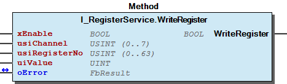

# WagoTypesBusServices v2.0.1.2 (WAGO) - Complete Documentation

## 📋 Library Information

- **Company:** WAGO
- **Title:** WagoTypesBusServices
- **Version:** 2.0.1.2
- **Categories:** WAGO Internal|Common|Types and Interfaces; WAGO Internal|Feature|LocalBus|K-Bus; WAGO LayerView|Types and Interfaces
- **Author:** WAGO / u010545
- **Placeholder:** WagoTypesBusServices

### Description ¶

This document is automatically generated.

Interfaces for Module Access

This document is automatically generated. Interfaces for Module Access

### Contents: ¶

Contents: - Documentation Index - Project Information - Library Information - Function Blocks - Methods FbTerminalBaseData.getBusType (METH) - FbTerminalBaseData.getChannels (METH) - FbTerminalBaseData.getModuleId (METH) - FbTerminalBaseData.getModuleType (METH) - FbTerminalBaseData.getOrderNumber (METH) - FbTerminalBaseData.getOrderNumberAsString (METH) - FbTerminalBaseData.getPaSize (METH) - FbTerminalBaseData.getSlotNumber (METH) - FbTerminalBaseData.isComplex (METH) - I_FuseService.CreateMountPoint (METH) - ... and 39 more Interfaces - I_FuseService (ITF) - I_LedServerService (ITF) - I_ModuleAccessService (ITF) - I_ModuleBaseAccessService (ITF) - I_ParameterService (ITF) - I_ParameterServiceList (ITF) - I_RebootService (ITF) - I_RegisterService (ITF) - I_ServiceConfig (ITF) - I_TermManagerAccessServiceListener (ITF) - ... and 2 more Program Organization Internal Components Global Variable Lists - ERRORFACTORIES (GVL) - ErrorKbusServices (GVL) - VersionHistory (GVL) Other Components - 00 Error Kbus Services - 20 Data Types - 40 Datatypes - 80 Status - Control - I_Service - I_Terminal - Info - ParameterList (PARAMS) - ProcessImageAccess - ... and 7 more

### Indices and tables ¶

Based on WagoTypesBusServices.library, last modified 29.05.2024, 19:57:30. LibDoc 3.5.16.10

© WAGO GmbH & Co. KG, Germany 2018 – All rights reserved. For the avoidance of doubt, this copyright notice does not only apply to the information above but also and primarily to the described library itself. Please note that third-party products are always mentioned without reference to intellectual property rights, including patents, utility models, designs and trademarks, accordingly the existence of such rights cannot be excluded. WAGO is a registered trademark of WAGO Verwaltungsgesellschaft mbH.

- File and Project Information - Library Reference Based on WagoTypesBusServices.library, last modified 29.05.2024, 19:57:30. LibDoc 3.5.16.10 © WAGO GmbH & Co. KG, Germany 2018 – All rights reserved. For the avoidance of doubt, this copyright notice does not only apply to the information above but also and primarily to the described library itself. Please note that third-party products are always mentioned without reference to intellectual property rights, including patents, utility models, designs and trademarks, accordingly the existence of such rights cannot be excluded. WAGO is a registered trademark of WAGO Verwaltungsgesellschaft mbH.

### Documentation Index

## WagoTypesBusServices Library Documentation

| Company: | WAGO |
| Title: | WagoTypesBusServices |
| Version: | 2.0.1.2 |
| Categories: | WAGO Internal\|Common\|Types and Interfaces; WAGO Internal\|Feature\|LocalBus\|K-Bus; WAGO LayerView\|Types and Interfaces |
| Author: | WAGO / u010545 |
| Placeholder: | WagoTypesBusServices |

### Description

This document is automatically generated.

Interfaces for Module Access

This document is automatically generated. Interfaces for Module Access

### Contents:

- 20 Program Organization Units ERRORFACTORIES (GVL) - FbTerminalBaseData (FB) 40 Datatypes - typPARAMETER_ARRAY (ALIAS) 80 Status - 00 Error Kbus Services 90 Internal - 20 Data Types - I_Service - I_TermManagerAccessServiceListener (ITF) - I_Terminal - I_TerminalScannerListener (ITF) ParameterList (PARAMS) VersionHistory (GVL)

### Indices and tables

Based on WagoTypesBusServices.library, last modified 29.05.2024, 19:57:30. LibDoc 3.5.16.10

© WAGO GmbH & Co. KG, Germany 2018 – All rights reserved. For the avoidance of doubt, this copyright notice does not only apply to the information above but also and primarily to the described library itself. Please note that third-party products are always mentioned without reference to intellectual property rights, including patents, utility models, designs and trademarks, accordingly the existence of such rights cannot be excluded. WAGO is a registered trademark of WAGO Verwaltungsgesellschaft mbH.

- File and Project Information - Library Reference Based on WagoTypesBusServices.library, last modified 29.05.2024, 19:57:30. LibDoc 3.5.16.10 © WAGO GmbH & Co. KG, Germany 2018 – All rights reserved. For the avoidance of doubt, this copyright notice does not only apply to the information above but also and primarily to the described library itself. Please note that third-party products are always mentioned without reference to intellectual property rights, including patents, utility models, designs and trademarks, accordingly the existence of such rights cannot be excluded. WAGO is a registered trademark of WAGO Verwaltungsgesellschaft mbH.

### Project Information

## File and Project Information

| Scope | Name | Type | Content |
| --- | --- | --- | --- |
| FileHeader | libraryFile | string | WagoTypesBusServices.library |
| contentFile | doc.clean.json |
| productName | e!COCKPIT |
| creationDateTime | date | 29.05.2024, 19:57:30 |
| companyName | string | WAGO |
| ProjectInformation | LastModificationDateTime | date | 29.05.2024, 19:57:30 |
| Description | string | See: Description |
| Copyright | © WAGO Kontakttechnik GmbH & Co. KG, Germany 2018 – All rights reserved. |
| Author | WAGO / u010545 |
| AutoResolveUnbound | bool | True |
| Placeholder | string | WagoTypesBusServices |
| Company | WAGO |
| DocFormat | reStructuredText |
| Project | WagoTypesBusServices |
| DefaultNamespace |  |
| Version | version | 2.0.1.2 |
| Title | string | WagoTypesBusServices |
| LibraryCategories | library-category-list | WAGO Internal\|Common\|Types and Interfaces; WAGO Internal\|Feature\|LocalBus\|K-Bus; WAGO LayerView\|Types and Interfaces |
| CompiledLibraryCompatibilityVersion | string | CODESYS V3.5 SP16 Patch 3 |

### Library Information

## Library Reference

| LinkAllContent: False QualifiedOnly: False | SystemLibrary: False | Optional: False |

| LinkAllContent: False QualifiedOnly: True | SystemLibrary: False | Optional: False |

| LinkAllContent: False QualifiedOnly: True | SystemLibrary: False | Optional: False |

| LinkAllContent: False QualifiedOnly: True | SystemLibrary: False | Optional: False |

| LinkAllContent: False Optional: False | QualifiedOnly: True SystemLibrary: False | PublishSymbolsInContainer: True |

| LinkAllContent: False Optional: False | QualifiedOnly: True SystemLibrary: False | PublishSymbolsInContainer: True |

| LinkAllContent: False QualifiedOnly: True | SystemLibrary: False | Optional: False |

This is a dictionary of all referenced libraries and their name spaces.

This is a dictionary of all referenced libraries and their name spaces. CmpErrors2 Interfaces Library Identification : Name: CmpErrors2 Interfaces Version: newest Company: System Namespace: CmpErrors Library Properties : Standard Library Identification : Placeholder: Standard Default Resolution: Standard, * (System) Namespace: Standard Library Properties : WagoSysErrorBase Library Identification : Placeholder: WagoSysErrorBase Default Resolution: WagoSysErrorBase, * (WAGO) Namespace: WagoSysErrorBase Library Properties : WagoSysVersion Library Identification : Name: WagoSysVersion Version: 1.0.0.0 Company: WAGO Namespace: WagoSysVersion Library Properties : WagoTypesAppLED Library Identification : Placeholder: WagoTypesAppLED Default Resolution: WagoTypesAppLED, * (WAGO) Namespace: WagoTypesAppLED Library Properties : WagoTypesCommon Library Identification : Placeholder: WagoTypesCommon Default Resolution: WagoTypesCommon, * (WAGO) Namespace: WagoTypes Library Properties : WagoTypesErrorBase Library Identification : Placeholder: WagoTypesErrorBase Default Resolution: WagoTypesErrorBase, * (WAGO) Namespace: WagoTypesErrorBase Library Properties :

### Function Blocks

## FbTerminalBaseData (FB)

- FbTerminalBaseData.getBusType (METH) - FbTerminalBaseData.getChannels (METH) - FbTerminalBaseData.getModuleId (METH) - FbTerminalBaseData.getModuleType (METH) - FbTerminalBaseData.getOrderNumber (METH) - FbTerminalBaseData.getOrderNumberAsString (METH) - FbTerminalBaseData.getPaSize (METH) - FbTerminalBaseData.getSlotNumber (METH) - FbTerminalBaseData.isComplex (METH)

### Methods

## FbTerminalBaseData.getBusType (METH)

| Scope | Name | Type |
| --- | --- | --- |
| Return | getBusType | eBusType |

## FbTerminalBaseData.getChannels (METH)

| Scope | Name | Type |
| --- | --- | --- |
| Return | getChannels | UINT |

## FbTerminalBaseData.getModuleId (METH)

| Scope | Name | Type |
| --- | --- | --- |
| Return | getModuleId | UDINT |

## FbTerminalBaseData.getModuleType (METH)

| Scope | Name | Type |
| --- | --- | --- |
| Return | getModuleType | eTerminalType |

## FbTerminalBaseData.getOrderNumber (METH)

| Scope | Name | Type |
| --- | --- | --- |
| Return | getOrderNumber | typOrderNumber |

returns an array[0..3] of uint. Each item holds an integer part of the ordernumber.

0750-0650/0003-0000

In the case that the module is a simple digital type all items are 0.

Interface variables Function returns an array[0..3] of uint. Each item holds an integer part of the ordernumber. Example 0750-0650/0003-0000 - array[0] -> 750 - array[1] -> 650 - array[2] -> 3 - array[3] -> 0 Note In the case that the module is a simple digital type all items are 0.

## FbTerminalBaseData.getOrderNumberAsString (METH)

| Scope | Name | Type |
| --- | --- | --- |
| Return | getOrderNumberAsString | STRING |

Interface variables Function This method returns the order number as string like 0750-0650/0003-0000

## FbTerminalBaseData.getPaSize (METH)

| Scope | Name | Type |
| --- | --- | --- |
| Return | getPaSize | UINT |

## FbTerminalBaseData.getSlotNumber (METH)

| Scope | Name | Type |
| --- | --- | --- |
| Return | getSlotNumber | USINT |

## FbTerminalBaseData.isComplex (METH)

| Scope | Name | Type |
| --- | --- | --- |
| Return | isComplex | BOOL |

## I_FuseService.CreateMountPoint (METH)

| Scope | Name | Type |
| --- | --- | --- |
| Return | CreateMountPoint | POINTER TO BYTE |
| Input | sDeviceName | STRING(255) |

## I_FuseService.ReleaseMountPoint (METH)

| Scope | Name | Type |
| --- | --- | --- |
| Return | ReleaseMountPoint | BOOL |
| Input | sDeviceName | STRING(255) |

## I_LedServerService.LED_Set_Blink (METH)

| Scope | Name | Type |
| --- | --- | --- |
| Return | LED_Set_Blink | BOOL |
| Input | eLedId | WagoTypesAppLED.eLedId |
| eLedColor_1 | WagoTypesAppLED.eLedColor |
| eLedColor_2 | WagoTypesAppLED.eLedColor |
| tTime_1 | TIME |
| tTime_2 | TIME |

## I_LedServerService.LED_Set_Static (METH)

| Scope | Name | Type |
| --- | --- | --- |
| Return | LED_Set_Static | BOOL |
| Input | eLedId | WagoTypesAppLED.eLedId |
| eLedColor | WagoTypesAppLED.eLedColor |

## I_ModuleAccessService.GetBusType (METH)

| Scope | Name | Type |
| --- | --- | --- |
| Return | GetBusType | eBusType |

## I_ModuleAccessService.GetInputPaSize (METH)

| Scope | Name | Type |
| --- | --- | --- |
| Return | GetInputPaSize | UINT |

returns the size [byte] of the input process image

Interface variables returns the size [byte] of the input process image

## I_ModuleAccessService.GetInputPointer (METH)

| Scope | Name | Type |
| --- | --- | --- |
| Return | GetInputPointer | POINTER TO BYTE |

returns a pointer to the input process image

Interface variables returns a pointer to the input process image

## I_ModuleAccessService.GetOutputPaSize (METH)

| Scope | Name | Type |
| --- | --- | --- |
| Return | GetOutputPaSize | UINT |

returns the size [byte] of the output process image

Interface variables returns the size [byte] of the output process image

## I_ModuleAccessService.GetOutputPointer (METH)

| Scope | Name | Type |
| --- | --- | --- |
| Return | GetOutputPointer | POINTER TO BYTE |

returns a pointer to the output process image

Interface variables returns a pointer to the output process image

## I_ModuleAccessService.GetRegisterFillBytes (METH)

| Scope | Name | Type |
| --- | --- | --- |
| Return | GetRegisterFillBytes | USINT (0..1) |

Get Quantity of used fillbytes betwen C/S and VALUE for register communication

Interface variables Get Quantity of used fillbytes betwen C/S and VALUE for register communication

## I_ModuleAccessService.GetSlotNumber (METH)

| Scope | Name | Type |
| --- | --- | --- |
| Return | GetSlotNumber | USINT |

## I_ModuleAccessService.ReadRegister (METH)

| Scope | Name | Type |
| --- | --- | --- |
| Return | ReadRegister | BOOL |
| Input | xEnable | BOOL |
| usiChannel | USINT (0..7) |
| usiRegisterNo | USINT (0..63) |
| Inout | uiValue | UINT |
| oError | WagoSysErrorBase.FbResult |

Graphical Illustration

Graphical Interface of I_ModuleAccessService.ReadRegister

Interface variables Function Read a terminal register specified by usiChannel and usiRegisterNo . Graphical Illustration  Graphical Interface of I_ModuleAccessService.ReadRegister

## I_ModuleAccessService.UpdatePAInputs (METH) ¶

## I_ModuleAccessService.UpdatePAOutputs (METH) ¶

## I_ModuleAccessService.WriteRegister (METH)

| Scope | Name | Type |
| --- | --- | --- |
| Return | WriteRegister | BOOL |
| Input | xEnable | BOOL |
| usiChannel | USINT (0..7) |
| usiRegisterNo | USINT (0..63) |
| uiValue | UINT |
| Inout | oError | WagoSysErrorBase.FbResult |

Graphical Illustration

Graphical Interface of I_ModuleAccessService.WriteRegister

Interface variables Function Write the value``uiValue`` at terminal register specified by usiChannel and usiRegisterNo . Graphical Illustration  Graphical Interface of I_ModuleAccessService.WriteRegister

## I_ModuleAccessService.isReadyForUse (METH)

| Scope | Name | Type |
| --- | --- | --- |
| Return | isReadyForUse | BOOL |

Returns TRUE if the module is ready for use. This means it is mem for the PA allocated and the data exchange runs.

Interface variables Returns TRUE if the module is ready for use. This means it is mem for the PA allocated and the data exchange runs.

## I_ModuleBaseAccessService.GetBusType (METH)

| Scope | Name | Type |
| --- | --- | --- |
| Return | GetBusType | eBusType |

## I_ModuleBaseAccessService.GetSlotNumber (METH)

| Scope | Name | Type |
| --- | --- | --- |
| Return | GetSlotNumber | USINT |

## I_ModuleBaseAccessService.isReadyForUse (METH)

| Scope | Name | Type |
| --- | --- | --- |
| Return | isReadyForUse | BOOL |

Returns TRUE if the module is ready for use. This means it is mem for the PA allocated and the data exchange runs.

Interface variables Returns TRUE if the module is ready for use. This means it is mem for the PA allocated and the data exchange runs.

## I_ParameterService.ReadParameter (METH)

| Scope | Name | Type | Comment |
| --- | --- | --- | --- |
| Return | ReadParameter | BOOL |  |
| Input | xEnable | BOOL |  |
| usiParameterNo | USINT |  |
| Inout | uiValue | UINT | value of the parameter |
| uiStatus | UINT | status word (register 57) of parameter communication |
| oError | WagoSysErrorBase.FbResult |  |

Graphical Illustration

Graphical Interface of I_ParameterService.ReadParameter

Interface variables Function Read a terminal parameter specified by usiParameterNo . Graphical Illustration  Graphical Interface of I_ParameterService.ReadParameter

## I_ParameterService.WriteParameter (METH)

| Scope | Name | Type | Comment |
| --- | --- | --- | --- |
| Return | WriteParameter | BOOL |  |
| Input | xEnable | BOOL |  |
| usiParameterNo | USINT |  |
| uiValue | UINT | value of the parameter |
| Inout | uiStatus | UINT | status word (register 57) of parameter communication |
| oError | WagoSysErrorBase.FbResult | error object |

Graphical Illustration

Graphical Interface of I_ParameterService.WriteParameter

Interface variables Function Write the value``uiValue`` at terminal parameter specified by usiParameterNo . Graphical Illustration  Graphical Interface of I_ParameterService.WriteParameter

## I_ParameterServiceList.ReadParameterList (METH)

| Scope | Name | Type | Comment |
| --- | --- | --- | --- |
| Return | ReadParameterList | BOOL |  |
| Input | xEnable | BOOL |  |
| usiParameterNo | USINT |  |
| uiParameterCnt | UINT (1..256) | number of parameters |
| Inout | aValue | typPARAMETER_ARRAY | content of addressed parameters |
| uiStatus | UINT | status word (register 57) of parameter communication |
| oError | WagoSysErrorBase.FbResult |  |

Graphical Illustration

Graphical Interface of I_ParameterServiceList.ReadParameterList

Interface variables Function Read a terminal parameter specified by usiParameterNo . Graphical Illustration  Graphical Interface of I_ParameterServiceList.ReadParameterList

## I_ParameterServiceList.WriteParameterList (METH)

| Scope | Name | Type | Comment |
| --- | --- | --- | --- |
| Return | WriteParameterList | BOOL |  |
| Input | xEnable | BOOL |  |
| usiParameterNo | USINT |  |
| uiParameterCnt | UINT (1..256) | number of parameters |
| aValue | typPARAMETER_ARRAY | content of addressed parameters |
| Inout | uiStatus | UINT | status word (register 57) of parameter communication |
| oError | WagoSysErrorBase.FbResult | error object |

Graphical Illustration

Graphical Interface of I_ParameterServiceList.WriteParameterList

Interface variables Function Write the value``uiValue`` at terminal parameter specified by usiParameterNo . Graphical Illustration  Graphical Interface of I_ParameterServiceList.WriteParameterList

## I_RebootService.Reboot (METH)

| Scope | Name | Type |
| --- | --- | --- |
| Return | Reboot | BOOL |

## I_RegisterService.GetRegisterFillBytes (METH)

| Scope | Name | Type |
| --- | --- | --- |
| Return | GetRegisterFillBytes | USINT (0..3) |

Get Quantity of used fillbytes betwen C/S and VALUE for register communication

Interface variables Get Quantity of used fillbytes betwen C/S and VALUE for register communication

## I_RegisterService.ReadRegister (METH)

| Scope | Name | Type |
| --- | --- | --- |
| Return | ReadRegister | BOOL |
| Input | xEnable | BOOL |
| usiChannel | USINT (0..7) |
| usiRegisterNo | USINT (0..63) |
| Inout | uiValue | UINT |
| oError | WagoSysErrorBase.FbResult |

Graphical Illustration

Graphical Interface of I_RegisterService.ReadRegister

Interface variables Function Read a terminal register specified by usiChannel and usiRegisterNo . Graphical Illustration  Graphical Interface of I_RegisterService.ReadRegister

## I_RegisterService.SetRegisterFillBytes (METH)

| Scope | Name | Type |
| --- | --- | --- |
| Input | usiFillBytes | USINT (0..3) |

Get Quantity of used fillbytes betwen C/S and VALUE for register communication

Interface variables Get Quantity of used fillbytes betwen C/S and VALUE for register communication

## I_RegisterService.WriteRegister (METH)

| Scope | Name | Type |
| --- | --- | --- |
| Return | WriteRegister | BOOL |
| Input | xEnable | BOOL |
| usiChannel | USINT (0..7) |
| usiRegisterNo | USINT (0..63) |
| uiValue | UINT |
| Inout | oError | WagoSysErrorBase.FbResult |

Graphical Illustration

Graphical Interface of I_RegisterService.WriteRegister

Interface variables Function Write the value``uiValue`` at terminal register specified by usiChannel and usiRegisterNo . Graphical Illustration  Graphical Interface of I_RegisterService.WriteRegister

## I_ServiceConfig.setSlotNo (METH)

| Scope | Name | Type |
| --- | --- | --- |
| Return | setSlotNo | BOOL |
| Input | usiSlotNo | USINT (1..250) |

## I_TermManagerAccessServiceListener.onAccessServiceRegistered (METH)

| Scope | Name | Type |
| --- | --- | --- |
| Input | I_BaseAccessService | I_ModuleBaseAccessService |
| e_BusType | eBusType |
| usiSlotNo | USINT |

This method is called by the TerminalManager for each registered service

Interface variables This method is called by the TerminalManager for each registered service

## I_TermManagerAccessServiceListener.onAccessServiceUnRegistered (METH)

| Scope | Name | Type |
| --- | --- | --- |
| Input | I_BaseAccessService | I_ModuleBaseAccessService |
| e_BusType | eBusType |
| usiSlotNo | USINT |

This method is called by the TerminalManager for each registered service

Interface variables This method is called by the TerminalManager for each registered service

## I_TerminalBase.getBusType (METH)

| Scope | Name | Type |
| --- | --- | --- |
| Return | getBusType | eBusType |

## I_TerminalBase.getChannels (METH)

| Scope | Name | Type |
| --- | --- | --- |
| Return | getChannels | UINT |

Interface variables Function returns the quantity of channels.

## I_TerminalBase.getModuleId (METH)

| Scope | Name | Type |
| --- | --- | --- |
| Return | getModuleId | UDINT |

Interface variables Function returns the module id.

## I_TerminalBase.getModuleType (METH)

| Scope | Name | Type |
| --- | --- | --- |
| Return | getModuleType | eTerminalType |

Interface variables Function returns the |eModuleType| of a module.

## I_TerminalBase.getOrderNumber (METH)

| Scope | Name | Type |
| --- | --- | --- |
| Return | getOrderNumber | typOrderNumber |

returns an array[0..3] of uint. Each item holds an integer part of the ordernumber.

0750-0650/0003-0000

In the case that the module is a simple digital type all items are 0.

Interface variables Function returns an array[0..3] of uint. Each item holds an integer part of the ordernumber. Example 0750-0650/0003-0000 - array[0] -> 750 - array[1] -> 650 - array[2] -> 3 - array[3] -> 0 Note In the case that the module is a simple digital type all items are 0.

## I_TerminalBase.getOrderNumberAsString (METH)

| Scope | Name | Type |
| --- | --- | --- |
| Return | getOrderNumberAsString | STRING |

In the case that the module is a simple digital type the return string := ‘0000-0000/0000-0000’

Interface variables Function This method returns the order number as string like 0750-0650/0003-0000. Note In the case that the module is a simple digital type the return string := ‘0000-0000/0000-0000’

## I_TerminalBase.getPaSize (METH)

| Scope | Name | Type |
| --- | --- | --- |
| Return | getPaSize | UINT |

Interface variables Function returns the size [bit] at the process image.

## I_TerminalBase.getSlotNumber (METH)

| Scope | Name | Type |
| --- | --- | --- |
| Return | getSlotNumber | USINT |

Interface variables Function returns the slot number at kbus of this module.

## I_TerminalBase.isComplex (METH)

| Scope | Name | Type |
| --- | --- | --- |
| Return | isComplex | BOOL |

Interface variables Function If this a complex module it returns TRUE. Otherwise it is a digital module and this method returns FALSE.

### Interfaces

## I_FuseService (ITF)

- I_FuseService.CreateMountPoint (METH) - I_FuseService.ReleaseMountPoint (METH)

## I_LedServerService (ITF)

- I_LedServerService.LED_Set_Blink (METH) - I_LedServerService.LED_Set_Static (METH)

## I_ModuleAccessService (ITF)

Common services for terminal access via bus

Common services for terminal access via bus - Control I_ModuleAccessService.UpdatePAInputs (METH) - I_ModuleAccessService.UpdatePAOutputs (METH) Info - I_ModuleAccessService.GetBusType (METH) - I_ModuleAccessService.GetSlotNumber (METH) - I_ModuleAccessService.isReadyForUse (METH) ProcessImageAccess - I_ModuleAccessService.GetInputPaSize (METH) - I_ModuleAccessService.GetInputPointer (METH) - I_ModuleAccessService.GetOutputPaSize (METH) - I_ModuleAccessService.GetOutputPointer (METH) Register - I_ModuleAccessService.GetRegisterFillBytes (METH) - I_ModuleAccessService.ReadRegister (METH) - I_ModuleAccessService.WriteRegister (METH)

## I_ModuleBaseAccessService (ITF)

Common services for terminal access via bus

Common services for terminal access via bus - I_ModuleBaseAccessService.GetBusType (METH) - I_ModuleBaseAccessService.GetSlotNumber (METH) - I_ModuleBaseAccessService.isReadyForUse (METH)

## I_ParameterService (ITF)

- I_ParameterService.ReadParameter (METH) - I_ParameterService.WriteParameter (METH)

## I_ParameterServiceList (ITF)

- I_ParameterServiceList.ReadParameterList (METH) - I_ParameterServiceList.WriteParameterList (METH)

## I_RebootService (ITF)

- I_RebootService.Reboot (METH)

## I_RegisterService (ITF)

- I_RegisterService.GetRegisterFillBytes (METH) - I_RegisterService.ReadRegister (METH) - I_RegisterService.SetRegisterFillBytes (METH) - I_RegisterService.WriteRegister (METH)

## I_ServiceConfig (ITF)

- I_ServiceConfig.setSlotNo (METH)

## I_TermManagerAccessServiceListener (ITF)

- I_TermManagerAccessServiceListener.onAccessServiceRegistered (METH) - I_TermManagerAccessServiceListener.onAccessServiceUnRegistered (METH)

## I_TerminalBase (ITF)

- I_TerminalBase.getBusType (METH) - I_TerminalBase.getChannels (METH) - I_TerminalBase.getModuleId (METH) - I_TerminalBase.getModuleType (METH) - I_TerminalBase.getOrderNumber (METH) - I_TerminalBase.getOrderNumberAsString (METH) - I_TerminalBase.getPaSize (METH) - I_TerminalBase.getSlotNumber (METH) - I_TerminalBase.isComplex (METH)

## I_TerminalScannerListener (ITF) ¶

### Program Organization

## 20 Program Organization Units

- ERRORFACTORIES (GVL) - FbTerminalBaseData (FB) FbTerminalBaseData.getBusType (METH) - FbTerminalBaseData.getChannels (METH) - FbTerminalBaseData.getModuleId (METH) - FbTerminalBaseData.getModuleType (METH) - FbTerminalBaseData.getOrderNumber (METH) - FbTerminalBaseData.getOrderNumberAsString (METH) - FbTerminalBaseData.getPaSize (METH) - FbTerminalBaseData.getSlotNumber (METH) - FbTerminalBaseData.isComplex (METH)

### Internal Components

## 90 Internal

- 20 Data Types eBusType (ENUM) - eTerminalChannels (ENUM) - eTerminalType (ENUM) - typOrderNumber (ALIAS) I_Service - I_FuseService (ITF) I_FuseService.CreateMountPoint (METH) - I_FuseService.ReleaseMountPoint (METH) I_LedServerService (ITF) - I_LedServerService.LED_Set_Blink (METH) - I_LedServerService.LED_Set_Static (METH) I_ModuleAccessService (ITF) - Control I_ModuleAccessService.UpdatePAInputs (METH) - I_ModuleAccessService.UpdatePAOutputs (METH) Info - I_ModuleAccessService.GetBusType (METH) - I_ModuleAccessService.GetSlotNumber (METH) - I_ModuleAccessService.isReadyForUse (METH) ProcessImageAccess - I_ModuleAccessService.GetInputPaSize (METH) - I_ModuleAccessService.GetInputPointer (METH) - I_ModuleAccessService.GetOutputPaSize (METH) - I_ModuleAccessService.GetOutputPointer (METH) Register - I_ModuleAccessService.GetRegisterFillBytes (METH) - I_ModuleAccessService.ReadRegister (METH) - I_ModuleAccessService.WriteRegister (METH) I_ModuleBaseAccessService (ITF) - I_ModuleBaseAccessService.GetBusType (METH) - I_ModuleBaseAccessService.GetSlotNumber (METH) - I_ModuleBaseAccessService.isReadyForUse (METH) I_ParameterService (ITF) - I_ParameterService.ReadParameter (METH) - I_ParameterService.WriteParameter (METH) I_ParameterServiceList (ITF) - I_ParameterServiceList.ReadParameterList (METH) - I_ParameterServiceList.WriteParameterList (METH) I_RebootService (ITF) - I_RebootService.Reboot (METH) I_RegisterService (ITF) - I_RegisterService.GetRegisterFillBytes (METH) - I_RegisterService.ReadRegister (METH) - I_RegisterService.SetRegisterFillBytes (METH) - I_RegisterService.WriteRegister (METH) I_ServiceConfig (ITF) - I_ServiceConfig.setSlotNo (METH) I_TermManagerAccessServiceListener (ITF) - I_TermManagerAccessServiceListener.onAccessServiceRegistered (METH) - I_TermManagerAccessServiceListener.onAccessServiceUnRegistered (METH) I_Terminal - I_TerminalBase (ITF) I_TerminalBase.getBusType (METH) - I_TerminalBase.getChannels (METH) - I_TerminalBase.getModuleId (METH) - I_TerminalBase.getModuleType (METH) - I_TerminalBase.getOrderNumber (METH) - I_TerminalBase.getOrderNumberAsString (METH) - I_TerminalBase.getPaSize (METH) - I_TerminalBase.getSlotNumber (METH) - I_TerminalBase.isComplex (METH) I_TerminalScannerListener (ITF)

### Global Variable Lists

## ERRORFACTORIES (GVL)

| Name | Type | Comment |
| --- | --- | --- |
| ErrorKbusServiceFactory | WagoSysErrorBase.FbResultFactory |  |

## ErrorKbusServices (GVL)

| Scope | Name | Type | Initial |
| --- | --- | --- | --- |
| Constant | ERROR_KBUS_SERVICES | ARRAY [0..7] OF WagoTypesErrorBase.typResultItem | [STRUCT(ID := eErrorKbusServices.OK, Severity := WagoTypesErrorBase.eSeverity.none, text := ‘OK’), STRUCT(ID := eErrorKbusServices.INTERNAL_FAILED, Severity := WagoTypesErrorBase.eSeverity.error, text := ‘internal error -> api’), STRUCT(ID := eErrorKbusServices.INVALID_PARAMETER, Severity := WagoTypesErrorBase.eSeverity.error, text := ‘pConnector or pudiSlotNo was NULL’), STRUCT(ID := eErrorKbusServices.NOT_SUPPORTED, Severity := WagoTypesErrorBase.eSeverity.error, text := ‘Driver does not support function’), STRUCT(ID := eErrorKbusServices.TYPE_MISMATCH, Severity := WagoTypesErrorBase.eSeverity.error, text := ‘connector type not supported’), STRUCT(ID := eErrorKbusServices.NOT_INITILALIZED, Severity := WagoTypesErrorBase.eSeverity.error, text := ‘no static configuration found’), STRUCT(ID := eErrorKbusServices.INVALID_SLOT, Severity := WagoTypesErrorBase.eSeverity.error, text := ‘no slot number for current terminal available’), STRUCT(ID := eErrorKbusServices.UNEXPECTED_ERROR, Severity := WagoTypesErrorBase.eSeverity.error, text := ‘unexpected error from api’)] |

## VersionHistory (GVL)

| Name | Type |
| --- | --- |
| Info | WagoSysVersion.ProjectInfo |

| date | version | author | change |
| 05.02.2024 | 2.0.1.2 | u010663 | Compiled as SP16.3 |
| 18.01.2023 | 2.0.1.1 | u0103719 | WAT34389: replace CDS3 Library |
| 19.09.2022 | 2.0.1.0 | u0103719 | Add I_ParameterServiceList |
| 08.06.2022 | 2.0.0.0 | u010545 | modified for CDS3 runtime |
| 18.01.2021 | 1.8.4.1 | u010545 | Module-ID 0x60E -> 750-626/020-002 implemented |
| 11.01.2021 | 1.8.4.0 | u010545 | Bugfix I_RegisterService |
| 21.05.2019 | 1.8.2.1 | u010545 | I_ServiceConfig defined |
| 08.01.2019 | 1.8.2.0 | u015842 | Properties: free placeholder added |
| 07.05.2018 | 1.8.1.2 | u010545 | Additonal enumerations |
| 17.04.2018 | 1.8.1.1 | u010545 | Bugfix Format(...) |
| 13.11.2017 | 1.8.1.0 | u010545 | I_RebootService and I_LedServerService defined |
| 28.08.2017 | 1.8.0.3 | u010545 | I_RegisterService expand |
| 03.08.2017 | 1.8.0.2 | u010545 | I_FuseService implemented |
| 19.07.2017 | 1.8.0.1 | u010545 | I_ModuleBaseAccessService implemented |
| 23.06.2017 | 1.8.0.0 | u010545 | update |
| 16.05.2017 | 1.7.0.1 | u010545 | update |
| 15.05.2017 | 1.7.0.0 | u010545 | created |

WagoTypesBusServices

### Other Components

## 00 Error Kbus Services

- ErrorKbusServices (GVL) - eErrorKbusServices (ENUM)

## 20 Data Types

- eBusType (ENUM) - eTerminalChannels (ENUM) - eTerminalType (ENUM) - typOrderNumber (ALIAS)

## 40 Datatypes ¶

- typPARAMETER_ARRAY (ALIAS)

## 80 Status

- 00 Error Kbus Services ErrorKbusServices (GVL) - eErrorKbusServices (ENUM)

## Control

- I_ModuleAccessService.UpdatePAInputs (METH) - I_ModuleAccessService.UpdatePAOutputs (METH)

## I_Service

- I_FuseService (ITF) I_FuseService.CreateMountPoint (METH) - I_FuseService.ReleaseMountPoint (METH) I_LedServerService (ITF) - I_LedServerService.LED_Set_Blink (METH) - I_LedServerService.LED_Set_Static (METH) I_ModuleAccessService (ITF) - Control I_ModuleAccessService.UpdatePAInputs (METH) - I_ModuleAccessService.UpdatePAOutputs (METH) Info - I_ModuleAccessService.GetBusType (METH) - I_ModuleAccessService.GetSlotNumber (METH) - I_ModuleAccessService.isReadyForUse (METH) ProcessImageAccess - I_ModuleAccessService.GetInputPaSize (METH) - I_ModuleAccessService.GetInputPointer (METH) - I_ModuleAccessService.GetOutputPaSize (METH) - I_ModuleAccessService.GetOutputPointer (METH) Register - I_ModuleAccessService.GetRegisterFillBytes (METH) - I_ModuleAccessService.ReadRegister (METH) - I_ModuleAccessService.WriteRegister (METH) I_ModuleBaseAccessService (ITF) - I_ModuleBaseAccessService.GetBusType (METH) - I_ModuleBaseAccessService.GetSlotNumber (METH) - I_ModuleBaseAccessService.isReadyForUse (METH) I_ParameterService (ITF) - I_ParameterService.ReadParameter (METH) - I_ParameterService.WriteParameter (METH) I_ParameterServiceList (ITF) - I_ParameterServiceList.ReadParameterList (METH) - I_ParameterServiceList.WriteParameterList (METH) I_RebootService (ITF) - I_RebootService.Reboot (METH) I_RegisterService (ITF) - I_RegisterService.GetRegisterFillBytes (METH) - I_RegisterService.ReadRegister (METH) - I_RegisterService.SetRegisterFillBytes (METH) - I_RegisterService.WriteRegister (METH) I_ServiceConfig (ITF) - I_ServiceConfig.setSlotNo (METH)

## I_Terminal

- I_TerminalBase (ITF) I_TerminalBase.getBusType (METH) - I_TerminalBase.getChannels (METH) - I_TerminalBase.getModuleId (METH) - I_TerminalBase.getModuleType (METH) - I_TerminalBase.getOrderNumber (METH) - I_TerminalBase.getOrderNumberAsString (METH) - I_TerminalBase.getPaSize (METH) - I_TerminalBase.getSlotNumber (METH) - I_TerminalBase.isComplex (METH)

## Info

- I_ModuleAccessService.GetBusType (METH) - I_ModuleAccessService.GetSlotNumber (METH) - I_ModuleAccessService.isReadyForUse (METH)

## ParameterList (PARAMS)

| Scope | Name | Type | Initial | Comment |
| --- | --- | --- | --- | --- |
| Constant | MAX_MODULE_QUANTITY | USINT | 250 | max. quantity of modules for each bus type |
| MAX_RUNNABLES | INT | MAX_MODULE_QUANTITY | quantity of possible modules to register for a daemon |

## ProcessImageAccess

- I_ModuleAccessService.GetInputPaSize (METH) - I_ModuleAccessService.GetInputPointer (METH) - I_ModuleAccessService.GetOutputPaSize (METH) - I_ModuleAccessService.GetOutputPointer (METH)

## Register

- I_ModuleAccessService.GetRegisterFillBytes (METH) - I_ModuleAccessService.ReadRegister (METH) - I_ModuleAccessService.WriteRegister (METH)

## eBusType (ENUM)

| Name | Initial |
| --- | --- |
| KBUS | 16#1 |
| FIELDBUS | 16#2 |
| UNKNOWN | 16#80000000 |

## eErrorKbusServices (ENUM)

| Name | Initial | Comment |
| --- | --- | --- |
| OK | 0 | all is well |
| INTERNAL_FAILED | 1 | internal error -> api |
| INVALID_PARAMETER | 2 | pConnector or pudiSlotNo was NULL |
| NOT_SUPPORTED | 3 | Driver does not support function |
| TYPE_MISMATCH | 4 | connector type not supported |
| NOT_INITILALIZED | 5 | no static configuration found |
| INVALID_SLOT | 6 | no slot number for current terminal available |
| UNEXPECTED_ERROR | 99 | unexpected error from api |

## eTerminalChannels (ENUM)

| Name | Initial |
| --- | --- |
| CHANNELS_1 | 0 |
| CHANNELS_2 | 1 |
| CHANNELS_4 | 2 |
| CHANNELS_8 | 3 |
| CHANNELS_16 | 4 |
| CHANNELS_3 | 7 |

Attributes: qualified_only InOut:

## eTerminalType (ENUM)

| Name | Initial | Comment |
| --- | --- | --- |
| RESERVED | 16#0 |  |
| COMPLEX_INPUT | 16#1 |  |
| COMPLEX_OUTPUT | 16#2 |  |
| COMPLEX_INOUT | 16#4 |  |
| INVALID | 16#8 | invalid moduletype |
| DIGITAL_DIAG | 16#10 | digital modules ————- |
| DIGITAL_INPUT | 16#20 |  |
| DIGITAL_OUTPUT | 16#40 |  |
| DIGITAL_OUTPUT_DIAG | 16#80 |  |
| DIGITAL_PLACEHOLDER | 16#100 |  |
| DIGITAL_INPUT_DIAG | 16#200 |  |
| DIGITAL_INOUT_DIAG | 16#400 |  |
| DIGITAL_INOUT | 16#800 |  |
| GROUP_DIGITAL_INPUT | (((((DIGITAL_DIAG OR DIGITAL_INPUT) OR DIGITAL_OUTPUT_DIAG) OR DIGITAL_INPUT_DIAG) OR DIGITAL_INOUT_DIAG) OR DIGITAL_INOUT) OR DIGITAL_PLACEHOLDER | Groups —————————————— |
| GROUP_DIGITAL_OUTPUT | (((DIGITAL_OUTPUT OR DIGITAL_OUTPUT_DIAG) OR DIGITAL_INOUT_DIAG) OR DIGITAL_INOUT) OR DIGITAL_PLACEHOLDER |  |
| GROUP_DIGITAL_ALL | GROUP_DIGITAL_INPUT OR GROUP_DIGITAL_OUTPUT |  |
| GROUP_COMPLEX_INPUT | COMPLEX_INPUT OR COMPLEX_INOUT |  |
| GROUP_COMPLEX_OUTPUT | COMPLEX_OUTPUT OR COMPLEX_INOUT |  |
| GROUP_COMPLEX_ALL | GROUP_COMPLEX_INPUT OR GROUP_COMPLEX_OUTPUT |  |
| GROUP_ALL_MODULES | GROUP_DIGITAL_ALL OR GROUP_COMPLEX_ALL |  |

| Member | Description |
| --- | --- |
| COMPLEX_INPUT | Complex Input Module |
| COMPLEX_OUTPUT | Complex Output Module |
| COMPLEX_INOUT | Complex Input / Output Module |
| DIGITAL_DIAG | Digital Module with Diagnostic |
| DIGITAL_INPUT | Digital Input Module |
| DIGITAL_OUTPUT | Digital Output Module |
| DIGITAL_OUTPUT_DIAG | Digital Output Module with Diagnostic |
| DIGITAL_INPUT_DIAG | Digital Input Module with Diagnostic |
| DIGITAL_INOUT_DIAG | Digital Input / Output Module with Diagnostic |
| DIGITAL_INOUT | Digital Input / Output Module |
| DIGITAL_PLACEHOLDER | Digital Input / Output Placeholder Module |

| Member | GROUP DIGITAL_INPUT | GROUP DIGITAL_OUTPUT | GROUP DIGITAL_ALL | GROUP COMPLEX_INPUT | GROUP COMPLEX_OUTPUT | GROUP COMPLEX_ALL | GROUP ALL_MODULES |
| --- | --- | --- | --- | --- | --- | --- | --- |
| COMPLEX_INPUT |  |  |  | Groupmember |  | Groupmember | Groupmember |
| COMPLEX_OUTPUT |  |  |  |  | Groupmember | Groupmember | Groupmember |
| COMPLEX_INOUT |  |  |  | Groupmember | Groupmember | Groupmember | Groupmember |
| DIGITAL_DIAG | Groupmember |  | Groupmember |  |  |  | Groupmember |
| DIGITAL_INPUT | Groupmember |  | Groupmember |  |  |  | Groupmember |
| DIGITAL_OUTPUT |  | Groupmember | Groupmember |  |  |  | Groupmember |
| DIGITAL_OUTPUT_DIAG |  | Groupmember | Groupmember |  |  |  | Groupmember |
| DIGITAL_PLACEHOLDER | Groupmember | Groupmember | Groupmember |  |  |  | Groupmember |
| DIGITAL_INPUT_DIAG | Groupmember |  | Groupmember |  |  |  | Groupmember |
| DIGITAL_INOUT_DIAG | Groupmember | Groupmember | Groupmember |  |  |  | Groupmember |
| DIGITAL_INOUT | Groupmember | Groupmember | Groupmember |  |  |  | Groupmember |

Each physical I/O-Module is member to one of these module types.

This table shows which module types are member of which group

InOut: Each physical I/O-Module is member to one of these module types. This table shows which module types are member of which group

## typOrderNumber (ALIAS) ¶

## typPARAMETER_ARRAY (ALIAS) ¶
