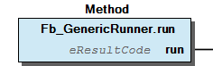

# WagoTypesCommon v1.6.0.0 (WAGO) - Complete Documentation


## 📋 Library Information

- **Company:** WAGO
- **Title:** WagoTypesCommon
- **Version:** 1.6.0.0
- **Categories:** WAGO FunctionalView|Base; WAGO LayerView|Types and Interfaces; Application
- **Namespace:** WagoTypes
- **Author:** WAGO / u013972
- **Placeholder:** WagoTypesCommon

### Description ¶


This document is automatically generated. Because of this, the chapter 30 Visualization is not shown in this document. If you are interested in getting to know more about visualization, we refer to the library manager of e!Cockpit.

Ubiquitous type definitions which are not specific to individual targets [1]

This document is automatically generated. Because of this, the chapter 30 Visualization is not shown in this document. If you are interested in getting to know more about visualization, we refer to the library manager of e!Cockpit. Ubiquitous type definitions which are not specific to individual targets [1]

### Contents: ¶


Contents: - Documentation Index - Project Information - Library Information - Function Blocks - Functions - Methods - Other Components 21 ResultCodes - 22 Memory - 23 FileDir - 24 Time - 25 Async - 28 Generics - FileName (ALIAS) - ParameterList (PARAMS) - WagoClientIdentification (ALIAS) - aPointerArray (ALIAS) - ... and 14 more

### Indices and tables ¶


| [1] | Based on WagoTypesCommon.library, last modified 30.06.2022, 14:42:20. LibDoc 3.5.15.30 |

© WAGO Kontakttechnik GmbH & Co. KG, Germany 2018 – All rights reserved. For the avoidance of doubt, this copyright notice does not only apply to the information above but also and primarily to the described library itself. Please note that third-party products are always mentioned without reference to intellectual property rights, including patents, utility models, designs and trademarks, accordingly the existence of such rights cannot be excluded. WAGO is a registered trademark of WAGO Verwaltungsgesellschaft mbH.

- File and Project Information - Library Reference © WAGO Kontakttechnik GmbH & Co. KG, Germany 2018 – All rights reserved. For the avoidance of doubt, this copyright notice does not only apply to the information above but also and primarily to the described library itself. Please note that third-party products are always mentioned without reference to intellectual property rights, including patents, utility models, designs and trademarks, accordingly the existence of such rights cannot be excluded. WAGO is a registered trademark of WAGO Verwaltungsgesellschaft mbH.

### Documentation Index


## WagoTypesCommon Library Documentation


| Company: | WAGO |
| Title: | WagoTypesCommon |
| Version: | 1.6.0.0 |
| Categories: | WAGO FunctionalView\|Base; WAGO LayerView\|Types and Interfaces; Application |
| Namespace: | WagoTypes |
| Author: | WAGO / u013972 |
| Placeholder: | WagoTypesCommon |

### Description


This document is automatically generated. Because of this, the chapter 30 Visualization is not shown in this document. If you are interested in getting to know more about visualization, we refer to the library manager of e!Cockpit.

Ubiquitous type definitions which are not specific to individual targets [1]

This document is automatically generated. Because of this, the chapter 30 Visualization is not shown in this document. If you are interested in getting to know more about visualization, we refer to the library manager of e!Cockpit. Ubiquitous type definitions which are not specific to individual targets [1]

### Contents:


- 21 ResultCodes eResultCode (ENUM) - eSeverity (ENUM) 22 Memory - eChar (ENUM) - vPointer (ALIAS) - void (ALIAS) 23 FileDir - FileName (ALIAS) - eFileAccessMode (ENUM) - eFileSyncMode (ENUM) - eSeekMode (ENUM) - typFileProperties (STRUCT) 24 Time - typRTS_SYSTIMEDATE (STRUCT) - typTimeZoneDescription (STRUCT) - typWagoTimeComponents (STRUCT) 25 Async - eSchedulingMode (ENUM) 28 Generics - Fb_GenericRunner (FB) - WagoClientIdentification (ALIAS) - aPointerArray (ALIAS) - unPointer (UNION) FuGetVersionHistory (FUN) ParameterList (PARAMS)

### Indices and tables


| [1] | Based on WagoTypesCommon.library, last modified 30.06.2022, 14:42:20. LibDoc 3.5.15.30 |

© WAGO Kontakttechnik GmbH & Co. KG, Germany 2018 – All rights reserved. For the avoidance of doubt, this copyright notice does not only apply to the information above but also and primarily to the described library itself. Please note that third-party products are always mentioned without reference to intellectual property rights, including patents, utility models, designs and trademarks, accordingly the existence of such rights cannot be excluded. WAGO is a registered trademark of WAGO Verwaltungsgesellschaft mbH.

- File and Project Information - Library Reference © WAGO Kontakttechnik GmbH & Co. KG, Germany 2018 – All rights reserved. For the avoidance of doubt, this copyright notice does not only apply to the information above but also and primarily to the described library itself. Please note that third-party products are always mentioned without reference to intellectual property rights, including patents, utility models, designs and trademarks, accordingly the existence of such rights cannot be excluded. WAGO is a registered trademark of WAGO Verwaltungsgesellschaft mbH.

### Project Information


## File and Project Information


| Scope | Name | Type | Content |
| --- | --- | --- | --- |
| FileHeader | libraryFile | string | WagoTypesCommon.library |
| contentFile | WagoTypesCommon_clr.json |
| productName | e!COCKPIT |
| creationDateTime | date | 30.06.2022, 14:42:27 |
| companyName | string | WAGO |
| ProjectInformation | LastModificationDateTime | date | 30.06.2022, 14:42:20 |
| Description | string | See: Description |
| Copyright | © WAGO Kontakttechnik GmbH & Co. KG, Germany 2018 – All rights reserved. |
| Author | WAGO / u013972 |
| AutoResolveUnbound | bool | True |
| Placeholder | string | WagoTypesCommon |
| Company | WAGO |
| DocFormat | reStructuredText |
| Project | WagoTypesCommon |
| DefaultNamespace | WagoTypes |
| Version | version | 1.6.0.0 |
| Title | string | WagoTypesCommon |
| LibraryCategories | library-category-list | WAGO FunctionalView\|Base; WAGO LayerView\|Types and Interfaces; Application |
| CompiledLibraryCompatibilityVersion | string | CODESYS V3.5 SP17 Patch 3 |

### Library Information


## Library Reference


This is a dictionary of all referenced libraries and their name spaces.

This is a dictionary of all referenced libraries and their name spaces.

### Function Blocks


## Fb_GenericRunner (FB)


```
////////////////////////////////////////////////////////////////////////////////////
// we have two different function blocks, which behave similarly but are not identical
////////////////////////////////////////////////////////////////////////////////////

FUNCTION_BLOCK Fb_MyFunction EXTENDS Fb_GenericRunner
    METHOD run : eResultCode // individual code to run

FUNCTION_BLOCK Fb_MyOtherFunction EXTENDS Fb_GenericRunner
    METHOD run : eResultCode // individual code to run

VAR InstanceA :  Fb_MyFunction;      END_VAR
VAR InstanceB :  Fb_MyOtherFunction; END_VAR

//////////////////////////////////////////////////////////////////////////////////
// We have a general function, which calls any of our FB 5 times.
//////////////////////////////////////////////////////////////////////////////////

FUNCTION RunFiveTimes(Runner: Fb_GenericRunner);     // can be fed with MyFunction
    FOR i := 1 TO 5 DO                               // as well as with MyOtherFunction
        Runner.Run();                                // whatever FB is passed here, run it
    END_FOR;

//////////////////////////////////////////////////////////////////////////////////
// Depending on some external condition, we want to run either InstanceA or InstanceB five times.
//////////////////////////////////////////////////////////////////////////////////


IF (condition) THEN
    RunFiveTimes(InstanceA);
ELSE
    RunFiveTimes(InstanceB);
END_IF;
```

** Function**

This FB serves as a substitute for function pointers.

Graphical Illustration

Function Description

For usage, derive a new class from this base and add input and output variables as necessary. Put whatever the function is supposed to do into the method run() . Parameters are expected to be passed via member variables of the derived class.

** Function** This FB serves as a substitute for function pointers. Graphical Illustration  Function Description For usage, derive a new class from this base and add input and output variables as necessary. Put whatever the function is supposed to do into the method run() . Parameters are expected to be passed via member variables of the derived class. Example - Fb_GenericRunner.run (METH)

### Functions


## FuGetVersionHistory (FUN)


| Scope | Name | Type |
| --- | --- | --- |
| Return | FuGetVersionHistory | DWORD |

| date | version | author | change |
| 05.04.2022 | 1.6.0.0 | u1010371 | rename object type “char” to “eChar” |
| 11.03.2022 | 1.5.3.1 | u1010371 | extend max length of datatype String,WString |
| 08.01.2019 | 1.5.3.0 | u015842 | Properties: free placeholder added |
| 30.09.2016 | 1.5.2.0 | WAGO / u013972 | Add POINTER TO WSTRING to unPointer |
| 12.04.2016 | 1.5.1.1 | WAGO / u013972 | Documentation Update |
| 23.09.2015 | 1.5.1.0 | WAGO / u013972 | Workaround C0351-Bug |
| 03.07.2015 | 1.5.0.0 | WAGO / u013972 | Release Version |

WagoTypesCommon

Interface variables WagoTypesCommon

### Methods


## Fb_GenericRunner.run (METH)


| Scope | Name | Type |
| --- | --- | --- |
| Return | run | eResultCode |

This method is called when the runner is executed.

Graphical Illustration

Function Description

This method is expected to be implemented (overwritten) by derived classes.

In this fundamental state of definition, no assumptions are made for return values. Thus, if not used, the return value might have undefined behaviour.

It is, however, good paractice to return at least 0=ok even if the return value is omitted, becaused derived FBs might interprete the result code.

Interface variables Function This method is called when the runner is executed. Graphical Illustration  Function Description This method is expected to be implemented (overwritten) by derived classes. In this fundamental state of definition, no assumptions are made for return values. Thus, if not used, the return value might have undefined behaviour. It is, however, good paractice to return at least 0=ok even if the return value is omitted, becaused derived FBs might interprete the result code.

### Other Components


## 21 ResultCodes


- eResultCode (ENUM) - eSeverity (ENUM)

## 22 Memory


- eChar (ENUM) - vPointer (ALIAS) - void (ALIAS)

## 23 FileDir


General types which are used mainly for file access.

General types which are used mainly for file access. - FileName (ALIAS) - eFileAccessMode (ENUM) - eFileSyncMode (ENUM) - eSeekMode (ENUM) - typFileProperties (STRUCT)

## 24 Time


- typRTS_SYSTIMEDATE (STRUCT) - typTimeZoneDescription (STRUCT) - typWagoTimeComponents (STRUCT)

## 25 Async ¶


- eSchedulingMode (ENUM)

## 28 Generics


- Fb_GenericRunner (FB) Fb_GenericRunner.run (METH) WagoClientIdentification (ALIAS) aPointerArray (ALIAS) unPointer (UNION)

## FileName (ALIAS)


Name of a file or other resource.

FileNames are defined as STRING(255). Despite the naming, they may also denote directory names or other resources.

Function Name of a file or other resource. FileNames are defined as STRING(255). Despite the naming, they may also denote directory names or other resources.

## ParameterList (PARAMS)


| Scope | Name | Type | Initial |
| --- | --- | --- | --- |
| Constant | MAX_STRING_LENGTH | UDINT | 255 |
| MAX_WSTRING_LENGTH | UDINT | 255 |

## WagoClientIdentification (ALIAS)


```
VAR
   ID :  WagoClientIdentification := ADR(myInstance);
END_VAR;
AccessAnyRessource( ID );
```

This types serves for uniquely identifying resources.

Typical usage:

Function This types serves for uniquely identifying resources. Typical usage:

## aPointerArray (ALIAS)


A list of pointers to various types.

Function A list of pointers to various types.

## eChar (ENUM)


| Name | Initial |
| --- | --- |
| Null | 16#0 |
| Bell | 16#7 |
| Backspace | 16#8 |
| Tab | 16#9 |
| LineFeed | 16#A |
| FormFeed | 16#C |
| CarriageReturn | 16#D |
| DC1 | 16#11 |
| DC2 | 16#12 |
| DC3 | 16#13 |
| DC4 | 16#14 |
| Escape | 16#1B |
| Space | 16#20 |
| Exclamation | 16#21 |
| Quotation | 16#22 |
| Number | 16#23 |
| Dollar | 16#24 |
| Percent | 16#25 |
| Ampersand | 16#26 |
| Apostrophe | 16#27 |
| LeftParenthesis | 16#28 |
| RightParenthesis | 16#29 |
| Asterisk | 16#2A |
| Plus | 16#2B |
| Comma | 16#2C |
| Minus | 16#2D |
| Dot | 16#2E |
| Slash | 16#2F |
| Num0 | 16#30 |
| Num1 | 16#31 |
| Num2 | 16#32 |
| Num3 | 16#33 |
| Num4 | 16#34 |
| Num5 | 16#35 |
| Num6 | 16#36 |
| Num7 | 16#37 |
| Num8 | 16#38 |
| Num9 | 16#39 |
| Colon | 16#3A |
| Semicolon | 16#3B |
| LessThan | 16#3C |
| Equal | 16#3D |
| GreaterThan | 16#3E |
| Question | 16#3F |
| CommercialAt | 16#40 |
| CapA | 16#41 |
| CapB | 16#42 |
| CapC | 16#43 |
| CapD | 16#44 |
| CapE | 16#45 |
| CapF | 16#46 |
| CapG | 16#47 |
| CapH | 16#48 |
| CapI | 16#49 |
| CapJ | 16#4A |
| CapK | 16#4B |
| CapL | 16#4C |
| CapM | 16#4D |
| CapN | 16#4E |
| CapO | 16#4F |
| CapP | 16#50 |
| CapQ | 16#51 |
| CapR | 16#52 |
| CapS | 16#53 |
| CapT | 16#54 |
| CapU | 16#55 |
| CapV | 16#56 |
| CapW | 16#57 |
| CapX | 16#58 |
| CapY | 16#59 |
| CapZ | 16#5A |
| LeftSquareBracket | 16#5B |
| Backslash | 16#5C |
| RightSquareBracket | 16#5D |
| Circumflex | 16#5E |
| Underline | 16#5F |
| Grave | 16#60 |
| SmallA | 16#61 |
| SmallB | 16#62 |
| SmallC | 16#63 |
| SmallD | 16#64 |
| SmallE | 16#65 |
| SmallF | 16#66 |
| SmallG | 16#67 |
| SmallH | 16#68 |
| SmallI | 16#69 |
| SmallJ | 16#6A |
| SmallK | 16#6B |
| SmallL | 16#6C |
| SmallM | 16#6D |
| SmallN | 16#6E |
| SmallO | 16#6F |
| SmallP | 16#70 |
| SmallQ | 16#71 |
| SmallR | 16#72 |
| SmallS | 16#73 |
| SmallT | 16#74 |
| SmallU | 16#75 |
| SmallV | 16#76 |
| SmallW | 16#77 |
| SmallX | 16#78 |
| SmallY | 16#79 |
| SmallZ | 16#7A |
| LeftCurlyBracket | 16#7B |
| VerticalLine | 16#7C |
| RightCurlyBracket | 16#7D |
| Tilde | 16#7E |
| DEL | 16#7F |
| Last | 16#FF |

Standard ASCII definitions for assigments to BYTE like b := Char.Slash;

InOut: Function Standard ASCII definitions for assigments to BYTE like b := Char.Slash;

## eFileAccessMode (ENUM)


| Name | Initial | Comment |
| --- | --- | --- |
| FAM_None | 0 | No file access (internal use only) |
| FAM_Write | 1 | Open write-only. |
| FAM_Read | 2 | Open read-only. File must exist. |
| FAM_ReadWrite | 3 | Open for random access. |
| FAM_Append | 4 | Open write-only, existing file will be appended. |

Different modes of access (read, write, ... ) for opening files.

Function Description

When opening a file, the application has to specify the mode of access for further operation. Four modes are defined:

Please note: These access modes may not match directly to linux or windows access modes.

InOut: Function Different modes of access (read, write, ... ) for opening files. Function Description When opening a file, the application has to specify the mode of access for further operation. Four modes are defined: FAM_Write: Open write-only. The file will be truncated to zero (if exists) or newly created (if it does not exist) FAM_Read: Open read-only. File must exist. FAM_ReadWrite: Open for random access. File will be overwritten and pointer set to zero-pos (if exists) or file will be newly created (if it does not exist) FAM_Append: Open write-only. Filepointer will be set to End-Of-File if the file exists or the file will be newly created if it does not exist. Please note: These access modes may not match directly to linux or windows access modes.

## eFileSyncMode (ENUM)


| Name | Initial | Comment |
| --- | --- | --- |
| FSM_Regular | 0 | No explicit synchronization. |
| FSM_SafeClose | 1 | Close() waits for final writing of data. |
| FSM_SyncedWrite | 2 | Each write() leaves the media in a consistent state. |

Controls when data is actually written to the physical media.

InOut: Function Controls when data is actually written to the physical media.

## eResultCode (ENUM)


| Name | Initial | Comment |
| --- | --- | --- |
| OK | 0 | Operation successfull finished, no error (Not Posix but useful) |
| EPERM | 1 | Operation NOT permitted |
| ENOENT | 2 | No such file or directory |
| ESRCH | 3 | No such process |
| EINTR | 4 | Interrupted system call |
| EIO | 5 | I/O error |
| ENXIO | 6 | No such device or address |
| E2BIG | 7 | Argument list too long |
| ENOEXEC | 8 | Exec format error |
| EBADF | 9 | Bad file number / File not open |
| ECHILD | 10 | No child processes |
| EAGAIN | 11 | Try again |
| ENOMEM | 12 | Out of memory |
| EACCES | 13 | Permission denied |
| EFAULT | 14 | Bad address |
| ENOTBLK | 15 | Block device required |
| EBUSY | 16 | Device or resource busy |
| EEXIST | 17 | File exists |
| EXDEV | 18 | Cross-device link |
| ENODEV | 19 | No such device |
| ENOTDIR | 20 | Not a directory |
| EISDIR | 21 | Is a directory |
| EINVAL | 22 | Invalid argument |
| ENFILE | 23 | File table overflow |
| EMFILE | 24 | Too many open files |
| ENOTTY | 25 | Not a typewriter |
| ETXTBSY | 26 | Text file busy |
| EFBIG | 27 | File too large |
| ENOSPC | 28 | No space left on device |
| ESPIPE | 29 | Illegal seek |
| EROFS | 30 | Read-only file system |
| EMLINK | 31 | Too many links |
| EPIPE | 32 | Broken pipe |
| EDOM | 33 | Math argument out of domain of func |
| ERANGE | 34 | Math result not representable |
| EDEADLK | 35 | Resource deadlock would occur |
| ENAMETOOLONG | 36 | File name too long |
| ENOLCK | 37 | No record locks available |
| ENOSYS | 38 | Function not implemented |
| ENOTEMPTY | 39 | Directory not empty |
| ELOOP | 40 | Operation seems to be in a deadlock |
| EWOULDBLOCK | 41 | Operation would block |
| ENOMSG | 42 | No message of desired type |
| EIDRM | 43 | Identifier removed |
| ECHRNG | 44 | Channel number out of range |
| EL2NSYNC | 45 | Level 2 not synchronized |
| EL3HLT | 46 | Level 3 halted |
| EL3RST | 47 | Level 3 reset |
| ELNRNG | 48 | Link number out of range |
| EUNATCH | 49 | Protocol driver not attached |
| ENOCSI | 50 | No CSI structure available |
| EL2HLT | 51 | Level 2 halted |
| EBADE | 52 | Invalid exchange |
| EBADR | 53 | Invalid request descriptor |
| EXFULL | 54 | Exchange full |
| ENOANO | 55 | No anode |
| EBADRQC | 56 | Invalid request code |
| EBADSLT | 57 | Invalid slot |
| EBFONT | 59 | Bad font file format |
| ENOSTR | 60 | Device not a stream |
| ENODATA | 61 | No data available |
| ETIME | 62 | Timer expired |
| ENOSR | 63 | Out of streams resources |
| ENONET | 64 | Machine is not on the network |
| ENOPKG | 65 | Package not installed |
| EREMOTE | 66 | Object is remote |
| ENOLINK | 67 | Link has been severed |
| EADV | 68 | Advertise error |
| ESRMNT | 69 | Srmount error |
| ECOMM | 70 | Communication error on send |
| EPROTO | 71 | Protocol error |
| EMULTIHOP | 72 | Multihop attempted |
| EDOTDOT | 73 | RFS specific error |
| EBADMSG | 74 | Not a data message |
| EOVERFLOW | 75 | Value too large for defined data type |
| ENOTUNIQ | 76 | Name not unique on network |
| EBADSTATE | 77 | File descriptor in bad state (see note 1) |
| EREMCHG | 78 | Remote address changed |
| ELIBACC | 79 | Can not access a needed shared library |
| ELIBBAD | 80 | Accessing a corrupted shared library |
| ELIBSCN | 81 | .lib section in a.out corrupted |
| ELIBMAX | 82 | Attempting to link in too many shared libraries |
| ELIBEXEC | 83 | Cannot exec a shared library directly |
| EILSEQ | 84 | Illegal byte sequence |
| ERESTART | 85 | Interrupted system call should be restarted |
| ESTRPIPE | 86 | Streams pipe error |
| EUSERS | 87 | Too many users |
| ENOTSOCK | 88 | Socket operation on non-socket |
| EDESTADDRREQ | 89 | Destination address required |
| EMSGSIZE | 90 | Message too long |
| EPROTOTYPE | 91 | Protocol wrong type for socket |
| ENOPROTOOPT | 92 | Protocol not available |
| EPROTONOSUPPORT | 93 | Protocol not supported |
| ESOCKTNOSUPPORT | 94 | Socket type not supported |
| EOPNOTSUPP | 95 | Operation not supported on transport endpoint |
| EPFNOSUPPORT | 96 | Protocol family not supported |
| EAFNOSUPPORT | 97 | Address family not supported by protocol |
| EADDRINUSE | 98 | Address already in use |
| EADDRNOTAVAIL | 99 | Cannot assign requested address |
| ENETDOWN | 100 | Network is down |
| ENETUNREACH | 101 | Network is unreachable |
| ENETRESET | 102 | Network dropped connection because OF reset |
| ECONNABORTED | 103 | Software caused connection abort |
| ECONNRESET | 104 | Connection reset BY peer |
| ENOBUFS | 105 | No buffer space available |
| EISCONN | 106 | Transport endpoint is already connected |
| ENOTCONN | 107 | Transport endpoint is NOT connected |
| ESHUTDOWN | 108 | Cannot send after transport endpoint shutdown |
| ETOOMANYREFS | 109 | Too many references: cannot splice |
| ETIMEDOUT | 110 | Connection timed out |
| ECONNREFUSED | 111 | Connection refused |
| EHOSTDOWN | 112 | Host is down |
| EHOSTUNREACH | 113 | No route TO host |
| EALREADY | 114 | Operation already in progress |
| EINPROGRESS | 115 | Operation now in progress |
| ESTALE | 116 | Stale NFS file handle |
| EUCLEAN | 117 | Structure needs cleaning |
| ENOTNAM | 118 | not a XENIX named TYPE file |
| ENAVAIL | 119 | No XENIX semaphores available |
| EISNAM | 120 | Is a named TYPE file |
| EREMOTEIO | 121 | Remote I/O error |
| EDQUOT | 122 | Quota exceeded |
| ENOMEDIUM | 123 | No medium found |
| EMEDIUMTYPE | 124 | Wrong medium type |
| ECANCELED | 125 | Operation Canceled |
| ENOKEY | 126 | Required key NOT available |
| EKEYEXPIRED | 127 | Key has expired |
| EKEYREVOKED | 128 | Key has been revoked |
| EKEYREJECTED | 129 | Key was rejected by service |
| EOWNERDEAD | 130 | Owner died |
| ENOTRECOVERABLE | 131 | State not recoverable |
| EDEFAULT | 132 | Resource did not change from default state (not Posix) |
| EPENDING | 133 | Operation or event is expected to occur |
| ETERMINATED | 134 | Operation has terminated but the ressources are allocated |
| EUNSPECIFIC | 135 | Error whichs nature is not further specified |
| EDISABLED | 136 | The requested function is temporarily disabled |
| EREJECTED | 137 | The requested service was not accepted. |
| ENOSUCCESS | 138 | The operation did not yield a successful result |
| EBREAKPT | 139 | This is a regular breakpoint, where operation may be resumed or not. |
| ETIMEINFO | 140 | Timeout which is not a fault but an anticipated result. |
| EAPP | 200 | Application specific error (not Posix) |
| EAPPMAX | 999 | top of the code range for applications |
| EMAX | 32767 | absolutely last error code |

```
METHOD DoTheWork(VAR_OUTPUT Data : MyDataType) : eResultCode
:
IF DotheWork(Data=>Buffer) <> OK THEN
    DoErrorProcessing()
END_IF
```

```
FUNCTION oldstyle(VAR_INPUT pResult : POINTER TO UDINT) : MyDataType // DO NOT USE!
```

```
FUNCTION ConvertMemBlockToString(VAR INPUT pMem, udiBlockSize) : STRING
```

```
======  ============================================================
**Result Codes** of CopyFile()
--------------------------------------------------------------------
0       Success
EINVAL  Bad prefix or invalid filename
ENOENT  The addressed entity or source file does not exist
EISDIR  The addressed source is a directory, not a file as expected
EEXIST  The destination file exists and must not be overwritten
======  ============================================================
```

```
//////////////////////////////////////////////////////////////////////////////////////
// (a) standard codes only
VAR eResult_.. : eResultCode;

eResult_01 := OK;           // standard code
eResult_02 := EINVAL;       // standard code
eResult_03 := 202;          // possible, but avoid this! hard coding is highly deprecated!

//////////////////////////////////////////////////////////////////////////////////////
// (b) definition of individual codes by offset
TYPE eIndividualOffsets :
  (
  ofsElevatorDefect  := 0,
  ofsBuildingOnFire  := 1,
  ofsNoWater         := 2,
  ofsEarthquake      := 3,
  ofsNoElectricity   := 4
 ) WORD;
END_TYPE

eResult_04 := EAPP + eIndividualOffsets.ofsNoWater; // definition of individual offsets

//////////////////////////////////////////////////////////////////////////////////////
// (c) definition of individual codes by real result code numbers
TYPE eIndividualCodes :
  (
  ElevatorDefect  := 200,
  BuildingOnFire  := 201,
  NoWater         := 202,
  Earthquake      := 203,
  NoElectricity   := 204
  ) WORD;
END_TYPE

eResult_05 := OK + eIndividualCodes.NoWater;      // definition of individual result codes

//////////////////////////////////////////////////////////////////////////////////////
// (d) usage of wrapping function
FUNCTION BuildingCodes : eResultCode
VAR_INPUT e : eIndividualCodes; END_VAR
BuildingCodes := OK + e;                          // workaround to avoid warnings

eResult_06 := BuildingCodes(ElevatorDefect);      // converter function to avoid warnings

//////////////////////////////////////////////////////////////////////////////////////
// (d) usage of global constants
VAR_GLOBAL CONSTANT
  ELEVATOR_DEFECT  : WORD := 200;
  BUILDING_ON_FIRE : WORD := 201;
  NO_WATER         : WORD := 202;
  EARTHQUAKE       : WORD := 203;
  NO_ELECTRICITY   : WORD := 204;
END_VAR

eResult_07 := NO_ELECTRICITY;                     // usage of global constants

//////////////////////////////////////////////////////////////////////////////////////
// (e) standard eResults can be mixed with individual codes

IF eResult_07 = eIndividualCodes.BuildingOnFire THEN // attn: comparison of different types
  panic();
END_IF
```

Operation return status, according to POSIX.1 (1996 edition).

This list closely reflects the Posix definitions of error symbols which are used commonly in lots of situations and which should more or less cover a majority of standard situations. They are used here for the sake of international standardization.

When functions report errors, however, typically only a small subset of these codes are used by a single function or function block. So, although the general meaning of these codes is listed here, the header of each function SHOULD contain a list of the result codes which are actually used there together with a description of the circumstances in which that function will return a specific code.

When a function gets result codes from other functions, it is normally very bad style to pass this result code upwards without further analysis of the code, because the results might be not well-specified. Instead, the result code SHOULD be analyzed internally and mapped to that result code set which is specified in the header.

Returning Result Codes

A large variety of different methods for returning status codes could be found in existing Codesys-code. For the sake of uniform handling, however, when a result code is involved in functions or methods, it should be returned as primary return value:

Other results of the function are to be returned via VAR_OUTPUT or VAR_IN_OUT, whereas the information about failure or success is given by standard via the primary return value.

Deprecated style: Another frequently seen sheme which involves pointers to a result variable is strongly deprecated:

Reason: When using this sheme, it remains pretty unclear,

This style SHOULD NOT be used in new code. It is strongly encouraged to port legacy code to standard behaviour.

Note: There are lots of situations where handling of a result code in simple functions is not necessary. In these cases the primary return value may carry the processed value directly, while minor error conditions would lead to certain default values of the result:

In case of passing a nullpointer, just an empty string might be returned and a result code is not necessary in most applications.

Documentation of Result Codes

When result codes are returned, typically only a small fraction of the possible range of codes is used by a single function. For the object which returns error codes, it must be individually documented, which error codes could be expected at all (a general reference to the list of all codes, although that is common practice in Codesys, is not sufficient). E.g.:

Application specific result codes

While the standard codes are expected to cover most standard situations, specialized libraries might need individual result codes. For this purpose, the code range 200..999 is reserved for local individual extentions.

The result code EAPP (=200) denotes the begin of the application specific code range.

Note: Codes in this range are specific to the library which introduce it. These codes will not be registered centrally, so other libraries may use the same range of numbers if their authors do not cooperate. If global uniqueness of user defined result codes would be required, it would be apprropriate, to embed the resultcodes into an FbError -Object (WagoAppErrorBase.library)

Unfortunately, actual Codesys compilers do not allow “EXTENDS” to an enumeration, but a number of feasible ways exist to smoothly integrate individual codes into eResultCodes as shown below.

(see example_typedefs.project in the repository for reference)

note (1) This entry was changed from original EBADFD to overcome confusion with EBADF

InOut: Function Operation return status, according to POSIX.1 (1996 edition). This list closely reflects the Posix definitions of error symbols which are used commonly in lots of situations and which should more or less cover a majority of standard situations. They are used here for the sake of international standardization. When functions report errors, however, typically only a small subset of these codes are used by a single function or function block. So, although the general meaning of these codes is listed here, the header of each function SHOULD contain a list of the result codes which are actually used there together with a description of the circumstances in which that function will return a specific code. When a function gets result codes from other functions, it is normally very bad style to pass this result code upwards without further analysis of the code, because the results might be not well-specified. Instead, the result code SHOULD be analyzed internally and mapped to that result code set which is specified in the header. Returning Result Codes A large variety of different methods for returning status codes could be found in existing Codesys-code. For the sake of uniform handling, however, when a result code is involved in functions or methods, it should be returned as primary return value: Other results of the function are to be returned via VAR_OUTPUT or VAR_IN_OUT, whereas the information about failure or success is given by standard via the primary return value. Deprecated style: Another frequently seen sheme which involves pointers to a result variable is strongly deprecated: Reason: When using this sheme, it remains pretty unclear, 1. if the previous result of pResult^ possibly serves as input and thus would have to be initialized and 2. it remains unclear if pResult^ is written at all in certain situations. This style SHOULD NOT be used in new code. It is strongly encouraged to port legacy code to standard behaviour. Note: There are lots of situations where handling of a result code in simple functions is not necessary. In these cases the primary return value may carry the processed value directly, while minor error conditions would lead to certain default values of the result: In case of passing a nullpointer, just an empty string might be returned and a result code is not necessary in most applications. Documentation of Result Codes When result codes are returned, typically only a small fraction of the possible range of codes is used by a single function. For the object which returns error codes, it must be individually documented, which error codes could be expected at all (a general reference to the list of all codes, although that is common practice in Codesys, is not sufficient). E.g.: Application specific result codes While the standard codes are expected to cover most standard situations, specialized libraries might need individual result codes. For this purpose, the code range 200..999 is reserved for local individual extentions. The result code EAPP (=200) denotes the begin of the application specific code range. Note: Codes in this range are specific to the library which introduce it. These codes will not be registered centrally, so other libraries may use the same range of numbers if their authors do not cooperate. If global uniqueness of user defined result codes would be required, it would be apprropriate, to embed the resultcodes into an FbError -Object (WagoAppErrorBase.library) Unfortunately, actual Codesys compilers do not allow “EXTENDS” to an enumeration, but a number of feasible ways exist to smoothly integrate individual codes into eResultCodes as shown below. (see example_typedefs.project in the repository for reference) note (1) This entry was changed from original EBADFD to overcome confusion with EBADF

## eSchedulingMode (ENUM)


| Name | Initial | Comment |
| --- | --- | --- |
| RealTimeHigh | 1 | Highest priority for asynchronous tasks (see below) |
| RealTimeMedium | 2 | Medium priority for task with realtime requirements |
| RealTimeLow | 3 | Lowest priority for task with realtime requirements |
| AsyncHigh | 4 | Highest priority for tasks without realtime properties |
| AsyncMedium | 7 | Medium priority for tasks without realtime properties |
| AsyncLow | 14 | Lowest priority prior to the main task |
| Background | 15 | Standard for regular tasks |
| Synchronous | -1 | Running synchronously in the same task and context (no async scheduling) |
| NoScheduling | -2 | Not scheduled in any mode (for output purposes only) |

```
eSchedMode := eSchedulingMode.Background;                                  // regular assignment
eSchedMode := SchedulingMode(eSchedulingModeEvent.Modbus_Watchdog_Expired); // device specific assignment
```

```
eSchedMode := SchedulingMode_EventPriority(eSchedulingModeEvent.Modbus_Watchdog_Running,
                                           eSchedulingMode.AsyncLow);
```

This enumeration controls the details of asynchronous scheduling of an FB.

Function Description

This type is used as input parameter for asynchronous scheduling of jobs. The following values are used:

Various PLCs allow to schedule the execution of tasks synchronous to certain external events. It depends on the hardware which events are supported. An additional enumeration eSchedulingModeEvent is provided via the device description. The values from this enumeration may be safely inserted when eSchedulingMode is expected.

In order to avoid false warnings, a type cast function is also provided from the library that provides specific scheduling modes:

Triggering on external events with additional prioritizing:

Some target hardware allows for combining external events with additional scheduling priority. In this case, the wrapping function SchedulingMode_EventPriority() is to be used for combining both to a single scheduling mode value:

Other values than these are reserved for future usage and MUST NOT be used. When scheduling modes are used in applications, however, they must always be referred to by symbolic names, never by plain numbers.

(The type casts SchedulingMode() and SchedulingMode_EventPriority() are defined in the target specific library resolved by the placeholder WagoTypesAsyncInternal . They are automatically loaded together with WagoSysAsync.library .)

In certain very special situations the function SchedulingMode_EventPriority() might be fed with other priorities than defined here. In those cases it MUST be crosschecked against the library WagoTypesAsync_Internal_~ if those exceptional values are valid.

InOut: Function This enumeration controls the details of asynchronous scheduling of an FB. Function Description This type is used as input parameter for asynchronous scheduling of jobs. The following values are used: eSchedulingMode.Synchronous: This mode represents execution within the synchrounous IEC task context. The execution is not deferred to other tasks, but takes place immediatelly after calling and blocks the calling application during execution. Note: This mode is mostly used when developing own asnchronous FBs. eSchedulingMode.RealTimeHigh (=1): Execution in a different asynchronous task with runs priorized over the IEC task but subordinate to tasks for external interfaces. Latency in the RealTime-scheduling group is expected to be substatially low, because execution could not be delayed by external interface tasks. In contrast, tasks with priority 1-3 might possibly delay external interfaces. Thus, this mode is not advisable for long running tasks. eSchedulingMode.RealTimeMedium/Low (=2/3): These modes denote the essentially similar to RealTimeHigh, but with lower priority. These tasks will not delay RealTimeHigh-tasks, but could be delayed by them. eSchedulingMode.AsyncHigh (=4): Tasks in this mode will not block field bus communication, but could be delayed by field bussed. Latency in this mode might be high, because execution might be delayed by external influences - such as field busses. eSchedulingMode.AsyncMedium/Low (=7/14): Same properties as AsyncHigh but with subordinate priority. In typical scenarios, visualization applications (which need not to be realtime but should keep a minimum of response time) would be scheduled to AsyncMedium while long running deferred tasks (such as filecopy) would run in AsyncLow or Background. eSchedulingMode.Background (=15): Tasks in this mode are fed with the resources which remain to the system after otherwise priorized tasks are done. This is intended for longrunning work which has no time constraints for latency or termination. Triggering on external events: Various PLCs allow to schedule the execution of tasks synchronous to certain external events. It depends on the hardware which events are supported. An additional enumeration eSchedulingModeEvent is provided via the device description. The values from this enumeration may be safely inserted when eSchedulingMode is expected. In order to avoid false warnings, a type cast function is also provided from the library that provides specific scheduling modes: Triggering on external events with additional prioritizing: Some target hardware allows for combining external events with additional scheduling priority. In this case, the wrapping function SchedulingMode_EventPriority() is to be used for combining both to a single scheduling mode value: Other values than these are reserved for future usage and MUST NOT be used. When scheduling modes are used in applications, however, they must always be referred to by symbolic names, never by plain numbers. Note (The type casts SchedulingMode() and SchedulingMode_EventPriority() are defined in the target specific library resolved by the placeholder WagoTypesAsyncInternal . They are automatically loaded together with WagoSysAsync.library .) Caveat: In certain very special situations the function SchedulingMode_EventPriority() might be fed with other priorities than defined here. In those cases it MUST be crosschecked against the library WagoTypesAsync_Internal_~ if those exceptional values are valid.

## eSeekMode (ENUM)


| Name | Initial | Comment |
| --- | --- | --- |
| fromStart | 0 | (SEEK_SET) Position the file pointer relative to start of file. |
| fromEnd | 1 | (SEEK_END) Position the file pointer relative to file end. |
| fromActualPosition | 2 | (SEEK_CUR) Positioning relative to actual position. |

Mode for File-Seek

Function Description

When a positioning ( Seek() ) is performed within a file, you have to specify the reference index for positioning the new write pointer.

Caveat: When eSeekMode.fromEnd is applied, the corresponing positioning value will typically carry a negative value (unless the desired position is beyound the end of the file). In mode fromActualPosition both negative and positive values are common.

InOut: Function Mode for File-Seek Function Description When a positioning ( Seek() ) is performed within a file, you have to specify the reference index for positioning the new write pointer. Caveat: When eSeekMode.fromEnd is applied, the corresponing positioning value will typically carry a negative value (unless the desired position is beyound the end of the file). In mode fromActualPosition both negative and positive values are common.

## eSeverity (ENUM)


| Name | Initial | Comment |
| --- | --- | --- |
| none | 16#0 | Everything ok, not worth further processing. |
| info | 16#1 | Informational status only. |
| warning | 16#2 | The state is abnormal but does not conflict with the regular process. |
| error | 16#4 | A conflict with the regular process is indicated. |
| exception | 16#8 | A conflict with which is so heavy that it requires abortion of the process. |
| debug | 16#10 | The message should not pop up in production code. For development purposeses only. |
| all | 16#1F | A mask, covering all messages. |
| unknown | 16#40 | It is not clear which severity applies here. |
| volatile | 16#80 | The message should not be processed further. |

Indicates a level how severe a message, event, or report, etc. is. This is used mainly for logfiles.

InOut: Function Indicates a level how severe a message, event, or report, etc. is. This is used mainly for logfiles.

## typFileProperties (STRUCT)


| Name | Type | Comment |
| --- | --- | --- |
| sFileName | FileName | Name of the actual file, canonical including full absolute path. |
| uliSize | ULINT | File Size. |
| dtLastModification | DT | Time of last modification (in GMT, i.e. no timezone). |
| xArchive | BOOL | Is an archive file. |
| xHidden | BOOL | Is hidden in application layer. |
| xReadOnly | BOOL | No write access. |
| xDirectory | BOOL | Is a directory. |
| xExclusive | BOOL | Exclusive access only. |

Meta-Information about files or direcories

The function FbSysDir.Read() and GetFileProperties() (in file libraries) use this structure for returning information about files and directories.

InOut: Function Meta-Information about files or direcories Note The function FbSysDir.Read() and GetFileProperties() (in file libraries) use this structure for returning information about files and directories.

## typRTS_SYSTIMEDATE (STRUCT)


| Name | Type | Comment |
| --- | --- | --- |
| uiYear | UINT | Year (e.g. 2006) |
| uiMonth | UINT | Month (1..12: January = 1, December = 12) |
| uiDay | UINT | Day of month (1..31) |
| uiHour | UINT | Hours after midnight (0..23) |
| uiMinute | UINT | Minutes after hour (0..59) |
| uiSecond | UINT | Seconds after minute (0..59) |
| uiMilliseconds | UINT | Milliseconds after second (0..999, optional) |
| uiDayOfWeek | UINT | Day of week (1..7: Monday = 1, Sunday = 7) |
| uiYday | UINT | Day of year (1..365): January 1 = 1 |

Paraphrasis of SysTimeRtc.SYSTIMEDATE.

Function Description

This struct is a direct paraphrasis of SysTimeRtc.SYSTIMEDATE , because that struct is defined abiguously between different library versions and thus is not usable as base structure.

Here we have taken the original definitions as temporary replacement for the original structure (which is defined in SysTimeRtc) until this issue is solved.

Use this type in new code rather than SysTimeRtc.SYSTIMEDATE .

InOut: Function Paraphrasis of SysTimeRtc.SYSTIMEDATE. Function Description This struct is a direct paraphrasis of SysTimeRtc.SYSTIMEDATE , because that struct is defined abiguously between different library versions and thus is not usable as base structure. Here we have taken the original definitions as temporary replacement for the original structure (which is defined in SysTimeRtc) until this issue is solved. Use this type in new code rather than SysTimeRtc.SYSTIMEDATE .

## typTimeZoneDescription (STRUCT)


| Name | Type | Comment |
| --- | --- | --- |
| iOffset | INT | Minutes from GMT (e.g. +60 for CET and +120 for CEST) |
| sName | STRING(32) | Name of the time zone, e.g. ‘CEST’ |
| bLetter | BYTE | ‘S’ = Standard time, ‘D’ = Daylight-saving-Time, etc |

Information about a timezone.

Function Description

For obtaining the local time with respect to this time zone, this offset (in minutes) has to be added to the GMT value.

This iOffset corresponds directly to the value which is given e.g. in GMT+0100 for central european time (1 hour + 0 minutes = 60 minutes).

This letter serves for differenciating daylight-saving-time from standard-time within the same time zone.

The most common letters are ‘S’ = Standard time and ‘D’ = Daylight-saving-Time. Nevertheless, also other letters may used here for certain peculier local time zone modes. It is depending on the timezone settings, which letters apply here.

This letter is needed only for display purposes rather than for calculations, because the component iOffset is also set to different values in ST and in DST.

InOut: Function Information about a timezone. Function Description iOffset: For obtaining the local time with respect to this time zone, this offset (in minutes) has to be added to the GMT value. This iOffset corresponds directly to the value which is given e.g. in GMT+0100 for central european time (1 hour + 0 minutes = 60 minutes). sName: The name of the described time zone, e.g. ‘CET’ for central european time or ‘CEST’ for central european summer time. bLetter: This letter serves for differenciating daylight-saving-time from standard-time within the same time zone. The most common letters are ‘S’ = Standard time and ‘D’ = Daylight-saving-Time. Nevertheless, also other letters may used here for certain peculier local time zone modes. It is depending on the timezone settings, which letters apply here. This letter is needed only for display purposes rather than for calculations, because the component iOffset is also set to different values in ST and in DST.

## typWagoTimeComponents (STRUCT)


| Name | Type | Comment | Inherited from |
| --- | --- | --- | --- |
| uiYear | UINT | Year (e.g. 2006) | typRTS_SYSTIMEDATE |
| uiMonth | UINT | Month (1..12: January = 1, December = 12) | typRTS_SYSTIMEDATE |
| uiDay | UINT | Day of month (1..31) | typRTS_SYSTIMEDATE |
| uiHour | UINT | Hours after midnight (0..23) | typRTS_SYSTIMEDATE |
| uiMinute | UINT | Minutes after hour (0..59) | typRTS_SYSTIMEDATE |
| uiSecond | UINT | Seconds after minute (0..59) | typRTS_SYSTIMEDATE |
| uiMilliseconds | UINT | Milliseconds after second (0..999, optional) | typRTS_SYSTIMEDATE |
| uiDayOfWeek | UINT | Day of week (1..7: Monday = 1, Sunday = 7) | typRTS_SYSTIMEDATE |
| uiYday | UINT | Day of year (1..365): January 1 = 1 | typRTS_SYSTIMEDATE |
| TimeZone | typTimeZoneDescription | To what timezone does the local date belong? |  |
| bAmbiguityModifier | BYTE | Normally ‘ ‘, but ‘A’ OR ‘B’ when switching from DST to ST. |  |
| uiMicroseconds | UINT | Microseconds after integer milliseconds (if available) |  |
| uiNanoseconds | UINT | Nanoseconds after integer milliseconds (if available) |  |
| udiAbsoluteDays | UDINT | Integer number of days since 1.1.1970 local date |  |
| uiWeekOfYear | UINT | Calendar Week according to ISO8601 |  |
| iYearOffsetForWoY | INT | Offset for matching year and calendar week |  |

This struct contains all information to directly print a calendarial representation of the local time.

Note (1): iYearOffsetForWoY denotes a year shift concerning the actually calculated calendar week. It is

So when referencing the year, according the calender week, this value must be added to the year number.

Note (2): bAmbiguityModifier is regularly set to ‘ ‘ if the structure is returned from some function in order to distinguish it from the default state 0 . It is ‘A’ OR ‘B’ when the hour is considered, when the timezone switches from DST to ST and the hour 02:00-02:59 appears twice. The hour 02:xx in DST is denoted with ‘A’ and the following one, (associated to ST) is denoted with ‘B’

Note (3) the first components of this structure are binary identical to SysTimeRtc.SYSTIMEDATE , but they could not be inherited from there directly due to technical reasons.

InOut: Function This struct contains all information to directly print a calendarial representation of the local time. Note (1): iYearOffsetForWoY denotes a year shift concerning the actually calculated calendar week. It is - 0 in regular cases, - -1 if the week is last week of previous year, (e.g. at 01.01.2012, which is in week 52/2011). - +1 if the week is first week of following year (e.g. at 31.12.2013, which is in week 01/2014). So when referencing the year, according the calender week, this value must be added to the year number. Note (2): bAmbiguityModifier is regularly set to ‘ ‘ if the structure is returned from some function in order to distinguish it from the default state 0 . It is ‘A’ OR ‘B’ when the hour is considered, when the timezone switches from DST to ST and the hour 02:00-02:59 appears twice. The hour 02:xx in DST is denoted with ‘A’ and the following one, (associated to ST) is denoted with ‘B’ Note (3) the first components of this structure are binary identical to SysTimeRtc.SYSTIMEDATE , but they could not be inherited from there directly due to technical reasons.

## unPointer (UNION)


| Name | Type | Comment |
| --- | --- | --- |
| pBool | POINTER TO BOOL | Points to a BOOL; |
| pByte | POINTER TO BYTE | Points to a BYTE; |
| pSint | POINTER TO SINT | Points to an 8-Bit-Integer |
| pInt | POINTER TO INT | Points to a 16-Bit-Integer |
| pUint | POINTER TO UINT | Points to an unsigned 16-Bit-Integer |
| pDint | POINTER TO DINT | Points to a 32-Bit-Integer |
| pUdint | POINTER TO UDINT | Points to an unsigned 32-Bit-Integer |
| pLint | POINTER TO LINT | Points to a 64-Bit-Integer |
| pULint | POINTER TO ULINT | Points to an unsigned 64-Bit-Integer |
| pReal | POINTER TO REAL | Points to a 32-Bit-Real |
| pLReal | POINTER TO LREAL | Points to a 64-Bit-Real |
| pTime | POINTER TO TIME | Points to a 32-Bit-TIME |
| pDateAndTime | POINTER TO DATE_AND_TIME | Points to a 32-Bit-DATE_AND_TIME |
| pLtime | POINTER TO LTIME | Points to a 64-Bit-TIME |
| pString | POINTER TO STRING(MAX_STRING_LENGTH) | Points to a String of 8-Byte characters |
| pWString | POINTER TO WSTRING(MAX_WSTRING_LENGTH) | Points to a WString of 16-Byte characters |
| p | vpointer | Points to anything |

A union of pointers of various types

This type is used when unspecific static typecasting is to be performed between pointers.

InOut: Function A union of pointers of various types This type is used when unspecific static typecasting is to be performed between pointers.

## vPointer (ALIAS)


Pointer to an unspecific type, also known in other languages as void* .

This type may be replaced by POINTER TO ANY in some Codesys versions. Please note that POINTER TO ANY is not supported in newer Codesys-Versions anymore.

Function Pointer to an unspecific type, also known in other languages as void* . Note This type may be replaced by POINTER TO ANY in some Codesys versions. Please note that POINTER TO ANY is not supported in newer Codesys-Versions anymore.

## void (ALIAS)


```
FUNCTION foo           // has some problems in the documentation workflow and IDE
   do_some_action();   // although the code works perfectly

FUNCTION foo : void;  // will be handled properly by indexing process
   do_some_action();

FUNCTION foo : BYTE;  // would also work, but suggests a real return value
   do_some_action();  // which is not the case
```

Dummy type because some codesys versions have flaws when documenting functions without return value, so this declaration is used instead. It should be obsolete soon.

Attn: Although the type VOID is technically a byte, it is not meant to contain any data.

Function Dummy type because some codesys versions have flaws when documenting functions without return value, so this declaration is used instead. It should be obsolete soon. Examples: Attn: Although the type VOID is technically a byte, it is not meant to contain any data.