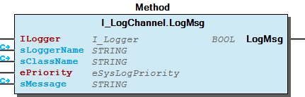
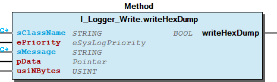
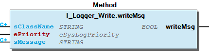
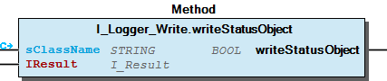

# WagoTypesLog v1.0.2.0 (WAGO) - Complete Documentation

## 📋 Library Information

- **Company:** WAGO
- **Title:** WagoTypesLog
- **Version:** 1.0.2.0
- **Categories:** WAGO FunctionalView|Base; WAGO LayerView|Types and Interfaces; Application
- **Namespace:** WagoTypesLog
- **Author:** WAGO / u010545
- **Placeholder:** WagoTypesLog

### Description ¶

This document is automatically generated. Because of this, the chapter 30 Visualization is not shown in this document. If you are interested in getting to know more about visualization, we refer to the library manager of e!Cockpit.

Types for Logging [1]

This document is automatically generated. Because of this, the chapter 30 Visualization is not shown in this document. If you are interested in getting to know more about visualization, we refer to the library manager of e!Cockpit. Types for Logging [1]

### Contents: ¶

Contents: - Documentation Index - Project Information - Library Information - Methods I_LogChannel.LogMsg (METH) - I_Logger_Write.writeHexDump (METH) - I_Logger_Write.writeMsg (METH) - I_Logger_Write.writeStatusObject (METH) Interfaces - I_LogChannel (ITF) - I_Logger_Write (ITF) Program Organization Global Variable Lists - LOGGER_MASK (GVL) - VersionHistory (GVL) Other Components - LogParameter (PARAMS) - eSysLogFacility (ENUM) - eSysLogOption (ENUM) - eSysLogPriority (ENUM)

### Indices and tables ¶

| [1] | Based on WagoTypesLog.library, last modified 18.02.2022, 23:57:33. LibDoc 3.5.15.30 |

© WAGO Kontakttechnik GmbH & Co. KG, Germany 2018 – All rights reserved. For the avoidance of doubt, this copyright notice does not only apply to the information above but also and primarily to the described library itself. Please note that third-party products are always mentioned without reference to intellectual property rights, including patents, utility models, designs and trademarks, accordingly the existence of such rights cannot be excluded. WAGO is a registered trademark of WAGO Verwaltungsgesellschaft mbH.

- File and Project Information - Library Reference © WAGO Kontakttechnik GmbH & Co. KG, Germany 2018 – All rights reserved. For the avoidance of doubt, this copyright notice does not only apply to the information above but also and primarily to the described library itself. Please note that third-party products are always mentioned without reference to intellectual property rights, including patents, utility models, designs and trademarks, accordingly the existence of such rights cannot be excluded. WAGO is a registered trademark of WAGO Verwaltungsgesellschaft mbH.

### Documentation Index

## WagoTypesLog Library Documentation

| Company: | WAGO |
| Title: | WagoTypesLog |
| Version: | 1.0.2.0 |
| Categories: | WAGO FunctionalView\|Base; WAGO LayerView\|Types and Interfaces; Application |
| Namespace: | WagoTypesLog |
| Author: | WAGO / u010545 |
| Placeholder: | WagoTypesLog |

### Description

This document is automatically generated. Because of this, the chapter 30 Visualization is not shown in this document. If you are interested in getting to know more about visualization, we refer to the library manager of e!Cockpit.

Types for Logging [1]

This document is automatically generated. Because of this, the chapter 30 Visualization is not shown in this document. If you are interested in getting to know more about visualization, we refer to the library manager of e!Cockpit. Types for Logging [1]

### Contents:

- 20 Program Organization Units I_LogChannel (ITF) - I_Logger_Write (ITF) - LOGGER_MASK (GVL) - eSysLogFacility (ENUM) - eSysLogOption (ENUM) - eSysLogPriority (ENUM) LogParameter (PARAMS) VersionHistory (GVL)

### Indices and tables

| [1] | Based on WagoTypesLog.library, last modified 18.02.2022, 23:57:33. LibDoc 3.5.15.30 |

© WAGO Kontakttechnik GmbH & Co. KG, Germany 2018 – All rights reserved. For the avoidance of doubt, this copyright notice does not only apply to the information above but also and primarily to the described library itself. Please note that third-party products are always mentioned without reference to intellectual property rights, including patents, utility models, designs and trademarks, accordingly the existence of such rights cannot be excluded. WAGO is a registered trademark of WAGO Verwaltungsgesellschaft mbH.

- File and Project Information - Library Reference © WAGO Kontakttechnik GmbH & Co. KG, Germany 2018 – All rights reserved. For the avoidance of doubt, this copyright notice does not only apply to the information above but also and primarily to the described library itself. Please note that third-party products are always mentioned without reference to intellectual property rights, including patents, utility models, designs and trademarks, accordingly the existence of such rights cannot be excluded. WAGO is a registered trademark of WAGO Verwaltungsgesellschaft mbH.

### Project Information

## File and Project Information

| Scope | Name | Type | Content |
| --- | --- | --- | --- |
| FileHeader | libraryFile | string | WagoTypesLog.library |
| contentFile | WagoTypesLog_clr.json |
| productName | e!COCKPIT |
| creationDateTime | date | 18.02.2022, 23:57:35 |
| companyName | string | WAGO |
| ProjectInformation | LastModificationDateTime | date | 18.02.2022, 23:57:33 |
| Description | string | See: Description |
| Copyright | © WAGO Kontakttechnik GmbH & Co. KG, Germany 2018 – All rights reserved. |
| Author | WAGO / u010545 |
| AutoResolveUnbound | bool | True |
| Placeholder | string | WagoTypesLog |
| Company | WAGO |
| DocFormat | reStructuredText |
| Project | WagoTypesLog |
| DefaultNamespace | WagoTypesLog |
| Version | version | 1.0.2.0 |
| Title | string | WagoTypesLog |
| LibraryCategories | library-category-list | WAGO FunctionalView\|Base; WAGO LayerView\|Types and Interfaces; Application |
| CompiledLibraryCompatibilityVersion | string | CODESYS V3.5 SP16 Patch 3 |

### Library Information

## Library Reference

This is a dictionary of all referenced libraries and their name spaces.

This is a dictionary of all referenced libraries and their name spaces.

### SysTypes2 Interfaces

#### Library Identification

Name: SysTypes2 Interfaces Version: newest Company: System Namespace: SysTypes

#### Library Properties

| LinkAllContent: False QualifiedOnly: False | Key: SysTypes2 Interfaces, * (System) SystemLibrary: False | Optional: False |

### WagoSysVersion

#### Library Identification

Name: WagoSysVersion Version: 1.0.0.0 Company: WAGO Namespace: WagoSysVersion

#### Library Properties

| LinkAllContent: False QualifiedOnly: False | Key: WagoSysVersion, 1.0.0.0 (WAGO) SystemLibrary: False | Optional: False |

### WagoTypesErrorBase

#### Library Identification

Placeholder: WagoTypesErrorBase Default Resolution: WagoTypesErrorBase, * (WAGO) Namespace: WagoTypesErrorBase

#### Library Properties

| LinkAllContent: False QualifiedOnly: False | Key: WagoTypesErrorBase SystemLibrary: False | Optional: False |

### Methods

## I_LogChannel.LogMsg (METH)

| Scope | Name | Type | Comment |
| --- | --- | --- | --- |
| Return | LogMsg | BOOL |  |
| Input | ILogger | I_Logger | Interface of the source logger for this message |
| Inout Const | sLoggerName | STRING(LogParameter.MAX_CMP_NAME_LEN) | Ident -> logger name |
| sClassName | STRING(LogParameter.MAX_CMP_NAME_LEN) | class name / creator name for this message |
| Input | ePriority | eSysLogPriority | Priority of this message |
| Inout Const | sMessage | STRING(LogParameter.MAX_LOG_MSG_LEN) | The Log Message |

This method writes a message to a log-channel

This method may not work blocking. It have to return immediately.

Graphical Illustration

Graphical Interface of I_LogChannel.LogMsg

Interface variables Function This method writes a message to a log-channel Note This method may not work blocking. It have to return immediately. Graphical Illustration  Graphical Interface of I_LogChannel.LogMsg

## I_Logger_Write.writeHexDump (METH)

| Scope | Name | Type | Comment |
| --- | --- | --- | --- |
| Return | writeHexDump | BOOL |  |
| Inout Const | sClassName | STRING(LogParameter.MAX_CMP_NAME_LEN) | The name of your class that generates this log message |
| Input | ePriority | eSysLogPriority | The priority of this message |
| Inout Const | sMessage | STRING(LogParameter.MAX_PREFIX_DUMP_MSG_LEN) | Prefix message before each line of the dump |
| Input | pData | POINTER TO BYTE | Address of the data for the dump |
| usiNBytes | USINT | Quantity of bytes for the dump |

| Value | Description |
| --- | --- |
| TRUE | successful written to one or more channel(s) |
| FALSE | the message is rejected -> may be there is no registered channel |

Generates a well formed log message from the given message and a hex dump from the given data. This message is send to all registered Log-Channels

Return Value

Graphical Illustration

Graphical Interface of I_Logger_Write.writeHexDump

Interface variables Function Generates a well formed log message from the given message and a hex dump from the given data. This message is send to all registered Log-Channels Return Value Graphical Illustration  Graphical Interface of I_Logger_Write.writeHexDump

## I_Logger_Write.writeMsg (METH)

| Scope | Name | Type | Comment |
| --- | --- | --- | --- |
| Return | writeMsg | BOOL |  |
| Inout Const | sClassName | STRING(LogParameter.MAX_CMP_NAME_LEN) | The name of your class that generates this log message |
| Input | ePriority | eSysLogPriority | The priority of this message |
| Inout Const | sMessage | STRING(LogParameter.MAX_LOG_MSG_LEN) | Message as string |

| Value | Description |
| --- | --- |
| TRUE | successful written to one or more channel(s) |
| FALSE | the message is rejected -> may be there is no registered channel |

Generates a well formed log message from the given message and redirect this message to all registered Log-Channels

Return Value

Graphical Illustration

Graphical Interface of I_Logger_Write.writeMsg

Interface variables Function Generates a well formed log message from the given message and redirect this message to all registered Log-Channels Return Value Graphical Illustration  Graphical Interface of I_Logger_Write.writeMsg

## I_Logger_Write.writeStatusObject (METH)

| Scope | Name | Type | Comment |
| --- | --- | --- | --- |
| Return | writeStatusObject | BOOL |  |
| Inout Const | sClassName | STRING(LogParameter.MAX_CMP_NAME_LEN) |  |
| Input | IResult | WagoTypesErrorBase.I_Result | interface of status object |

| Value | Description |
| --- | --- |
| TRUE | successful written to one or more channel(s) |
| FALSE | the message is rejected -> may be there is no registered channel |

Generates a well formed log message from the given status object by IResult and redirect this message to all registered Log-Channels

Return Value

Graphical Illustration

Graphical Interface of I_Logger_Write.writeStatusObject

Interface variables Function Generates a well formed log message from the given status object by IResult and redirect this message to all registered Log-Channels Return Value Graphical Illustration  Graphical Interface of I_Logger_Write.writeStatusObject

### Interfaces

## I_LogChannel (ITF)

This interface represents a log channel. A log channel can registered for listening to all Log-Messages at a FbLogger . After registration all Log-Messages from the Logger will be send to this channel. The channel have to put the message to the wanted destination. For registration the FbLogger offers the method FbLogger.RegisterLogChannel . It is possible to register one channel to many loggers for getting all messages from these loggers.

Also it is possibele to register a channel via the LoggerManager at many loggers.

Function This interface represents a log channel. A log channel can registered for listening to all Log-Messages at a FbLogger . After registration all Log-Messages from the Logger will be send to this channel. The channel have to put the message to the wanted destination. For registration the FbLogger offers the method FbLogger.RegisterLogChannel . It is possible to register one channel to many loggers for getting all messages from these loggers. Also it is possibele to register a channel via the LoggerManager at many loggers. - I_LogChannel.LogMsg (METH)

## I_Logger_Write (ITF)

- I_Logger_Write.writeHexDump (METH) - I_Logger_Write.writeMsg (METH) - I_Logger_Write.writeStatusObject (METH)

### Program Organization

## 20 Program Organization Units

- I_LogChannel (ITF) I_LogChannel.LogMsg (METH) I_Logger_Write (ITF) - I_Logger_Write.writeHexDump (METH) - I_Logger_Write.writeMsg (METH) - I_Logger_Write.writeStatusObject (METH) LOGGER_MASK (GVL) eSysLogFacility (ENUM) eSysLogOption (ENUM) eSysLogPriority (ENUM)

### Global Variable Lists

## LOGGER_MASK (GVL)

| Scope | Name | Type | Initial | Comment |
| --- | --- | --- | --- | --- |
| Constant | LOG_EMERG | BYTE | SHL(1, eSysLogPriority.LOG_EMERG) | A panic condition was reported to all processes. |
| LOG_ALERT | BYTE | SHL(1, eSysLogPriority.LOG_ALERT) | A condition that should be corrected immediately. |
| LOG_CRIT | BYTE | SHL(1, eSysLogPriority.LOG_CRIT) | A critical condition. |
| LOG_ERR | BYTE | SHL(1, eSysLogPriority.LOG_ERR) | An error message. |
| LOG_WARNING | BYTE | SHL(1, eSysLogPriority.LOG_WARNING) | A warning message. |
| LOG_NOTICE | BYTE | SHL(1, eSysLogPriority.LOG_NOTICE) | A condition requiring special handling. |
| LOG_INFO | BYTE | SHL(1, eSysLogPriority.LOG_INFO) | A general information message. |
| LOG_DEBUG | BYTE | SHL(1, eSysLogPriority.LOG_DEBUG) | A message useful for debugging programs |
| LOG_ALL | BYTE | 16#FF | set all bits for all levels |

Attributes: qualified_only

## VersionHistory (GVL)

| date | version | author | change |
| 26.01.2022 | 1.0.2.0 | u015842 | LogParameter added |
| 08.01.2019 | 1.0.1.0 | u015842 | Properties: free placeholder added |
| 17.04.2018 | 1.0.0.2 | u010545 | Update documentation |
| 15.12.2016 | 1.0.0.1 | u010545 | Interfaces from WagoSysLog to this lib removed |
| 13.12.2016 | 1.0.0.0 | u010545 | First release |

WagoTypesLog

### Other Components

## LogParameter (PARAMS)

| Scope | Name | Type | Initial | Comment |
| --- | --- | --- | --- | --- |
| Constant | MAX_CMP_NAME_LEN | USINT | 20 | [20] max. string length of the component name (logger name) |
| MAX_LOG_MSG_LEN | USINT | 128 | [128] max. string length of the log message |
| MAX_PREFIX_DUMP_MSG_LEN | USINT | 40 | [40] max. string length of the prefix message at hexdump |

Attributes: qualified_only InOut:

## eSysLogFacility (ENUM)

| Name | Initial | Comment |
| --- | --- | --- |
| LOG_KERN | 0 * 8 | Reserved for message generated by the system. |
| LOG_USER | 1 * 8 | Message generated by a process. |
| LOG_MAIL | 2 * 8 | Reserved for message generated by mail system. |
| LOG_DAEMON | 3 * 8 | Reserved for message generated by system daemon. |
| LOG_AUTH | 4 * 8 | Reserved for message generated by authorisation daemon. |
| LOG_SYSLOG | 5 * 8 | messages generated internally by syslogd |
| LOG_LPR | 6 * 8 | Reserved for message generated by printer system. |
| LOG_NEWS | 7 * 8 | Reserved for message generated by news system. |
| LOG_UUCP | 8 * 8 | Reserved for message generated by UUCP system. |
| LOG_CRON | 9 * 8 | Reserved for message generated by the clock daemon. |
| LOG_AUTHPRIV | 10 * 8 | security/authorization messages (private) |
| LOG_LOCAL0 | 16 * 8 | Reserved for local use. |
| LOG_LOCAL1 | 17 * 8 | Reserved for local use. |
| LOG_LOCAL2 | 18 * 8 | Reserved for local use. |
| LOG_LOCAL3 | 19 * 8 | Reserved for local use. |
| LOG_LOCAL4 | 20 * 8 | Reserved for local use. |
| LOG_LOCAL5 | 21 * 8 | Reserved for local use. |
| LOG_LOCAL6 | 22 * 8 | Reserved for local use. |
| LOG_LOCAL7 | 23 * 8 | Reserved for local use. |

Attributes: qualified_only InOut:

## eSysLogOption (ENUM)

| Name | Initial | Comment |
| --- | --- | --- |
| LOG_PID | 16#1 | Log the process ID with each message. |
| LOG_CONS | 16#2 | Log to the system console on error. |
| LOG_NDELAY | 16#4 | Connect to syslog daemon immediately. |
| LOG_ODELAY | 16#8 | Delay open until syslog() is called. |
| LOG_NOWAIT | 16#10 | Don’t wait for child processes. |

Attributes: qualified_only InOut:

## eSysLogPriority (ENUM)

| Name | Initial | Comment |
| --- | --- | --- |
| LOG_EMERG | 0 | A panic condition was reported to all processes. |
| LOG_ALERT | 1 | A condition that should be corrected immediately. |
| LOG_CRIT | 2 | A critical condition. |
| LOG_ERR | 3 | An error message. |
| LOG_WARNING | 4 | A warning message. |
| LOG_NOTICE | 5 | A condition requiring special handling. |
| LOG_INFO | 6 | A general information message. |
| LOG_DEBUG | 7 | A message useful for debugging programs |

Attributes: qualified_only InOut: