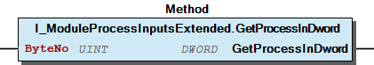
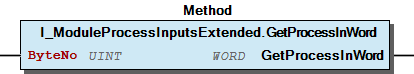
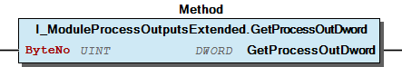
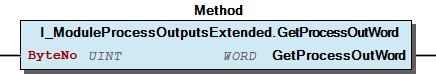
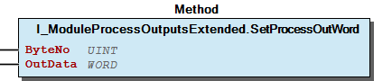
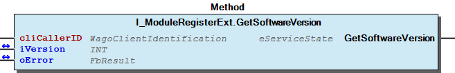

# WagoTypesModuleBase v1.9.11.1 (WAGO) - Complete Documentation


## 📋 Library Information

- **Company:** WAGO
- **Title:** WagoTypesModuleBase
- **Version:** 1.9.11.1
- **Categories:** WAGO LayerView|Types and Interfaces; Application
- **Author:** WAGO / u010545
- **Placeholder:** WagoTypesModuleBase

### Description ¶


This document is automatically generated.

Interfaces for Module Access

This document is automatically generated. Interfaces for Module Access

### Contents: ¶


Contents: - Project Information - Library Information - Function Blocks FbBaseServiceMbx1 (FB) - FbBehaviorModelExecute (FB) Methods - FbBaseServiceMbx1.BuiltRequest (METH) - FbBaseServiceMbx1.ProcessResponse (METH) - FbBaseServiceMbx1.SetClassName (METH) - FbBaseServiceMbx1.SetModuleMbx1 (METH) - FbBaseServiceMbx1.SetOpCode (METH) - FbBaseServiceMbx1.SetTimeOut (METH) - FbBehaviorModelExecute.CyclicProcess (METH) - FbBehaviorModelExecute.ProcessDone (METH) - FbBehaviorModelExecute.StartUpProcess (METH) - I_ModuleBase.GetBusType (METH) - ... and 61 more Interfaces - I_ModuleBase (ITF) - I_ModuleDynConfig (ITF) - I_ModuleMbx1 (ITF) - I_ModuleMbx2 (ITF) - I_ModuleMbx2Extended (ITF) - I_ModuleParameter (ITF) - I_ModuleParameterList (ITF) - I_ModuleParameterListMbx2 (ITF) - I_ModuleParameterListMbx2Extended (ITF) - I_ModuleParameterMbx1 (ITF) - ... and 11 more Program Organization Base Components - 00 Error Module Base - WagoTypesModuleBase Library Documentation - eErrorModuleBase (ENUM) Internal Components Global Variable Lists - ERRORFACTORIES (GVL) - ErrorDynConf (GVL) - ErrorMbx1 (GVL) - ErrorMbx2 (GVL) - ErrorMbx2Extended (GVL) - ErrorModuleBase (GVL) - ErrorParameter (GVL) - ErrorRegister (GVL) - VersionHistory (GVL) Other Components - 08 Error dyn. Configuration - 10 Data Types - 10 Error Register - 10 Protected - 10 Protected - 12 Error Parameter - 12 Interfaces - 14 Dynamic Configuration - 14 Error Mbx1 - 15 Error Mbx2 - ... and 29 more

### Indices and tables ¶


Based on WagoTypesModuleBase.library, last modified 29.05.2024, 19:57:36. LibDoc 3.5.16.10

© WAGO GmbH & Co. KG, Germany 2018 – All rights reserved. For the avoidance of doubt, this copyright notice does not only apply to the information above but also and primarily to the described library itself. Please note that third-party products are always mentioned without reference to intellectual property rights, including patents, utility models, designs and trademarks, accordingly the existence of such rights cannot be excluded. WAGO is a registered trademark of WAGO Verwaltungsgesellschaft mbH.

- File and Project Information - Library Reference Based on WagoTypesModuleBase.library, last modified 29.05.2024, 19:57:36. LibDoc 3.5.16.10 © WAGO GmbH & Co. KG, Germany 2018 – All rights reserved. For the avoidance of doubt, this copyright notice does not only apply to the information above but also and primarily to the described library itself. Please note that third-party products are always mentioned without reference to intellectual property rights, including patents, utility models, designs and trademarks, accordingly the existence of such rights cannot be excluded. WAGO is a registered trademark of WAGO Verwaltungsgesellschaft mbH.

### Project Information


## File and Project Information


| Scope | Name | Type | Content |
| --- | --- | --- | --- |
| FileHeader | libraryFile | string | WagoTypesModuleBase.library |
| contentFile | doc.clean.json |
| productName | e!COCKPIT |
| creationDateTime | date | 29.05.2024, 19:57:36 |
| companyName | string | WAGO |
| ProjectInformation | LastModificationDateTime | date | 29.05.2024, 19:57:36 |
| Description | string | See: Description |
| Copyright | © WAGO Kontakttechnik GmbH & Co. KG, Germany 2018 – All rights reserved. |
| Author | WAGO / u010545 |
| AutoResolveUnbound | bool | True |
| Placeholder | string | WagoTypesModuleBase |
| Company | WAGO |
| DocFormat | reStructuredText |
| Project | WagoTypesModuleBase |
| DefaultNamespace |  |
| Version | version | 1.9.11.1 |
| Title | string | WagoTypesModuleBase |
| LibraryCategories | library-category-list | WAGO LayerView\|Types and Interfaces; Application |
| CompiledLibraryCompatibilityVersion | string | CODESYS V3.5 SP16 Patch 3 |

### Library Information


## Library Reference


| LinkAllContent: False QualifiedOnly: True | SystemLibrary: False | Optional: False |

| LinkAllContent: False QualifiedOnly: False | SystemLibrary: False | Optional: False |

| LinkAllContent: False QualifiedOnly: True | SystemLibrary: False | Optional: False |

| LinkAllContent: False Optional: False | QualifiedOnly: False SystemLibrary: False | PublishSymbolsInContainer: True |

| LinkAllContent: False Optional: False | QualifiedOnly: True SystemLibrary: False | PublishSymbolsInContainer: True |

| LinkAllContent: False QualifiedOnly: True | SystemLibrary: False | Optional: False |

This is a dictionary of all referenced libraries and their name spaces.

This is a dictionary of all referenced libraries and their name spaces. Standard Library Identification : Placeholder: Standard Default Resolution: Standard, * (System) Namespace: Standard Library Properties : WagoSysErrorBase Library Identification : Placeholder: WagoSysErrorBase Default Resolution: WagoSysErrorBase, * (WAGO) Namespace: WagoSysErrorBase Library Properties : WagoSysVersion Library Identification : Name: WagoSysVersion Version: 1.0.0.0 Company: WAGO Namespace: WagoSysVersion Library Properties : WagoTypesBusServices Library Identification : Placeholder: WagoTypesBusServices Default Resolution: WagoTypesBusServices, * (WAGO) Namespace: WagoTypesBusServices Library Properties : WagoTypesCommon Library Identification : Placeholder: WagoTypesCommon Default Resolution: WagoTypesCommon, * (WAGO) Namespace: WagoTypes Library Properties : WagoTypesErrorBase Library Identification : Placeholder: WagoTypesErrorBase Default Resolution: WagoTypesErrorBase, * (WAGO) Namespace: WagoTypesErrorBase Library Properties :

### Function Blocks


## FbBaseServiceMbx1 (FB)


| Scope | Name | Type | Inherited from |
| --- | --- | --- | --- |
| Input | xExecute | BOOL | FbBehaviorModelExecute |
| Output | xDone | BOOL | FbBehaviorModelExecute |
| xBusy | BOOL | FbBehaviorModelExecute |
| xError | BOOL | FbBehaviorModelExecute |
| oError | WagoSysErrorBase.FbResult | FbBehaviorModelExecute |

Interface variables - 10 Protected FbBaseServiceMbx1.BuiltRequest (METH) - Final FbBaseServiceMbx1.SetModuleMbx1 (METH) - FbBaseServiceMbx1.SetOpCode (METH) - FbBaseServiceMbx1.SetTimeOut (METH) FbBaseServiceMbx1.ProcessResponse (METH) FbBaseServiceMbx1.SetClassName (METH)

## FbBehaviorModelExecute (FB)


| Scope | Name | Type |
| --- | --- | --- |
| Input | xExecute | BOOL |
| Output | xDone | BOOL |
| xBusy | BOOL |
| xError | BOOL |
| oError | WagoSysErrorBase.FbResult |

Interface variables - 10 Protected FbBehaviorModelExecute.CyclicProcess (METH) - FbBehaviorModelExecute.StartUpProcess (METH) 20 Final - FbBehaviorModelExecute.ProcessDone (METH)

### Methods


## FbBaseServiceMbx1.BuiltRequest (METH)


method to set the arguments for request

method to set the arguments for request

## FbBaseServiceMbx1.ProcessResponse (METH)


method to process the responsedata

method to process the responsedata

## FbBaseServiceMbx1.SetClassName (METH)


| Scope | Name | Type |
| --- | --- | --- |
| Input | sClassName | STRING |

## FbBaseServiceMbx1.SetModuleMbx1 (METH)


| Scope | Name | Type |
| --- | --- | --- |
| Input | IModuleMbx1 | I_ModuleMbx1 |

## FbBaseServiceMbx1.SetOpCode (METH)


| Scope | Name | Type |
| --- | --- | --- |
| Input | bOpCode | BYTE |

Final method to set the OpCode

Interface variables Final method to set the OpCode

## FbBaseServiceMbx1.SetTimeOut (METH)


| Scope | Name | Type |
| --- | --- | --- |
| Input | tTimeOut | TIME |

Final method to set the Time Out

Interface variables Final method to set the Time Out

## FbBehaviorModelExecute.CyclicProcess (METH)


This method is called after “StartUpProcess” while not “ProcessDone” is called by your process.

Overwrite this method for your own process and place your cyclic code there.

This method is called after “StartUpProcess” while not “ProcessDone” is called by your process. Overwrite this method for your own process and place your cyclic code there.

## FbBehaviorModelExecute.ProcessDone (METH)


Call this method from your own process to signal that your process is ready.

This call terminate the automatic cyclic call of “CyclicProcess”.

Do NOT overwrite this method !!

Call this method from your own process to signal that your process is ready. This call terminate the automatic cyclic call of “CyclicProcess”. Do NOT overwrite this method !!

## FbBehaviorModelExecute.StartUpProcess (METH)


This method is called once with the rising edge of “xExecute”.

Overwrite this method to start your own process and place your start up code there.

After this call the method “CyclicProcess” is called cyclic while not the final method “ProcessDone” is called by your process.

This method is called once with the rising edge of “xExecute”. Overwrite this method to start your own process and place your start up code there. After this call the method “CyclicProcess” is called cyclic while not the final method “ProcessDone” is called by your process.

## I_ModuleBase.GetBusType (METH)


| Scope | Name | Type |
| --- | --- | --- |
| Return | GetBusType | WagoTypesBusServices.eBusType |

## I_ModuleBase.GetSlotNumber (METH)


| Scope | Name | Type |
| --- | --- | --- |
| Return | GetSlotNumber | USINT |

## I_ModuleBase.isReadyForUse (METH)


| Scope | Name | Type |
| --- | --- | --- |
| Return | isReadyForUse | BOOL |

Returns TRUE if the module is ready for use. This means it is mem for the PA allocated and the data exchange runs.

Interface variables Returns TRUE if the module is ready for use. This means it is mem for the PA allocated and the data exchange runs.

## I_ModuleDynConfig.onTerminalsScanned (METH)


| Scope | Name | Type |
| --- | --- | --- |
| Input | I_Terminal | WagoTypesBusServices.I_TerminalBase |

called for each slot by TerminalManager when the node is successful scaned and a module is registered at the slot.

Interface variables called for each slot by TerminalManager when the node is successful scaned and a module is registered at the slot.

## I_ModuleMbx1.GetMbxOverlapped (METH)


| Scope | Name | Type | Comment |
| --- | --- | --- | --- |
| Return | GetMbxOverlapped | eServiceState |  |
| Input | cliCallerID | WagoTypes.WagoClientIdentification | Unique identifier of the caller |
| Inout | iOverlapped | INT (-1..1) | -1 -> invalid / 0-> not overlapped / 1-> overlapped |
| oError | WagoSysErrorBase.FbResult | Register Error Object |

When the method returns with MBX_DONE then the wanted job is done.

Interface variables When the method returns with MBX_DONE then the wanted job is done.

## I_ModuleMbx1.GetMbxSize (METH)


| Scope | Name | Type | Comment |
| --- | --- | --- | --- |
| Return | GetMbxSize | eServiceState |  |
| Input | cliCallerID | WagoTypes.WagoClientIdentification | Unique identifier of the caller |
| Inout | iSize | INT | -1 -> invalid else MBX-Size |
| oError | WagoSysErrorBase.FbResult |  |

When the method returns with MBX_DONE then the wanted job is done.

Interface variables When the method returns with MBX_DONE then the wanted job is done.

## I_ModuleMbx1.MbxService (METH)


| Scope | Name | Type | Comment |
| --- | --- | --- | --- |
| Return | MbxService | eServiceState |  |
| Input | cliCallerID | WagoTypes.WagoClientIdentification | Unique identifier of the caller |
| utRequest | typMbxRequest | service request |
| Inout | utResponse | typMbxResponse | service response |
| oError | WagoSysErrorBase.FbResult | Error Object -> OK or TIME OUT after the spezified time at request t#0ms means no time out |

```
VAR
    oError      : WagoSysErrorBase.FbResult;
    xExecute    : BOOL;
    Request     : typMbxRequest := ( bOpCode  := 16#43,
                                     tTimeOut := T#1S  // Timeout for this service
                                   );
    Response    : typMbxResponse;
    ID          : WagoTypes.WagoClientIdentification := ADR(ID);  // generate an unique ID
END_VAR

IF xExecute THEN
    IF myModul.MbxService(  cliCallerID     := ID,
                            utRequest       := Request,
                            utResponse      := Response,
                            oError          := oError
                           ) = MBX_DONE THEN

        xExecute := FALSE;

        IF m_oError.GetID() <> 0 THEN

            (* place your code *)

        ELSE

            (* place your error code *)

        END_IF

    END_IF
END_IF
```

## I_ModuleMbx2.IsMessageAvailable (METH)


| Scope | Name | Type |
| --- | --- | --- |
| Return | IsMessageAvailable | BOOL |

returns TRUE if another message is available

Interface variables returns TRUE if another message is available

## I_ModuleMbx2.MbxGetMessageWithProtocolId (METH)


| Scope | Name | Type | Comment |
| --- | --- | --- | --- |
| Return | MbxGetMessageWithProtocolId | eErrorMbx2 |  |
| Input | bProtocolID | BYTE |  |
| pMsgBuffer | POINTER TO BYTE | pointer to buffer where the wanted message is to place |
| udiMsgBufferSize | UDINT | size of the message buffer |
| Output | udiMsgLen | UDINT | len of the message incl. header. |
| oError | WagoSysErrorBase.FbResult |  |

Get a complete message with header and removes it from pipe

Return codes : OK NO_DATA BUFFER_TO_SMALL : buffer not big enought for the next message PRM_INVALID : paramter invalid -> null-pointer

Interface variables Get a complete message with header and removes it from pipe Return codes : OK NO_DATA BUFFER_TO_SMALL : buffer not big enought for the next message PRM_INVALID : paramter invalid -> null-pointer

## I_ModuleMbx2.MbxGetNexSequencelID (METH)


| Scope | Name | Type |
| --- | --- | --- |
| Return | MbxGetNexSequencelID | INT |

returns the sequence-ID of the next message -1 -> no sequence-ID available

Interface variables returns the sequence-ID of the next message -1 -> no sequence-ID available

## I_ModuleMbx2.MbxGetNextMessage (METH)


| Scope | Name | Type | Comment |
| --- | --- | --- | --- |
| Return | MbxGetNextMessage | eErrorMbx2 |  |
| Input | pMsgBuffer | POINTER TO BYTE | pointer to buffer where the wanted message is to place |
| udiMsgBufferSize | UDINT | size of the message buffer |
| Output | udiMsgLen | UDINT | len of the message incl. header. |
| oError | WagoSysErrorBase.FbResult |  |

Return codes : OK NO_DATA BUFFER_TO_SMALL : buffer not big enought for the next message PRM_INVALID : paramter invalid -> null-pointer

Interface variables Return codes : OK NO_DATA BUFFER_TO_SMALL : buffer not big enought for the next message PRM_INVALID : paramter invalid -> null-pointer

## I_ModuleMbx2.MbxGetNextProtocolID (METH)


| Scope | Name | Type |
| --- | --- | --- |
| Return | MbxGetNextProtocolID | INT |

returns the protocol-ID of the next message -1 -> no message available 0 -> no protocol-ID (may be simple header but not must) otherwise protocol-ID (it must be an extended header)

Interface variables returns the protocol-ID of the next message -1 -> no message available 0 -> no protocol-ID (may be simple header but not must) otherwise protocol-ID (it must be an extended header)

## I_ModuleMbx2.MbxIsReady (METH)


| Scope | Name | Type |
| --- | --- | --- |
| Return | MbxIsReady | BOOL |

## I_ModuleMbx2.MbxRemoveNextMessage (METH)


| Scope | Name | Type |
| --- | --- | --- |
| Return | MbxRemoveNextMessage | eErrorMbx2 |
| Output | oError | WagoSysErrorBase.FbResult |

removes a complete message with header from pipe in case there is a complete message available. Otherwise this method do nothing.

Return codes : OK if a complete message was available NO_DATA if not a complete message was availble

Interface variables removes a complete message with header from pipe in case there is a complete message available. Otherwise this method do nothing. Return codes : OK if a complete message was available NO_DATA if not a complete message was availble

## I_ModuleMbx2.MbxReset (METH) ¶


## I_ModuleMbx2.MbxWrite (METH)


| Scope | Name | Type | Comment |
| --- | --- | --- | --- |
| Return | MbxWrite | eErrorMbx2 |  |
| Input | pData | POINTER TO BYTE | source of the data |
| udiNdata | UDINT | how many bytes to write |
| Output | oError | WagoSysErrorBase.FbResult |  |

| result codes |
| OK (0) | success |
| FULL | not enough buffer space available for new data. |
| PRM_INVALID | null-pointer or size <2 or size >2G |
| NOT_READY | MBX is not ready for communication |

Write a chunk of data into the FiFo to MBX.

If there is too less space in the FIFO the write fails completely without partial writing.

Interface variables Write a chunk of data into the FiFo to MBX. If there is too less space in the FIFO the write fails completely without partial writing.

## I_ModuleMbx2.isTcmMode (METH)


| Scope | Name | Type |
| --- | --- | --- |
| Return | isTcmMode | BOOL |

## I_ModuleMbx2Extended.MbxCommit (METH)


| Scope | Name | Type | Initial | Comment |
| --- | --- | --- | --- | --- |
| Return | MbxCommit | eServiceState |  |  |
| Input | cliCallerID | WagoTypes.WagoClientIdentification |  | Unique identifier of the caller |
| tTimeout | TIME | TIME#500ms |  |
| Inout | oError | WagoSysErrorBase.FbResult |  | Error Object |

## I_ModuleMbx2Extended.MbxIsReady (METH)


| Scope | Name | Type |
| --- | --- | --- |
| Return | MbxIsReady | BOOL |

## I_ModuleMbx2Extended.MbxPrepare (METH)


| Scope | Name | Type | Initial | Comment |
| --- | --- | --- | --- | --- |
| Return | MbxPrepare | eServiceState |  |  |
| Input | cliCallerID | WagoTypes.WagoClientIdentification |  | Unique identifier of the caller |
| tTimeout | TIME | TIME#500ms |  |
| Inout | oError | WagoSysErrorBase.FbResult |  | Error Object |

## I_ModuleMbx2Extended.MbxReadDiagnosis (METH)


| Scope | Name | Type |
| --- | --- | --- |
| Return | MbxReadDiagnosis | eServiceState |
| Inout | Diagnosis | typMbx2Diagnosis |
| Output | oError | WagoSysErrorBase.FbResult |

## I_ModuleMbx2Extended.MbxReadMultipleRegister (METH)


| Scope | Name | Type | Comment |
| --- | --- | --- | --- |
| Return | MbxReadMultipleRegister | eServiceState |  |
| Input | cliCallerID | WagoTypes.WagoClientIdentification | Unique identifier of the caller |
| usiTableID | USINT | ID of the requested table |
| usiRegisterNo | USINT | register number of the requested register |
| usiRegisterCount | USINT | quantity of register to request |
| tTimeout | TIME | timeout for this job |
| pRxBuffer | POINTER TO BYTE | Address of the RxBuffer |
| uiRxBufferSize | UINT | size of RxBuffer [byte], please use sizeof operator |
| Inout | oError | WagoSysErrorBase.FbResult | Error Object |

## I_ModuleMbx2Extended.MbxReadRegister (METH)


| Scope | Name | Type | Comment |
| --- | --- | --- | --- |
| Return | MbxReadRegister | eServiceState |  |
| Input | cliCallerID | WagoTypes.WagoClientIdentification | Unique identifier of the caller |
| usiTableID | USINT | ID of the requested table |
| usiRegisterNo | USINT | register number of the requested register |
| tTimeout | TIME | timeout for this job |
| Inout | oError | WagoSysErrorBase.FbResult | Error Object |
| Output | wValue | WORD | register value after a succesfull access |

## I_ModuleMbx2Extended.MbxReadTable (METH)


| Scope | Name | Type | Comment |
| --- | --- | --- | --- |
| Return | MbxReadTable | eServiceState |  |
| Input | cliCallerID | WagoTypes.WagoClientIdentification | Unique identifier of the caller |
| usiTableID | USINT | ID of the requested table |
| tTimeout | TIME | timeout for this job |
| pRxBuffer | POINTER TO BYTE |  |
| uiRxBufferSize | UINT | sizeof(RxBuffer) [byte] |
| Inout | oError | WagoSysErrorBase.FbResult | Error Object |
| Output | uiRegisterCount | UINT | quantity of registers read |

## I_ModuleMbx2Extended.MbxReset (METH) ¶


## I_ModuleMbx2Extended.MbxSaveUser (METH)


| Scope | Name | Type | Initial | Comment |
| --- | --- | --- | --- | --- |
| Return | MbxSaveUser | eServiceState |  |  |
| Input | cliCallerID | WagoTypes.WagoClientIdentification |  | Unique identifier of the caller |
| tTimeout | TIME | TIME#500ms |  |
| Inout | oError | WagoSysErrorBase.FbResult |  | Error Object |

## I_ModuleMbx2Extended.MbxSetPassword (METH)


| Scope | Name | Type | Initial | Comment |
| --- | --- | --- | --- | --- |
| Return | MbxSetPassword | eServiceState |  |  |
| Input | cliCallerID | WagoTypes.WagoClientIdentification |  | Unique identifier of the caller |
| wPassword | WORD |  |  |
| tTimeout | TIME | TIME#500ms |  |
| Inout | oError | WagoSysErrorBase.FbResult |  | Error Object |

## I_ModuleMbx2Extended.MbxWriteMultipleRegister (METH)


| Scope | Name | Type | Initial | Comment |
| --- | --- | --- | --- | --- |
| Return | MbxWriteMultipleRegister | eServiceState |  |  |
| Input | cliCallerID | WagoTypes.WagoClientIdentification |  | Unique identifier of the caller |
| usiTableID | USINT |  | Table ID to write |
| usiRegisterNo | USINT |  | register number of the first register to write |
| usiRegisterCount | USINT |  | quantity of register to write |
| pRegisterData | POINTER TO BYTE |  |  |
| tTimeout | TIME | TIME#500ms |  |
| Inout | oError | WagoSysErrorBase.FbResult |  | Error Object |

## I_ModuleMbx2Extended.MbxWriteRegister (METH)


| Scope | Name | Type | Initial | Comment |
| --- | --- | --- | --- | --- |
| Return | MbxWriteRegister | eServiceState |  |  |
| Input | cliCallerID | WagoTypes.WagoClientIdentification |  | Unique identifier of the caller |
| usiTableID | USINT |  | Table ID to write |
| usiRegisterNo | USINT |  | register number of the first register to write |
| wValue | WORD |  | register value to write |
| tTimeout | TIME | TIME#500ms |  |
| Inout | oError | WagoSysErrorBase.FbResult |  | Error Object |

## I_ModuleMbx2Extended.MbxWriteTable (METH)


| Scope | Name | Type | Initial | Comment |
| --- | --- | --- | --- | --- |
| Return | MbxWriteTable | eServiceState |  |  |
| Input | cliCallerID | WagoTypes.WagoClientIdentification |  | Unique identifier of the caller |
| usiTableID | USINT |  | ID of the requested table |
| usiRegisterCount | USINT |  | quantity of register entry in table |
| pRegisterData | POINTER TO BYTE |  | pointer to all table entrys |
| tTimeout | TIME | TIME#500ms |  |
| Inout | oError | WagoSysErrorBase.FbResult |  | Error Object |

## I_ModuleParameter.ReadParameter (METH)


| Scope | Name | Type | Comment |
| --- | --- | --- | --- |
| Return | ReadParameter | eServiceState |  |
| Input | cliCallerID | WagoTypes.WagoClientIdentification | Unique identifier of the caller |
| usiParameterNo | USINT |  |
| Inout | uiValue | UINT | value of the parameter |
| uiStatus | UINT | status word (register 57) of parameter communication |
| oError | WagoSysErrorBase.FbResult | error object |

## I_ModuleParameter.WriteParameter (METH)


| Scope | Name | Type | Comment |
| --- | --- | --- | --- |
| Return | WriteParameter | eServiceState |  |
| Input | cliCallerID | WagoTypes.WagoClientIdentification | Unique identifier of the caller |
| usiParameterNo | USINT |  |
| uiValue | UINT | value of the parameter |
| Inout | uiStatus | UINT | status word (register 57) of parameter communication |
| oError | WagoSysErrorBase.FbResult | error object |

## I_ModuleParameterList.ReadParameterList (METH)


| Scope | Name | Type | Comment |
| --- | --- | --- | --- |
| Return | ReadParameterList | eServiceState |  |
| Input | cliCallerID | WagoTypes.WagoClientIdentification | Unique identifier of the caller |
| usiParameterNo | USINT |  |
| uiParameterCnt | UINT (1..256) |  |
| Inout | aValue | WagoTypesBusServices.typPARAMETER_ARRAY | value of the parameter |
| uiStatus | UINT | status word (register 57) of parameter communication |
| oError | WagoSysErrorBase.FbResult | error object |

## I_ModuleParameterList.WriteParameterList (METH)


| Scope | Name | Type | Comment |
| --- | --- | --- | --- |
| Return | WriteParameterList | eServiceState |  |
| Input | cliCallerID | WagoTypes.WagoClientIdentification | Unique identifier of the caller |
| usiParameterNo | USINT |  |
| uiParameterCnt | UINT (1..256) |  |
| aValue | WagoTypesBusServices.typPARAMETER_ARRAY | value of the parameter |
| Inout | uiStatus | UINT | status word (register 57) of parameter communication |
| oError | WagoSysErrorBase.FbResult | error object |

## I_ModuleParameterListMbx2.ReadParameterList (METH)


| Scope | Name | Type | Comment |
| --- | --- | --- | --- |
| Return | ReadParameterList | eServiceState |  |
| Input | cliCallerID | WagoTypes.WagoClientIdentification | Unique identifier of the caller |
| usiParameterNo | USINT |  |
| uiParameterCnt | UINT (1..256) |  |
| Inout | aValue | WagoTypesBusServices.typPARAMETER_ARRAY | value of the parameter |
| uiStatus | UINT | status word (register 57) of parameter communication |
| oError | WagoSysErrorBase.FbResult | error object |

## I_ModuleParameterListMbx2.WriteParameterList (METH)


| Scope | Name | Type | Comment |
| --- | --- | --- | --- |
| Return | WriteParameterList | eServiceState |  |
| Input | cliCallerID | WagoTypes.WagoClientIdentification | Unique identifier of the caller |
| usiParameterNo | USINT |  |
| uiParameterCnt | UINT (1..256) |  |
| aValue | WagoTypesBusServices.typPARAMETER_ARRAY | value of the parameter |
| Inout | uiStatus | UINT | status word (register 57) of parameter communication |
| oError | WagoSysErrorBase.FbResult | error object |

## I_ModuleParameterListMbx2Extended.ReadParameterList (METH)


| Scope | Name | Type | Comment |
| --- | --- | --- | --- |
| Return | ReadParameterList | eServiceState |  |
| Input | cliCallerID | WagoTypes.WagoClientIdentification | Unique identifier of the caller |
| usiParameterNo | USINT |  |
| uiParameterCnt | UINT (1..256) |  |
| Inout | aValue | WagoTypesBusServices.typPARAMETER_ARRAY | value of the parameter |
| uiStatus | UINT | status word (register 57) of parameter communication |
| oError | WagoSysErrorBase.FbResult | error object |

## I_ModuleParameterListMbx2Extended.WriteParameterList (METH)


| Scope | Name | Type | Comment |
| --- | --- | --- | --- |
| Return | WriteParameterList | eServiceState |  |
| Input | cliCallerID | WagoTypes.WagoClientIdentification | Unique identifier of the caller |
| usiParameterNo | USINT |  |
| uiParameterCnt | UINT (1..256) |  |
| aValue | WagoTypesBusServices.typPARAMETER_ARRAY | value of the parameter |
| Inout | uiStatus | UINT | status word (register 57) of parameter communication |
| oError | WagoSysErrorBase.FbResult | error object |

## I_ModuleParameterMbx2.ReadParameter (METH)


| Scope | Name | Type | Comment |
| --- | --- | --- | --- |
| Return | ReadParameter | eServiceState |  |
| Input | cliCallerID | WagoTypes.WagoClientIdentification | Unique identifier of the caller |
| usiParameterNo | USINT |  |
| Inout | uiValue | UINT | value of the parameter |
| uiStatus | UINT | status word (register 57) of parameter communication |
| oError | WagoSysErrorBase.FbResult | error object |

## I_ModuleParameterMbx2.WriteParameter (METH)


| Scope | Name | Type | Comment |
| --- | --- | --- | --- |
| Return | WriteParameter | eServiceState |  |
| Input | cliCallerID | WagoTypes.WagoClientIdentification | Unique identifier of the caller |
| usiParameterNo | USINT |  |
| uiValue | UINT | value of the parameter |
| Inout | uiStatus | UINT | status word (register 57) of parameter communication |
| oError | WagoSysErrorBase.FbResult | error object |

## I_ModuleParameterMbx2Extended.ReadParameter (METH)


| Scope | Name | Type | Comment |
| --- | --- | --- | --- |
| Return | ReadParameter | eServiceState |  |
| Input | cliCallerID | WagoTypes.WagoClientIdentification | Unique identifier of the caller |
| usiParameterNo | USINT |  |
| Inout | uiValue | UINT | value of the parameter |
| uiStatus | UINT | status word (register 57) of parameter communication |
| oError | WagoSysErrorBase.FbResult | error object |

## I_ModuleParameterMbx2Extended.WriteParameter (METH)


| Scope | Name | Type | Comment |
| --- | --- | --- | --- |
| Return | WriteParameter | eServiceState |  |
| Input | cliCallerID | WagoTypes.WagoClientIdentification | Unique identifier of the caller |
| usiParameterNo | USINT |  |
| uiValue | UINT | value of the parameter |
| Inout | uiStatus | UINT | status word (register 57) of parameter communication |
| oError | WagoSysErrorBase.FbResult | error object |

## I_ModuleProcessInputs.GetModuleInputSize (METH)


| Scope | Name | Type |
| --- | --- | --- |
| Return | GetModuleInputSize | UINT |

Returns the byte size of input data

Interface variables Returns the byte size of input data

## I_ModuleProcessInputs.GetProcessInBit (METH)


| Scope | Name | Type | Comment |
| --- | --- | --- | --- |
| Return | GetProcessInBit | BOOL |  |
| Input | ByteNo | UINT | range 0..(_uiInputSize - 1) |
| BitNo | USINT | range 0..7 |

## I_ModuleProcessInputs.GetProcessInByte (METH)


| Scope | Name | Type | Comment |
| --- | --- | --- | --- |
| Return | GetProcessInByte | BYTE |  |
| Input | ByteNo | UINT | range 0..(_uiInputSize - 1) |

## I_ModuleProcessInputs.GetProcessInData (METH)


| Scope | Name | Type | Comment |
| --- | --- | --- | --- |
| Return | GetProcessInData | UINT |  |
| Input | pInData | POINTER TO BYTE | pointer to the area where the process data should store |
| uiNInData | UINT | SIZEOF(Buffer) |

## I_ModuleProcessInputsExtended.GetProcessInDword (METH)


| Scope | Name | Type | Comment |
| --- | --- | --- | --- |
| Return | GetProcessInDword | DWORD |  |
| Input | ByteNo | UINT | range 0..(_uiInputSize - 4) |

Graphical Illustration

Graphical Interface of I_ModuleProcessInputsExtended.GetProcessInDword

Interface variables Function Get the process input dword specified by ByteNo of this module. Graphical Illustration  Graphical Interface of I_ModuleProcessInputsExtended.GetProcessInDword

## I_ModuleProcessInputsExtended.GetProcessInWord (METH)


| Scope | Name | Type | Comment |
| --- | --- | --- | --- |
| Return | GetProcessInWord | WORD |  |
| Input | ByteNo | UINT | range 0..(_uiInputSize - 2) |

Graphical Illustration

Graphical Interface of I_ModuleProcessInputsExtended.GetProcessInWord

Interface variables Function Get the process input word specified by ByteNo of this module. Graphical Illustration  Graphical Interface of I_ModuleProcessInputsExtended.GetProcessInWord

## I_ModuleProcessOutputs.GetModuleOutputSize (METH)


| Scope | Name | Type |
| --- | --- | --- |
| Return | GetModuleOutputSize | UINT |

Returns the byte size of output data

Interface variables Returns the byte size of output data

## I_ModuleProcessOutputs.GetProcessOutBit (METH)


| Scope | Name | Type | Comment |
| --- | --- | --- | --- |
| Return | GetProcessOutBit | BOOL |  |
| Input | ByteNo | UINT | range 0..(_uiOutputSize - 1) |
| BitNo | USINT | range 0..7 |

## I_ModuleProcessOutputs.GetProcessOutByte (METH)


| Scope | Name | Type | Comment |
| --- | --- | --- | --- |
| Return | GetProcessOutByte | BYTE |  |
| Input | ByteNo | UINT | range 0..(_uiOutputSize - 1) |

## I_ModuleProcessOutputs.GetProcessOutData (METH)


| Scope | Name | Type | Comment |
| --- | --- | --- | --- |
| Return | GetProcessOutData | UINT |  |
| Input | pOutData | POINTER TO BYTE | pointer to the area where the process data should store |
| uiNOutData | UINT | SIZEOF(Buffer) |

## I_ModuleProcessOutputs.SetProcessOutBit (METH)


| Scope | Name | Type | Comment |
| --- | --- | --- | --- |
| Input | ByteNo | UINT | range 0..(_uiOutputSize - 1) |
| BitNo | USINT | range 0..7 |
| OutData | BOOL |  |

## I_ModuleProcessOutputs.SetProcessOutByte (METH)


| Scope | Name | Type | Comment |
| --- | --- | --- | --- |
| Input | ByteNo | UINT | range 0..(_uiOutputSize - 1) |
| OutData | BYTE |  |

## I_ModuleProcessOutputs.SetProcessOutData (METH)


| Scope | Name | Type | Comment |
| --- | --- | --- | --- |
| Return | SetProcessOutData | UINT |  |
| Input | pOutData | POINTER TO BYTE | pointer to the area with the data to write |
| uiNOutData | UINT | SIZEOF(Buffer) |

## I_ModuleProcessOutputsExtended.GetProcessOutDword (METH)


| Scope | Name | Type | Comment |
| --- | --- | --- | --- |
| Return | GetProcessOutDword | DWORD |  |
| Input | ByteNo | UINT | range 0..(_uiOutputSize - 4) |

Graphical Illustration

Graphical Interface of I_ModuleProcessOutputsExtended.GetProcessOutDword

Interface variables Function Get the process output dword specified by ByteNo of this module. Graphical Illustration  Graphical Interface of I_ModuleProcessOutputsExtended.GetProcessOutDword

## I_ModuleProcessOutputsExtended.GetProcessOutWord (METH)


| Scope | Name | Type | Comment |
| --- | --- | --- | --- |
| Return | GetProcessOutWord | WORD |  |
| Input | ByteNo | UINT | range 0..(_uiOutputSize - 2) |

Graphical Illustration

Graphical Interface of I_ModuleProcessOutputsExtended.GetProcessOutWord

Interface variables Function Get the process output word specified by ByteNo of this module. Graphical Illustration  Graphical Interface of I_ModuleProcessOutputsExtended.GetProcessOutWord

## I_ModuleProcessOutputsExtended.SetProcessOutDword (METH)


| Scope | Name | Type | Comment |
| --- | --- | --- | --- |
| Input | ByteNo | UINT | range 0..(_uiOutputSize - 4) |
| OutData | DWORD |  |

Graphical Illustration

Graphical Interface of I_ModuleProcessOutputsExtended.SetProcessOutDword

Interface variables Function Set the process output dword specified by ByteNo to the value OutData . Graphical Illustration  Graphical Interface of I_ModuleProcessOutputsExtended.SetProcessOutDword

## I_ModuleProcessOutputsExtended.SetProcessOutWord (METH)


| Scope | Name | Type | Comment |
| --- | --- | --- | --- |
| Input | ByteNo | UINT | range 0..(_uiOutputSize - 2) |
| OutData | WORD |  |

Graphical Illustration

Graphical Interface of I_ModuleProcessOutputsExtended.SetProcessOutWord

Interface variables Function Set the process output word specified by ByteNo to the value OutData . Graphical Illustration  Graphical Interface of I_ModuleProcessOutputsExtended.SetProcessOutWord

## I_ModuleRegister.ReadRegister (METH)


| Scope | Name | Type | Comment |
| --- | --- | --- | --- |
| Return | ReadRegister | eServiceState |  |
| Input | cliCallerID | WagoTypes.WagoClientIdentification | Unique identifier of the caller |
| usiChannel | USINT (0..7) |  |
| usiRegisterNo | USINT (0..63) |  |
| Inout | uiValue | UINT |  |
| oError | WagoSysErrorBase.FbResult |  |

## I_ModuleRegister.WriteRegister (METH)


| Scope | Name | Type | Comment |
| --- | --- | --- | --- |
| Return | WriteRegister | eServiceState |  |
| Input | cliCallerID | WagoTypes.WagoClientIdentification | Unique identifier of the caller |
| usiChannel | USINT (0..7) |  |
| usiRegisterNo | USINT (0..63) |  |
| uiValue | UINT |  |
| Inout | oError | WagoSysErrorBase.FbResult |  |

## I_ModuleRegisterExt.GetSoftwareVersion (METH)


| Scope | Name | Type | Comment |
| --- | --- | --- | --- |
| Return | GetSoftwareVersion | eServiceState |  |
| Input | cliCallerID | WagoTypes.WagoClientIdentification | Unique identifier of the caller |
| Inout | iVersion | INT | -1 -> invalid otherwise the sofware version as integer 0..n |
| oError | WagoSysErrorBase.FbResult | Register Error Object |

| Mailboxstate | Description |
| --- | --- |
| eServiceState.OCCUPIED | occupied by an other caller |
| eServiceState.START | activate the service and start to read the register from the terminal |
| eServiceState.BUSY | job is in process -> call it again until the return value = eServiceState.DONE |
| eServiceState.ABORT | job is aborted |
| eServiceState.DONE | job is done |

```
VAR
    ID          : WagoTypes.WagoClientIdentification := ADR(ID);  // generate an unique ID
    oError      : WagoSysErrorBase.FbResult;
    xExecute    : BOOL;
    iVersion    : INT;
END_VAR

IF xExecute THEN
    CASE myModul.GetSoftwareVersion(    cliCallerID     := ID,          // unique ID to indentify the caller
                                        iVersion        := iVersion,
                                        oError          := oError
                                    ) OF

        eServiceState.DONE :
            xExecute := FALSE;
            IF oError.GetID() = 0 THEN  // no error occured

                (* place here your code *)

            ELSE // an error occurs
                (* place your error code *)
            END_IF

        eServiceState.ABORT :
            xExecute := FALSE;
            (* place here your error code for abort *)

    END_CASE
END_IF
```

Call a service to get the software version of this module.

When the method returns with eServiceState.DONE then the wanted job is done. The user MUST handle the return values DONE and ABORT.

Graphical Illustration

Graphical Interface of I_ModuleRegisterExt.GetSoftwareVersion

This method can take a some plc cycles. So you have to call this method cyclic until it returns with DONE or ABORT.

Interface variables Function Call a service to get the software version of this module. When the method returns with eServiceState.DONE then the wanted job is done. The user MUST handle the return values DONE and ABORT. RETURN State of the service -> (defined at WagoAppModuleInterface.library) Graphical Illustration  Graphical Interface of I_ModuleRegisterExt.GetSoftwareVersion Note This method can take a some plc cycles. So you have to call this method cyclic until it returns with DONE or ABORT.

### Interfaces


## I_ModuleBase (ITF)


- I_ModuleBase.GetBusType (METH) - I_ModuleBase.GetSlotNumber (METH) - I_ModuleBase.isReadyForUse (METH)

## I_ModuleDynConfig (ITF)


- I_ModuleDynConfig.onTerminalsScanned (METH)

## I_ModuleMbx1 (ITF)


- I_ModuleMbx1.GetMbxOverlapped (METH) - I_ModuleMbx1.GetMbxSize (METH) - I_ModuleMbx1.MbxService (METH)

## I_ModuleMbx2 (ITF)


- I_ModuleMbx2.IsMessageAvailable (METH) - I_ModuleMbx2.MbxGetMessageWithProtocolId (METH) - I_ModuleMbx2.MbxGetNexSequencelID (METH) - I_ModuleMbx2.MbxGetNextMessage (METH) - I_ModuleMbx2.MbxGetNextProtocolID (METH) - I_ModuleMbx2.MbxIsReady (METH) - I_ModuleMbx2.MbxRemoveNextMessage (METH) - I_ModuleMbx2.MbxReset (METH) - I_ModuleMbx2.MbxWrite (METH) - I_ModuleMbx2.isTcmMode (METH)

## I_ModuleMbx2Extended (ITF)


- I_ModuleMbx2Extended.MbxCommit (METH) - I_ModuleMbx2Extended.MbxIsReady (METH) - I_ModuleMbx2Extended.MbxPrepare (METH) - I_ModuleMbx2Extended.MbxReadDiagnosis (METH) - I_ModuleMbx2Extended.MbxReadMultipleRegister (METH) - I_ModuleMbx2Extended.MbxReadRegister (METH) - I_ModuleMbx2Extended.MbxReadTable (METH) - I_ModuleMbx2Extended.MbxReset (METH) - I_ModuleMbx2Extended.MbxSaveUser (METH) - I_ModuleMbx2Extended.MbxSetPassword (METH) - I_ModuleMbx2Extended.MbxWriteMultipleRegister (METH) - I_ModuleMbx2Extended.MbxWriteRegister (METH) - I_ModuleMbx2Extended.MbxWriteTable (METH)

## I_ModuleParameter (ITF)


- I_ModuleParameter.ReadParameter (METH) - I_ModuleParameter.WriteParameter (METH)

## I_ModuleParameterList (ITF)


- I_ModuleParameterList.ReadParameterList (METH) - I_ModuleParameterList.WriteParameterList (METH)

## I_ModuleParameterListMbx2 (ITF)


- I_ModuleParameterListMbx2.ReadParameterList (METH) - I_ModuleParameterListMbx2.WriteParameterList (METH)

## I_ModuleParameterListMbx2Extended (ITF)


- I_ModuleParameterListMbx2Extended.ReadParameterList (METH) - I_ModuleParameterListMbx2Extended.WriteParameterList (METH)

## I_ModuleParameterMbx1 (ITF) ¶


## I_ModuleParameterMbx2 (ITF)


- I_ModuleParameterMbx2.ReadParameter (METH) - I_ModuleParameterMbx2.WriteParameter (METH)

## I_ModuleParameterMbx2Extended (ITF)


- I_ModuleParameterMbx2Extended.ReadParameter (METH) - I_ModuleParameterMbx2Extended.WriteParameter (METH)

## I_ModuleProcessInputs (ITF)


Methods to have access to the input PA

Methods to have access to the input PA - I_ModuleProcessInputs.GetModuleInputSize (METH) - I_ModuleProcessInputs.GetProcessInBit (METH) - I_ModuleProcessInputs.GetProcessInByte (METH) - I_ModuleProcessInputs.GetProcessInData (METH)

## I_ModuleProcessInputsExtended (ITF)


Extended Methods to have access to the input PA

Extended Methods to have access to the input PA - I_ModuleProcessInputsExtended.GetProcessInDword (METH) - I_ModuleProcessInputsExtended.GetProcessInWord (METH)

## I_ModuleProcessInputsOutputs (ITF)


Methods to have access to the input and output PA

Methods to have access to the input and output PA

## I_ModuleProcessInputsOutputsExtended (ITF)


Methods to have access to the input and output PA

Methods to have access to the input and output PA

## I_ModuleProcessOutputs (ITF)


Methods to have access to the output PA

Methods to have access to the output PA - I_ModuleProcessOutputs.GetModuleOutputSize (METH) - I_ModuleProcessOutputs.GetProcessOutBit (METH) - I_ModuleProcessOutputs.GetProcessOutByte (METH) - I_ModuleProcessOutputs.GetProcessOutData (METH) - I_ModuleProcessOutputs.SetProcessOutBit (METH) - I_ModuleProcessOutputs.SetProcessOutByte (METH) - I_ModuleProcessOutputs.SetProcessOutData (METH)

## I_ModuleProcessOutputsExtended (ITF)


Extended Methods to have access to the output PA

Extended Methods to have access to the output PA - I_ModuleProcessOutputsExtended.GetProcessOutDword (METH) - I_ModuleProcessOutputsExtended.GetProcessOutWord (METH) - I_ModuleProcessOutputsExtended.SetProcessOutDword (METH) - I_ModuleProcessOutputsExtended.SetProcessOutWord (METH)

## I_ModuleRegister (ITF)


- I_ModuleRegister.ReadRegister (METH) - I_ModuleRegister.WriteRegister (METH)

## I_ModuleRegisterExt (ITF)


- I_ModuleRegisterExt.GetSoftwareVersion (METH)

## I_RegisterAccessFastMode (ITF)


- I_RegisterAccessFastMode.xFastMode (PROP)

### Program Organization


## 20 Program Organization Units


- 10 Data Types typParameterStruct (STRUCT) - typRegisterStruct (STRUCT) 12 Interfaces - I_ModuleBase (ITF) I_ModuleBase.GetBusType (METH) - I_ModuleBase.GetSlotNumber (METH) - I_ModuleBase.isReadyForUse (METH) I_ModuleDynConfig (ITF) - I_ModuleDynConfig.onTerminalsScanned (METH) I_ModuleMbx1 (ITF) - I_ModuleMbx1.GetMbxOverlapped (METH) - I_ModuleMbx1.GetMbxSize (METH) - I_ModuleMbx1.MbxService (METH) I_ModuleMbx2 (ITF) - I_ModuleMbx2.IsMessageAvailable (METH) - I_ModuleMbx2.MbxGetMessageWithProtocolId (METH) - I_ModuleMbx2.MbxGetNexSequencelID (METH) - I_ModuleMbx2.MbxGetNextMessage (METH) - I_ModuleMbx2.MbxGetNextProtocolID (METH) - I_ModuleMbx2.MbxIsReady (METH) - I_ModuleMbx2.MbxRemoveNextMessage (METH) - I_ModuleMbx2.MbxReset (METH) - I_ModuleMbx2.MbxWrite (METH) - I_ModuleMbx2.isTcmMode (METH) I_ModuleMbx2Extended (ITF) - I_ModuleMbx2Extended.MbxCommit (METH) - I_ModuleMbx2Extended.MbxIsReady (METH) - I_ModuleMbx2Extended.MbxPrepare (METH) - I_ModuleMbx2Extended.MbxReadDiagnosis (METH) - I_ModuleMbx2Extended.MbxReadMultipleRegister (METH) - I_ModuleMbx2Extended.MbxReadRegister (METH) - I_ModuleMbx2Extended.MbxReadTable (METH) - I_ModuleMbx2Extended.MbxReset (METH) - I_ModuleMbx2Extended.MbxSaveUser (METH) - I_ModuleMbx2Extended.MbxSetPassword (METH) - I_ModuleMbx2Extended.MbxWriteMultipleRegister (METH) - I_ModuleMbx2Extended.MbxWriteRegister (METH) - I_ModuleMbx2Extended.MbxWriteTable (METH) I_ModuleParameterMbx1 (ITF) I_ModuleProcessInputs (ITF) - I_ModuleProcessInputs.GetModuleInputSize (METH) - I_ModuleProcessInputs.GetProcessInBit (METH) - I_ModuleProcessInputs.GetProcessInByte (METH) - I_ModuleProcessInputs.GetProcessInData (METH) I_ModuleProcessInputsExtended (ITF) - I_ModuleProcessInputsExtended.GetProcessInDword (METH) - I_ModuleProcessInputsExtended.GetProcessInWord (METH) I_ModuleProcessInputsOutputs (ITF) I_ModuleProcessInputsOutputsExtended (ITF) I_ModuleProcessOutputs (ITF) - I_ModuleProcessOutputs.GetModuleOutputSize (METH) - I_ModuleProcessOutputs.GetProcessOutBit (METH) - I_ModuleProcessOutputs.GetProcessOutByte (METH) - I_ModuleProcessOutputs.GetProcessOutData (METH) - I_ModuleProcessOutputs.SetProcessOutBit (METH) - I_ModuleProcessOutputs.SetProcessOutByte (METH) - I_ModuleProcessOutputs.SetProcessOutData (METH) I_ModuleProcessOutputsExtended (ITF) - I_ModuleProcessOutputsExtended.GetProcessOutDword (METH) - I_ModuleProcessOutputsExtended.GetProcessOutWord (METH) - I_ModuleProcessOutputsExtended.SetProcessOutDword (METH) - I_ModuleProcessOutputsExtended.SetProcessOutWord (METH) I_ModuleRegister (ITF) - I_ModuleRegister.ReadRegister (METH) - I_ModuleRegister.WriteRegister (METH) I_ModuleRegisterExt (ITF) - I_ModuleRegisterExt.GetSoftwareVersion (METH) ModuleParameter - I_ModuleParameter (ITF) I_ModuleParameter.ReadParameter (METH) - I_ModuleParameter.WriteParameter (METH) I_ModuleParameterMbx2 (ITF) - I_ModuleParameterMbx2.ReadParameter (METH) - I_ModuleParameterMbx2.WriteParameter (METH) I_ModuleParameterMbx2Extended (ITF) - I_ModuleParameterMbx2Extended.ReadParameter (METH) - I_ModuleParameterMbx2Extended.WriteParameter (METH) ModuleParameterList - I_ModuleParameterList (ITF) I_ModuleParameterList.ReadParameterList (METH) - I_ModuleParameterList.WriteParameterList (METH) I_ModuleParameterListMbx2 (ITF) - I_ModuleParameterListMbx2.ReadParameterList (METH) - I_ModuleParameterListMbx2.WriteParameterList (METH) I_ModuleParameterListMbx2Extended (ITF) - I_ModuleParameterListMbx2Extended.ReadParameterList (METH) - I_ModuleParameterListMbx2Extended.WriteParameterList (METH) 14 Dynamic Configuration - 20 Data Types typModuleRegistryEntry (STRUCT) 15 Mbx1 - 20 Data Types typMbxPayload (ALIAS) - typMbxRequest (STRUCT) - typMbxResponse (STRUCT) 30 Services - FbBaseServiceMbx1 (FB) 10 Protected FbBaseServiceMbx1.BuiltRequest (METH) - Final FbBaseServiceMbx1.SetModuleMbx1 (METH) - FbBaseServiceMbx1.SetOpCode (METH) - FbBaseServiceMbx1.SetTimeOut (METH) FbBaseServiceMbx1.ProcessResponse (METH) FbBaseServiceMbx1.SetClassName (METH) eServiceState (ENUM) 16 Mbx2 (extended) - 20 Data Types typMbx2Diagnosis (STRUCT) 20 Additional Interfaces - I_RegisterAccessFastMode (ITF) I_RegisterAccessFastMode.xFastMode (PROP) ERRORFACTORIES (GVL)

### Base Components


## 00 Error Module Base


- ErrorModuleBase (GVL) - eErrorModuleBase (ENUM)

## WagoTypesModuleBase Library Documentation


| Company: | WAGO |
| Title: | WagoTypesModuleBase |
| Version: | 1.9.11.1 |
| Categories: | WAGO LayerView\|Types and Interfaces; Application |
| Author: | WAGO / u010545 |
| Placeholder: | WagoTypesModuleBase |

### Description


This document is automatically generated.

Interfaces for Module Access

This document is automatically generated. Interfaces for Module Access

### Contents:


- 20 Program Organization Units 10 Data Types - 12 Interfaces - 14 Dynamic Configuration - 15 Mbx1 - 16 Mbx2 (extended) - 20 Additional Interfaces - ERRORFACTORIES (GVL) 80 Status - 00 Error Module Base - 08 Error dyn. Configuration - 10 Error Register - 12 Error Parameter - 14 Error Mbx1 - 15 Error Mbx2 - 16 Error Mbx2 extended 90 Internal - FbBehaviorModelExecute (FB) ParameterList (PARAMS) VersionHistory (GVL)

### Indices and tables


Based on WagoTypesModuleBase.library, last modified 29.05.2024, 19:57:36. LibDoc 3.5.16.10

© WAGO GmbH & Co. KG, Germany 2018 – All rights reserved. For the avoidance of doubt, this copyright notice does not only apply to the information above but also and primarily to the described library itself. Please note that third-party products are always mentioned without reference to intellectual property rights, including patents, utility models, designs and trademarks, accordingly the existence of such rights cannot be excluded. WAGO is a registered trademark of WAGO Verwaltungsgesellschaft mbH.

- File and Project Information - Library Reference Based on WagoTypesModuleBase.library, last modified 29.05.2024, 19:57:36. LibDoc 3.5.16.10 © WAGO GmbH & Co. KG, Germany 2018 – All rights reserved. For the avoidance of doubt, this copyright notice does not only apply to the information above but also and primarily to the described library itself. Please note that third-party products are always mentioned without reference to intellectual property rights, including patents, utility models, designs and trademarks, accordingly the existence of such rights cannot be excluded. WAGO is a registered trademark of WAGO Verwaltungsgesellschaft mbH.

## eErrorModuleBase (ENUM)


| Name | Initial | Comment |
| --- | --- | --- |
| OK | 0 | all is well |
| INVALID_SLOT | 2 | invalid slot number |
| NOT_VALID_MODULE | 3 | the module is not valid |
| NOT_VALID_TERMINAL | 4 | the terminal is not valid |

### Internal Components


## 90 Internal


- FbBehaviorModelExecute (FB) 10 Protected FbBehaviorModelExecute.CyclicProcess (METH) - FbBehaviorModelExecute.StartUpProcess (METH) 20 Final - FbBehaviorModelExecute.ProcessDone (METH)

### Global Variable Lists


## ERRORFACTORIES (GVL)


| Name | Type | Comment |
| --- | --- | --- |
| ErrorModuleBaseFactory | WagoSysErrorBase.FbResultFactory |  |
| ErrorRegisterFactory | WagoSysErrorBase.FbResultFactory | Register Error Factory |
| ErrorParameterFactory | WagoSysErrorBase.FbResultFactory | Parameter Error Factory |
| ErrorMbx1Factory | WagoSysErrorBase.FbResultFactory | Result Error Factory |
| ErrorMbx2Factory | WagoSysErrorBase.FbResultFactory |  |
| ErrorMbx2ExtendedFactory | WagoSysErrorBase.FbResultFactory | Result Error Factory |
| ErrorDynConfFactory | WagoSysErrorBase.FbResultFactory | Result Error Factory |

## ErrorDynConf (GVL)


| Scope | Name | Type |
| --- | --- | --- |
| Constant | ERROR_DYN_CONF | ARRAY [0..5] OF WagoTypesErrorBase.typResultItem |

| Value | Level | Description |
| --- | --- | --- |
| eErrorDynConf.OK | WagoTypesErrorBase.eSeverity.none | ‘OK’ |
| eErrorDynConf.OCCUPIED | WagoTypesErrorBase.eSeverity.error | ‘The wanted slot is already occupied by an other module’ |
| eErrorDynConf.INVALID_SLOT | WagoTypesErrorBase.eSeverity.error | ‘The wanted slot number is not allowed’ |
| eErrorDynConf.NOT_VALID_MODULE | WagoTypesErrorBase.eSeverity.error | ‘The given module is invalid’ |
| eErrorDynConf.NOT_VALID_TERMINAL | WagoTypesErrorBase.eSeverity.error | ‘The given terminal is invalid’ |
| eErrorDynConf.NOT_VALID_SERVICE | WagoTypesErrorBase.eSeverity.error | ‘The given service (kbus / fieldbus) is invalid’ |

## ErrorMbx1 (GVL)


| Scope | Name | Type |
| --- | --- | --- |
| Constant | MBX1ERRORS | ARRAY [0..3] OF WagoTypesErrorBase.typResultItem |

| Value | Level | Description |
| --- | --- | --- |
| eErrorMbx1.OK | WagoTypesErrorBase.eSeverity.none | ‘OK’ |
| eErrorMbx1.TIMEOUT | WagoTypesErrorBase.eSeverity.error | ‘MBX BaseService Time Out’ |
| eErrorMbx1.MBX_SIZE | WagoTypesErrorBase.eSeverity.error | ‘MBX BaseService MBX size error’ |
| eErrorMbx1.NO_MODULE_SET | WagoTypesErrorBase.eSeverity.error | ‘MBX BaseService no module set -> use at first SetModuleMbx1()’ |

## ErrorMbx2 (GVL)


| Scope | Name | Type |
| --- | --- | --- |
| Constant | ERROR_MBX2 | ARRAY [0..11] OF WagoTypesErrorBase.typResultItem |

| Value | Level | Description |
| --- | --- | --- |
| eErrorMbx2.OK | WagoTypesErrorBase.eSeverity.none | ‘Mailbox OK’ |
| eErrorMbx2.NOT_READY | WagoTypesErrorBase.eSeverity.warning | ‘Mailbox service not yet available’ |
| eErrorMbx2.PRM_INVALID | WagoTypesErrorBase.eSeverity.error | ‘Invalid mailbox input parameters’ |
| eErrorMbx2.CFG_INVALID | WagoTypesErrorBase.eSeverity.error | ‘Mailbox configuration invalid’ |
| eErrorMbx2.DENIED | WagoTypesErrorBase.eSeverity.error | ‘Mailbox service denied’ |
| eErrorMbx2.FULL | WagoTypesErrorBase.eSeverity.error | ‘Mailbox Buffer full’ |
| eErrorMbx2.REMOTE | WagoTypesErrorBase.eSeverity.error | ‘Mailbox unexpected behaviour of remote end’ |
| eErrorMbx2.GENERAL | WagoTypesErrorBase.eSeverity.error | ‘Mailbox general error’ |
| eErrorMbx2.NO_DATA | WagoTypesErrorBase.eSeverity.info | ‘No data available’ |
| eErrorMbx2.BUFFER_TO_SMALL | WagoTypesErrorBase.eSeverity.error | ‘Buffer to small for the ext message’ |
| eErrorMbx2.NO_WRITE_WHILE_TCM_MODE | WagoTypesErrorBase.eSeverity.error | ‘Write noz possible while TCM-Mode active’ |
| eErrorMbx2.INVALID_MSG | WagoTypesErrorBase.eSeverity.error | ‘Inconsistent message -> invalid message length’ |

## ErrorMbx2Extended (GVL)


| Scope | Name | Type |
| --- | --- | --- |
| Constant | ERROR_MBX2_EXTENDED | ARRAY [0..8] OF WagoTypesErrorBase.typResultItem |

| Value | Level | Description |
| --- | --- | --- |
| eErrorMbx2Extended.OK | WagoTypesErrorBase.eSeverity.none | ‘OK’ |
| eErrorMbx2Extended.INTERNAL_ERROR | WagoTypesErrorBase.eSeverity.error | ‘Extended MBX2 Internal service error’ |
| eErrorMbx2Extended.ACCESS_DENIED | WagoTypesErrorBase.eSeverity.error | ‘Extended MBX2 Access denied’ |
| eErrorMbx2Extended.TABLE_READ_ONLY | WagoTypesErrorBase.eSeverity.error | ‘Extended MBX2 Table read only’ |
| eErrorMbx2Extended.INVALID_DATA_LENGTH | WagoTypesErrorBase.eSeverity.error | ‘Extended MBX2 Invalid data length’ |
| eErrorMbx2Extended.UNKNOWN_TABLE | WagoTypesErrorBase.eSeverity.error | ‘Extended MBX2 Unknown table’ |
| eErrorMbx2Extended.UNKNOWN_REGISTER | WagoTypesErrorBase.eSeverity.error | ‘Extended MBX2 Unknown register’ |
| eErrorMbx2Extended.BUSY | WagoTypesErrorBase.eSeverity.info | ‘Extended MBX2 Service is busy’ |
| eErrorMbx2Extended.TIMEOUT | WagoTypesErrorBase.eSeverity.error | ‘Extended MBX2 Timout for service’ |

## ErrorModuleBase (GVL)


| Scope | Name | Type |
| --- | --- | --- |
| Constant | ERROR_MODULE_BASE | ARRAY [0..4] OF WagoTypesErrorBase.typResultItem |

| Value | Level | Description |
| --- | --- | --- |
| eErrorModuleBase.OK | WagoTypesErrorBase.eSeverity.none | ‘OK’ |
| eErrorModuleBase.INVALID_SLOT | WagoTypesErrorBase.eSeverity.error | ‘The wanted slot number is not allowed’ |
| eErrorModuleBase.NOT_VALID_MODULE | WagoTypesErrorBase.eSeverity.error | ‘The given module is invalid’ |
| eErrorModuleBase.NOT_VALID_TERMINAL | WagoTypesErrorBase.eSeverity.error | ‘The given terminal is invalid’ |

## ErrorParameter (GVL)


| Scope | Name | Type |
| --- | --- | --- |
| Constant | PARAMETERERRORS | ARRAY [0..5] OF WagoTypesErrorBase.typResultItem |

| Value | Level | Description |
| --- | --- | --- |
| eErrorParameter.OK | WagoTypesErrorBase.eSeverity.none | ‘OK’ |
| eErrorParameter.TIMEOUT | WagoTypesErrorBase.eSeverity.error | ‘ParaCom BaseService Time Out’ |
| eErrorParameter.NOT_IMPLEMENT | WagoTypesErrorBase.eSeverity.error | ‘ParaCom Service not implemented’ |
| eErrorParameter.NO_I_MODULEACCESS | WagoTypesErrorBase.eSeverity.error | ‘I_ModuleAccess not valid’ |
| eErrorParameter.ABORT | WagoTypesErrorBase.eSeverity.error | ‘Function aborted’ |
| eErrorParameter.INVALID_PARAMETER | WagoTypesErrorBase.eSeverity.error | ‘Invalid parameter’ |

## ErrorRegister (GVL)


| Scope | Name | Type |
| --- | --- | --- |
| Constant | REGISTERERRORS | ARRAY [0..9] OF WagoTypesErrorBase.typResultItem |

| Value | Level | Description |
| --- | --- | --- |
| eErrorRegister.OK | WagoTypesErrorBase.eSeverity.none | ‘OK’ |
| eErrorRegister.TIMEOUT | WagoTypesErrorBase.eSeverity.error | ‘Time Out’ |
| eErrorRegister.NO_I_MODULEACCESS | WagoTypesErrorBase.eSeverity.error | ‘I_ModuleAccess not valid’ |
| eErrorRegister.ABORT | WagoTypesErrorBase.eSeverity.error | ‘Function aborted’ |
| eErrorRegister.NOT_SUPPORTED_SERVICE | WagoTypesErrorBase.eSeverity.error | ‘Not supported service’ |
| eErrorRegister.INVALID_CHANNEL | WagoTypesErrorBase.eSeverity.error | ‘Invalid channel for register communication’ |
| eErrorRegister.INVALID_TERMINAL_ACCESS | WagoTypesErrorBase.eSeverity.error | ‘Invalid terminal access -> terminal not set’ |
| eErrorRegister.NOT_SUPPORTED_BY_OLD_WAGOSYSMODULEBASE | WagoTypesErrorBase.eSeverity.error | ‘Not supported service by this version of WagoSysModuleBase’ |
| eErrorRegister.LOCKED_BY_ORDERNUMBER | WagoTypesErrorBase.eSeverity.error | ‘Module locked by order number. It is not allowed to change registers’ |
| eErrorRegister.CAN_NOT_WRITE_THIS_VALUE_TO_REGISTER | WagoTypesErrorBase.eSeverity.error | ‘The value is not accepted by the register’ |

## VersionHistory (GVL)


| Name | Type |
| --- | --- |
| Info | WagoSysVersion.ProjectInfo |

| date | version | author | change |
| 28.02.2024 | 1.9.11.1 | u010663 | Compiled SP16.3 |
| 19.09.2022 | 1.9.11.0 | u0103719 | Add I_ModuleParameterList,I_ModuleParameterListMbx2,I_ModuleParameterListMbx2Extended |
| 30.06.2021 | 1.9.10.1 | u010545 | Add I_RegisterAccessFastMode |
| 12.01.2021 | 1.9.10.0 | u010545 | Add I_ModuleParameterMbx2Extended |
| 09.11.2020 | 1.9.9.1 | u010663 | Add MbxPrepare and MbxCommit |
| 05.06.2020 | 1.9.9.0 | u010545 | additional data types for register / parameter -> error factories |
| 06.08.2019 | 1.9.4.0 | u010545 | Extended Interfaces for dyn config pa access added |
| 08.01.2019 | 1.8.1.0 | u015842 | Properties: free placeholder added |
| 25.07.2017 | 1.8.0.2 | u010545 | include error for not supported register service |
| 17.07.2017 | 1.8.0.1 | u010545 | include special services for configuration |
| 22.06.2017 | 1.8.0.0 | u010545 | split of module base services and bus services |
| 16.05.2017 | 1.7.0.2 | u010545 | Additional library WagoTypesBusServices created |
| 10.05.2017 | 1.7.0.1 | u010545 | Additional interface I_ParameterService implemented |
| 05.04.2017 | 1.7.0.0 | u010545 | New konzept for kbus / fieldbus of module access |

WagoTypesModuleBase

### Other Components


## 08 Error dyn. Configuration


- ErrorDynConf (GVL) - eErrorDynConf (ENUM)

## 10 Data Types


- typParameterStruct (STRUCT) - typRegisterStruct (STRUCT)

## 10 Error Register


- ErrorRegister (GVL) - eErrorRegister (ENUM)

## 10 Protected


- FbBaseServiceMbx1.BuiltRequest (METH) - Final FbBaseServiceMbx1.SetModuleMbx1 (METH) - FbBaseServiceMbx1.SetOpCode (METH) - FbBaseServiceMbx1.SetTimeOut (METH) FbBaseServiceMbx1.ProcessResponse (METH) FbBaseServiceMbx1.SetClassName (METH)

## 10 Protected


- FbBehaviorModelExecute.CyclicProcess (METH) - FbBehaviorModelExecute.StartUpProcess (METH)

## 12 Error Parameter


- ErrorParameter (GVL) - eErrorParameter (ENUM)

## 12 Interfaces


- I_ModuleBase (ITF) I_ModuleBase.GetBusType (METH) - I_ModuleBase.GetSlotNumber (METH) - I_ModuleBase.isReadyForUse (METH) I_ModuleDynConfig (ITF) - I_ModuleDynConfig.onTerminalsScanned (METH) I_ModuleMbx1 (ITF) - I_ModuleMbx1.GetMbxOverlapped (METH) - I_ModuleMbx1.GetMbxSize (METH) - I_ModuleMbx1.MbxService (METH) I_ModuleMbx2 (ITF) - I_ModuleMbx2.IsMessageAvailable (METH) - I_ModuleMbx2.MbxGetMessageWithProtocolId (METH) - I_ModuleMbx2.MbxGetNexSequencelID (METH) - I_ModuleMbx2.MbxGetNextMessage (METH) - I_ModuleMbx2.MbxGetNextProtocolID (METH) - I_ModuleMbx2.MbxIsReady (METH) - I_ModuleMbx2.MbxRemoveNextMessage (METH) - I_ModuleMbx2.MbxReset (METH) - I_ModuleMbx2.MbxWrite (METH) - I_ModuleMbx2.isTcmMode (METH) I_ModuleMbx2Extended (ITF) - I_ModuleMbx2Extended.MbxCommit (METH) - I_ModuleMbx2Extended.MbxIsReady (METH) - I_ModuleMbx2Extended.MbxPrepare (METH) - I_ModuleMbx2Extended.MbxReadDiagnosis (METH) - I_ModuleMbx2Extended.MbxReadMultipleRegister (METH) - I_ModuleMbx2Extended.MbxReadRegister (METH) - I_ModuleMbx2Extended.MbxReadTable (METH) - I_ModuleMbx2Extended.MbxReset (METH) - I_ModuleMbx2Extended.MbxSaveUser (METH) - I_ModuleMbx2Extended.MbxSetPassword (METH) - I_ModuleMbx2Extended.MbxWriteMultipleRegister (METH) - I_ModuleMbx2Extended.MbxWriteRegister (METH) - I_ModuleMbx2Extended.MbxWriteTable (METH) I_ModuleParameterMbx1 (ITF) I_ModuleProcessInputs (ITF) - I_ModuleProcessInputs.GetModuleInputSize (METH) - I_ModuleProcessInputs.GetProcessInBit (METH) - I_ModuleProcessInputs.GetProcessInByte (METH) - I_ModuleProcessInputs.GetProcessInData (METH) I_ModuleProcessInputsExtended (ITF) - I_ModuleProcessInputsExtended.GetProcessInDword (METH) - I_ModuleProcessInputsExtended.GetProcessInWord (METH) I_ModuleProcessInputsOutputs (ITF) I_ModuleProcessInputsOutputsExtended (ITF) I_ModuleProcessOutputs (ITF) - I_ModuleProcessOutputs.GetModuleOutputSize (METH) - I_ModuleProcessOutputs.GetProcessOutBit (METH) - I_ModuleProcessOutputs.GetProcessOutByte (METH) - I_ModuleProcessOutputs.GetProcessOutData (METH) - I_ModuleProcessOutputs.SetProcessOutBit (METH) - I_ModuleProcessOutputs.SetProcessOutByte (METH) - I_ModuleProcessOutputs.SetProcessOutData (METH) I_ModuleProcessOutputsExtended (ITF) - I_ModuleProcessOutputsExtended.GetProcessOutDword (METH) - I_ModuleProcessOutputsExtended.GetProcessOutWord (METH) - I_ModuleProcessOutputsExtended.SetProcessOutDword (METH) - I_ModuleProcessOutputsExtended.SetProcessOutWord (METH) I_ModuleRegister (ITF) - I_ModuleRegister.ReadRegister (METH) - I_ModuleRegister.WriteRegister (METH) I_ModuleRegisterExt (ITF) - I_ModuleRegisterExt.GetSoftwareVersion (METH) ModuleParameter - I_ModuleParameter (ITF) I_ModuleParameter.ReadParameter (METH) - I_ModuleParameter.WriteParameter (METH) I_ModuleParameterMbx2 (ITF) - I_ModuleParameterMbx2.ReadParameter (METH) - I_ModuleParameterMbx2.WriteParameter (METH) I_ModuleParameterMbx2Extended (ITF) - I_ModuleParameterMbx2Extended.ReadParameter (METH) - I_ModuleParameterMbx2Extended.WriteParameter (METH) ModuleParameterList - I_ModuleParameterList (ITF) I_ModuleParameterList.ReadParameterList (METH) - I_ModuleParameterList.WriteParameterList (METH) I_ModuleParameterListMbx2 (ITF) - I_ModuleParameterListMbx2.ReadParameterList (METH) - I_ModuleParameterListMbx2.WriteParameterList (METH) I_ModuleParameterListMbx2Extended (ITF) - I_ModuleParameterListMbx2Extended.ReadParameterList (METH) - I_ModuleParameterListMbx2Extended.WriteParameterList (METH)

## 14 Dynamic Configuration


- 20 Data Types typModuleRegistryEntry (STRUCT)

## 14 Error Mbx1 ¶


- ErrorMbx1 (GVL) - eErrorMbx1 (ENUM)

## 15 Error Mbx2 ¶


- ErrorMbx2 (GVL) - eErrorMbx2 (ENUM)

## 15 Mbx1


- 20 Data Types typMbxPayload (ALIAS) - typMbxRequest (STRUCT) - typMbxResponse (STRUCT) 30 Services - FbBaseServiceMbx1 (FB) 10 Protected FbBaseServiceMbx1.BuiltRequest (METH) - Final FbBaseServiceMbx1.SetModuleMbx1 (METH) - FbBaseServiceMbx1.SetOpCode (METH) - FbBaseServiceMbx1.SetTimeOut (METH) FbBaseServiceMbx1.ProcessResponse (METH) FbBaseServiceMbx1.SetClassName (METH) eServiceState (ENUM)

## 16 Error Mbx2 extended


- ErrorMbx2Extended (GVL) - eErrorMbx2Extended (ENUM)

## 16 Mbx2 (extended)


- 20 Data Types typMbx2Diagnosis (STRUCT)

## 20 Additional Interfaces


- I_RegisterAccessFastMode (ITF) I_RegisterAccessFastMode.xFastMode (PROP)

## 20 Data Types ¶


- typModuleRegistryEntry (STRUCT)

## 20 Data Types ¶


- typMbx2Diagnosis (STRUCT)

## 20 Data Types


- typMbxPayload (ALIAS) - typMbxRequest (STRUCT) - typMbxResponse (STRUCT)

## 20 Final


- FbBehaviorModelExecute.ProcessDone (METH)

## 30 Services


- FbBaseServiceMbx1 (FB) 10 Protected FbBaseServiceMbx1.BuiltRequest (METH) - Final FbBaseServiceMbx1.SetModuleMbx1 (METH) - FbBaseServiceMbx1.SetOpCode (METH) - FbBaseServiceMbx1.SetTimeOut (METH) FbBaseServiceMbx1.ProcessResponse (METH) FbBaseServiceMbx1.SetClassName (METH) eServiceState (ENUM)

## 80 Status


- 00 Error Module Base ErrorModuleBase (GVL) - eErrorModuleBase (ENUM) 08 Error dyn. Configuration - ErrorDynConf (GVL) - eErrorDynConf (ENUM) 10 Error Register - ErrorRegister (GVL) - eErrorRegister (ENUM) 12 Error Parameter - ErrorParameter (GVL) - eErrorParameter (ENUM) 14 Error Mbx1 - ErrorMbx1 (GVL) - eErrorMbx1 (ENUM) 15 Error Mbx2 - ErrorMbx2 (GVL) - eErrorMbx2 (ENUM) 16 Error Mbx2 extended - ErrorMbx2Extended (GVL) - eErrorMbx2Extended (ENUM)

## Final


- FbBaseServiceMbx1.SetModuleMbx1 (METH) - FbBaseServiceMbx1.SetOpCode (METH) - FbBaseServiceMbx1.SetTimeOut (METH)

## I_RegisterAccessFastMode.xFastMode (PROP)


Switch On / Off the read mode register read.

Function Switch On / Off the read mode register read. - TRUE -> Fast Mode (default) The module parameters are only real read at the first access and the parameter values are stored internal at the application. For a second read the stored values at the application are used. In this case all changes at the module by other tools like IO-Check are ignored. - FALSE -> Slow Mode For each access the parameters from the module are real read. This access needs always more time than the fast mode.

## ModuleParameter


- I_ModuleParameter (ITF) I_ModuleParameter.ReadParameter (METH) - I_ModuleParameter.WriteParameter (METH) I_ModuleParameterMbx2 (ITF) - I_ModuleParameterMbx2.ReadParameter (METH) - I_ModuleParameterMbx2.WriteParameter (METH) I_ModuleParameterMbx2Extended (ITF) - I_ModuleParameterMbx2Extended.ReadParameter (METH) - I_ModuleParameterMbx2Extended.WriteParameter (METH)

## ModuleParameterList


- I_ModuleParameterList (ITF) I_ModuleParameterList.ReadParameterList (METH) - I_ModuleParameterList.WriteParameterList (METH) I_ModuleParameterListMbx2 (ITF) - I_ModuleParameterListMbx2.ReadParameterList (METH) - I_ModuleParameterListMbx2.WriteParameterList (METH) I_ModuleParameterListMbx2Extended (ITF) - I_ModuleParameterListMbx2Extended.ReadParameterList (METH) - I_ModuleParameterListMbx2Extended.WriteParameterList (METH)

## ParameterList (PARAMS)


| Scope | Name | Type | Initial | Comment |
| --- | --- | --- | --- | --- |
| Constant | MAX_MBX_INPUT_SIZE | BYTE | 47 | max. size [byte] of the PA-Inputs for one MBX 2 |
| MAX_MBX_OUTPUT_SIZE | BYTE | 47 | max. size [byte] of the PA-Outputs for one MBX 2 |
| MBX_PIPE_SIZE | UINT | 1024 | size of the comunication pipes between kbus context and application context Note : It have to be big enough for one worst case MBX2 message |
| MAX_MODULE_INPUT_SIZE | BYTE | 48 | max. size [byte] of the PA-Inputs |
| MAX_MODULE_OUTPUT_SIZE | BYTE | 48 | max. size [byte] of the PA-Outputs |
| MAX_MBX1_SIZE | UINT | 18 | max. size [byte] of MBX1 |

## eErrorDynConf (ENUM)


| Name | Initial | Comment |
| --- | --- | --- |
| OK | 0 | all is well |
| OCCUPIED | 1 | the wanted slot is already occupied by an other module |
| INVALID_SLOT | 2 | invalid slot number |
| NOT_VALID_MODULE | 3 | the module is not valid |
| NOT_VALID_TERMINAL | 4 | the terminal is not valid |
| NOT_VALID_SERVICE | 5 | the service (kbus / fieldbus) is not valid |

## eErrorMbx1 (ENUM)


| Name | Initial | Comment |
| --- | --- | --- |
| OK | 16#0 | no error |
| TIMEOUT | 16#1 | Ack Timeout |
| MBX_SIZE | 16#2 | MBX to small |
| NO_MODULE_SET | 16#3 | no module set -> use SetModuleMbx1() |

## eErrorMbx2 (ENUM)


| Name | Initial | Comment |
| --- | --- | --- |
| OK | 0 | all is well |
| NOT_READY | 1 | service not (yet) available |
| PRM_INVALID | 2 | invalid input parameter(s) |
| CFG_INVALID | 3 | configuration invalid |
| DENIED | 4 | service denied (check operation mode) |
| FULL | 5 | buffer full |
| REMOTE | 6 | unexpected behaviour of remote end |
| GENERAL | 7 | general error |
| NO_DATA | 8 | no data available |
| BUFFER_TO_SMALL | 9 | buffer to small for the message |
| NO_WRITE_WHILE_TCM_MODE | 10 | no write while tcm-mode active |
| INVALID_MSG | 20 | invalid msg from application |

## eErrorMbx2Extended (ENUM)


| Name | Initial |
| --- | --- |
| OK | 16#0 |
| INTERNAL_ERROR | 16#1 |
| ACCESS_DENIED | 16#2 |
| TABLE_READ_ONLY | 16#3 |
| INVALID_DATA_LENGTH | 16#4 |
| UNKNOWN_TABLE | 16#5 |
| UNKNOWN_REGISTER | 16#6 |
| BUSY | 16#10 |
| TIMEOUT | 16#20 |

## eErrorParameter (ENUM)


| Name | Initial | Comment |
| --- | --- | --- |
| OK | 16#0 | no error |
| TIMEOUT | 16#1 | Ack Timeout |
| NO_I_MODULEACCESS | 16#2 | I_ModuleAccess not valid |
| ABORT | 16#3 | Function aborted |
| INVALID_PARAMETER | 16#4 | Invalid parameter |
| NOT_IMPLEMENT | 16#FF | Service not implemented |

## eErrorRegister (ENUM)


| Name | Initial | Comment |
| --- | --- | --- |
| OK | 16#0 | no error |
| TIMEOUT | 16#1 | Ack Timeout |
| NO_I_MODULEACCESS | 16#2 | I_ModuleAccess not valid |
| ABORT | 16#3 | Function aborted |
| NOT_SUPPORTED_SERVICE | 16#4 | Not supported service |
| INVALID_CHANNEL | 16#5 | Invalid channel for register communication |
| INVALID_TERMINAL_ACCESS | 16#6 | Invalid terminal access -> terminal not set |
| NOT_SUPPORTED_BY_OLD_WAGOSYSMODULEBASE | 16#7 | Not supported service by this version of WagoSysModuleBase |
| LOCKED_BY_ORDERNUMBER | 16#8 | Module locked by order number. It is not allowed to change registers |
| CAN_NOT_WRITE_THIS_VALUE_TO_REGISTER | 16#9 |  |

## eServiceState (ENUM)


| Name | Initial | Comment |
| --- | --- | --- |
| OCCUPIED | 201 | occupied by an other caller |
| START | 202 | activate the MBX and start a job |
| BUSY | 203 | job is in process |
| ABORT | 204 | job is aborted |
| DONE | 205 | job is done |
| NO_DATA | 206 | no data available |

## typMbx2Diagnosis (STRUCT)


| Name | Type | Comment |
| --- | --- | --- |
| usiChannel | USINT | channel |
| uiErrorCode | UINT | error code |
| usiMode | USINT (0..3) | 1 -> once, 2 -> going, 3 -> coming, 0 -> reseved |
| usiType | USINT (0..3) | 1 -> notification, 2 -> warning, 3 -> error, 0 -> reseved |

## typMbxPayload (ALIAS) ¶


## typMbxRequest (STRUCT)


| Name | Type | Initial | Comment |
| --- | --- | --- | --- |
| bOpCode | BYTE |  | Opcode of the service |
| aPayload | typMbxPayload |  | Arguments for the service -> range 0..(MAX_MBX_SIZE - 3) |
| tTimeOut | TIME | TIME#1s0ms | time out time for this service t#0ms means no time out |

## typMbxResponse (STRUCT)


| Name | Type | Comment |
| --- | --- | --- |
| bOpCode | BYTE |  |
| bMbxResult | BYTE |  |
| aPayload | typMbxPayload | range 0..(MAX_MBX_SIZE - 3) |

## typModuleRegistryEntry (STRUCT)


| Name | Type |
| --- | --- |
| I_Module | I_ModuleBase |
| I_Terminal | WagoTypesBusServices.I_TerminalBase |
| I_BaseAccessService | WagoTypesBusServices.I_ModuleBaseAccessService |

## typParameterStruct (STRUCT)


| Name | Type | Initial |
| --- | --- | --- |
| uiParameterValue | UINT |  |
| uiStatus | UINT |  |
| ID_Parameter | WagoTypes.WagoClientIdentification | ADR(ID_Parameter) |

{attribute ‘qualified_only’}

InOut: {attribute ‘qualified_only’}

## typRegisterStruct (STRUCT)


| Name | Type | Initial |
| --- | --- | --- |
| uiReg | UINT |  |
| xReg_isRead | BOOL |  |
| xReg_isWritten | BOOL |  |
| ID_Reg | WagoTypes.WagoClientIdentification | ADR(ID_Reg) |

{attribute ‘qualified_only’}

InOut: {attribute ‘qualified_only’}