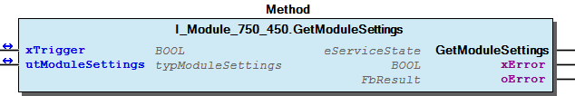
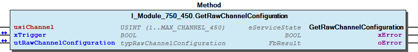
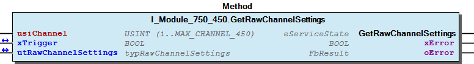
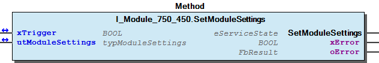
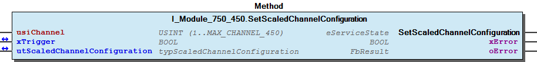
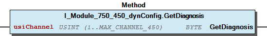
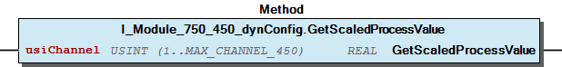

# WagoTypesModule_750_450 v1.9.3.1 (WAGO) - Complete Documentation


## 📋 Library Information

- **Company:** WAGO
- **Title:** WagoTypesModule_750_450
- **Version:** 1.9.3.1
- **Categories:** WAGO Internal|Common|Types and Interfaces
- **Author:** WAGO
- **Placeholder:** WagoTypesModule_750_450

### Description ¶


This document is automatically generated.

Handling modules 750-450

This document is automatically generated. Handling modules 750-450

### Contents: ¶


Contents: - Documentation Index - Project Information - Library Information - Methods I_Module_750_450.GetModuleSettings (METH) - I_Module_750_450.GetRawChannelCalibration (METH) - I_Module_750_450.GetRawChannelConfiguration (METH) - I_Module_750_450.GetRawChannelScaling (METH) - I_Module_750_450.GetRawChannelSettings (METH) - I_Module_750_450.GetScaledChannelConfiguration (METH) - I_Module_750_450.SetModuleSettings (METH) - I_Module_750_450.SetRawChannelCalibration (METH) - I_Module_750_450.SetRawChannelConfiguration (METH) - I_Module_750_450.SetRawChannelScaling (METH) - ... and 9 more Interfaces - I_Module_750_450 (ITF) - I_Module_750_450_dynConfig (ITF) Program Organization Global Variable Lists - Channels_450 (GVL) - VersionHistory (GVL) Other Components - 10 Enumeration - 15 Datatypes - Channel - Configuration - Module - ProcessValues - Raw - Scaled - eNotchFilter (ENUM) - eSensorType (ENUM) - ... and 7 more

### Indices and tables ¶


Based on WagoTypesModule_750_450.library, last modified 20.09.2024, 21:22:52. LibDoc 3.5.16.10

© WAGO GmbH & Co. KG, Germany 2018 – All rights reserved. For the avoidance of doubt, this copyright notice does not only apply to the information above but also and primarily to the described library itself. Please note that third-party products are always mentioned without reference to intellectual property rights, including patents, utility models, designs and trademarks, accordingly the existence of such rights cannot be excluded. WAGO is a registered trademark of WAGO Verwaltungsgesellschaft mbH.

- File and Project Information - Library Reference Based on WagoTypesModule_750_450.library, last modified 20.09.2024, 21:22:52. LibDoc 3.5.16.10 © WAGO GmbH & Co. KG, Germany 2018 – All rights reserved. For the avoidance of doubt, this copyright notice does not only apply to the information above but also and primarily to the described library itself. Please note that third-party products are always mentioned without reference to intellectual property rights, including patents, utility models, designs and trademarks, accordingly the existence of such rights cannot be excluded. WAGO is a registered trademark of WAGO Verwaltungsgesellschaft mbH.

### Documentation Index


## WagoTypesModule_750_450 Library Documentation


| Company: | WAGO |
| Title: | WagoTypesModule_750_450 |
| Version: | 1.9.3.1 |
| Categories: | WAGO Internal\|Common\|Types and Interfaces |
| Author: | WAGO |
| Placeholder: | WagoTypesModule_750_450 |

### Description


This document is automatically generated.

Handling modules 750-450

This document is automatically generated. Handling modules 750-450

### Contents:


- 20 Program Organization Units 10 Enumeration - 15 Datatypes - Channels_450 (GVL) - I_Module_750_450 (ITF) - I_Module_750_450_dynConfig (ITF) VersionHistory (GVL)

### Indices and tables


Based on WagoTypesModule_750_450.library, last modified 20.09.2024, 21:22:52. LibDoc 3.5.16.10

© WAGO GmbH & Co. KG, Germany 2018 – All rights reserved. For the avoidance of doubt, this copyright notice does not only apply to the information above but also and primarily to the described library itself. Please note that third-party products are always mentioned without reference to intellectual property rights, including patents, utility models, designs and trademarks, accordingly the existence of such rights cannot be excluded. WAGO is a registered trademark of WAGO Verwaltungsgesellschaft mbH.

- File and Project Information - Library Reference Based on WagoTypesModule_750_450.library, last modified 20.09.2024, 21:22:52. LibDoc 3.5.16.10 © WAGO GmbH & Co. KG, Germany 2018 – All rights reserved. For the avoidance of doubt, this copyright notice does not only apply to the information above but also and primarily to the described library itself. Please note that third-party products are always mentioned without reference to intellectual property rights, including patents, utility models, designs and trademarks, accordingly the existence of such rights cannot be excluded. WAGO is a registered trademark of WAGO Verwaltungsgesellschaft mbH.

### Project Information


## File and Project Information


| Scope | Name | Type | Content |
| --- | --- | --- | --- |
| FileHeader | libraryFile | string | WagoTypesModule_750_450.library |
| contentFile | doc.clean.json |
| productName | e!COCKPIT |
| creationDateTime | date | 20.09.2024, 21:22:53 |
| companyName | string | WAGO |
| ProjectInformation | LastModificationDateTime | date | 20.09.2024, 21:22:52 |
| Description | string | See: Description |
| Copyright | © WAGO Kontakttechnik GmbH & Co. KG, Germany 2018 – All rights reserved. |
| Author | WAGO |
| AutoResolveUnbound | bool | True |
| Placeholder | string | WagoTypesModule_750_450 |
| Company | WAGO |
| DocFormat | reStructuredText |
| Project | WagoTypesModule_750_450 |
| Version | version | 1.9.3.1 |
| Version string | string |  |
| Title | WagoTypesModule_750_450 |
| LibraryCategories | library-category-list | WAGO Internal\|Common\|Types and Interfaces |
| CompiledLibraryCompatibilityVersion | string | CODESYS V3.5 SP16 Patch 3 |

### Library Information


## Library Reference


| LinkAllContent: False QualifiedOnly: False | SystemLibrary: False | Optional: False |

| LinkAllContent: False QualifiedOnly: True | SystemLibrary: False | Optional: False |

| LinkAllContent: False QualifiedOnly: True | SystemLibrary: False | Optional: False |

This is a dictionary of all referenced libraries and their name spaces.

This is a dictionary of all referenced libraries and their name spaces. WagoSysErrorBase Library Identification : Placeholder: WagoSysErrorBase Default Resolution: WagoSysErrorBase, * (WAGO) Namespace: WagoSysErrorBase Library Properties : WagoSysVersion Library Identification : Name: WagoSysVersion Version: 1.0.0.0 Company: WAGO Namespace: WagoSysVersion Library Properties : WagoTypesModuleBase Library Identification : Placeholder: WagoTypesModuleBase Default Resolution: WagoTypesModuleBase, * (WAGO) Namespace: WagoTypesModuleBase Library Properties : Library Parameter : Parameter: MAX_MBX_SIZE = 18

### Methods


## I_Module_750_450.GetModuleSettings (METH)


| Scope | Name | Type | Comment |
| --- | --- | --- | --- |
| Return | GetModuleSettings | WagoTypesModuleBase.eServiceState |  |
| Inout | xTrigger | BOOL | set this variable once to start the process. It will be reset by the Method automatic. |
| utModuleSettings | typModuleSettings |  |
| Output | xError | BOOL |  |
| oError | WagoSysErrorBase.FbResult |  |

| Struct member | Value | Description |
| --- | --- | --- |
| xAmountSignFormat | FALSE | Numeric values appear in two’s complement |
| TRUE | Numeric values appear in amount / sign format |
| xS5FB250Format | FALSE | Numeric values appear in standard format |
| TRUE | Numeric values appear in S5-FB250 format |
| xDisableWatchdog | FALSE | The Watchdog timer is enabled |
| TRUE | The Watchdog timer is not enabled. The Satus LEDs light up continuously |
| eNotchFilter | DISABLED_100HZ | The Notch filter is not enabled (100 Hz) |
| ENABLED_50HZ | Notch filter ( 50 Hz ) |
| ENABLED_60HZ | Notch filter ( 60 Hz ) |
| ENABLED_50_60HZ | Notch filter ( 50/60 Hz ) |

```
VAR
    //--- Module Mode Settings ------------------------------
    utModuleSettings    :   WagoTypesModule_750_450.typModuleSettings;
    xGetModuleSettings  :   BOOL; // set this variable once to start the process. It will be reset by the Method automatic.
    oError              :   WagoSysErrorBase.FbResult;
END_VAR

//--- M O D U L E    S E T T I N G S -----------------------
CASE my450.GetModuleSettings(xGetModuleSettings, utModuleSettings, oError => oError) OF

    eServiceState.DONE : // OK
            ;// process here your utModuleSettings

    eServiceState.ABORT : // Error
            ;// process here your error handling -> see oError for more information

END_CASE
```

Get the common settings of the module at a struct.

WagoTypesModule_750_450.typModuleSettings

Graphical Illustration

Graphical Interface of I_Module_750_450.GetModuleSettings

For get the settings from the module.

You have to call the method cyclic until the method returns with DONE or ABORT.

Interface variables Function Get the common settings of the module at a struct. WagoTypesModule_750_450.typModuleSettings Graphical Illustration  Graphical Interface of I_Module_750_450.GetModuleSettings Example For get the settings from the module. Note You have to call the method cyclic until the method returns with DONE or ABORT.

## I_Module_750_450.GetRawChannelCalibration (METH)


| Scope | Name | Type |
| --- | --- | --- |
| Return | GetRawChannelCalibration | WagoTypesModuleBase.eServiceState |
| Input | usiChannel | USINT (1..MAX_CHANNEL_450) |
| Inout | xTrigger | BOOL |
| utRawChannelCalibration | typRawChannelCalibration |
| Output | xError | BOOL |
| oError | WagoSysErrorBase.FbResult |

| Struct member | Value | Description |
| --- | --- | --- |
| xUserCalibration | FALSE | User calibration disabled |
| TRUE | User calibration enabled |
| iUserCalibrationOffset | -32768 ... 32767 | User calibration Offset |
| uiUserCalibrationGain | 0 ... 65535 | User calibration Gain |

```
VAR
    //--- Channel Calibration ---------------------------------
    utChannelCalibration    :   WagoTypesModule_750_450.typRawChannelCalibration;
    xGetChannelCalibration  :   BOOL;
    oError                  :   WagoSysErrorBase.FbResult;
END_VAR

//--- C H A N N E L    C A L I B R A T I O N -----------------------
CASE my450.GetRawChannelCalibration(    usiChannel              := 1,
                                        xTrigger                := xGetChannelCalibration,
                                        utRawChannelCalibration := utChannelCalibration,
                                        oError                  => oError
                                    ) OF

    eServiceState.DONE : // OK
            ;// process here your utModuleSettings

    eServiceState.ABORT : // Error
            ;// process here your error handling -> see oError for more information

END_CASE
```

Get the calibration of a channel at a struct.

WagoTypesModule_750_450.typRawChannelCalibration

Graphical Illustration

Graphical Interface of I_Module_750_450.GetRawChannelCalibration

For get the calibration from channel one

You have to call the method cyclic until the method returns with DONE or ABORT.

Interface variables Function Get the calibration of a channel at a struct. WagoTypesModule_750_450.typRawChannelCalibration Graphical Illustration  Graphical Interface of I_Module_750_450.GetRawChannelCalibration Example For get the calibration from channel one Note You have to call the method cyclic until the method returns with DONE or ABORT.

## I_Module_750_450.GetRawChannelConfiguration (METH)


| Scope | Name | Type |
| --- | --- | --- |
| Return | GetRawChannelConfiguration | WagoTypesModuleBase.eServiceState |
| Input | usiChannel | USINT (1..MAX_CHANNEL_450) |
| Inout | xTrigger | BOOL |
| utRawChannelConfiguration | typRawChannelConfiguration |
| Output | xError | BOOL |
| oError | WagoSysErrorBase.FbResult |

| Struct member | Value | Description |
| --- | --- | --- |
| Settings | eSensorType |  | Standard | Range | Resolution |
| Pt100_EN60751 | IEC 751 | -200 °C...850 °C | 0.1 K |
| Ni100_DIN43760 | DIN 43760 | -60 °C...250 °C | 0.1 K |
| Pt1000_EN60751 | IEC 751 | -200 °C...850 °C | 0.1 K |
| Pt500_EN60751 | IEC 751 | -200 °C...850 °C | 0.1 K |
| Pt200_EN60751 | IEC 751 | -200 °C...850 °C | 0.1 K |
| Ni1000_TK6180 | DIN 43760 | -60 °C...250 °C | 0.1 K |
| Ni120_MINCO | Minco | -80 °C...260 °C | 0.1 K |
| Ni1000_TK5000 | TK 5000 | -60 °C...250 °C | 0.1 K |
| Ni1000_TK6180_01 | DIN 43760 | -50 °C...150 °C | 0.01 K |
| Ni1000_TK5000_01 | TK 5000 | -50 °C...150 °C | 0.01 K |
| Pt1000_EN60751_01 | IEC 751 | -50 °C...150 °C | 0.01 K |
| Potentiometer |  | 0 % ... 100 % | 0.005 % |
| Resistor_1 |  | 0 Ω...5 kΩ | 0.2 Ω |
| Resistor_2 |  | 0 Ω...1.2 kΩ | 0.02 Ω |
| eWireMode | DISABLED | Channel deactivated |
| TWO_WIRE | 2-Wire Connection |
| THREE_WIRE | 3-Wire Connection |
| FOUR_WIRE | 4-Wire Connection |
| xEnableDiagGlobal | FALSE | Diagnostis global functions disabled |
| TRUE | Diagnostis global functions enabled |
| xEnableDiagWireBreak | FALSE | Diagnostis wire break disabled |
| TRUE | Diagnostis wire break enabled |
| xEnableDiagShortCircuit | FALSE | Diagnostis short circuit disabled |
| TRUE | Diagnostis short circuit enabled |
| xEnableDiagCommonError | FALSE | Diagnostis Group error disabled |
| TRUE | Diagnostis Group error enabled |
| xEnableDiagOverflow | FALSE | Diagnostis overrange disabled |
| TRUE | Diagnostis overrange enabled |
| xEnableDiagUnderflow | FALSE | Diagnostis underrange disabled |
| TRUE | Diagnostis underrange enabled |
| iUpperUserLimitValue | -32768 ... 32767 | Upper user limit value |
| xEnableDiagLimitOverflow | FALSE | Diagnostis user limiting value overrange disabled |
| TRUE | Diagnostis user limiting value overrange enabled |
| iLowerUserLimitValue | -32768 ... 32767 | Lower user limit value |
| xEnableDiagLimitUnderflow | FALSE | Diagnostis user limiting value underrange disabled |
| TRUE | Diagnostis user limiting value underrange enabled |
| Scaling | xUserScaling | FALSE | User scaling disabled -> use manufacturer scaling |
| TRUE | User scaling enabled |
| iUserScalingOffset | -32768 ... 32767 | User scaling Offset |
| uiUserScalingGain | 0 ... 65535 | User scaling Gain |
| uiUserScalingDivisor | 0 ... 65535 | User scaling Divisor default = 256 -> (read only) |
| uiLineResistance | 0 ... 65535 | Line resistor [mOhm] |
| Calibration | xUserCalibration | FALSE | User calibration disabled |
| TRUE | User calibration enabled |
| iUserCalibrationOffset | -32768 ... 32767 | User calibration Offset |
| uiUserCalibrationGain | 0 ... 65535 | User calibration Gain |

```
VAR
    //--- Channel Configuration ---------------------------------
    utRawChannelConfiguration   :   WagoTypesModule_750_450.typRawChannelConfiguration;
    xGetRawChannelConfiguration :   BOOL;
    oError                      :   WagoSysErrorBase.FbResult;
END_VAR

//--- C H A N N E L    C O N F I G U R A T I O N -----------------------
CASE my450.GetRawChannelConfiguration(  usiChannel                  := 1,
                                        xTrigger                    := xGetRawChannelConfiguration,
                                        utRawChannelConfiguration   := utRawChannelConfiguration,
                                        oError                      => oError
                                    ) OF

    eServiceState.DONE : // OK
            ;// process here your utChannelConfiguration

    eServiceState.ABORT : // Error
            ;// process here your error handling -> see oError for more information

END_CASE
```

Get the complete raw configuration of a channel.

WagoTypesModule_750_450.typRawChannelConfiguration

Graphical Illustration

Graphical Interface of I_Module_750_450.GetRawChannelConfiguration

For get the configuration from channel one

You have to call the method cyclic until the method returns with DONE or ABORT.

Interface variables Function Get the complete raw configuration of a channel. WagoTypesModule_750_450.typRawChannelConfiguration Graphical Illustration  Graphical Interface of I_Module_750_450.GetRawChannelConfiguration Example For get the configuration from channel one Note You have to call the method cyclic until the method returns with DONE or ABORT.

## I_Module_750_450.GetRawChannelScaling (METH)


| Scope | Name | Type |
| --- | --- | --- |
| Return | GetRawChannelScaling | WagoTypesModuleBase.eServiceState |
| Input | usiChannel | USINT (1..MAX_CHANNEL_450) |
| Inout | xTrigger | BOOL |
| utRawChannelScaling | typRawChannelScaling |
| Output | xError | BOOL |
| oError | WagoSysErrorBase.FbResult |

| Struct member | Value | Description |
| --- | --- | --- |
| xUserScaling | FALSE | User scaling disabled -> use manufacturer scaling |
| TRUE | User scaling enabled |
| iUserScalingOffset | -32768 ... 32767 | User scaling Offset |
| uiUserScalingGain | 0 ... 65535 | User scaling Gain |
| uiUserScalingDivisor | 0 ... 65535 | User scaling Divisor default = 256 -> (read only) |
| uiLineResistance | 0 ... 65535 | Line resistor [mOhm] |

```
VAR
    //--- Channel Settings ---------------------------------
    utChannelScaling    :   WagoTypesModule_750_450.typRawChannelScaling;
    xGetChannelScaling  :   BOOL;
    oError              :   WagoSysErrorBase.FbResult;
END_VAR

//--- C H A N N E L   S C A L I N G ------------------------
CASE my450.GetRawChannelScaling(    usiChannel           := 1,
                                    xTrigger             := xGetChannelScaling,
                                    utRawChannelScaling  := utChannelScaling,
                                    oError               => oError
                                ) OF

    eServiceState.DONE : // OK
            ;// process here your utModuleSettings

    eServiceState.ABORT : // Error
            ;// process here your error handling -> see oError for more information

END_CASE
```

WagoTypesModule_750_450.typRawChannelScaling

Graphical Illustration

Graphical Interface of I_Module_750_450.GetRawChannelScaling

For get the scaling from channel one

You have to call the method cyclic until the method returns with DONE or ABORT.

Interface variables Function Get the scaling of a channel at a struct. WagoTypesModule_750_450.typRawChannelScaling Graphical Illustration  Graphical Interface of I_Module_750_450.GetRawChannelScaling Example For get the scaling from channel one Note You have to call the method cyclic until the method returns with DONE or ABORT.

## I_Module_750_450.GetRawChannelSettings (METH)


| Scope | Name | Type |
| --- | --- | --- |
| Return | GetRawChannelSettings | WagoTypesModuleBase.eServiceState |
| Input | usiChannel | USINT (1..MAX_CHANNEL_450) |
| Inout | xTrigger | BOOL |
| utRawChannelSettings | typRawChannelSettings |
| Output | xError | BOOL |
| oError | WagoSysErrorBase.FbResult |

| Struct member | Value | Description |
| --- | --- | --- |
| eSensorType |  | Standard | Range | Resolution |
| Pt100_EN60751 | IEC 751 | -200 °C...850 °C | 0.1 K |
| Ni100_DIN43760 | DIN 43760 | -60 °C...250 °C | 0.1 K |
| Pt1000_EN60751 | IEC 751 | -200 °C...850 °C | 0.1 K |
| Pt500_EN60751 | IEC 751 | -200 °C...850 °C | 0.1 K |
| Pt200_EN60751 | IEC 751 | -200 °C...850 °C | 0.1 K |
| Ni1000_TK6180 | DIN 43760 | -60 °C...250 °C | 0.1 K |
| Ni120_MINCO | Minco | -80 °C...260 °C | 0.1 K |
| Ni1000_TK5000 | TK 5000 | -60 °C...250 °C | 0.1 K |
| Ni1000_TK6180_01 | DIN 43760 | -50 °C...150 °C | 0.01 K |
| Ni1000_TK5000_01 | TK 5000 | -50 °C...150 °C | 0.01 K |
| Pt1000_EN60751_01 | IEC 751 | -50 °C...150 °C | 0.01 K |
| Potentiometer |  | 0 % ... 100 % | 0.005 % |
| Resistor_1 |  | 0 Ω...5 kΩ | 0.2 Ω |
| Resistor_2 |  | 0 Ω...1.2 kΩ | 0.02 Ω |
| eWireMode | DISABLED | Channel deactivated |
| TWO_WIRE | 2-Wire Connection |
| THREE_WIRE | 3-Wire Connection |
| FOUR_WIRE | 4-Wire Connection |
| xEnableDiagGlobal | FALSE | Diagnostis global functions disabled |
| TRUE | Diagnostis global functions enabled |
| xEnableDiagWireBreak | FALSE | Diagnostis wire break disabled |
| TRUE | Diagnostis wire break enabled |
| xEnableDiagShortCircuit | FALSE | Diagnostis short circuit disabled |
| TRUE | Diagnostis short circuit enabled |
| xEnableDiagCommonError | FALSE | Diagnostis Group error disabled |
| TRUE | Diagnostis Group error enabled |
| xEnableDiagOverflow | FALSE | Diagnostis overrange disabled |
| TRUE | Diagnostis overrange enabled |
| xEnableDiagUnderflow | FALSE | Diagnostis underrange disabled |
| TRUE | Diagnostis underrange enabled |
| iUpperUserLimitValue | -32768 ... 32767 | Upper user limit value |
| xEnableDiagLimitOverflow | FALSE | Diagnostis user limiting value overrange disabled |
| TRUE | Diagnostis user limiting value overrange enabled |
| iLowerUserLimitValue | -32768 ... 32767 | Lower user limit value |
| xEnableDiagLimitUnderflow | FALSE | Diagnostis user limiting value underrange disabled |
| TRUE | Diagnostis user limiting value underrange enabled |

```
VAR
    //--- Channel Settings ---------------------------------
    utChannelSettings   :   WagoTypesModule_750_450.typRawChannelSettings;
    xGetChannelSettings :   BOOL;
    oError              :   WagoSysErrorBase.FbResult;
END_VAR

//--- C H A N N E L   S E T T I N G S ----------------------
CASE my450.GetRawChannelSettings(   usiChannel           := 1,
                                    xTrigger             := xGetChannelSettings,
                                    utRawChannelSettings := utChannelSettings,
                                    oError               => oError
                                ) OF

    eServiceState.DONE : // OK
        ;// process here your utModuleSettings

    eServiceState.ABORT : // Error
        ;// process here your error handling -> see oError for more information

END_CASE
```

WagoTypesModule_750_450.typRawChannelSettings

Graphical Illustration

Graphical Interface of I_Module_750_450.GetRawChannelSettings

For get the settings from channel one

You have to call the method cyclic until the method returns with DONE or ABORT.

Interface variables Function Get the settings of a channel at a struct. WagoTypesModule_750_450.typRawChannelSettings Graphical Illustration  Graphical Interface of I_Module_750_450.GetRawChannelSettings Example For get the settings from channel one Note You have to call the method cyclic until the method returns with DONE or ABORT.

## I_Module_750_450.GetScaledChannelConfiguration (METH)


| Scope | Name | Type |
| --- | --- | --- |
| Return | GetScaledChannelConfiguration | WagoTypesModuleBase.eServiceState |
| Input | usiChannel | USINT (1..MAX_CHANNEL_450) |
| Inout | xTrigger | BOOL |
| utScaledChannelConfiguration | typScaledChannelConfiguration |
| Output | xError | BOOL |
| oError | WagoSysErrorBase.FbResult |

| Struct member | Value | Description |
| --- | --- | --- |
| Settings | eSensorType |  | Standard | Range | Resolution |
| Pt100_EN60751 | IEC 751 | -200 °C...850 °C | 0.1 K |
| Ni100_DIN43760 | DIN 43760 | -60 °C...250 °C | 0.1 K |
| Pt1000_EN60751 | IEC 751 | -200 °C...850 °C | 0.1 K |
| Pt500_EN60751 | IEC 751 | -200 °C...850 °C | 0.1 K |
| Pt200_EN60751 | IEC 751 | -200 °C...850 °C | 0.1 K |
| Ni1000_TK6180 | DIN 43760 | -60 °C...250 °C | 0.1 K |
| Ni120_MINCO | Minco | -80 °C...260 °C | 0.1 K |
| Ni1000_TK5000 | TK 5000 | -60 °C...250 °C | 0.1 K |
| Ni1000_TK6180_01 | DIN 43760 | -50 °C...150 °C | 0.01 K |
| Ni1000_TK5000_01 | TK 5000 | -50 °C...150 °C | 0.01 K |
| Pt1000_EN60751_01 | IEC 751 | -50 °C...150 °C | 0.01 K |
| Potentiometer |  | 0 % ... 100 % | 0.005 % |
| Resistor_1 |  | 0 Ω...5 kΩ | 0.2 Ω |
| Resistor_2 |  | 0 Ω...1.2 kΩ | 0.02 Ω |
| eWireMode | DISABLED | Channel deactiveted |
| TWO_WIRE | 2-Wire Connection |
| THREE_WIRE | 3-Wire Connection |
| FOUR_WIRE | 4-Wire Connection |
| xEnableDiagGlobal | FALSE | Diagnostis global functions disabled |
| TRUE | Diagnostis global functions enabled |
| xEnableDiagWireBreak | FALSE | Diagnostis wire break disabled |
| TRUE | Diagnostis wire break enabled |
| xEnableDiagShortCircuit | FALSE | Diagnostis short circuit disabled |
| TRUE | Diagnostis short circuit enabled |
| xEnableDiagCommonError | FALSE | Diagnostis Group error disabled |
| TRUE | Diagnostis Group error enabled |
| xEnableDiagOverflow | FALSE | Diagnostis overrange disabled |
| TRUE | Diagnostis overrange enabled |
| xEnableDiagUnderflow | FALSE | Diagnostis underrange disabled |
| TRUE | Diagnostis underrange enabled |
| rUpperUserLimitValue |  | Upper user limit value range depends on sensortype |
| xEnableDiagLimitOverflow | FALSE | Diagnostis user limiting value overrange disabled |
| TRUE | Diagnostis user limiting value overrange enabled |
| rLowerUserLimitValue |  | Lower user limit value range depends on sensortype |
| xEnableDiagLimitUnderflow | FALSE | Diagnostis user limiting value underrange disabled |
| TRUE | Diagnostis user limiting value underrange enabled |
| Scaling | xUserScaling | FALSE | User scaling disabled -> use manufacturer scaling |
| TRUE | User scaling enabled |
| rUserScalingOffset |  | User scaling Offset range depends on sensortype |
| uiUserScalingGain | 0 ... 65535 | User scaling Gain |
| uiUserScalingDivisor | 0 ... 65535 | User scaling Divisor default = 256 -> (read only) |
| rLineResistance | 0 ... 65.535 | Line resistance [Ω] |
| Calibration | xUserCalibration | FALSE | User calibration disabled |
| TRUE | User calibration enabled |
| diUserCalibrationOffset | -262144 .. 261236 | User calibration Offset |
| rUserCalibrationGain | 0 ... 1.9999 | User calibration Gain |

```
VAR
    //--- Channel Configuration ---------------------------------
    utScaledChannelConfiguration    :   WagoTypesModule_750_450.typScaledChannelConfiguration;
    xGetScaledChannelConfiguration  :   BOOL;
    oError                          :   WagoSysErrorBase.FbResult;
END_VAR

//--- C H A N N E L    C O N F I G U R A T I O N -----------------------
CASE my450.GetScaledChannelConfiguration(   usiChannel                   := 1,
                                            xTrigger                     := xGetScaledChannelConfiguration,
                                            utScaledChannelConfiguration := utScaledChannelConfiguration,
                                            oError                       => oError
                                        ) OF

    eServiceState.DONE : // OK
            ;// process here your utChannelConfiguration

    eServiceState.ABORT : // Error
            ;// process here your error handling -> see oError for more information

END_CASE
```

Get the complete configuration of a channel.

WagoTypesModule_750_450.typScaledChannelConfiguration

Graphical Illustration

Graphical Interface of I_Module_750_450.GetScaledChannelConfiguration

For get the scaled configuration from channel one

You have to call the method cyclic until the method returns with DONE or ABORT.

Interface variables Function Get the complete configuration of a channel. WagoTypesModule_750_450.typScaledChannelConfiguration Graphical Illustration  Graphical Interface of I_Module_750_450.GetScaledChannelConfiguration Example For get the scaled configuration from channel one Note You have to call the method cyclic until the method returns with DONE or ABORT.

## I_Module_750_450.SetModuleSettings (METH)


| Scope | Name | Type | Comment |
| --- | --- | --- | --- |
| Return | SetModuleSettings | WagoTypesModuleBase.eServiceState |  |
| Inout | xTrigger | BOOL | set this variable once to start the process. It will be automatic reset by this Method. |
| utModuleSettings | typModuleSettings |  |
| Output | xError | BOOL |  |
| oError | WagoSysErrorBase.FbResult |  |

| Struct member | Value | Description |
| --- | --- | --- |
| xAmountSignFormat | FALSE | Numeric values appear in two’s complement |
| TRUE | Numeric values appear in amount / sign format |
| xS5FB250Format | FALSE | Numeric values appear in standard format |
| TRUE | Numeric values appear in S5-FB250 format |
| xDisableWatchdog | FALSE | The Watchdog timer is enabled |
| TRUE | The Watchdog timer is not enabled. The Satus LEDs light up continuously |
| eNotchFilter | DISABLED_100HZ | The Notch filter is not enabled (100 Hz) |
| ENABLED_50HZ | Notch filter ( 50 Hz ) |
| ENABLED_60HZ | Notch filter ( 60 Hz ) |
| ENABLED_50_60HZ | Notch filter ( 50/60 Hz ) |

```
VAR
    //--- Module Mode Settings ------------------------------
    utModuleSettings    :   WagoTypesModule_750_450.typModuleSettings;
    xSetModuleSettings  :   BOOL; // set this variable once to start the process. It will be reset by the Method automatic.
    oError              :   WagoSysErrorBase.FbResult;
END_VAR

//--- S E T   M O D U L E    S E T T I N G S ---------------
CASE my450.SetModuleSettings(xSetModuleSettings, utModuleSettings, oError => oError) OF

    eServiceState.DONE : // OK

    eServiceState.ABORT : // Error
            ;// process here your error handling -> see oError for more information

END_CASE
```

Set the common settings of the module from a struct.

WagoTypesModule_750_450.typModuleSettings

Graphical Illustration

Graphical Interface of I_Module_750_450.SetModuleSettings

For set the settings from the module.

You have to call the method cyclic until the method returns with DONE or ABORT.

Interface variables Function Set the common settings of the module from a struct. WagoTypesModule_750_450.typModuleSettings Graphical Illustration  Graphical Interface of I_Module_750_450.SetModuleSettings Example For set the settings from the module. Note You have to call the method cyclic until the method returns with DONE or ABORT.

## I_Module_750_450.SetRawChannelCalibration (METH)


| Scope | Name | Type |
| --- | --- | --- |
| Return | SetRawChannelCalibration | WagoTypesModuleBase.eServiceState |
| Input | usiChannel | USINT (1..MAX_CHANNEL_450) |
| Inout | xTrigger | BOOL |
| utRawChannelCalibration | typRawChannelCalibration |
| Output | xError | BOOL |
| oError | WagoSysErrorBase.FbResult |

| Struct member | Value | Description |
| --- | --- | --- |
| xUserCalibration | FALSE | User calibration disabled |
| TRUE | User calibration enabled |
| iUserCalibrationOffset | -32768 ... 32767 | User calibration Offset |
| uiUserCalibrationGain | 0 ... 65535 | User calibration Gain |

```
VAR
    //--- Channel Calibration ---------------------------------
    utChannelCalibration    :   WagoTypesModule_750_450.typRawChannelCalibration;
    xSetChannelCalibration  :   BOOL;
    oError                  :   WagoSysErrorBase.FbResult;
END_VAR

//--- C H A N N E L    C A L I B R A T I O N -----------------------
CASE my450.SetRawChannelCalibration(    usiChannel              := 1,
                                        xTrigger                := xSetChannelCalibration,
                                        utRawChannelCalibration := utChannelCalibration,
                                        oError                  => oError
                                   ) OF

    eServiceState.DONE : // OK
            ;// process here your utModuleSettings

    eServiceState.ABORT : // Error
            ;// process here your error handling -> see oError for more information

END_CASE
```

Set the calibration of a channel by a struct.

WagoTypesModule_750_450.typRawChannelCalibration

Graphical Illustration

Graphical Interface of I_Module_750_450.SetRawChannelCalibration

For set the calibration of channel one

You have to call the method cyclic until the method returns with DONE or ABORT.

Interface variables Function Set the calibration of a channel by a struct. WagoTypesModule_750_450.typRawChannelCalibration Graphical Illustration  Graphical Interface of I_Module_750_450.SetRawChannelCalibration Example For set the calibration of channel one Note You have to call the method cyclic until the method returns with DONE or ABORT.

## I_Module_750_450.SetRawChannelConfiguration (METH)


| Scope | Name | Type |
| --- | --- | --- |
| Return | SetRawChannelConfiguration | WagoTypesModuleBase.eServiceState |
| Input | usiChannel | USINT (1..MAX_CHANNEL_450) |
| Inout | xTrigger | BOOL |
| utRawChannelConfiguration | typRawChannelConfiguration |
| Output | xError | BOOL |
| oError | WagoSysErrorBase.FbResult |

| Struct member | Value | Description |
| --- | --- | --- |
| Settings | eSensorType |  | Standard | Range | Resolution |
| Pt100_EN60751 | IEC 751 | -200 °C...850 °C | 0.1 K |
| Ni100_DIN43760 | DIN 43760 | -60 °C...250 °C | 0.1 K |
| Pt1000_EN60751 | IEC 751 | -200 °C...850 °C | 0.1 K |
| Pt500_EN60751 | IEC 751 | -200 °C...850 °C | 0.1 K |
| Pt200_EN60751 | IEC 751 | -200 °C...850 °C | 0.1 K |
| Ni1000_TK6180 | DIN 43760 | -60 °C...250 °C | 0.1 K |
| Ni120_MINCO | Minco | -80 °C...260 °C | 0.1 K |
| Ni1000_TK5000 | TK 5000 | -60 °C...250 °C | 0.1 K |
| Ni1000_TK6180_01 | DIN 43760 | -50 °C...150 °C | 0.01 K |
| Ni1000_TK5000_01 | TK 5000 | -50 °C...150 °C | 0.01 K |
| Pt1000_EN60751_01 | IEC 751 | -50 °C...150 °C | 0.01 K |
| Potentiometer |  | 0 % ... 100 % | 0.005 % |
| Resistor_1 |  | 0 Ω...5 kΩ | 0.2 Ω |
| Resistor_2 |  | 0 Ω...1.2 kΩ | 0.02 Ω |
| eWireMode | DISABLED | Channel deactivated |
| TWO_WIRE | 2-Wire Connection |
| THREE_WIRE | 3-Wire Connection |
| FOUR_WIRE | 4-Wire Connection |
| xEnableDiagGlobal | FALSE | Diagnostis global functions disabled |
| TRUE | Diagnostis global functions enabled |
| xEnableDiagWireBreak | FALSE | Diagnostis wire break disabled |
| TRUE | Diagnostis wire break enabled |
| xEnableDiagShortCircuit | FALSE | Diagnostis short circuit disabled |
| TRUE | Diagnostis short circuit enabled |
| xEnableDiagCommonError | FALSE | Diagnostis Group error disabled |
| TRUE | Diagnostis Group error enabled |
| xEnableDiagOverflow | FALSE | Diagnostis overrange disabled |
| TRUE | Diagnostis overrange enabled |
| xEnableDiagUnderflow | FALSE | Diagnostis underrange disabled |
| TRUE | Diagnostis underrange enabled |
| iUpperUserLimitValue | -32768 ... 32767 | Upper user limit value |
| xEnableDiagLimitOverflow | FALSE | Diagnostis user limiting value overrange disabled |
| TRUE | Diagnostis user limiting value overrange enabled |
| iLowerUserLimitValue | -32768 ... 32767 | Lower user limit value |
| xEnableDiagLimitUnderflow | FALSE | Diagnostis user limiting value underrange disabled |
| TRUE | Diagnostis user limiting value underrange enabled |
| Scaling | xUserScaling | FALSE | User scaling disabled -> use manufacturer scaling |
| TRUE | User scaling enabled |
| iUserScalingOffset | -32768 ... 32767 | User scaling Offset |
| uiUserScalingGain | 0 ... 65535 | User scaling Gain |
| uiUserScalingDivisor | 0 ... 65535 | User scaling Divisor default = 256 -> (read only) |
| uiLineResistance | 0 ... 65535 | Line resistor [mOhm] |
| Calibration | xUserCalibration | FALSE | User calibration disabled |
| TRUE | User calibration enabled |
| iUserCalibrationOffset | -32768 ... 32767 | User calibration Offset |
| uiUserCalibrationGain | 0 ... 65535 | User calibration Gain |

```
VAR
    //--- Channel Configuration -------------------------------------------------------
    xStartProcess               :   BOOL; // set this variable once to start the process -> this varibale will be automatic reset
    utRawChannelConfiguration   :   WagoTypesModule_750_450.typRawChannelConfiguration;
    oError                      :   WagoSysErrorBase.FbResult;
    xSetRawChannelConfiguration :   BOOL;
END_VAR

//--- C H A N N E L    C O N F I G U R A T I O N -----------------------
//--- READ BEFORE WRITE --------------------------------------------------------------
CASE my450.GetRawChannelConfiguration( 1, xStartProcess, utRawChannelConfiguration, oError => oError) OF

    eServiceState.DONE : // OK -> actual configuration is successful read
        // change here your configuration
        // utRawChannelConfiguration... :=
        xSetRawChannelConfiguration := TRUE; // trigger write

    eServiceState.ABORT : // Error -> not able to read -> see oError
            ;// process here your error handling for read -> see oError for more information

END_CASE

//--- WRITE MODYFIED CONFIGURATION ---------------------------------------------------
CASE my450.SetRawChannelConfiguration( 1, xSetRawChannelConfiguration, utRawChannelConfiguration, oError => oError) OF

    eServiceState.DONE : // OK -> new configuration is written

    eServiceState.ABORT : // Error -> not able to write -> see oError
            ;// process here your error handling for write -> see oError for more information

END_CASE
```

Set the complete raw configuration of a channel.

WagoTypesModule_750_450.typRawChannelConfiguration

Graphical Illustration

Graphical Interface of I_Module_750_450.SetRawChannelConfiguration

For get the configuration from channel one and after read, write the configuration

You have to call the method cyclic until the method returns with DONE or ABORT.

Interface variables Function Set the complete raw configuration of a channel. WagoTypesModule_750_450.typRawChannelConfiguration Graphical Illustration  Graphical Interface of I_Module_750_450.SetRawChannelConfiguration Example For get the configuration from channel one and after read, write the configuration Note You have to call the method cyclic until the method returns with DONE or ABORT.

## I_Module_750_450.SetRawChannelScaling (METH)


| Scope | Name | Type |
| --- | --- | --- |
| Return | SetRawChannelScaling | WagoTypesModuleBase.eServiceState |
| Input | usiChannel | USINT (1..MAX_CHANNEL_450) |
| Inout | xTrigger | BOOL |
| utRawChannelScaling | typRawChannelScaling |
| Output | xError | BOOL |
| oError | WagoSysErrorBase.FbResult |

| Struct member | Value | Description |
| --- | --- | --- |
| xUserScaling | FALSE | User scaling disabled -> use manufacturer scaling |
| TRUE | User scaling enabled |
| iUserScalingOffset | -32768 ... 32767 | User scaling Offset |
| uiUserScalingGain | 0 ... 65535 | User scaling Gain |
| uiUserScalingDivisor | 0 ... 65535 | User scaling Divisor default = 256 -> (read only) |
| uiLineResistance | 0 ... 65535 | Line resistor [mOhm] |

```
VAR
    //--- Channel Settings ---------------------------------
    utChannelScaling    :   WagoTypesModule_750_450.typRawChannelScaling;
    xSetChannelScaling  :   BOOL;
    oError              :   WagoSysErrorBase.FbResult;
END_VAR

//--- C H A N N E L   S C A L I N G ------------------------
CASE my450.SetRawChannelScaling(    usiChannel          := 1,
                                    xTrigger            := xSetChannelScaling,
                                    utRawChannelScaling := utChannelScaling,
                                    oError              => oError
                                ) OF

    eServiceState.DONE : // OK
            ;// process here your utModuleSettings

    eServiceState.ABORT : // Error
            ;// process here your error handling -> see oError for more information

END_CASE
```

Set the scaling of a channel by a struct.

WagoTypesModule_750_450.typRawChannelScaling

Graphical Illustration

Graphical Interface of I_Module_750_450.SetRawChannelScaling

For set the scaling of channel one

You have to call the method cyclic until the method returns with DONE or ABORT.

Interface variables Function Set the scaling of a channel by a struct. WagoTypesModule_750_450.typRawChannelScaling Graphical Illustration  Graphical Interface of I_Module_750_450.SetRawChannelScaling Example For set the scaling of channel one Note You have to call the method cyclic until the method returns with DONE or ABORT.

## I_Module_750_450.SetRawChannelSettings (METH)


| Scope | Name | Type |
| --- | --- | --- |
| Return | SetRawChannelSettings | WagoTypesModuleBase.eServiceState |
| Input | usiChannel | USINT (1..MAX_CHANNEL_450) |
| Inout | xTrigger | BOOL |
| utRawChannelSettings | typRawChannelSettings |
| Output | xError | BOOL |
| oError | WagoSysErrorBase.FbResult |

| Struct member | Value | Description |
| --- | --- | --- |
| eSensorType |  | Standard | Range | Resolution |
| Pt100_EN60751 | IEC 751 | -200 °C...850 °C | 0.1 K |
| Ni100_DIN43760 | DIN 43760 | -60 °C...250 °C | 0.1 K |
| Pt1000_EN60751 | IEC 751 | -200 °C...850 °C | 0.1 K |
| Pt500_EN60751 | IEC 751 | -200 °C...850 °C | 0.1 K |
| Pt200_EN60751 | IEC 751 | -200 °C...850 °C | 0.1 K |
| Ni1000_TK6180 | DIN 43760 | -60 °C...250 °C | 0.1 K |
| Ni120_MINCO | Minco | -80 °C...260 °C | 0.1 K |
| Ni1000_TK5000 | TK 5000 | -60 °C...250 °C | 0.1 K |
| Ni1000_TK6180_01 | DIN 43760 | -50 °C...150 °C | 0.01 K |
| Ni1000_TK5000_01 | TK 5000 | -50 °C...150 °C | 0.01 K |
| Pt1000_EN60751_01 | IEC 751 | -50 °C...150 °C | 0.01 K |
| Potentiometer |  | 0 % ... 100 % | 0.005 % |
| Resistor_1 |  | 0 Ω...5 kΩ | 0.2 Ω |
| Resistor_2 |  | 0 Ω...1.2 kΩ | 0.02 Ω |
| eWireMode | DISABLED | Channel deactivated |
| TWO_WIRE | 2-Wire Connection |
| THREE_WIRE | 3-Wire Connection |
| FOUR_WIRE | 4-Wire Connection |
| xEnableDiagGlobal | FALSE | Diagnostis global functions disabled |
| TRUE | Diagnostis global functions enabled |
| xEnableDiagWireBreak | FALSE | Diagnostis wire break disabled |
| TRUE | Diagnostis wire break enabled |
| xEnableDiagShortCircuit | FALSE | Diagnostis short circuit disabled |
| TRUE | Diagnostis short circuit enabled |
| xEnableDiagCommonError | FALSE | Diagnostis Group error disabled |
| TRUE | Diagnostis Group error enabled |
| xEnableDiagOverflow | FALSE | Diagnostis overrange disabled |
| TRUE | Diagnostis overrange enabled |
| xEnableDiagUnderflow | FALSE | Diagnostis underrange disabled |
| TRUE | Diagnostis underrange enabled |
| iUpperUserLimitValue | -32768 ... 32767 | Upper user limit value |
| xEnableDiagLimitOverflow | FALSE | Diagnostis user limiting value overrange disabled |
| TRUE | Diagnostis user limiting value overrange enabled |
| iLowerUserLimitValue | -32768 ... 32767 | Lower user limit value |
| xEnableDiagLimitUnderflow | FALSE | Diagnostis user limiting value underrange disabled |
| TRUE | Diagnostis user limiting value underrange enabled |

```
VAR
    //--- Channel Settings ---------------------------------
    utChannelSettings   :   WagoTypesModule_750_450.typRawChannelSettings;
    xSetChannelSettings :   BOOL;
    oError              :   WagoSysErrorBase.FbResult;
END_VAR

//--- C H A N N E L   S E T T I N G S ----------------------
CASE my450.SetRawChannelSettings(   usiChannel           := 1,
                                    xTrigger             := xSetChannelSettings,
                                    utRawChannelSettings := utChannelSettings,
                                    oError               => oError
                                ) OF

    eServiceState.DONE : // OK
        ;// process here your utModuleSettings

    eServiceState.ABORT : // Error
        ;// process here your error handling -> see oError for more information

END_CASE
```

Set the settings for a channel by a struct.

WagoTypesModule_750_450.typRawChannelSettings

Graphical Illustration

Graphical Interface of I_Module_750_450.SetRawChannelSettings

For set the settings of channel one

You have to call the method cyclic until the method returns with DONE or ABORT.

Interface variables Function Set the settings for a channel by a struct. WagoTypesModule_750_450.typRawChannelSettings Graphical Illustration  Graphical Interface of I_Module_750_450.SetRawChannelSettings Example For set the settings of channel one Note You have to call the method cyclic until the method returns with DONE or ABORT.

## I_Module_750_450.SetScaledChannelConfiguration (METH)


| Scope | Name | Type |
| --- | --- | --- |
| Return | SetScaledChannelConfiguration | WagoTypesModuleBase.eServiceState |
| Input | usiChannel | USINT (1..MAX_CHANNEL_450) |
| Inout | xTrigger | BOOL |
| utScaledChannelConfiguration | typScaledChannelConfiguration |
| Output | xError | BOOL |
| oError | WagoSysErrorBase.FbResult |

| Struct member | Value | Description |
| --- | --- | --- |
| Settings | eSensorType |  | Standard | Range | Resolution |
| Pt100_EN60751 | IEC 751 | -200 °C...850 °C | 0.1 K |
| Ni100_DIN43760 | DIN 43760 | -60 °C...250 °C | 0.1 K |
| Pt1000_EN60751 | IEC 751 | -200 °C...850 °C | 0.1 K |
| Pt500_EN60751 | IEC 751 | -200 °C...850 °C | 0.1 K |
| Pt200_EN60751 | IEC 751 | -200 °C...850 °C | 0.1 K |
| Ni1000_TK6180 | DIN 43760 | -60 °C...250 °C | 0.1 K |
| Ni120_MINCO | Minco | -80 °C...260 °C | 0.1 K |
| Ni1000_TK5000 | TK 5000 | -60 °C...250 °C | 0.1 K |
| Ni1000_TK6180_01 | DIN 43760 | -50 °C...150 °C | 0.01 K |
| Ni1000_TK5000_01 | TK 5000 | -50 °C...150 °C | 0.01 K |
| Pt1000_EN60751_01 | IEC 751 | -50 °C...150 °C | 0.01 K |
| Potentiometer |  | 0 % ... 100 % | 0.005 % |
| Resistor_1 |  | 0 Ω...5 kΩ | 0.2 Ω |
| Resistor_2 |  | 0 Ω...1.2 kΩ | 0.02 Ω |
| eWireMode | DISABLED | Channel deactiveted |
| TWO_WIRE | 2-Wire Connection |
| THREE_WIRE | 3-Wire Connection |
| FOUR_WIRE | 4-Wire Connection |
| xEnableDiagGlobal | FALSE | Diagnostis global functions disabled |
| TRUE | Diagnostis global functions enabled |
| xEnableDiagWireBreak | FALSE | Diagnostis wire break disabled |
| TRUE | Diagnostis wire break enabled |
| xEnableDiagShortCircuit | FALSE | Diagnostis short circuit disabled |
| TRUE | Diagnostis short circuit enabled |
| xEnableDiagCommonError | FALSE | Diagnostis Group error disabled |
| TRUE | Diagnostis Group error enabled |
| xEnableDiagOverflow | FALSE | Diagnostis overrange disabled |
| TRUE | Diagnostis overrange enabled |
| xEnableDiagUnderflow | FALSE | Diagnostis underrange disabled |
| TRUE | Diagnostis underrange enabled |
| rUpperUserLimitValue |  | Upper user limit value range depends on sensortype |
| xEnableDiagLimitOverflow | FALSE | Diagnostis user limiting value overrange disabled |
| TRUE | Diagnostis user limiting value overrange enabled |
| rLowerUserLimitValue |  | Lower user limit value range depends on sensortype |
| xEnableDiagLimitUnderflow | FALSE | Diagnostis user limiting value underrange disabled |
| TRUE | Diagnostis user limiting value underrange enabled |
| Scaling | xUserScaling | FALSE | User scaling disabled -> use manufacturer scaling |
| TRUE | User scaling enabled |
| rUserScalingOffset |  | User scaling Offset range depends on sensortype |
| uiUserScalingGain | 0 ... 65535 | User scaling Gain |
| uiUserScalingDivisor | 0 ... 65535 | User scaling Divisor default = 256 -> (read only) |
| rLineResistance | 0 ... 65.535 | Line resistance [Ω] |
| Calibration | xUserCalibration | FALSE | User calibration disabled |
| TRUE | User calibration enabled |
| diUserCalibrationOffset | -262144 .. 261236 | User calibration Offset |
| rUserCalibrationGain | 0 ... 1.9999 | User calibration Gain |

```
VAR
    //--- Channel Configuration -------------------------------------------------------
    xStartProcess                   :   BOOL; // set this variable once to start the process -> this varibale will be automatic reset
    utScaledChannelConfiguration    :   WagoTypesModule_750_450.typScaledChannelConfiguration;
    oError                          :   WagoSysErrorBase.FbResult;
    xSetScaledChannelConfiguration  :   BOOL;
END_VAR

//--- C H A N N E L    C O N F I G U R A T I O N -----------------------
//--- READ BEFORE WRITE --------------------------------------------------------------
CASE my450.GetScaledChannelConfiguration( 1, xStartProcess, utScaledChannelConfiguration, oError => oError) OF

    eServiceState.DONE : // OK -> actual configuration is successful read
        // change here your configuration
        // utScaledChannelConfiguration... :=
        xSetScaledChannelConfiguration := TRUE; // trigger write

    eServiceState.ABORT : // Error -> not able to read -> see oError
            ;// process here your error handling for read -> see oError for more information

END_CASE

//--- WRITE MODYFIED CONFIGURATION ---------------------------------------------------
CASE my450.SetScaledChannelConfiguration( 1, xSetScaledChannelConfiguration, utScaledChannelConfiguration, oError => oError) OF

    eServiceState.DONE : // OK -> new configuration is written

    eServiceState.ABORT : // Error -> not able to write -> see oError
            ;// process here your error handling for write -> see oError for more information

END_CASE
```

Set the complete configuration of a channel.

WagoTypesModule_750_450.typScaledChannelConfiguration

Graphical Illustration

Graphical Interface of I_Module_750_450.SetScaledChannelConfiguration

For get the scaled configuration from channel one and after read, write the configuration

You have to call the method cyclic until the method returns with DONE or ABORT.

Interface variables Function Set the complete configuration of a channel. WagoTypesModule_750_450.typScaledChannelConfiguration Graphical Illustration  Graphical Interface of I_Module_750_450.SetScaledChannelConfiguration Example For get the scaled configuration from channel one and after read, write the configuration Note You have to call the method cyclic until the method returns with DONE or ABORT.

## I_Module_750_450_dynConfig.GetDiagnosis (METH)


| Scope | Name | Type |
| --- | --- | --- |
| Return | GetDiagnosis | BYTE |
| Input | usiChannel | USINT (1..MAX_CHANNEL_450) |

| Bit | Value | Description |
| --- | --- | --- |
| 0 | TRUE | short circuit or broken wire |
| 1 | TRUE | overflow or underflow |
| 2 |  | not used |
| 3 |  | not used |
| 4 |  | not used |
| 5 |  | not used |
| 6 | TRUE | diagnostic not available -> xS5FB250Format not set |
| 7 | TRUE | invalid channel |

```
VAR
    bDiagnostic :   BYTE;
END_VAR

bDiagnostic := my450.GetDiagnosis(1); // here is the diagnostic byte
```

To work with this method the module mode setting xS5FB250Format must be set to TRUE. In other cases there is no access to module diagnosis at this time.

xS5FB250Format must be set ...

Graphical Illustration

Graphical Interface of I_Module_750_450_dynConfig.GetDiagnosis

Interface variables Function To work with this method the module mode setting xS5FB250Format must be set to TRUE. In other cases there is no access to module diagnosis at this time. Note xS5FB250Format must be set ... Graphical Illustration  Graphical Interface of I_Module_750_450_dynConfig.GetDiagnosis Example For get the diagnostic byte from first channel of the module.

## I_Module_750_450_dynConfig.GetRawProcessValue (METH)


| Scope | Name | Type |
| --- | --- | --- |
| Return | GetRawProcessValue | INT |
| Input | usiChannel | USINT (1..MAX_CHANNEL_450) |

```
VAR
    myiProcessRawValue  :   INT;
END_VAR

myiProcessRawValue := my450.GetRawProcessValue(1); // here is the process raw value as INT
```

Get the raw process value of the wanted channel. The return value is unscaled in the range -32768 .. 37767.

In case of error (e.g. an invalid channel number is given) it returns 0.

Graphical Illustration

Graphical Interface of I_Module_750_450_dynConfig.GetRawProcessValue

Interface variables Function Get the raw process value of the wanted channel. The return value is unscaled in the range -32768 .. 37767. In case of error (e.g. an invalid channel number is given) it returns 0. Graphical Illustration  Graphical Interface of I_Module_750_450_dynConfig.GetRawProcessValue Example For get the process raw value from first channel of the module.

## I_Module_750_450_dynConfig.GetScaledProcessValue (METH)


| Scope | Name | Type |
| --- | --- | --- |
| Return | GetScaledProcessValue | REAL |
| Input | usiChannel | USINT (1..MAX_CHANNEL_450) |

```
VAR
    myrScaledProcessValue   :   REAL;
END_VAR

myrScaledProcessValue := my450.GetScaledProcessValue(1); // here is the process value
```

Graphical Illustration

Graphical Interface of I_Module_750_450_dynConfig.GetScaledProcessValue

Interface variables Function Get the scaled process value of the wanted channel. The range of the value depends on the configured sensortype. Graphical Illustration  Graphical Interface of I_Module_750_450_dynConfig.GetScaledProcessValue Example For get the process scaled value from first channel of the module.

## typModuleSettings (STRUCT)


| Name | Type | Comment |
| --- | --- | --- |
| xAmountSignFormat | BOOL | Number notation -> 2-complement / amount-sign (Bit 0) |
| xS5FB250Format | BOOL | S5-Format -> Standard / S5-FB250 format (Bit 1) |
| xDisableWatchdog | BOOL | Watchdog internal data bus -> enable / disable (Bit 2) |
| eNotchFilter | eNotchFilter | (BIT 3..4) |

| Struct member | Value | Description |
| --- | --- | --- |
| xAmountSignFormat | FALSE | Numeric values appear in two’s complement |
| TRUE | Numeric values appear in amount / sign format |
| xS5FB250Format | FALSE | Numeric values appear in standard format |
| TRUE | Numeric values appear in S5-FB250 format |
| xDisableWatchdog | FALSE | The Watchdog timer is enabled |
| TRUE | The Watchdog timer is not enabled. The Satus LEDs light up continuously |
| eNotchFilter | DISABLED_100HZ | The Notch filter is not enabled (100 Hz) |
| ENABLED_50HZ | Notch filter ( 50 Hz ) |
| ENABLED_60HZ | Notch filter ( 60 Hz ) |
| ENABLED_50_60HZ | Notch filter ( 50/60 Hz ) |

## typRawChannelSettings (STRUCT)


| Name | Type | Comment |
| --- | --- | --- |
| eSensorType | eSensorType | Bit 0..3 (Reg 35) |
| eWireMode | eWireMode | Bit 4..5 (Reg 35) |
| xEnableDiagGlobal | BOOL | Bit 15 (Reg 35) |
| xEnableDiagWireBreak | BOOL | Bit 13 (Reg 35) |
| xEnableDiagShortCircuit | BOOL | Bit 12 (Reg 35) |
| xEnableDiagCommonError | BOOL | Bit 14 (Reg 35) |
| xEnableDiagOverflow | BOOL | Bit 9 (Reg 35) |
| xEnableDiagUnderflow | BOOL | Bit 8 (Reg 35) |
| iUpperUserLimitValue | INT | (Reg 43) |
| xEnableDiagLimitOverflow | BOOL | Bit 11 (Reg 35) |
| iLowerUserLimitValue | INT | (Reg 42) |
| xEnableDiagLimitUnderflow | BOOL | Bit 10 (Reg 35) |

| Struct member | Value | Description |
| --- | --- | --- |
| eSensorType |  | Standard | Range | Resolution |
| Pt100_EN60751 | IEC 751 | -200 °C...850 °C | 0.1 K |
| Ni100_DIN43760 | DIN 43760 | -60 °C...250 °C | 0.1 K |
| Pt1000_EN60751 | IEC 751 | -200 °C...850 °C | 0.1 K |
| Pt500_EN60751 | IEC 751 | -200 °C...850 °C | 0.1 K |
| Pt200_EN60751 | IEC 751 | -200 °C...850 °C | 0.1 K |
| Ni1000_TK6180 | DIN 43760 | -60 °C...250 °C | 0.1 K |
| Ni120_MINCO | Minco | -80 °C...260 °C | 0.1 K |
| Ni1000_TK5000 | TK 5000 | -60 °C...250 °C | 0.1 K |
| Ni1000_TK6180_01 | DIN 43760 | -50 °C...150 °C | 0.01 K |
| Ni1000_TK5000_01 | TK 5000 | -50 °C...150 °C | 0.01 K |
| Pt1000_EN60751_01 | IEC 751 | -50 °C...150 °C | 0.01 K |
| Potentiometer |  | 0 % ... 100 % | 0.005 % |
| Resistor_1 |  | 0 Ω...5 kΩ | 0.2 Ω |
| Resistor_2 |  | 0 Ω...1.2 kΩ | 0.02 Ω |
| eWireMode | DISABLED | Channel deactivated |
| TWO_WIRE | 2-Wire Connection |
| THREE_WIRE | 3-Wire Connection |
| FOUR_WIRE | 4-Wire Connection |
| xEnableDiagGlobal | FALSE | Diagnostis global functions disabled |
| TRUE | Diagnostis global functions enabled |
| xEnableDiagWireBreak | FALSE | Diagnostis wire break disabled |
| TRUE | Diagnostis wire break enabled |
| xEnableDiagShortCircuit | FALSE | Diagnostis short circuit disabled |
| TRUE | Diagnostis short circuit enabled |
| xEnableDiagCommonError | FALSE | Diagnostis Group error disabled |
| TRUE | Diagnostis Group error enabled |
| xEnableDiagOverflow | FALSE | Diagnostis overrange disabled |
| TRUE | Diagnostis overrange enabled |
| xEnableDiagUnderflow | FALSE | Diagnostis underrange disabled |
| TRUE | Diagnostis underrange enabled |
| iUpperUserLimitValue | -32768 ... 32767 | Upper user limit value |
| xEnableDiagLimitOverflow | FALSE | Diagnostis user limiting value overrange disabled |
| TRUE | Diagnostis user limiting value overrange enabled |
| iLowerUserLimitValue | -32768 ... 32767 | Lower user limit value |
| xEnableDiagLimitUnderflow | FALSE | Diagnostis user limiting value underrange disabled |
| TRUE | Diagnostis user limiting value underrange enabled |

## typReg35Settings (STRUCT)


| Name | Type | Comment |
| --- | --- | --- |
| eSensorType | eSensorType | Bit 0..3 |
| eWireMode | eWireMode | Bit 4..5 |
| xUserCalibration | BOOL | Bit 6 * |
| xUserScaling | BOOL | Bit 7 * |
| xEnableDiagUnderflow | BOOL | Bit 8 |
| xEnableDiagOverflow | BOOL | Bit 9 |
| xEnableDiagLimitUnderflow | BOOL | Bit 10 |
| xEnableDiagLimitOverflow | BOOL | Bit 11 |
| xEnableDiagShortCircuit | BOOL | Bit 12 |
| xEnableDiagWireBreak | BOOL | Bit 13 |
| xEnableDiagCommonError | BOOL | Bit 14 |
| xEnableDiagGlobal | BOOL | Bit 15 |

## typScaledChannelSettings (STRUCT)


| Name | Type | Comment |
| --- | --- | --- |
| eSensorType | eSensorType | (Reg 35.0..3) |
| eWireMode | eWireMode | Bit 4..5 (Reg 35) |
| xEnableDiagGlobal | BOOL | (Reg 35.15) |
| xEnableDiagWireBreak | BOOL | (Reg 35.13) |
| xEnableDiagShortCircuit | BOOL | (Reg 35.12) |
| xEnableDiagCommonError | BOOL | (Reg 35.14) |
| xEnableDiagOverflow | BOOL | (Reg 35.9) |
| xEnableDiagUnderflow | BOOL | (Reg 35.8) |
| rUpperUserLimitValue | REAL | (Reg 43) range depends on the selected sensor type |
| xEnableDiagLimitOverflow | BOOL | (Reg 35.11) |
| rLowerUserLimitValue | REAL | (Reg 42) range depends on the selected sensor type |
| xEnableDiagLimitUnderflow | BOOL | (Reg 35.10) |

### Interfaces


## I_Module_750_450 (ITF)


- Channel I_Module_750_450.GetRawChannelCalibration (METH) - I_Module_750_450.GetRawChannelScaling (METH) - I_Module_750_450.GetRawChannelSettings (METH) - I_Module_750_450.SetRawChannelCalibration (METH) - I_Module_750_450.SetRawChannelScaling (METH) - I_Module_750_450.SetRawChannelSettings (METH) Configuration - I_Module_750_450.GetRawChannelConfiguration (METH) - I_Module_750_450.GetScaledChannelConfiguration (METH) - I_Module_750_450.SetRawChannelConfiguration (METH) - I_Module_750_450.SetScaledChannelConfiguration (METH) Module - I_Module_750_450.GetModuleSettings (METH) - I_Module_750_450.SetModuleSettings (METH)

## I_Module_750_450_dynConfig (ITF)


- ProcessValues I_Module_750_450_dynConfig.GetDiagnosis (METH) - I_Module_750_450_dynConfig.GetRawProcessValue (METH) - I_Module_750_450_dynConfig.GetScaledProcessValue (METH)

### Program Organization


## 20 Program Organization Units


- 10 Enumeration eNotchFilter (ENUM) - eSensorType (ENUM) - eWireMode (ENUM) 15 Datatypes - Raw typRawChannelCalibration (STRUCT) - typRawChannelScaling (STRUCT) - typRawChannelSettings (STRUCT) - typReg35Settings (STRUCT) Scaled - typScaledChannelCalibration (STRUCT) - typScaledChannelScaling (STRUCT) - typScaledChannelSettings (STRUCT) typModuleSettings (STRUCT) typRawChannelConfiguration (STRUCT) typScaledChannelConfiguration (STRUCT) Channels_450 (GVL) I_Module_750_450 (ITF) - Channel I_Module_750_450.GetRawChannelCalibration (METH) - I_Module_750_450.GetRawChannelScaling (METH) - I_Module_750_450.GetRawChannelSettings (METH) - I_Module_750_450.SetRawChannelCalibration (METH) - I_Module_750_450.SetRawChannelScaling (METH) - I_Module_750_450.SetRawChannelSettings (METH) Configuration - I_Module_750_450.GetRawChannelConfiguration (METH) - I_Module_750_450.GetScaledChannelConfiguration (METH) - I_Module_750_450.SetRawChannelConfiguration (METH) - I_Module_750_450.SetScaledChannelConfiguration (METH) Module - I_Module_750_450.GetModuleSettings (METH) - I_Module_750_450.SetModuleSettings (METH) I_Module_750_450_dynConfig (ITF) - ProcessValues I_Module_750_450_dynConfig.GetDiagnosis (METH) - I_Module_750_450_dynConfig.GetRawProcessValue (METH) - I_Module_750_450_dynConfig.GetScaledProcessValue (METH)

### Global Variable Lists


## Channels_450 (GVL)


| Scope | Name | Type | Initial | Comment |
| --- | --- | --- | --- | --- |
| Constant | MAX_CHANNEL_450 | USINT | 4 | max. channels for 750-450 |

## VersionHistory (GVL)


| Name | Type |
| --- | --- |
| Info | ProjectInfo |

| date | version | author | change |
| 28.08.2024 | 1.9.3.1 | u0103719 | WAT36092: add missing sensor PT100_EN60751 (context: sensor type) |
| 16.07.2019 | 1.9.3.0 | u010545 | Interface for dyn config added |
| 08.01.2019 | 1.9.1.0 | u015842 | Properties: free placeholder added |
| 13.04.2018 | 1.9.0.3 | u010545 | update documentation |
| 11.10.2017 | 1.9.0.2 | u010545 | unifications |
| 09.10.2017 | 1.9.0.1 | u010545 | channel quantity modified |
| 26.09.2017 | 1.0.0.0 | u010545 | first release |
| 29.08.2017 | 0.0.0.1 | u010545 | init |

WagoTypesModule_750_450.library

Release Notes:

WagoTypesModule_750_450.library Release Notes:

### Other Components


## 10 Enumeration


- eNotchFilter (ENUM) - eSensorType (ENUM) - eWireMode (ENUM)

## 15 Datatypes


- Raw typRawChannelCalibration (STRUCT) - typRawChannelScaling (STRUCT) - typRawChannelSettings (STRUCT) - typReg35Settings (STRUCT) Scaled - typScaledChannelCalibration (STRUCT) - typScaledChannelScaling (STRUCT) - typScaledChannelSettings (STRUCT) typModuleSettings (STRUCT) typRawChannelConfiguration (STRUCT) typScaledChannelConfiguration (STRUCT)

## Channel


- I_Module_750_450.GetRawChannelCalibration (METH) - I_Module_750_450.GetRawChannelScaling (METH) - I_Module_750_450.GetRawChannelSettings (METH) - I_Module_750_450.SetRawChannelCalibration (METH) - I_Module_750_450.SetRawChannelScaling (METH) - I_Module_750_450.SetRawChannelSettings (METH)

## Configuration


- I_Module_750_450.GetRawChannelConfiguration (METH) - I_Module_750_450.GetScaledChannelConfiguration (METH) - I_Module_750_450.SetRawChannelConfiguration (METH) - I_Module_750_450.SetScaledChannelConfiguration (METH)

## Module


- I_Module_750_450.GetModuleSettings (METH) - I_Module_750_450.SetModuleSettings (METH)

## ProcessValues


- I_Module_750_450_dynConfig.GetDiagnosis (METH) - I_Module_750_450_dynConfig.GetRawProcessValue (METH) - I_Module_750_450_dynConfig.GetScaledProcessValue (METH)

## Raw


- typRawChannelCalibration (STRUCT) - typRawChannelScaling (STRUCT) - typRawChannelSettings (STRUCT) - typReg35Settings (STRUCT)

## Scaled


- typScaledChannelCalibration (STRUCT) - typScaledChannelScaling (STRUCT) - typScaledChannelSettings (STRUCT)

## eNotchFilter (ENUM)


| Name | Initial |
| --- | --- |
| DISABLED_100HZ | 0 |
| ENABLED_50HZ | 1 |
| ENABLED_60HZ | 2 |
| ENABLED_50_60HZ | 3 |

Attributes: qualified_only InOut:

## eSensorType (ENUM)


| Name | Initial | Comment |
| --- | --- | --- |
| Pt100_EN60751 | 0 | EN 60751 -> -200 °C ... 850 °C -> resolution 0.1 °C |
| Ni100_DIN43760 | 1 | DIN 43760 -> - 60 °C ... 250 °C -> resolution 0.1 °C |
| Pt1000_EN60751 | 2 | EN 60751 -> -200 °C ... 850 °C -> resolution 0.1 °C |
| Pt500_EN60751 | 3 | EN 60751 -> -200 °C ... 850 °C -> resolution 0.1 °C |
| Pt200_EN60751 | 4 | EN 60751 -> -200 °C ... 850 °C -> resolution 0.1 °C |
| Ni1000_TK6180 | 5 | TK 6180 / DIN 43760 -> - 60 °C ... 250 °C -> resolution 0.1 °C |
| Ni120_MINCO | 6 | Minco -> - 80 °C ... 260 °C -> resolution 0.1 °C |
| Ni1000_TK5000 | 7 | TK 5000 (Landis+Staefa) -> - 60 °C ... 250 °C -> resolution 0.1 °C |
| Ni1000_TK6180_01 | 8 | TK 6180 / DIN 43760 -> - 50 °C ... 150 °C -> resolution 0.01 °C |
| Ni1000_TK5000_01 | 9 | TK 5000 (Landis+Staefa) -> - 50 °C ... 150 °C -> resolution 0.01 °C |
| Pt1000_EN60751_01 | 10 | EN 60751 -> - 50 °C ... 150 °C -> resolution 0.01 °C |
| Pt100_EN60751_01 | 11 | EN 60751 -> - 50 °C ... 150 °C -> resolution 0.01 °C |
| Potentiometer | 13 | Potentiometer -> 0 % ... 100 % |
| Resistor_1 | 14 | Resistor -> 0 Ω ... 5.0 kΩ -> resolution 0.2 Ω |
| Resistor_2 | 15 | Resistor -> 0 Ω ... 1.2 kΩ -> resolution 0.05 Ω |

| Name | Initial | Sensor type | Standard | Measuring range | Resolution |
| --- | --- | --- | --- | --- | --- |
| Pt100_EN60751 | 0 | Pt100 | EN 60751 | -200 °C ... 850 °C | 0.1 °C |
| Ni100_DIN43760 | 1 | Ni100 | DIN 43760 | -60 °C ... 250 °C | 0.1 °C |
| Pt1000_EN60751 | 2 | Pt1000 | EN 60751 | -200 °C ... 850 °C | 0.1 °C |
| Pt500_EN60751 | 3 | Pt500 | EN 60751 | -200 °C ... 850 °C | 0.1 °C |
| Pt200_EN60751 | 4 | Pt200 | EN 60751 | -200 °C ... 850 °C | 0.1 °C |
| Ni1000_TK6180 | 5 | Ni1000 | TK 6180 / DIN 43760 | -60 °C ... 250 °C | 0.1 °C |
| Ni120_MINCO | 6 | Ni120 | Minco | -80 °C ... 260 °C | 0.1 °C |
| Ni1000_TK5000 | 7 | Ni1000 | TK 5000 (Landis+Staefa) | -60 °C ... 250 °C | 0.1 °C |
| Ni1000_TK6180_01 | 8 | Ni1000 | TK 6180 / DIN 43760 -> | -50 °C ... 150 °C | 0.01 °C |
| Ni1000_TK5000_01 | 9 | Ni1000 | TK 5000 (Landis+Staefa) | -50 °C ... 150 °C | 0.01 °C |
| Pt1000_EN60751_01 | 10 | Pt1000 | EN 60751 | -50 °C ... 150 °C | 0.01 °C |
| Pt100_EN60751_01 | 11 | Pt100 | EN 60751 | -50 °C ... 150 °C | 0.01 °C |
| Potentiometer | 13 | Potentiometer |  | 0 % ... 100.0 % | 0.005 % |
| Resistor_1 | 14 | Resistor |  | 0 Ω ... 5.0 kΩ | 0.2 Ω |
| Resistor_2 | 15 | Resistor |  | 0 Ω ... 1.2 kΩ | 0.05 Ω |

Attributes: qualified_only InOut: Values

## eWireMode (ENUM)


| Name | Initial | Comment |
| --- | --- | --- |
| DISABLED | 0 | Channel deactivated |
| TWO_WIRE | 1 | 2-Wire Connection |
| THREE_WIRE | 2 | 3-Wire Connection |
| FOUR_WIRE | 3 | 4-Wire Connection |

Attributes: qualified_only InOut:

## typRawChannelCalibration (STRUCT)


| Name | Type | Comment |
| --- | --- | --- |
| xUserCalibration | BOOL | Bit 6 * (Reg 35) |
| uiUserCalibrationGain | UINT | (Reg 38) Anzeige 0 .. 1,9999 |
| iUserCalibrationOffset | INT | (Reg 37) |

| Struct member | Value | Description |
| --- | --- | --- |
| xUserCalibration | FALSE | The user scaling is switched off |
| TRUE | The user scaling is switched on |
| iUserCalibrationOffset |  |
| uiUserCalibrationGain |  |

## typRawChannelConfiguration (STRUCT)


| Name | Type |
| --- | --- |
| Settings | typRawChannelSettings |
| Scaling | typRawChannelScaling |
| Calibration | typRawChannelCalibration |

| Struct member | Value | Description |
| --- | --- | --- |
| Settings | eSensorType |  | Standard | Range | Resolution |
| Pt100_EN60751 | IEC 751 | -200 °C...850 °C | 0.1 K |
| Ni100_DIN43760 | DIN 43760 | -60 °C...250 °C | 0.1 K |
| Pt1000_EN60751 | IEC 751 | -200 °C...850 °C | 0.1 K |
| Pt500_EN60751 | IEC 751 | -200 °C...850 °C | 0.1 K |
| Pt200_EN60751 | IEC 751 | -200 °C...850 °C | 0.1 K |
| Ni1000_TK6180 | DIN 43760 | -60 °C...250 °C | 0.1 K |
| Ni120_MINCO | Minco | -80 °C...260 °C | 0.1 K |
| Ni1000_TK5000 | TK 5000 | -60 °C...250 °C | 0.1 K |
| Ni1000_TK6180_01 | DIN 43760 | -50 °C...150 °C | 0.01 K |
| Ni1000_TK5000_01 | TK 5000 | -50 °C...150 °C | 0.01 K |
| Pt1000_EN60751_01 | IEC 751 | -50 °C...150 °C | 0.01 K |
| Potentiometer |  | 0 % ... 100 % | 0.005 % |
| Resistor_1 |  | 0 Ω...5 kΩ | 0.2 Ω |
| Resistor_2 |  | 0 Ω...1.2 kΩ | 0.02 Ω |
| eWireMode | DISABLED | Channel deactivated |
| TWO_WIRE | 2-Wire Connection |
| THREE_WIRE | 3-Wire Connection |
| FOUR_WIRE | 4-Wire Connection |
| xEnableDiagGlobal | FALSE | Diagnostis global functions disabled |
| TRUE | Diagnostis global functions enabled |
| xEnableDiagWireBreak | FALSE | Diagnostis wire break disabled |
| TRUE | Diagnostis wire break enabled |
| xEnableDiagShortCircuit | FALSE | Diagnostis short circuit disabled |
| TRUE | Diagnostis short circuit enabled |
| xEnableDiagCommonError | FALSE | Diagnostis Group error disabled |
| TRUE | Diagnostis Group error enabled |
| xEnableDiagOverflow | FALSE | Diagnostis overrange disabled |
| TRUE | Diagnostis overrange enabled |
| xEnableDiagUnderflow | FALSE | Diagnostis underrange disabled |
| TRUE | Diagnostis underrange enabled |
| iUpperUserLimitValue | -32768 ... 32767 | Upper user limit value |
| xEnableDiagLimitOverflow | FALSE | Diagnostis user limiting value overrange disabled |
| TRUE | Diagnostis user limiting value overrange enabled |
| iLowerUserLimitValue | -32768 ... 32767 | Lower user limit value |
| xEnableDiagLimitUnderflow | FALSE | Diagnostis user limiting value underrange disabled |
| TRUE | Diagnostis user limiting value underrange enabled |
| Scaling | xUserScaling | FALSE | User scaling disabled -> use manufacturer scaling |
| TRUE | User scaling enabled |
| iUserScalingOffset | -32768 ... 32767 | User scaling Offset |
| uiUserScalingGain | 0 ... 65535 | User scaling Gain |
| uiUserScalingDivisor | 0 ... 65535 | User scaling Divisor default = 256 -> (read only) |
| uiLineResistance | 0 ... 65535 | Line resistor [mOhm] |
| Calibration | xUserCalibration | FALSE | User calibration disabled |
| TRUE | User calibration enabled |
| iUserCalibrationOffset | -32768 ... 32767 | User calibration Offset |
| uiUserCalibrationGain | 0 ... 65535 | User calibration Gain |

typRawChannelConfiguration

InOut: typRawChannelConfiguration

## typRawChannelScaling (STRUCT)


| Name | Type | Comment |
| --- | --- | --- |
| xUserScaling | BOOL | Bit 7 * (Reg 35) |
| iUserScalingOffset | INT | (Reg 39) |
| uiUserScalingGain | UINT | (Reg 40) |
| uiUserScalingDivisor | UINT | (Reg 41) READ ONLY |
| uiLineResistance | UINT | [mOhm] (Reg 36) |

| Struct member | Value | Description |
| --- | --- | --- |
| xUserScaling | FALSE | User scaling disabled -> use manufacturer scaling |
| TRUE | User scaling enabled |
| iUserScalingOffset | -32768 ... 32767 | User scaling Offset |
| uiUserScalingGain | 0 ... 65535 | User scaling Gain |
| uiUserScalingDivisor | 0 ... 65535 | User scaling Divisor default = 256 -> (read only) |
| uiLineResistance | 0 ... 65535 | Line resistor [mOhm] |

## typScaledChannelCalibration (STRUCT)


| Name | Type | Comment |
| --- | --- | --- |
| xUserCalibration | BOOL | (Reg 35.6) |
| rUserCalibrationGain | REAL | valid range 0 .. 1,9999 (Reg 38) |
| diUserCalibrationOffset | DINT | valid range -262144 .. 261236 (Reg 37) |

## typScaledChannelConfiguration (STRUCT)


| Name | Type |
| --- | --- |
| Settings | typScaledChannelSettings |
| Scaling | typScaledChannelScaling |
| Calibration | typScaledChannelCalibration |

| Struct member | Value | Description |
| --- | --- | --- |
| Settings | eSensorType |  | Standard | Range | Resolution |
| Pt100_EN60751 | IEC 751 | -200 °C...850 °C | 0.1 K |
| Ni100_DIN43760 | DIN 43760 | -60 °C...250 °C | 0.1 K |
| Pt1000_EN60751 | IEC 751 | -200 °C...850 °C | 0.1 K |
| Pt500_EN60751 | IEC 751 | -200 °C...850 °C | 0.1 K |
| Pt200_EN60751 | IEC 751 | -200 °C...850 °C | 0.1 K |
| Ni1000_TK6180 | DIN 43760 | -60 °C...250 °C | 0.1 K |
| Ni120_MINCO | Minco | -80 °C...260 °C | 0.1 K |
| Ni1000_TK5000 | TK 5000 | -60 °C...250 °C | 0.1 K |
| Ni1000_TK6180_01 | DIN 43760 | -50 °C...150 °C | 0.01 K |
| Ni1000_TK5000_01 | TK 5000 | -50 °C...150 °C | 0.01 K |
| Pt1000_EN60751_01 | IEC 751 | -50 °C...150 °C | 0.01 K |
| Potentiometer |  | 0 % ... 100 % | 0.005 % |
| Resistor_1 |  | 0 Ω...5 kΩ | 0.2 Ω |
| Resistor_2 |  | 0 Ω...1.2 kΩ | 0.02 Ω |
| eWireMode | DISABLED | Channel deactiveted |
| TWO_WIRE | 2-Wire Connection |
| THREE_WIRE | 3-Wire Connection |
| FOUR_WIRE | 4-Wire Connection |
| xEnableDiagGlobal | FALSE | Diagnostis global functions disabled |
| TRUE | Diagnostis global functions enabled |
| xEnableDiagWireBreak | FALSE | Diagnostis wire break disabled |
| TRUE | Diagnostis wire break enabled |
| xEnableDiagShortCircuit | FALSE | Diagnostis short circuit disabled |
| TRUE | Diagnostis short circuit enabled |
| xEnableDiagCommonError | FALSE | Diagnostis Group error disabled |
| TRUE | Diagnostis Group error enabled |
| xEnableDiagOverflow | FALSE | Diagnostis overrange disabled |
| TRUE | Diagnostis overrange enabled |
| xEnableDiagUnderflow | FALSE | Diagnostis underrange disabled |
| TRUE | Diagnostis underrange enabled |
| rUpperUserLimitValue |  | Upper user limit value range depends on sensortype |
| xEnableDiagLimitOverflow | FALSE | Diagnostis user limiting value overrange disabled |
| TRUE | Diagnostis user limiting value overrange enabled |
| rLowerUserLimitValue |  | Lower user limit value range depends on sensortype |
| xEnableDiagLimitUnderflow | FALSE | Diagnostis user limiting value underrange disabled |
| TRUE | Diagnostis user limiting value underrange enabled |
| Scaling | xUserScaling | FALSE | User scaling disabled -> use manufacturer scaling |
| TRUE | User scaling enabled |
| rUserScalingOffset |  | User scaling Offset range depends on sensortype |
| uiUserScalingGain | 0 ... 65535 | User scaling Gain |
| uiUserScalingDivisor | 0 ... 65535 | User scaling Divisor default = 256 -> (read only) |
| rLineResistance | 0 ... 65.535 | Line resistance [Ω] |
| Calibration | xUserCalibration | FALSE | User calibration disabled |
| TRUE | User calibration enabled |
| diUserCalibrationOffset | -262144 .. 261236 | User calibration Offset |
| rUserCalibrationGain | 0 ... 1.9999 | User calibration Gain |

typScaledChannelConfiguration

InOut: typScaledChannelConfiguration

## typScaledChannelScaling (STRUCT)


| Name | Type | Comment |
| --- | --- | --- |
| xUserScaling | BOOL | (Reg 35.7) |
| rUserScalingOffset | REAL | (Reg 39) range depends on the selected sensor type |
| uiUserScalingGain | UINT | (Reg 40)valid range 0 .. 65535 |
| uiUserScalingDivisor | UINT | (Reg 41) read only -> default 256 |
| rLineResistance | REAL | [Ohm] (Reg 36) |