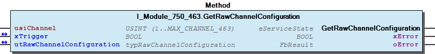
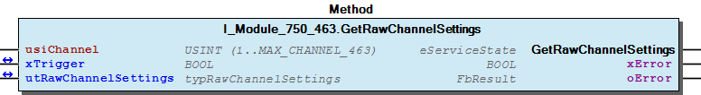
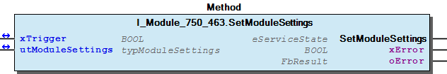
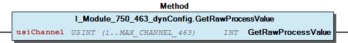

# WagoTypesModule_750_463 v1.9.3.0 (WAGO) - Complete Documentation


## 📋 Library Information

- **Company:** WAGO
- **Title:** WagoTypesModule_750_463
- **Version:** 1.9.3.0
- **Categories:** WAGO Internal|Common|Types and Interfaces
- **Author:** WAGO
- **Placeholder:** WagoTypesModule_750_463

### Description ¶


This document is automatically generated. Because of this, the chapter 30 Visualization is not shown in this document. If you are interested in getting to know more about visualization, we refer to the library manager of e!Cockpit.

Handling modules 750-463 [1]

This document is automatically generated. Because of this, the chapter 30 Visualization is not shown in this document. If you are interested in getting to know more about visualization, we refer to the library manager of e!Cockpit. Handling modules 750-463 [1]

### Contents: ¶


Contents: - Documentation Index - Project Information - Library Information - Methods I_Module_750_463.GetModuleSettings (METH) - I_Module_750_463.GetRawChannelCalibration (METH) - I_Module_750_463.GetRawChannelConfiguration (METH) - I_Module_750_463.GetRawChannelScaling (METH) - I_Module_750_463.GetRawChannelSettings (METH) - I_Module_750_463.SetModuleSettings (METH) - I_Module_750_463.SetRawChannelCalibration (METH) - I_Module_750_463.SetRawChannelConfiguration (METH) - I_Module_750_463.SetRawChannelScaling (METH) - I_Module_750_463.SetRawChannelSettings (METH) - ... and 3 more Interfaces - I_Module_750_463 (ITF) - I_Module_750_463_dynConfig (ITF) Program Organization Global Variable Lists - Channels_463 (GVL) - VersionHistory (GVL) Other Components - 10 Enumeration - 15 Datatypes - Channel - Configuration - Module - Raw - ePSRR_Mode (ENUM) - eSensorType (ENUM) - typRawChannelCalibration (STRUCT) - typRawChannelConfiguration (STRUCT) - ... and 1 more

### Indices and tables ¶


| [1] | Based on WagoTypesModule_750_463.library, last modified 13.08.2019, 19:34:58. The content of this file was automatically generated with None on 13.08.2019, 19:35:01 |

© WAGO Kontakttechnik GmbH & Co. KG, Germany 2018 – All rights reserved. For the avoidance of doubt, this copyright notice does not only apply to the information above but also and primarily to the described library itself. Please note that third-party products are always mentioned without reference to intellectual property rights, including patents, utility models, designs and trademarks, accordingly the existence of such rights cannot be excluded. WAGO is a registered trademark of WAGO Verwaltungsgesellschaft mbH.

- File and Project Information - Library Reference © WAGO Kontakttechnik GmbH & Co. KG, Germany 2018 – All rights reserved. For the avoidance of doubt, this copyright notice does not only apply to the information above but also and primarily to the described library itself. Please note that third-party products are always mentioned without reference to intellectual property rights, including patents, utility models, designs and trademarks, accordingly the existence of such rights cannot be excluded. WAGO is a registered trademark of WAGO Verwaltungsgesellschaft mbH.

### Documentation Index


## WagoTypesModule_750_463 Library Documentation


| Company: | WAGO |
| Title: | WagoTypesModule_750_463 |
| Version: | 1.9.3.0 |
| Categories: | WAGO Internal\|Common\|Types and Interfaces |
| Author: | WAGO |
| Placeholder: | WagoTypesModule_750_463 |

### Description


This document is automatically generated. Because of this, the chapter 30 Visualization is not shown in this document. If you are interested in getting to know more about visualization, we refer to the library manager of e!Cockpit.

Handling modules 750-463 [1]

This document is automatically generated. Because of this, the chapter 30 Visualization is not shown in this document. If you are interested in getting to know more about visualization, we refer to the library manager of e!Cockpit. Handling modules 750-463 [1]

### Contents:


- 20 Program Organization Units 10 Enumeration - 15 Datatypes - Channels_463 (GVL) - I_Module_750_463 (ITF) - I_Module_750_463_dynConfig (ITF) VersionHistory (GVL)

### Indices and tables


| [1] | Based on WagoTypesModule_750_463.library, last modified 13.08.2019, 19:34:58. The content of this file was automatically generated with None on 13.08.2019, 19:35:01 |

© WAGO Kontakttechnik GmbH & Co. KG, Germany 2018 – All rights reserved. For the avoidance of doubt, this copyright notice does not only apply to the information above but also and primarily to the described library itself. Please note that third-party products are always mentioned without reference to intellectual property rights, including patents, utility models, designs and trademarks, accordingly the existence of such rights cannot be excluded. WAGO is a registered trademark of WAGO Verwaltungsgesellschaft mbH.

- File and Project Information - Library Reference © WAGO Kontakttechnik GmbH & Co. KG, Germany 2018 – All rights reserved. For the avoidance of doubt, this copyright notice does not only apply to the information above but also and primarily to the described library itself. Please note that third-party products are always mentioned without reference to intellectual property rights, including patents, utility models, designs and trademarks, accordingly the existence of such rights cannot be excluded. WAGO is a registered trademark of WAGO Verwaltungsgesellschaft mbH.

### Project Information


## File and Project Information


| Scope | Name | Type | Content |
| --- | --- | --- | --- |
| FileHeader | libraryFile | string | WagoTypesModule_750_463.library |
| contentFile | WagoTypesModule_750_463_clr.json |
| productName | e!COCKPIT |
| creationDateTime | date | 13.08.2019, 19:35:01 |
| companyName | string | WAGO |
| ProjectInformation | LastModificationDateTime | date | 13.08.2019, 19:34:58 |
| Description | string | See: Description |
| DocFormat | reStructuredText |
| Author | WAGO |
| AutoResolveUnbound | bool | True |
| Placeholder | string | WagoTypesModule_750_463 |
| Company | WAGO |
| Title | WagoTypesModule_750_463 |
| Project | WagoTypesModule_750_463 |
| Copyright | © WAGO Kontakttechnik GmbH & Co. KG, Germany 2018 – All rights reserved. |
| Version | version | 1.9.3.0 |
| Version string | string |  |
| LibraryCategories | library-category-list | WAGO Internal\|Common\|Types and Interfaces |

### Library Information


## Library Reference


| LinkAllContent: False QualifiedOnly: False | SystemLibrary: False | Optional: False |

| LinkAllContent: False QualifiedOnly: True | SystemLibrary: False | Optional: False |

| LinkAllContent: False QualifiedOnly: True | SystemLibrary: False | Optional: False |

This is a dictionary of all referenced libraries and their name spaces.

This is a dictionary of all referenced libraries and their name spaces. WagoSysErrorBase Library Identification : Placeholder: WagoSysErrorBase Default Resolution: WagoSysErrorBase, * (WAGO) Namespace: WagoSysErrorBase Library Properties : WagoSysVersion Library Identification : Name: WagoSysVersion Version: 1.0.0.0 Company: WAGO Namespace: WagoSysVersion Library Properties : WagoTypesModuleBase Library Identification : Placeholder: WagoTypesModuleBase Default Resolution: WagoTypesModuleBase, * (WAGO) Namespace: WagoTypesModuleBase Library Properties : Library Parameter : Parameter: MAX_MBX_SIZE = 18

### Methods


## I_Module_750_463.GetModuleSettings (METH)


| Scope | Name | Type |
| --- | --- | --- |
| Return | GetModuleSettings | WagoTypesModuleBase.eServiceState |
| Inout | xTrigger | BOOL |
| utModuleSettings | typModuleSettings |
| Output | xError | BOOL |
| oError | WagoSysErrorBase.FbResult |

| Struct member | Value | Description |
| --- | --- | --- |
| ePSRMode | ENABLED_50HZ | Noise filter optimized for 50 Hz |
| ENABLED_60HZ | Noise filter optimized for 60 Hz |
| ENABLED_50_60HZ | Noise filter optimized for 50/60 Hz but lower attenuation |

| Return Value | Description |
| --- | --- |
| WagoTypesModuleBase.eServiceState.DONE | successful |
| WagoTypesModuleBase.eServiceState.ABORT | error -> see oError |
| WagoTypesModuleBase.eServiceState.NO_DATA | call while xTrigger is reset |

```
VAR
    //--- Module Mode Settings ------------------------------
    utModuleSettings    :   WagoTypesModule_750_463.typModuleSettings;
    xGetModuleSettings  :   BOOL;  // triggers the function
    oError              :   WagoSysErrorBase.FbResult;
END_VAR

//--- M O D U L E    S E T T I N G S -----------------------
CASE my463.GetModuleSettings(xGetModuleSettings, utModuleSettings, oError => oError) OF

    eServiceState.DONE : // OK
            ;// process here your utModuleSettings

    eServiceState.ABORT : // Error
            ;// process here your error handling -> see oError for more information

END_CASE
```

Get the common settings of the module at a struct.

Return Values

It is not allowed to reset the xTrigger by the application. This must done by the method.

Graphical Illustration

Graphical Interface of I_Module_750_463.GetModuleSettings

For get the settings from the module.

You have to call the method cyclic until the method returns with DONE or ABORT.

Interface variables Function Get the common settings of the module at a struct. Return Values Warning It is not allowed to reset the xTrigger by the application. This must done by the method. Graphical Illustration  Graphical Interface of I_Module_750_463.GetModuleSettings Example For get the settings from the module. Note You have to call the method cyclic until the method returns with DONE or ABORT.

## I_Module_750_463.GetRawChannelCalibration (METH)


| Scope | Name | Type |
| --- | --- | --- |
| Return | GetRawChannelCalibration | WagoTypesModuleBase.eServiceState |
| Input | usiChannel | USINT (1..MAX_CHANNEL_463) |
| Inout | xTrigger | BOOL |
| utRawChannelCalibration | typRawChannelCalibration |
| Output | xError | BOOL |
| oError | WagoSysErrorBase.FbResult |

| Struct member | Value | Description |
| --- | --- | --- |
| xUserCalibration | FALSE | The user scaling is switched off |
| TRUE | The user scaling is switched on |
| iUserCalibrationOffset |  |
| uiUserCalibrationGain |  |

```
VAR
    //--- Channel Calibration ---------------------------------
    utChannelCalibration    :   WagoTypesModule_750_463.typRawChannelCalibration;;
    xGetChannelCalibration  :   BOOL;
    oError                  :   WagoSysErrorBase.FbResult;
END_VAR

//--- C H A N N E L    C A L I B R A T I O N -----------------------
CASE my463.GetRawChannelCalibration(    usiChannel              := 1,
                                        xTrigger                := xGetChannelCalibration,
                                        utRawChannelCalibration := utChannelCalibration,
                                        oError                  => oError
                                    ) OF

    eServiceState.DONE : // OK
            ;// process here your utModuleSettings

    eServiceState.ABORT : // Error
            ;// process here your error handling -> see oError for more information

END_CASE
```

Get the calibration of a channel at a struct.

Graphical Illustration

Graphical Interface of I_Module_750_463.GetRawChannelCalibration

For get the calibration from channel one

You have to call the method cyclic until the method returns with DONE or ABORT.

Interface variables Function Get the calibration of a channel at a struct. Graphical Illustration  Graphical Interface of I_Module_750_463.GetRawChannelCalibration Example For get the calibration from channel one Note You have to call the method cyclic until the method returns with DONE or ABORT.

## I_Module_750_463.GetRawChannelConfiguration (METH)


| Scope | Name | Type |
| --- | --- | --- |
| Return | GetRawChannelConfiguration | WagoTypesModuleBase.eServiceState |
| Input | usiChannel | USINT (1..MAX_CHANNEL_463) |
| Inout | xTrigger | BOOL |
| utRawChannelConfiguration | typRawChannelConfiguration |
| Output | xError | BOOL |
| oError | WagoSysErrorBase.FbResult |

Graphical Illustration

Graphical Interface of I_Module_750_463.GetRawChannelConfiguration

Interface variables Function Get the complete raw configuration of a channel. Graphical Illustration  Graphical Interface of I_Module_750_463.GetRawChannelConfiguration Example

## I_Module_750_463.GetRawChannelScaling (METH)


| Scope | Name | Type |
| --- | --- | --- |
| Return | GetRawChannelScaling | WagoTypesModuleBase.eServiceState |
| Input | usiChannel | USINT (1..MAX_CHANNEL_463) |
| Inout | xTrigger | BOOL |
| utRawChannelScaling | typRawChannelScaling |
| Output | xError | BOOL |
| oError | WagoSysErrorBase.FbResult |

| Struct member | Value | Description |
| --- | --- | --- |
| xUserScaling | FALSE | The user scaling is switched off |
| TRUE | The user scaling is switched on |
| xManufacturerScaling | FALSE | The manufacturer scaling is switched off |
| TRUE | The manufacturer scaling is switched on |
| iUserScalingOffset |  |
| uiUserScalingGain |  |
| uiUserScalingWireResistor |  |

```
VAR
    //--- Channel Settings ---------------------------------
    utChannelScaling    :   WagoTypesModule_750_463.typRawChannelScaling;;
    xGetChannelScaling  :   BOOL;
    oError              :   WagoSysErrorBase.FbResult;
END_VAR

//--- C H A N N E L   S C A L I N G ------------------------
CASE my463.GetRawChannelScaling(    usiChannel           := 1,
                                    xTrigger             := xGetChannelScaling,
                                    utRawChannelScaling  := utChannelScaling,
                                    oError               => oError
                                ) OF

    eServiceState.DONE : // OK
            ;// process here your utModuleSettings

    eServiceState.ABORT : // Error
            ;// process here your error handling -> see oError for more information

END_CASE
```

Get the scaling of a channel at a struct.

Graphical Illustration

Graphical Interface of I_Module_750_463.GetRawChannelScaling

For get the scaling from channel one

You have to call the method cyclic until the method returns with DONE or ABORT.

Interface variables Function Get the scaling of a channel at a struct. Graphical Illustration  Graphical Interface of I_Module_750_463.GetRawChannelScaling Example For get the scaling from channel one Note You have to call the method cyclic until the method returns with DONE or ABORT.

## I_Module_750_463.GetRawChannelSettings (METH)


| Scope | Name | Type |
| --- | --- | --- |
| Return | GetRawChannelSettings | WagoTypesModuleBase.eServiceState |
| Input | usiChannel | USINT (1..MAX_CHANNEL_463) |
| Inout | xTrigger | BOOL |
| utRawChannelSettings | typRawChannelSettings |
| Output | xError | BOOL |
| oError | WagoSysErrorBase.FbResult |

| Struct member | Value | Description |
| --- | --- | --- |
| eSensorType | Pt1000_IEC751 | IEC 751 | -200 °C...850 °C |
| Ni1000_DIN43760 | DIN 43760 | -60 °C...250 °C |
| Ni1000_TK5000 | TK 5000 | -60 °C...250 °C |
| KTY_81_110 | KTY 81 110 | -30 °C...150 °C |
| KTY_81_210 | KTY 81 210 | -30 °C...150 °C |
| xEnableWatchdog | FALSE | Watchdog timer is not active |
| TRUE | Watchdog timer is active (terminal box) |
| xEnableAverageFilter | FALSE | The mean value filter is switched off |
| TRUE | The mean value filter is switched on |
| xAmountSignFormat | FALSE | Numeric values appear in two’s complement |
| TRUE | Numeric values appear in amount / sign format |
| xS5FB250Format | FALSE | Numeric values appear in default format |
| TRUE | Numeric values appear in S5-FB250 format |
| xEnableDiag | FALSE | Wire break / short circuit diagnostics disabled |
| TRUE | Wire break / short circuit diagnostics enabled |
| xEnableOverrangeProtection | FALSE | The overflow limit is switched off |
| TRUE | Numeric values are limited to values in R50, R51 |
| iUserUnderrange |  |
| iUserOverrange |  |

```
VAR
    //--- Channel Settings ---------------------------------
    utChannelSettings   :   WagoTypesModule_750_463.typRawChannelSettings;;
    xGetChannelSettings :   BOOL;
    oError              :   WagoSysErrorBase.FbResult;
END_VAR

//--- C H A N N E L   S E T T I N G S ----------------------
CASE my463.GetRawChannelSettings(   usiChannel           := 1,
                                    xTrigger             := xGetChannelSettings,
                                    utRawChannelSettings := utChannelSettings,
                                    oError               => oError
                                ) OF

    eServiceState.DONE : // OK
        ;// process here your utModuleSettings

    eServiceState.ABORT : // Error
        ;// process here your error handling -> see oError for more information

END_CASE
```

Get the settings of a channel at a struct.

Graphical Illustration

Graphical Interface of I_Module_750_463.GetRawChannelSettings

For get the settings from channel one

You have to call the method cyclic until the method returns with DONE or ABORT.

Interface variables Function Get the settings of a channel at a struct. Graphical Illustration  Graphical Interface of I_Module_750_463.GetRawChannelSettings Example For get the settings from channel one Note You have to call the method cyclic until the method returns with DONE or ABORT.

## I_Module_750_463.SetModuleSettings (METH)


| Scope | Name | Type |
| --- | --- | --- |
| Return | SetModuleSettings | WagoTypesModuleBase.eServiceState |
| Inout | xTrigger | BOOL |
| utModuleSettings | typModuleSettings |
| Output | xError | BOOL |
| oError | WagoSysErrorBase.FbResult |

| Struct member | Value | Description |
| --- | --- | --- |
| ePSRMode | ENABLED_50HZ | Noise filter optimized for 50 Hz |
| ENABLED_60HZ | Noise filter optimized for 60 Hz |
| ENABLED_50_60HZ | Noise filter optimized for 50/60 Hz but lower attenuation |

| Return Value | Description |
| --- | --- |
| WagoTypesModuleBase.eServiceState.DONE | successful |
| WagoTypesModuleBase.eServiceState.ABORT | error -> see oError |
| WagoTypesModuleBase.eServiceState.NO_DATA | call while xTrigger is reset |

```
VAR
    //--- Module Mode Settings ------------------------------
    utModuleSettings    :   WagoTypesModule_750_463.typModuleSettings;
    xGetModuleSettings  :   BOOL;  // triggers the function
    oError              :   WagoSysErrorBase.FbResult;
END_VAR

//--- M O D U L E    S E T T I N G S -----------------------
CASE my463.SetModuleSettings(xGetModuleSettings, utModuleSettings, oError => oError) OF

    eServiceState.DONE : // OK
            ;// successful done

    eServiceState.ABORT : // Error
            ;// process here your error handling -> see oError for more information

END_CASE
```

Set the common settings of the module by a struct.

Return Values

It is not allowed to reset the xTrigger by the application. This must done by the method.

Graphical Illustration

Graphical Interface of I_Module_750_463.SetModuleSettings

For set the settings from the module.

You have to call the method cyclic until the method returns with DONE or ABORT.

Interface variables Function Set the common settings of the module by a struct. Return Values Warning It is not allowed to reset the xTrigger by the application. This must done by the method. Graphical Illustration  Graphical Interface of I_Module_750_463.SetModuleSettings Example For set the settings from the module. Note You have to call the method cyclic until the method returns with DONE or ABORT.

## I_Module_750_463.SetRawChannelCalibration (METH)


| Scope | Name | Type |
| --- | --- | --- |
| Return | SetRawChannelCalibration | WagoTypesModuleBase.eServiceState |
| Input | usiChannel | USINT (1..MAX_CHANNEL_463) |
| Inout | xTrigger | BOOL |
| utRawChannelCalibration | typRawChannelCalibration |
| Output | xError | BOOL |
| oError | WagoSysErrorBase.FbResult |

| Struct member | Value | Description |
| --- | --- | --- |
| xUserCalibration | FALSE | The user scaling is switched off |
| TRUE | The user scaling is switched on |
| iUserCalibrationOffset |  |
| uiUserCalibrationGain |  |

```
VAR
    //--- Channel Calibration ---------------------------------
    utChannelCalibration    :   WagoTypesModule_750_463.typRawChannelCalibration;;
    xSetChannelCalibration  :   BOOL;
    oError                  :   WagoSysErrorBase.FbResult;
END_VAR

//--- C H A N N E L    C A L I B R A T I O N -----------------------
CASE my463.SetRawChannelCalibration(    usiChannel              := 1,
                                        xTrigger                := xSetChannelCalibration,
                                        utRawChannelCalibration := utChannelCalibration,
                                        oError                  => oError
                                   ) OF

    eServiceState.DONE : // OK
            ;// process here your utModuleSettings

    eServiceState.ABORT : // Error
            ;// process here your error handling -> see oError for more information

END_CASE
```

Set the calibration of a channel by a struct.

Graphical Illustration

Graphical Interface of I_Module_750_463.SetRawChannelCalibration

For set the calibration of channel one

You have to call the method cyclic until the method returns with DONE or ABORT.

Interface variables Function Set the calibration of a channel by a struct. Graphical Illustration  Graphical Interface of I_Module_750_463.SetRawChannelCalibration Example For set the calibration of channel one Note You have to call the method cyclic until the method returns with DONE or ABORT.

## I_Module_750_463.SetRawChannelConfiguration (METH)


| Scope | Name | Type |
| --- | --- | --- |
| Return | SetRawChannelConfiguration | WagoTypesModuleBase.eServiceState |
| Input | usiChannel | USINT (1..MAX_CHANNEL_463) |
| Inout | xTrigger | BOOL |
| utRawChannelConfiguration | typRawChannelConfiguration |
| Output | xError | BOOL |
| oError | WagoSysErrorBase.FbResult |

Graphical Illustration

Graphical Interface of I_Module_750_463.SetRawChannelConfiguration

Interface variables Function Set the complete raw configuration of a channel. Graphical Illustration  Graphical Interface of I_Module_750_463.SetRawChannelConfiguration Example

## I_Module_750_463.SetRawChannelScaling (METH)


| Scope | Name | Type |
| --- | --- | --- |
| Return | SetRawChannelScaling | WagoTypesModuleBase.eServiceState |
| Input | usiChannel | USINT (1..MAX_CHANNEL_463) |
| Inout | xTrigger | BOOL |
| utRawChannelScaling | typRawChannelScaling |
| Output | xError | BOOL |
| oError | WagoSysErrorBase.FbResult |

| Struct member | Value | Description |
| --- | --- | --- |
| xUserScaling | FALSE | The user scaling is switched off |
| TRUE | The user scaling is switched on |
| xManufacturerScaling | FALSE | The manufacturer scaling is switched off |
| TRUE | The manufacturer scaling is switched on |
| iUserScalingOffset |  |
| uiUserScalingGain |  |
| uiUserScalingWireResistor |  |

```
VAR
    //--- Channel Settings ---------------------------------
    utChannelScaling    :   WagoTypesModule_750_463.typRawChannelScaling;;
    xSetChannelScaling  :   BOOL;
    oError              :   WagoSysErrorBase.FbResult;
END_VAR

//--- C H A N N E L   S C A L I N G ------------------------
CASE my463.SetRawChannelScaling(    usiChannel          := 1,
                                    xTrigger            := xSetChannelScaling,
                                    utRawChannelScaling := utChannelScaling,
                                    oError              => oError
                                ) OF

    eServiceState.DONE : // OK
            ;// process here your utModuleSettings

    eServiceState.ABORT : // Error
            ;// process here your error handling -> see oError for more information

END_CASE
```

Set the scaling of a channel by a struct.

Graphical Illustration

Graphical Interface of I_Module_750_463.SetRawChannelScaling

For set the scaling of channel one

You have to call the method cyclic until the method returns with DONE or ABORT.

Interface variables Function Set the scaling of a channel by a struct. Graphical Illustration  Graphical Interface of I_Module_750_463.SetRawChannelScaling Example For set the scaling of channel one Note You have to call the method cyclic until the method returns with DONE or ABORT.

## I_Module_750_463.SetRawChannelSettings (METH)


| Scope | Name | Type |
| --- | --- | --- |
| Return | SetRawChannelSettings | WagoTypesModuleBase.eServiceState |
| Input | usiChannel | USINT (1..MAX_CHANNEL_463) |
| Inout | xTrigger | BOOL |
| utRawChannelSettings | typRawChannelSettings |
| Output | xError | BOOL |
| oError | WagoSysErrorBase.FbResult |

| Struct member | Value | Description |
| --- | --- | --- |
| eSensorType | Pt1000_IEC751 | IEC 751 \| -200 °C...850 °C |
| Ni1000_DIN43760 | DIN 43760 | -60 °C...250 °C |
| Ni1000_TK5000 | TK 5000 | -60 °C...250 °C |
| KTY_81_110 | KTY 81 110 | -30 °C...150 °C |
| KTY_81_210 | KTY 81 210 | -30 °C...150 °C |
| xEnableWatchdog | FALSE | Watchdog timer is not active |
| TRUE | Watchdog timer is active (terminal box) |
| xEnableAverageFilter | FALSE | The mean value filter is switched off |
| TRUE | The mean value filter is switched on |
| xAmountSignFormat | FALSE | Numeric values appear in two’s complement |
| TRUE | Numeric values appear in amount / sign format |
| xS5FB250Format | FALSE | Numeric values appear in default format |
| TRUE | Numeric values appear in S5-FB250 format |
| xEnableDiag | FALSE | Wire break / short circuit diagnostics disabled |
| TRUE | Wire break / short circuit diagnostics enabled |
| xEnableOverrangeProtection | FALSE | The overflow limit is switched off |
| TRUE | Numeric values are limited to values in R50, R51 |
| iUserUnderrange |  |
| iUserOverrange |  |

```
VAR
    //--- Channel Settings ---------------------------------
    utChannelSettings   :   WagoTypesModule_750_463.typRawChannelSettings;;
    xSetChannelSettings :   BOOL;
    oError              :   WagoSysErrorBase.FbResult;
END_VAR

//--- C H A N N E L   S E T T I N G S ----------------------
CASE my463.SetRawChannelSettings(   usiChannel           := 1,
                                    xTrigger             := xSetChannelSettings,
                                    utRawChannelSettings := utChannelSettings,
                                    oError               => oError
                                ) OF

    eServiceState.DONE : // OK
        ;// process here your utModuleSettings

    eServiceState.ABORT : // Error
        ;// process here your error handling -> see oError for more information

END_CASE
```

Set the settings for a channel by a struct.

Graphical Illustration

Graphical Interface of I_Module_750_463.SetRawChannelSettings

For set the settings of channel one

You have to call the method cyclic until the method returns with DONE or ABORT.

Interface variables Function Set the settings for a channel by a struct. Graphical Illustration  Graphical Interface of I_Module_750_463.SetRawChannelSettings Example For set the settings of channel one Note You have to call the method cyclic until the method returns with DONE or ABORT.

## I_Module_750_463_dynConfig.GetRawProcessValue (METH)


| Scope | Name | Type |
| --- | --- | --- |
| Return | GetRawProcessValue | INT |
| Input | usiChannel | USINT (1..MAX_CHANNEL_463) |

```
VAR
    myiProcessValue :   INT;
END_VAR

myiProcessValue := my451.GetProcessValue(1); // here is the process raw value as INT
```

Get the raw process value of the wanted channel.

In case of error (e.g. an invalid channel number is given) it returns -32768.

Graphical Illustration

Graphical Interface of I_Module_750_463_dynConfig.GetRawProcessValue

Interface variables Function Get the raw process value of the wanted channel. In case of error (e.g. an invalid channel number is given) it returns -32768. Graphical Illustration  Graphical Interface of I_Module_750_463_dynConfig.GetRawProcessValue Example For get the process value from first channel of the module.

## typModuleSettings (STRUCT)


| Name | Type | Comment |
| --- | --- | --- |
| ePSRMode | ePSRR_Mode | R47.8..9 |

## typRawChannelSettings (STRUCT)


| Name | Type | Comment |
| --- | --- | --- |
| eSensorType | eSensorType | R32.12..15 |
| xEnableWatchdog | BOOL | R32.2 |
| xEnableAverageFilter | BOOL | R32.7 |
| xAmountSignFormat | BOOL | R32.3 -> Number notation -> 2-complement / amount-sign (Bit 0) |
| xS5FB250Format | BOOL | R32.4 -> S5-Format -> Standard / S5-FB250 format (Bit 1) |
| xEnableDiag | BOOL | R32.6 -> Wire Break / Short Circuit |
| xEnableOverrangeProtection | BOOL | R32.8 |
| iUserUnderrange | INT | R35 |
| iUserOverrange | INT | R36 |

### Interfaces


## I_Module_750_463 (ITF)


- Channel I_Module_750_463.GetRawChannelCalibration (METH) - I_Module_750_463.GetRawChannelScaling (METH) - I_Module_750_463.GetRawChannelSettings (METH) - I_Module_750_463.SetRawChannelCalibration (METH) - I_Module_750_463.SetRawChannelScaling (METH) - I_Module_750_463.SetRawChannelSettings (METH) Configuration - I_Module_750_463.GetRawChannelConfiguration (METH) - I_Module_750_463.SetRawChannelConfiguration (METH) Module - I_Module_750_463.GetModuleSettings (METH) - I_Module_750_463.SetModuleSettings (METH)

## I_Module_750_463_dynConfig (ITF)


- I_Module_750_463_dynConfig.GetRawProcessValue (METH)

### Program Organization


## 20 Program Organization Units


- 10 Enumeration ePSRR_Mode (ENUM) - eSensorType (ENUM) 15 Datatypes - Raw typRawChannelCalibration (STRUCT) - typRawChannelScaling (STRUCT) - typRawChannelSettings (STRUCT) typModuleSettings (STRUCT) typRawChannelConfiguration (STRUCT) Channels_463 (GVL) I_Module_750_463 (ITF) - Channel I_Module_750_463.GetRawChannelCalibration (METH) - I_Module_750_463.GetRawChannelScaling (METH) - I_Module_750_463.GetRawChannelSettings (METH) - I_Module_750_463.SetRawChannelCalibration (METH) - I_Module_750_463.SetRawChannelScaling (METH) - I_Module_750_463.SetRawChannelSettings (METH) Configuration - I_Module_750_463.GetRawChannelConfiguration (METH) - I_Module_750_463.SetRawChannelConfiguration (METH) Module - I_Module_750_463.GetModuleSettings (METH) - I_Module_750_463.SetModuleSettings (METH) I_Module_750_463_dynConfig (ITF) - I_Module_750_463_dynConfig.GetRawProcessValue (METH)

### Global Variable Lists


## Channels_463 (GVL)


| Scope | Name | Type | Initial | Comment |
| --- | --- | --- | --- | --- |
| Constant | MAX_CHANNEL_463 | USINT | 4 | max. channels for 750-463 |

## VersionHistory (GVL)


| Name | Type |
| --- | --- |
| Info | ProjectInfo |

| date | version | author | change |
| 16.07.2019 | 1.9.3.0 | u010545 | Interface for dyn config added |
| 08.01.2019 | 1.9.1.0 | u015842 | Properties: free placeholder added |
| 11.10.2017 | 1.9.0.2 | u010545 | unifications |
| 09.10.2017 | 1.9.0.1 | u010545 | channel quantity modified |
| 04.10.2017 | 1.9.0.0 | u010545 | First release |
| 25.09.2017 | 0.0.0.1 | u010545 | init |

WagoTypesModule_750_463.library

Release Notes:

WagoTypesModule_750_463.library Release Notes:

### Other Components


## 10 Enumeration


- ePSRR_Mode (ENUM) - eSensorType (ENUM)

## 15 Datatypes


- Raw typRawChannelCalibration (STRUCT) - typRawChannelScaling (STRUCT) - typRawChannelSettings (STRUCT) typModuleSettings (STRUCT) typRawChannelConfiguration (STRUCT)

## Channel


- I_Module_750_463.GetRawChannelCalibration (METH) - I_Module_750_463.GetRawChannelScaling (METH) - I_Module_750_463.GetRawChannelSettings (METH) - I_Module_750_463.SetRawChannelCalibration (METH) - I_Module_750_463.SetRawChannelScaling (METH) - I_Module_750_463.SetRawChannelSettings (METH)

## Configuration


- I_Module_750_463.GetRawChannelConfiguration (METH) - I_Module_750_463.SetRawChannelConfiguration (METH)

## Module


- I_Module_750_463.GetModuleSettings (METH) - I_Module_750_463.SetModuleSettings (METH)

## Raw


- typRawChannelCalibration (STRUCT) - typRawChannelScaling (STRUCT) - typRawChannelSettings (STRUCT)

## ePSRR_Mode (ENUM)


| Name | Initial |
| --- | --- |
| ENABLED_50HZ | 0 |
| ENABLED_60HZ | 1 |
| ENABLED_50_60HZ | 2 |

## eSensorType (ENUM)


| Name | Initial | Comment |
| --- | --- | --- |
| Pt1000_IEC751 | 16#2 | IEC 751 |
| Ni1000_DIN43760 | 16#5 | DIN 43760 |
| Ni1000_TK5000 | 16#7 | TK 5000 |
| KTY_81_110 | 16#8 | -30 .. +150 [Grad Celsus] |
| KTY_81_210 | 16#9 | -30 .. +150 [Grad Celsus] |

| Name | Initial | Sensor type | Standard |
| --- | --- | --- | --- |
| Pt1000_IEC751 | 2 | Pt1000 | IEC 751 |
| Ni1000_DIN43760 | 5 | Ni1000 | DIN 43760 |
| Ni1000_TK5000 | 7 | Ni1000 | TK 5000 (Landis+Staefa) |
| KTY_81_110 | 8 | KTY 81 110 |  |
| KTY_81_210 | 8 | KTY 81 210 |  |

## typRawChannelCalibration (STRUCT)


| Name | Type | Comment |
| --- | --- | --- |
| xUserCalibration | BOOL | R32.5 -> Manufacturer Calibration / User Calibration |
| iUserCalibrationOffset | INT | R39 |
| uiUserCalibrationGain | UINT | R40 |

## typRawChannelConfiguration (STRUCT)


| Name | Type |
| --- | --- |
| Settings | typRawChannelSettings |
| Scaling | typRawChannelScaling |
| Calibration | typRawChannelCalibration |

## typRawChannelScaling (STRUCT)


| Name | Type | Comment |
| --- | --- | --- |
| xUserScaling | BOOL | R32.0 |
| xManufacturerScaling | BOOL | R32.1 |
| iUserScalingOffset | INT | R33 |
| uiUserScalingGain | UINT | R34 |
| uiUserScalingWireResistor | UINT | R21 -> 1/256 Ohm |