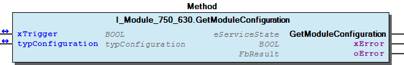
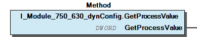
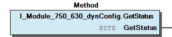

# WagoTypesModule_750_630 v1.9.3.0 (WAGO) - Complete Documentation


## 📋 Library Information

- **Company:** WAGO
- **Title:** WagoTypesModule_750_630
- **Version:** 1.9.3.0
- **Categories:** WAGO Internal|Common|Types and Interfaces
- **Author:** WAGO
- **Placeholder:** WagoTypesModule_750_630

### Description ¶


This document is automatically generated. Because of this, the chapter 30 Visualization is not shown in this document. If you are interested in getting to know more about visualization, we refer to the library manager of e!Cockpit.

Handling modules 750-630 and derivates [1]

This document is automatically generated. Because of this, the chapter 30 Visualization is not shown in this document. If you are interested in getting to know more about visualization, we refer to the library manager of e!Cockpit. Handling modules 750-630 and derivates [1]

### Contents: ¶


Contents: - Documentation Index - Project Information - Library Information - Methods I_Module_750_630.GetModuleConfiguration (METH) - I_Module_750_630.SetModuleConfiguration (METH) - I_Module_750_630_dynConfig.GetProcessValue (METH) - I_Module_750_630_dynConfig.GetStatus (METH) Interfaces - I_Module_750_630 (ITF) - I_Module_750_630_dynConfig (ITF) Program Organization Global Variable Lists Other Components - Configuration - eBaudRate (ENUM) - typConfiguration (STRUCT)

### Indices and tables ¶


| [1] | Based on WagoTypesModule_750_630.library, last modified 13.08.2019, 19:58:05. The content of this file was automatically generated with None on 13.08.2019, 19:58:07 |

© WAGO Kontakttechnik GmbH & Co. KG, Germany 2018 – All rights reserved. For the avoidance of doubt, this copyright notice does not only apply to the information above but also and primarily to the described library itself. Please note that third-party products are always mentioned without reference to intellectual property rights, including patents, utility models, designs and trademarks, accordingly the existence of such rights cannot be excluded. WAGO is a registered trademark of WAGO Verwaltungsgesellschaft mbH.

- File and Project Information - Library Reference © WAGO Kontakttechnik GmbH & Co. KG, Germany 2018 – All rights reserved. For the avoidance of doubt, this copyright notice does not only apply to the information above but also and primarily to the described library itself. Please note that third-party products are always mentioned without reference to intellectual property rights, including patents, utility models, designs and trademarks, accordingly the existence of such rights cannot be excluded. WAGO is a registered trademark of WAGO Verwaltungsgesellschaft mbH.

### Documentation Index


## WagoTypesModule_750_630 Library Documentation


| Company: | WAGO |
| Title: | WagoTypesModule_750_630 |
| Version: | 1.9.3.0 |
| Categories: | WAGO Internal\|Common\|Types and Interfaces |
| Author: | WAGO |
| Placeholder: | WagoTypesModule_750_630 |

### Description


This document is automatically generated. Because of this, the chapter 30 Visualization is not shown in this document. If you are interested in getting to know more about visualization, we refer to the library manager of e!Cockpit.

Handling modules 750-630 and derivates [1]

This document is automatically generated. Because of this, the chapter 30 Visualization is not shown in this document. If you are interested in getting to know more about visualization, we refer to the library manager of e!Cockpit. Handling modules 750-630 and derivates [1]

### Contents:


- 20 Program Organization Units I_Module_750_630 (ITF) - I_Module_750_630_dynConfig (ITF) - eBaudRate (ENUM) - typConfiguration (STRUCT) VersionHistory (GVL)

### Indices and tables


| [1] | Based on WagoTypesModule_750_630.library, last modified 13.08.2019, 19:58:05. The content of this file was automatically generated with None on 13.08.2019, 19:58:07 |

© WAGO Kontakttechnik GmbH & Co. KG, Germany 2018 – All rights reserved. For the avoidance of doubt, this copyright notice does not only apply to the information above but also and primarily to the described library itself. Please note that third-party products are always mentioned without reference to intellectual property rights, including patents, utility models, designs and trademarks, accordingly the existence of such rights cannot be excluded. WAGO is a registered trademark of WAGO Verwaltungsgesellschaft mbH.

- File and Project Information - Library Reference © WAGO Kontakttechnik GmbH & Co. KG, Germany 2018 – All rights reserved. For the avoidance of doubt, this copyright notice does not only apply to the information above but also and primarily to the described library itself. Please note that third-party products are always mentioned without reference to intellectual property rights, including patents, utility models, designs and trademarks, accordingly the existence of such rights cannot be excluded. WAGO is a registered trademark of WAGO Verwaltungsgesellschaft mbH.

### Project Information


## File and Project Information


| Scope | Name | Type | Content |
| --- | --- | --- | --- |
| FileHeader | libraryFile | string | WagoTypesModule_750_630.library |
| contentFile | WagoTypesModule_750_630_clr.json |
| productName | e!COCKPIT |
| creationDateTime | date | 13.08.2019, 19:58:07 |
| companyName | string | WAGO |
| ProjectInformation | LastModificationDateTime | date | 13.08.2019, 19:58:05 |
| Description | string | See: Description |
| DocFormat | reStructuredText |
| Author | WAGO |
| AutoResolveUnbound | bool | True |
| Placeholder | string | WagoTypesModule_750_630 |
| Company | WAGO |
| Title | WagoTypesModule_750_630 |
| Project | WagoTypesModule_750_630 |
| Copyright | © WAGO Kontakttechnik GmbH & Co. KG, Germany 2018 – All rights reserved. |
| Version | version | 1.9.3.0 |
| Version string | string |  |
| LibraryCategories | library-category-list | WAGO Internal\|Common\|Types and Interfaces |

### Library Information


## Library Reference


| LinkAllContent: False QualifiedOnly: False | SystemLibrary: False | Optional: False |

| LinkAllContent: False QualifiedOnly: True | SystemLibrary: False | Optional: False |

| LinkAllContent: False QualifiedOnly: True | SystemLibrary: False | Optional: False |

This is a dictionary of all referenced libraries and their name spaces.

This is a dictionary of all referenced libraries and their name spaces. WagoSysErrorBase Library Identification : Placeholder: WagoSysErrorBase Default Resolution: WagoSysErrorBase, * (WAGO) Namespace: WagoSysErrorBase Library Properties : WagoSysVersion Library Identification : Name: WagoSysVersion Version: 1.0.0.0 Company: WAGO Namespace: WagoSysVersion Library Properties : WagoTypesModuleBase Library Identification : Placeholder: WagoTypesModuleBase Default Resolution: WagoTypesModuleBase, * (WAGO) Namespace: WagoTypesModuleBase Library Properties : Library Parameter : Parameter: MAX_MBX_SIZE = 18

### Methods


## I_Module_750_630.GetModuleConfiguration (METH)


| Scope | Name | Type |
| --- | --- | --- |
| Return | GetModuleConfiguration | WagoTypesModuleBase.eServiceState |
| Inout | xTrigger | BOOL |
| typConfiguration | typConfiguration |
| Output | xError | BOOL |
| oError | WagoSysErrorBase.FbResult |

Graphical Illustration

Graphical Interface of I_Module_750_630.GetModuleConfiguration

Interface variables Function Get the actual modul configuration Graphical Illustration  Graphical Interface of I_Module_750_630.GetModuleConfiguration

## I_Module_750_630.SetModuleConfiguration (METH)


| Scope | Name | Type |
| --- | --- | --- |
| Return | SetModuleConfiguration | WagoTypesModuleBase.eServiceState |
| Inout | xTrigger | BOOL |
| typConfiguration | typConfiguration |
| Output | xError | BOOL |
| oError | WagoSysErrorBase.FbResult |

Graphical Illustration

Graphical Interface of I_Module_750_630.SetModuleConfiguration

Interface variables Function Set the modul configuration Graphical Illustration  Graphical Interface of I_Module_750_630.SetModuleConfiguration

## I_Module_750_630_dynConfig.GetProcessValue (METH)


| Scope | Name | Type |
| --- | --- | --- |
| Return | GetProcessValue | DWORD |

```
VAR
    myProcessValue  :   dword;
END_VAR

myProcessValue:=my630.GetProcessValue();
```

Graphical Illustration

Graphical Interface of I_Module_750_630_dynConfig.GetProcessValue

Interface variables Function Get the process value Graphical Illustration  Graphical Interface of I_Module_750_630_dynConfig.GetProcessValue Example Get the process value

## I_Module_750_630_dynConfig.GetStatus (METH)


| Scope | Name | Type |
| --- | --- | --- |
| Return | GetStatus | BYTE |

```
VAR
    myStatus    :   byte;
END_VAR

myStatus:=my630.GetStatus();
```

Graphical Illustration

Graphical Interface of I_Module_750_630_dynConfig.GetStatus

Interface variables Function Get the status byte Graphical Illustration  Graphical Interface of I_Module_750_630_dynConfig.GetStatus Example Get the status byte

### Interfaces


## I_Module_750_630 (ITF)


- Configuration I_Module_750_630.GetModuleConfiguration (METH) - I_Module_750_630.SetModuleConfiguration (METH)

## I_Module_750_630_dynConfig (ITF)


- I_Module_750_630_dynConfig.GetProcessValue (METH) - I_Module_750_630_dynConfig.GetStatus (METH)

### Program Organization


## 20 Program Organization Units


- I_Module_750_630 (ITF) Configuration I_Module_750_630.GetModuleConfiguration (METH) - I_Module_750_630.SetModuleConfiguration (METH) I_Module_750_630_dynConfig (ITF) - I_Module_750_630_dynConfig.GetProcessValue (METH) - I_Module_750_630_dynConfig.GetStatus (METH) eBaudRate (ENUM) typConfiguration (STRUCT)

### Global Variable Lists


## VersionHistory (GVL)


| Name | Type |
| --- | --- |
| Info | ProjectInfo |

| date | version | author | change |
| 16.07.2019 | 1.9.3.0 | u010545 | Interface for dyn config added |
| 08.01.2019 | 1.0.1.0 | u015842 | Properties: free placeholder added |
| 06.09.2017 | 1.0.0.0 | u010663 | released |

WagoTypesModule_750_630.library

Release Notes:

WagoTypesModule_750_630.library Release Notes:

### Other Components


## Configuration


- I_Module_750_630.GetModuleConfiguration (METH) - I_Module_750_630.SetModuleConfiguration (METH)

## eBaudRate (ENUM)


| Name | Initial | Comment |
| --- | --- | --- |
| Baud_1Mhz | 1 |  |
| Baud_250kHz | 2 |  |
| Baud_125kHz | 3 |  |
| Baud_100kHz | 4 |  |
| Baud_83kHz | 5 |  |
| Baud_71kHz | 6 |  |
| Baud_62kHz | 7 | 62,5kHz |

{attribute ‘qualified_only’} {attribute ‘strict’}

InOut: {attribute ‘qualified_only’} {attribute ‘strict’}

## typConfiguration (STRUCT)


| Name | Type | Comment |
| --- | --- | --- |
| eBaudRate | eBaudRate |  |
| bPI_Length | BYTE | 0..32 Bit |
| bVarFrameLength | BYTE | 0..32 Bit |
| xSynchronousOperation | BOOL |  |
| xFormatStandard | BOOL |  |
| xGrayDualCodeConversion | BOOL |  |
| xSingleTurnEvaluation | BOOL |  |
| xFrameError | BOOL |  |
| xPowerFailBit | BOOL |  |