# WagoTypesModule_75x_1491 v1.0.0.3 (WAGO) - Complete Documentation


## 📋 Library Information

- **Company:** WAGO
- **Title:** WagoTypesModule_75x_1491
- **Version:** 1.0.0.3
- **Categories:** WAGO Internal|Common|Types and Interfaces; WAGO LayerView|Types and Interfaces; Application
- **Author:** WAGO
- **Placeholder:** WagoTypesModule_75x_1491

### Description ¶


This document is automatically generated.

Handling modules 75x-1491

This document is automatically generated. Handling modules 75x-1491

### Contents: ¶


Contents: - Documentation Index - Project Information - Library Information - Methods ChannelSettings - I_Module_75x_1491.GetModuleSettings (METH) - I_Module_75x_1491.GetRawChannelConfiguration (METH) - I_Module_75x_1491.GetRawRefScaling (METH) - I_Module_75x_1491.GetRawRefSettings (METH) - I_Module_75x_1491.GetRawUdScaling (METH) - I_Module_75x_1491.GetRawUdSettings (METH) - I_Module_75x_1491.SetModuleSettings (METH) - I_Module_75x_1491.SetRawChannelConfiguration (METH) - I_Module_75x_1491.SetRawRefScaling (METH) - ... and 10 more Interfaces - I_Module_75x_1491 (ITF) - I_Module_75x_1491_dynConfig (ITF) Program Organization Global Variable Lists - Channels_1491 (GVL) - VersionHistory (GVL) Other Components - 10 Enumeration - 15 Datatypes - Channel - Module - Raw - Scalling - eBridgeVoltage (ENUM) - eFilterMode (ENUM) - eInterferenceFrequency (ENUM) - eNumberFormat (ENUM) - ... and 4 more

### Indices and tables ¶


Based on WagoTypesModule_75x_1491.library, last modified 29.05.2024, 20:22:08. LibDoc 3.5.16.10

© WAGO GmbH & Co. KG, Germany 2018 – All rights reserved. For the avoidance of doubt, this copyright notice does not only apply to the information above but also and primarily to the described library itself. Please note that third-party products are always mentioned without reference to intellectual property rights, including patents, utility models, designs and trademarks, accordingly the existence of such rights cannot be excluded. WAGO is a registered trademark of WAGO Verwaltungsgesellschaft mbH.

- File and Project Information - Library Reference Based on WagoTypesModule_75x_1491.library, last modified 29.05.2024, 20:22:08. LibDoc 3.5.16.10 © WAGO GmbH & Co. KG, Germany 2018 – All rights reserved. For the avoidance of doubt, this copyright notice does not only apply to the information above but also and primarily to the described library itself. Please note that third-party products are always mentioned without reference to intellectual property rights, including patents, utility models, designs and trademarks, accordingly the existence of such rights cannot be excluded. WAGO is a registered trademark of WAGO Verwaltungsgesellschaft mbH.

### Documentation Index


## WagoTypesModule_75x_1491 Library Documentation


| Company: | WAGO |
| Title: | WagoTypesModule_75x_1491 |
| Version: | 1.0.0.3 |
| Categories: | WAGO Internal\|Common\|Types and Interfaces; WAGO LayerView\|Types and Interfaces; Application |
| Author: | WAGO |
| Placeholder: | WagoTypesModule_75x_1491 |

### Description


This document is automatically generated.

Handling modules 75x-1491

This document is automatically generated. Handling modules 75x-1491

### Contents:


- 20 Program Organization Units 10 Enumeration - 15 Datatypes - Channels_1491 (GVL) - I_Module_75x_1491 (ITF) - I_Module_75x_1491_dynConfig (ITF) VersionHistory (GVL)

### Indices and tables


Based on WagoTypesModule_75x_1491.library, last modified 29.05.2024, 20:22:08. LibDoc 3.5.16.10

© WAGO GmbH & Co. KG, Germany 2018 – All rights reserved. For the avoidance of doubt, this copyright notice does not only apply to the information above but also and primarily to the described library itself. Please note that third-party products are always mentioned without reference to intellectual property rights, including patents, utility models, designs and trademarks, accordingly the existence of such rights cannot be excluded. WAGO is a registered trademark of WAGO Verwaltungsgesellschaft mbH.

- File and Project Information - Library Reference Based on WagoTypesModule_75x_1491.library, last modified 29.05.2024, 20:22:08. LibDoc 3.5.16.10 © WAGO GmbH & Co. KG, Germany 2018 – All rights reserved. For the avoidance of doubt, this copyright notice does not only apply to the information above but also and primarily to the described library itself. Please note that third-party products are always mentioned without reference to intellectual property rights, including patents, utility models, designs and trademarks, accordingly the existence of such rights cannot be excluded. WAGO is a registered trademark of WAGO Verwaltungsgesellschaft mbH.

### Project Information


## File and Project Information


| Scope | Name | Type | Content |
| --- | --- | --- | --- |
| FileHeader | libraryFile | string | WagoTypesModule_75x_1491.library |
| contentFile | doc.clean.json |
| productName | e!COCKPIT |
| creationDateTime | date | 29.05.2024, 20:22:08 |
| companyName | string | WAGO |
| ProjectInformation | LastModificationDateTime | date | 29.05.2024, 20:22:08 |
| Description | string | See: Description |
| Copyright | © WAGO Kontakttechnik GmbH & Co. KG, Germany 2018 – All rights reserved. |
| Author | WAGO |
| AutoResolveUnbound | bool | True |
| Placeholder | string | WagoTypesModule_75x_1491 |
| Company | WAGO |
| DocFormat | reStructuredText |
| Project | WagoTypesModule_75x_1491 |
| Version | version | 1.0.0.3 |
| Version string | string |  |
| Title | WagoTypesModule_75x_1491 |
| LibraryCategories | library-category-list | WAGO Internal\|Common\|Types and Interfaces; WAGO LayerView\|Types and Interfaces; Application |
| CompiledLibraryCompatibilityVersion | string | CODESYS V3.5 SP16 Patch 3 |

### Library Information


## Library Reference


| LinkAllContent: False QualifiedOnly: False | SystemLibrary: False | Optional: False |

| LinkAllContent: False QualifiedOnly: True | SystemLibrary: False | Optional: False |

| LinkAllContent: False QualifiedOnly: True | SystemLibrary: False | Optional: False |

This is a dictionary of all referenced libraries and their name spaces.

This is a dictionary of all referenced libraries and their name spaces. WagoSysErrorBase Library Identification : Placeholder: WagoSysErrorBase Default Resolution: WagoSysErrorBase, * (WAGO) Namespace: WagoSysErrorBase Library Properties : WagoSysVersion Library Identification : Name: WagoSysVersion Version: 1.0.0.0 Company: WAGO Namespace: WagoSysVersion Library Properties : WagoTypesModuleBase Library Identification : Placeholder: WagoTypesModuleBase Default Resolution: WagoTypesModuleBase, * (WAGO) Namespace: WagoTypesModuleBase Library Properties : Library Parameter : Parameter: MAX_MODULE_OUTPUT_SIZE = 48 Parameter: MAX_MODULE_INPUT_SIZE = 48 Parameter: MBX_PIPE_SIZE = 1024 Parameter: MAX_MBX_SIZE = 18 Parameter: MAX_MBX1_SIZE = 18 Parameter: MAX_MBX_OUTPUT_SIZE = 47 Parameter: MAX_MBX_INPUT_SIZE = 47

### Methods


## ChannelSettings


- eBridgeVoltage (ENUM) - eNumberFormat (ENUM) - eReferenceVoltage (ENUM) - eSmoothing (ENUM)

## I_Module_75x_1491.GetModuleSettings (METH)


| Scope | Name | Type | Comment |
| --- | --- | --- | --- |
| Return | GetModuleSettings | WagoTypesModuleBase.eServiceState |  |
| Inout | xTrigger | BOOL | set this variable once to start the process. It will be reset by the Method automatic. |
| utModuleSettings | typModuleSettings |  |
| Output | xError | BOOL |  |
| oError | WagoSysErrorBase.FbResult |  |

| Struct member | Value | Description |
| --- | --- | --- |
| eInterferenceFrequency | _10HZ | 10 HZ Interference Frequency Suppression |
| _50HZ | 50 HZ Interference Frequency Suppression |
| _60HZ | 60 HZ Interference Frequency Suppression |
| _200HZ | 200 HZ Interference Frequency Suppression |
| _400HZ | 400 HZ Interference Frequency Suppression |
| eFilterMode | PRECISE_MODE | Precise Mode |
| FAST_MODE | Fast Mode |

```
VAR
    //--- Module Mode Settings ------------------------------
    utModuleSettings    :   WagoTypesModule_75x_1491.typModuleSettings;
    xGetModuleSettings  :   BOOL; // set this variable once to start the process. It will be reset by the Method automatic.
    oError              :   WagoSysErrorBase.FbResult;
END_VAR

//--- M O D U L E    S E T T I N G S -----------------------
CASE my1491.GetModuleSettings(xGetModuleSettings, utModuleSettings, oError => oError) OF

    eServiceState.DONE : // OK
            ;// process here your utModuleSettings

    eServiceState.ABORT : // Error
            ;// process here your error handling -> see oError for more information

END_CASE
```

typModuleSettings

Graphical Illustration

Graphical Interface of I_Module_75x_1491.GetModuleSettings

For get the settings from the module.

You have to call the method cyclic until the method returns with DONE or ABORT.

Interface variables Function Get the common settings of the module at a struct. typModuleSettings Graphical Illustration 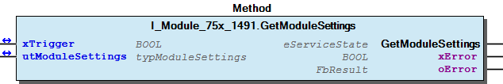 Graphical Interface of I_Module_75x_1491.GetModuleSettings Example For get the settings from the module. Note You have to call the method cyclic until the method returns with DONE or ABORT.

## I_Module_75x_1491.GetRawChannelConfiguration (METH)


| Scope | Name | Type |
| --- | --- | --- |
| Return | GetRawChannelConfiguration | WagoTypesModuleBase.eServiceState |
| Input | usiMeasureChannel | USINT (1..MAX_CHANNEL_1491) |
| Inout | xTrigger | BOOL |
| utRawChannelConfiguration | typRawChannelConfiguration |
| Output | xError | BOOL |
| oError | WagoSysErrorBase.FbResult |

| Struct member | Value | Description |
| --- | --- | --- |
| UdSettings | eBridgeVoltage | DEACTIVATED |  |
| PLUS_MINUS_15mV |  |
| PLUS_MINUS_30mV |  |
| PLUS_MINUS_60mV |  |
| PLUS_MINUS_120mV |  |
| PLUS_MINUS_240mV |  |
| PLUS_MINUS_360mV |  |
| eSmoothing | DEACTIVATED |  |
| WEAK |  |
| MEDIUM |  |
| STRONG |  |
| eNumberFormat | TWOS_COMPLEMENT |  |
| SIGN_MAGNITUDE |  |
| xEnableDiagGlobal | FALSE | Channel diagnostic disabled |
| TRUE | Channel diagnostic enabled |
| xEnableDiagOverflow | FALSE | Diagnostis overflow disabled |
| TRUE | Diagnostis overflow enabled |
| xEnableDiagUnderflow | FALSE | Diagnostis underflow disabled |
| TRUE | Diagnostis underflow enabled |
| xEnableDiagMeasuringUnderflow | FALSE | Diagnostis measuring value underflow disabled |
| TRUE | Diagnostis measuring value underflow enabled |
| xEnableDiagMeasuringOverflow | FALSE | Diagnostis measuring value overflow disabled |
| TRUE | Diagnostis measuring value overflow enabled |
| xEnableDiagLowerUserLimit | FALSE | Diagnostis user limiting value underflow disabled |
| TRUE | Diagnostis user limiting value underflow enabled |
| xEnableDiagUpperUserLimit | FALSE | Diagnostis user limiting value overflow disabled |
| TRUE | Diagnostis user limiting value overflow enabled |
| iLowerUserLimitValue | -32768 ... 32767 | Lower user limit value |
| iUpperUserLimitValue | -32768 ... 32767 | Upper user limit value |
| RefSettings | eReferenceVoltage | DEACTIVATED |  |
| PLUS_5V_INTERNAL |  |
| PLUS_MINUS_5V_EXTERNAL |  |
| PLUS_MINUS_10V_EXTERNAL |  |
| PLUS_MINUS_15V_EXTERNAL |  |
| eSmoothing | DEACTIVATED |  |
| WEAK |  |
| MEDIUM |  |
| STRONG |  |
| eNumberFormat | TWOS_COMPLEMENT |  |
| SIGN_MAGNITUDE |  |
| xEnableDiagGlobal | FALSE | Channel diagnostic disabled |
| TRUE | Channel diagnostic enabled |
| xEnableDiagOverflow | FALSE | Diagnostis overflow disabled |
| TRUE | Diagnostis overflow enabled |
| xEnableDiagUnderflow | FALSE | Diagnostis underflow disabled |
| TRUE | Diagnostis underflow enabled |
| xEnableDiagMeasuringUnderflow | FALSE | Diagnostis measuring value underflow disabled |
| TRUE | Diagnostis measuring value underflow enabled |
| xEnableDiagMeasuringOverflow | FALSE | Diagnostis measuring value overflow disabled |
| TRUE | Diagnostis measuring value overflow enabled |
| xEnableDiagLowerUserLimit | FALSE | Diagnostis user limiting value underflow disabled |
| TRUE | Diagnostis user limiting value underflow enabled |
| xEnableDiagUpperUserLimit | FALSE | Diagnostis user limiting value overflow disabled |
| TRUE | Diagnostis user limiting value overflow enabled |
| iLowerUserLimitValue | -32768 ... 32767 | Lower user limit value |
| iUpperUserLimitValue | -32768 ... 32767 | Upper user limit value |
| UdScaling | xUserScaling | FALSE | User scaling disabled -> use manufacturer scaling |
| TRUE | User scaling enabled |
| iUserScalingOffset | -32768 ... 32767 | User scaling Offset |
| iUserScalingGain | -32768 ... 32767 | User scaling Gain -> scaled value / 0x4000 |
| RefScaling | xUserScaling | FALSE | User scaling disabled -> use manufacturer scaling |
| TRUE | User scaling enabled |
| iUserScalingOffset | -32768 ... 32767 | User scaling Offset |
| iUserScalingGain | -32768 ... 32767 | User scaling Gain -> scaled value / 0x4000 |

```
VAR
    //--- Channel Configuration ---------------------------------
    utRawChannelConfiguration   :   WagoTypesModule_75x_1491.typRawChannelConfiguration;
    xGetRawChannelConfiguration :   BOOL;
    oError                      :   WagoSysErrorBase.FbResult;
END_VAR

//--- C H A N N E L    C O N F I G U R A T I O N -----------------------
CASE my1491.GetRawChannelConfiguration( usiMeasureChannel           := 1, // measure channel 1
                                        xTrigger                    := xGetRawChannelConfiguration,
                                        utRawChannelConfiguration   := utRawChannelConfiguration,
                                        oError                      => oError
                                    ) OF

    eServiceState.DONE : // OK
            ;// process here your utChannelConfiguration

    eServiceState.ABORT : // Error
            ;// process here your error handling -> see oError for more information

END_CASE
```

typRawChannelConfiguration

Graphical Illustration

Graphical Interface of I_Module_75x_1491.GetRawChannelConfiguration

For get the configuration from channel one

You have to call the method cyclic until the method returns with DONE or ABORT.

Interface variables Function Get the complete raw configuration of a channel. typRawChannelConfiguration Graphical Illustration 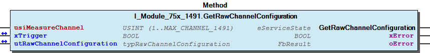 Graphical Interface of I_Module_75x_1491.GetRawChannelConfiguration Example For get the configuration from channel one Note You have to call the method cyclic until the method returns with DONE or ABORT.

## I_Module_75x_1491.GetRawRefScaling (METH)


| Scope | Name | Type |
| --- | --- | --- |
| Return | GetRawRefScaling | WagoTypesModuleBase.eServiceState |
| Input | usiMeasureChannel | USINT (1..MAX_CHANNEL_1491) |
| Inout | xTrigger | BOOL |
| utRawScaling | typRawScaling |
| Output | xError | BOOL |
| oError | WagoSysErrorBase.FbResult |

| Struct member | Value | Description |
| --- | --- | --- |
| xUserScaling | FALSE | User scaling disabled -> use manufacturer scaling |
| TRUE | User scaling enabled |
| iUserScalingOffset | -32768 ... 32767 | User scaling Offset |
| iUserScalingGain | -32768 ... 32767 | User scaling Gain -> scaled value / 0x4000 |

```
VAR
    //--- reference voltage Settings ---------------------------------
    utRawScaling    :   WagoTypesModule_75x_1491.typRawScaling;
    xGetScaling     :   BOOL;
    oError          :   WagoSysErrorBase.FbResult;
END_VAR

//--- R E F E R E N C E   V O L T A G E   S C A L I N G ------------------------
CASE my1491.GetRawRefScaling(   usiMeasureChannel   := 1, // measure channel 1
                                xTrigger            := xGetScaling,
                                utRawScaling        := utRawScaling,
                                oError              => oError
                            ) OF

    eServiceState.DONE : // OK
            ;// process here your utRawScaling

    eServiceState.ABORT : // Error
            ;// process here your error handling -> see oError for more information

END_CASE
```

typRawScaling

Graphical Illustration

Graphical Interface of I_Module_75x_1491.GetRawRefScaling

For get the reference voltage scaling from channel one

You have to call the method cyclic until the method returns with DONE or ABORT.

Interface variables Function Get the reference voltage scaling of a channel at a struct. typRawScaling Graphical Illustration 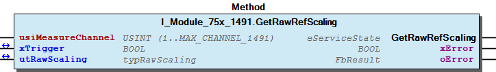 Graphical Interface of I_Module_75x_1491.GetRawRefScaling Example For get the reference voltage scaling from channel one Note You have to call the method cyclic until the method returns with DONE or ABORT.

## I_Module_75x_1491.GetRawRefSettings (METH)


| Scope | Name | Type |
| --- | --- | --- |
| Return | GetRawRefSettings | WagoTypesModuleBase.eServiceState |
| Input | usiMeasureChannel | USINT (1..MAX_CHANNEL_1491) |
| Inout | xTrigger | BOOL |
| utRawRefSettings | typRawRefSettings |
| Output | xError | BOOL |
| oError | WagoSysErrorBase.FbResult |

| Struct member | Value | Description |
| --- | --- | --- |
| eReferenceVoltage | DEACTIVATED |  |
| PLUS_5V_INTERNAL |  |
| PLUS_MINUS_5V_EXTERNAL |  |
| PLUS_MINUS_10V_EXTERNAL |  |
| PLUS_MINUS_15V_EXTERNAL |  |
| eSmoothing | DEACTIVATED |  |
| WEAK |  |
| MEDIUM |  |
| STRONG |  |
| eNumberFormat | TWOS_COMPLEMENT |  |
| SIGN_MAGNITUDE |  |
| xEnableDiagGlobal | FALSE | Channel diagnostic disabled |
| TRUE | Channel diagnostic enabled |
| xEnableDiagOverflow | FALSE | Diagnostis overflow disabled |
| TRUE | Diagnostis overflow enabled |
| xEnableDiagUnderflow | FALSE | Diagnostis underflow disabled |
| TRUE | Diagnostis underflow enabled |
| xEnableDiagMeasuringUnderflow | FALSE | Diagnostis measuring value underflow disabled |
| TRUE | Diagnostis measuring value underflow enabled |
| xEnableDiagMeasuringOverflow | FALSE | Diagnostis measuring value overflow disabled |
| TRUE | Diagnostis measuring value overflow enabled |
| xEnableDiagLowerUserLimit | FALSE | Diagnostis user limiting value underflow disabled |
| TRUE | Diagnostis user limiting value underflow enabled |
| xEnableDiagUpperUserLimit | FALSE | Diagnostis user limiting value overflow disabled |
| TRUE | Diagnostis user limiting value overflow enabled |
| iLowerUserLimitValue | -32768 ... 32767 | Lower user limit value |
| iUpperUserLimitValue | -32768 ... 32767 | Upper user limit value |

```
VAR
    //--- Channel Settings ---------------------------------
    utRefSettings   :   WagoTypesModule_75x_1491.typRawRefSettings;
    xGetRefSettings :   BOOL;
    oError          :   WagoSysErrorBase.FbResult;
END_VAR

//--- C H A N N E L   S E T T I N G S ----------------------
CASE my1491.GetRawRefSettings(  usiMeasureChannel   := 1, // measure channel 1
                                xTrigger            := xGetRefSettings,
                                utRawRefSettings    := utRefSettings,
                                oError              => oError
                            ) OF

    eServiceState.DONE : // OK
        ;// process here your utRefSettings

    eServiceState.ABORT : // Error
        ;// process here your error handling -> see oError for more information

END_CASE
```

typRawRefSettings

Graphical Illustration

Graphical Interface of I_Module_75x_1491.GetRawRefSettings

For get the reference voltage settings from channel one

You have to call the method cyclic until the method returns with DONE or ABORT.

Interface variables Function Get the reference voltage settings of a channel at a struct. typRawRefSettings Graphical Illustration 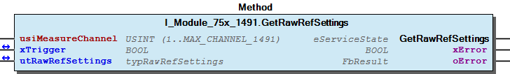 Graphical Interface of I_Module_75x_1491.GetRawRefSettings Example For get the reference voltage settings from channel one Note You have to call the method cyclic until the method returns with DONE or ABORT.

## I_Module_75x_1491.GetRawUdScaling (METH)


| Scope | Name | Type |
| --- | --- | --- |
| Return | GetRawUdScaling | WagoTypesModuleBase.eServiceState |
| Input | usiMeasureChannel | USINT (1..MAX_CHANNEL_1491) |
| Inout | xTrigger | BOOL |
| utRawScaling | typRawScaling |
| Output | xError | BOOL |
| oError | WagoSysErrorBase.FbResult |

| Struct member | Value | Description |
| --- | --- | --- |
| xUserScaling | FALSE | User scaling disabled -> use manufacturer scaling |
| TRUE | User scaling enabled |
| iUserScalingOffset | -32768 ... 32767 | User scaling Offset |
| iUserScalingGain | -32768 ... 32767 | User scaling Gain -> scaled value / 0x4000 |

```
VAR
    //--- Channel Settings ---------------------------------
    utRawScaling    :   WagoTypesModule_75x_1491.typRawScaling;
    xGetScaling     :   BOOL;
    oError          :   WagoSysErrorBase.FbResult;
END_VAR

//--- Ud   S C A L I N G ------------------------
CASE my1491.GetRawUdScaling(    usiMeasureChannel   := 1, // measure channel 1
                                xTrigger            := xGetScaling,
                                utRawScaling        := utRawScaling,
                                oError              => oError
                            ) OF

    eServiceState.DONE : // OK
            ;// process here your utRawScaling

    eServiceState.ABORT : // Error
            ;// process here your error handling -> see oError for more information

END_CASE
```

typRawScaling

Graphical Illustration

Graphical Interface of I_Module_75x_1491.GetRawUdScaling

For get the scaling from measure channel one

You have to call the method cyclic until the method returns with DONE or ABORT.

Interface variables Function Get the Ud scaling of a channel at a struct. typRawScaling Graphical Illustration  Graphical Interface of I_Module_75x_1491.GetRawUdScaling Example For get the scaling from measure channel one Note You have to call the method cyclic until the method returns with DONE or ABORT.

## I_Module_75x_1491.GetRawUdSettings (METH)


| Scope | Name | Type |
| --- | --- | --- |
| Return | GetRawUdSettings | WagoTypesModuleBase.eServiceState |
| Input | usiMeasureChannel | USINT (1..MAX_CHANNEL_1491) |
| Inout | xTrigger | BOOL |
| utRawUdSettings | typRawUdSettings |
| Output | xError | BOOL |
| oError | WagoSysErrorBase.FbResult |

| Struct member | Value | Description |
| --- | --- | --- |
| eBridgeVoltage | DEACTIVATED |  |
| PLUS_MINUS_15mV |  |
| PLUS_MINUS_30mV |  |
| PLUS_MINUS_60mV |  |
| PLUS_MINUS_120mV |  |
| PLUS_MINUS_240mV |  |
| PLUS_MINUS_360mV |  |
| eSmoothing | DEACTIVATED |  |
| WEAK |  |
| MEDIUM |  |
| STRONG |  |
| eNumberFormat | TWOS_COMPLEMENT |  |
| SIGN_MAGNITUDE |  |
| xEnableDiagGlobal | FALSE | Channel diagnostic disabled |
| TRUE | Channel diagnostic enabled |
| xEnableDiagOverflow | FALSE | Diagnostis overflow disabled |
| TRUE | Diagnostis overflow enabled |
| xEnableDiagUnderflow | FALSE | Diagnostis underflow disabled |
| TRUE | Diagnostis underflow enabled |
| xEnableDiagMeasuringUnderflow | FALSE | Diagnostis measuring value underflow disabled |
| TRUE | Diagnostis measuring value underflow enabled |
| xEnableDiagMeasuringOverflow | FALSE | Diagnostis measuring value overflow disabled |
| TRUE | Diagnostis measuring value overflow enabled |
| xEnableDiagLowerUserLimit | FALSE | Diagnostis user limiting value underflow disabled |
| TRUE | Diagnostis user limiting value underflow enabled |
| xEnableDiagUpperUserLimit | FALSE | Diagnostis user limiting value overflow disabled |
| TRUE | Diagnostis user limiting value overflow enabled |
| iLowerUserLimitValue | -32768 ... 32767 | Lower user limit value |
| iUpperUserLimitValue | -32768 ... 32767 | Upper user limit value |

```
VAR
    //--- Channel Settings ---------------------------------
    utUdSettings    :   WagoTypesModule_75x_1491.typRawUdSettings;
    xGetUdSettings  :   BOOL;
    oError          :   WagoSysErrorBase.FbResult;
END_VAR

//--- C H A N N E L   S E T T I N G S ----------------------
CASE my1491.GetRawUdSettings(   usiMeasureChannel   := 1, // measure channel 1
                                xTrigger            := xGetUdSettings,
                                utRawUdSettings     := utUdSettings,
                                oError              => oError
                            ) OF

    eServiceState.DONE : // OK
        ;// process here your utUdSettings

    eServiceState.ABORT : // Error
        ;// process here your error handling -> see oError for more information

END_CASE
```

typRawUdSettings

Graphical Illustration

Graphical Interface of I_Module_75x_1491.GetRawUdSettings

For get the settings from channel one

You have to call the method cyclic until the method returns with DONE or ABORT.

Interface variables Function Get the Ud settings of a channel at a struct. typRawUdSettings Graphical Illustration 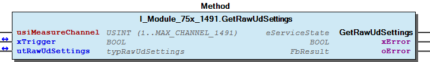 Graphical Interface of I_Module_75x_1491.GetRawUdSettings Example For get the settings from channel one Note You have to call the method cyclic until the method returns with DONE or ABORT.

## I_Module_75x_1491.SetModuleSettings (METH)


| Scope | Name | Type | Comment |
| --- | --- | --- | --- |
| Return | SetModuleSettings | WagoTypesModuleBase.eServiceState |  |
| Inout | xTrigger | BOOL | set this variable once to start the process. It will be automatic reset by this Method. |
| utModuleSettings | typModuleSettings |  |
| Output | xError | BOOL |  |
| oError | WagoSysErrorBase.FbResult |  |

| Struct member | Value | Description |
| --- | --- | --- |
| eInterferenceFrequency | _10HZ | 10 HZ Interference Frequency Suppression |
| _50HZ | 50 HZ Interference Frequency Suppression |
| _60HZ | 60 HZ Interference Frequency Suppression |
| _200HZ | 200 HZ Interference Frequency Suppression |
| _400HZ | 400 HZ Interference Frequency Suppression |
| eFilterMode | PRECISE_MODE | Precise Mode |
| FAST_MODE | Fast Mode |

```
VAR
    //--- Module Mode Settings ------------------------------
    utModuleSettings    :   WagoTypesModule_75x_1491.typModuleSettings;
    xSetModuleSettings  :   BOOL; // set this variable once to start the process. It will be reset by the Method automatic.
    oError              :   WagoSysErrorBase.FbResult;
END_VAR

//--- S E T   M O D U L E    S E T T I N G S ---------------
CASE my1491.SetModuleSettings(xSetModuleSettings, utModuleSettings, oError => oError) OF

    eServiceState.DONE : // OK

    eServiceState.ABORT : // Error
            ;// process here your error handling -> see oError for more information

END_CASE
```

typModuleSettings

Graphical Illustration

Graphical Interface of I_Module_75x_1491.SetModuleSettings

For set the settings from the module.

You have to call the method cyclic until the method returns with DONE or ABORT.

Interface variables Function Set the common settings of the module from a struct. typModuleSettings Graphical Illustration  Graphical Interface of I_Module_75x_1491.SetModuleSettings Example For set the settings from the module. Note You have to call the method cyclic until the method returns with DONE or ABORT.

## I_Module_75x_1491.SetRawChannelConfiguration (METH)


| Scope | Name | Type |
| --- | --- | --- |
| Return | SetRawChannelConfiguration | WagoTypesModuleBase.eServiceState |
| Input | usiMeasureChannel | USINT (1...MAX_CHANNEL_1491) |
| Inout | xTrigger | BOOL |
| utRawChannelConfiguration | typRawChannelConfiguration |
| Output | xError | BOOL |
| oError | WagoSysErrorBase.FbResult |

| Struct member | Value | Description |
| --- | --- | --- |
| UdSettings | eBridgeVoltage | DEACTIVATED |  |
| PLUS_MINUS_15mV |  |
| PLUS_MINUS_30mV |  |
| PLUS_MINUS_60mV |  |
| PLUS_MINUS_120mV |  |
| PLUS_MINUS_240mV |  |
| PLUS_MINUS_360mV |  |
| eSmoothing | DEACTIVATED |  |
| WEAK |  |
| MEDIUM |  |
| STRONG |  |
| eNumberFormat | TWOS_COMPLEMENT |  |
| SIGN_MAGNITUDE |  |
| xEnableDiagGlobal | FALSE | Channel diagnostic disabled |
| TRUE | Channel diagnostic enabled |
| xEnableDiagOverflow | FALSE | Diagnostis overflow disabled |
| TRUE | Diagnostis overflow enabled |
| xEnableDiagUnderflow | FALSE | Diagnostis underflow disabled |
| TRUE | Diagnostis underflow enabled |
| xEnableDiagMeasuringUnderflow | FALSE | Diagnostis measuring value underflow disabled |
| TRUE | Diagnostis measuring value underflow enabled |
| xEnableDiagMeasuringOverflow | FALSE | Diagnostis measuring value overflow disabled |
| TRUE | Diagnostis measuring value overflow enabled |
| xEnableDiagLowerUserLimit | FALSE | Diagnostis user limiting value underflow disabled |
| TRUE | Diagnostis user limiting value underflow enabled |
| xEnableDiagUpperUserLimit | FALSE | Diagnostis user limiting value overflow disabled |
| TRUE | Diagnostis user limiting value overflow enabled |
| iLowerUserLimitValue | -32768 ... 32767 | Lower user limit value |
| iUpperUserLimitValue | -32768 ... 32767 | Upper user limit value |
| RefSettings | eReferenceVoltage | DEACTIVATED |  |
| PLUS_5V_INTERNAL |  |
| PLUS_MINUS_5V_EXTERNAL |  |
| PLUS_MINUS_10V_EXTERNAL |  |
| PLUS_MINUS_15V_EXTERNAL |  |
| eSmoothing | DEACTIVATED |  |
| WEAK |  |
| MEDIUM |  |
| STRONG |  |
| eNumberFormat | TWOS_COMPLEMENT |  |
| SIGN_MAGNITUDE |  |
| xEnableDiagGlobal | FALSE | Channel diagnostic disabled |
| TRUE | Channel diagnostic enabled |
| xEnableDiagOverflow | FALSE | Diagnostis overflow disabled |
| TRUE | Diagnostis overflow enabled |
| xEnableDiagUnderflow | FALSE | Diagnostis underflow disabled |
| TRUE | Diagnostis underflow enabled |
| xEnableDiagMeasuringUnderflow | FALSE | Diagnostis measuring value underflow disabled |
| TRUE | Diagnostis measuring value underflow enabled |
| xEnableDiagMeasuringOverflow | FALSE | Diagnostis measuring value overflow disabled |
| TRUE | Diagnostis measuring value overflow enabled |
| xEnableDiagLowerUserLimit | FALSE | Diagnostis user limiting value underflow disabled |
| TRUE | Diagnostis user limiting value underflow enabled |
| xEnableDiagUpperUserLimit | FALSE | Diagnostis user limiting value overflow disabled |
| TRUE | Diagnostis user limiting value overflow enabled |
| iLowerUserLimitValue | -32768 ... 32767 | Lower user limit value |
| iUpperUserLimitValue | -32768 ... 32767 | Upper user limit value |
| UdScaling | xUserScaling | FALSE | User scaling disabled -> use manufacturer scaling |
| TRUE | User scaling enabled |
| iUserScalingOffset | -32768 ... 32767 | User scaling Offset |
| iUserScalingGain | -32768 ... 32767 | User scaling Gain -> scaled value / 0x4000 |
| RefScaling | xUserScaling | FALSE | User scaling disabled -> use manufacturer scaling |
| TRUE | User scaling enabled |
| iUserScalingOffset | -32768 ... 32767 | User scaling Offset |
| iUserScalingGain | -32768 ... 32767 | User scaling Gain -> scaled value / 0x4000 |

```
VAR
    //--- Channel Configuration -------------------------------------------------------
    xStartProcess               :   BOOL; // set this variable once to start the process -> this varibale will be automatic reset
    utRawChannelConfiguration   :   WagoTypesModule_75x_1491.typRawChannelConfiguration;
    oError                      :   WagoSysErrorBase.FbResult;
    xSetRawChannelConfiguration :   BOOL;
END_VAR

//--- C H A N N E L    C O N F I G U R A T I O N -----------------------
//--- READ BEFORE WRITE --------------------------------------------------------------
CASE my1491.GetRawChannelConfiguration( 1, xStartProcess, utRawChannelConfiguration, oError => oError) OF

    eServiceState.DONE : // OK -> actual configuration is successful read
        // change here your configuration
        // utRawChannelConfiguration... :=
        xSetRawChannelConfiguration := TRUE; // trigger write

    eServiceState.ABORT : // Error -> not able to read -> see oError
            ;// process here your error handling for read -> see oError for more information

END_CASE

//--- WRITE MODYFIED CONFIGURATION ---------------------------------------------------
CASE my1491.SetRawChannelConfiguration( 1, xSetRawChannelConfiguration, utRawChannelConfiguration, oError => oError) OF

    eServiceState.DONE : // OK -> new configuration is written

    eServiceState.ABORT : // Error -> not able to write -> see oError
            ;// process here your error handling for write -> see oError for more information

END_CASE
```

typRawChannelConfiguration

Graphical Illustration

Graphical Interface of I_Module_75x_1491.SetRawChannelConfiguration

For get the configuration from channel one and after read write the configuration

You have to call the method cyclic until the method returns with DONE or ABORT.

Interface variables Function Set the complete raw configuration of a channel. typRawChannelConfiguration Graphical Illustration 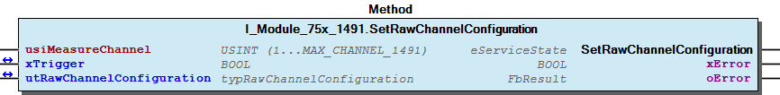 Graphical Interface of I_Module_75x_1491.SetRawChannelConfiguration Example For get the configuration from channel one and after read write the configuration Note You have to call the method cyclic until the method returns with DONE or ABORT.

## I_Module_75x_1491.SetRawRefScaling (METH)


| Scope | Name | Type |
| --- | --- | --- |
| Return | SetRawRefScaling | WagoTypesModuleBase.eServiceState |
| Input | usiMeasureChannel | USINT (1..MAX_CHANNEL_1491) |
| Inout | xTrigger | BOOL |
| utRawScaling | typRawScaling |
| Output | xError | BOOL |
| oError | WagoSysErrorBase.FbResult |

| Struct member | Value | Description |
| --- | --- | --- |
| xUserScaling | FALSE | User scaling disabled -> use manufacturer scaling |
| TRUE | User scaling enabled |
| iUserScalingOffset | -32768 ... 32767 | User scaling Offset |
| iUserScalingGain | -32768 ... 32767 | User scaling Gain -> scaled value / 0x4000 |

```
VAR
    //--- Channel Settings ---------------------------------
    utRawScaling    :   WagoTypesModule_75x_1491.typRawScaling;
    xSetScaling     :   BOOL;
    oError          :   WagoSysErrorBase.FbResult;
END_VAR

//--- Ud   S C A L I N G ------------------------
CASE my1491.SetRawRefScaling(   usiMeasureChannel   := 1, // measure channel 1
                                xTrigger            := xSetScaling,
                                utRawScaling        := utRawScaling,
                                oError              => oError
                            ) OF

    eServiceState.DONE : // OK
            ;// process here your utRawScaling

    eServiceState.ABORT : // Error
            ;// process here your error handling -> see oError for more information

END_CASE
```

typRawScaling

Graphical Illustration

Graphical Interface of I_Module_75x_1491.SetRawRefScaling

For set the reference voltage scaling of measure channel one

You have to call the method cyclic until the method returns with DONE or ABORT.

Interface variables Function Set the reference voltage scaling of a channel by a struct. typRawScaling Graphical Illustration 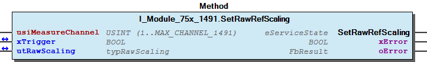 Graphical Interface of I_Module_75x_1491.SetRawRefScaling Example For set the reference voltage scaling of measure channel one Note You have to call the method cyclic until the method returns with DONE or ABORT.

## I_Module_75x_1491.SetRawRefSettings (METH)


| Scope | Name | Type |
| --- | --- | --- |
| Return | SetRawRefSettings | WagoTypesModuleBase.eServiceState |
| Input | usiMeasureChannel | USINT (1..MAX_CHANNEL_1491) |
| Inout | xTrigger | BOOL |
| utRawRefSettings | typRawRefSettings |
| Output | xError | BOOL |
| oError | WagoSysErrorBase.FbResult |

| Struct member | Value | Description |
| --- | --- | --- |
| eReferenceVoltage | DEACTIVATED |  |
| PLUS_5V_INTERNAL |  |
| PLUS_MINUS_5V_EXTERNAL |  |
| PLUS_MINUS_10V_EXTERNAL |  |
| PLUS_MINUS_15V_EXTERNAL |  |
| eSmoothing | DEACTIVATED |  |
| WEAK |  |
| MEDIUM |  |
| STRONG |  |
| eNumberFormat | TWOS_COMPLEMENT |  |
| SIGN_MAGNITUDE |  |
| xEnableDiagGlobal | FALSE | Channel diagnostic disabled |
| TRUE | Channel diagnostic enabled |
| xEnableDiagOverflow | FALSE | Diagnostis overflow disabled |
| TRUE | Diagnostis overflow enabled |
| xEnableDiagUnderflow | FALSE | Diagnostis underflow disabled |
| TRUE | Diagnostis underflow enabled |
| xEnableDiagMeasuringUnderflow | FALSE | Diagnostis measuring value underflow disabled |
| TRUE | Diagnostis measuring value underflow enabled |
| xEnableDiagMeasuringOverflow | FALSE | Diagnostis measuring value overflow disabled |
| TRUE | Diagnostis measuring value overflow enabled |
| xEnableDiagLowerUserLimit | FALSE | Diagnostis user limiting value underflow disabled |
| TRUE | Diagnostis user limiting value underflow enabled |
| xEnableDiagUpperUserLimit | FALSE | Diagnostis user limiting value overflow disabled |
| TRUE | Diagnostis user limiting value overflow enabled |
| iLowerUserLimitValue | -32768 ... 32767 | Lower user limit value |
| iUpperUserLimitValue | -32768 ... 32767 | Upper user limit value |

```
VAR
    //--- Channel Settings ---------------------------------
    utRefSettings   :   WagoTypesModule_75x_1491.typRawRefSettings;
    xSetRefSettings :   BOOL;
    oError          :   WagoSysErrorBase.FbResult;
END_VAR

//--- Ud  C H A N N E L   S E T T I N G S ----------------------
CASE my1491.SetRawRefSettings(  usiMeasureChannel   := 1, // measure channel 1
                                xTrigger            := xSetRefSettings,
                                utRawRefSettings    := utRefSettings,
                                oError              => oError
                            ) OF

    eServiceState.DONE : // OK
        ;// process here your utRefSettings

    eServiceState.ABORT : // Error
        ;// process here your error handling -> see oError for more information

END_CASE
```

typRawRefSettings

Graphical Illustration

Graphical Interface of I_Module_75x_1491.SetRawRefSettings

For set the reference voltage settings of channel one

You have to call the method cyclic until the method returns with DONE or ABORT.

Interface variables Function Set the reference voltage settings for a channel by a struct. typRawRefSettings Graphical Illustration  Graphical Interface of I_Module_75x_1491.SetRawRefSettings Example For set the reference voltage settings of channel one Note You have to call the method cyclic until the method returns with DONE or ABORT.

## I_Module_75x_1491.SetRawUdScaling (METH)


| Scope | Name | Type |
| --- | --- | --- |
| Return | SetRawUdScaling | WagoTypesModuleBase.eServiceState |
| Input | usiMeasureChannel | USINT (1..MAX_CHANNEL_1491) |
| Inout | xTrigger | BOOL |
| utRawScaling | typRawScaling |
| Output | xError | BOOL |
| oError | WagoSysErrorBase.FbResult |

| Struct member | Value | Description |
| --- | --- | --- |
| xUserScaling | FALSE | User scaling disabled -> use manufacturer scaling |
| TRUE | User scaling enabled |
| iUserScalingOffset | -32768 ... 32767 | User scaling Offset |
| iUserScalingGain | -32768 ... 32767 | User scaling Gain -> scaled value / 0x4000 |

```
VAR
    //--- Channel Settings ---------------------------------
    utRawScaling    :   WagoTypesModule_75x_1491.typRawScaling;
    xSetScaling     :   BOOL;
    oError          :   WagoSysErrorBase.FbResult;
END_VAR

//--- Ud   S C A L I N G ------------------------
CASE my1491.SetRawUdScaling(    usiMeasureChannel   := 1, // measure channel 1
                                xTrigger            := xSetScaling,
                                utRawScaling        := utRawScaling,
                                oError              => oError
                            ) OF

    eServiceState.DONE : // OK
            ;// process here your utRawScaling

    eServiceState.ABORT : // Error
            ;// process here your error handling -> see oError for more information

END_CASE
```

typRawScaling

Graphical Illustration

Graphical Interface of I_Module_75x_1491.SetRawUdScaling

For set the Ud scaling of measure channel one

You have to call the method cyclic until the method returns with DONE or ABORT.

Interface variables Function Set the Ud scaling of a channel by a struct. typRawScaling Graphical Illustration 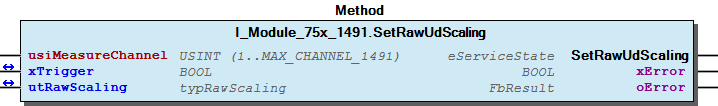 Graphical Interface of I_Module_75x_1491.SetRawUdScaling Example For set the Ud scaling of measure channel one Note You have to call the method cyclic until the method returns with DONE or ABORT.

## I_Module_75x_1491.SetRawUdSettings (METH)


| Scope | Name | Type |
| --- | --- | --- |
| Return | SetRawUdSettings | WagoTypesModuleBase.eServiceState |
| Input | usiMeasureChannel | USINT (1..MAX_CHANNEL_1491) |
| Inout | xTrigger | BOOL |
| utRawUdSettings | typRawUdSettings |
| Output | xError | BOOL |
| oError | WagoSysErrorBase.FbResult |

| Struct member | Value | Description |
| --- | --- | --- |
| eBridgeVoltage | DEACTIVATED |  |
| PLUS_MINUS_15mV |  |
| PLUS_MINUS_30mV |  |
| PLUS_MINUS_60mV |  |
| PLUS_MINUS_120mV |  |
| PLUS_MINUS_240mV |  |
| PLUS_MINUS_360mV |  |
| eSmoothing | DEACTIVATED |  |
| WEAK |  |
| MEDIUM |  |
| STRONG |  |
| eNumberFormat | TWOS_COMPLEMENT |  |
| SIGN_MAGNITUDE |  |
| xEnableDiagGlobal | FALSE | Channel diagnostic disabled |
| TRUE | Channel diagnostic enabled |
| xEnableDiagOverflow | FALSE | Diagnostis overflow disabled |
| TRUE | Diagnostis overflow enabled |
| xEnableDiagUnderflow | FALSE | Diagnostis underflow disabled |
| TRUE | Diagnostis underflow enabled |
| xEnableDiagMeasuringUnderflow | FALSE | Diagnostis measuring value underflow disabled |
| TRUE | Diagnostis measuring value underflow enabled |
| xEnableDiagMeasuringOverflow | FALSE | Diagnostis measuring value overflow disabled |
| TRUE | Diagnostis measuring value overflow enabled |
| xEnableDiagLowerUserLimit | FALSE | Diagnostis user limiting value underflow disabled |
| TRUE | Diagnostis user limiting value underflow enabled |
| xEnableDiagUpperUserLimit | FALSE | Diagnostis user limiting value overflow disabled |
| TRUE | Diagnostis user limiting value overflow enabled |
| iLowerUserLimitValue | -32768 ... 32767 | Lower user limit value |
| iUpperUserLimitValue | -32768 ... 32767 | Upper user limit value |

```
VAR
    //--- Channel Settings ---------------------------------
    utUdSettings    :   WagoTypesModule_75x_1491.typRawUdSettings;
    xSetUdSettings  :   BOOL;
    oError          :   WagoSysErrorBase.FbResult;
END_VAR

//--- Ud  C H A N N E L   S E T T I N G S ----------------------
CASE my1491.SetRawUdSettings(   usiMeasureChannel   := 1, // measure channel 1
                                xTrigger            := xSetUdSettings,
                                utRawUdSettings     := utUdSettings,
                                oError              => oError
                            ) OF

    eServiceState.DONE : // OK
        ;// process here your utUdSettings

    eServiceState.ABORT : // Error
        ;// process here your error handling -> see oError for more information

END_CASE
```

typRawUdSettings

Graphical Illustration

Graphical Interface of I_Module_75x_1491.SetRawUdSettings

For set the Ud settings of channel one

You have to call the method cyclic until the method returns with DONE or ABORT.

Interface variables Function Set the Ud settings for a channel by a struct. typRawUdSettings Graphical Illustration 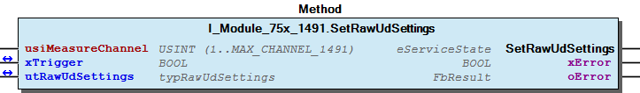 Graphical Interface of I_Module_75x_1491.SetRawUdSettings Example For set the Ud settings of channel one Note You have to call the method cyclic until the method returns with DONE or ABORT.

## I_Module_75x_1491_dynConfig.GetRawInputValue (METH)


| Scope | Name | Type |
| --- | --- | --- |
| Return | GetRawInputValue | INT |
| Input | usiChannel | USINT (1..MAX_CHANNEL_1491) |

| Channel | Description | Resistor Bridge |
| --- | --- | --- |
| 1 | Ud | first Bridge |
| 2 | Ud | second Bridge |

```
VAR
    myiUdValue  :   INT;
END_VAR

myiUdValue := my1491.GetRawInputValue(1); // here is the raw Ud value as INT of the first resistor bridge
```

Get the raw process input value Ud of the selected channel (1..2).

In case of error (e.g. an invalid channel number is given) it returns -32768.

Graphical Illustration

Graphical Interface of I_Module_75x_1491_dynConfig.GetRawInputValue

Get the raw process input value from first channel (Ud) of the module.

Interface variables Function Get the raw process input value Ud of the selected channel (1..2). In case of error (e.g. an invalid channel number is given) it returns -32768. Graphical Illustration 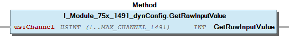 Graphical Interface of I_Module_75x_1491_dynConfig.GetRawInputValue Example Get the raw process input value from first channel (Ud) of the module.

## I_Module_75x_1491_dynConfig.GetRawValues (METH)


| Scope | Name | Type |
| --- | --- | --- |
| Return | GetRawValues | WORD |
| Input | usiChannel | USINT (1..4) |

| Channel | Description | Resistor Bridge |
| --- | --- | --- |
| 1 | Ud | first Bridge |
| 2 | Uref | first Bridge |
| 3 | Ud | second Bridge |
| 4 | Uref | second Bridge |

```
VAR
    myiUdValue  :   WORD;
END_VAR

myiUdValue := my1491.GetRawInputValue(1); // here is the raw Ud value as WORD of the first resistor bridge
```

Get the raw process input value.

In case of error (e.g. an invalid channel number is given) it returns -32768.

Graphical Illustration

Graphical Interface of I_Module_75x_1491_dynConfig.GetRawValues

Get the raw process input value from first channel (Ud) of the module.

Interface variables Function Get the raw process input value. In case of error (e.g. an invalid channel number is given) it returns -32768. Graphical Illustration 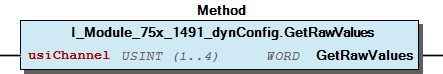 Graphical Interface of I_Module_75x_1491_dynConfig.GetRawValues Example Get the raw process input value from first channel (Ud) of the module.

## ModuleSettings


- eFilterMode (ENUM) - eInterferenceFrequency (ENUM)

## Settings


- I_Module_75x_1491.GetRawRefSettings (METH) - I_Module_75x_1491.GetRawUdSettings (METH) - I_Module_75x_1491.SetRawRefSettings (METH) - I_Module_75x_1491.SetRawUdSettings (METH)

## typModuleSettings (STRUCT)


| Name | Type | Comment |
| --- | --- | --- |
| eInterferenceFrequency | eInterferenceFrequency | Interference Frequency Suppression |
| eFilterMode | eFilterMode | Filter Mode |

| Struct member | Value | Description |
| --- | --- | --- |
| eInterferenceFrequency | _10HZ | 10 HZ Interference Frequency Suppression |
| _50HZ | 50 HZ Interference Frequency Suppression |
| _60HZ | 60 HZ Interference Frequency Suppression |
| _200HZ | 200 HZ Interference Frequency Suppression |
| _400HZ | 400 HZ Interference Frequency Suppression |
| eFilterMode | PRECISE_MODE | Precise Mode |
| FAST_MODE | Fast Mode |

## typRawRefSettings (STRUCT)


| Name | Type | Comment |
| --- | --- | --- |
| eReferenceVoltage | eReferenceVoltage | P1.0..3 -> Bit 0..3 (Reg 32) |
| eSmoothing | eSmoothing | P1.4..5 -> Bit 0..1 (Reg 34) |
| eNumberFormat | eNumberFormat | P1.6 -> Bit 2 (Reg 34) |
| xEnableDiagGlobal | BOOL | P1.7 -> Bit 15 (Reg 32) |
| xEnableDiagOverflow | BOOL | P3.4 -> Bit 12 (Reg 32) |
| xEnableDiagUnderflow | BOOL | P3.5 -> Bit 13 (Reg 32) |
| xEnableDiagMeasuringUnderflow | BOOL | P3.0 -> Bit 8 (Reg 32) |
| xEnableDiagMeasuringOverflow | BOOL | P3.1 -> Bit 9 (Reg 32) |
| xEnableDiagLowerUserLimit | BOOL | P3.2 -> Bit 10 (Reg 32) |
| xEnableDiagUpperUserLimit | BOOL | P3.3 -> Bit 11 (Reg 32) |
| iLowerUserLimitValue | INT | P5 (Reg 38) |
| iUpperUserLimitValue | INT | P6 (Reg 39) |

| Struct member | Value | Description |
| --- | --- | --- |
| eReferenceVoltage | DEACTIVATED |  |
| PLUS_5V_INTERNAL |  |
| PLUS_MINUS_5V_EXTERNAL |  |
| PLUS_MINUS_10V_EXTERNAL |  |
| PLUS_MINUS_15V_EXTERNAL |  |
| eSmoothing | DEACTIVATED |  |
| WEAK |  |
| MEDIUM |  |
| STRONG |  |
| eNumberFormat | TWOS_COMPLEMENT |  |
| SIGN_MAGNITUDE |  |
| xEnableDiagGlobal | FALSE | Channel diagnostic disabled |
| TRUE | Channel diagnostic enabled |
| xEnableDiagOverflow | FALSE | Diagnostis overflow disabled |
| TRUE | Diagnostis overflow enabled |
| xEnableDiagUnderflow | FALSE | Diagnostis underflow disabled |
| TRUE | Diagnostis underflow enabled |
| xEnableDiagMeasuringUnderflow | FALSE | Diagnostis measuring value underflow disabled |
| TRUE | Diagnostis measuring value underflow enabled |
| xEnableDiagMeasuringOverflow | FALSE | Diagnostis measuring value overflow disabled |
| TRUE | Diagnostis measuring value overflow enabled |
| xEnableDiagLowerUserLimit | FALSE | Diagnostis user limiting value underflow disabled |
| TRUE | Diagnostis user limiting value underflow enabled |
| xEnableDiagUpperUserLimit | FALSE | Diagnostis user limiting value overflow disabled |
| TRUE | Diagnostis user limiting value overflow enabled |
| iLowerUserLimitValue | -32768 ... 32767 | Lower user limit value |
| iUpperUserLimitValue | -32768 ... 32767 | Upper user limit value |

## typRawUdSettings (STRUCT)


| Name | Type | Comment |
| --- | --- | --- |
| eBridgeVoltage | eBridgeVoltage | P1.0..3 -> Bit 0..3 (Reg 32) |
| eSmoothing | eSmoothing | P1.4..5 -> Bit 0..1 (Reg 34) |
| eNumberFormat | eNumberFormat | P1.6 -> Bit 2 (Reg 34) |
| xEnableDiagGlobal | BOOL | P1.7 -> Bit 15 (Reg 32) |
| xEnableDiagOverflow | BOOL | P3.4 -> Bit 12 (Reg 32) |
| xEnableDiagUnderflow | BOOL | P3.5 -> Bit 13 (Reg 32) |
| xEnableDiagMeasuringUnderflow | BOOL | P3.0 -> Bit 8 (Reg 32) |
| xEnableDiagMeasuringOverflow | BOOL | P3.1 -> Bit 9 (Reg 32) |
| xEnableDiagLowerUserLimit | BOOL | P3.2 -> Bit 10 (Reg 32) |
| xEnableDiagUpperUserLimit | BOOL | P3.3 -> Bit 11 (Reg 32) |
| iLowerUserLimitValue | INT | P5 (Reg 38) |
| iUpperUserLimitValue | INT | P6 (Reg 39) |

| Struct member | Value | Description |
| --- | --- | --- |
| eBridgeVoltage | DEACTIVATED |  |
| PLUS_MINUS_15mV |  |
| PLUS_MINUS_30mV |  |
| PLUS_MINUS_60mV |  |
| PLUS_MINUS_120mV |  |
| PLUS_MINUS_240mV |  |
| PLUS_MINUS_360mV |  |
| eSmoothing | DEACTIVATED |  |
| WEAK |  |
| MEDIUM |  |
| STRONG |  |
| eNumberFormat | TWOS_COMPLEMENT |  |
| SIGN_MAGNITUDE |  |
| xEnableDiagGlobal | FALSE | Channel diagnostic disabled |
| TRUE | Channel diagnostic enabled |
| xEnableDiagOverflow | FALSE | Diagnostis overflow disabled |
| TRUE | Diagnostis overflow enabled |
| xEnableDiagUnderflow | FALSE | Diagnostis underflow disabled |
| TRUE | Diagnostis underflow enabled |
| xEnableDiagMeasuringUnderflow | FALSE | Diagnostis measuring value underflow disabled |
| TRUE | Diagnostis measuring value underflow enabled |
| xEnableDiagMeasuringOverflow | FALSE | Diagnostis measuring value overflow disabled |
| TRUE | Diagnostis measuring value overflow enabled |
| xEnableDiagLowerUserLimit | FALSE | Diagnostis user limiting value underflow disabled |
| TRUE | Diagnostis user limiting value underflow enabled |
| xEnableDiagUpperUserLimit | FALSE | Diagnostis user limiting value overflow disabled |
| TRUE | Diagnostis user limiting value overflow enabled |
| iLowerUserLimitValue | -32768 ... 32767 | Lower user limit value |
| iUpperUserLimitValue | -32768 ... 32767 | Upper user limit value |

### Interfaces


## I_Module_75x_1491 (ITF)


- Channel Scalling I_Module_75x_1491.GetRawRefScaling (METH) - I_Module_75x_1491.GetRawUdScaling (METH) - I_Module_75x_1491.SetRawRefScaling (METH) - I_Module_75x_1491.SetRawUdScaling (METH) Settings - I_Module_75x_1491.GetRawRefSettings (METH) - I_Module_75x_1491.GetRawUdSettings (METH) - I_Module_75x_1491.SetRawRefSettings (METH) - I_Module_75x_1491.SetRawUdSettings (METH) I_Module_75x_1491.GetRawChannelConfiguration (METH) Module - I_Module_75x_1491.GetModuleSettings (METH) - I_Module_75x_1491.SetModuleSettings (METH) I_Module_75x_1491.SetRawChannelConfiguration (METH)

## I_Module_75x_1491_dynConfig (ITF)


- I_Module_75x_1491_dynConfig.GetRawInputValue (METH) - I_Module_75x_1491_dynConfig.GetRawValues (METH)

### Program Organization


## 20 Program Organization Units


- 10 Enumeration ChannelSettings eBridgeVoltage (ENUM) - eNumberFormat (ENUM) - eReferenceVoltage (ENUM) - eSmoothing (ENUM) ModuleSettings - eFilterMode (ENUM) - eInterferenceFrequency (ENUM) 15 Datatypes - Raw typRawRefSettings (STRUCT) - typRawScaling (STRUCT) - typRawUdSettings (STRUCT) typModuleSettings (STRUCT) typRawChannelConfiguration (STRUCT) Channels_1491 (GVL) I_Module_75x_1491 (ITF) - Channel Scalling I_Module_75x_1491.GetRawRefScaling (METH) - I_Module_75x_1491.GetRawUdScaling (METH) - I_Module_75x_1491.SetRawRefScaling (METH) - I_Module_75x_1491.SetRawUdScaling (METH) Settings - I_Module_75x_1491.GetRawRefSettings (METH) - I_Module_75x_1491.GetRawUdSettings (METH) - I_Module_75x_1491.SetRawRefSettings (METH) - I_Module_75x_1491.SetRawUdSettings (METH) I_Module_75x_1491.GetRawChannelConfiguration (METH) Module - I_Module_75x_1491.GetModuleSettings (METH) - I_Module_75x_1491.SetModuleSettings (METH) I_Module_75x_1491.SetRawChannelConfiguration (METH) I_Module_75x_1491_dynConfig (ITF) - I_Module_75x_1491_dynConfig.GetRawInputValue (METH) - I_Module_75x_1491_dynConfig.GetRawValues (METH)

### Global Variable Lists


## Channels_1491 (GVL)


| Scope | Name | Type | Initial | Comment |
| --- | --- | --- | --- | --- |
| Constant | MAX_CHANNEL_1491 | USINT | 2 | max. measure channels for 750-1491 |

## VersionHistory (GVL)


| Name | Type |
| --- | --- |
| Info | ProjectInfo |

| date | version | author | change |
| 29.01.2024 | 1.0.0.3 | u010663 | Additional method GetRawValues |
| 12.02.2021 | 1.0.0.2 | u010545 | bugfix |
| 06.02.2021 | 1.0.0.1 | u010545 | bugfix |
| 01.02.2021 | 1.0.0.0 | u010545 | first release |

WagoTypesModule_75x_1491.library

Release Notes:

WagoTypesModule_75x_1491.library Release Notes:

### Other Components


## 10 Enumeration


- ChannelSettings eBridgeVoltage (ENUM) - eNumberFormat (ENUM) - eReferenceVoltage (ENUM) - eSmoothing (ENUM) ModuleSettings - eFilterMode (ENUM) - eInterferenceFrequency (ENUM)

## 15 Datatypes


- Raw typRawRefSettings (STRUCT) - typRawScaling (STRUCT) - typRawUdSettings (STRUCT) typModuleSettings (STRUCT) typRawChannelConfiguration (STRUCT)

## Channel


- Scalling I_Module_75x_1491.GetRawRefScaling (METH) - I_Module_75x_1491.GetRawUdScaling (METH) - I_Module_75x_1491.SetRawRefScaling (METH) - I_Module_75x_1491.SetRawUdScaling (METH) Settings - I_Module_75x_1491.GetRawRefSettings (METH) - I_Module_75x_1491.GetRawUdSettings (METH) - I_Module_75x_1491.SetRawRefSettings (METH) - I_Module_75x_1491.SetRawUdSettings (METH)

## Module


- I_Module_75x_1491.GetModuleSettings (METH) - I_Module_75x_1491.SetModuleSettings (METH)

## Raw


- typRawRefSettings (STRUCT) - typRawScaling (STRUCT) - typRawUdSettings (STRUCT)

## Scalling


- I_Module_75x_1491.GetRawRefScaling (METH) - I_Module_75x_1491.GetRawUdScaling (METH) - I_Module_75x_1491.SetRawRefScaling (METH) - I_Module_75x_1491.SetRawUdScaling (METH)

## eBridgeVoltage (ENUM)


| Name | Initial |
| --- | --- |
| DEACTIVATED | 0 |
| PLUS_MINUS_15mV | 6 |
| PLUS_MINUS_30mV | 7 |
| PLUS_MINUS_60mV | 8 |
| PLUS_MINUS_120mV | 9 |
| PLUS_MINUS_240mV | 10 |
| PLUS_MINUS_360mV | 11 |

Attributes: qualified_only InOut:

## eFilterMode (ENUM)


| Name | Initial |
| --- | --- |
| PRECISE_MODE | 0 |
| FAST_MODE | 1 |

Attributes: qualified_only InOut:

## eInterferenceFrequency (ENUM)


| Name | Initial |
| --- | --- |
| _10HZ | 0 |
| _50HZ | 1 |
| _60HZ | 2 |
| _400HZ | 3 |
| _200HZ | 4 |

Attributes: qualified_only InOut:

## eNumberFormat (ENUM)


| Name | Initial |
| --- | --- |
| TWOS_COMPLEMENT | 0 |
| SIGN_MAGNITUDE | 1 |

Attributes: qualified_only InOut:

## eReferenceVoltage (ENUM)


| Name | Initial |
| --- | --- |
| DEACTIVATED | 0 |
| PLUS_5V_INTERNAL | 2 |
| PLUS_MINUS_5V_EXTERNAL | 3 |
| PLUS_MINUS_10V_EXTERNAL | 4 |
| PLUS_MINUS_15V_EXTERNAL | 5 |

Attributes: qualified_only InOut:

## eSmoothing (ENUM)


| Name | Initial |
| --- | --- |
| DEACTIVATED | 0 |
| WEAK | 1 |
| MEDIUM | 2 |
| STRONG | 3 |

Attributes: qualified_only InOut:

## typRawChannelConfiguration (STRUCT)


| Name | Type |
| --- | --- |
| UdSettings | typRawUdSettings |
| UdScaling | typRawScaling |
| RefSettings | typRawRefSettings |
| RefScaling | typRawScaling |

## typRawScaling (STRUCT)


| Name | Type | Comment |
| --- | --- | --- |
| xUserScaling | BOOL | On / Off |
| iUserScalingOffset | INT | -32768 ... 32767 User scaling Offset |
| iUserScalingGain | INT | -32768 ... 32767 User scaling Gain -> scaled value / 0x4000 |

| Struct member | Value | Description |
| --- | --- | --- |
| xUserScaling | FALSE | User scaling disabled -> use manufacturer scaling |
| TRUE | User scaling enabled |
| iUserScalingOffset | -32768 ... 32767 | User scaling Offset |
| iUserScalingGain | -32768 ... 32767 | User scaling Gain -> scaled value / 0x4000 |