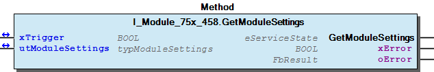
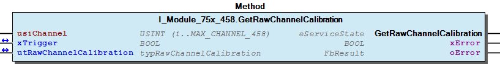
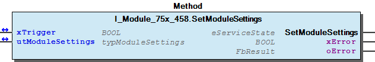
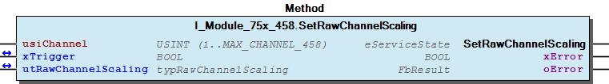
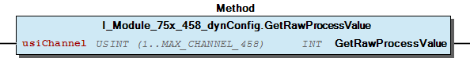

# WagoTypesModule_75x_458 v1.9.3.0 (WAGO) - Complete Documentation


## 📋 Library Information

- **Company:** WAGO
- **Title:** WagoTypesModule_75x_458
- **Version:** 1.9.3.0
- **Categories:** WAGO Internal|Common|Types and Interfaces
- **Author:** WAGO
- **Placeholder:** WagoTypesModule_75x_458

### Description ¶


This document is automatically generated. Because of this, the chapter 30 Visualization is not shown in this document. If you are interested in getting to know more about visualization, we refer to the library manager of e!Cockpit.

Handling modules 75x-496 [1]

This document is automatically generated. Because of this, the chapter 30 Visualization is not shown in this document. If you are interested in getting to know more about visualization, we refer to the library manager of e!Cockpit. Handling modules 75x-496 [1]

### Contents: ¶


Contents: - Documentation Index - Project Information - Library Information - Methods I_Module_75x_458.GetModuleSettings (METH) - I_Module_75x_458.GetRawChannelCalibration (METH) - I_Module_75x_458.GetRawChannelConfiguration (METH) - I_Module_75x_458.GetRawChannelScaling (METH) - I_Module_75x_458.GetRawChannelSettings (METH) - I_Module_75x_458.SetModuleSettings (METH) - I_Module_75x_458.SetRawChannelCalibration (METH) - I_Module_75x_458.SetRawChannelConfiguration (METH) - I_Module_75x_458.SetRawChannelScaling (METH) - I_Module_75x_458.SetRawChannelSettings (METH) - ... and 3 more Interfaces - I_Module_75x_458 (ITF) - I_Module_75x_458_dynConfig (ITF) Program Organization Global Variable Lists - Channels_458 (GVL) - VersionHistory (GVL) Other Components - 10 Enumeration - 15 Datatypes - Channel - Configuration - Module - Raw - eNotchFilter (ENUM) - eSensorType (ENUM) - typRawChannelCalibration (STRUCT) - typRawChannelConfiguration (STRUCT) - ... and 1 more

### Indices and tables ¶


| [1] | Based on WagoTypesModule_75x_458.library, last modified 13.08.2019, 19:32:01. The content of this file was automatically generated with None on 13.08.2019, 19:32:06 |

© WAGO Kontakttechnik GmbH & Co. KG, Germany 2018 – All rights reserved. For the avoidance of doubt, this copyright notice does not only apply to the information above but also and primarily to the described library itself. Please note that third-party products are always mentioned without reference to intellectual property rights, including patents, utility models, designs and trademarks, accordingly the existence of such rights cannot be excluded. WAGO is a registered trademark of WAGO Verwaltungsgesellschaft mbH.

- File and Project Information - Library Reference © WAGO Kontakttechnik GmbH & Co. KG, Germany 2018 – All rights reserved. For the avoidance of doubt, this copyright notice does not only apply to the information above but also and primarily to the described library itself. Please note that third-party products are always mentioned without reference to intellectual property rights, including patents, utility models, designs and trademarks, accordingly the existence of such rights cannot be excluded. WAGO is a registered trademark of WAGO Verwaltungsgesellschaft mbH.

### Documentation Index


## WagoTypesModule_75x_458 Library Documentation


| Company: | WAGO |
| Title: | WagoTypesModule_75x_458 |
| Version: | 1.9.3.0 |
| Categories: | WAGO Internal\|Common\|Types and Interfaces |
| Author: | WAGO |
| Placeholder: | WagoTypesModule_75x_458 |

### Description


This document is automatically generated. Because of this, the chapter 30 Visualization is not shown in this document. If you are interested in getting to know more about visualization, we refer to the library manager of e!Cockpit.

Handling modules 75x-496 [1]

This document is automatically generated. Because of this, the chapter 30 Visualization is not shown in this document. If you are interested in getting to know more about visualization, we refer to the library manager of e!Cockpit. Handling modules 75x-496 [1]

### Contents:


- 20 Program Organization Units 10 Enumeration - 15 Datatypes - Channels_458 (GVL) - I_Module_75x_458 (ITF) - I_Module_75x_458_dynConfig (ITF) VersionHistory (GVL)

### Indices and tables


| [1] | Based on WagoTypesModule_75x_458.library, last modified 13.08.2019, 19:32:01. The content of this file was automatically generated with None on 13.08.2019, 19:32:06 |

© WAGO Kontakttechnik GmbH & Co. KG, Germany 2018 – All rights reserved. For the avoidance of doubt, this copyright notice does not only apply to the information above but also and primarily to the described library itself. Please note that third-party products are always mentioned without reference to intellectual property rights, including patents, utility models, designs and trademarks, accordingly the existence of such rights cannot be excluded. WAGO is a registered trademark of WAGO Verwaltungsgesellschaft mbH.

- File and Project Information - Library Reference © WAGO Kontakttechnik GmbH & Co. KG, Germany 2018 – All rights reserved. For the avoidance of doubt, this copyright notice does not only apply to the information above but also and primarily to the described library itself. Please note that third-party products are always mentioned without reference to intellectual property rights, including patents, utility models, designs and trademarks, accordingly the existence of such rights cannot be excluded. WAGO is a registered trademark of WAGO Verwaltungsgesellschaft mbH.

### Project Information


## File and Project Information


| Scope | Name | Type | Content |
| --- | --- | --- | --- |
| FileHeader | libraryFile | string | WagoTypesModule_75x_458.library |
| contentFile | WagoTypesModule_75x_458_clr.json |
| productName | e!COCKPIT |
| creationDateTime | date | 13.08.2019, 19:32:06 |
| companyName | string | WAGO |
| ProjectInformation | LastModificationDateTime | date | 13.08.2019, 19:32:01 |
| Description | string | See: Description |
| DocFormat | reStructuredText |
| Author | WAGO |
| AutoResolveUnbound | bool | True |
| Placeholder | string | WagoTypesModule_75x_458 |
| Company | WAGO |
| Title | WagoTypesModule_75x_458 |
| Project | WagoTypesModule_75x_458 |
| Copyright | © WAGO Kontakttechnik GmbH & Co. KG, Germany 2018 – All rights reserved. |
| Version | version | 1.9.3.0 |
| Version string | string |  |
| LibraryCategories | library-category-list | WAGO Internal\|Common\|Types and Interfaces |

### Library Information


## Library Reference


| LinkAllContent: False QualifiedOnly: False | SystemLibrary: False | Optional: False |

| LinkAllContent: False QualifiedOnly: True | SystemLibrary: False | Optional: False |

| LinkAllContent: False QualifiedOnly: True | SystemLibrary: False | Optional: False |

This is a dictionary of all referenced libraries and their name spaces.

This is a dictionary of all referenced libraries and their name spaces. WagoSysErrorBase Library Identification : Placeholder: WagoSysErrorBase Default Resolution: WagoSysErrorBase, * (WAGO) Namespace: WagoSysErrorBase Library Properties : WagoSysVersion Library Identification : Name: WagoSysVersion Version: 1.0.0.0 Company: WAGO Namespace: WagoSysVersion Library Properties : WagoTypesModuleBase Library Identification : Placeholder: WagoTypesModuleBase Default Resolution: WagoTypesModuleBase, * (WAGO) Namespace: WagoTypesModuleBase Library Properties : Library Parameter : Parameter: MAX_MBX_SIZE = 18

### Methods


## I_Module_75x_458.GetModuleSettings (METH)


| Scope | Name | Type | Comment |
| --- | --- | --- | --- |
| Return | GetModuleSettings | WagoTypesModuleBase.eServiceState |  |
| Inout | xTrigger | BOOL | set this variable once to start the process. It will be reset by the Method automatic. |
| utModuleSettings | typModuleSettings |  |
| Output | xError | BOOL |  |
| oError | WagoSysErrorBase.FbResult |  |

| Struct member | Value | Description |
| --- | --- | --- |
| xAmountSignFormat | FALSE | Numeric values appear in two’s complement |
| TRUE | Numeric values appear in amount / sign format |
| xDisableWatchdog | FALSE | The Watchdog timer is enabled |
| TRUE | The Watchdog timer is not enabled. The Satus LEDs light up continuously |
| eNotchFilter | DISABLED | The Notch filter is not enabled (100 Hz) |
| ENABLED_50HZ | Notch filter ( 50 Hz ) |
| ENABLED_60HZ | Notch filter ( 60 Hz ) |
| ENABLED_50_60HZ | Notch filter ( 50/60 Hz ) |

| Return Value | Description |
| --- | --- |
| WagoTypesModuleBase.eServiceState.DONE | successful |
| WagoTypesModuleBase.eServiceState.ABORT | error -> see oError |
| WagoTypesModuleBase.eServiceState.NO_DATA | call while xTrigger is reset |

```
VAR
    //--- Module Mode Settings ------------------------------
    utModuleSettings    :   WagoTypesModule_75x_458.typModuleSettings;
    xGetModuleSettings  :   BOOL;  // triggers the function
    oError              :   WagoSysErrorBase.FbResult;
END_VAR

//--- M O D U L E    S E T T I N G S -----------------------
CASE my458.GetModuleSettings(xGetModuleSettings, utModuleSettings, oError => oError) OF

    eServiceState.DONE : // OK
            ;// process here your utModuleSettings

    eServiceState.ABORT : // Error
            ;// process here your error handling -> see oError for more information

END_CASE
```

typModuleSettings

Return Values

It is not allowed to reset the xTrigger by the application. This must done by the method.

Graphical Illustration

Graphical Interface of I_Module_75x_458.GetModuleSettings

For get the settings from the module.

You have to call the method cyclic until the method returns with DONE or ABORT.

Interface variables Function Get the common settings of the module at a struct. typModuleSettings Return Values Warning It is not allowed to reset the xTrigger by the application. This must done by the method. Graphical Illustration  Graphical Interface of I_Module_75x_458.GetModuleSettings Example For get the settings from the module. Note You have to call the method cyclic until the method returns with DONE or ABORT.

## I_Module_75x_458.GetRawChannelCalibration (METH)


| Scope | Name | Type |
| --- | --- | --- |
| Return | GetRawChannelCalibration | WagoTypesModuleBase.eServiceState |
| Input | usiChannel | USINT (1..MAX_CHANNEL_458) |
| Inout | xTrigger | BOOL |
| utRawChannelCalibration | typRawChannelCalibration |
| Output | xError | BOOL |
| oError | WagoSysErrorBase.FbResult |

| Struct member | Value | Description |
| --- | --- | --- |
| xUserCalibration | FALSE | The user scaling is switched off |
| TRUE | The user scaling is switched on |
| iUserCalibrationOffset | -32768 ... 32767 | User calibration Offset |
| uiUserCalibrationGain | 0 ... 65535 | User calibration Gain * 1/8192 |

```
VAR
    //--- Channel Calibration ---------------------------------
    utChannelCalibration    :   WagoTypesModule_75x_458.typRawChannelCalibration;;
    xGetChannelCalibration  :   BOOL;
    oError                  :   WagoSysErrorBase.FbResult;
END_VAR

//--- C H A N N E L    C A L I B R A T I O N -----------------------
CASE my458.GetRawChannelCalibration(    usiChannel              := 1,
                                        xTrigger                := xGetChannelCalibration,
                                        utRawChannelCalibration := utChannelCalibration,
                                        oError                  => oError
                                    ) OF

    eServiceState.DONE : // OK
            ;// process here your utChannelCalibration

    eServiceState.ABORT : // Error
            ;// process here your error handling -> see oError for more information

END_CASE
```

WagoTypesModule_75x_458.typRawChannelCalibration

Graphical Illustration

Graphical Interface of I_Module_75x_458.GetRawChannelCalibration

For get the calibration from channel one

You have to call the method cyclic until the method returns with DONE or ABORT.

Interface variables Function Get the calibration of a channel at a struct. WagoTypesModule_75x_458.typRawChannelCalibration Graphical Illustration  Graphical Interface of I_Module_75x_458.GetRawChannelCalibration Example For get the calibration from channel one Note You have to call the method cyclic until the method returns with DONE or ABORT.

## I_Module_75x_458.GetRawChannelConfiguration (METH)


| Scope | Name | Type |
| --- | --- | --- |
| Return | GetRawChannelConfiguration | WagoTypesModuleBase.eServiceState |
| Input | usiChannel | USINT (1..MAX_CHANNEL_458) |
| Inout | xTrigger | BOOL |
| utRawChannelConfiguration | typRawChannelConfiguration |
| Output | xError | BOOL |
| oError | WagoSysErrorBase.FbResult |

| Struct member | Value | Description |
| --- | --- | --- |
| Settings | eSensorType |  | Standard | Range | Resolution |
| TYPE_E | DIN EN 60584-1 | -200 °C...1000 °C | 0.1 °C |
| TYPE_N | DIN EN 60584-1 | -200 °C...1300 °C | 0.1 °C |
| TYPE_J | DIN EN 60584-1 | -210 °C...1200 °C | 0.1 °C |
| TYPE_K | DIN EN 60584-1 | -200 °C...1370 °C | 0.1 °C |
| TYPE_S | DIN EN 60584-1 | -50 °C...1768 °C | 0.1 °C |
| TYPE_R | DIN EN 60584-1 | -50 °C...1768 °C | 0.1 °C |
| TYPE_B | DIN EN 60584-1 | 200 °C...1820 °C | 0.1 °C |
| TYPE_T | DIN EN 60584-1 | -200 °C...400 °C | 0.1 °C |
| TYPE_C | DIN 43710 | 0 °C...2315 °C | 0.1 °C |
| PlusMinus_30mV |  | ± 30mV | 0.00125mV |
| PlusMinus_60mV |  | ± 60mV | 0.0025mV |
| PlusMinus_120mV |  | ± 120mV | 0.005mV |
| PlusMinus_240mV |  | ± 240mV | 0.01mV |
| xEnableChannel | FALSE | Channel disabled |
| TRUE | Channel enabled |
| xEnableColdJunctionCompensation | FALSE | Cold Junction Compensation disabled |
| TRUE | Cold Junction Compensation enabled |
| xApplyExternalColdJunctionTemp | FALSE | Internal Cold Junction Compensation |
| TRUE | External Cold Junction Compensation |
| xEnableDiag | FALSE | Diagnosis disabled |
| TRUE | Diagnosis enabled |
| xEnableDiagWireBreak | FALSE | Diagnosis Wire Break disabled |
| TRUE | Diagnosis Wire Break enabled |
| xEnableDiagMeasurementOverrange | FALSE | Diagnosis Measurement Overrange disabled |
| TRUE | Diagnosis Measurement Overrange enabled |
| xEnableDiagMeasurementUnderrange | FALSE | Diagnosis Measurement Underrange disabled |
| TRUE | Diagnosis Measurement Underrange enabled |
| xEnableDiagUserLimitOverrange | FALSE | Diagnosis User Limit Overrange disabled |
| TRUE | Diagnosis User Limit Overrange enabled |
| xEnableDiagUserLimitUnderrange | FALSE | Diagnosis User Limit Underrange disabled |
| TRUE | Diagnosis User Limit Underrange enabled |
| iUserLimitOverrange | -32768 ... 32767 | User Limit Overrange |
| iUserLimitUnderrange | -32768 ... 32767 | User Limit Underrange |
| Scaling | xUserScaling | FALSE | User scaling disabled |
| TRUE | User scaling enabled |
| iUserScalingOffset | -32768 ... 32767 | User scaling Offset |
| uiUserScalingGain | 0 ... 65535 | User scaling Gain * 1/1024 |
| Calibration | xUserCalibration | FALSE | User calibration disabled |
| TRUE | User calibration enabled |
| iUserCalibrationOffset | -32768 ... 32767 | User calibration Offset |
| uiUserCalibrationGain | 0 ... 65535 | User calibration Gain * 1/8192 |

```
VAR
    //--- Channel Configuration ---------------------------------
    utRawChannelConfiguration   :   WagoTypesModule_75x_458.typRawChannelConfiguration;
    xGetRawChannelConfiguration :   BOOL;
    oError                      :   WagoSysErrorBase.FbResult;
END_VAR

//--- C H A N N E L    C O N F I G U R A T I O N -----------------------
CASE my458.GetRawChannelConfiguration(  usiChannel                  := 1,
                                        xTrigger                    := xGetRawChannelConfiguration,
                                        utRawChannelConfiguration   := utRawChannelConfiguration,
                                        oError                      => oError
                                    ) OF

    eServiceState.DONE : // OK
            ;// process here your utChannelConfiguration

    eServiceState.ABORT : // Error
            ;// process here your error handling -> see oError for more information

END_CASE
```

WagoTypesModule_75x_458.typRawChannelConfiguration

Graphical Illustration

Graphical Interface of I_Module_75x_458.GetRawChannelConfiguration

For get the configuration from channel one

You have to call the method cyclic until the method returns with DONE or ABORT.

Interface variables Function Get the complete raw configuration of a channel. WagoTypesModule_75x_458.typRawChannelConfiguration Graphical Illustration  Graphical Interface of I_Module_75x_458.GetRawChannelConfiguration Example For get the configuration from channel one Note You have to call the method cyclic until the method returns with DONE or ABORT.

## I_Module_75x_458.GetRawChannelScaling (METH)


| Scope | Name | Type |
| --- | --- | --- |
| Return | GetRawChannelScaling | WagoTypesModuleBase.eServiceState |
| Input | usiChannel | USINT (1..MAX_CHANNEL_458) |
| Inout | xTrigger | BOOL |
| utRawChannelScaling | typRawChannelScaling |
| Output | xError | BOOL |
| oError | WagoSysErrorBase.FbResult |

| Struct member | Value | Description |
| --- | --- | --- |
| xUserScaling | FALSE | User scaling disabled |
| TRUE | User scaling enabled |
| iUserScalingOffset | -32768 ... 32767 | User scaling Offset |
| uiUserScalingGain | 0 ... 65535 | User scaling Gain * 1/1024 |

```
VAR
    //--- Channel Settings ---------------------------------
    utChannelScaling    :   WagoTypesModule_75x_458.typRawChannelScaling;;
    xGetChannelScaling  :   BOOL;
    oError              :   WagoSysErrorBase.FbResult;
END_VAR

//--- C H A N N E L   S C A L I N G ------------------------
CASE my458.GetRawChannelScaling(    usiChannel           := 1,
                                    xTrigger             := xGetChannelScaling,
                                    utRawChannelScaling  := utChannelScaling,
                                    oError               => oError
                                ) OF

    eServiceState.DONE : // OK
            ;// process here your utChannelScaling

    eServiceState.ABORT : // Error
            ;// process here your error handling -> see oError for more information

END_CASE
```

WagoTypesModule_75x_458.typRawChannelScaling

Graphical Illustration

Graphical Interface of I_Module_75x_458.GetRawChannelScaling

For get the scaling from channel one

You have to call the method cyclic until the method returns with DONE or ABORT.

Interface variables Function Get the scaling of a channel at a struct. WagoTypesModule_75x_458.typRawChannelScaling Graphical Illustration  Graphical Interface of I_Module_75x_458.GetRawChannelScaling Example For get the scaling from channel one Note You have to call the method cyclic until the method returns with DONE or ABORT.

## I_Module_75x_458.GetRawChannelSettings (METH)


| Scope | Name | Type |
| --- | --- | --- |
| Return | GetRawChannelSettings | WagoTypesModuleBase.eServiceState |
| Input | usiChannel | USINT (1..MAX_CHANNEL_458) |
| Inout | xTrigger | BOOL |
| utRawChannelSettings | typRawChannelSettings |
| Output | xError | BOOL |
| oError | WagoSysErrorBase.FbResult |

| Struct member | Value | Description |
| --- | --- | --- |
| eSensorType |  | Standard | Range | Resolution |
| TYPE_E | DIN EN 60584-1 | -200 °C...1000 °C | 0.1 °C |
| TYPE_N | DIN EN 60584-1 | -200 °C...1300 °C | 0.1 °C |
| TYPE_J | DIN EN 60584-1 | -210 °C...1200 °C | 0.1 °C |
| TYPE_K | DIN EN 60584-1 | -200 °C...1370 °C | 0.1 °C |
| TYPE_S | DIN EN 60584-1 | -50 °C...1768 °C | 0.1 °C |
| TYPE_R | DIN EN 60584-1 | -50 °C...1768 °C | 0.1 °C |
| TYPE_B | DIN EN 60584-1 | 200 °C...1820 °C | 0.1 °C |
| TYPE_T | DIN EN 60584-1 | -200 °C...400 °C | 0.1 °C |
| TYPE_C | DIN 43710 | 0 °C...2315 °C | 0.1 °C |
| PlusMinus_30mV |  | ± 30mV | 0.00125mV |
| PlusMinus_60mV |  | ± 60mV | 0.0025mV |
| PlusMinus_120mV |  | ± 120mV | 0.005mV |
| PlusMinus_240mV |  | ± 240mV | 0.01mV |
| xEnableChannel | FALSE | Channel disabled |
| TRUE | Channel enabled |
| xEnableColdJunctionCompensation | FALSE | Cold Junction Compensation disabled |
| TRUE | Cold Junction Compensation enabled |
| xApplyExternalColdJunctionTemp | FALSE | Internal Cold Junction Compensation |
| TRUE | External Cold Junction Compensation |
| xEnableDiag | FALSE | Diagnosis disabled |
| TRUE | Diagnosis enabled |
| xEnableDiagWireBreak | FALSE | Diagnosis Wire Break disabled |
| TRUE | Diagnosis Wire Break enabled |
| xEnableDiagMeasurementOverrange | FALSE | Diagnosis Measurement Overrange disabled |
| TRUE | Diagnosis Measurement Overrange enabled |
| xEnableDiagMeasurementUnderrange | FALSE | Diagnosis Measurement Underrange disabled |
| TRUE | Diagnosis Measurement Underrange enabled |
| xEnableDiagUserLimitOverrange | FALSE | Diagnosis User Limit Overrange disabled |
| TRUE | Diagnosis User Limit Overrange enabled |
| xEnableDiagUserLimitUnderrange | FALSE | Diagnosis User Limit Underrange disabled |
| TRUE | Diagnosis User Limit Underrange enabled |
| iUserLimitOverrange | -32768 ... 32767 | User Limit Overrange |
| iUserLimitUnderrange | -32768 ... 32767 | User Limit Underrange |

```
VAR
    //--- Channel Settings ---------------------------------
    utChannelSettings   :   WagoTypesModule_75x_458.typRawChannelSettings;;
    xGetChannelSettings :   BOOL;
    oError              :   WagoSysErrorBase.FbResult;
END_VAR

//--- C H A N N E L   S E T T I N G S ----------------------
CASE my458.GetRawChannelSettings(   usiChannel           := 1,
                                    xTrigger             := xGetChannelSettings,
                                    utRawChannelSettings := utChannelSettings,
                                    oError               => oError
                                ) OF

    eServiceState.DONE : // OK
        ;// process here your utModuleSettings

    eServiceState.ABORT : // Error
        ;// process here your error handling -> see oError for more information

END_CASE
```

WagoTypesModule_75x_458.typRawChannelSettings

Graphical Illustration

Graphical Interface of I_Module_75x_458.GetRawChannelSettings

For get the settings from channel one

You have to call the method cyclic until the method returns with DONE or ABORT.

Interface variables Function Get the settings of a channel at a struct. WagoTypesModule_75x_458.typRawChannelSettings Graphical Illustration  Graphical Interface of I_Module_75x_458.GetRawChannelSettings Example For get the settings from channel one Note You have to call the method cyclic until the method returns with DONE or ABORT.

## I_Module_75x_458.SetModuleSettings (METH)


| Scope | Name | Type | Comment |
| --- | --- | --- | --- |
| Return | SetModuleSettings | WagoTypesModuleBase.eServiceState |  |
| Inout | xTrigger | BOOL | set this variable once to start the process. It will be automatic reset by this Method. |
| utModuleSettings | typModuleSettings |  |
| Output | xError | BOOL |  |
| oError | WagoSysErrorBase.FbResult |  |

| Struct member | Value | Description |
| --- | --- | --- |
| xAmountSignFormat | FALSE | Numeric values appear in two’s complement |
| TRUE | Numeric values appear in amount / sign format |
| xDisableWatchdog | FALSE | The Watchdog timer is enabled |
| TRUE | The Watchdog timer is not enabled. The Satus LEDs light up continuously |
| eNotchFilter | DISABLED | The Notch filter is not enabled (100 Hz) |
| ENABLED_50HZ | Notch filter ( 50 Hz ) |
| ENABLED_60HZ | Notch filter ( 60 Hz ) |
| ENABLED_50_60HZ | Notch filter ( 50/60 Hz ) |

| Return Value | Description |
| --- | --- |
| WagoTypesModuleBase.eServiceState.DONE | successful |
| WagoTypesModuleBase.eServiceState.ABORT | error -> see oError |
| WagoTypesModuleBase.eServiceState.NO_DATA | call while xTrigger is reset |

```
VAR
    //--- Module Mode Settings ------------------------------
    xStartProcess       :   BOOL; // set this variable once to start the process -> this varibale will be automatic reset
    utModuleSettings    :   WagoTypesModule_75x_458.typModuleSettings;
    oError              :   WagoSysErrorBase.FbResult;
    xSetModuleSettings  :   BOOL;  // triggers the function
END_VAR

//--- READ BEFORE WRITE --------------------------------------------------------------
CASE my458.GetModuleSettings(xStartProcess, utModuleSettings, oError => oError) OF

    eServiceState.DONE : // OK -> actual configuration is successful read
        // change here your configuration
        // utRawChannelConfiguration... :=
        xSetModuleSettings := TRUE; // trigger write

    eServiceState.ABORT : // Error -> not able to read -> see oError
            ;// process here your error handling for read -> see oError for more information

END_CASE

//--- S E T   M O D U L E    S E T T I N G S ---------------
CASE my458.SetModuleSettings(xSetModuleSettings, utModuleSettings, oError => oError) OF

    eServiceState.DONE : // OK

    eServiceState.ABORT : // Error
            ;// process here your error handling -> see oError for more information

END_CASE
```

typModuleSettings

Return Values

It is not allowed to reset the xTrigger by the application. This must done by the method.

Graphical Illustration

Graphical Interface of I_Module_75x_458.SetModuleSettings

For set the settings from the module.

You have to call the method cyclic until the method returns with DONE or ABORT.

Interface variables Function Set the common settings of the module from a struct. typModuleSettings Return Values Warning It is not allowed to reset the xTrigger by the application. This must done by the method. Graphical Illustration  Graphical Interface of I_Module_75x_458.SetModuleSettings Example For set the settings from the module. Note You have to call the method cyclic until the method returns with DONE or ABORT.

## I_Module_75x_458.SetRawChannelCalibration (METH)


| Scope | Name | Type |
| --- | --- | --- |
| Return | SetRawChannelCalibration | WagoTypesModuleBase.eServiceState |
| Input | usiChannel | USINT (1..MAX_CHANNEL_458) |
| Inout | xTrigger | BOOL |
| utRawChannelCalibration | typRawChannelCalibration |
| Output | xError | BOOL |
| oError | WagoSysErrorBase.FbResult |

| Struct member | Value | Description |
| --- | --- | --- |
| xUserCalibration | FALSE | The user scaling is switched off |
| TRUE | The user scaling is switched on |
| iUserCalibrationOffset | -32768 ... 32767 | User calibration Offset |
| uiUserCalibrationGain | 0 ... 65535 | User calibration Gain * 1/8192 |

```
VAR
    //--- Channel Calibration ---------------------------------
    utChannelCalibration    :   WagoTypesModule_75x_458.typRawChannelCalibration;;
    xSetChannelCalibration  :   BOOL;
    oError                  :   WagoSysErrorBase.FbResult;
END_VAR

//--- C H A N N E L    C A L I B R A T I O N -----------------------
CASE my458.SetRawChannelCalibration(    usiChannel              := 1,
                                        xTrigger                := xSetChannelCalibration,
                                        utRawChannelCalibration := utChannelCalibration,
                                        oError                  => oError
                                   ) OF

    eServiceState.DONE : // OK the new calibration is set
            ;

    eServiceState.ABORT : // Error
            ;// process here your error handling -> see oError for more information

END_CASE
```

WagoTypesModule_75x_458.typRawChannelCalibration

Graphical Illustration

Graphical Interface of I_Module_75x_458.SetRawChannelCalibration

For set the calibration of channel one

You have to call the method cyclic until the method returns with DONE or ABORT.

Interface variables Function Set the calibration of a channel by a struct. WagoTypesModule_75x_458.typRawChannelCalibration Graphical Illustration  Graphical Interface of I_Module_75x_458.SetRawChannelCalibration Example For set the calibration of channel one Note You have to call the method cyclic until the method returns with DONE or ABORT.

## I_Module_75x_458.SetRawChannelConfiguration (METH)


| Scope | Name | Type |
| --- | --- | --- |
| Return | SetRawChannelConfiguration | WagoTypesModuleBase.eServiceState |
| Input | usiChannel | USINT (1..MAX_CHANNEL_458) |
| Inout | xTrigger | BOOL |
| utRawChannelConfiguration | typRawChannelConfiguration |
| Output | xError | BOOL |
| oError | WagoSysErrorBase.FbResult |

| Struct member | Value | Description |
| --- | --- | --- |
| Settings | eSensorType |  | Standard | Range | Resolution |
| TYPE_E | DIN EN 60584-1 | -200 °C...1000 °C | 0.1 °C |
| TYPE_N | DIN EN 60584-1 | -200 °C...1300 °C | 0.1 °C |
| TYPE_J | DIN EN 60584-1 | -210 °C...1200 °C | 0.1 °C |
| TYPE_K | DIN EN 60584-1 | -200 °C...1370 °C | 0.1 °C |
| TYPE_S | DIN EN 60584-1 | -50 °C...1768 °C | 0.1 °C |
| TYPE_R | DIN EN 60584-1 | -50 °C...1768 °C | 0.1 °C |
| TYPE_B | DIN EN 60584-1 | 200 °C...1820 °C | 0.1 °C |
| TYPE_T | DIN EN 60584-1 | -200 °C...400 °C | 0.1 °C |
| TYPE_C | DIN 43710 | 0 °C...2315 °C | 0.1 °C |
| PlusMinus_30mV |  | ± 30mV | 0.00125mV |
| PlusMinus_60mV |  | ± 60mV | 0.0025mV |
| PlusMinus_120mV |  | ± 120mV | 0.005mV |
| PlusMinus_240mV |  | ± 240mV | 0.01mV |
| xEnableChannel | FALSE | Channel disabled |
| TRUE | Channel enabled |
| xEnableColdJunctionCompensation | FALSE | Cold Junction Compensation disabled |
| TRUE | Cold Junction Compensation enabled |
| xApplyExternalColdJunctionTemp | FALSE | Internal Cold Junction Compensation |
| TRUE | External Cold Junction Compensation |
| xEnableDiag | FALSE | Diagnosis disabled |
| TRUE | Diagnosis enabled |
| xEnableDiagWireBreak | FALSE | Diagnosis Wire Break disabled |
| TRUE | Diagnosis Wire Break enabled |
| xEnableDiagMeasurementOverrange | FALSE | Diagnosis Measurement Overrange disabled |
| TRUE | Diagnosis Measurement Overrange enabled |
| xEnableDiagMeasurementUnderrange | FALSE | Diagnosis Measurement Underrange disabled |
| TRUE | Diagnosis Measurement Underrange enabled |
| xEnableDiagUserLimitOverrange | FALSE | Diagnosis User Limit Overrange disabled |
| TRUE | Diagnosis User Limit Overrange enabled |
| xEnableDiagUserLimitUnderrange | FALSE | Diagnosis User Limit Underrange disabled |
| TRUE | Diagnosis User Limit Underrange enabled |
| iUserLimitOverrange | -32768 ... 32767 | User Limit Overrange |
| iUserLimitUnderrange | -32768 ... 32767 | User Limit Underrange |
| Scaling | xUserScaling | FALSE | User scaling disabled |
| TRUE | User scaling enabled |
| iUserScalingOffset | -32768 ... 32767 | User scaling Offset |
| uiUserScalingGain | 0 ... 65535 | User scaling Gain * 1/1024 |
| Calibration | xUserCalibration | FALSE | User calibration disabled |
| TRUE | User calibration enabled |
| iUserCalibrationOffset | -32768 ... 32767 | User calibration Offset |
| uiUserCalibrationGain | 0 ... 65535 | User calibration Gain * 1/8192 |

```
VAR
    //--- Channel Configuration -------------------------------------------------------
    xStartProcess               :   BOOL; // set this variable once to start the process -> this varibale will be automatic reset
    utRawChannelConfiguration   :   WagoTypesModule_75x_458.typRawChannelConfiguration;
    oError                      :   WagoSysErrorBase.FbResult;
    xSetRawChannelConfiguration :   BOOL;
END_VAR

//--- C H A N N E L    C O N F I G U R A T I O N -----------------------
//--- READ BEFORE WRITE --------------------------------------------------------------
CASE my458.GetRawChannelConfiguration( 1, xStartProcess, utRawChannelConfiguration, oError => oError) OF

    eServiceState.DONE : // OK -> actual configuration is successful read
        // change here your configuration
        // utRawChannelConfiguration... :=
        xSetRawChannelConfiguration := TRUE; // trigger write

    eServiceState.ABORT : // Error -> not able to read -> see oError
            ;// process here your error handling for read -> see oError for more information

END_CASE

//--- WRITE MODYFIED CONFIGURATION ---------------------------------------------------
CASE my458.SetRawChannelConfiguration( 1, xSetRawChannelConfiguration, utRawChannelConfiguration, oError => oError) OF

    eServiceState.DONE : // OK -> new configuration is written

    eServiceState.ABORT : // Error -> not able to write -> see oError
            ;// process here your error handling for write -> see oError for more information

END_CASE
```

WagoTypesModule_75x_458.typRawChannelConfiguration

Graphical Illustration

Graphical Interface of I_Module_75x_458.SetRawChannelConfiguration

For get the configuration from channel one and after read write the configuration

You have to call the method cyclic until the method returns with DONE or ABORT.

Interface variables Function Set the complete raw configuration of a channel. WagoTypesModule_75x_458.typRawChannelConfiguration Graphical Illustration  Graphical Interface of I_Module_75x_458.SetRawChannelConfiguration Example For get the configuration from channel one and after read write the configuration Note You have to call the method cyclic until the method returns with DONE or ABORT.

## I_Module_75x_458.SetRawChannelScaling (METH)


| Scope | Name | Type |
| --- | --- | --- |
| Return | SetRawChannelScaling | WagoTypesModuleBase.eServiceState |
| Input | usiChannel | USINT (1..MAX_CHANNEL_458) |
| Inout | xTrigger | BOOL |
| utRawChannelScaling | typRawChannelScaling |
| Output | xError | BOOL |
| oError | WagoSysErrorBase.FbResult |

| Struct member | Value | Description |
| --- | --- | --- |
| xUserScaling | FALSE | User scaling disabled |
| TRUE | User scaling enabled |
| iUserScalingOffset | -32768 ... 32767 | User scaling Offset |
| uiUserScalingGain | 0 ... 65535 | User scaling Gain * 1/1024 |

```
VAR
    //--- Channel Settings ---------------------------------
    utChannelScaling    :   WagoTypesModule_75x_458.typRawChannelScaling;;
    xSetChannelScaling  :   BOOL;
    oError              :   WagoSysErrorBase.FbResult;
END_VAR

//--- C H A N N E L   S C A L I N G ------------------------
CASE my458.SetRawChannelScaling(    usiChannel          := 1,
                                    xTrigger            := xSetChannelScaling,
                                    utRawChannelScaling := utChannelScaling,
                                    oError              => oError
                                ) OF

    eServiceState.DONE : // OK the new scaling is set
            ;

    eServiceState.ABORT : // Error
            ;// process here your error handling -> see oError for more information

END_CASE
```

WagoTypesModule_75x_458.typRawChannelScaling

Graphical Illustration

Graphical Interface of I_Module_75x_458.SetRawChannelScaling

For set the scaling of channel one

You have to call the method cyclic until the method returns with DONE or ABORT.

Interface variables Function Set the scaling of a channel by a struct. WagoTypesModule_75x_458.typRawChannelScaling Graphical Illustration  Graphical Interface of I_Module_75x_458.SetRawChannelScaling Example For set the scaling of channel one Note You have to call the method cyclic until the method returns with DONE or ABORT.

## I_Module_75x_458.SetRawChannelSettings (METH)


| Scope | Name | Type |
| --- | --- | --- |
| Return | SetRawChannelSettings | WagoTypesModuleBase.eServiceState |
| Input | usiChannel | USINT (1..MAX_CHANNEL_458) |
| Inout | xTrigger | BOOL |
| utRawChannelSettings | typRawChannelSettings |
| Output | xError | BOOL |
| oError | WagoSysErrorBase.FbResult |

| Struct member | Value | Description |
| --- | --- | --- |
| eSensorType |  | Standard | Range | Resolution |
| TYPE_E | DIN EN 60584-1 | -200 °C...1000 °C | 0.1 °C |
| TYPE_N | DIN EN 60584-1 | -200 °C...1300 °C | 0.1 °C |
| TYPE_J | DIN EN 60584-1 | -210 °C...1200 °C | 0.1 °C |
| TYPE_K | DIN EN 60584-1 | -200 °C...1370 °C | 0.1 °C |
| TYPE_S | DIN EN 60584-1 | -50 °C...1768 °C | 0.1 °C |
| TYPE_R | DIN EN 60584-1 | -50 °C...1768 °C | 0.1 °C |
| TYPE_B | DIN EN 60584-1 | 200 °C...1820 °C | 0.1 °C |
| TYPE_T | DIN EN 60584-1 | -200 °C...400 °C | 0.1 °C |
| TYPE_C | DIN 43710 | 0 °C...2315 °C | 0.1 °C |
| PlusMinus_30mV |  | ± 30mV | 0.00125mV |
| PlusMinus_60mV |  | ± 60mV | 0.0025mV |
| PlusMinus_120mV |  | ± 120mV | 0.005mV |
| PlusMinus_240mV |  | ± 240mV | 0.01mV |
| xEnableChannel | FALSE | Channel disabled |
| TRUE | Channel enabled |
| xEnableColdJunctionCompensation | FALSE | Cold Junction Compensation disabled |
| TRUE | Cold Junction Compensation enabled |
| xApplyExternalColdJunctionTemp | FALSE | Internal Cold Junction Compensation |
| TRUE | External Cold Junction Compensation |
| xEnableDiag | FALSE | Diagnosis disabled |
| TRUE | Diagnosis enabled |
| xEnableDiagWireBreak | FALSE | Diagnosis Wire Break disabled |
| TRUE | Diagnosis Wire Break enabled |
| xEnableDiagMeasurementOverrange | FALSE | Diagnosis Measurement Overrange disabled |
| TRUE | Diagnosis Measurement Overrange enabled |
| xEnableDiagMeasurementUnderrange | FALSE | Diagnosis Measurement Underrange disabled |
| TRUE | Diagnosis Measurement Underrange enabled |
| xEnableDiagUserLimitOverrange | FALSE | Diagnosis User Limit Overrange disabled |
| TRUE | Diagnosis User Limit Overrange enabled |
| xEnableDiagUserLimitUnderrange | FALSE | Diagnosis User Limit Underrange disabled |
| TRUE | Diagnosis User Limit Underrange enabled |
| iUserLimitOverrange | -32768 ... 32767 | User Limit Overrange |
| iUserLimitUnderrange | -32768 ... 32767 | User Limit Underrange |

```
VAR
    //--- Channel Settings ---------------------------------
    utChannelSettings   :   WagoTypesModule_75x_458.typRawChannelSettings;;
    xSetChannelSettings :   BOOL;
    oError              :   WagoSysErrorBase.FbResult;
END_VAR

//--- C H A N N E L   S E T T I N G S ----------------------
CASE my458.SetRawChannelSettings(   usiChannel           := 1,
                                    xTrigger             := xSetChannelSettings,
                                    utRawChannelSettings := utChannelSettings,
                                    oError               => oError
                                ) OF

    eServiceState.DONE : // OK
        ;// process here your utModuleSettings

    eServiceState.ABORT : // Error
        ;// process here your error handling -> see oError for more information

END_CASE
```

WagoTypesModule_75x_458.typRawChannelSettings

Graphical Illustration

Graphical Interface of I_Module_75x_458.SetRawChannelSettings

For set the settings of channel one

You have to call the method cyclic until the method returns with DONE or ABORT.

Interface variables Function Set the settings for a channel by a struct. WagoTypesModule_75x_458.typRawChannelSettings Graphical Illustration  Graphical Interface of I_Module_75x_458.SetRawChannelSettings Example For set the settings of channel one Note You have to call the method cyclic until the method returns with DONE or ABORT.

## I_Module_75x_458_dynConfig.GetRawProcessValue (METH)


| Scope | Name | Type |
| --- | --- | --- |
| Return | GetRawProcessValue | INT |
| Input | usiChannel | USINT (1..MAX_CHANNEL_458) |

```
VAR
    myiProcessValue :   INT;
END_VAR

myiProcessValue := my458.GetProcessValue(1); // here is the process raw value as INT
```

Get the raw process value of the wanted channel.

In case of error (e.g. an invalid channel number is given) it returns -32768.

Graphical Illustration

Graphical Interface of I_Module_75x_458_dynConfig.GetRawProcessValue

Interface variables Function Get the raw process value of the wanted channel. In case of error (e.g. an invalid channel number is given) it returns -32768. Graphical Illustration  Graphical Interface of I_Module_75x_458_dynConfig.GetRawProcessValue Example For get the process value from first channel of the module.

## typModuleSettings (STRUCT)


| Name | Type | Comment |
| --- | --- | --- |
| xAmountSignFormat | BOOL | R32.3 Number notation -> 2-complement / amount-sign |
| xDisableWatchdog | BOOL | R32.2 Watchdog internal data bus -> enable / disable |
| eNotchFilter | eNotchFilter | R37.0 / R37.1 |

| Struct member | Value | Description |
| --- | --- | --- |
| xAmountSignFormat | FALSE | Numeric values appear in two’s complement |
| TRUE | Numeric values appear in amount / sign format |
| xDisableWatchdog | FALSE | The Watchdog timer is enabled |
| TRUE | The Watchdog timer is not enabled. The Satus LEDs light up continuously |
| eNotchFilter | DISABLED | The Notch filter is not enabled (100 Hz) |
| ENABLED_50HZ | Notch filter ( 50 Hz ) |
| ENABLED_60HZ | Notch filter ( 60 Hz ) |
| ENABLED_50_60HZ | Notch filter ( 50/60 Hz ) |

typModuleSettings

InOut: typModuleSettings

## typRawChannelSettings (STRUCT)


| Name | Type | Comment |
| --- | --- | --- |
| eSensorType | eSensorType | Bit 12..15 (Reg 32) |
| xEnableChannel | BOOL | R32.11 |
| xEnableColdJunctionCompensation | BOOL | R41.0 |
| xApplyExternalColdJunctionTemp | BOOL | R41.1 |
| xEnableDiag | BOOL | R32.4 |
| xEnableDiagWireBreak | BOOL | R32.6 |
| xEnableDiagMeasurementOverrange | BOOL | R32.7 |
| xEnableDiagMeasurementUnderrange | BOOL | R32.8 |
| xEnableDiagUserLimitOverrange | BOOL | R32.10 |
| xEnableDiagUserLimitUnderrange | BOOL | R32.9 |
| iUserLimitOverrange | INT | R36 |
| iUserLimitUnderrange | INT | R35 |

| Struct member | Value | Description |
| --- | --- | --- |
| eSensorType |  | Standard | Range | Resolution |
| TYPE_E | DIN EN 60584-1 | -200 °C...1000 °C | 0.1 °C |
| TYPE_N | DIN EN 60584-1 | -200 °C...1300 °C | 0.1 °C |
| TYPE_J | DIN EN 60584-1 | -210 °C...1200 °C | 0.1 °C |
| TYPE_K | DIN EN 60584-1 | -200 °C...1370 °C | 0.1 °C |
| TYPE_S | DIN EN 60584-1 | -50 °C...1768 °C | 0.1 °C |
| TYPE_R | DIN EN 60584-1 | -50 °C...1768 °C | 0.1 °C |
| TYPE_B | DIN EN 60584-1 | 200 °C...1820 °C | 0.1 °C |
| TYPE_T | DIN EN 60584-1 | -200 °C...400 °C | 0.1 °C |
| TYPE_C | DIN 43710 | 0 °C...2315 °C | 0.1 °C |
| PlusMinus_30mV |  | ± 30mV | 0.00125mV |
| PlusMinus_60mV |  | ± 60mV | 0.0025mV |
| PlusMinus_120mV |  | ± 120mV | 0.005mV |
| PlusMinus_240mV |  | ± 240mV | 0.01mV |
| xEnableChannel | FALSE | Channel disabled |
| TRUE | Channel enabled |
| xEnableColdJunctionCompensation | FALSE | Cold Junction Compensation disabled |
| TRUE | Cold Junction Compensation enabled |
| xApplyExternalColdJunctionTemp | FALSE | Internal Cold Junction Compensation |
| TRUE | External Cold Junction Compensation |
| xEnableDiag | FALSE | Diagnosis disabled |
| TRUE | Diagnosis enabled |
| xEnableDiagWireBreak | FALSE | Diagnosis Wire Break disabled |
| TRUE | Diagnosis Wire Break enabled |
| xEnableDiagMeasurementOverrange | FALSE | Diagnosis Measurement Overrange disabled |
| TRUE | Diagnosis Measurement Overrange enabled |
| xEnableDiagMeasurementUnderrange | FALSE | Diagnosis Measurement Underrange disabled |
| TRUE | Diagnosis Measurement Underrange enabled |
| xEnableDiagUserLimitOverrange | FALSE | Diagnosis User Limit Overrange disabled |
| TRUE | Diagnosis User Limit Overrange enabled |
| xEnableDiagUserLimitUnderrange | FALSE | Diagnosis User Limit Underrange disabled |
| TRUE | Diagnosis User Limit Underrange enabled |
| iUserLimitOverrange | -32768 ... 32767 | User Limit Overrange |
| iUserLimitUnderrange | -32768 ... 32767 | User Limit Underrange |

typRawChannelSettings

InOut: typRawChannelSettings

### Interfaces


## I_Module_75x_458 (ITF)


- Channel I_Module_75x_458.GetRawChannelCalibration (METH) - I_Module_75x_458.GetRawChannelScaling (METH) - I_Module_75x_458.GetRawChannelSettings (METH) - I_Module_75x_458.SetRawChannelCalibration (METH) - I_Module_75x_458.SetRawChannelScaling (METH) - I_Module_75x_458.SetRawChannelSettings (METH) Configuration - I_Module_75x_458.GetRawChannelConfiguration (METH) - I_Module_75x_458.SetRawChannelConfiguration (METH) Module - I_Module_75x_458.GetModuleSettings (METH) - I_Module_75x_458.SetModuleSettings (METH)

## I_Module_75x_458_dynConfig (ITF)


- I_Module_75x_458_dynConfig.GetRawProcessValue (METH)

### Program Organization


## 20 Program Organization Units


- 10 Enumeration eNotchFilter (ENUM) - eSensorType (ENUM) 15 Datatypes - Raw typRawChannelCalibration (STRUCT) - typRawChannelScaling (STRUCT) - typRawChannelSettings (STRUCT) typModuleSettings (STRUCT) typRawChannelConfiguration (STRUCT) Channels_458 (GVL) I_Module_75x_458 (ITF) - Channel I_Module_75x_458.GetRawChannelCalibration (METH) - I_Module_75x_458.GetRawChannelScaling (METH) - I_Module_75x_458.GetRawChannelSettings (METH) - I_Module_75x_458.SetRawChannelCalibration (METH) - I_Module_75x_458.SetRawChannelScaling (METH) - I_Module_75x_458.SetRawChannelSettings (METH) Configuration - I_Module_75x_458.GetRawChannelConfiguration (METH) - I_Module_75x_458.SetRawChannelConfiguration (METH) Module - I_Module_75x_458.GetModuleSettings (METH) - I_Module_75x_458.SetModuleSettings (METH) I_Module_75x_458_dynConfig (ITF) - I_Module_75x_458_dynConfig.GetRawProcessValue (METH)

### Global Variable Lists


## Channels_458 (GVL)


| Scope | Name | Type | Initial | Comment |
| --- | --- | --- | --- | --- |
| Constant | MAX_CHANNEL_458 | USINT | 8 | max. channels for 75x-458 |

## VersionHistory (GVL)


| Name | Type |
| --- | --- |
| Info | ProjectInfo |

| date | version | author | change |
| 16.07.2019 | 1.9.3.0 | u010545 | Interface for dyn config added |
| 08.01.2019 | 1.0.1.0 | u015842 | Properties: free placeholder added |
| 09.04.2018 | 1.0.0.0 | u010545 | first release |
| 22.02.2018 | 0.0.0.1 | u010545 | init |

WagoTypesModule_75x_458.library

Release Notes:

WagoTypesModule_75x_458.library Release Notes:

### Other Components


## 10 Enumeration


- eNotchFilter (ENUM) - eSensorType (ENUM)

## 15 Datatypes


- Raw typRawChannelCalibration (STRUCT) - typRawChannelScaling (STRUCT) - typRawChannelSettings (STRUCT) typModuleSettings (STRUCT) typRawChannelConfiguration (STRUCT)

## Channel


- I_Module_75x_458.GetRawChannelCalibration (METH) - I_Module_75x_458.GetRawChannelScaling (METH) - I_Module_75x_458.GetRawChannelSettings (METH) - I_Module_75x_458.SetRawChannelCalibration (METH) - I_Module_75x_458.SetRawChannelScaling (METH) - I_Module_75x_458.SetRawChannelSettings (METH)

## Configuration


- I_Module_75x_458.GetRawChannelConfiguration (METH) - I_Module_75x_458.SetRawChannelConfiguration (METH)

## Module


- I_Module_75x_458.GetModuleSettings (METH) - I_Module_75x_458.SetModuleSettings (METH)

## Raw


- typRawChannelCalibration (STRUCT) - typRawChannelScaling (STRUCT) - typRawChannelSettings (STRUCT)

## eNotchFilter (ENUM)


| Name | Initial |
| --- | --- |
| DISABLED | 0 |
| ENABLED_50HZ | 1 |
| ENABLED_60HZ | 2 |
| ENABLED_50_60HZ | 3 |

## eSensorType (ENUM)


| Name | Initial | Comment |
| --- | --- | --- |
| TYPE_E | 0 | Typ E -> DIN EN 60584-1 -> -200 °C ... 1000 °C 0.1 °C |
| TYPE_N | 1 | Typ N -> DIN EN 60584-1 -> -200 °C ... 1300 °C 0.1 °C |
| TYPE_J | 2 | Typ J -> DIN EN 60584-1 -> -210 °C ... 1200 °C 0.1 °C |
| TYPE_K | 3 | Typ K -> DIN EN 60584-1 -> -200 °C ... 1370 °C 0.1 °C |
| TYPE_S | 4 | Typ S -> DIN EN 60584-1 -> -50 °C ... 1768 °C 0.1 °C |
| TYPE_R | 5 | Typ R -> DIN EN 60584-1 -> -50 °C ... 1768 °C 0.1 °C |
| TYPE_B | 6 | Typ B -> DIN EN 60584-1 -> 200 °C ... 1820 °C 0.1 °C |
| TYPE_T | 7 | Typ T -> DIN EN 60584-1 -> -200 °C ... 400 °C 0.1 °C |
| TYPE_C | 8 | Typ C -> DIN 43710 -> 0 °C ... 2315 °C 0.1 °C |
| PlusMinus_30mV | 9 | +/-30mV -> 0.00125mV |
| PlusMinus_60mV | 10 | +/-60mV -> 0.0025mV |
| PlusMinus_120mV | 11 | +/-120mV -> 0.005mV |
| PlusMinus_240mV | 12 | +/-240mV -> 0.01mV |

| Name | Initial | Sensor type | Standard | Measuring range | Resolution |
| --- | --- | --- | --- | --- | --- |
| TYPE_E | 0 | Typ E | DIN EN 60584-1 | -200 °C ... 1000 °C | 0.1 °C |
| TYPE_N | 1 | Typ N | DIN EN 60584-1 | -200 °C ... 1300 °C | 0.1 °C |
| TYPE_J | 2 | Typ J | DIN EN 60584-1 | -210 °C ... 1200 °C | 0.1 °C |
| TYPE_K | 3 | Typ K | DIN EN 60584-1 | -200 °C ... 1370 °C | 0.1 °C |
| TYPE_S | 4 | Typ S | DIN EN 60584-1 | -50 °C ... 1768 °C | 0.1 °C |
| TYPE_R | 5 | Typ R | DIN EN 60584-1 | -50 °C ... 1768 °C | 0.1 °C |
| TYPE_B | 6 | Typ B | DIN EN 60584-1 | 200 °C ... 1820 °C | 0.1 °C |
| TYPE_T | 7 | Typ T | DIN EN 60584-1 | -200 °C ... 400 °C | 0.1 °C |
| TYPE_C | 8 | Typ C | DIN 43710 | 0 °C ... 2315 °C | 0.1 °C |
| PlusMinus_30mV | 9 | +/-30mV |  |  | 0.00125mV |
| PlusMinus_60mV | 10 | +/-60mV |  |  | 0.0025mV |
| PlusMinus_120mV | 11 | +/-120mV |  |  | 0.005mV |
| PlusMinus_240mV | 12 | +/-240mV |  |  | 0.01mV |

## typRawChannelCalibration (STRUCT)


| Name | Type | Comment |
| --- | --- | --- |
| xUserCalibration | BOOL | R32.5 |
| uiUserCalibrationGain | UINT | R40 -> 1/8192 |
| iUserCalibrationOffset | INT | R39 |

| Struct member | Value | Description |
| --- | --- | --- |
| xUserCalibration | FALSE | The user scaling is switched off |
| TRUE | The user scaling is switched on |
| iUserCalibrationOffset | -32768 ... 32767 | User calibration Offset |
| uiUserCalibrationGain | 0 ... 65535 | User calibration Gain * 1/8192 |

## typRawChannelConfiguration (STRUCT)


| Name | Type |
| --- | --- |
| Settings | typRawChannelSettings |
| Scaling | typRawChannelScaling |
| Calibration | typRawChannelCalibration |

| Struct member | Value | Description |
| --- | --- | --- |
| Settings | eSensorType |  | Standard | Range | Resolution |
| TYPE_E | DIN EN 60584-1 | -200 °C...1000 °C | 0.1 °C |
| TYPE_N | DIN EN 60584-1 | -200 °C...1300 °C | 0.1 °C |
| TYPE_J | DIN EN 60584-1 | -210 °C...1200 °C | 0.1 °C |
| TYPE_K | DIN EN 60584-1 | -200 °C...1370 °C | 0.1 °C |
| TYPE_S | DIN EN 60584-1 | -50 °C...1768 °C | 0.1 °C |
| TYPE_R | DIN EN 60584-1 | -50 °C...1768 °C | 0.1 °C |
| TYPE_B | DIN EN 60584-1 | 200 °C...1820 °C | 0.1 °C |
| TYPE_T | DIN EN 60584-1 | -200 °C...400 °C | 0.1 °C |
| TYPE_C | DIN 43710 | 0 °C...2315 °C | 0.1 °C |
| PlusMinus_30mV |  | ± 30mV | 0.00125mV |
| PlusMinus_60mV |  | ± 60mV | 0.0025mV |
| PlusMinus_120mV |  | ± 120mV | 0.005mV |
| PlusMinus_240mV |  | ± 240mV | 0.01mV |
| xEnableColdJunctionCompensation | FALSE | Cold Junction Compensation disabled |
| TRUE | Cold Junction Compensation enabled |
| xApplyExternalColdJunctionTemp | FALSE | Internal Cold Junction Compensation |
| TRUE | External Cold Junction Compensation |
| xEnableDiag | FALSE | Diagnosis disabled |
| TRUE | Diagnosis enabled |
| xEnableDiagWireBreak | FALSE | Diagnosis Wire Break disabled |
| TRUE | Diagnosis Wire Break enabled |
| xEnableDiagMeasurementOverrange | FALSE | Diagnosis Measurement Overrange disabled |
| TRUE | Diagnosis Measurement Overrange enabled |
| xEnableDiagMeasurementUnderrange | FALSE | Diagnosis Measurement Underrange disabled |
| TRUE | Diagnosis Measurement Underrange enabled |
| xEnableDiagUserLimitOverrange | FALSE | Diagnosis User Limit Overrange disabled |
| TRUE | Diagnosis User Limit Overrange enabled |
| xEnableDiagUserLimitUnderrange | FALSE | Diagnosis User Limit Underrange disabled |
| TRUE | Diagnosis User Limit Underrange enabled |
| iUserLimitOverrange | -32768 ... 32767 | User Limit Overrange |
| iUserLimitUnderrange | -32768 ... 32767 | User Limit Underrange |
| Scaling | xUserScaling | FALSE | User scaling disabled |
| TRUE | User scaling enabled |
| iUserScalingOffset | -32768 ... 32767 | User scaling Offset |
| uiUserScalingGain | 0 ... 65535 | User scaling Gain * 1/1024 |
| Calibration | xUserCalibration | FALSE | User calibration disabled |
| TRUE | User calibration enabled |
| iUserCalibrationOffset | -32768 ... 32767 | User calibration Offset |
| uiUserCalibrationGain | 0 ... 65535 | User calibration Gain * 1/8192 |

typRawChannelConfiguration

InOut: typRawChannelConfiguration

## typRawChannelScaling (STRUCT)


| Name | Type | Comment |
| --- | --- | --- |
| xUserScaling | BOOL | (R32.0) Enable User Scaling |
| iUserScalingOffset | INT | (R33) User scaling Offset -> -32768 .. 32767 |
| uiUserScalingGain | UINT | (R34) User scaling Gain * 1/1024 -> 0 .. 65535 |

| Struct member | Value | Description |
| --- | --- | --- |
| xUserScaling | FALSE | User scaling disabled |
| TRUE | User scaling enabled |
| iUserScalingOffset | -32768 ... 32767 | User scaling Offset |
| uiUserScalingGain | 0 ... 65535 | User scaling Gain * 1/1024 |