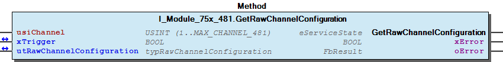
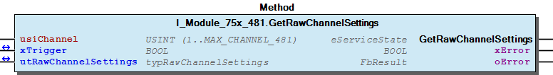
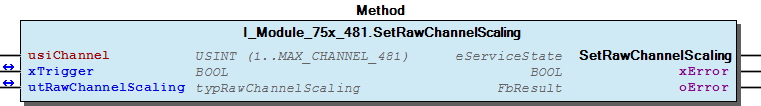
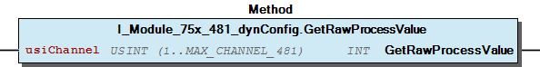

# WagoTypesModule_75x_481 v1.9.3.0 (WAGO) - Complete Documentation


## 📋 Library Information

- **Company:** WAGO
- **Title:** WagoTypesModule_75x_481
- **Version:** 1.9.3.0
- **Categories:** WAGO Internal|Common|Types and Interfaces
- **Author:** WAGO
- **Placeholder:** WagoTypesModule_75x_481

### Description ¶


This document is automatically generated. Because of this, the chapter 30 Visualization is not shown in this document. If you are interested in getting to know more about visualization, we refer to the library manager of e!Cockpit.

Handling modules 75x-481 [1]

This document is automatically generated. Because of this, the chapter 30 Visualization is not shown in this document. If you are interested in getting to know more about visualization, we refer to the library manager of e!Cockpit. Handling modules 75x-481 [1]

### Contents: ¶


Contents: - Documentation Index - Project Information - Library Information - Methods I_Module_75x_481.GetRawChannelCalibration (METH) - I_Module_75x_481.GetRawChannelConfiguration (METH) - I_Module_75x_481.GetRawChannelScaling (METH) - I_Module_75x_481.GetRawChannelSettings (METH) - I_Module_75x_481.SetRawChannelCalibration (METH) - I_Module_75x_481.SetRawChannelConfiguration (METH) - I_Module_75x_481.SetRawChannelScaling (METH) - I_Module_75x_481.SetRawChannelSettings (METH) - I_Module_75x_481_dynConfig.GetRawProcessValue (METH) - typRawChannelSettings (STRUCT) Interfaces - I_Module_75x_481 (ITF) - I_Module_75x_481_dynConfig (ITF) Program Organization Global Variable Lists - Channels_481 (GVL) - VersionHistory (GVL) Other Components - 10 Enumeration - 15 Datatypes - Channel - Configuration - ProcessValues - Raw - eNotchFilter (ENUM) - eSensorType (ENUM) - eWireMode (ENUM) - typRawChannelCalibration (STRUCT) - ... and 2 more

### Indices and tables ¶


| [1] | Based on WagoTypesModule_75x_481.library, last modified 13.08.2019, 19:40:33. The content of this file was automatically generated with None on 13.08.2019, 19:40:36 |

© WAGO Kontakttechnik GmbH & Co. KG, Germany 2018 – All rights reserved. For the avoidance of doubt, this copyright notice does not only apply to the information above but also and primarily to the described library itself. Please note that third-party products are always mentioned without reference to intellectual property rights, including patents, utility models, designs and trademarks, accordingly the existence of such rights cannot be excluded. WAGO is a registered trademark of WAGO Verwaltungsgesellschaft mbH.

- File and Project Information - Library Reference © WAGO Kontakttechnik GmbH & Co. KG, Germany 2018 – All rights reserved. For the avoidance of doubt, this copyright notice does not only apply to the information above but also and primarily to the described library itself. Please note that third-party products are always mentioned without reference to intellectual property rights, including patents, utility models, designs and trademarks, accordingly the existence of such rights cannot be excluded. WAGO is a registered trademark of WAGO Verwaltungsgesellschaft mbH.

### Documentation Index


## WagoTypesModule_75x_481 Library Documentation


| Company: | WAGO |
| Title: | WagoTypesModule_75x_481 |
| Version: | 1.9.3.0 |
| Categories: | WAGO Internal\|Common\|Types and Interfaces |
| Author: | WAGO |
| Placeholder: | WagoTypesModule_75x_481 |

### Description


This document is automatically generated. Because of this, the chapter 30 Visualization is not shown in this document. If you are interested in getting to know more about visualization, we refer to the library manager of e!Cockpit.

Handling modules 75x-481 [1]

This document is automatically generated. Because of this, the chapter 30 Visualization is not shown in this document. If you are interested in getting to know more about visualization, we refer to the library manager of e!Cockpit. Handling modules 75x-481 [1]

### Contents:


- 20 Program Organization Units 10 Enumeration - 15 Datatypes - Channels_481 (GVL) - I_Module_75x_481 (ITF) - I_Module_75x_481_dynConfig (ITF) VersionHistory (GVL)

### Indices and tables


| [1] | Based on WagoTypesModule_75x_481.library, last modified 13.08.2019, 19:40:33. The content of this file was automatically generated with None on 13.08.2019, 19:40:36 |

© WAGO Kontakttechnik GmbH & Co. KG, Germany 2018 – All rights reserved. For the avoidance of doubt, this copyright notice does not only apply to the information above but also and primarily to the described library itself. Please note that third-party products are always mentioned without reference to intellectual property rights, including patents, utility models, designs and trademarks, accordingly the existence of such rights cannot be excluded. WAGO is a registered trademark of WAGO Verwaltungsgesellschaft mbH.

- File and Project Information - Library Reference © WAGO Kontakttechnik GmbH & Co. KG, Germany 2018 – All rights reserved. For the avoidance of doubt, this copyright notice does not only apply to the information above but also and primarily to the described library itself. Please note that third-party products are always mentioned without reference to intellectual property rights, including patents, utility models, designs and trademarks, accordingly the existence of such rights cannot be excluded. WAGO is a registered trademark of WAGO Verwaltungsgesellschaft mbH.

### Project Information


## File and Project Information


| Scope | Name | Type | Content |
| --- | --- | --- | --- |
| FileHeader | libraryFile | string | WagoTypesModule_75x_481.library |
| contentFile | WagoTypesModule_75x_481_clr.json |
| productName | e!COCKPIT |
| creationDateTime | date | 13.08.2019, 19:40:36 |
| companyName | string | WAGO |
| ProjectInformation | LastModificationDateTime | date | 13.08.2019, 19:40:33 |
| Description | string | See: Description |
| DocFormat | reStructuredText |
| Author | WAGO |
| AutoResolveUnbound | bool | True |
| Placeholder | string | WagoTypesModule_75x_481 |
| Company | WAGO |
| Title | WagoTypesModule_75x_481 |
| Project | WagoTypesModule_75x_481 |
| Copyright | © WAGO Kontakttechnik GmbH & Co. KG, Germany 2018 – All rights reserved. |
| Version | version | 1.9.3.0 |
| Version string | string |  |
| LibraryCategories | library-category-list | WAGO Internal\|Common\|Types and Interfaces |

### Library Information


## Library Reference


| LinkAllContent: False QualifiedOnly: False | SystemLibrary: False | Optional: False |

| LinkAllContent: False QualifiedOnly: True | SystemLibrary: False | Optional: False |

| LinkAllContent: False QualifiedOnly: True | SystemLibrary: False | Optional: False |

This is a dictionary of all referenced libraries and their name spaces.

This is a dictionary of all referenced libraries and their name spaces. WagoSysErrorBase Library Identification : Placeholder: WagoSysErrorBase Default Resolution: WagoSysErrorBase, * (WAGO) Namespace: WagoSysErrorBase Library Properties : WagoSysVersion Library Identification : Name: WagoSysVersion Version: 1.0.0.0 Company: WAGO Namespace: WagoSysVersion Library Properties : WagoTypesModuleBase Library Identification : Placeholder: WagoTypesModuleBase Default Resolution: WagoTypesModuleBase, * (WAGO) Namespace: WagoTypesModuleBase Library Properties : Library Parameter : Parameter: MAX_MBX_SIZE = 18

### Methods


## I_Module_75x_481.GetRawChannelCalibration (METH)


| Scope | Name | Type |
| --- | --- | --- |
| Return | GetRawChannelCalibration | WagoTypesModuleBase.eServiceState |
| Input | usiChannel | USINT (1..MAX_CHANNEL_481) |
| Inout | xTrigger | BOOL |
| utRawChannelCalibration | typRawChannelCalibration |
| Output | xError | BOOL |
| oError | WagoSysErrorBase.FbResult |

| Struct member | Value | Description |
| --- | --- | --- |
| iCalibrationOffset | -32768 ... 32767 |  |
| uiCalibrationGain | 0 ... 65535 |  |
| iTwoWireOffset | -32768 ... 32767 |  |

```
VAR
    //--- Channel Calibration ---------------------------------
    utChannelCalibration    :   WagoTypesModule_75x_481.typRawChannelCalibration;
    xGetChannelCalibration  :   BOOL;
    oError                  :   WagoSysErrorBase.FbResult;
END_VAR

//--- C H A N N E L    C A L I B R A T I O N -----------------------
CASE my481.GetRawChannelCalibration(    usiChannel              := 1,
                                        xTrigger                := xGetChannelCalibration,
                                        utRawChannelCalibration := utChannelCalibration,
                                        oError                  => oError
                                    ) OF

    eServiceState.DONE : // OK
            ;// process here your utModuleSettings

    eServiceState.ABORT : // Error
            ;// process here your error handling -> see oError for more information

END_CASE
```

Get the calibration of a channel at a struct.

WagoTypesModule_75x_481.typRawChannelCalibration

Graphical Illustration

Graphical Interface of I_Module_75x_481.GetRawChannelCalibration

For get the calibration from channel one

You have to call the method cyclic until the method returns with DONE or ABORT.

Interface variables Function Get the calibration of a channel at a struct. WagoTypesModule_75x_481.typRawChannelCalibration Graphical Illustration  Graphical Interface of I_Module_75x_481.GetRawChannelCalibration Example For get the calibration from channel one Note You have to call the method cyclic until the method returns with DONE or ABORT.

## I_Module_75x_481.GetRawChannelConfiguration (METH)


| Scope | Name | Type |
| --- | --- | --- |
| Return | GetRawChannelConfiguration | WagoTypesModuleBase.eServiceState |
| Input | usiChannel | USINT (1..MAX_CHANNEL_481) |
| Inout | xTrigger | BOOL |
| utRawChannelConfiguration | typRawChannelConfiguration |
| Output | xError | BOOL |
| oError | WagoSysErrorBase.FbResult |

| Struct member | Value | Description |
| --- | --- | --- |
| Settings Scaling Calibration | eSensorType | Pt100 | -200 °C...850 °C |
| Ni100 | -60 °C...250 °C |
| Pt1000 | -200 °C...850 °C |
| Pt500 | -200 °C...850 °C |
| Pt200 | -200 °C...850 °C |
| Ni1000 | -60 °C...250 °C |
| Ni120 | -80 °C...260 °C |
| Poti_1K2 | Potentiometer 1.2 kΩ |
| Poti_5K | Potentiometer 5.0 kΩ |
| Resistor_1 | 10 Ω...5 kΩ |
| Resistor_2 | 10 Ω...1.2 kΩ |
| eWireMode | TWO_WIRE | 2-Wire Connection |
| THREE_WIRE | 3-Wire Connection |
| xEnableStatusBits | FALSE | Statusbits disabled |
| TRUE | Statusbits enabled |
| xEnableWatchdog | FALSE | Watchdog disabled |
| TRUE | Watchdog enabled |
| xAmountSignFormat | FALSE | Numeric values appear in two’s complement |
| TRUE | Numeric values appear in amount / sign format |
| eNotchFilter | ENABLED_25HZ | 25Hz -> 640ms |
| ENABLED_50HZ | 50Hz -> 320ms |
| ENABLED_60HZ | 60Hz -> 270ms |
| ENABLED_100HZ | 100Hz ->160ms |
| ENABLED_200HZ | 200Hz -> 80ms |
| ENABLED_400HZ | 400Hz -> 40ms |
| ENABLED_1000HZ | 1000Hz -> 16ms |
| xEnableOverrangeProtection | FALSE | Overrange Protection disabled |
| TRUE | Overrange Protection enabled |
| xUserScaling | FALSE | User scaling disabled -> use manufacturer scaling |
| TRUE | User scaling enabled |
| iUserScalingOffset | -32768 ... 32767 | User scaling Offset |
| uiUserScalingGain | 0 ... 65535 | User scaling Gain |
| iCalibrationOffset | -32768 ... 32767 |  |
| uiCalibrationGain | 0 ... 65535 |  |
| iTwoWireOffset | -32768 ... 32767 |  |

```
VAR
    //--- Channel Configuration ---------------------------------
    utRawChannelConfiguration   :   WagoTypesModule_75x_481.typRawChannelConfiguration;
    xGetRawChannelConfiguration :   BOOL;
    oError                      :   WagoSysErrorBase.FbResult;
END_VAR

//--- C H A N N E L    C O N F I G U R A T I O N -----------------------
CASE my481.GetRawChannelConfiguration(  usiChannel                  := 1,
                                        xTrigger                    := xGetRawChannelConfiguration,
                                        utRawChannelConfiguration   := utRawChannelConfiguration,
                                        oError                      => oError
                                    ) OF

    eServiceState.DONE : // OK
            ;// process here your utChannelConfiguration

    eServiceState.ABORT : // Error
            ;// process here your error handling -> see oError for more information

END_CASE
```

Get the complete raw configuration of a channel.

WagoTypesModule_75x_481.typRawChannelConfiguration

Graphical Illustration

Graphical Interface of I_Module_75x_481.GetRawChannelConfiguration

For get the configuration from channel one

You have to call the method cyclic until the method returns with DONE or ABORT.

Interface variables Function Get the complete raw configuration of a channel. WagoTypesModule_75x_481.typRawChannelConfiguration Graphical Illustration  Graphical Interface of I_Module_75x_481.GetRawChannelConfiguration Example For get the configuration from channel one Note You have to call the method cyclic until the method returns with DONE or ABORT.

## I_Module_75x_481.GetRawChannelScaling (METH)


| Scope | Name | Type |
| --- | --- | --- |
| Return | GetRawChannelScaling | WagoTypesModuleBase.eServiceState |
| Input | usiChannel | USINT (1..MAX_CHANNEL_481) |
| Inout | xTrigger | BOOL |
| utRawChannelScaling | typRawChannelScaling |
| Output | xError | BOOL |
| oError | WagoSysErrorBase.FbResult |

| Struct member | Value | Description |
| --- | --- | --- |
| xUserScaling | FALSE | User scaling disabled -> use manufacturer scaling |
| TRUE | User scaling enabled |
| iUserScalingOffset | -32768 ... 32767 | User scaling Offset |
| uiUserScalingGain | 0 ... 65535 | User scaling Gain |

```
VAR
    //--- Channel Settings ---------------------------------
    utChannelScaling    :   WagoTypesModule_75x_481.typRawChannelScaling;
    xGetChannelScaling  :   BOOL;
    oError              :   WagoSysErrorBase.FbResult;
END_VAR

//--- C H A N N E L   S C A L I N G ------------------------
CASE my481.GetRawChannelScaling(    usiChannel           := 1,
                                    xTrigger             := xGetChannelScaling,
                                    utRawChannelScaling  := utChannelScaling,
                                    oError               => oError
                                ) OF

    eServiceState.DONE : // OK
            ;// process here your utModuleSettings

    eServiceState.ABORT : // Error
            ;// process here your error handling -> see oError for more information

END_CASE
```

Get the scaling of a channel at a struct.

WagoTypesModule_75x_481.typRawChannelScaling

Graphical Illustration

Graphical Interface of I_Module_75x_481.GetRawChannelScaling

For get the scaling from channel one

You have to call the method cyclic until the method returns with DONE or ABORT.

Interface variables Function Get the scaling of a channel at a struct. WagoTypesModule_75x_481.typRawChannelScaling Graphical Illustration  Graphical Interface of I_Module_75x_481.GetRawChannelScaling Example For get the scaling from channel one Note You have to call the method cyclic until the method returns with DONE or ABORT.

## I_Module_75x_481.GetRawChannelSettings (METH)


| Scope | Name | Type |
| --- | --- | --- |
| Return | GetRawChannelSettings | WagoTypesModuleBase.eServiceState |
| Input | usiChannel | USINT (1..MAX_CHANNEL_481) |
| Inout | xTrigger | BOOL |
| utRawChannelSettings | typRawChannelSettings |
| Output | xError | BOOL |
| oError | WagoSysErrorBase.FbResult |

| Struct member | Value | Description |
| --- | --- | --- |
| eSensorType | Pt100 | -200 °C...850 °C |
| Ni100 | -60 °C...250 °C |
| Pt1000 | -200 °C...850 °C |
| Pt500 | -200 °C...850 °C |
| Pt200 | -200 °C...850 °C |
| Ni1000 | -60 °C...250 °C |
| Ni120 | -80 °C...260 °C |
| Poti_1K2 | Potentiometer 1.2 kΩ |
| Poti_5K | Potentiometer 5.0 kΩ |
| Resistor_1 | 10 Ω...5 kΩ |
| Resistor_2 | 10 Ω...1.2 kΩ |
| eWireMode | TWO_WIRE | 2-Wire Connection |
| THREE_WIRE | 3-Wire Connection |
| xEnableStatusBits | FALSE | Statusbits disabled |
| TRUE | Statusbits enabled |
| xEnableWatchdog | FALSE | Watchdog disabled |
| TRUE | Watchdog enabled |
| xAmountSignFormat | FALSE | Numeric values appear in two’s complement |
| TRUE | Numeric values appear in amount / sign format |
| eNotchFilter | ENABLED_25HZ | 25Hz -> 640ms |
| ENABLED_50HZ | 50Hz -> 320ms |
| ENABLED_60HZ | 60Hz -> 270ms |
| ENABLED_100HZ | 100Hz ->160ms |
| ENABLED_200HZ | 200Hz -> 80ms |
| ENABLED_400HZ | 400Hz -> 40ms |
| ENABLED_1000HZ | 1000Hz -> 16ms |
| xEnableOverrangeProtection | FALSE | Overrange Protection disabled |
| TRUE | Overrange Protection enabled |

```
VAR
    //--- Channel Settings ---------------------------------
    utChannelSettings   :   WagoTypesModule_75x_481.typRawChannelSettings;
    xGetChannelSettings :   BOOL;
    oError              :   WagoSysErrorBase.FbResult;
END_VAR

//--- C H A N N E L   S E T T I N G S ----------------------
CASE my481.GetRawChannelSettings(   usiChannel           := 1,
                                    xTrigger             := xGetChannelSettings,
                                    utRawChannelSettings := utChannelSettings,
                                    oError               => oError
                                ) OF

    eServiceState.DONE : // OK
        ;// process here your utModuleSettings

    eServiceState.ABORT : // Error
        ;// process here your error handling -> see oError for more information

END_CASE
```

Get the settings of a channel at a struct.

WagoTypesModule_75x_481.typRawChannelSettings

Graphical Illustration

Graphical Interface of I_Module_75x_481.GetRawChannelSettings

For get the settings from channel one

You have to call the method cyclic until the method returns with DONE or ABORT.

Interface variables Function Get the settings of a channel at a struct. WagoTypesModule_75x_481.typRawChannelSettings Graphical Illustration  Graphical Interface of I_Module_75x_481.GetRawChannelSettings Example For get the settings from channel one Note You have to call the method cyclic until the method returns with DONE or ABORT.

## I_Module_75x_481.SetRawChannelCalibration (METH)


| Scope | Name | Type |
| --- | --- | --- |
| Return | SetRawChannelCalibration | WagoTypesModuleBase.eServiceState |
| Input | usiChannel | USINT (1..MAX_CHANNEL_481) |
| Inout | xTrigger | BOOL |
| utRawChannelCalibration | typRawChannelCalibration |
| Output | xError | BOOL |
| oError | WagoSysErrorBase.FbResult |

| Struct member | Value | Description |
| --- | --- | --- |
| iCalibrationOffset | -32768 ... 32767 |  |
| uiCalibrationGain | 0 ... 65535 |  |
| iTwoWireOffset | -32768 ... 32767 |  |

```
VAR
    //--- Channel Calibration ---------------------------------
    utChannelCalibration    :   WagoTypesModule_75x_481.typRawChannelCalibration;
    xSetChannelCalibration  :   BOOL;
    oError                  :   WagoSysErrorBase.FbResult;
END_VAR

//--- C H A N N E L    C A L I B R A T I O N -----------------------
CASE my481.SetRawChannelCalibration(    usiChannel              := 1,
                                        xTrigger                := xSetChannelCalibration,
                                        utRawChannelCalibration := utChannelCalibration,
                                        oError                  => oError
                                   ) OF

    eServiceState.DONE : // OK
            ;// process here your utModuleSettings

    eServiceState.ABORT : // Error
            ;// process here your error handling -> see oError for more information

END_CASE
```

Set the calibration of a channel by a struct.

WagoTypesModule_75x_481.typRawChannelCalibration

Graphical Illustration

Graphical Interface of I_Module_75x_481.SetRawChannelCalibration

For set the calibration of channel one

You have to call the method cyclic until the method returns with DONE or ABORT.

Interface variables Function Set the calibration of a channel by a struct. WagoTypesModule_75x_481.typRawChannelCalibration Graphical Illustration  Graphical Interface of I_Module_75x_481.SetRawChannelCalibration Example For set the calibration of channel one Note You have to call the method cyclic until the method returns with DONE or ABORT.

## I_Module_75x_481.SetRawChannelConfiguration (METH)


| Scope | Name | Type |
| --- | --- | --- |
| Return | SetRawChannelConfiguration | WagoTypesModuleBase.eServiceState |
| Input | usiChannel | USINT (1..MAX_CHANNEL_481) |
| Inout | xTrigger | BOOL |
| utRawChannelConfiguration | typRawChannelConfiguration |
| Output | xError | BOOL |
| oError | WagoSysErrorBase.FbResult |

| Struct member | Value | Description |
| --- | --- | --- |
| Settings Scaling Calibration | eSensorType | Pt100 | -200 °C...850 °C |
| Ni100 | -60 °C...250 °C |
| Pt1000 | -200 °C...850 °C |
| Pt500 | -200 °C...850 °C |
| Pt200 | -200 °C...850 °C |
| Ni1000 | -60 °C...250 °C |
| Ni120 | -80 °C...260 °C |
| Poti_1K2 | Potentiometer 1.2 kΩ |
| Poti_5K | Potentiometer 5.0 kΩ |
| Resistor_1 | 10 Ω...5 kΩ |
| Resistor_2 | 10 Ω...1.2 kΩ |
| eWireMode | TWO_WIRE | 2-Wire Connection |
| THREE_WIRE | 3-Wire Connection |
| xEnableStatusBits | FALSE | Statusbits disabled |
| TRUE | Statusbits enabled |
| xEnableWatchdog | FALSE | Watchdog disabled |
| TRUE | Watchdog enabled |
| xAmountSignFormat | FALSE | Numeric values appear in two’s complement |
| TRUE | Numeric values appear in amount / sign format |
| eNotchFilter | ENABLED_25HZ | 25Hz -> 640ms |
| ENABLED_50HZ | 50Hz -> 320ms |
| ENABLED_60HZ | 60Hz -> 270ms |
| ENABLED_100HZ | 100Hz ->160ms |
| ENABLED_200HZ | 200Hz -> 80ms |
| ENABLED_400HZ | 400Hz -> 40ms |
| ENABLED_1000HZ | 1000Hz -> 16ms |
| xEnableOverrangeProtection | FALSE | Overrange Protection disabled |
| TRUE | Overrange Protection enabled |
| xUserScaling | FALSE | User scaling disabled -> use manufacturer scaling |
| TRUE | User scaling enabled |
| iUserScalingOffset | -32768 ... 32767 | User scaling Offset |
| uiUserScalingGain | 0 ... 65535 | User scaling Gain |
| iCalibrationOffset | -32768 ... 32767 |  |
| uiCalibrationGain | 0 ... 65535 |  |
| iTwoWireOffset | -32768 ... 32767 |  |

```
VAR
    //--- Channel Configuration -------------------------------------------------------
    xStartProcess               :   BOOL; // set this variable once to start the process -> this varibale will be automatic reset
    utRawChannelConfiguration   :   WagoTypesModule_75x_481.typRawChannelConfiguration;
    oError                      :   WagoSysErrorBase.FbResult;
    xSetRawChannelConfiguration :   BOOL;
END_VAR

//--- C H A N N E L    C O N F I G U R A T I O N -----------------------
//--- READ BEFORE WRITE --------------------------------------------------------------
CASE my481.GetRawChannelConfiguration( 1, xStartProcess, utRawChannelConfiguration, oError => oError) OF

    eServiceState.DONE : // OK -> actual configuration is successful read
        // change here your configuration
        // utRawChannelConfiguration... :=
        xSetRawChannelConfiguration := TRUE; // trigger write

    eServiceState.ABORT : // Error -> not able to read -> see oError
            ;// process here your error handling for read -> see oError for more information

END_CASE

//--- WRITE MODYFIED CONFIGURATION ---------------------------------------------------
CASE my481.SetRawChannelConfiguration( 1, xSetRawChannelConfiguration, utRawChannelConfiguration, oError => oError) OF

    eServiceState.DONE : // OK -> new configuration is written

    eServiceState.ABORT : // Error -> not able to write -> see oError
            ;// process here your error handling for write -> see oError for more information

END_CASE
```

Set the complete raw configuration of a channel.

WagoTypesModule_75x_481.typRawChannelConfiguration

Graphical Illustration

Graphical Interface of I_Module_75x_481.SetRawChannelConfiguration

For get the configuration from channel one and after read write the configuration

You have to call the method cyclic until the method returns with DONE or ABORT.

Interface variables Function Set the complete raw configuration of a channel. WagoTypesModule_75x_481.typRawChannelConfiguration Graphical Illustration  Graphical Interface of I_Module_75x_481.SetRawChannelConfiguration Example For get the configuration from channel one and after read write the configuration Note You have to call the method cyclic until the method returns with DONE or ABORT.

## I_Module_75x_481.SetRawChannelScaling (METH)


| Scope | Name | Type |
| --- | --- | --- |
| Return | SetRawChannelScaling | WagoTypesModuleBase.eServiceState |
| Input | usiChannel | USINT (1..MAX_CHANNEL_481) |
| Inout | xTrigger | BOOL |
| utRawChannelScaling | typRawChannelScaling |
| Output | xError | BOOL |
| oError | WagoSysErrorBase.FbResult |

| Struct member | Value | Description |
| --- | --- | --- |
| xUserScaling | FALSE | User scaling disabled -> use manufacturer scaling |
| TRUE | User scaling enabled |
| iUserScalingOffset | -32768 ... 32767 | User scaling Offset |
| uiUserScalingGain | 0 ... 65535 | User scaling Gain |

```
VAR
    //--- Channel Settings ---------------------------------
    utChannelScaling    :   WagoTypesModule_75x_481.typRawChannelScaling;
    xSetChannelScaling  :   BOOL;
    oError              :   WagoSysErrorBase.FbResult;
END_VAR

//--- C H A N N E L   S C A L I N G ------------------------
CASE my481.SetRawChannelScaling(    usiChannel          := 1,
                                    xTrigger            := xSetChannelScaling,
                                    utRawChannelScaling := utChannelScaling,
                                    oError              => oError
                                ) OF

    eServiceState.DONE : // OK
            ;// process here your utModuleSettings

    eServiceState.ABORT : // Error
            ;// process here your error handling -> see oError for more information

END_CASE
```

Set the scaling of a channel by a struct.

WagoTypesModule_75x_481.typRawChannelScaling

Graphical Illustration

Graphical Interface of I_Module_75x_481.SetRawChannelScaling

For set the scaling of channel one

You have to call the method cyclic until the method returns with DONE or ABORT.

Interface variables Function Set the scaling of a channel by a struct. WagoTypesModule_75x_481.typRawChannelScaling Graphical Illustration  Graphical Interface of I_Module_75x_481.SetRawChannelScaling Example For set the scaling of channel one Note You have to call the method cyclic until the method returns with DONE or ABORT.

## I_Module_75x_481.SetRawChannelSettings (METH)


| Scope | Name | Type |
| --- | --- | --- |
| Return | SetRawChannelSettings | WagoTypesModuleBase.eServiceState |
| Input | usiChannel | USINT (1..MAX_CHANNEL_481) |
| Inout | xTrigger | BOOL |
| utRawChannelSettings | typRawChannelSettings |
| Output | xError | BOOL |
| oError | WagoSysErrorBase.FbResult |

| Struct member | Value | Description |
| --- | --- | --- |
| eSensorType | Pt100 | -200 °C...850 °C |
| Ni100 | -60 °C...250 °C |
| Pt1000 | -200 °C...850 °C |
| Pt500 | -200 °C...850 °C |
| Pt200 | -200 °C...850 °C |
| Ni1000 | -60 °C...250 °C |
| Ni120 | -80 °C...260 °C |
| Poti_1K2 | Potentiometer 1.2 kΩ |
| Poti_5K | Potentiometer 5.0 kΩ |
| Resistor_1 | 10 Ω...5 kΩ |
| Resistor_2 | 10 Ω...1.2 kΩ |
| eWireMode | TWO_WIRE | 2-Wire Connection |
| THREE_WIRE | 3-Wire Connection |
| xEnableStatusBits | FALSE | Statusbits disabled |
| TRUE | Statusbits enabled |
| xEnableWatchdog | FALSE | Watchdog disabled |
| TRUE | Watchdog enabled |
| xAmountSignFormat | FALSE | Numeric values appear in two’s complement |
| TRUE | Numeric values appear in amount / sign format |
| eNotchFilter | ENABLED_25HZ | 25Hz -> 640ms |
| ENABLED_50HZ | 50Hz -> 320ms |
| ENABLED_60HZ | 60Hz -> 270ms |
| ENABLED_100HZ | 100Hz ->160ms |
| ENABLED_200HZ | 200Hz -> 80ms |
| ENABLED_400HZ | 400Hz -> 40ms |
| ENABLED_1000HZ | 1000Hz -> 16ms |
| xEnableOverrangeProtection | FALSE | Overrange Protection disabled |
| TRUE | Overrange Protection enabled |

```
VAR
    //--- Channel Settings ---------------------------------
    utChannelSettings   :   WagoTypesModule_75x_481.typRawChannelSettings;
    xSetChannelSettings :   BOOL;
    oError              :   WagoSysErrorBase.FbResult;
END_VAR

//--- C H A N N E L   S E T T I N G S ----------------------
CASE my481.SetRawChannelSettings(   usiChannel           := 1,
                                    xTrigger             := xSetChannelSettings,
                                    utRawChannelSettings := utChannelSettings,
                                    oError               => oError
                                ) OF

    eServiceState.DONE : // OK
        ;// process here your utModuleSettings

    eServiceState.ABORT : // Error
        ;// process here your error handling -> see oError for more information

END_CASE
```

Set the settings for a channel by a struct.

WagoTypesModule_75x_481.typRawChannelSettings

Graphical Illustration

Graphical Interface of I_Module_75x_481.SetRawChannelSettings

For set the settings of channel one

You have to call the method cyclic until the method returns with DONE or ABORT.

Interface variables Function Set the settings for a channel by a struct. WagoTypesModule_75x_481.typRawChannelSettings Graphical Illustration  Graphical Interface of I_Module_75x_481.SetRawChannelSettings Example For set the settings of channel one Note You have to call the method cyclic until the method returns with DONE or ABORT.

## I_Module_75x_481_dynConfig.GetRawProcessValue (METH)


| Scope | Name | Type |
| --- | --- | --- |
| Return | GetRawProcessValue | INT |
| Input | usiChannel | USINT (1..MAX_CHANNEL_481) |

```
VAR
    myiRawProcessValue  :   INT;
END_VAR

myiRawProcessValue := my451.GetRawProcessValue(1); // here is the process raw value as INT
```

Get the raw process value of the wanted channel. The return value is unscaled in the range -32768 .. 37767.

In case of error (e.g. an invalid channel number is given) it returns 0.

Graphical Illustration

Graphical Interface of I_Module_75x_481_dynConfig.GetRawProcessValue

Interface variables Function Get the raw process value of the wanted channel. The return value is unscaled in the range -32768 .. 37767. In case of error (e.g. an invalid channel number is given) it returns 0. Graphical Illustration  Graphical Interface of I_Module_75x_481_dynConfig.GetRawProcessValue Example For get the raw process value from first channel of the module.

## typRawChannelSettings (STRUCT)


| Name | Type | Comment |
| --- | --- | --- |
| eSensorType | eSensorType | R32.12 .. R32.15 |
| eWireMode | eWireMode | R32.10 |
| xEnableStatusBits | BOOL | R32.4 |
| xEnableWatchdog | BOOL | R32.2 |
| xAmountSignFormat | BOOL | R32.3 |
| eNotchFilter | eNotchFilter | R37 |
| xEnableOverrangeProtection | BOOL | R32.8 |

| Struct member | Value | Description |
| --- | --- | --- |
| eSensorType | Pt100 | -200 °C...850 °C |
| Ni100 | -60 °C...250 °C |
| Pt1000 | -200 °C...850 °C |
| Pt500 | -200 °C...850 °C |
| Pt200 | -200 °C...850 °C |
| Ni1000 | -60 °C...250 °C |
| Ni120 | -80 °C...260 °C |
| Poti_1K2 | Potentiometer 1.2 kΩ |
| Poti_5K | Potentiometer 5.0 kΩ |
| Resistor_1 | 10 Ω...5 kΩ |
| Resistor_2 | 10 Ω...1.2 kΩ |
| eWireMode | TWO_WIRE | 2-Wire Connection |
| THREE_WIRE | 3-Wire Connection |
| xEnableStatusBits | FALSE | Statusbits disabled |
| TRUE | Statusbits enabled |
| xEnableWatchdog | FALSE | Watchdog disabled |
| TRUE | Watchdog enabled |
| xAmountSignFormat | FALSE | Numeric values appear in two’s complement |
| TRUE | Numeric values appear in amount / sign format |
| eNotchFilter | ENABLED_25HZ | 25Hz -> 640ms |
| ENABLED_50HZ | 50Hz -> 320ms |
| ENABLED_60HZ | 60Hz -> 270ms |
| ENABLED_100HZ | 100Hz ->160ms |
| ENABLED_200HZ | 200Hz -> 80ms |
| ENABLED_400HZ | 400Hz -> 40ms |
| ENABLED_1000HZ | 1000Hz -> 16ms |
| xEnableOverrangeProtection | FALSE | Overrange Protection disabled |
| TRUE | Overrange Protection enabled |

### Interfaces


## I_Module_75x_481 (ITF)


- Channel I_Module_75x_481.GetRawChannelCalibration (METH) - I_Module_75x_481.GetRawChannelScaling (METH) - I_Module_75x_481.GetRawChannelSettings (METH) - I_Module_75x_481.SetRawChannelCalibration (METH) - I_Module_75x_481.SetRawChannelScaling (METH) - I_Module_75x_481.SetRawChannelSettings (METH) Configuration - I_Module_75x_481.GetRawChannelConfiguration (METH) - I_Module_75x_481.SetRawChannelConfiguration (METH)

## I_Module_75x_481_dynConfig (ITF)


- ProcessValues I_Module_75x_481_dynConfig.GetRawProcessValue (METH)

### Program Organization


## 20 Program Organization Units


- 10 Enumeration eNotchFilter (ENUM) - eSensorType (ENUM) - eWireMode (ENUM) 15 Datatypes - Raw typRawChannelCalibration (STRUCT) - typRawChannelScaling (STRUCT) - typRawChannelSettings (STRUCT) typRawChannelConfiguration (STRUCT) Channels_481 (GVL) I_Module_75x_481 (ITF) - Channel I_Module_75x_481.GetRawChannelCalibration (METH) - I_Module_75x_481.GetRawChannelScaling (METH) - I_Module_75x_481.GetRawChannelSettings (METH) - I_Module_75x_481.SetRawChannelCalibration (METH) - I_Module_75x_481.SetRawChannelScaling (METH) - I_Module_75x_481.SetRawChannelSettings (METH) Configuration - I_Module_75x_481.GetRawChannelConfiguration (METH) - I_Module_75x_481.SetRawChannelConfiguration (METH) I_Module_75x_481_dynConfig (ITF) - ProcessValues I_Module_75x_481_dynConfig.GetRawProcessValue (METH)

### Global Variable Lists


## Channels_481 (GVL)


| Scope | Name | Type | Initial | Comment |
| --- | --- | --- | --- | --- |
| Constant | MAX_CHANNEL_481 | USINT | 2 | max. channels for 75x-481 |

## VersionHistory (GVL)


| Name | Type |
| --- | --- |
| Info | ProjectInfo |

| date | version | author | change |
| 16.07.2019 | 1.9.3.0 | u010545 | Interface for dyn config added |
| 08.01.2019 | 1.9.1.0 | u015842 | Properties: free placeholder added |
| 21.02.2018 | 1.9.0.1 | u010545 | update documentation |
| 17.10.2017 | 1.9.0.0 | u010545 | first release |
| 05.10.2017 | 0.0.0.1 | u010545 | init |

WagoTypesModule_75x_481.library

Release Notes:

WagoTypesModule_75x_481.library Release Notes:

### Other Components


## 10 Enumeration


- eNotchFilter (ENUM) - eSensorType (ENUM) - eWireMode (ENUM)

## 15 Datatypes


- Raw typRawChannelCalibration (STRUCT) - typRawChannelScaling (STRUCT) - typRawChannelSettings (STRUCT) typRawChannelConfiguration (STRUCT)

## Channel


- I_Module_75x_481.GetRawChannelCalibration (METH) - I_Module_75x_481.GetRawChannelScaling (METH) - I_Module_75x_481.GetRawChannelSettings (METH) - I_Module_75x_481.SetRawChannelCalibration (METH) - I_Module_75x_481.SetRawChannelScaling (METH) - I_Module_75x_481.SetRawChannelSettings (METH)

## Configuration


- I_Module_75x_481.GetRawChannelConfiguration (METH) - I_Module_75x_481.SetRawChannelConfiguration (METH)

## ProcessValues


- I_Module_75x_481_dynConfig.GetRawProcessValue (METH)

## Raw


- typRawChannelCalibration (STRUCT) - typRawChannelScaling (STRUCT) - typRawChannelSettings (STRUCT)

## eNotchFilter (ENUM)


| Name | Initial | Comment |
| --- | --- | --- |
| ENABLED_25HZ | 1 | 25 Hz / 640 ms |
| ENABLED_50HZ | 2 | 50 Hz / 320 ms |
| ENABLED_60HZ | 3 | 60 Hz / 270 ms |
| ENABLED_100HZ | 4 | 100 Hz / 160 ms |
| ENABLED_200HZ | 5 | 200 Hz / 80 ms |
| ENABLED_400HZ | 6 | 400 Hz / 40 ms |
| ENABLED_1000HZ | 7 | 1000 Hz / 16 ms |

## eSensorType (ENUM)


| Name | Initial | Comment |
| --- | --- | --- |
| Pt100 | 0 | -200 °C ... 850 °C |
| Ni100 | 1 | 60 °C ... 250 °C |
| Pt1000 | 2 | -200 °C ... 850 °C |
| Pt500 | 3 | -200 °C ... 850 °C |
| Pt200 | 4 | -200 °C ... 850 °C |
| Ni1000 | 5 | 60 °C ... 250 °C |
| Ni120 | 6 | 80 °C ... 260 °C |
| Poti_1K2 | 12 | Potentiometer 1.2 kΩ |
| Poti_5K | 13 | Potentiometer 5.0 kΩ |
| Resistor_1 | 14 | Resistor -> 10 Ω ... 5.0 kΩ |
| Resistor_2 | 15 | Resistor -> 10 Ω ... 1.2 kΩ |

| Name | Initial | Sensor type | Measuring range |
| --- | --- | --- | --- |
| Pt100 | 0 | Pt100 | -200 °C ... 850 °C |
| Ni100 | 1 | Ni100 | -60 °C ... 250 °C |
| Pt1000 | 2 | Pt1000 | -200 °C ... 850 °C |
| Pt500 | 3 | Pt500 | -200 °C ... 850 °C |
| Pt200 | 4 | Pt200 | -200 °C ... 850 °C |
| Ni1000 | 5 | Ni1000 | -60 °C ... 250 °C |
| Ni120 | 6 | Ni120 | -80 °C ... 260 °C |
| Poti_1K2 | 12 | Potentiometer | 1.2 kΩ |
| Poti_5K | 13 | Potentiometer | 5.0 kΩ |
| Resistor_1 | 14 | Resistor | 10 Ω ... 5.0 kΩ |
| Resistor_2 | 15 | Resistor | 10 Ω ... 1.2 kΩ |

## eWireMode (ENUM)


| Name | Initial | Comment |
| --- | --- | --- |
| THREE_WIRE | 0 | 3-Wire Connection |
| TWO_WIRE | 1 | 2-Wire Connection |

## typRawChannelCalibration (STRUCT)


| Name | Type | Comment |
| --- | --- | --- |
| uiCalibrationGain | UINT | (Reg 18) |
| iCalibrationOffset | INT | (Reg 17) |
| iTwoWireOffset | INT | (Reg 21) |

| Struct member | Value | Description |
| --- | --- | --- |
| iCalibrationOffset | -32768 ... 32767 |  |
| uiCalibrationGain | 0 ... 65535 |  |
| iTwoWireOffset | -32768 ... 32767 |  |

## typRawChannelConfiguration (STRUCT)


| Name | Type |
| --- | --- |
| Settings | typRawChannelSettings |
| Scaling | typRawChannelScaling |
| Calibration | typRawChannelCalibration |

| Struct member | Value | Description |
| --- | --- | --- |
| Settings Scaling Calibration | eSensorType | Pt100 | -200 °C...850 °C |
| Ni100 | -60 °C...250 °C |
| Pt1000 | -200 °C...850 °C |
| Pt500 | -200 °C...850 °C |
| Pt200 | -200 °C...850 °C |
| Ni1000 | -60 °C...250 °C |
| Ni120 | -80 °C...260 °C |
| Poti_1K2 | Potentiometer 1.2 kΩ |
| Poti_5K | Potentiometer 5.0 kΩ |
| Resistor_1 | 10 Ω...5 kΩ |
| Resistor_2 | 10 Ω...1.2 kΩ |
| eWireMode | TWO_WIRE | 2-Wire Connection |
| THREE_WIRE | 3-Wire Connection |
| xEnableStatusBits | FALSE | Statusbits disabled |
| TRUE | Statusbits enabled |
| xEnableWatchdog | FALSE | Watchdog disabled |
| TRUE | Watchdog enabled |
| xAmountSignFormat | FALSE | Numeric values appear in two’s complement |
| TRUE | Numeric values appear in amount / sign format |
| eNotchFilter | ENABLED_25HZ | 25Hz -> 640ms |
| ENABLED_50HZ | 50Hz -> 320ms |
| ENABLED_60HZ | 60Hz -> 270ms |
| ENABLED_100HZ | 100Hz ->160ms |
| ENABLED_200HZ | 200Hz -> 80ms |
| ENABLED_400HZ | 400Hz -> 40ms |
| ENABLED_1000HZ | 1000Hz -> 16ms |
| xEnableOverrangeProtection | FALSE | Overrange Protection disabled |
| TRUE | Overrange Protection enabled |
| xUserScaling | FALSE | User scaling disabled -> use manufacturer scaling |
| TRUE | User scaling enabled |
| iUserScalingOffset | -32768 ... 32767 | User scaling Offset |
| uiUserScalingGain | 0 ... 65535 | User scaling Gain |
| iCalibrationOffset | -32768 ... 32767 |  |
| uiCalibrationGain | 0 ... 65535 |  |
| iTwoWireOffset | -32768 ... 32767 |  |

typRawChannelConfiguration

InOut: typRawChannelConfiguration

## typRawChannelScaling (STRUCT)


| Name | Type | Comment |
| --- | --- | --- |
| xUserScaling | BOOL | R32.0 / R32.1 |
| iUserScalingOffset | INT | R33 |
| iUserScalingGain | INT | R34 |

| Struct member | Value | Description |
| --- | --- | --- |
| xUserScaling | FALSE | User scaling disabled -> use manufacturer scaling |
| TRUE | User scaling enabled |
| iUserScalingOffset | -32768 ... 32767 | User scaling Offset |
| uiUserScalingGain | 0 ... 65535 | User scaling Gain |