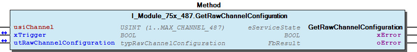
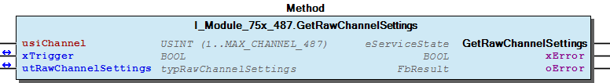
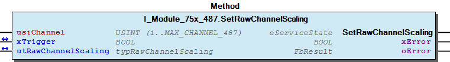
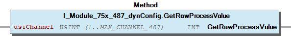

# WagoTypesModule_75x_487 v1.9.3.0 (WAGO) - Complete Documentation


## 📋 Library Information

- **Company:** WAGO
- **Title:** WagoTypesModule_75x_487
- **Version:** 1.9.3.0
- **Categories:** WAGO Internal|Common|Types and Interfaces
- **Author:** WAGO
- **Placeholder:** WagoTypesModule_75x_487

### Description ¶


This document is automatically generated. Because of this, the chapter 30 Visualization is not shown in this document. If you are interested in getting to know more about visualization, we refer to the library manager of e!Cockpit.

Handling modules 750-487 [1]

This document is automatically generated. Because of this, the chapter 30 Visualization is not shown in this document. If you are interested in getting to know more about visualization, we refer to the library manager of e!Cockpit. Handling modules 750-487 [1]

### Contents: ¶


Contents: - Documentation Index - Project Information - Library Information - Methods I_Module_75x_487.GetRawChannelConfiguration (METH) - I_Module_75x_487.GetRawChannelScaling (METH) - I_Module_75x_487.GetRawChannelSettings (METH) - I_Module_75x_487.SetRawChannelConfiguration (METH) - I_Module_75x_487.SetRawChannelScaling (METH) - I_Module_75x_487.SetRawChannelSettings (METH) - I_Module_75x_487_dynConfig.GetRawProcessValue (METH) - typRawChannelSettings (STRUCT) Interfaces - I_Module_75x_487 (ITF) - I_Module_75x_487_dynConfig (ITF) Program Organization Global Variable Lists - Channels_487 (GVL) - VersionHistory (GVL) Other Components - 10 Enumeration - 15 Datatypes - Channel - Configuration - Raw - eNotchFilter (ENUM) - eSensorType (ENUM) - typRawChannelConfiguration (STRUCT) - typRawChannelScaling (STRUCT)

### Indices and tables ¶


| [1] | Based on WagoTypesModule_75x_487.library, last modified 13.08.2019, 19:43:33. The content of this file was automatically generated with None on 13.08.2019, 19:43:35 |

© WAGO Kontakttechnik GmbH & Co. KG, Germany 2018 – All rights reserved. For the avoidance of doubt, this copyright notice does not only apply to the information above but also and primarily to the described library itself. Please note that third-party products are always mentioned without reference to intellectual property rights, including patents, utility models, designs and trademarks, accordingly the existence of such rights cannot be excluded. WAGO is a registered trademark of WAGO Verwaltungsgesellschaft mbH.

- File and Project Information - Library Reference © WAGO Kontakttechnik GmbH & Co. KG, Germany 2018 – All rights reserved. For the avoidance of doubt, this copyright notice does not only apply to the information above but also and primarily to the described library itself. Please note that third-party products are always mentioned without reference to intellectual property rights, including patents, utility models, designs and trademarks, accordingly the existence of such rights cannot be excluded. WAGO is a registered trademark of WAGO Verwaltungsgesellschaft mbH.

### Documentation Index


## WagoTypesModule_75x_487 Library Documentation


| Company: | WAGO |
| Title: | WagoTypesModule_75x_487 |
| Version: | 1.9.3.0 |
| Categories: | WAGO Internal\|Common\|Types and Interfaces |
| Author: | WAGO |
| Placeholder: | WagoTypesModule_75x_487 |

### Description


This document is automatically generated. Because of this, the chapter 30 Visualization is not shown in this document. If you are interested in getting to know more about visualization, we refer to the library manager of e!Cockpit.

Handling modules 750-487 [1]

This document is automatically generated. Because of this, the chapter 30 Visualization is not shown in this document. If you are interested in getting to know more about visualization, we refer to the library manager of e!Cockpit. Handling modules 750-487 [1]

### Contents:


- 20 Program Organization Units 10 Enumeration - 15 Datatypes - Channels_487 (GVL) - I_Module_75x_487 (ITF) - I_Module_75x_487_dynConfig (ITF) VersionHistory (GVL)

### Indices and tables


| [1] | Based on WagoTypesModule_75x_487.library, last modified 13.08.2019, 19:43:33. The content of this file was automatically generated with None on 13.08.2019, 19:43:35 |

© WAGO Kontakttechnik GmbH & Co. KG, Germany 2018 – All rights reserved. For the avoidance of doubt, this copyright notice does not only apply to the information above but also and primarily to the described library itself. Please note that third-party products are always mentioned without reference to intellectual property rights, including patents, utility models, designs and trademarks, accordingly the existence of such rights cannot be excluded. WAGO is a registered trademark of WAGO Verwaltungsgesellschaft mbH.

- File and Project Information - Library Reference © WAGO Kontakttechnik GmbH & Co. KG, Germany 2018 – All rights reserved. For the avoidance of doubt, this copyright notice does not only apply to the information above but also and primarily to the described library itself. Please note that third-party products are always mentioned without reference to intellectual property rights, including patents, utility models, designs and trademarks, accordingly the existence of such rights cannot be excluded. WAGO is a registered trademark of WAGO Verwaltungsgesellschaft mbH.

### Project Information


## File and Project Information


| Scope | Name | Type | Content |
| --- | --- | --- | --- |
| FileHeader | libraryFile | string | WagoTypesModule_75x_487.library |
| contentFile | WagoTypesModule_75x_487_clr.json |
| productName | e!COCKPIT |
| creationDateTime | date | 13.08.2019, 19:43:35 |
| companyName | string | WAGO |
| ProjectInformation | LastModificationDateTime | date | 13.08.2019, 19:43:33 |
| Description | string | See: Description |
| DocFormat | reStructuredText |
| Author | WAGO |
| AutoResolveUnbound | bool | True |
| Placeholder | string | WagoTypesModule_75x_487 |
| Company | WAGO |
| Title | WagoTypesModule_75x_487 |
| Project | WagoTypesModule_75x_487 |
| Copyright | © WAGO Kontakttechnik GmbH & Co. KG, Germany 2018 – All rights reserved. |
| Version | version | 1.9.3.0 |
| Version string | string |  |
| LibraryCategories | library-category-list | WAGO Internal\|Common\|Types and Interfaces |

### Library Information


## Library Reference


| LinkAllContent: False QualifiedOnly: False | SystemLibrary: False | Optional: False |

| LinkAllContent: False QualifiedOnly: True | SystemLibrary: False | Optional: False |

| LinkAllContent: False QualifiedOnly: True | SystemLibrary: False | Optional: False |

This is a dictionary of all referenced libraries and their name spaces.

This is a dictionary of all referenced libraries and their name spaces. WagoSysErrorBase Library Identification : Placeholder: WagoSysErrorBase Default Resolution: WagoSysErrorBase, * (WAGO) Namespace: WagoSysErrorBase Library Properties : WagoSysVersion Library Identification : Name: WagoSysVersion Version: 1.0.0.0 Company: WAGO Namespace: WagoSysVersion Library Properties : WagoTypesModuleBase Library Identification : Placeholder: WagoTypesModuleBase Default Resolution: WagoTypesModuleBase, * (WAGO) Namespace: WagoTypesModuleBase Library Properties : Library Parameter : Parameter: MAX_MBX_SIZE = 18

### Methods


## I_Module_75x_487.GetRawChannelConfiguration (METH)


| Scope | Name | Type |
| --- | --- | --- |
| Return | GetRawChannelConfiguration | WagoTypesModuleBase.eServiceState |
| Input | usiChannel | USINT (1..MAX_CHANNEL_487) |
| Inout | xTrigger | BOOL |
| utRawChannelConfiguration | typRawChannelConfiguration |
| Output | xError | BOOL |
| oError | WagoSysErrorBase.FbResult |

| Struct member | Value | Description |
| --- | --- | --- |
| Settings | eSensorType | TC_Typ_L | -25 °C...900 °C |
| TC_Typ_K | -100 °C...1370 °C |
| TC_Typ_J | -100 °C...1200 °C |
| TC_Typ_E | -100 °C...1000 °C |
| TC_Typ_T | -100 °C...400 °C |
| TC_Typ_N | -100 °C...1300 °C |
| TC_Typ_U | -25 °C...600 °C |
| TC_Typ_B | 600 °C...1800 °C |
| TC_Typ_R | 0 °C...1700 °C |
| TC_Typ_S | 0 °C...1700 °C |
| PlusMinus_30mV | +/- 30mV |
| PlusMinus_60mV | +/- 60mV |
| PlusMinus_120mV | +/- 120mV |
| eNotchFilter | ENABLED_25HZ | 25Hz -> 640ms |
| ENABLED_50HZ | 50Hz -> 320ms |
| ENABLED_100HZ | 100Hz -> 160ms |
| ENABLED_200HZ | 200Hz -> 80ms |
| xEnableCheckLowerRange | FALSE | State bit 0 is not set on measuring value underrange |
| TRUE | State bit 0 is set on measuring value underrange |
| xEnableStatusBits | FALSE | State bits are not mapped |
| TRUE | State bits are mapped to the lower three bits of the output value: |
| xEnableWatchdog | FALSE | Watchdog disabled |
| TRUE | Watchdog enabled |
| xAmountSignFormat | FALSE | Numeric values appear in two’s complement |
| TRUE | Numeric values appear in amount / sign format |
| xEnableColdJunctionComp | FALSE | Cold junction compensation not active |
| TRUE | Cold junction compensation active |
| xEnableWireBreakDetection | FALSE | CWire break detection not active |
| TRUE | Wire break detection active |
| Scaling | xManufacturerScaling | FALSE | Manufacturer Scaling disabled |
| TRUE | Manufacturer Scaling enabled |
| xUserScaling | FALSE | User Scaling disabled |
| TRUE | User Scaling enabled |
| iUserScalingOffset | -32768 ... 32767 | User Scaling Offset |
| iUserScalingGain | -32768 ... 32767 | User Scaling Gain |

```
VAR
    //--- Channel Configuration ---------------------------------
    utRawChannelConfiguration   :   WagoTypesModule_75x_487.typRawChannelConfiguration;
    xGetRawChannelConfiguration :   BOOL;
    oError                      :   WagoSysErrorBase.FbResult;
END_VAR

//--- C H A N N E L    C O N F I G U R A T I O N -----------------------
CASE my487.GetRawChannelConfiguration(  usiChannel                  := 1,
                                        xTrigger                    := xGetRawChannelConfiguration,
                                        utRawChannelConfiguration   := utRawChannelConfiguration,
                                        oError                      => oError
                                    ) OF

    eServiceState.DONE : // OK
            ;// process here your utChannelConfiguration

    eServiceState.ABORT : // Error
            ;// process here your error handling -> see oError for more information

END_CASE
```

Get the complete raw configuration of a channel.

WagoTypesModule_75x_487.typRawChannelConfiguration

Graphical Illustration

Graphical Interface of I_Module_75x_487.GetRawChannelConfiguration

For get the configuration from channel one

You have to call the method cyclic until the method returns with DONE or ABORT.

Interface variables Function Get the complete raw configuration of a channel. WagoTypesModule_75x_487.typRawChannelConfiguration Graphical Illustration  Graphical Interface of I_Module_75x_487.GetRawChannelConfiguration Example For get the configuration from channel one Note You have to call the method cyclic until the method returns with DONE or ABORT.

## I_Module_75x_487.GetRawChannelScaling (METH)


| Scope | Name | Type |
| --- | --- | --- |
| Return | GetRawChannelScaling | WagoTypesModuleBase.eServiceState |
| Input | usiChannel | USINT (1..MAX_CHANNEL_487) |
| Inout | xTrigger | BOOL |
| utRawChannelScaling | typRawChannelScaling |
| Output | xError | BOOL |
| oError | WagoSysErrorBase.FbResult |

| Struct member | Value | Description |
| --- | --- | --- |
| xManufacturerScaling | FALSE | Manufacturer Scaling disabled |
| TRUE | Manufacturer Scaling enabled |
| xUserScaling | FALSE | User Scaling disabled |
| TRUE | User Scaling enabled |
| iUserScalingOffset | -32768 ... 32767 | User Scaling Offset |
| iUserScalingGain | -32768 ... 32767 | User Scaling Gain |

```
VAR
    //--- Channel Settings ---------------------------------
    utChannelScaling    :   WagoTypesModule_75x_487.typRawChannelScaling;
    xGetChannelScaling  :   BOOL;
    oError              :   WagoSysErrorBase.FbResult;
END_VAR

//--- C H A N N E L   S C A L I N G ------------------------
CASE my487.GetRawChannelScaling(    usiChannel           := 1,
                                    xTrigger             := xGetChannelScaling,
                                    utRawChannelScaling  := utChannelScaling,
                                    oError               => oError
                                ) OF

    eServiceState.DONE : // OK
            ;// process here your utModuleSettings

    eServiceState.ABORT : // Error
            ;// process here your error handling -> see oError for more information

END_CASE
```

Get the scaling of a channel at a struct.

WagoTypesModule_75x_487.typRawChannelScaling

Graphical Illustration

Graphical Interface of I_Module_75x_487.GetRawChannelScaling

For get the scaling from channel one

You have to call the method cyclic until the method returns with DONE or ABORT.

Interface variables Function Get the scaling of a channel at a struct. WagoTypesModule_75x_487.typRawChannelScaling Graphical Illustration  Graphical Interface of I_Module_75x_487.GetRawChannelScaling Example For get the scaling from channel one Note You have to call the method cyclic until the method returns with DONE or ABORT.

## I_Module_75x_487.GetRawChannelSettings (METH)


| Scope | Name | Type |
| --- | --- | --- |
| Return | GetRawChannelSettings | WagoTypesModuleBase.eServiceState |
| Input | usiChannel | USINT (1..MAX_CHANNEL_487) |
| Inout | xTrigger | BOOL |
| utRawChannelSettings | typRawChannelSettings |
| Output | xError | BOOL |
| oError | WagoSysErrorBase.FbResult |

| Struct member | Value | Description |
| --- | --- | --- |
| eSensorType | TC_Typ_L | -25 °C...900 °C |
| TC_Typ_K | -100 °C...1370 °C |
| TC_Typ_J | -100 °C...1200 °C |
| TC_Typ_E | -100 °C...1000 °C |
| TC_Typ_T | -100 °C...400 °C |
| TC_Typ_N | -100 °C...1300 °C |
| TC_Typ_U | -25 °C...600 °C |
| TC_Typ_B | 600 °C...1800 °C |
| TC_Typ_R | 0 °C...1700 °C |
| TC_Typ_S | 0 °C...1700 °C |
| PlusMinus_30mV | +/- 30mV |
| PlusMinus_60mV | +/- 60mV |
| PlusMinus_120mV | +/- 120mV |
| eNotchFilter | ENABLED_25HZ | 25Hz -> 640ms |
| ENABLED_50HZ | 50Hz -> 320ms |
| ENABLED_100HZ | 100Hz -> 160ms |
| ENABLED_200HZ | 200Hz -> 80ms |
| xEnableCheckLowerRange | FALSE | State bit 0 is not set on measuring value underrange |
| TRUE | State bit 0 is set on measuring value underrange |
| xEnableStatusBits | FALSE | State bits are not mapped |
| TRUE | State bits are mapped to the lower three bits of the output value: |
| xEnableWatchdog | FALSE | Watchdog disabled |
| TRUE | Watchdog enabled |
| xAmountSignFormat | FALSE | Numeric values appear in two’s complement |
| TRUE | Numeric values appear in amount / sign format |
| xEnableColdJunctionComp | FALSE | Cold junction compensation not active |
| TRUE | Cold junction compensation active |
| xEnableWireBreakDetection | FALSE | CWire break detection not active |
| TRUE | Wire break detection active |

```
VAR
    //--- Channel Settings ---------------------------------
    utChannelSettings   :   WagoTypesModule_75x_487.typRawChannelSettings;
    xGetChannelSettings :   BOOL;
    oError              :   WagoSysErrorBase.FbResult;
END_VAR

//--- C H A N N E L   S E T T I N G S ----------------------
CASE my487.GetRawChannelSettings(   usiChannel           := 1,
                                    xTrigger             := xGetChannelSettings,
                                    utRawChannelSettings := utChannelSettings,
                                    oError               => oError
                                ) OF

    eServiceState.DONE : // OK
        ;// process here your utModuleSettings

    eServiceState.ABORT : // Error
        ;// process here your error handling -> see oError for more information

END_CASE
```

Get the settings of a channel at a struct.

WagoTypesModule_75x_487.typRawChannelSettings

Graphical Illustration

Graphical Interface of I_Module_75x_487.GetRawChannelSettings

For get the settings from channel one

You have to call the method cyclic until the method returns with DONE or ABORT.

Interface variables Function Get the settings of a channel at a struct. WagoTypesModule_75x_487.typRawChannelSettings Graphical Illustration  Graphical Interface of I_Module_75x_487.GetRawChannelSettings Example For get the settings from channel one Note You have to call the method cyclic until the method returns with DONE or ABORT.

## I_Module_75x_487.SetRawChannelConfiguration (METH)


| Scope | Name | Type |
| --- | --- | --- |
| Return | SetRawChannelConfiguration | WagoTypesModuleBase.eServiceState |
| Input | usiChannel | USINT (1..MAX_CHANNEL_487) |
| Inout | xTrigger | BOOL |
| utRawChannelConfiguration | typRawChannelConfiguration |
| Output | xError | BOOL |
| oError | WagoSysErrorBase.FbResult |

| Struct member | Value | Description |
| --- | --- | --- |
| Settings | eSensorType | TC_Typ_L | -25 °C...900 °C |
| TC_Typ_K | -100 °C...1370 °C |
| TC_Typ_J | -100 °C...1200 °C |
| TC_Typ_E | -100 °C...1000 °C |
| TC_Typ_T | -100 °C...400 °C |
| TC_Typ_N | -100 °C...1300 °C |
| TC_Typ_U | -25 °C...600 °C |
| TC_Typ_B | 600 °C...1800 °C |
| TC_Typ_R | 0 °C...1700 °C |
| TC_Typ_S | 0 °C...1700 °C |
| PlusMinus_30mV | +/- 30mV |
| PlusMinus_60mV | +/- 60mV |
| PlusMinus_120mV | +/- 120mV |
| eNotchFilter | ENABLED_25HZ | 25Hz -> 640ms |
| ENABLED_50HZ | 50Hz -> 320ms |
| ENABLED_100HZ | 100Hz -> 160ms |
| ENABLED_200HZ | 200Hz -> 80ms |
| xEnableCheckLowerRange | FALSE | State bit 0 is not set on measuring value underrange |
| TRUE | State bit 0 is set on measuring value underrange |
| xEnableStatusBits | FALSE | State bits are not mapped |
| TRUE | State bits are mapped to the lower three bits of the output value: |
| xEnableWatchdog | FALSE | Watchdog disabled |
| TRUE | Watchdog enabled |
| xAmountSignFormat | FALSE | Numeric values appear in two’s complement |
| TRUE | Numeric values appear in amount / sign format |
| xEnableColdJunctionComp | FALSE | Cold junction compensation not active |
| TRUE | Cold junction compensation active |
| xEnableWireBreakDetection | FALSE | CWire break detection not active |
| TRUE | Wire break detection active |
| Scaling | xManufacturerScaling | FALSE | Manufacturer Scaling disabled |
| TRUE | Manufacturer Scaling enabled |
| xUserScaling | FALSE | User Scaling disabled |
| TRUE | User Scaling enabled |
| iUserScalingOffset | -32768 ... 32767 | User Scaling Offset |
| iUserScalingGain | -32768 ... 32767 | User Scaling Gain |

```
VAR
    //--- Channel Configuration -------------------------------------------------------
    xStartProcess               :   BOOL; // set this variable once to start the process -> this varibale will be automatic reset
    utRawChannelConfiguration   :   WagoTypesModule_75x_487.typRawChannelConfiguration;
    oError                      :   WagoSysErrorBase.FbResult;
    xSetRawChannelConfiguration :   BOOL;
END_VAR

//--- C H A N N E L    C O N F I G U R A T I O N -----------------------
//--- READ BEFORE WRITE --------------------------------------------------------------
CASE my487.GetRawChannelConfiguration( 1, xStartProcess, utRawChannelConfiguration, oError => oError) OF

    eServiceState.DONE : // OK -> actual configuration is successful read
        // change here your configuration
        // utRawChannelConfiguration... :=
        xSetRawChannelConfiguration := TRUE; // trigger write

    eServiceState.ABORT : // Error -> not able to read -> see oError
            ;// process here your error handling for read -> see oError for more information

END_CASE

//--- WRITE MODYFIED CONFIGURATION ---------------------------------------------------
CASE my487.SetRawChannelConfiguration( 1, xSetRawChannelConfiguration, utRawChannelConfiguration, oError => oError) OF

    eServiceState.DONE : // OK -> new configuration is written

    eServiceState.ABORT : // Error -> not able to write -> see oError
            ;// process here your error handling for write -> see oError for more information

END_CASE
```

Set the complete raw configuration of a channel.

WagoTypesModule_75x_487.typRawChannelConfiguration

Graphical Illustration

Graphical Interface of I_Module_75x_487.SetRawChannelConfiguration

For get the configuration from channel one and after read write the configuration

You have to call the method cyclic until the method returns with DONE or ABORT.

Interface variables Function Set the complete raw configuration of a channel. WagoTypesModule_75x_487.typRawChannelConfiguration Graphical Illustration  Graphical Interface of I_Module_75x_487.SetRawChannelConfiguration Example For get the configuration from channel one and after read write the configuration Note You have to call the method cyclic until the method returns with DONE or ABORT.

## I_Module_75x_487.SetRawChannelScaling (METH)


| Scope | Name | Type |
| --- | --- | --- |
| Return | SetRawChannelScaling | WagoTypesModuleBase.eServiceState |
| Input | usiChannel | USINT (1..MAX_CHANNEL_487) |
| Inout | xTrigger | BOOL |
| utRawChannelScaling | typRawChannelScaling |
| Output | xError | BOOL |
| oError | WagoSysErrorBase.FbResult |

| Struct member | Value | Description |
| --- | --- | --- |
| xManufacturerScaling | FALSE | Manufacturer Scaling disabled |
| TRUE | Manufacturer Scaling enabled |
| xUserScaling | FALSE | User Scaling disabled |
| TRUE | User Scaling enabled |
| iUserScalingOffset | -32768 ... 32767 | User Scaling Offset |
| iUserScalingGain | -32768 ... 32767 | User Scaling Gain |

```
VAR
    //--- Channel Settings ---------------------------------
    utChannelScaling    :   WagoTypesModule_75x_487.typRawChannelScaling;
    xSetChannelScaling  :   BOOL;
    oError              :   WagoSysErrorBase.FbResult;
END_VAR

//--- C H A N N E L   S C A L I N G ------------------------
CASE my487.SetRawChannelScaling(    usiChannel          := 1,
                                    xTrigger            := xSetChannelScaling,
                                    utRawChannelScaling := utChannelScaling,
                                    oError              => oError
                                ) OF

    eServiceState.DONE : // OK
            ;// process here your utModuleSettings

    eServiceState.ABORT : // Error
            ;// process here your error handling -> see oError for more information

END_CASE
```

Set the scaling of a channel by a struct.

WagoTypesModule_75x_487.typRawChannelScaling

Graphical Illustration

Graphical Interface of I_Module_75x_487.SetRawChannelScaling

For set the scaling of channel one

You have to call the method cyclic until the method returns with DONE or ABORT.

Interface variables Function Set the scaling of a channel by a struct. WagoTypesModule_75x_487.typRawChannelScaling Graphical Illustration  Graphical Interface of I_Module_75x_487.SetRawChannelScaling Example For set the scaling of channel one Note You have to call the method cyclic until the method returns with DONE or ABORT.

## I_Module_75x_487.SetRawChannelSettings (METH)


| Scope | Name | Type |
| --- | --- | --- |
| Return | SetRawChannelSettings | WagoTypesModuleBase.eServiceState |
| Input | usiChannel | USINT (1..MAX_CHANNEL_487) |
| Inout | xTrigger | BOOL |
| utRawChannelSettings | typRawChannelSettings |
| Output | xError | BOOL |
| oError | WagoSysErrorBase.FbResult |

| Struct member | Value | Description |
| --- | --- | --- |
| eSensorType | TC_Typ_L | -25 °C...900 °C |
| TC_Typ_K | -100 °C...1370 °C |
| TC_Typ_J | -100 °C...1200 °C |
| TC_Typ_E | -100 °C...1000 °C |
| TC_Typ_T | -100 °C...400 °C |
| TC_Typ_N | -100 °C...1300 °C |
| TC_Typ_U | -25 °C...600 °C |
| TC_Typ_B | 600 °C...1800 °C |
| TC_Typ_R | 0 °C...1700 °C |
| TC_Typ_S | 0 °C...1700 °C |
| PlusMinus_30mV | +/- 30mV |
| PlusMinus_60mV | +/- 60mV |
| PlusMinus_120mV | +/- 120mV |
| eNotchFilter | ENABLED_25HZ | 25Hz -> 640ms |
| ENABLED_50HZ | 50Hz -> 320ms |
| ENABLED_100HZ | 100Hz -> 160ms |
| ENABLED_200HZ | 200Hz -> 80ms |
| xEnableCheckLowerRange | FALSE | State bit 0 is not set on measuring value underrange |
| TRUE | State bit 0 is set on measuring value underrange |
| xEnableStatusBits | FALSE | State bits are not mapped |
| TRUE | State bits are mapped to the lower three bits of the output value: |
| xEnableWatchdog | FALSE | Watchdog disabled |
| TRUE | Watchdog enabled |
| xAmountSignFormat | FALSE | Numeric values appear in two’s complement |
| TRUE | Numeric values appear in amount / sign format |
| xEnableColdJunctionComp | FALSE | Cold junction compensation not active |
| TRUE | Cold junction compensation active |
| xEnableWireBreakDetection | FALSE | CWire break detection not active |
| TRUE | Wire break detection active |

```
VAR
    //--- Channel Settings ---------------------------------
    utChannelSettings   :   WagoTypesModule_75x_487.typRawChannelSettings;
    xSetChannelSettings :   BOOL;
    oError              :   WagoSysErrorBase.FbResult;
END_VAR

//--- C H A N N E L   S E T T I N G S ----------------------
CASE my487.SetRawChannelSettings(   usiChannel           := 1,
                                    xTrigger             := xSetChannelSettings,
                                    utRawChannelSettings := utChannelSettings,
                                    oError               => oError
                                ) OF

    eServiceState.DONE : // OK
        ;// process here your utModuleSettings

    eServiceState.ABORT : // Error
        ;// process here your error handling -> see oError for more information

END_CASE
```

Set the settings for a channel by a struct.

WagoTypesModule_75x_487.typRawChannelSettings

Graphical Illustration

Graphical Interface of I_Module_75x_487.SetRawChannelSettings

For set the settings of channel one

You have to call the method cyclic until the method returns with DONE or ABORT.

Interface variables Function Set the settings for a channel by a struct. WagoTypesModule_75x_487.typRawChannelSettings Graphical Illustration  Graphical Interface of I_Module_75x_487.SetRawChannelSettings Example For set the settings of channel one Note You have to call the method cyclic until the method returns with DONE or ABORT.

## I_Module_75x_487_dynConfig.GetRawProcessValue (METH)


| Scope | Name | Type |
| --- | --- | --- |
| Return | GetRawProcessValue | INT |
| Input | usiChannel | USINT (1..MAX_CHANNEL_487) |

```
VAR
    myiRawProcessValue  :   INT;
END_VAR

myiRawProcessValue := my487.GetRawProcessValue(1); // here is the process raw value as INT
```

Get the raw process value of the wanted channel.

In case of error (e.g. an invalid channel number is given) it returns -32768.

Graphical Illustration

Graphical Interface of I_Module_75x_487_dynConfig.GetRawProcessValue

For get the raw process value from first channel of the module.

Interface variables Function Get the raw process value of the wanted channel. In case of error (e.g. an invalid channel number is given) it returns -32768. Graphical Illustration  Graphical Interface of I_Module_75x_487_dynConfig.GetRawProcessValue Example For get the raw process value from first channel of the module.

## typRawChannelSettings (STRUCT)


| Name | Type | Comment |
| --- | --- | --- |
| eSensorType | eSensorType | R32.12 .. R32.15 |
| eNotchFilter | eNotchFilter | R37 |
| xEnableCheckLowerRange | BOOL | R32.10 |
| xEnableStatusBits | BOOL | R32.4 |
| xEnableWatchdog | BOOL | R32.2 |
| xAmountSignFormat | BOOL | R32.3 |
| xEnableColdJunctionComp | BOOL | R32.8 |
| xEnableWireBreakDetection | BOOL | R32.6 |

| Struct member | Value | Description |
| --- | --- | --- |
| eSensorType | TC_Typ_L | -25 °C...900 °C |
| TC_Typ_K | -100 °C...1370 °C |
| TC_Typ_J | -100 °C...1200 °C |
| TC_Typ_E | -100 °C...1000 °C |
| TC_Typ_T | -100 °C...400 °C |
| TC_Typ_N | -100 °C...1300 °C |
| TC_Typ_U | -25 °C...600 °C |
| TC_Typ_B | 600 °C...1800 °C |
| TC_Typ_R | 0 °C...1700 °C |
| TC_Typ_S | 0 °C...1700 °C |
| PlusMinus_30mV | +/- 30mV |
| PlusMinus_60mV | +/- 60mV |
| PlusMinus_120mV | +/- 120mV |
| eNotchFilter | ENABLED_25HZ | 25Hz -> 640ms |
| ENABLED_50HZ | 50Hz -> 320ms |
| ENABLED_100HZ | 100Hz -> 160ms |
| ENABLED_200HZ | 200Hz -> 80ms |
| xEnableCheckLowerRange | FALSE | State bit 0 is not set on measuring value underrange |
| TRUE | State bit 0 is set on measuring value underrange |
| xEnableStatusBits | FALSE | State bits are not mapped |
| TRUE | State bits are mapped to the lower three bits of the output value: |
| xEnableWatchdog | FALSE | Watchdog disabled |
| TRUE | Watchdog enabled |
| xAmountSignFormat | FALSE | Numeric values appear in two’s complement |
| TRUE | Numeric values appear in amount / sign format |
| xEnableColdJunctionComp | FALSE | Cold junction compensation not active |
| TRUE | Cold junction compensation active |
| xEnableWireBreakDetection | FALSE | CWire break detection not active |
| TRUE | Wire break detection active |

typRawChannelSettings

InOut: typRawChannelSettings

### Interfaces


## I_Module_75x_487 (ITF)


- Channel I_Module_75x_487.GetRawChannelScaling (METH) - I_Module_75x_487.GetRawChannelSettings (METH) - I_Module_75x_487.SetRawChannelScaling (METH) - I_Module_75x_487.SetRawChannelSettings (METH) Configuration - I_Module_75x_487.GetRawChannelConfiguration (METH) - I_Module_75x_487.SetRawChannelConfiguration (METH)

## I_Module_75x_487_dynConfig (ITF)


- I_Module_75x_487_dynConfig.GetRawProcessValue (METH)

### Program Organization


## 20 Program Organization Units


- 10 Enumeration eNotchFilter (ENUM) - eSensorType (ENUM) 15 Datatypes - Raw typRawChannelScaling (STRUCT) - typRawChannelSettings (STRUCT) typRawChannelConfiguration (STRUCT) Channels_487 (GVL) I_Module_75x_487 (ITF) - Channel I_Module_75x_487.GetRawChannelScaling (METH) - I_Module_75x_487.GetRawChannelSettings (METH) - I_Module_75x_487.SetRawChannelScaling (METH) - I_Module_75x_487.SetRawChannelSettings (METH) Configuration - I_Module_75x_487.GetRawChannelConfiguration (METH) - I_Module_75x_487.SetRawChannelConfiguration (METH) I_Module_75x_487_dynConfig (ITF) - I_Module_75x_487_dynConfig.GetRawProcessValue (METH)

### Global Variable Lists


## Channels_487 (GVL)


| Scope | Name | Type | Initial | Comment |
| --- | --- | --- | --- | --- |
| Constant | MAX_CHANNEL_487 | USINT | 2 | max. channels for 75x-487 |

## VersionHistory (GVL)


| Name | Type |
| --- | --- |
| Info | ProjectInfo |

| date | version | author | change |
| 16.07.2019 | 1.9.3.0 | u010545 | Interface for dyn config added |
| 08.01.2019 | 1.9.1.0 | u015842 | Properties: free placeholder added |
| 23.04.2018 | 1.9.0.2 | u010545 | update documentation |
| 21.02.2018 | 1.9.0.1 | u010545 | update documentation |
| 17.10.2017 | 1.9.0.0 | u010545 | first release |
| 09.10.2017 | 0.0.0.1 | u010545 | init |

WagoTypesModule_75x_487.library

Release Notes:

WagoTypesModule_75x_487.library Release Notes:

### Other Components


## 10 Enumeration


- eNotchFilter (ENUM) - eSensorType (ENUM)

## 15 Datatypes


- Raw typRawChannelScaling (STRUCT) - typRawChannelSettings (STRUCT) typRawChannelConfiguration (STRUCT)

## Channel


- I_Module_75x_487.GetRawChannelScaling (METH) - I_Module_75x_487.GetRawChannelSettings (METH) - I_Module_75x_487.SetRawChannelScaling (METH) - I_Module_75x_487.SetRawChannelSettings (METH)

## Configuration


- I_Module_75x_487.GetRawChannelConfiguration (METH) - I_Module_75x_487.SetRawChannelConfiguration (METH)

## Raw


- typRawChannelScaling (STRUCT) - typRawChannelSettings (STRUCT)

## eNotchFilter (ENUM)


| Name | Initial | Comment |
| --- | --- | --- |
| ENABLED_25HZ | 1 | 25 Hz / 640ms |
| ENABLED_50HZ | 2 | 50 Hz / 320ms |
| ENABLED_100HZ | 4 | 100 Hz / 160ms |
| ENABLED_200HZ | 5 | 200 Hz / 80ms |

## eSensorType (ENUM)


| Name | Initial | Comment |
| --- | --- | --- |
| TC_Typ_L | 16#0 | -25 °C.. 900 °C |
| TC_Typ_K | 16#1 | -100 °C.. 1370 °C |
| TC_Typ_J | 16#2 | -100 °C.. 1200 °C |
| TC_Typ_E | 16#3 | -100 °C.. 1000 °C |
| TC_Typ_T | 16#4 | -100 °C.. 400 °C |
| TC_Typ_N | 16#5 | -100 °C.. 1300 °C |
| TC_Typ_U | 16#6 | -25 °C.. 600 °C |
| TC_Typ_B | 16#7 | 600 °C.. 1800 °C |
| TC_Typ_R | 16#8 | 0 °C.. 1700 °C |
| TC_Typ_S | 16#9 | 0 °C.. 1700 °C |
| PlusMinus_30mV | 16#D | +/- 30mV |
| PlusMinus_60mV | 16#E | +/- 60mV |
| PlusMinus_120mV | 16#F | +/- 120mV |

| Name | Initial | Range |
| --- | --- | --- |
| TC_Typ_L | 0 | -25 °C.. 900 °C |
| TC_Typ_K | 1 | -100 °C.. 1370 °C |
| TC_Typ_J | 2 | -100 °C.. 1200 °C |
| TC_Typ_E | 3 | -100 °C.. 1000 °C |
| TC_Typ_T | 4 | -100 °C.. 400 °C |
| TC_Typ_N | 5 | -100 °C.. 1300 °C |
| TC_Typ_U | 6 | -25 °C.. 600 °C |
| TC_Typ_B | 7 | 600 °C.. 1800 °C |
| TC_Typ_R | 8 | 0 °C.. 1700 °C |
| TC_Typ_S | 9 | 0 °C.. 1700 °C |
| PlusMinus_30mV | 13 | +/- 30mV |
| PlusMinus_60mV | 14 | +/- 60mV |
| PlusMinus_120mV | 15 | +/- 120mV |

## typRawChannelConfiguration (STRUCT)


| Name | Type |
| --- | --- |
| Settings | typRawChannelSettings |
| Scaling | typRawChannelScaling |

| Struct member | Value | Description |
| --- | --- | --- |
| Settings | eSensorType | TC_Typ_L | -25 °C...900 °C |
| TC_Typ_K | -100 °C...1370 °C |
| TC_Typ_J | -100 °C...1200 °C |
| TC_Typ_E | -100 °C...1000 °C |
| TC_Typ_T | -100 °C...400 °C |
| TC_Typ_N | -100 °C...1300 °C |
| TC_Typ_U | -25 °C...600 °C |
| TC_Typ_B | 600 °C...1800 °C |
| TC_Typ_R | 0 °C...1700 °C |
| TC_Typ_S | 0 °C...1700 °C |
| PlusMinus_30mV | +/- 30mV |
| PlusMinus_60mV | +/- 60mV |
| PlusMinus_120mV | +/- 120mV |
| eNotchFilter | ENABLED_25HZ | 25Hz -> 640ms |
| ENABLED_50HZ | 50Hz -> 320ms |
| ENABLED_100HZ | 100Hz -> 160ms |
| ENABLED_200HZ | 200Hz -> 80ms |
| xEnableCheckLowerRange | FALSE | State bit 0 is not set on measuring value underrange |
| TRUE | State bit 0 is set on measuring value underrange |
| xEnableStatusBits | FALSE | State bits are not mapped |
| TRUE | State bits are mapped to the lower three bits of the output value: |
| xEnableWatchdog | FALSE | Watchdog disabled |
| TRUE | Watchdog enabled |
| xAmountSignFormat | FALSE | Numeric values appear in two’s complement |
| TRUE | Numeric values appear in amount / sign format |
| xEnableColdJunctionComp | FALSE | Cold junction compensation not active |
| TRUE | Cold junction compensation active |
| xEnableWireBreakDetection | FALSE | CWire break detection not active |
| TRUE | Wire break detection active |
| Scaling | xManufacturerScaling | FALSE | Manufacturer Scaling disabled |
| TRUE | Manufacturer Scaling enabled |
| xUserScaling | FALSE | User Scaling disabled |
| TRUE | User Scaling enabled |
| iUserScalingOffset | -32768 ... 32767 | User Scaling Offset |
| iUserScalingGain | -32768 ... 32767 | User Scaling Gain |

typRawChannelConfiguration

InOut: typRawChannelConfiguration

## typRawChannelScaling (STRUCT)


| Name | Type | Comment |
| --- | --- | --- |
| xManufacturerScaling | BOOL | R32.1 |
| xUserScaling | BOOL | R32.0 |
| iUserScalingOffset | INT | R33 |
| iUserScalingGain | INT | R34 |

| Struct member | Value | Description |
| --- | --- | --- |
| xManufacturerScaling | FALSE | Manufacturer Scaling disabled |
| TRUE | Manufacturer Scaling enabled |
| xUserScaling | FALSE | User Scaling disabled |
| TRUE | User Scaling enabled |
| iUserScalingOffset | -32768 ... 32767 | User Scaling Offset |
| iUserScalingGain | -32768 ... 32767 | User Scaling Gain |

typRawChannelScaling

InOut: typRawChannelScaling