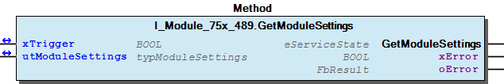
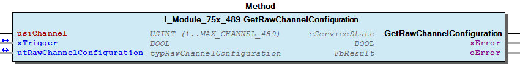
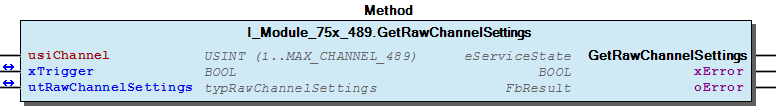
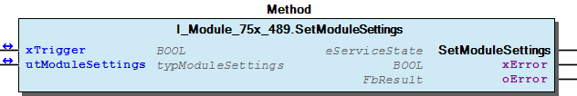
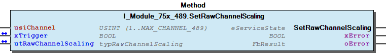
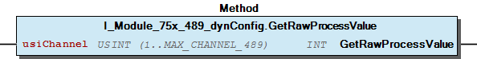

# WagoTypesModule_75x_489 v1.0.1.1 (WAGO) - Complete Documentation


## 📋 Library Information

- **Company:** WAGO
- **Title:** WagoTypesModule_75x_489
- **Version:** 1.0.1.1
- **Categories:** WAGO Internal|Common|Types and Interfaces; WAGO LayerView|Types and Interfaces; Application
- **Author:** WAGO
- **Placeholder:** WagoTypesModule_75x_489

### Description ¶


This document is automatically generated. Because of this, the chapter 30 Visualization is not shown in this document. If you are interested in getting to know more about visualization, we refer to the library manager of e!Cockpit.

Handling module 75x-489 [1]

This document is automatically generated. Because of this, the chapter 30 Visualization is not shown in this document. If you are interested in getting to know more about visualization, we refer to the library manager of e!Cockpit. Handling module 75x-489 [1]

### Contents: ¶


Contents: - Documentation Index - Project Information - Library Information - Methods I_Module_75x_489.GetModuleSettings (METH) - I_Module_75x_489.GetRawChannelCalibration (METH) - I_Module_75x_489.GetRawChannelConfiguration (METH) - I_Module_75x_489.GetRawChannelScaling (METH) - I_Module_75x_489.GetRawChannelSettings (METH) - I_Module_75x_489.SetModuleSettings (METH) - I_Module_75x_489.SetRawChannelCalibration (METH) - I_Module_75x_489.SetRawChannelConfiguration (METH) - I_Module_75x_489.SetRawChannelScaling (METH) - I_Module_75x_489.SetRawChannelSettings (METH) - ... and 3 more Interfaces - I_Module_75x_489 (ITF) - I_Module_75x_489_dynConfig (ITF) Program Organization Global Variable Lists - Channels_489 (GVL) - VersionHistory (GVL) Other Components - 10 Enumeration - 15 Datatypes - Channel - Configuration - Module - Raw - eSignalType (ENUM) - eSmoothing (ENUM) - typRawChannelCalibration (STRUCT) - typRawChannelConfiguration (STRUCT) - ... and 1 more

### Indices and tables ¶


| [1] | Based on WagoTypesModule_75x_489.library, last modified 08.04.2020, 16:12:04. The content of this file was automatically generated with None on 08.04.2020, 16:12:19 |

© WAGO Kontakttechnik GmbH & Co. KG, Germany 2018 – All rights reserved. For the avoidance of doubt, this copyright notice does not only apply to the information above but also and primarily to the described library itself. Please note that third-party products are always mentioned without reference to intellectual property rights, including patents, utility models, designs and trademarks, accordingly the existence of such rights cannot be excluded. WAGO is a registered trademark of WAGO Verwaltungsgesellschaft mbH.

- File and Project Information - Library Reference © WAGO Kontakttechnik GmbH & Co. KG, Germany 2018 – All rights reserved. For the avoidance of doubt, this copyright notice does not only apply to the information above but also and primarily to the described library itself. Please note that third-party products are always mentioned without reference to intellectual property rights, including patents, utility models, designs and trademarks, accordingly the existence of such rights cannot be excluded. WAGO is a registered trademark of WAGO Verwaltungsgesellschaft mbH.

### Documentation Index


## WagoTypesModule_75x_489 Library Documentation


| Company: | WAGO |
| Title: | WagoTypesModule_75x_489 |
| Version: | 1.0.1.1 |
| Categories: | WAGO Internal\|Common\|Types and Interfaces; WAGO LayerView\|Types and Interfaces; Application |
| Author: | WAGO |
| Placeholder: | WagoTypesModule_75x_489 |

### Description


This document is automatically generated. Because of this, the chapter 30 Visualization is not shown in this document. If you are interested in getting to know more about visualization, we refer to the library manager of e!Cockpit.

Handling module 75x-489 [1]

This document is automatically generated. Because of this, the chapter 30 Visualization is not shown in this document. If you are interested in getting to know more about visualization, we refer to the library manager of e!Cockpit. Handling module 75x-489 [1]

### Contents:


- 20 Program Organization Units 10 Enumeration - 15 Datatypes - Channels_489 (GVL) - I_Module_75x_489 (ITF) - I_Module_75x_489_dynConfig (ITF) VersionHistory (GVL)

### Indices and tables


| [1] | Based on WagoTypesModule_75x_489.library, last modified 08.04.2020, 16:12:04. The content of this file was automatically generated with None on 08.04.2020, 16:12:19 |

© WAGO Kontakttechnik GmbH & Co. KG, Germany 2018 – All rights reserved. For the avoidance of doubt, this copyright notice does not only apply to the information above but also and primarily to the described library itself. Please note that third-party products are always mentioned without reference to intellectual property rights, including patents, utility models, designs and trademarks, accordingly the existence of such rights cannot be excluded. WAGO is a registered trademark of WAGO Verwaltungsgesellschaft mbH.

- File and Project Information - Library Reference © WAGO Kontakttechnik GmbH & Co. KG, Germany 2018 – All rights reserved. For the avoidance of doubt, this copyright notice does not only apply to the information above but also and primarily to the described library itself. Please note that third-party products are always mentioned without reference to intellectual property rights, including patents, utility models, designs and trademarks, accordingly the existence of such rights cannot be excluded. WAGO is a registered trademark of WAGO Verwaltungsgesellschaft mbH.

### Project Information


## File and Project Information


| Scope | Name | Type | Content |
| --- | --- | --- | --- |
| FileHeader | libraryFile | string | WagoTypesModule_75x_489.library |
| contentFile | WagoTypesModule_75x_489_clr.json |
| productName | e!COCKPIT |
| creationDateTime | date | 08.04.2020, 16:12:19 |
| companyName | string | WAGO |
| ProjectInformation | LastModificationDateTime | date | 08.04.2020, 16:12:04 |
| Description | string | See: Description |
| DocFormat | reStructuredText |
| Author | WAGO |
| AutoResolveUnbound | bool | True |
| Placeholder | string | WagoTypesModule_75x_489 |
| Company | WAGO |
| Title | WagoTypesModule_75x_489 |
| Project | WagoTypesModule_75x_489 |
| Copyright | © WAGO Kontakttechnik GmbH & Co. KG, Germany 2018 – All rights reserved. |
| Version | version | 1.0.1.1 |
| Version string | string |  |
| LibraryCategories | library-category-list | WAGO Internal\|Common\|Types and Interfaces; WAGO LayerView\|Types and Interfaces; Application |

### Library Information


## Library Reference


| LinkAllContent: False QualifiedOnly: False | SystemLibrary: False | Optional: False |

| LinkAllContent: False QualifiedOnly: True | SystemLibrary: False | Optional: False |

| LinkAllContent: False QualifiedOnly: True | SystemLibrary: False | Optional: False |

This is a dictionary of all referenced libraries and their name spaces.

This is a dictionary of all referenced libraries and their name spaces. WagoSysErrorBase Library Identification : Placeholder: WagoSysErrorBase Default Resolution: WagoSysErrorBase, * (WAGO) Namespace: WagoSysErrorBase Library Properties : WagoSysVersion Library Identification : Name: WagoSysVersion Version: 1.0.0.0 Company: WAGO Namespace: WagoSysVersion Library Properties : WagoTypesModuleBase Library Identification : Placeholder: WagoTypesModuleBase Default Resolution: WagoTypesModuleBase, * (WAGO) Namespace: WagoTypesModuleBase Library Properties : Library Parameter : Parameter: MAX_MODULE_OUTPUT_SIZE = 48 Parameter: MAX_MODULE_INPUT_SIZE = 48 Parameter: MBX_PIPE_SIZE = 1024 Parameter: MAX_MBX_SIZE = 18 Parameter: MAX_MBX1_SIZE = 18 Parameter: MAX_MBX_OUTPUT_SIZE = 47 Parameter: MAX_MBX_INPUT_SIZE = 47

### Methods


## I_Module_75x_489.GetModuleSettings (METH)


| Scope | Name | Type |
| --- | --- | --- |
| Return | GetModuleSettings | WagoTypesModuleBase.eServiceState |
| Inout | xTrigger | BOOL |
| utModuleSettings | typModuleSettings |
| Output | xError | BOOL |
| oError | WagoSysErrorBase.FbResult |

| Struct member | Value | Description |
| --- | --- | --- |
| bInputFilter | BYTE | 0 = 10 Hz; 1 = 50 Hz; 2 = 60 Hz; 3 = 400 Hz |
| bUnit | BYTE | 0 = °Celsius; 1 = °Fahrenheit; 2 = Kelvin |
| xS5FB250Format | FALSE | Numeric values appear in default format |
| TRUE | Numeric values appear in S5-FB250 format |

| Return Value | Description |
| --- | --- |
| WagoTypesModuleBase.eServiceState.DONE | successful |
| WagoTypesModuleBase.eServiceState.ABORT | error -> see oError |
| WagoTypesModuleBase.eServiceState.NO_DATA | call while xTrigger is reset |

```
VAR
    //--- Module Mode Settings ------------------------------
    utModuleSettings    :   WagoTypesModule_75x_489.typModuleSettings;
    xGetModuleSettings  :   BOOL;  // triggers the function
    oError              :   WagoSysErrorBase.FbResult;
END_VAR

//--- M O D U L E    S E T T I N G S -----------------------
CASE my489.GetModuleSettings(xGetModuleSettings, utModuleSettings, oError => oError) OF

    eServiceState.DONE : // OK
            ;// process here your utModuleSettings

    eServiceState.ABORT : // Error
            ;// process here your error handling -> see oError for more information

END_CASE
```

Get the common modul settings

Return Values

It is not allowed to reset the xTrigger by the application. This will be done by the method itself.

Graphical Illustration

Graphical Interface of I_Module_75x_489.GetModuleSettings

For get the settings from the module.

You have to call the method cyclic until the method returns with DONE or ABORT.

Interface variables Function Get the common modul settings Return Values Warning It is not allowed to reset the xTrigger by the application. This will be done by the method itself. Graphical Illustration  Graphical Interface of I_Module_75x_489.GetModuleSettings Example For get the settings from the module. Note You have to call the method cyclic until the method returns with DONE or ABORT.

## I_Module_75x_489.GetRawChannelCalibration (METH)


| Scope | Name | Type |
| --- | --- | --- |
| Return | GetRawChannelCalibration | WagoTypesModuleBase.eServiceState |
| Input | usiChannel | USINT (1..MAX_CHANNEL_489) |
| Inout | xTrigger | BOOL |
| utRawChannelCalibration | typRawChannelCalibration |
| Output | xError | BOOL |
| oError | WagoSysErrorBase.FbResult |

| Struct member | Value | Description |
| --- | --- | --- |
| iUserCalibrationOffset | -32768 ... 32767 | User Calibration Offset |
| iUserCalibrationGain | -32768 ... 32767 | User Calibration Gain * 1/16384 |

```
VAR
    //--- Channel Calibration ---------------------------------
    utChannelCalibration    :   WagoTypesModule_75x_489.typRawChannelCalibration;;
    xGetChannelCalibration  :   BOOL;
    oError                  :   WagoSysErrorBase.FbResult;
END_VAR

//--- C H A N N E L    C A L I B R A T I O N -----------------------
CASE my489.GetRawChannelCalibration(    usiChannel              := 1,
                                        xTrigger                := xGetChannelCalibration,
                                        utRawChannelCalibration := utChannelCalibration,
                                        oError                  => oError
                                    ) OF

    eServiceState.DONE : // OK
            ;// process here your utModuleSettings

    eServiceState.ABORT : // Error
            ;// process here your error handling -> see oError for more information

END_CASE
```

Get the calibration of a channel.

Graphical Illustration

Graphical Interface of I_Module_75x_489.GetRawChannelCalibration

Get the calibration from channel one

You have to call the method cyclic until the method returns with DONE or ABORT.

Interface variables Function Get the calibration of a channel. Graphical Illustration  Graphical Interface of I_Module_75x_489.GetRawChannelCalibration Example Get the calibration from channel one Note You have to call the method cyclic until the method returns with DONE or ABORT.

## I_Module_75x_489.GetRawChannelConfiguration (METH)


| Scope | Name | Type |
| --- | --- | --- |
| Return | GetRawChannelConfiguration | WagoTypesModuleBase.eServiceState |
| Input | usiChannel | USINT (1..MAX_CHANNEL_489) |
| Inout | xTrigger | BOOL |
| utRawChannelConfiguration | typRawChannelConfiguration |
| Output | xError | BOOL |
| oError | WagoSysErrorBase.FbResult |

| Struct member | Value | Description |
| --- | --- | --- |
| Settings | eSignalType | eSignalType | see chapter 10 Enumeration |
| eInputFilter | eInputFilter | see chapter 10 Enumeration |
| xFormat | FALSE | Two’s complement |
| TRUE | Sign magnitude |
| xResolution | FALSE | 0,1°C (°F) (K) /digit |
| TRUE | 0,01°C (°F) (K) /digit |
| xEnableDiag | FALSE | Diagnosis disabled |
| TRUE | Diagnosis enabled |
| xEnableDiagOverflow | FALSE | Diagnosis Overflow disabled |
| TRUE | Diagnosis Overflow enabled |
| xEnableDiagUnderflow | FALSE | Diagnosis Underflow disabled |
| TRUE | Diagnosis Underflow enabled |
| xEnableDiagMeasurementOverrange | FALSE | Diagnosis Measurement Overrange disabled |
| TRUE | Diagnosis Measurement Overrange enabled |
| xEnableDiagMeasurementUnderrange | FALSE | Diagnosis Measurement Underrange disabled |
| TRUE | Diagnosis Measurement Underrange enabled |
| xEnableDiagUserLimitOverrange | FALSE | Diagnosis User Limit Overrange disabled |
| TRUE | Diagnosis User Limit Overrange enabled |
| xEnableDiagUserLimitUnderrange | FALSE | Diagnosis User Limit Underrange disabled |
| TRUE | Diagnosis User Limit Underrange enabled |
| iUserLimitOverrange | -32768 ... 32767 | User Limit Overrange |
| iUserLimitUnderrange | -32768 ... 32767 | User Limit Underrange |
| w2WireCompensation | 0 ... 65535 | Compensation resistor [mOhm] |
| Scaling | xUserScaling | FALSE | User Scaling disabled |
| TRUE | User Scaling enabled |
| iUserScalingOffset | -32768 ... 32767 | User Scaling Offset |
| iUserScalingGain | -32768 ... 32767 | User Scaling Gain * 1/16384 |
| Calibration | iUserCalibrationOffset | -32768 ... 32767 | User Calibration Offset |
| iUserCalibrationGain | -32768 ... 32767 | User Calibration Gain * 1/16384 |

```
VAR
    //--- Channel Configuration ---------------------------------
    utRawChannelConfiguration   :   WagoTypesModule_75x_489.typRawChannelConfiguration;
    xGetRawChannelConfiguration :   BOOL;
    oError                      :   WagoSysErrorBase.FbResult;
END_VAR

//--- C H A N N E L    C O N F I G U R A T I O N -----------------------
CASE my489.GetRawChannelConfiguration(  usiChannel                  := 1,
                                        xTrigger                    := xGetRawChannelConfiguration,
                                        utRawChannelConfiguration   := utRawChannelConfiguration,
                                        oError                      => oError
                                    ) OF

    eServiceState.DONE : // OK
            ;// process here your utChannelConfiguration

    eServiceState.ABORT : // Error
            ;// process here your error handling -> see oError for more information

END_CASE
```

typRawChannelConfiguration

Graphical Illustration

Graphical Interface of I_Module_75x_489.GetRawChannelConfiguration

For get the configuration from channel one

You have to call the method cyclic until the method returns with DONE or ABORT.

Interface variables Function Get the complete raw configuration of a channel. typRawChannelConfiguration Graphical Illustration  Graphical Interface of I_Module_75x_489.GetRawChannelConfiguration Example For get the configuration from channel one Note You have to call the method cyclic until the method returns with DONE or ABORT.

## I_Module_75x_489.GetRawChannelScaling (METH)


| Scope | Name | Type |
| --- | --- | --- |
| Return | GetRawChannelScaling | WagoTypesModuleBase.eServiceState |
| Input | usiChannel | USINT (1..MAX_CHANNEL_489) |
| Inout | xTrigger | BOOL |
| utRawChannelScaling | typRawChannelScaling |
| Output | xError | BOOL |
| oError | WagoSysErrorBase.FbResult |

| Struct member | Value | Description |
| --- | --- | --- |
| xUserScaling | FALSE | User Scaling disabled |
| TRUE | User Scaling enabled |
| iUserScalingOffset | -32768 ... 32767 | User Scaling Offset |
| iUserScalingGain | -32768 ... 32767 | User Scaling Gain * 1/16384 |

```
VAR
    //--- Channel Settings ---------------------------------
    utChannelScaling    :   WagoTypesModule_75x_489.typRawChannelScaling;;
    xGetChannelScaling  :   BOOL;
    oError              :   WagoSysErrorBase.FbResult;
END_VAR

//--- C H A N N E L   S C A L I N G ------------------------
CASE my489.GetRawChannelScaling(    usiChannel           := 1,
                                    xTrigger             := xGetChannelScaling,
                                    utRawChannelScaling  := utChannelScaling,
                                    oError               => oError
                                ) OF

    eServiceState.DONE : // OK
            ;// process here your utModuleSettings

    eServiceState.ABORT : // Error
            ;// process here your error handling -> see oError for more information

END_CASE
```

typRawChannelScaling

Graphical Illustration

Graphical Interface of I_Module_75x_489.GetRawChannelScaling

Get the scaling from channel one

You have to call the method cyclic until the method returns with DONE or ABORT.

Interface variables Function Get the scaling of a channel typRawChannelScaling Graphical Illustration  Graphical Interface of I_Module_75x_489.GetRawChannelScaling Example Get the scaling from channel one Note You have to call the method cyclic until the method returns with DONE or ABORT.

## I_Module_75x_489.GetRawChannelSettings (METH)


| Scope | Name | Type |
| --- | --- | --- |
| Return | GetRawChannelSettings | WagoTypesModuleBase.eServiceState |
| Input | usiChannel | USINT (1..MAX_CHANNEL_489) |
| Inout | xTrigger | BOOL |
| utRawChannelSettings | typRawChannelSettings |
| Output | xError | BOOL |
| oError | WagoSysErrorBase.FbResult |

| Struct member | Value | Description |
| --- | --- | --- |
| eSignalType | eSignalType | see chapter 10 Enumeration |
| eSmoothing | eSmoothing | see chapter 10 Enumeration |
| xFormat | FALSE | Two’s complement |
| TRUE | Sign magnitude |
| xResolution | FALSE | 0,1°C (°F) (K) /digit |
| TRUE | 0,01°C (°F) (K) /digit |
| xEnableDiag | FALSE | Diagnosis disabled |
| TRUE | Diagnosis enabled |
| xEnableDiagOverflow | FALSE | Diagnosis Overflow disabled |
| TRUE | Diagnosis Overflow enabled |
| xEnableDiagUnderflow | FALSE | Diagnosis Underflow disabled |
| TRUE | Diagnosis Underflow enabled |
| xEnableDiagMeasurementOverrange | FALSE | Diagnosis Measurement Overrange disabled |
| TRUE | Diagnosis Measurement Overrange enabled |
| xEnableDiagMeasurementUnderrange | FALSE | Diagnosis Measurement Underrange disabled |
| TRUE | Diagnosis Measurement Underrange enabled |
| xEnableDiagUserLimitOverrange | FALSE | Diagnosis User Limit Overrange disabled |
| TRUE | Diagnosis User Limit Overrange enabled |
| xEnableDiagUserLimitUnderrange | FALSE | Diagnosis User Limit Underrange disabled |
| TRUE | Diagnosis User Limit Underrange enabled |
| iUserLimitOverrange | -32768 ... 32767 | User Limit Overrange |
| iUserLimitUnderrange | -32768 ... 32767 | User Limit Underrange |
| w2WireCompensation | 0 ... 65535 | Compensation resistor [mOhm] |

```
VAR
    //--- Channel Settings ---------------------------------
    utChannelSettings   :   WagoTypesModule_75x_489.typRawChannelSettings;;
    xGetChannelSettings :   BOOL;
    oError              :   WagoSysErrorBase.FbResult;
END_VAR

//--- C H A N N E L   S E T T I N G S ----------------------
CASE my489.GetRawChannelSettings(   usiChannel           := 1,
                                    xTrigger             := xGetChannelSettings,
                                    utRawChannelSettings := utChannelSettings,
                                    oError               => oError
                                ) OF

    eServiceState.DONE : // OK
        ;// process here your utModuleSettings

    eServiceState.ABORT : // Error
        ;// process here your error handling -> see oError for more information

END_CASE
```

typRawChannelSettings

Graphical Illustration

Graphical Interface of I_Module_75x_489.GetRawChannelSettings

Get the settings from channel one

You have to call the method cyclic until the method returns with DONE or ABORT.

Interface variables Function Get the settings of a channel typRawChannelSettings Graphical Illustration  Graphical Interface of I_Module_75x_489.GetRawChannelSettings Example Get the settings from channel one Note You have to call the method cyclic until the method returns with DONE or ABORT.

## I_Module_75x_489.SetModuleSettings (METH)


| Scope | Name | Type |
| --- | --- | --- |
| Return | SetModuleSettings | WagoTypesModuleBase.eServiceState |
| Inout | xTrigger | BOOL |
| utModuleSettings | typModuleSettings |
| Output | xError | BOOL |
| oError | WagoSysErrorBase.FbResult |

| Struct member | Value | Description |
| --- | --- | --- |
| bInputFilter | BYTE | 0 = 10 Hz; 1 = 50 Hz; 2 = 60 Hz; 3 = 400 Hz |
| bUnit | BYTE | 0 = °Celsius; 1 = °Fahrenheit; 2 = Kelvin |
| xS5FB250Format | FALSE | Numeric values appear in default format |
| TRUE | Numeric values appear in S5-FB250 format |

| Return Value | Description |
| --- | --- |
| WagoTypesModuleBase.eServiceState.DONE | successful |
| WagoTypesModuleBase.eServiceState.ABORT | error -> see oError |
| WagoTypesModuleBase.eServiceState.NO_DATA | call while xTrigger is reset |

```
VAR
    //--- Module Mode Settings ------------------------------
    xStartProcess       :   BOOL; // set this variable once to start the process -> this varibale will be automatic reset
    utModuleSettings    :   WagoTypesModule_75x_489.typModuleSettings;
    oError              :   WagoSysErrorBase.FbResult;
    xSetModuleSettings  :   BOOL;  // triggers the function
END_VAR

//--- READ BEFORE WRITE --------------------------------------------------------------
CASE my489.GetModuleSettings(xStartProcess, utModuleSettings, oError => oError) OF

    eServiceState.DONE : // OK -> actual configuration is successful read
        // change here your configuration
        // utRawChannelConfiguration... :=
        xSetModuleSettings := TRUE; // trigger write

    eServiceState.ABORT : // Error -> not able to read -> see oError
            ;// process here your error handling for read -> see oError for more information

END_CASE

//--- S E T   M O D U L E    S E T T I N G S ---------------
CASE my489.SetModuleSettings(xSetModuleSettings, utModuleSettings, oError => oError) OF

    eServiceState.DONE : // OK

    eServiceState.ABORT : // Error
            ;// process here your error handling -> see oError for more information

END_CASE
```

Set the common module settings

Return Values

It is not allowed to reset the xTrigger by the application. This will be done by the method itself.

Graphical Illustration

Graphical Interface of I_Module_75x_489.SetModuleSettings

Setting the common module values

You have to call the method cyclic until the method returns with DONE or ABORT.

Interface variables Function Set the common module settings Return Values Warning It is not allowed to reset the xTrigger by the application. This will be done by the method itself. Graphical Illustration  Graphical Interface of I_Module_75x_489.SetModuleSettings Example Setting the common module values Note You have to call the method cyclic until the method returns with DONE or ABORT.

## I_Module_75x_489.SetRawChannelCalibration (METH)


| Scope | Name | Type |
| --- | --- | --- |
| Return | SetRawChannelCalibration | WagoTypesModuleBase.eServiceState |
| Input | usiChannel | USINT (1..MAX_CHANNEL_489) |
| Inout | xTrigger | BOOL |
| utRawChannelCalibration | typRawChannelCalibration |
| Output | xError | BOOL |
| oError | WagoSysErrorBase.FbResult |

| Struct member | Value | Description |
| --- | --- | --- |
| iUserCalibrationOffset | -32768 ... 32767 | User Calibration Offset |
| iUserCalibrationGain | -32768 ... 32767 | User Calibration Gain * 1/16384 |

```
VAR
    //--- Channel Calibration ---------------------------------
    utChannelCalibration    :   WagoTypesModule_75x_489.typRawChannelCalibration;;
    xSetChannelCalibration  :   BOOL;
    oError                  :   WagoSysErrorBase.FbResult;
END_VAR

//--- C H A N N E L    C A L I B R A T I O N -----------------------
CASE my489.SetRawChannelCalibration(    usiChannel              := 1,
                                        xTrigger                := xSetChannelCalibration,
                                        utRawChannelCalibration := utChannelCalibration,
                                        oError                  => oError
                                   ) OF

    eServiceState.DONE : // OK
            ;// DONE

    eServiceState.ABORT : // Error
            ;// process here your error handling -> see oError for more information

END_CASE
```

Set the calibration of a channel

Graphical Illustration

Graphical Interface of I_Module_75x_489.SetRawChannelCalibration

For set the calibration of channel one

You have to call the method cyclic until the method returns with DONE or ABORT.

Interface variables Function Set the calibration of a channel Graphical Illustration  Graphical Interface of I_Module_75x_489.SetRawChannelCalibration Example For set the calibration of channel one Note You have to call the method cyclic until the method returns with DONE or ABORT.

## I_Module_75x_489.SetRawChannelConfiguration (METH)


| Scope | Name | Type |
| --- | --- | --- |
| Return | SetRawChannelConfiguration | WagoTypesModuleBase.eServiceState |
| Input | usiChannel | USINT (1..MAX_CHANNEL_489) |
| Inout | xTrigger | BOOL |
| utRawChannelConfiguration | typRawChannelConfiguration |
| Output | xError | BOOL |
| oError | WagoSysErrorBase.FbResult |

| Struct member | Value | Description |
| --- | --- | --- |
| Settings | eSignalType | eSignalType | see chapter 10 Enumeration |
| eInputFilter | eInputFilter | see chapter 10 Enumeration |
| xFormat | FALSE | Two’s complement |
| TRUE | Sign magnitude |
| xResolution | FALSE | 0,1°C (°F) (K) /digit |
| TRUE | 0,01°C (°F) (K) /digit |
| xEnableDiag | FALSE | Diagnosis disabled |
| TRUE | Diagnosis enabled |
| xEnableDiagOverflow | FALSE | Diagnosis Overflow disabled |
| TRUE | Diagnosis Overflow enabled |
| xEnableDiagUnderflow | FALSE | Diagnosis Underflow disabled |
| TRUE | Diagnosis Underflow enabled |
| xEnableDiagMeasurementOverrange | FALSE | Diagnosis Measurement Overrange disabled |
| TRUE | Diagnosis Measurement Overrange enabled |
| xEnableDiagMeasurementUnderrange | FALSE | Diagnosis Measurement Underrange disabled |
| TRUE | Diagnosis Measurement Underrange enabled |
| xEnableDiagUserLimitOverrange | FALSE | Diagnosis User Limit Overrange disabled |
| TRUE | Diagnosis User Limit Overrange enabled |
| xEnableDiagUserLimitUnderrange | FALSE | Diagnosis User Limit Underrange disabled |
| TRUE | Diagnosis User Limit Underrange enabled |
| iUserLimitOverrange | -32768 ... 32767 | User Limit Overrange |
| iUserLimitUnderrange | -32768 ... 32767 | User Limit Underrange |
| w2WireCompensation | 0 ... 65535 | Compensation resistor [mOhm] |
| Scaling | xUserScaling | FALSE | User Scaling disabled |
| TRUE | User Scaling enabled |
| iUserScalingOffset | -32768 ... 32767 | User Scaling Offset |
| iUserScalingGain | -32768 ... 32767 | User Scaling Gain * 1/16384 |
| Calibration | iUserCalibrationOffset | -32768 ... 32767 | User Calibration Offset |
| iUserCalibrationGain | -32768 ... 32767 | User Calibration Gain * 1/16384 |

```
VAR
    //--- Channel Configuration -------------------------------------------------------
    xStartProcess               :   BOOL; // set this variable once to start the process -> this varibale will be automatic reset
    utRawChannelConfiguration   :   WagoTypesModule_75x_489.typRawChannelConfiguration;
    oError                      :   WagoSysErrorBase.FbResult;
    xSetRawChannelConfiguration :   BOOL;
END_VAR

//--- C H A N N E L    C O N F I G U R A T I O N -----------------------
//--- READ BEFORE WRITE --------------------------------------------------------------
CASE my489.GetRawChannelConfiguration( 1, xStartProcess, utRawChannelConfiguration, oError => oError) OF

    eServiceState.DONE : // OK -> actual configuration is successful read
        // change here your configuration
        // utRawChannelConfiguration... :=
        xSetRawChannelConfiguration := TRUE; // trigger write

    eServiceState.ABORT : // Error -> not able to read -> see oError
            ;// process here your error handling for read -> see oError for more information

END_CASE

//--- WRITE MODYFIED CONFIGURATION ---------------------------------------------------
CASE my489.SetRawChannelConfiguration( 1, xSetRawChannelConfiguration, utRawChannelConfiguration, oError => oError) OF

    eServiceState.DONE : // OK -> new configuration is written

    eServiceState.ABORT : // Error -> not able to write -> see oError
            ;// process here your error handling for write -> see oError for more information

END_CASE
```

typRawChannelConfiguration

Graphical Illustration

Graphical Interface of I_Module_75x_489.SetRawChannelConfiguration

For get the configuration from channel one and after read write the configuration

You have to call the method cyclic until the method returns with DONE or ABORT.

Interface variables Function Set the complete raw configuration of a channel. typRawChannelConfiguration Graphical Illustration  Graphical Interface of I_Module_75x_489.SetRawChannelConfiguration Example For get the configuration from channel one and after read write the configuration Note You have to call the method cyclic until the method returns with DONE or ABORT.

## I_Module_75x_489.SetRawChannelScaling (METH)


| Scope | Name | Type |
| --- | --- | --- |
| Return | SetRawChannelScaling | WagoTypesModuleBase.eServiceState |
| Input | usiChannel | USINT (1..MAX_CHANNEL_489) |
| Inout | xTrigger | BOOL |
| utRawChannelScaling | typRawChannelScaling |
| Output | xError | BOOL |
| oError | WagoSysErrorBase.FbResult |

| Struct member | Value | Description |
| --- | --- | --- |
| xUserScaling | FALSE | User Scaling disabled |
| TRUE | User Scaling enabled |
| iUserScalingOffset | -32768 ... 32767 | User Scaling Offset |
| iUserScalingGain | -32768 ... 32767 | User Scaling Gain * 1/16384 |

```
VAR
    //--- Channel Settings ---------------------------------
    utChannelScaling    :   WagoTypesModule_75x_489.typRawChannelScaling;;
    xSetChannelScaling  :   BOOL;
    oError              :   WagoSysErrorBase.FbResult;
END_VAR

//--- C H A N N E L   S C A L I N G ------------------------
CASE my489.SetRawChannelScaling(    usiChannel          := 1,
                                    xTrigger            := xSetChannelScaling,
                                    utRawChannelScaling := utChannelScaling,
                                    oError              => oError
                                ) OF

    eServiceState.DONE : // OK
            ;// DONE

    eServiceState.ABORT : // Error
            ;// process here your error handling -> see oError for more information

END_CASE
```

typRawChannelScaling

Graphical Illustration

Graphical Interface of I_Module_75x_489.SetRawChannelScaling

Set the scaling of channel one

You have to call the method cyclic until the method returns with DONE or ABORT.

Interface variables Function Set the scaling of a channel typRawChannelScaling Graphical Illustration  Graphical Interface of I_Module_75x_489.SetRawChannelScaling Example Set the scaling of channel one Note You have to call the method cyclic until the method returns with DONE or ABORT.

## I_Module_75x_489.SetRawChannelSettings (METH)


| Scope | Name | Type |
| --- | --- | --- |
| Return | SetRawChannelSettings | WagoTypesModuleBase.eServiceState |
| Input | usiChannel | USINT (1..MAX_CHANNEL_489) |
| Inout | xTrigger | BOOL |
| utRawChannelSettings | typRawChannelSettings |
| Output | xError | BOOL |
| oError | WagoSysErrorBase.FbResult |

| Struct member | Value | Description |
| --- | --- | --- |
| eSignalType | eSignalType | see chapter 10 Enumeration |
| eSmoothing | eSmoothing | see chapter 10 Enumeration |
| xFormat | FALSE | Two’s complement |
| TRUE | Sign magnitude |
| xResolution | FALSE | 0,1°C (°F) (K) /digit |
| TRUE | 0,01°C (°F) (K) /digit |
| xEnableDiag | FALSE | Diagnosis disabled |
| TRUE | Diagnosis enabled |
| xEnableDiagOverflow | FALSE | Diagnosis Overflow disabled |
| TRUE | Diagnosis Overflow enabled |
| xEnableDiagUnderflow | FALSE | Diagnosis Underflow disabled |
| TRUE | Diagnosis Underflow enabled |
| xEnableDiagMeasurementOverrange | FALSE | Diagnosis Measurement Overrange disabled |
| TRUE | Diagnosis Measurement Overrange enabled |
| xEnableDiagMeasurementUnderrange | FALSE | Diagnosis Measurement Underrange disabled |
| TRUE | Diagnosis Measurement Underrange enabled |
| xEnableDiagUserLimitOverrange | FALSE | Diagnosis User Limit Overrange disabled |
| TRUE | Diagnosis User Limit Overrange enabled |
| xEnableDiagUserLimitUnderrange | FALSE | Diagnosis User Limit Underrange disabled |
| TRUE | Diagnosis User Limit Underrange enabled |
| iUserLimitOverrange | -32768 ... 32767 | User Limit Overrange |
| iUserLimitUnderrange | -32768 ... 32767 | User Limit Underrange |
| w2WireCompensation | 0 ... 65535 | Compensation resistor [mOhm] |

```
VAR
    //--- Channel Settings ---------------------------------
    utChannelSettings   :   WagoTypesModule_75x_489.typRawChannelSettings;;
    xSetChannelSettings :   BOOL;
    oError              :   WagoSysErrorBase.FbResult;
END_VAR

//--- C H A N N E L   S E T T I N G S ----------------------
CASE my489.SetRawChannelSettings(   usiChannel           := 1,
                                    xTrigger             := xSetChannelSettings,
                                    utRawChannelSettings := utChannelSettings,
                                    oError               => oError
                                ) OF

    eServiceState.DONE : // OK
        ;// DONE

    eServiceState.ABORT : // Error
        ;// process here your error handling -> see oError for more information

END_CASE
```

typRawChannelSettings

Graphical Illustration

Graphical Interface of I_Module_75x_489.SetRawChannelSettings

Set the settings of channel one

You have to call the method cyclic until the method returns with DONE or ABORT.

Interface variables Function Set the settings for a channel typRawChannelSettings Graphical Illustration  Graphical Interface of I_Module_75x_489.SetRawChannelSettings Example Set the settings of channel one Note You have to call the method cyclic until the method returns with DONE or ABORT.

## I_Module_75x_489_dynConfig.GetRawProcessValue (METH)


| Scope | Name | Type |
| --- | --- | --- |
| Return | GetRawProcessValue | INT |
| Input | usiChannel | USINT (1..MAX_CHANNEL_489) |

```
VAR
    myiProcessValue :   INT;
END_VAR

myiProcessValue := my489.GetProcessValue(1); // here is the process raw value as INT
```

Get the raw process value of a channel

In case of error (e.g. an invalid channel number is given) it returns -32768.

Graphical Illustration

Graphical Interface of I_Module_75x_489_dynConfig.GetRawProcessValue

Get the process value from the first channel of the module.

Interface variables Function Get the raw process value of a channel In case of error (e.g. an invalid channel number is given) it returns -32768. Graphical Illustration  Graphical Interface of I_Module_75x_489_dynConfig.GetRawProcessValue Example Get the process value from the first channel of the module.

## typModuleSettings (STRUCT)


| Name | Type | Comment |
| --- | --- | --- |
| bInputFilter | BYTE | Input Filter -> 0 = 10 Hz; 1 = 50 Hz; 2 = 60 Hz; 3 = 400 Hz |
| bUnit | BYTE | Unit -> 0 = °Celsius; 1 = °Fahrenheit; 2 = Kelvin |
| xS5FB250Format | BOOL | Standard format / S5-FB250 format |

## typRawChannelSettings (STRUCT)


| Name | Type | Comment |
| --- | --- | --- |
| eSignalType | eSignalType | Input Signal Type |
| eSmoothing | eSmoothing | Smoothing |
| xFormat | BOOL | Two’s complement; Sign magnitude |
| xResolution | BOOL | Temperature format:->0: 0,1° ; ->1: 0,01° |
| xEnableDiagMeasurementUnderrange | BOOL | Diagnosis Measurement Underrange On/Off -> R32.8 |
| xEnableDiagMeasurementOverrange | BOOL | Diagnosis Measurement Overrange On/Off -> R32.9 |
| xEnableDiagUserLimitUnderrange | BOOL | Diagnosis User Limit Underrange On/Off -> R32.10 |
| xEnableDiagUserLimitOverrange | BOOL | Diagnosis User Limit Overrange On/Off -> R32.11 |
| xEnableDiagOverflow | BOOL | Diagnosis Overflow On/Off -> R32.12 |
| xEnableDiagUnderflow | BOOL | Diagnosis Underflow On/Off -> R32.13 |
| xEnableDiag | BOOL | Diagnosis On/Off -> R32.15 |
| iUserLimitUnderrange | INT | User Limit Underrange -> R38 |
| iUserLimitOverrange | INT | User Limit Overrange -> R39 |
| w2WireCompensation | WORD | 2-Wire Compensation -> R35 |

| Struct member | Value | Description |
| --- | --- | --- |
| eSignalType | eSignalType | see chapter 10 Enumeration |
| eSmoothing | eSmoothing | see chapter 10 Enumeration |
| xFormat | FALSE | Two’s complement |
| TRUE | Sign magnitude |
| xResolution | FALSE | 0,1°C (°F) (K) /digit |
| TRUE | 0,01°C (°F) (K) /digit |
| xEnableDiag | FALSE | Diagnosis disabled |
| TRUE | Diagnosis enabled |
| xEnableDiagOverflow | FALSE | Diagnosis Overflow disabled |
| TRUE | Diagnosis Overflow enabled |
| xEnableDiagUnderflow | FALSE | Diagnosis Underflow disabled |
| TRUE | Diagnosis Underflow enabled |
| xEnableDiagMeasurementOverrange | FALSE | Diagnosis Measurement Overrange disabled |
| TRUE | Diagnosis Measurement Overrange enabled |
| xEnableDiagMeasurementUnderrange | FALSE | Diagnosis Measurement Underrange disabled |
| TRUE | Diagnosis Measurement Underrange enabled |
| xEnableDiagUserLimitOverrange | FALSE | Diagnosis User Limit Overrange disabled |
| TRUE | Diagnosis User Limit Overrange enabled |
| xEnableDiagUserLimitUnderrange | FALSE | Diagnosis User Limit Underrange disabled |
| TRUE | Diagnosis User Limit Underrange enabled |
| iUserLimitOverrange | -32768 ... 32767 | User Limit Overrange |
| iUserLimitUnderrange | -32768 ... 32767 | User Limit Underrange |
| w2WireCompensation | 0 ... 65535 | Compensation resistor [mOhm] |

typRawChannelSettings

InOut: typRawChannelSettings

### Interfaces


## I_Module_75x_489 (ITF)


- Channel I_Module_75x_489.GetRawChannelCalibration (METH) - I_Module_75x_489.GetRawChannelScaling (METH) - I_Module_75x_489.GetRawChannelSettings (METH) - I_Module_75x_489.SetRawChannelCalibration (METH) - I_Module_75x_489.SetRawChannelScaling (METH) - I_Module_75x_489.SetRawChannelSettings (METH) Configuration - I_Module_75x_489.GetRawChannelConfiguration (METH) - I_Module_75x_489.SetRawChannelConfiguration (METH) Module - I_Module_75x_489.GetModuleSettings (METH) - I_Module_75x_489.SetModuleSettings (METH)

## I_Module_75x_489_dynConfig (ITF)


- I_Module_75x_489_dynConfig.GetRawProcessValue (METH)

### Program Organization


## 20 Program Organization Units


- 10 Enumeration eSignalType (ENUM) - eSmoothing (ENUM) 15 Datatypes - Raw typRawChannelCalibration (STRUCT) - typRawChannelScaling (STRUCT) - typRawChannelSettings (STRUCT) typModuleSettings (STRUCT) typRawChannelConfiguration (STRUCT) Channels_489 (GVL) I_Module_75x_489 (ITF) - Channel I_Module_75x_489.GetRawChannelCalibration (METH) - I_Module_75x_489.GetRawChannelScaling (METH) - I_Module_75x_489.GetRawChannelSettings (METH) - I_Module_75x_489.SetRawChannelCalibration (METH) - I_Module_75x_489.SetRawChannelScaling (METH) - I_Module_75x_489.SetRawChannelSettings (METH) Configuration - I_Module_75x_489.GetRawChannelConfiguration (METH) - I_Module_75x_489.SetRawChannelConfiguration (METH) Module - I_Module_75x_489.GetModuleSettings (METH) - I_Module_75x_489.SetModuleSettings (METH) I_Module_75x_489_dynConfig (ITF) - I_Module_75x_489_dynConfig.GetRawProcessValue (METH)

### Global Variable Lists


## Channels_489 (GVL)


| Scope | Name | Type | Initial | Comment |
| --- | --- | --- | --- | --- |
| Constant | MAX_CHANNEL_489 | USINT | 4 | max. channels for 75x-489 |

## VersionHistory (GVL)


| Name | Type |
| --- | --- |
| Info | ProjectInfo |

| date | version | author | change |
| 20.02.2020 | 1.0.1.1 | u010663 | Bugfix DMS |
| 10.02.2020 | 1.0.1.0 | u010663 | DMS added |
| 19.11.2019 | 1.0.0.0 | u010663 | First version |

WagoTypesModule_75x_489.library

Release Notes:

WagoTypesModule_75x_489.library Release Notes:

### Other Components


## 10 Enumeration


- eSignalType (ENUM) - eSmoothing (ENUM)

## 15 Datatypes


- Raw typRawChannelCalibration (STRUCT) - typRawChannelScaling (STRUCT) - typRawChannelSettings (STRUCT) typModuleSettings (STRUCT) typRawChannelConfiguration (STRUCT)

## Channel


- I_Module_75x_489.GetRawChannelCalibration (METH) - I_Module_75x_489.GetRawChannelScaling (METH) - I_Module_75x_489.GetRawChannelSettings (METH) - I_Module_75x_489.SetRawChannelCalibration (METH) - I_Module_75x_489.SetRawChannelScaling (METH) - I_Module_75x_489.SetRawChannelSettings (METH)

## Configuration


- I_Module_75x_489.GetRawChannelConfiguration (METH) - I_Module_75x_489.SetRawChannelConfiguration (METH)

## Module


- I_Module_75x_489.GetModuleSettings (METH) - I_Module_75x_489.SetModuleSettings (METH)

## Raw


- typRawChannelCalibration (STRUCT) - typRawChannelScaling (STRUCT) - typRawChannelSettings (STRUCT)

## eSignalType (ENUM)


| Name | Initial | Comment |
| --- | --- | --- |
| CHANNEL_DISABLED | 0 | Channel disabled |
| Pt100_2Wire | 16#20 | -200 °C ... 850 °C |
| Pt200_2Wire | 16#21 | -200 °C ... 850 °C |
| Pt500_2Wire | 16#22 | -200 °C ... 850 °C |
| Pt1000_2Wire | 16#23 | -200 °C ... 850 °C |
| Ni100_2Wire | 16#24 | -60 °C ... 250 °C |
| Ni120_2Wire | 16#25 | -60 °C ... 250 °C |
| Ni200_2Wire | 16#26 | -60 °C ... 250 °C |
| Ni500_2Wire | 16#27 | -60 °C ... 250 °C |
| Ni1000_2Wire | 16#28 | -60 °C ... 250 °C |
| Ni1000_TK5000_2Wire | 16#29 | -60 °C ... 250 °C |
| Pt100_3Wire | 16#40 | -200 °C ... 850 °C |
| Pt200_3Wire | 16#41 | -200 °C ... 850 °C |
| Pt500_3Wire | 16#42 | -200 °C ... 850 °C |
| Pt1000_3Wire | 16#43 | -200 °C ... 850 °C |
| Ni100_3Wire | 16#44 | -60 °C ... 250 °C |
| Ni120_3Wire | 16#45 | -60 °C ... 250 °C |
| Ni200_3Wire | 16#46 | -60 °C ... 250 °C |
| Ni500_3Wire | 16#47 | -60 °C ... 250 °C |
| Ni1000_3Wire | 16#48 | -60 °C ... 250 °C |
| Ni1000_TK5000_3Wire | 16#49 | -60 °C ... 250 °C |
| Pt100_4Wire | 16#60 | -200 °C ... 850 °C |
| Pt200_4Wire | 16#61 | -200 °C ... 850 °C |
| Pt500_4Wire | 16#62 | -200 °C ... 850 °C |
| Pt1000_4Wire | 16#63 | -200 °C ... 850 °C |
| Ni100_4Wire | 16#64 | -60 °C ... 250 °C |
| Ni120_4Wire | 16#65 | -60 °C ... 250 °C |
| Ni200_4Wire | 16#66 | -60 °C ... 250 °C |
| Ni500_4Wire | 16#67 | -60 °C ... 250 °C |
| Ni1000_4Wire | 16#68 | -60 °C ... 250 °C |
| Ni1000_TK5000_4Wire | 16#69 | -60 °C ... 250 °C |
| R_0_250 | 16#80 | 0 ... 250 Ohm |
| R_0_500 | 16#81 | 0 ... 500 Ohm |
| R_0_1000 | 16#82 | 0 ... 1000 Ohm |
| R_0_2000 | 16#83 | 0 ... 2000 Ohm |
| R_0_4000 | 16#84 | 0 ... 4000 Ohm |
| PTC | 16#85 | PTC |
| Poti_0_100 | 16#86 | 0 ... 100 % |
| TC_Typ_B | 16#A0 | 250 °C ... 1820 °C |
| TC_Typ_C | 16#A1 | 0 °C ... 2315 °C |
| TC_Typ_E | 16#A2 | -200 °C ... 1000 °C |
| TC_Typ_J | 16#A3 | -210 °C ... 1200 °C |
| TC_Typ_K | 16#A4 | -200 °C ... 1372 °C |
| TC_Typ_N | 16#A6 | -200 °C ... 1300 °C |
| TC_Typ_R | 16#A7 | -50 °C ... 1768 °C |
| TC_Typ_S | 16#A8 | -50 °C ... 1768 °C |
| TC_Typ_T | 16#A9 | -200 °C ... 400 °C |
| Voltage_PlusMinus_30mV | 16#C0 | -30 mV ... 30 mV |
| Voltage_PlusMinus_60mV | 16#C1 | -60 mV ... 60 mV |
| Voltage_PlusMinus_120mV | 16#C2 | -120 mV ... 120 mV |
| Voltage_PlusMinus_250mV | 16#C3 | -250 mV ... 250 mV |
| Voltage_PlusMinus_500mV | 16#C4 | -500 mV ... 500 mV |
| Voltage_PlusMinus_1000mV | 16#C5 | -1000 mV ... 1000 mV |
| Voltage_PlusMinus_2000mV | 16#C6 | -2000 mV ... 2000 mV |
| Voltage_SG_Uref_2_4V | 16#D0 | 2 V ... 2.475 V |
| Voltage_SG_Ud_PlusMinus_15mV | 16#D1 | -15 mV ... 15 mV |
| Voltage_SG_Ud_PlusMinus_30mV | 16#D2 | -30 mV ... 30 mV |
| Voltage_SG_Ud_PlusMinus_60mV | 16#D3 | -60 mV ... 60 mV |

## eSmoothing (ENUM)


| Name | Initial | Comment |
| --- | --- | --- |
| Off | 0 | Deactivated |
| WEAK | 1 | Weak |
| MEDIUM | 2 | Medium |
| STRONG | 3 | Strong |

## typRawChannelCalibration (STRUCT)


| Name | Type | Comment |
| --- | --- | --- |
| iUserCalibrationOffset | INT | User Calibration Offset -> R42 |
| iUserCalibrationGain | INT | User Calibration Gain * 1/16384 -> R43 |

| Struct member | Value | Description |
| --- | --- | --- |
| iUserCalibrationOffset | -32768 ... 32767 | User Calibration Offset |
| iUserCalibrationGain | -32768 ... 32767 | User Calibration Gain * 1/16384 |

typRawChannelCalibration

InOut: typRawChannelCalibration

## typRawChannelConfiguration (STRUCT)


| Name | Type | Comment |
| --- | --- | --- |
| Settings | typRawChannelSettings | Settings of the channel |
| Scaling | typRawChannelScaling | Scaling of the channel |
| Calibration | typRawChannelCalibration | Calibration of the channel |

| Struct member | Value | Description |
| --- | --- | --- |
| Settings | eSignalType | eSignalType | see chapter 10 Enumeration |
| eSmoothing | eSmoothing | see chapter 10 Enumeration |
| xEnableDiag | FALSE | Diagnosis disabled |
| TRUE | Diagnosis enabled |
| xEnableDiagOverflow | FALSE | Diagnosis Overflow disabled |
| TRUE | Diagnosis Overflow enabled |
| xEnableDiagUnderflow | FALSE | Diagnosis Underflow disabled |
| TRUE | Diagnosis Underflow enabled |
| xEnableDiagMeasurementOverrange | FALSE | Diagnosis Measurement Overrange disabled |
| TRUE | Diagnosis Measurement Overrange enabled |
| xEnableDiagMeasurementUnderrange | FALSE | Diagnosis Measurement Underrange disabled |
| TRUE | Diagnosis Measurement Underrange enabled |
| xEnableDiagUserLimitOverrange | FALSE | Diagnosis User Limit Overrange disabled |
| TRUE | Diagnosis User Limit Overrange enabled |
| xEnableDiagUserLimitUnderrange | FALSE | Diagnosis User Limit Underrange disabled |
| TRUE | Diagnosis User Limit Underrange enabled |
| iUserLimitOverrange | -32768 ... 32767 | User Limit Overrange |
| iUserLimitUnderrange | -32768 ... 32767 | User Limit Underrange |
| w2WireCompensation | 0 ... 65535 | Compensation resistor [mOhm] |
| Scaling | xUserScaling | FALSE | User Scaling disabled |
| TRUE | User Scaling enabled |
| iUserScalingOffset | -32768 ... 32767 | User Scaling Offset |
| iUserScalingGain | -32768 ... 32767 | User Scaling Gain * 1/16384 |
| Calibration | iUserCalibrationOffset | -32768 ... 32767 | User Calibration Offset |
| iUserCalibrationGain | -32768 ... 32767 | User Calibration Gain * 1/16384 |

typRawChannelConfiguration

InOut: typRawChannelConfiguration

## typRawChannelScaling (STRUCT)


| Name | Type | Comment |
| --- | --- | --- |
| xUserScaling | BOOL | User Scaling -> R34.4 |
| iUserScalingOffset | INT | User Scaling Offset -> R36 |
| iUserScalingGain | INT | User Scaling Gain * 1/16384 -> R37 |

| Struct member | Value | Description |
| --- | --- | --- |
|  |  |  |
| xUserScaling | FALSE | User Scaling disabled |
| TRUE | User Scaling enabled |
| iUserScalingOffset | -32768 ... 32767 | User Scaling Offset |
| iUserScalingGain | -32768 ... 32767 | User Scaling Gain * 1/16384 |

typRawChannelScaling

InOut: typRawChannelScaling