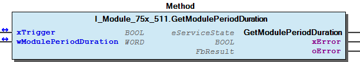
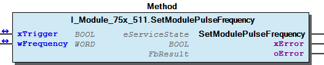

# WagoTypesModule_75x_511 v1.10.1.1 (WAGO) - Complete Documentation


## 📋 Library Information

- **Company:** WAGO
- **Title:** WagoTypesModule_75x_511
- **Version:** 1.10.1.1
- **Categories:** WAGO Internal|Common|Types and Interfaces
- **Author:** WAGO
- **Placeholder:** WagoTypesModule_75x_511

### Description ¶


This document is automatically generated. Because of this, the chapter 30 Visualization is not shown in this document. If you are interested in getting to know more about visualization, we refer to the library manager of e!Cockpit.

Handling modules 75x-511 [1]

This document is automatically generated. Because of this, the chapter 30 Visualization is not shown in this document. If you are interested in getting to know more about visualization, we refer to the library manager of e!Cockpit. Handling modules 75x-511 [1]

### Contents: ¶


Contents: - Documentation Index - Project Information - Library Information - Methods I_Module_75x_511.GetModulePeriodDuration (METH) - I_Module_75x_511.GetModulePulseFrequency (METH) - I_Module_75x_511.SetModulePeriodDuration (METH) - I_Module_75x_511.SetModulePulseFrequency (METH) Interfaces Program Organization Global Variable Lists Other Components

### Indices and tables ¶


| [1] | Based on WagoTypesModule_75x_511.library, last modified 10.11.2021, 13:04:20. LibDoc 3.5.15.30 |

© WAGO Kontakttechnik GmbH & Co. KG, Germany 2018 – All rights reserved. For the avoidance of doubt, this copyright notice does not only apply to the information above but also and primarily to the described library itself. Please note that third-party products are always mentioned without reference to intellectual property rights, including patents, utility models, designs and trademarks, accordingly the existence of such rights cannot be excluded. WAGO is a registered trademark of WAGO Verwaltungsgesellschaft mbH.

- File and Project Information - Library Reference © WAGO Kontakttechnik GmbH & Co. KG, Germany 2018 – All rights reserved. For the avoidance of doubt, this copyright notice does not only apply to the information above but also and primarily to the described library itself. Please note that third-party products are always mentioned without reference to intellectual property rights, including patents, utility models, designs and trademarks, accordingly the existence of such rights cannot be excluded. WAGO is a registered trademark of WAGO Verwaltungsgesellschaft mbH.

### Documentation Index


## WagoTypesModule_75x_511 Library Documentation


| Company: | WAGO |
| Title: | WagoTypesModule_75x_511 |
| Version: | 1.10.1.1 |
| Categories: | WAGO Internal\|Common\|Types and Interfaces |
| Author: | WAGO |
| Placeholder: | WagoTypesModule_75x_511 |

### Description


This document is automatically generated. Because of this, the chapter 30 Visualization is not shown in this document. If you are interested in getting to know more about visualization, we refer to the library manager of e!Cockpit.

Handling modules 75x-511 [1]

This document is automatically generated. Because of this, the chapter 30 Visualization is not shown in this document. If you are interested in getting to know more about visualization, we refer to the library manager of e!Cockpit. Handling modules 75x-511 [1]

### Contents:


- 20 Program Organization Units I_Module_75x_511 (ITF) VersionHistory (GVL)

### Indices and tables


| [1] | Based on WagoTypesModule_75x_511.library, last modified 10.11.2021, 13:04:20. LibDoc 3.5.15.30 |

© WAGO Kontakttechnik GmbH & Co. KG, Germany 2018 – All rights reserved. For the avoidance of doubt, this copyright notice does not only apply to the information above but also and primarily to the described library itself. Please note that third-party products are always mentioned without reference to intellectual property rights, including patents, utility models, designs and trademarks, accordingly the existence of such rights cannot be excluded. WAGO is a registered trademark of WAGO Verwaltungsgesellschaft mbH.

- File and Project Information - Library Reference © WAGO Kontakttechnik GmbH & Co. KG, Germany 2018 – All rights reserved. For the avoidance of doubt, this copyright notice does not only apply to the information above but also and primarily to the described library itself. Please note that third-party products are always mentioned without reference to intellectual property rights, including patents, utility models, designs and trademarks, accordingly the existence of such rights cannot be excluded. WAGO is a registered trademark of WAGO Verwaltungsgesellschaft mbH.

### Project Information


## File and Project Information


| Scope | Name | Type | Content |
| --- | --- | --- | --- |
| FileHeader | libraryFile | string | WagoTypesModule_75x_511.library |
| contentFile | WagoTypesModule_75x_511_clr.json |
| productName | e!COCKPIT |
| creationDateTime | date | 10.11.2021, 13:04:22 |
| companyName | string | WAGO |
| ProjectInformation | LastModificationDateTime | date | 10.11.2021, 13:04:20 |
| Description | string | See: Description |
| Copyright | © WAGO Kontakttechnik GmbH & Co. KG, Germany 2018 – All rights reserved. |
| Author | WAGO |
| AutoResolveUnbound | bool | True |
| Placeholder | string | WagoTypesModule_75x_511 |
| Company | WAGO |
| DocFormat | reStructuredText |
| Project | WagoTypesModule_75x_511 |
| Version | version | 1.10.1.1 |
| Version string | string |  |
| Title | WagoTypesModule_75x_511 |
| LibraryCategories | library-category-list | WAGO Internal\|Common\|Types and Interfaces |
| CompiledLibraryCompatibilityVersion | string | CODESYS V3.5 SP16 Patch 3 |

### Library Information


## Library Reference


This is a dictionary of all referenced libraries and their name spaces.

This is a dictionary of all referenced libraries and their name spaces.

### WagoSysErrorBase


#### Library Identification


Placeholder: WagoSysErrorBase Default Resolution: WagoSysErrorBase, * (WAGO) Namespace: WagoSysErrorBase

#### Library Properties


| LinkAllContent: False QualifiedOnly: False | Key: WagoSysErrorBase SystemLibrary: False | Optional: False |

### WagoSysVersion


#### Library Identification


Name: WagoSysVersion Version: 1.0.0.0 Company: WAGO Namespace: WagoSysVersion

#### Library Properties


| LinkAllContent: False QualifiedOnly: True | Key: WagoSysVersion, 1.0.0.0 (WAGO) SystemLibrary: False | Optional: False |

### WagoTypesModuleBase


#### Library Identification


Placeholder: WagoTypesModuleBase Default Resolution: WagoTypesModuleBase, * (WAGO) Namespace: WagoTypesModuleBase

#### Library Properties


| LinkAllContent: False QualifiedOnly: True | Key: WagoTypesModuleBase SystemLibrary: False | Optional: False |

#### Library Parameter


Parameter: MAX_MBX_SIZE = 18

### Methods


## I_Module_75x_511.GetModulePeriodDuration (METH)


| Scope | Name | Type | Comment |
| --- | --- | --- | --- |
| Return | GetModulePeriodDuration | WagoTypesModuleBase.eServiceState |  |
| Inout | xTrigger | BOOL |  |
| wModulePeriodDuration | WORD | [µs] |
| Output | xError | BOOL |  |
| oError | WagoSysErrorBase.FbResult |  |

| Return Value | Description |
| --- | --- |
| WagoTypesModuleBase.eServiceState.DONE | successful |
| WagoTypesModuleBase.eServiceState.ABORT | error -> see oError |
| WagoTypesModuleBase.eServiceState.NO_DATA | call while xTrigger is reset |

```
VAR
    myPeriodDuration    :   WORD;
    xGetPeriodDuration  :   BOOL;
    oError              :   WagoSysErrorBase.FbResult;
END_VAR

//--- Read Period Duration ------------------------------------------------
CASE my511.GetModulePeriodDuration( xGetPeriodDuration, myPeriodDuration, oError => oError ) OF

    WagoTypesModuleBase.eServiceState.DONE : ; // OK

    WagoTypesModuleBase.eServiceState.ABORT : // Error
            ;// process here your error handling -> see oError for more information

END_CASE
//-------------------------------------------------------------------------
```

Return Values

It is not allowed to reset the xTrigger by the application. This must done by the method.

Graphical Illustration

Graphical Interface of I_Module_75x_511.GetModulePeriodDuration

Example for ST

Reading the period of oscillation

You have to call the method cyclic until the method returns with DONE or ABORT.

Interface variables Function Get the module period of oscillation in µs. Return Values Warning It is not allowed to reset the xTrigger by the application. This must done by the method. Graphical Illustration  Graphical Interface of I_Module_75x_511.GetModulePeriodDuration Example for ST Reading the period of oscillation Note You have to call the method cyclic until the method returns with DONE or ABORT.

## I_Module_75x_511.GetModulePulseFrequency (METH)


| Scope | Name | Type | Comment |
| --- | --- | --- | --- |
| Return | GetModulePulseFrequency | WagoTypesModuleBase.eServiceState |  |
| Inout | xTrigger | BOOL |  |
| wFrequency | WORD | [Hz] |
| Output | xError | BOOL |  |
| oError | WagoSysErrorBase.FbResult |  |

| Return Value | Description |
| --- | --- |
| WagoTypesModuleBase.eServiceState.DONE | successful |
| WagoTypesModuleBase.eServiceState.ABORT | error -> see oError |
| WagoTypesModuleBase.eServiceState.NO_DATA | call while xTrigger is reset |

```
VAR
    myPulseFrequency    :   WORD;
    xGetPulseFrequency  :   BOOL;
    oError              :   WagoSysErrorBase.FbResult;
END_VAR

//--- Read Pulse Frequency ------------------------------------------------
CASE my511.GetModulePulseFrequency( xGetPulseFrequency, myPulseFrequency, oError => oError ) OF

    WagoTypesModuleBase.eServiceState.DONE : ; // OK

    WagoTypesModuleBase.eServiceState.ABORT : // Error
            ;// process here your error handling -> see oError for more information

END_CASE
//-------------------------------------------------------------------------
```

Get the module Pulse Frequency in Hz.

If you have changed the period of oscillation (e.g. with SetModulePeriodDuration(...) ) it is possible that you not get the actual frequency. In this case use GetModulePeriodDuration() and calculate the frequency by yourself.

Return Values

It is not allowed to reset the xTrigger by the application. This must done by the method.

Graphical Illustration

Graphical Interface of I_Module_75x_511.GetModulePulseFrequency

Example for ST

Reading the module pulse frequency

You have to call the method cyclic until the method returns with DONE or ABORT.

Interface variables Function Get the module Pulse Frequency in Hz. Note If you have changed the period of oscillation (e.g. with SetModulePeriodDuration(...) ) it is possible that you not get the actual frequency. In this case use GetModulePeriodDuration() and calculate the frequency by yourself. Return Values Warning It is not allowed to reset the xTrigger by the application. This must done by the method. Graphical Illustration  Graphical Interface of I_Module_75x_511.GetModulePulseFrequency Example for ST Reading the module pulse frequency Note You have to call the method cyclic until the method returns with DONE or ABORT.

## I_Module_75x_511.SetModulePeriodDuration (METH)


| Scope | Name | Type | Comment |
| --- | --- | --- | --- |
| Return | SetModulePeriodDuration | WagoTypesModuleBase.eServiceState |  |
| Inout | xTrigger | BOOL |  |
| wModulePeriodDuration | WORD | [us]; |
| Output | xError | BOOL |  |
| oError | WagoSysErrorBase.FbResult |  |

| Return Value | Description |
| --- | --- |
| WagoTypesModuleBase.eServiceState.DONE | successful |
| WagoTypesModuleBase.eServiceState.ABORT | error -> see oError |
| WagoTypesModuleBase.eServiceState.NO_DATA | call while xTrigger is reset |

```
VAR
    myPeriodDuration    :   WORD := 4000; // [µs]
    xSetPeriodDuration  :   BOOL;
    oError              :   WagoSysErrorBase.FbResult;
END_VAR

//--- Read Period Duration ------------------------------------------------
CASE my511.SetModulePeriodDuration( xSetPeriodDuration, myPeriodDuration, oError => oError ) OF

    WagoTypesModuleBase.eServiceState.DONE : ; // OK successful written

    WagoTypesModuleBase.eServiceState.ABORT : // Error
            ;// process here your error handling -> see oError for more information

END_CASE
//-------------------------------------------------------------------------
```

Set the module period of oscillation in µs.

If you have changed the period of oscillation with this method it is not possible to get the actual frequency by the method GetModulePulseFrequency() .

Return Values

It is not allowed to reset the xTrigger by the application. This must done by the method.

Graphical Illustration

Graphical Interface of I_Module_75x_511.SetModulePeriodDuration

Example for ST

Write the period of oscillation

You have to call the method cyclic until the method returns with DONE or ABORT.

Interface variables Function Set the module period of oscillation in µs. Note If you have changed the period of oscillation with this method it is not possible to get the actual frequency by the method GetModulePulseFrequency() . Return Values Warning It is not allowed to reset the xTrigger by the application. This must done by the method. Graphical Illustration  Graphical Interface of I_Module_75x_511.SetModulePeriodDuration Example for ST Write the period of oscillation Note You have to call the method cyclic until the method returns with DONE or ABORT.

## I_Module_75x_511.SetModulePulseFrequency (METH)


| Scope | Name | Type | Comment |
| --- | --- | --- | --- |
| Return | SetModulePulseFrequency | WagoTypesModuleBase.eServiceState |  |
| Inout | xTrigger | BOOL |  |
| wFrequency | WORD | [Hz]; |
| Output | xError | BOOL |  |
| oError | WagoSysErrorBase.FbResult |  |

| Return Value | Description |
| --- | --- |
| WagoTypesModuleBase.eServiceState.DONE | successful |
| WagoTypesModuleBase.eServiceState.ABORT | error -> see oError |
| WagoTypesModuleBase.eServiceState.NO_DATA | call while xTrigger is reset |

```
VAR
    myPulseFrequency    :   WORD;
    xSetPulseFrequency  :   BOOL;
    oError              :   WagoSysErrorBase.FbResult;
END_VAR

//--- Write Pulse Frequency ------------------------------------------------
CASE my511.SetModulePulseFrequency( xGetPulseFrequency, myPulseFrequency, oError => oError ) OF

    WagoTypesModuleBase.eServiceState.DONE : ; // OK successful written

    WagoTypesModuleBase.eServiceState.ABORT : // Error
            ;// process here your error handling -> see oError for more information

END_CASE
//-------------------------------------------------------------------------
```

Return Values

It is not allowed to reset the xTrigger by the application. This must done by the method.

Graphical Illustration

Graphical Interface of I_Module_75x_511.SetModulePulseFrequency

Example for ST

Write the module pulse frequency

You have to call the method cyclic until the method returns with DONE or ABORT.

Interface variables Function Set the module Pulse Frequency in Hz. Return Values Warning It is not allowed to reset the xTrigger by the application. This must done by the method. Graphical Illustration  Graphical Interface of I_Module_75x_511.SetModulePulseFrequency Example for ST Write the module pulse frequency Note You have to call the method cyclic until the method returns with DONE or ABORT.

### Interfaces


## I_Module_75x_511 (ITF)


- Configuration I_Module_75x_511.GetModulePeriodDuration (METH) - I_Module_75x_511.GetModulePulseFrequency (METH) - I_Module_75x_511.SetModulePeriodDuration (METH) - I_Module_75x_511.SetModulePulseFrequency (METH)

### Program Organization


## 20 Program Organization Units


- I_Module_75x_511 (ITF) Configuration I_Module_75x_511.GetModulePeriodDuration (METH) - I_Module_75x_511.GetModulePulseFrequency (METH) - I_Module_75x_511.SetModulePeriodDuration (METH) - I_Module_75x_511.SetModulePulseFrequency (METH)

### Global Variable Lists


## VersionHistory (GVL)


| date | version | author | change |
| 20.09.2021 | 1.10.1.1 | u010545 | Update documentation -> WAT33562 |
| 08.01.2019 | 1.10.1.0 | u015842 | Properties: free placeholder added |
| 20.04.2018 | 1.10.0.0 | u010545 | add new methods |
| 19.09.2017 | 1.8.0.0 | u010663 | released |

WagoTypesModule_75x_511.library

Release Notes:

WagoTypesModule_75x_511.library Release Notes:

### Other Components


## Configuration


- I_Module_75x_511.GetModulePeriodDuration (METH) - I_Module_75x_511.GetModulePulseFrequency (METH) - I_Module_75x_511.SetModulePeriodDuration (METH) - I_Module_75x_511.SetModulePulseFrequency (METH)