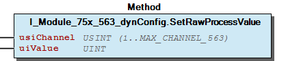

# WagoTypesModule_75x_563 v1.9.3.0 (WAGO) - Complete Documentation


## 📋 Library Information

- **Company:** WAGO
- **Title:** WagoTypesModule_75x_563
- **Version:** 1.9.3.0
- **Categories:** WAGO Internal|Common|Types and Interfaces
- **Author:** WAGO
- **Placeholder:** WagoTypesModule_75x_563

### Description ¶


This document is automatically generated. Because of this, the chapter 30 Visualization is not shown in this document. If you are interested in getting to know more about visualization, we refer to the library manager of e!Cockpit.

Handling modules 75x-563 [1]

This document is automatically generated. Because of this, the chapter 30 Visualization is not shown in this document. If you are interested in getting to know more about visualization, we refer to the library manager of e!Cockpit. Handling modules 75x-563 [1]

### Contents: ¶


Contents: - Documentation Index - Project Information - Library Information - Methods I_Module_75x_563.GetRawChannelCalibration (METH) - I_Module_75x_563.GetRawChannelConfiguration (METH) - I_Module_75x_563.GetRawChannelScaling (METH) - I_Module_75x_563.GetRawChannelSettings (METH) - I_Module_75x_563.SetRawChannelCalibration (METH) - I_Module_75x_563.SetRawChannelConfiguration (METH) - I_Module_75x_563.SetRawChannelScaling (METH) - I_Module_75x_563.SetRawChannelSettings (METH) - I_Module_75x_563_dynConfig.GetRawProcessValue (METH) - I_Module_75x_563_dynConfig.SetRawProcessValue (METH) - ... and 1 more Interfaces - I_Module_75x_563 (ITF) - I_Module_75x_563_dynConfig (ITF) Program Organization Global Variable Lists - Channels_563 (GVL) - VersionHistory (GVL) Other Components - 10 Enumeration - 15 Datatypes - Channel - Configuration - Raw - eActionAtKbusTimeout (ENUM) - eNumberFormat (ENUM) - ePowerOnDelay (ENUM) - eSignalType (ENUM) - typRawChannelCalibration (STRUCT) - ... and 2 more

### Indices and tables ¶


| [1] | Based on WagoTypesModule_75x_563.library, last modified 13.08.2019, 19:53:52. The content of this file was automatically generated with None on 13.08.2019, 19:53:55 |

© WAGO Kontakttechnik GmbH & Co. KG, Germany 2018 – All rights reserved. For the avoidance of doubt, this copyright notice does not only apply to the information above but also and primarily to the described library itself. Please note that third-party products are always mentioned without reference to intellectual property rights, including patents, utility models, designs and trademarks, accordingly the existence of such rights cannot be excluded. WAGO is a registered trademark of WAGO Verwaltungsgesellschaft mbH.

- File and Project Information - Library Reference © WAGO Kontakttechnik GmbH & Co. KG, Germany 2018 – All rights reserved. For the avoidance of doubt, this copyright notice does not only apply to the information above but also and primarily to the described library itself. Please note that third-party products are always mentioned without reference to intellectual property rights, including patents, utility models, designs and trademarks, accordingly the existence of such rights cannot be excluded. WAGO is a registered trademark of WAGO Verwaltungsgesellschaft mbH.

### Documentation Index


## WagoTypesModule_75x_563 Library Documentation


| Company: | WAGO |
| Title: | WagoTypesModule_75x_563 |
| Version: | 1.9.3.0 |
| Categories: | WAGO Internal\|Common\|Types and Interfaces |
| Author: | WAGO |
| Placeholder: | WagoTypesModule_75x_563 |

### Description


This document is automatically generated. Because of this, the chapter 30 Visualization is not shown in this document. If you are interested in getting to know more about visualization, we refer to the library manager of e!Cockpit.

Handling modules 75x-563 [1]

This document is automatically generated. Because of this, the chapter 30 Visualization is not shown in this document. If you are interested in getting to know more about visualization, we refer to the library manager of e!Cockpit. Handling modules 75x-563 [1]

### Contents:


- 20 Program Organization Units 10 Enumeration - 15 Datatypes - Channels_563 (GVL) - I_Module_75x_563 (ITF) - I_Module_75x_563_dynConfig (ITF) VersionHistory (GVL)

### Indices and tables


| [1] | Based on WagoTypesModule_75x_563.library, last modified 13.08.2019, 19:53:52. The content of this file was automatically generated with None on 13.08.2019, 19:53:55 |

© WAGO Kontakttechnik GmbH & Co. KG, Germany 2018 – All rights reserved. For the avoidance of doubt, this copyright notice does not only apply to the information above but also and primarily to the described library itself. Please note that third-party products are always mentioned without reference to intellectual property rights, including patents, utility models, designs and trademarks, accordingly the existence of such rights cannot be excluded. WAGO is a registered trademark of WAGO Verwaltungsgesellschaft mbH.

- File and Project Information - Library Reference © WAGO Kontakttechnik GmbH & Co. KG, Germany 2018 – All rights reserved. For the avoidance of doubt, this copyright notice does not only apply to the information above but also and primarily to the described library itself. Please note that third-party products are always mentioned without reference to intellectual property rights, including patents, utility models, designs and trademarks, accordingly the existence of such rights cannot be excluded. WAGO is a registered trademark of WAGO Verwaltungsgesellschaft mbH.

### Project Information


## File and Project Information


| Scope | Name | Type | Content |
| --- | --- | --- | --- |
| FileHeader | libraryFile | string | WagoTypesModule_75x_563.library |
| contentFile | WagoTypesModule_75x_563_clr.json |
| productName | e!COCKPIT |
| creationDateTime | date | 13.08.2019, 19:53:55 |
| companyName | string | WAGO |
| ProjectInformation | LastModificationDateTime | date | 13.08.2019, 19:53:52 |
| Description | string | See: Description |
| DocFormat | reStructuredText |
| Author | WAGO |
| AutoResolveUnbound | bool | True |
| Placeholder | string | WagoTypesModule_75x_563 |
| Company | WAGO |
| Title | WagoTypesModule_75x_563 |
| Project | WagoTypesModule_75x_563 |
| Copyright | © WAGO Kontakttechnik GmbH & Co. KG, Germany 2018 – All rights reserved. |
| Version | version | 1.9.3.0 |
| Version string | string |  |
| LibraryCategories | library-category-list | WAGO Internal\|Common\|Types and Interfaces |

### Library Information


## Library Reference


| LinkAllContent: False QualifiedOnly: False | SystemLibrary: False | Optional: False |

| LinkAllContent: False QualifiedOnly: True | SystemLibrary: False | Optional: False |

| LinkAllContent: False QualifiedOnly: True | SystemLibrary: False | Optional: False |

This is a dictionary of all referenced libraries and their name spaces.

This is a dictionary of all referenced libraries and their name spaces. WagoSysErrorBase Library Identification : Placeholder: WagoSysErrorBase Default Resolution: WagoSysErrorBase, * (WAGO) Namespace: WagoSysErrorBase Library Properties : WagoSysVersion Library Identification : Name: WagoSysVersion Version: 1.0.0.0 Company: WAGO Namespace: WagoSysVersion Library Properties : WagoTypesModuleBase Library Identification : Placeholder: WagoTypesModuleBase Default Resolution: WagoTypesModuleBase, * (WAGO) Namespace: WagoTypesModuleBase Library Properties : Library Parameter : Parameter: MAX_MBX_SIZE = 18

### Methods


## I_Module_75x_563.GetRawChannelCalibration (METH)


| Scope | Name | Type |
| --- | --- | --- |
| Return | GetRawChannelCalibration | WagoTypesModuleBase.eServiceState |
| Input | usiChannel | USINT (1..MAX_CHANNEL_563) |
| Inout | xTrigger | BOOL |
| utRawChannelCalibration | typRawChannelCalibration |
| Output | xError | BOOL |
| oError | WagoSysErrorBase.FbResult |

| Struct member | Value | Description |
| --- | --- | --- |
| xUserCalibration | FALSE | The user scaling is switched off |
| TRUE | The user scaling is switched on |
| iUserCalibrationOffset | -32768 ... 32767 | User calibration Offset |
| uiUserCalibrationGain | 0 ... 65535 | User calibration Gain * 1/8192 |

```
VAR
    //--- Channel Calibration ---------------------------------
    utChannelCalibration    :   WagoTypesModule_75x_563.typRawChannelCalibration;;
    xGetChannelCalibration  :   BOOL;
    oError                  :   WagoSysErrorBase.FbResult;
END_VAR

//--- C H A N N E L    C A L I B R A T I O N -----------------------
CASE my563.GetRawChannelCalibration(    usiChannel              := 1,
                                        xTrigger                := xGetChannelCalibration,
                                        utRawChannelCalibration := utChannelCalibration,
                                        oError                  => oError
                                    ) OF

    eServiceState.DONE : // OK
            ;// process here your utModuleSettings

    eServiceState.ABORT : // Error
            ;// process here your error handling -> see oError for more information

END_CASE
```

typRawChannelCalibration

Graphical Illustration

Graphical Interface of I_Module_75x_563.GetRawChannelCalibration

For get the calibration from channel one

You have to call the method cyclic until the method returns with DONE or ABORT.

Interface variables Function Get the calibration of a channel at a struct. typRawChannelCalibration Graphical Illustration  Graphical Interface of I_Module_75x_563.GetRawChannelCalibration Example For get the calibration from channel one Note You have to call the method cyclic until the method returns with DONE or ABORT.

## I_Module_75x_563.GetRawChannelConfiguration (METH)


| Scope | Name | Type |
| --- | --- | --- |
| Return | GetRawChannelConfiguration | WagoTypesModuleBase.eServiceState |
| Input | usiChannel | USINT (1..MAX_CHANNEL_563) |
| Inout | xTrigger | BOOL |
| utRawChannelConfiguration | typRawChannelConfiguration |
| Output | xError | BOOL |
| oError | WagoSysErrorBase.FbResult |

| Struct member | Value | Description |
| --- | --- | --- |
| Settings | eSignalType | Operation Mode |
| VOLTAGE_PLUS_18V | (0)6..18V |
| CURRENT_PLUS_20mA | 0..20mA |
| CURRENT_PLUS_4_20mA | 4..20mA |
|  |  |  |
| eNumberFormat | Number Format |
| ABS_16BIT | 0..65535 |
| TWOS_COMPLEMENT | -32768..+32767 (Two’s Complement) |
| SIGN_MAGNITUDE | -32767..+32767 (Sign and magnitude) |
|  |  |  |
| xOutputHighImpedance | Output |
| FALSE | Output process value |
| TRUE | Output high impedance |
|  |  |  |
| ePowerOnDelay | Power-On Delay After Excess Temperature Shutdown |
| DELAY_0_MS | 0 ms Delay |
| DELAY_100_MS | 100 ms Delay |
| DELAY_200_MS | 200 ms Delay |
| DELAY_300_MS | 300 ms Delay |
| DELAY_500_MS | 500 ms Delay |
| DELAY_750_MS | 750 ms Delay |
| DELAY_1_S | 1 s Delay |
| DELAY_2_S | 2 s Delay |
|  |  |  |
| xEnableKeepLimitValues | Keep Limit Values |
| FALSE | Keep Limit Values disabled |
| TRUE | Keep Limit Values enabled |
| uiLowerLimitValue | 0 ... 65535 | Lower Limit Value |
| uiUpperLimitValue | 0 ... 65535 | Upper Limit Value |
|  |  |  |
| xEnableActionAtKbusTimeout | K-Bus Timeout Behaviour |
| FALSE | Keep last output value |
| TRUE | Execute the function at eActionAtKbusTimeout |
| eActionAtKbusTimeout | OUTPUT_NULL | Output 0V / 0A |
| KEEP_LAST_VALUE | Keep last value |
| MANUFACTURER_POWERON_VALUE | WAGO power-on value |
| USER_POWER_ON_VALUE | User power-on value |
| OUTPUT_HIGH_IMPEDANCE | Output high-impedance |
| uiUserPowerOnValue | 0 ... 65535 | User Power-On Value |
|  |  |  |  |
| Scaling | xUserScaling | FALSE | User scaling disabled |
| TRUE | User scaling enabled |
| iUserScalingOffset | -32768 ... 32767 | User scaling Offset |
| uiUserScalingGain | 0 ... 65535 | User scaling Gain -> 1/256 |
|  |  |  |  |
| Calibration | xUserCalibration | FALSE | The user scaling is switched off |
| TRUE | The user scaling is switched on |
| iUserCalibrationOffset | -32768 ... 32767 | User calibration Offset |
| uiUserCalibrationGain | 0 ... 65535 | User calibration Gain * 1/8192 |

```
VAR
    //--- Channel Configuration ---------------------------------
    utRawChannelConfiguration   :   WagoTypesModule_75x_563.typRawChannelConfiguration;
    xGetRawChannelConfiguration :   BOOL;
    oError                      :   WagoSysErrorBase.FbResult;
END_VAR

//--- C H A N N E L    C O N F I G U R A T I O N -----------------------
CASE my563.GetRawChannelConfiguration(  usiChannel                  := 1,
                                        xTrigger                    := xGetRawChannelConfiguration,
                                        utRawChannelConfiguration   := utRawChannelConfiguration,
                                        oError                      => oError
                                    ) OF

    eServiceState.DONE : // OK
            ;// process here your utChannelConfiguration

    eServiceState.ABORT : // Error
            ;// process here your error handling -> see oError for more information

END_CASE
```

typRawChannelConfiguration

Graphical Illustration

Graphical Interface of I_Module_75x_563.GetRawChannelConfiguration

For get the configuration from channel one

You have to call the method cyclic until the method returns with DONE or ABORT.

Interface variables Function Get the complete raw configuration of a channel. typRawChannelConfiguration Graphical Illustration  Graphical Interface of I_Module_75x_563.GetRawChannelConfiguration Example For get the configuration from channel one Note You have to call the method cyclic until the method returns with DONE or ABORT.

## I_Module_75x_563.GetRawChannelScaling (METH)


| Scope | Name | Type |
| --- | --- | --- |
| Return | GetRawChannelScaling | WagoTypesModuleBase.eServiceState |
| Input | usiChannel | USINT (1..MAX_CHANNEL_563) |
| Inout | xTrigger | BOOL |
| utRawChannelScaling | typRawChannelScaling |
| Output | xError | BOOL |
| oError | WagoSysErrorBase.FbResult |

| Struct member | Value | Description |
| --- | --- | --- |
| xUserScaling | FALSE | User scaling disabled |
| TRUE | User scaling enabled |
| iUserScalingOffset | -32768 ... 32767 | User scaling Offset |
| uiUserScalingGain | 0 ... 65535 | User scaling Gain -> 1/256 |

```
VAR
    //--- Channel Settings ---------------------------------
    utChannelScaling    :   WagoTypesModule_75x_563.typRawChannelScaling;;
    xGetChannelScaling  :   BOOL;
    oError              :   WagoSysErrorBase.FbResult;
END_VAR

//--- C H A N N E L   S C A L I N G ------------------------
CASE my563.GetRawChannelScaling(    usiChannel           := 1,
                                    xTrigger             := xGetChannelScaling,
                                    utRawChannelScaling  := utChannelScaling,
                                    oError               => oError
                                ) OF

    eServiceState.DONE : // OK
            ;// process here your utModuleSettings

    eServiceState.ABORT : // Error
            ;// process here your error handling -> see oError for more information

END_CASE
```

typRawChannelScaling

Graphical Illustration

Graphical Interface of I_Module_75x_563.GetRawChannelScaling

For get the scaling from channel one

You have to call the method cyclic until the method returns with DONE or ABORT.

Interface variables Function Get the scaling of a channel at a struct. typRawChannelScaling Graphical Illustration  Graphical Interface of I_Module_75x_563.GetRawChannelScaling Example For get the scaling from channel one Note You have to call the method cyclic until the method returns with DONE or ABORT.

## I_Module_75x_563.GetRawChannelSettings (METH)


| Scope | Name | Type |
| --- | --- | --- |
| Return | GetRawChannelSettings | WagoTypesModuleBase.eServiceState |
| Input | usiChannel | USINT (1..MAX_CHANNEL_563) |
| Inout | xTrigger | BOOL |
| utRawChannelSettings | typRawChannelSettings |
| Output | xError | BOOL |
| oError | WagoSysErrorBase.FbResult |

| Struct member | Value | Description |
| --- | --- | --- |
| eSignalType | Operation Mode |
| VOLTAGE_PLUS_18V | (0)6..18V |
| CURRENT_PLUS_20mA | 0..20mA |
| CURRENT_PLUS_4_20mA | 4..20mA |
|  |  |  |
| eNumberFormat | Number Format |
| ABS_16BIT | 0..65535 |
| TWOS_COMPLEMENT | -32768..+32767 (Two’s Complement) |
| SIGN_MAGNITUDE | -32767..+32767 (Sign and magnitude) |
|  |  |  |
| xOutputHighImpedance | Output |
| FALSE | Output process value |
| TRUE | Output high impedance |
|  |  |  |
| ePowerOnDelay | Power-On Delay After Excess Temperature Shutdown |
| DELAY_0_MS | 0 ms Delay |
| DELAY_100_MS | 100 ms Delay |
| DELAY_200_MS | 200 ms Delay |
| DELAY_300_MS | 300 ms Delay |
| DELAY_500_MS | 500 ms Delay |
| DELAY_750_MS | 750 ms Delay |
| DELAY_1_S | 1 s Delay |
| DELAY_2_S | 2 s Delay |
|  |  |  |
| xEnableKeepLimitValues | Keep Limit Values |
| FALSE | Keep Limit Values disabled |
| TRUE | Keep Limit Values enabled |
| uiLowerLimitValue | 0 ... 65535 | Lower Limit Value |
| uiUpperLimitValue | 0 ... 65535 | Upper Limit Value |
|  |  |  |
| xEnableActionAtKbusTimeout | K-Bus Timeout Behaviour |
| FALSE | Keep last output value |
| TRUE | Execute the function at eActionAtKbusTimeout |
| eActionAtKbusTimeout | OUTPUT_NULL | Output 0V / 0A |
| KEEP_LAST_VALUE | Keep last value |
| MANUFACTURER_POWERON_VALUE | WAGO power-on value |
| USER_POWER_ON_VALUE | User power-on value |
| OUTPUT_HIGH_IMPEDANCE | Output high-impedance |
| uiUserPowerOnValue | 0 ... 65535 | User Power-On Value |

```
VAR
    //--- Channel Settings ---------------------------------
    utChannelSettings   :   WagoTypesModule_75x_563.typRawChannelSettings;;
    xGetChannelSettings :   BOOL;
    oError              :   WagoSysErrorBase.FbResult;
END_VAR

//--- C H A N N E L   S E T T I N G S ----------------------
CASE my563.GetRawChannelSettings(   usiChannel           := 1,
                                    xTrigger             := xGetChannelSettings,
                                    utRawChannelSettings := utChannelSettings,
                                    oError               => oError
                                ) OF

    eServiceState.DONE : // OK
        ;// process here your utModuleSettings

    eServiceState.ABORT : // Error
        ;// process here your error handling -> see oError for more information

END_CASE
```

typRawChannelSettings

Graphical Illustration

Graphical Interface of I_Module_75x_563.GetRawChannelSettings

For get the settings from channel one

You have to call the method cyclic until the method returns with DONE or ABORT.

Interface variables Function Get the settings of a channel at a struct. typRawChannelSettings Graphical Illustration  Graphical Interface of I_Module_75x_563.GetRawChannelSettings Example For get the settings from channel one Note You have to call the method cyclic until the method returns with DONE or ABORT.

## I_Module_75x_563.SetRawChannelCalibration (METH)


| Scope | Name | Type |
| --- | --- | --- |
| Return | SetRawChannelCalibration | WagoTypesModuleBase.eServiceState |
| Input | usiChannel | USINT (1..MAX_CHANNEL_563) |
| Inout | xTrigger | BOOL |
| utRawChannelCalibration | typRawChannelCalibration |
| Output | xError | BOOL |
| oError | WagoSysErrorBase.FbResult |

| Struct member | Value | Description |
| --- | --- | --- |
| xUserCalibration | FALSE | The user scaling is switched off |
| TRUE | The user scaling is switched on |
| iUserCalibrationOffset | -32768 ... 32767 | User calibration Offset |
| uiUserCalibrationGain | 0 ... 65535 | User calibration Gain * 1/8192 |

```
VAR
    //--- Channel Calibration ---------------------------------
    utChannelCalibration    :   WagoTypesModule_75x_563.typRawChannelCalibration;;
    xSetChannelCalibration  :   BOOL;
    oError                  :   WagoSysErrorBase.FbResult;
END_VAR

//--- C H A N N E L    C A L I B R A T I O N -----------------------
CASE my563.SetRawChannelCalibration(    usiChannel              := 1,
                                        xTrigger                := xSetChannelCalibration,
                                        utRawChannelCalibration := utChannelCalibration,
                                        oError                  => oError
                                   ) OF

    eServiceState.DONE : // OK
            ;// process here your utModuleSettings

    eServiceState.ABORT : // Error
            ;// process here your error handling -> see oError for more information

END_CASE
```

typRawChannelCalibration

Graphical Illustration

Graphical Interface of I_Module_75x_563.SetRawChannelCalibration

For set the calibration of channel one

You have to call the method cyclic until the method returns with DONE or ABORT.

Interface variables Function Set the calibration of a channel by a struct. typRawChannelCalibration Graphical Illustration  Graphical Interface of I_Module_75x_563.SetRawChannelCalibration Example For set the calibration of channel one Note You have to call the method cyclic until the method returns with DONE or ABORT.

## I_Module_75x_563.SetRawChannelConfiguration (METH)


| Scope | Name | Type |
| --- | --- | --- |
| Return | SetRawChannelConfiguration | WagoTypesModuleBase.eServiceState |
| Input | usiChannel | USINT (1..MAX_CHANNEL_563) |
| Inout | xTrigger | BOOL |
| utRawChannelConfiguration | typRawChannelConfiguration |
| Output | xError | BOOL |
| oError | WagoSysErrorBase.FbResult |

| Struct member | Value | Description |
| --- | --- | --- |
| Settings | eSignalType | Operation Mode |
| VOLTAGE_PLUS_18V | (0)6..18V |
| CURRENT_PLUS_20mA | 0..20mA |
| CURRENT_PLUS_4_20mA | 4..20mA |
|  |  |  |
| eNumberFormat | Number Format |
| ABS_16BIT | 0..65535 |
| TWOS_COMPLEMENT | -32768..+32767 (Two’s Complement) |
| SIGN_MAGNITUDE | -32767..+32767 (Sign and magnitude) |
|  |  |  |
| xOutputHighImpedance | Output |
| FALSE | Output process value |
| TRUE | Output high impedance |
|  |  |  |
| ePowerOnDelay | Power-On Delay After Excess Temperature Shutdown |
| DELAY_0_MS | 0 ms Delay |
| DELAY_100_MS | 100 ms Delay |
| DELAY_200_MS | 200 ms Delay |
| DELAY_300_MS | 300 ms Delay |
| DELAY_500_MS | 500 ms Delay |
| DELAY_750_MS | 750 ms Delay |
| DELAY_1_S | 1 s Delay |
| DELAY_2_S | 2 s Delay |
|  |  |  |
| xEnableKeepLimitValues | Keep Limit Values |
| FALSE | Keep Limit Values disabled |
| TRUE | Keep Limit Values enabled |
| uiLowerLimitValue | 0 ... 65535 | Lower Limit Value |
| uiUpperLimitValue | 0 ... 65535 | Upper Limit Value |
|  |  |  |
| xEnableActionAtKbusTimeout | K-Bus Timeout Behaviour |
| FALSE | Keep last output value |
| TRUE | Execute the function at eActionAtKbusTimeout |
| eActionAtKbusTimeout | OUTPUT_NULL | Output 0V / 0A |
| KEEP_LAST_VALUE | Keep last value |
| MANUFACTURER_POWERON_VALUE | WAGO power-on value |
| USER_POWER_ON_VALUE | User power-on value |
| OUTPUT_HIGH_IMPEDANCE | Output high-impedance |
| uiUserPowerOnValue | 0 ... 65535 | User Power-On Value |
|  |  |  |  |
| Scaling | xUserScaling | FALSE | User scaling disabled |
| TRUE | User scaling enabled |
| iUserScalingOffset | -32768 ... 32767 | User scaling Offset |
| uiUserScalingGain | 0 ... 65535 | User scaling Gain |
|  |  |  |  |
| Calibration | xUserCalibration | FALSE | The user scaling is switched off |
| TRUE | The user scaling is switched on |
| iUserCalibrationOffset | -32768 ... 32767 | User calibration Offset |
| uiUserCalibrationGain | 0 ... 65535 | User calibration Gain * 1/8192 |

```
VAR
    //--- Channel Configuration -------------------------------------------------------
    xStartProcess               :   BOOL; // set this variable once to start the process -> this varibale will be automatic reset
    utRawChannelConfiguration   :   WagoTypesModule_75x_563.typRawChannelConfiguration;
    oError                      :   WagoSysErrorBase.FbResult;
    xSetRawChannelConfiguration :   BOOL;
END_VAR

//--- C H A N N E L    C O N F I G U R A T I O N -----------------------
//--- READ BEFORE WRITE --------------------------------------------------------------
CASE my563.GetRawChannelConfiguration( 1, xStartProcess, utRawChannelConfiguration, oError => oError) OF

    eServiceState.DONE : // OK -> actual configuration is successful read
        // change here your configuration
        // utRawChannelConfiguration... :=
        xSetRawChannelConfiguration := TRUE; // trigger write

    eServiceState.ABORT : // Error -> not able to read -> see oError
            ;// process here your error handling for read -> see oError for more information

END_CASE

//--- WRITE MODYFIED CONFIGURATION ---------------------------------------------------
CASE my563.SetRawChannelConfiguration( 1, xSetRawChannelConfiguration, utRawChannelConfiguration, oError => oError) OF

    eServiceState.DONE : // OK -> new configuration is written

    eServiceState.ABORT : // Error -> not able to write -> see oError
            ;// process here your error handling for write -> see oError for more information

END_CASE
```

typRawChannelConfiguration

Graphical Illustration

Graphical Interface of I_Module_75x_563.SetRawChannelConfiguration

For get the configuration from channel one and after read write the configuration

You have to call the method cyclic until the method returns with DONE or ABORT.

Interface variables Function Set the complete raw configuration of a channel. typRawChannelConfiguration Graphical Illustration  Graphical Interface of I_Module_75x_563.SetRawChannelConfiguration Example For get the configuration from channel one and after read write the configuration Note You have to call the method cyclic until the method returns with DONE or ABORT.

## I_Module_75x_563.SetRawChannelScaling (METH)


| Scope | Name | Type |
| --- | --- | --- |
| Return | SetRawChannelScaling | WagoTypesModuleBase.eServiceState |
| Input | usiChannel | USINT (1..MAX_CHANNEL_563) |
| Inout | xTrigger | BOOL |
| utRawChannelScaling | typRawChannelScaling |
| Output | xError | BOOL |
| oError | WagoSysErrorBase.FbResult |

| Struct member | Value | Description |
| --- | --- | --- |
| xUserScaling | FALSE | User scaling disabled |
| TRUE | User scaling enabled |
| iUserScalingOffset | -32768 ... 32767 | User scaling Offset |
| uiUserScalingGain | 0 ... 65535 | User scaling Gain |

```
VAR
    //--- Channel Settings ---------------------------------
    utChannelScaling    :   WagoTypesModule_75x_563.typRawChannelScaling;;
    xSetChannelScaling  :   BOOL;
    oError              :   WagoSysErrorBase.FbResult;
END_VAR

//--- C H A N N E L   S C A L I N G ------------------------
CASE my563.SetRawChannelScaling(    usiChannel          := 1,
                                    xTrigger            := xSetChannelScaling,
                                    utRawChannelScaling := utChannelScaling,
                                    oError              => oError
                                ) OF

    eServiceState.DONE : // OK
            ;// process here your utModuleSettings

    eServiceState.ABORT : // Error
            ;// process here your error handling -> see oError for more information

END_CASE
```

typRawChannelScaling

Graphical Illustration

Graphical Interface of I_Module_75x_563.SetRawChannelScaling

For set the scaling of channel one

You have to call the method cyclic until the method returns with DONE or ABORT.

Interface variables Function Set the scaling of a channel by a struct. typRawChannelScaling Graphical Illustration  Graphical Interface of I_Module_75x_563.SetRawChannelScaling Example For set the scaling of channel one Note You have to call the method cyclic until the method returns with DONE or ABORT.

## I_Module_75x_563.SetRawChannelSettings (METH)


| Scope | Name | Type |
| --- | --- | --- |
| Return | SetRawChannelSettings | WagoTypesModuleBase.eServiceState |
| Input | usiChannel | USINT (1..MAX_CHANNEL_563) |
| Inout | xTrigger | BOOL |
| utRawChannelSettings | typRawChannelSettings |
| Output | xError | BOOL |
| oError | WagoSysErrorBase.FbResult |

| Struct member | Value | Description |
| --- | --- | --- |
| eSignalType | Operation Mode |
| VOLTAGE_PLUS_18V | (0)6..18V |
| CURRENT_PLUS_20mA | 0..20mA |
| CURRENT_PLUS_4_20mA | 4..20mA |
|  |  |  |
| eNumberFormat | Number Format |
| ABS_16BIT | 0..65535 |
| TWOS_COMPLEMENT | -32768..+32767 (Two’s Complement) |
| SIGN_MAGNITUDE | -32767..+32767 (Sign and magnitude) |
|  |  |  |
| xOutputHighImpedance | Output |
| FALSE | Output process value |
| TRUE | Output high impedance |
|  |  |  |
| ePowerOnDelay | Power-On Delay After Excess Temperature Shutdown |
| DELAY_0_MS | 0 ms Delay |
| DELAY_100_MS | 100 ms Delay |
| DELAY_200_MS | 200 ms Delay |
| DELAY_300_MS | 300 ms Delay |
| DELAY_500_MS | 500 ms Delay |
| DELAY_750_MS | 750 ms Delay |
| DELAY_1_S | 1 s Delay |
| DELAY_2_S | 2 s Delay |
|  |  |  |
| xEnableKeepLimitValues | Keep Limit Values |
| FALSE | Keep Limit Values disabled |
| TRUE | Keep Limit Values enabled |
| uiLowerLimitValue | 0 ... 65535 | Lower Limit Value |
| uiUpperLimitValue | 0 ... 65535 | Upper Limit Value |
|  |  |  |
| xEnableActionAtKbusTimeout | K-Bus Timeout Behaviour |
| FALSE | Keep last output value |
| TRUE | Execute the function at eActionAtKbusTimeout |
| eActionAtKbusTimeout | OUTPUT_NULL | Output 0V / 0A |
| KEEP_LAST_VALUE | Keep last value |
| MANUFACTURER_POWERON_VALUE | WAGO power-on value |
| USER_POWER_ON_VALUE | User power-on value |
| OUTPUT_HIGH_IMPEDANCE | Output high-impedance |
| uiUserPowerOnValue | 0 ... 65535 | User Power-On Value |

```
VAR
    //--- Channel Settings ---------------------------------
    utChannelSettings   :   WagoTypesModule_75x_563.typRawChannelSettings;;
    xSetChannelSettings :   BOOL;
    oError              :   WagoSysErrorBase.FbResult;
END_VAR

//--- C H A N N E L   S E T T I N G S ----------------------
CASE my563.SetRawChannelSettings(   usiChannel           := 1,
                                    xTrigger             := xSetChannelSettings,
                                    utRawChannelSettings := utChannelSettings,
                                    oError               => oError
                                ) OF

    eServiceState.DONE : // OK
        ;// process here your utModuleSettings

    eServiceState.ABORT : // Error
        ;// process here your error handling -> see oError for more information

END_CASE
```

typRawChannelSettings

Graphical Illustration

Graphical Interface of I_Module_75x_563.SetRawChannelSettings

For set the settings of channel one

You have to call the method cyclic until the method returns with DONE or ABORT.

Interface variables Function Set the settings for a channel by a struct. typRawChannelSettings Graphical Illustration  Graphical Interface of I_Module_75x_563.SetRawChannelSettings Example For set the settings of channel one Note You have to call the method cyclic until the method returns with DONE or ABORT.

## I_Module_75x_563_dynConfig.GetRawProcessValue (METH)


| Scope | Name | Type |
| --- | --- | --- |
| Return | GetRawProcessValue | UINT |
| Input | usiChannel | USINT (1..MAX_CHANNEL_563) |

```
VAR
    uiProcessValue  :   INT;
END_VAR

uiProcessValue := my563.GetProcessValue(1); // here is the process raw value as UINT
```

Get the raw process value of the wanted channel.

In case of error (e.g. an invalid channel number is given) it returns 65535 -> 16#FFFF.

Graphical Illustration

Graphical Interface of I_Module_75x_563_dynConfig.GetRawProcessValue

For get the process value from first channel of the module.

Interface variables Function Get the raw process value of the wanted channel. In case of error (e.g. an invalid channel number is given) it returns 65535 -> 16#FFFF. Graphical Illustration  Graphical Interface of I_Module_75x_563_dynConfig.GetRawProcessValue Example For get the process value from first channel of the module.

## I_Module_75x_563_dynConfig.SetRawProcessValue (METH)


| Scope | Name | Type |
| --- | --- | --- |
| Input | usiChannel | USINT (1..MAX_CHANNEL_563) |
| uiValue | UINT |

```
my563.SetProcessValue(1, 16#1234);
```

Graphical Illustration

Graphical Interface of I_Module_75x_563_dynConfig.SetRawProcessValue

For set the process value 16#1234 to the first channel of the module.

Interface variables Function Set the raw process value of the wanted channel. Graphical Illustration  Graphical Interface of I_Module_75x_563_dynConfig.SetRawProcessValue Example For set the process value 16#1234 to the first channel of the module.

## typRawChannelSettings (STRUCT)


| Name | Type | Comment |
| --- | --- | --- |
| eSignalType | eSignalType | R32.4 .. R32.5 |
| eNumberFormat | eNumberFormat | R32.3 / R32.6 |
| xOutputHighImpedance | BOOL | R32.8 -> Output process value / Output high impedance |
| ePowerOnDelay | ePowerOnDelay | R32.13 .. R32.15 Power-On Delay After Excess Temperature Shutdown |
| xEnableKeepLimitValues | BOOL | R32.7 |
| uiLowerLimitValue | UINT | R41 |
| uiUpperLimitValue | UINT | R42 |
| xEnableActionAtKbusTimeout | BOOL | R32.2 |
| eActionAtKbusTimeout | eActionAtKbusTimeout | R32.9 .. R32.11 |
| uiUserPowerOnValue | UINT | R35 |

| Struct member | Value | Description |
| --- | --- | --- |
| eSignalType | Operation Mode |
| VOLTAGE_PLUS_18V | (0)6..18V |
| CURRENT_PLUS_20mA | 0..20mA |
| CURRENT_PLUS_4_20mA | 4..20mA |
|  |  |  |
| eNumberFormat | Number Format |
| ABS_16BIT | 0..65535 |
| TWOS_COMPLEMENT | -32768..+32767 (Two’s Complement) |
| SIGN_MAGNITUDE | -32767..+32767 (Sign and magnitude) |
|  |  |  |
| xOutputHighImpedance | Output |
| FALSE | Output process value |
| TRUE | Output high impedance |
|  |  |  |
| ePowerOnDelay | Power-On Delay After Excess Temperature Shutdown |
| DELAY_0_MS | 0 ms Delay |
| DELAY_100_MS | 100 ms Delay |
| DELAY_200_MS | 200 ms Delay |
| DELAY_300_MS | 300 ms Delay |
| DELAY_500_MS | 500 ms Delay |
| DELAY_750_MS | 750 ms Delay |
| DELAY_1_S | 1 s Delay |
| DELAY_2_S | 2 s Delay |
|  |  |  |
| xEnableKeepLimitValues | Keep Limit Values |
| FALSE | Keep Limit Values disabled |
| TRUE | Keep Limit Values enabled |
| uiLowerLimitValue | 0 ... 65535 | Lower Limit Value |
| uiUpperLimitValue | 0 ... 65535 | Upper Limit Value |
|  |  |  |
| xEnableActionAtKbusTimeout | K-Bus Timeout Behaviour |
| FALSE | Keep last output value |
| TRUE | Execute the function at eActionAtKbusTimeout |
| eActionAtKbusTimeout | OUTPUT_NULL | Output 0V / 0A |
| KEEP_LAST_VALUE | Keep last value |
| MANUFACTURER_POWERON_VALUE | WAGO power-on value |
| USER_POWER_ON_VALUE | User power-on value |
| OUTPUT_HIGH_IMPEDANCE | Output high-impedance |
| uiUserPowerOnValue | 0 ... 65535 | User Power-On Value |

typRawChannelSettings

InOut: typRawChannelSettings

### Interfaces


## I_Module_75x_563 (ITF)


- Channel I_Module_75x_563.GetRawChannelCalibration (METH) - I_Module_75x_563.GetRawChannelScaling (METH) - I_Module_75x_563.GetRawChannelSettings (METH) - I_Module_75x_563.SetRawChannelCalibration (METH) - I_Module_75x_563.SetRawChannelScaling (METH) - I_Module_75x_563.SetRawChannelSettings (METH) Configuration - I_Module_75x_563.GetRawChannelConfiguration (METH) - I_Module_75x_563.SetRawChannelConfiguration (METH)

## I_Module_75x_563_dynConfig (ITF)


- I_Module_75x_563_dynConfig.GetRawProcessValue (METH) - I_Module_75x_563_dynConfig.SetRawProcessValue (METH)

### Program Organization


## 20 Program Organization Units


- 10 Enumeration eActionAtKbusTimeout (ENUM) - eNumberFormat (ENUM) - ePowerOnDelay (ENUM) - eSignalType (ENUM) 15 Datatypes - Raw typRawChannelCalibration (STRUCT) - typRawChannelScaling (STRUCT) - typRawChannelSettings (STRUCT) typRawChannelConfiguration (STRUCT) Channels_563 (GVL) I_Module_75x_563 (ITF) - Channel I_Module_75x_563.GetRawChannelCalibration (METH) - I_Module_75x_563.GetRawChannelScaling (METH) - I_Module_75x_563.GetRawChannelSettings (METH) - I_Module_75x_563.SetRawChannelCalibration (METH) - I_Module_75x_563.SetRawChannelScaling (METH) - I_Module_75x_563.SetRawChannelSettings (METH) Configuration - I_Module_75x_563.GetRawChannelConfiguration (METH) - I_Module_75x_563.SetRawChannelConfiguration (METH) I_Module_75x_563_dynConfig (ITF) - I_Module_75x_563_dynConfig.GetRawProcessValue (METH) - I_Module_75x_563_dynConfig.SetRawProcessValue (METH)

### Global Variable Lists


## Channels_563 (GVL)


| Scope | Name | Type | Initial | Comment |
| --- | --- | --- | --- | --- |
| Constant | MAX_CHANNEL_563 | USINT | 2 | max. channels for 75x-563 |

## VersionHistory (GVL)


| Name | Type |
| --- | --- |
| Info | ProjectInfo |

| date | version | author | change |
| 16.07.2019 | 1.9.3.0 | u010545 | Interface for dyn config added |
| 08.01.2019 | 1.0.1.0 | u015842 | Properties: free placeholder added |
| 13.03.2018 | 1.0.0.0 | u010545 | first release |
| 14.02.2017 | 0.0.0.1 | u010545 | init |

WagoTypesModule_75x_563.library

Release Notes:

WagoTypesModule_75x_563.library Release Notes:

### Other Components


## 10 Enumeration


- eActionAtKbusTimeout (ENUM) - eNumberFormat (ENUM) - ePowerOnDelay (ENUM) - eSignalType (ENUM)

## 15 Datatypes


- Raw typRawChannelCalibration (STRUCT) - typRawChannelScaling (STRUCT) - typRawChannelSettings (STRUCT) typRawChannelConfiguration (STRUCT)

## Channel


- I_Module_75x_563.GetRawChannelCalibration (METH) - I_Module_75x_563.GetRawChannelScaling (METH) - I_Module_75x_563.GetRawChannelSettings (METH) - I_Module_75x_563.SetRawChannelCalibration (METH) - I_Module_75x_563.SetRawChannelScaling (METH) - I_Module_75x_563.SetRawChannelSettings (METH)

## Configuration


- I_Module_75x_563.GetRawChannelConfiguration (METH) - I_Module_75x_563.SetRawChannelConfiguration (METH)

## Raw


- typRawChannelCalibration (STRUCT) - typRawChannelScaling (STRUCT) - typRawChannelSettings (STRUCT)

## eActionAtKbusTimeout (ENUM)


| Name | Initial |
| --- | --- |
| OUTPUT_NULL | 0 |
| KEEP_LAST_VALUE | 1 |
| MANUFACTURER_POWERON_VALUE | 2 |
| USER_POWER_ON_VALUE | 3 |
| OUTPUT_HIGH_IMPEDANCE | 4 |

## eNumberFormat (ENUM)


| Name | Initial | Comment |
| --- | --- | --- |
| ABS_16BIT | 0 | 0..65535 |
| TWOS_COMPLEMENT | 1 | -32768..+32767 (Two’s Complement) |
| SIGN_MAGNITUDE | 2 | -32767..+32767 (Sign and magnitude) |

## ePowerOnDelay (ENUM)


| Name | Initial | Comment |
| --- | --- | --- |
| DELAY_0_MS | 0 | 0 ms |
| DELAY_100_MS | 1 | 100 ms |
| DELAY_200_MS | 2 | 200 ms |
| DELAY_300_MS | 3 | 300 ms |
| DELAY_500_MS | 4 | 500 ms |
| DELAY_750_MS | 5 | 750 ms |
| DELAY_1_S | 6 | 1 s |
| DELAY_2_S | 7 | 2 s |

## eSignalType (ENUM)


| Name | Initial | Comment |
| --- | --- | --- |
| VOLTAGE_PLUS_18V | 1 | (0)6..+18V |
| CURRENT_PLUS_20mA | 3 | 0..+20mA |
| CURRENT_PLUS_4_20mA | 4 | 4..+20mA |

## typRawChannelCalibration (STRUCT)


| Name | Type | Comment |
| --- | --- | --- |
| xUserCalibration | BOOL | R32.1 |
| iUserCalibrationOffset | INT | R36 |
| uiUserCalibrationGain | UINT | R37 -> 1/8192 |

| Struct member | Value | Description |
| --- | --- | --- |
| xUserCalibration | FALSE | The user scaling is switched off |
| TRUE | The user scaling is switched on |
| iUserCalibrationOffset | -32768 ... 32767 | User calibration Offset |
| uiUserCalibrationGain | 0 ... 65535 | User calibration Gain * 1/8192 |

typRawChannelCalibration

InOut: typRawChannelCalibration

## typRawChannelConfiguration (STRUCT)


| Name | Type |
| --- | --- |
| Settings | typRawChannelSettings |
| Scaling | typRawChannelScaling |
| Calibration | typRawChannelCalibration |

| Struct member | Value | Description |
| --- | --- | --- |
| Settings | eSignalType | Operation Mode |
| VOLTAGE_PLUS_18V | (0)6..18V |
| CURRENT_PLUS_20mA | 0..20mA |
| CURRENT_PLUS_4_20mA | 4..20mA |
|  |  |  |
| eNumberFormat | Number Format |
| ABS_16BIT | 0..65535 |
| TWOS_COMPLEMENT | -32768..+32767 (Two’s Complement) |
| SIGN_MAGNITUDE | -32767..+32767 (Sign and magnitude) |
|  |  |  |
| xOutputHighImpedance | Output |
| FALSE | Output process value |
| TRUE | Output high impedance |
|  |  |  |
| ePowerOnDelay | Power-On Delay After Excess Temperature Shutdown |
| DELAY_0_MS | 0 ms Delay |
| DELAY_100_MS | 100 ms Delay |
| DELAY_200_MS | 200 ms Delay |
| DELAY_300_MS | 300 ms Delay |
| DELAY_500_MS | 500 ms Delay |
| DELAY_750_MS | 750 ms Delay |
| DELAY_1_S | 1 s Delay |
| DELAY_2_S | 2 s Delay |
|  |  |  |
| xEnableKeepLimitValues | Keep Limit Values |
| FALSE | Keep Limit Values disabled |
| TRUE | Keep Limit Values enabled |
| uiLowerLimitValue | 0 ... 65535 | Lower Limit Value |
| uiUpperLimitValue | 0 ... 65535 | Upper Limit Value |
|  |  |  |
| xEnableActionAtKbusTimeout | K-Bus Timeout Behaviour |
| FALSE | Keep last output value |
| TRUE | Execute the function at eActionAtKbusTimeout |
| eActionAtKbusTimeout | OUTPUT_NULL | Output 0V / 0A |
| KEEP_LAST_VALUE | Keep last value |
| MANUFACTURER_POWERON_VALUE | WAGO power-on value |
| USER_POWER_ON_VALUE | User power-on value |
| OUTPUT_HIGH_IMPEDANCE | Output high-impedance |
| uiUserPowerOnValue | 0 ... 65535 | User Power-On Value |
|  |  |  |  |
| Scaling | xUserScaling | FALSE | User scaling disabled |
| TRUE | User scaling enabled |
| iUserScalingOffset | -32768 ... 32767 | User scaling Offset |
| uiUserScalingGain | 0 ... 65535 | User scaling Gain |
|  |  |  |  |
| Calibration | xUserCalibration | FALSE | The user scaling is switched off |
| TRUE | The user scaling is switched on |
| iUserCalibrationOffset | -32768 ... 32767 | User calibration Offset |
| uiUserCalibrationGain | 0 ... 65535 | User calibration Gain * 1/8192 |

typRawChannelConfiguration

InOut: typRawChannelConfiguration

## typRawChannelScaling (STRUCT)


| Name | Type | Comment |
| --- | --- | --- |
| xUserScaling | BOOL | R32.0 |
| iUserScalingOffset | INT | R33 |
| uiUserScalingGain | UINT | R34 -> 1/256 |

| Struct member | Value | Description |
| --- | --- | --- |
| xUserScaling | FALSE | User scaling disabled |
| TRUE | User scaling enabled |
| iUserScalingOffset | -32768 ... 32767 | User scaling Offset |
| uiUserScalingGain | 0 ... 65535 | User scaling Gain -> 1/256 |

typRawChannelScaling

InOut: typRawChannelScaling