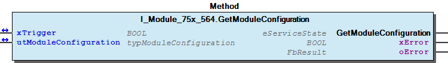
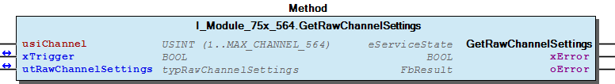
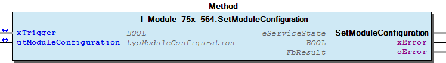
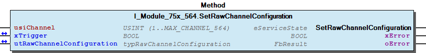
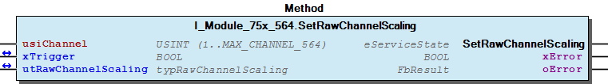
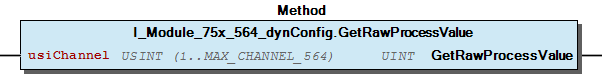
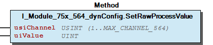

# WagoTypesModule_75x_564 v1.0.0.0 (WAGO) - Complete Documentation


## 📋 Library Information

- **Company:** WAGO
- **Title:** WagoTypesModule_75x_564
- **Version:** 1.0.0.0
- **Categories:** WAGO Internal|Common|Types and Interfaces; WAGO LayerView|Types and Interfaces; Application; System
- **Author:** WAGO
- **Placeholder:** WagoTypesModule_75x_564

### Description ¶


This document is automatically generated. Because of this, the chapter 30 Visualization is not shown in this document. If you are interested in getting to know more about visualization, we refer to the library manager of e!Cockpit.

Handling modules 75x-564 [1]

This document is automatically generated. Because of this, the chapter 30 Visualization is not shown in this document. If you are interested in getting to know more about visualization, we refer to the library manager of e!Cockpit. Handling modules 75x-564 [1]

### Contents: ¶


Contents: - Documentation Index - Project Information - Library Information - Methods I_Module_75x_564.GetModuleConfiguration (METH) - I_Module_75x_564.GetRawChannelCalibration (METH) - I_Module_75x_564.GetRawChannelConfiguration (METH) - I_Module_75x_564.GetRawChannelScaling (METH) - I_Module_75x_564.GetRawChannelSettings (METH) - I_Module_75x_564.SetModuleConfiguration (METH) - I_Module_75x_564.SetRawChannelCalibration (METH) - I_Module_75x_564.SetRawChannelConfiguration (METH) - I_Module_75x_564.SetRawChannelScaling (METH) - I_Module_75x_564.SetRawChannelSettings (METH) - ... and 3 more Interfaces - I_Module_75x_564 (ITF) - I_Module_75x_564_dynConfig (ITF) Program Organization Global Variable Lists - Channels_564 (GVL) - VersionHistory (GVL) Other Components - 10 Enumeration - 15 Datatypes - Channel - Configuration - Raw - eSignalType (ENUM) - eWatchdog (ENUM) - typModuleConfiguration (STRUCT) - typRawChannelCalibration (STRUCT) - typRawChannelConfiguration (STRUCT) - ... and 2 more

### Indices and tables ¶


| [1] | Based on WagoTypesModule_75x_564.library, last modified 08.04.2020, 16:30:30. The content of this file was automatically generated with None on 08.04.2020, 16:30:45 |

© WAGO Kontakttechnik GmbH & Co. KG, Germany 2018 – All rights reserved. For the avoidance of doubt, this copyright notice does not only apply to the information above but also and primarily to the described library itself. Please note that third-party products are always mentioned without reference to intellectual property rights, including patents, utility models, designs and trademarks, accordingly the existence of such rights cannot be excluded. WAGO is a registered trademark of WAGO Verwaltungsgesellschaft mbH.

- File and Project Information - Library Reference © WAGO Kontakttechnik GmbH & Co. KG, Germany 2018 – All rights reserved. For the avoidance of doubt, this copyright notice does not only apply to the information above but also and primarily to the described library itself. Please note that third-party products are always mentioned without reference to intellectual property rights, including patents, utility models, designs and trademarks, accordingly the existence of such rights cannot be excluded. WAGO is a registered trademark of WAGO Verwaltungsgesellschaft mbH.

### Documentation Index


## WagoTypesModule_75x_564 Library Documentation


| Company: | WAGO |
| Title: | WagoTypesModule_75x_564 |
| Version: | 1.0.0.0 |
| Categories: | WAGO Internal\|Common\|Types and Interfaces; WAGO LayerView\|Types and Interfaces; Application; System |
| Author: | WAGO |
| Placeholder: | WagoTypesModule_75x_564 |

### Description


This document is automatically generated. Because of this, the chapter 30 Visualization is not shown in this document. If you are interested in getting to know more about visualization, we refer to the library manager of e!Cockpit.

Handling modules 75x-564 [1]

This document is automatically generated. Because of this, the chapter 30 Visualization is not shown in this document. If you are interested in getting to know more about visualization, we refer to the library manager of e!Cockpit. Handling modules 75x-564 [1]

### Contents:


- 20 Program Organization Units 10 Enumeration - 15 Datatypes - Channels_564 (GVL) - I_Module_75x_564 (ITF) - I_Module_75x_564_dynConfig (ITF) VersionHistory (GVL)

### Indices and tables


| [1] | Based on WagoTypesModule_75x_564.library, last modified 08.04.2020, 16:30:30. The content of this file was automatically generated with None on 08.04.2020, 16:30:45 |

© WAGO Kontakttechnik GmbH & Co. KG, Germany 2018 – All rights reserved. For the avoidance of doubt, this copyright notice does not only apply to the information above but also and primarily to the described library itself. Please note that third-party products are always mentioned without reference to intellectual property rights, including patents, utility models, designs and trademarks, accordingly the existence of such rights cannot be excluded. WAGO is a registered trademark of WAGO Verwaltungsgesellschaft mbH.

- File and Project Information - Library Reference © WAGO Kontakttechnik GmbH & Co. KG, Germany 2018 – All rights reserved. For the avoidance of doubt, this copyright notice does not only apply to the information above but also and primarily to the described library itself. Please note that third-party products are always mentioned without reference to intellectual property rights, including patents, utility models, designs and trademarks, accordingly the existence of such rights cannot be excluded. WAGO is a registered trademark of WAGO Verwaltungsgesellschaft mbH.

### Project Information


## File and Project Information


| Scope | Name | Type | Content |
| --- | --- | --- | --- |
| FileHeader | libraryFile | string | WagoTypesModule_75x_564.library |
| contentFile | WagoTypesModule_75x_564_clr.json |
| productName | e!COCKPIT |
| creationDateTime | date | 08.04.2020, 16:30:45 |
| companyName | string | WAGO |
| ProjectInformation | LastModificationDateTime | date | 08.04.2020, 16:30:30 |
| Description | string | See: Description |
| DocFormat | reStructuredText |
| Author | WAGO |
| AutoResolveUnbound | bool | True |
| Placeholder | string | WagoTypesModule_75x_564 |
| Company | WAGO |
| Title | WagoTypesModule_75x_564 |
| Project | WagoTypesModule_75x_564 |
| Copyright | © WAGO Kontakttechnik GmbH & Co. KG, Germany 2018 – All rights reserved. |
| Version | version | 1.0.0.0 |
| Version string | string |  |
| LibraryCategories | library-category-list | WAGO Internal\|Common\|Types and Interfaces; WAGO LayerView\|Types and Interfaces; Application; System |

### Library Information


## Library Reference


| LinkAllContent: False QualifiedOnly: False | SystemLibrary: False | Optional: False |

| LinkAllContent: False QualifiedOnly: True | SystemLibrary: False | Optional: False |

| LinkAllContent: False QualifiedOnly: True | SystemLibrary: False | Optional: False |

This is a dictionary of all referenced libraries and their name spaces.

This is a dictionary of all referenced libraries and their name spaces. WagoSysErrorBase Library Identification : Placeholder: WagoSysErrorBase Default Resolution: WagoSysErrorBase, * (WAGO) Namespace: WagoSysErrorBase Library Properties : WagoSysVersion Library Identification : Name: WagoSysVersion Version: 1.0.0.0 Company: WAGO Namespace: WagoSysVersion Library Properties : WagoTypesModuleBase Library Identification : Placeholder: WagoTypesModuleBase Default Resolution: WagoTypesModuleBase, * (WAGO) Namespace: WagoTypesModuleBase Library Properties : Library Parameter : Parameter: MAX_MBX_SIZE = 18

### Methods


## I_Module_75x_564.GetModuleConfiguration (METH)


| Scope | Name | Type |
| --- | --- | --- |
| Return | GetModuleConfiguration | WagoTypesModuleBase.eServiceState |
| Inout | xTrigger | BOOL |
| utModuleConfiguration | typModuleConfiguration |
| Output | xError | BOOL |
| oError | WagoSysErrorBase.FbResult |

| Struct member | Value | Description |
| --- | --- | --- |
| aChannel | ARRAY of typRawChannelConfiguration | Channel configuration |
| xDiagPowerSupplyEnabled | BOOL | Diagnosis power supply On/Off |
| xSynchronousDAconversion | BOOL | Synchronous DA conversion On/Off |
| xDiagWiringError_AOMinusEnabled | BOOL | Diagnosis wiring error AO- On/Off |
| wWatchdogPostDelay | WORD | K-Bus timeout Post-Delay [ms] |
| xUseStandardProcessImage | BOOL | Standard process image On/Off |

```
VAR
    //--- Module configuration ---------------------------------
    utModuleConfiguration       :   WagoTypesModule_75x_564.typRawChannelConfiguration;
    xModuleConfiguration        :   BOOL;
    oError                      :   WagoSysErrorBase.FbResult;
END_VAR

//--- M O D U L E    C O N F I G U R A T I O N -----------------------
CASE my564.GetModuleConfiguration(
                                        xTrigger                    := xGetModuleConfiguration,
                                        utModuleConfiguration       := utModuleConfiguration,
                                        oError                      => oError
                                    ) OF

    eServiceState.DONE : // OK
            ;// process here your utChannelConfiguration

    eServiceState.ABORT : // Error
            ;// process here your error handling -> see oError for more information

END_CASE
```

typModuleConfiguration

Graphical Illustration

Graphical Interface of I_Module_75x_564.GetModuleConfiguration

Get the module configuration

You have to call the method cyclic until the method returns with DONE or ABORT.

Interface variables Function Get the complete module configuration typModuleConfiguration Graphical Illustration  Graphical Interface of I_Module_75x_564.GetModuleConfiguration Example Get the module configuration Note You have to call the method cyclic until the method returns with DONE or ABORT.

## I_Module_75x_564.GetRawChannelCalibration (METH)


| Scope | Name | Type |
| --- | --- | --- |
| Return | GetRawChannelCalibration | WagoTypesModuleBase.eServiceState |
| Input | usiChannel | USINT (1..MAX_CHANNEL_564) |
| Inout | xTrigger | BOOL |
| utRawChannelCalibration | typRawChannelCalibration |
| Output | xError | BOOL |
| oError | WagoSysErrorBase.FbResult |

| Struct member | Value | Description |
| --- | --- | --- |
| xUserCalibration | FALSE | The user calibration is switched off |
| TRUE | The user calibration is switched on |
| iUserCalibrationOffset | -32768 ... 32767 | User calibration Offset |
| iUserCalibrationGain | -32768 ... 32767 | User calibration Gain * 1/16834 |

```
VAR
    //--- Channel Calibration ---------------------------------
    utChannelCalibration    :   WagoTypesModule_75x_564.typRawChannelCalibration;;
    xGetChannelCalibration  :   BOOL;
    oError                  :   WagoSysErrorBase.FbResult;
END_VAR

//--- C H A N N E L    C A L I B R A T I O N -----------------------
CASE my563.GetRawChannelCalibration(    usiChannel              := 1,
                                        xTrigger                := xGetChannelCalibration,
                                        utRawChannelCalibration := utChannelCalibration,
                                        oError                  => oError
                                    ) OF

    eServiceState.DONE : // OK
            ;// process here your utModuleSettings

    eServiceState.ABORT : // Error
            ;// process here your error handling -> see oError for more information

END_CASE
```

typRawChannelCalibration

Graphical Illustration

Graphical Interface of I_Module_75x_564.GetRawChannelCalibration

Get the calibration from channel one

You have to call the method cyclic until the method returns with DONE or ABORT.

Interface variables Function Get the calibration settings of a channel typRawChannelCalibration Graphical Illustration  Graphical Interface of I_Module_75x_564.GetRawChannelCalibration Example Get the calibration from channel one Note You have to call the method cyclic until the method returns with DONE or ABORT.

## I_Module_75x_564.GetRawChannelConfiguration (METH)


| Scope | Name | Type |
| --- | --- | --- |
| Return | GetRawChannelConfiguration | WagoTypesModuleBase.eServiceState |
| Input | usiChannel | USINT (1..MAX_CHANNEL_564) |
| Inout | xTrigger | BOOL |
| utRawChannelConfiguration | typRawChannelConfiguration |
| Output | xError | BOOL |
| oError | WagoSysErrorBase.FbResult |

| Struct member | Value | Description |
| --- | --- | --- |
| Settings | typRawChannelSettings | Channel settings |
| Scaling | typRawChannelScaling | Channel scaling |
| Calibration | typRawChannelCalibration | Channel calibration |

```
VAR
    //--- Channel Configuration ---------------------------------
    utRawChannelConfiguration   :   WagoTypesModule_75x_564.typRawChannelConfiguration;
    xGetRawChannelConfiguration :   BOOL;
    oError                      :   WagoSysErrorBase.FbResult;
END_VAR

//--- C H A N N E L    C O N F I G U R A T I O N -----------------------
CASE my564.GetRawChannelConfiguration(  usiChannel                  := 1,
                                        xTrigger                    := xGetRawChannelConfiguration,
                                        utRawChannelConfiguration   := utRawChannelConfiguration,
                                        oError                      => oError
                                    ) OF

    eServiceState.DONE : // OK
            ;// process here your utChannelConfiguration

    eServiceState.ABORT : // Error
            ;// process here your error handling -> see oError for more information

END_CASE
```

typRawChannelConfiguration

Graphical Illustration

Graphical Interface of I_Module_75x_564.GetRawChannelConfiguration

Get the configuration from channel one

You have to call the method cyclic until the method returns with DONE or ABORT.

Interface variables Function Get the complete raw configuration of a channel typRawChannelConfiguration Graphical Illustration  Graphical Interface of I_Module_75x_564.GetRawChannelConfiguration Example Get the configuration from channel one Note You have to call the method cyclic until the method returns with DONE or ABORT.

## I_Module_75x_564.GetRawChannelScaling (METH)


| Scope | Name | Type |
| --- | --- | --- |
| Return | GetRawChannelScaling | WagoTypesModuleBase.eServiceState |
| Input | usiChannel | USINT (1..MAX_CHANNEL_564) |
| Inout | xTrigger | BOOL |
| utRawChannelScaling | typRawChannelScaling |
| Output | xError | BOOL |
| oError | WagoSysErrorBase.FbResult |

| Struct member | Value | Description |
| --- | --- | --- |
| xUserScalingEnabled | FALSE | User scaling disabled |
| TRUE | User scaling enabled |
| iUserScalingOffset | -32768 ... 32767 | User scaling Offset |
| iUserScalingGain | -32768 ... 32767 | User scaling Gain -> 1/16384 |
| xFactoryScalingEnabled | FALSE | Factory scaling disabled |
| TRUE | Factory scaling enabled |

```
VAR
    //--- Channel Settings ---------------------------------
    utChannelScaling    :   WagoTypesModule_75x_564.typRawChannelScaling;;
    xGetChannelScaling  :   BOOL;
    oError              :   WagoSysErrorBase.FbResult;
END_VAR

//--- C H A N N E L   S C A L I N G ------------------------
CASE my563.GetRawChannelScaling(    usiChannel           := 1,
                                    xTrigger             := xGetChannelScaling,
                                    utRawChannelScaling  := utChannelScaling,
                                    oError               => oError
                                ) OF

    eServiceState.DONE : // OK
            ;// process here your utModuleSettings

    eServiceState.ABORT : // Error
            ;// process here your error handling -> see oError for more information

END_CASE
```

typRawChannelScaling

Graphical Illustration

Graphical Interface of I_Module_75x_564.GetRawChannelScaling

Get the scaling from channel one

You have to call the method cyclic until the method returns with DONE or ABORT.

Interface variables Function Get the scaling settings of a channel typRawChannelScaling Graphical Illustration  Graphical Interface of I_Module_75x_564.GetRawChannelScaling Example Get the scaling from channel one Note You have to call the method cyclic until the method returns with DONE or ABORT.

## I_Module_75x_564.GetRawChannelSettings (METH)


| Scope | Name | Type |
| --- | --- | --- |
| Return | GetRawChannelSettings | WagoTypesModuleBase.eServiceState |
| Input | usiChannel | USINT (1..MAX_CHANNEL_564) |
| Inout | xTrigger | BOOL |
| utRawChannelSettings | typRawChannelSettings |
| Output | xError | BOOL |
| oError | WagoSysErrorBase.FbResult |

| Struct member | Value | Description |
| --- | --- | --- |
| eSignalType | eSignalType | see chapter 10 Enumeration |
| xDiagGlobalEnabled | Channel diagnosis |
| FALSE | Diagnosis disabled |
| TRUE | Diagnosis enabled |
| xDiagWireBreakEnabled | Wire break diagnosis |
| FALSE | Diagnosis disabled |
| TRUE | Diagnosis enabled |
| xDiagShortCircuitEnabled | Short circuit diagnosis |
| FALSE | Diagnosis disabled |
| TRUE | Diagnosis enabled |
| xDiagWiringEnabled | Wiring error diagnosis |
| FALSE | Diagnosis disabled |
| TRUE | Diagnosis enabled |
| xDiagDAC_InternalEnabled | DAC internal diagnosis |
| FALSE | Diagnosis disabled |
| TRUE | Diagnosis enabled |
| xResolution15Bit | Resolution |
| FALSE | 16 bit resolution |
| TRUE | 15 bit resolution |
| eWatchdog | eWatchdog | see chapter 10 Enumeration |
| uiUserSubstituteValue | uSubstituteValue | see chapter 10 Enumeration |

```
VAR
    //--- Channel Settings ---------------------------------
    utChannelSettings   :   WagoTypesModule_75x_564.typRawChannelSettings;;
    xGetChannelSettings :   BOOL;
    oError              :   WagoSysErrorBase.FbResult;
END_VAR

//--- C H A N N E L   S E T T I N G S ----------------------
CASE my563.GetRawChannelSettings(   usiChannel           := 1,
                                    xTrigger             := xGetChannelSettings,
                                    utRawChannelSettings := utChannelSettings,
                                    oError               => oError
                                ) OF

    eServiceState.DONE : // OK
        ;// process here your utModuleSettings

    eServiceState.ABORT : // Error
        ;// process here your error handling -> see oError for more information

END_CASE
```

typRawChannelSettings

Graphical Illustration

Graphical Interface of I_Module_75x_564.GetRawChannelSettings

Get the settings from channel one

You have to call the method cyclic until the method returns with DONE or ABORT.

Interface variables Function Get the general channel settings typRawChannelSettings Graphical Illustration  Graphical Interface of I_Module_75x_564.GetRawChannelSettings Example Get the settings from channel one Note You have to call the method cyclic until the method returns with DONE or ABORT.

## I_Module_75x_564.SetModuleConfiguration (METH)


| Scope | Name | Type |
| --- | --- | --- |
| Return | SetModuleConfiguration | WagoTypesModuleBase.eServiceState |
| Inout | xTrigger | BOOL |
| utModuleConfiguration | typModuleConfiguration |
| Output | xError | BOOL |
| oError | WagoSysErrorBase.FbResult |

| Struct member | Value | Description |
| --- | --- | --- |
| aChannel | ARRAY of typRawChannelConfiguration | Channel configuration |
| xDiagPowerSupplyEnabled | BOOL | Diagnosis power supply On/Off |
| xSynchronousDAconversion | BOOL | Synchronous DA conversion On/Off |
| xDiagWiringError_AOMinusEnabled | BOOL | Diagnosis wiring error AO- On/Off |
| wWatchdogPostDelay | WORD | K-Bus timeout Post-Delay [ms] |
| xUseStandardProcessImage | BOOL | Standard process image On/Off |

```
VAR
    //--- Channel Configuration -------------------------------------------------------
    xStartProcess               :   BOOL; // set this variable once to start the process -> this varibale will be automatic reset
    utModuleConfiguration       :   WagoTypesModule_75x_564.typModuleConfiguration;
    oError                      :   WagoSysErrorBase.FbResult;
    xSetModuleConfiguration     :   BOOL;
END_VAR

//--- M O D U L E    C O N F I G U R A T I O N -----------------------
//--- READ BEFORE WRITE --------------------------------------------------------------
CASE my564.GetModuleConfiguration( 1, xStartProcess, utModuleConfiguration, oError => oError) OF

    eServiceState.DONE : // OK -> actual configuration is successful read
        // change here your configuration
        // utModuleConfiguration... :=
        xSetModuleConfiguration := TRUE; // trigger write

    eServiceState.ABORT : // Error -> not able to read -> see oError
            ;// process here your error handling for read -> see oError for more information

END_CASE

//--- WRITE MODYFIED CONFIGURATION ---------------------------------------------------
CASE my564.SetModuleConfiguration( 1, xSetModuleConfiguration, utModuleConfiguration, oError => oError) OF

    eServiceState.DONE : // OK -> new configuration is written

    eServiceState.ABORT : // Error -> not able to write -> see oError
            ;// process here your error handling for write -> see oError for more information

END_CASE
```

typModuleConfiguration

Graphical Illustration

Graphical Interface of I_Module_75x_564.SetModuleConfiguration

Set the module configuration. After reading, an additional writing of the configuration is done if necessary

You have to call the method cyclic until the method returns with DONE or ABORT.

Interface variables Function Set the complete module configuration typModuleConfiguration Graphical Illustration  Graphical Interface of I_Module_75x_564.SetModuleConfiguration Example Set the module configuration. After reading, an additional writing of the configuration is done if necessary Note You have to call the method cyclic until the method returns with DONE or ABORT.

## I_Module_75x_564.SetRawChannelCalibration (METH)


| Scope | Name | Type |
| --- | --- | --- |
| Return | SetRawChannelCalibration | WagoTypesModuleBase.eServiceState |
| Input | usiChannel | USINT (1..MAX_CHANNEL_564) |
| Inout | xTrigger | BOOL |
| utRawChannelCalibration | typRawChannelCalibration |
| Output | xError | BOOL |
| oError | WagoSysErrorBase.FbResult |

| Struct member | Value | Description |
| --- | --- | --- |
| xUserCalibration | FALSE | The user calibration is switched off |
| TRUE | The user calibration is switched on |
| iUserCalibrationOffset | -32768 ... 32767 | User calibration Offset |
| iUserCalibrationGain | -32768 ... 32767 | User calibration Gain * 1/16834 |

```
VAR
    //--- Channel Calibration ---------------------------------
    utChannelCalibration    :   WagoTypesModule_75x_564.typRawChannelCalibration;;
    xSetChannelCalibration  :   BOOL;
    oError                  :   WagoSysErrorBase.FbResult;
END_VAR

//--- C H A N N E L    C A L I B R A T I O N -----------------------
CASE my564.SetRawChannelCalibration(    usiChannel              := 1,
                                        xTrigger                := xSetChannelCalibration,
                                        utRawChannelCalibration := utChannelCalibration,
                                        oError                  => oError
                                   ) OF

    eServiceState.DONE : // OK
            ;// process here your utModuleSettings

    eServiceState.ABORT : // Error
            ;// process here your error handling -> see oError for more information

END_CASE
```

typRawChannelCalibration

Graphical Illustration

Graphical Interface of I_Module_75x_564.SetRawChannelCalibration

Set the calibration of channel one

You have to call the method cyclic until the method returns with DONE or ABORT.

Interface variables Function Set the calibration of a channel typRawChannelCalibration Graphical Illustration  Graphical Interface of I_Module_75x_564.SetRawChannelCalibration Example Set the calibration of channel one Note You have to call the method cyclic until the method returns with DONE or ABORT.

## I_Module_75x_564.SetRawChannelConfiguration (METH)


| Scope | Name | Type |
| --- | --- | --- |
| Return | SetRawChannelConfiguration | WagoTypesModuleBase.eServiceState |
| Input | usiChannel | USINT (1..MAX_CHANNEL_564) |
| Inout | xTrigger | BOOL |
| utRawChannelConfiguration | typRawChannelConfiguration |
| Output | xError | BOOL |
| oError | WagoSysErrorBase.FbResult |

| Struct member | Value | Description |
| --- | --- | --- |
| Settings | typRawChannelSettings | Channel settings |
| Scaling | typRawChannelScaling | Channel scaling |
| Calibration | typRawChannelCalibration | Channel calibration |

```
VAR
    //--- Channel Configuration -------------------------------------------------------
    xStartProcess               :   BOOL; // set this variable once to start the process -> this varibale will be automatic reset
    utRawChannelConfiguration   :   WagoTypesModule_75x_564.typRawChannelConfiguration;
    oError                      :   WagoSysErrorBase.FbResult;
    xSetRawChannelConfiguration :   BOOL;
END_VAR

//--- C H A N N E L    C O N F I G U R A T I O N -----------------------
//--- READ BEFORE WRITE --------------------------------------------------------------
CASE my564.GetRawChannelConfiguration( 1, xStartProcess, utRawChannelConfiguration, oError => oError) OF

    eServiceState.DONE : // OK -> actual configuration is successful read
        // change here your configuration
        // utRawChannelConfiguration... :=
        xSetRawChannelConfiguration := TRUE; // trigger write

    eServiceState.ABORT : // Error -> not able to read -> see oError
            ;// process here your error handling for read -> see oError for more information

END_CASE

//--- WRITE MODYFIED CONFIGURATION ---------------------------------------------------
CASE my564.SetRawChannelConfiguration( 1, xSetRawChannelConfiguration, utRawChannelConfiguration, oError => oError) OF

    eServiceState.DONE : // OK -> new configuration is written

    eServiceState.ABORT : // Error -> not able to write -> see oError
            ;// process here your error handling for write -> see oError for more information

END_CASE
```

typRawChannelConfiguration

Graphical Illustration

Graphical Interface of I_Module_75x_564.SetRawChannelConfiguration

Get the configuration from channel one. After reading, an additional writing of the configuration is done

You have to call the method cyclic until the method returns with DONE or ABORT.

Interface variables Function Set the complete raw configuration of a channel. typRawChannelConfiguration Graphical Illustration  Graphical Interface of I_Module_75x_564.SetRawChannelConfiguration Example Get the configuration from channel one. After reading, an additional writing of the configuration is done Note You have to call the method cyclic until the method returns with DONE or ABORT.

## I_Module_75x_564.SetRawChannelScaling (METH)


| Scope | Name | Type |
| --- | --- | --- |
| Return | SetRawChannelScaling | WagoTypesModuleBase.eServiceState |
| Input | usiChannel | USINT (1..MAX_CHANNEL_564) |
| Inout | xTrigger | BOOL |
| utRawChannelScaling | typRawChannelScaling |
| Output | xError | BOOL |
| oError | WagoSysErrorBase.FbResult |

| Struct member | Value | Description |
| --- | --- | --- |
| xUserScalingEnabled | FALSE | User scaling disabled |
| TRUE | User scaling enabled |
| iUserScalingOffset | -32768 ... 32767 | User scaling Offset |
| iUserScalingGain | -32768 ... 32767 | User scaling Gain -> 1/16384 |
| xFactoryScalingEnabled | FALSE | Factory scaling disabled |
| TRUE | Factory scaling enabled |

```
VAR
    //--- Channel Settings ---------------------------------
    utChannelScaling    :   WagoTypesModule_75x_564.typRawChannelScaling;;
    xSetChannelScaling  :   BOOL;
    oError              :   WagoSysErrorBase.FbResult;
END_VAR

//--- C H A N N E L   S C A L I N G ------------------------
CASE my564.SetRawChannelScaling(    usiChannel          := 1,
                                    xTrigger            := xSetChannelScaling,
                                    utRawChannelScaling := utChannelScaling,
                                    oError              => oError
                                ) OF

    eServiceState.DONE : // OK
            ;// process here your utModuleSettings

    eServiceState.ABORT : // Error
            ;// process here your error handling -> see oError for more information

END_CASE
```

typRawChannelScaling

Graphical Illustration

Graphical Interface of I_Module_75x_564.SetRawChannelScaling

Set the scaling of channel one

You have to call the method cyclic until the method returns with DONE or ABORT.

Interface variables Function Set the scaling of a channel typRawChannelScaling Graphical Illustration  Graphical Interface of I_Module_75x_564.SetRawChannelScaling Example Set the scaling of channel one Note You have to call the method cyclic until the method returns with DONE or ABORT.

## I_Module_75x_564.SetRawChannelSettings (METH)


| Scope | Name | Type |
| --- | --- | --- |
| Return | SetRawChannelSettings | WagoTypesModuleBase.eServiceState |
| Input | usiChannel | USINT (1..MAX_CHANNEL_564) |
| Inout | xTrigger | BOOL |
| utRawChannelSettings | typRawChannelSettings |
| Output | xError | BOOL |
| oError | WagoSysErrorBase.FbResult |

| Struct member | Value | Description |
| --- | --- | --- |
| eSignalType | eSignalType | see chapter 10 Enumeration |
| xDiagGlobalEnabled | Channel diagnosis |
| FALSE | Diagnosis disabled |
| TRUE | Diagnosis enabled |
| xDiagWireBreakEnabled | Wire break diagnosis |
| FALSE | Diagnosis disabled |
| TRUE | Diagnosis enabled |
| xDiagShortCircuitEnabled | Short circuit diagnosis |
| FALSE | Diagnosis disabled |
| TRUE | Diagnosis enabled |
| xDiagWiringEnabled | Wiring error diagnosis |
| FALSE | Diagnosis disabled |
| TRUE | Diagnosis enabled |
| xDiagDAC_InternalEnabled | DAC internal diagnosis |
| FALSE | Diagnosis disabled |
| TRUE | Diagnosis enabled |
| xResolution15Bit | Resolution |
| FALSE | 16 bit resolution |
| TRUE | 15 bit resolution |
| eWatchdog | eWatchdog | see chapter 10 Enumeration |
| uiUserSubstituteValue | uSubstituteValue | see chapter 10 Enumeration |

```
VAR
    //--- Channel Settings ---------------------------------
    utChannelSettings   :   WagoTypesModule_75x_564.typRawChannelSettings;;
    xSetChannelSettings :   BOOL;
    oError              :   WagoSysErrorBase.FbResult;
END_VAR

//--- C H A N N E L   S E T T I N G S ----------------------
CASE my563.SetRawChannelSettings(   usiChannel           := 1,
                                    xTrigger             := xSetChannelSettings,
                                    utRawChannelSettings := utChannelSettings,
                                    oError               => oError
                                ) OF

    eServiceState.DONE : // OK
        ;// process here your utModuleSettings

    eServiceState.ABORT : // Error
        ;// process here your error handling -> see oError for more information

END_CASE
```

typRawChannelSettings

Graphical Illustration

Graphical Interface of I_Module_75x_564.SetRawChannelSettings

Set the settings of channel one

You have to call the method cyclic until the method returns with DONE or ABORT.

Interface variables Function Set the general channel settings typRawChannelSettings Graphical Illustration  Graphical Interface of I_Module_75x_564.SetRawChannelSettings Example Set the settings of channel one Note You have to call the method cyclic until the method returns with DONE or ABORT.

## I_Module_75x_564_dynConfig.GetRawProcessValue (METH)


| Scope | Name | Type |
| --- | --- | --- |
| Return | GetRawProcessValue | UINT |
| Input | usiChannel | USINT (1..MAX_CHANNEL_564) |

```
VAR
    uiProcessValue  :   INT;
END_VAR

uiProcessValue := my564.GetProcessValue(1); // here is the process raw value as UINT
```

Get the raw process value of the wanted channel.

In case of error (e.g. an invalid channel number is given) it returns 65535 -> 16#FFFF.

Graphical Illustration

Graphical Interface of I_Module_75x_564_dynConfig.GetRawProcessValue

For get the process value from first channel of the module.

Interface variables Function Get the raw process value of the wanted channel. In case of error (e.g. an invalid channel number is given) it returns 65535 -> 16#FFFF. Graphical Illustration  Graphical Interface of I_Module_75x_564_dynConfig.GetRawProcessValue Example For get the process value from first channel of the module.

## I_Module_75x_564_dynConfig.SetRawProcessValue (METH)


| Scope | Name | Type |
| --- | --- | --- |
| Input | usiChannel | USINT (1..MAX_CHANNEL_564) |
| uiValue | UINT |

```
my564.SetProcessValue(1, 16#1234);
```

Graphical Illustration

Graphical Interface of I_Module_75x_564_dynConfig.SetRawProcessValue

Set the process value 16#1234 to the first channel of the module.

Interface variables Function Set the raw process value Graphical Illustration  Graphical Interface of I_Module_75x_564_dynConfig.SetRawProcessValue Example Set the process value 16#1234 to the first channel of the module.

## typRawChannelSettings (STRUCT)


| Name | Type | Initial | Comment |
| --- | --- | --- | --- |
| eSignalType | eSignalType | 11 | 4...20mA ->R32.0 .. R32.4 |
| xDiagGlobalEnabled | BOOL | TRUE | R32.6 |
| xDiagWireBreakEnabled | BOOL | TRUE | R32.8 |
| xDiagShortCircuitEnabled | BOOL | TRUE | R32.9 |
| xDiagWiringEnabled | BOOL | TRUE | R32.10 |
| xDiagDAC_InternalEnabled | BOOL | TRUE | R32.11 |
| xResolution15Bit | BOOL | FALSE | R32.14 |
| eWatchdog | eWatchdog | 2 | OUTPUT_HIGH_IMPEDANCE ->R32.12 .. R32.13 |
| uiUserSubstituteValue | uSubstituteValue |  | R35 ->Default value 0 |

| Struct member | Value | Description |
| --- | --- | --- |
| eSignalType | eSignalType | see chapter 10 Enumeration |
| xDiagGlobalEnabled | Channel diagnosis |
| FALSE | Diagnosis disabled |
| TRUE | Diagnosis enabled |
| xDiagWireBreakEnabled | Wire break diagnosis |
| FALSE | Diagnosis disabled |
| TRUE | Diagnosis enabled |
| xDiagShortCircuitEnabled | Short circuit diagnosis |
| FALSE | Diagnosis disabled |
| TRUE | Diagnosis enabled |
| xDiagWiringEnabled | Wiring error diagnosis |
| FALSE | Diagnosis disabled |
| TRUE | Diagnosis enabled |
| xDiagDAC_InternalEnabled | DAC internal diagnosis |
| FALSE | Diagnosis disabled |
| TRUE | Diagnosis enabled |
| xResolution15Bit | Resolution |
| FALSE | 16 bit resolution |
| TRUE | 15 bit resolution |
| eWatchdog | eWatchdog | see chapter 10 Enumeration |
| uiUserSubstituteValue | uSubstituteValue | see chapter 10 Enumeration |

typRawChannelSettings

InOut: typRawChannelSettings

### Interfaces


## I_Module_75x_564 (ITF)


- Channel I_Module_75x_564.GetRawChannelCalibration (METH) - I_Module_75x_564.GetRawChannelScaling (METH) - I_Module_75x_564.GetRawChannelSettings (METH) - I_Module_75x_564.SetRawChannelCalibration (METH) - I_Module_75x_564.SetRawChannelScaling (METH) - I_Module_75x_564.SetRawChannelSettings (METH) Configuration - I_Module_75x_564.GetModuleConfiguration (METH) - I_Module_75x_564.GetRawChannelConfiguration (METH) - I_Module_75x_564.SetModuleConfiguration (METH) - I_Module_75x_564.SetRawChannelConfiguration (METH)

## I_Module_75x_564_dynConfig (ITF)


- I_Module_75x_564_dynConfig.GetRawProcessValue (METH) - I_Module_75x_564_dynConfig.SetRawProcessValue (METH)

### Program Organization


## 20 Program Organization Units


- 10 Enumeration eSignalType (ENUM) - eWatchdog (ENUM) - uSubstituteValue (UNION) 15 Datatypes - Raw typRawChannelCalibration (STRUCT) - typRawChannelScaling (STRUCT) - typRawChannelSettings (STRUCT) typModuleConfiguration (STRUCT) typRawChannelConfiguration (STRUCT) Channels_564 (GVL) I_Module_75x_564 (ITF) - Channel I_Module_75x_564.GetRawChannelCalibration (METH) - I_Module_75x_564.GetRawChannelScaling (METH) - I_Module_75x_564.GetRawChannelSettings (METH) - I_Module_75x_564.SetRawChannelCalibration (METH) - I_Module_75x_564.SetRawChannelScaling (METH) - I_Module_75x_564.SetRawChannelSettings (METH) Configuration - I_Module_75x_564.GetModuleConfiguration (METH) - I_Module_75x_564.GetRawChannelConfiguration (METH) - I_Module_75x_564.SetModuleConfiguration (METH) - I_Module_75x_564.SetRawChannelConfiguration (METH) I_Module_75x_564_dynConfig (ITF) - I_Module_75x_564_dynConfig.GetRawProcessValue (METH) - I_Module_75x_564_dynConfig.SetRawProcessValue (METH)

### Global Variable Lists


## Channels_564 (GVL)


| Scope | Name | Type | Initial | Comment |
| --- | --- | --- | --- | --- |
| Constant | MAX_CHANNEL_564 | USINT | 4 | max. channels for 75x-564 |

## VersionHistory (GVL)


| Name | Type |
| --- | --- |
| Info | ProjectInfo |

| date | version | author | change |
| 28.11.2019 | 1.0.0.0 | u010663 | First release |

WagoTypesModule_75x_564.library

Release Notes:

WagoTypesModule_75x_564.library Release Notes:

### Other Components


## 10 Enumeration


- eSignalType (ENUM) - eWatchdog (ENUM) - uSubstituteValue (UNION)

## 15 Datatypes


- Raw typRawChannelCalibration (STRUCT) - typRawChannelScaling (STRUCT) - typRawChannelSettings (STRUCT) typModuleConfiguration (STRUCT) typRawChannelConfiguration (STRUCT)

## Channel


- I_Module_75x_564.GetRawChannelCalibration (METH) - I_Module_75x_564.GetRawChannelScaling (METH) - I_Module_75x_564.GetRawChannelSettings (METH) - I_Module_75x_564.SetRawChannelCalibration (METH) - I_Module_75x_564.SetRawChannelScaling (METH) - I_Module_75x_564.SetRawChannelSettings (METH)

## Configuration


- I_Module_75x_564.GetModuleConfiguration (METH) - I_Module_75x_564.GetRawChannelConfiguration (METH) - I_Module_75x_564.SetModuleConfiguration (METH) - I_Module_75x_564.SetRawChannelConfiguration (METH)

## Raw


- typRawChannelCalibration (STRUCT) - typRawChannelScaling (STRUCT) - typRawChannelSettings (STRUCT)

## eSignalType (ENUM)


| Name | Initial | Comment |
| --- | --- | --- |
| DEACTIVATED | 0 | deactivated |
| VOLTAGE_0_5V | 1 | 0...+5V |
| VOLTAGE_1_5V | 2 | 1...+5V |
| VOLTAGE_PLUSMINUS_5V | 3 | -5V...+5V |
| VOLTAGE_0_10V | 4 | 0...+10V |
| VOLTAGE_2_10V | 5 | 2...+10V |
| VOLTAGE_PLUSMINUS_10V | 6 | -10V...+10V |
| CURRENT_0_10mA | 7 | 0...+10mA |
| CURRENT_2_10mA | 8 | 2...+10mA |
| CURRENT_PLUSMINUS_10mA | 9 | -10mA...+10mA |
| CURRENT_0_20mA | 10 | 0...+20mA |
| CURRENT_4_20mA | 11 | 4...+20mA |
| CURRENT_PLUSMINUS_20mA | 12 | -20mA...+20mA |
| VOLTAGE_0_12V | 13 | 0...+12V |
| VOLTAGE_PLUSMINUS_12V | 14 | -12V...+12V |
| CURRENT_0_22mA | 15 | 0...+22mA |
| CURRENT_PUSMINUS_22mA | 16 | -22mA...+22mA |
| CURRENT_0_12mA | 17 | 0...+12mA |
| CURRENT_PUSMINUS_12mA | 18 | -12mA...+12mA |

Description

Supported signal types

InOut: Description Supported signal types

## eWatchdog (ENUM)


| Name | Initial | Comment |
| --- | --- | --- |
| WATCHDOG_DISABLED | 0 | deactivated |
| KEEP_LAST_VALUE | 1 | hold last output value |
| OUTPUT_HIGH_IMPEDANCE | 2 | set output to high impedance |
| USE_SUBSTITUTE_VALUE | 3 | set output to user substitute value |

Description

Behavior on K-Bus timeout also called watchdog timeout

InOut: Description Behavior on K-Bus timeout also called watchdog timeout

## typModuleConfiguration (STRUCT)


| Name | Type | Initial | Comment |
| --- | --- | --- | --- |
| aChannel | ARRAY [1..MAX_CHANNEL_564] OF typRawChannelConfiguration |  |  |
| xDiagPowerSupplyEnabled | BOOL | TRUE | Diagnosis power supply On/Off |
| xSynchronousDAconversion | BOOL | FALSE | Synchronous DA conversion On/Off |
| xDiagWiringError_AOMinusEnabled | BOOL | TRUE | Diagnosis wiring error AO- On/Off |
| wWatchdogPostDelay | WORD | 600 | K-Bus timeout Post-Delay [ms] |
| xUseStandardProcessImage | BOOL | TRUE | Standard process image On/Off |

| Struct member | Value | Description |
| --- | --- | --- |
| aChannel | ARRAY of typRawChannelConfiguration | Channel configuration |
| xDiagPowerSupplyEnabled | BOOL | Diagnosis power supply On/Off |
| xSynchronousDAconversion | BOOL | Synchronous DA conversion On/Off |
| xDiagWiringError_AOMinusEnabled | BOOL | Diagnosis wiring error AO- On/Off |
| wWatchdogPostDelay | WORD | K-Bus timeout Post-Delay [ms] |
| xUseStandardProcessImage | BOOL | Standard process image On/Off |

typModulConfiguration

InOut: typModulConfiguration

## typRawChannelCalibration (STRUCT)


| Name | Type | Initial | Comment |
| --- | --- | --- | --- |
| xUserCalibrationEnabled | BOOL | FALSE | R32.15 |
| iUserCalibrationOffset | INT | 0 | R42 |
| iUserCalibrationGain | INT | 16#4000 | R43 -> 1/16834 |

| Struct member | Value | Description |
| --- | --- | --- |
| xUserCalibration | FALSE | The user calibration is switched off |
| TRUE | The user calibration is switched on |
| iUserCalibrationOffset | -32768 ... 32767 | User calibration Offset |
| iUserCalibrationGain | -32768 ... 32767 | User calibration Gain * 1/16834 |

typRawChannelCalibration

InOut: typRawChannelCalibration

## typRawChannelConfiguration (STRUCT)


| Name | Type | Comment |
| --- | --- | --- |
| Settings | typRawChannelSettings | Raw channel settings |
| Scaling | typRawChannelScaling | Raw channel scaling |
| Calibration | typRawChannelCalibration | Raw channel calibration |

| Struct member | Value | Description |
| --- | --- | --- |
| Settings | typRawChannelSettings | Channel settings |
| Scaling | typRawChannelScaling | Channel scaling |
| Calibration | typRawChannelCalibration | Channel calibration |

typRawChannelConfiguration

InOut: typRawChannelConfiguration

## typRawChannelScaling (STRUCT)


| Name | Type | Initial | Comment |
| --- | --- | --- | --- |
| xUserScalingEnabled | BOOL | FALSE | R32.7 |
| iUserScalingOffset | INT | 0 | R36 |
| uiUserScalingGain | UINT | 16#4000 | R37 -> 1/16384 |
| xFactoryScalingEnabled | BOOL | TRUE | R32.5 |

| Struct member | Value | Description |
| --- | --- | --- |
| xUserScalingEnabled | FALSE | User scaling disabled |
| TRUE | User scaling enabled |
| iUserScalingOffset | -32768 ... 32767 | User scaling Offset |
| iUserScalingGain | -32768 ... 32767 | User scaling Gain -> 1/16384 |
| xFactoryScalingEnabled | FALSE | Factory scaling disabled |
| TRUE | Factory scaling enabled |

typRawChannelScaling

InOut: typRawChannelScaling

## uSubstituteValue (UNION)


| Name | Type | Initial | Comment |
| --- | --- | --- | --- |
| iValue | INT | 0 | resolution is 15 bit ->signed (0x8000...0x0000...0x7FFF) or unsigned (0x0000...0x7FFF) |
| uiValue | UINT | 0 | resolution is 16 bit ->0x0000...0xFFFF |