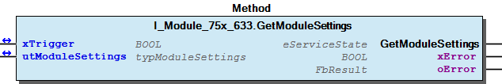
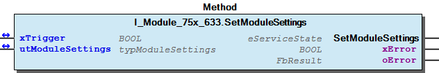
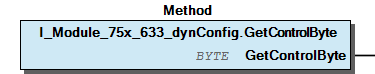
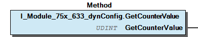
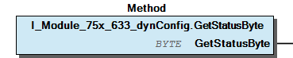
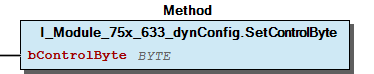
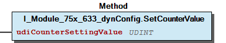

# WagoTypesModule_75x_633 v1.9.6.2 (WAGO) - Complete Documentation


## 📋 Library Information

- **Company:** WAGO
- **Title:** WagoTypesModule_75x_633
- **Version:** 1.9.6.2
- **Categories:** WAGO Internal|Common|Types and Interfaces
- **Author:** WAGO
- **Placeholder:** WagoTypesModule_75x_633

### Description ¶


This document is automatically generated.

Handling modules 75x-633

This document is automatically generated. Handling modules 75x-633

### Contents: ¶


Contents: - Documentation Index - Project Information - Library Information - Methods I_Module_75x_633.GetModuleSettings (METH) - I_Module_75x_633.SetModuleSettings (METH) - I_Module_75x_633_dynConfig.GetControlByte (METH) - I_Module_75x_633_dynConfig.GetCounterValue (METH) - I_Module_75x_633_dynConfig.GetStatusByte (METH) - I_Module_75x_633_dynConfig.SetControlByte (METH) - I_Module_75x_633_dynConfig.SetCounterValue (METH) - typModuleSettings (STRUCT) Interfaces - I_Module_75x_633 (ITF) - I_Module_75x_633_dynConfig (ITF) Program Organization Global Variable Lists Other Components - 10 Enumeration - 15 Datatypes - Module - eCountMode (ENUM)

### Indices and tables ¶


Based on WagoTypesModule_75x_633.library, last modified 29.05.2024, 20:14:20. LibDoc 3.5.16.10

© WAGO GmbH & Co. KG, Germany 2018 – All rights reserved. For the avoidance of doubt, this copyright notice does not only apply to the information above but also and primarily to the described library itself. Please note that third-party products are always mentioned without reference to intellectual property rights, including patents, utility models, designs and trademarks, accordingly the existence of such rights cannot be excluded. WAGO is a registered trademark of WAGO Verwaltungsgesellschaft mbH.

- File and Project Information - Library Reference Based on WagoTypesModule_75x_633.library, last modified 29.05.2024, 20:14:20. LibDoc 3.5.16.10 © WAGO GmbH & Co. KG, Germany 2018 – All rights reserved. For the avoidance of doubt, this copyright notice does not only apply to the information above but also and primarily to the described library itself. Please note that third-party products are always mentioned without reference to intellectual property rights, including patents, utility models, designs and trademarks, accordingly the existence of such rights cannot be excluded. WAGO is a registered trademark of WAGO Verwaltungsgesellschaft mbH.

### Documentation Index


## WagoTypesModule_75x_633 Library Documentation


| Company: | WAGO |
| Title: | WagoTypesModule_75x_633 |
| Version: | 1.9.6.2 |
| Categories: | WAGO Internal\|Common\|Types and Interfaces |
| Author: | WAGO |
| Placeholder: | WagoTypesModule_75x_633 |

### Description


This document is automatically generated.

Handling modules 75x-633

This document is automatically generated. Handling modules 75x-633

### Contents:


- 20 Program Organization Units 10 Enumeration - 15 Datatypes - I_Module_75x_633 (ITF) - I_Module_75x_633_dynConfig (ITF) VersionHistory (GVL)

### Indices and tables


Based on WagoTypesModule_75x_633.library, last modified 29.05.2024, 20:14:20. LibDoc 3.5.16.10

© WAGO GmbH & Co. KG, Germany 2018 – All rights reserved. For the avoidance of doubt, this copyright notice does not only apply to the information above but also and primarily to the described library itself. Please note that third-party products are always mentioned without reference to intellectual property rights, including patents, utility models, designs and trademarks, accordingly the existence of such rights cannot be excluded. WAGO is a registered trademark of WAGO Verwaltungsgesellschaft mbH.

- File and Project Information - Library Reference Based on WagoTypesModule_75x_633.library, last modified 29.05.2024, 20:14:20. LibDoc 3.5.16.10 © WAGO GmbH & Co. KG, Germany 2018 – All rights reserved. For the avoidance of doubt, this copyright notice does not only apply to the information above but also and primarily to the described library itself. Please note that third-party products are always mentioned without reference to intellectual property rights, including patents, utility models, designs and trademarks, accordingly the existence of such rights cannot be excluded. WAGO is a registered trademark of WAGO Verwaltungsgesellschaft mbH.

### Project Information


## File and Project Information


| Scope | Name | Type | Content |
| --- | --- | --- | --- |
| FileHeader | libraryFile | string | WagoTypesModule_75x_633.library |
| contentFile | doc.clean.json |
| productName | e!COCKPIT |
| creationDateTime | date | 29.05.2024, 20:14:20 |
| companyName | string | WAGO |
| ProjectInformation | LastModificationDateTime | date | 29.05.2024, 20:14:20 |
| Description | string | See: Description |
| Copyright | © WAGO Kontakttechnik GmbH & Co. KG, Germany 2018 – All rights reserved. |
| Author | WAGO |
| AutoResolveUnbound | bool | True |
| Placeholder | string | WagoTypesModule_75x_633 |
| Company | WAGO |
| DocFormat | reStructuredText |
| Project | WagoTypesModule_75x_633 |
| Version | version | 1.9.6.2 |
| Version string | string |  |
| Title | WagoTypesModule_75x_633 |
| LibraryCategories | library-category-list | WAGO Internal\|Common\|Types and Interfaces |
| CompiledLibraryCompatibilityVersion | string | CODESYS V3.5 SP16 Patch 3 |

### Library Information


## Library Reference


| LinkAllContent: False QualifiedOnly: False | SystemLibrary: False | Optional: False |

| LinkAllContent: False QualifiedOnly: True | SystemLibrary: False | Optional: False |

| LinkAllContent: False QualifiedOnly: True | SystemLibrary: False | Optional: False |

This is a dictionary of all referenced libraries and their name spaces.

This is a dictionary of all referenced libraries and their name spaces. WagoSysErrorBase Library Identification : Placeholder: WagoSysErrorBase Default Resolution: WagoSysErrorBase, * (WAGO) Namespace: WagoSysErrorBase Library Properties : WagoSysVersion Library Identification : Name: WagoSysVersion Version: 1.0.0.0 Company: WAGO Namespace: WagoSysVersion Library Properties : WagoTypesModuleBase Library Identification : Placeholder: WagoTypesModuleBase Default Resolution: WagoTypesModuleBase, * (WAGO) Namespace: WagoTypesModuleBase Library Properties :

### Methods


## I_Module_75x_633.GetModuleSettings (METH)


| Scope | Name | Type | Comment |
| --- | --- | --- | --- |
| Return | GetModuleSettings | WagoTypesModuleBase.eServiceState |  |
| Inout | xTrigger | BOOL | set this variable once to start the process. It will be reset by the Method automatic. |
| utModuleSettings | typModuleSettings |  |
| Output | xError | BOOL |  |
| oError | WagoSysErrorBase.FbResult |  |

| Struct member | Value | Description |
| --- | --- | --- |
| eCountMode | COUNT_UP_GATE_INPUT | Up Counter / GATE Input |
| COUNT_UP_DOWN_SIGNALING_OUTPUT | Up / Down Counter / Signaling Output (DO) |
| COUNT_FREQUENCY | Frequency Counter |
| COUNT_PEAK_TIME | Peak Time Counter |
| xEnableDiag | FALSE | Disable Diagnosis (Namur) |
| TRUE | Enable Diagnosis (Namur) |
| xApplyDataFallingEdge | FALSE | Applying Data positive edge |
| TRUE | Applying Data negative edge |
| udiLimitOutput | 0 .. 4294967295 (0xFFFFFFFF) | Limit Output |
| xGateViaControlByte | FALSE | Disable GATE via physical input |
| TRUE | Enable GATE via control byte (Bit 3) |

| Return Value | Description |
| --- | --- |
| WagoTypesModuleBase.eServiceState.DONE | successful |
| WagoTypesModuleBase.eServiceState.ABORT | error -> see oError |
| WagoTypesModuleBase.eServiceState.NO_DATA | call while xTrigger is reset |

```
VAR
    //--- Module Mode Settings ------------------------------
    utModuleSettings    :   WagoTypesModule_75x_633.typModuleSettings;
    xGetModuleSettings  :   BOOL;  // triggers the function
    oError              :   WagoSysErrorBase.FbResult;
END_VAR

//--- M O D U L E    S E T T I N G S -----------------------
CASE my633.GetModuleSettings(xGetModuleSettings, utModuleSettings, oError => oError) OF

    eServiceState.DONE : // OK
            ;// process here your utModuleSettings

    eServiceState.ABORT : // Error
            ;// process here your error handling -> see oError for more information

END_CASE
```

typModuleSettings

Return Values

It is not allowed to reset the xTrigger by the application. This must done by the method.

Graphical Illustration

Graphical Interface of I_Module_75x_633.GetModuleSettings

For get the settings from the module.

You have to call the method cyclic until the method returns with DONE or ABORT.

Interface variables Function Get the common settings of the module at a struct. typModuleSettings Return Values Warning It is not allowed to reset the xTrigger by the application. This must done by the method. Graphical Illustration  Graphical Interface of I_Module_75x_633.GetModuleSettings Example For get the settings from the module. Note You have to call the method cyclic until the method returns with DONE or ABORT.

## I_Module_75x_633.SetModuleSettings (METH)


| Scope | Name | Type | Comment |
| --- | --- | --- | --- |
| Return | SetModuleSettings | WagoTypesModuleBase.eServiceState |  |
| Inout | xTrigger | BOOL | set this variable once to start the process. It will be automatic reset by this Method. |
| utModuleSettings | typModuleSettings |  |
| Output | xError | BOOL |  |
| oError | WagoSysErrorBase.FbResult |  |

| Struct member | Value | Description |
| --- | --- | --- |
| eCountMode | COUNT_UP_GATE_INPUT | Up Counter / GATE Input |
| COUNT_UP_DOWN_SIGNALING_OUTPUT | Up / Down Counter / Signaling Output (DO) |
| COUNT_FREQUENCY | Frequency Counter |
| COUNT_PEAK_TIME | Peak Time Counter |
| xEnableDiag | FALSE | Disable Diagnosis (Namur) |
| TRUE | Enable Diagnosis (Namur) |
| xApplyDataFallingEdge | FALSE | Applying Data positive edge |
| TRUE | Applying Data negative edge |
| udiLimitOutput | 0 .. 4294967295 (0xFFFFFFFF) | Limit Output |
| xGateViaControlByte | FALSE | Disable GATE via physical input |
| TRUE | Enable GATE via control byte (Bit 3) |

| Return Value | Description |
| --- | --- |
| WagoTypesModuleBase.eServiceState.DONE | successful |
| WagoTypesModuleBase.eServiceState.ABORT | error -> see oError |
| WagoTypesModuleBase.eServiceState.NO_DATA | call while xTrigger is reset |

```
VAR
    //--- Module Mode Settings ------------------------------
    xStartProcess       :   BOOL; // set this variable once to start the process -> this varibale will be automatic reset
    utModuleSettings    :   WagoTypesModule_75x_633.typModuleSettings;
    oError              :   WagoSysErrorBase.FbResult;
    xSetModuleSettings  :   BOOL;  // triggers the function
END_VAR

//--- READ BEFORE WRITE --------------------------------------------------------------
CASE my633.GetModuleSettings(xStartProcess, utModuleSettings, oError => oError) OF

    eServiceState.DONE : // OK -> actual configuration is successful read
        // change here your configuration
        // utRawChannelConfiguration... :=
        xSetModuleSettings := TRUE; // trigger write

    eServiceState.ABORT : // Error -> not able to read -> see oError
            ;// process here your error handling for read -> see oError for more information

END_CASE

//--- S E T   M O D U L E    S E T T I N G S ---------------
CASE my633.SetModuleSettings(xSetModuleSettings, utModuleSettings, oError => oError) OF

    eServiceState.DONE : // OK

    eServiceState.ABORT : // Error
            ;// process here your error handling -> see oError for more information

END_CASE
```

typModuleSettings

Return Values

It is not allowed to reset the xTrigger by the application. This must done by the method.

Graphical Illustration

Graphical Interface of I_Module_75x_633.SetModuleSettings

For set the settings from the module.

You have to call the method cyclic until the method returns with DONE or ABORT.

Interface variables Function Set the common settings of the module from a struct. typModuleSettings Return Values Warning It is not allowed to reset the xTrigger by the application. This must done by the method. Graphical Illustration  Graphical Interface of I_Module_75x_633.SetModuleSettings Example For set the settings from the module. Note You have to call the method cyclic until the method returns with DONE or ABORT.

## I_Module_75x_633_dynConfig.GetControlByte (METH)


| Scope | Name | Type |
| --- | --- | --- |
| Return | GetControlByte | BYTE |

| Counting Mode | Description |
| COUNT_UP_GATE_INPUT | Up Counter / GATE Input |
|  |
| Control Byte |
| Bit |  | Description |
| 0 | SET_DO_ON_CNT_VAL | Switch output DO depending on counter value |
| 1 | 0 | This value is always 0 and may not be changed |
| 2 | SET_DO | Set output DO |
| 3 | SET_GATE |  |
| 4 | CNT_INH | Disable counter |
| 5 | CNT_SET | Set counter |
| 6 | 0 | This value is always 0 and may not be changed |
| 7 | 0 | This value is always 0 and may not be changed |
|  |
| COUNT_UP_DOWN_SIGNALING_OUTPUT | Up / Down Counter / Signaling Output (DO) |
|  |
| Control Byte |
| Bit |  | Description |
| 0 | SET_DO_ON_CNT_VAL | Switch output DO depending on counter value |
| 1 | 0 | This value is always 0 and may not be changed |
| 2 | SET_DO | Set output DO |
| 3 | 0 | This value is always 0 and may not be changed |
| 4 | CNT_INH | Disable counter |
| 5 | CNT_SET | Set counter |
| 6 | 0 | This value is always 0 and may not be changed |
| 7 | 0 | This value is always 0 and may not be changed |
|  |
| COUNT_FREQUENCY | Frequency Counter |
|  |
| Control Byte |
| Bit |  | Description |
| 0 | RANGE_SEL_REQ0 |  |
| 1 | RANGE_SEL_REQ1 |  |
| 2 | SET_DO | Set output DO |
| 3 | SET_GATE |  |
| 4 | TWD_REQ |  |
| 5 | 0 | This value is always 0 and may not be changed |
| 6 | 0 | This value is always 0 and may not be changed |
| 7 | 0 | This value is always 0 and may not be changed |
|  |
| COUNT_PEAK_TIME | Peak Time Counter |
|  |
| Control Byte |
| Bit |  | Description |
| 0 | 0 | This value is always 0 and may not be changed |
| 1 | 0 | This value is always 0 and may not be changed |
| 2 | SET_DO | Set output DO |
| 3 | 0 | This value is always 0 and may not be changed |
| 4 | 0 | This value is always 0 and may not be changed |
| 5 | START_CNT | Start counter |
| 6 | 0 | This value is always 0 and may not be changed |
| 7 | 0 | This value is always 0 and may not be changed |
|  |

```
VAR
    myControl   :   BYTE;
END_VAR

myControl := my633.GetControlByte(); // here is the control byte
```

Get the control byte.

Graphical Illustration

Graphical Interface of I_Module_75x_633_dynConfig.GetControlByte

Interface variables Function Get the control byte. Graphical Illustration  Graphical Interface of I_Module_75x_633_dynConfig.GetControlByte Example For get the control byte.

## I_Module_75x_633_dynConfig.GetCounterValue (METH)


| Scope | Name | Type |
| --- | --- | --- |
| Return | GetCounterValue | UDINT |

```
VAR
    myCountValue    :   UDINT;
END_VAR

myCountValue := my633.GetCounterValue(); // here is the count value as UDINT
```

Graphical Illustration

Graphical Interface of I_Module_75x_633_dynConfig.GetCounterValue

Interface variables Function Get the raw count value. Graphical Illustration  Graphical Interface of I_Module_75x_633_dynConfig.GetCounterValue Example For get the count value.

## I_Module_75x_633_dynConfig.GetStatusByte (METH)


| Scope | Name | Type |
| --- | --- | --- |
| Return | GetStatusByte | BYTE |

| Counting Mode | Description |
| COUNT_UP_GATE_INPUT | Up Counter / GATE Input |
|  |
| Status Byte |
| Bit |  | Description |
| 0 | ST_CLK | State Input CLK |
| 1 | ST_GATE_PHY | State Gate Input (only valid if xGateViaControlByte = FALSE) |
| 2 | ST_DO | State output DO |
| 3 | ST_GATE_CB | State Gate Up Counter (only valid if xGateViaControlByte = TRUE) |
| 4 | CNT_INH | Feedback message counter locked |
| 5 | CNT_SET | Counter feedback message set |
| 6 | NAMUR_ERR | Namur error at input |
| 7 | x | unused |
|  |
| COUNT_UP_DOWN_SIGNALING_OUTPUT | Up / Down Counter / Signaling Output (DO) |
|  |
| Status Byte |
| Bit |  | Description |
| 0 | ST_CLK | State Input CLK |
| 1 | ST_U/D | State U/D Input |
| 2 | ST_DO | State output DO |
| 3 | x | unused |
| 4 | CNT_INH | Feedback message counter locked |
| 5 | CNT_SET | Counter feedback message set |
| 6 | NAMUR_ERR | Namur error at input |
| 7 | x | unused |
|  |
| COUNT_FREQUENCY | Frequency Counter |
|  |
| Status Byte |
| Bit |  | Description |
| 0 | RANGE_SEL_ACK0 | Acknowledge Range |
| 1 | RANGE_SEL_ACK1 |  |
| 2 | ST_DO | State output DO |
| 3 | ST_GATE_CB | State Gate Up Counter (only valid if xGateViaControlByte = TRUE) |
| 4 | TWD_ACK | Acknowledge Counter Set |
| 5 | ST_GATE_PHY | State Gate Input (only valid if xGateViaControlByte = FALSE) |
| 6 | NAMUR_ERR | Namur error at input |
| 7 | x | unused |
|  |
| COUNT_PEAK_TIME | Peak Time Counter |
|  |
| Status Byte |
| Bit |  | Description |
| 0 | TOGGLE |  |
| 1 | ST_U/D | State U/D Input |
| 2 | ST_DO | State output DO |
| 3 | x | unused |
| 4 | x | unused |
| 5 | START_ACK |  |
| 6 | NAMUR_ERR | Namur error at input |
| 7 | x | unused |
|  |

```
VAR
    myStatus    :   BYTE;
END_VAR

myStatus := my633.GetStatusByte(); // here is the status byte
```

Get the status byte.

Graphical Illustration

Graphical Interface of I_Module_75x_633_dynConfig.GetStatusByte

Interface variables Function Get the status byte. Graphical Illustration  Graphical Interface of I_Module_75x_633_dynConfig.GetStatusByte Example For get the status byte.

## I_Module_75x_633_dynConfig.SetControlByte (METH)


| Scope | Name | Type |
| --- | --- | --- |
| Input | bControlByte | BYTE |

| Counting Mode | Description |
| COUNT_UP_GATE_INPUT | Up Counter / GATE Input |
|  |
| Control Byte |
| Bit |  | Description |
| 0 | SET_DO_ON_CNT_VAL | Switch output DO depending on counter value |
| 1 | 0 | This value is always 0 and may not be changed |
| 2 | SET_DO | Set output DO |
| 3 | SET_GATE |  |
| 4 | CNT_INH | Disable counter |
| 5 | CNT_SET | Set counter |
| 6 | 0 | This value is always 0 and may not be changed |
| 7 | 0 | This value is always 0 and may not be changed |
|  |
| COUNT_UP_DOWN_SIGNALING_OUTPUT | Up / Down Counter / Signaling Output (DO) |
|  |
| Control Byte |
| Bit |  | Description |
| 0 | SET_DO_ON_CNT_VAL | Switch output DO depending on counter value |
| 1 | 0 | This value is always 0 and may not be changed |
| 2 | SET_DO | Set output DO |
| 3 | 0 | This value is always 0 and may not be changed |
| 4 | CNT_INH | Disable counter |
| 5 | CNT_SET | Set counter |
| 6 | 0 | This value is always 0 and may not be changed |
| 7 | 0 | This value is always 0 and may not be changed |
|  |
| COUNT_FREQUENCY | Frequency Counter |
|  |
| Control Byte |
| Bit |  | Description |
| 0 | RANGE_SEL_REQ0 |  |
| 1 | RANGE_SEL_REQ1 |  |
| 2 | SET_DO | Set output DO |
| 3 | SET_GATE |  |
| 4 | TWD_REQ |  |
| 5 | 0 | This value is always 0 and may not be changed |
| 6 | 0 | This value is always 0 and may not be changed |
| 7 | 0 | This value is always 0 and may not be changed |
|  |
| COUNT_PEAK_TIME | Peak Time Counter |
|  |
| Control Byte |
| Bit |  | Description |
| 0 | 0 | This value is always 0 and may not be changed |
| 1 | 0 | This value is always 0 and may not be changed |
| 2 | SET_DO | Set output DO |
| 3 | 0 | This value is always 0 and may not be changed |
| 4 | 0 | This value is always 0 and may not be changed |
| 5 | START_CNT | Start counter |
| 6 | 0 | This value is always 0 and may not be changed |
| 7 | 0 | This value is always 0 and may not be changed |
|  |

```
VAR
    myControl   :   BYTE;
END_VAR

my633.SetControlByte(myControl); // set the control byte
```

Set the control byte.

Graphical Illustration

Graphical Interface of I_Module_75x_633_dynConfig.SetControlByte

Interface variables Function Set the control byte. Graphical Illustration  Graphical Interface of I_Module_75x_633_dynConfig.SetControlByte Example For set the control byte.

## I_Module_75x_633_dynConfig.SetCounterValue (METH)


| Scope | Name | Type |
| --- | --- | --- |
| Input | udiCounterSettingValue | UDINT |

```
VAR
    myCounterValue  :   UDINT;
END_VAR

my633.SetCounterValue(myCounterValue); // here set the counter value
```

Graphical Illustration

Graphical Interface of I_Module_75x_633_dynConfig.SetCounterValue

Interface variables Function Set the counter value. Graphical Illustration  Graphical Interface of I_Module_75x_633_dynConfig.SetCounterValue Example For set the counter value.

## typModuleSettings (STRUCT)


| Name | Type | Comment |
| --- | --- | --- |
| eCountMode | eCountMode | R32.8 .. 9 |
| xEnableDiag | BOOL | R32.10 |
| xApplyDataFallingEdge | BOOL | R32.3 |
| udiLimitOutput | UDINT | R17 / 18 |
| xGateViaControlByte | BOOL | R32.15 |

| Struct member | Value | Description |
| --- | --- | --- |
| eCountMode | COUNT_UP_GATE_INPUT | Up Counter / GATE Input |
| COUNT_UP_DOWN_SIGNALING_OUTPUT | Up / Down Counter / Signaling Output (DO) |
| COUNT_FREQUENCY | Frequency Counter |
| COUNT_PEAK_TIME | Peak Time Counter |
| xEnableDiag | FALSE | Disable Diagnosis (Namur) |
| TRUE | Enable Diagnosis (Namur) |
| xApplyDataFallingEdge | FALSE | Applying Data positive edge |
| TRUE | Applying Data negative edge |
| udiLimitOutput | 0 .. 4294967295 (0xFFFFFFFF) | Limit Output |
| xGateViaControlByte | FALSE | Disable GATE via physical input |
| TRUE | Enable GATE via control byte (Bit 3) |

### Interfaces


## I_Module_75x_633 (ITF)


- Module I_Module_75x_633.GetModuleSettings (METH) - I_Module_75x_633.SetModuleSettings (METH)

## I_Module_75x_633_dynConfig (ITF)


- I_Module_75x_633_dynConfig.GetControlByte (METH) - I_Module_75x_633_dynConfig.GetCounterValue (METH) - I_Module_75x_633_dynConfig.GetStatusByte (METH) - I_Module_75x_633_dynConfig.SetControlByte (METH) - I_Module_75x_633_dynConfig.SetCounterValue (METH)

### Program Organization


## 20 Program Organization Units


- 10 Enumeration eCountMode (ENUM) 15 Datatypes - typModuleSettings (STRUCT) I_Module_75x_633 (ITF) - Module I_Module_75x_633.GetModuleSettings (METH) - I_Module_75x_633.SetModuleSettings (METH) I_Module_75x_633_dynConfig (ITF) - I_Module_75x_633_dynConfig.GetControlByte (METH) - I_Module_75x_633_dynConfig.GetCounterValue (METH) - I_Module_75x_633_dynConfig.GetStatusByte (METH) - I_Module_75x_633_dynConfig.SetControlByte (METH) - I_Module_75x_633_dynConfig.SetCounterValue (METH)

### Global Variable Lists


## VersionHistory (GVL)


| Name | Type |
| --- | --- |
| Info | ProjectInfo |

| date | version | author | change |
| 26.02.2024 | 1.9.6.2 | u0103719 | modified environment (SP16 Patch 3) |
| 26.04.2022 | 1.9.6.1 | u010545 | xGateUsingControlByte renamed to xGateViaControlByte |
| 06.04.2022 | 1.9.6.0 | u010545 | xGateUsingControlByte added |
| 16.07.2019 | 1.9.3.0 | u010545 | Interface for dyn config added |
| 08.01.2019 | 1.0.1.0 | u015842 | Properties: free placeholder added |
| 09.04.2018 | 1.0.0.0 | u010545 | first release |
| 05.04.2018 | 0.0.0.1 | u010545 | init |

WagoTypesModule_75x_633.library

Release Notes:

WagoTypesModule_75x_633.library Release Notes:

### Other Components


## 10 Enumeration ¶


## 15 Datatypes ¶


- typModuleSettings (STRUCT)

## Module


- I_Module_75x_633.GetModuleSettings (METH) - I_Module_75x_633.SetModuleSettings (METH)

## eCountMode (ENUM)


| Name | Initial |
| --- | --- |
| COUNT_UP_GATE_INPUT | 0 |
| COUNT_UP_DOWN_SIGNALING_OUTPUT | 1 |
| COUNT_FREQUENCY | 2 |
| COUNT_PEAK_TIME | 3 |

Attributes: qualified_only InOut: Values