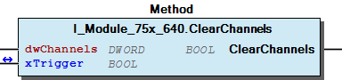
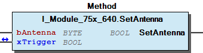
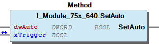
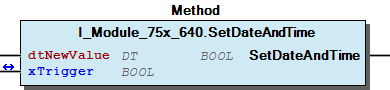
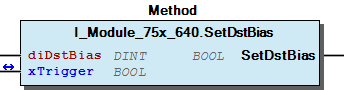
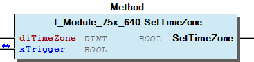
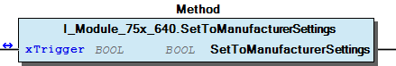

# WagoTypesModule_75x_640 v1.0.1.0 (WAGO) - Complete Documentation


## 📋 Library Information

- **Company:** WAGO
- **Title:** WagoTypesModule_75x_640
- **Version:** 1.0.1.0
- **Categories:** WAGO Internal|Common|Types and Interfaces
- **Author:** WAGO / u010545
- **Placeholder:** WagoTypesModule_75x_640

### Description ¶


This document is automatically generated. Because of this, the chapter 30 Visualization is not shown in this document. If you are interested in getting to know more about visualization, we refer to the library manager of e!Cockpit.

Interface for module 75x-640 [1]

This document is automatically generated. Because of this, the chapter 30 Visualization is not shown in this document. If you are interested in getting to know more about visualization, we refer to the library manager of e!Cockpit. Interface for module 75x-640 [1]

### Contents: ¶


Contents: - Documentation Index - Project Information - Library Information - Methods I_Module_75x_640.ClearChannels (METH) - I_Module_75x_640.GetAntenna (METH) - I_Module_75x_640.GetAuto (METH) - I_Module_75x_640.GetChannelFlags (METH) - I_Module_75x_640.GetDiagnostic (METH) - I_Module_75x_640.GetDstBias (METH) - I_Module_75x_640.GetLocalDate (METH) - I_Module_75x_640.GetLocalTime (METH) - I_Module_75x_640.GetOperatingHoursByNumber (METH) - I_Module_75x_640.GetServiceFlags (METH) - ... and 14 more Interfaces Program Organization Global Variable Lists Other Components - typRtcConfigTimer (STRUCT) - typRtcOperatingHours (STRUCT)

### Indices and tables ¶


| [1] | Based on WagoTypesModule_75x_640.library, last modified 14.01.2019, 18:48:53. The content of this file was automatically generated with None on 14.01.2019, 18:48:56 |

© WAGO Kontakttechnik GmbH & Co. KG, Germany 2018 – All rights reserved. For the avoidance of doubt, this copyright notice does not only apply to the information above but also and primarily to the described library itself. Please note that third-party products are always mentioned without reference to intellectual property rights, including patents, utility models, designs and trademarks, accordingly the existence of such rights cannot be excluded. WAGO is a registered trademark of WAGO Verwaltungsgesellschaft mbH.

- File and Project Information - Library Reference © WAGO Kontakttechnik GmbH & Co. KG, Germany 2018 – All rights reserved. For the avoidance of doubt, this copyright notice does not only apply to the information above but also and primarily to the described library itself. Please note that third-party products are always mentioned without reference to intellectual property rights, including patents, utility models, designs and trademarks, accordingly the existence of such rights cannot be excluded. WAGO is a registered trademark of WAGO Verwaltungsgesellschaft mbH.

### Documentation Index


## WagoTypesModule_75x_640 Library Documentation


| Company: | WAGO |
| Title: | WagoTypesModule_75x_640 |
| Version: | 1.0.1.0 |
| Categories: | WAGO Internal\|Common\|Types and Interfaces |
| Author: | WAGO / u010545 |
| Placeholder: | WagoTypesModule_75x_640 |

### Description


This document is automatically generated. Because of this, the chapter 30 Visualization is not shown in this document. If you are interested in getting to know more about visualization, we refer to the library manager of e!Cockpit.

Interface for module 75x-640 [1]

This document is automatically generated. Because of this, the chapter 30 Visualization is not shown in this document. If you are interested in getting to know more about visualization, we refer to the library manager of e!Cockpit. Interface for module 75x-640 [1]

### Contents:


- 20 Program Organization Units I_Module_75x_640 (ITF) - typRtcConfigTimer (STRUCT) - typRtcOperatingHours (STRUCT) VersionHistory (GVL)

### Indices and tables


| [1] | Based on WagoTypesModule_75x_640.library, last modified 14.01.2019, 18:48:53. The content of this file was automatically generated with None on 14.01.2019, 18:48:56 |

© WAGO Kontakttechnik GmbH & Co. KG, Germany 2018 – All rights reserved. For the avoidance of doubt, this copyright notice does not only apply to the information above but also and primarily to the described library itself. Please note that third-party products are always mentioned without reference to intellectual property rights, including patents, utility models, designs and trademarks, accordingly the existence of such rights cannot be excluded. WAGO is a registered trademark of WAGO Verwaltungsgesellschaft mbH.

- File and Project Information - Library Reference © WAGO Kontakttechnik GmbH & Co. KG, Germany 2018 – All rights reserved. For the avoidance of doubt, this copyright notice does not only apply to the information above but also and primarily to the described library itself. Please note that third-party products are always mentioned without reference to intellectual property rights, including patents, utility models, designs and trademarks, accordingly the existence of such rights cannot be excluded. WAGO is a registered trademark of WAGO Verwaltungsgesellschaft mbH.

### Project Information


## File and Project Information


| Scope | Name | Type | Content |
| --- | --- | --- | --- |
| FileHeader | libraryFile | string | WagoTypesModule_75x_640.library |
| contentFile | WagoTypesModule_75x_640_clr.json |
| productName | e!COCKPIT |
| creationDateTime | date | 14.01.2019, 18:48:56 |
| companyName | string | WAGO |
| ProjectInformation | LastModificationDateTime | date | 14.01.2019, 18:48:53 |
| Description | string | See: Description |
| Copyright | © WAGO Kontakttechnik GmbH & Co. KG, Germany 2018 – All rights reserved. |
| Author | WAGO / u010545 |
| AutoResolveUnbound | bool | True |
| Placeholder | string | WagoTypesModule_75x_640 |
| Company | WAGO |
| DocFormat | reStructuredText |
| Project | WagoTypesModule_75x_640 |
| DefaultNamespace |  |
| Version | version | 1.0.1.0 |
| Title | string | WagoTypesModule_75x_640 |
| LibraryCategories | library-category-list | WAGO Internal\|Common\|Types and Interfaces |

### Library Information


## Library Reference


| LinkAllContent: False QualifiedOnly: True | SystemLibrary: False | Optional: False |

| LinkAllContent: False QualifiedOnly: True | SystemLibrary: False | Optional: False |

This is a dictionary of all referenced libraries and their name spaces.

This is a dictionary of all referenced libraries and their name spaces. WagoSysVersion Library Identification : Name: WagoSysVersion Version: 1.0.0.0 Company: WAGO Namespace: WagoSysVersion Library Properties : WagoTypesModuleBase Library Identification : Placeholder: WagoTypesModuleBase Default Resolution: WagoTypesModuleBase, * (WAGO) Namespace: WagoTypesModuleBase Library Properties : Library Parameter : Parameter: MAX_MBX_SIZE = 18

### Methods


## I_Module_75x_640.ClearChannels (METH)


| Scope | Name | Type |
| --- | --- | --- |
| Return | ClearChannels | BOOL |
| Input | dwChannels | DWORD |
| Inout | xTrigger | BOOL |

This method clears the channels. Each bit represents one channel.

You have to connect the input parameter xTrigger with an own bool variable. To clear the channels specified by dwChannels you have to set the variable at xTrigger once to TRUE. If the job was delivered then the variable is set to FALSE by the method.

For detailed use please read the manual of the module 750-640 .

Graphical Illustration

Graphical Interface of I_Module_75x_640.ClearChannels

Interface variables Function This method clears the channels. Each bit represents one channel. You have to connect the input parameter xTrigger with an own bool variable. To clear the channels specified by dwChannels you have to set the variable at xTrigger once to TRUE. If the job was delivered then the variable is set to FALSE by the method. For detailed use please read the manual of the module 750-640 . Graphical Illustration  Graphical Interface of I_Module_75x_640.ClearChannels

## I_Module_75x_640.GetAntenna (METH)


| Scope | Name | Type |
| --- | --- | --- |
| Return | GetAntenna | DWORD |

## I_Module_75x_640.GetAuto (METH)


| Scope | Name | Type |
| --- | --- | --- |
| Return | GetAuto | DWORD |

## I_Module_75x_640.GetChannelFlags (METH)


| Scope | Name | Type |
| --- | --- | --- |
| Return | GetChannelFlags | DWORD |

## I_Module_75x_640.GetDiagnostic (METH)


| Scope | Name | Type |
| --- | --- | --- |
| Return | GetDiagnostic | DWORD |

## I_Module_75x_640.GetDstBias (METH)


| Scope | Name | Type |
| --- | --- | --- |
| Return | GetDstBias | DINT |

## I_Module_75x_640.GetLocalDate (METH)


| Scope | Name | Type |
| --- | --- | --- |
| Return | GetLocalDate | DATE |

## I_Module_75x_640.GetLocalTime (METH)


| Scope | Name | Type |
| --- | --- | --- |
| Return | GetLocalTime | TOD |

## I_Module_75x_640.GetOperatingHoursByNumber (METH)


| Scope | Name | Type |
| --- | --- | --- |
| Return | GetOperatingHoursByNumber | typRtcOperatingHours |
| Input | usiNumber | USINT (0..RTC_QUANTITY_OPERATING_HOURS_COUNTER) |

## I_Module_75x_640.GetServiceFlags (METH)


| Scope | Name | Type |
| --- | --- | --- |
| Return | GetServiceFlags | DWORD |

## I_Module_75x_640.GetTimeZone (METH)


| Scope | Name | Type |
| --- | --- | --- |
| Return | GetTimeZone | DINT |

## I_Module_75x_640.GetTimerByNumber (METH)


| Scope | Name | Type |
| --- | --- | --- |
| Return | GetTimerByNumber | typRtcConfigTimer |
| Input | usiNumber | USINT (0..RTC_QUANTITY_TIMER) |

## I_Module_75x_640.GetUTC_Time (METH)


| Scope | Name | Type |
| --- | --- | --- |
| Return | GetUTC_Time | DT |

## I_Module_75x_640.GetWeekday (METH)


| Scope | Name | Type |
| --- | --- | --- |
| Return | GetWeekday | BYTE |

## I_Module_75x_640.SetAntenna (METH)


| Scope | Name | Type |
| --- | --- | --- |
| Return | SetAntenna | BOOL |
| Input | bAntenna | BYTE |
| Inout | xTrigger | BOOL |

| Byte | Bit | Function |
| --- | --- | --- |
| 0 | 0..1 | 0: No time signal reception 1: DCF77 Decoder activated 2: WWVB Decoder activated |
| 0 | 2 | DCF77 Polarity reversed 0 = Low-active 1 = High-active |

```
VAR
    myTrigger   :   BOOL;
    FlkStart    :   BOOL;
END_VAR

//--- set myTrigger once with a rising edge from xStart
IF xStart AND NOT FlkStart then
    myTrigger := TRUE;
END_IF
FlkStart := xStart;
//-----------------------------------------------------

myFb640.SetAntenna(bAntenna := 16#05, xTrigger := myTrigger);
```

This method set the decoder scheme for time signal reception. See the manual for further information.

Possible values for ‘bAntenna’

You have to connect the input parameter xTrigger with an own bool variable. To transmit the value from bAntenna to the module you have to set the variable at xTrigger once to TRUE. If the method has delivered the value then the variable is set to FALSE by the method.

On setting the time zone and summer time using different antennas.

Graphical Illustration

Graphical Interface of I_Module_75x_640.SetAntenna

Interface variables Function This method set the decoder scheme for time signal reception. See the manual for further information. Possible values for ‘bAntenna’ You have to connect the input parameter xTrigger with an own bool variable. To transmit the value from bAntenna to the module you have to set the variable at xTrigger once to TRUE. If the method has delivered the value then the variable is set to FALSE by the method. Note On setting the time zone and summer time using different antennas. - The DCF77 transmitter sends CET (Central European Time) or CEST (Central European Summer Time), the summer time setting (DstBias) remains set to zero. The time zone for Germany is 0. - The WWVB transmitter sends in UTC. If the module is operated at the US east coast (Eastern Time) for example, an offset of 5 hours (0xFFFFB9B0) must be entered in the TimeZone. The transition from winter time to summer time is done using a status bit within the time telegram. By setting this bit, one more hour will be transmitted by the module. Within the module, the transition is always performed at 00:00. Graphical Illustration  Graphical Interface of I_Module_75x_640.SetAntenna Example

## I_Module_75x_640.SetAuto (METH)


| Scope | Name | Type |
| --- | --- | --- |
| Return | SetAuto | BOOL |
| Input | dwAuto | DWORD |
| Inout | xTrigger | BOOL |

This method switch the automatic mode on / off for the channels. Each bit represents one channel.

The automatic mode of the relevant switching channel is switched off for each bit set in Auto. The off switching channel can only be changed using the methods SetChannels() and ClearChannels().

For detailed use please read the manual of the module 750-640 .

Graphical Illustration

Graphical Interface of I_Module_75x_640.SetAuto

Interface variables Function This method switch the automatic mode on / off for the channels. Each bit represents one channel. The automatic mode of the relevant switching channel is switched off for each bit set in Auto. The off switching channel can only be changed using the methods SetChannels() and ClearChannels(). For detailed use please read the manual of the module 750-640 . Graphical Illustration  Graphical Interface of I_Module_75x_640.SetAuto

## I_Module_75x_640.SetChannels (METH)


| Scope | Name | Type |
| --- | --- | --- |
| Return | SetChannels | BOOL |
| Input | dwChannels | DWORD |
| Inout | xTrigger | BOOL |

## I_Module_75x_640.SetDateAndTime (METH)


| Scope | Name | Type |
| --- | --- | --- |
| Return | SetDateAndTime | BOOL |
| Input | dtNewValue | DT |
| Inout | xTrigger | BOOL |

This method set date and time for the module.

You have to connect the input parameter xTrigger with an own bool variable. To set the date and time for the module you have to set the variable at xTrigger once to TRUE. If the job was delivered then the variable is set to FALSE by the method.

For detailed use please read the manual of the module 750-640 .

Graphical Illustration

Graphical Interface of I_Module_75x_640.SetDateAndTime

Interface variables FUNCTION This method set date and time for the module. You have to connect the input parameter xTrigger with an own bool variable. To set the date and time for the module you have to set the variable at xTrigger once to TRUE. If the job was delivered then the variable is set to FALSE by the method. For detailed use please read the manual of the module 750-640 . Graphical Illustration  Graphical Interface of I_Module_75x_640.SetDateAndTime

## I_Module_75x_640.SetDstBias (METH)


| Scope | Name | Type | Comment |
| --- | --- | --- | --- |
| Return | SetDstBias | BOOL |  |
| Input | diDstBias | DINT | +/- [sec] |
| Inout | xTrigger | BOOL |  |

This method set the daylight saving time for the module.

For the transition from winter time to summer time, the content of DstBias (Daylight Saving Time) is added to the TimeZone when the time is being evaluated. This way, the transition can be performed without having to change the time or time zone.

For detailed use please read the manual of the module 750-640 .

Graphical Illustration

Graphical Interface of I_Module_75x_640.SetDstBias

Interface variables FUNCTION This method set the daylight saving time for the module. For the transition from winter time to summer time, the content of DstBias (Daylight Saving Time) is added to the TimeZone when the time is being evaluated. This way, the transition can be performed without having to change the time or time zone. For detailed use please read the manual of the module 750-640 . Graphical Illustration  Graphical Interface of I_Module_75x_640.SetDstBias

## I_Module_75x_640.SetOperatingHours (METH)


| Scope | Name | Type | Comment |
| --- | --- | --- | --- |
| Return | SetOperatingHours | BOOL |  |
| Input | usiCounterNumber | USINT (0..31) | Operating Hours Counter 0 .. 31 |
| udiOperatingHours | UDINT | [ sec] data type TIME is useable for max. 49,7 days |
| Inout | xTrigger | BOOL |  |

## I_Module_75x_640.SetServiceInterval (METH)


| Scope | Name | Type | Comment |
| --- | --- | --- | --- |
| Return | SetServiceInterval | BOOL |  |
| Input | usiCounterNumber | USINT (0..31) | Operating Hours Counter 0 .. 31 |
| udiServiceInterval | UDINT | [ sec] data type TIME is useable for max. 49,7 days |
| Inout | xTrigger | BOOL |  |

## I_Module_75x_640.SetTimeZone (METH)


| Scope | Name | Type | Comment |
| --- | --- | --- | --- |
| Return | SetTimeZone | BOOL |  |
| Input | diTimeZone | DINT | +/- [sec] |
| Inout | xTrigger | BOOL |  |

This method set the time zone for the module.

You have to connect the input parameter xTrigger with an own bool variable. To set the time zone specified by diTimeZone (+/- [sec]) you have to set the variable at xTrigger once to TRUE. If the job was delivered then the variable is set to FALSE by the method.

For detailed use please read the manual of the module 750-640 .

Graphical Illustration

Graphical Interface of I_Module_75x_640.SetTimeZone

Interface variables FUNCTION This method set the time zone for the module. You have to connect the input parameter xTrigger with an own bool variable. To set the time zone specified by diTimeZone (+/- [sec]) you have to set the variable at xTrigger once to TRUE. If the job was delivered then the variable is set to FALSE by the method. For detailed use please read the manual of the module 750-640 . Graphical Illustration  Graphical Interface of I_Module_75x_640.SetTimeZone

## I_Module_75x_640.SetTimer (METH)


| Scope | Name | Type | Comment |
| --- | --- | --- | --- |
| Return | SetTimer | BOOL |  |
| Input | usiNumber | USINT (0..31) | Timer 0 .. 31 |
| dtFirstEvent | DT |  |
| dtLastEvent | DT |  |
| tDelay | TIME |  |
| dwOnChannels | DWORD |  |
| dwOffChannels | DWORD |  |
| bWeekDays | BYTE |  |
| Inout | xTrigger | BOOL |  |

## I_Module_75x_640.SetToManufacturerSettings (METH)


| Scope | Name | Type |
| --- | --- | --- |
| Return | SetToManufacturerSettings | BOOL |
| Inout | xTrigger | BOOL |

This method set the module to manufacturer settings.

You have to connect the input parameter xTrigger with an own bool variable. To reset the module you have to set the variable at xTrigger once to TRUE. If the job was delivered then the variable is set to FALSE by the method.

All configuration data is overwritten with zero.

For detailed use please read the manual of the module 750-640 .

Graphical Illustration

Graphical Interface of I_Module_75x_640.SetToManufacturerSettings

Interface variables FUNCTION This method set the module to manufacturer settings. You have to connect the input parameter xTrigger with an own bool variable. To reset the module you have to set the variable at xTrigger once to TRUE. If the job was delivered then the variable is set to FALSE by the method. Note All configuration data is overwritten with zero. For detailed use please read the manual of the module 750-640 . Graphical Illustration  Graphical Interface of I_Module_75x_640.SetToManufacturerSettings

### Interfaces


## I_Module_75x_640 (ITF)


- I_Module_75x_640.ClearChannels (METH) - I_Module_75x_640.GetAntenna (METH) - I_Module_75x_640.GetAuto (METH) - I_Module_75x_640.GetChannelFlags (METH) - I_Module_75x_640.GetDiagnostic (METH) - I_Module_75x_640.GetDstBias (METH) - I_Module_75x_640.GetLocalDate (METH) - I_Module_75x_640.GetLocalTime (METH) - I_Module_75x_640.GetOperatingHoursByNumber (METH) - I_Module_75x_640.GetServiceFlags (METH) - I_Module_75x_640.GetTimeZone (METH) - I_Module_75x_640.GetTimerByNumber (METH) - I_Module_75x_640.GetUTC_Time (METH) - I_Module_75x_640.GetWeekday (METH) - I_Module_75x_640.SetAntenna (METH) - I_Module_75x_640.SetAuto (METH) - I_Module_75x_640.SetChannels (METH) - I_Module_75x_640.SetDateAndTime (METH) - I_Module_75x_640.SetDstBias (METH) - I_Module_75x_640.SetOperatingHours (METH) - I_Module_75x_640.SetServiceInterval (METH) - I_Module_75x_640.SetTimeZone (METH) - I_Module_75x_640.SetTimer (METH) - I_Module_75x_640.SetToManufacturerSettings (METH)

### Program Organization


## 20 Program Organization Units


- I_Module_75x_640 (ITF) I_Module_75x_640.ClearChannels (METH) - I_Module_75x_640.GetAntenna (METH) - I_Module_75x_640.GetAuto (METH) - I_Module_75x_640.GetChannelFlags (METH) - I_Module_75x_640.GetDiagnostic (METH) - I_Module_75x_640.GetDstBias (METH) - I_Module_75x_640.GetLocalDate (METH) - I_Module_75x_640.GetLocalTime (METH) - I_Module_75x_640.GetOperatingHoursByNumber (METH) - I_Module_75x_640.GetServiceFlags (METH) - I_Module_75x_640.GetTimeZone (METH) - I_Module_75x_640.GetTimerByNumber (METH) - I_Module_75x_640.GetUTC_Time (METH) - I_Module_75x_640.GetWeekday (METH) - I_Module_75x_640.SetAntenna (METH) - I_Module_75x_640.SetAuto (METH) - I_Module_75x_640.SetChannels (METH) - I_Module_75x_640.SetDateAndTime (METH) - I_Module_75x_640.SetDstBias (METH) - I_Module_75x_640.SetOperatingHours (METH) - I_Module_75x_640.SetServiceInterval (METH) - I_Module_75x_640.SetTimeZone (METH) - I_Module_75x_640.SetTimer (METH) - I_Module_75x_640.SetToManufacturerSettings (METH) typRtcConfigTimer (STRUCT) typRtcOperatingHours (STRUCT)

### Global Variable Lists


## VersionHistory (GVL)


| Name | Type |
| --- | --- |
| Info | WagoSysVersion.ProjectInfo |

| date | version | author | change |
| 08.01.2019 | 1.0.1.0 | u015842 | Properties: free placeholder added |
| 02.03.2016 | 1.0.0.0 | u010545 | check for conform with WagoSysErrorBase |
| 29.09.2015 | 0.0.0.2 | u010545 | placeholder at librarymanger included |
| 16.09.2015 | 0.0.0.1 | u010545 | created |

WagoTypesModule_75x_640.library

Release Notes:

WagoTypesModule_75x_640.library Release Notes:

### Other Components


## typRtcConfigTimer (STRUCT)


| Name | Type | Comment |
| --- | --- | --- |
| First_Event | DT |  |
| Last_Event | DT |  |
| Interval | UDINT | Seconds |
| WeekDays | BYTE |  |
| ON_Channels | DWORD |  |
| OFF_Channels | DWORD |  |

## typRtcOperatingHours (STRUCT)


| Name | Type | Comment |
| --- | --- | --- |
| udiOperatingHours | UDINT | [ sec] data type TIME is useable for max. 49,7 days |
| udiServiceInterval | UDINT | [ sec] data type TIME is useable for max. 49,7 days |