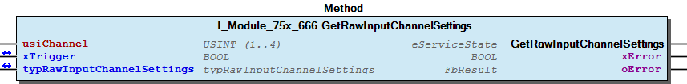
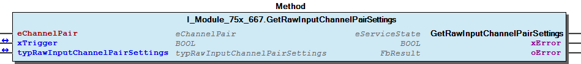
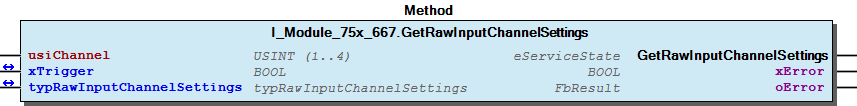
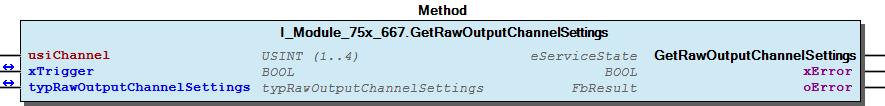
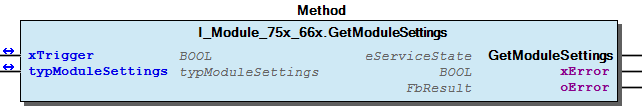
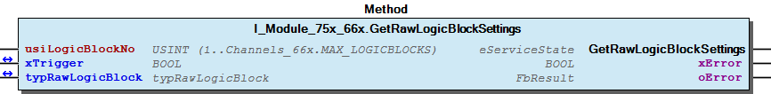
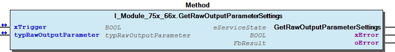

# WagoTypesModule_75x_66x v1.0.1.2 (WAGO) - Complete Documentation


## 📋 Library Information

- **Company:** WAGO
- **Title:** WagoTypesModule_75x_66x
- **Version:** 1.0.1.2
- **Categories:** WAGO Internal|Common|Types and Interfaces; Application; System
- **Author:** WAGO
- **Placeholder:** WagoTypesModule_75x_66x

### Description ¶


This document is automatically generated.

Handling modules 75x-66x

This document is automatically generated. Handling modules 75x-66x

### Contents: ¶


Contents: - Documentation Index - Project Information - Library Information - Methods I_Module_75x_666.GetRawInputChannelPairSettings (METH) - I_Module_75x_666.GetRawInputChannelSettings (METH) - I_Module_75x_666.GetRawOutputChannelSettings (METH) - I_Module_75x_667.GetRawInputChannelPairSettings (METH) - I_Module_75x_667.GetRawInputChannelSettings (METH) - I_Module_75x_667.GetRawOutputChannelSettings (METH) - I_Module_75x_66x.GetModuleSettings (METH) - I_Module_75x_66x.GetRawLogicBlockSettings (METH) - I_Module_75x_66x.GetRawOutputParameterSettings (METH) - eParameterOffset (ENUM) - ... and 6 more Interfaces - I_Module_75x_666 (ITF) - I_Module_75x_667 (ITF) - I_Module_75x_66x (ITF) Program Organization Internal Components Global Variable Lists - Channels_66x (GVL) - VersionHistory (GVL) Other Components - 10 Enumeration - 15 Datatypes - Channel - Channel - Channel - Channel - Input - Input - Input - Input - ... and 36 more

### Indices and tables ¶


Based on WagoTypesModule_75x_66x.library, last modified 29.05.2024, 20:13:28. LibDoc 3.5.16.10

© WAGO GmbH & Co. KG, Germany 2018 – All rights reserved. For the avoidance of doubt, this copyright notice does not only apply to the information above but also and primarily to the described library itself. Please note that third-party products are always mentioned without reference to intellectual property rights, including patents, utility models, designs and trademarks, accordingly the existence of such rights cannot be excluded. WAGO is a registered trademark of WAGO Verwaltungsgesellschaft mbH.

- File and Project Information - Library Reference Based on WagoTypesModule_75x_66x.library, last modified 29.05.2024, 20:13:28. LibDoc 3.5.16.10 © WAGO GmbH & Co. KG, Germany 2018 – All rights reserved. For the avoidance of doubt, this copyright notice does not only apply to the information above but also and primarily to the described library itself. Please note that third-party products are always mentioned without reference to intellectual property rights, including patents, utility models, designs and trademarks, accordingly the existence of such rights cannot be excluded. WAGO is a registered trademark of WAGO Verwaltungsgesellschaft mbH.

### Documentation Index


## WagoTypesModule_75x_66x Library Documentation


| Company: | WAGO |
| Title: | WagoTypesModule_75x_66x |
| Version: | 1.0.1.2 |
| Categories: | WAGO Internal\|Common\|Types and Interfaces; Application; System |
| Author: | WAGO |
| Placeholder: | WagoTypesModule_75x_66x |

### Description


This document is automatically generated.

Handling modules 75x-66x

This document is automatically generated. Handling modules 75x-66x

### Contents:


- 20 Program Organization Units 10 Enumeration - 15 Datatypes - 90 Internal - Channels_66x (GVL) - I_Module_75x_666 (ITF) - I_Module_75x_667 (ITF) - I_Module_75x_66x (ITF) VersionHistory (GVL)

### Indices and tables


Based on WagoTypesModule_75x_66x.library, last modified 29.05.2024, 20:13:28. LibDoc 3.5.16.10

© WAGO GmbH & Co. KG, Germany 2018 – All rights reserved. For the avoidance of doubt, this copyright notice does not only apply to the information above but also and primarily to the described library itself. Please note that third-party products are always mentioned without reference to intellectual property rights, including patents, utility models, designs and trademarks, accordingly the existence of such rights cannot be excluded. WAGO is a registered trademark of WAGO Verwaltungsgesellschaft mbH.

- File and Project Information - Library Reference Based on WagoTypesModule_75x_66x.library, last modified 29.05.2024, 20:13:28. LibDoc 3.5.16.10 © WAGO GmbH & Co. KG, Germany 2018 – All rights reserved. For the avoidance of doubt, this copyright notice does not only apply to the information above but also and primarily to the described library itself. Please note that third-party products are always mentioned without reference to intellectual property rights, including patents, utility models, designs and trademarks, accordingly the existence of such rights cannot be excluded. WAGO is a registered trademark of WAGO Verwaltungsgesellschaft mbH.

### Project Information


## File and Project Information


| Scope | Name | Type | Content |
| --- | --- | --- | --- |
| FileHeader | libraryFile | string | WagoTypesModule_75x_66x.library |
| contentFile | doc.clean.json |
| productName | e!COCKPIT |
| creationDateTime | date | 29.05.2024, 20:13:29 |
| companyName | string | WAGO |
| ProjectInformation | LastModificationDateTime | date | 29.05.2024, 20:13:28 |
| Description | string | See: Description |
| Copyright | © WAGO GmbH & Co. KG, Germany 2018 – All rights reserved. |
| Author | WAGO |
| AutoResolveUnbound | bool | True |
| Placeholder | string | WagoTypesModule_75x_66x |
| Company | WAGO |
| DocFormat | reStructuredText |
| Project | WagoTypesModule_75x_66x |
| Version | version | 1.0.1.2 |
| Version string | string |  |
| Title | WagoTypesModule_75x_66x |
| LibraryCategories | library-category-list | WAGO Internal\|Common\|Types and Interfaces; Application; System |
| CompiledLibraryCompatibilityVersion | string | CODESYS V3.5 SP16 Patch 3 |

### Library Information


## Library Reference


| LinkAllContent: False QualifiedOnly: False | SystemLibrary: False | Optional: False |

| LinkAllContent: False QualifiedOnly: True | SystemLibrary: False | Optional: False |

| LinkAllContent: False QualifiedOnly: False | SystemLibrary: False | Optional: False |

This is a dictionary of all referenced libraries and their name spaces.

This is a dictionary of all referenced libraries and their name spaces. WagoSysErrorBase Library Identification : Placeholder: WagoSysErrorBase Default Resolution: WagoSysErrorBase, * (WAGO) Namespace: WagoSysErrorBase Library Properties : WagoSysVersion Library Identification : Name: WagoSysVersion Version: 1.0.0.0 Company: WAGO Namespace: WagoSysVersion Library Properties : WagoTypesModuleBase Library Identification : Placeholder: WagoTypesModuleBase Default Resolution: WagoTypesModuleBase, * (WAGO) Namespace: WagoTypesModuleBase Library Properties :

### Methods


## I_Module_75x_666.GetRawInputChannelPairSettings (METH)


| Scope | Name | Type |
| --- | --- | --- |
| Return | GetRawInputChannelPairSettings | WagoTypesModuleBase.eServiceState |
| Input | eChannelPair | eChannelPair |
| Inout | xTrigger | BOOL |
| typRawInputChannelPairSettings | typRawInputChannelPairSettings |
| Output | xError | BOOL |
| oError | WagoSysErrorBase.FbResult |

```
VAR
    //--- Channel Settings ---------------------------------
    typRawInputChannelPairSettings  :   WagoTypesModule_75x_667.typRawInputChannelPairSettings;
    xGetInputChannelPairSettings    :   BOOL;
    oError                          :   WagoSysErrorBase.FbResult;
END_VAR

//--- I N P U T  C H A N N E L  P A I R  S E T T I N G S ----------------------
CASE my667.GetRawInputChannelPairSettings(  xTrigger                        := xGetInputChannelPairSettings,
                                            typRawInputChannelPairSettings  := typRawInputChannelPairSettings,
                                            oError                          => oError
                                            ) OF

    eServiceState.DONE : // OK
        ;// process here your typRawInputChannelPairSettings

    eServiceState.ABORT : // Error
        ;// process here your error handling -> see oError for more information

END_CASE
```

typRawInputChannelPairSettings

| Struct member | Value | Description | +=========================+=================+==================================================+ | eChannelPair | CH1_CH2 | | | +—————–+————————————————–+ | | CH3_CH4 | | +————————-+—————–+————————————————–+ | eRestartInterlock | DEACTIVATED | | | +—————–+————————————————–+ | | ACTIVATED | | +————————-+—————–+————————————————–+ | ePreEvaluation | SINGLE_CHANNEL | | | +—————–+————————————————–+ | | EQUIVALENT | | | +—————–+————————————————–+ | | ANTIVALENT | | +————————-+—————–+————————————————–+ | eInputDiscepancyTime | TIME_5MS | | | +—————–+————————————————–+ | | TIME_7MS | | | +—————–+————————————————–+ | | TIME_10MS | | | +—————–+————————————————–+ | | TIME_12MS | | | +—————–+————————————————–+ | | TIME_15MS | | | +—————–+————————————————–+ | | TIME_17MS | | | +—————–+————————————————–+ | | TIME_20MS | | | +—————–+————————————————–+ | | TIME_30MS | | | +—————–+————————————————–+ | | TIME_50MS | | | +—————–+————————————————–+ | | TIME_70MS | | | +—————–+————————————————–+ | | TIME_100MS | | | +—————–+————————————————–+ | | TIME_200MS | | | +—————–+————————————————–+ | | TIME_300MS | | | +—————–+————————————————–+ | | TIME_500MS | | | +—————–+————————————————–+ | | TIME_700MS | | | +—————–+————————————————–+ | | TIME_1000MS | | | +—————–+————————————————–+ | | TIME_2000MS | | | +—————–+————————————————–+ | | TIME_3000MS | | | +—————–+————————————————–+ | | TIME_5000MS | | | +—————–+————————————————–+ | | TIME_7000MS | | +————————-+—————–+————————————————–+

Graphical Illustration

Graphical Interface of I_Module_75x_666.GetRawInputChannelPairSettings

For get the settings from channel one

You have to call the method cyclic until the method returns with DONE or ABORT.

Interface variables Function Get the settings of a channel at a struct. typRawInputChannelPairSettings | Struct member | Value | Description | +=========================+=================+==================================================+ | eChannelPair | CH1_CH2 | | | +—————–+————————————————–+ | | CH3_CH4 | | +————————-+—————–+————————————————–+ | eRestartInterlock | DEACTIVATED | | | +—————–+————————————————–+ | | ACTIVATED | | +————————-+—————–+————————————————–+ | ePreEvaluation | SINGLE_CHANNEL | | | +—————–+————————————————–+ | | EQUIVALENT | | | +—————–+————————————————–+ | | ANTIVALENT | | +————————-+—————–+————————————————–+ | eInputDiscepancyTime | TIME_5MS | | | +—————–+————————————————–+ | | TIME_7MS | | | +—————–+————————————————–+ | | TIME_10MS | | | +—————–+————————————————–+ | | TIME_12MS | | | +—————–+————————————————–+ | | TIME_15MS | | | +—————–+————————————————–+ | | TIME_17MS | | | +—————–+————————————————–+ | | TIME_20MS | | | +—————–+————————————————–+ | | TIME_30MS | | | +—————–+————————————————–+ | | TIME_50MS | | | +—————–+————————————————–+ | | TIME_70MS | | | +—————–+————————————————–+ | | TIME_100MS | | | +—————–+————————————————–+ | | TIME_200MS | | | +—————–+————————————————–+ | | TIME_300MS | | | +—————–+————————————————–+ | | TIME_500MS | | | +—————–+————————————————–+ | | TIME_700MS | | | +—————–+————————————————–+ | | TIME_1000MS | | | +—————–+————————————————–+ | | TIME_2000MS | | | +—————–+————————————————–+ | | TIME_3000MS | | | +—————–+————————————————–+ | | TIME_5000MS | | | +—————–+————————————————–+ | | TIME_7000MS | | +————————-+—————–+————————————————–+ Graphical Illustration  Graphical Interface of I_Module_75x_666.GetRawInputChannelPairSettings Example For get the settings from channel one Note You have to call the method cyclic until the method returns with DONE or ABORT.

## I_Module_75x_666.GetRawInputChannelSettings (METH)


| Scope | Name | Type |
| --- | --- | --- |
| Return | GetRawInputChannelSettings | WagoTypesModuleBase.eServiceState |
| Input | usiChannel | USINT (1..4) |
| Inout | xTrigger | BOOL |
| typRawInputChannelSettings | typRawInputChannelSettings |
| Output | xError | BOOL |
| oError | WagoSysErrorBase.FbResult |

```
VAR
    //--- Channel Settings ---------------------------------
    typRawInputChannelSettings  :   WagoTypesModule_75x_667.typRawInputChannelSettings;
    xGetInputChannelSettings    :   BOOL;
    oError                      :   WagoSysErrorBase.FbResult;
END_VAR

//--- I N P U T  C H A N N E L   S E T T I N G S ----------------------
CASE my667.GetRawInputChannelSettings(  usiChannel                  := 1,
                                        xTrigger                    := xGetInputChannelSettings,
                                        typRawInputChannelSettings  := typRawInputChannelSettings,
                                        oError                      => oError
                                ) OF

    eServiceState.DONE : // OK
        ;// process here your typRawInputChannelSettings

    eServiceState.ABORT : // Error
        ;// process here your error handling -> see oError for more information

END_CASE
```

typRawInputChannelSettings

| Struct member | Value | Description | +=========================+=================+==================================================+ | eShortCircuitTest | DEACTIVATED | | | +—————–+————————————————–+ | | ACTIVATED | | +————————-+—————–+————————————————–+ | eInputFilterTime | TIME_0MS | | | +—————–+————————————————–+ | | TIME_0_2MS | | | +—————–+————————————————–+ | | TIME_0_5MS | | | +—————–+————————————————–+ | | TIME_1MS | | | +—————–+————————————————–+ | | TIME_2MS | | | +—————–+————————————————–+ | | TIME_3MS | | | +—————–+————————————————–+ | | TIME_5MS | | | +—————–+————————————————–+ | | TIME_10MS | | | +—————–+————————————————–+ | | TIME_20MS | | | +—————–+————————————————–+ | | TIME_50MS | | | +—————–+————————————————–+ | | TIME_100MS | | | +—————–+————————————————–+ | | TIME_200MS | | +————————-+—————–+————————————————–+

Graphical Illustration

Graphical Interface of I_Module_75x_666.GetRawInputChannelSettings

For get the settings from channel one

You have to call the method cyclic until the method returns with DONE or ABORT.

Interface variables Function Get the settings of a channel at a struct. typRawInputChannelSettings | Struct member | Value | Description | +=========================+=================+==================================================+ | eShortCircuitTest | DEACTIVATED | | | +—————–+————————————————–+ | | ACTIVATED | | +————————-+—————–+————————————————–+ | eInputFilterTime | TIME_0MS | | | +—————–+————————————————–+ | | TIME_0_2MS | | | +—————–+————————————————–+ | | TIME_0_5MS | | | +—————–+————————————————–+ | | TIME_1MS | | | +—————–+————————————————–+ | | TIME_2MS | | | +—————–+————————————————–+ | | TIME_3MS | | | +—————–+————————————————–+ | | TIME_5MS | | | +—————–+————————————————–+ | | TIME_10MS | | | +—————–+————————————————–+ | | TIME_20MS | | | +—————–+————————————————–+ | | TIME_50MS | | | +—————–+————————————————–+ | | TIME_100MS | | | +—————–+————————————————–+ | | TIME_200MS | | +————————-+—————–+————————————————–+ Graphical Illustration  Graphical Interface of I_Module_75x_666.GetRawInputChannelSettings Example For get the settings from channel one Note You have to call the method cyclic until the method returns with DONE or ABORT.

## I_Module_75x_666.GetRawOutputChannelSettings (METH)


| Scope | Name | Type |
| --- | --- | --- |
| Return | GetRawOutputChannelSettings | WagoTypesModuleBase.eServiceState |
| Input | usiChannel | USINT (1..2) |
| Inout | xTrigger | BOOL |
| typRawOutputChannelSettings | typRawOutputChannelSettings |
| Output | xError | BOOL |
| oError | WagoSysErrorBase.FbResult |

```
VAR
    //--- Channel Settings ---------------------------------
    typRawOutputChannelSettings :   WagoTypesModule_75x_667.typRawOutputChannelSettings;
    xGetOutputChannelSettings   :   BOOL;
    oError                      :   WagoSysErrorBase.FbResult;
END_VAR

//--- C H A N N E L   S E T T I N G S ----------------------
CASE my497.GetRawOutputChannelSettings( usiChannel                  := 1,
                                        xTrigger                    := xGetOutputChannelSettings,
                                        typRawOutputChannelSettings := typRawOutputChannelSettings,
                                        oError                      => oError
                                ) OF

    eServiceState.DONE : // OK
        ;// process here your typRawOutputChannelSettings

    eServiceState.ABORT : // Error
        ;// process here your error handling -> see oError for more information

END_CASE
```

typRawOutputChannelSettings

| Struct member | Value | Description | +=========================+=====================+==================================================+ | eActiveDischarge | DEACTIVATED | | | +———————+————————————————–+ | | ACTIVATED | | +————————-+———————+————————————————–+ | eActiveDischarge | DEACTIVATED | | | +———————+————————————————–+ | | DARK_TEST | | | +———————+————————————————–+ | | LIGHT_AND_DARK_TEST | | +————————-+———————+————————————————–+ | eWireBreakDetection | DEACTIVATED | | | +———————+————————————————–+ | | ACTIVATED | | +————————-+———————+————————————————–+ | eReadBackTime | TIME_1MS | | | +———————+————————————————–+ | | TIME_2MS | | | +———————+————————————————–+ | | TIME_3MS | | | +———————+————————————————–+ | | TIME_5MS | | | +———————+————————————————–+ | | TIME_10MS | | | +———————+————————————————–+ | | TIME_20MS | | | +———————+————————————————–+ | | TIME_50MS | | | +———————+————————————————–+ | | TIME_100MS | | | +———————+————————————————–+ | | TIME_200MS | | +————————-+———————+————————————————–+

Graphical Illustration

Graphical Interface of I_Module_75x_666.GetRawOutputChannelSettings

For get the settings from channel one

You have to call the method cyclic until the method returns with DONE or ABORT.

Interface variables Function Get the settings of a channel at a struct. typRawOutputChannelSettings | Struct member | Value | Description | +=========================+=====================+==================================================+ | eActiveDischarge | DEACTIVATED | | | +———————+————————————————–+ | | ACTIVATED | | +————————-+———————+————————————————–+ | eActiveDischarge | DEACTIVATED | | | +———————+————————————————–+ | | DARK_TEST | | | +———————+————————————————–+ | | LIGHT_AND_DARK_TEST | | +————————-+———————+————————————————–+ | eWireBreakDetection | DEACTIVATED | | | +———————+————————————————–+ | | ACTIVATED | | +————————-+———————+————————————————–+ | eReadBackTime | TIME_1MS | | | +———————+————————————————–+ | | TIME_2MS | | | +———————+————————————————–+ | | TIME_3MS | | | +———————+————————————————–+ | | TIME_5MS | | | +———————+————————————————–+ | | TIME_10MS | | | +———————+————————————————–+ | | TIME_20MS | | | +———————+————————————————–+ | | TIME_50MS | | | +———————+————————————————–+ | | TIME_100MS | | | +———————+————————————————–+ | | TIME_200MS | | +————————-+———————+————————————————–+ Graphical Illustration  Graphical Interface of I_Module_75x_666.GetRawOutputChannelSettings Example For get the settings from channel one Note You have to call the method cyclic until the method returns with DONE or ABORT.

## I_Module_75x_667.GetRawInputChannelPairSettings (METH)


| Scope | Name | Type |
| --- | --- | --- |
| Return | GetRawInputChannelPairSettings | WagoTypesModuleBase.eServiceState |
| Input | eChannelPair | eChannelPair |
| Inout | xTrigger | BOOL |
| typRawInputChannelPairSettings | typRawInputChannelPairSettings |
| Output | xError | BOOL |
| oError | WagoSysErrorBase.FbResult |

```
VAR
    //--- Channel Settings ---------------------------------
    typRawInputChannelPairSettings  :   WagoTypesModule_75x_66x.typRawInputChannelPairSettings;
    xGetInputChannelPairSettings    :   BOOL;
    oError                          :   WagoSysErrorBase.FbResult;
END_VAR

//--- I N P U T  C H A N N E L  P A I R  S E T T I N G S ----------------------
CASE my667.GetRawInputChannelPairSettings(  xTrigger                        := xGetInputChannelPairSettings,
                                            typRawInputChannelPairSettings  := typRawInputChannelPairSettings,
                                            oError                          => oError
                                            ) OF

    eServiceState.DONE : // OK
        ;// process here your typRawInputChannelPairSettings

    eServiceState.ABORT : // Error
        ;// process here your error handling -> see oError for more information

END_CASE
```

typRawInputChannelPairSettings

| Struct member | Value | Description | +=========================+=================+==================================================+ | eChannelPair | CH1_CH2 | | | +—————–+————————————————–+ | | CH3_CH4 | | +————————-+—————–+————————————————–+ | eRestartInterlock | DEACTIVATED | | | +—————–+————————————————–+ | | ACTIVATED | | +————————-+—————–+————————————————–+ | ePreEvaluation | SINGLE_CHANNEL | | | +—————–+————————————————–+ | | EQUIVALENT | | | +—————–+————————————————–+ | | ANTIVALENT | | +————————-+—————–+————————————————–+ | eInputDiscepancyTime | TIME_5MS | | | +—————–+————————————————–+ | | TIME_7MS | | | +—————–+————————————————–+ | | TIME_10MS | | | +—————–+————————————————–+ | | TIME_12MS | | | +—————–+————————————————–+ | | TIME_15MS | | | +—————–+————————————————–+ | | TIME_17MS | | | +—————–+————————————————–+ | | TIME_20MS | | | +—————–+————————————————–+ | | TIME_30MS | | | +—————–+————————————————–+ | | TIME_50MS | | | +—————–+————————————————–+ | | TIME_70MS | | | +—————–+————————————————–+ | | TIME_100MS | | | +—————–+————————————————–+ | | TIME_200MS | | | +—————–+————————————————–+ | | TIME_300MS | | | +—————–+————————————————–+ | | TIME_500MS | | | +—————–+————————————————–+ | | TIME_700MS | | | +—————–+————————————————–+ | | TIME_1000MS | | | +—————–+————————————————–+ | | TIME_2000MS | | | +—————–+————————————————–+ | | TIME_3000MS | | | +—————–+————————————————–+ | | TIME_5000MS | | | +—————–+————————————————–+ | | TIME_7000MS | | +————————-+—————–+————————————————–+

Graphical Illustration

Graphical Interface of I_Module_75x_667.GetRawInputChannelPairSettings

For get the settings from channel one

You have to call the method cyclic until the method returns with DONE or ABORT.

Interface variables Function Get the settings of a channel at a struct. typRawInputChannelPairSettings | Struct member | Value | Description | +=========================+=================+==================================================+ | eChannelPair | CH1_CH2 | | | +—————–+————————————————–+ | | CH3_CH4 | | +————————-+—————–+————————————————–+ | eRestartInterlock | DEACTIVATED | | | +—————–+————————————————–+ | | ACTIVATED | | +————————-+—————–+————————————————–+ | ePreEvaluation | SINGLE_CHANNEL | | | +—————–+————————————————–+ | | EQUIVALENT | | | +—————–+————————————————–+ | | ANTIVALENT | | +————————-+—————–+————————————————–+ | eInputDiscepancyTime | TIME_5MS | | | +—————–+————————————————–+ | | TIME_7MS | | | +—————–+————————————————–+ | | TIME_10MS | | | +—————–+————————————————–+ | | TIME_12MS | | | +—————–+————————————————–+ | | TIME_15MS | | | +—————–+————————————————–+ | | TIME_17MS | | | +—————–+————————————————–+ | | TIME_20MS | | | +—————–+————————————————–+ | | TIME_30MS | | | +—————–+————————————————–+ | | TIME_50MS | | | +—————–+————————————————–+ | | TIME_70MS | | | +—————–+————————————————–+ | | TIME_100MS | | | +—————–+————————————————–+ | | TIME_200MS | | | +—————–+————————————————–+ | | TIME_300MS | | | +—————–+————————————————–+ | | TIME_500MS | | | +—————–+————————————————–+ | | TIME_700MS | | | +—————–+————————————————–+ | | TIME_1000MS | | | +—————–+————————————————–+ | | TIME_2000MS | | | +—————–+————————————————–+ | | TIME_3000MS | | | +—————–+————————————————–+ | | TIME_5000MS | | | +—————–+————————————————–+ | | TIME_7000MS | | +————————-+—————–+————————————————–+ Graphical Illustration  Graphical Interface of I_Module_75x_667.GetRawInputChannelPairSettings Example For get the settings from channel one Note You have to call the method cyclic until the method returns with DONE or ABORT.

## I_Module_75x_667.GetRawInputChannelSettings (METH)


| Scope | Name | Type |
| --- | --- | --- |
| Return | GetRawInputChannelSettings | WagoTypesModuleBase.eServiceState |
| Input | usiChannel | USINT (1..4) |
| Inout | xTrigger | BOOL |
| typRawInputChannelSettings | typRawInputChannelSettings |
| Output | xError | BOOL |
| oError | WagoSysErrorBase.FbResult |

```
VAR
    //--- Channel Settings ---------------------------------
    typRawInputChannelSettings  :   WagoTypesModule_75x_66x.typRawInputChannelSettings;
    xGetInputChannelSettings    :   BOOL;
    oError                      :   WagoSysErrorBase.FbResult;
END_VAR

//--- I N P U T  C H A N N E L   S E T T I N G S ----------------------
CASE my667.GetRawInputChannelSettings(  usiChannel                  := 1,
                                        xTrigger                    := xGetInputChannelSettings,
                                        typRawInputChannelSettings  := typRawInputChannelSettings,
                                        oError                      => oError
                                ) OF

    eServiceState.DONE : // OK
        ;// process here your typRawInputChannelSettings

    eServiceState.ABORT : // Error
        ;// process here your error handling -> see oError for more information

END_CASE
```

typRawInputChannelSettings

| Struct member | Value | Description | +=========================+=================+==================================================+ | eShortCircuitTest | DEACTIVATED | | | +—————–+————————————————–+ | | ACTIVATED | | +————————-+—————–+————————————————–+ | eInputFilterTime | TIME_0MS | | | +—————–+————————————————–+ | | TIME_0_2MS | | | +—————–+————————————————–+ | | TIME_0_5MS | | | +—————–+————————————————–+ | | TIME_1MS | | | +—————–+————————————————–+ | | TIME_2MS | | | +—————–+————————————————–+ | | TIME_3MS | | | +—————–+————————————————–+ | | TIME_5MS | | | +—————–+————————————————–+ | | TIME_10MS | | | +—————–+————————————————–+ | | TIME_20MS | | | +—————–+————————————————–+ | | TIME_50MS | | | +—————–+————————————————–+ | | TIME_100MS | | | +—————–+————————————————–+ | | TIME_200MS | | +————————-+—————–+————————————————–+

Graphical Illustration

Graphical Interface of I_Module_75x_667.GetRawInputChannelSettings

For get the settings from channel one

You have to call the method cyclic until the method returns with DONE or ABORT.

Interface variables Function Get the settings of a channel at a struct. typRawInputChannelSettings | Struct member | Value | Description | +=========================+=================+==================================================+ | eShortCircuitTest | DEACTIVATED | | | +—————–+————————————————–+ | | ACTIVATED | | +————————-+—————–+————————————————–+ | eInputFilterTime | TIME_0MS | | | +—————–+————————————————–+ | | TIME_0_2MS | | | +—————–+————————————————–+ | | TIME_0_5MS | | | +—————–+————————————————–+ | | TIME_1MS | | | +—————–+————————————————–+ | | TIME_2MS | | | +—————–+————————————————–+ | | TIME_3MS | | | +—————–+————————————————–+ | | TIME_5MS | | | +—————–+————————————————–+ | | TIME_10MS | | | +—————–+————————————————–+ | | TIME_20MS | | | +—————–+————————————————–+ | | TIME_50MS | | | +—————–+————————————————–+ | | TIME_100MS | | | +—————–+————————————————–+ | | TIME_200MS | | +————————-+—————–+————————————————–+ Graphical Illustration  Graphical Interface of I_Module_75x_667.GetRawInputChannelSettings Example For get the settings from channel one Note You have to call the method cyclic until the method returns with DONE or ABORT.

## I_Module_75x_667.GetRawOutputChannelSettings (METH)


| Scope | Name | Type |
| --- | --- | --- |
| Return | GetRawOutputChannelSettings | WagoTypesModuleBase.eServiceState |
| Input | usiChannel | USINT (1..4) |
| Inout | xTrigger | BOOL |
| typRawOutputChannelSettings | typRawOutputChannelSettings |
| Output | xError | BOOL |
| oError | WagoSysErrorBase.FbResult |

```
VAR
    //--- Channel Settings ---------------------------------
    typRawOutputChannelSettings :   WagoTypesModule_75x_66x.typRawOutputChannelSettings;
    xGetOutputChannelSettings   :   BOOL;
    oError                      :   WagoSysErrorBase.FbResult;
END_VAR

//--- C H A N N E L   S E T T I N G S ----------------------
CASE my497.GetRawOutputChannelSettings( usiChannel                  := 1,
                                        xTrigger                    := xGetOutputChannelSettings,
                                        typRawOutputChannelSettings := typRawOutputChannelSettings,
                                        oError                      => oError
                                ) OF

    eServiceState.DONE : // OK
        ;// process here your typRawOutputChannelSettings

    eServiceState.ABORT : // Error
        ;// process here your error handling -> see oError for more information

END_CASE
```

typRawOutputChannelSettings

| Struct member | Value | Description | +=========================+=====================+==================================================+ | eActiveDischarge | DEACTIVATED | | | +———————+————————————————–+ | | ACTIVATED | | +————————-+———————+————————————————–+ | eActiveDischarge | DEACTIVATED | | | +———————+————————————————–+ | | DARK_TEST | | | +———————+————————————————–+ | | LIGHT_AND_DARK_TEST | | +————————-+———————+————————————————–+ | eWireBreakDetection | DEACTIVATED | | | +———————+————————————————–+ | | ACTIVATED | | +————————-+———————+————————————————–+ | eReadBackTime | TIME_1MS | | | +———————+————————————————–+ | | TIME_2MS | | | +———————+————————————————–+ | | TIME_3MS | | | +———————+————————————————–+ | | TIME_5MS | | | +———————+————————————————–+ | | TIME_10MS | | | +———————+————————————————–+ | | TIME_20MS | | | +———————+————————————————–+ | | TIME_50MS | | | +———————+————————————————–+ | | TIME_100MS | | | +———————+————————————————–+ | | TIME_200MS | | +————————-+———————+————————————————–+

Graphical Illustration

Graphical Interface of I_Module_75x_667.GetRawOutputChannelSettings

For get the settings from channel one

You have to call the method cyclic until the method returns with DONE or ABORT.

Interface variables Function Get the settings of a channel at a struct. typRawOutputChannelSettings | Struct member | Value | Description | +=========================+=====================+==================================================+ | eActiveDischarge | DEACTIVATED | | | +———————+————————————————–+ | | ACTIVATED | | +————————-+———————+————————————————–+ | eActiveDischarge | DEACTIVATED | | | +———————+————————————————–+ | | DARK_TEST | | | +———————+————————————————–+ | | LIGHT_AND_DARK_TEST | | +————————-+———————+————————————————–+ | eWireBreakDetection | DEACTIVATED | | | +———————+————————————————–+ | | ACTIVATED | | +————————-+———————+————————————————–+ | eReadBackTime | TIME_1MS | | | +———————+————————————————–+ | | TIME_2MS | | | +———————+————————————————–+ | | TIME_3MS | | | +———————+————————————————–+ | | TIME_5MS | | | +———————+————————————————–+ | | TIME_10MS | | | +———————+————————————————–+ | | TIME_20MS | | | +———————+————————————————–+ | | TIME_50MS | | | +———————+————————————————–+ | | TIME_100MS | | | +———————+————————————————–+ | | TIME_200MS | | +————————-+———————+————————————————–+ Graphical Illustration  Graphical Interface of I_Module_75x_667.GetRawOutputChannelSettings Example For get the settings from channel one Note You have to call the method cyclic until the method returns with DONE or ABORT.

## I_Module_75x_66x.GetModuleSettings (METH)


| Scope | Name | Type | Comment |
| --- | --- | --- | --- |
| Return | GetModuleSettings | WagoTypesModuleBase.eServiceState |  |
| Inout | xTrigger | BOOL | set this variable once to start the process. It will be reset by the Method automatic. |
| typModuleSettings | typModuleSettings |  |
| Output | xError | BOOL |  |
| oError | WagoSysErrorBase.FbResult |  |

```
VAR
    //--- Module Mode Settings ------------------------------
    typModuleSettings   :   WagoTypesModule_75x_66x.typModuleSettings;
    xGetModuleSettings  :   BOOL;  // triggers the function
    oError              :   WagoSysErrorBase.FbResult;
END_VAR

//--- M O D U L E    S E T T I N G S -----------------------
CASE my497.GetModuleSettings(xGetModuleSettings, typModuleSettings, oError => oError) OF

    eServiceState.DONE : // OK
            ;// process here your typModuleSettings

    eServiceState.ABORT : // Error
            ;// process here your error handling -> see oError for more information

END_CASE
```

Get the common settings of the module at a struct.

| Struct member | Value | Description | +=========================+=====================+==================================================+ | eOperationMode | STANDARD | | | +———————+————————————————–+ | | ROTARY_TABLE | | +————————-+———————+————————————————–+ | eTestPulseDuration | TIME_0_5MS | | | +———————+————————————————–+ | | TIME_1MS | | | +———————+————————————————–+ | | TIME_2MS | | | +———————+————————————————–+ | | TIME_3MS | | | +———————+————————————————–+ | | TIME_5MS | | | +———————+————————————————–+ | | TIME_10MS | | | +———————+————————————————–+ | | TIME_20MS | | | +———————+————————————————–+ | | TIME_50MS | | | +———————+————————————————–+ | | TIME_100MS | | | +———————+————————————————–+ | | TIME_200MS | | | ————————-+———————+————————————————–+

It is not allowed to reset the xTrigger by the application. This must done by the method.

Graphical Illustration

Graphical Interface of I_Module_75x_66x.GetModuleSettings

For get the settings from the module.

You have to call the method cyclic until the method returns with DONE or ABORT.

Interface variables Function Get the common settings of the module at a struct. | Struct member | Value | Description | +=========================+=====================+==================================================+ | eOperationMode | STANDARD | | | +———————+————————————————–+ | | ROTARY_TABLE | | +————————-+———————+————————————————–+ | eTestPulseDuration | TIME_0_5MS | | | +———————+————————————————–+ | | TIME_1MS | | | +———————+————————————————–+ | | TIME_2MS | | | +———————+————————————————–+ | | TIME_3MS | | | +———————+————————————————–+ | | TIME_5MS | | | +———————+————————————————–+ | | TIME_10MS | | | +———————+————————————————–+ | | TIME_20MS | | | +———————+————————————————–+ | | TIME_50MS | | | +———————+————————————————–+ | | TIME_100MS | | | +———————+————————————————–+ | | TIME_200MS | | | ————————-+———————+————————————————–+ Warning It is not allowed to reset the xTrigger by the application. This must done by the method. Graphical Illustration  Graphical Interface of I_Module_75x_66x.GetModuleSettings Example For get the settings from the module. Note You have to call the method cyclic until the method returns with DONE or ABORT.

## I_Module_75x_66x.GetRawLogicBlockSettings (METH)


| Scope | Name | Type |
| --- | --- | --- |
| Return | GetRawLogicBlockSettings | WagoTypesModuleBase.eServiceState |
| Input | usiLogicBlockNo | USINT (1..Channels_66x.MAX_LOGICBLOCKS) |
| Inout | xTrigger | BOOL |
| typRawLogicBlock | typRawLogicBlock |
| Output | xError | BOOL |
| oError | WagoSysErrorBase.FbResult |

```
VAR
    //--- Channel Settings ---------------------------------
    typRawLogicBlock        :   WagoTypesModule_75x_66x.typRawLogicBlock;
    xGetLogicBlockSettings  :   BOOL;
    usiLogicBlockNo         :   USINT;
    oError                  :   WagoSysErrorBase.FbResult;
END_VAR

//--- L O G I C B L O C K  S E T T I N G S ----------------------
CASE my667.GetRawLogicBlockSettings     (   xTrigger                        := xGetLogicBlockSettings,
                                            usiLogicBlockNo                 := usiLogicBlockNo,
                                            typRawInputChannelPairSettings  := typRawLogicBlock,
                                            oError                          => oError
                                            ) OF

    eServiceState.DONE : // OK
        ;// process here your typRawLogicBlock

    eServiceState.ABORT : // Error
        ;// process here your error handling -> see oError for more information

END_CASE
```

typRawLogicBlock

| Struct member | Value | Description | +=========================+=====================================+==================================================+ | usiLogicBlockNumber | USINT | | +————————-+————————————-+————————————————–+ | eLogicFunction | DEACTIVATED | | | +————————————-+————————————————–+ | | LOGIC_BLOCK_OR | | | +————————————-+————————————————–+ | | LOGIC_BLOCK_QUADRUPLE_XOR | | | +————————————-+————————————————–+ | | LOGIC_BLOCK_QUADRUPLE_AND | | | +————————————-+————————————————–+ | | LOGIC_BLOCK_TOF | | | +————————————-+————————————————–+ | | LOGIC_BLOCK_EDM | | | +————————————-+————————————————–+ | | LOGIC_BLOCK_ESTOP | | | +————————————-+————————————————–+ | | LOGIC_BLOCK_TWO_HAND_CONTROL_TYP_2 | | | +————————————-+————————————————–+ | | LOGIC_BLOCK_RESET | | | +————————————-+————————————————–+ | | LOGIC_BLOCK_TWO_HAND_CONTROL_TYP_3 | | | +————————————-+————————————————–+ | | LOGIC_BLOCK_AND | | +————————-+————————————-+————————————————–+ | eInputSignal_1.. | NOT_IN_USE | | | eInputSignal_12 | | | | +————————————-+————————————————–+ | | CONSTANT_1_SIGNAL | | | +————————————-+————————————————–+ | | CONSTANT_0_SIGNAL | | | +————————————-+————————————————–+ | | VO1..VO30 | | | +————————————-+————————————————–+ | | DI1..VDI4 | | | +————————————-+————————————————–+ | | QDI1..QDI4 | | | +————————————-+————————————————–+ | | QDO1..QDO4 | | | +————————————-+————————————————–+ | | LB1..LB12 | | +————————-+————————————-+————————————————–+ | usiParameter_1.. | USINT | | | usiParameter_12 | | | +————————-+————————————-+————————————————–+

Graphical Illustration

Graphical Interface of I_Module_75x_66x.GetRawLogicBlockSettings

For get the settings from channel one

You have to call the method cyclic until the method returns with DONE or ABORT.

Interface variables Function Get the settings of a logic block. typRawLogicBlock | Struct member | Value | Description | +=========================+=====================================+==================================================+ | usiLogicBlockNumber | USINT | | +————————-+————————————-+————————————————–+ | eLogicFunction | DEACTIVATED | | | +————————————-+————————————————–+ | | LOGIC_BLOCK_OR | | | +————————————-+————————————————–+ | | LOGIC_BLOCK_QUADRUPLE_XOR | | | +————————————-+————————————————–+ | | LOGIC_BLOCK_QUADRUPLE_AND | | | +————————————-+————————————————–+ | | LOGIC_BLOCK_TOF | | | +————————————-+————————————————–+ | | LOGIC_BLOCK_EDM | | | +————————————-+————————————————–+ | | LOGIC_BLOCK_ESTOP | | | +————————————-+————————————————–+ | | LOGIC_BLOCK_TWO_HAND_CONTROL_TYP_2 | | | +————————————-+————————————————–+ | | LOGIC_BLOCK_RESET | | | +————————————-+————————————————–+ | | LOGIC_BLOCK_TWO_HAND_CONTROL_TYP_3 | | | +————————————-+————————————————–+ | | LOGIC_BLOCK_AND | | +————————-+————————————-+————————————————–+ | eInputSignal_1.. | NOT_IN_USE | | | eInputSignal_12 | | | | +————————————-+————————————————–+ | | CONSTANT_1_SIGNAL | | | +————————————-+————————————————–+ | | CONSTANT_0_SIGNAL | | | +————————————-+————————————————–+ | | VO1..VO30 | | | +————————————-+————————————————–+ | | DI1..VDI4 | | | +————————————-+————————————————–+ | | QDI1..QDI4 | | | +————————————-+————————————————–+ | | QDO1..QDO4 | | | +————————————-+————————————————–+ | | LB1..LB12 | | +————————-+————————————-+————————————————–+ | usiParameter_1.. | USINT | | | usiParameter_12 | | | +————————-+————————————-+————————————————–+ Graphical Illustration  Graphical Interface of I_Module_75x_66x.GetRawLogicBlockSettings Example For get the settings from channel one Note You have to call the method cyclic until the method returns with DONE or ABORT.

## I_Module_75x_66x.GetRawOutputParameterSettings (METH)


| Scope | Name | Type |
| --- | --- | --- |
| Return | GetRawOutputParameterSettings | WagoTypesModuleBase.eServiceState |
| Inout | xTrigger | BOOL |
| typRawOutputParameter | typRawOutputParameter |
| Output | xError | BOOL |
| oError | WagoSysErrorBase.FbResult |

| Struct member | Value | Description |
| --- | --- | --- |
| eVI_1.. eVI_30 | eVI |  |
| eDO1.. eDO4 | DEACTIVATED |  |

```
VAR
    //--- Channel Settings ---------------------------------
    typRawOutputParameter               :   WagoTypesModule_75x_66x.typRawOutputParameter;
    xGetOutputParameterSettings         :   BOOL;
    oError                              :   WagoSysErrorBase.FbResult;
END_VAR

//--- I N P U T  C H A N N E L  P A I R  S E T T I N G S ----------------------
CASE my667.GetRawOutputParameterSettings(   xTrigger                        := xGetOutputParameterSettings,
                                            typRawOutputParameter           := typRawOutputParameter,
                                            oError                          => oError
                                            ) OF

    eServiceState.DONE : // OK
        ;// process here your

    eServiceState.ABORT : // Error
        ;// process here your error handling -> see oError for more information

END_CASE
```

typRawInputChannelPairSettings

Graphical Illustration

Graphical Interface of I_Module_75x_66x.GetRawOutputParameterSettings

For get the settings from channel one

You have to call the method cyclic until the method returns with DONE or ABORT.

Interface variables Function Get the settings of a output parameter. typRawInputChannelPairSettings Graphical Illustration  Graphical Interface of I_Module_75x_66x.GetRawOutputParameterSettings Example For get the settings from channel one Note You have to call the method cyclic until the method returns with DONE or ABORT.

## eParameterOffset (ENUM)


| Name | Initial |
| --- | --- |
| IPARAMETER | 12 |
| LOGICFUNCTION_DIAG_CODE | 198 |

{attribute ‘strict’}

Attributes: qualified_only InOut: {attribute ‘strict’}

## eReadBackTime (ENUM)


| Name | Initial |
| --- | --- |
| TIME_1MS | 0 |
| TIME_2MS | 1 |
| TIME_3MS | 2 |
| TIME_5MS | 3 |
| TIME_10MS | 4 |
| TIME_20MS | 5 |
| TIME_50MS | 6 |
| TIME_100MS | 7 |
| TIME_200MS | 8 |

Attributes: qualified_only InOut: Values

## eRestartInterlock (ENUM)


| Name | Initial |
| --- | --- |
| DEACTIVATED | 0 |
| ACTIVATED | 1 |

Attributes: qualified_only InOut: Values

## typModuleSettings (STRUCT)


| Name | Type |
| --- | --- |
| eOperationMode | eOperationMode |
| eTestPulseDuration | eTestPulseDuration |

| Struct member | Value | Description |
| --- | --- | --- |
|  |  |  |

## typRawInputChannelPairSettings (STRUCT)


| Name | Type |
| --- | --- |
| eChannelPair | eChannelPair |
| eRestartInterlock | eRestartInterlock |
| ePreEvaluation | ePreEvaluation |
| eInputDiscepancyTime | eInputDiscepancyTime |

| Struct member | Value | Description |
| --- | --- | --- |
|  |  |  |

typRawChannelPairSettings

InOut: typRawChannelPairSettings

## typRawInputChannelSettings (STRUCT)


| Name | Type |
| --- | --- |
| eShortCircuitTest | eShortCircuitTest |
| eInputFilterTime | eInputFilterTime |

| Struct member | Value | Description |
| --- | --- | --- |
|  |  |  |

typRawChannelSettings

InOut: typRawChannelSettings

## typRawOutputChannelSettings (STRUCT)


| Name | Type |
| --- | --- |
| eActiveDischarge | eActiveDischarge |
| eTestSequence | eTestSequence |
| eWireBreakDetection | eWireBreakDetection |
| eReadBackTime | eReadBackTime |

| Struct member | Value | Description |
| --- | --- | --- |
|  |  |  |

typRawChannelSettings

InOut: typRawChannelSettings

### Interfaces


## I_Module_75x_666 (ITF)


- Channel Input I_Module_75x_666.GetRawInputChannelPairSettings (METH) - I_Module_75x_666.GetRawInputChannelSettings (METH) Output - I_Module_75x_666.GetRawOutputChannelSettings (METH)

## I_Module_75x_667 (ITF)


- Channel Input I_Module_75x_667.GetRawInputChannelPairSettings (METH) - I_Module_75x_667.GetRawInputChannelSettings (METH) Output - I_Module_75x_667.GetRawOutputChannelSettings (METH)

## I_Module_75x_66x (ITF)


- Logicblocks Logicblock I_Module_75x_66x.GetRawLogicBlockSettings (METH) OutputParameter - I_Module_75x_66x.GetRawOutputParameterSettings (METH) Module - I_Module_75x_66x.GetModuleSettings (METH)

### Program Organization


## 20 Program Organization Units


- 10 Enumeration Channel Input eChannelPair (ENUM) - eInputDiscepancyTime (ENUM) - eInputFilterTime (ENUM) - ePreEvaluation (ENUM) - eRestartInterlock (ENUM) - eShortCircuitTest (ENUM) Output - eActiveDischarge (ENUM) - eReadBackTime (ENUM) - eTestSequence (ENUM) - eWireBreakDetection (ENUM) Logicblocks - eInputSignal (ENUM) - eLogicFunction (ENUM) - eVI (ENUM) Module - eOperationMode (ENUM) - eTestPulseDuration (ENUM) 15 Datatypes - Channel Input typRawInputChannelPairSettings (STRUCT) - typRawInputChannelSettings (STRUCT) Output - typRawOutputChannelSettings (STRUCT) Logicblocks - typRawLogicBlock (STRUCT) - typRawOutputParameter (STRUCT) Module - typModuleSettings (STRUCT) iParameter - eProtocol_iParameter (ENUM) - eState_iParameter (ENUM) 90 Internal - K-Bus Registry eRegisterNo (ENUM) ParameterChannel - eParameterOffset (ENUM) - eParameterType (ENUM) eErrorSource (ENUM) eErrorType (ENUM) Channels_66x (GVL) I_Module_75x_666 (ITF) - Channel Input I_Module_75x_666.GetRawInputChannelPairSettings (METH) - I_Module_75x_666.GetRawInputChannelSettings (METH) Output - I_Module_75x_666.GetRawOutputChannelSettings (METH) I_Module_75x_667 (ITF) - Channel Input I_Module_75x_667.GetRawInputChannelPairSettings (METH) - I_Module_75x_667.GetRawInputChannelSettings (METH) Output - I_Module_75x_667.GetRawOutputChannelSettings (METH) I_Module_75x_66x (ITF) - Logicblocks Logicblock I_Module_75x_66x.GetRawLogicBlockSettings (METH) OutputParameter - I_Module_75x_66x.GetRawOutputParameterSettings (METH) Module - I_Module_75x_66x.GetModuleSettings (METH)

### Internal Components


## 90 Internal


- K-Bus Registry eRegisterNo (ENUM) ParameterChannel - eParameterOffset (ENUM) - eParameterType (ENUM) eErrorSource (ENUM) eErrorType (ENUM)

### Global Variable Lists


## Channels_66x (GVL)


| Scope | Name | Type | Initial |
| --- | --- | --- | --- |
| Constant | MAX_LOGICBLOCKS | USINT | 12 |

## VersionHistory (GVL)


| Name | Type |
| --- | --- |
| Info | ProjectInfo |

| date | version | author | change |
| 17.05.2024 | 1.0.1.2 | u0103719 | modified to read only (context: RawSettings) |
| 30.04.2024 | 1.0.1.1 | u0103719 | add new parametertype (LOGIC_BLOCK_SETTINGS,OUTPUT_PARAMETER_SETTINGS) |
| 25.04.2024 | 1.0.1.0 | u0103719 | add logicblock,output Parameter datatypes |
| 12.02.2024 | 1.0.0.2 | u0103719 | add iParameter datatypes |
| 07.02.2024 | 1.0.0.1 | u0103719 | update enviroment to SP 16 Patch 3 |
| 11.10.2023 | 1.0.0.0 | u0103719 | first release |
| 22.09.2023 | 0.0.0.3 | u0103719 | modified channel settings |
| 10.05.2023 | 0.0.0.2 | u0103719 | include missing interfaces for WagoSysDynamicIoMapping |
| 24.04.2023 | 0.0.0.1 | u010663 | init |

WagoTypesModule_75x_667.library

Release Notes:

WagoTypesModule_75x_667.library Release Notes:

### Other Components


## 10 Enumeration


- Channel Input eChannelPair (ENUM) - eInputDiscepancyTime (ENUM) - eInputFilterTime (ENUM) - ePreEvaluation (ENUM) - eRestartInterlock (ENUM) - eShortCircuitTest (ENUM) Output - eActiveDischarge (ENUM) - eReadBackTime (ENUM) - eTestSequence (ENUM) - eWireBreakDetection (ENUM) Logicblocks - eInputSignal (ENUM) - eLogicFunction (ENUM) - eVI (ENUM) Module - eOperationMode (ENUM) - eTestPulseDuration (ENUM)

## 15 Datatypes


- Channel Input typRawInputChannelPairSettings (STRUCT) - typRawInputChannelSettings (STRUCT) Output - typRawOutputChannelSettings (STRUCT) Logicblocks - typRawLogicBlock (STRUCT) - typRawOutputParameter (STRUCT) Module - typModuleSettings (STRUCT) iParameter - eProtocol_iParameter (ENUM) - eState_iParameter (ENUM)

## Channel


- Input eChannelPair (ENUM) - eInputDiscepancyTime (ENUM) - eInputFilterTime (ENUM) - ePreEvaluation (ENUM) - eRestartInterlock (ENUM) - eShortCircuitTest (ENUM) Output - eActiveDischarge (ENUM) - eReadBackTime (ENUM) - eTestSequence (ENUM) - eWireBreakDetection (ENUM)

## Channel


- Input I_Module_75x_667.GetRawInputChannelPairSettings (METH) - I_Module_75x_667.GetRawInputChannelSettings (METH) Output - I_Module_75x_667.GetRawOutputChannelSettings (METH)

## Channel


- Input I_Module_75x_666.GetRawInputChannelPairSettings (METH) - I_Module_75x_666.GetRawInputChannelSettings (METH) Output - I_Module_75x_666.GetRawOutputChannelSettings (METH)

## Channel


- Input typRawInputChannelPairSettings (STRUCT) - typRawInputChannelSettings (STRUCT) Output - typRawOutputChannelSettings (STRUCT)

## Input


- I_Module_75x_666.GetRawInputChannelPairSettings (METH) - I_Module_75x_666.GetRawInputChannelSettings (METH)

## Input


- eChannelPair (ENUM) - eInputDiscepancyTime (ENUM) - eInputFilterTime (ENUM) - ePreEvaluation (ENUM) - eRestartInterlock (ENUM) - eShortCircuitTest (ENUM)

## Input


- typRawInputChannelPairSettings (STRUCT) - typRawInputChannelSettings (STRUCT)

## Input


- I_Module_75x_667.GetRawInputChannelPairSettings (METH) - I_Module_75x_667.GetRawInputChannelSettings (METH)

## K-Bus Registry ¶


## Logicblock


- I_Module_75x_66x.GetRawLogicBlockSettings (METH)

## Logicblocks


- typRawLogicBlock (STRUCT) - typRawOutputParameter (STRUCT)

## Logicblocks


- eInputSignal (ENUM) - eLogicFunction (ENUM) - eVI (ENUM)

## Logicblocks


- Logicblock I_Module_75x_66x.GetRawLogicBlockSettings (METH) OutputParameter - I_Module_75x_66x.GetRawOutputParameterSettings (METH)

## Module


- eOperationMode (ENUM) - eTestPulseDuration (ENUM)

## Module ¶


- I_Module_75x_66x.GetModuleSettings (METH)

## Module ¶


- typModuleSettings (STRUCT)

## Output


- I_Module_75x_667.GetRawOutputChannelSettings (METH)

## Output


- I_Module_75x_666.GetRawOutputChannelSettings (METH)

## Output


- eActiveDischarge (ENUM) - eReadBackTime (ENUM) - eTestSequence (ENUM) - eWireBreakDetection (ENUM)

## Output ¶


- typRawOutputChannelSettings (STRUCT)

## OutputParameter


- I_Module_75x_66x.GetRawOutputParameterSettings (METH)

## ParameterChannel


- eParameterOffset (ENUM) - eParameterType (ENUM)

## eActiveDischarge (ENUM)


| Name | Initial |
| --- | --- |
| DEACTIVATED | 0 |
| ACTIVATED | 1 |

Attributes: qualified_only InOut: Values

## eChannelPair (ENUM)


| Name | Initial |
| --- | --- |
| CH1_CH2 | 1 |
| CH3_CH4 | 2 |

Attributes: qualified_only InOut: Values

## eErrorSource (ENUM)


| Name | Initial | Comment |
| --- | --- | --- |
| NONE | 99 |  |
| SAFE_INPUTS | 0 |  |
| SAFE_OUTPUTS | 1 |  |
| GENERAL | 2 | device |

{attribute ‘strict’}

diagnostics type identifier

Attributes: qualified_only InOut: {attribute ‘strict’} diagnostics type identifier

## eErrorType (ENUM)


| Name | Initial |
| --- | --- |
| NONE | 16#0 |
| CHANNEL_ERROR | 16#1 |
| CHANNEL_PAIR_ERROR | 16#2 |
| MODULE_ERROR | 16#3 |
| CONFIGURATION_ERROR | 16#4 |
| COMMUNICATION_ERROR | 16#5 |
| INTERNAL_ERROR | 16#6 |

{attribute ‘strict’}

Attributes: qualified_only InOut: {attribute ‘strict’}

## eInputDiscepancyTime (ENUM)


| Name | Initial |
| --- | --- |
| TIME_5MS | 0 |
| TIME_7MS | 1 |
| TIME_10MS | 2 |
| TIME_12MS | 3 |
| TIME_15MS | 4 |
| TIME_17MS | 5 |
| TIME_20MS | 6 |
| TIME_30MS | 7 |
| TIME_50MS | 8 |
| TIME_70MS | 9 |
| TIME_100MS | 10 |
| TIME_200MS | 11 |
| TIME_300MS | 12 |
| TIME_500MS | 13 |
| TIME_700MS | 14 |
| TIME_1000MS | 15 |
| TIME_2000MS | 16 |
| TIME_3000MS | 17 |
| TIME_5000MS | 18 |
| TIME_7000MS | 19 |
| TIME_10000MS | 20 |
| TIME_20000MS | 21 |
| TIME_30000MS | 22 |
| TIME_50000MS | 23 |
| TIME_65000MS | 24 |

Attributes: qualified_only InOut: Values

## eInputFilterTime (ENUM)


| Name | Initial |
| --- | --- |
| TIME_0MS | 0 |
| TIME_0_2MS | 1 |
| TIME_0_5MS | 2 |
| TIME_1MS | 3 |
| TIME_2MS | 4 |
| TIME_3MS | 5 |
| TIME_5MS | 6 |
| TIME_10MS | 7 |
| TIME_20MS | 8 |
| TIME_50MS | 9 |
| TIME_100MS | 10 |
| TIME_200MS | 11 |

Attributes: qualified_only InOut: Values

## eInputSignal (ENUM)


| Name | Initial |
| --- | --- |
| NOT_IN_USE | 0 |
| CONSTANT_1_SIGNAL | 1 |
| CONSTANT_0_SIGNAL | 2 |
| VO1 | 10 |
| VO2 | 11 |
| VO3 | 12 |
| VO4 | 13 |
| VO5 | 14 |
| VO6 | 15 |
| VO7 | 16 |
| VO8 | 17 |
| VO9 | 18 |
| VO10 | 19 |
| VO11 | 20 |
| VO12 | 21 |
| VO13 | 22 |
| VO14 | 23 |
| VO15 | 24 |
| VO16 | 25 |
| VO17 | 26 |
| VO18 | 27 |
| VO19 | 28 |
| VO20 | 29 |
| VO21 | 30 |
| VO22 | 31 |
| VO23 | 32 |
| VO24 | 33 |
| VO25 | 34 |
| VO26 | 35 |
| VO27 | 36 |
| VO28 | 37 |
| VO29 | 38 |
| VO30 | 39 |
| DI1 | 50 |
| DI2 | 51 |
| DI3 | 52 |
| DI4 | 53 |
| QDI1 | 60 |
| QDI2 | 61 |
| QDI3 | 62 |
| QDI4 | 63 |
| QDO1 | 70 |
| QDO2 | 71 |
| QDO3 | 72 |
| QDO4 | 73 |
| LB1_O1 | 100 |
| LB1_O2 | 101 |
| LB1_O3 | 102 |
| LB1_O4 | 103 |
| LB1_O5 | 104 |
| LB1_O6 | 105 |
| LB1_O7 | 106 |
| LB1_O8 | 107 |
| LB2_O1 | 108 |
| LB2_O2 | 109 |
| LB2_O3 | 110 |
| LB2_O4 | 111 |
| LB2_O5 | 112 |
| LB2_O6 | 113 |
| LB2_O7 | 114 |
| LB2_O8 | 115 |
| LB3_O1 | 116 |
| LB3_O2 | 117 |
| LB3_O3 | 118 |
| LB3_O4 | 119 |
| LB3_O5 | 120 |
| LB3_O6 | 121 |
| LB3_O7 | 122 |
| LB3_O8 | 123 |
| LB4_O1 | 124 |
| LB4_O2 | 125 |
| LB4_O3 | 126 |
| LB4_O4 | 127 |
| LB4_O5 | 128 |
| LB4_O6 | 129 |
| LB4_O7 | 130 |
| LB4_O8 | 131 |
| LB5_O1 | 132 |
| LB5_O2 | 133 |
| LB5_O3 | 134 |
| LB5_O4 | 135 |
| LB5_O5 | 136 |
| LB5_O6 | 137 |
| LB5_O7 | 138 |
| LB5_O8 | 139 |
| LB6_O1 | 140 |
| LB6_O2 | 141 |
| LB6_O3 | 142 |
| LB6_O4 | 143 |
| LB6_O5 | 144 |
| LB6_O6 | 145 |
| LB6_O7 | 146 |
| LB6_O8 | 147 |
| LB7_O1 | 148 |
| LB7_O2 | 149 |
| LB7_O3 | 150 |
| LB7_O4 | 151 |
| LB7_O5 | 152 |
| LB7_O6 | 153 |
| LB7_O7 | 154 |
| LB7_O8 | 155 |
| LB8_O1 | 156 |
| LB8_O2 | 157 |
| LB8_O3 | 158 |
| LB8_O4 | 159 |
| LB8_O5 | 160 |
| LB8_O6 | 161 |
| LB8_O7 | 162 |
| LB8_O8 | 163 |
| LB9_O1 | 164 |
| LB9_O2 | 165 |
| LB9_O3 | 166 |
| LB9_O4 | 167 |
| LB9_O5 | 168 |
| LB9_O6 | 169 |
| LB9_O7 | 170 |
| LB9_O8 | 171 |
| LB10_O1 | 172 |
| LB10_O2 | 173 |
| LB10_O3 | 174 |
| LB10_O4 | 175 |
| LB10_O5 | 176 |
| LB10_O6 | 177 |
| LB10_O7 | 178 |
| LB10_O8 | 179 |
| LB11_O1 | 180 |
| LB11_O2 | 181 |
| LB11_O3 | 182 |
| LB11_O4 | 183 |
| LB11_O5 | 184 |
| LB11_O6 | 185 |
| LB11_O7 | 186 |
| LB11_O8 | 187 |
| LB12_O1 | 188 |
| LB12_O2 | 189 |
| LB12_O3 | 190 |
| LB12_O4 | 191 |
| LB12_O5 | 192 |
| LB12_O6 | 193 |
| LB12_O7 | 194 |
| LB12_O8 | 195 |

Attributes: qualified_only InOut: Values

## eLogicFunction (ENUM)


| Name | Initial |
| --- | --- |
| DEACTIVATED | 0 |
| LOGIC_BLOCK_AND | 1 |
| LOGIC_BLOCK_OR | 2 |
| LOGIC_BLOCK_QUADRUPLE_XOR | 3 |
| LOGIC_BLOCK_QUADRUPLE_AND | 4 |
| LOGIC_BLOCK_TOF | 5 |
| LOGIC_BLOCK_EDM | 6 |
| LOGIC_BLOCK_ESTOP | 7 |
| LOGIC_BLOCK_TWO_HAND_CONTROL_TYP_2 | 8 |
| LOGIC_BLOCK_RESET | 9 |
| LOGIC_BLOCK_TWO_HAND_CONTROL_TYP_3 | 10 |

Attributes: qualified_only InOut: Values

## eOperationMode (ENUM)


| Name | Initial |
| --- | --- |
| STANDARD | 0 |
| ROTARY_TABLE | 1 |

Attributes: qualified_only InOut: Values

## eParameterType (ENUM)


| Name | Initial | Comment |
| --- | --- | --- |
| OUTPUT_CHANNEL_SETTINGS | 4 | IPARAMETER |
| INPUT_CHANNEL_SETTINGS | 8 |  |
| INPUT_CHANNEL_PAIR_SETTINGS | 10 |  |
| MODULE_SETTINGS | 12 |  |
| LOGIC_BLOCK_SETTINGS | 14 |  |
| OUTPUT_PARAMETER_SETTINGS | 146 |  |

{attribute ‘strict’}

Attributes: qualified_only InOut: {attribute ‘strict’}

## ePreEvaluation (ENUM)


| Name | Initial |
| --- | --- |
| SINGLE_CHANNEL | 0 |
| EQUIVALENT | 1 |
| ANTIVALENT | 2 |

Attributes: qualified_only InOut: Values

## eProtocol_iParameter (ENUM)


| Name | Initial | Comment |
| --- | --- | --- |
| REQ_WRITE_IPARAM | 16#11 |  |
| REQ_VERIFY_IPARAM | 16#12 |  |
| REQ_STORE_IPARAM | 16#13 |  |
| REQ_CANCEL | 16#14 |  |
| REQ_SELECT_DEVICE | 16#15 |  |
| RES_WRITE_IPARAM | 16#21 |  |
| RES_VERIFY_IPARAM | 16#22 |  |
| RES_STORE_OK | 16#23 |  |
| RES_CANCEL | 16#24 |  |
| RES_SELECT_DEVICE | 16#25 |  |
| RES_STORE_NOT_OK | 16#26 |  |
| INTERNAL_ERROR | 16#90 | Internal |
| INTERNAL_TIMEOUT | 16#91 |  |
| REQ_IDLE | 16#92 |  |

{attribute ‘strict’}

Attributes: qualified_only InOut: {attribute ‘strict’}

## eRegisterNo (ENUM)


| Name | Initial |
| --- | --- |
| REQ_PROTOCOL_MASTER | 4 |
| RES_PROTOCOL_SLAVE | 5 |
| FIRMWARE_VERSION | 14 |
| SERIES_HARDWARE_INDEX | 16 |
| ORDER_NUMMER_DIGIT_10_12 | 28 |
| ORDER_NUMMER_DIGIT_7_9 | 29 |
| ORDER_NUMMER_DIGIT_SUM | 30 |
| HARDWARE_SWITCH | 34 |
| ASYNCHRONOUS | 35 |
| INPUT_CHANNEL | 36 |
| OUTPUT_CHANNEL | 44 |
| DEVICE | 52 |
| PROFI_SAFE_DIAGNOSE | 53 |
| SHUT_DOWN_SAFETY_CONTROLLER_1 | 54 |
| SHUT_DOWN_SAFETY_CONTROLLER_2 | 55 |

Attributes: qualified_only InOut:

## eShortCircuitTest (ENUM)


| Name | Initial |
| --- | --- |
| DEACTIVATED | 0 |
| ACTIVATED | 1 |

Attributes: qualified_only InOut: Values

## eState_iParameter (ENUM)


| Name | Initial | Comment |
| --- | --- | --- |
| IDLE | 16#0 |  |
| SELECTED | 16#1 |  |
| WAIT_STORE | 16#2 |  |
| PARAMETERIZATION | 16#3 |  |
| GENERIC_ERROR | 16#4 |  |
| STORE | 16#5 | Internal |
| UPLOAD | 16#6 |  |

{attribute ‘strict’}

Attributes: qualified_only InOut: {attribute ‘strict’}

## eTestPulseDuration (ENUM)


| Name | Initial | Comment |
| --- | --- | --- |
| TIME_0_5MS | 0 | 0.5ms |
| TIME_1MS | 1 |  |
| TIME_2MS | 2 |  |
| TIME_3MS | 3 |  |
| TIME_5MS | 4 |  |
| TIME_10MS | 5 |  |
| TIME_20MS | 6 |  |
| TIME_50MS | 7 |  |
| TIME_100MS | 8 |  |
| TIME_200MS | 9 |  |

Attributes: qualified_only InOut: Values

## eTestSequence (ENUM)


| Name | Initial |
| --- | --- |
| DEACTIVATED | 0 |
| DARK_TEST | 1 |
| LIGHT_AND_DARK_TEST | 2 |

Attributes: qualified_only InOut: Values

## eVI (ENUM)


| Name | Initial |
| --- | --- |
| CONSTANT_0_SIGNAL | 2 |
| VO1 | 10 |
| VO2 | 11 |
| VO3 | 12 |
| VO4 | 13 |
| VO5 | 14 |
| VO6 | 15 |
| VO7 | 16 |
| VO8 | 17 |
| VO9 | 18 |
| VO10 | 19 |
| VO11 | 20 |
| VO12 | 21 |
| VO13 | 22 |
| VO14 | 23 |
| VO15 | 24 |
| VO16 | 25 |
| VO17 | 26 |
| VO18 | 27 |
| VO19 | 28 |
| VO20 | 29 |
| VO21 | 30 |
| VO22 | 31 |
| VO23 | 32 |
| VO24 | 33 |
| VO25 | 34 |
| VO26 | 35 |
| VO27 | 36 |
| VO28 | 37 |
| VO29 | 38 |
| VO30 | 39 |
| DI1 | 50 |
| DI2 | 51 |
| DI3 | 52 |
| DI4 | 53 |
| QDI1 | 60 |
| QDI2 | 61 |
| QDI3 | 62 |
| QDI4 | 63 |
| QDO1 | 70 |
| QDO2 | 71 |
| QDO3 | 72 |
| QDO4 | 73 |
| LB1_O1 | 100 |
| LB1_O2 | 101 |
| LB1_O3 | 102 |
| LB1_O4 | 103 |
| LB1_O5 | 104 |
| LB1_O6 | 105 |
| LB1_O7 | 106 |
| LB1_O8 | 107 |
| LB2_O1 | 108 |
| LB2_O2 | 109 |
| LB2_O3 | 110 |
| LB2_O4 | 111 |
| LB2_O5 | 112 |
| LB2_O6 | 113 |
| LB2_O7 | 114 |
| LB2_O8 | 115 |
| LB3_O1 | 116 |
| LB3_O2 | 117 |
| LB3_O3 | 118 |
| LB3_O4 | 119 |
| LB3_O5 | 120 |
| LB3_O6 | 121 |
| LB3_O7 | 122 |
| LB3_O8 | 123 |
| LB4_O1 | 124 |
| LB4_O2 | 125 |
| LB4_O3 | 126 |
| LB4_O4 | 127 |
| LB4_O5 | 128 |
| LB4_O6 | 129 |
| LB4_O7 | 130 |
| LB4_O8 | 131 |
| LB5_O1 | 132 |
| LB5_O2 | 133 |
| LB5_O3 | 134 |
| LB5_O4 | 135 |
| LB5_O5 | 136 |
| LB5_O6 | 137 |
| LB5_O7 | 138 |
| LB5_O8 | 139 |
| LB6_O1 | 140 |
| LB6_O2 | 141 |
| LB6_O3 | 142 |
| LB6_O4 | 143 |
| LB6_O5 | 144 |
| LB6_O6 | 145 |
| LB6_O7 | 146 |
| LB6_O8 | 147 |
| LB7_O1 | 148 |
| LB7_O2 | 149 |
| LB7_O3 | 150 |
| LB7_O4 | 151 |
| LB7_O5 | 152 |
| LB7_O6 | 153 |
| LB7_O7 | 154 |
| LB7_O8 | 155 |
| LB8_O1 | 156 |
| LB8_O2 | 157 |
| LB8_O3 | 158 |
| LB8_O4 | 159 |
| LB8_O5 | 160 |
| LB8_O6 | 161 |
| LB8_O7 | 162 |
| LB8_O8 | 163 |
| LB9_O1 | 164 |
| LB9_O2 | 165 |
| LB9_O3 | 166 |
| LB9_O4 | 167 |
| LB9_O5 | 168 |
| LB9_O6 | 169 |
| LB9_O7 | 170 |
| LB9_O8 | 171 |
| LB10_O1 | 172 |
| LB10_O2 | 173 |
| LB10_O3 | 174 |
| LB10_O4 | 175 |
| LB10_O5 | 176 |
| LB10_O6 | 177 |
| LB10_O7 | 178 |
| LB10_O8 | 179 |
| LB11_O1 | 180 |
| LB11_O2 | 181 |
| LB11_O3 | 182 |
| LB11_O4 | 183 |
| LB11_O5 | 184 |
| LB11_O6 | 185 |
| LB11_O7 | 186 |
| LB11_O8 | 187 |
| LB12_O1 | 188 |
| LB12_O2 | 189 |
| LB12_O3 | 190 |
| LB12_O4 | 191 |
| LB12_O5 | 192 |
| LB12_O6 | 193 |
| LB12_O7 | 194 |
| LB12_O8 | 195 |

Attributes: qualified_only InOut: Values

## eWireBreakDetection (ENUM)


| Name | Initial |
| --- | --- |
| DEACTIVATED | 0 |
| ACTIVATED | 1 |

Attributes: qualified_only InOut: Values

## iParameter


- eProtocol_iParameter (ENUM) - eState_iParameter (ENUM)

## typRawLogicBlock (STRUCT)


| Name | Type |
| --- | --- |
| usiLogicBlockNumber | USINT |
| eLogicFunction | eLogicFunction |
| eInputSignal_1 | eInputSignal |
| eInputSignal_2 | eInputSignal |
| eInputSignal_3 | eInputSignal |
| eInputSignal_4 | eInputSignal |
| eInputSignal_5 | eInputSignal |
| eInputSignal_6 | eInputSignal |
| eInputSignal_7 | eInputSignal |
| eInputSignal_8 | eInputSignal |
| eInputSignal_9 | eInputSignal |
| eInputSignal_10 | eInputSignal |
| eInputSignal_11 | eInputSignal |
| eInputSignal_12 | eInputSignal |
| usiParameter_1 | USINT |
| usiParameter_2 | USINT |
| usiParameter_3 | USINT |
| usiParameter_4 | USINT |

## typRawOutputParameter (STRUCT)


| Name | Type |
| --- | --- |
| eVI_1 | eVI |
| eVI_2 | eVI |
| eVI_3 | eVI |
| eVI_4 | eVI |
| eVI_5 | eVI |
| eVI_6 | eVI |
| eVI_7 | eVI |
| eVI_8 | eVI |
| eVI_9 | eVI |
| eVI_10 | eVI |
| eVI_11 | eVI |
| eVI_12 | eVI |
| eVI_13 | eVI |
| eVI_14 | eVI |
| eVI_15 | eVI |
| eVI_16 | eVI |
| eVI_17 | eVI |
| eVI_18 | eVI |
| eVI_19 | eVI |
| eVI_20 | eVI |
| eVI_21 | eVI |
| eVI_22 | eVI |
| eVI_23 | eVI |
| eVI_24 | eVI |
| eVI_25 | eVI |
| eVI_26 | eVI |
| eVI_27 | eVI |
| eVI_28 | eVI |
| eVI_29 | eVI |
| eVI_30 | eVI |
| eDO1 | eVI |
| eDO2 | eVI |
| eDO3 | eVI |
| eDO4 | eVI |