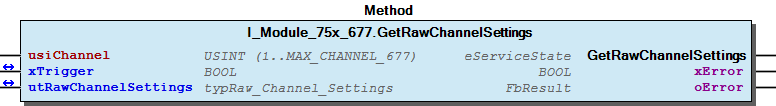
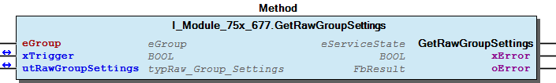
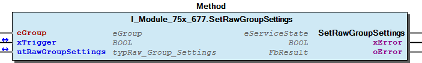
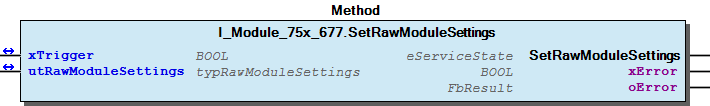
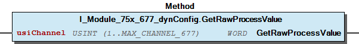
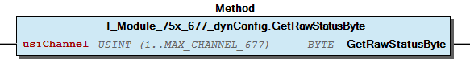
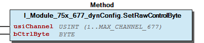
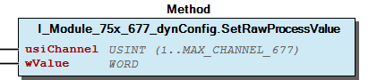

# WagoTypesModule_75x_677 v1.0.0.0 (WAGO) - Complete Documentation


## 📋 Library Information

- **Company:** WAGO
- **Title:** WagoTypesModule_75x_677
- **Version:** 1.0.0.0
- **Categories:** WAGO Internal|Common|Types and Interfaces
- **Author:** WAGO
- **Placeholder:** WagoTypesModule_75x_677

### Description ¶


This document is automatically generated. Because of this, the chapter 30 Visualization is not shown in this document. If you are interested in getting to know more about visualization, we refer to the library manager of e!Cockpit.

Handling modules 75x-677 [1]

This document is automatically generated. Because of this, the chapter 30 Visualization is not shown in this document. If you are interested in getting to know more about visualization, we refer to the library manager of e!Cockpit. Handling modules 75x-677 [1]

### Contents: ¶


Contents: - Documentation Index - Project Information - Library Information - Methods I_Module_75x_677.GetRawChannelSettings (METH) - I_Module_75x_677.GetRawGroupSettings (METH) - I_Module_75x_677.GetRawModuleSettings (METH) - I_Module_75x_677.SetRawChannelSettings (METH) - I_Module_75x_677.SetRawGroupSettings (METH) - I_Module_75x_677.SetRawModuleSettings (METH) - I_Module_75x_677_dynConfig.GetRawProcessValue (METH) - I_Module_75x_677_dynConfig.GetRawStatusByte (METH) - I_Module_75x_677_dynConfig.SetRawControlByte (METH) - I_Module_75x_677_dynConfig.SetRawProcessValue (METH) - ... and 3 more Interfaces - I_Module_75x_677 (ITF) - I_Module_75x_677_dynConfig (ITF) Program Organization Global Variable Lists - Channels_677 (GVL) - VersionHistory (GVL) Other Components - 10 Enumeration - 15 Datatypes - Channel - Group - Groups and Channels - Module - eGroup (ENUM) - eOperatingMode (ENUM)

### Indices and tables ¶


| [1] | Based on WagoTypesModule_75x_677.library, last modified 10.11.2021, 13:45:50. LibDoc 3.5.15.30 |

© WAGO Kontakttechnik GmbH & Co. KG, Germany 2018 – All rights reserved. For the avoidance of doubt, this copyright notice does not only apply to the information above but also and primarily to the described library itself. Please note that third-party products are always mentioned without reference to intellectual property rights, including patents, utility models, designs and trademarks, accordingly the existence of such rights cannot be excluded. WAGO is a registered trademark of WAGO Verwaltungsgesellschaft mbH.

- File and Project Information - Library Reference © WAGO Kontakttechnik GmbH & Co. KG, Germany 2018 – All rights reserved. For the avoidance of doubt, this copyright notice does not only apply to the information above but also and primarily to the described library itself. Please note that third-party products are always mentioned without reference to intellectual property rights, including patents, utility models, designs and trademarks, accordingly the existence of such rights cannot be excluded. WAGO is a registered trademark of WAGO Verwaltungsgesellschaft mbH.

### Documentation Index


## WagoTypesModule_75x_677 Library Documentation


| Company: | WAGO |
| Title: | WagoTypesModule_75x_677 |
| Version: | 1.0.0.0 |
| Categories: | WAGO Internal\|Common\|Types and Interfaces |
| Author: | WAGO |
| Placeholder: | WagoTypesModule_75x_677 |

### Description


This document is automatically generated. Because of this, the chapter 30 Visualization is not shown in this document. If you are interested in getting to know more about visualization, we refer to the library manager of e!Cockpit.

Handling modules 75x-677 [1]

This document is automatically generated. Because of this, the chapter 30 Visualization is not shown in this document. If you are interested in getting to know more about visualization, we refer to the library manager of e!Cockpit. Handling modules 75x-677 [1]

### Contents:


- 20 Program Organization Units 10 Enumeration - 15 Datatypes - Channels_677 (GVL) - I_Module_75x_677 (ITF) - I_Module_75x_677_dynConfig (ITF) VersionHistory (GVL)

### Indices and tables


| [1] | Based on WagoTypesModule_75x_677.library, last modified 10.11.2021, 13:45:50. LibDoc 3.5.15.30 |

© WAGO Kontakttechnik GmbH & Co. KG, Germany 2018 – All rights reserved. For the avoidance of doubt, this copyright notice does not only apply to the information above but also and primarily to the described library itself. Please note that third-party products are always mentioned without reference to intellectual property rights, including patents, utility models, designs and trademarks, accordingly the existence of such rights cannot be excluded. WAGO is a registered trademark of WAGO Verwaltungsgesellschaft mbH.

- File and Project Information - Library Reference © WAGO Kontakttechnik GmbH & Co. KG, Germany 2018 – All rights reserved. For the avoidance of doubt, this copyright notice does not only apply to the information above but also and primarily to the described library itself. Please note that third-party products are always mentioned without reference to intellectual property rights, including patents, utility models, designs and trademarks, accordingly the existence of such rights cannot be excluded. WAGO is a registered trademark of WAGO Verwaltungsgesellschaft mbH.

### Project Information


## File and Project Information


| Scope | Name | Type | Content |
| --- | --- | --- | --- |
| FileHeader | libraryFile | string | WagoTypesModule_75x_677.library |
| contentFile | WagoTypesModule_75x_677_clr.json |
| productName | e!COCKPIT |
| creationDateTime | date | 10.11.2021, 13:45:53 |
| companyName | string | WAGO |
| ProjectInformation | LastModificationDateTime | date | 10.11.2021, 13:45:50 |
| Description | string | See: Description |
| Copyright | © WAGO Kontakttechnik GmbH & Co. KG, Germany 2018 – All rights reserved. |
| Author | WAGO |
| AutoResolveUnbound | bool | True |
| Placeholder | string | WagoTypesModule_75x_677 |
| Company | WAGO |
| DocFormat | reStructuredText |
| Project | WagoTypesModule_75x_677 |
| Version | version | 1.0.0.0 |
| Version string | string |  |
| Title | WagoTypesModule_75x_677 |
| LibraryCategories | library-category-list | WAGO Internal\|Common\|Types and Interfaces |
| CompiledLibraryCompatibilityVersion | string | CODESYS V3.5 SP16 Patch 3 |

### Library Information


## Library Reference


This is a dictionary of all referenced libraries and their name spaces.

This is a dictionary of all referenced libraries and their name spaces.

### WagoSysErrorBase


#### Library Identification


Placeholder: WagoSysErrorBase Default Resolution: WagoSysErrorBase, * (WAGO) Namespace: WagoSysErrorBase

#### Library Properties


| LinkAllContent: False QualifiedOnly: False | Key: WagoSysErrorBase SystemLibrary: False | Optional: False |

### WagoSysVersion


#### Library Identification


Name: WagoSysVersion Version: 1.0.0.0 Company: WAGO Namespace: WagoSysVersion

#### Library Properties


| LinkAllContent: False QualifiedOnly: True | Key: WagoSysVersion, 1.0.0.0 (WAGO) SystemLibrary: False | Optional: False |

### WagoTypesModuleBase


#### Library Identification


Placeholder: WagoTypesModuleBase Default Resolution: WagoTypesModuleBase, * (WAGO) Namespace: WagoTypesModuleBase

#### Library Properties


| LinkAllContent: False QualifiedOnly: True | Key: WagoTypesModuleBase SystemLibrary: False | Optional: False |

#### Library Parameter


Parameter: MAX_MODULE_OUTPUT_SIZE = 48 Parameter: MAX_MODULE_INPUT_SIZE = 48 Parameter: MBX_PIPE_SIZE = 1024 Parameter: MAX_MBX_SIZE = 18 Parameter: MAX_MBX1_SIZE = 18 Parameter: MAX_MBX_OUTPUT_SIZE = 47 Parameter: MAX_MBX_INPUT_SIZE = 47

### Methods


## I_Module_75x_677.GetRawChannelSettings (METH)


| Scope | Name | Type |
| --- | --- | --- |
| Return | GetRawChannelSettings | WagoTypesModuleBase.eServiceState |
| Input | usiChannel | USINT (1..MAX_CHANNEL_677) |
| Inout | xTrigger | BOOL |
| utRawChannelSettings | typRaw_Channel_Settings |
| Output | xError | BOOL |
| oError | WagoSysErrorBase.FbResult |

| Struct member | Value | Description |
| --- | --- | --- |
| eOperatingMode | PWM_DC | variable duty cycle -> frequency adjustable |
| PWM_FRQ | variable frequency -> duty cycle adjustable |
| PWM_FRQ_CNT | variable frequency -> duty cycle adjustable / counter |
| PULSE_FRQ_CNT | variable frequency -> pulse width adjustable / counter |
| PWM_PULSE_DIR | variable number of pulses -> frequency and duty cycle adjustable / counter |
| uiFrequency | UINT | PWM Frequency 1..20000 [Hz] |
| uiDutyCycle | UINT | Duty cycle 0..2048 -> * (100 / 2048) [%] |
| udiPulseDuration | UDINT | Pulse duration 1..1000000 [µs] |
| xLoadToPlus | FALSE | Load between output and Uout- |
| TRUE | Load between output and Uout+ |

| Return Value | Description |
| --- | --- |
| WagoTypesModuleBase.eServiceState.DONE | successful |
| WagoTypesModuleBase.eServiceState.ABORT | error -> see oError |
| WagoTypesModuleBase.eServiceState.NO_DATA | call while xTrigger is reset |

```
VAR
    //--- Module Mode Settings ------------------------------
    utRawChannelSettings    :   WagoTypesModule_75x_677.typRaw_Channel_Settings;
    xGetRawChannelSettings  :   BOOL;  // triggers the function
    oError                  :   WagoSysErrorBase.FbResult;
END_VAR

//--- G R O U P    S E T T I N G S -----------------------
CASE my677.GetRawChannelSettings(   usiChannel           := 1,
                                    xTrigger             := xGetRawChannelSettings,
                                    utRawChannelSettings := utRawChannelSettings,
                                    oError               => oError
                                ) OF

    WagoTypesModuleBase.eServiceState.DONE : // OK
            ;// process here your utRawChannelSettings

    WagoTypesModuleBase.eServiceState.ABORT : // Error
            ;// process here your error handling -> see oError for more information

END_CASE
```

WagoTypesModule_75x_677.typRaw_Channel_Settings

Return Values

It is not allowed to reset the xTrigger by the application. This must done by the method.

Graphical Illustration

Graphical Interface of I_Module_75x_677.GetRawChannelSettings

For get the channel settings from the module.

You have to call the method cyclic until the method returns with DONE or ABORT.

Interface variables Function Get the raw channel settings of the module at a struct. WagoTypesModule_75x_677.typRaw_Channel_Settings Return Values Warning It is not allowed to reset the xTrigger by the application. This must done by the method. Graphical Illustration  Graphical Interface of I_Module_75x_677.GetRawChannelSettings Example For get the channel settings from the module. Note You have to call the method cyclic until the method returns with DONE or ABORT.

## I_Module_75x_677.GetRawGroupSettings (METH)


| Scope | Name | Type |
| --- | --- | --- |
| Return | GetRawGroupSettings | WagoTypesModuleBase.eServiceState |
| Input | eGroup | eGroup |
| Inout | xTrigger | BOOL |
| utRawGroupSettings | typRaw_Group_Settings |
| Output | xError | BOOL |
| oError | WagoSysErrorBase.FbResult |

| Struct member | Value | Description |
| --- | --- | --- |
| xBridgeMode | FALSE | Bridge Mode Channel_A and Channel_B Off |
| TRUE | Bridge Mode Channel_A and Channel_B On |
|  |  |  |
| utChannel_A | Member | Value | Description |
| eOperatingMode | PWM_DC | variable duty cycle -> frequency adjustable |
| PWM_FRQ | variable frequency -> duty cycle adjustable |
| PWM_FRQ_CNT | variable frequency -> duty cycle adjustable / counter |
| PULSE_FRQ_CNT | variable frequency -> pulse width adjustable / counter |
| PWM_PULSE_DIR | variable number of pulses -> frequency and duty cycle adjustable / counter |
| uiFrequency | UINT | PWM Frequency 1..20000 [Hz] |
| uiDutyCycle | UINT | Duty cycle 0..2048 -> * (100 / 2048) [%] |
| udiPulseDuration | UDINT | Pulse duration 1..1000000 [µs] |
| xLoadToPlus | FALSE | Load between output and Uout- |
| TRUE | Load between output and Uout+ |
|  |  |  |  |
| utChannel_B | Member | Value | Description |
| eOperatingMode | PWM_DC | variable duty cycle -> frequency adjustable |
| PWM_FRQ | variable frequency -> duty cycle adjustable |
| uiFrequency | UINT | PWM Frequency 1..20000 [Hz] |
| uiDutyCycle | UINT | Duty cycle 0..2048 -> * (100 / 2048) [%] |
| udiPulseDuration | UDINT | not used |
| xLoadToPlus | FALSE | Load between output and Uout- |
| TRUE | Load between output and Uout+ |

| Return Value | Description |
| --- | --- |
| WagoTypesModuleBase.eServiceState.DONE | successful |
| WagoTypesModuleBase.eServiceState.ABORT | error -> see oError |
| WagoTypesModuleBase.eServiceState.NO_DATA | call while xTrigger is reset |

```
VAR
    //--- Group Settings ------------------------------
    utRawGroupSettings      :   WagoTypesModule_75x_677.typRaw_Group_Settings;
    xGetRawGroupSettings    :   BOOL;  // triggers the function
    oError                  :   WagoSysErrorBase.FbResult;
END_VAR

//--- M O D U L E    S E T T I N G S -----------------------
CASE my677.GetRawGroupSettings( eGroup              := WagoTypesModule_75x_677.eGroup.GROUP_12,
                                xTrigger            := xGetRawGroupSettings,
                                utRawGroupSettings  := utRawGroupSettings,
                                oError              => oError
                              ) OF

    WagoTypesModuleBase.eServiceState.DONE : // OK
            ;// process here your utRawGroupSettings

    WagoTypesModuleBase.eServiceState.ABORT : // Error
            ;// process here your error handling -> see oError for more information

END_CASE
```

WagoTypesModule_75x_677.typRaw_Group_Settings

Return Values

It is not allowed to reset the xTrigger by the application. This must done by the method.

Graphical Illustration

Graphical Interface of I_Module_75x_677.GetRawGroupSettings

For get the group settings from the module.

You have to call the method cyclic until the method returns with DONE or ABORT.

Interface variables Function Get the raw settings of a group at struct. WagoTypesModule_75x_677.typRaw_Group_Settings Return Values Warning It is not allowed to reset the xTrigger by the application. This must done by the method. Graphical Illustration  Graphical Interface of I_Module_75x_677.GetRawGroupSettings Example For get the group settings from the module. Note You have to call the method cyclic until the method returns with DONE or ABORT.

## I_Module_75x_677.GetRawModuleSettings (METH)


| Scope | Name | Type |
| --- | --- | --- |
| Return | GetRawModuleSettings | WagoTypesModuleBase.eServiceState |
| Inout | xTrigger | BOOL |
| utRawModuleSettings | typRawModuleSettings |
| Output | xError | BOOL |
| oError | WagoSysErrorBase.FbResult |

| Member | Value | Description |
| --- | --- | --- |
| xWatchdogTimer | FALSE | Deactivates Watchdog |
| TRUE | Activates Watchdog |
|  |  |  |
| utGroup_12 | Member | Value | Description |
| xBridgeMode | FALSE | Bridge Mode Channel_A and Channel_B Off |
| TRUE | Bridge Mode Channel_A and Channel_B On |
|  |  |  |
| utChannel_A | Member | Value | Description |
| eOperatingMode | PWM_DC | variable duty cycle -> frequency adjustable |
| PWM_FRQ | variable frequency -> duty cycle adjustable |
| PWM_FRQ_CNT | variable frequency -> duty cycle adjustable / counter |
| PULSE_FRQ_CNT | variable frequency -> pulse width adjustable / counter |
| PWM_PULSE_DIR | variable number of pulses -> frequency and duty cycle adjustable / counter |
| uiFrequency | UINT | PWM Frequency 1..20000 [Hz] |
| uiDutyCycle | UINT | Duty cycle 0..2048 -> * (100 / 2048) [%] |
| udiPulseDuration | UDINT | Pulse duration 1..1000000 [µs] |
| xLoadToPlus | FALSE | Load between output and Uout- |
| TRUE | Load between output and Uout+ |
|  |  |  |  |
| utChannel_B | Member | Value | Description |
| eOperatingMode | PWM_DC | variable duty cycle -> frequency adjustable |
| PWM_FRQ | variable frequency -> duty cycle adjustable |
| uiFrequency | UINT | PWM Frequency 1..20000 [Hz] |
| uiDutyCycle | UINT | Duty cycle 0..2048 -> * (100 / 2048) [%] |
| udiPulseDuration | UDINT | not used |
| xLoadToPlus | FALSE | Load between output and Uout- |
| TRUE | Load between output and Uout+ |
|  |  |  |  |
| utGroup_34 | Member | Value | Description |
| xBridgeMode | FALSE | Bridge Mode Channel_A and Channel_B Off |
| TRUE | Bridge Mode Channel_A and Channel_B On |
|  |  |  |
| utChannel_A | Member | Value | Description |
| eOperatingMode | PWM_DC | variable duty cycle -> frequency adjustable |
| PWM_FRQ | variable frequency -> duty cycle adjustable |
| PWM_FRQ_CNT | variable frequency -> duty cycle adjustable / counter |
| PULSE_FRQ_CNT | variable frequency -> pulse width adjustable / counter |
| PWM_PULSE_DIR | variable number of pulses -> frequency and duty cycle adjustable / counter |
| uiFrequency | UINT | PWM Frequency 1..20000 [Hz] |
| uiDutyCycle | UINT | Duty cycle 0..2048 -> * (100 / 2048) [%] |
| udiPulseDuration | UDINT | Pulse duration 1..1000000 [µs] |
| xLoadToPlus | FALSE | Load between output and Uout- |
| TRUE | Load between output and Uout+ |
|  |  |  |  |
| utChannel_B | Member | Value | Description |
| eOperatingMode | PWM_DC | variable duty cycle -> frequency adjustable |
| PWM_FRQ | variable frequency -> duty cycle adjustable |
| uiFrequency | UINT | PWM Frequency 1..20000 [Hz] |
| uiDutyCycle | UINT | Duty cycle 0..2048 -> * (100 / 2048) [%] |
| udiPulseDuration | UDINT | not used |
| xLoadToPlus | FALSE | Load between output and Uout- |
| TRUE | Load between output and Uout+ |

| Return Value | Description |
| --- | --- |
| WagoTypesModuleBase.eServiceState.DONE | successful |
| WagoTypesModuleBase.eServiceState.ABORT | error -> see oError |
| WagoTypesModuleBase.eServiceState.NO_DATA | call while xTrigger is reset |

```
VAR
    //--- Module Mode Settings ------------------------------
    utRawModuleSettings     :   WagoTypesModule_75x_677.typRawModuleSettings;
    xGetRawModuleSettings   :   BOOL;  // triggers the function
    oError                  :   WagoSysErrorBase.FbResult;
END_VAR

//--- M O D U L E    S E T T I N G S -----------------------
CASE my677.GetRawModuleSettings(xGetRawModuleSettings, utRawModuleSettings, oError => oError) OF

    WagoTypesModuleBase.eServiceState.DONE : // OK
            ;// process here your utRawModuleSettings

    WagoTypesModuleBase.eServiceState.ABORT : // Error
            ;// process here your error handling -> see oError for more information

END_CASE
```

WagoTypesModule_75x_677.typRawModuleSettings

Return Values

It is not allowed to reset the xTrigger by the application. This must done by the method.

Graphical Illustration

Graphical Interface of I_Module_75x_677.GetRawModuleSettings

For get the settings from the module.

You have to call the method cyclic until the method returns with DONE or ABORT.

Interface variables Function Get the raw settings of the module at a struct. WagoTypesModule_75x_677.typRawModuleSettings Return Values Warning It is not allowed to reset the xTrigger by the application. This must done by the method. Graphical Illustration  Graphical Interface of I_Module_75x_677.GetRawModuleSettings Example For get the settings from the module. Note You have to call the method cyclic until the method returns with DONE or ABORT.

## I_Module_75x_677.SetRawChannelSettings (METH)


| Scope | Name | Type |
| --- | --- | --- |
| Return | SetRawChannelSettings | WagoTypesModuleBase.eServiceState |
| Input | usiChannel | USINT (1..MAX_CHANNEL_677) |
| Inout | xTrigger | BOOL |
| utRawChannelSettings | typRaw_Channel_Settings |
| Output | xError | BOOL |
| oError | WagoSysErrorBase.FbResult |

| Struct member | Value | Description |
| --- | --- | --- |
| eOperatingMode | PWM_DC | variable duty cycle -> frequency adjustable |
| PWM_FRQ | variable frequency -> duty cycle adjustable |
| PWM_FRQ_CNT | variable frequency -> duty cycle adjustable / counter |
| PULSE_FRQ_CNT | variable frequency -> pulse width adjustable / counter |
| PWM_PULSE_DIR | variable number of pulses -> frequency and duty cycle adjustable / counter |
| uiFrequency | UINT | PWM Frequency 1..20000 [Hz] |
| uiDutyCycle | UINT | Duty cycle 0..2048 -> * (100 / 2048) [%] |
| udiPulseDuration | UDINT | Pulse duration 1..1000000 [µs] |
| xLoadToPlus | FALSE | Load between output and Uout- |
| TRUE | Load between output and Uout+ |

| Return Value | Description |
| --- | --- |
| WagoTypesModuleBase.eServiceState.DONE | successful |
| WagoTypesModuleBase.eServiceState.ABORT | error -> see oError |
| WagoTypesModuleBase.eServiceState.NO_DATA | call while xTrigger is reset |

```
VAR
    //--- Module Mode Settings ------------------------------
    utRawChannelSettings    :   WagoTypesModule_75x_677.typRaw_Channel_Settings;
    xSetRawChannelSettings  :   BOOL;  // triggers the function
    oError                  :   WagoSysErrorBase.FbResult;
END_VAR

//--- G R O U P    S E T T I N G S -----------------------
CASE my677.SetRawChannelSettings(   usiChannel           := 1,
                                    xTrigger             := xSetRawChannelSettings,
                                    utRawChannelSettings := utRawChannelSettings,
                                    oError               => oError
                                ) OF

    WagoTypesModuleBase.eServiceState.DONE : // OK
            ;// Done

    WagoTypesModuleBase.eServiceState.ABORT : // Error
            ;// process here your error handling -> see oError for more information

END_CASE
```

WagoTypesModule_75x_677.typRaw_Channel_Settings

Return Values

It is not allowed to reset the xTrigger by the application. This must done by the method.

Graphical Illustration

Graphical Interface of I_Module_75x_677.SetRawChannelSettings

For get the channel settings from the module.

You have to call the method cyclic until the method returns with DONE or ABORT.

Interface variables Function Get the raw channel settings of the module at a struct. WagoTypesModule_75x_677.typRaw_Channel_Settings Return Values Warning It is not allowed to reset the xTrigger by the application. This must done by the method. Graphical Illustration  Graphical Interface of I_Module_75x_677.SetRawChannelSettings Example For get the channel settings from the module. Note You have to call the method cyclic until the method returns with DONE or ABORT.

## I_Module_75x_677.SetRawGroupSettings (METH)


| Scope | Name | Type |
| --- | --- | --- |
| Return | SetRawGroupSettings | WagoTypesModuleBase.eServiceState |
| Input | eGroup | eGroup |
| Inout | xTrigger | BOOL |
| utRawGroupSettings | typRaw_Group_Settings |
| Output | xError | BOOL |
| oError | WagoSysErrorBase.FbResult |

| Struct member | Value | Description |
| --- | --- | --- |
| xBridgeMode | FALSE | Bridge Mode Channel_A and Channel_B Off |
| TRUE | Bridge Mode Channel_A and Channel_B On |
|  |  |  |
| utChannel_A | Member | Value | Description |
| eOperatingMode | PWM_DC | variable duty cycle -> frequency adjustable |
| PWM_FRQ | variable frequency -> duty cycle adjustable |
| PWM_FRQ_CNT | variable frequency -> duty cycle adjustable / counter |
| PULSE_FRQ_CNT | variable frequency -> pulse width adjustable / counter |
| PWM_PULSE_DIR | variable number of pulses -> frequency and duty cycle adjustable / counter |
| uiFrequency | UINT | PWM Frequency 1..20000 [Hz] |
| uiDutyCycle | UINT | Duty cycle 0..2048 -> * (100 / 2048) [%] |
| udiPulseDuration | UDINT | Pulse duration 1..1000000 [µs] |
| xLoadToPlus | FALSE | Load between output and Uout- |
| TRUE | Load between output and Uout+ |
|  |  |  |  |
| utChannel_B | Member | Value | Description |
| eOperatingMode | PWM_DC | variable duty cycle -> frequency adjustable |
| PWM_FRQ | variable frequency -> duty cycle adjustable |
| uiFrequency | UINT | PWM Frequency 1..20000 [Hz] |
| uiDutyCycle | UINT | Duty cycle 0..2048 -> * (100 / 2048) [%] |
| udiPulseDuration | UDINT | not used |
| xLoadToPlus | FALSE | Load between output and Uout- |
| TRUE | Load between output and Uout+ |

| Return Value | Description |
| --- | --- |
| WagoTypesModuleBase.eServiceState.DONE | successful |
| WagoTypesModuleBase.eServiceState.ABORT | error -> see oError |
| WagoTypesModuleBase.eServiceState.NO_DATA | call while xTrigger is reset |

```
VAR
    //--- Group Settings ------------------------------
    utRawGroupSettings      :   WagoTypesModule_75x_677.typRaw_Group_Settings;
    xSetRawGroupSettings    :   BOOL;  // triggers the function
    oError                  :   WagoSysErrorBase.FbResult;
END_VAR

//--- G R O U P    S E T T I N G S -----------------------
CASE my677.SetRawGroupSettings( eGroup              := WagoTypesModule_75x_677.eGroup.GROUP_12,
                                xTrigger            := xSetRawGroupSettings,
                                utRawGroupSettings  := utRawGroupSettings,
                                oError              => oError
                              ) OF

    WagoTypesModuleBase.eServiceState.DONE : // OK
            ;// Done

    WagoTypesModuleBase.eServiceState.ABORT : // Error
            ;// process here your error handling -> see oError for more information

END_CASE
```

WagoTypesModule_75x_677.typRaw_Group_Settings

Return Values

It is not allowed to reset the xTrigger by the application. This must done by the method.

Graphical Illustration

Graphical Interface of I_Module_75x_677.SetRawGroupSettings

For set the group settings at the module.

You have to call the method cyclic until the method returns with DONE or ABORT.

Interface variables Function Get the raw settings of a group at struct. WagoTypesModule_75x_677.typRaw_Group_Settings Return Values Warning It is not allowed to reset the xTrigger by the application. This must done by the method. Graphical Illustration  Graphical Interface of I_Module_75x_677.SetRawGroupSettings Example For set the group settings at the module. Note You have to call the method cyclic until the method returns with DONE or ABORT.

## I_Module_75x_677.SetRawModuleSettings (METH)


| Scope | Name | Type |
| --- | --- | --- |
| Return | SetRawModuleSettings | WagoTypesModuleBase.eServiceState |
| Inout | xTrigger | BOOL |
| utRawModuleSettings | typRawModuleSettings |
| Output | xError | BOOL |
| oError | WagoSysErrorBase.FbResult |

| Member | Value | Description |
| --- | --- | --- |
| xWatchdogTimer | FALSE | Deactivates Watchdog |
| TRUE | Activates Watchdog |
|  |  |  |
| utGroup_12 | Member | Value | Description |
| xBridgeMode | FALSE | Bridge Mode Channel_A and Channel_B Off |
| TRUE | Bridge Mode Channel_A and Channel_B On |
|  |  |  |
| utChannel_A | Member | Value | Description |
| eOperatingMode | PWM_DC | variable duty cycle -> frequency adjustable |
| PWM_FRQ | variable frequency -> duty cycle adjustable |
| PWM_FRQ_CNT | variable frequency -> duty cycle adjustable / counter |
| PULSE_FRQ_CNT | variable frequency -> pulse width adjustable / counter |
| PWM_PULSE_DIR | variable number of pulses -> frequency and duty cycle adjustable / counter |
| uiFrequency | UINT | PWM Frequency 1..20000 [Hz] |
| uiDutyCycle | UINT | Duty cycle 0..2048 -> * (100 / 2048) [%] |
| udiPulseDuration | UDINT | Pulse duration 1..1000000 [µs] |
| xLoadToPlus | FALSE | Load between output and Uout- |
| TRUE | Load between output and Uout+ |
|  |  |  |  |
| utChannel_B | Member | Value | Description |
| eOperatingMode | PWM_DC | variable duty cycle -> frequency adjustable |
| PWM_FRQ | variable frequency -> duty cycle adjustable |
| uiFrequency | UINT | PWM Frequency 1..20000 [Hz] |
| uiDutyCycle | UINT | Duty cycle 0..2048 -> * (100 / 2048) [%] |
| udiPulseDuration | UDINT | not used |
| xLoadToPlus | FALSE | Load between output and Uout- |
| TRUE | Load between output and Uout+ |
|  |  |  |  |
| utGroup_34 | Member | Value | Description |
| xBridgeMode | FALSE | Bridge Mode Channel_A and Channel_B Off |
| TRUE | Bridge Mode Channel_A and Channel_B On |
|  |  |  |
| utChannel_A | Member | Value | Description |
| eOperatingMode | PWM_DC | variable duty cycle -> frequency adjustable |
| PWM_FRQ | variable frequency -> duty cycle adjustable |
| PWM_FRQ_CNT | variable frequency -> duty cycle adjustable / counter |
| PULSE_FRQ_CNT | variable frequency -> pulse width adjustable / counter |
| PWM_PULSE_DIR | variable number of pulses -> frequency and duty cycle adjustable / counter |
| uiFrequency | UINT | PWM Frequency 1..20000 [Hz] |
| uiDutyCycle | UINT | Duty cycle 0..2048 -> * (100 / 2048) [%] |
| udiPulseDuration | UDINT | Pulse duration 1..1000000 [µs] |
| xLoadToPlus | FALSE | Load between output and Uout- |
| TRUE | Load between output and Uout+ |
|  |  |  |  |
| utChannel_B | Member | Value | Description |
| eOperatingMode | PWM_DC | variable duty cycle -> frequency adjustable |
| PWM_FRQ | variable frequency -> duty cycle adjustable |
| uiFrequency | UINT | PWM Frequency 1..20000 [Hz] |
| uiDutyCycle | UINT | Duty cycle 0..2048 -> * (100 / 2048) [%] |
| udiPulseDuration | UDINT | not used |
| xLoadToPlus | FALSE | Load between output and Uout- |
| TRUE | Load between output and Uout+ |

| Return Value | Description |
| --- | --- |
| WagoTypesModuleBase.eServiceState.DONE | successful |
| WagoTypesModuleBase.eServiceState.ABORT | error -> see oError |
| WagoTypesModuleBase.eServiceState.NO_DATA | call while xTrigger is reset |

```
VAR
    //--- Module Mode Settings ------------------------------
    xStartProcess       :   BOOL; // set this variable once to start the process -> this varibale will be automatic reset
    utRawModuleSettings :   WagoTypesModule_75x_677.typRawModuleSettings;
    oError              :   WagoSysErrorBase.FbResult;
    xSetModuleSettings  :   BOOL;  // triggers the function
END_VAR

//--- READ BEFORE WRITE --------------------------------------------------------------
CASE my677.GetRawModuleSettings(xStartProcess, utRawModuleSettings, oError => oError) OF

    eServiceState.DONE : // OK -> actual configuration is successful read
        // change here your configuration
        // utRawModuleSettings... :=
        xSetModuleSettings := TRUE; // trigger write

    eServiceState.ABORT : // Error -> not able to read -> see oError
            ;// process here your error handling for read -> see oError for more information

END_CASE

//--- S E T   M O D U L E    S E T T I N G S ---------------
CASE my677.SetRawModuleSettings(xSetModuleSettings, utRawModuleSettings, oError => oError) OF

    WagoTypesModuleBase.eServiceState.DONE : // OK

    WagoTypesModuleBase.eServiceState.ABORT : // Error
            ;// process here your error handling -> see oError for more information

END_CASE
```

WagoTypesModule_75x_677.typRawModuleSettings

Return Values

It is not allowed to reset the xTrigger by the application. This must done by the method.

Graphical Illustration

Graphical Interface of I_Module_75x_677.SetRawModuleSettings

For set the raw settings from the module.

You have to call the method cyclic until the method returns with DONE or ABORT.

Interface variables Function Set the raw settings of the module from a struct. WagoTypesModule_75x_677.typRawModuleSettings Return Values Warning It is not allowed to reset the xTrigger by the application. This must done by the method. Graphical Illustration  Graphical Interface of I_Module_75x_677.SetRawModuleSettings Example For set the raw settings from the module. Note You have to call the method cyclic until the method returns with DONE or ABORT.

## I_Module_75x_677_dynConfig.GetRawProcessValue (METH)


| Scope | Name | Type |
| --- | --- | --- |
| Return | GetRawProcessValue | WORD |
| Input | usiChannel | USINT (1..MAX_CHANNEL_677) |

```
VAR
    mywProcessValue :   WORD;
END_VAR

mywProcessValue := my677.GetProcessValue(1); // here is the process raw value as WORD
```

Get the raw process value of the wanted channel.

In case of error (e.g. an invalid channel number is given) it returns -32768.

Graphical Illustration

Graphical Interface of I_Module_75x_677_dynConfig.GetRawProcessValue

For get the process value from first channel of the module.

Interface variables Function Get the raw process value of the wanted channel. In case of error (e.g. an invalid channel number is given) it returns -32768. Graphical Illustration  Graphical Interface of I_Module_75x_677_dynConfig.GetRawProcessValue Example For get the process value from first channel of the module.

## I_Module_75x_677_dynConfig.GetRawStatusByte (METH)


| Scope | Name | Type |
| --- | --- | --- |
| Return | GetRawStatusByte | BYTE |
| Input | usiChannel | USINT (1..MAX_CHANNEL_677) |

| Bit No. | Operation Mode |
| --- | --- |
|  |  |  |  |
| --- | --- | --- | --- |
|  | PWM_DC PWM_FRQ | PWM_FRQ_CNT PULSE_FRQ_CNT | PWM_PULSE_DIR |
| --- | --- | --- | --- |
|  |  |  |  |
| Bit 0 | Driver DO1 & DO2 activated | Driver DO1 & DO2 activated | Driver DO1 & DO2 activated |
| Bit 1 |  | PWM active | PWM active |
| Bit 2 |  |  | PWM started |
| Bit 3 |  | actual state DO2 | actual state DO2 |
| Bit 4 | short circuit DO1 or DO2 | short circuit DO1 or DO2 | short circuit DO1 or DO2 |
| Bit 5 | undervoltage | undervoltage | undervoltage |
| Bit 6 | common error bit | common error bit | common error bit |
| Bit 7 | Register Communication (internal use only) |

| Bit No. | Operation Mode |
| --- | --- |
|  | PWM_DC PWM_FRQ | PWM_FRQ_CNT PULSE_FRQ_CNT | PWM_PULSE_DIR |
| --- | --- | --- | --- |
|  |  |  |  |
| Bit 0 | Driver DO3 & DO4 activated | Driver DO3 & DO4 activated | Driver DO3 & DO4 activated |
| Bit 1 |  | PWM active | PWM active |
| Bit 2 |  |  | PWM started |
| Bit 3 |  | actual state DO4 | actual state DO4 |
| Bit 4 | short circuit DO3 or DO4 | short circuit DO3 or DO4 | short circuit DO3 or DO4 |
| Bit 5 | undervoltage | undervoltage | undervoltage |
| Bit 6 | common error bit | common error bit | common error bit |
| Bit 7 | Register Communication (internal use only) |

```
VAR
    mybStatusByte   :   BYTE;
END_VAR

mybStatusByte := my677.GetRawStatusByte(1); // here is the raw status byte
```

Get the raw status byte of the wanted channel.

In case of error (e.g. an invalid channel number is given) it returns 16#FF.

Statusbyte Channel 1

Statusbyte Channel 2

Statusbyte Channel 3

Statusbyte Channel 4

Graphical Illustration

Graphical Interface of I_Module_75x_677_dynConfig.GetRawStatusByte

For get the status byte from first channel of the module.

Interface variables Function Get the raw status byte of the wanted channel. In case of error (e.g. an invalid channel number is given) it returns 16#FF. Statusbyte Channel 1 Statusbyte Channel 2 Unused -> always 0 Statusbyte Channel 3 Statusbyte Channel 4 Unused -> always 0 Graphical Illustration  Graphical Interface of I_Module_75x_677_dynConfig.GetRawStatusByte Example For get the status byte from first channel of the module.

## I_Module_75x_677_dynConfig.SetRawControlByte (METH)


| Scope | Name | Type |
| --- | --- | --- |
| Input | usiChannel | USINT (1..MAX_CHANNEL_677) |
| bCtrlByte | BYTE |

| Bit No. | Operation Mode |
| --- | --- |
|  |  |  |  |
| --- | --- | --- | --- |
|  | PWM_DC PWM_FRQ | PWM_FRQ_CNT PULSE_FRQ_CNT | PWM_PULSE_DIR |
| --- | --- | --- | --- |
|  |  |  |  |
| Bit 0 | activate Driver DO1 & DO2 | activate Driver DO1 & DO2 | activate Driver DO1 & DO2 |
| Bit 1 |  | start PWM | start PWM |
| Bit 2 |  | reset counter | load nominal value |
| Bit 3 |  |  | set DO2 |
| Bit 4 |  |  | reload nominal value |
| Bit 5 |  |  |  |
| Bit 6 |  |  |  |
| Bit 7 | Register Communication (internal use only) |

| Bit No. | Operation Mode |
| --- | --- |
|  |  |  |  |
| --- | --- | --- | --- |
|  | PWM_DC PWM_FRQ | PWM_FRQ_CNT PULSE_FRQ_CNT | PWM_PULSE_DIR |
| --- | --- | --- | --- |
|  |  |  |  |
| Bit 0 | activate Driver DO3 & DO4 | activate Driver DO3 & DO4 | activate Driver DO3 & DO4 |
| Bit 1 |  | start PWM | start PWM |
| Bit 2 |  | reset counter | load nominal value |
| Bit 3 |  |  | set DO4 |
| Bit 4 |  |  | reload nominal value |
| Bit 5 |  |  |  |
| Bit 6 |  |  |  |
| Bit 7 | Register Communication (internal use only) |

```
VAR
    mybCtrlByte :   BYTE;
END_VAR

my677.SetRawControlByte(    usiChannel := 1,
                            bCtrlByte  := mybCtrlByte
                        );
```

Controlbyte Channel 1

Controlbyte Channel 2

Controlbyte Channel 3

Controlbyte Channel 4

Graphical Illustration

Graphical Interface of I_Module_75x_677_dynConfig.SetRawControlByte

Interface variables Function Set the raw control byte for the selected channel Controlbyte Channel 1 Controlbyte Channel 2 Do not use it Controlbyte Channel 3 Controlbyte Channel 4 Do not use it Graphical Illustration  Graphical Interface of I_Module_75x_677_dynConfig.SetRawControlByte Example Set the raw control byte from first channel of the module.

## I_Module_75x_677_dynConfig.SetRawProcessValue (METH)


| Scope | Name | Type |
| --- | --- | --- |
| Input | usiChannel | USINT (1..MAX_CHANNEL_677) |
| wValue | WORD |

```
VAR
    myProcessValue  :   WORD;
END_VAR

my677.SetRawProcessValue(1,myProcessValue);
```

Graphical Illustration

Graphical Interface of I_Module_75x_677_dynConfig.SetRawProcessValue

Interface variables Function Set the raw process value for the selected channel Graphical Illustration  Graphical Interface of I_Module_75x_677_dynConfig.SetRawProcessValue Example Set the process value from first channel of the module.

## typRawModuleSettings (STRUCT)


| Name | Type |
| --- | --- |
| xWatchdogTimer | BOOL |
| utGroup_12 | typRaw_Group_Settings |
| utGroup_34 | typRaw_Group_Settings |

| Member | Value | Description |
| --- | --- | --- |
| xWatchdogTimer | FALSE | Deactivates Watchdog |
| TRUE | Activates Watchdog |
|  |  |  |
| utGroup_12 | Member | Value | Description |
| xBridgeMode | FALSE | Bridge Mode Channel_A and Channel_B Off |
| TRUE | Bridge Mode Channel_A and Channel_B On |
|  |  |  |
| utChannel_A | Member | Value | Description |
| eOperatingMode | PWM_DC | variable duty cycle -> frequency adjustable |
| PWM_FRQ | variable frequency -> duty cycle adjustable |
| PWM_FRQ_CNT | variable frequency -> duty cycle adjustable / counter |
| PULSE_FRQ_CNT | variable frequency -> pulse width adjustable / counter |
| PWM_PULSE_DIR | variable number of pulses -> frequency and duty cycle adjustable / counter |
| uiFrequency | UINT | PWM Frequency 1..20000 [Hz] |
| uiDutyCycle | UINT | Duty cycle 0..2048 -> * (100 / 2048) [%] |
| udiPulseDuration | UDINT | Pulse duration 1..1000000 [µs] |
| xLoadToPlus | FALSE | Load between output and Uout- |
| TRUE | Load between output and Uout+ |
|  |  |  |  |
| utChannel_B | Member | Value | Description |
| eOperatingMode | PWM_DC | variable duty cycle -> frequency adjustable |
| PWM_FRQ | variable frequency -> duty cycle adjustable |
| uiFrequency | UINT | PWM Frequency 1..20000 [Hz] |
| uiDutyCycle | UINT | Duty cycle 0..2048 -> * (100 / 2048) [%] |
| udiPulseDuration | UDINT | not used |
| xLoadToPlus | FALSE | Load between output and Uout- |
| TRUE | Load between output and Uout+ |
|  |  |  |  |
| utGroup_34 | Member | Value | Description |
| xBridgeMode | FALSE | Bridge Mode Channel_A and Channel_B Off |
| TRUE | Bridge Mode Channel_A and Channel_B On |
|  |  |  |
| utChannel_A | Member | Value | Description |
| eOperatingMode | PWM_DC | variable duty cycle -> frequency adjustable |
| PWM_FRQ | variable frequency -> duty cycle adjustable |
| PWM_FRQ_CNT | variable frequency -> duty cycle adjustable / counter |
| PULSE_FRQ_CNT | variable frequency -> pulse width adjustable / counter |
| PWM_PULSE_DIR | variable number of pulses -> frequency and duty cycle adjustable / counter |
| uiFrequency | UINT | PWM Frequency 1..20000 [Hz] |
| uiDutyCycle | UINT | Duty cycle 0..2048 -> * (100 / 2048) [%] |
| udiPulseDuration | UDINT | Pulse duration 1..1000000 [µs] |
| xLoadToPlus | FALSE | Load between output and Uout- |
| TRUE | Load between output and Uout+ |
|  |  |  |  |
| utChannel_B | Member | Value | Description |
| eOperatingMode | PWM_DC | variable duty cycle -> frequency adjustable |
| PWM_FRQ | variable frequency -> duty cycle adjustable |
| uiFrequency | UINT | PWM Frequency 1..20000 [Hz] |
| uiDutyCycle | UINT | Duty cycle 0..2048 -> * (100 / 2048) [%] |
| udiPulseDuration | UDINT | not used |
| xLoadToPlus | FALSE | Load between output and Uout- |
| TRUE | Load between output and Uout+ |

typRawModuleSettings

InOut: typRawModuleSettings

## typRaw_Channel_Settings (STRUCT)


| Name | Type | Comment |
| --- | --- | --- |
| eOperatingMode | eOperatingMode | R32.13 ... R32.15 |
| uiFrequency | UINT | 1..20000 [Hz] |
| uiDutyCycle | UINT | 0..2048 -> * (100 / 2048) [%] |
| udiPulseDuration | UDINT | 1..1000000 [µs] |
| xLoadToPlus | BOOL | TRUE -> Load between output and ‘+’ |

| Struct member | Value | Description |
| --- | --- | --- |
| eOperatingMode | PWM_DC | variable duty cycle -> frequency adjustable |
| PWM_FRQ | variable frequency -> duty cycle adjustable |
| PWM_FRQ_CNT | variable frequency -> duty cycle adjustable / counter |
| PULSE_FRQ_CNT | variable frequency -> pulse width adjustable / counter |
| PWM_PULSE_DIR | variable number of pulses -> frequency and duty cycle adjustable / counter |
| uiFrequency | UINT | PWM Frequency 1..20000 [Hz] |
| uiDutyCycle | UINT | Duty cycle 0..2048 -> * (100 / 2048) [%] |
| udiPulseDuration | UDINT | Pulse duration 1..1000000 [µs] |
| xLoadToPlus | FALSE | Load between output and Uout- |
| TRUE | Load between output and Uout+ |

typRaw_Channel_Settings

InOut: typRaw_Channel_Settings

## typRaw_Group_Settings (STRUCT)


| Name | Type |
| --- | --- |
| xBridgeMode | BOOL |
| utChannel_A | typRaw_Channel_Settings |
| utChannel_B | typRaw_Channel_Settings |

| Struct member | Value | Description |
| --- | --- | --- |
| xBridgeMode | FALSE | Bridge Mode Channel_A and Channel_B Off |
| TRUE | Bridge Mode Channel_A and Channel_B On |
|  |  |  |
| utChannel_A | Member | Value | Description |
| eOperatingMode | PWM_DC | variable duty cycle -> frequency adjustable |
| PWM_FRQ | variable frequency -> duty cycle adjustable |
| PWM_FRQ_CNT | variable frequency -> duty cycle adjustable / counter |
| PULSE_FRQ_CNT | variable frequency -> pulse width adjustable / counter |
| PWM_PULSE_DIR | variable number of pulses -> frequency and duty cycle adjustable / counter |
| uiFrequency | UINT | PWM Frequency 1..20000 [Hz] |
| uiDutyCycle | UINT | Duty cycle 0..2048 -> * (100 / 2048) [%] |
| udiPulseDuration | UDINT | Pulse duration 1..1000000 [µs] |
| xLoadToPlus | FALSE | Load between output and Uout- |
| TRUE | Load between output and Uout+ |
|  |  |  |  |
| utChannel_B | Member | Value | Description |
| eOperatingMode | PWM_DC | variable duty cycle -> frequency adjustable |
| PWM_FRQ | variable frequency -> duty cycle adjustable |
| uiFrequency | UINT | PWM Frequency 1..20000 [Hz] |
| uiDutyCycle | UINT | Duty cycle 0..2048 -> * (100 / 2048) [%] |
| udiPulseDuration | UDINT | not used |
| xLoadToPlus | FALSE | Load between output and Uout- |
| TRUE | Load between output and Uout+ |

typRaw_Group_Settings

InOut: typRaw_Group_Settings

### Interfaces


## I_Module_75x_677 (ITF)


- Module I_Module_75x_677.GetRawModuleSettings (METH) - Group Channel I_Module_75x_677.GetRawChannelSettings (METH) - I_Module_75x_677.SetRawChannelSettings (METH) I_Module_75x_677.GetRawGroupSettings (METH) I_Module_75x_677.SetRawGroupSettings (METH) I_Module_75x_677.SetRawModuleSettings (METH)

## I_Module_75x_677_dynConfig (ITF)


{attribute ‘hide’}

{attribute ‘hide’} - I_Module_75x_677_dynConfig.GetRawProcessValue (METH) - I_Module_75x_677_dynConfig.GetRawStatusByte (METH) - I_Module_75x_677_dynConfig.SetRawControlByte (METH) - I_Module_75x_677_dynConfig.SetRawProcessValue (METH)

### Program Organization


## 20 Program Organization Units


- 10 Enumeration eGroup (ENUM) - eOperatingMode (ENUM) 15 Datatypes - Groups and Channels typRaw_Channel_Settings (STRUCT) - typRaw_Group_Settings (STRUCT) typRawModuleSettings (STRUCT) Channels_677 (GVL) I_Module_75x_677 (ITF) - Module I_Module_75x_677.GetRawModuleSettings (METH) - Group Channel I_Module_75x_677.GetRawChannelSettings (METH) - I_Module_75x_677.SetRawChannelSettings (METH) I_Module_75x_677.GetRawGroupSettings (METH) I_Module_75x_677.SetRawGroupSettings (METH) I_Module_75x_677.SetRawModuleSettings (METH) I_Module_75x_677_dynConfig (ITF) - I_Module_75x_677_dynConfig.GetRawProcessValue (METH) - I_Module_75x_677_dynConfig.GetRawStatusByte (METH) - I_Module_75x_677_dynConfig.SetRawControlByte (METH) - I_Module_75x_677_dynConfig.SetRawProcessValue (METH)

### Global Variable Lists


## Channels_677 (GVL) ¶


## VersionHistory (GVL)


| date | version | author | change |
| 23.08.2021 | 1.0.0.0 | u010545 | first release |

WagoTypesModule_75x_677.library

Release Notes:

WagoTypesModule_75x_677.library Release Notes:

### Other Components


## 10 Enumeration


- eGroup (ENUM) - eOperatingMode (ENUM)

## 15 Datatypes


- Groups and Channels typRaw_Channel_Settings (STRUCT) - typRaw_Group_Settings (STRUCT) typRawModuleSettings (STRUCT)

## Channel


- I_Module_75x_677.GetRawChannelSettings (METH) - I_Module_75x_677.SetRawChannelSettings (METH)

## Group


- Channel I_Module_75x_677.GetRawChannelSettings (METH) - I_Module_75x_677.SetRawChannelSettings (METH) I_Module_75x_677.GetRawGroupSettings (METH) I_Module_75x_677.SetRawGroupSettings (METH)

## Groups and Channels


- typRaw_Channel_Settings (STRUCT) - typRaw_Group_Settings (STRUCT)

## Module


- I_Module_75x_677.GetRawModuleSettings (METH) - Group Channel I_Module_75x_677.GetRawChannelSettings (METH) - I_Module_75x_677.SetRawChannelSettings (METH) I_Module_75x_677.GetRawGroupSettings (METH) I_Module_75x_677.SetRawGroupSettings (METH) I_Module_75x_677.SetRawModuleSettings (METH)

## eGroup (ENUM)


| Name | Initial | Comment |
| --- | --- | --- |
| GROUP_12 | 0 | Group Channel 1&2 |
| GROUP_34 | 1 | Group Channel 3&4 |

Groups for Bridge Mode

Attributes: qualified_only InOut: Groups for Bridge Mode

## eOperatingMode (ENUM)


| Name | Initial | Comment |
| --- | --- | --- |
| PWM_DC | 0 | variable duty cycle -> frequency adjustable |
| PWM_FRQ | 2 | variable frequency -> duty cycle adjustable |
| PWM_FRQ_CNT | 3 | variable frequency -> duty cycle adjustable / counter |
| PULSE_FRQ_CNT | 5 | variable frequency -> pulse width adjustable / counter |
| PWM_PULSE_DIR | 7 | variable number of pulses -> frequency and duty cycle adjustable / counter |

| PWM_DC | variable duty cycle -> frequency adjustable |
| PWM_FRQ | variable frequency -> duty cycle adjustable |
| PWM_FRQ_CNT | variable frequency -> duty cycle adjustable / counter |
| PULSE_FRQ_CNT | variable frequency -> pulse width adjustable / counter |
| PWM_PULSE_DIR | variable number of pulses -> frequency and duty cycle adjustable / counter |

Operating Modes

Attributes: qualified_only InOut: Operating Modes