# WagoTypesSocket v1.5.3.1 (WAGO) - Complete Documentation

### Documentation Index

## 10 Documentation ¶

WagoTypesSocket

WAGO Internal|Feature|Network|Common; WAGO LayerView|Types and Interfaces; Application; WAGO FunctionalView|Connectivity|Network

WAGO / u013972

WagoTypesSocket

This document is automatically generated.

Type Definitions for Socket Applications

Based on WagoTypesSocket.library, last modified 15.05.2023, 17:29:38. LibDoc 4.1.1.0

© WAGO GmbH & Co. KG, Germany 2018 – All rights reserved. For the avoidance of doubt, this copyright notice does not only apply to the information above but also and primarily to the described library itself. Please note that third-party products are always mentioned without reference to intellectual property rights, including patents, utility models, designs and trademarks, accordingly the existence of such rights cannot be excluded. WAGO is a registered trademark of WAGO Verwaltungsgesellschaft mbH.

- doc10_general (FunctionBlock) Company WAGO Title WagoTypesSocket Version 1.5.3.1 Categories WAGO Internal|Feature|Network|Common; WAGO LayerView|Types and Interfaces; Application; WAGO FunctionalView|Connectivity|Network Author WAGO / u013972 Placeholder WagoTypesSocket This document is automatically generated. Type Definitions for Socket Applications - 10 Documentation doc10_general (FunctionBlock) 20 Basic Types - IpAddressString (Alias) - SocketProtocol_To_String (Function) - eSocketOpState (Enum) - eSocketProtocol (Enum) - typKeepAliveParameter (Struct) 21 Base Classes - 90 Internal Inheritance Base - FbSocketServer_ApplicationBase (FunctionBlock) VersionHistory (GVL) - File and Project Information - Library Reference Based on WagoTypesSocket.library, last modified 15.05.2023, 17:29:38. LibDoc 4.1.1.0 © WAGO GmbH & Co. KG, Germany 2018 – All rights reserved. For the avoidance of doubt, this copyright notice does not only apply to the information above but also and primarily to the described library itself. Please note that third-party products are always mentioned without reference to intellectual property rights, including patents, utility models, designs and trademarks, accordingly the existence of such rights cannot be excluded. WAGO is a registered trademark of WAGO Verwaltungsgesellschaft mbH.

### Project Information

| Scope | Name | Type | Content |
| --- | --- | --- | --- |
| FileHeader | creationDateTime | date | 15.05.2023, 17:29:38 |
| companyName | string | WAGO |
| libraryFile | string | WagoTypesSocket.library |
| productName | string | e!COCKPIT |
| contentFile | string | doc.clean.json |
| ProjectInformation | AutoResolveUnbound | bool | True |
| ProjectInformation | LastModificationDateTime | 15.05.2023, 17:29:38 |
| ProjectInformation | LibraryCategories | library-category-list | WAGO Internal\|Feature\|Network\|Common; WAGO LayerView\|Types and Interfaces; Application; WAGO FunctionalView\|Connectivity\|Network |
| ProjectInformation | Author | string | WAGO / u013972 |
| ProjectInformation | Company | string | WAGO |
| ProjectInformation | CompiledLibraryCompatibilityVersion | string | CODESYS V3.5 SP16 Patch 3 |
| ProjectInformation | Copyright | string | © WAGO GmbH & Co. KG, Germany 2018 – All rights reserved. |
| ProjectInformation | DefaultNamespace | string |  |
| ProjectInformation | Description | string | See: Description |
| ProjectInformation | DocFormat | string | reStructuredText |
| ProjectInformation | Placeholder | string | WagoTypesSocket |
| ProjectInformation | Project | string | WagoTypesSocket |
| ProjectInformation | Title | string | WagoTypesSocket |
| ProjectInformation | Version | version | 1.5.3.1 |

### Library Information

| LinkAllContent: False Optional: False | QualifiedOnly: False | SystemLibrary: False |

| LinkAllContent: False Optional: False | QualifiedOnly: False | SystemLibrary: False |

| LinkAllContent: False Optional: False | PublishSymbolsInContainer: True QualifiedOnly: False | SystemLibrary: False |

This is a dictionary of all referenced libraries and their name spaces.

This is a dictionary of all referenced libraries and their name spaces. WagoSysTypedefs_Internal_32Bit Library Identification : Placeholder: WagoSysTypedefsInternal Default Resolution: WagoSysTypedefs_Internal_32Bit, * (WAGO) Namespace: WagoTypesInternal Library Properties : WagoSysVersion Library Identification : Name: WagoSysVersion Version: 1.0.0.0 Company: WAGO Namespace: WagoSysVersion Library Properties : WagoTypesCommon Library Identification : Placeholder: WagoTypesCommon Default Resolution: WagoTypesCommon, * (WAGO) Namespace: WagoTypes Library Properties : Library Parameter : Parameter: MAX_STRING_LENGTH = 255 Parameter: MAX_WSTRING_LENGTH = 255

### Function Blocks

## FbSocketServer_ApplicationBase (FB)

This is the base object for establishing a network server.

Graphical Illustration

Graphical Interface of FbSocketServer_ApplicationBase

Function Description

This is a base class for deriving one’s own servers. It must not be used directly, but always as a parent class. One or more instances of that child class may be created and all attached to one server FB (FbTcpServer, see: WagoAppSocket). Each Child represents one possible simultaneous connection.

These child objects hold the mere application specific functionality while framework operations, such as opening sockets, receiving packets, etc. are handled by the FbTcpServer.

That other server FB will notify these instances if a new connection from a new client is accepted or if new data is received for this instance. In these cases the NotifyXYZ() methods were called from the framework. The application is supposed to implement appropriate specific reactions to these events.

The applications may use the suite of methods which are declared elsewhere as FbSocketServer_MethodsForApplication . These methods are all bequeathed in the FbSocketServer_ApplicationBase, so child classes can use them directly without further measures. They are clearly discernible by the prefix ‘prot’, while the others carry the prefixes ‘Notify’ or ‘Query’.

These other methods with prefixes ‘Notify’ or ‘Query’ are not meant to be called by a child of FbSocketServer_ApplicationBase . They are called by the server framework and the FbSocketServer_ApplicationBase -children are supposed to have them overloaded in order to provide specific functionality. For this reason these methods are technically PUBLIC, although they are supposed to be accessed by strictly nothing apart from the server framework.

This Application base is formally derived from FbSocketServer_InstancedMethodsForApplication which is a direct child of FbSocketServer_MethodsForApplication but which is not documented for public use. This mediating class adds a reference to the server framework to the application base , which is necessary for the functions of FbSocketServer_MethodsForApplication , but which is not relevant to the public interface of the Application base

multiple server application FBs can be attached to a single server socket FB in order to handle multiple clients simultaneously.

How To Use:

1. Notifications: These methods called NotifyXyz() are supposed to be overloaded by the application in order to implement the desired server behaviour. Depending on its functionality, however, not every single method has to be overloaded.

2. Queries: The method QueryCanReceiveData():UDINT must be overloaded by the application. It tells the framework how much data can be received by the application server. If not re-implemented, the server will not get any receive data.

3. MethodsForApplication: The child application server may use these ‘prot’-functions for communicating with the client. These calls will dispatch addresses and port numbers internally, so the application does not have to keep track of these details.

4. Keep-Alive: If keep-alive is necessary at the server side (and in which modes) depends very much on various circumstances. HTML-servers, for example, have their own standard for keeping alive. Thus, it is left to the application to implement the proper mechanisms which are appropriate for the desired protocol. The PROTECTED Method ‘NotifyService’ would be one hook which could be used for this purpose.

Function This is the base object for establishing a network server. Graphical Illustration 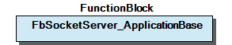 Graphical Interface of FbSocketServer_ApplicationBase Function Description This is a base class for deriving one’s own servers. It must not be used directly, but always as a parent class. One or more instances of that child class may be created and all attached to one server FB (FbTcpServer, see: WagoAppSocket). Each Child represents one possible simultaneous connection. These child objects hold the mere application specific functionality while framework operations, such as opening sockets, receiving packets, etc. are handled by the FbTcpServer. Context: That other server FB will notify these instances if a new connection from a new client is accepted or if new data is received for this instance. In these cases the NotifyXYZ() methods were called from the framework. The application is supposed to implement appropriate specific reactions to these events. The applications may use the suite of methods which are declared elsewhere as FbSocketServer_MethodsForApplication . These methods are all bequeathed in the FbSocketServer_ApplicationBase, so child classes can use them directly without further measures. They are clearly discernible by the prefix ‘prot’, while the others carry the prefixes ‘Notify’ or ‘Query’. These other methods with prefixes ‘Notify’ or ‘Query’ are not meant to be called by a child of FbSocketServer_ApplicationBase . They are called by the server framework and the FbSocketServer_ApplicationBase -children are supposed to have them overloaded in order to provide specific functionality. For this reason these methods are technically PUBLIC, although they are supposed to be accessed by strictly nothing apart from the server framework. Note: This Application base is formally derived from FbSocketServer_InstancedMethodsForApplication which is a direct child of FbSocketServer_MethodsForApplication but which is not documented for public use. This mediating class adds a reference to the server framework to the application base , which is necessary for the functions of FbSocketServer_MethodsForApplication , but which is not relevant to the public interface of the Application base Note: multiple server application FBs can be attached to a single server socket FB in order to handle multiple clients simultaneously. How To Use: 1. Notifications: These methods called NotifyXyz() are supposed to be overloaded by the application in order to implement the desired server behaviour. Depending on its functionality, however, not every single method has to be overloaded. 2. Queries: The method QueryCanReceiveData():UDINT must be overloaded by the application. It tells the framework how much data can be received by the application server. If not re-implemented, the server will not get any receive data. 3. MethodsForApplication: The child application server may use these ‘prot’-functions for communicating with the client. These calls will dispatch addresses and port numbers internally, so the application does not have to keep track of these details. 4. Keep-Alive: If keep-alive is necessary at the server side (and in which modes) depends very much on various circumstances. HTML-servers, for example, have their own standard for keeping alive. Thus, it is left to the application to implement the proper mechanisms which are appropriate for the desired protocol. The PROTECTED Method ‘NotifyService’ would be one hook which could be used for this purpose. - 12-Notifications NotifyAttachment (Method) - NotifyClose (Method) - NotifyDetachment (Method) - NotifyNewConnection (Method) - NotifyReceivedData (Method) - NotifyService (Method) 13-Queries - QueryReadyForReceiveData (Method) - QueryReceiveBufferLocation (Method)

## FbSocketServer_MethodsForApplication (FB)

This is a set of Methods and variables, which are intended to be used by FbSocketServerApplicationBase. Server classes could uses these methods from parent class.

Graphical Illustration

Graphical Interface of FbSocketServer_MethodsForApplication

Function Description

These functions do directly call corresponding functionalities in the FbSocketServer, which the derived application server is attached to. In that derived FB, however, one does not want to have to deal with pointers to embedding classes, so this job is done at this place without the user having to do anything.

Note: usually you would call this an ‘ interface ’, but CODESYS would not allow PROTECTED interfaces, so for technical reasons it is declared as FB.

Context: This class serves as base for two branches of derived classes:

a) Base for the connection instance (FbSocketServer_InstancedMethodsForApplication) where a reference to the server framework (‘slot’, providing the connection handle and others) is added in order to allow functions like ‘write()’ to be executed properly.

b) Base for the internal description structure (FbSocketServer_InstanceSlotBase, ‘slot’) where a reference to the connection instance is added, in order to execute the notifications from the server framework. Note : this derivation does NOT contain the reference to the server slot, as described in the previous paragraph, because it is part of the slot and needs no reference to it. Vice-versa, the previous derivation does not contain a reference to the connection instance, because that previous derivation is part of the connection instance and needs to reference to it.

Function This is a set of Methods and variables, which are intended to be used by FbSocketServerApplicationBase. Server classes could uses these methods from parent class. Graphical Illustration 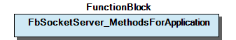 Graphical Interface of FbSocketServer_MethodsForApplication Function Description These functions do directly call corresponding functionalities in the FbSocketServer, which the derived application server is attached to. In that derived FB, however, one does not want to have to deal with pointers to embedding classes, so this job is done at this place without the user having to do anything. Note: usually you would call this an ‘ interface ’, but CODESYS would not allow PROTECTED interfaces, so for technical reasons it is declared as FB. Context: This class serves as base for two branches of derived classes: a) Base for the connection instance (FbSocketServer_InstancedMethodsForApplication) where a reference to the server framework (‘slot’, providing the connection handle and others) is added in order to allow functions like ‘write()’ to be executed properly. b) Base for the internal description structure (FbSocketServer_InstanceSlotBase, ‘slot’) where a reference to the connection instance is added, in order to execute the notifications from the server framework. Note : this derivation does NOT contain the reference to the server slot, as described in the previous paragraph, because it is part of the slot and needs no reference to it. Vice-versa, the previous derivation does not contain a reference to the connection instance, because that previous derivation is part of the connection instance and needs to reference to it. - 13-Main-Interface protAttachWriteBuffer (Method) - protGetOpState (Method) - protGetWriteCapacity (Method) - protWrite (Method) 14-Information-Retrieving - protGetConnectionAddr (Method) - protGetConnectionClientPort (Method) - protGetConnectionProtocol (Method) 15-Advanced - protActiveClose (Method) - protSendStandardKeepAlive (Method) - protSetResponseHeader (Method)

## doc10_general (FB)

This library provides base types for socket handling. This covers simple type definitions (‘types and helper for types’) as well as complex FB prototypes (‘Base Classes’).

Note: These prototypes cannot be implemented as standard Codesys-INTERFACEs for several reasons. One is that some of their members are PROTECTED, which is not allowed in INTERFACEs. Furthermore, in application code not all of the member methods need to be implemented - which is also not allowed in INTERFACEs.

The members of these prototype FBs (namely: ‘FbSocketServer_ApplicationBase’) do not carry real functionality.

They are meant to be overloaded. For the case that their functionality is not needed in derived FBs these method templates deliver a simple default return value, but they do not implement real functionality here.

This library provides base types for socket handling. This covers simple type definitions (‘types and helper for types’) as well as complex FB prototypes (‘Base Classes’). Note: These prototypes cannot be implemented as standard Codesys-INTERFACEs for several reasons. One is that some of their members are PROTECTED, which is not allowed in INTERFACEs. Furthermore, in application code not all of the member methods need to be implemented - which is also not allowed in INTERFACEs. The members of these prototype FBs (namely: ‘FbSocketServer_ApplicationBase’) do not carry real functionality. They are meant to be overloaded. For the case that their functionality is not needed in derived FBs these method templates deliver a simple default return value, but they do not implement real functionality here.

### Functions

## SocketProtocol_To_String (FUN)

| Scope | Name | Type | Comment |
| --- | --- | --- | --- |
| Return | SocketProtocol_To_String | STRING(8) |  |
| Input | eProtocol | eSocketProtocol | the protocol enumeration which is to be represented. |

This returns a string representation of the protocol type.

Graphical Illustration

Graphical Interface of SocketProtocol_To_String

Function Description

It returns ‘RAW’, ‘TCP/IP’, ‘UDP/IP’ for the established protocols and a mere number string for protokols which are unknown so far.

Note: This function might be expected to reside in WagoAppString rather than in a type definition library, but it is, instead, included here, because:

Interface variables Function This returns a string representation of the protocol type. Graphical Illustration 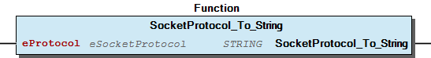 Graphical Interface of SocketProtocol_To_String Function Description It returns ‘RAW’, ‘TCP/IP’, ‘UDP/IP’ for the established protocols and a mere number string for protokols which are unknown so far. Note: This function might be expected to reside in WagoAppString rather than in a type definition library, but it is, instead, included here, because: - it is specific to the feature ‘Socket’ which might not exist generally on each controller; - it is closely related to the protocol type which is represented in this library and has to be kept strictly coherent to that definition; - it is quite trivial.

### Methods

## FbSocketServer_ApplicationBase.NotifyAttachment (METH)

| Scope | Name | Type |
| --- | --- | --- |
| Return | NotifyAttachment | eResultCode |

| result codes |
| OK (=0) | General acknowledge |
| other | Reserved for future specification |

This method notifies about attachment to a server framework.

Graphical Illustration

Graphical Interface of FbSocketServer_ApplicationBase.NotifyAttachment

Function Description

This method informs the application that it has been attached to the server framework. It may be used to cause initialization of the application FB. This method is supposed to respond with standardized result codes.

Note: In a contextual sense this method is a PROTECTED one, because it is intended for exclusive use from the framework and it is intended to be overwritten by the child class if this functionality is needed. In contrast to the semantics, this method had to be declared PUBLIC for technical reasons, because of the calling structure of the underlying framework.

Nevertheless: it SHOULD NOT be called from outside even though formally declared PUBLIC.

Interface variables Function This method notifies about attachment to a server framework. Graphical Illustration 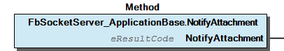 Graphical Interface of FbSocketServer_ApplicationBase.NotifyAttachment Function Description This method informs the application that it has been attached to the server framework. It may be used to cause initialization of the application FB. This method is supposed to respond with standardized result codes. Note: In a contextual sense this method is a PROTECTED one, because it is intended for exclusive use from the framework and it is intended to be overwritten by the child class if this functionality is needed. In contrast to the semantics, this method had to be declared PUBLIC for technical reasons, because of the calling structure of the underlying framework. Nevertheless: it SHOULD NOT be called from outside even though formally declared PUBLIC.

## FbSocketServer_ApplicationBase.NotifyClose (METH)

| Scope | Name | Type | Comment |
| --- | --- | --- | --- |
| Return | NotifyClose | eResultCode |  |
| Input | eReason | eResultCode | Reason for closing. |

| Reason codes |
| 0 | Regular closing |
| ECONNREFUSED | The application refused to communicate with the client. |
| ECONNABORTED | A special error condition in processing caused a termination of the connection. |
| ETIMEDOUT | Connection was idle for too long. |
| EOWNERDEAD | The socket framework has been closed. |

| Result codes |
| OK (=0) | General acknowledge |
| other | Reserved for future specifications |

This method notifies about closure of a connection.

Graphical Illustration

Graphical Interface of FbSocketServer_ApplicationBase.NotifyClose

Function Description

This method notifies the application that the client or the framework has closed the connection. It is supposed to return ‘0’. No other result codes are specified yet.

Note: In a contextual sense this method is a PROTECTED one, because it is intended for exclusive use from the framework and it is intended to be overwritten by the child class if this functionality is needed. In contrast to the semantics, this method had to be declared PUBLIC for technical reasons, because of the calling structure of the underlying framework.

Nevertheless: it SHOULD NOT be called from outside even though formally declared PUBLIC.

This method is supposed to respond with standardized result codes.

Interface variables Function This method notifies about closure of a connection. Graphical Illustration 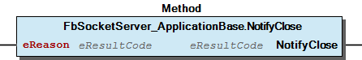 Graphical Interface of FbSocketServer_ApplicationBase.NotifyClose Function Description This method notifies the application that the client or the framework has closed the connection. It is supposed to return ‘0’. No other result codes are specified yet. Note: In a contextual sense this method is a PROTECTED one, because it is intended for exclusive use from the framework and it is intended to be overwritten by the child class if this functionality is needed. In contrast to the semantics, this method had to be declared PUBLIC for technical reasons, because of the calling structure of the underlying framework. Nevertheless: it SHOULD NOT be called from outside even though formally declared PUBLIC. This method is supposed to respond with standardized result codes.

## FbSocketServer_ApplicationBase.NotifyDetachment (METH)

| Scope | Name | Type |
| --- | --- | --- |
| Return | NotifyDetachment | eResultCode |

| Result codes |
| OK (=0) | General acknowledge |
| other | Reserved for future specification |

This method notifies about detachment from a server framework.

Graphical Illustration

Graphical Interface of FbSocketServer_ApplicationBase.NotifyDetachment

Function Description

This is called when the application base is detached from the server framework. (This normally happens only during the destruction of the framework and not in regular operation.)

This method is supposed to respond with standardized result codes.

Note: In a contextual sense THIS METHOD is a PROTECTED one, because it is intended for exclusive use from the framework and it is intended to be overwritten by the child class if this functionality is needed. In contrast to the semantics, this method had to be declared PUBLIC for technical reasons, because of the calling structure of the underlying framework.

Nevertheless: it SHOULD NOT be called from outside even though formally declared PUBLIC.

Interface variables Function This method notifies about detachment from a server framework. Graphical Illustration 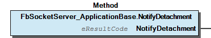 Graphical Interface of FbSocketServer_ApplicationBase.NotifyDetachment Function Description This is called when the application base is detached from the server framework. (This normally happens only during the destruction of the framework and not in regular operation.) This method is supposed to respond with standardized result codes. Note: In a contextual sense THIS METHOD is a PROTECTED one, because it is intended for exclusive use from the framework and it is intended to be overwritten by the child class if this functionality is needed. In contrast to the semantics, this method had to be declared PUBLIC for technical reasons, because of the calling structure of the underlying framework. Nevertheless: it SHOULD NOT be called from outside even though formally declared PUBLIC.

## FbSocketServer_ApplicationBase.NotifyNewConnection (METH)

| Scope | Name | Type | Comment |
| --- | --- | --- | --- |
| Return | NotifyNewConnection | eResultCode |  |
| Input | sAddress | IPAddressString | The address of the client |
| Input | wPort | WORD | The client’s local port number |

| Result codes |
| 0 | General acknowledge, ready for communication. |
| ECONNREFUSED | The connection is to be refused for some reason. |
| other | Reserved for future specification. |

This method notifies that a new connection was accepted.

Graphical Illustration

Graphical Interface of FbSocketServer_ApplicationBase.NotifyNewConnection

Function Description

This method is called from the framework when a new connection is accepted by this host. This method is supposed to respond with standardized result codes.

Note: In a contextual sense this method is a PROTECTED one, because it is intended for exclusive use from the framework and it is intended to be overwritten by the child class if this functionality is needed. In contrast to the semantics, this method had to be declared PUBLIC for technical reasons, because of the calling structure of the underlying framework.

Nevertheless: it SHOULD NOT be called from outside even though formally declared PUBLIC.

Interface variables Function This method notifies that a new connection was accepted. Graphical Illustration 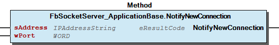 Graphical Interface of FbSocketServer_ApplicationBase.NotifyNewConnection Function Description This method is called from the framework when a new connection is accepted by this host. This method is supposed to respond with standardized result codes. Note: In a contextual sense this method is a PROTECTED one, because it is intended for exclusive use from the framework and it is intended to be overwritten by the child class if this functionality is needed. In contrast to the semantics, this method had to be declared PUBLIC for technical reasons, because of the calling structure of the underlying framework. Nevertheless: it SHOULD NOT be called from outside even though formally declared PUBLIC.

## FbSocketServer_ApplicationBase.NotifyReceivedData (METH)

| Scope | Name | Type | Comment |
| --- | --- | --- | --- |
| Return | NotifyReceivedData | eResultCode |  |
| Input | pData | POINTER TO BYTE | Location of the received data |
| Input | udiDataSize | UDINT | Number of bytes in this chunk |
| Input | pHeader | POINTER TO BYTE | Location of the header, 0 if not available. |

| Result codes |
| OK (=0) | Success, ready for communication. |
| EMSGSIZE | The application cannot process the data because it is too big. |
| EBUSY | The application cannot process the data because it is busy. |
| ENOSYS | There is no function provided for receiving data. |

This method notifies that new data was received.

Graphical Illustration

Graphical Interface of FbSocketServer_ApplicationBase.NotifyReceivedData

Function Description

This method passes received data to the application.

When receiving RAW data or UDP data, the header information is also passed to the application, if available. Note: although the length of the IP-header is implicitly contained in the header itself, the difference between data and header pointer gives another hint about the size of the header. For TCP connections, a NULL-Pointer is delivered here.

Note (2): Before passing data, the frame will already have asked the application with QueryReadyForReceiveData() about its ability to accept data, so the application is strongly expected to be able to handle the passed data. If it cannot, the data will be lost.

Note(3): The server application may also be notified that no bytes were received - this is a general standard for notifying the server that the client is still alive.

This method is supposed to respond with standardized result codes.

Note: In a contextual sense this method is a PROTECTED one, because it is intended for exclusive use from the framework and it is intended to be overwritten by the child class if this functionality is needed. In contrast to the semantics, this method had to be declared PUBLIC for technical reasons, because of the calling structure of the underlying framework.

Nevertheless: it SHOULD NOT be called from outside even though formally declared PUBLIC.

Interface variables Function This method notifies that new data was received. Graphical Illustration 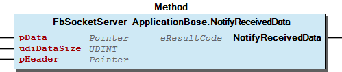 Graphical Interface of FbSocketServer_ApplicationBase.NotifyReceivedData Function Description This method passes received data to the application. When receiving RAW data or UDP data, the header information is also passed to the application, if available. Note: although the length of the IP-header is implicitly contained in the header itself, the difference between data and header pointer gives another hint about the size of the header. For TCP connections, a NULL-Pointer is delivered here. Note (2): Before passing data, the frame will already have asked the application with QueryReadyForReceiveData() about its ability to accept data, so the application is strongly expected to be able to handle the passed data. If it cannot, the data will be lost. Note(3): The server application may also be notified that no bytes were received - this is a general standard for notifying the server that the client is still alive. This method is supposed to respond with standardized result codes. Note: In a contextual sense this method is a PROTECTED one, because it is intended for exclusive use from the framework and it is intended to be overwritten by the child class if this functionality is needed. In contrast to the semantics, this method had to be declared PUBLIC for technical reasons, because of the calling structure of the underlying framework. Nevertheless: it SHOULD NOT be called from outside even though formally declared PUBLIC.

## FbSocketServer_ApplicationBase.NotifyService (METH)

| Scope | Name | Type |
| --- | --- | --- |
| Return | NotifyService | eResultCode |

| Result codes |
| OK (=0) | General acknowledge. |
| other | Reserved for future specification. |

This method provides a periodic call

Graphical Illustration

Graphical Interface of FbSocketServer_ApplicationBase.NotifyService

Function Description

This method will be called periodically from the framework in each cycle. Any procedure which is not driven by events but which needs cyclic processing should be placed here.

This method is supposed to respond with standardized result codes.

Note: In a contextual sense this method is a PROTECTED one, because it is intended for exclusive use from the framework and it is intended to be overwritten by the child class if this functionality is needed. In contrast to the semantics, this method had to be declared PUBLIC for technical reasons, because of the calling structure of the underlying framework.

Nevertheless: it SHOULD NOT be called from outside even though formally declared PUBLIC.

Interface variables Function This method provides a periodic call Graphical Illustration 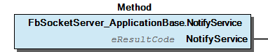 Graphical Interface of FbSocketServer_ApplicationBase.NotifyService Function Description This method will be called periodically from the framework in each cycle. Any procedure which is not driven by events but which needs cyclic processing should be placed here. This method is supposed to respond with standardized result codes. Note: In a contextual sense this method is a PROTECTED one, because it is intended for exclusive use from the framework and it is intended to be overwritten by the child class if this functionality is needed. In contrast to the semantics, this method had to be declared PUBLIC for technical reasons, because of the calling structure of the underlying framework. Nevertheless: it SHOULD NOT be called from outside even though formally declared PUBLIC.

## FbSocketServer_ApplicationBase.QueryReadyForReceiveData (METH)

| Scope | Name | Type |
| --- | --- | --- |
| Return | QueryReadyForReceiveData | UDINT |

This method queries the maximum size of the data to be received.

Graphical Illustration

Graphical Interface of FbSocketServer_ApplicationBase.QueryReadyForReceiveData

Function Description

Tells the framework if the FB is ready to receive data and how many bytes it can accept in one chunk.

This method must be implemented by the application, as otherwise the application will not get any data.

While the application is occupied with other business, it should return ‘0’.

Note: In a contextual sense this method is a PROTECTED one, because it is intended for exclusive use from the framework and it is intended to be overwritten by the child class if this functionality is needed. In contrast to the semantics, this method had to be declared PUBLIC for technical reasons, because of the calling structure of the underlying framework.

Interface variables Function This method queries the maximum size of the data to be received. Graphical Illustration 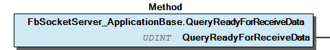 Graphical Interface of FbSocketServer_ApplicationBase.QueryReadyForReceiveData Function Description Tells the framework if the FB is ready to receive data and how many bytes it can accept in one chunk. This method must be implemented by the application, as otherwise the application will not get any data. While the application is occupied with other business, it should return ‘0’. Note: In a contextual sense this method is a PROTECTED one, because it is intended for exclusive use from the framework and it is intended to be overwritten by the child class if this functionality is needed. In contrast to the semantics, this method had to be declared PUBLIC for technical reasons, because of the calling structure of the underlying framework.

## FbSocketServer_ApplicationBase.QueryReceiveBufferLocation (METH)

| Scope | Name | Type |
| --- | --- | --- |
| Return | QueryReceiveBufferLocation | POINTER TO BYTE |

This method queries the internal buffer location of the child server.

Graphical Illustration

Graphical Interface of FbSocketServer_ApplicationBase.QueryReceiveBufferLocation

Function Description

By this method the framework asks the implementation about the location of its receive buffer. If the implementation does not provide a receive buffer, 0 is to be returned.

This information allows the framework to directly pass data to the serving FB instead of performing multiple copy operations.

Note: In a contextual sense this method is a PROTECTED one, because it is intended for exclusive use from the framework and it is intended to be overwritten by the child class if this functionality is needed. In contrast to the semantics, this method had to be declared PUBLIC for technical reasons, because of the calling structure of the underlying framework.

Interface variables Function This method queries the internal buffer location of the child server. Graphical Illustration 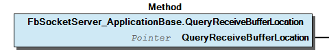 Graphical Interface of FbSocketServer_ApplicationBase.QueryReceiveBufferLocation Function Description By this method the framework asks the implementation about the location of its receive buffer. If the implementation does not provide a receive buffer, 0 is to be returned. This information allows the framework to directly pass data to the serving FB instead of performing multiple copy operations. Note: In a contextual sense this method is a PROTECTED one, because it is intended for exclusive use from the framework and it is intended to be overwritten by the child class if this functionality is needed. In contrast to the semantics, this method had to be declared PUBLIC for technical reasons, because of the calling structure of the underlying framework.

## FbSocketServer_MethodsForApplication.protActiveClose (METH)

| Scope | Name | Type |
| --- | --- | --- |
| Return | protActiveClose | eResultCode |

| FbSocketServer_MethodsForApplication.protActiveClose(FUN) - Interface |
| Name | Access | Type | Semantics |
| (none) | Return | eResultCode | success (=0) or error cause |

Graphical Illustration

Graphical Interface of FbSocketServer_MethodsForApplication.protActiveClose

As a return result code, we do not expect other than ‘OK’.

Interface variables Graphical Illustration 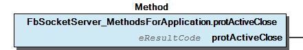 Graphical Interface of FbSocketServer_MethodsForApplication.protActiveClose As a return result code, we do not expect other than ‘OK’.

## FbSocketServer_MethodsForApplication.protAttachWriteBuffer (METH)

| Scope | Name | Type | Comment |
| --- | --- | --- | --- |
| Return | protAttachWriteBuffer | eResultCode |  |
| Input | pTxBuffer | POINTER TO BYTE | Location of external buffer space |
| Input | udiTXBufferSize | UDINT | Size of the external buffer |

| result codes |
| 0 | success, ready for communication. |
| EINVAL | Invalid parameters (size beyond plausibility). |
| EFBIG | New buffer is too small for data which is already contained in the previous buffer. |

Notifies the framework about write buffer

Graphical Illustration

Graphical Interface of FbSocketServer_MethodsForApplication.protAttachWriteBuffer

Function Description

With this call, the serving FB may tell the framework about internal buffers on the serving FB side for write data. This may accelerate the transfer if lots of small write() calls are expected. The server framework will collect this data in that buffer until it is finally sent.

Note: Although this space is provided from the application FB, the application must not make any assumptions about the internal structure of this space. This data space is used in a proprietary way by the framework.

Interface variables Notifies the framework about write buffer Graphical Illustration 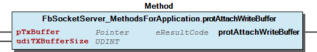 Graphical Interface of FbSocketServer_MethodsForApplication.protAttachWriteBuffer Function Description With this call, the serving FB may tell the framework about internal buffers on the serving FB side for write data. This may accelerate the transfer if lots of small write() calls are expected. The server framework will collect this data in that buffer until it is finally sent. Note: Although this space is provided from the application FB, the application must not make any assumptions about the internal structure of this space. This data space is used in a proprietary way by the framework.

## FbSocketServer_MethodsForApplication.protGetConnectionAddr (METH)

| Scope | Name | Type |
| --- | --- | --- |
| Return | protGetConnectionAddr | IpAddressString |

This asks the frame Server FB about the client’s identity

Graphical Illustration

Graphical Interface of FbSocketServer_MethodsForApplication.protGetConnectionAddr

Function Description

(May not be implemented for all protocols, returns empty string if information is not available.)

Interface variables This asks the frame Server FB about the client’s identity Graphical Illustration 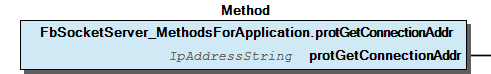 Graphical Interface of FbSocketServer_MethodsForApplication.protGetConnectionAddr Function Description (May not be implemented for all protocols, returns empty string if information is not available.)

## FbSocketServer_MethodsForApplication.protGetConnectionClientPort (METH)

| Scope | Name | Type |
| --- | --- | --- |
| Return | protGetConnectionClientPort | WORD |

Asks the frame Server FB about the client’s local port number

Graphical Illustration

Graphical Interface of FbSocketServer_MethodsForApplication.protGetConnectionClientPort

Function Description

(May not be implemented for all protocols, returns zero if information is not available.)

Interface variables Asks the frame Server FB about the client’s local port number Graphical Illustration 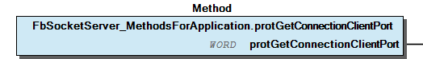 Graphical Interface of FbSocketServer_MethodsForApplication.protGetConnectionClientPort Function Description (May not be implemented for all protocols, returns zero if information is not available.)

## FbSocketServer_MethodsForApplication.protGetConnectionProtocol (METH)

| Scope | Name | Type |
| --- | --- | --- |
| Return | protGetConnectionProtocol | eSocketProtocol |

This asks the frame Server FB about the protocol type of the server.

Graphical Illustration

Graphical Interface of FbSocketServer_MethodsForApplication.protGetConnectionProtocol

Function Description

Interface variables Function This asks the frame Server FB about the protocol type of the server. Graphical Illustration 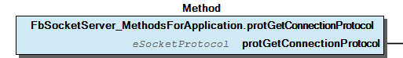 Graphical Interface of FbSocketServer_MethodsForApplication.protGetConnectionProtocol Function Description

## FbSocketServer_MethodsForApplication.protGetOpState (METH)

| Scope | Name | Type |
| --- | --- | --- |
| Return | protGetOpState | eSocketOpState |

This asks the framework about the actual connection state of this instance.

Graphical Illustration

Graphical Interface of FbSocketServer_MethodsForApplication.protGetOpState

Function Description

Note: regularly, most ‘notify…()’-methods were either called only for attached and connected server instances or they signalize themself a disabled connection state so this state query is redundant for these cases.

But when derived instances are extended not only to react on notifications but also to external stimuli, it is convenient to have this status without the need to carefully trace the notifications.

Interface variables This asks the framework about the actual connection state of this instance. Graphical Illustration 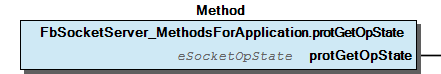 Graphical Interface of FbSocketServer_MethodsForApplication.protGetOpState Function Description Note: regularly, most ‘notify…()’-methods were either called only for attached and connected server instances or they signalize themself a disabled connection state so this state query is redundant for these cases. But when derived instances are extended not only to react on notifications but also to external stimuli, it is convenient to have this status without the need to carefully trace the notifications.

## FbSocketServer_MethodsForApplication.protGetWriteCapacity (METH)

| Scope | Name | Type |
| --- | --- | --- |
| Return | protGetWriteCapacity | DINT |

Asks the frame Server FB how many bytes of write data it can strore into the buffer at the moment.

Graphical Illustration

Graphical Interface of FbSocketServer_MethodsForApplication.protGetWriteCapacity

Function Description

If the frame server responds 0, no data can be buffered, so that the memory space which is passed with the write()-call will be logically locked until the data is finally processed. If it reports -1, then previously passed data space is still occupied.

Interface variables Asks the frame Server FB how many bytes of write data it can strore into the buffer at the moment. Graphical Illustration 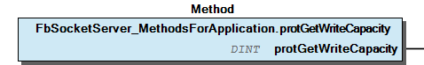 Graphical Interface of FbSocketServer_MethodsForApplication.protGetWriteCapacity Function Description If the frame server responds 0, no data can be buffered, so that the memory space which is passed with the write()-call will be logically locked until the data is finally processed. If it reports -1, then previously passed data space is still occupied.

## FbSocketServer_MethodsForApplication.protSendStandardKeepAlive (METH)

| Scope | Name | Type |
| --- | --- | --- |
| Return | protSendStandardKeepAlive | eResultCode |

a standard keep-alive-packet is to be sent to the client

Graphical Illustration

Graphical Interface of FbSocketServer_MethodsForApplication.protSendStandardKeepAlive

Function Description

Interface variables a standard keep-alive-packet is to be sent to the client Graphical Illustration 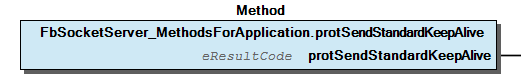 Graphical Interface of FbSocketServer_MethodsForApplication.protSendStandardKeepAlive Function Description

## FbSocketServer_MethodsForApplication.protSetResponseHeader (METH)

| Scope | Name | Type | Comment |
| --- | --- | --- | --- |
| Return | protSetResponseHeader | eResultCode |  |
| Input | pData | POINTER TO BYTE | The location of the data |
| Input | udiNData | UDINT | Number of bytes to send |

| result codes |
| 0 | success, ready for new communication. |
| ENOSYS | header data will be ignored for current protocol type |

Sets up Header Information for the next protWrite.

Graphical Illustration

Graphical Interface of FbSocketServer_MethodsForApplication.protSetResponseHeader

Function Description

This information may be ignored for certain RAW protocol implementations. It will certainly be ignored for TCP and UDP.

Interface variables Sets up Header Information for the next protWrite. Graphical Illustration 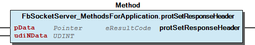 Graphical Interface of FbSocketServer_MethodsForApplication.protSetResponseHeader Function Description This information may be ignored for certain RAW protocol implementations. It will certainly be ignored for TCP and UDP.

## FbSocketServer_MethodsForApplication.protWrite (METH)

| Scope | Name | Type | Comment |
| --- | --- | --- | --- |
| Return | protWrite | eResultCode |  |
| Input | pTxBuffer | POINTER TO BYTE | The location of the data |
| Input | udiTxBufferSize | UDINT | Number of bytes to send |

| result codes |
| 0 | success, ready for new communication. |
| EBADF | socket is not open (This schould be a programming error.) |
| EINPROGRESS | success, data are pending to be written |
| EBUSY | Actual data is ignored because there is previous data to be written. |
| EMSGSIZE | data chunk is too large (esp.: size limit for UDP) |
| EPIPE | the stream was closed on serverside |
| EACCES | other problem while writing data |

Writes data from the Server to the Client.

Graphical Illustration

Graphical Interface of FbSocketServer_MethodsForApplication.protWrite

Function Description

Attn: The Data in the databuffer must not be altered until we have the acknowledge that it has finally been sent.

Interface variables Writes data from the Server to the Client. Graphical Illustration 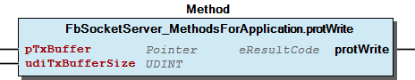 Graphical Interface of FbSocketServer_MethodsForApplication.protWrite Function Description Attn: The Data in the databuffer must not be altered until we have the acknowledge that it has finally been sent.

### Base Components

## 21 Base Classes

- 90 Internal Inheritance Base FbSocketServer_MethodsForApplication (FunctionBlock) 13-Main-Interface protAttachWriteBuffer (Method) - protGetOpState (Method) - protGetWriteCapacity (Method) - protWrite (Method) 14-Information-Retrieving - protGetConnectionAddr (Method) - protGetConnectionClientPort (Method) - protGetConnectionProtocol (Method) 15-Advanced - protActiveClose (Method) - protSendStandardKeepAlive (Method) - protSetResponseHeader (Method) FbSocketServer_ApplicationBase (FunctionBlock) - 12-Notifications NotifyAttachment (Method) - NotifyClose (Method) - NotifyDetachment (Method) - NotifyNewConnection (Method) - NotifyReceivedData (Method) - NotifyService (Method) 13-Queries - QueryReadyForReceiveData (Method) - QueryReceiveBufferLocation (Method)

### Main Interfaces

## 13 Main Interface

- protAttachWriteBuffer (Method) - protGetOpState (Method) - protGetWriteCapacity (Method) - protWrite (Method)

### Internal Components

## 90 Internal Inheritance Base

- FbSocketServer_MethodsForApplication (FunctionBlock) 13-Main-Interface protAttachWriteBuffer (Method) - protGetOpState (Method) - protGetWriteCapacity (Method) - protWrite (Method) 14-Information-Retrieving - protGetConnectionAddr (Method) - protGetConnectionClientPort (Method) - protGetConnectionProtocol (Method) 15-Advanced - protActiveClose (Method) - protSendStandardKeepAlive (Method) - protSetResponseHeader (Method)

### Global Variable Lists

| Name | Type |
| --- | --- |
| Info | ProjectInfo |

| date | version | author | change |
| 14.03.2023 | 1.5.3.1 | WAGO / u010663 | Remove license info |
| 08.01.2019 | 1.5.3.0 | u015842 | Properties: free placeholder added |
| 22.06.2018 | 1.5.2.1 | WAGO / u013972 | Change images for the documentation |
| 28.10.2015 | 1.5.2.0 | WAGO / u013972 | Resolve WagoTypesCommon as Placeholder |
| 23.09.2015 | 1.5.1.0 | WAGO / u013972 | Workaround for C0351-Bug |
| 03.07.2015 | 1.5.0.0 | WAGO / u013972 | Release Version |

WagoTypesSocket

### Other Components

## 12 Notifications

Notifications are automatically called by the server framework and notify the specific serving FB about certain events.

They are meant to be overloaded by the child FBs and left as they are when not needed. When left unmodified, they have no effect.

Notifications are automatically called by the server framework and notify the specific serving FB about certain events. They are meant to be overloaded by the child FBs and left as they are when not needed. When left unmodified, they have no effect. - NotifyAttachment (Method) - NotifyClose (Method) - NotifyDetachment (Method) - NotifyNewConnection (Method) - NotifyReceivedData (Method) - NotifyService (Method)

## 13 Queries

Queries SHOULD be implemented by the specific application. They tell the server framework about the actual capabilities of the child FB. For typical applications this is important for smooth operation.

Queries SHOULD be implemented by the specific application. They tell the server framework about the actual capabilities of the child FB. For typical applications this is important for smooth operation. - QueryReadyForReceiveData (Method) - QueryReceiveBufferLocation (Method)

## 14 Information Retrieving

- protGetConnectionAddr (Method) - protGetConnectionClientPort (Method) - protGetConnectionProtocol (Method)

## 15 Advanced

- protActiveClose (Method) - protSendStandardKeepAlive (Method) - protSetResponseHeader (Method)

## 20 Basic Types

| Name | Initial | Comment |
| --- | --- | --- |
| unattached | 0 | No valid socket. |
| idle |  | A Handle is present, but not connected. |
| blocked_for_connecting |  | Connecting is expected soon. |
| connecting |  | Connection in progress but not established. |
| connected |  | Connection established. Data transfer may take place. |
| readonly |  | Shutting down, may only read, but not write. |
| writeonly |  | Shutting down, may only write, but not read. |
| broken |  | Both directions not operable. |
| blocked_for_closing |  | Closing is expected soon. |
| closing |  | Closing in progress. |
| listening |  | Ready to accept new connections. (server sockets) |
| timedout |  | Broken communication pipe due to time out. |
| busy |  | Not ready for activity due to other reason. |

| Name | Initial | Comment |
| --- | --- | --- |
| RAW | 0 | equivalent to SOCK_RAW |
| UDP | 1 | equivalent to SOCK_UDP |
| TCP | 2 | equivalent to SOCK_STREAM |
| NONE |  | unspecified |

| Name | Type | Comment |
| --- | --- | --- |
| xEnable | BOOL | Switches keep-alive mechanism on or off. |
| tMaxIdleTime | TIME | Maximum time of inactivity before first keep-alive packet is sent. |
| tInterval | TIME | Interval between two successive KA-Packets if no reply is received. |
| udiProbes | UDINT | Number of KA transmissions before declaring the connection ‘dead’. |
| xUpdatePending | BOOL | Send these Parameters on next occasion (internal use). |

This is a String just big enough to hold any network address or MAC address, e.g. ‘127.0.0.1’ or ‘2001:0db8:85a3:08d3:1319:8a2e:0370:7344’ or ‘12-34-56-78-9A-BC’.

This is not meant to carry plain names for DNS resolution.

eSocketOpState represents the operation state of a socket FB.

Function Description

This state is intended to be presented publicly to the user of the FB as well as to be used for internal purposes. The States have the following meaning:

The FB is in this state after initialisation. The FB has not allocated any resources and it is not ready for operation. This state will be left by an Open[…]() call. After Close(), the FB is in this state again.

Regular data transfer may take place. The FB has allocated system resources and is connected to its transport endpoint. Note: This label is also used for UDP-sockets (which are by definition connection-less). In that case it might rather be called ‘operable’. However: the general definition of ‘connected’ in both contexts is: The FB is ready for data transfer.

The connection is in the state of beeing shut down. Only unidirectional data transfer may take place.

The FB is listening for incoming connections (TCP-only). No data transfer is possible unless the FB has accepted the connection.

There are, furthermore, other transient states. All of them mean to the user: ‘no data transfer possible’:

The FB is in the state of connecting its target - which may take some time. The FB will automatically transit either to connected or to unattached after this process is completed.

The FB is in the process of closing the socket, which may take some time if pending data is to be sent. The FB will automatically transit to unattached after this process.

Finally, there are some other states:

The connection is broken (e.g. because the peer has sent FIN packets, or due to other reasons). The FB at the APP-layer will react to this state by executing a Close() so the FB will transit into the state ‘unattached’ afterwards.

The connection is timed out because of too much time without traffic or because of failing keep-alive. The FB at the APP-layer will react to this state by executing a Close() so the FB will transit into the state ‘unattached’ afterwards.

The resources are allocated, but no connection is established. (This is not used in present implementations. Technically this would be an open() without a following connect().)

The FB is temporarily not operable.

(This is not used in present implementations. The reasons for being busy are thus not further specified. Note: The implemented states blocked_for_connecting and blocked_for_closing are quite comparable to this busy state. In contrast, their reason for being busy is well-specified.

This enumeration denotes different protocols which can be used on a socket FB.

This structure holds parameters for the Keep-Alive (‘KA’) functionality.

Function Description

This structure contains the parameters which are used for the Keep-Alive feature, which is available for some Socket FBs. It does not represent the closely related raw firmware type directly, but is rather adapted to the IEC-context.

- IpAddressString (Alias) - SocketProtocol_To_String (Function) - eSocketOpState (Enum) - eSocketProtocol (Enum) - typKeepAliveParameter (Struct) Function This is a String just big enough to hold any network address or MAC address, e.g. ‘127.0.0.1’ or ‘2001:0db8:85a3:08d3:1319:8a2e:0370:7344’ or ‘12-34-56-78-9A-BC’. Note This is not meant to carry plain names for DNS resolution. InOut: Function eSocketOpState represents the operation state of a socket FB. Function Description This state is intended to be presented publicly to the user of the FB as well as to be used for internal purposes. The States have the following meaning: unattached : The FB is in this state after initialisation. The FB has not allocated any resources and it is not ready for operation. This state will be left by an Open[…]() call. After Close(), the FB is in this state again. connected : Regular data transfer may take place. The FB has allocated system resources and is connected to its transport endpoint. Note: This label is also used for UDP-sockets (which are by definition connection-less). In that case it might rather be called ‘operable’. However: the general definition of ‘connected’ in both contexts is: The FB is ready for data transfer. readonly, writeonly : The connection is in the state of beeing shut down. Only unidirectional data transfer may take place. listening : The FB is listening for incoming connections (TCP-only). No data transfer is possible unless the FB has accepted the connection. There are, furthermore, other transient states. All of them mean to the user: ‘no data transfer possible’: connecting, blocked_for_connecting : The FB is in the state of connecting its target - which may take some time. The FB will automatically transit either to connected or to unattached after this process is completed. closing, blocked_for_closing : The FB is in the process of closing the socket, which may take some time if pending data is to be sent. The FB will automatically transit to unattached after this process. Finally, there are some other states: broken : The connection is broken (e.g. because the peer has sent FIN packets, or due to other reasons). The FB at the APP-layer will react to this state by executing a Close() so the FB will transit into the state ‘unattached’ afterwards. timedout : The connection is timed out because of too much time without traffic or because of failing keep-alive. The FB at the APP-layer will react to this state by executing a Close() so the FB will transit into the state ‘unattached’ afterwards. idle : The resources are allocated, but no connection is established. (This is not used in present implementations. Technically this would be an open() without a following connect().) busy : The FB is temporarily not operable. (This is not used in present implementations. The reasons for being busy are thus not further specified. Note: The implemented states blocked_for_connecting and blocked_for_closing are quite comparable to this busy state. In contrast, their reason for being busy is well-specified. InOut: Function This enumeration denotes different protocols which can be used on a socket FB. InOut: Function This structure holds parameters for the Keep-Alive (‘KA’) functionality. Function Description This structure contains the parameters which are used for the Keep-Alive feature, which is available for some Socket FBs. It does not represent the closely related raw firmware type directly, but is rather adapted to the IEC-context.