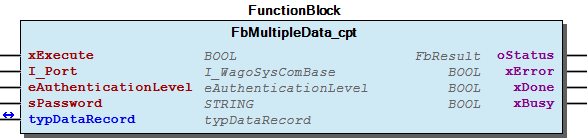
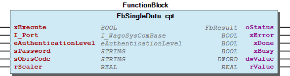

# WagoAppDLMS v1.0.0.3 (WAGO) - Complete Documentation

## 📋 Library Information

- **Company:** WAGO
- **Title:** WagoAppDLMS
- **Version:** 1.0.0.3
- **Categories:** Application; WAGO LayerView|App; WAGO BusinessView|Energy Automation; WAGO FunctionalView|Connectivity
- **Namespace:** WagoAppDLMS
- **Author:** WAGO / u0125824
- **Placeholder:** WagoAppDLMS

### Description ¶

This document is automatically generated.

This library is for

This document is automatically generated. This library is for - Smart Meter connection based on DLMS

### Contents: ¶

Contents: - Documentation Index 10 Documentation - WagoAppDLMS Library Documentation Project Information Library Information Function Blocks - FbMultipleData_cpt (FB) - FbSingleData_cpt (FB) - doc01_Foreword (FB) Program Organization Global Variable Lists - Status (GVL) - VersionHistory (GVL) Other Components - 10 Compact - 29 Types - 80 Status - ParameterList (PARAMS) - eAuthenticationLevel (ENUM) - eStatus (ENUM) - typDataRecord (STRUCT) - typOBIS (STRUCT)

### Indices and tables ¶

Based on WagoAppDLMS.library, last modified 29.05.2024, 20:32:19. LibDoc 3.5.16.10

© WAGO GmbH & Co. KG, Germany 2018 – All rights reserved. For the avoidance of doubt, this copyright notice does not only apply to the information above but also and primarily to the described library itself. Please note that third-party products are always mentioned without reference to intellectual property rights, including patents, utility models, designs and trademarks, accordingly the existence of such rights cannot be excluded. WAGO is a registered trademark of WAGO Verwaltungsgesellschaft mbH.

- File and Project Information - Library Reference Based on WagoAppDLMS.library, last modified 29.05.2024, 20:32:19. LibDoc 3.5.16.10 © WAGO GmbH & Co. KG, Germany 2018 – All rights reserved. For the avoidance of doubt, this copyright notice does not only apply to the information above but also and primarily to the described library itself. Please note that third-party products are always mentioned without reference to intellectual property rights, including patents, utility models, designs and trademarks, accordingly the existence of such rights cannot be excluded. WAGO is a registered trademark of WAGO Verwaltungsgesellschaft mbH.

### Documentation Index

## 10 Documentation

To ensure fast installation and start-up of the units, we strongly recommend that the following information and explanations are carefully read and adhered to.

To ensure fast installation and start-up of the units, we strongly recommend that the following information and explanations are carefully read and adhered to. - doc01_Foreword (FB)

## WagoAppDLMS Library Documentation

| Company: | WAGO |
| Title: | WagoAppDLMS |
| Version: | 1.0.0.3 |
| Categories: | Application; WAGO LayerView\|App; WAGO BusinessView\|Energy Automation; WAGO FunctionalView\|Connectivity |
| Namespace: | WagoAppDLMS |
| Author: | WAGO / u0125824 |
| Placeholder: | WagoAppDLMS |

### Description

This document is automatically generated.

This library is for

This document is automatically generated. This library is for - Smart Meter connection based on DLMS

### Contents:

- 10 Documentation doc01_Foreword (FB) 20 Program Organization Units - 10 Compact 29 Types - eAuthenticationLevel (ENUM) - typDataRecord (STRUCT) - typOBIS (STRUCT) 80 Status - Status (GVL) - eStatus (ENUM) ParameterList (PARAMS) VersionHistory (GVL)

### Indices and tables

Based on WagoAppDLMS.library, last modified 29.05.2024, 20:32:19. LibDoc 3.5.16.10

© WAGO GmbH & Co. KG, Germany 2018 – All rights reserved. For the avoidance of doubt, this copyright notice does not only apply to the information above but also and primarily to the described library itself. Please note that third-party products are always mentioned without reference to intellectual property rights, including patents, utility models, designs and trademarks, accordingly the existence of such rights cannot be excluded. WAGO is a registered trademark of WAGO Verwaltungsgesellschaft mbH.

- File and Project Information - Library Reference Based on WagoAppDLMS.library, last modified 29.05.2024, 20:32:19. LibDoc 3.5.16.10 © WAGO GmbH & Co. KG, Germany 2018 – All rights reserved. For the avoidance of doubt, this copyright notice does not only apply to the information above but also and primarily to the described library itself. Please note that third-party products are always mentioned without reference to intellectual property rights, including patents, utility models, designs and trademarks, accordingly the existence of such rights cannot be excluded. WAGO is a registered trademark of WAGO Verwaltungsgesellschaft mbH.

### Project Information

## File and Project Information

| Scope | Name | Type | Content |
| --- | --- | --- | --- |
| FileHeader | libraryFile | string | WagoAppDLMS.library |
| contentFile | doc.clean.json |
| productName | e!COCKPIT |
| creationDateTime | date | 29.05.2024, 20:32:19 |
| companyName | string | WAGO |
| ProjectInformation | LastModificationDateTime | date | 29.05.2024, 20:32:19 |
| Description | string | See: Description |
| Copyright | © WAGO Kontakttechnik GmbH & Co. KG, Germany 2021 – All rights reserved. |
| Author | WAGO / u0125824 |
| AutoResolveUnbound | bool | True |
| Placeholder | string | WagoAppDLMS |
| Company | WAGO |
| DocFormat | reStructuredText |
| Project | WagoAppDLMS |
| DefaultNamespace | WagoAppDLMS |
| Version | version | 1.0.0.3 |
| Title | string | WagoAppDLMS |
| LibraryCategories | library-category-list | Application; WAGO LayerView\|App; WAGO BusinessView\|Energy Automation; WAGO FunctionalView\|Connectivity |
| CompiledLibraryCompatibilityVersion | string | CODESYS V3.5 SP16 Patch 3 |
| IsEndUserLibrary | bool | False |

### Library Information

## Library Reference

| LinkAllContent: False QualifiedOnly: False | SystemLibrary: False | Optional: False |

| LinkAllContent: False QualifiedOnly: False | SystemLibrary: False | Optional: False |

| LinkAllContent: False QualifiedOnly: False | SystemLibrary: False | Optional: False |

| LinkAllContent: False QualifiedOnly: False | SystemLibrary: False | Optional: False |

| LinkAllContent: False QualifiedOnly: False | SystemLibrary: False | Optional: False |

| LinkAllContent: False QualifiedOnly: False | SystemLibrary: False | Optional: False |

| LinkAllContent: False Optional: False | QualifiedOnly: False SystemLibrary: False | PublishSymbolsInContainer: True |

This is a dictionary of all referenced libraries and their name spaces.

This is a dictionary of all referenced libraries and their name spaces. Standard Library Identification : Placeholder: Standard Default Resolution: Standard, * (System) Namespace: Standard Library Properties : WagoAppCom Library Identification : Placeholder: WagoAppCom Default Resolution: WagoAppCom, * (WAGO) Namespace: WagoAppCom Library Properties : WagoSysBehaviourModels Library Identification : Placeholder: WagoSysBehaviourModels Default Resolution: WagoSysBehaviourModels, * (WAGO) Namespace: WagoSysBehaviourModels Library Properties : WagoSysErrorBase Library Identification : Placeholder: WagoSysErrorBase Default Resolution: WagoSysErrorBase, * (WAGO) Namespace: WagoSysErrorBase Library Properties : Library Parameter : Parameter: RES_LOG_MAX_FILESIZE = 2000 Parameter: RES_LOG_MAX_FILES = 1 Parameter: RES_LOG_MAX_ENTRIES = 200 Parameter: RES_LOG_NAME = ‘WagoAppResultLogger’ WagoSysVersion Library Identification : Name: WagoSysVersion Version: 1.0.0.0 Company: WAGO Namespace: WagoSysVersion Library Properties : WagoTypesCom Library Identification : Placeholder: WagoTypesCom Default Resolution: WagoTypesCom, * (WAGO) Namespace: WagoTypesCom Library Properties : WagoTypesCommon Library Identification : Placeholder: WagoTypesCommon Default Resolution: WagoTypesCommon, * (WAGO) Namespace: WagoTypes Library Properties :

### Function Blocks

## FbMultipleData_cpt (FB)

| Scope | Name | Type | Comment | Inherited from |
| --- | --- | --- | --- | --- |
| Output | oStatus | FbResult | Status object (see WagoSysErrorBase). | FbBehaviourModel_oStatus_Base |
| Input | xExecute | BOOL | Triggers the execution of the action. | FbBehaviourModel_WagoAppExecute |
| Output | xError | BOOL | Indicates that an error has occurred. | FbBehaviourModel_WagoAppExecute |
| xDone | BOOL | Successful completion of the action. | FbBehaviourModel_WagoAppExecute |
| xBusy | BOOL | Action is still in progress. | FbBehaviourModel_WagoAppExecute |
| Input | I_Port | WagoTypesCom.I_WagoSysComBase | Serial Port for communication, e. g. name of 750-652 module or physical port on controller | FbDlmsBase |
| eAuthenticationLevel | eAuthenticationLevel | Authentication level for the smart meter communication - (0: NONE; 1: LOW; 2: HIGH) | FbDlmsBase |
| sPassword | STRING(255) | Password required for the low or high authentication level | FbDlmsBase |
| Inout | typDataRecord | typDataRecord | InOut for the data record of the obis register |  |

Graphical Illustration

Graphical Interface of FbMultipleData_cpt

Function Description

Interface variables Function This is a serial communication FB with compact -type interface for use with intelligent power meters in graphical languages. It is used to read the standard output data from the meter. Graphical Illustration  Graphical Interface of FbMultipleData_cpt Function Description This Fb implements the whole communication for reading the standard value list with code and value.

## FbSingleData_cpt (FB)

| Scope | Name | Type | Comment | Inherited from |
| --- | --- | --- | --- | --- |
| Output | oStatus | FbResult | Status object (see WagoSysErrorBase). | FbBehaviourModel_oStatus_Base |
| Input | xExecute | BOOL | Triggers the execution of the action. | FbBehaviourModel_WagoAppExecute |
| Output | xError | BOOL | Indicates that an error has occurred. | FbBehaviourModel_WagoAppExecute |
| xDone | BOOL | Successful completion of the action. | FbBehaviourModel_WagoAppExecute |
| xBusy | BOOL | Action is still in progress. | FbBehaviourModel_WagoAppExecute |
| Input | I_Port | WagoTypesCom.I_WagoSysComBase | Serial Port for communication, e. g. name of 750-652 module or physical port on controller | FbDlmsBase |
| eAuthenticationLevel | eAuthenticationLevel | Authentication level for the smart meter communication - (0: NONE; 1: LOW; 2: HIGH) | FbDlmsBase |
| sPassword | STRING(255) | Password required for the low or high authentication level | FbDlmsBase |
| sObisCode | STRING(80) | Input for the OBIS-Code of the data register - eg. ‘1.0.12.7.0.255’ for ‘Voltage - any phase Inst. value’ |  |
| rScaler | REAL | Input for a scaler - dwValue x rScaler = rValue |  |
| Output | dwValue | DWORD | Raw value of the OBIS-Register |  |
| rValue | REAL | Scaled value |  |

This is a serial communication FB with compact -type interface for use with intelligent power meters in graphical languages. It is used to read a single data record from the meter.

Graphical Illustration

Graphical Interface of FbSingleData_cpt

Function Description

This Fb implements the whole communication for reading a single OBIS-Datarecord with code and value.

Interface variables Function This is a serial communication FB with compact -type interface for use with intelligent power meters in graphical languages. It is used to read a single data record from the meter. Graphical Illustration  Graphical Interface of FbSingleData_cpt Function Description This Fb implements the whole communication for reading a single OBIS-Datarecord with code and value.

## doc01_Foreword (FB)

This document, including all figures and illustrations contained therein, is subject to copyright. Any use of this document that infringes upon the copyright provisions stipulated herein is prohibited. Reproduction, translation, electronic and phototechnical filing/archiving (e.g., photocopying), as well as any amendments require the written consent of WAGO Kontakttechnik GmbH & Co. KG, Minden, Germany. Non-observance will entail the right of claims for damages.

WAGO Kontakttechnik GmbH & Co. KG reserves the right to make any alterations or modifications that serve to increase the efficiency of technical progress. WAGO Kontakttechnik GmbH & Co. KG owns all rights arising from granting patents or from the legal protection of utility patents. Third-party products are always mentioned without any reference to patent rights. Thus, the existence of such rights cannot be excluded.

Personnel Qualification

The use of the product described in this document is exclusively geared to specialists having qualifications in PLC programming, electrical specialists or persons instructed by electrical specialists who are also familiar with the appropriate current standards. WAGO Kontakttechnik GmbH & Co. KG assumes no liability resulting from improper action and damage to WAGO products and third-party products due to non-observance of the information contained in this document.

Intended Use

For each individual application, the components are supplied from the factory with a dedicated hardware and software configuration. Modifications are only admitted within the framework of the possibilities documented in this document. All other changes to the hardware and/or software and the non-conforming use of the components entail the exclusion of liability on part of WAGO Kontakttechnik GmbH & Co. KG.

Please direct any requirements pertaining to a modified and/or new hardware or software configuration directly to WAGO Kontakttechnik GmbH & Co. KG.

Scope of Applicability

This application note is based on the stated hardware and software from the specific manufacturer, as well as the associated documentation. This application note is therefore only valid for the described installation. New hardware and software versions may need to be handled differently.

Please note the detailed description in the specific manuals.

Copyright This document, including all figures and illustrations contained therein, is subject to copyright. Any use of this document that infringes upon the copyright provisions stipulated herein is prohibited. Reproduction, translation, electronic and phototechnical filing/archiving (e.g., photocopying), as well as any amendments require the written consent of WAGO Kontakttechnik GmbH & Co. KG, Minden, Germany. Non-observance will entail the right of claims for damages. WAGO Kontakttechnik GmbH & Co. KG reserves the right to make any alterations or modifications that serve to increase the efficiency of technical progress. WAGO Kontakttechnik GmbH & Co. KG owns all rights arising from granting patents or from the legal protection of utility patents. Third-party products are always mentioned without any reference to patent rights. Thus, the existence of such rights cannot be excluded. Personnel Qualification The use of the product described in this document is exclusively geared to specialists having qualifications in PLC programming, electrical specialists or persons instructed by electrical specialists who are also familiar with the appropriate current standards. WAGO Kontakttechnik GmbH & Co. KG assumes no liability resulting from improper action and damage to WAGO products and third-party products due to non-observance of the information contained in this document. Intended Use For each individual application, the components are supplied from the factory with a dedicated hardware and software configuration. Modifications are only admitted within the framework of the possibilities documented in this document. All other changes to the hardware and/or software and the non-conforming use of the components entail the exclusion of liability on part of WAGO Kontakttechnik GmbH & Co. KG. Please direct any requirements pertaining to a modified and/or new hardware or software configuration directly to WAGO Kontakttechnik GmbH & Co. KG. Scope of Applicability This application note is based on the stated hardware and software from the specific manufacturer, as well as the associated documentation. This application note is therefore only valid for the described installation. New hardware and software versions may need to be handled differently. Please note the detailed description in the specific manuals.

### Program Organization

## 20 Program Organization Units

- 10 Compact FbMultipleData_cpt (FB) - FbSingleData_cpt (FB)

### Global Variable Lists

## Status (GVL)

| Scope | Name | Type |
| --- | --- | --- |
| Constant | STATUS_ITEM | ARRAY [0..4] OF WagoTypesErrorBase.typResultItem |

| Value | Level | Description |
| --- | --- | --- |
| eStatus.OK | WagoTypesErrorBase.WagoTypes.eSeverity.none | ‘OK’ |
| eStatus.ESERIALCONNECT | WagoTypesErrorBase.WagoTypes.eSeverity.error | ‘Timeout: Connect to serial interface’ |
| eStatus.ESERIALREAD | WagoTypesErrorBase.WagoTypes.eSeverity.error | ‘Timeout: Message receive’ |
| eStatus.ESERIALWRITE | WagoTypesErrorBase.WagoTypes.eSeverity.error | ‘Timeout: Message write’ |
| eStatus.EVALUE | WagoTypesErrorBase.WagoTypes.eSeverity.error | ‘Unknown datatype’ |

## VersionHistory (GVL)

| Name | Type |
| --- | --- |
| Info | ProjectInfo |

| date | version | author | change |
| 11.08.2023 | 1.0.0.3 | u0125824 | Set compiler settings to use 32 & 64 bit |
| 07.02.2023 | 1.0.0.2 | u0125824 | Bugfix decrypt DWORD |
| 30.04.2021 | 1.0.0.1 | u0100282 | Bugfix - Documentation |
| 28.09.2020 | 1.0.0.0 | u0100282 | Release - Update - Rename Fb (FbDataRecord -> FbMultipleData) |
| 17.08.2020 | 0.0.0.3 | u0100282 | Update - Serial parameters now internal variables |

WagoAppDLMS.library

Release Notes: Library WagoAppDLMS init.

WagoAppDLMS.library Release Notes: Library WagoAppDLMS init.

### Other Components

## 10 Compact

- FbMultipleData_cpt (FB) - FbSingleData_cpt (FB)

## 29 Types

- eAuthenticationLevel (ENUM) - typDataRecord (STRUCT) - typOBIS (STRUCT)

## 80 Status ¶

- Status (GVL) - eStatus (ENUM)

## ParameterList (PARAMS)

| Scope | Name | Type | Initial | Comment |
| --- | --- | --- | --- | --- |
| Constant | MAX_DATA_LENGTH | UINT | 254 | Maximum payload length (Message without initial identification, end identification and frame chech sum) |
| MAX_MESSAGE_LENGTH | UINT | 258 | Maximum message length (Payload + 4 Bytes) |
| TIMEOUT | TIME | TIME#5s0ms | Timeout for communication |
| RECONNECTION_ATTEMPTS | UINT | 1 | automatic reconnection attepts after a timeout |
| MAX_DATA_RECORD_SIZE | UINT | 9 | Number of data registers in data record type |

Attributes: qualified_only InOut:

## eAuthenticationLevel (ENUM)

| Name | Initial |
| --- | --- |
| NONE | 0 |
| LOW | 1 |
| HIGH | 2 |

## eStatus (ENUM)

| Name | Initial | Comment |
| --- | --- | --- |
| OK | 0 | no error |
| ESERIALCONNECT | 1 | Timeout: Connect to serial interface |
| ESERIALREAD | 2 | Timeout: Message receive |
| ESERIALWRITE | 3 | Timeout: Message write |
| EVALUE | 4 | Unknown DataType / Unknown Value |

This is a data type for the possible errors of the DLMS - Library.

InOut: Function This is a data type for the possible errors of the DLMS - Library.

## typDataRecord (STRUCT)

| Name | Type |
| --- | --- |
| aDataRecord | ARRAY [0..ParameterList.MAX_DATA_RECORD_SIZE] OF typOBIS |

## typOBIS (STRUCT)

| Name | Type | Comment |
| --- | --- | --- |
| sObisCode | STRING(80) | Register object logical name |
| sDescription | STRING(80) | Register object description |
| sUnit | STRING(80) | Register object unit |
| dwValue | DWORD | Raw value |
| rScaler | REAL | Scaler for value |
| rValue | REAL | Scaled value |